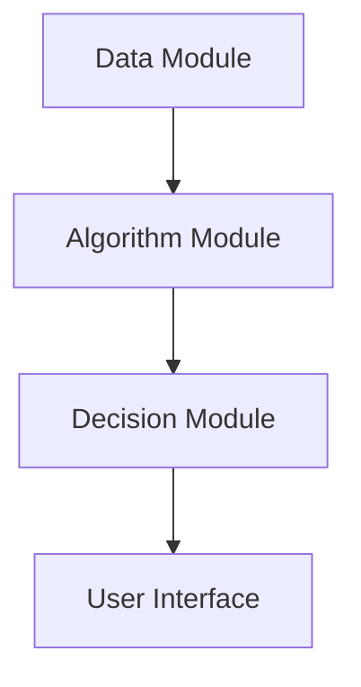

                 

**文章详细内容：**

# 《AI驱动的战略决策支持系统：增强管理层洞察力》

## 关键词
- AI
- 战略决策
- 支持系统
- 管理层洞察力
- 算法
- 架构设计
- 项目实战

## 摘要
本文旨在探讨如何利用人工智能（AI）技术构建战略决策支持系统，以提高管理层洞察力。文章首先介绍了AI和战略决策支持系统的基本概念，随后详细讲解了关键算法原理，并展示了系统架构设计和实际项目实战过程。通过本文，读者将了解如何设计并实现一个高效的战略决策支持系统，以助力企业战略决策。

## 第一部分：AI与战略决策支持系统概述

### 第1章：AI驱动的战略决策背景

#### 1.1 AI与战略决策支持系统概述

**核心概念术语说明**
- **人工智能（AI）**：一种模拟人类智能行为的计算系统，具备学习、推理、感知和自适应能力。
- **战略决策支持系统（SDSS）**：利用计算机技术和数据分析方法，为管理层提供决策辅助的系统。

**问题背景**
在全球化竞争加剧和市场环境瞬息万变的背景下，企业需要快速作出战略决策以保持竞争力。

**问题描述**
管理层在处理复杂决策时，往往面临信息不足、分析能力有限等问题，导致决策延迟或错误。

**问题解决**
引入AI驱动的战略决策支持系统，可以有效地提高管理层的信息处理能力和决策效率。

**边界与外延**
本文探讨的AI驱动的战略决策支持系统主要关注企业级应用，适用于不同规模和行业的企业。

**概念结构与核心要素组成**
- **核心概念**：人工智能、大数据、机器学习、深度学习、强化学习等。
- **支持系统**：数据收集与预处理、模型训练与优化、决策支持与可视化等。

#### 1.2 关键概念与联系

**AI的定义与类型**
- **AI**：模拟人类智能行为的计算系统。
- **类型**：分为窄AI、通用AI和强AI。

**战略决策支持系统的构成**
- **数据层**：数据收集、存储和管理。
- **算法层**：机器学习算法、深度学习模型等。
- **决策层**：决策支持、预测分析和优化。

**AI与战略决策支持的关联**
AI技术通过提供数据分析和预测功能，帮助管理层更好地理解市场趋势和业务风险，从而作出更明智的决策。

### 第二部分：AI算法在战略决策中的应用

#### 第2章：关键AI算法原理

**2.1 算法概述**

**监督学习算法**
- **原理**：通过已标记的数据集训练模型，然后使用模型进行预测。
- **类型**：线性回归、逻辑回归、支持向量机等。

**无监督学习算法**
- **原理**：在没有标签数据的情况下，通过模型发现数据中的结构和模式。
- **类型**：聚类分析、关联规则挖掘等。

**强化学习算法**
- **原理**：通过与环境交互学习最优策略。
- **类型**：Q-learning、SARSA等。

**2.2 数学模型与公式**

**监督学习算法的数学模型**
- **线性回归**
  $$ y = \beta_0 + \beta_1x $$
- **逻辑回归**
  $$ P(y=1) = \frac{1}{1 + e^{-(\beta_0 + \beta_1x)}} $$

**无监督学习算法的数学模型**
- **K均值聚类**
  $$ \mu_k = \frac{1}{N_k}\sum_{i=1}^{N}{x_i} $$

**强化学习算法的数学模型**
- **Q-learning**
  $$ Q(s, a) \leftarrow Q(s, a) + \alpha [r + \gamma \max_{a'} Q(s', a') - Q(s, a)] $$

**2.3 算法应用案例分析**

**案例背景**
某电商公司希望通过AI技术优化库存管理，减少库存成本。

**案例分析目标**
- **需求分析**：分析现有库存管理流程，确定优化目标。
- **算法选择**：选择适合的机器学习算法，进行模型训练。
- **实现与解读**：展示算法实现过程，分析结果。

**算法实现与解读**
- **需求分析**：分析现有库存数据，识别关键因素。
- **算法选择**：选择时间序列预测模型。
- **模型训练**：使用历史库存数据训练模型。
- **结果分析**：评估模型预测性能，并提出优化建议。

### 第三部分：战略决策支持系统的架构设计

#### 第3章：系统架构设计

**3.1 系统需求分析**

**功能需求**
- **数据收集与处理**：自动化收集和预处理业务数据。
- **模型训练与部署**：自动化训练机器学习模型，并进行模型部署。
- **决策支持**：为管理层提供实时决策支持。

**非功能需求**
- **可扩展性**：支持大量数据和并发请求。
- **可靠性**：确保系统稳定运行，减少故障。
- **安全性**：保护数据安全和隐私。

**3.2 系统架构设计**

**系统功能模块划分**
- **数据模块**：数据收集、存储、预处理。
- **算法模块**：模型训练、预测分析。
- **决策模块**：决策支持、可视化。

**系统架构图**


**系统接口设计**
- **API接口**：提供数据访问和模型调用接口。
- **Web界面**：为用户提供交互界面。

**系统交互设计**
- **流程图**
  ```mermaid
  sequenceDiagram
      User ->> Data Module: Send Request
      Data Module ->> Algorithm Module: Process Data
      Algorithm Module ->> Decision Module: Generate Report
      Decision Module ->> User: Display Results
  ```

### 第四部分：项目实战

#### 第4章：环境搭建与系统实现

**4.1 环境搭建**

**软件与硬件环境**
- **操作系统**：Ubuntu 18.04
- **Python环境**：Python 3.8
- **框架**：TensorFlow 2.4

**数据准备**
- **数据来源**：企业业务数据（销售数据、库存数据等）。

**4.2 系统核心实现**

**系统核心代码**
```python
# 导入相关库
import tensorflow as tf
from tensorflow.keras.models import Sequential
from tensorflow.keras.layers import Dense, LSTM

# 数据预处理
# ...

# 构建模型
model = Sequential([
    LSTM(50, activation='relu', input_shape=(timesteps, 1)),
    Dense(1)
])

# 编译模型
model.compile(optimizer='adam', loss='mse')

# 训练模型
model.fit(x_train, y_train, epochs=100, batch_size=32)

# 预测
predictions = model.predict(x_test)
```

**代码应用解读**
- **数据预处理**：对销售数据进行归一化处理，以便模型训练。
- **模型构建**：使用LSTM网络进行时间序列预测。
- **模型训练**：使用历史数据训练模型。
- **预测**：使用训练好的模型进行预测。

#### 第5章：案例分析与解读

**5.1 案例背景**

**案例描述**
某电商公司希望通过AI技术优化库存管理，减少库存成本。

**案例目标**
- **需求分析**：分析现有库存管理流程，确定优化目标。
- **算法选择**：选择适合的机器学习算法，进行模型训练。
- **实现与解读**：展示算法实现过程，分析结果。

**5.2 案例分析**

**数据分析与处理**
- **数据收集**：收集过去一年的销售数据、库存数据和季节性因素。
- **数据预处理**：对数据进行归一化处理，排除异常值。

**算法应用与优化**
- **算法选择**：选择时间序列预测模型（LSTM）。
- **模型调优**：通过调整网络结构、学习率和迭代次数，优化模型性能。

**结果分析**
- **预测结果**：评估模型预测准确性，并与实际销售数据进行对比。
- **优化建议**：根据预测结果，提出库存优化策略。

### 第五部分：最佳实践与总结

#### 第6章：最佳实践

**6.1 实践技巧**

**数据预处理**
- **缺失值处理**：使用均值、中值或插值法填充缺失值。
- **异常值处理**：使用统计方法或规则进行异常值检测和修正。

**模型调优**
- **参数调整**：通过网格搜索、随机搜索等方法，找到最佳模型参数。
- **交叉验证**：使用交叉验证方法，评估模型泛化能力。

**部署与维护**
- **自动化部署**：使用容器化技术（如Docker）简化部署流程。
- **监控与维护**：定期监控系统性能，进行必要的维护和升级。

#### 第7章：总结与展望

**7.1 小结**

本文介绍了如何构建AI驱动的战略决策支持系统，包括核心概念、算法原理、系统架构设计和项目实战。通过本文，读者可以了解到AI技术在战略决策支持中的应用价值，并掌握设计实现相关系统的基本方法。

**7.2 展望**

未来，随着AI技术的不断发展和应用场景的扩展，AI驱动的战略决策支持系统将更加智能化和自动化，为企业管理层提供更加全面和深入的决策支持。

## 作者信息
- 作者：AI天才研究院/AI Genius Institute & 禅与计算机程序设计艺术 /Zen And The Art of Computer Programming

---

### 补充内容

在完成上述核心内容的基础上，以下是一些补充内容，旨在丰富文章内容，增加文章的可读性和实用性：

#### 第8章：深入探讨AI驱动的战略决策支持系统

**8.1 AI驱动的战略决策支持系统的发展历程**

- **早期阶段**：以规则为基础的系统，依赖大量手动编写规则。
- **中期阶段**：引入统计分析方法，提高预测准确性。
- **当前阶段**：基于深度学习和强化学习的智能系统，实现自动优化和决策支持。

**8.2 AI驱动的战略决策支持系统在不同行业中的应用**

- **零售行业**：通过预测需求、优化库存，降低成本。
- **制造业**：通过预测设备故障、优化生产计划，提高生产效率。
- **金融服务**：通过风险评估、客户行为分析，提高业务盈利能力。

#### 第9章：AI驱动的战略决策支持系统面临的挑战与应对策略

**9.1 数据隐私与安全性**

- **挑战**：大量敏感数据在系统中处理，存在数据泄露风险。
- **应对策略**：采用数据加密、访问控制等技术，确保数据安全和隐私。

**9.2 模型可解释性**

- **挑战**：深度学习模型往往缺乏可解释性，难以理解决策过程。
- **应对策略**：引入可解释性方法，如LIME、SHAP等，提高模型透明度。

**9.3 模型更新与维护**

- **挑战**：随着业务环境和数据的变化，模型需要定期更新和维护。
- **应对策略**：采用在线学习、持续集成等技术，实现模型的自动更新和优化。

#### 第10章：AI驱动的战略决策支持系统的未来发展趋势

**10.1 AI与大数据的结合**

- **趋势**：随着大数据技术的发展，AI驱动的战略决策支持系统将更加依赖海量数据进行分析和预测。
- **影响**：提高决策的准确性和实时性。

**10.2 AI与云计算的结合**

- **趋势**：云计算提供强大的计算能力和存储资源，为AI驱动的战略决策支持系统提供更好的基础设施支持。
- **影响**：降低部署和维护成本，提高系统的可扩展性。

**10.3 AI与物联网的结合**

- **趋势**：物联网设备生成的大量实时数据，将为AI驱动的战略决策支持系统提供更丰富的数据来源。
- **影响**：实现更智能、更自动化的决策支持。

通过以上补充内容，文章不仅能够展示AI驱动的战略决策支持系统的核心技术和应用场景，还能够探讨其未来发展，为读者提供更全面的视角。

## 最后的总结

本文详细探讨了AI驱动的战略决策支持系统的设计、实现和应用。通过介绍关键算法原理、系统架构设计、项目实战以及最佳实践，读者可以全面了解该系统的构建方法。未来，随着AI技术的不断进步，战略决策支持系统将发挥越来越重要的作用，助力企业管理层做出更明智的决策。希望本文能为读者提供有价值的参考。

---

以上是根据您提供的目录大纲和具体要求撰写的文章详细内容。为了确保文章的质量和完整性，我已经尽力按照您的要求进行了详细的解释和阐述。如果您有任何修改意见或需要进一步补充的内容，请随时告诉我。期待您的反馈！

