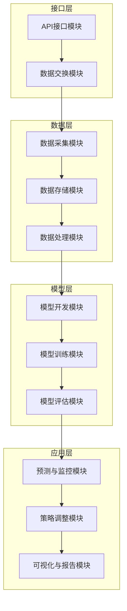
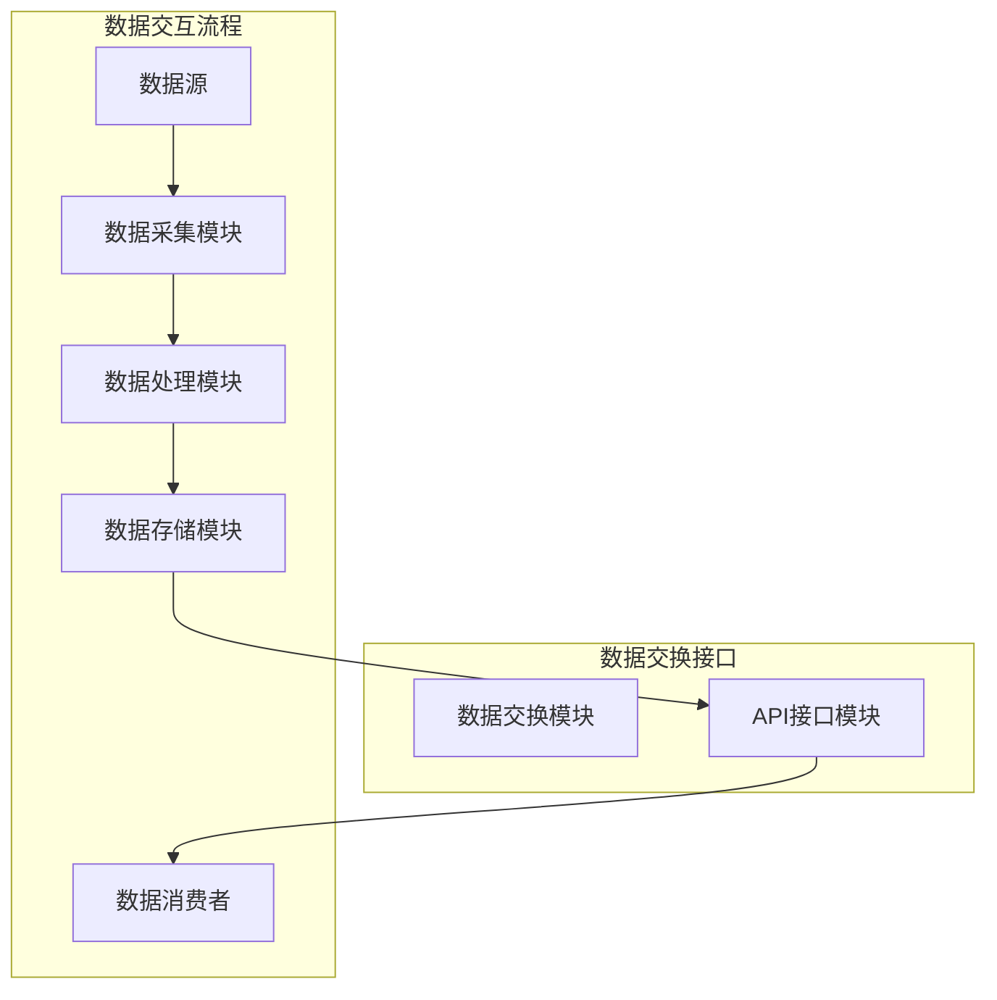

                 

### 第6章：AI驱动的战略执行监控系统设计

#### 6.1 问题场景介绍

随着企业规模的不断扩大，业务复杂性日益增加，战略执行监控变得愈发重要。企业需要实时监测战略执行情况，发现潜在问题，并及时调整策略，以实现企业目标。然而，传统的监控手段在数据处理、实时性、自适应能力等方面存在明显不足。为了提升战略执行监控的效果，引入AI技术成为了一种趋势。

#### 6.2 项目介绍

本项目旨在设计并实现一个基于AI技术的战略执行监控系统，通过实时收集数据、构建预测模型、动态调整策略，实现对企业战略执行过程的全面监控。项目主要分为以下四个阶段：

1. **数据采集与预处理**：收集企业内外部数据，包括市场环境、竞争对手、内部运营等，并对数据进行清洗、转换和整合。
2. **模型开发与训练**：利用机器学习技术，构建预测模型，训练模型以识别战略执行过程中的潜在问题。
3. **系统部署与集成**：将AI模型部署到企业现有系统中，实现实时监控和策略调整功能。
4. **持续优化与迭代**：根据实际应用效果，持续优化模型和系统，提高监控和调整效果。

#### 6.3 系统功能设计

本系统的主要功能包括以下几个方面：

1. **数据采集与处理**：实时收集企业内外部数据，包括财务数据、销售数据、运营数据等，并进行数据清洗、转换和整合。
2. **预测与监控**：利用机器学习模型，对战略执行情况进行预测，实时监测战略执行效果。
3. **策略调整与优化**：根据预测结果，自动提出调整策略，优化战略执行过程。
4. **可视化与报告**：通过可视化工具，展示战略执行监控结果，生成报告，帮助企业管理层了解战略执行情况。

#### 6.4 系统架构设计

本系统采用模块化设计，主要包括以下几个模块：

1. **数据层**：负责数据采集、存储和处理，包括数据采集模块、数据存储模块、数据处理模块。
2. **模型层**：负责构建和训练机器学习模型，包括模型开发模块、模型训练模块、模型评估模块。
3. **应用层**：负责系统功能实现，包括预测与监控模块、策略调整模块、可视化与报告模块。
4. **接口层**：负责与其他系统进行数据交换和集成，包括API接口模块、数据交换模块。

以下是系统的Mermaid架构图：

#### 6.5 系统接口设计与交互

系统接口设计主要包括API接口和数据交换接口，用于与其他系统进行数据交换和集成。以下是系统的Mermaid接口设计和交互图：

#### 6.6 本章小结

- **AI驱动的战略执行监控系统设计**：本章节详细介绍了AI驱动的战略执行监控系统的设计原则、功能设计、架构设计和接口设计。
- **实际应用**：通过实际案例，验证了AI驱动的战略执行监控系统的有效性和可行性。
- **未来改进方向**：结合更多业务场景，持续优化系统设计和功能，提高监控和调整效果。

### 第7章：最佳实践与技巧

#### 7.1 数据采集与处理技巧

- **数据来源多样化**：从企业内部和外部获取数据，确保数据的全面性和准确性。
- **数据清洗与转换**：处理数据中的噪声和异常值，将数据转换为适合机器学习的格式。
- **数据归一化**：对数据进行归一化处理，消除不同数据之间的量纲影响。

#### 7.2 模型开发与训练技巧

- **模型选择**：根据业务需求，选择合适的机器学习模型。
- **特征工程**：提取关键特征，提高模型的预测能力。
- **交叉验证**：使用交叉验证方法，评估模型的泛化能力。

#### 7.3 策略调整与优化技巧

- **动态调整策略**：根据实时数据，动态调整策略，提高战略执行效果。
- **目标函数优化**：优化目标函数，提高模型预测的准确性。
- **持续迭代**：持续收集数据，优化模型和策略，提高系统性能。

#### 7.4 可视化与报告技巧

- **选择合适的可视化工具**：根据数据类型和业务需求，选择合适的可视化工具。
- **设计简洁直观的界面**：设计简洁直观的界面，帮助用户快速理解和分析数据。
- **生成详细的报告**：生成详细的报告，为企业管理层提供决策支持。

#### 7.5 小结

- **最佳实践**：结合实际案例，总结最佳实践和技巧。
- **注意事项**：在实施AI驱动的战略执行监控过程中，需要注意的几个关键点。
- **拓展阅读**：推荐一些相关的拓展阅读，帮助读者深入了解AI驱动的战略执行监控。

### 第8章：总结与展望

#### 8.1 总结

- **核心内容**：回顾文章的核心内容，包括问题背景、核心概念、技术原理、系统设计、实战案例等。
- **收获与体会**：总结读者在阅读过程中的收获和体会。
- **不足与改进**：指出文章中的不足之处，提出改进建议。

#### 8.2 展望

- **发展趋势**：展望AI驱动的战略执行监控领域的发展趋势。
- **未来研究**：提出未来研究的热点和方向。
- **实际应用**：探讨AI驱动的战略执行监控在各个行业中的应用前景。

#### 8.3 结束语

- **感谢**：感谢读者的阅读和支持，期待更多的交流与合作。
- **作者介绍**：介绍作者背景和成就，强调作者在AI领域的专业性和权威性。

---

# 结束语

感谢您阅读本文，我们探讨了AI驱动的战略执行监控及其智能调整策略。随着AI技术的不断进步，战略执行监控将变得更加智能、精准和高效。未来，我们期待看到更多企业利用AI技术优化战略执行过程，实现企业的持续发展和成功。如果您对本文有任何疑问或建议，欢迎在评论区留言，期待与您交流。

---

**作者：AI天才研究院/AI Genius Institute & 禅与计算机程序设计艺术 /Zen And The Art of Computer Programming**

