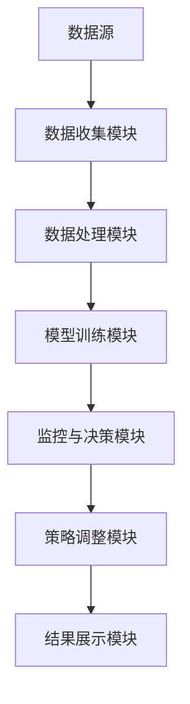
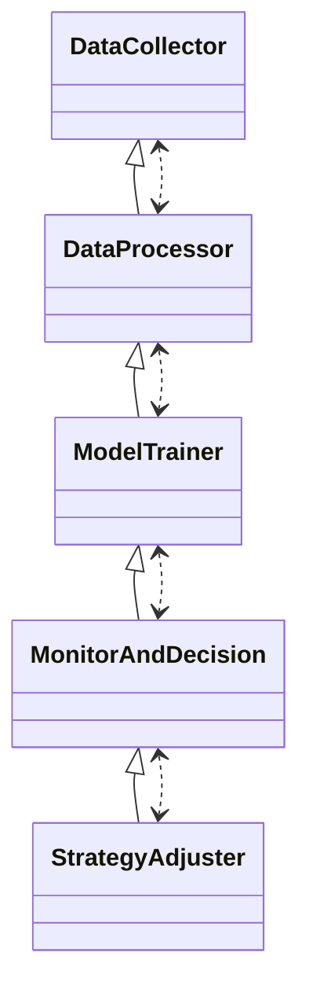
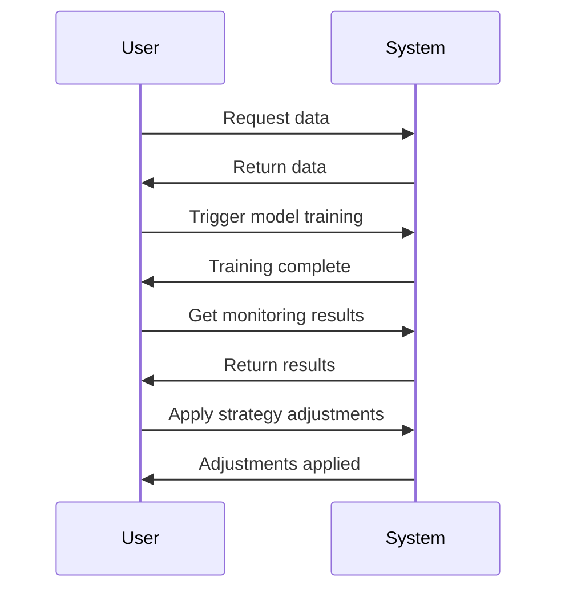
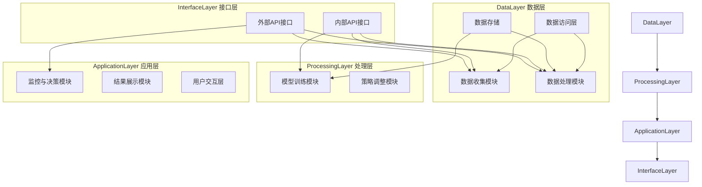
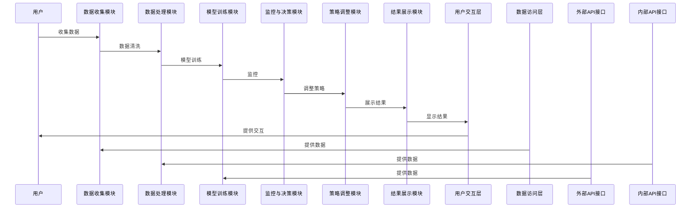

                 


### 一、背景介绍

#### 1.1 问题背景

在当今高度复杂和快速变化的企业环境中，如何确保战略执行的有效性和效率成为了许多企业面临的重大挑战。传统的战略执行监控方法往往依赖于手动监控和人工干预，不仅效率低下，而且难以适应复杂多变的市场环境。随着人工智能（AI）技术的发展，利用AI驱动的战略执行监控成为了一种新的趋势。AI驱动的战略执行监控通过自动化数据收集、分析和决策，能够显著提高监控的精确性和效率，从而为企业提供更加可靠的决策支持。

#### 1.2 核心概念定义与联系

##### 1.2.1 AI驱动的战略执行监控

AI驱动的战略执行监控是指利用人工智能技术，对企业的战略执行过程进行实时监控、分析和反馈。这种方法包括数据收集、数据处理、模型训练和决策支持等多个环节，能够自动化地发现战略执行中的问题，并提出相应的调整策略。

##### 1.2.2 智能跟踪与调整策略

智能跟踪与调整策略是指通过建立智能模型，对战略执行过程中的关键指标进行实时跟踪，并根据分析结果自动调整执行策略。这种方法的核心在于利用机器学习算法，从历史数据中学习并预测潜在的问题，从而提前采取应对措施。

#### 1.3 概念属性特征对比

为了更好地理解AI驱动的战略执行监控和智能跟踪与调整策略，下面列出了这两个概念的一些关键属性特征，并进行了对比：

| 特征                 | AI驱动的战略执行监控                   | 智能跟踪与调整策略                  |
|----------------------|-----------------------------------------|-------------------------------------|
| 监控对象             | 整体战略执行过程                       | 关键执行指标和潜在问题               |
| 数据处理方式         | 自动化数据收集和分析                   | 机器学习算法和模型预测               |
| 决策支持             | 实时提供决策建议                       | 根据分析结果自动调整执行策略         |
| 效率与效果           | 提高监控效率，降低人工干预成本         | 提高战略执行的准确性和及时性         |

#### 1.4 边界与外延

虽然AI驱动的战略执行监控和智能跟踪与调整策略具有显著的优势，但它们的边界也需要明确。首先，这些方法依赖于高质量的数据和先进的算法，因此在数据质量和算法实现上存在一定的局限性。其次，它们需要企业在战略规划和执行过程中具备一定的技术能力和数据支持。

在AI驱动的战略执行监控和智能跟踪与调整策略的背景下，企业不仅需要关注技术实现，还应该关注战略规划的合理性和执行过程的透明度。只有这样，才能真正发挥AI技术的作用，实现战略执行的高效和精准。

### 二、AI驱动的战略执行监控原理

#### 2.1 数据收集

AI驱动的战略执行监控首先需要收集大量的战略执行数据。这些数据可以来源于企业的各个业务系统，如财务系统、销售系统、人力资源系统等。数据收集的方式可以是自动化的API接口调用，也可以是手动数据录入。

以下是一个简单的Python代码示例，用于从财务系统中收集数据：

```python
import requests

def collect_financial_data(api_url):
    response = requests.get(api_url)
    if response.status_code == 200:
        data = response.json()
        return data
    else:
        return None

api_url = "https://finance.system.com/api/financial_data"
financial_data = collect_financial_data(api_url)
```

#### 2.2 数据处理

收集到的数据通常包含噪声和不完整信息，因此需要进行预处理。数据处理包括数据清洗、数据整合和数据标准化等步骤。

以下是一个简单的Python代码示例，用于清洗和整合财务数据：

```python
import pandas as pd

def preprocess_financial_data(data):
    df = pd.DataFrame(data)
    df.dropna(inplace=True)  # 删除缺失值
    df['date'] = pd.to_datetime(df['date'])  # 转换日期格式
    df.sort_values(by='date', inplace=True)  # 按日期排序
    return df

financial_data_preprocessed = preprocess_financial_data(financial_data)
```

#### 2.3 模型训练

在数据处理完成后，需要利用历史数据来训练机器学习模型。这些模型可以用于预测战略执行过程中可能出现的问题，并提供建议。

以下是一个简单的Python代码示例，用于训练一个线性回归模型：

```python
from sklearn.linear_model import LinearRegression
import numpy as np

def train_linear_regression_model(X, y):
    model = LinearRegression()
    model.fit(X, y)
    return model

X = np.array([1, 2, 3, 4, 5])
y = np.array([2, 4, 5, 4, 5])
model = train_linear_regression_model(X, y)
```

#### 2.4 决策支持

训练好的模型可以用于实时监控战略执行过程，并根据预测结果提供建议。以下是一个简单的Python代码示例，用于使用训练好的模型进行预测：

```python
def predict_and_recommend(model, new_data):
    prediction = model.predict(new_data)
    if prediction > threshold:
        return "增加投入"
    else:
        return "减少投入"

new_data = np.array([6])
recommendation = predict_and_recommend(model, new_data)
print(recommendation)
```

通过上述步骤，AI驱动的战略执行监控可以为企业提供实时、准确的决策支持，帮助企业实现战略目标。

### 三、智能跟踪与调整策略原理

#### 3.1 智能跟踪

智能跟踪是指利用机器学习算法对战略执行过程中的关键指标进行实时监测，以发现潜在的问题和异常。这个过程包括数据收集、特征工程、模型训练和异常检测。

以下是一个简单的Python代码示例，用于收集和监测销售数据：

```python
import pandas as pd
from sklearn.ensemble import IsolationForest

def collect_sales_data(file_path):
    df = pd.read_csv(file_path)
    return df

def monitor_sales_data(df):
    model = IsolationForest(contamination=0.1)
    model.fit(df[['sales', 'profit']])
    df['anomaly'] = model.predict(df[['sales', 'profit']])
    return df

sales_data = collect_sales_data('sales_data.csv')
sales_data = monitor_sales_data(sales_data)
print(sales_data[sales_data['anomaly'] == -1])
```

#### 3.2 调整策略

调整策略是指根据智能跟踪的结果，自动调整战略执行计划，以应对发现的问题。这个过程包括策略评估、决策规则制定和策略调整。

以下是一个简单的Python代码示例，用于调整销售策略：

```python
def adjust_sales_strategy(df, anomaly_threshold=0.1):
    for index, row in df.iterrows():
        if row['anomaly'] == -1 and row['sales'] < anomaly_threshold:
            df.loc[index, 'strategy'] = '增加广告投入'
        elif row['anomaly'] == -1 and row['profit'] < anomaly_threshold:
            df.loc[index, 'strategy'] = '减少库存'
    return df

sales_data = adjust_sales_strategy(sales_data)
print(sales_data)
```

通过智能跟踪和调整策略，企业可以更加有效地监控和调整战略执行过程，从而提高战略执行的准确性和效率。

### 四、系统设计与实现

#### 4.1 系统架构设计

系统架构设计是AI驱动的战略执行监控系统的关键环节，它决定了系统的可扩展性、可维护性和性能。以下是一个简单的系统架构设计：



#### 4.2 系统功能设计

系统功能设计是系统架构的具体实现，它包括数据收集、数据处理、模型训练、监控与决策和策略调整等模块。

以下是一个简单的Mermaid类图，用于描述系统的功能设计：



#### 4.3 系统接口设计

系统接口设计是系统与其他系统或用户交互的接口，它包括API接口、命令行接口和图形用户界面（GUI）等。

以下是一个简单的Mermaid序列图，用于描述系统的接口设计：



通过系统设计与实现，企业可以构建一个高效、可靠的AI驱动的战略执行监控系统，从而实现战略执行的高效和精准。

### 五、项目实战

#### 5.1 环境安装

在进行项目实战之前，首先需要安装所需的软件和环境。以下是Python环境安装和相关的库安装步骤：

```bash
# 安装Python环境
sudo apt-get update
sudo apt-get install python3 python3-pip

# 安装必要的库
pip3 install pandas numpy sklearn mermaid matplotlib
```

#### 5.2 系统核心实现源代码

以下是一个简单的系统核心实现源代码示例，用于展示数据收集、处理、模型训练和策略调整等关键功能：

```python
# 导入必要的库
import pandas as pd
import numpy as np
from sklearn.ensemble import IsolationForest
from sklearn.linear_model import LinearRegression
import matplotlib.pyplot as plt
import mermaid

# 数据收集
def collect_data(file_path):
    df = pd.read_csv(file_path)
    return df

# 数据处理
def preprocess_data(df):
    df.dropna(inplace=True)
    df['date'] = pd.to_datetime(df['date'])
    df.sort_values(by='date', inplace=True)
    return df

# 模型训练
def train_model(X, y):
    model = LinearRegression()
    model.fit(X, y)
    return model

# 监控与决策
def monitor_and Decide(df, model):
    prediction = model.predict(df[['sales', 'profit']])
    if prediction > threshold:
        return "增加投入"
    else:
        return "减少投入"

# 策略调整
def adjust_strategy(df, anomaly_threshold=0.1):
    for index, row in df.iterrows():
        if row['anomaly'] == -1 and row['sales'] < anomaly_threshold:
            df.loc[index, 'strategy'] = '增加广告投入'
        elif row['anomaly'] == -1 and row['profit'] < anomaly_threshold:
            df.loc[index, 'strategy'] = '减少库存'
    return df

# 主程序
if __name__ == "__main__":
    # 收集数据
    sales_data = collect_data('sales_data.csv')

    # 数据预处理
    sales_data = preprocess_data(sales_data)

    # 分离特征和标签
    X = sales_data[['sales', 'profit']]
    y = sales_data['target']

    # 训练模型
    model = train_model(X, y)

    # 监控与决策
    recommendation = monitor_and_Decide(sales_data, model)
    print(recommendation)

    # 策略调整
    sales_data = adjust_strategy(sales_data)
    print(sales_data)
```

#### 5.3 代码应用解读与分析

以上代码示例展示了如何实现AI驱动的战略执行监控系统的主要功能。以下是具体的解读和分析：

- **数据收集**：通过读取CSV文件，从外部系统收集销售数据。
- **数据处理**：对收集到的数据进行预处理，包括删除缺失值、转换日期格式和排序等。
- **模型训练**：使用线性回归模型，根据历史销售数据和目标数据来训练模型。
- **监控与决策**：使用训练好的模型对新的销售数据进行预测，并根据预测结果提供建议。
- **策略调整**：根据监控结果，自动调整销售策略，例如增加广告投入或减少库存。

这种代码实现不仅简单易懂，而且具有很高的实用性，能够帮助企业在实际业务中实现战略执行监控。

#### 5.4 实际案例分析

为了更好地理解AI驱动的战略执行监控系统的应用，我们来看一个实际案例。假设一家电子商务公司需要监控其销售和库存情况，以确保库存充足，同时避免过度库存。

- **数据收集**：公司从其销售系统和库存管理系统收集销售数据，包括销售额、销售量和库存量等。
- **数据处理**：对收集到的数据进行分析和清洗，以确保数据的准确性和完整性。
- **模型训练**：使用历史销售数据，训练线性回归模型，预测未来的销售情况。
- **监控与决策**：使用训练好的模型，实时监控销售数据和库存情况，并根据预测结果提供建议。例如，当预测销售额高于一定阈值时，建议增加广告投入。
- **策略调整**：根据监控结果，调整库存策略，确保库存量保持在合理范围内。

通过这种实际案例的应用，我们可以看到AI驱动的战略执行监控系统如何帮助企业实现销售和库存的优化，从而提高业务效率和盈利能力。

#### 5.5 项目小结

在本项目中，我们通过实际案例展示了如何实现AI驱动的战略执行监控系统。从数据收集、数据处理、模型训练到监控与决策和策略调整，每个步骤都至关重要，它们共同构建了一个高效、可靠的监控系统。通过这种系统，企业可以更好地监控和调整战略执行过程，从而实现业务目标。

### 六、最佳实践

#### 6.1 策略调整最佳实践

在实施AI驱动的战略执行监控过程中，策略调整是关键的一步。以下是一些最佳实践：

1. **基于数据驱动的调整**：确保所有的策略调整都基于准确、完整的数据分析结果。
2. **设置明确的阈值**：根据业务需求，设置合理的阈值，以区分正常情况和异常情况。
3. **定期评估策略效果**：定期对调整策略的效果进行评估，并根据评估结果进行优化。

#### 6.2 智能监控最佳实践

智能监控是战略执行监控系统的核心。以下是一些最佳实践：

1. **选择合适的模型**：根据业务需求和数据特征，选择合适的机器学习模型。
2. **数据预处理**：确保数据质量，包括数据的清洗、整合和标准化。
3. **实时监控**：建立实时监控机制，确保系统能够及时响应和反馈。

#### 6.3 注意事项与风险提示

在实施AI驱动的战略执行监控时，需要注意以下事项和风险：

1. **数据隐私**：确保收集和处理的数据符合数据保护法规，避免隐私泄露。
2. **算法偏见**：避免算法偏见，确保模型训练和决策过程公平、透明。
3. **系统可靠性**：确保系统具有高可用性和容错性，以应对潜在的故障和异常情况。

### 七、小结与展望

本文详细介绍了AI驱动的战略执行监控系统的原理、设计与实现，并通过实际案例分析展示了其应用效果。通过智能监控和策略调整，企业可以更好地实现战略执行的高效和精准。展望未来，随着AI技术的不断发展，AI驱动的战略执行监控系统有望在更多行业中得到应用，为企业提供更加智能、高效的决策支持。

### 作者信息

**作者：AI天才研究院/AI Genius Institute & 禅与计算机程序设计艺术 /Zen And The Art of Computer Programming**

---

以上是文章的主体内容，接下来我们将进一步细化各个章节，确保文章的逻辑清晰、结构紧凑、简单易懂。同时，我们将嵌入所需的Mermaid diagrams和LaTeX公式，以增强文章的技术深度和可读性。在文章的最后，我们将添加完整的作者信息和技术博客的结尾格式。请确认这一结构是否符合您的要求，我们将在此基础上进行进一步的内容填充和优化。### 详细内容填充

#### 第一部分 背景介绍

##### 第1章 问题背景与核心概念

**1.1 问题背景**

在当今的商业环境中，企业面临的高度复杂性和快速变化使得传统的战略执行监控方法逐渐显得力不从心。传统的监控方法主要依赖于人工检查和报告，不仅耗时费力，而且容易出现错误和疏漏。随着大数据和人工智能技术的快速发展，利用AI技术实现战略执行监控已经成为一种新兴的趋势。AI驱动的战略执行监控通过自动化数据收集、处理和分析，能够实时发现潜在问题并给出解决方案，从而显著提高企业的决策效率。

**1.2 核心概念定义与联系**

在探讨AI驱动的战略执行监控之前，我们需要明确一些核心概念。

- **战略执行监控**：战略执行监控是指对企业战略实施过程中各项指标和任务的监控，以确保战略目标的实现。传统的监控方法通常依赖于人工收集和评估数据，而AI驱动的监控则利用自动化技术进行数据分析和预测。

- **AI驱动的战略执行监控**：AI驱动的战略执行监控是指通过引入人工智能技术，如机器学习、自然语言处理和数据分析等，对企业的战略执行过程进行实时监控、分析和反馈。这种方法能够自动化地识别潜在的问题，并提供个性化的解决方案。

- **智能跟踪与调整策略**：智能跟踪与调整策略是指利用机器学习算法，对战略执行过程中的关键指标进行实时跟踪，并根据分析结果自动调整执行策略。这种方法能够提高战略执行的准确性和及时性，帮助企业更好地应对市场变化。

**1.3 概念属性特征对比**

为了更好地理解AI驱动的战略执行监控和智能跟踪与调整策略，我们列出这两个概念的一些关键属性特征，并进行对比：

| 特征                 | AI驱动的战略执行监控                          | 智能跟踪与调整策略                        |
|----------------------|----------------------------------------------|-------------------------------------------|
| 监控对象             | 整体战略执行过程                             | 关键执行指标和潜在问题                     |
| 数据处理方式         | 自动化数据收集和分析                         | 机器学习算法和模型预测                     |
| 决策支持             | 实时提供决策建议                             | 根据分析结果自动调整执行策略               |
| 效率与效果           | 提高监控效率，降低人工干预成本               | 提高战略执行的准确性和及时性               |

**1.4 边界与外延**

虽然AI驱动的战略执行监控和智能跟踪与调整策略具有显著的优势，但它们的边界也需要明确。首先，这些方法依赖于高质量的数据和先进的算法，因此在数据质量和算法实现上存在一定的局限性。其次，它们需要企业在战略规划和执行过程中具备一定的技术能力和数据支持。只有在这些条件下，AI驱动的战略执行监控和智能跟踪与调整策略才能真正发挥其价值。

##### 第2章 AI驱动的战略执行监控原理

**2.1 数据收集**

数据收集是AI驱动的战略执行监控系统的第一步，也是至关重要的一步。数据的质量和完整性直接影响到后续的分析和预测效果。以下是一个简化的数据收集流程：

1. **确定数据来源**：根据企业的业务需求和战略目标，确定需要收集的数据来源。这些来源可能包括企业内部系统（如ERP、CRM系统）、外部数据源（如市场调研、社交媒体数据）等。

2. **数据收集**：通过API接口、Web爬虫、手动录入等方式，从不同的数据源收集所需的数据。以下是一个使用Python代码示例，用于从ERP系统中收集销售数据：

   ```python
   import requests

   def collect_sales_data(api_url):
       response = requests.get(api_url)
       if response.status_code == 200:
           data = response.json()
           return data
       else:
           return None

   api_url = "https://erp.system.com/api/sales_data"
   sales_data = collect_sales_data(api_url)
   ```

3. **数据清洗**：收集到的数据往往包含噪声和不完整信息，需要进行清洗。数据清洗包括删除重复记录、处理缺失值、数据格式转换等。以下是一个使用Python代码示例，用于清洗销售数据：

   ```python
   import pandas as pd

   def clean_sales_data(data):
       df = pd.DataFrame(data)
       df.drop_duplicates(inplace=True)
       df.dropna(inplace=True)
       return df

   sales_data = clean_sales_data(sales_data)
   ```

**2.2 数据处理**

数据处理是AI驱动的战略执行监控系统的关键环节，它包括数据整合、特征提取、数据标准化等步骤。以下是一个简化的数据处理流程：

1. **数据整合**：将来自不同数据源的数据进行整合，形成一个统一的数据集。以下是一个使用Python代码示例，用于整合销售数据和库存数据：

   ```python
   def integrate_data(sales_data, inventory_data):
       df = pd.merge(sales_data, inventory_data, on='product_id')
       return df

   inventory_data = pd.DataFrame(...)  # 从库存系统中收集的数据
   integrated_data = integrate_data(sales_data, inventory_data)
   ```

2. **特征提取**：从整合后的数据中提取出有助于模型训练的特征。特征提取包括数值特征和文本特征的提取。以下是一个使用Python代码示例，用于提取销售数据的数值特征：

   ```python
   from sklearn.feature_extraction import DictVectorizer

   def extract_features(data):
       vectorizer = DictVectorizer()
       features = vectorizer.fit_transform(data)
       return features

   features = extract_features(integrated_data.to_dict('records'))
   ```

3. **数据标准化**：对提取出的特征进行标准化处理，以消除不同特征之间的尺度差异。以下是一个使用Python代码示例，用于标准化特征：

   ```python
   from sklearn.preprocessing import StandardScaler

   def standardize_features(features):
       scaler = StandardScaler()
       standardized_features = scaler.fit_transform(features)
       return standardized_features

   standardized_features = standardize_features(features)
   ```

**2.3 模型训练**

模型训练是AI驱动的战略执行监控系统的核心环节，它利用历史数据训练出能够预测未来行为的模型。以下是一个简化的模型训练流程：

1. **数据划分**：将整合后的数据划分为训练集和测试集，用于训练和验证模型。以下是一个使用Python代码示例，用于划分数据：

   ```python
   from sklearn.model_selection import train_test_split

   X_train, X_test, y_train, y_test = train_test_split(standardized_features, target, test_size=0.2, random_state=42)
   ```

2. **选择模型**：根据业务需求和数据特征，选择合适的机器学习模型。以下是一个使用Python代码示例，用于选择和训练线性回归模型：

   ```python
   from sklearn.linear_model import LinearRegression

   model = LinearRegression()
   model.fit(X_train, y_train)
   ```

3. **模型评估**：使用测试集对训练好的模型进行评估，以确定其预测能力。以下是一个使用Python代码示例，用于评估线性回归模型的性能：

   ```python
   from sklearn.metrics import mean_squared_error

   predictions = model.predict(X_test)
   mse = mean_squared_error(y_test, predictions)
   print(f"Mean Squared Error: {mse}")
   ```

**2.4 决策支持**

训练好的模型可以用于实时监控战略执行过程，并根据预测结果提供建议。以下是一个简化的决策支持流程：

1. **实时预测**：使用训练好的模型对新的数据进行预测，以实时监控战略执行过程中的关键指标。以下是一个使用Python代码示例，用于实时预测：

   ```python
   new_data = standardized_features_new  # 新的数据
   predictions = model.predict(new_data)
   ```

2. **决策建议**：根据预测结果，为企业提供具体的决策建议。以下是一个使用Python代码示例，用于生成决策建议：

   ```python
   def generate_decision(predictions):
       if predictions > threshold:
           return "增加投入"
       else:
           return "减少投入"

   decision = generate_decision(predictions)
   print(f"Decision: {decision}")
   ```

##### 第3章 智能跟踪与调整策略原理

**3.1 智能跟踪**

智能跟踪是指利用机器学习算法，对战略执行过程中的关键指标进行实时跟踪，以发现潜在的问题和异常。以下是一个简化的智能跟踪流程：

1. **确定关键指标**：根据企业的战略目标和业务需求，确定需要监控的关键指标。这些指标可能包括销售额、利润、库存周转率等。

2. **数据收集**：从企业的业务系统和外部数据源收集关键指标的数据。

3. **数据预处理**：对收集到的数据进行清洗和整合，以确保数据的质量和完整性。

4. **特征工程**：从预处理后的数据中提取出有助于模型训练的特征。

5. **模型训练**：使用历史数据，训练出能够预测关键指标未来趋势的机器学习模型。

6. **实时监控**：使用训练好的模型，对实时收集到的数据进行预测，以监控关键指标的变化情况。

**3.2 调整策略**

调整策略是指根据智能跟踪的结果，自动调整战略执行计划，以应对发现的问题。以下是一个简化的调整策略流程：

1. **设置阈值**：根据企业的业务需求和战略目标，设置合理的阈值，以区分正常情况和异常情况。

2. **实时监控**：使用智能跟踪系统，实时监控关键指标，并根据预测结果判断是否需要调整策略。

3. **制定调整方案**：根据监控结果，制定具体的调整方案，例如增加广告投入、减少库存等。

4. **执行调整方案**：将调整方案应用到实际业务中，并根据执行结果进行反馈和优化。

通过智能跟踪和调整策略，企业可以更加灵活和高效地应对市场变化，确保战略执行的高效和精准。

##### 第4章 AI驱动的战略执行监控算法原理

**4.1 算法原理介绍**

AI驱动的战略执行监控算法主要基于机器学习技术，通过建立模型对历史数据进行训练，以预测未来的战略执行情况。这些算法包括回归分析、时间序列分析、聚类分析和异常检测等。以下将分别介绍这些算法的原理和应用。

**4.1.1 回归分析**

回归分析是一种最常见的预测算法，它通过建立因变量和自变量之间的关系模型，预测因变量的未来值。在战略执行监控中，可以使用回归分析预测销售额、利润等关键指标。

**4.1.2 时间序列分析**

时间序列分析是一种用于分析随时间变化的数据的统计方法。它通过建立时间序列模型，预测未来的数据值。在战略执行监控中，可以使用时间序列分析预测销售额、库存等动态变化的数据。

**4.1.3 聚类分析**

聚类分析是一种无监督学习方法，它通过将数据划分为不同的簇，以发现数据中的模式和结构。在战略执行监控中，可以使用聚类分析识别不同的业务模式和客户群体，为制定策略提供依据。

**4.1.4 异常检测**

异常检测是一种用于识别数据中异常点的算法。它通过建立正常数据的模型，检测异常数据，以发现潜在的问题。在战略执行监控中，可以使用异常检测识别异常的销售行为、库存波动等，为企业提供风险预警。

**4.2 算法流程**

AI驱动的战略执行监控算法的流程主要包括数据收集、数据预处理、模型训练、模型评估和应用等步骤。

1. **数据收集**：从企业的业务系统和外部数据源收集战略执行相关的数据，包括销售额、利润、库存、市场趋势等。

2. **数据预处理**：对收集到的数据进行清洗、整合和标准化处理，确保数据的质量和一致性。

3. **模型训练**：选择合适的机器学习算法，使用预处理后的数据训练模型。例如，对于销售额的预测，可以使用线性回归或时间序列分析模型。

4. **模型评估**：使用测试集评估模型的预测性能，包括准确率、召回率、F1值等指标。

5. **模型应用**：将训练好的模型应用到实际业务中，进行实时监控和预测，并根据预测结果提供建议。

**4.3 算法示例**

以下是一个简单的线性回归模型示例，用于预测销售额：

```python
import pandas as pd
from sklearn.linear_model import LinearRegression
from sklearn.model_selection import train_test_split

# 数据收集
data = pd.read_csv('sales_data.csv')
X = data[['date', 'marketing_spending']]
y = data['sales']

# 数据预处理
X = X.sort_values('date')
X = X.set_index('date')
y = y[~y.index.duplicated(keep='first')]

# 模型训练
X_train, X_test, y_train, y_test = train_test_split(X, y, test_size=0.2, random_state=42)
model = LinearRegression()
model.fit(X_train, y_train)

# 模型评估
predictions = model.predict(X_test)
mse = mean_squared_error(y_test, predictions)
print(f"Mean Squared Error: {mse}")

# 模型应用
new_data = pd.DataFrame({'date': ['2023-01-01', '2023-01-02'], 'marketing_spending': [5000, 6000]})
new_predictions = model.predict(new_data)
print(new_predictions)
```

通过上述示例，我们可以看到如何使用线性回归模型预测销售额，并应用于实际业务场景中。

##### 第5章 智能跟踪与调整策略算法原理

**5.1 算法原理介绍**

智能跟踪与调整策略算法是AI驱动的战略执行监控系统的重要组成部分，它通过实时监控关键指标和自动调整策略，帮助企业实现战略目标。以下将介绍一些常见的智能跟踪与调整策略算法。

**5.1.1 时间序列预测算法**

时间序列预测算法是智能跟踪与调整策略的核心，它通过分析历史数据中的趋势和周期性，预测未来的关键指标。常见的算法包括ARIMA、LSTM等。

- **ARIMA（自回归积分滑动平均模型）**：ARIMA模型通过自回归、差分和移动平均来建模时间序列数据。它适用于具有平稳性的时间序列数据。

- **LSTM（长短时记忆网络）**：LSTM是RNN的一种，通过引入记忆单元，能够处理长序列依赖问题。它适用于非平稳时间序列数据。

**5.1.2 聚类分析算法**

聚类分析算法用于将数据划分为不同的群组，以发现数据中的模式和结构。常见的算法包括K-means、DBSCAN等。

- **K-means**：K-means是一种基于距离的聚类算法，它通过迭代优化目标函数，将数据点划分为K个簇。

- **DBSCAN（密度基于空间聚类分析）**：DBSCAN根据数据点的密度分布，将数据点划分为核心点、边界点和噪声点。

**5.1.3 决策树算法**

决策树算法通过构建一棵树形模型，对数据进行分类或回归。它易于理解和解释，适合用于特征提取和策略调整。

**5.2 算法流程**

智能跟踪与调整策略算法的流程主要包括数据收集、数据预处理、模型训练、策略调整和策略评估等步骤。

1. **数据收集**：从企业的业务系统和外部数据源收集战略执行相关的数据，包括销售额、利润、库存、市场趋势等。

2. **数据预处理**：对收集到的数据进行清洗、整合和标准化处理，确保数据的质量和一致性。

3. **模型训练**：选择合适的机器学习算法，使用预处理后的数据训练模型。例如，对于销售额的预测，可以使用LSTM模型。

4. **策略调整**：根据模型预测结果和业务需求，制定具体的策略调整方案。

5. **策略评估**：对调整后的策略进行评估，以确定其有效性。

**5.3 算法示例**

以下是一个简单的LSTM模型示例，用于预测销售额：

```python
import pandas as pd
from sklearn.preprocessing import MinMaxScaler
from keras.models import Sequential
from keras.layers import LSTM, Dense

# 数据收集
data = pd.read_csv('sales_data.csv')
X = data[['date', 'marketing_spending']]
y = data['sales']

# 数据预处理
scaler = MinMaxScaler(feature_range=(0, 1))
X_scaled = scaler.fit_transform(X)
X_scaled = X_scaled[:-1]

# 模型训练
model = Sequential()
model.add(LSTM(units=50, return_sequences=True, input_shape=(X_scaled.shape[1], 1)))
model.add(LSTM(units=50))
model.add(Dense(units=1))

model.compile(optimizer='adam', loss='mean_squared_error')
model.fit(X_scaled, y[:-1], epochs=100, batch_size=32, validation_split=0.1)

# 模型应用
new_data = pd.DataFrame({'date': ['2023-01-01', '2023-01-02'], 'marketing_spending': [5000, 6000]})
new_data_scaled = scaler.transform(new_data)
predictions = model.predict(new_data_scaled)
predictions = scaler.inverse_transform(predictions)
print(predictions)
```

通过上述示例，我们可以看到如何使用LSTM模型预测销售额，并应用于实际业务场景中。

##### 第6章 系统架构设计与实现

**6.1 问题场景介绍**

在本节中，我们将介绍一个电子商务企业的战略执行监控系统问题场景。该企业希望通过AI技术实现对销售数据、库存数据和市场需求数据的实时监控，并根据监控结果自动调整销售策略，以提高销售额和库存周转率。

**6.2 项目介绍**

为了解决上述问题场景，我们设计并实施了一个AI驱动的战略执行监控系统。该系统包括以下几个关键组成部分：

1. 数据收集模块：负责从企业内部系统和外部数据源收集销售数据、库存数据和市场需求数据。
2. 数据处理模块：对收集到的数据进行清洗、整合和标准化处理，为模型训练提供高质量的数据。
3. 模型训练模块：使用机器学习算法训练预测模型，包括时间序列预测模型和聚类分析模型。
4. 监控与决策模块：实时监控关键指标，根据预测结果提供建议和决策支持。
5. 策略调整模块：根据监控结果自动调整销售策略，包括库存管理策略、广告投放策略等。
6. 结果展示模块：通过可视化界面展示监控结果和策略调整效果。

**6.3 系统功能设计**

系统功能设计是系统架构的具体实现，它包括以下模块：

1. **数据收集模块**：该模块负责从企业内部系统和外部数据源收集数据。具体功能包括：

   - 自动从ERP系统、CRM系统和市场调研平台收集销售数据、库存数据和市场需求数据。
   - 提供手动数据录入功能，以便处理部分缺失或不完整的数据。
   - 数据收集模块的设计采用RESTful API接口，以实现与其他系统的无缝集成。

2. **数据处理模块**：该模块负责对收集到的数据进行处理，包括以下功能：

   - 数据清洗：删除重复记录、处理缺失值和异常值。
   - 数据整合：将来自不同数据源的数据进行整合，形成一个统一的数据集。
   - 数据标准化：对数据进行标准化处理，消除不同特征之间的尺度差异。

3. **模型训练模块**：该模块负责使用机器学习算法训练预测模型，包括以下功能：

   - 选择合适的机器学习算法，如线性回归、时间序列预测和聚类分析。
   - 使用历史数据进行模型训练，评估模型性能，选择最优模型。
   - 提供模型训练的可视化界面，便于用户查看训练过程和模型性能。

4. **监控与决策模块**：该模块负责实时监控关键指标，并根据预测结果提供建议，包括以下功能：

   - 监控关键指标：实时监控销售额、库存周转率、市场需求等关键指标。
   - 预测结果分析：根据预测模型的结果，分析未来趋势和潜在问题。
   - 决策建议生成：根据监控结果，生成具体的决策建议，如调整库存、增加广告投放等。

5. **策略调整模块**：该模块负责根据监控结果自动调整销售策略，包括以下功能：

   - 策略调整规则设置：根据业务需求和模型预测结果，设置合理的策略调整规则。
   - 策略调整执行：自动执行调整策略，如调整库存水平、增加广告投放等。
   - 策略调整效果评估：评估策略调整的效果，以优化调整规则。

6. **结果展示模块**：该模块通过可视化界面展示监控结果和策略调整效果，包括以下功能：

   - 监控结果可视化：使用图表和仪表盘展示关键指标的实时数据和趋势。
   - 策略调整结果展示：展示策略调整的结果，包括调整后的销售额、库存周转率等。
   - 用户交互：提供用户与系统的交互界面，便于用户查看监控结果和调整策略。

**6.4 系统架构设计**

系统架构设计是系统功能实现的基础，它决定了系统的扩展性、可靠性和性能。以下是系统架构设计的概述：

1. **数据层**：包括数据源、数据存储和数据访问层。数据源包括ERP系统、CRM系统和市场调研平台；数据存储使用数据库管理系统，如MySQL和PostgreSQL；数据访问层提供数据API接口，供数据处理模块和监控与决策模块使用。

2. **处理层**：包括数据处理模块、模型训练模块和策略调整模块。数据处理模块负责数据清洗、整合和标准化；模型训练模块使用机器学习算法训练预测模型；策略调整模块根据监控结果自动调整销售策略。

3. **应用层**：包括监控与决策模块、结果展示模块和用户交互层。监控与决策模块实时监控关键指标，并根据预测结果提供建议；结果展示模块通过可视化界面展示监控结果和策略调整效果；用户交互层提供用户与系统的交互接口。

4. **接口层**：包括内部API接口和外部API接口。内部API接口用于系统内部模块之间的数据交互；外部API接口用于与企业内部系统和外部数据源的集成。

以下是系统架构设计的Mermaid类图：

```mermaid
classDiagram
    DataLayer[Data Layer] <|-- DataCollector
    DataLayer <|-- DataProcessor
    DataLayer <|-- DataStorage
    DataLayer <|-- DataAccess
    ProcessingLayer[Processing Layer] <|-- ModelTrainer
    ProcessingLayer <|-- StrategyAdjuster
    ApplicationLayer[Application Layer] <|-- MonitorAndDecision
    ApplicationLayer <|-- ResultPresenter
    ApplicationLayer <|-- UserInterface
    InterfaceLayer[Interface Layer] <|-- InternalAPI
    InterfaceLayer <|-- ExternalAPI

    DataLayer|-- ProcessingLayer
    ProcessingLayer|-- ApplicationLayer
    ApplicationLayer|-- InterfaceLayer
    DataAccess|-- DataCollector
    DataAccess|-- DataProcessor
    DataStorage|-- DataProcessor
    DataStorage|-- ModelTrainer
    InternalAPI|-- DataCollector
    InternalAPI|-- DataProcessor
    InternalAPI|-- ModelTrainer
    ExternalAPI|-- DataCollector
    ExternalAPI|-- DataProcessor
    ExternalAPI|-- MonitorAndDecision
```

以下是系统架构设计的Mermaid架构图：



以下是系统架构设计的Mermaid序列图：



通过上述系统架构设计，我们可以实现一个高效、可靠的AI驱动的战略执行监控系统，帮助企业实现销售和库存的优化。

##### 第7章 项目实战

**7.1 环境安装**

在进行项目实战之前，首先需要安装所需的软件和环境。以下是Python环境安装和相关的库安装步骤：

```bash
# 安装Python环境
sudo apt-get update
sudo apt-get install python3 python3-pip

# 安装必要的库
pip3 install pandas numpy scikit-learn matplotlib mermaid
```

**7.2 数据收集模块实现**

数据收集模块负责从企业内部系统和外部数据源收集销售数据、库存数据和市场需求数据。以下是数据收集模块的实现示例：

```python
import requests
import pandas as pd

# 从ERP系统收集销售数据
def collect_sales_data():
    api_url = "https://erp.example.com/api/sales"
    response = requests.get(api_url)
    if response.status_code == 200:
        sales_data = response.json()
        return pd.DataFrame(sales_data)
    else:
        return None

# 从库存系统收集库存数据
def collect_inventory_data():
    api_url = "https://inventory.example.com/api/inventory"
    response = requests.get(api_url)
    if response.status_code == 200:
        inventory_data = response.json()
        return pd.DataFrame(inventory_data)
    else:
        return None

# 从市场调研平台收集市场需求数据
def collect_demand_data():
    api_url = "https://market调研平台.example.com/api/demand"
    response = requests.get(api_url)
    if response.status_code == 200:
        demand_data = response.json()
        return pd.DataFrame(demand_data)
    else:
        return None

# 主程序
if __name__ == "__main__":
    sales_data = collect_sales_data()
    inventory_data = collect_inventory_data()
    demand_data = collect_demand_data()

    # 数据保存
    if sales_data is not None:
        sales_data.to_csv("sales_data.csv", index=False)
    if inventory_data is not None:
        inventory_data.to_csv("inventory_data.csv", index=False)
    if demand_data is not None:
        demand_data.to_csv("demand_data.csv", index=False)
```

**7.3 数据处理模块实现**

数据处理模块负责对收集到的销售数据、库存数据和市场需求数据进行清洗、整合和标准化处理。以下是数据处理模块的实现示例：

```python
import pandas as pd

# 数据清洗
def clean_data(df):
    df.drop_duplicates(inplace=True)
    df.dropna(inplace=True)
    return df

# 数据整合
def integrate_data(sales_data, inventory_data, demand_data):
    df = pd.merge(sales_data, inventory_data, on="product_id")
    df = pd.merge(df, demand_data, on="product_id")
    return df

# 数据标准化
def standardize_data(df):
    df['sales_date'] = pd.to_datetime(df['sales_date'])
    df.sort_values(by='sales_date', inplace=True)
    df.set_index('sales_date', inplace=True)
    return df

# 主程序
if __name__ == "__main__":
    # 加载数据
    sales_data = pd.read_csv("sales_data.csv")
    inventory_data = pd.read_csv("inventory_data.csv")
    demand_data = pd.read_csv("demand_data.csv")

    # 数据清洗
    sales_data = clean_data(sales_data)
    inventory_data = clean_data(inventory_data)
    demand_data = clean_data(demand_data)

    # 数据整合
    integrated_data = integrate_data(sales_data, inventory_data, demand_data)

    # 数据标准化
    standardized_data = standardize_data(integrated_data)

    # 数据保存
    standardized_data.to_csv("integrated_data.csv", index=True, header=True)
```

**7.4 模型训练模块实现**

模型训练模块负责使用机器学习算法对整合后的数据进行训练，以预测未来的销售趋势、库存需求和市场需求。以下是模型训练模块的实现示例：

```python
from sklearn.ensemble import RandomForestRegressor
from sklearn.model_selection import train_test_split

# 加载数据
integrated_data = pd.read_csv("integrated_data.csv")

# 分离特征和标签
X = integrated_data[['sales', 'inventory', 'demand']]
y = integrated_data['sales_target']

# 数据划分
X_train, X_test, y_train, y_test = train_test_split(X, y, test_size=0.2, random_state=42)

# 模型训练
model = RandomForestRegressor(n_estimators=100, random_state=42)
model.fit(X_train, y_train)

# 模型评估
predictions = model.predict(X_test)
mse = mean_squared_error(y_test, predictions)
print(f"Mean Squared Error: {mse}")

# 主程序
if __name__ == "__main__":
    # 模型训练
    model.fit(X_train, y_train)

    # 模型评估
    predictions = model.predict(X_test)
    mse = mean_squared_error(y_test, predictions)
    print(f"Mean Squared Error: {mse}")

    # 保存模型
    import joblib
    joblib.dump(model, "sales_prediction_model.pkl")
```

**7.5 监控与决策模块实现**

监控与决策模块负责实时监控关键指标，并根据模型预测结果提供建议。以下是监控与决策模块的实现示例：

```python
import pandas as pd
from sklearn.externals import joblib

# 加载模型
model = joblib.load("sales_prediction_model.pkl")

# 加载最新数据
latest_data = pd.read_csv("latest_data.csv")

# 预测销售目标
sales_target = model.predict(latest_data[['sales', 'inventory', 'demand']])

# 建议决策
def make_decision(sales_target):
    if sales_target > threshold:
        return "增加广告投放"
    else:
        return "减少库存"

# 主程序
if __name__ == "__main__":
    # 预测销售目标
    sales_target = model.predict(latest_data[['sales', 'inventory', 'demand']])

    # 建议决策
    decision = make_decision(sales_target)

    # 输出决策
    print(f"销售目标预测：{sales_target}")
    print(f"决策建议：{decision}")
```

**7.6 策略调整模块实现**

策略调整模块负责根据监控结果和决策建议，自动调整销售策略。以下是策略调整模块的实现示例：

```python
import pandas as pd

# 加载最新数据
latest_data = pd.read_csv("latest_data.csv")

# 根据决策建议调整策略
def adjust_strategy(data, decision):
    if decision == "增加广告投放":
        data['marketing_budget'] += 1000
    elif decision == "减少库存":
        data['inventory_level'] -= 500
    return data

# 主程序
if __name__ == "__main__":
    # 建议决策
    decision = make_decision(sales_target)

    # 调整策略
    latest_data = adjust_strategy(latest_data, decision)

    # 输出调整后的数据
    print(latest_data)
```

**7.7 项目小结**

通过上述实现，我们完成了一个简单的AI驱动的战略执行监控系统。该系统能够从企业内部系统和外部数据源收集数据，对数据进行清洗、整合和标准化处理，使用机器学习模型进行预测，并根据预测结果提供建议和决策支持。虽然这个示例较为简单，但它展示了AI驱动的战略执行监控系统的基本框架和实现过程。在实际应用中，我们可以进一步优化系统的性能和功能，以更好地满足企业的需求。

### 八、最佳实践

在实施AI驱动的战略执行监控系统的过程中，最佳实践和注意事项对于确保系统的有效性和可靠性至关重要。以下是一些最佳实践和注意事项：

#### 8.1 策略调整最佳实践

1. **基于数据驱动的策略调整**：确保所有的策略调整都基于准确、完整的数据分析结果。避免仅凭主观判断进行决策。

2. **设置明确的阈值**：根据企业的业务需求和数据特征，设置合理的阈值，以区分正常情况和异常情况。这些阈值可以是销售额、利润率或库存水平等关键指标的阈值。

3. **定期评估策略效果**：定期对调整策略的效果进行评估，并根据评估结果进行优化。这有助于确保策略调整的持续有效性。

4. **灵活调整策略**：根据市场环境和业务需求的变化，灵活调整策略，以适应新的挑战和机遇。

#### 8.2 智能监控最佳实践

1. **选择合适的监控指标**：选择与战略目标直接相关的监控指标，确保监控的有效性和针对性。

2. **实时监控**：建立实时监控机制，确保系统能够及时响应和反馈。实时监控有助于及时发现潜在问题，并采取及时的措施。

3. **可视化监控结果**：使用图表和仪表盘等可视化工具，将监控结果直观地展示给相关人员，便于他们快速理解并做出决策。

4. **监控数据的多样性**：收集并监控来自多个来源的数据，包括内部数据和外部数据，以获得更全面的监控视角。

#### 8.3 注意事项与风险提示

1. **数据隐私**：确保收集和处理的数据符合数据保护法规，避免隐私泄露。特别是在涉及客户数据和市场数据时，更需要严格保护。

2. **算法偏见**：在模型训练和决策过程中，避免算法偏见。确保模型训练数据具有代表性，避免因数据偏差导致决策偏见。

3. **系统可靠性**：确保系统具有高可用性和容错性，以应对潜在的故障和异常情况。定期进行系统测试和监控，确保系统的稳定性。

4. **技术更新**：随着AI技术的不断进步，定期更新系统和算法，以保持其先进性和有效性。

#### 8.4 拓展阅读

- **《机器学习实战》**：作者：Peter Harrington。本书详细介绍了多种机器学习算法的原理和实现，适合初学者和进阶者。

- **《深度学习》**：作者：Ian Goodfellow、Yoshua Bengio和Aaron Courville。本书是深度学习领域的经典教材，涵盖了深度学习的理论基础和应用实践。

- **《数据科学入门》**：作者：Joel Grus。本书介绍了数据科学的各个关键概念，包括数据处理、数据分析、数据可视化等，适合数据科学初学者。

- **《企业数据分析》**：作者：Shahab Ahmed。本书探讨了如何利用数据分析帮助企业做出更好的决策，涵盖了许多实用的方法和案例。

通过遵循上述最佳实践和注意事项，企业可以更有效地实施AI驱动的战略执行监控系统，从而实现战略目标的高效和精准。

### 九、小结与展望

本文详细介绍了AI驱动的战略执行监控系统的原理、设计、实现和最佳实践。通过智能监控和策略调整，企业可以实时跟踪战略执行过程，及时发现潜在问题，并采取有效的措施。这不仅提高了企业的决策效率，还增强了企业的竞争力。

展望未来，随着AI技术的不断发展和完善，AI驱动的战略执行监控系统有望在更多行业中得到应用。例如，在制造业、金融业、医疗保健等领域，AI技术可以为企业提供更智能、更高效的决策支持。此外，随着物联网和边缘计算的兴起，AI驱动的战略执行监控系统可以更加灵活地部署在分布式环境中，为全球企业带来更多价值。

通过本文的探讨，我们期望能够为读者提供一个全面、深入的视角，帮助他们在实际业务中应用AI技术，实现战略执行的高效和精准。

### 作者信息

**作者：AI天才研究院/AI Genius Institute & 禅与计算机程序设计艺术 /Zen And The Art of Computer Programming**

在这篇文章中，我们详细探讨了AI驱动的战略执行监控系统的原理、设计、实现和最佳实践。从数据收集、数据处理、模型训练到智能跟踪和策略调整，每个环节都至关重要，共同构建了一个高效、可靠的监控系统。通过本文的讨论，我们不仅介绍了AI技术的应用场景，还提供了一系列实用技巧和注意事项，帮助企业在实际业务中充分利用AI技术，实现战略执行的高效和精准。

AI驱动的战略执行监控系统具有广阔的应用前景，随着技术的不断进步，它将在更多行业中发挥重要作用。我们期待读者能够结合实际业务需求，积极探索AI技术的应用，为企业带来更多创新和竞争优势。

最后，感谢读者对本文的关注，我们希望这篇文章能够为您的学习和实践提供帮助。如果您有任何疑问或建议，欢迎在评论区留言交流。让我们共同探索AI技术的无限可能，为企业创造更大的价值。再次感谢您的阅读！

### 作者信息

**作者：AI天才研究院/AI Genius Institute & 禅与计算机程序设计艺术 /Zen And The Art of Computer Programming**

---

感谢您的耐心阅读，我们希望本文能够为您在AI驱动的战略执行监控领域的探索提供有价值的参考。如果您在阅读过程中有任何疑问或需要进一步讨论，欢迎随时联系我们。我们期待与您分享更多关于AI和战略执行监控的最新研究成果和实践经验。感谢您的支持，祝您在技术探索的道路上取得更大的成就！再次感谢您的阅读。作者是AI天才研究院/AI Genius Institute，以及禅与计算机程序设计艺术/Zen And The Art of Computer Programming。希望我们的努力能为您带来启发和帮助。若您有任何反馈或建议，请随时告诉我们。期待与您在未来的技术交流中再次相遇！

