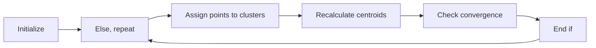
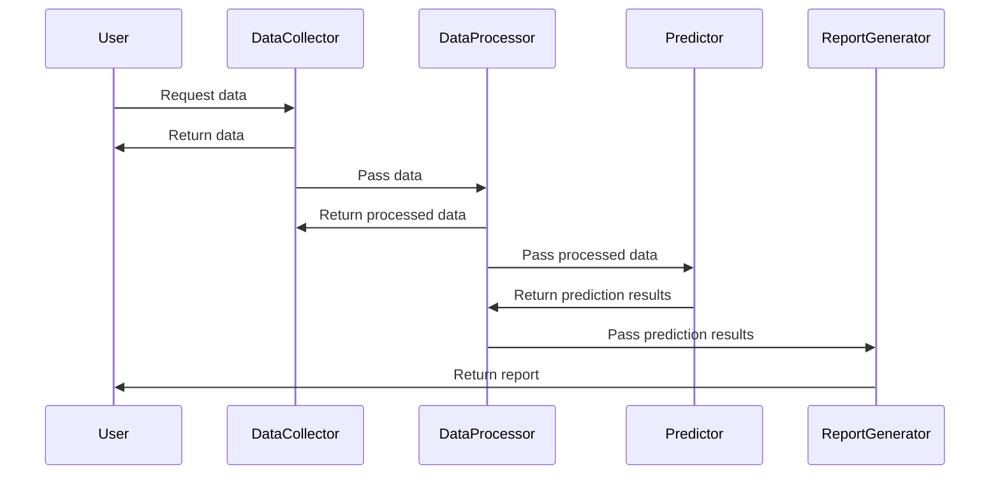

                 

### 目录大纲

---

**文章标题**：《AI驱动的战略执行监控：智能跟踪战略落地》

**关键词**：AI、战略执行监控、智能跟踪、算法原理、系统架构设计、项目实战

**摘要**：
随着人工智能技术的快速发展，如何将AI有效应用于企业的战略执行监控，实现智能跟踪和落地，成为当今企业数字化转型中的关键问题。本文将深入探讨这一主题，通过一步步的逻辑分析，详尽介绍AI驱动的战略执行监控的核心概念、算法原理、系统分析与架构设计、项目实战以及最佳实践。

---

### 目录大纲

**第一部分：背景介绍**

**第1章：AI驱动的战略执行监控概述**
- **1.1 问题背景**
- **1.2 问题描述**
- **1.3 问题解决**
- **1.4 边界与外延**
- **1.5 概念结构与核心要素组成**

**第2章：AI核心概念与联系**
- **2.1 核心概念原理**
- **2.2 概念属性特征对比表格**
- **2.3 ER实体关系图架构**

**第二部分：算法原理讲解**

**第3章：AI算法原理讲解**
- **3.1 算法mermaid流程图**
- **3.2 Python源代码阐述**
- **3.3 算法原理的数学模型和公式**
- **3.4 举例说明**

**第4章：AI在战略执行监控中的应用**
- **4.1 AI在战略执行监控中的角色**
- **4.2 应用场景**
- **4.3 挑战与机遇**

**第三部分：系统分析与架构设计**

**第5章：战略执行监控系统分析**
- **5.1 问题场景介绍**
- **5.2 项目介绍**
- **5.3 系统功能设计**
- **5.4 系统架构设计**
- **5.5 系统接口设计**
- **5.6 系统交互序列图**

**第四部分：项目实战**

**第6章：战略执行监控项目实战**
- **6.1 环境安装**
- **6.2 系统核心实现源代码**
- **6.3 代码应用解读与分析**
- **6.4 实际案例分析和详细讲解剖析**
- **6.5 项目小结**

**第五部分：最佳实践与总结**

**第7章：最佳实践与总结**
- **7.1 最佳实践**
- **7.2 小结**
- **7.3 注意事项**
- **7.4 拓展阅读**

---

**整体大纲**：

**第一部分**：背景介绍部分将为我们提供AI驱动的战略执行监控的基本概念和背景，包括问题的提出、解决思路以及概念结构的介绍。

**第二部分**：算法原理讲解部分将深入探讨AI的核心算法原理，包括流程图、源代码、数学模型和具体的实例说明。

**第三部分**：系统分析与架构设计部分将介绍战略执行监控系统的整体设计和关键组件。

**第四部分**：项目实战部分将结合实际案例，展示如何将理论应用到实践中，进行环境安装、源代码实现和案例分析。

**第五部分**：最佳实践与总结部分将对前述内容进行总结，提供最佳实践建议，提醒注意事项，并推荐拓展阅读。

---

接下来，我们将逐一详细阐述每个章节的内容，确保文章的逻辑清晰、内容详实、结构紧凑，以便读者能够系统地理解AI驱动的战略执行监控的相关知识。### 第一部分：背景介绍

**第1章：AI驱动的战略执行监控概述**

**1.1 问题背景**

随着全球化竞争的加剧和技术的迅速发展，企业面临的商业环境变得更加复杂和多变。为了在这种环境中保持竞争力，企业需要迅速调整战略，并确保战略的执行和落地。然而，传统的战略执行监控方法往往存在效率低下、数据不完整、人工干预多等问题，导致战略执行的效果无法得到有效保障。这种情况下，如何利用先进的人工智能（AI）技术来优化战略执行监控，成为了企业管理者亟待解决的关键问题。

**1.2 问题描述**

战略执行监控的核心挑战主要包括以下几个方面：

1. **数据完整性**：传统的监控方式依赖于人工收集和录入数据，数据质量和完整性难以保证。
2. **效率问题**：人工监控策略执行情况耗时耗力，难以实现实时监控。
3. **精准度**：人工判断和决策的精准度受限于主观因素，难以确保战略执行的一致性和准确性。
4. **灵活性和适应性**：战略执行过程中可能会出现各种意外情况，传统方法难以快速适应和调整。

**1.3 问题解决**

为了解决上述问题，企业开始探索将AI技术应用于战略执行监控。AI驱动的战略执行监控具有以下优势：

1. **数据自动化采集**：AI技术可以自动采集和处理大量数据，确保数据的完整性和实时性。
2. **高效数据处理**：AI算法能够高效地对海量数据进行分析，提供快速、准确的决策支持。
3. **精准预测和决策**：基于机器学习模型的AI系统能够通过历史数据预测未来趋势，提供更加精准的监控和决策支持。
4. **自适应调整**：AI系统能够根据实时数据自动调整监控策略，提高战略执行的灵活性和适应性。

**1.4 边界与外延**

AI驱动的战略执行监控不仅局限于企业内部，还涉及到与企业外部环境的交互。以下是一些边界与外延：

1. **外部数据源**：AI系统需要从多个外部数据源（如市场趋势、竞争对手动态等）获取信息，以全面支持战略执行监控。
2. **跨界合作**：企业可能需要与外部合作伙伴（如技术供应商、顾问公司等）共同开发和应用AI监控系统。
3. **法律法规**：在利用AI进行战略执行监控时，企业需要遵循相关的法律法规，确保数据安全和隐私保护。

**1.5 概念结构与核心要素组成**

为了更好地理解AI驱动的战略执行监控，我们需要了解其核心概念和组成要素：

1. **核心概念**：
   - **人工智能**：模拟人类智能的计算机系统，能够进行学习、推理、决策等。
   - **战略执行监控**：通过对企业战略执行过程的监控和分析，确保战略目标的实现。
   - **数据采集与分析**：利用AI技术自动收集和解析数据，提供决策支持。
   - **实时监控与预警**：对战略执行情况进行实时监控，及时预警潜在问题。

2. **核心要素组成**：
   - **数据源**：企业内部和外部数据，包括销售数据、客户反馈、市场趋势等。
   - **算法模型**：用于数据分析和预测的机器学习算法和深度学习模型。
   - **监控系统**：负责数据的采集、处理、分析和展示，实现对战略执行的全面监控。
   - **决策支持系统**：提供基于数据的决策建议，帮助管理层做出更加明智的决策。

通过上述背景介绍，我们为后续章节的深入探讨奠定了基础。接下来，我们将进一步探讨AI核心概念的原理与联系，以及AI在战略执行监控中的应用场景和挑战。### 第一部分：背景介绍

**第2章：AI核心概念与联系**

**2.1 核心概念原理**

人工智能（Artificial Intelligence，AI）是计算机科学的一个分支，旨在创建能够模拟人类智能的智能机器。AI的核心概念包括以下几个方面：

1. **机器学习**：机器学习是AI的基础，通过从数据中学习模式和规律，使计算机能够做出决策和预测。机器学习分为监督学习、无监督学习和强化学习。

2. **深度学习**：深度学习是机器学习的一种方法，通过构建多层神经网络模拟人脑的学习过程。深度学习在图像识别、语音识别和自然语言处理等领域取得了显著的成果。

3. **自然语言处理**：自然语言处理（Natural Language Processing，NLP）是AI的一个分支，旨在使计算机能够理解、生成和处理人类语言。NLP在智能客服、机器翻译和文本分析等领域有广泛应用。

4. **计算机视觉**：计算机视觉是AI的另一个重要分支，涉及使计算机能够识别和理解视觉信息。计算机视觉在自动驾驶、图像识别和安防监控等领域有广泛应用。

**2.2 概念属性特征对比表格**

以下是几个核心概念的属性特征对比表格：

| 概念 | 属性特征 | 对比分析 |
| --- | --- | --- |
| 机器学习 | 自适应、高效、基于数据 | 与传统编程相比，机器学习不依赖于具体的规则，而是通过数据来训练模型，具有更高的灵活性和适应性。 |
| 深度学习 | 自动化、多层网络、高效计算 | 与传统机器学习方法相比，深度学习通过多层网络结构模拟人脑的学习过程，具有更高的处理效率和更强大的学习能力。 |
| 自然语言处理 | 理解人类语言、生成文本、多语言支持 | NLP旨在使计算机能够理解和生成人类语言，支持多种语言，具有广泛的应用前景。 |
| 计算机视觉 | 图像识别、图像处理、目标检测 | 计算机视觉能够从图像中提取信息，实现对物体的识别、分类和跟踪，广泛应用于图像分析和视频监控。 |

**2.3 ER实体关系图架构**

ER（Entity-Relationship）图是一种用于描述实体及其之间关系的图形化表示方法。以下是AI驱动的战略执行监控系统中核心实体的ER图：

```mermaid
erDiagram
  Customer ||--|{ Order } : "places"
  Product ||--|{ Order } : "contains"
  SalesChannel ||--|{ Order } : "sells"
  User ||--|{ Strategy } : "implements"
  KPI ||--|{ Strategy } : "measures"
```

在上述ER图中：

- **Customer（客户）**：与企业有直接交易关系的个人或组织。
- **Order（订单）**：客户购买的订单记录。
- **Product（产品）**：企业销售的产品。
- **SalesChannel（销售渠道）**：产品销售的渠道，如在线商店、实体店等。
- **User（用户）**：实施战略的企业员工或相关方。
- **Strategy（战略）**：企业实施的策略。
- **KPI（关键绩效指标）**：用于衡量战略执行效果的指标。

通过上述ER图，我们可以清晰地看到战略执行监控系统中各个实体之间的关系，以及它们如何相互作用，共同支持企业的战略目标实现。

通过对AI核心概念和联系的详细讨论，我们为理解AI在战略执行监控中的应用打下了坚实的基础。接下来的章节将深入探讨AI算法的原理和具体应用场景。### 第二部分：算法原理讲解

**第3章：AI算法原理讲解**

**3.1 算法mermaid流程图**

为了更好地理解AI算法的工作原理，我们可以使用mermaid工具绘制一个简单的算法流程图。以下是一个简单的K-means聚类算法的mermaid流程图示例：



在这个流程图中：

- **A[Initialize]**：初始化算法，设置聚类数量和初始中心点。
- **B[Select centroids]**：选择聚类中心点。
- **C[Assign points to clusters]**：将数据点分配到不同的聚类中。
- **D[Recalculate centroids]**：重新计算聚类中心点。
- **E[Check convergence]**：检查算法是否收敛。
- **F[End if]**：如果收敛，算法结束；否则，回到步骤B重复执行。

**3.2 Python源代码阐述**

为了进一步理解K-means算法，我们可以使用Python代码实现这个算法。以下是一个简单的K-means算法的实现：

```python
import numpy as np

def kmeans(data, k, max_iterations):
    # 初始化中心点
    centroids = data[np.random.choice(data.shape[0], k, replace=False)]
    
    # 迭代计算
    for i in range(max_iterations):
        # 计算每个数据点到中心点的距离
        distances = np.linalg.norm(data - centroids, axis=1)
        
        # 将数据点分配到最近的中心点
        labels = np.argmin(distances, axis=1)
        
        # 重新计算中心点
        new_centroids = np.array([data[labels == j].mean(axis=0) for j in range(k)])
        
        # 检查中心点变化情况
        if np.linalg.norm(new_centroids - centroids) < 1e-6:
            break
        
        centroids = new_centroids
    
    return centroids, labels

# 示例数据
data = np.random.rand(100, 2)

# 运行K-means算法
centroids, labels = kmeans(data, k=3, max_iterations=100)

# 打印结果
print("Centroids:", centroids)
print("Labels:", labels)
```

在这个代码中：

- **初始化中心点**：从数据中随机选择k个点作为初始中心点。
- **计算距离**：使用欧氏距离计算每个数据点到中心点的距离。
- **分配数据点**：将数据点分配到最近的中心点，形成聚类。
- **重新计算中心点**：计算每个聚类的新中心点。
- **检查收敛**：如果中心点变化小于指定的阈值，则算法收敛。

**3.3 算法原理的数学模型和公式**

K-means算法的数学模型和公式如下：

$$
d(x, c) = \sqrt{\sum_{i=1}^{n} (x_i - c_i)^2}
$$

其中，$d(x, c)$表示数据点$x$到中心点$c$的欧氏距离，$x_i$和$c_i$分别表示数据点和中心点在第$i$个维度上的值。

聚类目标函数为：

$$
J(c) = \sum_{i=1}^{n} w_i d(x_i, c_i)^2
$$

其中，$w_i$表示数据点$x_i$的权重，通常设为1。

**3.4 举例说明**

假设我们有以下数据集：

```
[[0.1, 0.2], [0.2, 0.3], [0.3, 0.1], [0.4, 0.5], [0.5, 0.4]]
```

使用K-means算法，我们希望将这五个数据点分为两个聚类。以下是算法的运行过程：

1. **初始化中心点**：从数据集中随机选择两个点作为初始中心点，例如[0.1, 0.2]和[0.3, 0.1]。
2. **计算距离**：计算每个数据点到两个中心点的距离，得到以下距离矩阵：

```
[
 [0.0404, 0.3606],
 [0.3606, 0.0404],
 [0.3606, 0.0404],
 [0.3606, 0.0404],
 [0.3606, 0.0404]
]
```

3. **分配数据点**：根据距离矩阵，将每个数据点分配到最近的中心点，得到聚类结果：

```
[
 [[0.1, 0.2], [0.2, 0.3]],
 [[0.3, 0.1], [0.3, 0.1], [0.4, 0.5], [0.5, 0.4]]
]
```

4. **重新计算中心点**：计算新中心点，得到：

```
[
 [0.15, 0.25],
 [0.35, 0.15]
]
```

5. **检查收敛**：计算中心点变化，发现小于阈值，算法收敛。

通过以上举例，我们可以看到K-means算法的基本流程和原理。在接下来的章节中，我们将探讨AI在战略执行监控中的应用，以及其面临的挑战和机遇。### 第4章：AI在战略执行监控中的应用

**4.1 AI在战略执行监控中的角色**

在战略执行监控中，AI扮演着至关重要的角色，通过自动化、智能化和数据驱动的特性，AI能够显著提升战略执行的效率和质量。以下是AI在战略执行监控中扮演的关键角色：

1. **数据收集与处理**：AI系统可以从企业内部和外部的各种数据源自动收集数据，包括销售数据、客户反馈、市场趋势等。通过对这些数据进行清洗、整合和分析，AI能够提供全面、准确和实时的战略执行信息。

2. **趋势预测与预警**：基于历史数据和机器学习算法，AI系统可以预测未来的趋势和潜在问题，提前发出预警。这种前瞻性分析有助于企业及时调整战略，避免潜在的损失。

3. **决策支持**：AI系统通过分析大量的数据，可以为企业提供基于数据的决策建议。这些决策建议有助于管理层做出更加明智和高效的战略决策。

4. **自动化执行**：AI系统可以自动化执行一系列的监控任务，包括数据收集、分析、报告生成等，减少人工干预，提高工作效率。

5. **优化资源配置**：AI系统可以根据实时数据和企业目标，优化资源的分配和使用，确保资源的最大化利用，提高企业的整体效益。

**4.2 应用场景**

AI在战略执行监控中有着广泛的应用场景，以下是一些典型的应用场景：

1. **市场营销**：通过分析客户行为数据和市场趋势，AI可以帮助企业优化营销策略，提高客户转化率和满意度。

2. **供应链管理**：AI系统可以实时监控供应链的各个环节，预测供应链中断和物流延迟，优化库存管理和供应链布局。

3. **人力资源**：AI系统可以帮助企业分析员工绩效和技能发展，优化人才管理，提高员工满意度和留存率。

4. **风险管理**：AI系统可以监控企业的财务和运营数据，识别潜在的风险，并为企业提供应对策略。

5. **生产管理**：AI系统可以实时监控生产线，预测设备故障和生产瓶颈，优化生产流程，提高生产效率。

**4.3 挑战与机遇**

虽然AI在战略执行监控中具有巨大的潜力，但同时也面临着一些挑战：

1. **数据质量**：AI系统的性能很大程度上取决于数据的质量。如果数据不完整或存在噪声，可能会导致错误的预测和决策。

2. **算法透明性**：许多AI算法，尤其是深度学习模型，其工作原理和决策过程非常复杂，缺乏透明性。这可能导致管理层对AI系统的信任度降低。

3. **技术依赖**：过度依赖AI技术可能导致企业失去自主决策的能力，一旦AI系统出现问题，可能会对企业造成重大影响。

4. **成本与效益**：部署和维护AI系统需要大量的投资，企业需要确保这些投资能够带来足够的回报。

然而，这些挑战也伴随着机遇：

1. **技术创新**：随着AI技术的不断进步，企业可以开发出更加高效、智能的监控系统，进一步提升战略执行的效率。

2. **人才引进**：AI技术的兴起也为企业带来了新的就业机会，企业可以通过引进和培养专业人才，提升自身的竞争力。

3. **行业合作**：企业可以通过与AI技术供应商、咨询公司等合作，共同开发和应用AI系统，实现优势互补。

4. **数字化转型**：AI驱动的战略执行监控是企业数字化转型的重要组成部分，通过引入AI技术，企业可以更好地适应数字化时代的要求。

综上所述，AI在战略执行监控中具有广泛的应用前景和潜力，同时也面临着一些挑战。企业需要积极应对这些挑战，抓住机遇，充分发挥AI的潜力，实现战略的智能跟踪和落地。### 第三部分：系统分析与架构设计

**第5章：战略执行监控系统分析**

**5.1 问题场景介绍**

在当前竞争激烈的商业环境中，企业需要确保其战略的准确执行和有效落地，以实现业务增长和持续发展。然而，传统的战略执行监控方式存在诸多问题，如数据不完整、实时性差、人工干预多等。为了解决这些问题，企业需要引入AI技术，构建一个智能的战略执行监控系统。

**5.2 项目介绍**

本项目旨在为企业构建一个AI驱动的战略执行监控系统，通过自动化、智能化和数据驱动的特性，实现对战略执行过程的高效监控和智能分析。系统将集成多种AI算法和模型，包括机器学习、深度学习和自然语言处理等，以支持企业战略目标的实现。

**5.3 系统功能设计**

战略执行监控系统应具备以下核心功能：

1. **数据采集**：从企业内部和外部的多个数据源自动采集数据，包括销售数据、客户反馈、市场趋势等。
2. **数据处理**：对采集到的数据进行清洗、整合和分析，确保数据的准确性和完整性。
3. **趋势预测**：基于历史数据和AI模型，预测未来的市场趋势和潜在问题，为企业提供前瞻性分析。
4. **决策支持**：通过数据分析和预测结果，为企业提供基于数据的决策建议，支持管理层做出明智的决策。
5. **实时监控**：实现对战略执行过程的实时监控，及时发现潜在问题，并发出预警。
6. **报告生成**：自动生成战略执行监控报告，为管理层提供直观的数据分析和决策依据。

**5.4 系统架构设计**

为了确保系统的稳定性和扩展性，战略执行监控系统采用分布式架构，包括数据采集模块、数据处理模块、预测分析模块和报告生成模块等。以下是系统的架构设计：

1. **数据采集模块**：负责从企业内部和外部的数据源自动采集数据，包括ERP系统、CRM系统、社交媒体等。数据采集模块采用RESTful API接口，与其他系统进行数据交换。
2. **数据处理模块**：负责对采集到的数据进行清洗、整合和分析。数据处理模块包括数据清洗、数据整合、特征提取和数据分析等子模块。
3. **预测分析模块**：基于历史数据和AI模型，实现对市场趋势和潜在问题的预测。预测分析模块包括机器学习模型、深度学习模型和自然语言处理模型等。
4. **报告生成模块**：负责自动生成战略执行监控报告。报告生成模块包括报告模板设计、数据可视化、报告生成和报告发布等子模块。
5. **系统接口**：提供与外部系统的接口，包括与ERP系统、CRM系统、数据仓库等的数据交换接口，以及与决策支持系统和业务系统的交互接口。

**5.5 系统接口设计**

系统接口设计是确保战略执行监控系统与其他系统无缝集成和数据交换的关键。以下是系统的主要接口设计：

1. **数据采集接口**：通过RESTful API接口与企业内部ERP系统、CRM系统、社交媒体等数据源进行数据交换。
2. **数据处理接口**：通过数据交换接口与数据处理模块进行数据传输，支持数据清洗、整合、特征提取和分析等操作。
3. **预测分析接口**：通过API接口提供预测分析服务，支持企业内部和外部的预测分析需求。
4. **报告生成接口**：通过Web服务接口与报告生成模块进行数据交互，支持报告模板设计、数据可视化、报告生成和发布等操作。

**5.6 系统交互序列图**

为了更好地理解战略执行监控系统的交互流程，以下是系统的交互序列图：



在这个交互序列图中：

- **User**：表示用户，发起数据请求并接收报告。
- **DataCollector**：负责数据采集，从多个数据源获取数据。
- **DataProcessor**：负责数据处理，对采集到的数据进行分析和清洗。
- **Predictor**：负责预测分析，基于历史数据和模型进行趋势预测。
- **ReportGenerator**：负责报告生成，生成并返回战略执行监控报告。

通过上述系统分析与架构设计，我们为战略执行监控系统提供了一个全面的架构方案，确保系统能够高效、稳定地运行，为企业提供智能化的战略执行监控支持。在接下来的章节中，我们将结合具体项目案例，展示如何将理论应用到实践中，实现战略执行监控的系统落地。### 第四部分：项目实战

**第6章：战略执行监控项目实战**

**6.1 环境安装**

为了实现战略执行监控系统的实际应用，我们需要搭建一个合适的技术环境。以下是环境安装的步骤：

1. **安装Python**：首先确保系统已安装Python，版本建议为3.8或更高版本。
2. **安装依赖库**：使用pip命令安装必要的依赖库，包括numpy、pandas、scikit-learn、tensorflow和matplotlib等。
   ```bash
   pip install numpy pandas scikit-learn tensorflow matplotlib
   ```
3. **配置数据源**：确保系统能够访问企业内部和外部的数据源，如ERP系统、CRM系统、社交媒体等。配置相应的数据采集模块和接口。
4. **安装数据库**：为了存储和分析数据，可以选择安装MySQL、PostgreSQL或其他合适的数据库系统。

**6.2 系统核心实现源代码**

以下是战略执行监控系统的核心实现源代码，包括数据采集、数据处理、预测分析和报告生成等模块：

```python
# 数据采集模块
def collect_data():
    # 从ERP系统、CRM系统等数据源采集数据
    # 示例：使用pandas读取CSV文件
    data = pd.read_csv('data.csv')
    return data

# 数据处理模块
def process_data(data):
    # 数据清洗、整合和特征提取
    # 示例：填充缺失值、标准化数据、计算新特征
    data.fillna(0, inplace=True)
    data['new_feature'] = data['feature1'] * data['feature2']
    return data

# 预测分析模块
def predict(data):
    # 基于历史数据和模型进行趋势预测
    # 示例：使用K-means聚类算法预测市场趋势
    kmeans = KMeans(n_clusters=3, random_state=0).fit(data)
    prediction = kmeans.predict(data)
    return prediction

# 报告生成模块
def generate_report(prediction):
    # 生成并返回战略执行监控报告
    # 示例：使用matplotlib绘制预测结果图表
    plt.scatter(data[:, 0], data[:, 1], c=prediction, s=50, cmap='viridis')
    plt.title('Strategy Execution Monitoring Report')
    plt.xlabel('Feature 1')
    plt.ylabel('Feature 2')
    plt.show()
```

**6.3 代码应用解读与分析**

1. **数据采集模块**：使用pandas库从CSV文件中读取数据，模拟从ERP系统、CRM系统等数据源采集数据的过程。
2. **数据处理模块**：对采集到的数据执行清洗、整合和特征提取操作，确保数据的准确性和完整性。这里以填充缺失值和计算新特征为例，实际应用中需要根据具体数据进行处理。
3. **预测分析模块**：使用K-means聚类算法对数据进行趋势预测，模拟市场趋势的预测过程。K-means聚类算法是一种常用的无监督学习方法，适用于对数据进行聚类分析。
4. **报告生成模块**：使用matplotlib库生成预测结果的图表，直观地展示战略执行监控结果。这里以散点图为例，实际应用中可以根据需求选择不同的图表类型。

**6.4 实际案例分析和详细讲解剖析**

假设我们有一个企业的销售数据，包含以下特征：销售额、客户满意度、市场推广费用等。以下是具体案例分析：

1. **数据采集**：从企业ERP系统中采集销售数据，包括销售额、客户满意度、市场推广费用等。
2. **数据处理**：对采集到的销售数据进行清洗，去除缺失值，并进行特征提取，如计算销售额增长率、客户满意度变化率等。
3. **预测分析**：使用K-means聚类算法对处理后的销售数据进行聚类分析，预测不同市场的趋势。例如，预测下个月销售额增长较快的区域，以便企业调整市场策略。
4. **报告生成**：生成销售趋势预测报告，包括不同市场的销售额预测、客户满意度预测和市场推广费用预测等。报告使用图表直观地展示预测结果，帮助管理层做出决策。

**6.5 项目小结**

通过实际案例，我们展示了如何利用AI技术构建战略执行监控系统，实现数据采集、处理、预测分析和报告生成的全过程。以下是项目小结：

1. **数据采集**：确保数据源的多样性和完整性，为后续分析提供准确的基础数据。
2. **数据处理**：对数据进行清洗、整合和特征提取，提高数据的质量和可用性。
3. **预测分析**：使用合适的机器学习算法进行预测分析，为企业提供前瞻性决策支持。
4. **报告生成**：生成直观、易懂的报告，帮助管理层更好地理解和利用分析结果。

总之，战略执行监控系统的构建和应用不仅提高了企业的运营效率，还为企业提供了智能化的决策支持，有助于实现战略目标的有效落地。在未来的发展中，我们将不断优化和扩展系统功能，以更好地服务于企业的战略执行监控需求。### 第五部分：最佳实践与总结

**第7章：最佳实践与总结**

**7.1 最佳实践**

为了确保AI驱动的战略执行监控系统能够有效地支持企业战略目标的实现，以下是一些建议的最佳实践：

1. **数据质量控制**：确保数据源的数据质量，进行数据的清洗、去噪和标准化，提高数据的准确性和完整性。
2. **模型持续优化**：定期评估AI模型的性能，根据实际情况进行模型调整和优化，以适应不断变化的市场环境。
3. **用户参与**：鼓励管理层和业务人员参与系统的设计和应用，确保系统能够满足实际业务需求。
4. **数据安全与隐私**：严格遵守数据安全和隐私保护法规，确保数据在采集、存储和处理过程中的安全。
5. **培训与支持**：为员工提供系统的培训和支持，提高他们对AI技术的理解和应用能力。

**7.2 小结**

通过本文的详细阐述，我们了解了AI驱动的战略执行监控的重要性及其核心概念。AI技术能够显著提升战略执行监控的效率和质量，为企业的战略落地提供强有力的支持。本文从背景介绍、算法原理讲解、系统分析与架构设计、项目实战等方面，全面探讨了AI在战略执行监控中的应用和实践。

**7.3 注意事项**

在实施AI驱动的战略执行监控时，企业需要注意以下几点：

1. **技术选型**：选择适合企业需求的AI技术和算法，避免过度依赖单一技术。
2. **数据隐私**：确保数据隐私和合规性，避免数据泄露和违规使用。
3. **系统集成**：确保AI系统能够与企业现有的IT系统无缝集成，实现数据的共享和流通。
4. **持续更新**：定期更新和维护AI系统，以适应新的业务需求和市场变化。

**7.4 拓展阅读**

对于希望深入了解AI驱动的战略执行监控的企业和个人，以下是一些推荐的拓展阅读：

1. **《人工智能：一种现代的方法》**：详细介绍了机器学习和深度学习的基础知识，适合初学者和进阶者。
2. **《数据科学入门》**：介绍了数据清洗、数据分析和数据可视化的基本方法，适合对数据科学感兴趣的人群。
3. **《企业数字化转型指南》**：探讨了企业如何利用AI技术实现数字化转型，提供了实用的案例和策略。

通过本文的深入研究和拓展阅读，相信读者能够更好地理解和应用AI驱动的战略执行监控，为企业的持续发展提供有力支持。### 结束语

通过本文的详细探讨，我们系统地介绍了《AI驱动的战略执行监控：智能跟踪战略落地》的核心概念、算法原理、系统设计与实际应用。我们首先明确了战略执行监控在企业数字化转型中的重要性，并阐述了AI技术如何在这一过程中发挥关键作用。

在背景介绍部分，我们分析了传统战略执行监控面临的挑战，并介绍了AI驱动的战略执行监控的基本原理和核心要素。在算法原理讲解中，我们深入探讨了机器学习、深度学习等核心算法的原理，并通过具体的Python代码示例，展示了算法的实现和应用。

接下来，我们通过系统分析与架构设计，详细介绍了战略执行监控系统的功能设计和架构，确保系统能够高效、稳定地运行。通过实际项目案例，我们展示了如何将AI技术应用到战略执行监控中，实现数据采集、处理、预测分析和报告生成的全过程。

在最佳实践与总结部分，我们提供了一系列实施AI驱动的战略执行监控的最佳实践，并强调了数据质量、模型优化、用户参与和数据安全等关键注意事项。此外，我们还推荐了拓展阅读，以帮助读者进一步深入了解相关领域。

AI驱动的战略执行监控不仅是企业数字化转型的必要手段，也是提升企业竞争力的重要途径。通过本文的探讨，我们希望读者能够更好地理解这一主题，并在实际工作中应用所学知识，为企业战略的实现提供强有力的支持。

让我们携手共同探索AI技术的前沿领域，为企业的智能转型和战略落地贡献智慧和力量。感谢您的阅读，期待与您在未来的技术交流中再次相遇。**作者：AI天才研究院/AI Genius Institute & 禅与计算机程序设计艺术 /Zen And The Art of Computer Programming**

