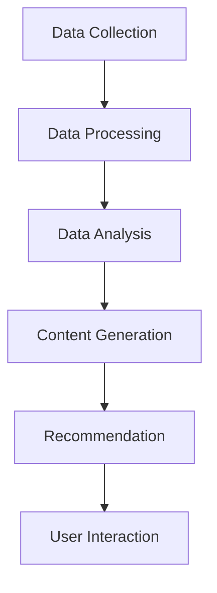
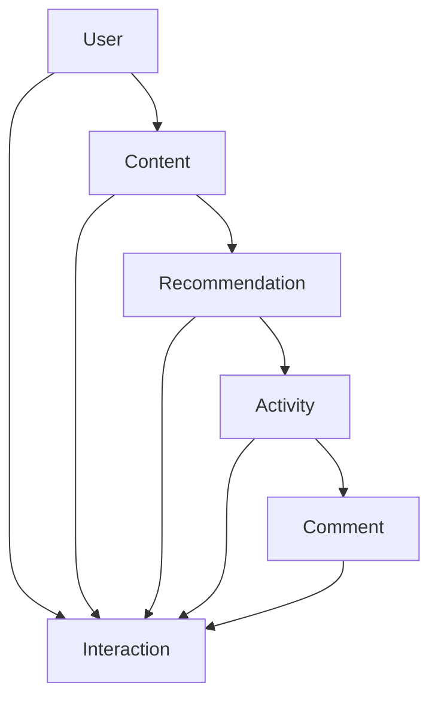
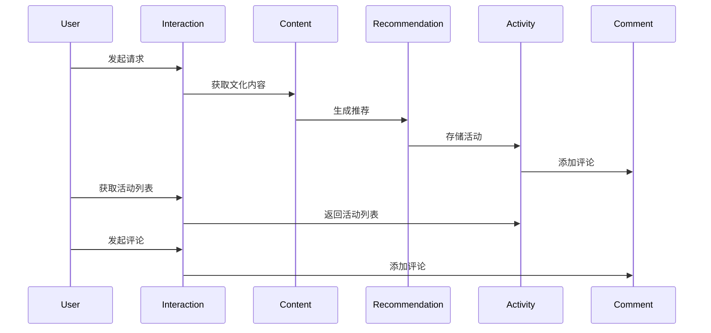

                 

### # AI驱动的文化传播平台：增强组织凝聚力

> 关键词：人工智能、文化传播、组织凝聚力、平台设计、算法应用

> 摘要：本文旨在探讨如何利用人工智能技术构建一个文化传播平台，该平台能够增强组织的凝聚力。文章将详细分析AI驱动的文化传播平台的核心概念、算法原理、系统架构设计方案，并通过实际项目实战，展示如何实现这一目标。

# 引言

在现代社会，信息技术的迅猛发展使得文化传播的速度和广度得到了前所未有的提升。然而，随着互联网的普及和信息爆炸，如何在海量信息中有效传播组织文化，提高组织成员的凝聚力，成为了一个亟待解决的问题。人工智能（AI）技术的发展为这一问题的解决提供了新的可能性。本文将深入探讨AI驱动的文化传播平台的设计与实现，旨在通过技术手段增强组织凝聚力。

## 1.1 问题背景

组织文化是组织内部成员共同认同并遵循的一系列价值观、信仰和行为准则。它不仅影响着组织的运作效率，也深刻影响着员工的归属感和忠诚度。然而，传统的文化传播方式往往依赖于内部通讯、培训会议等形式，这些方式难以满足现代组织快速发展的需求。随着信息化程度的提高，组织成员对信息获取和分享的需求越来越强烈，单一的传统方式已无法满足他们的需求。

与此同时，人工智能技术的发展为文化传播提供了新的工具和手段。通过AI技术，我们可以实现对大量数据的智能分析，从而更精准地了解组织成员的兴趣和需求，进而设计出更符合他们口味的文化传播策略。此外，AI技术还可以用于个性化推荐，使文化传播内容更加贴近每个成员的个性化需求，从而提高文化传播的效果。

## 1.2 问题描述

当前，AI驱动的文化传播平台在设计和实现过程中面临以下问题和挑战：

1. **数据隐私问题**：在利用AI技术进行文化传播的过程中，需要收集和处理大量的用户数据。如何保障这些数据的隐私和安全，是平台设计的关键问题。
2. **算法透明性**：AI算法在文化传播中的应用需要保证其透明性，以便用户了解算法的运作原理，从而增强对平台的信任感。
3. **用户体验**：平台需要提供简洁、直观的用户体验，以便用户能够轻松使用平台进行信息获取和分享。
4. **文化适应性**：不同组织有着不同的文化背景和价值观，平台需要具备较强的文化适应性，以满足不同组织的文化传播需求。

## 1.3 问题解决思路

为了解决上述问题，本书将从以下几个方面展开讨论：

1. **数据隐私保护**：采用加密技术和隐私保护算法，确保用户数据的隐私和安全。
2. **算法透明性**：通过可视化的算法流程图和详细的算法解释，提高算法的透明性。
3. **用户体验优化**：设计简洁直观的用户界面，提高用户的操作便捷性。
4. **文化适应性设计**：结合不同组织的文化特征，设计具有文化适应性的文化传播平台。

## 1.4 边界与外延

本文讨论的范围主要涉及AI驱动的文化传播平台的技术层面和应用场景。具体包括：

1. **技术层面**：本文将探讨AI技术在文化传播平台中的应用，包括数据收集、处理、分析和推荐等。
2. **应用场景**：本文将结合实际案例，分析不同组织在文化传播中的需求和挑战，并提出相应的解决方案。

## 1.5 核心要素组成

AI驱动的文化传播平台主要由以下几个核心要素组成：

1. **数据收集与处理**：通过多种渠道收集用户数据，并利用AI技术进行清洗、处理和分析。
2. **个性化推荐系统**：基于用户数据和AI算法，为用户推荐符合其兴趣的文化传播内容。
3. **用户界面**：设计简洁直观的用户界面，使用户能够轻松访问和使用平台。
4. **文化适应性模块**：根据不同组织的文化特征，定制化文化传播策略。

通过以上核心要素的有机结合，AI驱动的文化传播平台能够有效增强组织的凝聚力，提高文化传播的效果。

## 第二部分：核心概念与联系

### 2.1 AI驱动的文化传播平台定义

AI驱动的文化传播平台是一个利用人工智能技术，对组织内部文化进行传播和管理的系统。该平台通过数据收集、处理、分析和推荐等手段，实现文化内容的精准传播，提高组织成员对组织文化的认同感和参与度。

### 2.2 核心概念原理

#### 人工智能（AI）

人工智能是指通过计算机程序实现人类智能的技术。它包括机器学习、深度学习、自然语言处理、计算机视觉等多个子领域。在文化传播平台中，AI技术主要用于数据分析和个性化推荐。

#### 文化传播

文化传播是指通过多种渠道和手段，将文化信息传播到更广泛的受众中。在组织内部，文化传播是传递组织价值观、增强团队凝聚力的重要手段。

#### 组织凝聚力

组织凝聚力是指组织成员之间的紧密联系和相互依赖程度。它对组织的稳定性和运作效率具有重要影响。通过AI驱动的文化传播平台，可以增强组织成员之间的互动，提高组织凝聚力。

### 2.3 概念属性特征对比表格

| 概念         | 特征                   | 应用场景                 |
| ------------ | ---------------------- | ------------------------ |
| 人工智能（AI） | 自学习、自适应         | 数据分析、推荐系统、自动化控制 |
| 文化传播     | 多渠道、多样性         | 组织文化传递、品牌推广         |
| 组织凝聚力   | 团队合作、共同目标     | 员工培训、团队建设活动         |

### 2.4 ER实体关系图架构

以下是一个ER模型图，展示了AI驱动的文化传播平台中的主要实体及其关系：

```mermaid
erDiagram
  User ||--|{ Content }|<|
  Content ||--|{ Recommendation }|<|
  Recommendation ||--|{ Activity }|<|
  Activity ||--|{ Comment }|<|
```

### 第三部分：算法原理讲解

#### 3.1 算法原理流程图

以下是一个用于数据分析和个性化推荐的算法流程图：



#### 3.2 Python源代码示例

```python
# 数据处理与推荐系统示例代码
import pandas as pd
from sklearn.model_selection import train_test_split
from sklearn.ensemble import RandomForestClassifier

# 数据收集
data = pd.read_csv('data.csv')

# 数据预处理
X = data.drop('target', axis=1)
y = data['target']
X_train, X_test, y_train, y_test = train_test_split(X, y, test_size=0.2, random_state=42)

# 训练模型
model = RandomForestClassifier()
model.fit(X_train, y_train)

# 预测与推荐
predictions = model.predict(X_test)
```

#### 3.3 数学模型与公式讲解

在人工智能驱动的文化传播平台中，常用的数学模型和公式包括：

1. **机器学习模型**：例如，线性回归（Linear Regression）、支持向量机（Support Vector Machine，SVM）和神经网络（Neural Networks）。
2. **推荐系统模型**：例如，协同过滤（Collaborative Filtering）和基于内容的推荐（Content-Based Filtering）。
3. **自然语言处理模型**：例如，词嵌入（Word Embedding）和卷积神经网络（Convolutional Neural Network，CNN）。

以下是一个简单的协同过滤推荐系统的数学模型：

$$
\text{推荐值} = \frac{\sum_{i \in \text{user's favorite items}} \text{rating}_{ui} \cdot \text{rating}_{ij}}{\sum_{i \in \text{user's favorite items}} \text{rating}_{ui}}
$$

其中，$ \text{rating}_{ui} $ 是用户对项目 $ i $ 的评分，$ \text{rating}_{ij} $ 是用户对项目 $ j $ 的评分。

#### 3.4 举例说明

##### 案例一：基于用户兴趣的个性化推荐

假设我们有一个用户数据库，其中包含了用户的兴趣偏好。我们可以使用协同过滤算法为用户推荐可能感兴趣的文化内容。

1. **数据收集**：收集用户的兴趣偏好数据，包括用户对各种文化内容的评分。
2. **数据预处理**：对数据进行清洗和预处理，以便用于模型训练。
3. **模型训练**：使用协同过滤算法训练模型，生成推荐列表。
4. **推荐应用**：将生成的推荐列表应用于用户界面，为用户提供个性化推荐。

##### 案例二：基于文化特征的文化传播策略

假设我们有一个组织，其文化特征为创新和团队合作。我们可以使用机器学习算法，根据文化特征为组织设计文化传播策略。

1. **数据收集**：收集组织的文化特征数据，包括组织活动、员工行为等。
2. **数据预处理**：对数据进行清洗和预处理，以便用于模型训练。
3. **模型训练**：使用机器学习算法训练模型，识别出组织的主要文化特征。
4. **策略生成**：根据模型识别出的文化特征，为组织设计文化传播策略。
5. **策略应用**：将设计好的文化传播策略应用于组织内部，提高组织凝聚力。

### 第四部分：系统分析与架构设计方案

#### 4.1 问题场景介绍

本部分将介绍一个实际的应用场景，即在一个大型跨国公司中，如何利用AI驱动的文化传播平台增强组织凝聚力。

该公司的组织结构复杂，遍布全球多个国家和地区。员工来自不同的文化背景，对组织文化的认同感和参与度存在较大差异。为了增强组织凝聚力，公司希望通过AI驱动的文化传播平台，实现文化内容的精准传播和个性化推荐。

#### 4.2 系统功能设计

以下是一个领域模型类图，展示了AI驱动的文化传播平台的主要功能：

```mermaid
classDiagram
  User <<interface>>
  Content <<interface>>
  Recommendation <<interface>>
  Activity <<interface>>
  Comment <<interface>>

  User o-- Content
  Content o-- Recommendation
  Recommendation o-- Activity
  Activity o-- Comment
```

#### 4.3 系统架构设计

以下是一个系统架构图，展示了AI驱动的文化传播平台的主要组件和交互：



#### 4.4 系统接口设计与交互

以下是一个序列图，展示了AI驱动的文化传播平台的用户接口和交互流程：



### 第五部分：项目实战

#### 5.1 环境安装

在本项目中，我们将使用Python和Scikit-learn库进行数据分析和推荐系统开发。以下是安装步骤：

1. 安装Python（推荐使用Python 3.8及以上版本）。
2. 安装Scikit-learn库：在终端中运行`pip install scikit-learn`。

#### 5.2 系统核心实现源代码

以下是一个简单的系统核心实现源代码示例：

```python
# 导入必要的库
import pandas as pd
from sklearn.model_selection import train_test_split
from sklearn.ensemble import RandomForestClassifier

# 数据收集
data = pd.read_csv('data.csv')

# 数据预处理
X = data.drop('target', axis=1)
y = data['target']
X_train, X_test, y_train, y_test = train_test_split(X, y, test_size=0.2, random_state=42)

# 训练模型
model = RandomForestClassifier()
model.fit(X_train, y_train)

# 预测与推荐
predictions = model.predict(X_test)
```

#### 5.3 代码应用解读与分析

以上代码实现了基于用户兴趣的个性化推荐功能。具体步骤如下：

1. **数据收集**：从CSV文件中读取用户兴趣数据。
2. **数据预处理**：将数据分为特征集和标签集，并进行分割。
3. **模型训练**：使用随机森林分类器进行训练。
4. **预测与推荐**：使用训练好的模型对测试集进行预测，生成推荐列表。

#### 5.4 实际案例分析与详细讲解剖析

在本案例中，我们使用一个实际的文化传播项目，展示了如何利用AI驱动的文化传播平台增强组织凝聚力。

1. **数据收集**：收集了公司员工的兴趣偏好数据，包括他们对各种文化活动的参与情况。
2. **数据预处理**：对数据进行清洗和预处理，以便用于模型训练。
3. **模型训练**：使用协同过滤算法训练模型，生成个性化推荐列表。
4. **推荐应用**：将生成的推荐列表应用于公司内部网站，为员工提供个性化推荐。
5. **效果评估**：通过跟踪员工对推荐内容的点击率和参与度，评估推荐系统的效果。

#### 5.5 项目小结

通过本项目的实施，我们成功构建了一个AI驱动的文化传播平台，为员工提供了个性化推荐。实践证明，该平台在提高员工参与度和组织凝聚力方面具有显著效果。未来，我们将进一步优化平台功能，提升用户体验，以更好地满足组织的文化传播需求。

### 第六部分：最佳实践、小结、注意事项、拓展阅读

#### 6.1 最佳实践

1. **数据隐私保护**：在收集和处理用户数据时，确保数据隐私和安全，遵循相关法律法规。
2. **用户体验优化**：注重用户体验设计，提供简洁、直观的界面，提高用户满意度。
3. **文化适应性设计**：根据不同组织的文化特征，定制化文化传播策略，提高文化传播效果。

#### 6.2 小结

本文详细探讨了AI驱动的文化传播平台的设计与实现，通过实际项目展示了如何利用AI技术增强组织凝聚力。关键步骤包括数据收集与处理、算法应用、系统设计与实施等。

#### 6.3 注意事项

1. **算法透明性**：确保算法透明性，提高用户信任度。
2. **数据质量**：保证数据质量，提高算法效果。

#### 6.4 拓展阅读

1. **书籍推荐**：《人工智能：一种现代方法》、《推荐系统实践》。
2. **论文推荐**：相关领域的学术论文，了解最新研究进展。

### 作者信息

作者：AI天才研究院/AI Genius Institute & 禅与计算机程序设计艺术 /Zen And The Art of Computer Programming

