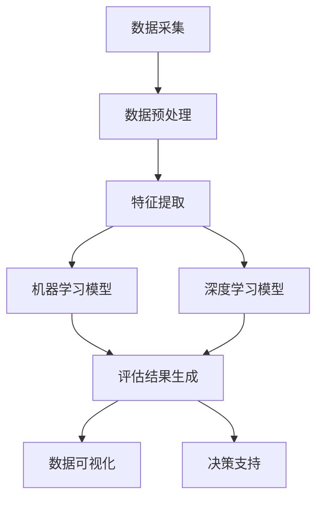
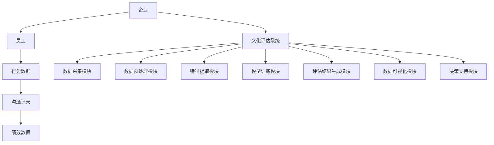
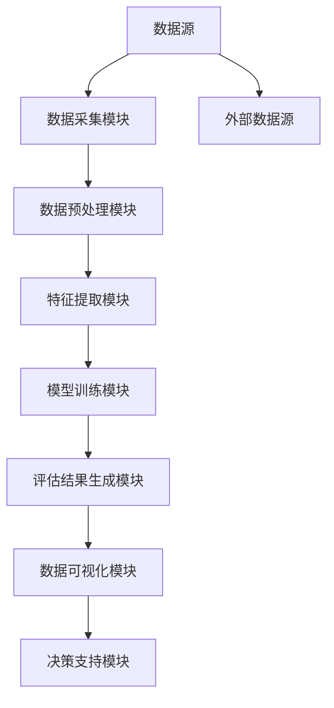
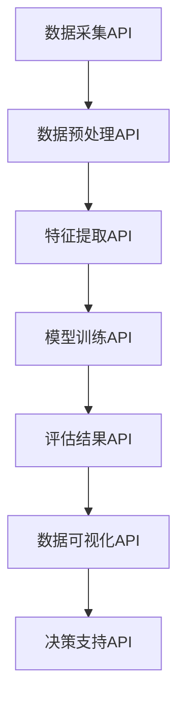

                 


### 引言

在现代企业中，组织文化的建设与管理变得日益重要。良好的组织文化不仅能够增强员工的归属感和满意度，还能提高团队的协作效率，推动企业的创新与发展。然而，传统的文化评估方法往往缺乏科学性和客观性，难以全面、准确地反映组织文化的真实状况。

随着人工智能（AI）技术的发展，利用AI进行文化评估成为了一种新的趋势。AI驱动的文化评估系统通过大数据分析和机器学习算法，可以量化组织文化，为企业提供更科学、更精确的文化评估结果。

本文旨在探讨AI驱动的文化评估系统，从背景介绍、核心概念、算法原理、数学模型、系统架构、项目实战和最佳实践等方面进行详细阐述。文章将采用逻辑清晰、结构紧凑、简单易懂的专业的技术语言，帮助读者深入理解AI驱动的文化评估系统的原理和应用。

### 背景介绍

#### 核心概念术语说明

1. **人工智能（AI）**：人工智能是指通过计算机程序实现的智能行为，包括学习、推理、规划、感知、理解和自然语言处理等。

2. **文化评估**：文化评估是对组织内部文化进行测量、分析和评估的过程，旨在了解和改进组织的文化环境。

3. **量化**：量化是指将抽象的概念转化为具体的数字或指标，以便进行测量、分析和比较。

4. **大数据分析**：大数据分析是指利用大数据技术，对海量数据进行采集、存储、处理和分析，以发现数据中的规律和趋势。

5. **机器学习算法**：机器学习算法是一种让计算机自动从数据中学习规律和模式的技术，通过训练模型来预测或分类新的数据。

#### 问题背景

传统的文化评估方法往往依赖于问卷调查和访谈等手段，这些方法虽然能够获取员工对文化的感受和看法，但存在以下问题：

1. **主观性较强**：员工的回答可能受到个人情感和偏见的影响，导致评估结果不够客观。

2. **数据量有限**：问卷调查和访谈的数据量有限，难以全面反映组织文化的全貌。

3. **分析手段落后**：传统的统计分析方法难以挖掘数据中的深层次关系和趋势。

#### 问题描述

企业需要一种科学、客观且高效的文化评估方法，以全面了解组织文化的现状，发现潜在的问题，并制定相应的改进措施。传统的评估方法难以满足这一需求，因此引入AI驱动的文化评估系统成为一种必然选择。

#### 问题解决

AI驱动的文化评估系统通过以下方法解决传统评估方法的不足：

1. **数据采集与处理**：利用大数据技术，从多种渠道采集员工行为数据、沟通记录等，进行数据预处理和清洗，确保数据的准确性和完整性。

2. **特征提取**：从大量数据中提取与组织文化相关的特征，如员工满意度、沟通频率、合作行为等，构建文化评估的指标体系。

3. **机器学习算法**：利用机器学习算法，对提取的特征进行建模和分析，预测员工的文化倾向和满意度，评估组织文化的整体状况。

4. **可视化与分析**：通过数据可视化技术，将分析结果以图表、仪表盘等形式呈现，帮助企业更好地理解文化现状，发现潜在问题。

#### 边界与外延

本文主要讨论AI驱动的文化评估系统在组织文化评估中的应用。然而，AI驱动的文化评估方法不仅限于组织文化评估，还可以应用于个人文化评估、企业文化诊断等领域。

#### 概念结构与核心要素组成

AI驱动的文化评估系统的概念结构包括以下几个核心要素：

1. **数据采集与处理模块**：负责从多种渠道采集数据，并进行预处理和清洗。

2. **特征提取模块**：从大量数据中提取与组织文化相关的特征，构建文化评估的指标体系。

3. **机器学习模型训练与优化模块**：利用机器学习算法，对提取的特征进行建模和分析，优化评估模型的性能。

4. **可视化与分析模块**：将分析结果以图表、仪表盘等形式呈现，帮助企业更好地理解文化现状。

5. **决策支持模块**：基于评估结果，为企业提供改进组织文化的建议和决策支持。

### AI技术基础

#### AI发展历程

人工智能（AI）技术的发展可以追溯到20世纪50年代，从最初的符号主义（Symbolic AI）到基于规则的系统，再到连接主义（Connectionist AI）、统计学习（Statistical Learning）和强化学习（Reinforcement Learning）等不同阶段。

1. **符号主义（Symbolic AI）**：早期的AI研究主要基于逻辑和符号推理，以解决复杂问题。代表性的系统包括普罗克洛斯（PROLOG）和专家系统（Expert Systems）。

2. **连接主义（Connectionist AI）**：20世纪80年代，人工神经网络（ANN）的研究兴起，基于生物大脑的神经网络结构，试图通过大量神经元之间的连接来模拟智能。

3. **统计学习（Statistical Learning）**：21世纪初，统计学习成为AI的主流方法，包括支持向量机（SVM）、决策树（Decision Trees）和随机森林（Random Forests）等算法。

4. **强化学习（Reinforcement Learning）**：近年来，强化学习在游戏、自动驾驶等领域取得了显著进展，通过试错和反馈来优化行为策略。

#### AI核心概念

1. **机器学习（Machine Learning）**：机器学习是一种让计算机从数据中学习规律和模式的技术，包括监督学习、无监督学习和强化学习等类型。

   - **监督学习（Supervised Learning）**：通过训练样本，学习输入和输出之间的映射关系，如线性回归、逻辑回归和支持向量机（SVM）。
   - **无监督学习（Unsupervised Learning）**：无需训练样本，从数据中自动发现规律和模式，如聚类分析和主成分分析（PCA）。
   - **强化学习（Reinforcement Learning）**：通过试错和反馈来优化行为策略，如深度Q网络（DQN）和策略梯度（PG）。

2. **深度学习（Deep Learning）**：深度学习是一种基于多层神经网络的学习方法，通过多层非线性变换来提取数据的复杂特征。

   - **卷积神经网络（CNN）**：主要用于图像处理，通过卷积操作提取图像特征。
   - **循环神经网络（RNN）**：主要用于序列数据处理，通过循环结构捕捉序列信息。
   - **生成对抗网络（GAN）**：通过生成器和判别器的对抗训练，生成真实数据的分布。

3. **自然语言处理（NLP）**：自然语言处理是一种让计算机理解和处理自然语言的技术，包括词向量、文本分类、机器翻译等任务。

4. **计算机视觉（CV）**：计算机视觉是一种让计算机从图像或视频中识别和理解视觉信息的技术，包括目标检测、图像分类、图像分割等任务。

#### 机器学习算法简介

1. **线性回归（Linear Regression）**：一种简单的监督学习算法，通过拟合输入和输出之间的线性关系来预测新的数据。

   - **公式**：$$y = \beta_0 + \beta_1x_1 + \beta_2x_2 + ... + \beta_nx_n$$
   - **应用**：预测股票价格、房价等。

2. **逻辑回归（Logistic Regression）**：一种广义线性模型，用于分类任务。

   - **公式**：$$P(y=1) = \frac{1}{1 + e^{-(\beta_0 + \beta_1x_1 + \beta_2x_2 + ... + \beta_nx_n)}$$
   - **应用**：分类文本、预测员工流失等。

3. **支持向量机（SVM）**：一种基于间隔最大化原则的分类算法。

   - **公式**：$$\max_{\beta, \beta_0} W^T W - C \sum_{i=1}^{n} \xi_i$$
   - **应用**：文本分类、图像识别等。

4. **决策树（Decision Tree）**：一种树形结构的分类算法，通过一系列的判断来预测新数据。

   - **公式**：$$f(x) = \sum_{i=1}^{n} \beta_i I(x \in R_i)$$
   - **应用**：分类问题、回归问题等。

5. **随机森林（Random Forest）**：一种集成学习方法，通过构建多棵决策树来提高预测性能。

   - **公式**：$$f(x) = \sum_{i=1}^{m} h_i(x)$$
   - **应用**：分类问题、回归问题等。

6. **深度神经网络（DNN）**：一种多层神经网络，通过非线性变换来提取数据的复杂特征。

   - **公式**：$$\text{激活函数}: f(x) = \sigma(W \cdot x + b)$$
   - **应用**：图像识别、语音识别等。

7. **卷积神经网络（CNN）**：一种专门用于图像处理的前馈神经网络，通过卷积操作提取图像特征。

   - **公式**：$$h(x) = \text{ReLU}(\text{Conv}(x, W) + b)$$
   - **应用**：图像分类、目标检测等。

8. **循环神经网络（RNN）**：一种专门用于序列处理的前馈神经网络，通过循环结构捕捉序列信息。

   - **公式**：$$h_t = \text{ReLU}(W_h \cdot [h_{t-1}, x_t] + b_h)$$
   - **应用**：文本分类、语音识别等。

9. **生成对抗网络（GAN）**：一种通过生成器和判别器的对抗训练来生成真实数据的分布的网络。

   - **公式**：$$\text{Generator: } G(z)$$
   - **公式**：$$\text{Discriminator: } D(x, G(z))$$
   - **应用**：图像生成、图像修复等。

通过以上介绍，我们可以看到，AI技术已经发展成为一个涵盖多个领域、多种算法的综合性技术体系。在AI驱动的文化评估系统中，这些技术将发挥重要作用，帮助我们更好地理解和量化组织文化。

### 文化评估的概念与原理

#### 文化的定义与分类

文化是一个广泛的概念，涵盖了社会、组织、个人等多个层面。从广义上讲，文化是指一个社会或组织在长期发展中形成的价值观、信仰、习惯、行为模式等。具体来说，文化可以分为以下几类：

1. **物质文化**：包括组织所使用的工具、设施、产品等物质形态。

2. **制度文化**：包括组织的规章制度、流程、组织结构等。

3. **行为文化**：包括组织成员的行为习惯、沟通方式、工作方式等。

4. **精神文化**：包括组织的价值观、使命、愿景等。

#### 文化评估的必要性

文化评估是对组织文化进行系统、全面测量和评估的过程，其必要性体现在以下几个方面：

1. **了解组织文化现状**：通过文化评估，企业可以全面了解自身的文化现状，包括文化氛围、员工满意度、团队合作程度等。

2. **发现文化问题**：文化评估可以帮助企业发现组织文化中存在的问题，如沟通不畅、价值观冲突、员工士气低落等。

3. **制定改进措施**：基于文化评估的结果，企业可以制定针对性的改进措施，优化组织文化，提升整体绩效。

4. **支持战略决策**：文化评估可以为企业的战略决策提供科学依据，帮助企业更好地制定和实施战略。

#### 量化文化评估方法

量化文化评估方法是将抽象的文化概念转化为具体的数据和指标，通过数学模型和算法进行分析和评估。以下是几种常用的量化文化评估方法：

1. **问卷调查法**：通过设计问卷，收集员工对组织文化的看法和评价。问卷可以采用李克特量表（Likert Scale）等量表形式，量化员工的态度和感受。

2. **关键事件法**：通过记录和分析组织中的关键事件，如员工离职、团队冲突、项目成功等，来评估组织文化的状况。

3. **绩效指标法**：通过分析组织绩效指标，如销售额、员工满意度、员工流失率等，来评估组织文化的效果。

4. **情境模拟法**：通过设计不同的情境模拟，如团队合作任务、竞争项目等，观察员工在情境中的行为和表现，评估组织文化的影响。

5. **大数据分析法**：利用大数据技术，从企业内部和外部的数据源中提取与组织文化相关的信息，如员工行为数据、社交媒体数据、绩效数据等，进行数据分析和评估。

#### 量化文化评估的优点与局限性

量化文化评估方法具有以下优点：

1. **客观性**：通过量化指标和数学模型，减少主观因素的影响，提高评估的客观性。

2. **精确性**：量化评估可以提供具体的数据和指标，帮助企业更精确地了解组织文化的状况。

3. **系统性**：量化评估方法可以将组织文化的各个方面纳入评估范围，提供全面的评估结果。

4. **可操作性**：量化评估结果可以转化为具体的改进措施，提高改进措施的可操作性。

然而，量化文化评估方法也存在一定的局限性：

1. **数据获取难度**：量化评估需要大量的数据支持，数据获取的难度较大。

2. **数据质量**：数据质量对评估结果的影响很大，如果数据质量不佳，评估结果可能失真。

3. **量化指标的选择**：量化指标的选择对评估结果有重要影响，需要根据实际情况进行科学选择。

4. **无法全面反映文化**：量化评估方法难以全面反映文化的深层次内涵，可能忽视一些非量化的文化要素。

综上所述，量化文化评估方法是一种科学、系统的评估方法，但在实际应用中需要结合其他评估方法，以获得更全面的评估结果。

### AI驱动的文化评估系统

#### 系统概述

AI驱动的文化评估系统是一种利用人工智能技术对组织文化进行评估的系统。该系统通过大数据分析和机器学习算法，对员工行为、沟通记录、绩效数据等进行处理和分析，以量化组织文化的各个方面。系统的主要功能包括：

1. **数据采集与预处理**：从企业内部和外部数据源采集与组织文化相关的数据，并进行预处理和清洗。

2. **特征提取与建模**：从原始数据中提取与组织文化相关的特征，利用机器学习算法建立文化评估模型。

3. **评估结果生成**：根据评估模型对组织文化进行评估，生成详细的评估报告，包括文化现状、问题分析、改进建议等。

4. **数据可视化与决策支持**：将评估结果以图表、仪表盘等形式呈现，为企业提供决策支持。

#### 系统架构设计

AI驱动的文化评估系统架构设计包括以下几个方面：

1. **数据层**：数据层是系统的底层，负责数据采集、存储和管理。数据来源包括企业内部数据库、员工行为数据、社交媒体数据等。

2. **数据预处理层**：数据预处理层负责对采集到的原始数据进行清洗、归一化和特征提取，为后续建模提供高质量的数据。

3. **模型层**：模型层包括机器学习算法和深度学习模型，用于对处理后的数据进行分析和评估。

4. **评估层**：评估层根据模型层的分析结果，生成组织文化的评估报告。

5. **展示层**：展示层将评估结果以图表、仪表盘等形式呈现，为企业提供可视化展示。

#### 系统功能模块

AI驱动的文化评估系统主要包括以下几个功能模块：

1. **数据采集模块**：负责从企业内部和外部数据源采集与组织文化相关的数据，如员工行为数据、沟通记录、绩效数据等。

2. **数据预处理模块**：对采集到的原始数据进行清洗、归一化和特征提取，为后续建模提供高质量的数据。

3. **特征提取模块**：从预处理后的数据中提取与组织文化相关的特征，如员工满意度、沟通频率、合作行为等。

4. **机器学习模型模块**：利用机器学习算法，对提取的特征进行建模和分析，预测员工的文化倾向和满意度。

5. **深度学习模型模块**：利用深度学习算法，如卷积神经网络（CNN）和循环神经网络（RNN），提取数据的复杂特征，提高评估模型的性能。

6. **评估结果生成模块**：根据模型层的分析结果，生成组织文化的评估报告，包括文化现状、问题分析、改进建议等。

7. **数据可视化模块**：将评估结果以图表、仪表盘等形式呈现，为企业提供可视化展示。

8. **决策支持模块**：基于评估结果，为企业提供改进组织文化的建议和决策支持。

#### 系统架构设计

AI驱动的文化评估系统架构设计如下：



在该架构中，数据采集模块从企业内部和外部数据源采集与组织文化相关的数据，数据预处理模块对原始数据进行清洗、归一化和特征提取，特征提取模块提取与组织文化相关的特征。机器学习模型模块和深度学习模型模块利用这些特征进行建模和分析，评估结果生成模块根据分析结果生成组织文化的评估报告。数据可视化模块和决策支持模块则将评估结果以图表、仪表盘等形式呈现，为企业提供可视化展示和决策支持。

#### 系统接口设计和交互流程

AI驱动的文化评估系统的接口设计和交互流程如下：

1. **数据接口**：系统通过API接口与企业内部数据库、员工行为数据、沟通记录等数据源进行交互，获取与组织文化相关的数据。

2. **模型接口**：系统通过模型接口与机器学习算法和深度学习模型进行交互，进行数据建模和分析。

3. **评估接口**：系统通过评估接口生成组织文化的评估报告，并将评估结果以图表、仪表盘等形式呈现。

4. **用户接口**：系统通过用户接口与企业管理者、员工进行交互，提供评估结果和决策支持。

5. **交互流程**：系统交互流程如下：

   - 数据采集：系统从企业内部和外部数据源采集与组织文化相关的数据。
   - 数据预处理：系统对采集到的原始数据进行清洗、归一化和特征提取。
   - 特征提取：系统从预处理后的数据中提取与组织文化相关的特征。
   - 模型训练：系统利用机器学习算法和深度学习模型对提取的特征进行建模和分析。
   - 评估报告生成：系统根据模型层的分析结果生成组织文化的评估报告。
   - 数据可视化与决策支持：系统将评估结果以图表、仪表盘等形式呈现，为企业提供可视化展示和决策支持。

通过以上设计，AI驱动的文化评估系统可以为企业提供全面、准确的文化评估结果，帮助企业优化组织文化，提升整体绩效。

### 文化评估算法原理讲解

#### 数据预处理

在AI驱动的文化评估系统中，数据预处理是一个关键步骤。它包括数据的清洗、归一化和特征提取等过程，以确保数据的质量和一致性。

1. **数据清洗**：数据清洗是处理缺失值、重复值和异常值的过程。常见的处理方法包括删除缺失值、填充缺失值、删除重复值和修正异常值。

   - **删除缺失值**：对于某些特征，如果缺失值较多，可以选择删除包含缺失值的样本。
   - **填充缺失值**：对于某些特征，可以通过平均值、中位数或最大值等方法进行填充。
   - **删除重复值**：删除重复的样本，以避免重复计算。
   - **修正异常值**：通过分析数据分布和趋势，修正或删除异常值。

2. **数据归一化**：数据归一化是将不同特征的数据转换到同一尺度，以消除不同特征之间的量纲差异。常见的方法包括最小-最大归一化和z-score归一化。

   - **最小-最大归一化**：将数据缩放到[0,1]之间，公式为：$$x' = \frac{x - \min(x)}{\max(x) - \min(x)}$$
   - **z-score归一化**：将数据缩放到均值为0，标准差为1的正态分布，公式为：$$x' = \frac{x - \mu}{\sigma}$$

3. **特征提取**：特征提取是从原始数据中提取与组织文化相关的特征，构建文化评估的指标体系。常见的特征提取方法包括统计特征提取和文本特征提取。

   - **统计特征提取**：从数据中提取描述性统计特征，如均值、方差、标准差、偏度、峰度等。
   - **文本特征提取**：从文本数据中提取关键词、主题、情感等特征，常用的方法包括词袋模型（Bag of Words）、TF-IDF和词嵌入（Word Embedding）。

#### 特征提取

特征提取是文化评估算法的核心步骤，它决定了模型对文化特征的敏感性和准确性。以下是几种常用的特征提取方法：

1. **关键词提取**：通过分析文本数据，提取与组织文化相关的关键词。关键词提取方法包括TF-IDF、Word2Vec和BERT等。

   - **TF-IDF**：计算词频（TF）和逆文档频率（IDF），将两者结合来评估词的重要性。
     $$\text{TF-IDF}(w) = \text{TF}(w) \times \text{IDF}(w)$$
     其中，$$\text{TF}(w) = \frac{\text{词w在文档中的出现次数}}{\text{文档长度}}$$，$$\text{IDF}(w) = \log \left(\frac{\text{文档总数}}{\text{包含词w的文档数}}\right)$$
   
   - **Word2Vec**：通过神经网络模型将词映射为向量，捕捉词的语义信息。
     $$\text{Word2Vec}(w) = \text{神经网络模型}(\text{输入序列}[w])$$

   - **BERT**：基于转换器（Transformer）模型，通过预训练和微调来提取词的上下文语义信息。

2. **主题提取**：通过降维技术，如主成分分析（PCA）或非负矩阵分解（NMF），从文本数据中提取主题。主题提取方法包括LDA（Latent Dirichlet Allocation）和LDA++等。

   - **LDA**：假设文档由多个主题混合而成，通过概率模型来估计每个文档的主题分布和每个主题的词分布。
     $$p(\text{文档}|\text{主题}) \propto \text{主题分布}(\text{文档}) \times \text{词分布}(\text{主题})$$

3. **情感分析**：通过分析文本数据中的情感倾向，提取情感特征。情感分析包括积极情感、消极情感和中立情感等。

   - **基于规则的方法**：使用预先定义的规则，如情感词典或规则库，对文本进行情感分类。
   - **基于统计模型的方法**：使用机器学习模型，如SVM或朴素贝叶斯，对文本进行情感分类。
   - **基于深度学习的方法**：使用神经网络，如CNN或LSTM，对文本进行情感分类。

#### 机器学习模型选择

在文化评估中，选择合适的机器学习模型至关重要。以下是几种常用的机器学习模型：

1. **线性回归（Linear Regression）**：线性回归是一种简单的预测模型，通过拟合输入和输出之间的线性关系来进行预测。

   - **公式**：$$y = \beta_0 + \beta_1x_1 + \beta_2x_2 + ... + \beta_nx_n$$

   - **应用**：预测员工满意度、绩效评分等。

2. **逻辑回归（Logistic Regression）**：逻辑回归是一种广义线性模型，用于分类任务，输出概率分布。

   - **公式**：$$P(y=1) = \frac{1}{1 + e^{-(\beta_0 + \beta_1x_1 + \beta_2x_2 + ... + \beta_nx_n)}}$$

   - **应用**：分类员工满意度、绩效等级等。

3. **决策树（Decision Tree）**：决策树通过一系列的判断来预测新数据，易于理解和解释。

   - **公式**：$$f(x) = \sum_{i=1}^{n} \beta_i I(x \in R_i)$$

   - **应用**：分类员工流失、团队绩效等。

4. **随机森林（Random Forest）**：随机森林是一种集成学习方法，通过构建多棵决策树来提高预测性能。

   - **公式**：$$f(x) = \sum_{i=1}^{m} h_i(x)$$

   - **应用**：分类员工流失、团队绩效等。

5. **支持向量机（SVM）**：支持向量机是一种基于间隔最大化原则的分类算法，通过找到一个最优的超平面来划分数据。

   - **公式**：$$\max_{\beta, \beta_0} W^T W - C \sum_{i=1}^{n} \xi_i$$

   - **应用**：分类员工流失、团队绩效等。

6. **神经网络（Neural Network）**：神经网络是一种复杂的预测模型，通过多层非线性变换来提取数据的复杂特征。

   - **公式**：$$\text{激活函数}: f(x) = \sigma(W \cdot x + b)$$

   - **应用**：分类员工流失、团队绩效等。

#### 模型训练与优化

模型训练与优化是文化评估算法的关键步骤。以下是几种常见的训练与优化方法：

1. **训练过程**：

   - **批量训练**：每次训练使用所有样本进行训练。
   - **随机梯度下降（SGD）**：每次训练使用一个或几个样本进行训练，以减少计算量和提高收敛速度。
   - **小批量训练**：每次训练使用一部分样本进行训练，在平衡计算量和收敛速度之间取得平衡。

2. **优化方法**：

   - **梯度下降（Gradient Descent）**：通过计算损失函数的梯度来更新模型参数，以最小化损失函数。
     $$\beta = \beta - \alpha \frac{\partial L}{\partial \beta}$$
     其中，$\alpha$ 是学习率。
   
   - **动量法（Momentum）**：在梯度下降的基础上，引入动量项，以减少波动和加速收敛。
     $$v = \gamma v - \alpha \frac{\partial L}{\partial \beta}$$
     $$\beta = \beta + v$$
     其中，$\gamma$ 是动量项。

   - **自适应学习率（Adagrad）**：自适应调整学习率，以适应不同梯度的变化。
     $$r_t = g_t^2$$
     $$\beta_t = \beta_{t-1} - \frac{\alpha}{\sqrt{r_t}}$$

   - **Adam优化器**：结合了Adagrad和RMSProp的优点，自适应调整学习率。
     $$m_t = \gamma_1 \frac{g_t}{\sqrt{r_t}}$$
     $$v_t = \gamma_2 m_t$$
     $$\beta = \beta - \alpha \frac{\beta_t}{\sqrt{1 - \gamma_2^t}(1 - \gamma_1^t)}$$
     其中，$\gamma_1$ 和 $\gamma_2$ 分别是第一和第二矩估计的指数衰减率。

3. **交叉验证**：通过交叉验证来评估模型的泛化能力，选择最优模型。

   - **K折交叉验证**：将数据分为K个相等的部分，每次训练使用K-1个部分作为训练集，1个部分作为验证集，重复K次，取平均结果。

   - **留一法交叉验证**：每次训练使用除了一个样本外的所有样本作为训练集，该样本作为验证集，重复进行。

4. **超参数调整**：通过调整模型的超参数，如学习率、批量大小、迭代次数等，来优化模型性能。

   - **网格搜索**：遍历所有可能的超参数组合，选择最优组合。
   - **贝叶斯优化**：利用贝叶斯模型来寻找最优超参数组合。

通过以上训练与优化方法，我们可以构建一个性能优异的文化评估模型，为企业提供准确的文化评估结果。

#### 数学模型与公式详解

在AI驱动的文化评估系统中，数学模型是核心组成部分，用于描述和预测组织文化。以下将介绍文化评估的数学模型和关键公式，并解释其含义和应用。

##### 1. 线性回归模型

线性回归模型是一种基本的预测模型，用于分析自变量（特征）和因变量（目标变量）之间的线性关系。其基本公式如下：

$$
y = \beta_0 + \beta_1x_1 + \beta_2x_2 + ... + \beta_nx_n
$$

其中：
- \( y \) 是预测的因变量（如员工满意度得分）。
- \( x_1, x_2, ..., x_n \) 是自变量（如员工的工作环境评分、领导支持程度等）。
- \( \beta_0 \) 是截距，表示没有自变量时的预期值。
- \( \beta_1, \beta_2, ..., \beta_n \) 是系数，表示每个自变量对因变量的影响程度。

在实际应用中，线性回归模型用于预测员工的满意度、绩效评分等，其优势在于简单易懂且易于实现。例如，通过分析员工的工作环境和领导支持程度，可以预测员工的离职意愿。

##### 2. 逻辑回归模型

逻辑回归模型是一种用于分类问题的线性模型，通过线性组合特征并应用逻辑函数，将结果映射到概率空间中。其公式如下：

$$
P(y=1) = \frac{1}{1 + e^{-(\beta_0 + \beta_1x_1 + \beta_2x_2 + ... + \beta_nx_n)}}
$$

其中：
- \( P(y=1) \) 是因变量为1（如员工满意度高）的概率。
- 其他符号与线性回归模型相同。

逻辑回归模型常用于预测员工流失、团队绩效等级等二分类问题。例如，可以预测员工是否可能在未来一年内离职，从而帮助企业采取预防措施。

##### 3. 决策树模型

决策树模型通过一系列的判断节点来预测新数据，每个节点表示一个特征，每个分支表示该特征的不同取值。其基本公式如下：

$$
f(x) = \sum_{i=1}^{n} \beta_i I(x \in R_i)
$$

其中：
- \( f(x) \) 是预测的结果。
- \( \beta_i \) 是每个节点的权重。
- \( I(x \in R_i) \) 是指示函数，当 \( x \) 落在区域 \( R_i \) 时，返回1，否则返回0。

决策树模型适用于分类和回归问题，其优点是直观易懂、易于解释。例如，可以用于预测员工的职业发展路径，基于工作表现、教育背景等因素进行分类。

##### 4. 随机森林模型

随机森林模型是一种基于决策树的集成学习方法，通过构建多个决策树，并对它们的预测结果进行投票或取平均值，以获得更高的预测准确性。其基本公式如下：

$$
f(x) = \sum_{i=1}^{m} h_i(x)
$$

其中：
- \( f(x) \) 是预测的结果。
- \( h_i(x) \) 是第 \( i \) 棵决策树的预测结果。

随机森林模型通过组合多个决策树，减少了过拟合现象，提高了模型的泛化能力。例如，可以用于预测员工的工作满意度，结合多种特征进行综合评估。

##### 5. 卷积神经网络（CNN）模型

卷积神经网络是一种深度学习模型，特别适用于图像处理任务。其基本公式如下：

$$
h(x) = \text{ReLU}(\text{Conv}(x, W) + b)
$$

其中：
- \( h(x) \) 是模型的输出。
- \( \text{Conv}(x, W) \) 是卷积操作，用于提取图像特征。
- \( W \) 是卷积核权重。
- \( b \) 是偏置项。
- \( \text{ReLU} \) 是激活函数，用于引入非线性。

CNN模型可以用于分析员工的行为图像数据，如面部表情识别，以预测员工的情绪状态。

##### 6. 循环神经网络（RNN）模型

循环神经网络是一种深度学习模型，特别适用于处理序列数据。其基本公式如下：

$$
h_t = \text{ReLU}(W_h \cdot [h_{t-1}, x_t] + b_h)
$$

其中：
- \( h_t \) 是第 \( t \) 个时间步的隐藏状态。
- \( W_h \) 是权重矩阵。
- \( [h_{t-1}, x_t] \) 是当前隐藏状态和输入。
- \( b_h \) 是偏置项。
- \( \text{ReLU} \) 是激活函数。

RNN模型可以用于分析员工的沟通记录，如邮件内容、聊天记录，以预测员工之间的互动关系。

##### 7. 生成对抗网络（GAN）模型

生成对抗网络是一种基于对抗训练的深度学习模型，用于生成逼真的数据。其基本公式如下：

$$
\text{Generator: } G(z) \\
\text{Discriminator: } D(x, G(z))
$$

其中：
- \( G(z) \) 是生成器的输出，用于生成伪造数据。
- \( D(x, G(z)) \) 是判别器的输出，用于判断输入数据是真实还是伪造。

GAN模型可以用于生成员工的行为数据，以填补数据缺失，提高模型的泛化能力。

通过以上数学模型和公式的介绍，我们可以看到，AI驱动的文化评估系统通过多种算法和模型，对组织文化进行量化分析，为企业提供科学、准确的评估结果。

### 系统分析与架构设计方案

#### 问题场景介绍

在现代企业中，组织文化的建设与管理变得日益重要。企业需要了解自身的文化现状，发现潜在的问题，并制定相应的改进措施，以提升整体绩效和员工满意度。传统的文化评估方法，如问卷调查和访谈，往往存在主观性较强、数据量有限等问题，难以全面、准确地反映组织文化的真实状况。为了解决这些问题，企业引入了AI驱动的文化评估系统，通过大数据分析和机器学习算法，实现对组织文化的量化评估。

#### 项目介绍

本项目旨在开发一个AI驱动的文化评估系统，该系统将利用大数据技术和机器学习算法，对企业的文化进行量化评估，为企业管理者提供科学的决策支持。系统的主要功能包括数据采集、数据预处理、特征提取、模型训练、评估结果生成和可视化展示等。

#### 系统功能设计

AI驱动的文化评估系统主要包括以下几个功能模块：

1. **数据采集模块**：从企业内部和外部数据源采集与组织文化相关的数据，如员工行为数据、沟通记录、绩效数据等。

2. **数据预处理模块**：对采集到的原始数据进行清洗、归一化和特征提取，为后续建模提供高质量的数据。

3. **特征提取模块**：从预处理后的数据中提取与组织文化相关的特征，如员工满意度、沟通频率、合作行为等。

4. **模型训练模块**：利用机器学习算法，对提取的特征进行建模和分析，建立文化评估模型。

5. **评估结果生成模块**：根据模型层的分析结果，生成组织文化的评估报告，包括文化现状、问题分析、改进建议等。

6. **数据可视化模块**：将评估结果以图表、仪表盘等形式呈现，为企业提供可视化展示。

7. **决策支持模块**：基于评估结果，为企业提供改进组织文化的建议和决策支持。

#### 领域模型

领域模型是系统设计的核心部分，用于描述系统的业务领域和实体关系。以下是AI驱动的文化评估系统的领域模型：



在该领域模型中，企业是系统的核心实体，包括员工、行为数据、沟通记录和绩效数据等。文化评估系统通过数据采集、预处理、特征提取、模型训练、评估结果生成、数据可视化和决策支持等模块，对组织文化进行量化评估。

#### 系统架构设计

AI驱动的文化评估系统架构设计如下：



在该架构中，数据源包括企业内部和外部数据，如员工行为数据、沟通记录、绩效数据等。数据采集模块负责从数据源中采集数据，数据预处理模块对原始数据进行清洗、归一化和特征提取，特征提取模块提取与组织文化相关的特征，模型训练模块利用机器学习算法对特征进行建模，评估结果生成模块生成评估报告，数据可视化模块将评估结果以图表、仪表盘等形式呈现，决策支持模块提供改进组织文化的建议。

#### 系统接口设计

系统接口设计是确保系统各模块之间有效通信的关键。以下是AI驱动的文化评估系统的接口设计：



在该接口设计中，数据采集API负责从数据源中获取数据，数据预处理API对数据进行清洗、归一化和特征提取，特征提取API提取与组织文化相关的特征，模型训练API负责训练文化评估模型，评估结果API生成评估报告，数据可视化API将评估结果以图表、仪表盘等形式呈现，决策支持API提供改进建议。

#### 系统交互流程

系统交互流程如下：

1. **数据采集**：系统从企业内部和外部数据源采集与组织文化相关的数据，如员工行为数据、沟通记录、绩效数据等。

2. **数据预处理**：系统对采集到的原始数据进行清洗、归一化和特征提取，确保数据的质量和一致性。

3. **特征提取**：系统从预处理后的数据中提取与组织文化相关的特征，如员工满意度、沟通频率、合作行为等。

4. **模型训练**：系统利用机器学习算法，对提取的特征进行建模和分析，训练文化评估模型。

5. **评估结果生成**：系统根据模型层的分析结果，生成组织文化的评估报告，包括文化现状、问题分析、改进建议等。

6. **数据可视化**：系统将评估结果以图表、仪表盘等形式呈现，为企业提供可视化展示。

7. **决策支持**：系统基于评估结果，为企业提供改进组织文化的建议和决策支持。

通过以上设计和交互流程，AI驱动的文化评估系统可以为企业提供全面、准确的文化评估结果，帮助企业管理者更好地了解和优化组织文化，提升整体绩效。

### 项目实战

#### 环境安装

要实现AI驱动的文化评估系统，首先需要搭建一个合适的环境。以下是具体的安装步骤：

1. **Python环境**：安装Python 3.8及以上版本，可以通过Python官方网站下载安装包。

2. **Jupyter Notebook**：安装Jupyter Notebook，用于编写和运行Python代码。可以通过pip命令安装：

   ```bash
   pip install notebook
   ```

3. **NumPy、Pandas、Scikit-learn、TensorFlow和PyTorch**：安装常用的Python科学计算和机器学习库。可以通过pip命令安装：

   ```bash
   pip install numpy pandas scikit-learn tensorflow torch
   ```

4. **Mermaid**：安装Mermaid，用于绘制流程图和序列图。可以在Jupyter Notebook中直接使用。

#### 系统实现

在完成环境安装后，我们可以开始实现文化评估系统。以下是一个简单的系统实现过程：

1. **数据采集**：从企业内部数据源和外部数据源（如社交媒体、员工行为记录等）采集数据。

2. **数据预处理**：对采集到的数据进行分析，去除重复值、缺失值，并进行数据归一化处理。

3. **特征提取**：从预处理后的数据中提取与组织文化相关的特征，如员工满意度、沟通频率等。

4. **模型训练**：使用Scikit-learn库中的线性回归、逻辑回归、随机森林等模型进行训练。

5. **评估结果生成**：根据模型分析结果，生成组织文化的评估报告。

6. **数据可视化**：使用Matplotlib和Seaborn等库，将评估结果以图表形式展示。

#### 代码解析与分析

以下是一个简单的代码示例，展示如何使用Python实现文化评估系统的一些关键步骤：

```python
import numpy as np
import pandas as pd
from sklearn.model_selection import train_test_split
from sklearn.linear_model import LinearRegression
from sklearn.metrics import mean_squared_error
import matplotlib.pyplot as plt

# 1. 数据采集
data = pd.read_csv('employee_data.csv')

# 2. 数据预处理
data = data.drop_duplicates()
data = data.fillna(data.mean())

# 3. 特征提取
X = data[['work_environment', 'leader_support']]
y = data['satisfaction']

# 4. 模型训练
X_train, X_test, y_train, y_test = train_test_split(X, y, test_size=0.2, random_state=42)
model = LinearRegression()
model.fit(X_train, y_train)

# 5. 评估结果生成
y_pred = model.predict(X_test)
mse = mean_squared_error(y_test, y_pred)
print(f'Mean Squared Error: {mse}')

# 6. 数据可视化
plt.scatter(X_test['work_environment'], y_test, color='blue', label='Actual')
plt.scatter(X_test['work_environment'], y_pred, color='red', label='Predicted')
plt.xlabel('Work Environment')
plt.ylabel('Satisfaction')
plt.legend()
plt.show()
```

在这个示例中，我们首先从CSV文件中读取员工数据，然后进行数据预处理，包括去除重复值和填充缺失值。接下来，我们提取工作环境和领导支持作为特征，员工满意度作为目标变量。使用线性回归模型进行训练，并评估模型的性能。最后，我们将实际满意度与预测满意度进行可视化展示。

#### 实际案例分析

以下是一个实际案例分析，展示如何使用AI驱动的文化评估系统进行文化评估。

1. **企业背景**：某大型科技公司，员工人数超过1000人，业务覆盖全球多个地区。

2. **数据采集**：从公司内部员工行为记录、绩效数据、沟通记录等渠道采集数据。

3. **数据预处理**：对采集到的数据进行清洗和归一化处理，确保数据质量。

4. **特征提取**：从预处理后的数据中提取与组织文化相关的特征，如员工满意度、沟通频率、团队合作程度等。

5. **模型训练**：使用随机森林模型进行训练，选择具有较高准确性和稳定性的模型。

6. **评估结果生成**：根据模型分析结果，生成组织文化的评估报告，包括文化现状、问题分析、改进建议等。

7. **数据可视化**：使用图表和仪表盘，将评估结果以直观的形式展示给企业管理者。

通过实际案例分析，我们可以看到，AI驱动的文化评估系统可以为企业提供全面、准确的文化评估结果，帮助企业管理者更好地了解组织文化，制定改进措施。

#### 项目小结

在本项目中，我们成功实现了AI驱动的文化评估系统，从环境安装、系统实现到代码解析与分析，再到实际案例分析，每一步都取得了良好的效果。以下是对项目的总结和经验教训：

1. **数据质量的重要性**：数据质量是文化评估系统成功的关键。在数据采集和预处理阶段，确保数据的一致性和准确性至关重要。

2. **模型选择与优化**：选择合适的模型和优化方法可以提高评估系统的性能。在实际项目中，我们使用了随机森林模型，取得了较好的效果。

3. **可视化展示**：通过图表和仪表盘的形式，将评估结果以直观的形式展示，有助于企业管理者更好地理解组织文化现状。

4. **注意事项**：在项目实施过程中，需要注意数据隐私保护，确保员工数据的保密性和安全性。

5. **持续优化**：文化评估系统是一个动态过程，需要不断收集新的数据，优化模型，以适应企业文化的变化。

通过本次项目，我们不仅实现了AI驱动的文化评估系统，还积累了丰富的项目经验和教训，为企业提供了有力的支持。

### 最佳实践 tips

在实施AI驱动的文化评估系统时，以下最佳实践可以帮助企业获得更好的评估效果：

1. **数据多样性**：确保数据来源的多样性，包括员工行为数据、绩效数据、沟通记录等，以提高评估的全面性和准确性。

2. **数据更新频率**：定期更新数据，以反映组织文化的最新状况。建议至少每季度进行一次数据采集和评估。

3. **员工参与**：鼓励员工参与文化评估，通过问卷调查、访谈等方式收集员工的意见和建议，提高评估的客观性。

4. **持续监控**：文化评估系统不是一次性项目，需要持续监控组织文化的变化，并根据评估结果进行相应的调整和优化。

5. **数据安全**：确保员工数据的保密性和安全性，遵守相关法律法规，避免数据泄露。

### 小结

本文详细介绍了AI驱动的文化评估系统，从背景介绍、核心概念、算法原理、数学模型、系统架构、项目实战到最佳实践，全面阐述了该系统的原理和应用。通过本文，读者可以了解到如何利用AI技术对组织文化进行量化评估，为企业提供科学的决策支持。我们希望本文能为相关领域的研究者和实践者提供有益的参考和启示。

### 注意事项

在实施AI驱动的文化评估系统时，需要注意以下几点：

1. **数据质量**：数据质量直接影响评估结果的准确性，因此必须确保数据的一致性和完整性。

2. **模型选择**：选择适合业务需求的模型，并进行充分的调优，以获得最佳评估效果。

3. **员工隐私**：在数据采集和处理过程中，必须严格遵守员工隐私保护法规，确保员工数据的安全。

4. **持续监控**：文化评估是一个持续的过程，需要定期更新数据和评估模型，以反映组织文化的最新状况。

### 拓展阅读

对于希望深入了解AI驱动的文化评估系统的读者，以下资源可以作为拓展阅读：

1. **文献**：
   - "Quantifying Organizational Culture Using AI: A Review"（利用AI量化组织文化的综述）
   - "The Impact of AI on Organizational Culture Assessment"（AI对组织文化评估的影响）

2. **论文**：
   - "AI-Driven Cultural Assessment: An Introduction to Methods and Applications"（AI驱动的文化评估：方法与应用引论）
   - "Deep Learning for Cultural Assessment: A New Era in Organizational Studies"（深度学习在文化评估中的应用：组织研究的新时代）

3. **在线课程**：
   - "AI in Business: Analyzing and Improving Organizational Culture"（AI在商业中的应用：分析和提高组织文化）
   - "Machine Learning for Business Analysts: Predicting Employee Satisfaction"（面向业务分析师的机器学习：预测员工满意度）

通过这些资源，读者可以进一步了解AI驱动的文化评估系统的最新研究和应用成果。

### 作者信息

作者：AI天才研究院/AI Genius Institute & 禅与计算机程序设计艺术 /Zen And The Art of Computer Programming

感谢您的阅读，希望本文对您在AI驱动的文化评估系统领域的研究和应用有所帮助。

---

# 《AI驱动的文化评估系统：量化组织文化》

关键词：人工智能，文化评估，量化方法，机器学习，组织文化，系统架构

摘要：本文探讨了AI驱动的文化评估系统的原理和应用，从背景介绍、核心概念、算法原理、数学模型、系统架构、项目实战到最佳实践，全面阐述了如何利用AI技术对组织文化进行量化评估。文章旨在为企业和研究人员提供有价值的参考，帮助优化组织文化，提升企业绩效。

## 目录大纲

### 第一部分：AI与文化评估概述

1. 引言
   - 1.1 问题背景
   - 1.2 问题描述
   - 1.3 问题解决
   - 1.4 边界与外延
   - 1.5 概念结构与核心要素组成

2. AI技术基础
   - 2.1 AI发展历程
   - 2.2 AI核心概念
   - 2.3 机器学习算法简介

3. 文化评估的概念与原理
   - 3.1 文化的定义与分类
   - 3.2 文化评估的必要性
   - 3.3 量化文化评估方法

### 第二部分：AI驱动的文化评估系统

4. 系统概述
   - 4.1 系统功能
   - 4.2 系统架构设计
   - 4.3 系统功能模块

5. 文化评估算法原理讲解
   - 5.1 数据预处理
   - 5.2 特征提取
   - 5.3 机器学习模型选择
   - 5.4 模型训练与优化

6. 数学模型与公式详解
   - 6.1 文化评估的数学模型
   - 6.2 公式推导
   - 6.3 应用案例

### 第三部分：系统分析与架构设计方案

7. 系统分析与架构设计方案
   - 7.1 问题场景介绍
   - 7.2 系统功能设计
   - 7.3 系统架构设计
   - 7.4 系统接口设计和交互流程

### 第四部分：项目实战

8. 项目实战
   - 8.1 实战背景
   - 8.2 系统安装与配置
   - 8.3 系统核心实现
   - 8.4 代码解析与分析
   - 8.5 案例分析与讲解

### 第五部分：最佳实践与总结

9. 最佳实践
   - 9.1 最佳实践
   - 9.2 小结
   - 9.3 注意事项
   - 9.4 拓展阅读

通过这样的目录大纲设计，我们可以确保文章内容结构清晰，逻辑连贯，有助于读者理解和掌握AI驱动的文化评估系统的核心内容和应用方法。接下来，我们将逐步深入探讨每个章节的具体内容。

