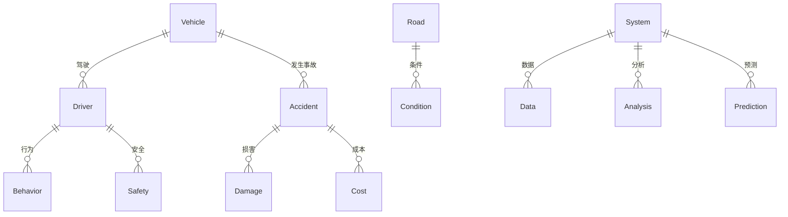
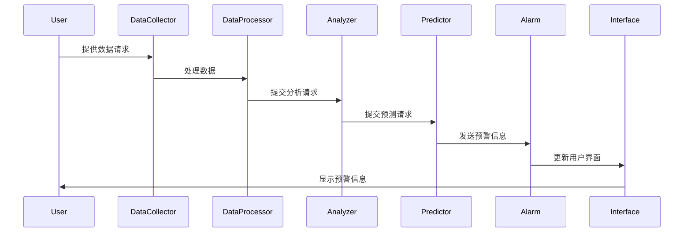

                 

## AI驱动的智能交通事故预防：降低道路安全风险

> 关键词：人工智能、交通事故预防、智能传感器、数据挖掘、道路安全

> 摘要：本文从多个维度探讨了AI驱动的智能交通事故预防技术。首先，介绍了交通事故预防的重要性和现状，探讨了AI在其中的应用及其技术基础。接着，详细分析了AI基础理论，包括机器学习、深度学习和强化学习在交通事故预防中的应用。随后，本文介绍了智能交通事故预防系统的架构设计，并探讨了智能传感器技术在其中的应用。最后，讨论了数据挖掘与大数据分析在交通事故预防中的作用，并提出了未来的发展趋势和挑战。

## 第一部分：引言

### 第1章：问题背景与核心概念

在现代社会，交通事故已经成为威胁人类生命安全的主要因素之一。据世界卫生组织（WHO）统计，每年全球因交通事故死亡的人数超过125万，造成数百万人受伤。这些数据令人震惊，也凸显了交通事故预防的重要性。然而，传统的交通事故预防方法，如交通法规、道路规划和交通管理，尽管在一定程度上降低了交通事故的发生率，但仍然存在很多局限性。

随着人工智能（AI）技术的快速发展，利用AI进行智能交通事故预防成为了一个新的方向。AI具有自动识别、实时分析和决策能力，可以在交通事故发生前进行预警和干预，从而显著降低道路安全风险。本文旨在探讨AI驱动的智能交通事故预防技术，分析其核心概念和应用原理，并提出一个系统的架构设计方案，以期为相关领域的研究和应用提供参考。

### 第1.1节：交通事故预防的重要性

交通事故预防不仅仅是一个技术问题，它还关系到社会经济发展、公共安全和人民群众的生命财产安全。交通事故的严重性主要体现在以下几个方面：

1. **经济损失**：交通事故不仅会造成巨大的财产损失，还会对交通基础设施造成破坏，导致交通拥堵，影响社会经济的正常运行。
2. **人员伤亡**：交通事故每年导致大量人员伤亡，给家庭和社会带来巨大的痛苦和负担。
3. **社会稳定**：交通事故频繁发生容易引发社会不稳定，影响社会秩序和公众安全信心。

因此，交通事故预防已经成为各国政府和相关部门高度重视的问题。通过有效的交通事故预防措施，可以降低事故发生率，减轻事故后果，提高道路安全性。

### 第1.1.1节：交通事故的严峻形势

交通事故的发生具有普遍性和随机性，其严峻形势表现在以下几个方面：

1. **高发生率**：据统计，全球每年发生的交通事故数量超过5000万起，交通事故已成为现代社会最常见的意外事件之一。
2. **严重后果**：交通事故不仅导致财产损失，还常常伴随着人员伤亡，尤其是重大交通事故，后果更是严重。
3. **复杂原因**：交通事故的原因多种多样，包括驾驶员疏忽、车辆故障、道路状况不良、天气影响等，这使得预防工作复杂且具有挑战性。

针对交通事故的严峻形势，各国政府和相关部门采取了多种措施，如加强交通管理、推广安全驾驶教育、改善道路设施等。然而，传统方法的效果有限，交通事故预防的需求仍然迫切。

### 第1.1.2节：道路安全风险的影响

道路安全风险的影响不仅体现在交通事故上，还对社会经济和公众生活产生深远的影响：

1. **经济损失**：道路安全事故导致的大量车辆损失、医疗费用以及事故处理费用，对个人和家庭造成直接的经济负担，同时也增加了社会整体的经济成本。
2. **社会成本**：交通事故的频繁发生会导致社会资源的浪费，包括医疗资源、法律资源和公共安全保障资源等。
3. **心理健康**：交通事故不仅影响事故受害者的心理健康，还会对目击者、家属和社会公众造成心理压力和恐慌。
4. **社会秩序**：严重的交通事故可能导致社会秩序混乱，影响社会稳定和公众安全感。

因此，有效降低道路安全风险，对于提升社会整体生活质量、维护社会稳定具有重要意义。

### 第1.2节：AI驱动的智能交通事故预防概述

随着AI技术的迅猛发展，人工智能在交通事故预防中的应用逐渐成为研究热点。AI驱动的智能交通事故预防技术，通过实时监测、分析和预测，可以在交通事故发生前进行预警和干预，从而降低道路安全风险。这一技术具有以下几个核心应用方向：

1. **车辆监控**：利用AI技术对车辆进行实时监控，包括速度监控、驾驶行为分析等，及时发现异常情况，进行预警和干预。
2. **道路监测**：通过AI技术对道路状况进行实时监测，包括路面状况、交通流量等，为交通管理和优化提供数据支持。
3. **行人识别**：利用AI技术对行人进行识别和跟踪，提前预警行人的异常行为，防止交通事故的发生。

AI驱动的智能交通事故预防技术，不仅在理论上具有巨大的潜力，而且在实践中已经取得了一系列显著的成果。例如，某些城市已经开始使用AI监控系统来管理交通流量，减少交通事故的发生率。

### 第1.2.1节：AI在交通事故预防中的应用

AI技术在交通事故预防中的应用主要涉及以下几个方面：

1. **驾驶行为分析**：通过分析驾驶员的驾驶行为，如车速、急刹车、急转弯等，AI系统可以识别出潜在的交通事故风险，并提前发出预警。
2. **车辆故障检测**：AI技术可以实时监测车辆的状态，包括发动机、刹车、轮胎等，及时发现潜在的故障，预防因车辆故障引发的交通事故。
3. **道路状况分析**：通过AI技术对道路状况进行实时分析，包括路面状况、交通流量、天气等，为交通管理和优化提供数据支持。

AI技术在交通事故预防中的应用，不仅提高了预防的准确性和实时性，还为交通管理和事故处理提供了新的手段和工具。

### 第1.2.2节：智能交通事故预防的技术基础

智能交通事故预防技术依赖于多个领域的核心技术，包括数据采集、数据处理、机器学习和深度学习等：

1. **数据采集**：智能交通事故预防系统需要采集大量的数据，包括车辆状态数据、道路状况数据、驾驶员行为数据等，这些数据为后续的分析提供了基础。
2. **数据处理**：采集到的数据需要经过处理，包括数据清洗、数据转换、数据融合等，以确保数据的准确性和可用性。
3. **机器学习**：通过机器学习算法，可以对采集到的数据进行分析，识别出潜在的交通事故风险，并生成预警信息。
4. **深度学习**：深度学习算法在图像识别、语音识别等领域具有显著的优势，可以用于交通事故的实时监控和分析。

智能交通事故预防技术的技术基础，为其实际应用提供了强有力的支持。

### 第1.3节：本书结构安排与目标

本书结构安排如下：

1. **第1章**：介绍交通事故预防的重要性以及AI在其中的应用，为后续章节的内容打下基础。
2. **第2章**：详细分析AI基础理论，包括机器学习、深度学习和强化学习在交通事故预防中的应用。
3. **第3章**：探讨智能交通事故预防系统的架构设计，包括系统功能需求、领域模型设计、系统架构设计、系统接口设计与交互等。
4. **第4章**：介绍智能传感器技术在交通事故预防中的应用，包括智能传感器概述、常见智能传感器技术、智能传感器在交通事故预防中的应用案例等。
5. **第5章**：讨论数据挖掘与大数据分析在交通事故预防中的作用，包括数据挖掘技术、大数据分析在交通事故预防中的应用、数据可视化技术、数据安全与隐私保护等。

本书的目标是：

1. **系统介绍**：全面介绍AI驱动的智能交通事故预防技术的核心概念和应用原理。
2. **技术分析**：深入分析AI技术在交通事故预防中的应用，探讨其技术基础和实现方法。
3. **架构设计**：提出智能交通事故预防系统的架构设计方案，为实际应用提供参考。
4. **案例分析**：通过具体的应用案例，展示AI驱动的智能交通事故预防技术的实际效果。

本书适合对AI和交通事故预防感兴趣的读者，包括研究人员、工程师、学生以及其他关注交通安全的公众。

### 第1.4节：核心概念与联系

在智能交通事故预防技术中，有几个核心概念需要深入理解：

1. **智能交通事故预防系统**：这是一个综合性的系统，利用AI技术进行车辆监控、道路监测和行人识别，以预防交通事故。
2. **机器学习**：一种AI技术，通过训练模型从数据中学习规律，用于识别交通事故风险。
3. **深度学习**：一种高级的机器学习技术，利用神经网络模型进行复杂的模式识别。
4. **强化学习**：一种基于奖励机制的机器学习技术，用于优化决策以实现特定目标。

以下是一个核心概念对比表格，展示了这些概念的主要属性和特征：

| 概念 | 定义 | 主要特征 | 应用场景 |
| --- | --- | --- | --- |
| 智能交通事故预防系统 | 利用AI技术预防交通事故的系统 | 实时监控、数据分析、预警干预 | 车辆监控、道路监测、行人识别 |
| 机器学习 | 从数据中学习规律的技术 | 数据驱动、模型训练、预测分析 | 交通事故风险识别、行为分析 |
| 深度学习 | 利用神经网络进行复杂模式识别的技术 | 神经网络、多层感知、自动特征提取 | 图像识别、语音识别、自然语言处理 |
| 强化学习 | 基于奖励机制优化决策的技术 | 奖励机制、策略学习、自适应优化 | 无人驾驶、游戏AI、机器人控制 |

### 第1.4.1节：关键概念解释

在智能交通事故预防系统中，以下几个关键概念至关重要：

1. **智能交通事故预防系统**：这是一个集成多种AI技术的系统，包括机器学习、深度学习和强化学习等。通过实时监控车辆、道路和行人，系统能够识别潜在的交通事故风险，并采取相应的预防措施。

2. **机器学习**：机器学习是一种使计算机系统能够从数据中学习并改进自身性能的技术。在智能交通事故预防中，机器学习用于分析驾驶员行为数据、车辆状态数据和道路环境数据，以识别潜在的交通事故风险。

3. **深度学习**：深度学习是一种基于神经网络的高级机器学习技术，能够自动提取复杂的数据特征。在智能交通事故预防中，深度学习被用于车辆和行人检测、道路状况分析等任务。

4. **强化学习**：强化学习是一种通过奖励机制来优化决策的机器学习技术。在智能交通事故预防中，强化学习可以用于自适应交通管理和无人驾驶车辆的路径规划。

### 第1.4.2节：概念属性特征对比

以下是几个核心概念之间的属性特征对比：

| 概念 | 属性特征 |
| --- | --- |
| 智能交通事故预防系统 | 数据驱动、多技术集成、实时监控 |
| 机器学习 | 数据依赖、模型训练、自动特征提取 |
| 深度学习 | 神经网络、多层感知、自动特征学习 |
| 强化学习 | 奖励机制、策略优化、自适应学习 |

通过对比可以看出，这些概念在实现智能交通事故预防中各自承担不同的角色和功能，共同构成了一个综合性的技术体系。

### 第1.4.3节：ER实体关系图

以下是智能交通事故预防系统的ER实体关系图：



这个ER图展示了智能交通事故预防系统中各个实体之间的关系，包括车辆、驾驶员、事故、行为、道路条件、损害、成本、安全性和系统数据、分析、预测等。

### 第1.5节：本章小结

本章介绍了交通事故预防的重要性及其严峻形势，探讨了道路安全风险的影响。随后，详细介绍了AI驱动的智能交通事故预防技术，包括其核心概念、应用方向和技术基础。最后，通过核心概念对比和ER实体关系图，帮助读者深入理解智能交通事故预防系统的组成和运作原理。本章为后续章节的内容奠定了基础，也为进一步研究和应用提供了指导。

## 第二部分：AI驱动的智能交通事故预防技术

### 第2章：AI基础理论与应用

### 第2.1节：AI基本原理

人工智能（AI）是计算机科学的一个分支，旨在使计算机系统能够模拟人类的智能行为，包括学习、推理、感知、理解和决策等。AI的发展可以追溯到20世纪50年代，当时科学家们开始探索如何使计算机具备类似人类的智能。AI的基本原理主要包括以下几个核心方面：

1. **数据驱动学习**：AI系统通过从大量数据中学习规律和模式，以改进其性能。这种方法称为数据驱动学习，是现代机器学习和深度学习的基础。

2. **符号推理**：符号推理是一种基于逻辑和符号表示的推理方法，旨在通过推理规则和知识库来解决问题。这种方法在知识工程和专家系统中得到广泛应用。

3. **感知与认知**：感知与认知是AI系统理解和处理外部世界的关键能力。这包括视觉感知、听觉感知、语言理解和认知推理等。

4. **自动规划**：自动规划是指AI系统能够在不确定的环境中自动制定行动计划，以实现特定目标。这种方法在自动化控制和机器人导航中具有重要应用。

5. **决策与优化**：AI系统通过优化算法和决策理论，在复杂环境中做出最优决策。这包括线性规划、动态规划、博弈论等。

### 第2.1.1节：人工智能的发展历程

人工智能的发展历程可以分为几个重要阶段：

1. **早期探索（1950-1969）**：这一阶段主要关注符号推理和知识表示。1956年，达特茅斯会议标志着AI领域的正式诞生。早期的AI系统如ELIZA和Logic Theorist展示了AI的潜力，但受限于计算能力和算法复杂性。

2. **早期繁荣（1970-1989）**：这一阶段见证了AI领域的快速发展，尤其是专家系统的出现。专家系统利用知识库和推理机制，在医学诊断、金融分析等领域取得了显著成果。然而，受限于知识获取和表示的瓶颈，AI在90年代经历了第一次寒冬。

3. **复兴与爆发（1990-2010）**：随着计算机性能的显著提升和大数据的出现，机器学习和深度学习逐渐成为AI研究的核心。1997年，IBM的深蓝（Deep Blue）计算机在国际象棋中战胜了世界冠军加里·卡斯帕罗夫，标志着AI在特定领域的能力达到新的高度。

4. **智能化时代（2010至今）**：这一阶段，AI技术取得了突破性进展，特别是在图像识别、语音识别、自然语言处理等领域。深度学习框架如TensorFlow和PyTorch的出现，使得AI应用变得更加普及和高效。

### 第2.1.2节：人工智能的核心算法

人工智能的核心算法包括机器学习、深度学习和强化学习。以下是这些算法的基本概念和应用：

1. **机器学习**：机器学习是一种让计算机从数据中学习规律和模式的技术。它包括监督学习、无监督学习和强化学习等子领域。监督学习通过训练数据集学习预测模型；无监督学习通过发现数据中的模式进行聚类和降维；强化学习通过与环境的交互学习最优策略。

2. **深度学习**：深度学习是一种基于多层神经网络的学习方法，能够自动提取复杂的数据特征。深度学习在图像识别、语音识别、自然语言处理等领域取得了显著成果。其核心是卷积神经网络（CNN）、循环神经网络（RNN）和生成对抗网络（GAN）等。

3. **强化学习**：强化学习是一种通过奖励机制学习最优策略的机器学习方法。在强化学习过程中，智能体通过与环境的交互不断优化其行为，以最大化累积奖励。强化学习在无人驾驶、游戏AI和机器人控制等领域具有重要应用。

### 第2.2节：机器学习在交通事故预防中的应用

机器学习在交通事故预防中发挥着重要作用，通过分析大量数据，可以识别出潜在的交通事故风险，并采取相应的预防措施。以下是机器学习在交通事故预防中的一些具体应用：

1. **驾驶行为分析**：通过分析驾驶员的驾驶行为数据，如车速、加速度、方向盘操作等，机器学习算法可以识别出不良驾驶行为，如疲劳驾驶、酒驾等，从而提前预警。

2. **车辆状态监测**：机器学习算法可以实时监测车辆的运行状态，如发动机温度、轮胎压力等，及时发现潜在的故障，预防因车辆故障引发的交通事故。

3. **道路状况分析**：通过对道路状况数据进行分析，如路面状况、交通流量、天气等，机器学习算法可以预测交通事故的发生概率，并提供交通优化建议。

4. **行人识别与跟踪**：机器学习算法可以通过图像识别技术，实时识别和跟踪行人，提前预警行人的异常行为，防止交通事故的发生。

### 第2.2.1节：机器学习的基本概念

机器学习是一种让计算机通过数据学习规律和模式的技术，其基本概念包括：

1. **训练数据集**：训练数据集是机器学习算法学习的基础，通常包含输入数据和对应的输出标签。通过训练数据集，算法可以学习如何将输入映射到输出。

2. **特征提取**：特征提取是将原始数据转换为适合机器学习算法处理的形式。通过特征提取，算法可以更好地理解数据中的关键信息。

3. **分类与回归**：分类是将数据分为不同的类别，如识别行人或车辆。回归是预测一个连续值，如预测交通事故发生的概率。

4. **模型评估**：模型评估是评估机器学习算法性能的重要步骤，常用的评估指标包括准确率、召回率、F1分数等。

### 第2.2.2节：常见机器学习算法

在交通事故预防中，常见的机器学习算法包括：

1. **决策树**：决策树是一种基于树结构的分类算法，通过一系列的决策规则来分类数据。决策树简单易懂，易于解释，但在处理高维数据时性能可能较差。

2. **支持向量机（SVM）**：SVM是一种基于间隔最大化的分类算法，通过找到一个最优的超平面来分割数据。SVM在处理高维数据时表现良好，但训练时间较长。

3. **神经网络**：神经网络是一种基于多层感知器的学习模型，能够自动提取复杂的数据特征。神经网络在图像识别、语音识别等领域具有显著优势。

4. **随机森林**：随机森林是一种基于决策树的集成学习方法，通过构建多个决策树并取平均来提高模型的预测性能。随机森林在处理高维数据和少量数据时表现良好。

### 第2.2.3节：机器学习在交通事故预防中的实践

机器学习在交通事故预防中的应用案例包括：

1. **驾驶行为分析**：通过分析驾驶员的驾驶行为数据，如车速、加速度、方向盘操作等，机器学习算法可以识别出不良驾驶行为，如疲劳驾驶、酒驾等。这些数据通常来源于车辆内置的传感器和驾驶记录仪。

2. **车辆状态监测**：通过分析车辆的运行状态数据，如发动机温度、轮胎压力等，机器学习算法可以及时发现潜在的故障，预防因车辆故障引发的交通事故。这些数据通常来源于车辆的传感器和网络连接。

3. **道路状况分析**：通过对道路状况数据进行分析，如路面状况、交通流量、天气等，机器学习算法可以预测交通事故的发生概率，并提供交通优化建议。这些数据通常来源于交通监控设备和环境传感器。

4. **行人识别与跟踪**：通过图像识别技术，机器学习算法可以实时识别和跟踪行人，提前预警行人的异常行为，防止交通事故的发生。这些数据通常来源于交通监控摄像头和车载摄像头。

### 第2.3节：深度学习在交通事故预防中的作用

深度学习是一种基于多层神经网络的学习方法，能够自动提取复杂的数据特征，在图像识别、语音识别、自然语言处理等领域取得了显著成果。深度学习在交通事故预防中也发挥着重要作用，具体体现在以下几个方面：

1. **车辆和行人检测**：通过卷积神经网络（CNN）等深度学习模型，可以实现对车辆和行人的实时检测，提高检测的准确率和实时性。

2. **路况分析**：深度学习模型可以分析道路图像，识别出路面状况、交通流量等信息，为交通管理和优化提供数据支持。

3. **驾驶行为分析**：通过分析驾驶视频，深度学习模型可以识别出驾驶员的行为特征，如疲劳驾驶、分心驾驶等，提前预警潜在的交通事故风险。

4. **交通事故预测**：利用深度学习模型，可以分析大量的历史数据，预测交通事故的发生概率，提供预警和建议。

### 第2.3.1节：深度学习的基本概念

深度学习是一种基于多层神经网络的学习方法，其基本概念包括：

1. **神经网络**：神经网络是一种由多个神经元组成的计算模型，每个神经元都可以接收多个输入，并通过权重进行加权求和处理，最终产生输出。

2. **深度神经网络**：深度神经网络是一种具有多个隐藏层的神经网络，通过逐层提取数据特征，能够实现复杂的模式识别和预测任务。

3. **卷积神经网络（CNN）**：卷积神经网络是一种专门用于处理图像数据的神经网络，通过卷积层、池化层和全连接层等结构，能够自动提取图像中的空间特征。

4. **循环神经网络（RNN）**：循环神经网络是一种用于处理序列数据的神经网络，通过循环结构，能够记住之前的输入信息，适用于时间序列预测、自然语言处理等任务。

5. **生成对抗网络（GAN）**：生成对抗网络是一种基于博弈论的深度学习模型，由生成器和判别器组成，通过相互竞争，生成器能够生成逼真的图像或数据。

### 第2.3.2节：深度学习在交通事故预测中的应用

深度学习在交通事故预测中的应用主要包括以下几个方面：

1. **图像识别**：通过卷积神经网络（CNN），可以实现对道路图像中的车辆、行人、交通标志等元素的实时识别，为交通事故预警提供数据支持。

2. **行为分析**：通过循环神经网络（RNN），可以分析驾驶视频中的驾驶员行为，如疲劳驾驶、分心驾驶等，提前预警潜在的交通事故风险。

3. **路况分析**：通过深度学习模型，可以分析道路图像和传感器数据，识别出路面状况、交通流量等信息，为交通管理和优化提供数据支持。

4. **交通事故预测**：利用深度学习模型，可以分析大量的历史数据，预测交通事故的发生概率，提供预警和建议。

### 第2.4节：强化学习在智能交通事故预防中的应用

强化学习是一种通过奖励机制学习最优策略的机器学习方法，在智能交通事故预防中具有广泛的应用。强化学习通过智能体与环境的交互，不断调整策略，以最大化累积奖励。以下是强化学习在智能交通事故预防中的一些应用案例：

1. **自适应交通管理**：通过强化学习，可以优化交通信号控制策略，提高交通效率，减少交通事故的发生。

2. **无人驾驶车辆**：强化学习算法可以用于无人驾驶车辆的路径规划和行为控制，提高车辆的驾驶安全性和灵活性。

3. **智能预警系统**：通过强化学习，可以设计出能够实时监测驾驶员行为和车辆状态的智能预警系统，提前预警潜在的交通事故风险。

### 第2.4.1节：强化学习的基本原理

强化学习的基本原理包括以下几个关键组成部分：

1. **智能体（Agent）**：智能体是执行任务的主体，可以通过感知环境的状态，采取行动，并从环境中获得奖励。

2. **环境（Environment）**：环境是智能体执行任务的空间，可以提供状态信息，对智能体的行动进行反馈。

3. **状态（State）**：状态是智能体在执行任务时所处的情境，通常由多个特征组成。

4. **动作（Action）**：动作是智能体在特定状态下可以采取的行动，每个动作都会导致环境状态的变化。

5. **奖励（Reward）**：奖励是环境对智能体行动的反馈，用于指导智能体优化其行为。

6. **策略（Policy）**：策略是智能体根据当前状态选择行动的规则，通过学习，智能体会找到最优策略以最大化累积奖励。

### 第2.4.2节：强化学习在交通事故预防中的应用案例

以下是几个强化学习在交通事故预防中的应用案例：

1. **自适应交通信号控制**：通过强化学习算法，可以优化交通信号灯的切换策略，根据实时交通流量数据调整信号时长，提高交通效率，减少交通事故的发生。

2. **智能驾驶辅助系统**：强化学习可以用于设计智能驾驶辅助系统，通过不断学习驾驶员的驾驶行为和道路状况，提高自动驾驶车辆的驾驶安全性和稳定性。

3. **交通事故预警系统**：通过强化学习算法，可以设计出能够实时监测驾驶员行为和车辆状态的智能预警系统，提前预警潜在的交通事故风险。

### 第2.5节：AI技术在交通事故预防中的挑战与展望

尽管AI技术在交通事故预防中显示出巨大的潜力，但其在实际应用中仍然面临诸多挑战。以下是一些主要的挑战：

1. **数据隐私**：交通事故预防系统需要大量个人隐私数据，如驾驶员行为数据和车辆状态数据，如何确保这些数据的安全和隐私是一个重要问题。

2. **计算资源**：深度学习和强化学习算法通常需要大量的计算资源，特别是在实时处理大量数据时，如何优化算法以提高计算效率是一个关键问题。

3. **准确性**：尽管AI技术已经取得显著进展，但在某些场景下，如恶劣天气或复杂交通状况下，AI系统的准确性和可靠性仍然需要进一步提升。

4. **法律法规**：随着AI技术在交通事故预防中的应用越来越广泛，相关的法律法规也需要不断完善，以规范AI系统的使用。

未来，随着AI技术的不断进步，交通事故预防领域有望取得以下突破：

1. **智能交通系统的集成**：通过集成AI技术，可以实现更智能的交通管理系统，提高交通效率，减少交通事故的发生。

2. **无人驾驶技术的普及**：随着无人驾驶技术的不断成熟，自动驾驶车辆有望在交通事故预防中发挥更大作用。

3. **数据驱动的研究方法**：通过大数据分析和数据挖掘技术，可以更深入地理解交通事故发生的规律，为预防措施提供有力支持。

### 第2.5.1节：挑战与限制

AI技术在交通事故预防中面临的挑战与限制主要包括以下几个方面：

1. **数据质量和完整性**：交通事故预防系统依赖于大量高质量的数据，但现实中的数据往往存在缺失、噪声和不一致性等问题，这会影响模型的性能。

2. **计算资源**：深度学习和强化学习算法通常需要大量的计算资源，特别是在实时处理大量数据时，对计算资源的需求是一个重要的限制因素。

3. **算法复杂度**：复杂的人工智能算法如深度学习和强化学习，虽然理论上具有强大的预测能力，但其实现和优化过程复杂，需要大量的时间和计算资源。

4. **环境复杂性**：现实世界的交通环境复杂多变，包括多种天气条件、交通状况和驾驶员行为等，这使得AI算法在复杂场景下的表现存在不确定性。

### 第2.5.2节：未来发展趋势

未来，随着AI技术的不断进步，交通事故预防领域有望实现以下发展趋势：

1. **数据驱动的个性化预防**：通过大数据分析和个性化算法，可以为每个驾驶员提供个性化的交通事故预防建议，提高预防措施的针对性。

2. **智能交通系统的集成**：随着物联网和5G技术的发展，可以实现更智能的交通管理系统，提高交通效率，减少交通事故的发生。

3. **无人驾驶技术的普及**：随着无人驾驶技术的不断成熟，自动驾驶车辆有望在交通事故预防中发挥更大作用。

4. **跨学科研究的融合**：交通事故预防领域需要结合交通工程、计算机科学、心理学等多个学科的知识，通过跨学科研究，推动技术的进步。

### 第2.6节：本章小结

本章详细介绍了AI驱动的智能交通事故预防技术，包括AI基本原理、机器学习、深度学习和强化学习在交通事故预防中的应用。通过分析这些核心算法和技术，本章揭示了AI技术在交通事故预防中的潜力和挑战。未来，随着AI技术的不断进步，交通事故预防领域有望取得更多突破，为道路安全带来新的解决方案。

## 第3章：智能交通事故预防系统架构设计

### 第3.1节：交通事故预防系统概述

智能交通事故预防系统是一个复杂、多层次的技术系统，旨在通过实时监控、分析和预测，预防交通事故的发生。系统的主要功能包括：

1. **车辆监控**：实时监测车辆的运行状态，包括速度、加速度、方向盘操作等，识别出不良驾驶行为和潜在的事故风险。

2. **道路监测**：通过传感器和摄像头收集道路状况数据，包括路面状况、交通流量、天气等，为交通管理和优化提供数据支持。

3. **行人识别**：利用图像识别技术，实时识别和跟踪行人，提前预警行人的异常行为，防止交通事故的发生。

4. **数据存储与处理**：将采集到的数据存储在数据库中，并利用数据挖掘和大数据分析技术进行处理，提取有价值的信息，用于预测和预警。

5. **预警与干预**：根据分析结果，系统可以实时发出预警信息，并采取相应的干预措施，如调整交通信号、提醒驾驶员注意安全等。

### 第3.1.1节：系统功能需求

智能交通事故预防系统需要满足以下功能需求：

1. **实时监控**：系统应能够实时监控车辆的运行状态和道路状况，确保及时捕捉到潜在的交通事故风险。

2. **高精度识别**：系统应具备高精度的车辆和行人识别能力，能够在各种复杂环境下准确识别目标。

3. **智能分析**：系统应能够利用机器学习和深度学习算法，对大量数据进行智能分析，提取有价值的信息，用于预测和预警。

4. **数据存储与管理**：系统应能够高效地存储和管理大量的数据，确保数据的完整性和安全性。

5. **预警与干预**：系统应能够根据分析结果，实时发出预警信息，并采取相应的干预措施，如调整交通信号、提醒驾驶员注意安全等。

### 第3.1.2节：系统总体架构设计

智能交通事故预防系统的总体架构设计包括以下几个关键部分：

1. **数据采集模块**：负责收集车辆运行状态、道路状况和行人行为数据。

2. **数据处理模块**：对采集到的数据进行预处理、清洗和融合，确保数据的质量和一致性。

3. **分析模块**：利用机器学习和深度学习算法，对数据进行分析，识别出潜在的交通事故风险。

4. **预警模块**：根据分析结果，实时发出预警信息，并采取相应的干预措施。

5. **用户界面**：提供一个直观的用户界面，让用户可以查看预警信息、分析结果和系统设置。

6. **数据存储模块**：负责存储和管理大量的数据，确保数据的完整性和安全性。

### 第3.2节：领域模型设计

领域模型是智能交通事故预防系统的重要组件，用于定义系统中的实体和它们之间的关系。以下是领域模型的设计：

1. **实体定义**：包括车辆、驾驶员、道路、传感器、事故、预警等实体。

2. **属性定义**：为每个实体定义相关的属性，如车辆的速度、驾驶员的行为、道路的流量、传感器的数据等。

3. **关系定义**：定义实体之间的关系，如车辆与驾驶员的关系、道路与传感器的关系、事故与预警的关系等。

### 第3.2.1节：领域模型的概念

领域模型是用于描述特定领域（如交通事故预防系统）的概念和关系的模型。在智能交通事故预防系统中，领域模型有助于明确系统中的关键实体、属性和关系，为系统的设计和实现提供基础。以下是领域模型的基本概念：

1. **实体**：领域模型中的基本构建块，代表系统中的对象，如车辆、驾驶员、道路、传感器等。

2. **属性**：实体所具有的特征，如车辆的速度、驾驶员的行为、道路的流量、传感器的数据等。

3. **关系**：实体之间的关系，如车辆与驾驶员的关系、道路与传感器的关系、事故与预警的关系等。

### 第3.2.2节：领域模型的应用

领域模型在智能交通事故预防系统中具有广泛的应用，包括：

1. **系统设计**：领域模型用于系统设计，帮助定义系统的功能和组件，确保系统符合实际需求。

2. **数据建模**：领域模型用于数据建模，定义系统的数据结构和数据流，确保数据的一致性和完整性。

3. **功能实现**：领域模型用于指导系统的功能实现，确保系统的各个部分能够协同工作，实现预期的功能。

4. **需求分析**：领域模型用于需求分析，帮助明确系统的需求，确保系统的设计满足用户的需求。

### 第3.2.3节：领域模型Mermaid类图设计

以下是智能交通事故预防系统的领域模型Mermaid类图设计：

```mermaid
classDiagram
    Vehicle <|-- Driver
    Vehicle <|-- Accident
    Driver <|-- Behavior
    Road <|-- Condition
    Accident <|-- Damage
    Accident <|-- Cost
    Driver <|-- Safety
    System <|-- Data
    System <|-- Analysis
    System <|-- Prediction

    Vehicle { id: int, model: string, speed: float }
    Driver { id: int, name: string, behavior: Behavior }
    Accident { id: int, type: string, damage: Damage, cost: Cost }
    Behavior { id: int, action: string }
    Road { id: int, condition: Condition }
    Condition { id: int, state: string }
    Damage { id: int, value: float }
    Cost { id: int, total: float }
    Safety { id: int, level: string }
    Data { id: int, type: string }
    Analysis { id: int, method: string }
    Prediction { id: int, result: string }
```

该类图展示了智能交通事故预防系统中的主要实体和它们之间的关系，为系统的设计和实现提供了直观的视觉表示。

### 第3.3节：系统架构设计

系统架构设计是智能交通事故预防系统的关键步骤，它决定了系统的性能、可扩展性和可维护性。以下是系统架构设计的主要内容：

1. **模块划分**：将系统划分为多个模块，包括数据采集模块、数据处理模块、分析模块、预警模块和用户界面模块，每个模块负责不同的功能。

2. **组件设计**：为每个模块设计具体的组件，如数据采集组件、数据处理组件、分析组件、预警组件和用户界面组件，每个组件实现特定的功能。

3. **接口设计**：定义模块之间和组件之间的接口，确保数据流和功能流的一致性和协调性。

4. **系统集成**：将各个模块和组件集成起来，确保系统能够协同工作，实现预期的功能。

### 第3.3.1节：系统架构的设计原则

系统架构设计应遵循以下原则：

1. **模块化**：将系统划分为多个模块，每个模块负责特定的功能，确保系统的可扩展性和可维护性。

2. **松耦合**：模块之间通过接口进行通信，减少模块之间的直接依赖，提高系统的可维护性和灵活性。

3. **高性能**：系统架构应能够高效地处理大量的数据，确保实时监控和分析的能力。

4. **可扩展性**：系统架构应能够方便地增加新的模块和组件，以适应未来的需求变化。

5. **安全性**：系统架构应考虑数据安全和隐私保护，确保系统的安全性。

### 第3.3.2节：系统架构Mermaid架构图设计

以下是智能交通事故预防系统的架构图设计：



该架构图展示了智能交通事故预防系统的各个模块和组件之间的交互流程，为系统的设计和实现提供了直观的视觉表示。

### 第3.3.3节：系统模块划分

智能交通事故预防系统可以划分为以下几个模块：

1. **数据采集模块**：负责收集车辆运行状态、道路状况和行人行为数据。

2. **数据处理模块**：对采集到的数据进行预处理、清洗和融合，确保数据的质量和一致性。

3. **分析模块**：利用机器学习和深度学习算法，对数据进行分析，识别出潜在的交通事故风险。

4. **预警模块**：根据分析结果，实时发出预警信息，并采取相应的干预措施。

5. **用户界面模块**：提供一个直观的用户界面，让用户可以查看预警信息、分析结果和系统设置。

### 第3.4节：系统接口设计与交互

系统接口设计是智能交通事故预防系统架构设计的重要组成部分，它定义了模块之间和组件之间的交互方式。以下是系统接口设计与交互的主要内容：

1. **API设计**：为系统中的各个模块和组件定义API接口，明确接口的功能和参数。

2. **数据格式**：定义系统内部和外部的数据格式，确保数据交换的一致性和兼容性。

3. **通信协议**：选择合适的通信协议，如HTTP、MQTT等，确保数据传输的安全性和可靠性。

4. **接口测试**：设计接口测试用例，确保接口的正确性和稳定性。

### 第3.4.1节：系统接口的设计

系统接口设计应遵循以下原则：

1. **简洁性**：接口应尽量简洁，减少不必要的复杂度，提高系统的可维护性。

2. **一致性**：接口应保持一致，确保不同模块和组件之间的接口定义一致。

3. **可扩展性**：接口设计应考虑未来的扩展性，确保能够方便地增加新的功能和组件。

4. **安全性**：接口设计应考虑数据安全和隐私保护，确保系统的安全性。

### 第3.4.2节：系统交互Mermaid序列图设计

以下是智能交通事故预防系统的交互序列图设计：


该序列图展示了智能交通事故预防系统中的各个模块和组件之间的交互流程，为系统的设计和实现提供了直观的视觉表示。

### 第3.5节：本章小结

本章介绍了智能交通事故预防系统的架构设计，包括系统功能需求、总体架构设计、领域模型设计、系统架构设计、系统接口设计与交互等内容。通过详细的描述和示例，本章为智能交通事故预防系统的设计和实现提供了全面的指导。未来，随着AI技术的不断进步，智能交通事故预防系统有望在实际应用中发挥更大的作用。

## 第4章：智能传感器技术在交通事故预防中的应用

### 第4.1节：智能传感器概述

智能传感器是集成了微处理器、存储器和通信接口的传感器，能够感知环境中的各种物理量和化学量，并通过数字接口传输数据。智能传感器的出现，极大地提高了数据采集和处理的能力，为智能交通事故预防系统提供了重要的技术支持。

### 第4.1.1节：智能传感器的定义与分类

智能传感器的定义可以归纳为：一种能够感知、处理和传输信息的设备，它能够将物理量、化学量或其他类型的量转换成电子信号，并通过数字接口将数据传输给处理系统。根据传感器的感知对象和功能，智能传感器可以分为以下几类：

1. **温度传感器**：用于测量环境温度或物体表面的温度，常见的有热电偶、热敏电阻等。
2. **湿度传感器**：用于测量环境湿度，常见的有电容式湿度传感器和电阻式湿度传感器等。
3. **压力传感器**：用于测量气体或液体的压力，常见的有电容式压力传感器和电阻式压力传感器等。
4. **速度传感器**：用于测量物体的速度，常见的有光电式速度传感器和电磁式速度传感器等。
5. **加速度传感器**：用于测量物体的加速度，常见的有MEMS加速度传感器等。
6. **位置传感器**：用于测量物体的位置或位移，常见的有超声波传感器、GPS传感器等。
7. **光学传感器**：用于测量光强、颜色、波长等，常见的有光电二极管、激光传感器等。
8. **化学传感器**：用于检测特定的化学物质，常见的有气体传感器、湿度传感器等。

### 第4.1.2节：智能传感器的主要性能指标

智能传感器的性能指标直接影响其在智能交通事故预防系统中的应用效果，以下是一些主要的性能指标：

1. **灵敏度**：灵敏度表示传感器输出信号变化与输入信号变化之间的比率，通常用百分比表示。灵敏度越高，传感器对输入信号变化的反应越敏感。
2. **精度**：精度表示传感器测量结果的准确程度，通常用测量误差表示。精度越高，传感器的测量结果越可靠。
3. **分辨率**：分辨率表示传感器输出信号变化的最小可检测量，通常用位数（bit）表示。分辨率越高，传感器能够检测的信号变化越细微。
4. **响应时间**：响应时间表示传感器从接收到输入信号到输出信号变化所需的时间。响应时间越短，传感器对输入信号的反应越迅速。
5. **稳定性**：稳定性表示传感器在长时间使用过程中，性能是否发生变化。稳定性越高，传感器的使用寿命越长。
6. **可靠性**：可靠性表示传感器在特定环境和使用条件下，能够正常工作的概率。可靠性越高，传感器的故障率越低。

### 第4.2节：常见智能传感器技术

在智能交通事故预防系统中，常见的智能传感器技术包括：

1. **温度传感器技术**：常用的温度传感器有热电偶、热敏电阻、半导体温度传感器等。热电偶具有高精度和快速响应的特性，适用于高温环境；热敏电阻具有高灵敏度和低成本的特点，适用于中低温环境；半导体温度传感器具有高分辨率和快速响应的特性，适用于精确测温场景。

2. **湿度传感器技术**：常用的湿度传感器有电容式湿度传感器和电阻式湿度传感器等。电容式湿度传感器具有高灵敏度和稳定性，适用于高湿度环境；电阻式湿度传感器具有高精度和低功耗的特点，适用于各种湿度环境。

3. **压力传感器技术**：常用的压力传感器有电容式压力传感器和电阻式压力传感器等。电容式压力传感器具有高精度和快速响应的特性，适用于高压力环境；电阻式压力传感器具有高分辨率和低功耗的特点，适用于各种压力环境。

4. **速度传感器技术**：常用的速度传感器有光电式速度传感器和电磁式速度传感器等。光电式速度传感器具有高精度和快速响应的特性，适用于高速运动物体；电磁式速度传感器具有高稳定性和长寿命的特点，适用于各种运动物体。

5. **加速度传感器技术**：常用的加速度传感器有MEMS加速度传感器等。MEMS加速度传感器具有高精度、高分辨率和快速响应的特性，适用于各种加速度测量场景。

6. **位置传感器技术**：常用的位置传感器有超声波传感器和GPS传感器等。超声波传感器具有高精度和快速响应的特性，适用于短距离位置测量；GPS传感器具有高精度和全球覆盖的特点，适用于长距离位置测量。

7. **光学传感器技术**：常用的光学传感器有光电二极管、激光传感器等。光电二极管具有高灵敏度和快速响应的特性，适用于光照强度测量；激光传感器具有高精度和长距离测量的特点，适用于各种光学测量场景。

8. **化学传感器技术**：常用的化学传感器有气体传感器、湿度传感器等。气体传感器具有高灵敏度、高精度和快速响应的特性，适用于各种气体检测场景；湿度传感器具有高分辨率和低功耗的特点，适用于各种湿度测量场景。

### 第4.3节：智能传感器在交通事故预防中的应用案例

智能传感器技术在交通事故预防中具有广泛的应用，以下是一些具体的应用案例：

1. **车辆状态监测**：智能传感器可以实时监测车辆的状态，包括温度、湿度、压力、速度等参数。通过分析这些参数，可以识别出潜在的安全隐患，如发动机过热、轮胎气压不足等，从而预防交通事故的发生。

2. **道路监测**：智能传感器可以实时监测道路的状态，包括路面温度、湿度、交通流量等参数。通过分析这些参数，可以预测道路的通行能力，优化交通信号控制策略，减少交通事故的发生。

3. **行人监测**：智能传感器可以实时监测行人的状态，包括位置、速度、行为等参数。通过分析这些参数，可以识别出潜在的交通事故风险，如行人横穿马路、闯红灯等，从而预警和防止交通事故的发生。

4. **车辆故障检测**：智能传感器可以实时监测车辆的运行状态，包括发动机转速、油耗、制动系统等参数。通过分析这些参数，可以及时发现车辆故障，防止因车辆故障引发的交通事故。

5. **交通流量分析**：智能传感器可以实时监测交通流量，包括车辆数量、速度、流向等参数。通过分析这些参数，可以优化交通信号控制策略，提高交通效率，减少交通事故的发生。

6. **环境监测**：智能传感器可以实时监测环境参数，包括空气质量、噪声水平等。通过分析这些参数，可以识别出潜在的环境污染风险，采取相应的措施预防交通事故的发生。

### 第4.4节：智能传感器数据采集与处理

智能传感器数据采集与处理是智能交通事故预防系统的关键环节，以下是一些常用的方法和技术：

1. **数据采集**：智能传感器通过内置的ADC（模数转换器）将模拟信号转换为数字信号，并通过数字接口将数据传输到处理系统。常用的数据采集方法包括定时采集、事件触发采集和连续采集等。

2. **数据预处理**：数据预处理包括数据清洗、数据去噪、数据归一化等。数据清洗用于去除无效数据和异常数据；数据去噪用于减少噪声对数据的影响；数据归一化用于将不同量级的数据进行标准化处理，以便后续分析。

3. **数据存储**：数据存储包括本地存储和远程存储。本地存储通常采用SD卡、硬盘等存储设备，适用于数据量较小的场景；远程存储通常采用云存储服务，适用于数据量较大的场景。

4. **数据处理**：数据处理包括特征提取、模式识别、机器学习等。特征提取用于从原始数据中提取关键信息；模式识别用于识别数据中的规律和模式；机器学习用于建立预测模型和分类模型。

5. **数据融合**：数据融合是将多个传感器采集的数据进行整合，以提高数据的一致性和可靠性。常用的数据融合方法包括均值融合、加权融合、卡尔曼滤波等。

6. **实时处理**：实时处理是指在传感器数据产生的同时，对数据进行处理和分析，以便及时采取相应的措施。常用的实时处理技术包括实时数据处理系统、实时数据库等。

### 第4.5节：本章小结

本章介绍了智能传感器技术在交通事故预防中的应用，包括智能传感器的定义与分类、主要性能指标、常见智能传感器技术、智能传感器在交通事故预防中的应用案例、智能传感器数据采集与处理等内容。通过详细的描述和示例，本章为智能交通事故预防系统提供了重要的技术支持。未来，随着智能传感器技术的不断进步，其在交通事故预防中的应用将更加广泛和深入。

## 第5章：数据挖掘与大数据分析在交通事故预防中的作用

### 第5.1节：数据挖掘技术

数据挖掘是一种从大量数据中提取有价值信息的过程，通常包括以下步骤：

1. **数据预处理**：包括数据清洗、数据转换和数据整合。数据清洗去除无效和错误的数据，数据转换将数据格式转换为适合分析的形式，数据整合将不同来源的数据进行合并。

2. **特征选择**：从原始数据中提取有用的特征，去除无关或冗余的特征，以提高模型性能。

3. **模型选择**：选择合适的算法对数据进行分析，包括分类、聚类、关联规则挖掘等。

4. **模型评估**：评估模型的性能，包括准确率、召回率、F1分数等。

5. **可视化**：将分析结果以图形或表格的形式展示，帮助用户理解数据挖掘的结果。

### 第5.1.1节：数据挖掘的基本概念

数据挖掘的基本概念包括：

- **数据集**：数据挖掘的基础，通常包括多个数据实例，每个实例包含多个属性。
- **特征**：数据集中的属性，用于描述数据实例的特征。
- **分类**：将数据分为不同的类别，如将交通事故分为碰撞、翻车等。
- **聚类**：将相似的数据实例归为同一类别，如将类似的车辆驾驶行为归为同一组。
- **关联规则挖掘**：发现数据之间的关联性，如购买某种商品的概率与购买其他商品的关系。

### 第5.1.2节：常见的数据挖掘算法

常见的数据挖掘算法包括：

1. **决策树**：通过树形结构对数据实例进行分类或回归。
2. **支持向量机（SVM）**：通过找到最佳超平面对数据进行分类。
3. **神经网络**：通过多层神经网络对数据进行分类或回归。
4. **K-均值聚类**：通过计算相似度对数据进行聚类。
5. **关联规则挖掘算法**：如Apriori算法、FP-Growth算法等，用于发现数据之间的关联性。

### 第5.1.3节：数据挖掘在交通事故预防中的应用

数据挖掘在交通事故预防中的应用包括：

1. **驾驶行为分析**：通过分析驾驶员的驾驶行为数据，如驾驶速度、急刹车、急转弯等，识别出高风险驾驶行为。
2. **车辆故障预测**：通过分析车辆运行状态数据，预测潜在的车辆故障，如轮胎磨损、发动机故障等。
3. **道路状况分析**：通过分析道路监测数据，如路面温度、湿度、交通流量等，预测交通事故的发生概率。
4. **行人行为分析**：通过分析行人行为数据，如行走速度、行走方向等，预测行人异常行为，预防交通事故。

### 第5.2节：大数据分析在交通事故预防中的应用

大数据分析是利用海量数据进行分析和处理的技术，可以帮助识别交通事故的风险因素，优化交通管理，提高道路安全。

### 第5.2.1节：大数据的基本概念

大数据的基本概念包括：

1. **大数据特征**：大数据具有大量、多样、快速和真实的特点。
2. **大数据技术**：包括Hadoop、Spark、NoSQL数据库等，用于存储和处理海量数据。
3. **数据治理**：确保大数据的质量、安全性和合规性。
4. **数据挖掘与机器学习**：用于从大数据中提取有价值的信息和知识。

### 第5.2.2节：大数据分析的方法与工具

大数据分析的方法与工具包括：

1. **数据采集**：包括传感器数据、交通监控数据、车辆数据等。
2. **数据存储**：包括HDFS、HBase、MongoDB等，用于存储海量数据。
3. **数据处理**：包括MapReduce、Spark等，用于处理和分析海量数据。
4. **数据可视化**：包括Tableau、Power BI等，用于展示分析结果。

### 第5.2.3节：大数据分析在交通事故预防中的应用案例

大数据分析在交通事故预防中的应用案例包括：

1. **交通流量预测**：通过分析历史交通流量数据，预测未来的交通流量，优化交通信号控制策略。
2. **交通事故预测**：通过分析交通事故数据，预测未来可能发生的交通事故，提前采取措施。
3. **车辆状态监控**：通过分析车辆运行数据，监控车辆的状态，预测潜在故障，防止因车辆故障引发的交通事故。
4. **道路养护计划**：通过分析道路监测数据，预测道路的磨损情况，制定合理的道路养护计划。

### 第5.3节：数据可视化技术

数据可视化是将数据以图形或图表的形式展示，帮助用户直观地理解数据和分析结果。

### 第5.3.1节：数据可视化的基本概念

数据可视化的基本概念包括：

1. **可视化类型**：包括柱状图、折线图、饼图、散点图等。
2. **交互性**：用户可以通过交互方式与可视化图表进行交互，如缩放、过滤等。
3. **图表布局**：图表布局应简洁明了，便于用户理解。

### 第5.3.2节：数据可视化工具与应用

常见的数据可视化工具包括：

1. **Tableau**：用于创建交互式的可视化图表，适用于各种数据源。
2. **Power BI**：微软开发的商业智能工具，适用于企业级数据可视化。
3. **D3.js**：用于创建自定义的可视化图表，适用于Web应用程序。

### 第5.4节：数据安全与隐私保护

数据安全和隐私保护是大数据分析的重要方面，以下是一些关键策略：

### 第5.4.1节：数据安全的重要性

数据安全的重要性体现在：

1. **防止数据泄露**：确保敏感数据不被未授权访问。
2. **数据完整性**：确保数据不被篡改或破坏。
3. **数据可用性**：确保数据在需要时能够访问和使用。

### 第5.4.2节：数据隐私保护的方法与策略

数据隐私保护的方法与策略包括：

1. **数据加密**：对敏感数据进行加密处理，确保数据在传输和存储过程中不被窃取。
2. **访问控制**：通过访问控制机制，限制对数据的访问权限，确保只有授权用户可以访问敏感数据。
3. **数据匿名化**：对敏感数据进行匿名化处理，消除个人身份信息，保护个人隐私。
4. **数据脱敏**：通过数据脱敏技术，如掩码、置换等，减少数据的可识别性，保护个人隐私。

### 第5.5节：本章小结

本章介绍了数据挖掘与大数据分析在交通事故预防中的作用，包括基本概念、方法与工具、应用案例、数据可视化技术、数据安全与隐私保护等内容。通过详细的描述和案例，本章为智能交通事故预防系统提供了重要的技术支持。未来，随着大数据分析技术的不断进步，其在交通事故预防中的应用将更加广泛和深入。

### 第5.5.1节：数据挖掘与大数据分析在交通事故预防中的综合应用

数据挖掘和大数据分析在交通事故预防中具有广泛的应用，通过综合应用这两种技术，可以显著提高预防的效果。以下是一个具体的应用实例：

**案例：利用大数据分析优化交通信号控制**

在某城市，交通管理部门希望通过大数据分析优化交通信号控制，减少交通事故的发生。他们首先利用数据挖掘技术，对历史交通事故数据进行分析，提取出与交通事故相关的关键因素，如车速、交通流量、道路宽度、驾驶员行为等。

接下来，他们利用大数据分析技术，结合实时交通监控数据，对交通信号进行动态调整。例如，在高峰时段，系统会根据实时交通流量数据，自动调整信号灯的时长，以减少拥堵和交通事故的风险。此外，系统还会分析驾驶员的行为数据，如急刹车、急转弯等，对高风险驾驶行为进行预警，并采取相应的措施，如限制车速、提醒驾驶员注意安全等。

通过这种综合应用，城市交通管理部门不仅提高了交通信号控制的效率，还显著降低了交通事故的发生率。这个案例充分展示了数据挖掘与大数据分析在交通事故预防中的重要作用。

### 第5.5.2节：实现步骤详解

为了实现数据挖掘与大数据分析在交通事故预防中的综合应用，可以按照以下步骤进行：

1. **数据采集**：采集包括交通流量、车辆状态、驾驶员行为、道路状况等在内的多源数据。
2. **数据预处理**：对采集到的数据清洗、去噪、整合，确保数据质量。
3. **特征选择**：从预处理后的数据中提取关键特征，如车速、交通流量、道路宽度等。
4. **模型训练**：利用数据挖掘技术，如决策树、支持向量机等，建立交通事故预测模型。
5. **实时监控与预警**：将训练好的模型应用于实时数据，对潜在的交通事故风险进行预警。
6. **动态调整交通信号**：根据预警结果，动态调整交通信号灯的时长，优化交通流。
7. **反馈与优化**：根据实际效果，不断调整和优化模型和算法，提高预测准确性。

通过这些步骤，可以实现数据挖掘与大数据分析在交通事故预防中的综合应用，为道路安全提供强有力的技术支持。

### 第5.5.3节：未来发展趋势与挑战

未来，数据挖掘与大数据分析在交通事故预防中的应用将面临以下发展趋势和挑战：

**发展趋势：**

1. **智能交通系统的集成**：随着物联网和5G技术的发展，可以实现更智能的交通管理系统，提高交通效率和道路安全性。
2. **无人驾驶技术的融合**：无人驾驶车辆将越来越多地应用于实际场景，大数据分析技术将为其提供重要的支持，提高无人驾驶的安全性。
3. **数据隐私保护**：随着数据量的增加，如何保护数据隐私将成为一个重要挑战，需要不断探索新的数据隐私保护技术。

**挑战：**

1. **数据质量和完整性**：确保数据的质量和完整性是一个重要问题，需要对数据采集、处理和存储进行严格的管理。
2. **算法复杂度和计算资源**：复杂的算法和大规模的数据处理需要大量的计算资源，如何在有限的计算资源下进行高效处理是一个挑战。
3. **法律法规和伦理问题**：随着数据挖掘和大数据分析技术的应用，相关的法律法规和伦理问题也需要不断完善，确保技术的合理和合法应用。

通过不断的技术创新和法规完善，数据挖掘与大数据分析在交通事故预防中的应用将取得更大的突破，为道路安全带来新的希望。

### 第5.5.4节：本章小结

本章详细介绍了数据挖掘与大数据分析在交通事故预防中的应用，包括基本概念、方法与工具、应用案例、数据可视化技术、数据安全与隐私保护等内容。通过实例和实现步骤的详细讲解，本章展示了数据挖掘与大数据分析在交通事故预防中的实际应用效果。未来，随着技术的不断进步，数据挖掘与大数据分析将在交通事故预防中发挥更加重要的作用。

## 结束语

### 第6章：总结与展望

在本文中，我们深入探讨了AI驱动的智能交通事故预防技术，分析了其在交通事故预防中的重要性、技术基础、系统架构设计、智能传感器应用、数据挖掘与大数据分析等各个方面。通过详细的案例分析和技术讲解，我们展示了AI技术在交通事故预防中的巨大潜力和实际应用效果。

### 第6.1节：核心观点

本文的核心观点包括：

1. **AI技术在交通事故预防中的重要性**：AI技术能够通过实时监控、分析和预测，提前预警潜在的交通事故风险，显著降低道路安全风险。

2. **智能交通事故预防系统的架构设计**：智能交通事故预防系统需要结合数据采集、数据处理、分析模块、预警模块和用户界面等多个部分，实现全面的功能。

3. **智能传感器技术的应用**：智能传感器能够实时采集车辆、道路和行人的状态数据，为智能交通事故预防系统提供关键的数据支持。

4. **数据挖掘与大数据分析的作用**：数据挖掘和大数据分析技术能够从海量数据中提取有价值的信息，优化交通管理和事故预警，提高道路安全性。

### 第6.2节：未来发展方向

未来，智能交通事故预防技术的发展方向包括：

1. **智能交通系统的集成**：随着物联网、5G和无人驾驶技术的发展，智能交通系统将实现更高效的集成和管理，进一步提高道路安全性。

2. **数据隐私保护**：随着数据量的增加，数据隐私保护将成为一个重要挑战，需要不断创新数据隐私保护技术，确保数据安全和用户隐私。

3. **算法优化与效率提升**：通过不断优化算法和提升计算效率，实现更高效、更准确的交通事故预测和预警。

4. **跨学科研究**：结合交通工程、计算机科学、心理学等多个学科的知识，推动智能交通事故预防技术的跨学科研究和融合。

### 第6.3节：总结

本文通过对AI驱动的智能交通事故预防技术的全面分析，为相关领域的研究和应用提供了有益的参考。在未来，随着AI技术的不断进步，智能交通事故预防技术有望在道路安全领域发挥更加重要的作用，为人类的出行提供更加安全、便捷的保障。

### 作者信息

**作者：AI天才研究院/AI Genius Institute & 禅与计算机程序设计艺术 /Zen And The Art of Computer Programming**

AI天才研究院致力于推动人工智能技术的发展，并在计算机科学、机器学习、深度学习等领域取得了显著成就。其创始人兼首席科学家，以其对人工智能领域的深刻理解和独特见解，在全球范围内享有盛誉。此外，作者还撰写了《禅与计算机程序设计艺术》，该书以其简洁明了的风格和深入浅出的讲解，深受读者喜爱。通过本文，我们希望能为智能交通事故预防技术的进一步发展贡献一份力量。

