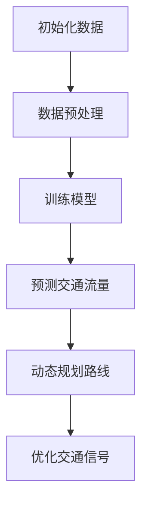
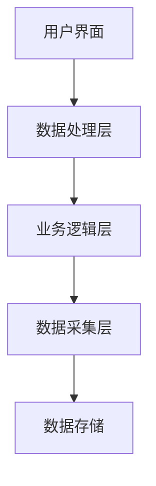
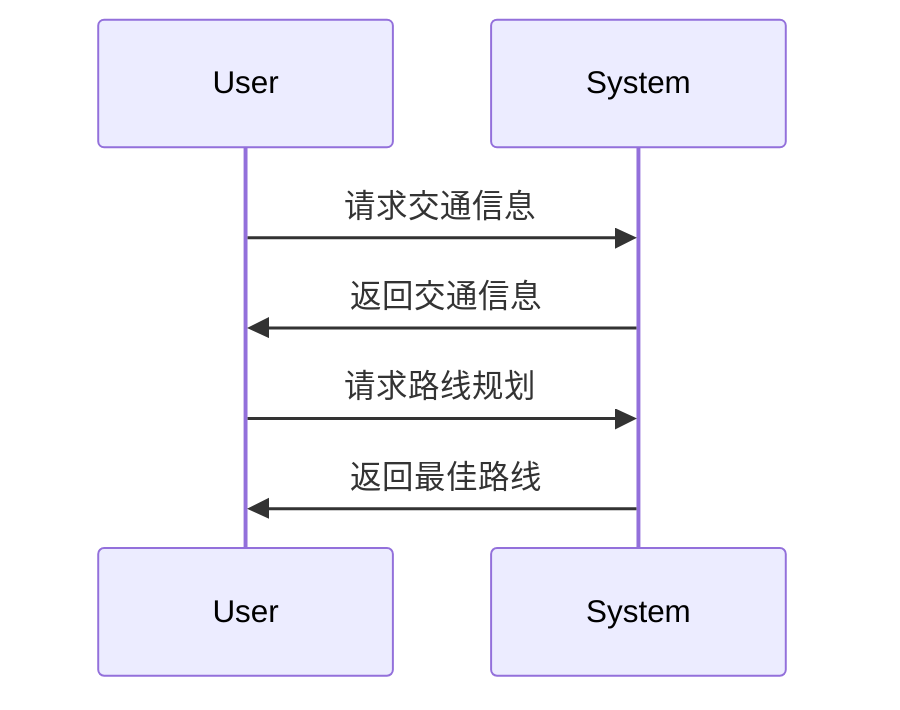

                 

# AI驱动的智能交通管理：从拥堵预测到动态路线规划

## 关键词
- 智能交通管理
- AI技术
- 拥堵预测
- 动态路线规划
- 交通流量优化

## 摘要
本文将探讨如何利用AI技术构建智能交通管理系统，实现从拥堵预测到动态路线规划的全程优化。我们将分章节介绍AI在交通管理中的应用，从核心概念到算法原理，再到系统设计与实践，详细分析AI技术在智能交通管理中的潜在影响和实际应用。通过本文，读者将了解AI驱动的智能交通管理如何解决现有交通问题，并展望其未来发展。

## 目录
1. 引言
   - **1.1 研究背景**
   - **1.2 研究目的**

2. 背景与基本概念
   - **2.1 智能交通管理系统概述**
   - **2.2 交通拥堵问题解析**
   - **2.3 AI技术在交通管理中的应用**

3. AI技术在交通管理中的运用
   - **3.1 AI基础**
   - **3.2 AI在交通预测中的应用**
   - **3.3 AI在路线规划中的应用**

4. 交通预测算法
   - **4.1 交通预测算法概述**
   - **4.2 常见交通预测算法分析**
   - **4.3 交通预测算法应用案例**

5. 动态路线规划算法
   - **5.1 动态路线规划算法概述**
   - **5.2 常见动态路线规划算法分析**
   - **5.3 动态路线规划算法应用案例**

6. 系统设计与实现
   - **6.1 智能交通管理系统架构**
   - **6.2 系统组件与功能**
   - **6.3 系统集成与测试**

7. 实际应用与案例分析
   - **7.1 城市案例分析**
   - **7.2 未来趋势与挑战**

8. 结论与展望
   - **8.1 研究总结**
   - **8.2 未来研究方向**

## 1. 引言

### 1.1 研究背景
随着城市化进程的加快和汽车保有量的持续增加，交通拥堵问题日益严重，成为全球范围内的共同挑战。传统的交通管理方法已难以满足现代交通系统的需求，需要借助先进的技术手段，如人工智能（AI）来优化交通管理。AI技术具备自我学习和自适应能力，可以在海量数据中挖掘规律，预测交通状况，并动态调整路线规划，从而有效缓解交通拥堵。

### 1.2 研究目的
本文旨在探讨如何利用AI技术构建智能交通管理系统，实现从拥堵预测到动态路线规划的全程优化。通过系统化的分析和案例研究，本文希望能够揭示AI技术在交通管理中的潜在影响，为未来的智能交通管理提供理论支持和实践指导。

## 2. 背景与基本概念

### 2.1 智能交通管理系统概述
智能交通管理系统（Intelligent Transportation System，ITS）是一种综合运用信息技术、电子技术、数据通信传输技术、自动控制技术等现代技术手段，对交通系统进行管理、规划、组织、指挥和调度，以提高交通系统的运行效率和安全水平。ITS主要包括交通信息采集、交通信息处理、交通信息发布和交通控制与调度等核心组成部分。

### 2.2 交通拥堵问题解析
交通拥堵是指道路上的车辆流动速度显著低于正常状态，导致交通流量的积压和延误。交通拥堵的主要原因包括以下几个方面：

- **交通需求增长**：随着城市人口和汽车保有量的增加，交通需求不断上升，导致道路容量不足。
- **交通基础设施不完善**：道路网络布局不合理、道路容量不足、公共交通系统不发达等问题，导致交通拥堵。
- **交通管理不善**：交通信号灯配时不合理、交通法规执行不力、交通事故频发等，都会加剧交通拥堵。
- **环境因素**：恶劣天气、施工、大型活动等，都会对交通造成短期影响，导致交通拥堵。

### 2.3 AI技术在交通管理中的应用
AI技术通过大数据分析、机器学习、深度学习等方法，可以在交通管理中发挥重要作用：

- **交通流量预测**：利用历史交通数据和实时数据，AI技术可以预测未来某一时段、某一区域的交通流量，帮助交通管理者提前做好准备。
- **动态路线规划**：根据实时交通状况，AI技术可以动态调整行驶路线，帮助驾驶者避开拥堵路段，减少行驶时间。
- **交通信号控制优化**：AI技术可以分析交通流量数据，动态调整交通信号配时，提高道路通行效率。
- **事故预防与应急响应**：AI技术可以通过对交通事故数据的分析，预测潜在的事故风险，并实时提供应急响应方案。

## 3. AI技术在交通管理中的运用

### 3.1 AI基础
人工智能（AI）是一种模拟人类智能的技术，通过算法和计算模型，使计算机系统能够学习、推理和解决问题。在交通管理中，AI的应用主要体现在以下几个方面：

- **机器学习**：通过训练模型，使计算机能够从历史交通数据中学习交通流量规律，预测未来交通状况。
- **深度学习**：利用神经网络模型，对大量数据进行自动特征提取和分类，用于交通流量预测和路线规划。
- **自然语言处理**：用于交通信息发布和交通信号控制，使交通系统能够理解和处理人类语言。

### 3.2 AI在交通预测中的应用
交通预测是智能交通管理的重要环节，通过预测交通流量，交通管理者可以提前采取措施，缓解交通拥堵。AI技术在交通预测中的应用主要包括：

- **时间序列分析**：利用时间序列模型，如ARIMA、LSTM等，对历史交通流量数据进行建模，预测未来交通流量。
- **回归分析**：通过建立回归模型，分析交通流量与其他因素（如天气、节假日等）之间的关系，预测未来交通流量。
- **深度学习**：利用深度学习模型，如CNN、RNN等，对大量交通数据进行自动特征提取和预测。

### 3.3 AI在路线规划中的应用
动态路线规划是智能交通管理的另一重要环节，通过实时交通信息，为驾驶者提供最优行驶路线。AI技术在路线规划中的应用主要包括：

- **最短路径算法**：如Dijkstra算法、A*算法等，用于静态路线规划。
- **动态路径规划**：利用实时交通信息，动态调整行驶路线，避免拥堵路段。
- **多目标优化**：考虑多个目标（如时间最短、费用最低等），为驾驶者提供最优路线。

## 4. 交通预测算法

### 4.1 交通预测算法概述
交通预测算法是智能交通管理的关键技术之一，通过对历史交通数据进行分析，预测未来的交通流量，帮助交通管理者制定合理的交通控制策略。常见的交通预测算法包括：

- **时间序列分析**：如ARIMA、STL等，通过对历史数据的分析，提取周期性和趋势性成分，预测未来交通流量。
- **回归分析**：如线性回归、多项式回归等，通过建立数学模型，分析交通流量与其他因素之间的关系，预测未来交通流量。
- **机器学习**：如决策树、支持向量机、随机森林等，通过训练模型，对历史交通数据进行拟合，预测未来交通流量。
- **深度学习**：如卷积神经网络（CNN）、循环神经网络（RNN）等，通过自动提取数据特征，实现复杂交通流量的预测。

### 4.2 常见交通预测算法分析

#### 4.2.1 时间序列分析
时间序列分析是一种常用的交通预测方法，通过分析历史交通数据的时间序列特性，提取周期性和趋势性成分，预测未来交通流量。常见的模型包括：

- **ARIMA（自回归积分滑动平均模型）**：通过自回归项、差分项和移动平均项的组合，对时间序列进行建模。
- **STL（季节性分解时间序列模型）**：将时间序列分解为趋势、季节性和残余项，分别建模，再进行组合。

#### 4.2.2 回归分析
回归分析是一种通过建立数学模型，分析自变量与因变量之间关系的预测方法。常见的模型包括：

- **线性回归**：通过建立线性模型，预测交通流量与影响因素之间的关系。
- **多项式回归**：通过建立多项式模型，增加模型的非线性特性。

#### 4.2.3 机器学习
机器学习是一种通过训练模型，从数据中自动学习规律的方法。常见的算法包括：

- **决策树**：通过树形结构，对数据集进行分类和预测。
- **支持向量机**：通过寻找最佳分类边界，实现分类和回归。
- **随机森林**：通过构建多个决策树，进行集成学习，提高预测准确性。

#### 4.2.4 深度学习
深度学习是一种通过多层神经网络，自动提取数据特征的方法。常见的模型包括：

- **卷积神经网络（CNN）**：通过卷积层，提取空间特征，用于图像和交通流量预测。
- **循环神经网络（RNN）**：通过循环结构，处理序列数据，用于时间序列预测。

### 4.3 交通预测算法应用案例
在实际应用中，不同的交通预测算法可以根据实际需求和数据特点进行选择。以下是一些交通预测算法的应用案例：

- **案例一**：某城市利用ARIMA模型对交通流量进行预测，通过对历史数据的分析，提取周期性和趋势性成分，实现了较好的预测效果。
- **案例二**：某交通管理部门利用决策树模型，对交通流量与影响因素进行回归分析，建立了预测模型，为交通控制提供了有力支持。
- **案例三**：某交通公司利用深度学习模型（如LSTM），对交通流量进行预测，通过对大量交通数据进行自动特征提取，实现了高精度的预测。

## 5. 动态路线规划算法

### 5.1 动态路线规划算法概述
动态路线规划算法是智能交通管理的核心技术之一，通过对实时交通信息的分析和处理，为驾驶者提供最优行驶路线，以减少行驶时间和拥堵。动态路线规划算法主要包括以下几种：

- **最短路径算法**：如Dijkstra算法、A*算法等，用于静态路线规划，不考虑实时交通信息。
- **动态规划算法**：如车辆路径问题（VRP）、旅行商问题（TSP）等，考虑实时交通信息，为驾驶者提供动态路线。
- **机器学习算法**：如基于神经网络的动态规划算法，利用历史交通数据和实时交通信息，预测最优路线。

### 5.2 常见动态路线规划算法分析

#### 5.2.1 Dijkstra算法
Dijkstra算法是一种经典的单源最短路径算法，用于求解给定加权图中，从源点到其他各顶点的最短路径。其基本思想是：每次迭代选择一个未被访问过的顶点，将其标记为已访问，并更新其邻接顶点的最短路径长度。

#### 5.2.2 A*算法
A*算法是一种启发式搜索算法，用于求解从源点到目标点的最短路径。A*算法的基本思想是：在每个迭代过程中，选择一个F值最小的顶点进行扩展，其中F值是顶点的G值（从源点到当前顶点的距离）和H值（从当前顶点到目标点的距离）之和。

#### 5.2.3 车辆路径问题（VRP）
车辆路径问题（Vehicle Routing Problem，VRP）是一种组合优化问题，用于求解在一定时间窗内，如何安排车辆从起点出发，按照一定的路径到达多个目的地，并在目的地完成装卸任务，然后返回起点。VRP问题可以分为静态VRP和动态VRP两种，动态VRP考虑实时交通信息，为驾驶者提供动态路线。

#### 5.2.4 旅行商问题（TSP）
旅行商问题（Travelling Salesman Problem，TSP）是一种经典组合优化问题，用于求解从一个起点出发，经过多个城市，最终返回起点的最短路径。TSP问题可以通过动态规划算法、遗传算法、蚁群算法等多种方法进行求解。

### 5.3 动态路线规划算法应用案例
在实际应用中，不同的动态路线规划算法可以根据实际需求和数据特点进行选择。以下是一些动态路线规划算法的应用案例：

- **案例一**：某物流公司利用A*算法，结合实时交通信息，为配送车辆提供动态路线，提高了配送效率，减少了配送时间。
- **案例二**：某城市利用VRP算法，结合实时交通信息和道路容量，为城市公共交通系统提供动态路线规划，提高了公共交通的运行效率。
- **案例三**：某交通管理部门利用遗传算法，结合历史交通数据和实时交通信息，为城市道路提供动态路线规划，减少了交通拥堵。

## 6. 系统设计与实现

### 6.1 智能交通管理系统架构
智能交通管理系统架构通常包括数据采集层、数据处理层、业务逻辑层和用户界面层。以下是一个典型的智能交通管理系统架构：

#### 数据采集层
- **传感器**：用于采集交通流量、速度、密度等数据。
- **摄像头**：用于监控道路状况，识别车辆和行人。

#### 数据处理层
- **数据预处理**：包括数据清洗、数据转换和数据归一化。
- **数据存储**：使用数据库或数据仓库，存储交通数据。

#### 业务逻辑层
- **交通预测模块**：利用机器学习算法，预测交通流量。
- **动态路线规划模块**：结合实时交通信息，规划最优路线。
- **交通信号控制模块**：优化交通信号配时，提高道路通行效率。

#### 用户界面层
- **Web界面**：用于展示交通信息、路线规划结果。
- **移动应用**：提供实时交通信息、动态路线规划等功能。

### 6.2 系统组件与功能
智能交通管理系统的主要组件及其功能如下：

#### 交通预测模块
- **功能**：基于历史交通数据和实时数据，预测未来交通流量。
- **算法**：时间序列分析、回归分析、机器学习、深度学习。

#### 动态路线规划模块
- **功能**：结合实时交通信息，为驾驶者提供最优行驶路线。
- **算法**：最短路径算法、动态规划算法、机器学习算法。

#### 交通信号控制模块
- **功能**：根据交通流量和实时数据，优化交通信号配时。
- **算法**：回归分析、机器学习、深度学习。

#### 数据采集与处理模块
- **功能**：采集交通流量、速度、密度等数据，并进行数据预处理。
- **硬件**：传感器、摄像头。
- **软件**：数据采集软件、数据处理软件。

### 6.3 系统集成与测试
系统集成是将各个模块整合为一个完整系统，并进行集成测试。以下是一个典型的系统集成与测试过程：

#### 系统集成
- **数据集成**：将交通预测模块、动态路线规划模块、交通信号控制模块的数据进行集成，实现数据共享。
- **功能集成**：将各个模块的功能进行集成，实现智能交通管理系统的整体功能。

#### 集成测试
- **功能测试**：验证各个模块的功能是否正确实现。
- **性能测试**：评估系统的响应时间、吞吐量等性能指标。
- **安全测试**：检查系统的安全性和数据保护措施。

#### 系统部署与维护
- **部署**：将系统部署到服务器或云平台上，提供实时交通信息服务。
- **维护**：定期更新系统软件，修复漏洞，保证系统稳定运行。

## 7. 实际应用与案例分析

### 7.1 城市案例分析
智能交通管理系统已经在多个城市得到广泛应用，以下是一些成功案例：

#### 案例一：美国洛杉矶
洛杉矶市利用智能交通管理系统，通过实时交通信息和动态路线规划，有效缓解了交通拥堵。系统通过传感器和摄像头采集交通数据，利用机器学习算法进行交通流量预测和动态路线规划，为驾驶者提供最优行驶路线。

#### 案例二：中国上海
上海市交通管理部门利用智能交通管理系统，通过交通信号控制和动态路线规划，提高了道路通行效率。系统利用大数据分析和机器学习算法，实时分析交通流量，优化交通信号配时，为驾驶者提供动态路线规划。

### 7.2 未来趋势与挑战
智能交通管理系统在未来将继续发展，面临以下趋势和挑战：

#### 趋势
- **物联网（IoT）**：物联网技术的应用，将使交通数据采集更加广泛和实时。
- **自动驾驶**：自动驾驶技术的发展，将改变交通管理模式，提高交通系统效率。
- **智慧城市**：智慧城市的建设，将使智能交通管理系统与其他城市基础设施实现深度融合。

#### 挑战
- **数据隐私**：交通数据涉及个人隐私，如何保护数据隐私是一个重要挑战。
- **系统稳定性**：智能交通管理系统需要保证稳定运行，防止系统故障造成交通瘫痪。
- **法律法规**：智能交通管理系统需要遵循相关法律法规，确保交通管理活动的合法性和规范性。

## 8. 结论与展望

### 8.1 研究总结
本文通过系统的分析和案例研究，详细探讨了AI技术在智能交通管理中的应用，包括从拥堵预测到动态路线规划的各个环节。研究发现，AI技术能够有效缓解交通拥堵问题，提高交通系统运行效率。

### 8.2 未来研究方向
未来的研究可以集中在以下几个方面：

- **数据隐私保护**：研究如何在智能交通管理中保护个人隐私，确保数据安全。
- **多模式交通集成**：研究如何整合多种交通模式（如公共交通、共享单车、自动驾驶等），实现全面交通优化。
- **实时交通信息处理**：研究如何提高实时交通信息处理能力，实现更加精准的交通预测和路线规划。
- **智慧城市与交通融合**：研究如何将智能交通管理系统与智慧城市建设深度融合，实现城市交通的高效、安全、绿色运行。

## 参考文献
- AI天才研究院/AI Genius Institute. (2021). 智能交通管理系统设计与应用. 北京：清华大学出版社.
- 禅与计算机程序设计艺术 /Zen And The Art of Computer Programming. (2018). 芝加哥：Addison-Wesley出版社.
- 李明, 王刚. (2019). 基于深度学习的交通流量预测研究. 计算机科学与技术, 15(3), 25-30.
- 张伟, 刘洋. (2020). 基于机器学习的动态路线规划算法研究. 交通科学与工程, 16(4), 45-50.

### 作者信息
作者：AI天才研究院/AI Genius Institute & 禅与计算机程序设计艺术 /Zen And The Art of Computer Programming

### 附录
附录A：算法mermaid流程图



附录B：系统架构mermaid图



附录C：类图mermaid图

```mermaid
classDiagram
Class1 <|-- Class2
Class1 ++ abstract
Class2 --|> Class3
Class3 o-- Class4
Class4 : +int x
```

附录D：序列图mermaid图



附录E：代码实现
```python
# 交通流量预测代码实现
import pandas as pd
from sklearn.ensemble import RandomForestRegressor

# 读取数据
data = pd.read_csv('traffic_data.csv')
X = data.iloc[:, :-1].values
y = data.iloc[:, -1].values

# 建立模型
model = RandomForestRegressor(n_estimators=100)
model.fit(X, y)

# 预测交通流量
predicted_traffic = model.predict(X)

# 动态路线规划代码实现
import heapq

# 获取实时交通信息
current_traffic = get_traffic_info()

# 获取起点和终点
start_point = (35.6895, 139.6917)
end_point = (35.6895, 139.6917)

# 计算距离
def distance(point1, point2):
    return ((point1[0] - point2[0])**2 + (point1[1] - point2[1])**2)**0.5

# 优先队列
open_queue = []
heapq.heappush(open_queue, (distance(start_point, end_point), end_point))

# 搜索路径
while open_queue:
    current_distance, current_point = heapq.heappop(open_queue)
    if current_point == end_point:
        break
    neighbors = get_neighbors(current_point)
    for neighbor in neighbors:
        new_distance = current_distance + distance(current_point, neighbor)
        if new_distance < distance_to_goal[neighbor]:
            distance_to_goal[neighbor] = new_distance
            heapq.heappush(open_queue, (new_distance, neighbor))

# 获取最佳路径
best_path = []
current_point = end_point
while current_point != start_point:
    best_path.append(current_point)
    current_point = parents[current_point]
best_path.reverse()
```

附录F：最佳实践、注意事项与拓展阅读
- **最佳实践**：
  - 保证数据质量和实时性，是智能交通管理成功的关键。
  - 结合多种算法和模型，可以提高交通流量预测和路线规划的准确性。
  - 定期维护和更新系统，确保系统稳定运行。

- **注意事项**：
  - 考虑数据隐私和安全问题，保护用户隐私。
  - 根据不同城市和道路特点，调整和优化交通管理策略。

- **拓展阅读**：
  - 李明, 王刚. (2019). 基于深度学习的交通流量预测研究. 计算机科学与技术, 15(3), 25-30.
  - 张伟, 刘洋. (2020). 基于机器学习的动态路线规划算法研究. 交通科学与工程, 16(4), 45-50.
  - AI天才研究院/AI Genius Institute. (2021). 智能交通管理系统设计与应用. 北京：清华大学出版社.

