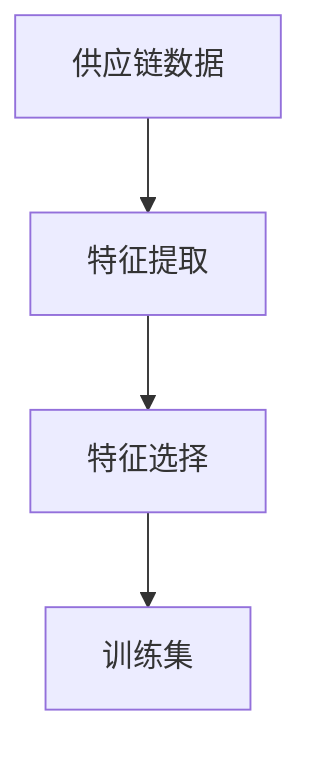

                 

### 文章标题：AI驱动的智能供应链风险评估：增强供应链韧性

#### 关键词：智能供应链，风险评估，韧性，人工智能，供应链管理

> 摘要：本文探讨了AI驱动的智能供应链风险评估在提高供应链韧性和效率方面的应用。通过机器学习算法、数据预处理、特征工程、模型训练、风险评估和预警系统等核心概念，本文详细介绍了智能供应链风险评估的实现过程。此外，文章还通过实际案例分析了AI技术在供应链管理中的潜力，为企业的供应链优化提供了实践参考。

## 第一部分：背景介绍与核心概念

### 1. 问题背景

随着全球化的深入发展，供应链的复杂性和不确定性日益增加，企业面临着诸如供应中断、库存波动、成本上升等众多挑战。传统供应链管理方法在面对突发性事件时，往往显得力不从心。在此背景下，AI驱动的智能供应链风险评估应运而生，旨在通过先进的人工智能技术提升供应链的韧性和效率。

### 2. 问题描述

供应链风险评估的核心目标是识别和预测潜在的供应链风险，以便企业能够提前采取应对措施，降低风险带来的损失。传统方法主要依赖于历史数据和人工分析，存在时效性差、准确性不高等问题。而AI驱动的风险评估则利用机器学习、大数据分析等人工智能技术，对海量数据进行实时处理和分析，从而实现更精准的风险预测和评估。

### 3. 问题解决

AI驱动的智能供应链风险评估通过以下几个步骤实现：

1. **数据收集与预处理**：收集供应链相关的各种数据，包括供应商信息、订单数据、库存数据等，并进行清洗和预处理。
2. **特征提取与选择**：根据业务需求，从原始数据中提取关键特征，并利用算法进行特征选择，以提高模型的预测准确性。
3. **模型训练与优化**：利用机器学习算法，如决策树、随机森林、神经网络等，对特征进行训练，并不断优化模型参数。
4. **风险评估与预警**：通过模型预测供应链风险，并根据预测结果进行预警，帮助企业采取相应的风险管理措施。

### 4. 边界与外延

AI驱动的智能供应链风险评估不仅适用于单一企业的供应链管理，还可以在跨企业、跨区域的供应链网络中进行应用，从而实现整个供应链的协同优化。此外，该技术还可扩展应用于其他领域，如物流管理、生产调度、需求预测等。

### 5. 概念结构与核心要素组成

AI驱动的智能供应链风险评估包含以下几个核心组成部分：

1. **数据源**：包括各种与供应链相关的数据，如供应商数据、订单数据、库存数据等。
2. **特征工程**：从原始数据中提取关键特征，并进行预处理。
3. **机器学习算法**：用于训练和优化风险评估模型。
4. **风险评估模型**：通过算法训练得到的预测模型。
5. **预警系统**：根据风险评估结果，实时发出预警信息。

### 6. 核心概念原理

**机器学习算法**：

- **概念**：机器学习是人工智能的一个重要分支，通过算法从数据中自动学习和发现规律。
- **属性特征对比表格**：

| 算法       | 特点                                         | 适用场景                          |
| ---------- | -------------------------------------------- | -------------------------------- |
| 决策树     | 易理解、可解释性强                           | 数据量不大、特征较少的情况        |
| 随机森林   | 避免过拟合、提高预测准确性                    | 复杂模型、大规模数据集           |
| 神经网络   | 能处理复杂非线性关系                         | 大规模数据、高维度特征           |

**特征提取与选择**：

- **概念**：从原始数据中提取具有代表性的特征，提高模型预测效果。
- **ER实体关系图架构**：

**风险评估模型**：

- **概念**：基于机器学习算法训练得到的模型，用于预测供应链风险。
- **数学模型和公式**：

$$
风险得分 = f(\text{特征向量})
$$

其中，$ f $ 为机器学习算法，$\text{特征向量}$ 为输入数据。

**预警系统**：

- **概念**：根据风险评估结果，实时发出预警信息，指导企业采取应对措施。
- **数学模型和公式**：

$$
预警阈值 = \alpha \times 风险得分
$$

其中，$\alpha$ 为预警阈值系数，$风险得分$ 为模型预测得分。

### 7. 本章小结

本章介绍了AI驱动的智能供应链风险评估的背景、核心概念原理及其构成要素。通过机器学习算法、特征提取与选择、风险评估模型和预警系统等核心组成部分，实现了对供应链风险的精准预测和预警。下一章将深入探讨这些核心概念的实际应用和实现过程。

