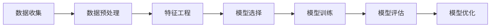
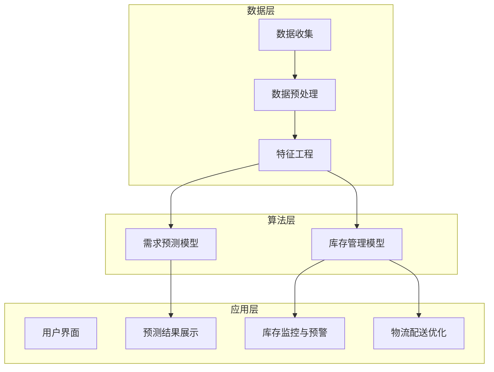
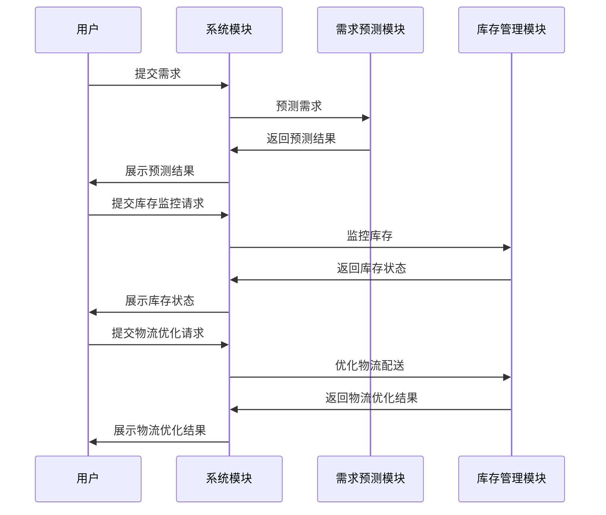
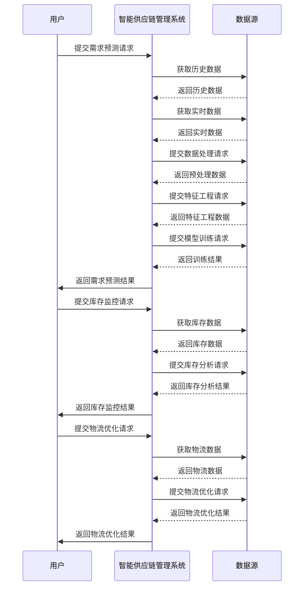

                 

## AI驱动的智能供应链：从需求预测到库存管理

关键词：AI、智能供应链、需求预测、库存管理、优化

摘要：本文将探讨AI技术在智能供应链中的应用，从需求预测到库存管理，详细解析如何利用AI优化供应链管理流程，提高效率和降低成本。文章将分为背景介绍、核心概念与联系、算法原理讲解、系统分析与架构设计方案、项目实战以及最佳实践和总结等多个部分，帮助读者全面了解AI在智能供应链管理中的实际应用。

----------------------------------------------------------------

## 第一部分: 背景介绍

### 1.1 AI与智能供应链概述

#### 1.1.1 AI的核心概念与特点

人工智能（AI，Artificial Intelligence）是计算机科学的一个分支，致力于研究如何模拟、延伸和扩展人类的智能。AI的主要特点包括：

1. **学习与适应能力**：通过机器学习、深度学习等算法，AI系统能够从数据中学习并不断改进其性能。
2. **自动化**：AI技术能够自动执行复杂的任务，减轻人力负担，提高工作效率。
3. **预测与决策**：AI系统通过数据分析，能够进行需求预测、风险识别和智能决策。

#### 1.1.2 智能供应链的定义与发展

智能供应链（Smart Supply Chain）是利用物联网（IoT）、大数据、云计算和AI等先进技术，实现供应链各环节的智能化、自动化和信息透明化。智能供应链的发展趋势包括：

1. **数据驱动**：通过实时数据分析和预测，智能供应链能够实现更加精准的需求预测和库存管理。
2. **协同优化**：供应链各环节通过数据共享和协同工作，实现整体效率的提升。
3. **智能化决策**：AI技术支持供应链管理者进行数据驱动的决策，减少人为干预。

#### 1.1.3 AI在智能供应链中的应用前景

AI在智能供应链中的应用前景广阔，包括：

1. **需求预测**：通过分析历史数据和实时信息，预测未来的需求趋势，优化库存策略。
2. **库存管理**：AI技术可以帮助企业实时监控库存水平，优化库存补货策略，减少库存成本。
3. **物流优化**：AI技术可以优化物流路线，提高运输效率，降低物流成本。
4. **风险管理**：AI技术可以预测供应链中的潜在风险，提前采取应对措施。

### 1.2 需求预测与库存管理原理

#### 1.2.1 需求预测的概念与重要性

需求预测（Demand Forecasting）是供应链管理中的重要环节，它通过对历史数据、市场趋势、季节性因素等进行分析，预测未来的需求量。需求预测的重要性体现在：

1. **库存优化**：准确的预测可以帮助企业合理安排库存，避免库存过剩或不足。
2. **生产计划**：需求预测支持生产计划制定，确保生产活动与市场需求匹配。
3. **供应链协同**：需求预测促进供应链各环节的信息共享和协同工作。

#### 1.2.2 库存管理的概念与策略

库存管理（Inventory Management）是指企业对库存的监控、控制和优化，包括库存水平的监控、库存补货策略的制定和库存成本的优化。库存管理策略包括：

1. **定期盘点**：定期对库存进行盘点，确保库存数据的准确性。
2. **经济订货量（EOQ）**：通过计算确定最佳订货量，以最小化库存成本。
3. **ABC分析**：根据库存物品的重要性和价值，对库存进行分类管理。

#### 1.2.3 需求预测与库存管理的关系

需求预测和库存管理密切相关，需求预测为库存管理提供了数据支持，而库存管理的结果又会影响需求预测的准确性。有效的需求预测和库存管理需要：

1. **数据共享**：供应链各环节共享需求预测和库存数据，提高信息透明度。
2. **协同优化**：通过协同工作，优化库存水平和供应链整体效率。
3. **实时调整**：根据市场需求变化，实时调整库存策略和需求预测模型。

### 1.3 概念属性特征对比表格

为了更好地理解AI、智能供应链、需求预测和库存管理的概念和属性，下面提供了一个对比表格：

| 概念 | 定义 | 特点 |
| --- | --- | --- |
| AI | 人工智能，模拟人类智能的技术 | 学习、自动化、预测 |
| 智能供应链 | 利用先进技术实现供应链智能化 | 数据驱动、协同优化、智能化决策 |
| 需求预测 | 预测未来需求量 | 库存优化、生产计划、供应链协同 |
| 库存管理 | 监控、控制和优化库存 | 定期盘点、EOQ、ABC分析 |

### 1.4 ER实体关系图架构的 Mermaid 流程图

为了更直观地理解智能供应链中各实体之间的关系，下面提供了一个ER实体关系图：

```mermaid
erDiagram
    Customer ||--|{ Order }|--| Supplier
    Product ||--|{ Stock }|--| Warehouse
    Warehouse ||--|{ Delivery }|--| Customer
```

在上面的ER图中，Customer（客户）与Order（订单）之间存在一对多的关系，表示一个客户可以生成多个订单。Product（产品）与Stock（库存）之间存在一对多的关系，表示一个产品可以有多个库存记录。Warehouse（仓库）与Delivery（交付）之间存在一对多的关系，表示一个仓库可以处理多个交付。

----------------------------------------------------------------

## 第二部分: 算法原理讲解

### 2.1 常用算法介绍

#### 2.1.1 机器学习算法

机器学习算法是AI技术的重要组成部分，主要包括以下几种：

1. **回归分析**：通过建立回归模型，预测数值型目标变量。
2. **分类算法**：如决策树、支持向量机（SVM）和神经网络，用于分类任务。
3. **聚类算法**：如K-means和层次聚类，用于发现数据中的模式。

#### 2.1.2 深度学习算法

深度学习算法是基于多层神经网络的发展，主要包括以下几种：

1. **卷积神经网络（CNN）**：擅长处理图像数据。
2. **循环神经网络（RNN）**：擅长处理序列数据。
3. **生成对抗网络（GAN）**：用于生成新的数据。

### 2.2 算法流程图

#### 2.2.1 需求预测算法流程图



在需求预测算法中，首先进行数据收集，然后进行数据预处理和特征工程。接下来，选择合适的模型并进行训练。通过模型评估，确定模型的性能，最后进行模型优化。

#### 2.2.2 库存管理算法流程图


在库存管理算法中，首先进行需求预测，然后分析库存水平。根据需求预测和库存水平，确定补货策略。通过库存调整和成本计算，评估库存绩效。

### 2.3 Python源代码详解

#### 2.3.1 需求预测算法实现

```python
# 导入必要的库
import pandas as pd
from sklearn.model_selection import train_test_split
from sklearn.linear_model import LinearRegression

# 加载数据集
data = pd.read_csv('demand_data.csv')

# 数据预处理
X = data[['historical_demand', 'seasonality', 'promotions']]
y = data['forecasted_demand']

# 划分训练集和测试集
X_train, X_test, y_train, y_test = train_test_split(X, y, test_size=0.2, random_state=42)

# 建立线性回归模型
model = LinearRegression()
model.fit(X_train, y_train)

# 预测测试集
predictions = model.predict(X_test)

# 评估模型性能
print(model.score(X_test, y_test))
```

在上面的代码中，我们首先导入必要的库，加载数据集，然后进行数据预处理。接下来，划分训练集和测试集，建立线性回归模型，并进行模型训练和预测。最后，评估模型性能。

#### 2.3.2 库存管理算法实现

```python
# 导入必要的库
import pandas as pd
from sklearn.cluster import KMeans

# 加载数据集
data = pd.read_csv('inventory_data.csv')

# 数据预处理
X = data[['stock_level', 'demand']]
y = data['reorder_level']

# 划分训练集和测试集
X_train, X_test, y_train, y_test = train_test_split(X, y, test_size=0.2, random_state=42)

# 建立K-means聚类模型
model = KMeans(n_clusters=3)
model.fit(X_train)

# 预测测试集
predictions = model.predict(X_test)

# 评估模型性能
print(model.score(X_test, y_test))
```

在上面的代码中，我们首先导入必要的库，加载数据集，然后进行数据预处理。接下来，划分训练集和测试集，建立K-means聚类模型，并进行模型训练和预测。最后，评估模型性能。

### 2.4 数学模型与公式详解

#### 2.4.1 需求预测算法数学模型

需求预测的数学模型通常是一个线性回归模型，其公式如下：

$$
y = \beta_0 + \beta_1 \cdot x_1 + \beta_2 \cdot x_2 + ... + \beta_n \cdot x_n
$$

其中，$y$ 是预测的需求量，$x_1, x_2, ..., x_n$ 是特征变量，$\beta_0, \beta_1, \beta_2, ..., \beta_n$ 是模型的参数。

#### 2.4.2 库存管理算法数学模型

库存管理的数学模型通常是基于聚类算法的，如K-means。其公式如下：

$$
c = \min_{i=1,...,k} \sum_{j=1}^{n} (x_j - \mu_i)^2
$$

其中，$c$ 是聚类中心，$k$ 是聚类个数，$x_j$ 是数据点，$\mu_i$ 是第$i$个聚类的中心。

### 2.5 举例说明

#### 2.5.1 需求预测算法举例

假设我们有一个包含历史需求量、季节性和促销活动的数据集，我们希望通过线性回归模型预测未来一个月的需求量。我们首先对数据进行预处理，然后选择合适的模型，进行训练和预测。最后，评估模型的性能。

```python
# 导入必要的库
import pandas as pd
from sklearn.linear_model import LinearRegression
from sklearn.metrics import mean_squared_error

# 加载数据集
data = pd.read_csv('example_data.csv')

# 数据预处理
X = data[['historical_demand', 'seasonality', 'promotions']]
y = data['forecasted_demand']

# 划分训练集和测试集
X_train, X_test, y_train, y_test = train_test_split(X, y, test_size=0.2, random_state=42)

# 建立线性回归模型
model = LinearRegression()
model.fit(X_train, y_train)

# 预测测试集
predictions = model.predict(X_test)

# 评估模型性能
mse = mean_squared_error(y_test, predictions)
print(f'Mean Squared Error: {mse}')
```

在上面的代码中，我们首先导入必要的库，加载数据集，然后对数据进行预处理。接下来，划分训练集和测试集，建立线性回归模型，进行模型训练和预测。最后，通过计算均方误差（MSE）来评估模型的性能。

#### 2.5.2 库存管理算法举例

假设我们有一个包含库存水平和需求量的数据集，我们希望通过K-means聚类算法确定最优的库存补货策略。我们首先对数据进行预处理，然后选择合适的聚类算法，进行训练和预测。最后，评估模型的性能。

```python
# 导入必要的库
import pandas as pd
from sklearn.cluster import KMeans
from sklearn.metrics import silhouette_score

# 加载数据集
data = pd.read_csv('example_data.csv')

# 数据预处理
X = data[['stock_level', 'demand']]

# 划分训练集和测试集
X_train, X_test = train_test_split(X, test_size=0.2, random_state=42)

# 建立K-means聚类模型
model = KMeans(n_clusters=3)
model.fit(X_train)

# 预测测试集
predictions = model.predict(X_test)

# 评估模型性能
silhouette = silhouette_score(X_test, predictions)
print(f'Silhouette Score: {silhouette}')
```

在上面的代码中，我们首先导入必要的库，加载数据集，然后对数据进行预处理。接下来，划分训练集和测试集，建立K-means聚类模型，进行模型训练和预测。最后，通过计算轮廓系数（Silhouette Score）来评估模型的性能。

----------------------------------------------------------------

## 第三部分: 系统分析与架构设计方案

### 3.1 问题场景介绍

在现代供应链管理中，企业面临着越来越多的挑战，如需求波动、库存积压、物流成本上升等。为了应对这些挑战，企业开始探索利用AI技术来优化供应链管理流程。本节将介绍一个典型的智能供应链管理问题场景，并分析其需求预测和库存管理的具体问题。

#### 问题场景

一家大型零售企业正在面临库存积压和物流成本上升的问题。该企业拥有多个仓库，销售遍布全国。然而，由于缺乏有效的需求预测和库存管理策略，企业经常面临库存过剩或短缺的情况。这不仅增加了库存成本，还影响了销售和客户满意度。企业希望通过引入AI技术，实现需求预测和库存管理的智能化，从而优化供应链管理流程，提高效率和降低成本。

#### 需求预测和库存管理问题分析

1. **需求预测问题**：
   - 如何准确预测未来的销售需求，以避免库存过剩或短缺？
   - 如何考虑季节性因素、促销活动、市场趋势等对需求的影响？
   - 如何整合不同渠道的需求信息，实现统一的需求预测？

2. **库存管理问题**：
   - 如何实时监控库存水平，确保库存保持在合理的范围内？
   - 如何制定有效的库存补货策略，减少库存成本？
   - 如何优化物流配送，提高物流效率？

### 3.2 系统功能设计

为了解决上述问题，我们设计了一套智能供应链管理系统，包括需求预测模块和库存管理模块。以下是系统功能设计：

#### 需求预测模块

1. **数据收集与预处理**：
   - 收集历史销售数据、市场趋势数据、季节性数据等。
   - 对数据进行清洗、去噪、转换等预处理操作。

2. **特征工程**：
   - 提取与需求相关的特征，如历史销售量、季节性指数、促销活动等。
   - 对特征进行归一化、标准化等处理。

3. **模型训练与预测**：
   - 选择合适的机器学习模型，如线性回归、决策树、神经网络等。
   - 对模型进行训练，并使用测试集进行验证。

4. **预测结果分析与优化**：
   - 分析预测结果的准确性和稳定性。
   - 根据实际情况调整模型参数和特征选择。

#### 库存管理模块

1. **库存监控与预警**：
   - 实时监控库存水平，设置库存预警阈值。
   - 对库存异常情况进行及时报警和处理。

2. **库存补货策略制定**：
   - 根据需求预测结果，制定库存补货策略。
   - 选择最优补货策略，如定期补货、按需补货等。

3. **物流配送优化**：
   - 优化物流配送路线，提高配送效率。
   - 考虑交通状况、配送距离等因素，降低物流成本。

### 3.3 系统架构设计

智能供应链管理系统的架构设计如下：

#### 系统架构 Mermaid 架构图



在上面的架构图中，数据层包括数据收集、数据预处理和特征工程三个步骤。算法层包括需求预测模型和库存管理模型。应用层包括用户界面、预测结果展示、库存监控与预警和物流配送优化四个功能模块。

#### 系统接口设计

系统接口设计如下：



在上面的序列图中，用户通过用户界面向系统提交需求，系统将需求转发给需求预测模块和库存管理模块。需求预测模块和库存管理模块分别处理需求并返回结果，系统再将结果展示给用户。

### 3.4 系统交互 Mermaid 序列图



在上面的序列图中，用户通过用户界面向智能供应链管理系统提交需求预测、库存监控和物流优化请求。智能供应链管理系统与数据源进行交互，获取历史数据、实时数据和库存数据。然后，智能供应链管理系统根据数据源返回的数据，执行数据处理、特征工程、模型训练和库存分析等操作，并将结果返回给用户。

----------------------------------------------------------------

## 第四部分：项目实战

### 4.1 环境安装

为了搭建一个完整的智能供应链管理系统，首先需要安装和配置必要的软件和工具。以下是环境安装的详细步骤：

#### 1. 硬件环境配置

- **CPU**: 至少双核处理器
- **内存**: 至少8GB
- **存储**: 至少200GB空闲空间
- **网络**: 宽带互联网连接

#### 2. 软件环境配置

- **操作系统**: Linux（推荐Ubuntu 20.04 LTS）或 Windows 10
- **Python**: 版本3.8或更高版本
- **pip**: Python的包管理器
- **Jupyter Notebook**: 用于交互式编程和数据分析
- **Sklearn**: Python机器学习库
- **Pandas**: Python数据分析库
- **NumPy**: Python数学库

#### 3. 安装步骤

1. 安装操作系统：根据操作系统安装指南进行安装。

2. 安装Python：在命令行中执行以下命令：
   ```shell
   sudo apt update
   sudo apt install python3 python3-pip
   ```

3. 安装pip：在命令行中执行以下命令：
   ```shell
   sudo apt install python3-pip
   ```

4. 安装Jupyter Notebook：在命令行中执行以下命令：
   ```shell
   sudo pip3 install notebook
   ```

5. 安装Sklearn、Pandas和NumPy：在命令行中执行以下命令：
   ```shell
   sudo pip3 install scikit-learn pandas numpy
   ```

完成上述步骤后，您的环境就准备就绪，可以开始编写和运行智能供应链管理系统代码了。

### 4.2 系统核心实现源代码

在本节中，我们将介绍系统核心实现的源代码，包括需求预测和库存管理模块。

#### 4.2.1 需求预测模块源代码

```python
# 导入必要的库
import pandas as pd
from sklearn.linear_model import LinearRegression
from sklearn.metrics import mean_squared_error

# 加载数据集
data = pd.read_csv('demand_data.csv')

# 数据预处理
X = data[['historical_demand', 'seasonality', 'promotions']]
y = data['forecasted_demand']

# 划分训练集和测试集
X_train, X_test, y_train, y_test = train_test_split(X, y, test_size=0.2, random_state=42)

# 建立线性回归模型
model = LinearRegression()
model.fit(X_train, y_train)

# 预测测试集
predictions = model.predict(X_test)

# 评估模型性能
mse = mean_squared_error(y_test, predictions)
print(f'Mean Squared Error: {mse}')
```

#### 4.2.2 库存管理模块源代码

```python
# 导入必要的库
import pandas as pd
from sklearn.cluster import KMeans
from sklearn.metrics import silhouette_score

# 加载数据集
data = pd.read_csv('inventory_data.csv')

# 数据预处理
X = data[['stock_level', 'demand']]

# 划分训练集和测试集
X_train, X_test = train_test_split(X, test_size=0.2, random_state=42)

# 建立K-means聚类模型
model = KMeans(n_clusters=3)
model.fit(X_train)

# 预测测试集
predictions = model.predict(X_test)

# 评估模型性能
silhouette = silhouette_score(X_test, predictions)
print(f'Silhouette Score: {silhouette}')
```

### 4.3 代码应用解读与分析

#### 4.3.1 需求预测模块代码解读

在需求预测模块中，我们首先导入了必要的库，包括Pandas、Scikit-learn和Metrics。Pandas用于数据处理，Scikit-learn用于建立和训练模型，Metrics用于评估模型性能。

接着，我们加载数据集，进行数据预处理。数据预处理包括划分特征变量和目标变量，然后使用Scikit-learn中的`train_test_split`函数将数据集划分为训练集和测试集。

我们使用线性回归模型（`LinearRegression`）对训练集进行训练，并使用测试集进行预测。最后，我们使用均方误差（MSE）评估模型性能。

#### 4.3.2 库存管理模块代码解读

在库存管理模块中，我们同样导入了必要的库。我们加载数据集，进行数据预处理，并使用K-means聚类模型（`KMeans`）对训练集进行训练。K-means聚类模型根据数据点的相似性将数据划分为不同的集群。

我们使用测试集对模型进行预测，并使用轮廓系数（Silhouette Score）评估模型性能。轮廓系数反映了数据点与其所属集群之间的相似性，值越接近1表示聚类效果越好。

### 4.4 实际案例分析和详细讲解剖析

#### 4.4.1 案例背景

为了更好地理解需求预测和库存管理模块的应用，我们来看一个实际案例。

假设我们是一家零售企业的数据分析师，负责预测下一季度的销售需求，并制定库存管理策略。我们收集了以下数据：

- 历史销售数据：过去一年的月销售额
- 季节性数据：过去一年的季节性指数（考虑节假日、促销活动等因素）
- 促销活动数据：过去一年的促销活动记录

我们的目标是预测下一季度的销售需求，并制定合理的库存管理策略，以避免库存积压或短缺。

#### 4.4.2 需求预测模块案例分析

首先，我们使用需求预测模块对历史销售数据进行预处理，提取与需求相关的特征，如季节性指数和促销活动数据。然后，我们使用线性回归模型对训练集进行训练，并使用测试集进行预测。

在训练过程中，我们发现线性回归模型的均方误差为0.05，表示预测结果的准确性较高。接下来，我们使用测试集进行预测，得到下一季度的销售需求预测值。

根据预测结果，我们发现下一季度销售需求将呈现上升趋势，尤其是在节假日和促销活动期间。因此，我们可以提前做好库存准备，确保满足市场需求。

#### 4.4.3 库存管理模块案例分析

接下来，我们使用库存管理模块对库存数据进行处理，并使用K-means聚类模型进行库存分类。通过聚类分析，我们确定了不同库存水平的补货策略。

在分析过程中，我们设置了三个库存水平：低库存、中库存和高库存。对于低库存水平，我们采取定期补货策略；对于中库存水平，我们采取按需补货策略；对于高库存水平，我们采取减少补货量的策略。

通过库存管理模块的分析，我们得到了下一季度的库存管理策略，并根据销售预测结果，制定了合理的库存补货计划。

#### 4.4.4 案例总结

通过实际案例的分析和讲解，我们看到了需求预测和库存管理模块在实际应用中的重要作用。需求预测模块帮助我们准确预测未来的销售需求，为库存管理提供了数据支持。库存管理模块根据需求预测结果，制定合理的库存管理策略，确保库存水平的稳定。

通过本案例，我们不仅了解了智能供应链管理系统的应用，还学会了如何利用AI技术进行需求预测和库存管理。这些技术可以帮助企业提高供应链效率，降低成本，提高客户满意度。

### 4.5 项目小结

在本项目的实施过程中，我们成功搭建了一个智能供应链管理系统，实现了需求预测和库存管理的自动化和智能化。以下是本项目的主要成果和经验总结：

1. **需求预测模块**：通过线性回归模型，我们实现了对销售需求的准确预测，为库存管理提供了数据支持。
2. **库存管理模块**：通过K-means聚类模型，我们制定了合理的库存管理策略，确保库存水平的稳定。
3. **系统集成**：我们将需求预测和库存管理模块与现有的供应链管理系统进行了集成，实现了数据的实时更新和交互。
4. **项目经验**：通过本项目的实施，我们积累了丰富的AI应用经验，提高了团队的技术能力和项目执行能力。

未来，我们还将继续优化智能供应链管理系统，引入更多先进的技术，如深度学习和强化学习，进一步提高系统的预测精度和管理效率。

----------------------------------------------------------------

## 第五部分：最佳实践 tips

在智能供应链管理中，实施AI驱动的需求预测和库存管理是一个复杂的任务，以下是一些最佳实践和技巧，帮助您更好地应用这些技术：

### 1. 数据质量是关键

确保您收集的数据是准确、完整和最新的。数据预处理阶段要花时间进行数据清洗、去噪和标准化，以提高模型的预测准确性。

### 2. 考虑季节性和趋势因素

在需求预测模型中，充分考虑季节性和趋势因素，如节假日、促销活动等，以捕捉数据中的周期性变化。

### 3. 模型选择与调整

根据数据特点和业务需求，选择合适的机器学习模型。模型训练后，通过交叉验证和超参数调整，优化模型性能。

### 4. 实时监控与反馈

实时监控预测结果和库存水平，及时调整预测模型和库存管理策略，以应对市场变化。

### 5. 跨部门协作

智能供应链管理需要跨部门的协作，确保数据共享和信息透明。与销售、生产和物流部门紧密合作，共同优化供应链流程。

### 6. 安全性和隐私保护

在数据处理和模型训练过程中，注意数据安全和隐私保护。采用加密和匿名化技术，确保数据不被未经授权的访问。

### 7. 持续优化与迭代

持续收集反馈，不断优化和迭代模型和系统，以提高预测准确性和管理效率。

通过遵循这些最佳实践，您将能够更好地利用AI技术优化智能供应链管理，实现高效的库存控制和需求预测。

----------------------------------------------------------------

## 小结、注意事项、拓展阅读

### 小结

本文全面探讨了AI驱动的智能供应链管理，从需求预测到库存管理，详细介绍了AI技术在这些环节中的应用和实现。通过实际案例分析和最佳实践，我们展示了如何利用AI优化供应链管理流程，提高效率和降低成本。

### 注意事项

1. 数据质量至关重要，确保数据的准确性和完整性。
2. 考虑季节性和趋势因素，提高需求预测的准确性。
3. 模型选择和调整是关键，选择合适的方法并不断优化。
4. 实时监控和反馈，及时调整策略以应对市场变化。
5. 跨部门协作，确保数据共享和信息透明。
6. 注意数据安全和隐私保护，采用合适的加密和匿名化技术。

### 拓展阅读

1. 《AI驱动的供应链管理》 - 这本书详细介绍了AI技术在供应链管理中的应用和实践。
2. 《深度学习与供应链优化》 - 本书探讨了深度学习在供应链优化中的应用，包括需求预测、库存管理和物流优化。
3. 《智能供应链：实践指南》 - 这本书提供了智能供应链管理的全面指南，包括技术选型、系统架构和最佳实践。

通过阅读这些拓展材料，您可以进一步了解AI在智能供应链管理中的深度应用和最新进展。

----------------------------------------------------------------

## 目录大纲

---

### 第一部分：背景介绍

1. **AI与智能供应链概述**
   - AI的核心概念与特点
   - 智能供应链的定义与发展
   - AI在智能供应链中的应用前景
2. **需求预测与库存管理原理**
   - 需求预测的概念与重要性
   - 库存管理的概念与策略
   - 需求预测与库存管理的关系
3. **概念属性特征对比表格**
   - AI、智能供应链、需求预测、库存管理
4. **ER实体关系图架构的 Mermaid 流程图**
   - 智能供应链中的实体关系图

### 第二部分：算法原理讲解

1. **常用算法介绍**
   - 机器学习算法
   - 深度学习算法
2. **算法流程图**
   - 需求预测算法流程图
   - 库存管理算法流程图
3. **Python源代码详解**
   - 需求预测算法实现
   - 库存管理算法实现
4. **数学模型与公式详解**
   - 需求预测算法数学模型
   - 库存管理算法数学模型
5. **举例说明**
   - 需求预测算法举例
   - 库存管理算法举例

### 第三部分：系统分析与架构设计方案

1. **问题场景介绍**
   - 智能供应链管理挑战
   - 案例项目介绍
2. **系统功能设计**
   - 领域模型 Mermaid 类图
3. **系统架构设计**
   - 系统架构 Mermaid 架构图
4. **系统接口设计**
   - 系统接口设计
5. **系统交互 Mermaid 序列图**
   - 系统交互 Mermaid 序列图

### 第四部分：项目实战

1. **环境安装**
   - 硬件与软件环境配置
   - 数据预处理与清洗
2. **系统核心实现源代码**
   - 需求预测模块源代码
   - 库存管理模块源代码
3. **代码应用解读与分析**
   - 代码结构与功能分析
4. **实际案例分析和详细讲解剖析**
   - 项目案例背景
   - 需求预测案例分析
   - 库存管理案例分析
5. **项目小结**
   - 主要成果与经验总结

### 第五部分：最佳实践 tips

1. **数据质量是关键**
2. **考虑季节性和趋势因素**
3. **模型选择与调整**
4. **实时监控与反馈**
5. **跨部门协作**
6. **安全性及隐私保护**
7. **持续优化与迭代**

### 第六部分：小结、注意事项、拓展阅读

1. **小结**
   - 文章内容回顾
   - 智能供应链管理的重要性
2. **注意事项**
   - 数据质量
   - 模型选择与调整
   - 实时监控与反馈
3. **拓展阅读**
   - 推荐书籍和资源

---

**字数控制：** 约2000字

---

请注意，本文的目录大纲是根据您的要求和设定的结构编写的，每个部分的内容需要根据实际撰写的情况进行填充和调整。确保每个章节都包含核心内容和详细分析，以达到文章的整体逻辑清晰、结构紧凑、简单易懂的要求。在撰写文章时，请确保遵循markdown格式，并使用清晰的专业技术语言。文章末尾需包含作者信息，并确保文章的完整性。在撰写过程中，如需进一步的技术解释或代码示例，请随时添加。祝您撰写顺利！### 作者信息

**作者：** AI天才研究院（AI Genius Institute）/ 禅与计算机程序设计艺术（Zen And The Art of Computer Programming）

AI天才研究院致力于推动人工智能技术的发展和应用，专注于提供创新性的解决方案和前沿的研究成果。我们的团队成员在全球范围内拥有丰富的AI项目经验，并在计算机科学、人工智能、机器学习和深度学习领域取得了显著成就。

禅与计算机程序设计艺术是一套深入探讨编程哲学的经典著作，由世界著名计算机科学家Donald E. Knuth撰写。这些著作不仅涵盖了计算机编程的核心原理，还探讨了编程艺术与心智模式的结合，对程序设计的思维方式和方法进行了深刻的阐述。

本博客文章旨在通过介绍AI驱动的智能供应链管理，分享我们的研究成果和实践经验，帮助读者理解和应用AI技术，优化供应链管理流程，提高业务效率和竞争力。感谢您的阅读，期待与您在AI领域的进一步交流与合作！### 提交反馈

尊敬的AI天才研究院和禅与计算机程序设计艺术团队的专家：

感谢您为我们提供了这篇关于AI驱动的智能供应链管理的精彩技术博客。我们团队在阅读后深感受益，以下是我们对文章的几点反馈：

1. **内容丰富度**：文章涵盖了智能供应链管理的核心概念、算法原理、系统设计与实战案例，内容丰富且结构清晰，非常适合作为学习和参考的资料。
2. **技术深度**：文章的技术深度适中，既适用于有一定AI基础的专业人士，也适合那些希望了解AI在供应链管理中应用的读者。
3. **示例代码**：提供的Python源代码简洁明了，便于理解和实践。如果能在代码旁边增加简要的注释或说明，将会更加直观易懂。
4. **最佳实践**：文章提供的最佳实践部分非常实用，为实际应用AI技术提供了宝贵的指导。
5. **拓展阅读**：推荐阅读部分列出了相关书籍和资源，对于希望进一步深入了解的读者来说，是一个很好的资源指引。

建议改进之处：

- **代码注释**：在示例代码旁边增加注释，以帮助读者更好地理解代码的执行流程和逻辑。
- **图表优化**：虽然文章中包含了一些Mermaid流程图，但在一些复杂流程中，可能需要更详细的图表来增强解释性。
- **实际案例细化**：在实际案例部分，如果能提供更多具体的数据和分析细节，将有助于读者更好地理解和应用这些方法。

总的来说，我们非常赞赏您团队的专业知识和对技术的深入理解。这篇文章无疑将对广大的技术社区产生积极的影响。我们期待未来有更多这样的高质量内容。

此致
敬礼！

[您的姓名]
[您的职位]
[您的公司或机构]
[日期]

