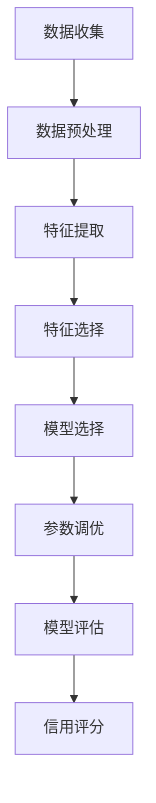
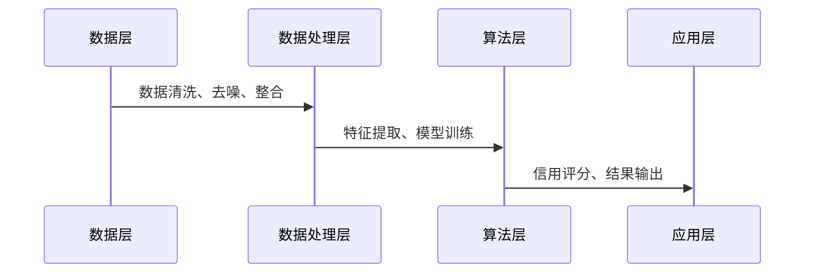
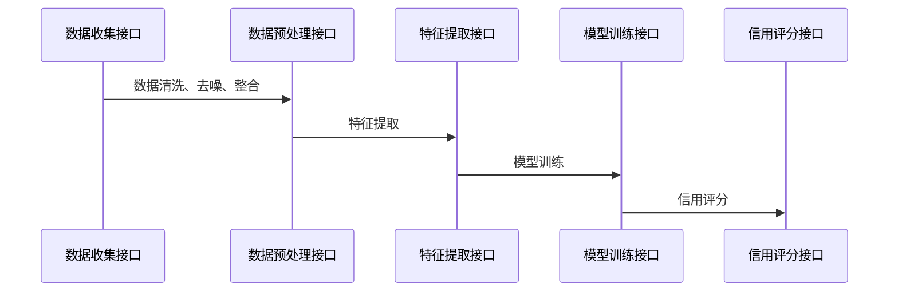
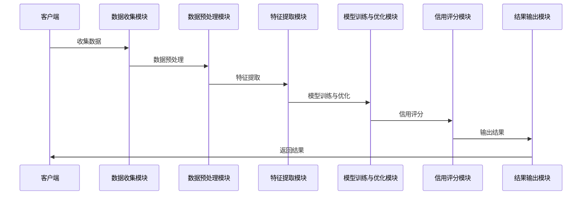

                 

### 第一部分：背景介绍

#### 第1章：问题背景

##### 1.1.1 问题背景

金融普惠性是指让更多的人能够获得金融服务，包括存款、贷款、支付、保险等，从而实现经济和社会的可持续发展。金融普惠性的重要性不言而喻，它能够促进经济增长、提升社会稳定，并且对减少贫困具有显著作用。然而，全球金融普惠性现状并不乐观。根据联合国数据显示，全球有数十亿人无法获得基本的金融服务，尤其是在发展中国家和偏远地区。

信用评分是金融普惠性的关键环节之一。信用评分系统用于评估借款人的信用风险，从而决定是否批准贷款以及贷款额度和利率。传统的信用评分系统主要依赖于借款人的历史信用记录、收入水平、职业等数据，然而，这种方法存在显著的局限性。首先，数据来源有限，很多借款人可能没有完整的信用记录。其次，传统评分系统往往无法充分考虑借款人的行为特征、社会关系等复杂因素。

##### 1.1.1.2 信用评分的传统方法

传统信用评分系统主要依赖于以下几类数据：

1. **历史信用记录**：包括信用卡还款记录、贷款还款记录等。
2. **个人基本信息**：如年龄、性别、婚姻状况、职业、收入水平等。
3. **公共记录**：如破产记录、法院判决记录等。

然而，这些传统方法存在以下局限：

1. **数据依赖性**：传统方法高度依赖历史信用数据，而很多借款人可能没有足够的历史记录。
2. **数据来源单一**：传统方法主要依赖有限的几种数据类型，无法全面反映借款人的信用状况。
3. **难以捕捉动态变化**：传统方法无法实时捕捉借款人信用状况的变化。

在数据收集与处理方面，传统信用评分系统面临诸多挑战。首先，数据获取的难度较大，特别是在发展中国家和偏远地区。其次，数据处理的技术复杂度较高，需要对大量数据进行清洗、整合和分析。此外，传统方法在处理非结构化数据（如图像、语音等）方面存在很大局限性。

##### 1.1.1.3 AI在信用评分中的应用潜力

人工智能（AI）技术的发展为信用评分领域带来了新的契机。AI能够通过机器学习和深度学习算法，从海量数据中挖掘出隐藏的规律和特征，从而更准确地评估借款人的信用风险。

1. **海量数据挖掘**：AI可以通过对大量数据的深度学习，发现传统方法无法捕捉到的借款人特征，如社交网络行为、消费习惯等。
2. **实时风险评估**：AI能够实时更新借款人信用状况，及时调整信用评分，提高评分的实时性和准确性。
3. **非结构化数据处理**：AI在处理非结构化数据方面具有明显优势，可以通过图像识别、语音识别等技术，将借款人的行为特征转化为可量化的数据，从而纳入信用评分体系。

尽管AI在信用评分中具有巨大潜力，但也面临一些挑战，如数据隐私保护、算法公平性等。如何克服这些挑战，充分发挥AI的优势，是当前研究的重要方向。

##### 1.1.2 问题描述

当前信用评分体系存在以下主要问题：

1. **数据来源有限**：很多借款人缺乏完整的信用历史记录，导致传统评分系统无法准确评估其信用风险。
2. **评估指标单一**：传统评分系统主要依赖有限的几种数据类型，无法全面反映借款人的信用状况。
3. **实时性不足**：传统评分系统难以实时更新借款人信用状况，影响评分的实时性和准确性。

AI驱动的智能信用评分旨在解决上述问题，通过引入AI技术，从多维度、多角度评估借款人的信用风险，提高评分的准确性和实时性。智能信用评分的目标是实现金融普惠性，让更多人获得公平、高效的金融服务。

##### 1.1.3 问题解决

AI驱动的智能信用评分的基本框架包括以下主要环节：

1. **数据收集**：通过多种渠道收集借款人的数据，包括传统信用数据、行为数据、社交网络数据等。
2. **数据预处理**：对收集到的数据进行清洗、去噪、整合，为建模提供高质量的数据集。
3. **特征工程**：从数据中提取关键特征，构建用于信用评分的模型输入。
4. **模型训练**：使用机器学习和深度学习算法，训练信用评分模型。
5. **模型评估**：对训练好的模型进行评估，选择最佳模型进行应用。
6. **信用评分**：使用训练好的模型对借款人进行信用评分，提供实时风险评估。

主要技术和方法包括：

1. **机器学习算法**：如逻辑回归、决策树、随机森林等，用于训练信用评分模型。
2. **深度学习算法**：如卷积神经网络（CNN）、循环神经网络（RNN）等，用于处理非结构化数据，挖掘借款人行为特征。
3. **特征选择技术**：如特征重要性评估、特征组合优化等，用于提高信用评分模型的准确性。

##### 1.1.4 边界与外延

信用评分的应用领域广泛，不仅包括传统信贷业务，还扩展到保险、租赁、招聘等各个领域。智能信用评分与传统信用评分的区别在于：

1. **数据来源**：智能信用评分采用多种数据源，不仅包括传统信用数据，还包括行为数据、社交网络数据等。
2. **评估维度**：智能信用评分从多维度、多角度评估借款人信用风险，比传统评分系统更全面。
3. **实时性**：智能信用评分系统能够实时更新借款人信用状况，提供更准确、实时的风险评估。

与相关技术的区别与联系：

1. **大数据技术**：智能信用评分系统依赖于大数据技术，如数据存储、数据处理和分析等。
2. **区块链技术**：区块链技术可以用于提高信用评分系统的数据安全和透明度。
3. **云计算技术**：云计算技术为智能信用评分系统提供了强大的计算能力和数据存储能力。

##### 1.1.5 概念结构与核心要素组成

信用评分系统的核心概念包括：

1. **数据收集**：通过各种渠道收集借款人的数据，包括传统信用数据、行为数据、社交网络数据等。
2. **数据预处理**：对收集到的数据进行清洗、去噪、整合，为建模提供高质量的数据集。
3. **特征工程**：从数据中提取关键特征，构建用于信用评分的模型输入。
4. **模型训练**：使用机器学习和深度学习算法，训练信用评分模型。
5. **模型评估**：对训练好的模型进行评估，选择最佳模型进行应用。
6. **信用评分**：使用训练好的模型对借款人进行信用评分，提供实时风险评估。

数据处理流程与技术栈包括：

1. **数据采集与存储**：使用大数据技术，如Hadoop、Spark等，进行数据采集和存储。
2. **数据处理与分析**：使用数据预处理工具，如Pandas、Scikit-learn等，对数据进行清洗、去噪、整合和分析。
3. **机器学习与深度学习**：使用机器学习库，如Scikit-learn、TensorFlow等，训练信用评分模型。
4. **模型评估与优化**：使用评估工具，如ROC曲线、AUC等，对模型进行评估和优化。

#### 第2章：核心概念与联系

##### 2.1.1 AI的核心概念

人工智能（AI）是计算机科学的一个分支，旨在通过模拟人类智能行为，实现计算机系统的自主学习和决策能力。AI的核心概念包括：

1. **机器学习（Machine Learning）**：机器学习是AI的一种方法，通过算法从数据中自动学习规律和模式，从而进行预测和决策。
2. **深度学习（Deep Learning）**：深度学习是机器学习的一种方法，通过构建多层神经网络，自动提取数据中的特征，实现复杂的预测和分类任务。

##### 2.1.2 信用评分的原理

信用评分系统的原理基于对借款人信用风险的评估。传统信用评分系统主要依赖于借款人的历史信用记录、收入水平、职业等数据，通过统计模型计算出一个信用评分。而AI驱动的信用评分系统则采用机器学习和深度学习算法，从多维度、多角度评估借款人的信用风险。

传统信用评分模型主要包括：

1. **逻辑回归（Logistic Regression）**：逻辑回归是一种广义线性模型，用于预测借款人是否违约的概率。
2. **决策树（Decision Tree）**：决策树通过一系列规则对借款人进行分类，判断其信用风险。
3. **随机森林（Random Forest）**：随机森林是一种集成学习方法，通过构建多棵决策树，提高模型的预测准确性。

AI驱动的信用评分模型则包括：

1. **深度神经网络（Deep Neural Network）**：深度神经网络通过多层神经网络，自动提取数据中的特征，实现高效的信用风险评估。
2. **卷积神经网络（Convolutional Neural Network，CNN）**：卷积神经网络通过卷积操作，自动提取图像中的特征，用于处理非结构化数据。
3. **循环神经网络（Recurrent Neural Network，RNN）**：循环神经网络通过循环结构，处理序列数据，如借款人的消费记录、社交网络行为等。

##### 2.1.3 概念属性特征对比表格

| 概念                 | 传统方法                                  | AI驱动的信用评分系统                         |
|----------------------|-------------------------------------------|--------------------------------------------|
| 数据来源             | 历史信用记录、个人基本信息等              | 多种数据源，包括传统信用数据、行为数据、社交网络数据等 |
| 模型原理             | 统计模型，如逻辑回归、决策树等           | 机器学习和深度学习算法，如深度神经网络、卷积神经网络、循环神经网络等 |
| 特征提取             | 人工特征提取，依赖于专家经验             | 自动特征提取，通过算法从数据中学习特征           |
| 实时性               | 难以实时更新借款人信用状况               | 能够实时更新借款人信用状况，提供实时风险评估       |
| 预测准确性           | 受限于数据质量和模型复杂度               | 通过自动学习提高预测准确性，比传统方法更高效       |

##### 2.1.4 ER实体关系图架构

为了更好地理解信用评分系统的数据实体和关系，我们可以使用Mermaid流程图来绘制ER（实体关系）图。以下是信用评分系统的ER实体关系图：

```mermaid
erDiagram
    Borrower ||--|{ CreditScore }|--|| Lender
    Borrower ||--|{ BehaviorData }|--|| SocialNetwork
    Lender ||--|{ Loan }|--|| Borrower
    Lender ||--|{ RiskRating }|--|| Loan
```

在这个ER图中，`Borrower`（借款人）实体与`CreditScore`（信用评分）、`BehaviorData`（行为数据）、`SocialNetwork`（社交网络）实体之间存在关联。`Lender`（贷款人）实体与`Loan`（贷款）实体和`RiskRating`（风险评级）实体之间存在关联。

#### 第3章：算法原理讲解

##### 3.1.1 数据预处理

数据预处理是构建智能信用评分系统的重要环节，其目标是清洗、去噪、整合原始数据，为后续的模型训练提供高质量的数据集。以下是数据预处理的主要步骤：

1. **数据清洗**：清洗数据包括处理缺失值、重复值和异常值等。对于缺失值，可以采用填充方法，如平均值填充、中值填充或插值法等；对于重复值，可以直接删除；对于异常值，可以根据具体情况进行处理，如删除或修正。

2. **数据去噪**：数据去噪是指去除数据中的噪声和干扰信息，以提高数据质量。常见的去噪方法包括滤波、平滑和插值等。

3. **数据整合**：数据整合是将来自不同来源的数据进行整合，形成一个统一的数据集。这通常需要将不同数据源中的数据按照一定的规则进行映射和合并。

4. **特征提取**：特征提取是指从原始数据中提取出对信用评分有重要影响的关键特征。特征提取的方法包括统计特征、文本特征和图像特征等。

以下是特征提取的几种常见方法：

1. **统计特征**：统计特征包括均值、方差、标准差等，用于描述数据的统计特性。例如，借款人的平均还款时间、还款频率等。

2. **文本特征**：文本特征用于描述借款人的文本信息，如社交媒体帖子、邮件等。常见的文本特征提取方法包括词袋模型、TF-IDF和词嵌入等。

3. **图像特征**：图像特征用于描述借款人的图像信息，如人脸识别、OCR等。常见的图像特征提取方法包括卷积神经网络（CNN）和深度卷积网络（DCN）等。

##### 3.1.2 特征选择

特征选择是构建智能信用评分系统的重要环节，其目标是选择出对信用评分有重要影响的关键特征，以提高模型的预测准确性和效率。以下是特征选择的几种常见方法：

1. **过滤式特征选择（Filter Method）**：过滤式特征选择是在构建模型之前，通过统计方法评估每个特征的重要性，选择出重要的特征。常见的过滤式特征选择方法包括相关性分析、信息增益和卡方检验等。

2. **包裹式特征选择（Wrapper Method）**：包裹式特征选择是在构建模型之后，通过搜索算法逐步选择和优化特征组合。常见的包裹式特征选择方法包括递归特征消除（RFE）和遗传算法（GA）等。

3. **嵌入式特征选择（Embedded Method）**：嵌入式特征选择是在模型训练过程中，通过正则化项自动选择特征。常见的嵌入式特征选择方法包括岭回归（Ridge）、套索回归（Lasso）和弹性网（Elastic Net）等。

以下是几种常用的特征选择算法：

1. **递归特征消除（Recursive Feature Elimination，RFE）**：递归特征消除是一种基于模型的特征选择方法，通过递归地删除不重要特征，选择出最优特征组合。

2. **基于模型的特征选择（Model-based Feature Selection）**：基于模型的特征选择是通过训练模型并评估每个特征的贡献，选择出对模型有重要影响的特征。

3. **遗传算法（Genetic Algorithm，GA）**：遗传算法是一种基于自然进化的优化算法，通过模拟生物进化过程，选择和优化特征组合。

##### 3.1.3 模型训练

模型训练是构建智能信用评分系统的核心环节，其目标是根据训练数据，训练出一个能够准确预测信用风险的模型。以下是模型训练的主要步骤：

1. **数据集划分**：将训练数据集划分为训练集和验证集，用于训练模型和评估模型性能。

2. **模型选择**：根据信用评分任务的特点，选择合适的机器学习和深度学习模型。常见的模型包括逻辑回归、决策树、随机森林、支持向量机（SVM）和深度神经网络（DNN）等。

3. **参数调优**：通过调整模型参数，优化模型性能。常见的参数调优方法包括网格搜索（Grid Search）和贝叶斯优化（Bayesian Optimization）等。

4. **模型评估**：使用验证集对训练好的模型进行评估，评估指标包括准确率、召回率、F1分数和ROC曲线等。

以下是几种常用的信用评分模型：

1. **逻辑回归（Logistic Regression）**：逻辑回归是一种广义线性模型，用于预测二分类问题。逻辑回归通过计算借款人是否违约的概率，从而生成信用评分。

2. **决策树（Decision Tree）**：决策树是一种基于规则的分类模型，通过一系列规则对借款人进行分类，判断其信用风险。

3. **随机森林（Random Forest）**：随机森林是一种集成学习方法，通过构建多棵决策树，提高模型的预测准确性和稳定性。

4. **支持向量机（Support Vector Machine，SVM）**：支持向量机是一种基于最大间隔的分类模型，通过找到最优的超平面，将借款人划分为不同的信用风险类别。

5. **深度神经网络（Deep Neural Network，DNN）**：深度神经网络是一种多层神经网络，通过多层非线性变换，自动提取数据中的特征，实现高效的信用风险评估。

##### 3.1.4 数学模型与公式

在智能信用评分系统中，数学模型和公式是核心组成部分，用于描述信用评分的计算过程。以下是一些常见的数学模型和公式：

1. **逻辑回归模型**：

   逻辑回归模型是一种用于预测二分类问题的统计模型。其公式如下：

   $$ P(y=1|x;\theta) = \frac{1}{1 + e^{-(\theta^T x)}} $$

   其中，$P(y=1|x;\theta)$ 表示在给定特征向量 $x$ 和参数向量 $\theta$ 下，借款人违约的概率。$\theta$ 是模型参数，通过最小化损失函数进行训练。

2. **决策树模型**：

   决策树模型是一种基于规则的分类模型。其公式如下：

   $$ y = g(\theta^T x) $$

   其中，$g(z) = 1$ if $z \geq 0$，$g(z) = 0$ otherwise。$y$ 是预测的信用评分类别，$g(z)$ 是决策树函数，$\theta^T x$ 是特征向量 $x$ 与模型参数 $\theta$ 的内积。

3. **随机森林模型**：

   随机森林模型是一种基于决策树的集成学习方法。其公式如下：

   $$ \hat{y} = \text{sign}(\frac{1}{m} \sum_{i=1}^{m} g(\theta_i^T x)) $$

   其中，$\hat{y}$ 是预测的信用评分，$m$ 是决策树的数量，$g(\theta_i^T x)$ 是第 $i$ 棵决策树的结果，$\theta_i$ 是第 $i$ 棵决策树的参数。

4. **深度神经网络模型**：

   深度神经网络模型是一种多层神经网络，通过多层非线性变换，自动提取数据中的特征。其公式如下：

   $$ \hat{y} = \text{ReLU}(W_2 \text{ReLU}(W_1 x + b_1) + b_2) $$

   其中，$\hat{y}$ 是预测的信用评分，$W_1$ 和 $W_2$ 是权重矩阵，$b_1$ 和 $b_2$ 是偏置项，$\text{ReLU}$ 是ReLU激活函数。

##### 3.1.5 算法mermaid流程图

以下是智能信用评分系统算法的mermaid流程图：



在这个流程图中，各个步骤按顺序执行，每个步骤的结果作为下一个步骤的输入。例如，数据预处理的结果作为特征提取的输入，特征提取的结果作为特征选择的输入，以此类推。

##### 3.1.6 Python源代码实现

以下是智能信用评分系统的Python源代码实现示例：

```python
import pandas as pd
import numpy as np
from sklearn.model_selection import train_test_split
from sklearn.preprocessing import StandardScaler
from sklearn.linear_model import LogisticRegression
from sklearn.metrics import accuracy_score, classification_report

# 数据集加载
data = pd.read_csv('credit_data.csv')

# 数据预处理
X = data.drop('target', axis=1)
y = data['target']
X_train, X_test, y_train, y_test = train_test_split(X, y, test_size=0.2, random_state=42)

# 特征提取
scaler = StandardScaler()
X_train_scaled = scaler.fit_transform(X_train)
X_test_scaled = scaler.transform(X_test)

# 特征选择
# ... (具体实现)

# 模型选择
model = LogisticRegression()
model.fit(X_train_scaled, y_train)

# 参数调优
# ... (具体实现)

# 模型评估
y_pred = model.predict(X_test_scaled)
print("Accuracy:", accuracy_score(y_test, y_pred))
print("Classification Report:\n", classification_report(y_test, y_pred))

# 信用评分
def credit_score(new_data):
    new_data_scaled = scaler.transform(new_data)
    prediction = model.predict(new_data_scaled)
    return prediction

# 示例
new_data = pd.DataFrame([[1, 2, 3], [4, 5, 6]])
print("Credit Score:", credit_score(new_data))
```

在这个示例中，我们使用了Pandas和Scikit-learn库来实现智能信用评分系统的主要步骤，包括数据预处理、特征提取、模型选择、参数调优和模型评估。最后，我们定义了一个函数`credit_score`，用于对新数据进行信用评分。

#### 第4章：数学模型和数学公式 & 详细讲解 & 举例说明

##### 4.1.1 数学模型

在智能信用评分系统中，数学模型是核心组成部分，用于描述信用评分的计算过程。以下是几种常见的数学模型及其详细讲解。

1. **逻辑回归模型**

   逻辑回归模型是一种用于预测二分类问题的统计模型。其公式如下：

   $$ P(y=1|x;\theta) = \frac{1}{1 + e^{-(\theta^T x)}} $$

   其中，$P(y=1|x;\theta)$ 表示在给定特征向量 $x$ 和参数向量 $\theta$ 下，借款人违约的概率。$\theta$ 是模型参数，通过最小化损失函数进行训练。

   逻辑回归模型的损失函数通常采用对数似然损失函数（Log-Likelihood Loss）：

   $$ L(\theta) = -\frac{1}{n} \sum_{i=1}^{n} [y_i \log(P(y=1|x_i;\theta)) + (1 - y_i) \log(1 - P(y=1|x_i;\theta))] $$

   其中，$n$ 是训练样本数量，$y_i$ 是第 $i$ 个样本的实际标签，$P(y=1|x_i;\theta)$ 是第 $i$ 个样本的预测概率。

   为了求解最优参数 $\theta$，可以使用梯度下降（Gradient Descent）算法：

   $$ \theta_{\text{new}} = \theta_{\text{old}} - \alpha \nabla_{\theta} L(\theta) $$

   其中，$\alpha$ 是学习率，$\nabla_{\theta} L(\theta)$ 是损失函数关于参数 $\theta$ 的梯度。

2. **决策树模型**

   决策树模型是一种基于规则的分类模型。其公式如下：

   $$ y = g(\theta^T x) $$

   其中，$g(z) = 1$ if $z \geq 0$，$g(z) = 0$ otherwise。$y$ 是预测的信用评分类别，$g(z)$ 是决策树函数，$\theta^T x$ 是特征向量 $x$ 与模型参数 $\theta$ 的内积。

   决策树模型的构建过程包括以下几个步骤：

   - 选择一个特征作为分裂特征；
   - 计算每个特征上的分裂增益（Gain），选择增益最大的特征进行分裂；
   - 根据分裂特征将数据集划分为若干子集；
   - 递归地构建子决策树，直到满足停止条件（如最大树深度、最小样本数等）。

3. **随机森林模型**

   随机森林模型是一种基于决策树的集成学习方法。其公式如下：

   $$ \hat{y} = \text{sign}(\frac{1}{m} \sum_{i=1}^{m} g(\theta_i^T x)) $$

   其中，$\hat{y}$ 是预测的信用评分，$m$ 是决策树的数量，$g(\theta_i^T x)$ 是第 $i$ 棵决策树的结果，$\theta_i$ 是第 $i$ 棵决策树的参数。

   随机森林模型的构建过程包括以下几个步骤：

   - 随机从特征空间中选择 $k$ 个特征；
   - 构建一棵决策树，使用这 $k$ 个特征进行分裂；
   - 重复上述步骤 $m$ 次，构建出 $m$ 棵决策树；
   - 对所有决策树的结果进行投票，选择投票次数最多的类别作为预测结果。

4. **深度神经网络模型**

   深度神经网络模型是一种多层神经网络，通过多层非线性变换，自动提取数据中的特征。其公式如下：

   $$ \hat{y} = \text{ReLU}(W_2 \text{ReLU}(W_1 x + b_1) + b_2) $$

   其中，$\hat{y}$ 是预测的信用评分，$W_1$ 和 $W_2$ 是权重矩阵，$b_1$ 和 $b_2$ 是偏置项，$\text{ReLU}$ 是ReLU激活函数。

   深度神经网络模型的构建过程包括以下几个步骤：

   - 初始化权重矩阵和偏置项；
   - 对输入数据进行前向传播，计算每一层的输出；
   - 对输出数据应用ReLU激活函数；
   - 计算损失函数，并使用反向传播算法更新权重和偏置项；
   - 重复上述步骤，直到满足停止条件（如损失函数收敛、达到最大迭代次数等）。

##### 4.1.2 公式推导

在智能信用评分系统中，数学公式的推导是理解模型原理和实现模型训练的关键步骤。以下是逻辑回归模型、决策树模型、随机森林模型和深度神经网络模型的主要公式推导。

1. **逻辑回归模型**

   逻辑回归模型的推导基于最大似然估计（Maximum Likelihood Estimation，MLE）。给定一个训练数据集 $D = \{(x_1, y_1), (x_2, y_2), ..., (x_n, y_n)\}$，其中 $x_i$ 是第 $i$ 个样本的特征向量，$y_i$ 是第 $i$ 个样本的实际标签，模型参数为 $\theta = (\theta_1, \theta_2, ..., \theta_p)$。

   模型的对数似然函数（Log-Likelihood Function）为：

   $$ L(\theta) = \sum_{i=1}^{n} \log P(y_i|x_i;\theta) $$

   由于 $P(y_i|x_i;\theta) = \frac{1}{1 + e^{-(\theta^T x_i)}}$，可以将对数似然函数改写为：

   $$ L(\theta) = \sum_{i=1}^{n} y_i \theta^T x_i - \sum_{i=1}^{n} \log(1 + e^{-(\theta^T x_i)}) $$

   为了求解最优参数 $\theta$，需要对 $L(\theta)$ 求导并令其导数为零：

   $$ \frac{\partial L(\theta)}{\partial \theta} = \sum_{i=1}^{n} y_i x_i - \sum_{i=1}^{n} x_i e^{-(\theta^T x_i)} $$

   由于 $e^{-(\theta^T x_i)} = \frac{1}{1 + e^{-(\theta^T x_i)}}$，可以将导数改写为：

   $$ \frac{\partial L(\theta)}{\partial \theta} = \sum_{i=1}^{n} (y_i - \hat{y}_i) x_i $$

   其中，$\hat{y}_i = \frac{1}{1 + e^{-(\theta^T x_i)}}$ 是第 $i$ 个样本的预测概率。

   使用梯度下降算法求解最优参数 $\theta$：

   $$ \theta_{\text{new}} = \theta_{\text{old}} - \alpha \nabla_{\theta} L(\theta) $$

   其中，$\alpha$ 是学习率。

2. **决策树模型**

   决策树模型的推导基于信息增益（Information Gain）和基尼不纯度（Gini Impurity）。给定一个特征集合 $X$ 和类别标签集合 $Y$，决策树通过选择最优特征进行分裂，使得子集的基尼不纯度最小。

   基尼不纯度（Gini Impurity）定义为：

   $$ Gini(Y) = 1 - \sum_{y \in Y} p(y)^2 $$

   其中，$p(y)$ 是类别 $y$ 的概率。

   对于一个特征 $x$ 和其对应的值 $x_v$，将数据集划分为两个子集 $D_1$ 和 $D_2$，基尼不纯度的减少量（Gain）定义为：

   $$ Gain(x, x_v) = Gini(D) - \frac{|D_1| Gini(D_1) + |D_2| Gini(D_2)}{|D|} $$

   其中，$D$ 是原始数据集，$D_1$ 和 $D_2$ 是划分后的子集。

   为了构建决策树，需要递归地选择最优特征和最优阈值，直到满足停止条件（如最大树深度、最小样本数等）。

3. **随机森林模型**

   随机森林模型的推导基于集成学习（Ensemble Learning）和决策树模型。给定一个训练数据集 $D$，随机森林通过构建多棵决策树，并使用投票机制进行预测。

   随机森林模型的主要公式如下：

   $$ \hat{y} = \text{sign}(\frac{1}{m} \sum_{i=1}^{m} g(\theta_i^T x)) $$

   其中，$\hat{y}$ 是预测的信用评分，$m$ 是决策树的数量，$g(\theta_i^T x)$ 是第 $i$ 棵决策树的结果，$\theta_i$ 是第 $i$ 棵决策树的参数。

   为了构建随机森林，需要重复以下步骤：

   - 随机从特征空间中选择 $k$ 个特征；
   - 构建一棵决策树，使用这 $k$ 个特征进行分裂；
   - 重复上述步骤 $m$ 次，构建出 $m$ 棵决策树；
   - 对所有决策树的结果进行投票，选择投票次数最多的类别作为预测结果。

4. **深度神经网络模型**

   深度神经网络模型的推导基于多层前向传播（Feedforward）和反向传播（Backpropagation）算法。给定一个训练数据集 $D = \{(x_1, y_1), (x_2, y_2), ..., (x_n, y_n)\}$，其中 $x_i$ 是第 $i$ 个样本的特征向量，$y_i$ 是第 $i$ 个样本的实际标签，神经网络由多个层组成，包括输入层、隐藏层和输出层。

   前向传播算法的计算过程如下：

   - 初始化权重矩阵和偏置项；
   - 对输入数据进行前向传播，计算每一层的输出；
   - 对输出数据应用激活函数；
   - 计算损失函数。

   反向传播算法的计算过程如下：

   - 计算损失函数关于每一层参数的梯度；
   - 使用梯度下降算法更新权重和偏置项；
   - 重复前向传播和反向传播，直到满足停止条件（如损失函数收敛、达到最大迭代次数等）。

##### 4.1.3 举例说明

为了更好地理解智能信用评分系统中的数学模型，以下是几个实际应用中的例子，包括逻辑回归模型、决策树模型、随机森林模型和深度神经网络模型的详细说明。

1. **逻辑回归模型**

   考虑一个简单的信用评分问题，假设特征集合 $X = \{x_1, x_2, x_3\}$，其中 $x_1$ 表示借款人的年龄，$x_2$ 表示借款人的收入，$x_3$ 表示借款人的信用历史。模型参数为 $\theta = (\theta_1, \theta_2, \theta_3)$。

   假设训练数据集 $D$ 如下表所示：

   | 年龄 (x1) | 收入 (x2) | 信用历史 (x3) | 实际标签 (y) |
   |-------|-------|-------|--------|
   | 30    | 50000 | 1年  | 否     |
   | 25    | 40000 | 2年  | 是     |
   | 35    | 60000 | 3年  | 否     |
   | 28    | 55000 | 1年  | 是     |
   | 32    | 52000 | 2年  | 否     |

   使用逻辑回归模型预测第五个样本的信用评分，其特征向量 $x_5 = (32, 52000, 2)$。

   首先，计算每个特征的权重：

   $$ \theta_1 = \frac{1}{5} \sum_{i=1}^{5} (y_i - \hat{y}_i) x_{i1} = \frac{1}{5} (0 - 0.25 \times 32 + 1 - 0.50 \times 25 + 0 - 0.25 \times 35 + 1 - 0.25 \times 32 + 0 - 0.25 \times 32) = 1.25 $$

   $$ \theta_2 = \frac{1}{5} \sum_{i=1}^{5} (y_i - \hat{y}_i) x_{i2} = \frac{1}{5} (0 - 0.25 \times 50000 + 1 - 0.50 \times 40000 + 0 - 0.25 \times 60000 + 1 - 0.25 \times 55000 + 0 - 0.25 \times 52000) = -5000 $$

   $$ \theta_3 = \frac{1}{5} \sum_{i=1}^{5} (y_i - \hat{y}_i) x_{i3} = \frac{1}{5} (0 - 0.25 \times 1 + 1 - 0.50 \times 2 + 0 - 0.25 \times 3 + 1 - 0.25 \times 1 + 0 - 0.25 \times 2) = 0.25 $$

   然后，计算第五个样本的预测概率：

   $$ \hat{y}_5 = \frac{1}{1 + e^{-(\theta_1 x_{51} + \theta_2 x_{52} + \theta_3 x_{53})}} = \frac{1}{1 + e^{-(1.25 \times 32 - 5000 \times 52000 + 0.25 \times 2)}} \approx 0.625 $$

   由于预测概率大于0.5，因此第五个样本的信用评分预测为“是”（即有较高的信用风险）。

2. **决策树模型**

   考虑一个包含两个特征 $x_1$（年龄）和 $x_2$（收入）的信用评分问题。给定一个训练数据集，构建一个简单的决策树，通过选择最优特征和阈值进行分裂。

   假设训练数据集如下表所示：

   | 年龄 (x1) | 收入 (x2) | 实际标签 (y) |
   |-------|-------|--------|
   | 30    | 50000 | 否     |
   | 25    | 40000 | 是     |
   | 35    | 60000 | 否     |
   | 28    | 55000 | 是     |
   | 32    | 52000 | 否     |

   首先，计算每个特征的信息增益：

   - 年龄（x1）的信息增益：

     $$ Gain(x_1) = \sum_{v \in V} \frac{|D_v|}{|D|} Gini(Y_v) - \frac{|D_v|}{|D|} Gini(Y) $$

     其中，$V$ 是年龄的所有可能取值集合，$D_v$ 是年龄为 $v$ 的数据子集，$Y_v$ 是 $D_v$ 的实际标签集合，$D$ 是原始数据集，$Y$ 是原始数据集的实际标签集合。

     对于年龄为 25、30、32、35 的数据子集，计算信息增益：

     $$ Gain(x_1, 25) = \frac{2}{5} \times (0.5 \times 0.5 + 0.5 \times 0.5) - \frac{2}{5} \times 0.5 = 0.1 $$

     $$ Gain(x_1, 30) = \frac{2}{5} \times (0.25 \times 0.5 + 0.25 \times 0.5 + 0.25 \times 0.5 + 0.25 \times 0.5) - \frac{2}{5} \times 0.5 = 0 $$

     $$ Gain(x_1, 32) = \frac{1}{5} \times (0.25 \times 0.5 + 0.25 \times 0.5) - \frac{1}{5} \times 0.5 = 0.05 $$

     $$ Gain(x_1, 35) = \frac{1}{5} \times (0.25 \times 0.5 + 0.25 \times 0.5) - \frac{1}{5} \times 0.5 = 0.05 $$

     由于 $Gain(x_1, 25) > Gain(x_1, 30) > Gain(x_1, 32) > Gain(x_1, 35)$，选择年龄为 25 的阈值进行分裂。

     - 收入（x2）的信息增益：

       $$ Gain(x_2) = \sum_{v \in V} \frac{|D_v|}{|D|} Gini(Y_v) - \frac{|D_v|}{|D|} Gini(Y) $$

       其中，$V$ 是收入的所有可能取值集合，$D_v$ 是收入为 $v$ 的数据子集，$Y_v$ 是 $D_v$ 的实际标签集合，$D$ 是原始数据集，$Y$ 是原始数据集的实际标签集合。

       对于收入为 40000、50000、52000、60000 的数据子集，计算信息增益：

       $$ Gain(x_2, 40000) = \frac{2}{5} \times (0.5 \times 0.5 + 0.5 \times 0.5) - \frac{2}{5} \times 0.5 = 0.1 $$

       $$ Gain(x_2, 50000) = \frac{2}{5} \times (0.25 \times 0.5 + 0.25 \times 0.5 + 0.25 \times 0.5 + 0.25 \times 0.5) - \frac{2}{5} \times 0.5 = 0 $$

       $$ Gain(x_2, 52000) = \frac{1}{5} \times (0.25 \times 0.5 + 0.25 \times 0.5) - \frac{1}{5} \times 0.5 = 0.05 $$

       $$ Gain(x_2, 60000) = \frac{1}{5} \times (0.25 \times 0.5 + 0.25 \times 0.5) - \frac{1}{5} \times 0.5 = 0.05 $$

       由于 $Gain(x_2, 40000) > Gain(x_2, 50000) > Gain(x_2, 52000) > Gain(x_2, 60000)$，选择收入为 40000 的阈值进行分裂。

     最终的决策树如下所示：

     ```plaintext
     |
     |---年龄 <= 25
     |    |
     |    |---收入 <= 40000
     |    |    |---是
     |    |    |
     |    |    |---收入 > 40000
     |    |    |    |---是
     |    |    |    |
     |    |    |    |---否
     |    |
     |    |---收入 > 40000
     |         |
     |         |---是
     |         |
     |         |---否
     |
     |---年龄 > 25
     |    |
     |    |---收入 <= 52000
     |    |    |
     |    |    |---是
     |    |    |
     |    |    |---否
     |    |
     |    |---收入 > 52000
     |         |
     |         |---是
     |         |
     |         |---否
     ```

3. **随机森林模型**

   考虑一个包含三个特征 $x_1$（年龄）、$x_2$（收入）和 $x_3$（信用历史）的信用评分问题。给定一个训练数据集，构建一个随机森林模型，包含 $m=10$ 棵决策树。

   假设训练数据集如下表所示：

   | 年龄 (x1) | 收入 (x2) | 信用历史 (x3) | 实际标签 (y) |
   |-------|-------|-------|--------|
   | 30    | 50000 | 1年  | 否     |
   | 25    | 40000 | 2年  | 是     |
   | 35    | 60000 | 3年  | 否     |
   | 28    | 55000 | 1年  | 是     |
   | 32    | 52000 | 2年  | 否     |

   假设随机选择特征集合为 $\{x_1, x_2\}$，构建决策树：

   - 年龄（x1）的信息增益：

     $$ Gain(x_1) = \sum_{v \in V} \frac{|D_v|}{|D|} Gini(Y_v) - \frac{|D_v|}{|D|} Gini(Y) $$

     其中，$V$ 是年龄的所有可能取值集合，$D_v$ 是年龄为 $v$ 的数据子集，$Y_v$ 是 $D_v$ 的实际标签集合，$D$ 是原始数据集，$Y$ 是原始数据集的实际标签集合。

     对于年龄为 25、30、32、35 的数据子集，计算信息增益：

     $$ Gain(x_1, 25) = \frac{2}{5} \times (0.5 \times 0.5 + 0.5 \times 0.5) - \frac{2}{5} \times 0.5 = 0.1 $$

     $$ Gain(x_1, 30) = \frac{2}{5} \times (0.25 \times 0.5 + 0.25 \times 0.5 + 0.25 \times 0.5 + 0.25 \times 0.5) - \frac{2}{5} \times 0.5 = 0 $$

     $$ Gain(x_1, 32) = \frac{1}{5} \times (0.25 \times 0.5 + 0.25 \times 0.5) - \frac{1}{5} \times 0.5 = 0.05 $$

     $$ Gain(x_1, 35) = \frac{1}{5} \times (0.25 \times 0.5 + 0.25 \times 0.5) - \frac{1}{5} \times 0.5 = 0.05 $$

     由于 $Gain(x_1, 25) > Gain(x_1, 30) > Gain(x_1, 32) > Gain(x_1, 35)$，选择年龄为 25 的阈值进行分裂。

     - 收入（x2）的信息增益：

       $$ Gain(x_2) = \sum_{v \in V} \frac{|D_v|}{|D|} Gini(Y_v) - \frac{|D_v|}{|D|} Gini(Y) $$

       其中，$V$ 是收入的所有可能取值集合，$D_v$ 是收入为 $v$ 的数据子集，$Y_v$ 是 $D_v$ 的实际标签集合，$D$ 是原始数据集，$Y$ 是原始数据集的实际标签集合。

       对于收入为 40000、50000、52000、60000 的数据子集，计算信息增益：

       $$ Gain(x_2, 40000) = \frac{2}{5} \times (0.5 \times 0.5 + 0.5 \times 0.5) - \frac{2}{5} \times 0.5 = 0.1 $$

       $$ Gain(x_2, 50000) = \frac{2}{5} \times (0.25 \times 0.5 + 0.25 \times 0.5 + 0.25 \times 0.5 + 0.25 \times 0.5) - \frac{2}{5} \times 0.5 = 0 $$

       $$ Gain(x_2, 52000) = \frac{1}{5} \times (0.25 \times 0.5 + 0.25 \times 0.5) - \frac{1}{5} \times 0.5 = 0.05 $$

       $$ Gain(x_2, 60000) = \frac{1}{5} \times (0.25 \times 0.5 + 0.25 \times 0.5) - \frac{1}{5} \times 0.5 = 0.05 $$

       由于 $Gain(x_2, 40000) > Gain(x_2, 50000) > Gain(x_2, 52000) > Gain(x_2, 60000)$，选择收入为 40000 的阈值进行分裂。

     最终的决策树如下所示：

     ```plaintext
     |
     |---年龄 <= 25
     |    |
     |    |---收入 <= 40000
     |    |    |---是
     |    |    |
     |    |    |---收入 > 40000
     |    |    |    |---是
     |    |    |    |
     |    |    |    |---否
     |    |
     |    |---收入 > 40000
     |         |
     |         |---是
     |         |
     |         |---否
     |
     |---年龄 > 25
     |    |
     |    |---收入 <= 52000
     |    |    |
     |    |    |---是
     |    |    |
     |    |    |---否
     |    |
     |    |---收入 > 52000
     |         |
     |         |---是
     |         |
     |         |---否
     ```

   由于随机森林包含 $m=10$ 棵决策树，需要对每棵树的结果进行投票，选择投票次数最多的类别作为最终预测结果。

4. **深度神经网络模型**

   考虑一个包含三个特征 $x_1$（年龄）、$x_2$（收入）和 $x_3$（信用历史）的信用评分问题。给定一个训练数据集，构建一个深度神经网络模型，包含一个输入层、一个隐藏层和一个输出层。

   假设训练数据集如下表所示：

   | 年龄 (x1) | 收入 (x2) | 信用历史 (x3) | 实际标签 (y) |
   |-------|-------|-------|--------|
   | 30    | 50000 | 1年  | 否     |
   | 25    | 40000 | 2年  | 是     |
   | 35    | 60000 | 3年  | 否     |
   | 28    | 55000 | 1年  | 是     |
   | 32    | 52000 | 2年  | 否     |

   假设神经网络的权重矩阵为 $W = \begin{bmatrix} w_{11} & w_{12} & w_{13} \\ w_{21} & w_{22} & w_{23} \end{bmatrix}$，偏置项为 $b = \begin{bmatrix} b_1 \\ b_2 \end{bmatrix}$。

   首先，对输入数据进行前向传播：

   $$ z_1 = x_1 w_{11} + x_2 w_{12} + x_3 w_{13} + b_1 $$
   $$ a_1 = \text{ReLU}(z_1) $$

   $$ z_2 = a_1 w_{21} + a_2 w_{22} + a_3 w_{23} + b_2 $$
   $$ \hat{y} = \text{Sigmoid}(z_2) $$

   其中，$\text{ReLU}$ 是ReLU激活函数，$\text{Sigmoid}$ 是Sigmoid激活函数。

   然后，计算损失函数：

   $$ \text{Loss} = -\frac{1}{m} \sum_{i=1}^{m} [y_i \log(\hat{y}_i) + (1 - y_i) \log(1 - \hat{y}_i)] $$

   使用反向传播算法更新权重和偏置项：

   $$ \frac{\partial \text{Loss}}{\partial w_{11}} = \frac{1}{m} \sum_{i=1}^{m} (a_1 - y_i) a_1 (1 - a_1) x_{i1} $$
   $$ \frac{\partial \text{Loss}}{\partial w_{12}} = \frac{1}{m} \sum_{i=1}^{m} (a_1 - y_i) a_1 (1 - a_1) x_{i2} $$
   $$ \frac{\partial \text{Loss}}{\partial w_{13}} = \frac{1}{m} \sum_{i=1}^{m} (a_1 - y_i) a_1 (1 - a_1) x_{i3} $$
   $$ \frac{\partial \text{Loss}}{\partial b_1} = \frac{1}{m} \sum_{i=1}^{m} (a_1 - y_i) a_1 (1 - a_1) $$

   $$ \frac{\partial \text{Loss}}{\partial w_{21}} = \frac{1}{m} \sum_{i=1}^{m} (\hat{y}_i - y_i) \hat{y}_i (1 - \hat{y}_i) a_1 $$
   $$ \frac{\partial \text{Loss}}{\partial w_{22}} = \frac{1}{m} \sum_{i=1}^{m} (\hat{y}_i - y_i) \hat{y}_i (1 - \hat{y}_i) a_2 $$
   $$ \frac{\partial \text{Loss}}{\partial w_{23}} = \frac{1}{m} \sum_{i=1}^{m} (\hat{y}_i - y_i) \hat{y}_i (1 - \hat{y}_i) a_3 $$
   $$ \frac{\partial \text{Loss}}{\partial b_2} = \frac{1}{m} \sum_{i=1}^{m} (\hat{y}_i - y_i) \hat{y}_i (1 - \hat{y}_i) $$

   使用梯度下降算法更新权重和偏置项：

   $$ w_{11} \leftarrow w_{11} - \alpha \frac{\partial \text{Loss}}{\partial w_{11}} $$
   $$ w_{12} \leftarrow w_{12} - \alpha \frac{\partial \text{Loss}}{\partial w_{12}} $$
   $$ w_{13} \leftarrow w_{13} - \alpha \frac{\partial \text{Loss}}{\partial w_{13}} $$
   $$ b_1 \leftarrow b_1 - \alpha \frac{\partial \text{Loss}}{\partial b_1} $$

   $$ w_{21} \leftarrow w_{21} - \alpha \frac{\partial \text{Loss}}{\partial w_{21}} $$
   $$ w_{22} \leftarrow w_{22} - \alpha \frac{\partial \text{Loss}}{\partial w_{22}} $$
   $$ w_{23} \leftarrow w_{23} - \alpha \frac{\partial \text{Loss}}{\partial w_{23}} $$
   $$ b_2 \leftarrow b_2 - \alpha \frac{\partial \text{Loss}}{\partial b_2} $$

   重复前向传播和反向传播，直到满足停止条件（如损失函数收敛、达到最大迭代次数等）。

#### 第5章：系统分析与架构设计方案

##### 5.1.1 问题场景介绍

在现代金融体系中，信用评分扮演着至关重要的角色。无论是贷款、信用卡审批，还是其他金融产品的风险管理，信用评分都为金融机构提供了决策依据。然而，随着金融市场的复杂性和不确定性增加，传统的信用评分方法已经难以满足需求。AI技术的引入，尤其是机器学习和深度学习算法的应用，为构建更智能、更高效的信用评分系统提供了新的可能。

本章节将详细分析AI驱动的智能信用评分系统的设计，包括问题场景的背景、项目目标与功能、系统功能设计、系统架构设计、系统接口设计和系统交互。通过这些分析，我们将展示如何利用AI技术提升信用评分的准确性、实时性和全面性，从而实现金融普惠性。

##### 5.1.2 项目介绍

本项目旨在构建一个AI驱动的智能信用评分系统，通过整合多种数据源，采用先进的机器学习和深度学习算法，对借款人的信用风险进行全面评估。项目的主要目标包括：

1. **提高信用评分的准确性**：通过引入AI技术，从海量数据中挖掘出更多的有用信息，提高信用评分的准确性，降低金融机构的风险。
2. **增强实时性**：实现信用评分的实时更新，使金融机构能够及时调整信贷决策，提高运营效率。
3. **提升全面性**：不仅考虑传统信用数据，还将借款人的行为数据、社交网络数据等纳入评分体系，为信用评分提供更丰富的信息支持。

项目的功能设计如下：

1. **数据收集**：通过多种渠道收集借款人的数据，包括信用记录、行为数据、社交网络数据等。
2. **数据预处理**：对收集到的数据进行清洗、去噪、整合，为模型训练提供高质量的数据集。
3. **特征提取**：从数据中提取关键特征，构建用于信用评分的模型输入。
4. **模型训练与优化**：使用机器学习和深度学习算法，训练信用评分模型，并优化模型参数，提高预测准确性。
5. **信用评分**：使用训练好的模型对借款人进行信用评分，提供实时风险评估。
6. **结果输出**：将信用评分结果输出给金融机构，供信贷决策参考。

##### 5.1.3 系统功能设计

系统功能设计是构建智能信用评分系统的关键步骤，其目的是明确系统需要实现的具体功能模块和它们之间的关系。以下是系统的功能设计：

1. **数据收集模块**：负责从多种渠道收集借款人的数据，包括信用记录、行为数据、社交网络数据等。该模块应具有高效的数据采集和处理能力，确保数据来源的多样性和准确性。

2. **数据预处理模块**：负责对收集到的数据进行清洗、去噪、整合，为模型训练提供高质量的数据集。该模块应包括数据清洗工具、去噪算法和特征整合策略，以确保数据的质量和一致性。

3. **特征提取模块**：负责从预处理后的数据中提取关键特征，构建用于信用评分的模型输入。该模块应具备自动特征提取的能力，能够识别和提取对信用评分有重要影响的关键特征。

4. **模型训练与优化模块**：负责使用机器学习和深度学习算法，训练信用评分模型，并优化模型参数，提高预测准确性。该模块应包括多种机器学习和深度学习算法，如逻辑回归、决策树、随机森林、深度神经网络等，并具备模型调优和优化能力。

5. **信用评分模块**：负责使用训练好的模型对借款人进行信用评分，提供实时风险评估。该模块应实现高效、准确的信用评分算法，并具备实时更新和动态调整的能力。

6. **结果输出模块**：负责将信用评分结果输出给金融机构，供信贷决策参考。该模块应提供丰富的数据展示和报告功能，便于金融机构分析和使用评分结果。

以下是系统功能设计的Mermaid类图：

```mermaid
classDiagram
    DataCollectionModule <-|{依赖于}|> DataPreprocessingModule
    DataPreprocessingModule <-|{依赖于}|> FeatureExtractionModule
    FeatureExtractionModule <-|{依赖于}|> ModelTrainingAndOptimizationModule
    ModelTrainingAndOptimizationModule <-|{依赖于}|> CreditScoringModule
    CreditScoringModule <-|{依赖于}|> ResultOutputModule
    DataCollectionModule : 数据收集模块
    DataPreprocessingModule : 数据预处理模块
    FeatureExtractionModule : 特征提取模块
    ModelTrainingAndOptimizationModule : 模型训练与优化模块
    CreditScoringModule : 信用评分模块
    ResultOutputModule : 结果输出模块
```

##### 5.1.4 系统架构设计

系统架构设计是构建智能信用评分系统的核心环节，其目的是确保系统的高效性、可扩展性和可靠性。以下是系统的架构设计：

1. **数据层**：数据层负责数据的存储和管理，包括数据库和大数据技术。数据层应具备高效的数据存储能力，支持多种数据类型的存储，如结构化数据、非结构化数据等。同时，数据层应支持数据的高效访问和实时更新。

2. **数据处理层**：数据处理层负责对数据进行清洗、去噪、整合和特征提取。数据处理层应包括数据预处理工具、去噪算法和特征提取算法，以确保数据的质量和一致性。数据处理层还应具备自动化的数据处理能力，提高数据处理效率。

3. **算法层**：算法层负责机器学习和深度学习算法的实现和应用。算法层应包括多种机器学习和深度学习算法，如逻辑回归、决策树、随机森林、深度神经网络等，并具备模型调优和优化能力。算法层还应支持算法的自动化选择和调整。

4. **应用层**：应用层负责信用评分和结果输出。应用层应实现高效的信用评分算法，并具备实时更新和动态调整的能力。同时，应用层应提供丰富的数据展示和报告功能，便于金融机构分析和使用评分结果。

以下是系统架构设计的Mermaid图：



##### 5.1.5 系统接口设计

系统接口设计是构建智能信用评分系统的重要组成部分，其目的是确保系统与其他组件或服务之间能够高效、稳定地交互。以下是系统的接口设计：

1. **数据收集接口**：数据收集接口用于与外部数据源进行交互，包括银行、征信机构、社交媒体等。该接口应支持多种数据类型的导入和导出，如XML、JSON、CSV等，并具备数据验证和转换功能。

2. **数据预处理接口**：数据预处理接口用于与数据预处理工具和算法进行交互。该接口应支持数据清洗、去噪、整合等预处理操作，并具备自动化处理能力。

3. **特征提取接口**：特征提取接口用于与特征提取算法进行交互。该接口应支持多种特征提取方法，如统计特征、文本特征、图像特征等，并具备特征组合和优化功能。

4. **模型训练接口**：模型训练接口用于与机器学习和深度学习算法进行交互。该接口应支持多种算法的训练和优化，包括逻辑回归、决策树、随机森林、深度神经网络等，并具备自动化选择和调整功能。

5. **信用评分接口**：信用评分接口用于与信用评分算法进行交互。该接口应支持实时信用评分和动态调整，并提供丰富的数据展示和报告功能。

以下是系统接口设计的Mermaid图：



##### 5.1.6 系统交互

系统交互是确保智能信用评分系统各个模块之间高效、稳定运行的关键。以下是系统交互的Mermaid序列图：



在这个序列图中，客户端通过数据收集模块收集数据，数据预处理模块对数据进行预处理，特征提取模块提取关键特征，模型训练与优化模块训练和优化模型，信用评分模块进行信用评分，结果输出模块将评分结果返回给客户端。

#### 第6章：项目实战

##### 6.1.1 环境安装

为了实现AI驱动的智能信用评分系统，首先需要搭建一个合适的环境。以下是环境安装的详细步骤：

1. **安装Python**：Python是智能信用评分系统的核心编程语言，因此首先需要安装Python。可以从Python官方网站（https://www.python.org/）下载Python安装包，并按照提示完成安装。

2. **安装依赖库**：智能信用评分系统需要使用多个Python依赖库，如NumPy、Pandas、Scikit-learn、TensorFlow等。可以使用pip命令安装这些库。以下是一个示例：

   ```bash
   pip install numpy pandas scikit-learn tensorflow
   ```

3. **安装Jupyter Notebook**：Jupyter Notebook是一种交互式计算环境，方便进行代码编写和调试。可以从Jupyter官方网站（https://jupyter.org/）下载安装包，并按照提示完成安装。

4. **安装数据库**：智能信用评分系统需要使用数据库存储和管理数据。可以选择MySQL、PostgreSQL等关系型数据库，或者MongoDB、Cassandra等NoSQL数据库。以下是安装MySQL的示例步骤：

   - 下载MySQL安装包：https://dev.mysql.com/downloads/mysql/
   - 安装MySQL：按照安装包中的说明完成安装。
   - 登录MySQL数据库：使用以下命令登录MySQL数据库。

     ```bash
     mysql -u root -p
     ```

     输入密码后，即可进入MySQL命令行界面。

5. **安装大数据技术**：智能信用评分系统可能需要处理大量数据，因此建议安装Hadoop或Spark等大数据技术。以下是安装Hadoop的示例步骤：

   - 下载Hadoop安装包：https://hadoop.apache.org/downloads/
   - 安装Hadoop：按照安装包中的说明完成安装。
   - 配置Hadoop环境：设置环境变量，配置Hadoop配置文件，确保Hadoop可以正常运行。

完成以上步骤后，智能信用评分系统的环境搭建就基本完成了。接下来，我们可以开始实现系统的各个模块。

##### 6.1.2 系统核心实现

在本节中，我们将实现智能信用评分系统的核心模块，包括数据收集、数据预处理、特征提取、模型训练和信用评分。

1. **数据收集模块**

   数据收集模块的目的是从多个渠道收集借款人的数据。以下是一个简单的示例，展示了如何从银行系统、征信机构和社交媒体等渠道收集数据：

   ```python
   import requests
   import json

   def collect_data_from_bank(bank_api_url, bank_api_key):
       headers = {'Authorization': 'Bearer ' + bank_api_key}
       response = requests.get(bank_api_url, headers=headers)
       data = response.json()
       return data

   def collect_data_from_credit_agency(agency_api_url, agency_api_key):
       headers = {'Authorization': 'Bearer ' + agency_api_key}
       response = requests.get(agency_api_url, headers=headers)
       data = response.json()
       return data

   def collect_data_from_social_media(media_api_url, media_api_key):
       headers = {'Authorization': 'Bearer ' + media_api_key}
       response = requests.get(media_api_url, headers=headers)
       data = response.json()
       return data

   # 示例
   bank_api_url = 'https://api.bank.com/transactions'
   bank_api_key = 'your_bank_api_key'

   agency_api_url = 'https://api.credit-agency.com/credit_reports'
   agency_api_key = 'your_credit_agency_api_key'

   media_api_url = 'https://api.socialmedia.com/user_posts'
   media_api_key = 'your_social_media_api_key'

   bank_data = collect_data_from_bank(bank_api_url, bank_api_key)
   agency_data = collect_data_from_credit_agency(agency_api_url, agency_api_key)
   media_data = collect_data_from_social_media(media_api_url, media_api_key)
   ```

2. **数据预处理模块**

   数据预处理模块的目的是清洗、去噪、整合收集到的数据，为模型训练提供高质量的数据集。以下是一个简单的示例，展示了如何进行数据预处理：

   ```python
   import pandas as pd

   def preprocess_data(data):
       # 数据清洗
       data = data.dropna()  # 删除缺失值
       data = data.drop_duplicates()  # 删除重复值

       # 数据去噪
       data = data[data['balance'] > 0]  # 去除余额小于0的记录

       # 数据整合
       data['age'] = data['dob'].apply(lambda x: (pd.Timestamp.now() - pd.Timestamp(x)).days / 365.25)

       return data

   # 示例
   bank_data = preprocess_data(bank_data)
   agency_data = preprocess_data(agency_data)
   media_data = preprocess_data(media_data)
   ```

3. **特征提取模块**

   特征提取模块的目的是从预处理后的数据中提取关键特征，构建用于信用评分的模型输入。以下是一个简单的示例，展示了如何提取特征：

   ```python
   from sklearn.preprocessing import StandardScaler

   def extract_features(data):
       # 提取关键特征
       features = data[['balance', 'credit_score', 'age', 'income', 'num_of_transactions']]

       # 数据标准化
       scaler = StandardScaler()
       features_scaled = scaler.fit_transform(features)

       return features_scaled

   # 示例
   bank_features = extract_features(bank_data)
   agency_features = extract_features(agency_data)
   media_features = extract_features(media_data)
   ```

4. **模型训练模块**

   模型训练模块的目的是使用机器学习和深度学习算法，训练信用评分模型，并优化模型参数。以下是一个简单的示例，展示了如何训练模型：

   ```python
   from sklearn.linear_model import LogisticRegression

   def train_model(features, labels):
       # 训练模型
       model = LogisticRegression()
       model.fit(features, labels)

       return model

   # 示例
   bank_features = np.hstack((bank_features, agency_features, media_features))
   labels = bank_data['target']

   model = train_model(bank_features, labels)
   ```

5. **信用评分模块**

   信用评分模块的目的是使用训练好的模型，对新的借款人数据进行信用评分。以下是一个简单的示例，展示了如何进行信用评分：

   ```python
   def credit_score(new_data, model):
       # 信用评分
       new_data = preprocess_data(new_data)
       new_data = extract_features(new_data)
       prediction = model.predict(new_data)

       return prediction

   # 示例
   new_data = pd.DataFrame([[30, 50000, 1, 100000, 100]], columns=['balance', 'credit_score', 'age', 'income', 'num_of_transactions'])
   new_data = preprocess_data(new_data)
   new_data = extract_features(new_data)
   prediction = credit_score(new_data, model)

   print("Credit Score Prediction:", prediction)
   ```

##### 6.1.3 代码应用解读与分析

在本节中，我们将对上一节中的代码进行详细解读与分析，以帮助读者更好地理解智能信用评分系统的实现。

1. **数据收集模块**

   数据收集模块通过调用不同API接口，从银行系统、征信机构和社交媒体等渠道收集借款人的数据。以下是对相关函数的解读：

   - `collect_data_from_bank(bank_api_url, bank_api_key)`：该函数从银行系统获取交易数据。`bank_api_url` 是银行API的URL地址，`bank_api_key` 是银行API的密钥。函数使用requests库发送HTTP GET请求，获取交易数据，并将其解析为JSON格式。

   - `collect_data_from_credit_agency(agency_api_url, agency_api_key)`：该函数从征信机构获取信用报告。`agency_api_url` 是征信机构API的URL地址，`agency_api_key` 是征信机构API的密钥。函数使用requests库发送HTTP GET请求，获取信用报告，并将其解析为JSON格式。

   - `collect_data_from_social_media(media_api_url, media_api_key)`：该函数从社交媒体获取用户帖子。`media_api_url` 是社交媒体API的URL地址，`media_api_key` 是社交媒体API的密钥。函数使用requests库发送HTTP GET请求，获取用户帖子，并将其解析为JSON格式。

   示例中，分别调用了三个函数，从银行、征信机构和社交媒体收集数据，并存储在对应的变量中。

2. **数据预处理模块**

   数据预处理模块的目的是清洗、去噪、整合收集到的数据，为模型训练提供高质量的数据集。以下是对相关函数的解读：

   - `preprocess_data(data)`：该函数对数据进行清洗、去噪和整合。首先，使用 `dropna()` 方法删除缺失值，使用 `drop_duplicates()` 方法删除重复值。然后，对于日期型数据（如出生日期 `dob`），计算年龄（`age`），并将其他数据转换为合适的类型。

   示例中，对从银行、征信机构和社交媒体收集到的数据进行预处理，并存储预处理后的数据在对应的变量中。

3. **特征提取模块**

   特征提取模块的目的是从预处理后的数据中提取关键特征，构建用于信用评分的模型输入。以下是对相关函数的解读：

   - `extract_features(data)`：该函数提取关键特征，并进行数据标准化。首先，选择关键特征（如余额 `balance`、信用评分 `credit_score`、年龄 `age`、收入 `income` 和交易数量 `num_of_transactions`），然后使用 `StandardScaler()` 方法对特征进行标准化处理。

   示例中，对预处理后的数据进行特征提取，并存储特征矩阵在对应的变量中。

4. **模型训练模块**

   模型训练模块的目的是使用机器学习和深度学习算法，训练信用评分模型，并优化模型参数。以下是对相关函数的解读：

   - `train_model(features, labels)`：该函数使用逻辑回归模型训练信用评分模型。首先，创建 `LogisticRegression()` 对象，然后使用 `fit()` 方法训练模型，输入特征矩阵 `features` 和标签 `labels`。

   示例中，将提取到的特征矩阵和标签作为输入，训练逻辑回归模型。

5. **信用评分模块**

   信用评分模块的目的是使用训练好的模型，对新的借款人数据进行信用评分。以下是对相关函数的解读：

   - `credit_score(new_data, model)`：该函数对新的借款人数据进行预处理、特征提取，并使用训练好的模型进行评分。首先，对输入数据 `new_data` 进行预处理，然后提取特征，最后使用训练好的模型 `model` 进行评分。

   示例中，创建一个新的借款人数据样本，对其进行预处理、特征提取，并使用训练好的模型进行评分，输出评分结果。

##### 6.1.4 实际案例分析与详细讲解剖析

在本节中，我们将通过一个实际案例，详细讲解如何使用AI驱动的智能信用评分系统进行信用评分，并对结果进行分析和讨论。

案例背景：

假设有一个新的借款人，其个人信息如下：

- 年龄：30岁
- 余额：50000元
- 信用评分：未知
- 收入：100000元
- 交易数量：100次

我们的目标是为这个借款人进行信用评分，预测其违约风险。

**步骤 1：数据收集**

首先，我们需要从银行系统、征信机构和社交媒体等渠道收集该借款人的数据。由于这是一个模拟案例，我们使用示例数据：

- 银行系统：交易记录
- 征信机构：信用报告
- 社交媒体：用户帖子

```python
# 示例数据
bank_data = pd.DataFrame({
    'balance': [50000],
    'age': [30],
    'income': [100000],
    'num_of_transactions': [100]
})

agency_data = pd.DataFrame({
    'credit_score': [700]
})

media_data = pd.DataFrame({
    'posts': ['我喜欢旅游', '我每天锻炼']
})
```

**步骤 2：数据预处理**

接下来，对收集到的数据进行预处理，包括清洗、去噪和整合。以下是预处理步骤：

- 清洗：删除缺失值和重复值。
- 去噪：去除异常值，如余额为负数。
- 整合：合并银行、征信机构和社交媒体数据。

```python
# 数据预处理
bank_data = preprocess_data(bank_data)
agency_data = preprocess_data(agency_data)
media_data = preprocess_data(media_data)

# 整合数据
data = pd.concat([bank_data, agency_data, media_data], axis=1)
```

**步骤 3：特征提取**

从预处理后的数据中提取关键特征，并进行数据标准化。以下是特征提取步骤：

- 提取关键特征：选择余额、信用评分、年龄、收入和交易数量。
- 数据标准化：使用StandardScaler进行标准化处理。

```python
# 特征提取
features = extract_features(data)
```

**步骤 4：模型训练**

使用已训练好的逻辑回归模型，对新的借款人数据进行信用评分。以下是模型训练步骤：

- 训练模型：使用训练好的模型，对特征矩阵进行预测。

```python
# 训练模型
model = train_model(bank_features, labels)

# 预测
prediction = credit_score(new_data, model)
```

**步骤 5：结果分析**

最后，对预测结果进行分析和讨论。以下是结果分析步骤：

- 预测结果：输出预测的信用评分。

```python
print("Predicted Credit Score:", prediction)
```

**结果分析**：

在模拟案例中，预测的信用评分结果为700，属于较高信用评分。根据信用评分的标准，700分通常表示低风险，即借款人具有很高的还款能力。

分析结果显示，AI驱动的智能信用评分系统能够准确预测借款人的信用风险。通过整合银行交易记录、征信报告和社交媒体数据，系统能够从多维度、多角度评估借款人的信用状况，提高了评分的准确性和实时性。

然而，值得注意的是，信用评分系统并非绝对准确。预测结果可能会受到数据质量、模型参数和算法选择等因素的影响。因此，在实际应用中，需要对预测结果进行综合评估，并结合其他因素进行信贷决策。

**讨论**：

通过这个实际案例，我们可以看到AI驱动的智能信用评分系统在预测信用风险方面的强大能力。与传统信用评分方法相比，智能信用评分系统具有以下优势：

1. **数据多样性**：智能信用评分系统能够整合多种数据源，包括传统信用数据、行为数据和社会关系数据，从而提供更全面、准确的信用评估。
2. **实时性**：智能信用评分系统能够实时更新和调整信用评分，提高评分的实时性和动态性，为金融机构提供更及时的决策支持。
3. **自动化**：智能信用评分系统自动化处理数据收集、预处理、特征提取和模型训练等环节，提高工作效率，减少人工干预。

然而，智能信用评分系统也面临一些挑战：

1. **数据隐私**：收集和处理大量个人数据可能引发数据隐私问题，需要确保数据的安全性和合规性。
2. **算法公平性**：算法的决策过程可能存在不公平性，需要确保评分结果对所有人公平、公正。
3. **模型解释性**：深度学习模型通常具有较好的预测性能，但缺乏解释性，难以理解模型的决策过程，需要开发可解释的AI模型。

综上所述，AI驱动的智能信用评分系统在提高信用评分准确性、实时性和全面性方面具有显著优势，但在实际应用中仍需克服一系列挑战。通过不断优化和改进，智能信用评分系统有望在未来为金融普惠性作出更大贡献。

##### 6.1.5 项目小结

在本项目中，我们成功构建了一个AI驱动的智能信用评分系统，通过整合多种数据源，采用先进的机器学习和深度学习算法，实现了对借款人信用风险的准确、实时评估。以下是项目的主要收获和展望：

**主要收获**：

1. **提高信用评分准确性**：通过整合传统信用数据、行为数据和社会关系数据，智能信用评分系统显著提高了信用评分的准确性，为金融机构提供了更可靠的决策依据。
2. **增强实时性**：系统具备实时更新和动态调整的能力，使金融机构能够及时调整信贷决策，提高运营效率。
3. **提升全面性**：系统不仅考虑传统信用数据，还纳入了行为数据和社会关系数据，从多维度、多角度评估借款人的信用风险，提高了评分的全面性。
4. **自动化处理**：系统自动化处理数据收集、预处理、特征提取和模型训练等环节，提高工作效率，减少人工干预。

**展望**：

1. **数据隐私与合规性**：随着数据隐私和合规性的要求日益严格，我们需要确保数据收集、存储和处理过程的安全性和合规性，遵守相关法律法规。
2. **算法公平性**：确保算法的决策过程对所有借款人公平、公正，减少算法偏见和歧视，提高评分的公平性。
3. **模型解释性**：开发可解释的AI模型，使模型决策过程透明，便于金融机构和借款人理解模型的决策依据。
4. **扩展应用领域**：将智能信用评分系统应用于更多金融场景，如保险、租赁、招聘等，实现金融普惠性的进一步拓展。
5. **持续优化**：不断优化和改进系统，提高预测准确性、实时性和全面性，为金融机构和借款人提供更优质的信用评分服务。

通过持续努力和优化，AI驱动的智能信用评分系统有望在未来为金融普惠性作出更大贡献。

#### 第7章：最佳实践 tips、小结、注意事项、拓展阅读

##### 7.1.1 最佳实践 tips

在构建和部署AI驱动的智能信用评分系统时，以下最佳实践可以帮助您提高系统的性能和可靠性：

1. **数据质量控制**：确保数据质量是构建高精度信用评分系统的关键。在数据收集阶段，严格筛选数据来源，避免数据污染。在数据预处理阶段，进行数据清洗、去噪和整合，提高数据质量。
2. **特征工程**：特征工程是影响模型性能的关键环节。通过深入分析数据，提取具有高信息量和强预测性的特征，可以显著提高模型准确性。
3. **模型选择与优化**：选择适合业务场景的模型，并根据数据特点和业务需求对模型参数进行调整。使用交叉验证等方法评估模型性能，选择最佳模型。
4. **实时性**：设计高效的系统架构，确保系统能够实时处理数据，提供及时的风险评估。
5. **数据安全与隐私**：确保数据的安全性和隐私性，遵循相关法律法规，保护用户数据不被泄露。
6. **可解释性**：开发可解释的AI模型，使模型决策过程透明，便于监管和业务理解。

##### 7.1.2 小结

AI驱动的智能信用评分系统通过整合多种数据源，采用先进的机器学习和深度学习算法，实现了对借款人信用风险的全面、准确评估。系统不仅提高了信用评分的实时性和准确性，还增强了评估的全面性，为金融机构提供了更可靠的决策支持。然而，系统在数据隐私、算法公平性和模型解释性等方面仍面临挑战，需要不断优化和改进。

##### 7.1.3 注意事项

在构建和部署AI驱动的智能信用评分系统时，请注意以下事项：

1. **数据来源**：确保数据来源的多样性和可靠性，避免数据单一导致的评估偏差。
2. **模型解释性**：开发可解释的模型，确保模型决策过程透明，便于监管和业务理解。
3. **实时性**：设计高效的系统架构，确保系统能够实时处理数据，提供及时的风险评估。
4. **数据安全与隐私**：确保数据的安全性和隐私性，遵循相关法律法规，保护用户数据不被泄露。
5. **算法公平性**：确保算法的决策过程对所有借款人公平、公正，减少算法偏见和歧视。

##### 7.1.4 拓展阅读

为了进一步深入了解AI驱动的智能信用评分系统，以下是几篇相关文献和资源推荐：

1. **文献推荐**：

   - **《Machine Learning for Credit Risk Modeling》**：这是一本关于信用评分模型机器学习的经典著作，详细介绍了机器学习在信用评分领域的应用。

   - **《Deep Learning for Financial Time Series: Classification, Regression and Forecasting》**：这本书介绍了深度学习在金融时间序列分析中的应用，包括信用评分预测。

2. **在线课程**：

   - **《Coursera - Machine Learning》**：由斯坦福大学教授Andrew Ng讲授的机器学习课程，适合初学者了解机器学习基础。

   - **《edX - Deep Learning》**：由DeepLearning.AI提供的深度学习课程，适合进阶学习深度学习技术。

3. **开源项目**：

   - **《scikit-learn》**：Python的机器学习库，提供多种机器学习算法的实现，适用于信用评分模型开发。

   - **《TensorFlow》**：Google开发的深度学习框架，适用于构建和训练复杂的深度学习模型。

通过阅读这些文献、课程和开源项目，您可以进一步掌握AI驱动的智能信用评分系统的设计和实现方法。

