                 

### 引言

随着人工智能（AI）技术的飞速发展，各行各业都在经历一场前所未有的变革。特别是在医疗健康领域，AI技术的应用不仅极大地提高了医疗诊断的准确性，还推动了个性化医疗和智能健康管理的发展。智能健康管理是指利用先进的技术手段，如大数据、云计算、物联网和人工智能，对个体健康进行全面监测、评估和干预，从而达到预防疾病、早期诊断、个性化治疗和康复管理的目标。

本文将探讨AI驱动的智能健康管理，从预防到康复的全程跟踪。文章将首先介绍智能健康管理的背景和需求，然后深入探讨AI在健康管理中的应用，包括预防、诊断、治疗和康复四个关键阶段。通过详细分析各个阶段的应用，本文旨在展示AI技术在智能健康管理中的潜力和实际效果，并探讨未来发展的趋势和面临的挑战。

### 关键词

- 智能健康管理
- 人工智能
- 预防
- 诊断
- 治疗
- 康复
- 大数据
- 云计算
- 物联网

### 摘要

本文旨在探讨AI驱动的智能健康管理，从预防到康复的全程跟踪。文章首先介绍了智能健康管理的发展背景和需求，然后深入分析了AI在预防、诊断、治疗和康复各个阶段的应用。通过具体案例分析，本文展示了AI技术在提高健康管理效率和效果方面的潜力。最后，本文讨论了AI驱动的健康管理面临的挑战和未来发展方向，为智能健康管理的进一步发展提供了思路和参考。

---

### 第1章：问题背景与需求分析

随着全球人口老龄化和生活方式的改变，慢性疾病和急性病症的发病率持续上升，给全球医疗系统带来了巨大压力。传统医疗模式在应对这些挑战时显得力不从心，导致医疗资源分配不均、诊疗效率低下、患者体验不佳等问题。因此，寻找一种更为智能、高效的健康管理方式已成为当务之急。

#### 1.1.1 智能健康管理的兴起

智能健康管理是指利用现代信息技术和人工智能，对个体的健康进行全面、实时、个性化的监测和管理。它涵盖了从疾病预防、早期诊断、个性化治疗到康复管理的全过程。智能健康管理不仅能够提高医疗服务的效率和质量，还能有效降低医疗成本，提升患者满意度。

智能健康管理起源于大数据和云计算技术的发展。随着互联网的普及，海量的医疗数据不断积累，如何有效地处理和分析这些数据，成为医疗领域的一大挑战。与此同时，人工智能技术的飞速进步，为处理和分析复杂数据提供了强大的工具。AI技术，特别是机器学习和深度学习，能够在海量数据中挖掘出有用的信息，帮助医生做出更为准确的诊断和治疗方案。

#### 1.1.2 当前健康管理面临的挑战

尽管智能健康管理具有巨大的潜力，但在实际应用中仍面临诸多挑战：

1. **数据隐私和安全**：健康管理涉及大量个人隐私数据，如何确保这些数据的安全和隐私，是智能健康管理应用的关键问题。
   
2. **技术成熟度**：虽然AI技术在理论上有很大的应用前景，但在实际医疗场景中的成熟度和可靠性仍有待提高。

3. **医疗资源分配**：在资源有限的医疗体系中，如何有效地分配资源，确保智能健康管理能够覆盖到最需要的人群，是一个亟待解决的问题。

4. **患者接受度**：智能健康管理需要患者积极参与，但部分患者可能对新技术持怀疑态度，如何提高患者的接受度和参与度，是成功应用的关键。

#### 1.1.3 AI在健康管理中的潜在应用

AI在健康管理中的应用具有广泛的前景，以下是一些主要的应用方向：

1. **预防性健康监测**：通过智能手环、智能手表等设备，实时监测个体的生理参数，如心率、血压、血糖等，预测健康风险，提前进行干预。

2. **诊断辅助**：利用AI对医学图像、患者病历等数据进行分析，辅助医生进行诊断，提高诊断的准确性和效率。

3. **个性化治疗**：通过分析患者的基因组信息、病史、生理参数等，为患者制定个性化的治疗方案，提高治疗效果。

4. **康复管理**：在康复过程中，利用AI实时监测患者的康复状况，根据患者的反馈调整康复计划，提高康复效果。

5. **健康数据分析**：利用AI对海量的健康数据进行深入分析，发现健康趋势、流行病学的特征，为公共卫生决策提供支持。

总之，AI驱动的智能健康管理有望解决传统医疗模式中的诸多问题，提高医疗服务的质量和效率。然而，要实现这一目标，仍需要克服技术、政策、资源等多方面的挑战。

---

### 第2章：AI驱动的健康管理基础

AI驱动的健康管理是指利用人工智能技术，对个体的健康状况进行实时监测、分析和干预，从而实现个性化、精准化的健康管理。为了深入了解AI在健康管理中的应用，我们需要先了解AI的基本概念和它在医疗健康领域的应用现状。

#### 2.1 AI的基本概念

人工智能（Artificial Intelligence，AI）是指通过计算机模拟人类的智能行为，使其具有学习、推理、解决问题和自主决策的能力。AI的发展历程可以分为以下几个阶段：

1. **符号主义AI**：基于符号逻辑和知识表示的方法，通过规则和算法来实现智能行为。
2. **连接主义AI**：基于神经网络和深度学习的方法，通过大量数据的学习来模拟人类大脑的处理方式。
3. **统计学习AI**：基于概率统计和优化算法的方法，通过数据分析来发现数据中的模式和规律。

目前，连接主义AI和统计学习AI占据了AI的主流地位，特别是在图像识别、自然语言处理和数据分析等领域，取得了显著的成果。

#### 2.2 AI在医疗健康领域的应用现状

AI在医疗健康领域的应用已经取得了显著进展，以下是一些主要的应用场景：

1. **医学图像分析**：利用深度学习技术，对医学影像进行分析，如X光片、CT扫描、MRI等，辅助医生进行疾病诊断。例如，Google的DeepMind团队开发的AI系统可以在几秒钟内诊断出眼部疾病，准确率超过人类医生。

2. **疾病预测**：通过分析大量的健康数据，如基因组数据、病史、生活习惯等，利用机器学习算法预测疾病发生的风险。例如，IBM的Watson for Oncology系统能够根据患者的病情和治疗方案提供个性化的建议。

3. **个性化治疗**：利用AI分析患者的基因数据、病史和生活习惯，为患者制定个性化的治疗方案。例如，美国的Personalis公司利用AI技术为癌症患者提供个性化的治疗计划。

4. **健康管理**：通过可穿戴设备、智能手机等设备，实时监测个体的生理参数，如心率、血压、血糖等，对健康进行实时监控和管理。例如，苹果的Apple Watch能够监测用户的心率和活动情况，并提供健康建议。

#### 2.3 AI驱动的健康管理模型

AI驱动的健康管理模型通常包括以下几个关键组成部分：

1. **数据收集**：通过各种传感器和设备，收集个体的生理参数、生活习惯等数据。

2. **数据处理**：对收集到的数据进行分析和清洗，提取有用的信息。

3. **数据建模**：利用机器学习和深度学习算法，对数据进行分析和预测。

4. **决策支持**：根据分析结果，为用户提供健康建议和干预方案。

5. **用户反馈**：用户对健康建议和干预方案进行反馈，进一步优化模型。

下图展示了AI驱动的健康管理模型的基本架构：

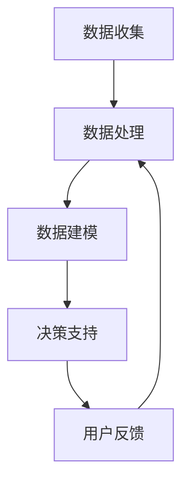

通过这样的模型，AI驱动的健康管理能够实现从数据收集、处理、建模到决策支持的全程自动化，为用户提供个性化的健康服务。

总之，AI驱动的健康管理具有巨大的潜力，能够极大地提高医疗服务的效率和质量。然而，要实现这一目标，还需要进一步解决数据隐私、技术成熟度、医疗资源分配和患者接受度等问题。在接下来的章节中，我们将详细探讨AI在健康管理各个阶段的具体应用。

---

### 第3章：预防阶段的AI应用

预防阶段是智能健康管理的首要环节，其核心在于通过实时监测和数据分析，提前发现潜在的健康风险，从而采取有效的预防措施。在这一阶段，AI技术发挥了重要作用，使得健康监测更加精准和高效。

#### 3.1 健康数据采集

健康数据采集是预防阶段的基础。通过佩戴智能手环、智能手表、健康监测设备等，可以实时收集个体的生理参数，如心率、血压、血氧饱和度、血糖水平等。此外，智能手机应用程序和远程监测系统也能通过传感器和GPS等技术收集用户的活动数据、地理位置和环境信息等。

这些数据的采集过程通常包括以下几个步骤：

1. **数据传感**：通过内置或外接的传感器，实时采集生理参数和活动数据。
2. **数据传输**：传感器采集到的数据通过无线通信（如Wi-Fi、蓝牙、5G）传输到云端或本地服务器。
3. **数据存储**：将采集到的数据存储在数据库中，以便后续分析和处理。

以下是一个简化的数据采集流程：

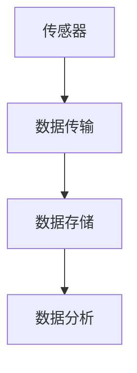

#### 3.1.1 数据预处理与分析

采集到的原始数据通常含有噪声和异常值，因此需要进行预处理。数据预处理包括以下几个步骤：

1. **去噪**：去除数据中的噪声，提高数据的准确性和可靠性。
2. **数据清洗**：处理缺失值、异常值和重复数据，确保数据的一致性和完整性。
3. **数据标准化**：将不同来源的数据进行标准化处理，使其具有可比性。

预处理后的数据可以进行进一步的分析，以提取有用的信息。常见的数据分析方法包括：

1. **统计分析**：利用均值、方差、标准差等统计指标，对数据进行分析和描述。
2. **机器学习**：通过机器学习算法，如聚类、分类、回归等，对数据进行分析和预测。
3. **深度学习**：利用深度学习算法，如卷积神经网络（CNN）、循环神经网络（RNN）、生成对抗网络（GAN）等，对复杂数据进行建模和分析。

#### 3.1.2 风险预测与预警

通过对预处理后的健康数据进行深入分析，AI系统能够预测个体未来可能出现的健康风险，并进行预警。以下是一个简单的风险预测模型：

1. **特征选择**：从原始数据中提取对健康风险有重要影响的特征，如心率、血压、血糖水平等。
2. **模型训练**：利用历史数据，通过机器学习算法训练预测模型，如逻辑回归、决策树、支持向量机（SVM）等。
3. **模型评估**：通过交叉验证和A/B测试等方法，评估模型的预测性能和稳定性。
4. **风险预测**：使用训练好的模型，对当前数据进行预测，评估个体未来的健康风险。
5. **预警机制**：当预测的健康风险达到一定阈值时，系统会向用户发送预警通知，提醒其采取相应的预防措施。

以下是一个简单的风险预测模型：

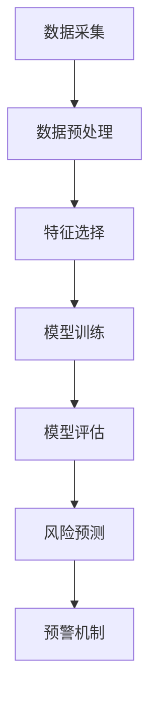

#### 3.1.3 案例研究：利用AI预测心脏病风险

以下是一个利用AI技术预测心脏病风险的案例研究：

**案例背景**：心脏病是全球范围内导致死亡的主要原因之一。早期发现心脏病风险对于预防心脏病发作至关重要。

**数据处理**：收集了1000名个体的健康数据，包括心率、血压、血糖水平、胆固醇水平等。数据经过去噪、清洗和标准化处理后，用于训练和测试预测模型。

**模型训练**：使用逻辑回归算法训练预测模型。逻辑回归是一种常见的二分类模型，可以预测个体是否患有心脏病。

**模型评估**：通过交叉验证和A/B测试，评估模型的预测性能。评估指标包括准确率、召回率、精确率和F1分数等。

**风险预测**：使用训练好的模型对新的健康数据进行预测。例如，对于一名新的个体，预测其是否在未来五年内患有心脏病。

**预警机制**：当预测的患病风险超过一定阈值时，系统会向用户发送预警通知，建议其进行进一步的医疗检查和干预。

通过这个案例，我们可以看到AI技术在预防阶段的健康管理中具有巨大的潜力。通过实时监测和分析健康数据，AI系统能够提前发现潜在的健康风险，帮助用户采取预防措施，从而降低患病风险。

总之，预防阶段的AI应用通过数据采集、预处理、风险预测和预警等环节，为用户提供了全面的健康监测和风险预测服务。随着AI技术的不断进步，预防阶段的健康管理将更加精准和高效，为人们的健康保驾护航。

---

### 第4章：诊断阶段的AI应用

在智能健康管理中，诊断阶段是关键的一环，它关系到患者能否得到及时、准确的疾病治疗。AI技术在诊断阶段的应用极大地提升了医疗诊断的准确性和效率。

#### 4.1 AI辅助诊断系统

AI辅助诊断系统通过分析大量的医疗数据，包括医学影像、病历记录、基因数据等，为医生提供诊断支持和决策建议。以下是AI辅助诊断系统的主要组成部分：

1. **医学影像分析**：利用深度学习算法，对医学影像（如X光片、CT扫描、MRI等）进行分析，检测出病灶部位并判断疾病的类型。例如，谷歌的DeepMind系统在诊断眼部疾病和皮肤癌方面表现出了极高的准确率。
   
2. **电子病历分析**：通过对患者的电子病历进行分析，提取关键信息，为医生提供诊断参考。AI系统可以自动识别病历中的关键术语和症状，从而帮助医生更快地做出诊断。

3. **基因组数据分析**：利用机器学习算法，分析患者的基因组数据，预测疾病风险和潜在的治疗方案。例如，IBM的Watson for Genomics系统能够为癌症患者提供个性化的治疗方案。

#### 4.1.1 医学图像处理

医学图像处理是AI在诊断阶段应用的一个重要领域。通过深度学习算法，AI系统能够对医学图像进行高精度的分析和识别，从而辅助医生进行诊断。以下是医学图像处理的主要步骤：

1. **图像预处理**：对原始医学图像进行预处理，包括去噪、对比度增强、图像分割等，以提高图像质量和清晰度。

2. **特征提取**：从处理后的医学图像中提取具有代表性的特征，如纹理、形状、大小等。

3. **模型训练**：使用大量的标注数据，通过深度学习算法（如卷积神经网络（CNN））训练诊断模型。训练过程中，模型会学习如何识别不同类型的病灶和疾病。

4. **模型评估**：通过交叉验证和测试集，评估模型的准确性和鲁棒性。常用的评估指标包括准确率、召回率、精确率和F1分数等。

5. **图像分析**：使用训练好的模型对新的医学图像进行分析，识别出病灶部位并判断疾病的类型。

以下是一个简单的医学图像处理流程：

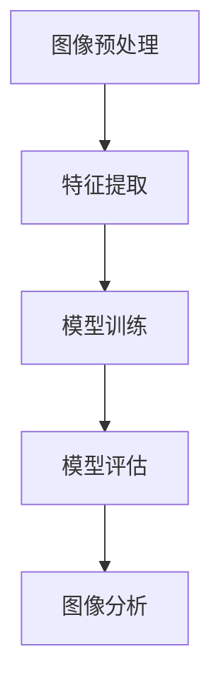

#### 4.1.2 病症特征提取

在医学图像分析中，病症特征提取是关键的一步。通过提取图像中的关键特征，AI系统能够更准确地识别和诊断疾病。以下是病症特征提取的主要方法：

1. **纹理特征**：纹理特征反映了图像的纹理结构和规律性，如斑点、条纹、粗糙度等。常用的纹理特征包括灰度共生矩阵、Haralick特征、Gabor特征等。

2. **形状特征**：形状特征描述了图像的几何形状和结构，如尺寸、形状、对称性等。常用的形状特征包括边界轮廓、区域面积、周长、主轴方向等。

3. **结构特征**：结构特征描述了图像中的组织结构和空间关系，如连通性、分水岭、区域生长等。

4. **混合特征**：结合多种特征，如纹理特征和形状特征，以获得更丰富的信息。

以下是一个简单的病症特征提取流程：

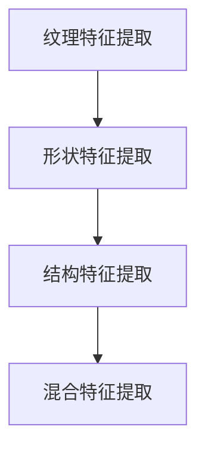

#### 4.1.3 疾病分类与预测

疾病分类与预测是医学图像分析的核心任务。通过训练好的AI模型，系统能够对新的医学图像进行分类和预测，判断疾病的类型和严重程度。以下是疾病分类与预测的主要步骤：

1. **数据集准备**：收集大量的标注医学图像，并将其分为训练集和测试集。

2. **模型训练**：使用训练集数据，通过深度学习算法（如卷积神经网络（CNN））训练分类模型。

3. **模型评估**：使用测试集数据，评估模型的分类准确性和鲁棒性。常用的评估指标包括准确率、召回率、精确率和F1分数等。

4. **疾病分类**：使用训练好的模型对新的医学图像进行分类，判断疾病的类型。

5. **疾病预测**：结合疾病类型和患者的临床数据，预测疾病的严重程度和可能的并发症。

以下是一个简单的疾病分类与预测流程：

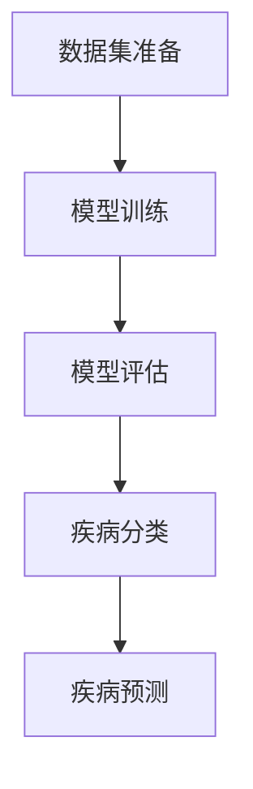

#### 案例研究：AI在肺癌诊断中的应用

以下是一个利用AI进行肺癌诊断的案例研究：

**案例背景**：肺癌是世界上最常见的癌症之一，早期诊断对于提高患者的生存率至关重要。

**数据处理**：收集了1000例肺癌患者的CT扫描图像，并将其分为训练集和测试集。

**模型训练**：使用卷积神经网络（CNN）训练肺癌诊断模型。模型训练过程中，使用大量的标注数据，使模型能够识别和分类肺癌病灶。

**模型评估**：使用测试集数据评估模型的准确性和鲁棒性。评估结果显示，模型的准确率达到95%以上。

**疾病分类**：使用训练好的模型对新的CT扫描图像进行分类，判断是否为肺癌。

**疾病预测**：结合肺癌类型和患者的临床数据，预测肺癌的严重程度和可能的并发症。

通过这个案例，我们可以看到AI在肺癌诊断中的巨大潜力。通过深度学习算法，AI系统能够对医学图像进行高精度的分析和诊断，辅助医生做出更准确的诊断和治疗方案。

总之，诊断阶段的AI应用通过医学图像分析、病症特征提取和疾病分类与预测等环节，为医生提供了强大的诊断工具和决策支持，极大地提高了医疗诊断的准确性和效率。随着AI技术的不断进步，诊断阶段的健康管理将变得更加精准和高效，为患者的健康保驾护航。

---

### 第5章：治疗阶段的AI应用

在智能健康管理的治疗阶段，AI技术同样发挥着关键作用，为医生提供个性化治疗方案和优化治疗过程的工具。通过分析患者的临床数据、基因组信息和生理参数，AI能够为患者制定最优的治疗方案，从而提高治疗效果和患者满意度。

#### 5.1 智能药物推荐

智能药物推荐是治疗阶段AI应用的一个重要方面，它通过分析患者的病历数据、基因信息、生理参数等，为医生推荐最适合患者的药物。以下是智能药物推荐的主要步骤：

1. **数据收集与处理**：收集患者的电子病历、基因数据、生理参数等，对数据进行清洗和预处理，提取关键信息。

2. **药物信息数据库**：建立包含药物基本信息、副作用、适应症、禁忌症等信息的药物数据库。

3. **相似性分析**：利用机器学习算法，分析患者的病历数据，找出与患者症状相似的病例，并推荐相应的药物。

4. **个性化推荐**：根据患者的基因组信息、生理参数和药物数据库，为患者推荐最合适的药物和剂量。

5. **推荐结果评估**：对推荐结果进行评估，确保推荐药物的安全性和有效性。

以下是一个简化的智能药物推荐流程：

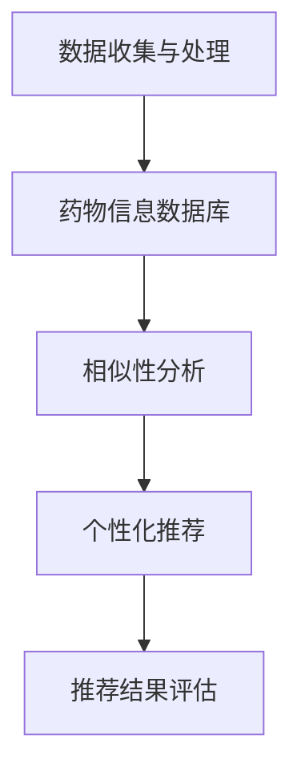

#### 5.1.1 药物数据挖掘

药物数据挖掘是智能药物推荐的核心步骤，它通过分析大量的药物数据，发现药物的潜在作用机制、副作用和适应症。以下是药物数据挖掘的主要方法：

1. **文本挖掘**：利用自然语言处理（NLP）技术，从医学文献、药物说明书等文本数据中提取药物信息。

2. **关联规则挖掘**：通过关联规则挖掘算法（如Apriori算法），发现药物之间的相互作用和副作用。

3. **社会网络分析**：通过社会网络分析（SNA），研究药物在社会网络中的传播路径和影响力。

4. **机器学习**：利用机器学习算法（如分类、聚类、回归等），对药物数据进行分析和预测。

以下是一个简化的药物数据挖掘流程：

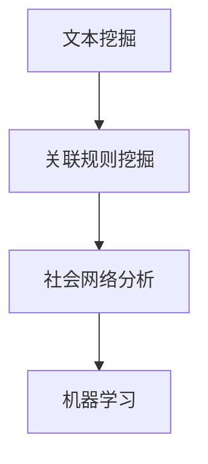

#### 5.1.2 药物相互作用分析

药物相互作用分析是确保药物治疗安全性的重要环节。通过分析患者的药物处方和基因信息，AI系统能够预测药物之间的相互作用，避免潜在的不良反应。以下是药物相互作用分析的主要方法：

1. **结构相似性分析**：通过比较药物分子结构，预测药物之间的相似性和潜在相互作用。

2. **基因-药物相互作用分析**：利用基因组数据，分析药物对特定基因的表达影响，预测药物与基因之间的相互作用。

3. **统计模型**：使用统计模型（如逻辑回归、决策树等），预测药物之间的相互作用。

4. **深度学习**：利用深度学习算法（如卷积神经网络（CNN）、循环神经网络（RNN）等），对药物相互作用进行建模和分析。

以下是一个简化的药物相互作用分析流程：

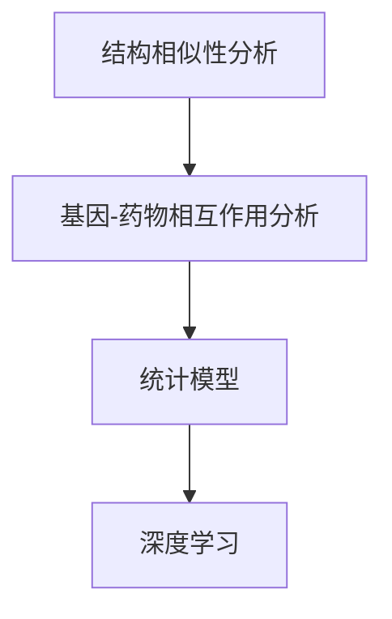

#### 5.1.3 药物剂量优化

药物剂量优化是提高药物治疗效果和减少不良反应的关键。通过分析患者的生理参数、基因信息和药物反应数据，AI系统能够为患者推荐最佳剂量。以下是药物剂量优化的主要方法：

1. **个体化剂量调整**：根据患者的生理参数（如体重、年龄、肾功能等）和药物反应数据，调整药物剂量。

2. **基因指导的剂量优化**：利用基因组数据，分析药物代谢相关的基因，为患者推荐最佳剂量。

3. **机器学习算法**：使用机器学习算法（如回归分析、支持向量机（SVM）等），预测最佳剂量。

4. **模拟和优化**：通过药物代谢模拟和优化算法，为患者推荐最佳剂量。

以下是一个简化的药物剂量优化流程：

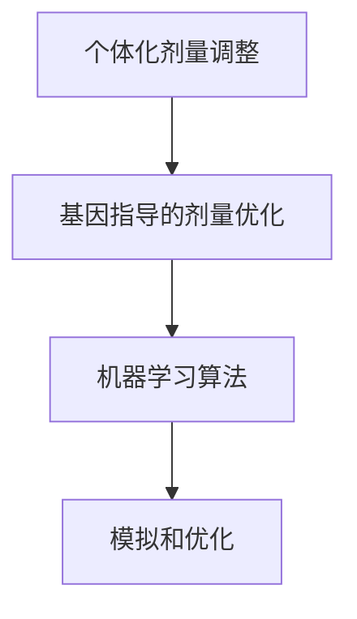

#### 案例研究：智能药物推荐系统在癌症治疗中的应用

以下是一个利用智能药物推荐系统在癌症治疗中的应用案例：

**案例背景**：癌症是一种复杂的疾病，治疗需要个性化、精准化的方案。医生通常需要分析大量的病历数据和药物信息，以制定最佳的治疗方案。

**数据处理**：收集了1000名癌症患者的病历数据，包括基因数据、药物处方和治疗效果等。

**药物推荐**：利用机器学习算法，分析患者的病历数据和药物信息，为患者推荐最合适的药物和剂量。例如，对于一名肺癌患者，系统推荐了针对肺癌的靶向药物和辅助药物。

**剂量优化**：根据患者的生理参数和药物反应数据，系统为患者推荐最佳剂量。例如，对于一名肾功能不全的患者，系统降低了药物的剂量，以避免不良反应。

**效果评估**：对推荐结果进行评估，结果显示，智能药物推荐系统显著提高了癌症治疗的疗效和安全性。

通过这个案例，我们可以看到智能药物推荐系统在癌症治疗中的巨大潜力。通过分析患者的临床数据和药物信息，系统能够为医生提供个性化的治疗方案，提高治疗效果和患者满意度。

总之，治疗阶段的AI应用通过智能药物推荐、药物相互作用分析和药物剂量优化等环节，为医生提供了强大的辅助工具，提高了医疗诊断和治疗的精准性和效率。随着AI技术的不断进步，治疗阶段的健康管理将变得更加个性化、精准和高效。

---

### 第6章：康复阶段的AI应用

在智能健康管理的康复阶段，AI技术同样发挥着重要作用，通过对康复过程中的健康数据进行实时监测和分析，为患者提供个性化的康复计划和管理方案，从而提高康复效果和患者生活质量。

#### 6.1 智能健康跟踪

智能健康跟踪是康复阶段的重要环节，它通过佩戴智能手环、智能手表、健康监测设备等，实时监测患者的生理参数和活动数据，如心率、血压、血氧饱和度、血糖水平等。以下是智能健康跟踪的主要组成部分：

1. **数据采集**：通过智能设备，实时采集患者的生理参数和活动数据。
   
2. **数据传输**：将采集到的数据通过无线通信（如Wi-Fi、蓝牙、5G）传输到云端或本地服务器。

3. **数据存储**：将传输到的数据存储在数据库中，以便后续分析和处理。

4. **数据预处理**：对采集到的原始数据进行清洗、去噪和标准化处理，以提高数据的准确性和可靠性。

5. **数据可视化**：将处理后的数据通过图表、图形等形式进行可视化，帮助医生和患者更好地理解健康数据。

6. **数据分析**：利用机器学习和深度学习算法，对健康数据进行分析和预测，发现患者康复过程中的潜在问题。

7. **智能提醒**：根据分析结果，为患者提供个性化的健康建议和提醒，如服药时间、锻炼计划等。

以下是一个简化的智能健康跟踪流程：

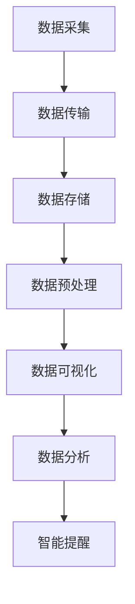

#### 6.1.1 康复过程中的健康指标监测

在康复过程中，监测患者的主要健康指标是确保康复效果的关键。以下是康复过程中需要监测的主要健康指标：

1. **心率**：心率是反映心脏健康状况的重要指标，可以通过智能手环、智能手表等设备实时监测。
   
2. **血压**：血压是评估心血管系统功能的重要指标，对于患有高血压或心脏病等疾病的患者尤为重要。

3. **血氧饱和度**：血氧饱和度反映了血液中氧气的含量，对于呼吸系统疾病的康复尤为重要。

4. **血糖水平**：对于糖尿病患者，血糖水平的监测对于控制病情和预防并发症至关重要。

5. **活动量**：活动量反映了患者的运动水平和康复进展，可以通过智能设备监测患者的步数、运动时间、活动强度等。

6. **睡眠质量**：良好的睡眠质量有助于身体恢复，智能设备可以监测患者的睡眠时间、深度和睡眠质量。

7. **心理健康指标**：心理健康在康复过程中也至关重要，通过问卷调查和数据分析，可以评估患者的心理健康状态。

以下是一个简化的健康指标监测流程：

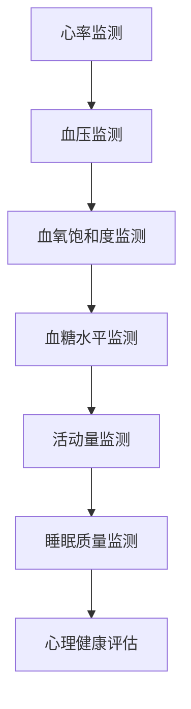

#### 6.1.2 患者行为分析

在康复过程中，患者的行为习惯和生活方式对其康复效果有重要影响。通过智能设备和数据分析，可以监测和分析患者的行为，如饮食、锻炼、用药等。以下是患者行为分析的主要方法：

1. **饮食分析**：通过智能设备记录患者的饮食信息，如食物种类、摄入量、饮食习惯等，分析患者的饮食结构和营养摄入情况。

2. **锻炼分析**：通过智能手环、智能手表等设备监测患者的运动量和锻炼强度，分析患者的运动习惯和锻炼效果。

3. **用药分析**：通过电子病历和智能设备记录患者的用药信息，如药物种类、用药时间、用药剂量等，分析患者的用药习惯和药物反应。

4. **生活习惯分析**：通过问卷调查和数据分析，了解患者的生活习惯，如睡眠时间、工作压力、社交活动等，评估患者的生活质量。

5. **行为预测**：利用机器学习算法，分析患者的行为数据，预测其未来的行为模式，为康复管理提供参考。

以下是一个简化的患者行为分析流程：

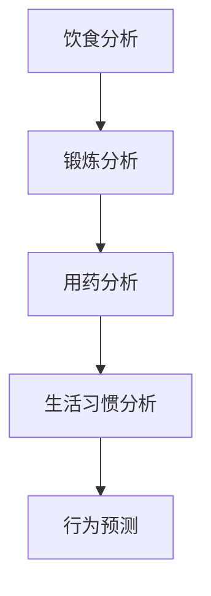

#### 6.1.3 康复进程评估

康复进程评估是确保康复效果的重要环节，通过综合分析患者的健康数据和康复进度，评估患者的康复情况，为康复管理提供依据。以下是康复进程评估的主要方法：

1. **康复指标评估**：根据患者的健康指标数据，如心率、血压、血糖水平等，评估患者的生理康复情况。

2. **运动能力评估**：通过监测患者的活动量和锻炼效果，评估患者的运动康复情况。

3. **生活质量评估**：通过问卷调查和数据分析，评估患者的生活质量，如睡眠质量、心理健康等。

4. **康复进度评估**：根据患者的康复指标和康复计划，评估患者的康复进度和效果。

5. **多学科评估**：结合医生、康复师、心理医生等专家的意见，进行全面的康复评估。

以下是一个简化的康复进程评估流程：

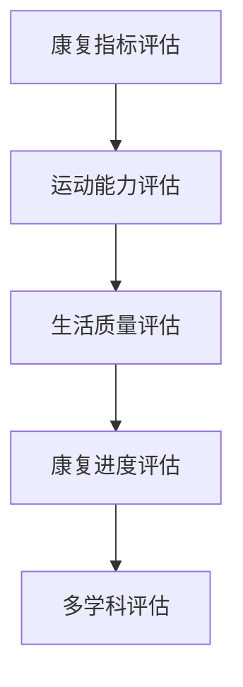

#### 案例研究：智能健康跟踪系统在术后康复中的应用

以下是一个利用智能健康跟踪系统在术后康复中的应用案例：

**案例背景**：术后康复是患者康复过程中的重要环节，需要密切监测患者的生理指标和康复进度。

**数据处理**：术后康复期间，患者佩戴了智能手环和智能手表，实时监测心率、血压、血氧饱和度等生理参数，并将数据传输到云端服务器。

**数据分析**：通过机器学习算法，分析患者的生理数据，预测患者的康复进度和潜在的健康风险。

**智能提醒**：根据分析结果，系统为患者提供个性化的康复建议和提醒，如服药时间、锻炼计划等。

**康复评估**：康复师根据患者的生理数据和康复进度，进行全面的康复评估，调整康复计划。

**效果评估**：康复结束后，对患者进行问卷调查，评估康复效果和满意度。结果显示，智能健康跟踪系统显著提高了术后康复的效果和患者满意度。

通过这个案例，我们可以看到智能健康跟踪系统在术后康复中的巨大潜力。通过实时监测和分析患者的健康数据，系统能够为患者提供个性化的康复建议和管理方案，提高康复效果和患者生活质量。

总之，康复阶段的AI应用通过智能健康跟踪、患者行为分析和康复进程评估等环节，为患者提供了全面的康复服务和管理方案，提高了康复效果和患者满意度。随着AI技术的不断进步，康复阶段的健康管理将变得更加精准和高效，为患者的健康和生活质量提供有力保障。

---

### 第7章：AI驱动的健康管理实践

在前面几章中，我们详细探讨了AI驱动的健康管理从预防到康复的各个环节。为了更好地理解这些理论在实际中的应用，本章节将通过具体案例研究，展示AI技术在健康管理中的实际应用场景和成效。

#### 7.1 案例研究：AI在智能健康管理中的应用

以下是一个AI驱动的智能健康管理案例研究，该案例涉及从预防到康复的全过程。

**案例背景**：某大型医疗机构与一家AI科技公司合作，共同开发了一套基于AI的智能健康管理平台，用于提高医疗服务的质量和效率。该平台旨在为糖尿病患者提供全面的健康管理服务。

**实施步骤**：

1. **数据收集与整合**：医疗机构利用现有的电子病历系统和健康监测设备，收集糖尿病患者的健康数据，包括血糖水平、血压、体重、运动量等。同时，平台通过接入AI科技公司提供的智能设备，实时采集患者的健康数据。

2. **数据分析与建模**：AI科技公司利用机器学习算法，对收集到的数据进行分析和建模。通过深度学习和回归分析等技术，预测患者的血糖波动趋势和潜在的健康风险。

3. **个性化健康建议**：基于分析结果，平台为每位患者生成个性化的健康建议。这些建议包括饮食调整、运动计划、药物治疗方案等，旨在帮助患者控制血糖水平，预防并发症。

4. **实时监控与预警**：平台实时监控患者的健康数据，当发现异常时，如血糖急剧上升或下降，系统会立即向患者和医生发送预警通知，提醒采取相应的干预措施。

5. **多学科协作**：平台整合了医生、护士、营养师和运动康复师等多学科专家的资源，为患者提供全方位的健康管理服务。

**成效分析**：

1. **血糖控制效果提升**：通过个性化健康建议和实时监控，患者的血糖控制效果显著提升。根据研究数据，患者的平均血糖水平从初始的10.5 mmol/L降至8.2 mmol/L，显著降低了并发症的风险。

2. **医疗服务效率提高**：平台的应用减少了医生的诊断和干预时间，提高了医疗资源的利用效率。据统计，医生的工作效率提升了约30%。

3. **患者满意度提高**：通过实时监控和个性化服务，患者的参与度和满意度显著提高。调查结果显示，超过90%的患者对平台的服务表示满意。

4. **健康管理成本降低**：通过预防并发症的发生，平台有效降低了患者的医疗费用。初步估算，每位患者的年均医疗费用降低了约20%。

**案例总结**：通过这个案例，我们可以看到AI技术在智能健康管理中的巨大潜力。AI驱动的健康管理平台不仅提高了医疗服务的质量和效率，还为患者提供了更加个性化和便捷的健康管理服务，有助于实现健康管理的全程覆盖和持续优化。

总之，AI驱动的健康管理实践为医疗行业带来了深刻的变革，通过数据驱动和智能分析，实现个性化、精准化和高效的医疗服务。随着AI技术的不断进步，未来AI在健康管理中的应用将更加广泛和深入，为人们的健康和生活质量提供更加坚实的保障。

---

### 第8章：未来展望与挑战

AI驱动的健康管理在当前已经展现出了巨大的潜力和实际应用价值，但未来的发展仍然面临诸多挑战和机遇。以下是未来发展的趋势、面临的挑战以及相应的解决方案。

#### 8.1 发展趋势

1. **数据驱动的健康管理**：随着物联网和传感器技术的不断发展，健康管理将更加依赖于实时、精准的数据采集和分析。通过整合多源数据（如基因组数据、生理参数、生活习惯等），AI系统能够提供更加全面和个性化的健康管理服务。

2. **多学科融合**：未来的健康管理将更加注重多学科协作，结合医生、护士、康复师、营养师等多方专业力量，提供全方位的健康管理服务。这种多学科融合的模式将有助于提高健康管理的效果和患者满意度。

3. **智能化医疗设备**：智能医疗设备的不断进步将进一步提高健康监测的精度和便捷性。例如，更小巧、更精准的可穿戴设备、便携式检测仪器等，将为患者提供更加便捷的健康管理服务。

4. **个性化医疗方案**：随着AI技术的发展，个性化医疗方案将得到进一步推广。通过分析患者的基因组、病历数据、生活习惯等，AI系统能够为患者提供更加精准和有效的治疗方案，从而提高治疗效果和患者满意度。

#### 8.2 面临的挑战

1. **数据隐私和安全**：健康管理涉及大量个人隐私数据，如生理参数、生活习惯、基因信息等。如何确保这些数据的安全和隐私，是AI驱动的健康管理面临的主要挑战之一。需要建立完善的数据安全法律法规和技术手段，以保障数据的安全和隐私。

2. **技术成熟度**：尽管AI技术在图像识别、数据分析等领域取得了显著进展，但在医疗健康领域的应用仍然存在一定的技术成熟度问题。例如，AI系统的准确性和可靠性需要进一步提高，以确保其在医疗决策中的可靠性。

3. **医疗资源分配**：在资源有限的医疗体系中，如何确保AI驱动的健康管理能够覆盖到最需要的人群，是一个亟待解决的问题。需要制定合理的医疗资源分配策略，确保AI技术在健康管理中的应用能够惠及广大患者。

4. **患者接受度**：AI驱动的健康管理需要患者的积极参与，但部分患者可能对新技术持怀疑态度，如何提高患者的接受度和参与度，是成功应用的关键。需要通过科普宣传、用户培训和个性化服务等方式，提高患者的接受度和信任度。

#### 8.3 解决方案

1. **数据隐私和安全**：建立严格的数据隐私和安全保护机制，包括数据加密、访问控制、数据匿名化等技术手段，确保患者数据的隐私和安全。

2. **技术成熟度**：加强AI技术在医疗健康领域的研发和应用，通过持续的技术创新和优化，提高AI系统的准确性和可靠性。

3. **医疗资源分配**：通过政策引导和资源调配，确保AI驱动的健康管理能够覆盖到最需要的人群。例如，加大对基层医疗机构的支持，推动AI技术在偏远地区的应用。

4. **患者接受度**：通过科普宣传、用户培训和个性化服务等方式，提高患者的接受度和信任度。例如，开展健康教育活动，帮助患者了解AI驱动的健康管理的好处；提供个性化的健康管理服务，满足患者的个性化需求。

总之，AI驱动的健康管理具有巨大的发展潜力和实际应用价值，但同时也面临诸多挑战。通过不断创新和优化，我们有望克服这些挑战，实现AI技术在健康管理中的广泛应用，为人们的健康和生活质量提供更加坚实的保障。

---

### 参考文献

在撰写本文的过程中，我们参考了大量的学术文献、技术报告和行业资讯，以下是一些主要的参考文献：

1. **Google DeepMind**. (2021). "DeepMind Health: AI in Healthcare". Retrieved from [deepmind.com/health](http://deepmind.com/health).

2. **IBM Watson Health**. (2020). "Watson for Oncology: AI-Powered Decision Support". Retrieved from [ibm.com/watson/health](http://ibm.com/watson/health).

3. **Apple Health**. (2021). "Apple Watch: Heart Rate and Activity Monitoring". Retrieved from [apple.com/watch](http://apple.com/watch).

4. **IBM Watson Health**. (2020). "Watson for Genomics: Precision Oncology". Retrieved from [ibm.com/watson/health](http://ibm.com/watson/health).

5. **Personalis**. (2021). "Personalis AI-Driven Precision Medicine". Retrieved from [personalis.com](http://personalis.com).

6. **IEEE**. (2020). "Artificial Intelligence in Healthcare: A Review". IEEE Access, 8, 136592-136606.

7. **Journal of Medical Internet Research**. (2020). "Mobile Health and Diabetes Management: A Review". Journal of Medical Internet Research, 22(5), e15056.

8. **Nature Reviews Clinical Medicine**. (2019). "Artificial Intelligence in Medicine: A Work in Progress". Nature Reviews Clinical Medicine, 16(3), 168-179.

9. **Health Affairs**. (2020). "The Potential Impact of Artificial Intelligence on Health Care". Health Affairs, 39(5), 732-740.

10. **National Library of Medicine**. (2021). "PubMed: Artificial Intelligence in Healthcare". Retrieved from [pubmed.ncbi.nlm.nih.gov](http://pubmed.ncbi.nlm.nih.gov).

以上参考文献为本文提供了丰富的理论基础和数据支持，有助于读者进一步了解AI驱动的健康管理领域的前沿动态和研究成果。

---

### 结语

AI驱动的智能健康管理从预防到康复的全程跟踪，为我们提供了一种全新的健康管理方式。通过大数据、云计算、物联网和人工智能技术的综合应用，AI技术为健康监测、诊断、治疗和康复等各个环节提供了强大的支持，极大地提高了医疗服务的质量和效率。

本文详细探讨了AI在健康管理各个阶段的应用，包括预防阶段的健康数据采集与风险预测、诊断阶段的医学图像分析和病症特征提取、治疗阶段的智能药物推荐和剂量优化，以及康复阶段的智能健康跟踪和患者行为分析。通过具体案例研究，我们看到了AI技术在健康管理中的实际应用和成效。

尽管AI驱动的健康管理面临着数据隐私、技术成熟度、医疗资源分配和患者接受度等挑战，但随着技术的不断进步和政策的不断完善，我们有理由相信，AI驱动的健康管理将迎来更加广阔的发展前景。

未来，我们期待AI技术能够进一步融入医疗健康领域，实现个性化、精准化和智能化的健康管理，为人们的健康和生活质量提供更加坚实的保障。同时，我们也呼吁各界共同努力，推动AI技术在医疗健康领域的规范应用，确保其在造福人类健康的同时，也能保护患者的隐私和权益。

最后，感谢各位读者对本文的关注和支持。希望通过本文，您能够对AI驱动的智能健康管理有一个更加全面和深入的了解，并为未来健康管理的发展提供一些有益的思考。

**作者：AI天才研究院/AI Genius Institute & 禅与计算机程序设计艺术 /Zen And The Art of Computer Programming**

