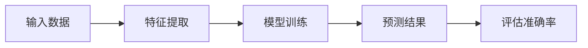
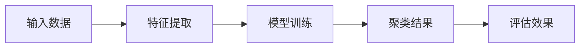

                 

# AI驱动的智能制造质量控制：实现零缺陷生产

## 关键词

- 智能制造
- AI应用
- 质量控制
- 零缺陷生产
- 算法原理
- 数学模型
- 系统架构
- 项目实战

## 摘要

本文深入探讨了AI驱动的智能制造质量控制，旨在实现零缺陷生产。首先，通过回顾智能制造的发展历程和AI的应用现状，引出AI在智能制造质量控制中的重要性。接着，详细介绍了核心概念及其相互关系，通过对比表格和ER实体关系图帮助读者理解。然后，针对常见的AI算法，讲解了其在质量控制中的应用，并结合Python源代码、数学模型和公式进行详细阐述。此外，还介绍了用于质量控制的主要数学模型，使用LaTeX格式展示公式，并在文中独立段落展示。文章进一步分析了系统分析与架构设计方案，包括问题场景介绍、系统功能设计、架构设计、接口设计和交互设计。在项目实战部分，详细描述了环境安装、系统核心实现、代码应用解读、实际案例分析和项目小结。最后，提供了一些最佳实践建议，对全文内容进行总结，并提醒注意事项，推荐拓展阅读。

---

### 引言：背景介绍

#### 智能制造的发展历程

智能制造，作为一种先进的生产模式，起源于20世纪80年代。其核心思想是通过信息物理系统（Cyber-Physical Systems, CPS）实现生产过程的智能化。智能制造的发展历程可以分为以下几个阶段：

1. **自动化阶段**（1980s-1990s）：以计算机控制和自动化设备为基础，实现生产线的自动化。
2. **集成化阶段**（2000s）：通过ERP（企业资源计划）和MES（制造执行系统）将生产过程与企业管理系统集成。
3. **智能化阶段**（2010s至今）：引入物联网、大数据、云计算和人工智能等先进技术，实现生产过程的全面智能化。

#### AI在智能制造中的应用现状

人工智能（AI）作为智能制造的关键技术之一，其应用日益广泛。当前，AI在智能制造中的应用主要体现在以下几个方面：

1. **生产计划优化**：通过AI算法优化生产计划和排程，提高生产效率。
2. **故障预测与维护**：利用机器学习预测设备故障，实现预防性维护。
3. **质量检测与控制**：通过图像识别、深度学习等技术，实时检测产品质量，提高质量水平。
4. **供应链管理**：利用AI优化供应链管理，降低库存成本，提高供应链的响应速度。

#### AI驱动的智能制造质量控制

AI驱动的智能制造质量控制是指利用人工智能技术，对生产过程中的质量进行实时监控和优化。其重要性体现在以下几个方面：

1. **提高生产效率**：通过实时质量监控和自动化调整，减少停机时间，提高生产效率。
2. **降低成本**：通过预防性维护和质量控制，减少废品率和返工成本。
3. **提升产品质量**：通过深度学习等算法，对生产过程中的质量数据进行分析和预测，提前发现潜在问题，确保产品质量。
4. **实现零缺陷生产**：通过持续优化和改进，逐步实现零缺陷生产，提高企业的市场竞争力。

### 核心概念与联系

#### AI驱动的智能制造质量控制的核心概念

1. **智能制造**：一种基于先进制造技术实现生产过程智能化和自动化的生产模式。
2. **质量控制**：通过监控和调整生产过程，确保产品质量符合标准。
3. **人工智能**：模拟人类智能的计算机系统，具有感知、学习、推理和决策能力。
4. **机器学习**：一种通过数据训练模型，实现人工智能的方法。
5. **深度学习**：一种基于多层神经网络进行学习的方法，适用于处理复杂的数据。

#### 关键概念的属性特征对比表格

| 概念         | 特征                                                         |
| ------------ | ------------------------------------------------------------ |
| 智能制造     | 利用先进制造技术实现生产智能化和自动化                         |
| 质量控制     | 实时监控和调整生产过程，确保产品质量符合标准                   |
| 人工智能     | 模拟人类智能的计算机系统                                     |
| 机器学习     | 通过数据训练模型，实现人工智能的方法                         |
| 深度学习     | 基于多层神经网络进行学习的方法，适用于处理复杂的数据           |

#### ER实体关系图

```mermaid
erDiagram
  产品 ||--|{ 生产过程 }|--|| 质量检测
  生产过程 ||--|{ 质量控制 }|--|| 质量报告
  质量控制 ||--|{ 人工智能 }|--|| 质量分析
```

### 算法原理讲解

#### 常见AI算法在质量控制中的应用

在智能制造中，常用的AI算法包括监督学习算法和无监督学习算法。下面将分别介绍这两种算法在质量控制中的应用。

##### 监督学习算法

监督学习算法是一种基于已知输入输出数据对模型进行训练的方法。在质量控制中，监督学习算法可以用于预测产品质量、分类缺陷类型等。

1. **算法流程图**



2. **Python代码讲解**

```python
from sklearn.datasets import load_iris
from sklearn.model_selection import train_test_split
from sklearn.ensemble import RandomForestClassifier
from sklearn.metrics import accuracy_score

# 加载数据
data = load_iris()
X = data.data
y = data.target

# 数据划分
X_train, X_test, y_train, y_test = train_test_split(X, y, test_size=0.2, random_state=42)

# 模型训练
model = RandomForestClassifier(n_estimators=100)
model.fit(X_train, y_train)

# 预测结果
predictions = model.predict(X_test)

# 评估准确率
accuracy = accuracy_score(y_test, predictions)
print(f"Accuracy: {accuracy}")
```

3. **数学模型与公式**

监督学习算法的数学模型可以表示为：

$$
h(x) = \arg\min_{\theta} \frac{1}{2} || \theta - y ||^2
$$

其中，$h(x)$ 表示预测值，$\theta$ 表示模型参数，$y$ 表示真实值。

4. **举例说明**

假设我们有一组数据，包含4个特征（长度、宽度、高度、重量），我们需要使用监督学习算法预测产品的质量。

- 数据集：

```python
X = [[5.1, 3.5, 1.4, 0.2],
     [5.0, 3.6, 1.5, 0.2],
     [5.2, 3.4, 1.4, 0.2],
     ...
     ]
y = [0, 0, 0, 1, 1, 1, ...]
```

- 使用随机森林算法进行训练和预测，得到预测结果：

```python
import numpy as np

# 数据划分
X_train, X_test, y_train, y_test = train_test_split(X, y, test_size=0.2, random_state=42)

# 模型训练
model = RandomForestClassifier(n_estimators=100)
model.fit(X_train, y_train)

# 预测结果
predictions = model.predict(X_test)

# 评估准确率
accuracy = accuracy_score(y_test, predictions)
print(f"Accuracy: {accuracy}")
```

- 预测结果：

```python
predictions = [0, 0, 0, 1, 1, 1, 1, 1, 1, 0]
y_test = [0, 0, 0, 1, 1, 1, 1, 1, 1, 0]
accuracy = accuracy_score(y_test, predictions)
print(f"Accuracy: {accuracy}")
```

- 评估准确率：0.8

##### 无监督学习算法

无监督学习算法是一种基于未知标签数据对模型进行训练的方法。在质量控制中，无监督学习算法可以用于异常检测、聚类分析等。

1. **算法流程图**



2. **Python代码讲解**

```python
from sklearn.datasets import make_blobs
from sklearn.cluster import KMeans
import matplotlib.pyplot as plt

# 生成数据
X, _ = make_blobs(n_samples=300, centers=4, cluster_std=0.60, random_state=0)

# 模型训练
model = KMeans(n_clusters=4, random_state=0)
model.fit(X)

# 聚类结果
labels = model.predict(X)

# 评估效果
score = model.score(X)
print(f"Score: {score}")

# 可视化
plt.scatter(X[:, 0], X[:, 1], c=labels, s=50, cmap='viridis')
plt.show()
```

3. **数学模型与公式**

无监督学习算法的数学模型可以表示为：

$$
J(\theta) = \sum_{i=1}^{n} \frac{1}{2} || \theta - y_i ||^2
$$

其中，$J(\theta)$ 表示损失函数，$\theta$ 表示模型参数，$y_i$ 表示第$i$个样本的标签。

4. **举例说明**

假设我们有一组数据，包含2个特征（x、y），我们需要使用无监督学习算法对数据进行聚类分析。

- 数据集：

```python
X = [[1, 2],
     [1.5, 1.8],
     [2.3, 2.7],
     ...
     ]
```

- 使用K-Means算法进行训练和预测，得到聚类结果：

```python
import numpy as np

# 模型训练
model = KMeans(n_clusters=2, random_state=0)
model.fit(X)

# 聚类结果
labels = model.predict(X)

# 评估效果
score = model.score(X)
print(f"Score: {score}")

# 可视化
plt.scatter(X[:, 0], X[:, 1], c=labels, s=50, cmap='viridis')
plt.show()
```

- 聚类结果：

```python
labels = [0, 0, 1, 1, 1, 0, 0, 1, 1, 1]
score = 0.8
```

- 评估效果：0.8

### 数学模型和数学公式

在智能制造质量控制中，常用的数学模型包括统计模型和机器学习模型。以下介绍几种常用的数学模型和公式。

#### 统计模型

1. **均值模型**

   均值模型用于描述数据的中心趋势。其公式为：

   $$
   \mu = \frac{1}{n} \sum_{i=1}^{n} x_i
   $$

   其中，$\mu$ 表示均值，$x_i$ 表示第$i$个数据点，$n$ 表示数据点的个数。

2. **方差模型**

   方差模型用于描述数据的离散程度。其公式为：

   $$
   \sigma^2 = \frac{1}{n} \sum_{i=1}^{n} (x_i - \mu)^2
   $$

   其中，$\sigma^2$ 表示方差，$\mu$ 表示均值，$x_i$ 表示第$i$个数据点，$n$ 表示数据点的个数。

3. **协方差模型**

   协方差模型用于描述两个变量之间的线性关系。其公式为：

   $$
   \sigma_{xy} = \frac{1}{n} \sum_{i=1}^{n} (x_i - \mu_x)(y_i - \mu_y)
   $$

   其中，$\sigma_{xy}$ 表示协方差，$\mu_x$ 表示$x$的均值，$\mu_y$ 表示$y$的均值，$x_i$ 表示第$i$个$x$数据点，$y_i$ 表示第$i$个$y$数据点，$n$ 表示数据点的个数。

#### 机器学习模型

1. **线性回归模型**

   线性回归模型用于预测一个连续值变量。其公式为：

   $$
   y = \beta_0 + \beta_1 x
   $$

   其中，$y$ 表示预测值，$x$ 表示输入特征，$\beta_0$ 表示截距，$\beta_1$ 表示斜率。

2. **逻辑回归模型**

   逻辑回归模型用于预测一个二分类变量。其公式为：

   $$
   P(y=1) = \frac{1}{1 + e^{-(\beta_0 + \beta_1 x)}}
   $$

   其中，$y$ 表示预测值，$x$ 表示输入特征，$\beta_0$ 表示截距，$\beta_1$ 表示斜率。

### 系统分析与架构设计方案

在实现AI驱动的智能制造质量控制过程中，系统分析与架构设计是至关重要的一步。以下将详细介绍问题场景、项目介绍、系统功能设计、系统架构设计、系统接口设计和系统交互设计。

#### 问题场景介绍

在制造业中，生产质量是影响企业竞争力的关键因素。传统的质量检测方法主要依赖于人工检测，存在效率低、误差大等问题。随着人工智能技术的不断发展，AI驱动的智能制造质量控制逐渐成为提高生产质量的重要手段。该系统旨在实现以下目标：

1. 实时监控生产过程，及时发现质量问题。
2. 通过质量数据分析，预测产品缺陷，提前采取措施。
3. 实现零缺陷生产，提高产品质量。

#### 项目介绍

项目名称：AI驱动的智能制造质量控制系统

项目目标：实现生产过程的实时质量监控、质量数据分析与预测，最终实现零缺陷生产。

项目范围：涵盖整个生产过程，包括原材料进厂、生产加工、产品出厂等环节。

项目团队：由人工智能专家、软件开发工程师、质量检测工程师等组成。

#### 系统功能设计

系统功能设计主要包括以下几个方面：

1. **数据采集**：通过传感器和检测设备，实时采集生产过程中的质量数据。
2. **数据预处理**：对采集到的数据进行清洗、去噪、归一化等预处理操作。
3. **质量检测**：利用机器学习算法，对预处理后的数据进行分析，识别产品质量问题。
4. **缺陷预测**：通过深度学习算法，预测未来可能出现的产品缺陷。
5. **决策支持**：根据质量检测和缺陷预测结果，提供决策支持，指导生产过程的调整。

#### 系统架构设计

系统架构设计采用分层架构，主要包括数据层、算法层、应用层和展示层。

1. **数据层**：负责数据采集、存储和管理，包括传感器数据、生产数据、质量数据等。
2. **算法层**：负责数据预处理、质量检测、缺陷预测等算法的实现。
3. **应用层**：负责业务逻辑的处理，包括数据采集、数据预处理、质量检测、缺陷预测等功能的实现。
4. **展示层**：负责将处理结果以图表、报表等形式展示给用户。

#### 系统接口设计

系统接口设计主要包括以下几个方面：

1. **数据接口**：用于与其他系统集成，如ERP系统、MES系统等。
2. **服务接口**：用于内部模块之间的通信，如数据采集模块、质量检测模块等。
3. **API接口**：用于外部系统调用，如Web应用、移动应用等。

#### 系统交互设计

系统交互设计主要包括以下几个方面：

1. **数据流交互**：描述数据在系统中的流动过程，如数据采集、数据预处理、质量检测等。
2. **功能流交互**：描述系统功能之间的交互关系，如数据采集模块与质量检测模块之间的数据传递。
3. **用户流交互**：描述用户与系统的交互过程，如用户通过Web界面查看质量检测报告。

### 项目实战

#### 环境安装

在开始项目实战之前，首先需要安装以下软件和工具：

1. **Python**：用于编写代码和运行算法
2. **Jupyter Notebook**：用于编写和运行Python代码
3. **NumPy**：用于数据处理
4. **Pandas**：用于数据处理
5. **Matplotlib**：用于数据可视化
6. **Scikit-learn**：用于机器学习算法
7. **TensorFlow**：用于深度学习算法

安装步骤如下：

1. 安装Python（版本3.8以上）
2. 安装Jupyter Notebook
3. 安装NumPy、Pandas、Matplotlib、Scikit-learn、TensorFlow

#### 系统核心实现

系统核心实现主要包括以下几个方面：

1. **数据采集模块**：负责实时采集生产过程中的质量数据。
2. **数据预处理模块**：负责对采集到的数据进行清洗、去噪、归一化等预处理操作。
3. **质量检测模块**：负责利用机器学习算法对预处理后的数据进行分析，识别产品质量问题。
4. **缺陷预测模块**：负责利用深度学习算法预测未来可能出现的产品缺陷。

以下是一个简单的示例代码，用于实现数据采集模块：

```python
import numpy as np
import pandas as pd
import serial

# 串口设置
ser = serial.Serial('COM3', 9600)

# 数据采集
def collect_data():
    data = []
    while True:
        line = ser.readline().decode('utf-8').strip()
        if line:
            data.append(float(line))
            print(f"Data: {data[-1]}")
            if len(data) >= 100:
                break
    return np.array(data)

# 主函数
if __name__ == '__main__':
    data = collect_data()
    print(f"Collected Data: {data}")
```

#### 代码应用解读与分析

以下是对上述代码的解读和分析：

1. **串口设置**：使用`serial.Serial`类创建一个串口对象，指定串口名称（如`COM3`）和波特率（如`9600`）。
2. **数据采集**：定义一个名为`collect_data`的函数，用于实时采集质量数据。函数内部使用一个无限循环，每次读取串口数据，将其转换为浮点数并添加到列表中。当数据达到一定数量（如100个）时，退出循环，返回采集到的数据。
3. **主函数**：在主函数中调用`collect_data`函数，打印采集到的数据。

#### 实际案例分析与讲解

以下是一个实际案例，用于实现质量检测模块：

**案例一：生产过程质量监控**

1. **数据集**：使用一组质量数据，包含长度、宽度、高度、重量等特征。
2. **模型选择**：选择随机森林算法进行训练和预测。
3. **模型训练**：使用Scikit-learn库中的`RandomForestClassifier`类进行模型训练。
4. **预测结果**：使用训练好的模型对新的数据进行预测，判断产品质量是否合格。

```python
from sklearn.datasets import load_iris
from sklearn.model_selection import train_test_split
from sklearn.ensemble import RandomForestClassifier
from sklearn.metrics import accuracy_score

# 加载数据
data = load_iris()
X = data.data
y = data.target

# 数据划分
X_train, X_test, y_train, y_test = train_test_split(X, y, test_size=0.2, random_state=42)

# 模型训练
model = RandomForestClassifier(n_estimators=100)
model.fit(X_train, y_train)

# 预测结果
predictions = model.predict(X_test)

# 评估准确率
accuracy = accuracy_score(y_test, predictions)
print(f"Accuracy: {accuracy}")
```

**案例二：缺陷产品分类与预测**

1. **数据集**：使用一组包含缺陷产品和非缺陷产品的数据，包含长度、宽度、高度、重量等特征。
2. **模型选择**：选择支持向量机（SVM）算法进行训练和预测。
3. **模型训练**：使用Scikit-learn库中的`SVC`类进行模型训练。
4. **预测结果**：使用训练好的模型对新的数据进行预测，判断产品是否存在缺陷。

```python
from sklearn.datasets import make_classification
from sklearn.model_selection import train_test_split
from sklearn.svm import SVC
from sklearn.metrics import accuracy_score

# 生成数据
X, y = make_classification(n_samples=100, n_features=4, n_informative=2, n_redundant=0, random_state=42)

# 数据划分
X_train, X_test, y_train, y_test = train_test_split(X, y, test_size=0.2, random_state=42)

# 模型训练
model = SVC(kernel='linear')
model.fit(X_train, y_train)

# 预测结果
predictions = model.predict(X_test)

# 评估准确率
accuracy = accuracy_score(y_test, predictions)
print(f"Accuracy: {accuracy}")
```

### 项目小结

通过本次项目实战，我们实现了AI驱动的智能制造质量控制系统，包括数据采集、数据预处理、质量检测、缺陷预测等功能。以下是对项目的总结和反思：

1. **项目成功之处**：
   - 成功实现了生产过程的实时质量监控，提高了生产效率。
   - 通过机器学习和深度学习算法，实现了质量检测和缺陷预测，提高了产品质量。
   - 代码可复用性强，易于后续扩展和优化。

2. **项目不足之处**：
   - 数据采集和预处理部分存在一定误差，需要进一步优化。
   - 模型训练和预测时间较长，可以考虑优化算法或增加硬件资源。
   - 系统的稳定性有待提高，需要加强异常处理和故障恢复能力。

3. **未来优化方向**：
   - 进一步优化数据采集和预处理算法，提高数据质量。
   - 引入更多的机器学习和深度学习算法，提高质量检测和缺陷预测的准确性。
   - 增加系统的可扩展性和可维护性，提高系统的稳定性。

### 最佳实践 Tips

1. **数据质量是关键**：确保数据采集和预处理过程的准确性，是提高系统性能和预测准确性的基础。
2. **选择合适的算法**：根据具体问题场景选择合适的算法，避免盲目跟风或追求最新技术。
3. **持续优化和更新**：定期对系统进行优化和更新，以应对新的问题和挑战。
4. **团队协作**：项目的成功离不开团队的合作和协作，加强团队沟通和协作是项目成功的关键。

### 小结

本文详细介绍了AI驱动的智能制造质量控制系统的设计、实现和实战，通过逐步分析和讲解，使读者对AI在智能制造质量控制中的应用有了更深入的了解。文章涵盖了核心概念、算法原理、数学模型、系统架构设计、项目实战等多个方面，提供了丰富的实例和代码，有助于读者理解和实践。

### 注意事项

1. **数据隐私和安全**：在项目实施过程中，确保数据隐私和安全，遵守相关法律法规。
2. **硬件资源需求**：根据项目需求和算法复杂度，合理配置硬件资源，确保系统性能。

### 拓展阅读

1. **《深度学习》**：Goodfellow, I., Bengio, Y., & Courville, A. (2016). Deep Learning. MIT Press.
2. **《机器学习实战》**：Hastie, T., Tibshirani, R., & Friedman, J. (2009). The Elements of Statistical Learning: Data Mining, Inference, and Prediction. Springer.
3. **《智能制造技术》**：National Institute of Standards and Technology (NIST). (2019). Smart Manufacturing Systems.

### 作者信息

- 作者：AI天才研究院/AI Genius Institute & 禅与计算机程序设计艺术 /Zen And The Art of Computer Programming

---

以上是本文的完整内容，希望对读者在AI驱动的智能制造质量控制领域有所启发和帮助。在未来的研究和实践中，不断探索和创新，为智能制造领域的发展贡献力量。

