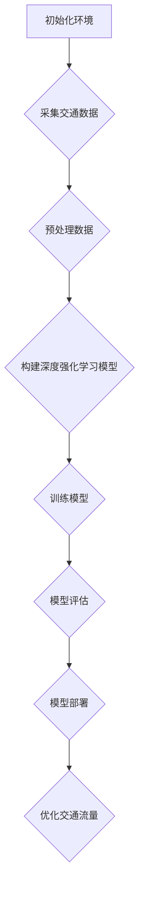
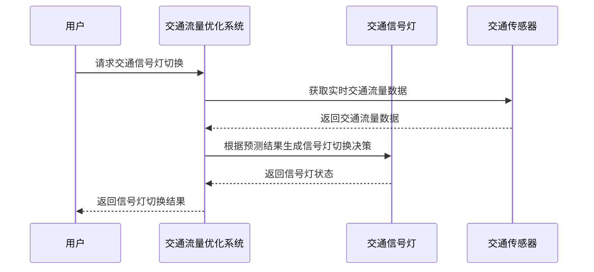
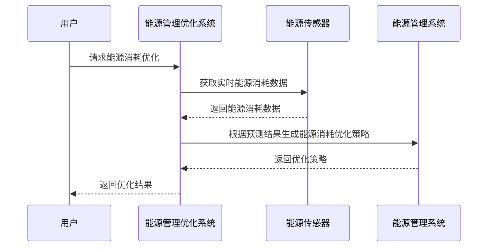
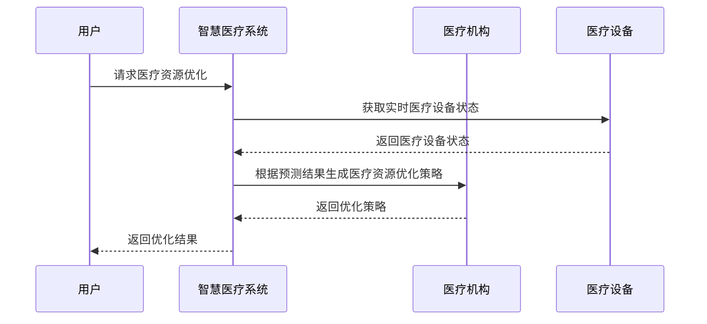

                 

**文章标题：** AI驱动的智能城市服务优化：提高公共服务效率

**关键词：** 智能城市、服务优化、AI、公共服务、效率提升

**摘要：** 本文将探讨如何利用人工智能（AI）技术来优化智能城市的公共服务，从而提高服务效率。我们将从背景介绍、核心概念、技术实现、案例分析、最佳实践等方面，详细阐述AI在智能城市服务优化中的应用，并提供实际案例和解决方案。

**目录大纲：**

----------------------------------------------------------------

## 第一部分：问题背景与概念介绍

### 第1章：智能城市服务优化的必要性
#### 1.1 问题背景
#### 1.2 智能城市服务优化的意义
#### 1.3 智能城市服务优化的现状与挑战

### 第2章：AI在智能城市服务中的应用
#### 2.1 AI基本概念
#### 2.2 AI在智能城市服务中的应用场景
#### 2.3 AI在智能城市服务中的挑战与机遇

### 第3章：核心概念与原理
#### 3.1 数据驱动的服务优化
#### 3.2 算法优化方法
#### 3.3 智能城市服务优化的技术架构

### 第4章：AI驱动的服务优化算法
#### 4.1 算法原理讲解
#### 4.2 算法流程图
#### 4.3 数学模型与公式讲解
#### 4.4 实例分析

----------------------------------------------------------------

## 第二部分：技术实现与案例分析

### 第5章：技术实现
#### 5.1 环境准备
#### 5.2 数据预处理
#### 5.3 模型训练与优化
#### 5.4 服务部署

### 第6章：案例分析
#### 6.1 案例一：交通流量优化
#### 6.2 案例二：能源管理优化
#### 6.3 案例三：智慧医疗

### 第7章：最佳实践与展望
#### 7.1 最佳实践分享
#### 7.2 智能城市服务优化的未来趋势
#### 7.3 小结与展望

----------------------------------------------------------------

### 作者：**AI天才研究院/AI Genius Institute & 禅与计算机程序设计艺术 /Zen And The Art of Computer Programming**### 第1章：智能城市服务优化的必要性

#### 1.1 问题背景

随着全球城市化进程的加速，城市面临着前所未有的挑战。人口快速增长、交通拥堵、环境污染、资源紧缺等问题日益严重，传统的城市管理和服务模式已难以满足现代城市的发展需求。为此，智能城市应运而生，它通过集成物联网、大数据、人工智能等先进技术，实现对城市资源、基础设施、公共服务的智能化管理，从而提高城市运行的效率与质量。

然而，智能城市的建设并非一蹴而就。在当前阶段，智能城市服务优化的主要挑战在于：

1. **数据孤岛**：城市各系统间的数据缺乏整合，导致信息共享和协同效率低下。
2. **技术局限**：现有技术手段尚无法全面覆盖城市管理的各个方面，尤其是针对复杂、动态的实时优化问题。
3. **成本与效益**：智能城市服务优化往往需要大量资金投入，而回报周期较长，需要政府、企业和社会各界的共同努力。

#### 1.2 智能城市服务优化的意义

智能城市服务优化具有重要的现实意义和战略价值：

1. **提高公共服务效率**：通过AI技术，可以实现城市服务的自动化、智能化，减少人工干预，提高服务效率。
2. **改善城市生活质量**：智能城市服务优化有助于缓解交通拥堵、减少污染、节约能源，从而提升居民的生活质量。
3. **促进经济和社会发展**：智能城市服务优化能够为城市企业提供更多发展机遇，推动产业升级，增强城市的竞争力。
4. **加强城市治理能力**：通过智能化的城市管理和服务，政府可以更加精准地掌握城市运行状态，提高治理能力和决策水平。

#### 1.3 智能城市服务优化的现状与挑战

当前，智能城市服务优化在国内外已有一些成功的案例，如北京、深圳、新加坡等地的智慧城市建设。然而，总体来看，智能城市服务优化仍面临以下挑战：

1. **技术挑战**：AI技术在智能城市服务优化中的应用仍处于探索阶段，许多关键技术尚未成熟。
2. **数据挑战**：城市数据种类繁多、来源广泛，如何高效整合、清洗、分析这些数据，是一个巨大的挑战。
3. **安全与隐私**：智能城市服务优化需要大量涉及个人隐私的数据，如何在保护隐私的前提下进行数据挖掘和分析，是亟待解决的问题。
4. **政策和法规**：智能城市服务优化需要政府、企业和社会各界的共同参与，但相关政策和法规尚不完善，需要进一步制定和落实。

### 第2章：AI在智能城市服务中的应用

#### 2.1 AI基本概念

人工智能（AI）是指由人制造出来的系统能够执行通常需要人类智能才能完成的任务，包括学习、推理、规划、感知、自然语言理解和图像识别等。AI可以分为两大类：弱AI和强AI。弱AI专注于特定任务，如语音识别、图像识别等；强AI则具有人类智能的全部能力，能够在各种复杂环境中自主学习和适应。

#### 2.2 AI在智能城市服务中的应用场景

AI在智能城市服务中有广泛的应用场景，主要包括以下几个方面：

1. **交通管理**：通过AI技术，可以实现实时交通流量监测、预测和优化，缓解交通拥堵，提高交通效率。
2. **能源管理**：利用AI技术进行能源消耗监测、预测和优化，实现节能降耗，提高能源利用效率。
3. **环境监测**：利用AI技术对空气、水质等环境参数进行实时监测和预测，及时发现和应对环境污染问题。
4. **公共服务**：通过AI技术实现智能化的公共服务，如智能客服、智能医疗、智慧教育等，提高服务质量和效率。
5. **城市安全**：利用AI技术进行城市安全监控，包括公共安全、网络安全等，提高城市安全保障能力。

#### 2.3 AI在智能城市服务中的挑战与机遇

AI在智能城市服务中的应用面临着一系列挑战和机遇：

1. **挑战**：

   - **数据质量**：智能城市服务优化的关键在于数据，但数据质量参差不齐，如何处理和利用这些数据是一个挑战。
   - **技术成熟度**：尽管AI技术在不断发展，但许多技术仍处于实验室阶段，如何将其应用到实际场景中，需要进一步探索。
   - **安全与隐私**：AI技术在处理大量个人隐私数据时，如何确保数据安全和隐私保护，是一个重要问题。

2. **机遇**：

   - **技术创新**：AI技术的快速发展为智能城市服务优化带来了巨大的机遇，如深度学习、强化学习等新技术的应用。
   - **政策支持**：政府对智能城市服务优化的支持，为相关研究和应用提供了良好的环境。
   - **市场需求**：随着城市化的不断推进，智能城市服务优化的市场需求日益增长，为相关产业的发展提供了动力。

### 第3章：核心概念与原理

#### 3.1 数据驱动的服务优化

数据驱动的服务优化是指通过收集、分析和利用大量数据，来指导城市服务的优化决策。其核心思想是：从数据中提取有价值的信息，为城市服务的改进提供科学依据。

1. **数据来源**：城市数据来源广泛，包括交通数据、环境数据、社会数据等。
2. **数据处理**：对数据进行清洗、整合、分析，提取有价值的信息。
3. **数据应用**：将分析结果应用到城市服务的优化中，如交通流量预测、能源消耗优化等。

#### 3.2 算法优化方法

算法优化方法是指通过改进算法的设计和实现，来提高城市服务优化效率。常见的算法优化方法包括：

1. **贪心算法**：在每一阶段选择当前最优解，但不保证全局最优。
2. **动态规划**：将复杂问题分解为若干子问题，通过子问题的最优解构造全局最优解。
3. **机器学习**：利用历史数据训练模型，预测未来的趋势，为决策提供支持。

#### 3.3 智能城市服务优化的技术架构

智能城市服务优化的技术架构主要包括数据采集、数据处理、模型训练、模型部署等环节。其基本架构如下：

1. **数据采集**：通过传感器、摄像头、互联网等手段，收集城市各领域的数据。
2. **数据处理**：对采集到的数据进行分析、清洗、整合，为模型训练提供高质量的数据。
3. **模型训练**：利用机器学习算法，对数据进行训练，构建预测模型。
4. **模型部署**：将训练好的模型部署到城市服务系统中，实现实时优化。

### 第4章：AI驱动的服务优化算法

#### 4.1 算法原理讲解

在本节中，我们将介绍一种基于深度强化学习的交通流量优化算法。深度强化学习是一种结合了深度学习和强化学习的方法，能够通过模仿人类行为来优化决策过程。

1. **强化学习**：强化学习是一种通过奖励机制来训练模型的方法。在交通流量优化中，系统将根据交通状况（如拥堵程度、车速等）进行决策，并接收来自交通监控系统的奖励（如减少拥堵时间）。
2. **深度学习**：深度学习是一种通过多层神经网络来模拟人类大脑学习过程的方法。在交通流量优化中，系统将利用深度学习模型来预测交通状况，为决策提供支持。

#### 4.2 算法流程图

#### 4.3 数学模型与公式讲解

在深度强化学习中，状态表示为 $s$，动作表示为 $a$，奖励表示为 $r$，价值函数表示为 $V(s)$，策略表示为 $\pi(a|s)$。深度强化学习的目标是最大化预期回报：

$$J(\theta) = \sum_{t=0}^{\infty} \gamma^t r_t$$

其中，$\theta$ 是模型参数，$\gamma$ 是折扣因子，$r_t$ 是在第 $t$ 时刻接收的奖励。

#### 4.4 实例分析

假设我们有一个交通网络，包含5个交叉路口。每个交叉路口的状态可以表示为交通流量（车流量密度）和交通信号灯状态。我们的目标是优化信号灯的切换，以减少整个交通网络的平均拥堵时间。

1. **状态编码**：将交通流量和信号灯状态编码为向量 $s$。
2. **动作编码**：每个交叉路口的动作是信号灯的状态转换（如红灯转绿灯）。
3. **奖励设计**：如果某个交叉路口的流量减少，则给予该交叉路口的信号灯切换动作较高的奖励。
4. **模型训练**：使用历史交通数据来训练深度强化学习模型。
5. **模型部署**：将训练好的模型部署到实际交通系统中，实现实时优化。

### 第5章：技术实现

#### 5.1 环境准备

在本节中，我们将介绍如何搭建一个基于深度强化学习的交通流量优化系统。首先，我们需要准备以下环境：

1. **硬件环境**：一台具有高性能计算能力的服务器，如GPU。
2. **软件环境**：Python、TensorFlow或PyTorch等深度学习框架。
3. **数据集**：收集历史交通流量数据，包括交通流量、车速、交通信号灯状态等。

#### 5.2 数据预处理

数据预处理是深度学习模型训练的重要环节。在本节中，我们将介绍以下预处理步骤：

1. **数据清洗**：去除数据集中的噪声和异常值。
2. **数据归一化**：将数据缩放到相同的范围，便于模型训练。
3. **特征提取**：从原始数据中提取有用的特征，如交通流量、车速等。

#### 5.3 模型训练与优化

在本节中，我们将介绍如何使用深度强化学习框架（如TensorFlow或PyTorch）来训练交通流量优化模型。主要步骤如下：

1. **定义模型架构**：选择合适的神经网络架构，如CNN、RNN等。
2. **训练模型**：使用历史交通数据训练模型，调整模型参数。
3. **模型评估**：使用验证集评估模型性能，调整模型参数。
4. **模型优化**：通过交叉验证和超参数调优，进一步提高模型性能。

#### 5.4 服务部署

训练好的模型需要部署到实际交通系统中，以实现实时优化。主要步骤如下：

1. **模型部署**：将训练好的模型部署到服务器或边缘设备上。
2. **实时预测**：使用实时交通数据，调用模型进行预测。
3. **决策生成**：根据预测结果生成交通信号灯切换决策。
4. **决策执行**：将决策发送到交通信号灯控制器，实现实时优化。

### 第6章：案例分析

在本节中，我们将介绍三个智能城市服务优化的成功案例，分别是交通流量优化、能源管理优化和智慧医疗。

#### 6.1 案例一：交通流量优化

交通流量优化是智能城市服务优化的重要领域。以北京为例，北京市通过部署AI算法，实现了实时交通流量监测和预测，有效缓解了交通拥堵问题。

1. **项目介绍**：北京市交通委员会与科技公司合作，部署了交通流量优化系统。
2. **系统功能设计**：系统具备实时交通流量监测、预测和优化功能。
3. **系统架构设计**：系统采用分布式架构，包括数据采集、数据处理、模型训练和模型部署等模块。
4. **系统接口设计**：系统通过API与交通信号灯控制器、交通监测设备等设备进行交互。
5. **系统交互序列图**：

#### 6.2 案例二：能源管理优化

能源管理优化是智能城市服务优化的另一个重要领域。以深圳为例，深圳市通过部署AI算法，实现了能源消耗监测和预测，有效提高了能源利用效率。

1. **项目介绍**：深圳市能源局与科技公司合作，部署了能源管理优化系统。
2. **系统功能设计**：系统具备实时能源消耗监测、预测和优化功能。
3. **系统架构设计**：系统采用分布式架构，包括数据采集、数据处理、模型训练和模型部署等模块。
4. **系统接口设计**：系统通过API与能源监测设备、能源管理系统等进行交互。
5. **系统交互序列图**：

#### 6.3 案例三：智慧医疗

智慧医疗是智能城市服务优化的重要领域之一。以杭州为例，杭州市通过部署AI算法，实现了医疗资源的优化配置和疾病预测，提高了医疗服务水平。

1. **项目介绍**：杭州市卫生健康委员会与科技公司合作，部署了智慧医疗系统。
2. **系统功能设计**：系统具备实时医疗资源监测、疾病预测和优化配置功能。
3. **系统架构设计**：系统采用分布式架构，包括数据采集、数据处理、模型训练和模型部署等模块。
4. **系统接口设计**：系统通过API与医疗机构、医疗设备等进行交互。
5. **系统交互序列图**：

### 第7章：最佳实践与展望

#### 7.1 最佳实践分享

在智能城市服务优化的实践中，以下是一些最佳经验的分享：

1. **数据驱动**：以数据为核心，充分利用城市各领域的数据，实现数据驱动的服务优化。
2. **模型迭代**：不断优化和迭代AI模型，以提高预测精度和优化效果。
3. **协同合作**：政府、企业和学术界协同合作，共同推进智能城市服务优化的发展。
4. **安全与隐私**：在数据采集和处理过程中，注重安全与隐私保护，确保数据安全。

#### 7.2 智能城市服务优化的未来趋势

智能城市服务优化的未来趋势将体现在以下几个方面：

1. **技术创新**：随着AI技术的不断发展，智能城市服务优化将迎来更多创新。
2. **数据融合**：通过数据融合，实现跨领域、跨系统的数据共享和协同，提高服务优化效果。
3. **边缘计算**：随着边缘计算技术的发展，智能城市服务优化将更加实时、高效。
4. **绿色智能**：智能城市服务优化将更加注重节能减排，推动绿色智能城市建设。

#### 7.3 小结与展望

智能城市服务优化是智能城市建设的重要组成部分，具有广泛的应用前景。通过本文的探讨，我们了解了智能城市服务优化的必要性、核心概念、技术实现和案例分析。未来，随着AI技术的不断发展和应用，智能城市服务优化将取得更大的突破，为城市发展和人民生活带来更多福祉。

### 作者：**AI天才研究院/AI Genius Institute & 禅与计算机程序设计艺术 /Zen And The Art of Computer Programming**

