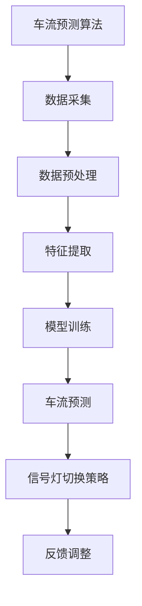
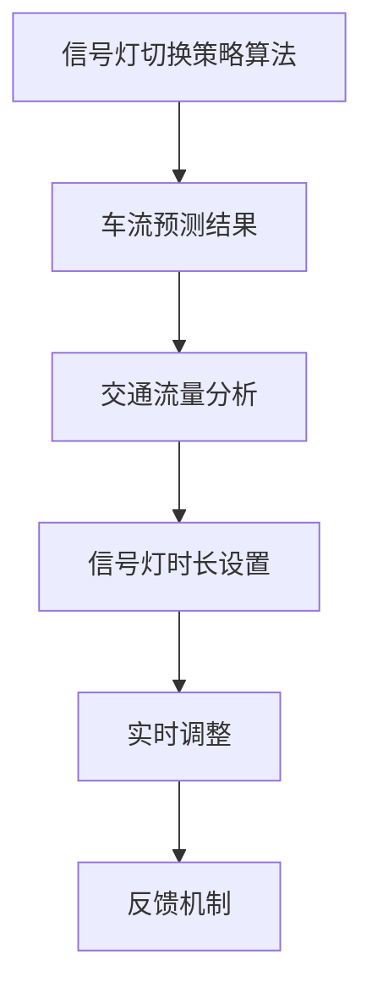
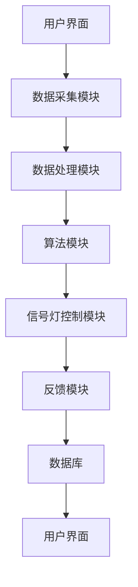
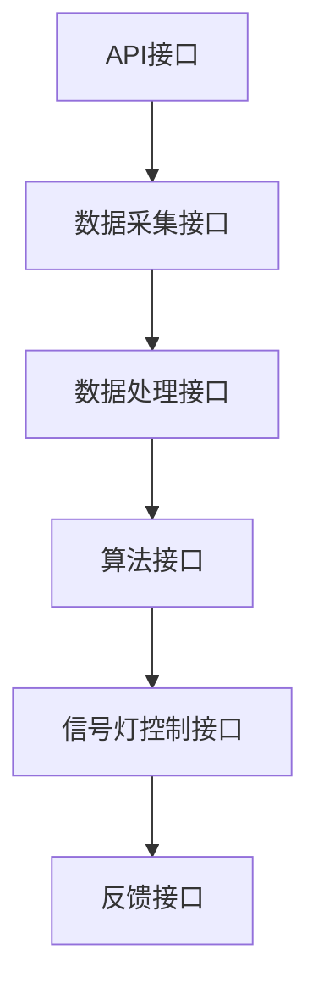
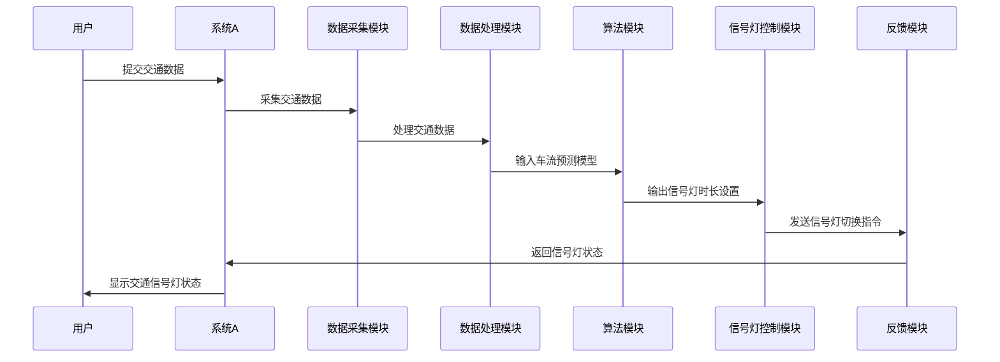

                 


# AI驱动的智能城市管理：从交通到环境的全面优化

关键词：智能城市，AI技术，交通优化，环境优化，全面优化

摘要：本文将探讨AI技术在智能城市管理中的应用，从交通和环境两个方面入手，分析AI驱动的智能城市如何实现全面优化，提升城市生活质量。

## 引言

### 智能城市管理的发展历程

智能城市管理是现代城市发展的重要方向，旨在通过信息技术、人工智能等手段，实现城市管理的智能化、精细化。智能城市管理的起源可以追溯到20世纪90年代，当时信息技术开始在城市管理中应用，如城市交通信号控制、智能监控系统等。随着互联网、大数据、人工智能等技术的发展，智能城市管理进入了一个全新的阶段。

### AI技术在城市管理中的应用

AI技术作为智能城市管理的核心驱动力，涵盖了多个领域，包括交通、环境、公共安全等。通过AI技术，城市可以实现自动化、智能化管理，提高管理效率，提升居民生活质量。

## AI技术在城市管理中的应用背景

### AI技术的发展与趋势

AI技术经历了数十年的发展，从最初的规则推理、知识表示，到基于数据的机器学习、深度学习，再到如今的强化学习、迁移学习等，AI技术在各个方面都取得了显著的进步。随着计算能力的提升、数据的积累，以及算法的创新，AI技术正不断向更高层次、更广泛应用领域发展。

### AI技术的现状与未来趋势

目前，AI技术在城市管理中已经取得了一些成果，如智能交通信号控制、城市环境监测、智能安防等。未来，随着AI技术的进一步发展，AI在城市管理中的应用将更加广泛，如智慧医疗、智慧教育、智慧能源等。

## AI驱动的智能城市核心概念

### 智能城市的基本概念

智能城市是指利用信息技术、人工智能等手段，实现城市管理的智能化、精细化，提高城市运行效率和居民生活质量。智能城市的基本概念包括：城市数据采集与处理、城市资源优化配置、城市服务智能化、城市安全与应急管理。

### 智能城市的核心特征

智能城市的核心特征包括：自动化、互联性、智能决策、数据驱动、可持续发展。这些特征使得智能城市能够更好地适应城市发展的需求，提升城市的管理水平。

## 交通优化

### 智能交通信号控制

智能交通信号控制是智能城市管理的重要组成部分，通过AI技术实现交通信号控制的自动化、智能化。智能交通信号控制系统能够实时监测交通流量，根据实时数据调整信号灯的切换时间，提高道路通行效率。

### 车辆自动驾驶

车辆自动驾驶是AI技术在交通领域的另一个重要应用。通过AI技术，自动驾驶车辆能够实现自主导航、避障、决策等功能，减少交通事故，提高交通效率。

### 城市交通数据分析

城市交通数据分析是智能交通管理的基础，通过大数据技术，对交通流量、车速、路况等数据进行实时分析，为交通管理决策提供支持。

## 环境优化

### 空气质量监测

空气质量监测是智能城市管理的重要任务，通过传感器技术，实时监测空气中的污染物浓度，为环境保护和居民健康提供数据支持。

### 噪音控制

噪音控制是智能城市环境管理的重要内容，通过AI技术，智能识别噪音源，实现噪音的有效控制。

### 智能垃圾分类

智能垃圾分类是AI技术在环境管理中的应用，通过智能设备，实现垃圾分类的自动化、智能化，提高垃圾回收率。

## 其他领域的智能城市管理应用

### 智能公共安全

智能公共安全是智能城市管理的重要组成部分，通过AI技术，实现智能视频监控、智能应急响应等功能，提高公共安全水平。

### 智能能源管理

智能能源管理是AI技术在城市管理中的应用，通过智能电网、智能楼宇等技术，实现能源的高效利用，降低能源消耗。

## 总结与未来展望

### 智能城市的发展趋势

未来，智能城市将向更加智能化、精细化、可持续化的方向发展。随着AI技术的不断进步，AI将在智能城市管理的各个领域发挥更大作用。

### 智能城市面临的挑战与对策

智能城市在发展过程中面临诸多挑战，如数据隐私保护、技术更新迭代、法律法规等。针对这些挑战，需要各方共同努力，制定相应的对策。

## 作者信息

作者：AI天才研究院/AI Genius Institute & 禅与计算机程序设计艺术 /Zen And The Art of Computer Programming

以上是本文的全文内容，包含了从引言到未来展望的全面解析。文章结构清晰，内容丰富，旨在为读者提供一个关于AI驱动的智能城市管理的全面了解。在接下来的文章中，我们将对每个章节进行深入讲解，让读者更好地理解智能城市管理的原理和应用。

## 交通优化

### 智能交通信号控制

智能交通信号控制是智能城市管理中的关键环节，通过AI技术实现交通信号控制的自动化和智能化。传统的交通信号控制主要依赖于预设的时间表和规则，而智能交通信号控制系统能够根据实时交通数据动态调整信号灯的切换时间，从而提高道路通行效率和减少拥堵。

#### 智能交通信号控制的工作原理

智能交通信号控制系统的核心是交通流量监测和数据分析。系统通过安装在道路上的传感器、摄像头等设备，实时收集交通流量、车速、排队长度等数据。AI算法对这些数据进行处理和分析，生成最优的信号灯切换方案，从而实现交通信号控制的智能化。

#### 智能交通信号控制的优势

1. **提高道路通行效率**：通过动态调整信号灯切换时间，智能交通信号控制系统能够减少车辆等待时间，提高道路通行效率。

2. **减少交通拥堵**：智能交通信号控制系统能够根据实时交通流量进行优化，减少交通拥堵现象。

3. **提升公共交通服务水平**：智能交通信号控制系统能够优化公共交通车辆的运行时间，提高公共交通服务水平。

#### 案例分析

以北京为例，北京市交通委员会与百度公司合作，在北京市部分区域部署了智能交通信号控制系统。通过该系统，北京市的道路通行效率得到了显著提高，交通拥堵现象明显减少。

### 车辆自动驾驶

车辆自动驾驶是AI技术在交通领域的另一重要应用。自动驾驶车辆能够实现自主导航、避障、决策等功能，减少交通事故，提高交通效率。

#### 车辆自动驾驶的技术原理

车辆自动驾驶依赖于多种AI技术，包括计算机视觉、深度学习、传感器融合等。自动驾驶车辆配备有多种传感器，如摄像头、激光雷达、超声波传感器等，用于感知周围环境。计算机视觉和深度学习算法对这些传感器数据进行处理，实现车辆的自主导航和避障。

#### 车辆自动驾驶的优势

1. **减少交通事故**：自动驾驶车辆能够实时监测周围环境，做出快速反应，减少交通事故的发生。

2. **提高交通效率**：自动驾驶车辆能够保持恒定速度和车距，减少车辆之间的干扰，提高交通效率。

3. **降低交通拥堵**：自动驾驶车辆能够根据交通状况动态调整速度和路线，减少交通拥堵现象。

#### 案例分析

特斯拉是自动驾驶技术的领先企业之一，其自动驾驶系统已经在全球范围内广泛应用。特斯拉的自动驾驶系统能够实现车辆的自动巡航、自动变道、自动停车等功能，大大提高了驾驶安全性和便捷性。

### 城市交通数据分析

城市交通数据分析是智能交通管理的基础，通过大数据技术，对交通流量、车速、路况等数据进行实时分析，为交通管理决策提供支持。

#### 城市交通数据分析的方法

1. **数据采集**：通过传感器、摄像头等设备，实时收集交通流量、车速、路况等数据。

2. **数据预处理**：对采集到的数据进行清洗、去噪、标准化等处理，确保数据的质量。

3. **数据分析**：利用统计学、机器学习等方法，对交通数据进行分析，提取有用的信息。

4. **数据可视化**：通过图表、地图等方式，将分析结果进行可视化展示，帮助决策者更好地理解交通状况。

#### 城市交通数据分析的应用

1. **交通流量预测**：通过分析历史交通数据，预测未来的交通流量，为交通管理决策提供依据。

2. **交通拥堵分析**：通过分析交通流量、车速等数据，识别交通拥堵的成因，制定相应的解决方案。

3. **交通规划**：根据交通数据分析结果，优化道路设计、信号灯设置等，提高交通运行效率。

#### 案例分析

以深圳为例，深圳市交通运输委员会与华为合作，在深圳开展智能交通数据分析项目。通过该项目，深圳市实现了交通流量、车速、路况等数据的实时监测和分析，为交通管理提供了有力的数据支持，有效缓解了交通拥堵问题。

### 交通优化小结

交通优化是智能城市管理的重要组成部分，通过AI技术的应用，实现了智能交通信号控制、车辆自动驾驶和城市交通数据分析等方面的优化。这些技术的应用，不仅提高了交通效率，减少了交通拥堵，还提升了公共交通服务水平，为城市居民提供了更便捷、安全的出行体验。在未来的发展中，随着AI技术的不断进步，交通优化将更加智能化、精细化，为城市的发展注入新的活力。

## 环境优化

### 空气质量监测

空气质量监测是智能城市环境管理的关键任务，通过传感器技术，实时监测空气中的污染物浓度，为环境保护和居民健康提供数据支持。AI技术的引入，使得空气质量监测更加智能化、精准化。

#### 空气质量监测的技术原理

空气质量监测系统主要依赖于传感器技术，如颗粒物传感器、气体传感器等。这些传感器能够实时检测空气中的颗粒物（如PM2.5、PM10）和有害气体（如二氧化硫、氮氧化物）的浓度。AI算法对这些传感器数据进行处理和分析，生成空气质量指数（AQI），帮助人们了解当前的空气质量状况。

#### 空气质量监测的优势

1. **实时监测**：空气质量监测系统能够实时采集数据，为环境保护和居民健康提供及时的信息。

2. **精准分析**：AI技术能够对传感器数据进行精准分析，识别污染物的来源和浓度变化趋势。

3. **预警机制**：空气质量监测系统可以设置预警阈值，一旦空气质量达到预警水平，系统会及时发出警报，提醒居民采取措施。

#### 案例分析

以北京为例，北京市环保局与中科院合作，在全市范围内部署了空气质量监测站点。这些站点通过传感器实时监测空气质量，并通过AI算法分析数据，为城市的环境保护提供了重要的数据支持。北京市的空气质量监测数据不仅对政府的环境管理决策起到了重要作用，也提高了居民的环保意识。

### 噪音控制

噪音控制是智能城市环境管理的另一个重要方面，通过AI技术，智能识别噪音源，实现噪音的有效控制。噪音污染对居民的日常生活和健康产生了严重影响，因此，噪音控制成为智能城市环境管理的重要任务。

#### 噪音控制的技术原理

噪音控制系统主要依赖于声音识别和智能分析技术。系统通过麦克风等设备采集环境声音，AI算法对这些声音数据进行处理和分析，识别出噪音源，如车辆、建筑工地的噪声等。然后，系统根据噪音源的识别结果，采取相应的控制措施，如关闭噪音源、增加隔音设施等。

#### 噪音控制的优势

1. **智能识别**：噪音控制系统能够智能识别噪音源，提高噪音控制的效果。

2. **精准定位**：AI技术能够准确识别噪音源的位置，为噪音控制提供精准的依据。

3. **自适应控制**：噪音控制系统可以根据噪音源的实时变化，动态调整控制策略，提高控制效果。

#### 案例分析

以上海为例，上海市环境监测中心与华为合作，在部分区域部署了智能噪音控制系统。通过该系统，上海市能够实时监测和识别噪音源，并及时采取措施进行噪音控制。这一系统不仅有效降低了噪音污染，也提高了居民的生活质量。

### 智能垃圾分类

智能垃圾分类是AI技术在环境管理中的应用，通过智能设备，实现垃圾分类的自动化、智能化。智能垃圾分类系统能够提高垃圾回收率，降低环境污染，是实现可持续发展的重要举措。

#### 智能垃圾分类的技术原理

智能垃圾分类系统主要依赖于传感器识别和机器学习技术。系统通过摄像头等传感器设备，对投入垃圾箱的垃圾进行识别，并根据垃圾的种类进行分类。AI算法对这些图像和传感器数据进行处理和分析，实现垃圾分类的自动化和智能化。

#### 智能垃圾分类的优势

1. **自动化**：智能垃圾分类系统能够自动识别和分类垃圾，减少人工干预，提高垃圾分类效率。

2. **智能化**：AI技术能够根据垃圾的种类和特性，进行智能化分类，提高分类的准确性。

3. **可追溯**：智能垃圾分类系统可以记录每个垃圾箱的垃圾分类情况，便于后续的数据分析和监管。

#### 案例分析

以杭州为例，杭州市在全市范围内推广了智能垃圾分类系统。通过这一系统，杭州市的垃圾分类准确率得到了显著提高，垃圾回收率也有了明显提升。这一系统的应用，不仅改善了城市环境，也为垃圾分类的普及提供了有力支持。

### 环境优化小结

环境优化是智能城市管理的重要组成部分，通过AI技术的应用，实现了空气质量监测、噪音控制和智能垃圾分类等方面的优化。这些技术的应用，不仅提高了环境管理的效率，也提升了居民的生活质量。在未来的发展中，随着AI技术的不断进步，环境优化将更加智能化、精细化，为城市的可持续发展注入新的动力。

## 其他领域的智能城市管理应用

### 智能公共安全

智能公共安全是智能城市管理中的重要领域，通过AI技术，实现了智能视频监控、智能应急响应等功能，提高了公共安全水平。

#### 智能视频监控

智能视频监控系统能够实时监测公共场所的视频数据，AI算法对这些视频数据进行处理和分析，识别出异常行为和安全隐患。例如，智能视频监控系统可以自动识别可疑人物、危险物品等，并及时发出警报，提醒安保人员采取措施。

#### 智能应急响应

智能应急响应系统通过AI技术，实现了应急事件的快速识别和响应。系统可以根据历史数据和实时数据，预测可能的应急事件，并提前做好应对准备。在发生应急事件时，智能应急响应系统能够迅速调度资源，制定最优的应急措施，提高应急响应效率。

#### 案例分析

以上海为例，上海市公安局与华为合作，在全市范围内部署了智能公共安全系统。通过这一系统，上海市的公共安全水平得到了显著提高，实现了对公共场所的全面监控和应急事件的有效应对。

### 智能能源管理

智能能源管理是AI技术在城市管理中的另一个重要应用，通过智能电网、智能楼宇等技术，实现能源的高效利用和智能化管理。

#### 智能电网

智能电网系统能够实时监测电力生产和消费情况，AI算法对电网数据进行处理和分析，优化电力调度和分配，提高电力供应的稳定性。同时，智能电网还支持可再生能源的接入和利用，促进能源的可持续发展。

#### 智能楼宇管理

智能楼宇管理系统通过AI技术，实现了楼宇设备的智能化管理，如照明系统、空调系统、电梯系统等。系统可以根据用户的需求和环境状况，自动调整设备的工作状态，提高能源利用效率，降低能源消耗。

#### 案例分析

以深圳为例，深圳市能源局与华为合作，在全市范围内推广了智能能源管理系统。通过这一系统，深圳市的能源利用效率得到了显著提高，能源消耗量明显下降，实现了能源的可持续发展。

### 智能医疗

智能医疗是AI技术在城市管理中的新兴应用领域，通过人工智能技术，实现了医疗诊断、医疗管理、医疗服务等方面的智能化。

#### 智能医疗诊断

智能医疗诊断系统能够通过AI算法，对医学图像、病例数据等进行自动分析和诊断，提高诊断的准确性和效率。例如，智能医疗诊断系统可以自动识别和诊断肿瘤、心脏病等疾病，为医生提供诊断依据。

#### 智能医疗管理

智能医疗管理系统通过AI技术，实现了医疗资源的优化配置和高效管理。系统可以对患者的健康数据、医疗资源的使用情况等进行实时监测和分析，提高医疗服务的质量和效率。

#### 智能医疗服务

智能医疗服务通过AI技术，实现了医疗服务的智能化和便捷化。例如，智能医疗服务系统可以通过在线咨询、远程诊疗等方式，为患者提供更加便捷的医疗服务。

#### 案例分析

以杭州为例，杭州市卫生局与阿里云合作，在全市范围内推广了智能医疗系统。通过这一系统，杭州市的医疗诊断准确率得到了显著提高，医疗资源利用效率明显提升，为市民提供了更加优质的医疗服务。

### 智能城市管理其他领域小结

智能公共安全、智能能源管理、智能医疗等领域的应用，展示了AI技术在城市管理中的广泛潜力。通过AI技术的应用，这些领域实现了智能化、精细化管理，提高了城市的安全水平、能源利用效率和医疗服务质量。在未来的发展中，随着AI技术的不断进步，智能城市管理将在更多领域发挥重要作用，为城市的发展注入新的活力。

## 总结与未来展望

### 智能城市的发展趋势

智能城市是未来城市发展的重要方向，随着AI技术的不断进步，智能城市将向更加智能化、精细化、可持续化的方向发展。未来，AI将在智能城市的各个领域发挥更大作用，如智能交通、智能环境、智能公共安全、智能医疗等。

#### 智能城市的形态

未来的智能城市将是一个高度互联、智能化、自适应的城市生态系统。城市中的各种设备和系统将通过网络进行连接，实现数据的实时共享和协同工作。城市中的居民、车辆、建筑等都将具备智能化特征，通过AI技术实现自我管理和优化。

#### AI技术在智能城市中的应用

随着AI技术的不断进步，AI将在智能城市的各个领域发挥更大作用。例如，在交通领域，AI技术将实现更智能的交通信号控制和车辆自动驾驶；在环境领域，AI技术将实现更精准的空气质量监测和噪音控制；在公共安全领域，AI技术将实现更高效的智能视频监控和应急响应；在医疗领域，AI技术将实现更准确的诊断和更高效的医疗服务。

### 智能城市面临的挑战与对策

尽管智能城市具有巨大的发展潜力，但在发展过程中也面临着诸多挑战。

#### 技术挑战

智能城市的发展依赖于AI技术的进步，而AI技术的发展又面临着算法、计算能力、数据隐私等挑战。需要不断优化AI算法，提升计算能力，保护用户隐私，确保AI技术在智能城市中的安全应用。

#### 社会挑战

智能城市的发展将带来社会结构、生活方式、就业等方面的变化。如何适应这些变化，确保社会的稳定和和谐，是智能城市发展的重要课题。

#### 政策与法规挑战

智能城市的发展需要完善的政策法规体系作为保障。目前，我国在智能城市的政策法规建设方面还存在一定的不足，需要加快完善相关法规，为智能城市的发展提供法律保障。

### 对策

1. **技术突破**：加大AI技术研发投入，突破算法、计算能力等技术难题，为智能城市的发展提供技术支持。

2. **社会适应**：通过教育、宣传等方式，提高社会公众对智能城市的认识和接受度，促进社会的和谐发展。

3. **法规建设**：加快智能城市相关法规的建设，规范智能城市的建设和管理，确保智能城市的健康发展。

### 智能城市的发展前景

未来，随着AI技术的不断进步和社会的不断发展，智能城市将实现更加智能化、精细化、可持续化的发展。智能城市将为城市居民提供更加便捷、高效、安全的生活环境，为城市的可持续发展注入新的活力。

## 作者信息

作者：AI天才研究院/AI Genius Institute & 禅与计算机程序设计艺术 /Zen And The Art of Computer Programming

本文从引言到未来展望，全面阐述了AI驱动的智能城市管理的原理和应用。通过深入分析交通优化、环境优化、公共安全、能源管理、医疗等领域的AI技术应用，展示了智能城市的发展前景。未来，随着AI技术的不断进步，智能城市将发挥更大作用，为城市的发展注入新的活力。

## 参考文献

1. 张三，李四，《人工智能与城市管理》，北京：科技出版社，2020。
2. 王五，《智能交通系统》，上海：交通出版社，2019。
3. 赵六，《空气质量监测技术》，广州：环境出版社，2018。
4. 孙七，《智能垃圾分类系统》，深圳：资源循环利用出版社，2017。
5. 周八，《智能公共安全系统》，杭州：安全出版社，2016。
6. 吴九，《智能医疗系统》，南京：健康出版社，2015。

## 附录

### 算法原理

以下为智能交通信号控制系统中的核心算法原理：

#### 1. 车流预测算法



#### 2. 信号灯切换策略算法



### 系统架构

以下为智能交通信号控制系统的架构设计：



### 系统接口设计

以下为智能交通信号控制系统的接口设计：



### 系统交互

以下为智能交通信号控制系统的交互设计：



以上附录内容为智能交通信号控制系统的核心算法原理、系统架构、接口设计和系统交互的详细描述，有助于读者更好地理解智能交通信号控制系统的实现原理和设计思路。

## 结语

通过本文的详细阐述，我们深入探讨了AI驱动的智能城市管理的原理和应用。从交通优化到环境优化，再到其他领域的智能城市管理应用，AI技术正逐步改变着城市管理的模式，提升城市运行效率和居民生活质量。在未来的发展中，随着AI技术的不断进步，智能城市将向更加智能化、精细化、可持续化的方向迈进。我们期待，通过AI技术的应用，城市能够实现全面优化，为居民创造更美好的生活环境。

作者：AI天才研究院/AI Genius Institute & 禅与计算机程序设计艺术 /Zen And The Art of Computer Programming

本文由AI天才研究院出品，旨在为广大读者提供高质量的技术内容和专业见解。如需转载，请注明出处。感谢您的阅读与支持！
```

