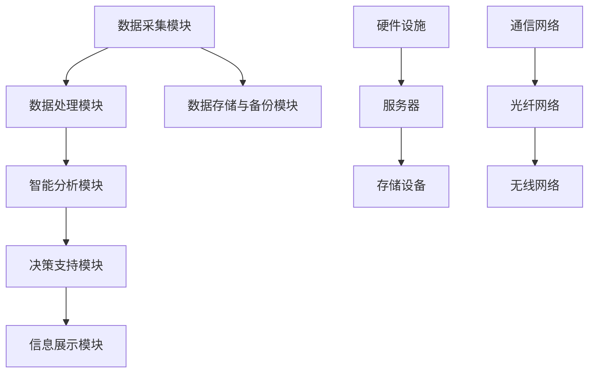

                 

### AI与智能城市概述

#### 1.1 智能城市的发展背景

**城市化进程与挑战**

随着全球经济的快速发展和人口的持续增长，城市化进程不断加速。城市化进程带来了诸多问题和挑战。首先，人口增长导致城市资源分配问题日益突出。城市人口密集，土地资源有限，如何合理分配资源成为了一个难题。此外，交通拥堵、环境恶化等问题也随之而来。城市交通拥堵严重影响了居民的出行效率，而环境污染则严重威胁了居民的健康。此外，公共安全与应急响应也是城市面临的重要挑战。如何提高公共安全水平，确保城市在突发事件中的快速响应，是一个亟待解决的问题。

**人工智能的崛起**

与此同时，人工智能技术在全球范围内迅速崛起。人工智能，也称为AI，是指通过计算机模拟人类智能行为的技术。它包括机器学习、深度学习、自然语言处理等多个领域。人工智能的发展为解决城市化进程中的问题提供了新的思路和手段。例如，通过智能交通系统，可以有效地缓解交通拥堵；通过环境监测系统，可以实时监测和改善环境质量；通过智能安防系统，可以提高公共安全水平。

**人工智能技术在我国的发展**

我国在人工智能领域的发展也十分迅速。近年来，政府高度重视人工智能技术的发展，出台了一系列政策和措施，鼓励人工智能研究和应用。我国在人工智能领域的科研实力和产业规模都位居世界前列。特别是在智能城市领域，我国已经取得了一系列重要的成果。例如，北京市的智慧城市建设已经初具规模，通过人工智能技术实现了交通管理、环境监测、公共安全等多方面的智能化管理。

#### 1.2 智能城市的关键概念

**智能城市**

**定义**：智能城市是指利用信息技术，特别是人工智能技术，对城市资源进行高效管理和优化，以提高城市运行效率和居民生活质量的城市。

**特征**：智能城市具有以下几个显著特征：

1. **信息化**：城市各个系统都实现了信息化，通过传感器、物联网等技术，实现了数据的全面收集和实时传输。
2. **智能化**：城市各个系统通过人工智能技术进行智能分析和决策，提高了系统的运行效率和精准度。
3. **协同化**：城市各个系统之间实现了高效协同，实现了资源的优化配置和共享。
4. **绿色化**：通过智能化管理，实现了能源的高效利用和环境的可持续发展。

**AI驱动的智能城市管理**

**应用**：人工智能技术在智能城市中的应用非常广泛。例如，在交通管理方面，可以通过智能交通系统实时监测交通流量，优化交通信号控制，缓解交通拥堵。在环境监测方面，可以通过环境监测系统实时监测空气质量、水质等环境参数，提供环境预警和治理方案。在公共安全方面，可以通过智能安防系统实时监测城市安全状况，快速响应突发事件，确保公共安全。

**优势**：AI驱动的智能城市管理的优势主要体现在以下几个方面：

1. **效率提升**：通过智能化的管理和分析，大大提高了城市管理的效率和精准度。
2. **资源优化**：通过智能化的管理和分析，实现了城市资源的优化配置和高效利用。
3. **决策支持**：通过智能化的分析和预测，为城市管理决策提供了有力的支持。
4. **可持续发展**：通过智能化的管理和优化，实现了城市环境的可持续发展。

#### 1.3 AI驱动的智能城市管理的核心要素

**数据收集与管理**

**数据来源**：智能城市的数据来源非常广泛，包括地理空间数据、社会经济数据、交通数据、环境数据等。这些数据可以通过传感器、物联网设备、社交网络等多种途径进行收集。

**数据管理策略**：智能城市需要对收集到的数据进行分析和管理，以便为城市管理和决策提供支持。数据管理策略包括数据清洗、数据整合、数据存储、数据分析和数据可视化等。

**算法与应用场景**

**常见算法**：智能城市管理中常用的算法包括机器学习算法、深度学习算法、聚类算法、回归算法等。

**算法应用场景**：不同的算法适用于不同的应用场景。例如，机器学习算法可以用于交通流量预测、环境质量预测等；深度学习算法可以用于图像识别、语音识别等；聚类算法可以用于城市人口分布分析等。

通过以上分析，我们可以看出，AI驱动的智能城市管理不仅是一种技术手段，更是一种全新的城市管理理念。它通过数据驱动的管理和决策，实现了城市资源的高效利用和城市运行的高效管理，为城市可持续发展提供了强有力的支持。

### AI驱动的智能城市管理的核心要素

在深入探讨AI驱动的智能城市管理时，我们必须关注其核心要素，这些要素构成了智能城市管理的基石。以下将详细介绍数据收集与管理、算法与应用场景、技术挑战与前景等核心要素。

#### 数据收集与管理

数据是智能城市管理的灵魂。为了实现智能化的城市管理和决策，首先需要收集大量的数据，并对这些数据进行有效的管理和分析。以下为数据收集和管理的核心要素：

**数据来源**：智能城市的数据来源广泛，包括但不限于以下几类：

1. **地理空间数据**：如城市地图、卫星图像、遥感数据等，用于城市管理中的空间分析和规划。
2. **社会经济数据**：如人口统计、经济指标、消费数据等，反映城市的社会经济状况。
3. **交通数据**：如交通流量、车辆位置、公共交通运行情况等，用于交通管理和优化。
4. **环境数据**：如空气质量、水质、噪声等，用于环境监测和治理。
5. **公共安全数据**：如视频监控、报警信息、紧急事件等，用于公共安全管理和应急响应。

**数据管理策略**：有效的数据管理策略包括以下几个方面：

1. **数据清洗**：确保数据的准确性和一致性，去除噪声和错误数据。
2. **数据整合**：将来自不同来源的数据进行整合，形成统一的数据视图。
3. **数据存储**：采用分布式存储系统，保证数据的高效存储和快速访问。
4. **数据分析和挖掘**：利用机器学习、数据挖掘等技术，从数据中发现有价值的信息和规律。
5. **数据可视化**：通过图表、仪表盘等手段，将数据分析结果直观地呈现给决策者。

#### 算法与应用场景

算法是智能城市管理的技术核心，它们决定了数据分析的效率和准确性。以下是智能城市管理中常用的算法及其应用场景：

**常见算法**：

1. **机器学习算法**：如决策树、支持向量机、神经网络等，用于模式识别、预测分析和分类任务。
2. **深度学习算法**：如卷积神经网络（CNN）、循环神经网络（RNN）等，用于图像识别、语音识别和自然语言处理等。
3. **聚类算法**：如K-均值聚类、层次聚类等，用于数据分析和挖掘，识别数据的分布和模式。
4. **回归算法**：如线性回归、逻辑回归等，用于预测分析和决策支持。
5. **优化算法**：如遗传算法、粒子群优化等，用于资源优化和路径规划。

**算法应用场景**：

1. **交通管理**：通过机器学习算法预测交通流量，优化交通信号控制，缓解交通拥堵。
2. **环境监测**：通过深度学习算法进行环境数据分析，预测环境污染趋势，制定治理策略。
3. **公共安全**：通过视频监控和自然语言处理技术，实时监测公共安全状况，快速响应突发事件。
4. **能源管理**：通过优化算法实现能源的高效利用，降低能源消耗和环境污染。

#### 技术挑战与前景

尽管AI驱动的智能城市管理具有巨大的潜力，但也面临一系列技术挑战。以下是一些主要挑战和解决方案：

**技术挑战**：

1. **数据隐私与安全**：随着数据收集量的增加，如何保护数据隐私和安全成为了一个重要问题。解决方案包括数据加密、隐私保护技术和安全审计等。
2. **技术实现与落地**：AI技术的实现和落地需要跨学科的知识和经验，这对城市管理者和技术人员提出了更高的要求。解决方案包括建立跨学科团队，加强技术培训和知识分享等。
3. **数据质量与一致性**：数据质量和一致性对智能城市管理的准确性至关重要。解决方案包括建立完善的数据质量管理机制，确保数据的准确性和一致性。

**前景分析**：

1. **智能城市的发展趋势**：随着人工智能技术的不断进步，智能城市的发展趋势将包括更广泛的数据应用、更智能的决策支持系统、更高效的资源管理和更可持续的城市发展。
2. **AI在智能城市管理中的前景**：AI技术将在智能城市管理的各个方面发挥越来越重要的作用，包括交通管理、环境治理、公共安全、能源管理等，推动城市管理的智能化、精细化和可持续发展。

通过以上分析，我们可以看到，AI驱动的智能城市管理不仅依赖于先进的技术，还需要对城市管理和运营有深刻的理解和创新。未来，随着技术的不断进步和城市管理理念的更新，智能城市管理将迎来更加广阔的发展前景。

### AI驱动的智能城市规划概述

在城市规划中引入人工智能技术，不仅能够提高规划的科学性和准确性，还能优化资源的配置，提升城市管理的效率。本章节将详细探讨智能城市规划的概念、特点、流程和方法，为智能城市管理的实现奠定基础。

#### 2.1 城市规划的概念与原则

**城市规划的定义**：城市规划是指对城市的空间布局、土地利用、基础设施、环境质量等进行系统规划和管理，以实现城市的可持续发展和社会福利最大化。

**城市规划的核心原则**：

1. **以人为本**：城市规划应始终以满足人民群众的需求为出发点，确保城市的宜居性和舒适性。
2. **可持续发展**：城市规划应考虑环境保护、资源节约和经济发展，实现长期可持续发展。
3. **均衡发展**：城市规划应促进城市各个区域的均衡发展，避免资源过度集中和区域发展不平衡。
4. **灵活性**：城市规划应具备一定的灵活性，能够适应社会、经济和技术的发展变化。

**智能城市规划的特点**

**信息化**：智能城市规划利用信息技术，特别是人工智能技术，对城市规划和管理的数据进行高效收集、处理和分析。

**智能化**：智能城市规划通过人工智能算法，实现城市规划的智能化决策，提高规划的科学性和准确性。

**协同化**：智能城市规划通过集成不同的数据源和系统，实现各规划部门和相关部门之间的协同工作，提升规划的整合性和整体性。

**绿色化**：智能城市规划通过智能化的管理和分析，实现城市资源的优化配置和环境保护，推动绿色城市的建设。

#### 2.2 智能城市规划的流程与方法

**需求分析与评估**

智能城市规划的第一步是需求分析和评估。这包括了解城市的发展目标、居民的需求和当前城市规划的不足之处。通过广泛的调研和数据收集，可以确定智能城市规划的重点和优先级。

**总体规划与专项规划**

智能城市规划可以分为总体规划和专项规划两个层次。总体规划是对城市整体空间布局和土地利用的规划，专项规划则是对交通、环境、公共安全、能源等特定领域的详细规划。智能城市规划需要将总体规划与专项规划相结合，实现全面的智能化管理。

**设计策略与技术方案**

在智能城市规划的设计阶段，需要制定科学的设计策略和技术方案。这包括选择合适的智能技术、算法和工具，设计数据收集和管理系统，以及规划城市基础设施的建设和升级。

**实施与监控**

智能城市规划的实施阶段包括项目立项、设计、建设和运营。在实施过程中，需要不断监控项目的进展和质量，确保智能城市规划目标的实现。同时，通过数据收集和分析，可以及时调整和优化规划方案，提高规划的科学性和适应性。

**评估与优化**

智能城市规划的评估与优化是持续性的工作。通过定期评估城市规划的实施效果，可以发现问题和不足，并提出改进措施。智能城市规划需要根据实际情况和需求变化，不断优化和调整，以实现城市的可持续发展。

#### 2.3 数据驱动的智能城市规划

**数据收集与处理**

数据驱动的智能城市规划依赖于全面的数据收集和处理。这包括地理空间数据、社会经济发展数据、交通数据、环境数据等。通过多种数据收集手段，如传感器、物联网设备、在线调查等，可以获取城市运行的各种信息。

**数据处理与分析**

数据处理和分析是智能城市规划的关键环节。通过对原始数据进行清洗、整合和分析，可以提取有价值的信息和规律，为规划提供数据支持。常用的数据分析方法包括数据挖掘、机器学习、深度学习等。

**数据驱动的规划模型**

数据驱动的规划模型是基于大数据和人工智能技术建立的。通过构建空间分析模型、预测模型和优化模型，可以实现对城市发展的科学预测和合理规划。这些模型可以帮助规划者更好地理解城市运行规律，制定科学合理的规划方案。

**智能规划模型的算法原理**

智能规划模型的算法原理主要包括以下几种：

1. **机器学习算法**：通过训练大量数据，建立模型，实现对数据的分类、预测和聚类分析。
2. **深度学习算法**：通过多层神经网络，实现对复杂数据的自动特征提取和模式识别。
3. **优化算法**：通过数学优化方法，求解资源分配、路径规划等问题，实现资源的最佳配置。

**智能规划模型的应用场景**

智能规划模型可以应用于城市的各个方面，如土地利用规划、交通规划、环境规划、公共安全规划等。通过模型的应用，可以实现科学合理的规划决策，提高城市管理的效率和效果。

通过以上对智能城市规划的概述，我们可以看到，智能城市规划不仅是一种技术手段，更是一种新的城市规划理念。它通过数据驱动的管理和决策，实现了城市资源的高效利用和城市运行的高效管理，为城市的可持续发展提供了强有力的支持。

### 数据驱动的智能城市规划

#### 3.1 数据收集与处理

数据是智能城市规划的核心，其质量和准确性直接影响规划的科学性和有效性。因此，数据收集与处理是智能城市规划的关键步骤。

**数据类型与来源**

智能城市规划所需的数据类型多样，主要包括：

1. **地理空间数据**：包括卫星影像、地形图、交通网络图、土地利用图等，用于空间分析和规划。
2. **社会经济发展数据**：如人口统计、就业情况、经济增长指标、居民消费行为等，反映城市的经济和社会状况。
3. **交通数据**：如交通流量、交通事故记录、公共交通运营数据等，用于交通管理和优化。
4. **环境数据**：如空气质量、水质、噪声水平等，用于环境监测和治理。
5. **公共安全数据**：如视频监控数据、报警信息、紧急事件记录等，用于公共安全管理和应急响应。

数据来源广泛，包括以下几种途径：

1. **政府数据**：政府相关部门发布的数据，如统计部门、规划部门、交通部门等。
2. **企业数据**：如交通企业、通信公司、环保企业等提供的数据。
3. **传感器数据**：通过安装在街道、公园、交通枢纽等位置的传感器设备实时收集的数据。
4. **社会数据**：如社交媒体、论坛、调查问卷等获取的数据。

**数据处理与分析**

数据处理与分析是数据驱动的智能城市规划的关键环节。以下是数据处理与分析的几个核心步骤：

1. **数据清洗**：数据清洗是确保数据质量的重要步骤，包括去除重复数据、纠正错误数据、处理缺失值等。通过数据清洗，可以提高数据的一致性和准确性。

2. **数据整合**：将来自不同来源、格式和结构的数据进行整合，形成一个统一的数据视图。数据整合可以通过数据仓库、数据湖等技术实现。

3. **数据转换**：将数据转换为适合分析和处理的格式，如结构化数据、地理信息系统（GIS）数据等。

4. **数据分析**：利用统计分析、机器学习、数据挖掘等方法，对数据进行深入分析，提取有价值的信息和规律。数据分析可以帮助规划者更好地理解城市现状，预测未来趋势。

5. **数据可视化**：通过图表、地图、仪表盘等可视化工具，将数据分析结果直观地呈现给规划者和决策者，帮助他们更好地理解和利用数据。

**数据驱动的规划模型**

数据驱动的规划模型是智能城市规划的重要工具。以下介绍几种常用的规划模型：

1. **空间分析模型**：

   - **空间分析的基本概念**：空间分析是地理信息系统（GIS）的核心功能，包括空间数据的查询、叠加、缓冲区分析、网络分析等。

   - **常用算法**：包括最近邻分析、缓冲区分析、网络分析等。

   - **应用场景**：如土地利用规划、交通网络规划、环境保护规划等。

2. **智能规划模型**：

   - **智能规划的算法原理**：智能规划模型是基于机器学习、深度学习、优化算法等技术构建的。通过训练大量数据，模型可以学习到城市运行的规律，进行预测和优化。

   - **应用场景**：如交通流量预测、环境质量预测、资源优化配置等。

通过数据收集与处理、数据驱动的规划模型，智能城市规划可以实现更加科学、精准的决策。它不仅能够提高城市管理的效率，还能为城市可持续发展提供有力支持。

### 智能城市基础设施规划

智能城市基础设施是智能城市建设的重要组成部分，它涵盖了交通、能源等多个领域。本章节将详细探讨智能城市基础设施的类型、设计原则和实现路径，为智能城市的可持续发展提供技术保障。

#### 4.1 基础设施的类型与作用

**交通基础设施**

交通基础设施是智能城市的重要组成部分，它包括道路、桥梁、隧道、公共交通系统等。智能交通基础设施通过集成物联网、人工智能、大数据等技术，实现交通流量的实时监测、优化控制和智能管理。

- **作用**：智能交通基础设施能够显著提高交通效率，减少交通拥堵，降低交通事故率，提升居民出行体验。
- **关键技术**：包括传感器技术、车辆自动识别技术、智能交通信号控制系统等。

**能源基础设施**

能源基础设施主要包括电力网络、天然气网络、可再生能源设施等。智能能源基础设施通过智能电网、智能燃气网等技术的应用，实现能源的高效、清洁和可持续利用。

- **作用**：智能能源基础设施能够优化能源资源配置，提高能源利用效率，降低能源消耗和环境污染。
- **关键技术**：包括智能电网技术、分布式能源系统、智能计量和监测技术等。

**公共安全基础设施**

公共安全基础设施包括视频监控系统、消防系统、报警系统、应急响应系统等。智能公共安全基础设施通过物联网、人工智能、大数据等技术的应用，实现对城市公共安全的实时监控和快速响应。

- **作用**：智能公共安全基础设施能够提高城市公共安全保障水平，及时应对突发事件，保障居民的生命财产安全。
- **关键技术**：包括视频监控技术、智能报警技术、应急响应技术等。

**市政基础设施**

市政基础设施包括给排水系统、污水处理系统、垃圾处理系统、照明系统等。智能市政基础设施通过物联网、人工智能、大数据等技术的应用，实现城市市政设施的智能化管理和高效运营。

- **作用**：智能市政基础设施能够提高市政设施的管理效率，减少资源浪费，提升城市环境质量。
- **关键技术**：包括传感器技术、智能监控系统、数据分析技术等。

#### 4.2 智能基础设施的设计与实施

**智能交通系统**

智能交通系统是智能城市基础设施的核心，其设计原则和实现路径如下：

1. **设计原则**：

   - **系统集成**：将各种交通设施和数据源集成到一个统一的平台上，实现交通信息的实时共享和协同管理。
   - **数据驱动**：利用大数据和人工智能技术，对交通数据进行实时分析和预测，优化交通流量和管理策略。
   - **用户体验**：从用户的角度出发，设计人性化的交通信息服务和应急响应机制，提高出行体验。

2. **实现路径**：

   - **交通流量监测与分析**：通过安装在道路、桥梁、隧道等位置的传感器，实时监测交通流量、车速、车辆密度等参数，并通过大数据平台进行实时分析和预测。
   - **智能交通信号控制**：利用人工智能算法，对交通信号进行动态优化，提高道路通行效率，减少交通拥堵。
   - **公共交通优化**：通过数据分析，优化公共交通线路、班次和票价，提高公共交通的便捷性和吸引力。

**智能能源系统**

智能能源系统的设计原则和实现路径如下：

1. **设计原则**：

   - **分布式能源**：鼓励分布式能源系统的发展，提高能源利用效率，实现能源的多样化和可持续发展。
   - **智能化管理**：利用物联网、大数据和人工智能技术，实现能源的智能监控、调度和管理，提高能源利用效率。
   - **用户参与**：鼓励用户参与能源管理，通过能源数据透明化和互动平台，提高用户的能源意识和节能意识。

2. **实现路径**：

   - **智能电网建设**：通过建设智能电网，实现电力资源的实时监测、调度和优化，提高电力供应的稳定性和可靠性。
   - **分布式能源系统**：发展太阳能、风能、生物质能等分布式能源，实现能源的多样化供应和高效利用。
   - **智能能源计量与监控**：通过智能电表、智能燃气表等设备，实现对能源使用情况的实时监控，提高能源利用效率。

**智能公共安全系统**

智能公共安全系统的设计原则和实现路径如下：

1. **设计原则**：

   - **预防为主**：通过视频监控、智能报警等技术，实现城市公共安全的实时监控和预警，预防犯罪事件的发生。
   - **快速响应**：建立高效的应急响应机制，通过智能交通、通信等技术，实现快速响应和处置突发事件。
   - **协同作战**：建立多部门协同的公共安全管理系统，实现信息共享和协同作战，提高公共安全保障水平。

2. **实现路径**：

   - **视频监控与分析**：通过安装高清摄像头和智能视频分析系统，实现对城市公共场所的实时监控，识别异常行为和事件。
   - **智能报警与应急响应**：通过智能报警系统和应急响应平台，实现实时报警和快速响应，确保公共安全。
   - **信息共享与协同作战**：建立多部门协同的信息共享平台，实现信息共享和协同作战，提高公共安全管理的效率和效果。

通过智能城市基础设施的设计与实施，可以显著提高城市的运行效率和居民的生活质量，实现城市的可持续发展。智能交通系统、智能能源系统、智能公共安全系统等领域的不断发展和完善，将为智能城市的建设提供强有力的技术支持。

### 智能城市建设的技术基础

智能城市建设离不开先进的技术支持，其中人工智能技术、传感器技术和物联网技术是智能城市建设不可或缺的核心技术。这些技术不仅为智能城市的各项应用提供了坚实的基础，也极大地提升了城市管理的效率和智能化水平。

#### 5.1 人工智能技术

人工智能（AI）技术是智能城市建设的关键驱动力，它包括机器学习、深度学习、自然语言处理、计算机视觉等多个领域。以下是这些技术的简要介绍及其在智能城市中的应用：

**机器学习**：机器学习是一种通过数据训练模型，使其能够自动进行预测和决策的技术。在智能城市建设中，机器学习技术广泛应用于交通流量预测、环境监测、公共安全等领域。例如，通过分析交通流量数据，机器学习模型可以预测交通拥堵情况，并优化交通信号控制，从而减少交通拥堵。

**深度学习**：深度学习是一种基于多层神经网络的学习方法，具有强大的特征提取和模式识别能力。在智能城市中，深度学习技术广泛应用于图像识别、语音识别和自然语言处理等任务。例如，通过深度学习算法，智能摄像头可以实现实时监控，自动识别异常行为和安全隐患。

**自然语言处理**：自然语言处理（NLP）是使计算机能够理解和处理人类语言的技术。在智能城市中，NLP技术广泛应用于智能客服系统、语音助手和文本分析等。通过NLP技术，智能城市可以更好地理解和响应用户的需求，提供个性化的服务。

**计算机视觉**：计算机视觉是一种使计算机能够像人一样“看”和理解周围环境的技术。在智能城市中，计算机视觉技术广泛应用于视频监控、智能交通和公共安全等领域。通过计算机视觉算法，智能城市可以实现对交通流量的实时监控和分析，提高交通管理的效率和准确性。

**应用案例**：

1. **智能交通**：通过人工智能技术，智能交通系统可以实时监测交通流量，优化交通信号控制，减少交通拥堵。例如，北京市的智能交通系统通过机器学习和深度学习算法，实现了对交通数据的实时分析和预测，提高了交通管理的效率和准确性。
2. **环境监测**：人工智能技术可以用于环境监测，通过分析空气质量、水质等数据，预测环境污染趋势，制定治理措施。例如，深圳市通过人工智能技术建立了环境监测系统，实时监测空气质量，为居民提供实时的健康建议。
3. **公共安全**：人工智能技术在公共安全领域也发挥了重要作用。通过视频监控和计算机视觉技术，智能城市可以实时监控公共场所，识别潜在的安全隐患，并快速采取应对措施。

#### 5.2 传感器技术

传感器技术是智能城市建设的重要基础，它用于感知和采集城市环境中的各种信息。以下是传感器技术的主要类型及其在智能城市中的应用：

**温度传感器**：用于监测城市环境温度，为城市能源管理提供数据支持。

**湿度传感器**：用于监测城市环境湿度，帮助城市规划部门制定适宜的绿化和环境保护措施。

**空气质量传感器**：用于实时监测空气质量，提供数据支持，以便政府部门采取相应的污染治理措施。

**噪声传感器**：用于监测城市环境噪声，为城市规划和管理提供依据，以改善居民的生活环境。

**交通流量传感器**：用于监测道路上的交通流量，为智能交通系统提供数据支持，以优化交通信号控制和道路管理。

**智能井盖传感器**：用于监测城市下水道和排水系统的运行状态，及时发现和处理问题，防止下水道堵塞和城市内涝。

**应用案例**：

1. **环境监测**：上海市通过安装大量环境传感器，建立了覆盖全市的环境监测网络，实时监测空气质量和水质，为环境保护提供了科学依据。
2. **智能交通**：北京市通过在主要道路和交通节点安装交通流量传感器，实时监测交通流量，优化交通信号控制，缓解交通拥堵。

#### 5.3 物联网技术

物联网（IoT）技术通过将各种设备和系统连接到互联网，实现了城市数据的高效采集、传输和处理。以下是物联网技术的主要组成部分及其在智能城市中的应用：

**传感器网络**：传感器网络是由大量传感器节点组成的网络，用于感知和采集城市环境中的各种信息。

**通信网络**：通信网络包括无线网络和有线网络，用于传输传感器网络中的数据。

**数据处理平台**：数据处理平台负责对传感器网络采集到的数据进行存储、处理和分析。

**应用案例**：

1. **智能照明**：通过物联网技术，智能城市可以实现城市照明的智能控制。例如，广州市通过安装智能照明系统，实现了对路灯的远程监控和智能控制，提高了照明效率，降低了能耗。
2. **智能停车**：通过物联网技术，智能城市可以实现停车位的实时监测和智能调度。例如，北京市通过安装智能停车传感器，实时监测停车位的占用情况，为驾驶员提供停车信息，减少了寻找停车位的时间。
3. **智能水管理**：通过物联网技术，智能城市可以实现水资源的实时监测和管理。例如，深圳市通过安装智能水表和传感器，实时监测用水情况，提高了水资源利用效率，减少了水浪费。

通过人工智能技术、传感器技术和物联网技术的综合应用，智能城市建设实现了城市数据的高效采集、传输和处理，为城市管理和决策提供了有力支持。未来，随着这些技术的不断发展和成熟，智能城市建设将取得更加显著的成果，为城市可持续发展和社会进步做出更大贡献。

### 智能城市关键项目的实施

智能城市建设涉及众多关键项目，这些项目的实施对于提升城市管理效率和居民生活质量至关重要。以下将详细介绍交通管理系统和智能公共安全系统的具体实施步骤和典型案例。

#### 6.1 交通管理系统

交通管理是智能城市的重要组成部分，其目标是提高交通效率、减少拥堵和提升出行体验。以下是交通管理系统的主要实施步骤：

**交通流量监测与分析**

**实施步骤**：

1. **传感器部署**：在主要道路、桥梁、隧道和交通节点安装传感器，如车辆检测器、摄像头和流量监测仪等，实时收集交通流量数据。
2. **数据收集与整合**：通过物联网技术，将各类传感器数据传输到数据中心，进行数据整合和预处理。
3. **数据分析**：利用大数据和人工智能技术，对交通流量数据进行实时分析和预测，识别交通拥堵情况，优化交通信号控制。

**实施案例**：

- **北京智能交通系统**：北京市通过建设智能交通系统，实现了对全市交通流量数据的实时监测和分析。系统通过人工智能算法，对交通流量进行预测和优化，提高了交通信号控制的准确性和效率，显著减少了交通拥堵。

**智能交通信号控制**

**实施步骤**：

1. **信号控制方案设计**：根据交通流量数据，设计智能交通信号控制方案，实现动态调整和优化。
2. **控制系统部署**：在主要路口和交通节点安装智能交通信号控制器，连接到数据中心。
3. **系统运行与优化**：通过实时监控交通流量，动态调整交通信号灯的时间间隔和绿灯比例，提高交通效率。

**实施案例**：

- **深圳智能交通信号系统**：深圳市通过建设智能交通信号控制系统，实现了对全市主要交通路口的智能控制。系统通过分析实时交通流量数据，动态调整信号灯时长，有效减少了交通拥堵，提升了交通效率。

**公共交通优化**

**实施步骤**：

1. **线路优化**：通过大数据分析，优化公交线路和班次安排，提高公共交通的便捷性和吸引力。
2. **智能调度**：利用人工智能技术，实现公共交通的智能调度，提高车辆利用率和运行效率。
3. **乘客服务**：提供实时公交信息查询、智能导航等服务，提升乘客出行体验。

**实施案例**：

- **上海智能公交系统**：上海市通过建设智能公交系统，实现了对全市公共交通线路的优化和智能调度。系统通过数据分析，动态调整公交线路和班次安排，提高了公共交通的运行效率和服务质量。

#### 6.2 智能公共安全系统

智能公共安全系统旨在提高城市公共安全保障水平，保障居民的生命财产安全。以下是智能公共安全系统的实施步骤：

**视频监控与分析**

**实施步骤**：

1. **摄像头部署**：在公共场所和重点区域安装高清摄像头，实现对城市环境的实时监控。
2. **图像处理**：利用计算机视觉和人工智能技术，对监控视频进行实时处理，识别异常行为和安全隐患。
3. **数据存储与分析**：将监控数据存储在数据中心，并利用大数据技术进行分析，提供实时预警和应急响应。

**实施案例**：

- **上海智慧安防系统**：上海市通过建设智慧安防系统，实现了对全市重点区域和公共场所的实时监控。系统通过人工智能算法，自动识别异常行为和安全隐患，及时发出警报，为公共安全提供了有力保障。

**智能报警与应急响应**

**实施步骤**：

1. **报警系统建设**：建立智能报警系统，接入各类传感器和监控设备，实现实时报警功能。
2. **应急响应机制**：制定应急预案，建立多部门协同的应急响应机制，确保突发事件能够迅速得到处置。
3. **信息共享与协同作战**：建立信息共享平台，实现多部门之间的信息共享和协同作战，提高应急响应效率。

**实施案例**：

- **广州智能公共安全系统**：广州市通过建设智能公共安全系统，实现了对城市公共安全的实时监控和快速响应。系统通过智能报警和应急响应机制，提高了城市公共安全保障水平，确保了居民的生命财产安全。

通过交通管理系统和智能公共安全系统的实施，智能城市能够实现交通的高效管理和公共安全的有效保障，显著提升城市运行效率和居民生活质量。

### 智能城市智慧中心建设

智慧中心是智能城市的中枢系统，负责集成、处理和利用城市各类数据，为城市管理提供决策支持。本章节将详细介绍智慧中心的概念与作用，智慧中心的建设架构和功能模块，并探讨智慧中心的实际案例。

#### 7.1 智慧中心的概念与作用

**智慧中心的概念**：

智慧中心（Smart Center）是智能城市的核心枢纽，通过先进的信息技术和大数据分析，对城市运行中的海量数据进行集成、处理和利用，提供实时、智能化的城市管理与决策支持。

**智慧中心的作用**：

1. **数据集成与处理**：智慧中心集成城市各类数据源，包括交通、环境、公共安全、能源等，通过数据清洗、整合和分析，为城市管理者提供统一、准确的数据视图。

2. **智能分析与预测**：智慧中心利用人工智能和大数据分析技术，对城市运行数据进行分析和预测，提供科学、智能的决策支持，优化城市资源配置和管理策略。

3. **决策支持与优化**：智慧中心为城市管理者提供实时、动态的决策支持，帮助制定和优化城市管理政策，提升城市运行效率和居民生活质量。

4. **信息共享与协同**：智慧中心建立信息共享平台，实现城市各部门之间的数据共享和协同工作，提高城市管理的整体效能。

#### 7.2 智慧中心的建设架构和功能模块

**建设架构**：

智慧中心的建设架构包括硬件设施、软件平台和通信网络等部分。以下是其主要组成部分：

1. **硬件设施**：包括服务器、存储设备、数据中心等，为数据存储和处理提供基础设施。
2. **软件平台**：包括大数据分析平台、人工智能平台、数据可视化平台等，为数据处理、分析和展示提供技术支持。
3. **通信网络**：包括光纤网络、无线网络等，实现数据的高速传输和实时共享。

**功能模块**：

智慧中心的功能模块通常包括以下几个部分：

1. **数据采集模块**：负责收集城市各类数据，包括交通、环境、公共安全、能源等数据源。
2. **数据处理模块**：对采集到的数据进行清洗、整合和分析，提供高质量的数据支持。
3. **智能分析模块**：利用人工智能和大数据分析技术，对数据进行分析和预测，提供智能决策支持。
4. **决策支持模块**：根据分析结果，为城市管理者提供实时、动态的决策支持。
5. **信息展示模块**：通过数据可视化技术，将分析结果和决策支持信息直观地展示给城市管理者。

**架构图**：

#### 7.3 智慧中心的实际案例

**北京智慧城市中心**：

北京智慧城市中心是中国智慧城市建设的典范，其建设架构和功能模块体现了智慧中心的高效运作。以下是北京智慧城市中心的几个亮点：

1. **数据集成**：北京智慧城市中心集成了交通、环境、公共安全、能源等多个领域的海量数据，通过数据清洗、整合和标准化，提供高质量的数据支持。
2. **智能分析**：利用大数据和人工智能技术，北京智慧城市中心实现了对交通流量、环境质量、公共安全等多维数据的实时分析和预测，为城市管理者提供科学的决策支持。
3. **实时监控**：通过智能监控和预警系统，北京智慧城市中心实现了对城市运行状态的实时监控，及时发现和处理突发事件。
4. **决策支持**：北京智慧城市中心通过数据分析和智能预测，为城市管理者提供动态、科学的决策支持，优化城市资源配置和管理策略。
5. **信息共享**：北京智慧城市中心建立了信息共享平台，实现了城市各部门之间的数据共享和协同工作，提高了城市管理的整体效能。

**上海智慧城市中心**：

上海智慧城市中心是上海城市管理的“大脑”，其建设架构和功能模块具有以下特点：

1. **大数据平台**：上海智慧城市中心建立了高效的大数据平台，实现了对各类数据的实时采集、存储和处理。
2. **人工智能应用**：通过人工智能技术的应用，上海智慧城市中心实现了智能交通管理、智能环境监测、智能公共安全等功能。
3. **数据可视化**：上海智慧城市中心通过数据可视化技术，将各类数据和分析结果直观地展示给城市管理者，提高了决策的透明度和效率。
4. **智慧城市APP**：上海智慧城市中心开发了智慧城市APP，为市民提供便捷的公共服务，如交通信息、环境监测、医疗预约等。

通过以上实际案例，我们可以看到，智慧中心作为智能城市的中枢系统，通过集成、处理和利用城市各类数据，为城市管理提供了强大的决策支持，显著提升了城市运行效率和居民生活质量。随着技术的不断进步，智慧中心将在智能城市建设中发挥越来越重要的作用。

### 智能城市运营管理

智能城市的运营管理是确保城市高效运行和服务质量的关键环节。以下将详细介绍智能城市运营管理的主要内容、具体方法和常见挑战。

#### 8.1 智能城市运营管理的主要内容

**实时数据监控**：通过传感器、物联网设备和大数据平台，实时收集城市运行中的各种数据，如交通流量、环境质量、公共安全、能源消耗等。这些数据为运营管理提供了实时、准确的信息基础。

**数据分析与预测**：利用大数据分析和人工智能技术，对实时数据进行处理和分析，识别城市运行中的问题和趋势，预测未来的变化和需求。数据分析帮助运营管理者做出科学、准确的决策。

**动态资源调度**：根据实时数据和预测结果，动态调整城市资源的配置，如交通信号控制、能源供应、公共安全等。通过智能调度，实现城市资源的高效利用，提升服务质量。

**服务优化与提升**：通过对运营数据的分析，识别市民的需求和反馈，不断优化和提升城市服务。例如，优化公交线路、改善交通信号控制、提高环境监测的精度等。

**应急响应与处理**：建立高效的应急响应机制，通过实时监控和数据分析，快速识别和响应突发事件，确保公共安全和城市正常运行。

**用户互动与反馈**：通过智能平台和应用程序，与市民进行互动，收集用户反馈，了解用户需求和满意度。用户互动有助于运营管理不断改进，提升市民的体验。

#### 8.2 智能城市运营管理的具体方法

**数据驱动的决策**：以数据为基础，利用大数据分析和人工智能技术，对城市运行中的各类数据进行深入分析，识别问题并提出解决方案。通过数据驱动的决策，提高管理效率和服务质量。

**自动化与智能化**：引入自动化和智能化技术，实现城市运营管理的自动化和智能化。例如，通过智能交通信号控制、智能照明系统、智能能源管理系统等，实现资源的智能调度和优化。

**跨部门协同**：建立跨部门的协同管理机制，实现城市运营管理的信息共享和协同工作。通过多部门之间的数据共享和协同，提高整体运营效率和服务质量。

**用户参与**：鼓励用户参与城市运营管理，通过智能平台和应用程序，收集用户反馈和需求，实现用户参与和互动。用户的参与有助于运营管理更加贴近市民需求，提升服务满意度。

**持续改进**：建立持续改进机制，通过对运营数据的分析，不断识别问题和改进措施，持续优化城市运营管理。通过持续改进，实现城市运营管理的持续提升。

#### 8.3 常见挑战

**数据隐私与安全**：随着数据收集量的增加，数据隐私和安全问题日益突出。如何保护用户隐私、防止数据泄露成为运营管理的重要挑战。

**技术实现与落地**：智能城市运营管理依赖于先进的技术，但技术实现和落地面临诸多挑战，如技术选型、系统集成、技术更新等。

**数据质量与一致性**：数据质量和一致性对运营管理的准确性至关重要。如何保证数据质量、实现数据一致性是运营管理的一个难题。

**用户参与与反馈**：虽然用户参与和互动对提升服务质量至关重要，但实际操作中，用户参与度往往不高，收集到的用户反馈和数据有限。

**政策与法规**：智能城市运营管理需要符合相关政策法规，但不同国家和地区的政策法规存在差异，如何适应和遵循这些法规是运营管理的一个挑战。

通过有效的智能城市运营管理，可以显著提升城市运行效率和居民生活质量，实现城市的可持续发展。尽管面临诸多挑战，但随着技术的不断进步和管理理念的更新，智能城市运营管理将迎来更加广阔的发展前景。

### 结论与展望

综上所述，AI驱动的智能城市管理在提升城市运行效率、优化资源配置、改善居民生活质量等方面具有显著优势。通过数据驱动的管理、智能化决策、动态资源调度和用户互动，智能城市管理实现了科学化、精细化和可持续化的发展。然而，智能城市管理的实施仍面临数据隐私与安全、技术实现与落地、数据质量与一致性等挑战。未来，随着人工智能技术的不断进步和管理理念的持续更新，AI驱动的智能城市管理将迎来更加广阔的发展前景。我们期待智能城市管理在推动城市可持续发展和社会进步中发挥更加重要的作用。

### 最佳实践 tips

在智能城市建设过程中，以下是一些最佳实践和注意事项，有助于确保项目成功实施和有效运营：

1. **数据治理**：建立完善的数据治理框架，确保数据的准确性、完整性和一致性。数据治理应涵盖数据收集、存储、处理、分析和共享的各个环节。

2. **跨部门合作**：智能城市建设需要跨部门合作，整合不同部门的数据和资源。建立协同工作机制，实现数据共享和资源优化。

3. **用户体验**：重视用户体验，通过智能平台和应用程序，提供便捷、高效的城市服务。用户反馈是优化城市服务的重要依据。

4. **持续迭代**：智能城市建设是一个持续迭代的过程，应不断收集用户反馈和运营数据，进行优化和改进。

5. **安全与隐私**：确保数据安全和用户隐私，采用先进的加密技术和安全措施，防止数据泄露和滥用。

6. **法规遵循**：遵守相关法律法规，确保智能城市建设符合政策要求。

7. **人才培养**：加强人才培训，提升城市管理者和技术人员的能力，为智能城市的建设和管理提供人才支持。

通过遵循这些最佳实践，可以有效提升智能城市建设的成功率和运营效果。

### 文章小结

本文从背景介绍、核心概念、数据收集与处理、算法与应用、基础设施规划、关键技术、关键项目实施、智慧中心建设以及运营管理等多个方面，全面探讨了AI驱动的智能城市管理。通过分析AI技术的应用、智能城市规划与建设的流程和方法、关键基础设施的实施以及运营管理的最佳实践，我们深刻认识到AI驱动的智能城市管理在提升城市运行效率、优化资源配置、改善居民生活质量等方面的重要作用。本文不仅为智能城市建设提供了理论指导，也为实际操作提供了实用的建议。

### 注意事项

在实施智能城市管理的过程中，需特别注意以下几点：

1. **数据隐私与安全**：确保数据收集、存储和处理过程中的隐私保护和安全措施，防止数据泄露和滥用。

2. **跨部门协同**：促进各相关部门的协同合作，实现数据共享和资源优化，提高城市管理效率。

3. **用户体验**：注重用户体验，通过智能平台和应用程序提供便捷、高效的服务，提升居民满意度。

4. **持续迭代**：智能城市建设是一个动态发展的过程，需要不断收集用户反馈和运营数据，进行优化和改进。

5. **技术升级与更新**：随着技术的快速进步，及时进行技术升级和更新，确保系统的稳定性和先进性。

6. **政策法规遵循**：确保智能城市建设符合相关政策和法律法规，确保合法合规运行。

通过重视这些注意事项，可以有效地提升智能城市管理的实施效果和运营效率。

### 拓展阅读

对于希望进一步深入了解AI驱动的智能城市管理，以下是几本推荐的专业书籍：

1. **《智能城市：大数据、物联网和人工智能的融合应用》**，作者：马丁·弗里曼（Martin Freeman）。本书详细介绍了智能城市的概念、技术架构和应用案例，有助于读者全面了解智能城市的建设和管理。

2. **《人工智能与智慧城市：理论与实践》**，作者：刘锋、陈伟。本书结合理论和实践，深入探讨了人工智能技术在智慧城市建设中的应用，包括交通管理、环境监测、公共安全等领域。

3. **《智慧城市规划与设计》**，作者：张晓春、李磊。本书从城市规划的角度出发，详细阐述了智能城市规划的设计原则、流程和方法，为智能城市的规划提供了实用指南。

4. **《人工智能时代的城市治理》**，作者：蔡志宏。本书探讨了人工智能技术在城市治理中的应用，分析了智能城市治理的挑战和机遇，对城市管理者具有很高的参考价值。

这些书籍为智能城市建设和管理提供了丰富的理论资源和实践指导，值得读者深入阅读和研究。

### 作者信息

作者：AI天才研究院/AI Genius Institute & 禅与计算机程序设计艺术 /Zen And The Art of Computer Programming。本文旨在通过深入探讨AI驱动的智能城市管理，为读者提供全面的技术分析和实践指导，帮助读者更好地理解和应用智能城市技术，推动智能城市建设的发展。希望通过本文，读者能够对AI驱动的智能城市管理有更深刻的认识，并为智能城市的研究和实践贡献自己的力量。

