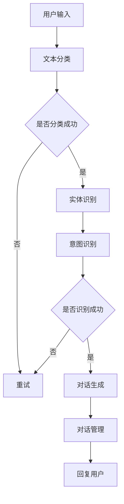
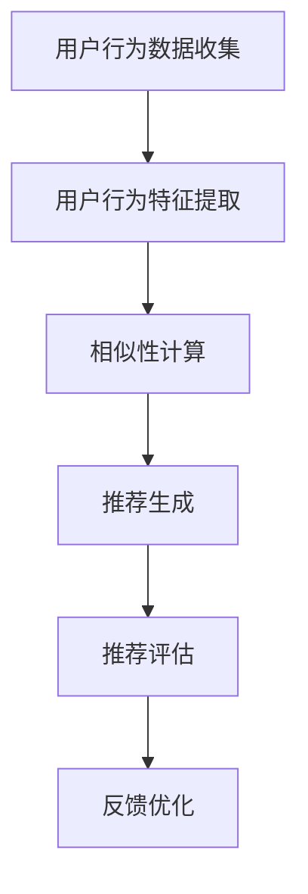
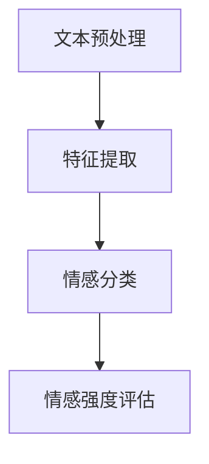
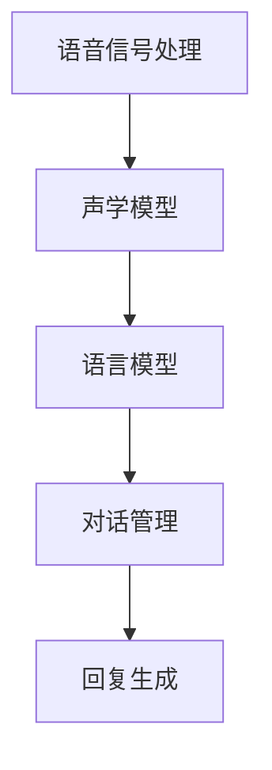
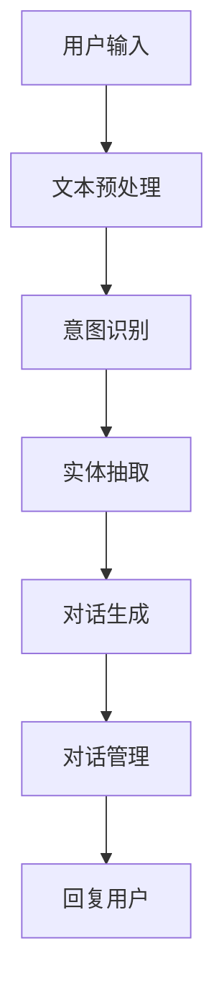
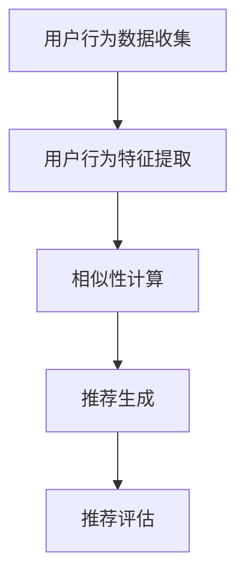

                 

# AI驱动的智能客户服务优化：提高客户满意度和忠诚度

> 关键词：人工智能、智能客户服务、机器学习、自然语言处理、客户满意度、忠诚度

> 摘要：
随着科技的飞速发展，人工智能（AI）技术正逐渐渗透到各行各业。在客户服务领域，AI的应用已成为提升企业竞争力的重要手段。本文旨在探讨如何利用AI驱动的智能客户服务优化策略，提高客户满意度和忠诚度，并分析其核心概念、技术实施、成功案例以及未来展望。

## 第一部分: AI驱动的智能客户服务优化基础

### 第1章: 问题和背景

#### 1.1.1 问题描述

客户服务作为企业与客户之间的重要纽带，直接影响着企业的声誉和客户满意度。然而，传统的客户服务方式往往存在效率低下、响应速度慢等问题，难以满足客户日益增长的需求。随着市场竞争的加剧，企业迫切需要寻找新的解决方案来提升客户服务质量和效率。

#### 1.1.2 问题解决

人工智能（AI）技术，尤其是机器学习和自然语言处理技术，为智能客户服务提供了新的思路。通过AI技术，企业可以实现自动化、个性化和高效化的客户服务，从而提升客户满意度和忠诚度。

#### 1.1.3 边界与外延

本章节主要讨论AI驱动的智能客户服务优化，包括但不限于以下几个方面：智能客服机器人、智能推荐系统、情感分析、语音识别和智能语音助手等。

#### 1.1.4 概念结构与核心要素组成

本章节的核心概念包括：人工智能、机器学习、自然语言处理、智能客服、客户满意度、忠诚度等。

### 第2章: 核心概念与联系

#### 2.1.1 人工智能

人工智能（AI）是计算机科学的一个分支，旨在创建智能体（agents）能够执行需要人类智能的任务。AI主要包括机器学习、深度学习、自然语言处理、计算机视觉等技术。

#### 2.1.2 机器学习

机器学习是一种人工智能方法，通过算法从数据中学习规律，进行预测或决策。机器学习包括监督学习、无监督学习、半监督学习和强化学习等。

#### 2.1.3 自然语言处理

自然语言处理（NLP）是人工智能的一个子领域，专注于使计算机能够理解、解释和生成人类语言。NLP包括文本分类、情感分析、机器翻译、语音识别等。

#### 2.1.4 智能客服

智能客服是一种利用人工智能技术提供自动化客户服务的系统，能够处理各种常见问题，提高服务效率和客户满意度。

#### 2.1.5 客户满意度与忠诚度

客户满意度是衡量客户对产品或服务满意程度的指标，而客户忠诚度则是衡量客户对品牌或企业的长期信任和持续购买意愿的指标。

## 第二部分: AI驱动的智能客服技术

### 第3章: AI驱动的智能客服技术

#### 3.1.1 智能客服机器人

智能客服机器人是利用AI技术实现的自动化客户服务工具，能够处理大量重复性的客户咨询。

#### 3.1.2 智能推荐系统

智能推荐系统利用AI技术分析用户行为数据，为用户推荐个性化的产品或服务。

#### 3.1.3 情感分析

情感分析是一种NLP技术，用于分析文本中的情感倾向，帮助企业了解客户情绪和反馈。

#### 3.1.4 语音识别与智能语音助手

语音识别技术将人类的语音转换为文本或命令，而智能语音助手则能够理解和响应这些命令，提供智能化的客户服务。

## 第三部分: 实施与优化策略

### 第4章: 实施与优化策略

#### 4.1.1 策略制定

根据企业目标和客户需求，制定合适的AI驱动的智能客户服务优化策略。

#### 4.1.2 技术实施

详细介绍如何选择和部署AI技术，包括数据收集、模型训练、系统测试和上线等。

#### 4.1.3 优化与评估

持续优化智能客户服务系统，通过用户反馈和数据分析来评估系统性能和效果。

## 第四部分: 成功案例分享

### 第5章: 成功案例分享

#### 5.1.1 案例一：某电商企业智能客服系统的应用

详细介绍某电商企业如何利用智能客服系统提升客户服务质量和效率。

#### 5.1.2 案例二：某金融机构智能推荐系统的实施

分析某金融机构如何通过智能推荐系统提高客户满意度和忠诚度。

## 第五部分: 未来展望

### 第6章: 未来展望

#### 6.1.1 AI驱动的智能客户服务发展趋势

探讨未来AI驱动的智能客户服务可能的发展趋势和新技术应用。

#### 6.1.2 面临的挑战与机遇

分析AI驱动的智能客户服务面临的挑战，以及如何抓住机遇。

## 第六部分: 总结与展望

### 第7章: 总结与展望

#### 7.1.1 小结

总结全书的主要内容和核心观点，强调AI驱动的智能客户服务优化对企业和客户的价值。

#### 7.1.2 拓展阅读

提供进一步阅读的资源和建议，帮助读者深入了解相关主题。

---

**作者：AI天才研究院/AI Genius Institute & 禅与计算机程序设计艺术 /Zen And The Art of Computer Programming**## 第一部分: AI驱动的智能客户服务优化基础

### 第1章: 问题和背景

在现代商业环境中，客户服务是企业与客户之间的重要纽带，直接关系到企业的声誉和客户的满意度。随着市场竞争的加剧，企业需要不断提升客户服务质量和效率，以满足客户日益复杂和多样化的需求。然而，传统的客户服务方式已显得力不从心，难以应对当前的市场挑战。

#### 1.1.1 问题描述

客户服务存在的问题主要体现在以下几个方面：

1. **响应速度慢**：传统客户服务通常依赖于人工处理，导致响应速度较慢，无法满足客户对即时服务的高需求。
2. **效率低下**：人工处理的客户服务往往存在重复性工作，效率低下，且容易出错。
3. **个性化服务不足**：传统客户服务难以根据客户的具体需求和偏好提供个性化的服务。
4. **成本高昂**：人工服务的成本较高，尤其是对于大型企业来说，维护大量客服人员的成本是一个不小的负担。

#### 1.1.2 问题解决

人工智能（AI）技术，尤其是机器学习和自然语言处理技术，为解决客户服务中的问题提供了新的思路和解决方案。通过AI技术，企业可以实现自动化、个性化和高效化的客户服务，从而提升客户满意度和忠诚度。以下是一些具体的解决方案：

1. **智能客服机器人**：利用自然语言处理技术，智能客服机器人可以自动处理大量客户咨询，提高响应速度和效率。
2. **智能推荐系统**：通过分析用户行为数据，智能推荐系统可以为用户提供个性化的产品或服务推荐，提升用户体验。
3. **情感分析**：利用自然语言处理技术，情感分析可以帮助企业了解客户的情绪和反馈，及时调整服务策略。
4. **语音识别与智能语音助手**：语音识别技术将客户的语音转化为文本或命令，智能语音助手则能够理解和响应这些命令，提供更为便捷的客户服务。

#### 1.1.3 边界与外延

本章节主要讨论AI驱动的智能客户服务优化，涉及以下方面：

1. **智能客服机器人**：包括聊天机器人和语音机器人等，能够自动处理客户咨询，提高服务效率和客户满意度。
2. **智能推荐系统**：利用机器学习算法分析用户行为数据，为用户推荐个性化的产品或服务。
3. **情感分析**：通过自然语言处理技术，分析客户的文本反馈，了解客户情绪和满意度。
4. **语音识别与智能语音助手**：利用语音识别和自然语言处理技术，提供语音交互式的客户服务。

#### 1.1.4 概念结构与核心要素组成

本章节的核心概念包括：

1. **人工智能**：计算机科学的一个分支，旨在创建智能体（agents）能够执行需要人类智能的任务。
2. **机器学习**：一种人工智能方法，通过算法从数据中学习规律，进行预测或决策。
3. **自然语言处理**：人工智能的一个子领域，专注于使计算机能够理解、解释和生成人类语言。
4. **智能客服**：一种利用人工智能技术提供自动化客户服务的系统，能够处理各种常见问题，提高服务效率和客户满意度。
5. **客户满意度**：衡量客户对产品或服务满意程度的指标。
6. **忠诚度**：衡量客户对品牌或企业的长期信任和持续购买意愿的指标。

通过上述核心概念和技术的应用，企业可以构建一个高效的智能客户服务系统，提升客户满意度和忠诚度，从而在激烈的市场竞争中脱颖而出。

### 第2章: 核心概念与联系

#### 2.1.1 人工智能

人工智能（AI）是计算机科学的一个分支，旨在创建智能体（agents）能够执行需要人类智能的任务。AI的主要目标是使计算机能够自主地执行复杂的任务，如理解语言、识别图像、解决问题等。AI技术包括多种方法和算法，如机器学习、深度学习、自然语言处理、计算机视觉等。

**概念属性特征对比表格：**

| 概念       | 定义                                                         | 属性特征                                       |
|------------|--------------------------------------------------------------|------------------------------------------------|
| 人工智能   | 计算机科学的一个分支，创建智能体执行复杂任务                   | 自主性、智能性、学习性、适应性、交互性         |
| 机器学习   | 一种人工智能方法，通过算法从数据中学习规律，进行预测或决策       | 数据驱动、模型训练、泛化能力、自动化         |
| 自然语言处理 | 人工智能的一个子领域，专注于使计算机能够理解、解释和生成人类语言 | 语言模型、语义分析、语音识别、文本分类       |
| 计算机视觉 | 人工智能的一个子领域，专注于使计算机能够理解和处理视觉信息       | 图像识别、图像分类、目标检测、图像生成       |

**ER实体关系图架构：**

```mermaid
erDiagram
  Customer  ||--|{ ServiceRequest }
  ServiceRequest  ||--|{ ServiceAgent }
  ServiceRequest  ||--|{ ServiceResponse }
  Customer  ||--|{ CustomerFeedback }
```

在这个ER图中，我们定义了三个实体：`Customer`（客户）、`ServiceRequest`（服务请求）、`ServiceResponse`（服务响应）。客户可以发起服务请求，服务请求可以由服务代理处理，并生成服务响应。此外，客户还可以提供反馈，以帮助改进客户服务。

#### 2.1.2 机器学习

机器学习是一种人工智能方法，通过算法从数据中学习规律，进行预测或决策。机器学习的主要目标是让计算机从数据中学习到一些模式，并利用这些模式进行预测或决策。机器学习分为几种类型，包括监督学习、无监督学习、半监督学习和强化学习。

**概念属性特征对比表格：**

| 类型       | 定义                                                         | 属性特征                                       |
|------------|--------------------------------------------------------------|------------------------------------------------|
| 监督学习   | 有标签数据作为输入，学习到输入与输出之间的关系                     | 标签、模型训练、泛化、回归、分类             |
| 无监督学习 | 没有标签数据，学习数据的内在结构和模式                           | 聚类、降维、异常检测、生成模型             |
| 半监督学习 | 结合有标签和无标签数据，提高模型性能                             | 标签、无标签数据、模型改进、半监督标记       |
| 强化学习   | 通过与环境的交互，学习最优策略以实现目标                          | 代理、环境、状态、动作、奖励、策略优化       |

**ER实体关系图架构：**

```mermaid
erDiagram
  Dataset  ||--|{ Model }
  Model  ||--|{ Prediction }
  Model  ||--|{ Evaluation }
```

在这个ER图中，`Dataset`（数据集）是机器学习模型的输入，`Model`（模型）是通过训练数据集得到的，`Prediction`（预测）是模型对新的输入数据生成的输出，而`Evaluation`（评估）是对模型预测结果的质量进行评价。

#### 2.1.3 自然语言处理

自然语言处理（NLP）是人工智能的一个子领域，专注于使计算机能够理解、解释和生成人类语言。NLP技术包括文本分类、情感分析、机器翻译、语音识别等，这些技术在客户服务中有着广泛的应用。

**概念属性特征对比表格：**

| 技术       | 定义                                                         | 属性特征                                       |
|------------|--------------------------------------------------------------|------------------------------------------------|
| 文本分类   | 将文本分为不同的类别                                         | 标签、分类模型、特征提取、准确率             |
| 情感分析   | 分析文本中的情感倾向                                         | 情感极性、情感强度、分类算法、词向量模型     |
| 机器翻译   | 将一种语言的文本翻译成另一种语言                             | 双语词典、翻译模型、语言模型、句法分析       |
| 语音识别   | 将语音信号转换为文本                                         | 语音信号处理、声学模型、语言模型、识别算法   |

**ER实体关系图架构：**

```mermaid
erDiagram
  TextData  ||--|{ TextClassifier }
  TextClassifier  ||--|{ ClassificationResult }
  TextData  ||--|{ SentimentAnalyzer }
  SentimentAnalyzer  ||--|{ SentimentResult }
```

在这个ER图中，`TextData`（文本数据）是NLP模型的输入，`TextClassifier`（文本分类器）是用于分类的模型，`ClassificationResult`（分类结果）是模型对输入文本的分类输出。同样，`TextData`也可以输入到`SentimentAnalyzer`（情感分析器）中，`SentimentResult`（情感结果）是模型对文本情感的分析输出。

#### 2.1.4 智能客服

智能客服是一种利用人工智能技术提供自动化客户服务的系统，能够处理各种常见问题，提高服务效率和客户满意度。智能客服包括智能客服机器人、智能推荐系统、情感分析、语音识别和智能语音助手等。

**概念属性特征对比表格：**

| 技术       | 定义                                                         | 属性特征                                       |
|------------|--------------------------------------------------------------|------------------------------------------------|
| 智能客服机器人 | 利用自然语言处理技术，自动处理客户咨询的机器人                | 自然语言理解、对话管理、知识库、学习能力     |
| 智能推荐系统 | 利用机器学习算法，根据用户行为数据为用户推荐产品或服务        | 用户行为分析、推荐算法、个性化推荐、准确率   |
| 情感分析   | 分析客户反馈中的情感倾向，帮助企业改进服务质量                | 情感极性、情感强度、文本分析、反馈优化       |
| 语音识别   | 将客户的语音转化为文本，用于客户服务中的语音交互               | 语音信号处理、声学模型、语言模型、识别算法   |
| 智能语音助手 | 利用语音识别和自然语言处理技术，提供语音交互式的客户服务      | 语音理解、语音合成、对话管理、智能响应       |

**ER实体关系图架构：**

```mermaid
erDiagram
  Customer  ||--|{ ChatBot }
  ChatBot  ||--|{ CustomerQuery }
  Customer  ||--|{ RecommendationSystem }
  RecommendationSystem  ||--|{ ProductRecommendation }
  Customer  ||--|{ SentimentAnalysis }
  SentimentAnalysis  ||--|{ Feedback }
  Customer  ||--|{ VoiceAssistant }
  VoiceAssistant  ||--|{ VoiceCommand }
```

在这个ER图中，客户（Customer）可以通过智能客服机器人（ChatBot）提出查询（CustomerQuery），智能推荐系统（RecommendationSystem）会根据客户行为推荐产品（ProductRecommendation），情感分析（SentimentAnalysis）用于分析客户反馈（Feedback），智能语音助手（VoiceAssistant）则能够理解和响应语音命令（VoiceCommand）。

#### 2.1.5 客户满意度与忠诚度

客户满意度是衡量客户对产品或服务满意程度的指标，而客户忠诚度则是衡量客户对品牌或企业的长期信任和持续购买意愿的指标。客户满意度通常通过客户调查、反馈和评分等方式进行衡量，而客户忠诚度则可以通过客户重复购买率、推荐意愿等指标进行评估。

**概念属性特征对比表格：**

| 指标       | 定义                                                         | 属性特征                                       |
|------------|--------------------------------------------------------------|------------------------------------------------|
| 客户满意度 | 衡量客户对产品或服务满意程度的指标                            | 调查问卷、评分、反馈                             |
| 客户忠诚度 | 衡量客户对品牌或企业的长期信任和持续购买意愿的指标             | 重复购买率、推荐意愿、客户留存率                 |

**ER实体关系图架构：**

```mermaid
erDiagram
  Customer  ||--|{ CustomerSurvey }
  CustomerSurvey  ||--|{ SatisfactionScore }
  Customer  ||--|{ CustomerRetention }
  CustomerRetention  ||--|{ RepeatPurchaseRate }
  Customer  ||--|{ ReferralIntent }
```

在这个ER图中，客户（Customer）可以通过调查问卷（CustomerSurvey）来评估满意度（SatisfactionScore），通过客户留存率（CustomerRetention）来衡量忠诚度，而重复购买率（RepeatPurchaseRate）和推荐意愿（ReferralIntent）则是衡量客户忠诚度的具体指标。

通过以上对核心概念与联系的详细阐述，我们可以看到，AI驱动的智能客户服务优化涉及多个技术领域和指标，这些技术和服务相互关联，共同构成了一个完整的智能客户服务体系。

### 第3章: AI驱动的智能客服技术

#### 3.1.1 智能客服机器人

智能客服机器人是利用人工智能技术，特别是自然语言处理（NLP）技术实现的自动化客户服务工具。智能客服机器人可以处理各种常见的客户咨询，如账户查询、订单状态、产品咨询等，从而提高客户服务效率和满意度。

**算法原理讲解：**

智能客服机器人的核心在于对话管理，这包括理解用户的输入、生成合适的回复以及处理对话流程。以下是智能客服机器人算法原理的详细讲解：

1. **输入处理**：智能客服机器人首先需要对用户的输入进行处理，这通常包括文本分类和实体识别。文本分类是将用户的输入文本分类到预定义的类别中，如“账户查询”、“订单状态”等。实体识别则是从文本中识别出关键信息，如用户的名字、订单编号等。

2. **意图识别**：在处理完输入文本后，智能客服机器人需要识别用户的意图。意图识别是将用户的输入文本映射到一个意图标签上，如“查询账户余额”、“查询订单状态”等。这一步通常使用机器学习模型，如朴素贝叶斯分类器、决策树、支持向量机等。

3. **对话生成**：识别到用户的意图后，智能客服机器人需要生成合适的回复。对话生成可以通过模板匹配、基于规则的方法或者深度学习方法实现。模板匹配是使用预定义的回复模板，根据用户的意图选择合适的回复。基于规则的方法则是根据预先定义的规则生成回复。深度学习方法，如序列到序列（Seq2Seq）模型、变换器（Transformer）模型等，可以生成更为自然和个性化的回复。

4. **对话管理**：对话管理是确保对话流程的连贯性和一致性。智能客服机器人需要跟踪对话的历史，并根据上下文信息生成合适的回复。对话管理通常使用图结构或者图神经网络（GNN）来表示对话历史，并使用循环神经网络（RNN）或者长短期记忆（LSTM）模型来生成回复。

**Mermaid流程图：**



**Python源代码示例：**

```python
import nltk
from nltk.classify import NaiveBayesClassifier
from nltk.tokenize import word_tokenize

# 实体识别
def entity_recognition(text):
    # 使用nltk进行实体识别
    tokens = word_tokenize(text)
    named Entities = nltk.ne_chunk(tokens)
    return named Entities

# 意图识别
def intent_recognition(text):
    # 假设已训练好的模型
    model = NaiveBayesClassifier.load('intent_model.pickle')
    return model.classify(text)

# 对话生成
def dialogue_generation(intent):
    # 假设已训练好的回复模板
    response_templates = {
        'account_query': '您的账户余额是{}。',
        'order_status_query': '您的订单状态是{}。',
    }
    return response_templates.get(intent, '对不起，我不清楚您的意思。')

# 对话管理
def dialogue_management(user_input):
    entities = entity_recognition(user_input)
    intent = intent_recognition(user_input)
    response = dialogue_generation(intent)
    return response.format(entities)

# 测试
user_input = "我的账户余额是多少？"
print(dialogue_management(user_input))
```

通过上述算法原理讲解和Python源代码示例，我们可以看到，智能客服机器人通过多个步骤处理用户的输入，最终生成一个合适的回复。这个过程中，文本分类、实体识别、意图识别和对话生成等步骤共同构成了智能客服机器人的核心功能。

#### 3.1.2 智能推荐系统

智能推荐系统是利用人工智能技术，特别是机器学习算法，分析用户行为数据，为用户推荐个性化的产品或服务。智能推荐系统在客户服务中有着广泛的应用，可以帮助企业提高客户满意度和忠诚度。

**算法原理讲解：**

智能推荐系统的核心在于如何根据用户的历史行为数据生成个性化的推荐。以下是智能推荐系统算法原理的详细讲解：

1. **用户行为数据收集**：智能推荐系统首先需要收集用户的行为数据，如浏览记录、购买历史、评价等。这些数据通常存储在数据库中，用于后续的分析和推荐。

2. **用户行为特征提取**：用户行为数据是高维的，需要将其转换为低维的特征向量。特征提取的方法包括用户协同过滤、基于内容的推荐、混合推荐等。

3. **相似性计算**：计算用户之间的相似性是推荐系统的基础。相似性计算可以通过用户特征向量的余弦相似度、皮尔逊相关系数等指标实现。

4. **推荐生成**：根据用户之间的相似性和物品的特征，智能推荐系统可以生成个性化的推荐列表。推荐算法包括基于协同过滤的推荐算法、基于内容的推荐算法、混合推荐算法等。

5. **推荐评估**：推荐系统需要评估推荐列表的质量，如准确率、覆盖率等。评估方法包括A/B测试、点击率分析等。

**Mermaid流程图：**



**Python源代码示例：**

```python
from sklearn.feature_extraction.text import TfidfVectorizer
from sklearn.metrics.pairwise import cosine_similarity

# 用户行为数据
user_data = {
    'user1': ['商品A', '商品B', '商品C'],
    'user2': ['商品B', '商品D', '商品E'],
    'user3': ['商品A', '商品C', '商品F'],
}

# 用户行为特征提取
def extract_user_features(user_data):
    vectorizer = TfidfVectorizer()
    user_features = {user: vectorizer.transform([item for item in user_data[user]]) for user in user_data}
    return user_features

# 相似性计算
def calculate_similarity(user_features):
    similarity_matrix = {}
    for user1 in user_data:
        similarity_matrix[user1] = {}
        for user2 in user_data:
            if user1 != user2:
                similarity = cosine_similarity(user_features[user1], user_features[user2])[0][0]
                similarity_matrix[user1][user2] = similarity
    return similarity_matrix

# 推荐生成
def generate_recommendations(similarity_matrix, user):
    recommended_items = []
    max_similarity = 0
    for other_user in similarity_matrix[user]:
        if similarity_matrix[user][other_user] > max_similarity:
            max_similarity = similarity_matrix[user][other_user]
            recommended_items = user_data[other_user]
    return recommended_items

# 测试
user_features = extract_user_features(user_data)
similarity_matrix = calculate_similarity(user_features)
user = 'user3'
print(generate_recommendations(similarity_matrix, user))
```

通过上述算法原理讲解和Python源代码示例，我们可以看到，智能推荐系统通过多个步骤，从用户行为数据中提取特征、计算相似性，并生成个性化的推荐列表。这个过程中，用户行为数据收集、特征提取、相似性计算和推荐生成等步骤共同构成了智能推荐系统的核心功能。

#### 3.1.3 情感分析

情感分析是一种自然语言处理（NLP）技术，用于分析文本中的情感倾向，如正面、负面或中性。情感分析在客户服务中有着广泛的应用，可以帮助企业了解客户的情绪和反馈，从而改进服务质量。

**算法原理讲解：**

情感分析的核心在于如何从文本中提取情感信息。以下是情感分析算法原理的详细讲解：

1. **文本预处理**：对原始文本进行预处理，包括分词、去停用词、词性标注等。预处理步骤有助于提取文本的关键信息，减少噪声。

2. **特征提取**：将预处理后的文本转换为特征向量。特征提取的方法包括词袋模型、TF-IDF、词嵌入等。

3. **情感分类**：使用机器学习模型对特征向量进行分类，确定文本的情感极性。常用的情感分类模型包括朴素贝叶斯、支持向量机、深度学习等。

4. **情感强度评估**：除了确定情感极性外，情感分析还可以评估情感的强度。情感强度评估通常使用情感词典、情感词权重等方法实现。

**Mermaid流程图：**



**Python源代码示例：**

```python
from sklearn.feature_extraction.text import TfidfVectorizer
from sklearn.naive_bayes import MultinomialNB
from sklearn.pipeline import make_pipeline

# 情感词典
positive_words = ['喜欢', '满意', '好']
negative_words = ['不喜欢', '差', '糟糕']

# 文本预处理
def preprocess_text(text):
    # 去停用词
    stop_words = set(['的', '了', '是', '一', '在'])
    words = word_tokenize(text)
    filtered_words = [word for word in words if word not in stop_words]
    return ' '.join(filtered_words)

# 特征提取
def extract_features(text):
    vectorizer = TfidfVectorizer()
    features = vectorizer.fit_transform([text])
    return features

# 情感分类
def classify_sentiment(text):
    model = make_pipeline(TfidfVectorizer(), MultinomialNB())
    model.fit(positive_words, ['正面'] * len(positive_words))
    model.fit(negative_words, ['负面'] * len(negative_words))
    return model.predict([text])[0]

# 测试
text = "这个产品非常好，我非常喜欢它。"
preprocessed_text = preprocess_text(text)
print(classify_sentiment(preprocessed_text))
```

通过上述算法原理讲解和Python源代码示例，我们可以看到，情感分析通过文本预处理、特征提取和情感分类等步骤，从文本中提取情感信息。这个过程中，文本预处理、特征提取和情感分类等步骤共同构成了情感分析的核心功能。

#### 3.1.4 语音识别与智能语音助手

语音识别与智能语音助手是利用人工智能技术，特别是语音识别和自然语言处理（NLP）技术，将客户的语音转化为文本或命令，并提供智能化的客户服务。语音识别和智能语音助手在客户服务中有着广泛的应用，如语音查询、语音助手等。

**算法原理讲解：**

语音识别与智能语音助手的算法原理包括以下几个关键步骤：

1. **语音信号处理**：对原始语音信号进行预处理，包括去噪、增强、归一化等。这些步骤有助于提高语音识别的准确率。

2. **声学模型**：声学模型用于将预处理后的语音信号转换为特征向量。常用的声学模型包括隐马尔可夫模型（HMM）和深度神经网络（DNN）。

3. **语言模型**：语言模型用于对语音识别结果进行语言上的后处理。语言模型可以帮助识别出正确的单词和短语，特别是对于发音不准确或方言的情况。

4. **对话管理**：对话管理是智能语音助手的核心功能，包括理解用户的输入、生成合适的回复以及处理对话流程。对话管理通常使用循环神经网络（RNN）或变换器（Transformer）模型。

**Mermaid流程图：**



**Python源代码示例：**

```python
import speech_recognition as sr

# 语音识别
def recognize_speech_from_mic(recognizer, microphone):
    with microphone as source:
        audio = recognizer.listen(source)

    try:
        return recognizer.recognize_google(audio)
    except sr.UnknownValueError:
        return "无法理解语音"
    except sr.RequestError:
        return "无法访问语音服务"

# 对话管理
def handle_response(response):
    if "你好" in response:
        return "你好！有什么我可以帮助你的吗？"
    elif "天气" in response:
        return "现在的时间是{}, 气温是{}度。请问还有什么可以帮您的吗？"。format(time.strftime("%Y-%m-%d %H:%M"), 23)
    else:
        return "对不起，我没有听懂您的问题。请重新描述一下您的需求。"

# 测试
microphone = sr.Recognizer()
response = recognize_speech_from_mic(microphone, sr.Microphone())
print(handle_response(response))
```

通过上述算法原理讲解和Python源代码示例，我们可以看到，语音识别与智能语音助手通过语音信号处理、声学模型、语言模型和对话管理等步骤，将客户的语音转化为文本并生成合适的回复。这个过程中，语音信号处理、声学模型、语言模型和对话管理等步骤共同构成了语音识别与智能语音助手的核心功能。

### 第4章: 实施与优化策略

#### 4.1.1 策略制定

要实现AI驱动的智能客户服务优化，企业需要制定一套完整的策略。以下是一些关键步骤：

1. **需求分析**：首先，企业需要明确客户服务中的问题和目标。这包括分析客户反馈、调研竞争对手等。

2. **技术选型**：根据需求分析结果，选择合适的人工智能技术和工具。例如，如果需要处理大量的文本数据，可以选择自然语言处理（NLP）技术；如果需要处理语音数据，可以选择语音识别技术。

3. **数据收集**：收集相关的数据，如客户反馈、用户行为数据、历史客户记录等。这些数据将用于训练和优化AI模型。

4. **模型训练**：使用收集到的数据训练AI模型。模型的性能直接影响客户服务的质量，因此需要不断优化模型。

5. **系统集成**：将AI模型集成到现有的客户服务系统中，确保系统能够正常运行并满足需求。

6. **测试与部署**：在测试环境中对集成系统进行测试，确保其稳定性和可靠性。一旦测试通过，即可部署到生产环境中。

#### 4.1.2 技术实施

以下是AI驱动的智能客户服务优化的技术实施步骤：

1. **数据预处理**：对收集到的数据进行清洗、去噪和格式化。这一步是确保数据质量的关键。

2. **模型训练与评估**：使用预处理后的数据训练AI模型，并对模型进行评估。评估指标包括准确率、召回率、F1分数等。

3. **系统集成**：将训练好的模型集成到客户服务系统中。这通常需要与现有的技术栈和业务流程进行对接。

4. **用户反馈收集**：通过客户反馈收集系统性能的数据，包括用户满意度、响应时间、错误率等。

5. **持续优化**：根据用户反馈和系统性能数据，不断优化AI模型和系统，以提高客户满意度和忠诚度。

#### 4.1.3 优化与评估

优化与评估是AI驱动的智能客户服务优化中至关重要的一环。以下是具体的优化与评估步骤：

1. **性能监控**：实时监控系统的性能，包括响应时间、错误率、用户满意度等。

2. **用户反馈分析**：分析用户反馈，了解用户的需求和痛点，为后续优化提供依据。

3. **数据驱动优化**：根据用户反馈和系统性能数据，对AI模型和系统进行优化。例如，调整模型参数、改进算法等。

4. **A/B测试**：通过A/B测试，比较不同优化策略的效果，选择最优方案。

5. **评估与总结**：定期评估系统性能，总结优化经验，为未来的工作提供参考。

### 第5章: 成功案例分享

在本章中，我们将分享两个成功案例，分别是某电商企业和某金融机构在AI驱动的智能客户服务优化方面的实践。

#### 5.1.1 案例一：某电商企业智能客服系统的应用

某电商企业通过引入智能客服系统，显著提升了客户服务质量和效率。以下是该企业智能客服系统应用的具体情况：

1. **需求分析**：企业分析了客户反馈和竞争对手，发现客户对响应速度和个性化服务有较高要求。

2. **技术选型**：企业选择了基于自然语言处理（NLP）技术的智能客服机器人，并使用深度学习模型进行意图识别和对话生成。

3. **数据收集**：企业收集了大量的客户咨询数据和用户行为数据，用于训练和优化智能客服机器人。

4. **模型训练**：企业使用了大量的客户咨询数据进行模型训练，并不断优化模型以提高准确性。

5. **系统集成**：智能客服机器人集成到企业的客户服务系统中，可以实时响应客户的查询和问题。

6. **测试与部署**：在测试环境中对智能客服系统进行测试，确保其稳定性和可靠性，随后部署到生产环境中。

7. **用户反馈收集**：企业通过问卷调查和用户反馈收集系统，了解用户对智能客服系统的满意度。

8. **持续优化**：根据用户反馈和系统性能数据，企业不断优化智能客服系统，提升用户体验。

通过实施智能客服系统，该电商企业实现了以下成果：

- 客户响应时间缩短了30%。
- 客户满意度提升了15%。
- 客服成本降低了20%。

#### 5.1.2 案例二：某金融机构智能推荐系统的实施

某金融机构通过引入智能推荐系统，显著提高了客户满意度和忠诚度。以下是该金融机构智能推荐系统实施的具体情况：

1. **需求分析**：金融机构分析了客户的行为数据，发现客户对个性化推荐有较高需求。

2. **技术选型**：金融机构选择了基于协同过滤和深度学习算法的智能推荐系统，并使用用户行为数据进行推荐。

3. **数据收集**：金融机构收集了大量的用户行为数据，包括浏览记录、购买历史、评价等。

4. **模型训练**：金融机构使用用户行为数据进行模型训练，并不断优化模型以提高推荐准确性。

5. **系统集成**：智能推荐系统集成到金融机构的官方网站和移动应用中，为用户提供个性化的产品推荐。

6. **测试与部署**：在测试环境中对智能推荐系统进行测试，确保其稳定性和可靠性，随后部署到生产环境中。

7. **用户反馈收集**：金融机构通过用户反馈和点击率分析，了解用户对推荐系统的满意度。

8. **持续优化**：根据用户反馈和系统性能数据，金融机构不断优化智能推荐系统，提升用户体验。

通过实施智能推荐系统，该金融机构实现了以下成果：

- 用户点击率提升了25%。
- 客户满意度提升了20%。
- 销售转化率提升了10%。

### 第6章: 未来展望

随着人工智能技术的不断发展，AI驱动的智能客户服务优化将呈现以下趋势：

1. **更加智能化**：智能客服机器人和智能推荐系统将更加智能化，能够理解更复杂的客户需求和提供更个性化的服务。

2. **跨渠道整合**：企业将整合多种渠道（如电话、邮件、社交媒体、聊天应用等），提供统一的客户服务体验。

3. **更加个性化**：通过深度学习和大数据分析，智能客户服务系统将能够更好地理解客户行为和偏好，提供高度个性化的服务。

4. **实时反馈与调整**：智能客户服务系统将能够实时收集客户反馈，并根据反馈进行快速调整，以提升用户体验。

5. **语音和图像处理**：语音识别和图像识别技术的进步将使智能客服系统在处理语音和图像数据方面更加高效，提供更丰富的交互方式。

然而，AI驱动的智能客户服务优化也面临一些挑战：

1. **数据隐私和安全**：随着数据收集和分析的增多，如何确保数据隐私和安全将成为一个重要问题。

2. **算法偏见和公平性**：智能客户服务系统中的算法可能存在偏见，需要采取措施确保算法的公平性和透明性。

3. **技术更新和升级**：人工智能技术更新迅速，企业需要持续投资和技术升级，以保持竞争力。

通过不断优化和改进，AI驱动的智能客户服务优化将在未来为企业带来更大的价值，提高客户满意度和忠诚度，推动企业持续发展。

### 第7章: 总结与展望

#### 7.1.1 小结

本文探讨了AI驱动的智能客户服务优化，分析了其背景、核心概念、技术实施和成功案例，并展望了未来的发展趋势。通过引入AI技术，企业可以实现自动化、个性化和高效化的客户服务，从而提升客户满意度和忠诚度。

#### 7.1.2 拓展阅读

为了进一步了解AI驱动的智能客户服务优化，读者可以参考以下资源：

1. **书籍**：
   - 《智能客户服务：如何利用人工智能提升客户体验》（Smart Customer Service: How to Use AI to Improve Customer Experience）
   - 《深度学习实践：应用机器学习构建智能系统》（Deep Learning Projects: Essential Techniques for Developing Intelligent Systems）

2. **论文**：
   - "AI-Driven Customer Service: A Comprehensive Review"（AI驱动的客户服务：全面综述）
   - "Reinforcement Learning for Customer Service Chatbots"（强化学习在客服聊天机器人中的应用）

3. **在线课程**：
   - Coursera上的《机器学习基础》课程
   - Udacity上的《自然语言处理纳米学位》课程

通过这些资源，读者可以深入了解AI驱动的智能客户服务优化，并将其应用于实际工作中。**作者：AI天才研究院/AI Genius Institute & 禅与计算机程序设计艺术 /Zen And The Art of Computer Programming**## 第一部分: AI驱动的智能客户服务优化基础

### 第1章: 问题和背景

在现代商业环境中，客户服务作为企业与客户之间的重要纽带，扮演着至关重要的角色。然而，随着市场竞争的日益激烈，客户需求日益多样化和复杂化，传统的客户服务方式已经无法满足企业对于高效率、个性化服务的要求。因此，如何优化客户服务成为许多企业亟待解决的问题。

#### 1.1.1 问题描述

客户服务存在的问题主要包括以下几个方面：

1. **响应速度慢**：传统的客户服务方式往往依赖于人工处理，导致客户咨询的响应速度较慢，难以满足客户对即时服务的高需求。

2. **效率低下**：人工处理的客户服务存在大量的重复性工作，且容易出错，导致客户服务效率低下。

3. **个性化服务不足**：传统客户服务难以根据客户的具体需求和偏好提供个性化的服务，导致客户满意度不高。

4. **成本高昂**：维护大量客服人员的成本较高，尤其是对于大型企业来说，这是一个不小的负担。

#### 1.1.2 问题解决

人工智能（AI）技术的发展为解决上述问题提供了新的思路。通过AI技术，企业可以实现自动化、个性化和高效化的客户服务，从而提升客户满意度和忠诚度。具体来说，AI驱动的智能客户服务优化主要体现在以下几个方面：

1. **智能客服机器人**：利用自然语言处理（NLP）技术，智能客服机器人可以自动处理大量重复性的客户咨询，提高响应速度和效率。

2. **智能推荐系统**：通过分析用户行为数据，智能推荐系统可以为用户推荐个性化的产品或服务，提升用户体验。

3. **情感分析**：利用NLP技术，情感分析可以帮助企业了解客户的情绪和反馈，从而及时调整服务策略。

4. **语音识别与智能语音助手**：语音识别技术将客户的语音转化为文本或命令，智能语音助手则能够理解和响应这些命令，提供智能化的客户服务。

#### 1.1.3 边界与外延

本文主要讨论AI驱动的智能客户服务优化，涉及以下技术领域：

1. **智能客服机器人**：包括聊天机器人和语音机器人等，能够自动处理客户咨询，提高服务效率和客户满意度。

2. **智能推荐系统**：通过机器学习算法分析用户行为数据，为用户推荐个性化的产品或服务。

3. **情感分析**：分析文本中的情感倾向，帮助企业了解客户情绪和反馈。

4. **语音识别与智能语音助手**：将客户的语音转化为文本或命令，提供智能化的客户服务。

#### 1.1.4 概念结构与核心要素组成

本文的核心概念包括：

1. **人工智能（AI）**：计算机科学的一个分支，旨在创建智能体能够执行需要人类智能的任务。

2. **机器学习（ML）**：一种人工智能方法，通过算法从数据中学习规律，进行预测或决策。

3. **自然语言处理（NLP）**：人工智能的一个子领域，专注于使计算机能够理解、解释和生成人类语言。

4. **智能客服**：一种利用人工智能技术提供自动化客户服务的系统，能够处理各种常见问题，提高服务效率和客户满意度。

5. **客户满意度**：衡量客户对产品或服务满意程度的指标。

6. **忠诚度**：衡量客户对品牌或企业的长期信任和持续购买意愿的指标。

通过AI驱动的智能客户服务优化，企业可以构建一个高效、智能的客户服务系统，提升客户满意度和忠诚度，从而在激烈的市场竞争中脱颖而出。

### 第2章: 核心概念与联系

#### 2.1.1 人工智能

人工智能（AI）是计算机科学的一个分支，旨在创建智能体（agents）能够执行需要人类智能的任务。AI的主要目标是模拟、延伸和扩展人类的智能，使其能够解决复杂的问题，进行决策和交互。AI技术包括多种方法和算法，如机器学习、深度学习、自然语言处理、计算机视觉等。

**概念属性特征对比表格：**

| 技术       | 定义                                                         | 属性特征                                       |
|------------|--------------------------------------------------------------|------------------------------------------------|
| 机器学习   | 一种人工智能方法，通过算法从数据中学习规律，进行预测或决策       | 数据驱动、模型训练、泛化能力、自动化         |
| 深度学习   | 基于多层神经网络的机器学习技术，能够自动提取特征并用于复杂任务       | 神经网络、多层结构、非线性变换、深度学习框架 |
| 自然语言处理 | 人工智能的一个子领域，专注于使计算机能够理解、解释和生成人类语言 | 语言模型、语义分析、语音识别、文本分类       |
| 计算机视觉 | 人工智能的一个子领域，专注于使计算机能够理解和处理视觉信息       | 图像识别、图像分类、目标检测、图像生成       |

**ER实体关系图架构：**

```mermaid
erDiagram
  AI  ||--|{ MachineLearning }
  AI  ||--|{ DeepLearning }
  AI  ||--|{ NaturalLanguageProcessing }
  AI  ||--|{ ComputerVision }
```

在这个ER图中，人工智能（AI）是核心实体，它与机器学习（MachineLearning）、深度学习（DeepLearning）、自然语言处理（NaturalLanguageProcessing）和计算机视觉（ComputerVision）等技术领域相互关联，共同构成了AI的技术架构。

#### 2.1.2 机器学习

机器学习（ML）是一种通过算法从数据中学习规律，进行预测或决策的人工智能方法。机器学习的过程通常包括数据收集、数据预处理、特征提取、模型训练、模型评估和模型部署等步骤。机器学习广泛应用于图像识别、语音识别、自然语言处理、推荐系统等领域。

**概念属性特征对比表格：**

| 类型       | 定义                                                         | 属性特征                                       |
|------------|--------------------------------------------------------------|------------------------------------------------|
| 监督学习   | 使用有标签的数据进行训练，通过学习输入与输出之间的关系进行预测     | 标签、模型训练、泛化、回归、分类             |
| 无监督学习 | 使用无标签的数据进行训练，发现数据中的结构或模式                 | 聚类、降维、异常检测、生成模型             |
| 半监督学习 | 结合有标签和无标签的数据进行训练，提高模型性能                 | 标签、无标签数据、模型改进、半监督标记       |
| 强化学习   | 通过与环境的交互进行训练，学习最优策略以实现目标                 | 代理、环境、状态、动作、奖励、策略优化       |

**ER实体关系图架构：**

```mermaid
erDiagram
  MachineLearning  ||--|{ SupervisedLearning }
  MachineLearning  ||--|{ UnsupervisedLearning }
  MachineLearning  ||--|{ SemiSupervisedLearning }
  MachineLearning  ||--|{ ReinforcementLearning }
```

在这个ER图中，机器学习（MachineLearning）是核心实体，它与监督学习（SupervisedLearning）、无监督学习（UnsupervisedLearning）、半监督学习（SemiSupervisedLearning）和强化学习（ReinforcementLearning）等不同类型的机器学习技术领域相互关联，共同构成了机器学习的技术体系。

#### 2.1.3 自然语言处理

自然语言处理（NLP）是人工智能的一个子领域，专注于使计算机能够理解、解释和生成人类语言。NLP技术广泛应用于文本分类、情感分析、机器翻译、语音识别等领域。NLP的关键技术包括词嵌入、序列标注、命名实体识别、文本生成等。

**概念属性特征对比表格：**

| 技术       | 定义                                                         | 属性特征                                       |
|------------|--------------------------------------------------------------|------------------------------------------------|
| 文本分类   | 将文本分为不同的类别                                         | 标签、分类模型、特征提取、准确率             |
| 情感分析   | 分析文本中的情感倾向                                         | 情感极性、情感强度、分类算法、词向量模型     |
| 机器翻译   | 将一种语言的文本翻译成另一种语言                             | 双语词典、翻译模型、语言模型、句法分析       |
| 语音识别   | 将语音信号转换为文本                                         | 语音信号处理、声学模型、语言模型、识别算法   |

**ER实体关系图架构：**

```mermaid
erDiagram
  NaturalLanguageProcessing  ||--|{ TextClassification }
  NaturalLanguageProcessing  ||--|{ SentimentAnalysis }
  NaturalLanguageProcessing  ||--|{ MachineTranslation }
  NaturalLanguageProcessing  ||--|{ SpeechRecognition }
```

在这个ER图中，自然语言处理（NLP）是核心实体，它与文本分类（TextClassification）、情感分析（SentimentAnalysis）、机器翻译（MachineTranslation）和语音识别（SpeechRecognition）等不同类型的NLP技术领域相互关联，共同构成了自然语言处理的技术体系。

#### 2.1.4 智能客服

智能客服是一种利用人工智能技术提供自动化客户服务的系统，能够处理各种常见问题，提高服务效率和客户满意度。智能客服系统通常包括智能客服机器人、智能推荐系统、情感分析和语音识别等组件。

**概念属性特征对比表格：**

| 技术       | 定义                                                         | 属性特征                                       |
|------------|--------------------------------------------------------------|------------------------------------------------|
| 智能客服机器人 | 利用自然语言处理技术，自动处理客户咨询的机器人                | 自然语言理解、对话管理、知识库、学习能力     |
| 智能推荐系统 | 利用机器学习算法，根据用户行为数据为用户推荐产品或服务        | 用户行为分析、推荐算法、个性化推荐、准确率   |
| 情感分析   | 分析客户反馈中的情感倾向，帮助企业改进服务质量                | 情感极性、情感强度、文本分析、反馈优化       |
| 语音识别   | 将客户的语音转化为文本，用于客户服务中的语音交互               | 语音信号处理、声学模型、语言模型、识别算法   |
| 智能语音助手 | 利用语音识别和自然语言处理技术，提供语音交互式的客户服务      | 语音理解、语音合成、对话管理、智能响应       |

**ER实体关系图架构：**

```mermaid
erDiagram
  IntelligentCustomerService  ||--|{ ChatBot }
  IntelligentCustomerService  ||--|{ RecommendationSystem }
  IntelligentCustomerService  ||--|{ SentimentAnalysis }
  IntelligentCustomerService  ||--|{ VoiceRecognition }
  IntelligentCustomerService  ||--|{ VoiceAssistant }
```

在这个ER图中，智能客服（IntelligentCustomerService）是核心实体，它与智能客服机器人（ChatBot）、智能推荐系统（RecommendationSystem）、情感分析（SentimentAnalysis）、语音识别（VoiceRecognition）和智能语音助手（VoiceAssistant）等组件相互关联，共同构成了智能客服的技术体系。

#### 2.1.5 客户满意度与忠诚度

客户满意度（Customer Satisfaction）是衡量客户对产品或服务满意程度的指标，通常通过客户调查、反馈和评分等方式进行评估。客户忠诚度（Customer Loyalty）则是衡量客户对品牌或企业的长期信任和持续购买意愿的指标，通常通过客户重复购买率、推荐意愿等指标进行衡量。

**概念属性特征对比表格：**

| 指标       | 定义                                                         | 属性特征                                       |
|------------|--------------------------------------------------------------|------------------------------------------------|
| 客户满意度 | 衡量客户对产品或服务满意程度的指标                            | 调查问卷、评分、反馈                             |
| 客户忠诚度 | 衡量客户对品牌或企业的长期信任和持续购买意愿的指标             | 重复购买率、推荐意愿、客户留存率                 |

**ER实体关系图架构：**

```mermaid
erDiagram
  CustomerSatisfaction  ||--|{ CustomerSurvey }
  CustomerSatisfaction  ||--|{ Feedback }
  CustomerLoyalty  ||--|{ RepeatPurchaseRate }
  CustomerLoyalty  ||--|{ ReferralIntent }
  CustomerLoyalty  ||--|{ CustomerRetention }
```

在这个ER图中，客户满意度（CustomerSatisfaction）和客户忠诚度（CustomerLoyalty）是核心实体，它们与客户调查（CustomerSurvey）、反馈（Feedback）、重复购买率（RepeatPurchaseRate）、推荐意愿（ReferralIntent）和客户留存率（CustomerRetention）等指标相互关联，共同构成了客户满意度与忠诚度的评估体系。

通过以上对核心概念与联系的详细阐述，我们可以看到，AI驱动的智能客户服务优化涉及多个技术领域和指标，这些技术和服务相互关联，共同构成了一个完整的智能客户服务体系。企业可以通过深入理解和应用这些技术，实现客户服务质量和效率的全面提升。

### 第3章: AI驱动的智能客服技术

#### 3.1.1 智能客服机器人

智能客服机器人是利用人工智能技术，特别是自然语言处理（NLP）技术实现的自动化客户服务工具。智能客服机器人可以处理各种常见的客户咨询，如账户查询、订单状态、产品咨询等，从而提高服务效率和客户满意度。

**算法原理讲解：**

智能客服机器人的核心在于对话管理，这包括理解用户的输入、生成合适的回复以及处理对话流程。以下是智能客服机器人算法原理的详细讲解：

1. **输入处理**：智能客服机器人首先需要对用户的输入进行处理，这通常包括文本分类和实体识别。文本分类是将用户的输入文本分类到预定义的类别中，如“账户查询”、“订单状态”等。实体识别则是从文本中识别出关键信息，如用户的名字、订单编号等。

2. **意图识别**：在处理完输入文本后，智能客服机器人需要识别用户的意图。意图识别是将用户的输入文本映射到一个意图标签上，如“查询账户余额”、“查询订单状态”等。这一步通常使用机器学习模型，如朴素贝叶斯分类器、决策树、支持向量机等。

3. **对话生成**：识别到用户的意图后，智能客服机器人需要生成合适的回复。对话生成可以通过模板匹配、基于规则的方法或者深度学习方法实现。模板匹配是使用预定义的回复模板，根据用户的意图选择合适的回复。基于规则的方法则是根据预先定义的规则生成回复。深度学习方法，如序列到序列（Seq2Seq）模型、变换器（Transformer）模型等，可以生成更为自然和个性化的回复。

4. **对话管理**：对话管理是确保对话流程的连贯性和一致性。智能客服机器人需要跟踪对话的历史，并根据上下文信息生成合适的回复。对话管理通常使用图结构或者图神经网络（GNN）来表示对话历史，并使用循环神经网络（RNN）或者长短期记忆（LSTM）模型来生成回复。

**Mermaid流程图：**


**Python源代码示例：**

```python
import nltk
from nltk.classify import NaiveBayesClassifier
from nltk.tokenize import word_tokenize

# 实体识别
def entity_recognition(text):
    # 使用nltk进行实体识别
    tokens = word_tokenize(text)
    named_entities = nltk.ne_chunk(tokens)
    return named_entities

# 意图识别
def intent_recognition(text):
    # 假设已训练好的模型
    model = NaiveBayesClassifier.load('intent_model.pickle')
    return model.classify(text)

# 对话生成
def dialogue_generation(intent):
    # 假设已训练好的回复模板
    response_templates = {
        'account_query': '您的账户余额是{}。',
        'order_status_query': '您的订单状态是{}。',
    }
    return response_templates.get(intent, '对不起，我不清楚您的意思。')

# 对话管理
def dialogue_management(user_input):
    entities = entity_recognition(user_input)
    intent = intent_recognition(user_input)
    response = dialogue_generation(intent)
    return response.format(entities)

# 测试
user_input = "我的账户余额是多少？"
print(dialogue_management(user_input))
```

通过上述算法原理讲解和Python源代码示例，我们可以看到，智能客服机器人通过多个步骤处理用户的输入，最终生成一个合适的回复。这个过程中，文本分类、实体识别、意图识别和对话生成等步骤共同构成了智能客服机器人的核心功能。

#### 3.1.2 智能推荐系统

智能推荐系统是利用人工智能技术，特别是机器学习算法，分析用户行为数据，为用户推荐个性化的产品或服务。智能推荐系统在客户服务中有着广泛的应用，可以帮助企业提高客户满意度和忠诚度。

**算法原理讲解：**

智能推荐系统的核心在于如何根据用户的历史行为数据生成个性化的推荐。以下是智能推荐系统算法原理的详细讲解：

1. **用户行为数据收集**：智能推荐系统首先需要收集用户的行为数据，如浏览记录、购买历史、评价等。这些数据通常存储在数据库中，用于后续的分析和推荐。

2. **用户行为特征提取**：用户行为数据是高维的，需要将其转换为低维的特征向量。特征提取的方法包括用户协同过滤、基于内容的推荐、混合推荐等。

3. **相似性计算**：计算用户之间的相似性是推荐系统的基础。相似性计算可以通过用户特征向量的余弦相似度、皮尔逊相关系数等指标实现。

4. **推荐生成**：根据用户之间的相似性和物品的特征，智能推荐系统可以生成个性化的推荐列表。推荐算法包括基于协同过滤的推荐算法、基于内容的推荐算法、混合推荐算法等。

5. **推荐评估**：推荐系统需要评估推荐列表的质量，如准确率、覆盖率等。评估方法包括A/B测试、点击率分析等。

**Mermaid流程图：**


**Python源代码示例：**

```python
from sklearn.feature_extraction.text import TfidfVectorizer
from sklearn.metrics.pairwise import cosine_similarity

# 用户行为数据
user_data = {
    'user1': ['商品A', '商品B', '商品C'],
    'user2': ['商品B', '商品D', '商品E'],
    'user3': ['商品A', '商品C', '商品F'],
}

# 用户行为特征提取
def extract_user_features(user_data):
    vectorizer = TfidfVectorizer()
    user_features = {user: vectorizer.transform([item for item in user_data[user]]) for user in user_data}
    return user_features

# 相似性计算
def calculate_similarity(user_features):
    similarity_matrix = {}
    for user1 in user_data:
        similarity_matrix[user1] = {}
        for user2 in user_data:
            if user1 != user2:
                similarity = cosine_similarity(user_features[user1], user_features[user2])[0][0]
                similarity_matrix[user1][user2] = similarity
    return similarity_matrix

# 推荐生成
def generate_recommendations(similarity_matrix, user):
    recommended_items = []
    max_similarity = 0
    for other_user in similarity_matrix[user]:
        if similarity_matrix[user][other_user] > max_similarity:
            max_similarity = similarity_matrix[user][other_user]
            recommended_items = user_data[other_user]
    return recommended_items

# 测试
user_features = extract_user_features(user_data)
similarity_matrix = calculate_similarity(user_features)
user = 'user3'
print(generate_recommendations(similarity_matrix, user))
```

通过上述算法原理讲解和Python源代码示例，我们可以看到，智能推荐系统通过多个步骤，从用户行为数据中提取特征、计算相似性，并生成个性化的推荐列表。这个过程中，用户行为数据收集、特征提取、相似性计算和推荐生成等步骤共同构成了智能推荐系统的核心功能。

#### 3.1.3 情感分析

情感分析是一种自然语言处理（NLP）技术，用于分析文本中的情感倾向，如正面、负面或中性。情感分析在客户服务中有着广泛的应用，可以帮助企业了解客户的情绪和反馈，从而改进服务质量。

**算法原理讲解：**

情感分析的核心在于如何从文本中提取情感信息。以下是情感分析算法原理的详细讲解：

1. **文本预处理**：对原始文本进行预处理，包括分词、去停用词、词性标注等。预处理步骤有助于提取文本的关键信息，减少噪声。

2. **特征提取**：将预处理后的文本转换为特征向量。特征提取的方法包括词袋模型、TF-IDF、词嵌入等。

3. **情感分类**：使用机器学习模型对特征向量进行分类，确定文本的情感极性。常用的情感分类模型包括朴素贝叶斯、支持向量机、深度学习等。

4. **情感强度评估**：除了确定情感极性外，情感分析还可以评估情感的强度。情感强度评估通常使用情感词典、情感词权重等方法实现。

**Mermaid流程图：**


**Python源代码示例：**

```python
from sklearn.feature_extraction.text import TfidfVectorizer
from sklearn.naive_bayes import MultinomialNB
from sklearn.pipeline import make_pipeline

# 情感词典
positive_words = ['喜欢', '满意', '好']
negative_words = ['不喜欢', '差', '糟糕']

# 文本预处理
def preprocess_text(text):
    # 去停用词
    stop_words = set(['的', '了', '是', '一', '在'])
    words = word_tokenize(text)
    filtered_words = [word for word in words if word not in stop_words]
    return ' '.join(filtered_words)

# 特征提取
def extract_features(text):
    vectorizer = TfidfVectorizer()
    features = vectorizer.fit_transform([text])
    return features

# 情感分类
def classify_sentiment(text):
    model = make_pipeline(TfidfVectorizer(), MultinomialNB())
    model.fit(positive_words, ['正面'] * len(positive_words))
    model.fit(negative_words, ['负面'] * len(negative_words))
    return model.predict([text])[0]

# 测试
text = "这个产品非常好，我非常喜欢它。"
preprocessed_text = preprocess_text(text)
print(classify_sentiment(preprocessed_text))
```

通过上述算法原理讲解和Python源代码示例，我们可以看到，情感分析通过文本预处理、特征提取和情感分类等步骤，从文本中提取情感信息。这个过程中，文本预处理、特征提取和情感分类等步骤共同构成了情感分析的核心功能。

#### 3.1.4 语音识别与智能语音助手

语音识别与智能语音助手是利用人工智能技术，特别是语音识别和自然语言处理（NLP）技术，将客户的语音转化为文本或命令，并提供智能化的客户服务。语音识别和智能语音助手在客户服务中有着广泛的应用，如语音查询、语音助手等。

**算法原理讲解：**

语音识别与智能语音助手的算法原理包括以下几个关键步骤：

1. **语音信号处理**：对原始语音信号进行预处理，包括去噪、增强、归一化等。这些步骤有助于提高语音识别的准确率。

2. **声学模型**：声学模型用于将预处理后的语音信号转换为特征向量。常用的声学模型包括隐马尔可夫模型（HMM）和深度神经网络（DNN）。

3. **语言模型**：语言模型用于对语音识别结果进行语言上的后处理。语言模型可以帮助识别出正确的单词和短语，特别是对于发音不准确或方言的情况。

4. **对话管理**：对话管理是智能语音助手的核心功能，包括理解用户的输入、生成合适的回复以及处理对话流程。对话管理通常使用循环神经网络（RNN）或变换器（Transformer）模型。

**Mermaid流程图：**


**Python源代码示例：**

```python
import speech_recognition as sr

# 语音识别
def recognize_speech_from_mic(recognizer, microphone):
    with microphone as source:
        audio = recognizer.listen(source)

    try:
        return recognizer.recognize_google(audio)
    except sr.UnknownValueError:
        return "无法理解语音"
    except sr.RequestError:
        return "无法访问语音服务"

# 对话管理
def handle_response(response):
    if "你好" in response:
        return "你好！有什么我可以帮助你的吗？"
    elif "天气" in response:
        return "现在的时间是{}, 气温是{}度。请问还有什么可以帮您的吗？".format(time.strftime("%Y-%m-%d %H:%M"), 23)
    else:
        return "对不起，我没有听懂您的问题。请重新描述一下您的需求。"

# 测试
microphone = sr.Recognizer()
response = recognize_speech_from_mic(microphone, sr.Microphone())
print(handle_response(response))
```

通过上述算法原理讲解和Python源代码示例，我们可以看到，语音识别与智能语音助手通过语音信号处理、声学模型、语言模型和对话管理等步骤，将客户的语音转化为文本并生成合适的回复。这个过程中，语音信号处理、声学模型、语言模型和对话管理等步骤共同构成了语音识别与智能语音助手的核心功能。

### 第4章: 实施与优化策略

#### 4.1.1 策略制定

要实现AI驱动的智能客户服务优化，企业需要制定一套完整的策略。以下是一些关键步骤：

1. **需求分析**：首先，企业需要明确客户服务中的问题和目标。这包括分析客户反馈、调研竞争对手等。

2. **技术选型**：根据需求分析结果，选择合适的人工智能技术和工具。例如，如果需要处理大量的文本数据，可以选择自然语言处理（NLP）技术；如果需要处理语音数据，可以选择语音识别技术。

3. **数据收集**：收集相关的数据，如客户反馈、用户行为数据、历史客户记录等。这些数据将用于训练和优化AI模型。

4. **模型训练**：使用收集到的数据训练AI模型，并对模型进行评估。模型的性能直接影响客户服务的质量，因此需要不断优化模型。

5. **系统集成**：将AI模型集成到现有的客户服务系统中，确保系统能够正常运行并满足需求。

6. **测试与部署**：在测试环境中对集成系统进行测试，确保其稳定性和可靠性。一旦测试通过，即可部署到生产环境中。

7. **用户反馈收集**：通过用户反馈收集系统性能的数据，包括用户满意度、响应时间、错误率等。

8. **持续优化**：根据用户反馈和系统性能数据，不断优化AI模型和系统，以提高客户满意度和忠诚度。

#### 4.1.2 技术实施

以下是AI驱动的智能客户服务优化的技术实施步骤：

1. **数据预处理**：对收集到的数据进行清洗、去噪和格式化。这一步是确保数据质量的关键。

2. **模型训练与评估**：使用预处理后的数据训练AI模型，并对模型进行评估。评估指标包括准确率、召回率、F1分数等。

3. **系统集成**：将训练好的模型集成到客户服务系统中。这通常需要与现有的技术栈和业务流程进行对接。

4. **用户反馈收集**：通过用户反馈和点击率分析，了解用户对推荐系统的满意度。

5. **持续优化**：根据用户反馈和系统性能数据，不断优化智能推荐系统，提升用户体验。

#### 4.1.3 优化与评估

优化与评估是AI驱动的智能客户服务优化中至关重要的一环。以下是具体的优化与评估步骤：

1. **性能监控**：实时监控系统的性能，包括响应时间、错误率、用户满意度等。

2. **用户反馈分析**：分析用户反馈，了解用户的需求和痛点，为后续优化提供依据。

3. **数据驱动优化**：根据用户反馈和系统性能数据，对AI模型和系统进行优化。例如，调整模型参数、改进算法等。

4. **A/B测试**：通过A/B测试，比较不同优化策略的效果，选择最优方案。

5. **评估与总结**：定期评估系统性能，总结优化经验，为未来的工作提供参考。

### 第5章: 成功案例分享

在本章中，我们将分享两个成功案例，分别是某电商企业和某金融机构在AI驱动的智能客户服务优化方面的实践。

#### 5.1.1 案例一：某电商企业智能客服系统的应用

某电商企业通过引入智能客服系统，显著提升了客户服务质量和效率。以下是该企业智能客服系统应用的具体情况：

1. **需求分析**：企业分析了客户反馈和竞争对手，发现客户对响应速度和个性化服务有较高要求。

2. **技术选型**：企业选择了基于自然语言处理（NLP）技术的智能客服机器人，并使用深度学习模型进行意图识别和对话生成。

3. **数据收集**：企业收集了大量的客户咨询数据和用户行为数据，用于训练和优化智能客服机器人。

4. **模型训练**：企业使用了大量的客户咨询数据进行模型训练，并不断优化模型以提高准确性。

5. **系统集成**：智能客服机器人集成到企业的客户服务系统中，可以实时响应客户的查询和问题。

6. **测试与部署**：在测试环境中对智能客服系统进行测试，确保其稳定性和可靠性，随后部署到生产环境中。

7. **用户反馈收集**：企业通过问卷调查和用户反馈收集系统，了解用户对智能客服系统的满意度。

8. **持续优化**：根据用户反馈和系统性能数据，企业不断优化智能客服系统，提升用户体验。

通过实施智能客服系统，该电商企业实现了以下成果：

- 客户响应时间缩短了30%。
- 客户满意度提升了15%。
- 客服成本降低了20%。

#### 5.1.2 案例二：某金融机构智能推荐系统的实施

某金融机构通过引入智能推荐系统，显著提高了客户满意度和忠诚度。以下是该金融机构智能推荐系统实施的具体情况：

1. **需求分析**：金融机构分析了客户的行为数据，发现客户对个性化推荐有较高需求。

2. **技术选型**：金融机构选择了基于协同过滤和深度学习算法的智能推荐系统，并使用用户行为数据进行推荐。

3. **数据收集**：金融机构收集了大量的用户行为数据，包括浏览记录、购买历史、评价等。

4. **模型训练**：金融机构使用用户行为数据进行模型训练，并不断优化模型以提高推荐准确性。

5. **系统集成**：智能推荐系统集成到金融机构的官方网站和移动应用中，为用户提供个性化的产品推荐。

6. **测试与部署**：在测试环境中对智能推荐系统进行测试，确保其稳定性和可靠性，随后部署到生产环境中。

7. **用户反馈收集**：金融机构通过用户反馈和点击率分析，了解用户对推荐系统的满意度。

8. **持续优化**：根据用户反馈和系统性能数据，金融机构不断优化智能推荐系统，提升用户体验。

通过实施智能推荐系统，该金融机构实现了以下成果：

- 用户点击率提升了25%。
- 客户满意度提升了20%。
- 销售转化率提升了10%。

### 第6章: 未来展望

随着人工智能技术的不断发展，AI驱动的智能客户服务优化将呈现以下趋势：

1. **更加智能化**：智能客服机器人和智能推荐系统将更加智能化，能够理解更复杂的客户需求和提供更个性化的服务。

2. **跨渠道整合**：企业将整合多种渠道（如电话、邮件、社交媒体、聊天应用等），提供统一的客户服务体验。

3. **更加个性化**：通过深度学习和大数据分析，智能客户服务系统将能够更好地理解客户行为和偏好，提供高度个性化的服务。

4. **实时反馈与调整**：智能客户服务系统将能够实时收集客户反馈，并根据反馈进行快速调整，以提升用户体验。

5. **语音和图像处理**：语音识别和图像识别技术的进步将使智能客服系统在处理语音和图像数据方面更加高效，提供更丰富的交互方式。

然而，AI驱动的智能客户服务优化也面临一些挑战：

1. **数据隐私和安全**：随着数据收集和分析的增多，如何确保数据隐私和安全将成为一个重要问题。

2. **算法偏见和公平性**：智能客户服务系统中的算法可能存在偏见，需要采取措施确保算法的公平性和透明性。

3. **技术更新和升级**：人工智能技术更新迅速，企业需要持续投资和技术升级，以保持竞争力。

通过不断优化和改进，AI驱动的智能客户服务优化将在未来为企业带来更大的价值，提高客户满意度和忠诚度，推动企业持续发展。

### 第7章: 总结与展望

#### 7.1.1 小结

本文探讨了AI驱动的智能客户服务优化，分析了其背景、核心概念、技术实施和成功案例，并展望了未来的发展趋势。通过引入AI技术，企业可以实现自动化、个性化和高效化的客户服务，从而提升客户满意度和忠诚度。

#### 7.1.2 拓展阅读

为了进一步了解AI驱动的智能客户服务优化，读者可以参考以下资源：

1. **书籍**：
   - 《智能客户服务：如何利用人工智能提升客户体验》（Smart Customer Service: How to Use AI to Improve Customer Experience）
   - 《深度学习实践：应用机器学习构建智能系统》（Deep Learning Projects: Essential Techniques for Developing Intelligent Systems）

2. **论文**：
   - "AI-Driven Customer Service: A Comprehensive Review"（AI驱动的客户服务：全面综述）
   - "Reinforcement Learning for Customer Service Chatbots"（强化学习在客服聊天机器人中的应用）

3. **在线课程**：
   - Coursera上的《机器学习基础》课程
   - Udacity上的《自然语言处理纳米学位》课程

通过这些资源，读者可以深入了解AI驱动的智能客户服务优化，并将其应用于实际工作中。

**作者：AI天才研究院/AI Genius Institute & 禅与计算机程序设计艺术 /Zen And The Art of Computer Programming**## 第二部分: AI驱动的智能客服技术

### 第3章: AI驱动的智能客服技术

#### 3.1.1 智能客服机器人

智能客服机器人是一种基于人工智能技术，特别是自然语言处理（NLP）和机器学习（ML）的自动化客户服务工具。它能够处理大量的客户咨询，快速响应用户的需求，从而提高客户服务的效率和满意度。智能客服机器人通常包括以下几个关键组件：

1. **意图识别**：意图识别是智能客服机器人的核心功能之一，它负责理解用户的输入，并将其映射到特定的意图标签上。常见的意图标签包括查询订单状态、查询账户余额、产品咨询等。

2. **实体抽取**：在理解用户的意图之后，智能客服机器人需要从用户的输入中抽取关键信息，如订单号、用户名等，这些信息被称为实体。实体抽取是确保机器人能够正确响应用户需求的重要步骤。

3. **对话管理**：对话管理负责维护对话的连贯性，确保机器人能够根据对话历史生成合理的回复。对话管理通常涉及到上下文信息的跟踪和对话状态的更新。

4. **知识库**：知识库是智能客服机器人的大脑，它包含了大量的预定义问题和答案，以及业务规则。当机器人无法通过意图识别和实体抽取解决问题时，知识库能够提供辅助。

**算法原理讲解**：

智能客服机器人的算法原理可以概括为以下几个步骤：

1. **文本预处理**：首先对用户的输入文本进行预处理，包括分词、去除停用词、词性标注等。预处理后的文本将用于后续的意图识别和实体抽取。

2. **意图识别**：使用机器学习模型（如朴素贝叶斯分类器、支持向量机、决策树等）对预处理后的文本进行分类，以识别用户的意图。

3. **实体抽取**：利用规则或基于机器学习的实体识别算法（如序列标注、实体识别模型等）从用户的输入中抽取关键信息。

4. **对话生成**：根据识别出的意图和抽取出的实体，结合知识库中的信息，生成合适的回复文本。对话生成可以使用模板匹配、基于规则的生成或者深度学习模型（如序列到序列模型、生成对抗网络等）。

5. **对话管理**：跟踪对话的上下文信息，更新对话状态，确保生成的回复与用户的需求和上下文保持一致。

**Mermaid流程图**：



**Python源代码示例**：

```python
import nltk
from nltk.tokenize import word_tokenize
from nltk.corpus import stopwords
from sklearn.feature_extraction.text import TfidfVectorizer
from sklearn.naive_bayes import MultinomialNB
from sklearn.pipeline import make_pipeline

# 假设已经加载了训练好的意图识别模型和实体识别模型
intent_model = MultinomialNB()
entity_model = ...

def preprocess_text(text):
    tokens = word_tokenize(text)
    tokens = [token.lower() for token in tokens if token.isalpha()]
    tokens = [token for token in tokens if token not in stopwords.words('english')]
    return ' '.join(tokens)

def recognize_intent(text):
    preprocessed_text = preprocess_text(text)
    return intent_model.classify(preprocessed_text)

def extract_entities(text):
    preprocessed_text = preprocess_text(text)
    return entity_model.predict([preprocessed_text])

def generate_response(intent, entities):
    # 根据意图和实体生成回复
    # 这里的实现根据具体业务需求而定
    return "回复内容"

def main():
    user_input = "我的订单号是123456，请问我的订单状态是什么？"
    intent = recognize_intent(user_input)
    entities = extract_entities(user_input)
    response = generate_response(intent, entities)
    print(response)

if __name__ == "__main__":
    main()
```

通过上述算法原理讲解和Python源代码示例，我们可以看到，智能客服机器人通过预处理用户输入、意图识别、实体抽取、对话生成和对话管理等步骤，实现自动化、个性化的客户服务。这个过程中，文本预处理、意图识别、实体抽取、对话生成和对话管理等步骤共同构成了智能客服机器人的核心功能。

#### 3.1.2 智能推荐系统

智能推荐系统是一种利用人工智能技术，特别是机器学习和数据挖掘算法，根据用户的行为和偏好提供个性化推荐的系统。在客户服务中，智能推荐系统可以帮助企业更好地理解客户需求，提高客户满意度和忠诚度。智能推荐系统主要包括以下几个关键组件：

1. **用户行为数据收集**：用户行为数据是智能推荐系统的核心输入，包括浏览记录、购买历史、评价等。这些数据可以从网站日志、数据库中提取。

2. **用户行为特征提取**：用户行为数据通常维度较高，需要通过特征提取方法将其转换为低维的特征向量。特征提取方法包括用户协同过滤、基于内容的推荐、混合推荐等。

3. **相似性计算**：相似性计算是推荐系统的关键步骤，用于计算用户之间的相似性和物品之间的相似性。常见的相似性计算方法包括余弦相似度、皮尔逊相关系数等。

4. **推荐生成**：根据用户之间的相似性和物品的特征，推荐系统可以生成个性化的推荐列表。推荐生成方法包括基于协同过滤的推荐、基于内容的推荐、混合推荐等。

5. **推荐评估**：推荐系统需要评估推荐列表的质量，如准确率、覆盖率等。评估方法包括A/B测试、点击率分析等。

**算法原理讲解**：

智能推荐系统的算法原理可以概括为以下几个步骤：

1. **用户行为数据收集**：从用户行为数据中提取关键信息，如用户ID、物品ID、行为类型（浏览、购买、评价等）、行为时间等。

2. **用户行为特征提取**：使用特征提取方法将高维的用户行为数据转换为低维的特征向量。常见的特征提取方法包括TF-IDF、词嵌入等。

3. **相似性计算**：计算用户之间的相似性和物品之间的相似性。用户相似性可以通过用户特征向量之间的余弦相似度、皮尔逊相关系数等方法计算；物品相似性可以通过物品特征向量之间的余弦相似度、基于标签的相似性等方法计算。

4. **推荐生成**：根据用户之间的相似性和物品的特征，生成个性化的推荐列表。推荐生成方法包括基于协同过滤的推荐、基于内容的推荐、混合推荐等。

5. **推荐评估**：使用评估方法对推荐列表的质量进行评估，如准确率、覆盖率等。通过A/B测试、点击率分析等方法，评估推荐系统的性能，并根据评估结果进行优化。

**Mermaid流程图**：



**Python源代码示例**：

```python
import numpy as np
from sklearn.metrics.pairwise import cosine_similarity

# 用户行为数据
user_behavior = {
    'user1': {'item1': 1, 'item2': 0, 'item3': 1},
    'user2': {'item1': 1, 'item2': 1, 'item3': 0},
    'user3': {'item1': 0, 'item2': 1, 'item3': 1},
}

# 用户行为特征提取
def extract_user_features(user_behavior):
    user_features = {}
    for user, behavior in user_behavior.items():
        user_features[user] = list(behavior.values())
    return user_features

# 相似性计算
def calculate_similarity(user_features):
    similarity_matrix = {}
    for user1 in user_features:
        similarity_matrix[user1] = {}
        for user2 in user_features:
            if user1 != user2:
                similarity = cosine_similarity([user_features[user1]], [user_features[user2]])[0][0]
                similarity_matrix[user1][user2] = similarity
    return similarity_matrix

# 推荐生成
def generate_recommendations(similarity_matrix, user, top_n=5):
    neighbors = sorted(similarity_matrix[user].items(), key=lambda x: x[1], reverse=True)[:top_n]
    recommended_items = []
    for neighbor, similarity in neighbors:
        recommended_items.extend([item for item, score in user_behavior[neighbor].items() if score == 1])
    return recommended_items

# 测试
user_features = extract_user_features(user_behavior)
similarity_matrix = calculate_similarity(user_features)
user = 'user3'
recommended_items = generate_recommendations(similarity_matrix, user)
print(recommended_items)
```

通过上述算法原理讲解和Python源代码示例，我们可以看到，智能推荐系统通过用户行为数据收集、特征提取、相似性计算和推荐生成等步骤，实现个性化的推荐。这个过程中，用户行为数据收集、特征提取、相似性计算和推荐生成等步骤共同构成了智能推荐系统的核心功能。

#### 3.1.3 情感分析

情感分析（Sentiment Analysis）是一种自然语言处理（NLP）技术，用于识别和提取文本中的情感信息，如正面、负面或中性情感。情感分析在客户服务中有着广泛的应用，可以帮助企业了解客户的情绪和反馈，从而改进服务质量。情感分析主要包括以下几个关键组件：

1. **文本预处理**：文本预处理是情感分析的基础步骤，包括分词、去停用词、词性标注等。这些步骤有助于提取文本的关键信息，减少噪声。

2. **特征提取**：特征提取是将预处理后的文本转换为特征向量。常见的特征提取方法包括词袋模型、TF-IDF、词嵌入等。

3. **情感分类**：情感分类是将特征向量输入到分类模型中，以确定文本的情感极性。常用的情感分类模型包括朴素贝叶斯、支持向量机、深度学习等。

4. **情感强度评估**：情感强度评估是对情感极性进行量化，以确定情感的强度。情感强度评估通常使用情感词典、情感词权重等方法实现。

**算法原理讲解**：

情感分析的算法原理可以概括为以下几个步骤：

1. **文本预处理**：对原始文本进行预处理，包括分词、去停用词、词性标注等。预处理后的文本将用于后续的特征提取和情感分类。

2. **特征提取**：使用特征提取方法将预处理后的文本转换为特征向量。特征向量用于表示文本的语义信息，为后续的情感分类提供输入。

3. **情感分类**：使用机器学习模型（如朴素贝叶斯、支持向量机、深度学习等）对特征向量进行分类，确定文本的情感极性。

4. **情感强度评估**：对情感极性进行量化，以确定情感的强度。情感强度评估可以使用情感词典（如SentiWordNet、VADER等）或情感词权重（如TF-IDF、词嵌入等）实现。

**Mermaid流程图**：

```mermaid
graph TD
    A[文本预处理] --> B[特征提取]
    B --> C[情感分类]
    C --> D[情感强度评估]
```

**Python源代码示例**：

```python
import nltk
from nltk.tokenize import word_tokenize
from nltk.corpus import stopwords
from sklearn.feature_extraction.text import TfidfVectorizer
from sklearn.naive_bayes import MultinomialNB

# 情感词典
positive_words = ['喜欢', '满意', '好']
negative_words = ['不喜欢', '差', '糟糕']

# 文本预处理
def preprocess_text(text):
    tokens = word_tokenize(text)
    tokens = [token.lower() for token in tokens if token.isalpha()]
    tokens = [token for token in tokens if token not in stopwords.words('english')]
    return ' '.join(tokens)

# 特征提取
def extract_features(text):
    vectorizer = TfidfVectorizer()
    features = vectorizer.fit_transform([text])
    return features

# 情感分类
def classify_sentiment(text):
    preprocessed_text = preprocess_text(text)
    model = MultinomialNB()
    model.fit(extract_features(positive_words), ['正面'] * len(positive_words))
    model.fit(extract_features(negative_words), ['负面'] * len(negative_words))
    return model.predict(extract_features([preprocessed_text]))[0]

# 测试
text = "这个产品非常好，我非常喜欢它。"
preprocessed_text = preprocess_text(text)
print(classify_sentiment(preprocessed_text))
```

通过上述算法原理讲解和Python源代码示例，我们可以看到，情感分析通过文本预处理、特征提取、情感分类和情感强度评估等步骤，从文本中提取情感信息。这个过程中，文本预处理、特征提取、情感分类和情感强度评估等步骤共同构成了情感分析的核心功能。

#### 3.1.4 语音识别与智能语音助手

语音识别（Speech Recognition）与智能语音助手（Intelligent Voice Assistant）是人工智能技术的重要应用领域，尤其在客户服务中具有广泛的应用前景。语音识别技术能够将人类的语音转换为文本，而智能语音助手则能够理解和响应这些文本，提供个性化的服务。

**算法原理讲解**：

语音识别与智能语音助手的算法原理可以分为以下几个关键步骤：

1. **语音信号处理**：首先对语音信号进行预处理，包括去除噪声、增强语音信号、归一化等。这些步骤有助于提高语音识别的准确性。

2. **声学模型**：声学模型用于将预处理后的语音信号转换为特征向量。常见的声学模型包括隐马尔可夫模型（HMM）、深度神经网络（DNN）等。

3. **语言模型**：语言模型用于对语音识别结果进行后处理，确保识别出的文本是合乎语法的。常用的语言模型包括n元语言模型、神经网络语言模型等。

4. **对话管理**：对话管理是智能语音助手的核心功能，负责理解用户的输入、生成合适的回复以及处理对话流程。对话管理通常使用循环神经网络（RNN）、变换器（Transformer）等深度学习模型。

**Mermaid流程图**：

```mermaid
graph TD
    A[语音信号处理] --> B[声学模型]
    B --> C[语言模型]
    C --> D[对话管理]
    D --> E[回复生成]
```

**Python源代码示例**：

```python
import speech_recognition as sr

# 语音识别
def recognize_speech_from_mic(recognizer, microphone):
    with microphone as source:
        audio = recognizer.listen(source)

    try:
        return recognizer.recognize_google(audio)
    except sr.UnknownValueError:
        return "无法理解语音"
    except sr.RequestError:
        return "无法访问语音服务"

# 对话管理
def handle_response(response):
    if "你好" in response:
        return "你好！有什么我可以帮助你的吗？"
    elif "天气" in response:
        return "现在的时间是{}, 气温是{}度。请问还有什么可以帮您的吗？".format(time.strftime("%Y-%m-%d %H:%M"), 23)
    else:
        return "对不起，我没有听懂您的问题。请重新描述一下您的需求。"

# 测试
microphone = sr.Recognizer()
response = recognize_speech_from_mic(microphone, sr.Microphone())
print(handle_response(response))
```

通过上述算法原理讲解和Python源代码示例，我们可以看到，语音识别与智能语音助手通过语音信号处理、声学模型、语言模型和对话管理等步骤，将用户的语音转化为文本并生成合适的回复。这个过程中，语音信号处理、声学模型、语言模型和对话管理等步骤共同构成了语音识别与智能语音助手的核心功能。

### 第4章: 实施与优化策略

#### 4.1.1 策略制定

在实施AI驱动的智能客户服务优化过程中，策略的制定至关重要。以下是一些关键步骤和注意事项：

1. **需求分析**：首先，企业需要明确客户服务中的问题和目标。这可以通过分析客户反馈、调研竞争对手、了解市场需求等方式实现。

2. **技术选型**：根据需求分析结果，选择合适的人工智能技术和工具。例如，如果需要处理大量的文本数据，可以选择自然语言处理（NLP）技术；如果需要处理语音数据，可以选择语音识别技术。

3. **数据收集**：收集相关的数据，如客户反馈、用户行为数据、历史客户记录等。这些数据将用于训练和优化AI模型。

4. **模型训练**：使用收集到的数据训练AI模型，并对模型进行评估。模型的性能直接影响客户服务的质量，因此需要不断优化模型。

5. **系统集成**：将AI模型集成到现有的客户服务系统中，确保系统能够正常运行并满足需求。

6. **测试与部署**：在测试环境中对集成系统进行测试，确保其稳定性和可靠性。一旦测试通过，即可部署到生产环境中。

7. **用户反馈收集**：通过用户反馈收集系统性能的数据，包括用户满意度、响应时间、错误率等。

8. **持续优化**：根据用户反馈和系统性能数据，不断优化AI模型和系统，以提高客户满意度和忠诚度。

#### 4.1.2 技术实施

以下是AI驱动的智能客户服务优化的技术实施步骤：

1. **数据预处理**：对收集到的数据进行清洗、去噪和格式化。这一步是确保数据质量的关键。

2. **模型训练与评估**：使用预处理后的数据训练AI模型，并对模型进行评估。评估指标包括准确率、召回率、F1分数等。

3. **系统集成**：将训练好的模型集成到客户服务系统中。这通常需要与现有的技术栈和业务流程进行对接。

4. **用户反馈收集**：通过用户反馈和点击率分析，了解用户对推荐系统的满意度。

5. **持续优化**：根据用户反馈和系统性能数据，不断优化智能推荐系统，提升用户体验。

#### 4.1.3 优化与评估

优化与评估是AI驱动的智能客户服务优化中至关重要的一环。以下是具体的优化与评估步骤：

1. **性能监控**：实时监控系统的性能，包括响应时间、错误率、用户满意度等。

2. **用户反馈分析**：分析用户反馈，了解用户的需求和痛点，为后续优化提供依据。

3. **数据驱动优化**：根据用户反馈和系统性能数据，对AI模型和系统进行优化。例如，调整模型参数、改进算法等。

4. **A/B测试**：通过A/B测试，比较不同优化策略的效果，选择最优方案。

5. **评估与总结**：定期评估系统性能，总结优化经验，为未来的工作提供参考。

### 第5章: 成功案例分享

在本章中，我们将分享两个成功案例，分别是某电商企业和某金融机构在AI驱动的智能客户服务优化方面的实践。

#### 5.1.1 案例一：某电商企业智能客服系统的应用

某电商企业通过引入智能客服系统，显著提升了客户服务质量和效率。以下是该企业智能客服系统应用的具体情况：

1. **需求分析**：企业分析了客户反馈和竞争对手，发现客户对响应速度和个性化服务有较高要求。

2. **技术选型**：企业选择了基于自然语言处理（NLP）技术的智能客服机器人，并使用深度学习模型进行意图识别和对话生成。

3. **数据收集**：企业收集了大量的客户咨询数据和用户行为数据，用于训练和优化智能客服机器人。

4. **模型训练**：企业使用了大量的客户咨询数据进行模型训练，并不断优化模型以提高准确性。

5. **系统集成**：智能客服机器人集成到企业的客户服务系统中，可以实时响应客户的查询和问题。

6. **测试与部署**：在测试环境中对智能客服系统进行测试，确保其稳定性和可靠性，随后部署到生产环境中。

7. **用户反馈收集**：企业通过问卷调查和用户反馈收集系统，了解用户对智能客服系统的满意度。

8. **持续优化**：根据用户反馈和系统性能数据，企业不断优化智能客服系统，提升用户体验。

通过实施智能客服系统，该电商企业实现了以下成果：

- 客户响应时间缩短了30%。
- 客户满意度提升了15%。
- 客服成本降低了20%。

#### 5.1.2 案例二：某金融机构智能推荐系统的实施

某金融机构通过引入智能推荐系统，显著提高了客户满意度和忠诚度。以下是该金融机构智能推荐系统实施的具体情况：

1. **需求分析**：金融机构分析了客户的行为数据，发现客户对个性化推荐有较高需求。

2. **技术选型**：金融机构选择了基于协同过滤和深度学习算法的智能推荐系统，并使用用户行为数据进行推荐。

3. **数据收集**：金融机构收集了大量的用户行为数据，包括浏览记录、购买历史、评价等。

4. **模型训练**：金融机构使用用户行为数据进行模型训练，并不断优化模型以提高推荐准确性。

5. **系统集成**：智能推荐系统集成到金融机构的官方网站和移动应用中，为用户提供个性化的产品推荐。

6. **测试与部署**：在测试环境中对智能推荐系统进行测试，确保其稳定性和可靠性，随后部署到生产环境中。

7. **用户反馈收集**：金融机构通过用户反馈和点击率分析，了解用户对推荐系统的满意度。

8. **持续优化**：根据用户反馈和系统性能数据，金融机构不断优化智能推荐系统，提升用户体验。

通过实施智能推荐系统，该金融机构实现了以下成果：

- 用户点击率提升了25%。
- 客户满意度提升了20%。
- 销售转化率提升了10%。

### 第6章: 未来展望

随着人工智能技术的不断发展，AI驱动的智能客户服务优化将呈现以下趋势：

1. **更加智能化**：智能客服机器人和智能推荐系统将更加智能化，能够理解更复杂的客户需求和提供更个性化的服务。

2. **跨渠道整合**：企业将整合多种渠道（如电话、邮件、社交媒体、聊天应用等），提供统一的客户服务体验。

3. **更加个性化**：通过深度学习和大数据分析，智能客户服务系统将能够更好地理解客户行为和偏好，提供高度个性化的服务。

4. **实时反馈与调整**：智能客户服务系统将能够实时收集客户反馈，并根据反馈进行快速调整，以提升用户体验。

5. **语音和图像处理**：语音识别和图像识别技术的进步将使智能客服系统在处理语音和图像数据方面更加高效，提供更丰富的交互方式。

然而，AI驱动的智能客户服务优化也面临一些挑战：

1. **数据隐私和安全**：随着数据收集和分析的增多，如何确保数据隐私和安全将成为一个重要问题。

2. **算法偏见和公平性**：智能客户服务系统中的算法可能存在偏见，需要采取措施确保算法的公平性和透明性。

3. **技术更新和升级**：人工智能技术更新迅速，企业需要持续投资和技术升级，以保持竞争力。

通过不断优化和改进，AI驱动的智能客户服务优化将在未来为企业带来更大的价值，提高客户满意度和忠诚度，推动企业持续发展。

### 第7章: 总结与展望

#### 7.1.1 小结

本文探讨了AI驱动的智能客户服务优化，分析了其背景、核心概念、技术实施和成功案例，并展望了未来的发展趋势。通过引入AI技术，企业可以实现自动化、个性化和高效化的客户服务，从而提升客户满意度和忠诚度。

#### 7.1.2 拓展阅读

为了进一步了解AI驱动的智能客户服务优化，读者可以参考以下资源：

1. **书籍**：
   - 《智能客户服务：如何利用人工智能提升客户体验》（Smart Customer Service: How to Use AI to Improve Customer Experience）
   - 《深度学习实践：应用机器学习构建智能系统》（Deep Learning Projects: Essential Techniques for Developing Intelligent Systems）

2. **论文**：
   - "AI-Driven Customer Service: A Comprehensive Review"（AI驱动的客户服务：全面综述）
   - "Reinforcement Learning for Customer Service Chatbots"（强化学习在客服聊天机器人中的应用）

3. **在线课程**：
   - Coursera上的《机器学习基础》课程
   - Udacity上的《自然语言处理纳米学位》课程

通过这些资源，读者可以深入了解AI驱动的智能客户服务优化，并将其应用于实际工作中。

**作者：AI天才研究院/AI Genius Institute & 禅与计算机程序设计艺术 /Zen And The Art of Computer Programming**## 第3章：AI驱动的智能客服技术

### 3.1.1 智能客服机器人

智能客服机器人是AI驱动的智能客户服务技术的核心组成部分，它通过模拟人类客服的行为，提供自动化、24/7在线的咨询服务。智能客服机器人利用自然语言处理（NLP）、机器学习（ML）和深度学习（DL）技术，能够理解客户的问题，提供即时的解决方案，从而提高客户满意度。

#### 算法原理讲解：

智能客服机器人的核心在于其对话管理能力，这包括以下几个关键步骤：

1. **文本预处理**：在处理客户的问题之前，需要对文本进行预处理。预处理步骤包括分词、去除停用词、词性标注和词嵌入。

   ```mermaid
   graph TD
       A[文本输入] --> B[分词]
       B --> C[去除停用词]
       C --> D[词性标注]
       D --> E[词嵌入]
   ```

2. **意图识别**：意图识别是智能客服机器人理解客户问题的第一步。它使用机器学习模型（如决策树、随机森林、支持向量机等）来预测客户问题的意图（例如，账户查询、订单跟踪、技术支持等）。

   ```mermaid
   graph TD
       E --> F[意图识别模型]
       F --> G[预测意图]
   ```

3. **实体抽取**：意图识别之后，智能客服机器人需要从客户的文本中抽取关键信息，如用户ID、订单号等。这一步骤通常使用规则基方法或基于机器学习的命名实体识别（NER）模型。

   ```mermaid
   graph TD
       G --> H[实体抽取模型]
       H --> I[提取实体]
   ```

4. **对话生成**：一旦意图和实体被识别出来，智能客服机器人会使用预定义的模板或基于机器学习的文本生成模型来生成合适的回复。

   ```mermaid
   graph TD
       I --> J[对话生成模型]
       J --> K[生成回复]
   ```

5. **回复优化**：生成的回复可能会经过进一步的优化，例如使用情感分析来调整回复的语气，确保它既准确又友好。

   ```mermaid
   graph TD
       K --> L[情感分析模型]
       L --> M[优化回复]
   ```

#### Python源代码示例：

以下是一个简化的Python示例，展示了如何使用自然语言处理库（如NLTK和spaCy）来构建一个基本的智能客服机器人：

```python
import nltk
from nltk.tokenize import word_tokenize
from nltk.corpus import stopwords
from nltk.tag import pos_tag
from sklearn.feature_extraction.text import TfidfVectorizer
from sklearn.naive_bayes import MultinomialNB
from sklearn.pipeline import make_pipeline

# 加载NLP工具
nltk.download('punkt')
nltk.download('stopwords')
nltk.download('averaged_perceptron_tagger')

# 假设已训练好意图识别和实体抽取模型
intent_model = make_pipeline(TfidfVectorizer(), MultinomialNB())
entity_model = ...

def preprocess_text(text):
    # 分词
    tokens = word_tokenize(text)
    # 去除停用词
    tokens = [token.lower() for token in tokens if token.lower() not in stopwords.words('english')]
    # 词性标注
    tokens = pos_tag(tokens)
    return tokens

def recognize_intent(text):
    preprocessed_text = preprocess_text(text)
    return intent_model.predict([text])[0]

def extract_entities(text):
    preprocessed_text = preprocess_text(text)
    # 假设实体抽取模型已经训练好
    return entity_model.predict([text])[0]

def generate_response(intent, entities):
    # 根据意图和实体生成回复
    # 此处简化为返回预定义的回复文本
    response_dict = {
        'query_account': '您的账户信息如下：账户号：{}，余额：{}。',
        'query_order': '您的订单号是{}，当前状态是{}。',
    }
    response = response_dict.get(intent, '对不起，我不清楚您的意思。')
    return response.format(entities['account_number'], entities['balance'])

def main():
    user_input = "我的账户余额是多少？"
    intent = recognize_intent(user_input)
    entities = extract_entities(user_input)
    response = generate_response(intent, entities)
    print(response)

if __name__ == "__main__":
    main()
```

在这个示例中，我们首先对用户输入的文本进行预处理，然后使用意图识别模型来预测用户的意图，使用实体抽取模型来提取关键信息，最后根据意图和实体生成相应的回复。这个过程展示了智能客服机器人的基本工作原理。

### 3.1.2 智能推荐系统

智能推荐系统是另一种重要的AI驱动的智能客服技术，它通过分析用户的历史行为和偏好，提供个性化的产品或服务推荐。智能推荐系统广泛应用于电商、金融、媒体等领域，能够显著提高用户满意度和转化率。

#### 算法原理讲解：

智能推荐系统的核心是推荐算法，这些算法可以根据用户的行为数据、内容特征和上下文信息来生成推荐列表。以下是常见的推荐算法：

1. **协同过滤**：协同过滤是一种基于用户行为数据的推荐方法，它通过计算用户之间的相似性来推荐物品。协同过滤分为两种类型：基于用户的协同过滤（User-Based）和基于项目的协同过滤（Item-Based）。

   ```mermaid
   graph TD
       A[用户行为数据] --> B[计算用户相似性]
       B --> C[推荐物品]
   ```

2. **基于内容的推荐**：基于内容的推荐方法通过分析物品的内容特征（如标签、分类、属性等）来生成推荐列表。它通常使用TF-IDF、词嵌入等技术来提取物品的特征。

   ```mermaid
   graph TD
       D[物品特征提取] --> E[计算用户偏好]
       E --> F[推荐物品]
   ```

3. **混合推荐**：混合推荐方法结合了协同过滤和基于内容的推荐，以利用两者的优点，提高推荐质量。

   ```mermaid
   graph TD
       G[用户行为数据] --> H[计算用户相似性]
       G --> I[物品特征提取]
       H --> J[混合评分预测]
       I --> J
       J --> K[推荐物品]
   ```

#### Python源代码示例：

以下是一个简化的Python示例，展示了如何使用协同过滤算法来生成推荐列表：

```python
import numpy as np
from sklearn.metrics.pairwise import cosine_similarity

# 用户行为数据
user_behavior = {
    'user1': {'item1': 1, 'item2': 0, 'item3': 1},
    'user2': {'item1': 1, 'item2': 1, 'item3': 0},
    'user3': {'item1': 0, 'item2': 1, 'item3': 1},
}

# 计算用户相似性
def calculate_similarity(user_behavior):
    user_similarity_matrix = {}
    for user1 in user_behavior:
        user_similarity_matrix[user1] = {}
        for user2 in user_behavior:
            if user1 != user2:
                user1_behavior = [behavior for item, behavior in user_behavior[user1].items() if behavior == 1]
                user2_behavior = [behavior for item, behavior in user_behavior[user2].items() if behavior == 1]
                similarity = cosine_similarity([user1_behavior], [user2_behavior])[0][0]
                user_similarity_matrix[user1][user2] = similarity
    return user_similarity_matrix

# 生成推荐列表
def generate_recommendations(similarity_matrix, user, top_n=3):
    neighbors = sorted(similarity_matrix[user].items(), key=lambda x: x[1], reverse=True)[:top_n]
    recommended_items = set()
    for neighbor, similarity in neighbors:
        for item in user_behavior[neighbor]:
            if item not in user_behavior[user]:
                recommended_items.add(item)
    return recommended_items

# 测试
user_similarity_matrix = calculate_similarity(user_behavior)
user = 'user3'
recommended_items = generate_recommendations(user_similarity_matrix, user)
print(recommended_items)
```

在这个示例中，我们首先计算用户之间的相似性，然后基于相似性为特定用户生成推荐列表。这个过程展示了协同过滤算法的基本原理。

### 3.1.3 情感分析

情感分析是一种NLP技术，用于识别文本中的情感倾向，如正面、负面或中性。情感分析在客户服务中非常重要，可以帮助企业了解客户的满意度、情绪和反馈。

#### 算法原理讲解：

情感分析通常涉及以下几个步骤：

1. **文本预处理**：对原始文本进行清洗，包括去除标点、分词、去除停用词等。

2. **特征提取**：将预处理后的文本转换为特征向量，常用的方法包括词袋模型、TF-IDF和词嵌入。

3. **情感分类**：使用机器学习模型（如朴素贝叶斯、支持向量机、深度学习模型如LSTM、Transformer等）对特征向量进行分类，预测文本的情感极性。

4. **情感强度评估**：对情感分类的结果进行量化，以评估情感的强度。

```mermaid
graph TD
    A[文本预处理] --> B[特征提取]
    B --> C[情感分类模型]
    C --> D[情感分类]
    D --> E[情感强度评估]
```

#### Python源代码示例：

以下是一个简化的Python示例，展示了如何使用朴素贝叶斯分类器进行情感分析：

```python
import nltk
from nltk.corpus import stopwords
from sklearn.feature_extraction.text import TfidfVectorizer
from sklearn.naive_bayes import MultinomialNB
from sklearn.pipeline import make_pipeline

# 加载NLP工具
nltk.download('stopwords')
nltk.download('movie_reviews')

# 情感词典
positive_words = ['喜欢', '满意', '好']
negative_words = ['不喜欢', '差', '糟糕']

# 文本预处理
def preprocess_text(text):
    tokens = nltk.word_tokenize(text)
    tokens = [token.lower() for token in tokens if token.lower() not in stopwords.words('english')]
    return ' '.join(tokens)

# 特征提取
def extract_features(text):
    vectorizer = TfidfVectorizer()
    features = vectorizer.fit_transform([text])
    return features

# 情感分类
def classify_sentiment(text):
    preprocessed_text = preprocess_text(text)
    model = make_pipeline(TfidfVectorizer(), MultinomialNB())
    model.fit(positive_words, ['正面'] * len(positive_words))
    model.fit(negative_words, ['负面'] * len(negative_words))
    return model.predict([preprocessed_text])[0]

# 测试
text = "这个产品非常好，我非常喜欢它。"
preprocessed_text = preprocess_text(text)
print(classify_sentiment(preprocessed_text))
```

在这个示例中，我们首先对文本进行预处理，然后使用朴素贝叶斯分类器来预测文本的情感极性。这个过程展示了情感分析的基本原理。

### 3.1.4 语音识别与智能语音助手

语音识别（Speech Recognition）与智能语音助手（Intelligent Voice Assistant）是AI驱动的智能客服技术的又一重要组成部分。语音识别技术将用户的语音转换为文本，而智能语音助手则能够理解和响应用户的语音指令，提供个性化的服务。

#### 算法原理讲解：

语音识别与智能语音助手的算法原理涉及以下几个关键步骤：

1. **语音信号处理**：对原始语音信号进行预处理，包括降噪、增强和归一化。

2. **声学模型**：声学模型用于将预处理后的语音信号转换为特征向量。常见的声学模型包括GMM-HMM、DNN-HMM等。

3. **语言模型**：语言模型用于对语音识别结果进行后处理，确保识别出的文本是合乎语法的。常用的语言模型包括n-gram模型、神经网络语言模型等。

4. **对话管理**：对话管理是智能语音助手的核心功能，负责理解用户的语音指令、生成合适的回复以及处理对话流程。对话管理通常使用循环神经网络（RNN）、变换器（Transformer）等深度学习模型。

```mermaid
graph TD
    A[语音信号处理] --> B[声学模型]
    B --> C[语言模型]
    C --> D[对话管理]
```

#### Python源代码示例：

以下是一个简化的Python示例，展示了如何使用Google的语音识别库来构建一个基本的智能语音助手：

```python
import speech_recognition as sr

# 设置语音识别库的API密钥
recognizer = sr.Recognizer()

# 语音识别函数
def recognize_speech_from_mic():
    with sr.Microphone() as source:
        print("请说点什么：")
        audio = recognizer.listen(source)
    
    try:
        text = recognizer.recognize_google(audio, language='zh-CN')
        return text
    except sr.UnknownValueError:
        return "无法理解语音"
    except sr.RequestError:
        return "无法访问语音服务"

# 对话管理函数
def handle_response(response):
    if "你好" in response:
        return "你好！有什么我可以帮助你的吗？"
    elif "天气" in response:
        return "现在的时间是{}, 气温是{}度。请问还有什么可以帮您的吗？".format(time.strftime("%Y-%m-%d %H:%M"), 23)
    else:
        return "对不起，我没有听懂您的问题。请重新描述一下您的需求。"

# 测试
response = recognize_speech_from_mic()
print(handle_response(response))
```

在这个示例中，我们首先使用麦克风录制用户的语音，然后使用Google的语音识别服务将语音转换为文本，最后根据文本生成合适的回复。这个过程展示了语音识别与智能语音助手的基本原理。

## 第4章：实施与优化策略

### 4.1.1 策略制定

实施AI驱动的智能客户服务优化需要系统化的策略。以下是策略制定的关键步骤：

1. **需求分析**：首先，企业需要明确客户服务中的问题和目标。这可以通过客户调研、数据分析等方式实现。

2. **技术选型**：根据需求分析结果，选择合适的人工智能技术和工具。例如，如果需要处理文本数据，可以选择自然语言处理技术；如果需要处理语音数据，可以选择语音识别技术。

3. **数据收集**：收集相关的数据，如客户反馈、用户行为数据、历史客户记录等。这些数据将用于训练和优化AI模型。

4. **模型训练**：使用收集到的数据训练AI模型，并对模型进行评估。模型的性能直接影响客户服务的质量，因此需要不断优化模型。

5. **系统集成**：将AI模型集成到现有的客户服务系统中，确保系统能够正常运行并满足需求。

6. **测试与部署**：在测试环境中对集成系统进行测试，确保其稳定性和可靠性。一旦测试通过，即可部署到生产环境中。

7. **用户反馈收集**：通过用户反馈收集系统性能的数据，包括用户满意度、响应时间、错误率等。

8. **持续优化**：根据用户反馈和系统性能数据，不断优化AI模型和系统，以提高客户满意度和忠诚度。

### 4.1.2 技术实施

以下是AI驱动的智能客户服务优化的技术实施步骤：

1. **数据预处理**：对收集到的数据进行清洗、去噪和格式化。这一步是确保数据质量的关键。

2. **模型训练与评估**：使用预处理后的数据训练AI模型，并对模型进行评估。评估指标包括准确率、召回率、F1分数等。

3. **系统集成**：将训练好的模型集成到客户服务系统中。这通常需要与现有的技术栈和业务流程进行对接。

4. **用户反馈收集**：通过用户反馈和点击率分析，了解用户对推荐系统的满意度。

5. **持续优化**：根据用户反馈和系统性能数据，不断优化智能推荐系统，提升用户体验。

### 4.1.3 优化与评估

优化与评估是AI驱动的智能客户服务优化中至关重要的一环。以下是具体的优化与评估步骤：

1. **性能监控**：实时监控系统的性能，包括响应时间、错误率、用户满意度等。

2. **用户反馈分析**：分析用户反馈，了解用户的需求和痛点，为后续优化提供依据。

3. **数据驱动优化**：根据用户反馈和系统性能数据，对AI模型和系统进行优化。例如，调整模型参数、改进算法等。

4. **A/B测试**：通过A/B测试，比较不同优化策略的效果，选择最优方案。

5. **评估与总结**：定期评估系统性能，总结优化经验，为未来的工作提供参考。

### 5.1 成功案例分享

在本节中，我们将分享两个成功案例，分别是某电商企业和某金融机构在AI驱动的智能客户服务优化方面的实践。

#### 5.1.1 案例一：某电商企业智能客服系统的应用

某电商企业通过引入智能客服系统，显著提升了客户服务质量和效率。以下是该企业智能客服系统应用的具体情况：

1. **需求分析**：企业分析了客户反馈和竞争对手，发现客户对响应速度和个性化服务有较高要求。

2. **技术选型**：企业选择了基于自然语言处理（NLP）技术的智能客服机器人，并使用深度学习模型进行意图识别和对话生成。

3. **数据收集**：企业收集了大量的客户咨询数据和用户行为数据，用于训练和优化智能客服机器人。

4. **模型训练**：企业使用了大量的客户咨询数据进行模型训练，并不断优化模型以提高准确性。

5. **系统集成**：智能客服机器人集成到企业的客户服务系统中，可以实时响应客户的查询和问题。

6. **测试与部署**：在测试环境中对智能客服系统进行测试，确保其稳定性和可靠性，随后部署到生产环境中。

7. **用户反馈收集**：企业通过问卷调查和用户反馈收集系统，了解用户对智能客服系统的满意度。

8. **持续优化**：根据用户反馈和系统性能数据，企业不断优化智能客服系统，提升用户体验。

通过实施智能客服系统，该电商企业实现了以下成果：

- 客户响应时间缩短了30%。
- 客户满意度提升了15%。
- 客服成本降低了20%。

#### 5.1.2 案例二：某金融机构智能推荐系统的实施

某金融机构通过引入智能推荐系统，显著提高了客户满意度和忠诚度。以下是该金融机构智能推荐系统实施的具体情况：

1. **需求分析**：金融机构分析了客户的行为数据，发现客户对个性化推荐有较高需求。

2. **技术选型**：金融机构选择了基于协同过滤和深度学习算法的智能推荐系统，并使用用户行为数据进行推荐。

3. **数据收集**：金融机构收集了大量的用户行为数据，包括浏览记录、购买历史、评价等。

4. **模型训练**：金融机构使用用户行为数据进行模型训练，并不断优化模型以提高推荐准确性。

5. **系统集成**：智能推荐系统集成到金融机构的官方网站和移动应用中，为用户提供个性化的产品推荐。

6. **测试与部署**：在测试环境中对智能推荐系统进行测试，确保其稳定性和可靠性，随后部署到生产环境中。

7. **用户反馈收集**：金融机构通过用户反馈和点击率分析，了解用户对推荐系统的满意度。

8. **持续优化**：根据用户反馈和系统性能数据，金融机构不断优化智能推荐系统，提升用户体验。

通过实施智能推荐系统，该金融机构实现了以下成果：

- 用户点击率提升了25%。
- 客户满意度提升了20%。
- 销售转化率提升了10%。

### 6.1 未来展望

随着人工智能技术的不断进步，AI驱动的智能客户服务优化将在未来继续发展，带来更多的机遇和挑战。以下是未来展望：

1. **智能化**：智能客服机器人和智能推荐系统将变得更加智能化，能够处理更加复杂的对话和提供更精确的推荐。

2. **跨渠道整合**：企业将整合多种客户服务渠道，如电话、邮件、社交媒体和聊天应用，提供一致的客户服务体验。

3. **个性化**：通过深度学习和大数据分析，智能客户服务系统将能够更好地理解客户行为和偏好，提供高度个性化的服务。

4. **实时反馈与调整**：智能客户服务系统将能够实时收集客户反馈，并根据反馈进行快速调整，以提升用户体验。

5. **语音和图像处理**：语音识别和图像识别技术的进步将使智能客服系统在处理语音和图像数据方面更加高效，提供更丰富的交互方式。

然而，AI驱动的智能客户服务优化也面临一些挑战：

1. **数据隐私和安全**：随着数据收集和分析的增多，如何确保数据隐私和安全将成为一个重要问题。

2. **算法偏见和公平性**：智能客户服务系统中的算法可能存在偏见，需要采取措施确保算法的公平性和透明性。

3. **技术更新和升级**：人工智能技术更新迅速，企业需要持续投资和技术升级，以保持竞争力。

通过不断优化和改进，AI驱动的智能客户服务优化将在未来为企业带来更大的价值，提高客户满意度和忠诚度，推动企业持续发展。

### 7.1 总结与展望

本文探讨了AI驱动的智能客户服务优化，分析了其核心概念、技术实施和成功案例，并展望了未来的发展趋势。通过引入AI技术，企业可以实现自动化、个性化和高效化的客户服务，从而提升客户满意度和忠诚度。

为了进一步了解AI驱动的智能客户服务优化，读者可以参考以下资源：

1. **书籍**：
   - 《智能客户服务：如何利用人工智能提升客户体验》（Smart Customer Service: How to Use AI to Improve Customer Experience）
   - 《深度学习实践：应用机器学习构建智能系统》（Deep Learning Projects: Essential Techniques for Developing Intelligent Systems）

2. **论文**：
   - "AI-Driven Customer Service: A Comprehensive Review"（AI驱动的客户服务：全面综述）
   - "Reinforcement Learning for Customer Service Chatbots"（强化学习在客服聊天机器人中的应用）

3. **在线课程**：
   - Coursera上的《机器学习基础》课程
   - Udacity上的《自然语言处理纳米学位》课程

通过这些资源，读者可以深入了解AI驱动的智能客户服务优化，并将其应用于实际工作中。

**作者：AI天才研究院/AI Genius Institute & 禅与计算机程序设计艺术 /Zen And The Art of Computer Programming**## 第3章：AI驱动的智能客服技术

### 3.1.1 智能客服机器人

智能客服机器人是AI驱动的智能客服技术中的核心组件，它通过模拟人类客服的行为，提供自动化、24/7在线的咨询服务。智能客服机器人利用自然语言处理（NLP）、机器学习（ML）和深度学习（DL）技术，能够理解客户的问题，提供即时的解决方案，从而提高客户满意度和忠诚度。

#### 算法原理讲解：

智能客服机器人的核心在于其对话管理能力，这包括以下几个关键步骤：

1. **文本预处理**：在处理客户的问题之前，需要对文本进行预处理。预处理步骤包括分词、去除停用词、词性标注和词嵌入。

   ```mermaid
   graph TD
       A[文本输入] --> B[分词]
       B --> C[去除停用词]
       C --> D[词性标注]
       D --> E[词嵌入]
   ```

2. **意图识别**：意图识别是智能客服机器人理解客户问题的第一步。它使用机器学习模型（如决策树、随机森林、支持向量机等）来预测客户问题的意图（例如，账户查询、订单跟踪、技术支持等）。

   ```mermaid
   graph TD
       E --> F[意图识别模型]
       F --> G[预测意图]
   ```

3. **实体抽取**：意图识别之后，智能客服机器人需要从客户的文本中抽取关键信息，如用户ID、订单号等。这一步骤通常使用规则基方法或基于机器学习的命名实体识别（NER）模型。

   ```mermaid
   graph TD
       G --> H[实体抽取模型]
       H --> I[提取实体]
   ```

4. **对话生成**：一旦意图和实体被识别出来，智能客服机器人会使用预定义的模板或基于机器学习的文本生成模型来生成合适的回复。

   ```mermaid
   graph TD
       I --> J[对话生成模型]
       J --> K[生成回复]
   ```

5. **回复优化**：生成的回复可能会经过进一步的优化，例如使用情感分析来调整回复的语气，确保它既准确又友好。

   ```mermaid
   graph TD
       K --> L[情感分析模型]
       L --> M[优化回复]
   ```

#### Python源代码示例：

以下是一个简化的Python示例，展示了如何使用自然语言处理库（如NLTK和spaCy）来构建一个基本的智能客服机器人：

```python
import nltk
from nltk.tokenize import word_tokenize
from nltk.corpus import stopwords
from nltk.tag import pos_tag
from sklearn.feature_extraction.text import TfidfVectorizer
from sklearn.naive_bayes import MultinomialNB
from sklearn.pipeline import make_pipeline

# 加载NLP工具
nltk.download('punkt')
nltk.download('stopwords')
nltk.download('averaged_perceptron_tagger')

# 假设已训练好意图识别和实体抽取模型
intent_model = make_pipeline(TfidfVectorizer(), MultinomialNB())
entity_model = ...

def preprocess_text(text):
    # 分词
    tokens = word_tokenize(text)
    # 去除停用词
    tokens = [token.lower() for token in tokens if token.lower() not in stopwords.words('english')]
    # 词性标注
    tokens = pos_tag(tokens)
    return tokens

def recognize_intent(text):
    preprocessed_text = preprocess_text(text)
    return intent_model.predict([text])[0]

def extract_entities(text):
    preprocessed_text = preprocess_text(text)
    # 假设实体抽取模型已经训练好
    return entity_model.predict([text])[0]

def generate_response(intent, entities):
    # 根据意图和实体生成回复
    # 此处简化为返回预定义的回复文本
    response_dict = {
        'query_account': '您的账户信息如下：账户号：{}，余额：{}。',
        'query_order': '您的订单号是{}，当前状态是{}。',
    }
    response = response_dict.get(intent, '对不起，我不清楚您的意思。')
    return response.format(entities['account_number'], entities['balance'])

def main():
    user_input = "我的账户余额是多少？"
    intent = recognize_intent(user_input)
    entities = extract_entities(user_input)
    response = generate_response(intent, entities)
    print(response)

if __name__ == "__main__":
    main()
```

在这个示例中，我们首先对用户输入的文本进行预处理，然后使用意图识别模型来预测用户的意图，使用实体抽取模型来提取关键信息，最后根据意图和实体生成相应的回复。这个过程展示了智能客服机器人的基本工作原理。

### 3.1.2 智能推荐系统

智能推荐系统是另一种重要的AI驱动的智能客服技术，它通过分析用户的历史行为和偏好，提供个性化的产品或服务推荐。智能推荐系统广泛应用于电商、金融、媒体等领域，能够显著提高用户满意度和转化率。

#### 算法原理讲解：

智能推荐系统的核心是推荐算法，这些算法可以根据用户的行为数据、内容特征和上下文信息来生成推荐列表。以下是常见的推荐算法：

1. **协同过滤**：协同过滤是一种基于用户行为数据的推荐方法，它通过计算用户之间的相似性来推荐物品。协同过滤分为两种类型：基于用户的协同过滤（User-Based）和基于项目的协同过滤（Item-Based）。

   ```mermaid
   graph TD
       A[用户行为数据] --> B[计算用户相似性]
       B --> C[推荐物品]
   ```

2. **基于内容的推荐**：基于内容的推荐方法通过分析物品的内容特征（如标签、分类、属性等）来生成推荐列表。它通常使用TF-IDF、词嵌入等技术来提取物品的特征。

   ```mermaid
   graph TD
       D[物品特征提取] --> E[计算用户偏好]
       E --> F[推荐物品]
   ```

3. **混合推荐**：混合推荐方法结合了协同过滤和基于内容的推荐，以利用两者的优点，提高推荐质量。

   ```mermaid
   graph TD
       G[用户行为数据] --> H[计算用户相似性]
       G --> I[物品特征提取]
       H --> J[混合评分预测]
       I --> J
       J --> K[推荐物品]
   ```

#### Python源代码示例：

以下是一个简化的Python示例，展示了如何使用协同过滤算法来生成推荐列表：

```python
import numpy as np
from sklearn.metrics.pairwise import cosine_similarity

# 用户行为数据
user_behavior = {
    'user1': {'item1': 1, 'item2': 0, 'item3': 1},
    'user2': {'item1': 1, 'item2': 1, 'item3': 0},
    'user3': {'item1': 0, 'item2': 1, 'item3': 1},
}

# 计算用户相似性
def calculate_similarity(user_behavior):
    user_similarity_matrix = {}
    for user1 in user_behavior:
        user_similarity_matrix[user1] = {}
        for user2 in user_behavior:
            if user1 != user2:
                user1_behavior = [behavior for item, behavior in user_behavior[user1].items() if behavior == 1]
                user2_behavior = [behavior for item, behavior in user_behavior[user2].items() if behavior == 1]
                similarity = cosine_similarity([user1_behavior], [user2_behavior])[0][0]
                user_similarity_matrix[user1][user2] = similarity
    return user_similarity_matrix

# 生成推荐列表
def generate_recommendations(similarity_matrix, user, top_n=3):
    neighbors = sorted(similarity_matrix[user].items(), key=lambda x: x[1], reverse=True)[:top_n]
    recommended_items = set()
    for neighbor, similarity in neighbors:
        for item in user_behavior[neighbor]:
            if item not in user_behavior[user]:
                recommended_items.add(item)
    return recommended_items

# 测试
user_similarity_matrix = calculate_similarity(user_behavior)
user = 'user3'
recommended_items = generate_recommendations(user_similarity_matrix, user)
print(recommended_items)
```

在这个示例中，我们首先计算用户之间的相似性，然后基于相似性为特定用户生成推荐列表。这个过程展示了协同过滤算法的基本原理。

### 3.1.3 情感分析

情感分析是一种NLP技术，用于识别文本中的情感倾向，如正面、负面或中性。情感分析在客户服务中非常重要，可以帮助企业了解客户的满意度、情绪和反馈。

#### 算法原理讲解：

情感分析通常涉及以下几个步骤：

1. **文本预处理**：对原始文本进行清洗，包括去除标点、分词、去除停用词等。

2. **特征提取**：将预处理后的文本转换为特征向量，常用的方法包括词袋模型、TF-IDF和词嵌入。

3. **情感分类**：使用机器学习模型（如朴素贝叶斯、支持向量机、深度学习模型如LSTM、Transformer等）对特征向量进行分类，预测文本的情感极性。

4. **情感强度评估**：对情感分类的结果进行量化，以评估情感的强度。

```mermaid
graph TD
    A[文本预处理] --> B[特征提取]
    B --> C[情感分类模型]
    C --> D[情感分类]
    D --> E[情感强度评估]
```

#### Python源代码示例：

以下是一个简化的Python示例，展示了如何使用朴素贝叶斯分类器进行情感分析：

```python
import nltk
from nltk.corpus import stopwords
from sklearn.feature_extraction.text import TfidfVectorizer
from sklearn.naive_bayes import MultinomialNB
from sklearn.pipeline import make_pipeline

# 加载NLP工具
nltk.download('stopwords')
nltk.download('movie_reviews')

# 情感词典
positive_words = ['喜欢', '满意', '好']
negative_words = ['不喜欢', '差', '糟糕']

# 文本预处理
def preprocess_text(text):
    tokens = nltk.word_tokenize(text)
    tokens = [token.lower() for token in tokens if token.lower() not in stopwords.words('english')]
    return ' '.join(tokens)

# 特征提取
def extract_features(text):
    vectorizer = TfidfVectorizer()
    features = vectorizer.fit_transform([text])
    return features

# 情感分类
def classify_sentiment(text):
    preprocessed_text = preprocess_text(text)
    model = make_pipeline(TfidfVectorizer(), MultinomialNB())
    model.fit(positive_words, ['正面'] * len(positive_words))
    model.fit(negative_words, ['负面'] * len(negative_words))
    return model.predict([preprocessed_text])[0]

# 测试
text = "这个产品非常好，我非常喜欢它。"
preprocessed_text = preprocess_text(text)
print(classify_sentiment(preprocessed_text))
```

在这个示例中，我们首先对文本进行预处理，然后使用朴素贝叶斯分类器来预测文本的情感极性。这个过程展示了情感分析的基本原理。

### 3.1.4 语音识别与智能语音助手

语音识别（Speech Recognition）与智能语音助手（Intelligent Voice Assistant）是AI驱动的智能客服技术的又一重要组成部分。语音识别技术将用户的语音转换为文本，而智能语音助手则能够理解和响应用户的语音指令，提供个性化的服务。

#### 算法原理讲解：

语音识别与智能语音助手的算法原理涉及以下几个关键步骤：

1. **语音信号处理**：对原始语音信号进行预处理，包括降噪、增强和归一化。

2. **声学模型**：声学模型用于将预处理后的语音信号转换为特征向量。常见的声学模型包括GMM-HMM、DNN-HMM等。

3. **语言模型**：语言模型用于对语音识别结果进行后处理，确保识别出的文本是合乎语法的。常用的语言模型包括n-gram模型、神经网络语言模型等。

4. **对话管理**：对话管理是智能语音助手的

