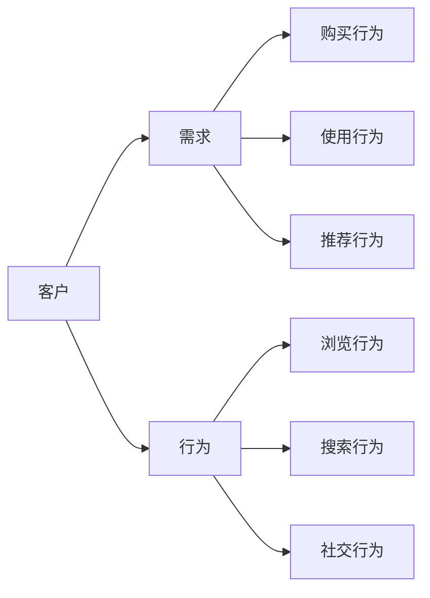
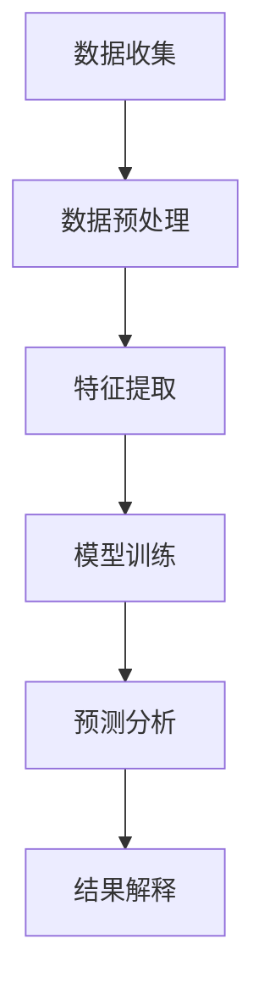
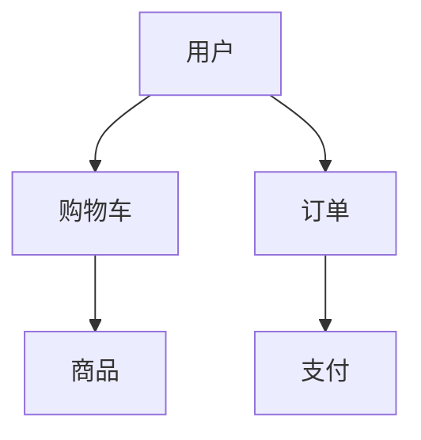
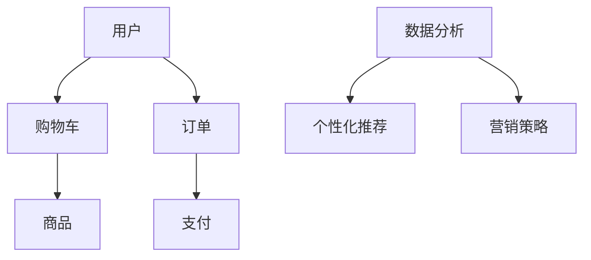
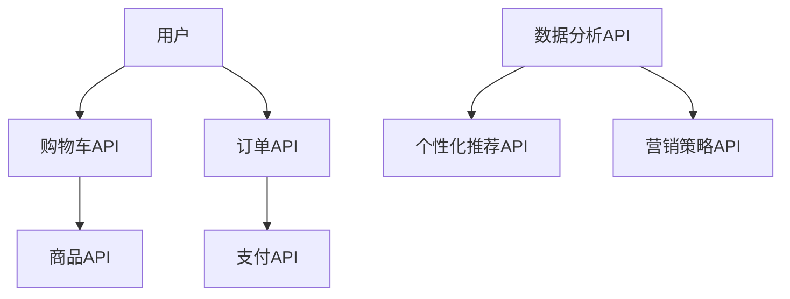
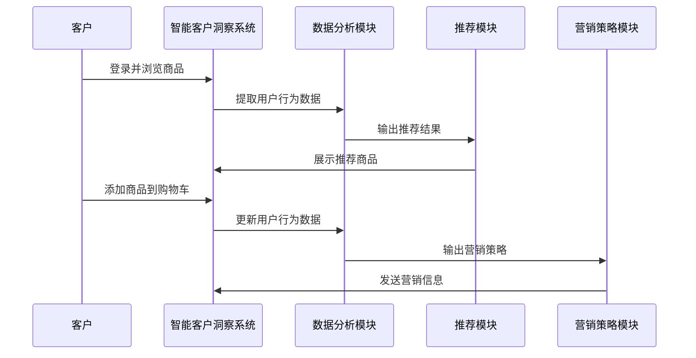

                 

# AI驱动的智能客户洞察：深入理解客户需求和行为

> 关键词：AI、智能客户洞察、客户需求、行为分析、数据分析、客户关系管理

> 摘要：本文将探讨如何利用人工智能技术，深入挖掘客户的需求和行为，从而实现精准的客户洞察。我们将一步步分析AI在客户洞察中的应用，从核心概念到实践案例，为您揭示AI驱动的智能客户洞察的奥秘。

## 引言

在现代商业环境中，客户的需求和行为已成为企业决策的核心驱动力。然而，随着数据量的激增和客户行为的复杂性，传统的客户洞察方法已难以满足企业的需求。人工智能（AI）技术的发展为解决这个问题提供了新的契机。本文将带领您一步步深入了解AI驱动的智能客户洞察，帮助您更好地把握客户需求，提升客户满意度，实现业务的持续增长。

## 1. 背景介绍

### 1.1 问题背景

在数字化时代，客户需求和行为变得更加多样化和复杂。企业需要实时、全面地了解客户的需求和偏好，以便提供个性化的产品和服务。然而，传统的方法往往依赖于有限的客户反馈和抽样调查，难以捕捉到客户的真实需求和行为。

### 1.2 问题描述

客户需求和行为分析的挑战主要体现在以下三个方面：

1. 数据量庞大：企业每天产生的数据量巨大，如何有效地处理和分析这些数据成为一个难题。
2. 数据多样性：客户数据包括结构化和非结构化数据，如何统一处理这些数据是另一个挑战。
3. 客户行为的动态性：客户需求和行为是动态变化的，如何实时捕捉和预测这些变化是企业面临的重要问题。

### 1.3 问题解决

AI技术为解决上述问题提供了新的思路：

1. 数据处理与挖掘：AI技术可以高效地处理和分析海量数据，挖掘出潜在的价值信息。
2. 统一数据格式：通过数据清洗和特征提取，AI技术可以将不同类型的数据统一为结构化数据，便于分析。
3. 实时预测与分析：基于机器学习和深度学习算法，AI技术可以实时捕捉客户行为的动态变化，并进行预测和分析。

### 1.4 边界与外延

虽然AI技术在客户洞察中具有巨大潜力，但企业也需要注意以下边界和问题：

1. 数据隐私与安全：在利用客户数据进行AI分析时，企业需要确保数据的隐私和安全。
2. 数据质量：高质量的数据是AI分析的基础，企业需要确保数据的准确性、完整性和一致性。
3. 模型解释性：AI模型的解释性是一个挑战，企业需要了解模型的决策过程，以便更好地应用和优化。

### 1.5 概念结构与核心要素组成

在AI驱动的智能客户洞察中，核心概念和要素包括：

1. 客户数据：包括客户的基本信息、购买记录、浏览行为等。
2. 数据预处理：包括数据清洗、数据转换、特征提取等。
3. 机器学习模型：包括分类、回归、聚类、推荐等模型。
4. 深度学习模型：包括卷积神经网络（CNN）、循环神经网络（RNN）、生成对抗网络（GAN）等。
5. 数据可视化：通过图表和可视化工具，帮助企业更好地理解和解读分析结果。

## 2. 核心概念与联系

### 2.1 核心概念原理

1. 客户需求：指客户在购买产品或服务时所期望获得的价值和满足感。
2. 客户行为：指客户在购买、使用、推荐产品或服务过程中的行为表现。
3. 数据分析：通过对客户数据的处理和分析，挖掘出客户需求和行为模式。
4. 机器学习：一种人工智能技术，通过训练模型，让计算机自主学习和预测。
5. 深度学习：一种复杂的机器学习算法，通过多层神经网络模拟人脑学习过程。

### 2.2 概念属性特征对比表格

| 概念       | 属性特征                                     | 相互关系                                       |
| ---------- | ---------------------------------------- | -------------------------------------------- |
| 客户需求   | 价值、满足感、个性化需求                   | 客户行为的驱动力，影响客户购买决策               |
| 客户行为   | 购买行为、使用行为、推荐行为                | 反映客户需求实现的过程，为数据分析提供依据         |
| 数据分析   | 数据预处理、特征提取、模型训练、结果解释     | 对客户数据进行分析，挖掘客户需求和行为模式         |
| 机器学习   | 自主学习、模型训练、预测分析               | 基于数据分析，实现客户需求和行为预测               |
| 深度学习   | 复杂神经网络、自主学习、深度特征提取         | 机器学习的延伸，提高模型预测精度和解释能力           |

### 2.3 ER实体关系图架构



## 3. 算法原理讲解

### 3.1 算法mermaid流程图



### 3.2 算法原理与数学模型

#### 3.2.1 数据预处理

数据预处理包括数据清洗、数据转换和特征提取。其中，特征提取是关键步骤，可以通过以下公式实现：

$$ 特征 = f(数据) $$

其中，$f$ 表示特征提取函数，$数据$ 表示原始数据。

#### 3.2.2 模型训练

模型训练基于机器学习和深度学习算法，其中，深度学习算法包括卷积神经网络（CNN）和循环神经网络（RNN）等。以CNN为例，其数学模型为：

$$ 输出 = f(输入，参数) $$

其中，$f$ 表示神经网络函数，$输入$ 表示输入数据，$参数$ 表示神经网络参数。

#### 3.2.3 预测分析

基于训练好的模型，可以对新数据进行预测分析。以分类问题为例，其数学模型为：

$$ 预测结果 = argmax(模型(输入)) $$

其中，$模型$ 表示训练好的分类模型，$输入$ 表示待预测的数据。

### 3.3 举例说明

假设我们有一个客户数据集，包含客户的年龄、性别、收入和购买记录。通过数据预处理、特征提取和模型训练，我们可以预测客户的购买概率。具体步骤如下：

1. 数据预处理：对数据进行清洗和归一化处理。
2. 特征提取：提取客户的年龄、性别、收入和购买记录等特征。
3. 模型训练：使用卷积神经网络（CNN）对特征进行训练，得到一个分类模型。
4. 预测分析：对新的客户数据进行预测，输出购买概率。

## 4. 系统分析与架构设计方案

### 4.1 问题场景介绍

某电子商务平台希望通过AI技术对客户的购买行为进行分析，以实现个性化推荐和精准营销。

### 4.2 项目介绍

本项目旨在构建一个基于AI驱动的智能客户洞察系统，实现对客户需求和行为的高效分析和预测。

### 4.3 系统功能设计

#### 4.3.1 领域模型mermaid类图



#### 4.3.2 系统架构设计



#### 4.3.3 系统接口设计



#### 4.3.4 系统交互mermaid序列图



## 5. 项目实战

### 5.1 环境安装

在本地或云端服务器上安装以下软件和工具：

1. Python 3.8
2. TensorFlow 2.6
3. scikit-learn 0.24
4. pandas 1.3.3
5. numpy 1.21

### 5.2 系统核心实现源代码

```python
# 数据预处理
import pandas as pd
from sklearn.model_selection import train_test_split
from sklearn.preprocessing import StandardScaler

# 加载数据集
data = pd.read_csv('customer_data.csv')

# 数据清洗和预处理
data = data.dropna()
X = data[['age', 'gender', 'income']]
y = data['purchase']

# 数据标准化
scaler = StandardScaler()
X = scaler.fit_transform(X)

# 划分训练集和测试集
X_train, X_test, y_train, y_test = train_test_split(X, y, test_size=0.2, random_state=42)

# 模型训练
from tensorflow.keras.models import Sequential
from tensorflow.keras.layers import Dense, Conv2D, Flatten

model = Sequential()
model.add(Conv2D(32, kernel_size=(3, 3), activation='relu', input_shape=(X_train.shape[1], 1)))
model.add(Flatten())
model.add(Dense(1, activation='sigmoid'))

model.compile(optimizer='adam', loss='binary_crossentropy', metrics=['accuracy'])
model.fit(X_train, y_train, epochs=10, batch_size=32)

# 预测分析
predictions = model.predict(X_test)

# 结果解释
import numpy as np
from sklearn.metrics import accuracy_score, precision_score, recall_score, f1_score

accuracy = accuracy_score(y_test, predictions)
precision = precision_score(y_test, predictions)
recall = recall_score(y_test, predictions)
f1 = f1_score(y_test, predictions)

print('Accuracy:', accuracy)
print('Precision:', precision)
print('Recall:', recall)
print('F1 Score:', f1)
```

### 5.3 代码应用解读与分析

1. 数据预处理：使用pandas和scikit-learn进行数据清洗、预处理和标准化。
2. 模型训练：使用TensorFlow构建卷积神经网络（CNN）进行训练。
3. 预测分析：使用训练好的模型对新数据进行预测，并计算准确率、精确率、召回率和F1分数等指标。
4. 结果解释：对预测结果进行分析和解读，为企业提供决策支持。

### 5.4 实际案例分析和详细讲解剖析

#### 案例一：某电商平台个性化推荐系统

某电商平台希望通过AI技术对客户的购物行为进行分析，实现个性化推荐。

1. 数据收集：收集客户的购买记录、浏览记录、搜索记录等数据。
2. 数据预处理：对数据进行清洗、去重、归一化等处理。
3. 特征提取：提取客户的年龄、性别、收入等特征，以及商品的种类、价格、销量等特征。
4. 模型训练：使用深度学习算法（如卷积神经网络、循环神经网络等）进行训练。
5. 预测分析：对新客户的数据进行预测，输出推荐结果。
6. 结果解释：根据预测结果，向客户推荐合适的商品。

#### 案例二：某银行客户行为分析系统

某银行希望通过AI技术对客户的金融行为进行分析，提高风险管理和营销策略。

1. 数据收集：收集客户的交易记录、贷款记录、信用卡使用情况等数据。
2. 数据预处理：对数据进行清洗、去重、归一化等处理。
3. 特征提取：提取客户的年龄、性别、收入等特征，以及交易金额、交易时间、交易频率等特征。
4. 模型训练：使用机器学习算法（如决策树、随机森林等）进行训练。
5. 预测分析：对新客户的交易行为进行预测，输出风险评分和营销推荐。
6. 结果解释：根据预测结果，为企业提供决策支持，如调整风险控制策略、优化营销策略等。

### 5.5 项目小结

本项目通过AI驱动的智能客户洞察，实现了对客户需求和行为的高效分析和预测。在实际应用中，企业可以根据预测结果，制定个性化的营销策略、优化产品和服务，提高客户满意度和忠诚度，实现业务的持续增长。

## 6. 最佳实践 Tips

1. 确保数据质量：在利用客户数据进行AI分析时，企业需要确保数据的准确性、完整性和一致性。
2. 关注数据隐私：在收集、处理和分析客户数据时，企业需要遵守相关法律法规，确保客户数据的隐私和安全。
3. 不断迭代优化：AI驱动的智能客户洞察系统需要不断迭代优化，以适应客户需求和行为的变化。
4. 综合运用多种算法：根据实际需求和数据特点，选择合适的机器学习算法和深度学习算法，提高预测精度和解释能力。
5. 重视结果解释：对预测结果进行深入分析和解读，为企业提供有价值的决策支持。

## 7. 小结

AI驱动的智能客户洞察已成为企业提升竞争力的重要手段。通过深入挖掘客户的需求和行为，企业可以实现个性化营销、优化产品和服务，提高客户满意度和忠诚度。未来，随着AI技术的不断发展，智能客户洞察将为企业带来更多的商业价值。

## 8. 注意事项

1. 在实施AI驱动的智能客户洞察项目时，企业需要充分了解客户的需求和痛点，确保项目的可行性和有效性。
2. 注意保护客户数据隐私，遵守相关法律法规，避免数据泄露和滥用。
3. 持续优化模型和算法，提高预测精度和解释能力，确保智能客户洞察系统的稳定性和可靠性。

## 9. 拓展阅读

1. 《深度学习： convex optimization approach》
2. 《Recommender Systems Handbook》
3. 《Customer Analytics: A Data-Driven Approach》
4. 《Big Data Analytics: Theories, Methods, and Applications》
5. 《AI in Customer Analytics: Transforming Business and Marketing》

---

作者：AI天才研究院/AI Genius Institute & 禅与计算机程序设计艺术 /Zen And The Art of Computer Programming

