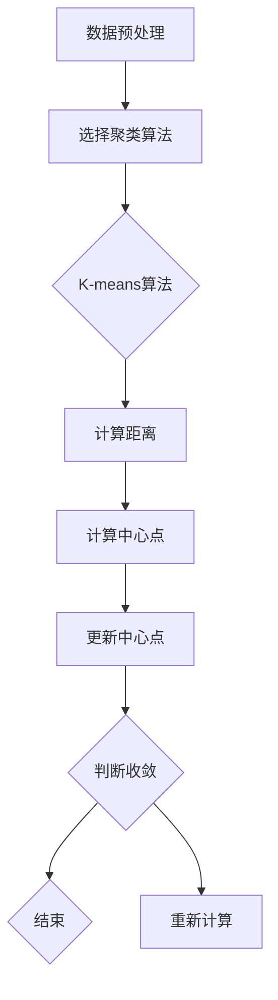
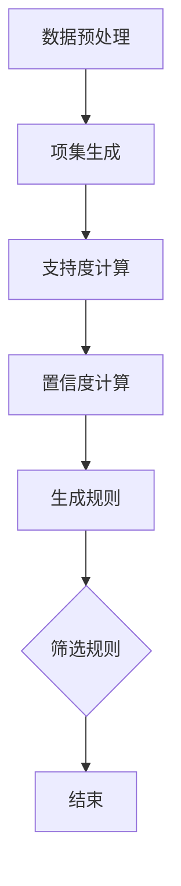
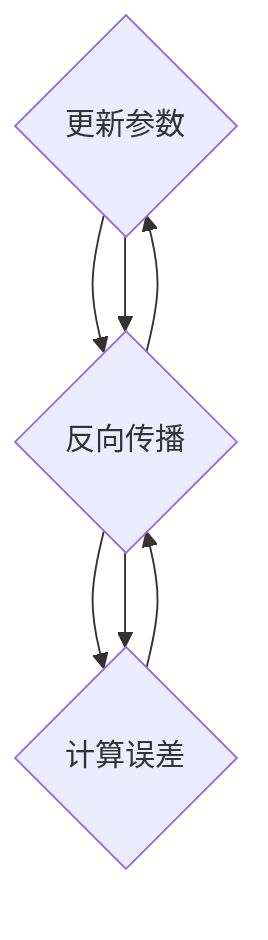
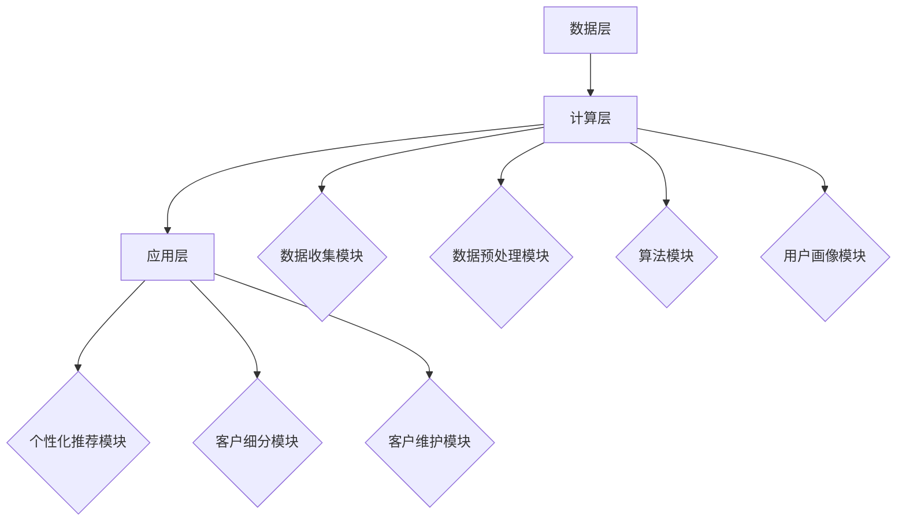
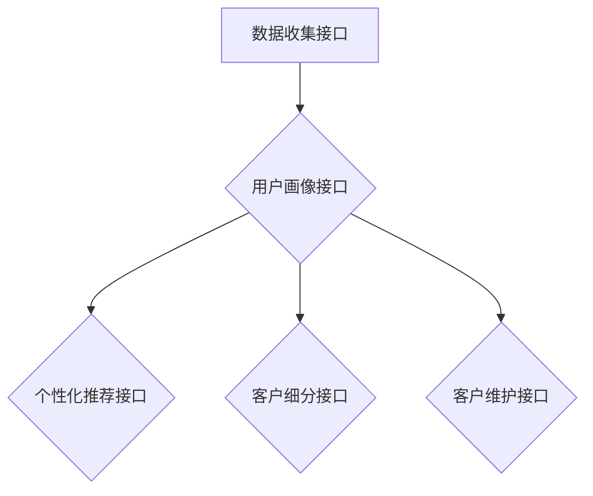
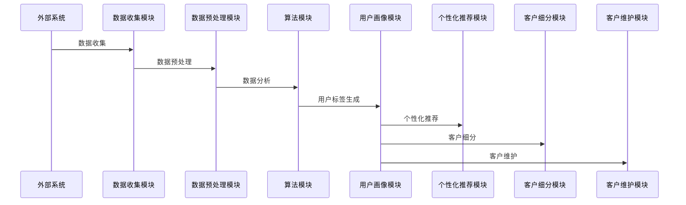

                 

### 文章标题

# AI驱动的智能客户画像：深化用户洞察和个性化服务

### 关键词

- AI
- 客户画像
- 个性化服务
- 大数据
- 机器学习
- 深度学习
- 用户洞察

### 摘要

本文旨在探讨AI驱动的智能客户画像技术，通过深入分析用户行为数据和属性数据，实现用户标签的精准打标，进而为个性化服务提供有力支撑。文章首先介绍了AI、大数据、机器学习和深度学习等核心概念及其联系，然后详细讲解了聚类算法、关联规则挖掘和神经网络等常见算法的原理及实现。接着，通过对系统功能、架构、接口和交互设计进行分析，展示了智能客户画像系统的全貌。最后，通过实战案例，验证了算法在实际应用中的效果，并提出了最佳实践建议，为读者提供了有价值的参考。

## 引言

### 问题背景与挑战

随着互联网的普及和电子商务的迅猛发展，企业对于客户洞察的需求愈发迫切。客户是企业发展的核心资源，了解客户的需求、行为和偏好，对于提升用户体验、增加客户满意度和提高转化率至关重要。传统的客户画像方法主要依赖于人工分析，存在数据覆盖面有限、更新周期长、数据准确性差等问题，难以满足现代企业对于客户洞察的实时性和精准性要求。

AI驱动的智能客户画像则能够通过收集和分析大量的用户行为数据和属性数据，利用机器学习和深度学习算法，对用户进行精准的标签打标，从而实现深度的用户洞察。智能客户画像不仅能够帮助企业更好地了解客户，还可以为个性化服务提供有力支撑，从而提升客户体验和满意度，增加企业的竞争力。

### 智能客户画像的定义与目标

智能客户画像是指通过人工智能技术，对客户的各项行为数据和属性数据进行综合分析，构建出一个全面的、动态的客户画像模型。这个模型可以实时更新，反映客户的最新状态和需求，从而为企业的营销策略和服务提供决策支持。

智能客户画像的目标主要包括：

1. **深化用户洞察**：通过对用户行为数据的分析和挖掘，了解用户的需求、偏好和行为模式，为企业提供精准的市场洞察。
2. **个性化服务**：根据客户画像，提供个性化的产品推荐、服务定制和营销活动，提高客户满意度和忠诚度。
3. **提升运营效率**：通过智能化的客户画像分析，优化资源配置，提高运营效率，降低成本。

### 书籍目标读者与结构

本书的目标读者主要包括：

1. **数据科学家和人工智能工程师**：希望通过本书了解智能客户画像的原理和实现方法，并将其应用于实际项目。
2. **市场营销人员和产品经理**：希望通过本书了解智能客户画像对市场营销和产品设计的价值，提升业务能力。
3. **企业高管**：希望通过本书了解智能客户画像的概念和趋势，把握企业发展的新方向。

本书的结构如下：

1. **引言**：介绍智能客户画像的概念、应用背景及其重要性。
2. **AI与大数据技术基础**：讲解AI、大数据、机器学习、深度学习等核心概念及其联系。
3. **客户画像的核心概念与联系**：介绍用户行为数据、用户属性数据、用户标签系统的概念和联系。
4. **智能客户画像算法原理与实现**：详细讲解聚类算法、关联规则挖掘和神经网络等常见算法的原理和实现。
5. **智能客户画像系统分析与设计**：分析智能客户画像系统的功能需求，设计系统架构和接口。
6. **智能客户画像项目实战**：介绍智能客户画像系统的搭建过程和实际案例分析。
7. **最佳实践与拓展阅读**：提供实际应用指导和建议，推荐相关书籍和最新研究动态。

通过本书的阅读，读者可以系统地了解智能客户画像的原理和实现方法，掌握其在实际应用中的技巧和最佳实践，为企业的数字化转型提供有力支持。

## AI与大数据技术基础

在深入探讨智能客户画像之前，我们首先需要了解AI、大数据、机器学习和深度学习等核心概念，以及它们之间的联系。这些技术构成了智能客户画像的基础，为用户洞察和个性化服务提供了强有力的支持。

### AI技术基础

人工智能（Artificial Intelligence，简称AI）是指通过计算机系统模拟人类智能的过程。它包括多个子领域，如机器学习、深度学习、自然语言处理、计算机视觉等。AI的目标是使计算机能够执行复杂的任务，如识别图像、理解语言、做出决策等。

#### 基本概念

- **机器学习**：机器学习是AI的一个分支，它通过数据训练模型，使计算机能够从数据中学习并做出预测或决策。
- **深度学习**：深度学习是机器学习的一个子领域，它使用多层神经网络来模拟人脑的学习过程，能够处理大量复杂数据。
- **自然语言处理**：自然语言处理是AI用于处理和理解自然语言的技术，包括文本分析、语音识别和机器翻译等。
- **计算机视觉**：计算机视觉是AI用于处理和理解视觉数据的技术，包括图像识别、目标检测和图像分割等。

#### 常见算法

- **线性回归**：用于预测连续值。
- **逻辑回归**：用于分类任务。
- **决策树**：用于分类和回归。
- **随机森林**：结合多个决策树进行预测，提高准确性。
- **支持向量机（SVM）**：用于分类任务，特别适用于高维空间。

### 大数据技术基础

大数据（Big Data）是指无法使用传统数据库技术和工具进行有效管理和处理的数据集合。大数据的特点是“4V”：数据量大（Volume）、数据类型多（Variety）、数据产生速度快（Velocity）和数据价值密度低（Value）。

#### 数据来源

- **社交媒体**：如Facebook、Twitter等平台产生的大量文本、图片和视频数据。
- **物联网（IoT）**：如智能家居设备、工业传感器等产生的大量实时数据。
- **电子商务**：如在线购物平台、电子支付系统等产生的交易数据。
- **日志文件**：如网站访问日志、服务器日志等。

#### 数据处理技术

- **数据存储**：如Hadoop、Spark等分布式存储系统，用于存储和管理大规模数据。
- **数据清洗**：如去重、缺失值填充、数据格式转换等，用于提高数据质量。
- **数据分析**：如统计分析和机器学习算法，用于从数据中提取有价值的信息。

### 机器学习与深度学习基础

机器学习和深度学习是AI的核心技术，它们在智能客户画像中扮演着重要角色。

#### 算法原理

- **机器学习**：机器学习通过训练模型来学习数据的特征和模式。常见的机器学习算法包括监督学习、无监督学习和强化学习。

  - **监督学习**：通过已标记的训练数据训练模型，然后使用模型对新的、未标记的数据进行预测。
  - **无监督学习**：不使用标记数据，从未标记的数据中学习数据的结构和模式。
  - **强化学习**：通过奖励机制来训练模型，使模型能够在特定环境中做出最优决策。

- **深度学习**：深度学习是机器学习的一个子领域，它使用多层神经网络来模拟人脑的学习过程。深度学习通过多层非线性变换，从大量数据中自动提取特征，具有较强的模型泛化能力。

  - **卷积神经网络（CNN）**：常用于图像和视频处理，通过卷积操作提取图像特征。
  - **循环神经网络（RNN）**：常用于处理序列数据，如自然语言文本和语音数据。
  - **生成对抗网络（GAN）**：通过生成器和判别器的对抗训练，生成高质量的数据。

#### 应用场景

- **用户行为预测**：如预测用户购买行为、访问路径等，用于个性化推荐。
- **情感分析**：如分析用户评论、社交媒体帖子等，用于品牌监测和用户情感分析。
- **图像识别**：如人脸识别、物体检测等，用于身份验证和智能安防。

通过上述AI、大数据、机器学习和深度学习的基础知识，我们可以为智能客户画像提供坚实的理论基础。接下来，我们将进一步探讨客户画像的核心概念和联系，为深入理解智能客户画像奠定基础。

### 客户画像的核心概念与联系

智能客户画像的核心在于对用户行为数据和属性数据进行深度分析，从而构建一个全面、动态的客户画像模型。为了实现这一目标，我们需要明确几个关键概念：用户行为数据、用户属性数据、用户标签系统。以下是对这些核心概念的详细解析。

#### 用户行为数据

用户行为数据是指用户在互联网上的各种操作记录，如浏览历史、购买记录、评论、点赞等。这些数据反映了用户在特定环境下的行为特征和偏好。

- **浏览历史**：记录用户在网站上的浏览路径、访问频次、停留时长等信息，用于分析用户的兴趣和偏好。
- **购买记录**：记录用户的购买历史，包括购买时间、购买商品、价格等信息，用于分析用户的消费习惯和需求。
- **评论和点赞**：记录用户对商品或服务的评论和点赞行为，用于分析用户的满意度和口碑。

用户行为数据是构建客户画像的基础，通过分析这些数据，我们可以了解用户的实际需求和偏好。

#### 用户属性数据

用户属性数据是指用户的个人属性信息，如年龄、性别、职业、地理位置等。这些数据提供了用户的背景信息，有助于我们更全面地理解用户。

- **年龄**：反映用户的成长阶段和人生经历，影响消费习惯和偏好。
- **性别**：不同性别的用户在消费行为上有显著差异，例如，男性用户更倾向于购买电子产品，女性用户更倾向于购买服装和化妆品。
- **职业**：用户的职业背景影响其收入水平和消费能力，也反映了用户的兴趣和生活习惯。
- **地理位置**：用户的地理位置信息可以用于地域化营销，例如，针对不同地区的用户推出相应的促销活动。

用户属性数据为用户画像提供了丰富的背景信息，有助于我们构建更精准的用户画像。

#### 用户标签系统

用户标签系统是指通过行为数据和属性数据对用户进行分类和打标的过程。用户标签可以是静态的，也可以是动态的，根据用户的行为和属性变化实时更新。

- **静态标签**：如性别、年龄、职业等，这些标签在用户生命周期内基本不变。
- **动态标签**：如用户的浏览历史、购买记录等，这些标签会随着用户行为的变化而更新。

用户标签系统实现了对用户的精细化分类，使我们能够根据不同的标签进行用户群分析和营销策略制定。

#### 概念属性特征对比表格

为了更好地理解用户行为数据、用户属性数据和用户标签系统之间的关系，我们可以通过以下表格进行对比：

| 概念        | 数据类型        | 数据来源            | 数据处理需求              |
|-------------|-----------------|--------------------|---------------------------|
| 用户行为数据 | 浏览记录、购买记录、评论等 | 网站日志、电商平台 | 数据清洗、去重、特征提取 |
| 用户属性数据 | 年龄、性别、职业、地理位置 | 用户注册信息、第三方数据源 | 数据整合、格式转换、缺失值处理 |
| 用户标签系统 | 动态标签、静态标签 | 行为数据和属性数据 | 标签打标、标签更新、标签应用 |

#### ER实体关系图

实体关系图（Entity-Relationship Diagram，简称ER图）用于描述系统中各个实体及其之间的关系。在智能客户画像系统中，我们可以定义以下实体和关系：

1. **实体**：
   - 用户（User）
   - 行为数据（BehaviorData）
   - 属性数据（AttributeData）
   - 标签（Tag）

2. **关系**：
   - 用户与行为数据之间是一对多关系，一个用户可以有多个行为数据记录。
   - 用户与属性数据之间也是一对多关系，一个用户可以有多个属性数据。
   - 用户与标签之间是多对多关系，一个用户可以被打上多个标签，一个标签也可以打在多个用户上。

以下是智能客户画像系统的ER图：

```mermaid
erDiagram
    User ||--|{ BehaviorData }|-- User : "拥有"
    User ||--|{ AttributeData }|-- User : "拥有"
    User ||--|{ Tag }|-- User : "被打上"
    BehaviorData ||--|{ Tag }|-- BehaviorData : "被标签化"
    AttributeData ||--|{ Tag }|-- AttributeData : "被标签化"
```

通过用户行为数据和属性数据，我们可以为用户打上相应的标签，构建一个全面的用户画像。这个画像不仅反映了用户的历史行为和属性，还可以通过动态标签系统，实时更新用户的最新状态和需求。

综上所述，用户行为数据、用户属性数据和用户标签系统是构建智能客户画像的三个核心概念。通过深入分析这些数据，我们可以实现用户洞察和个性化服务，为企业的营销策略提供有力支持。

### 智能客户画像算法原理与实现

在智能客户画像系统中，算法的选择和实现至关重要。常见的算法包括聚类算法、关联规则挖掘和神经网络。以下我们将详细讲解这些算法的原理，并通过mermaid流程图和Python源代码，展示其实现过程。

#### 聚类算法

聚类算法是将一组数据点划分为若干个类别，使同类别数据点之间的相似度较高，不同类别数据点之间的相似度较低。聚类算法在用户行为数据的分析和用户标签的生成中具有重要应用。

**原理**：

聚类算法主要包括以下几种：

1. **K-means算法**：通过迭代过程，将数据点分为K个簇，使得每个簇内的数据点之间的距离最小化。
2. **层次聚类算法**：通过逐步合并相似度较高的数据点，形成层次结构。
3. **DBSCAN算法**：基于密度的聚类算法，可以检测到任意形状的簇。

**实现流程**：

1. 数据预处理：将用户行为数据标准化，消除不同特征之间的量纲影响。
2. 选择聚类算法：根据数据特点和需求选择合适的聚类算法。
3. 运行聚类算法：对数据进行聚类，生成各个簇的中心点。
4. 标签打标：根据簇中心点，为用户打上相应的标签。

**mermaid流程图**：



**Python代码示例**：

```python
from sklearn.cluster import KMeans
from sklearn.preprocessing import StandardScaler
import numpy as np

# 数据预处理
data = np.array([[1, 2], [1, 4], [1, 0],
                 [10, 2], [10, 4], [10, 0]])
scaler = StandardScaler()
data_scaled = scaler.fit_transform(data)

# 选择聚类算法
kmeans = KMeans(n_clusters=2, random_state=0).fit(data_scaled)

# 运行聚类算法
clusters = kmeans.predict(data_scaled)

# 标签打标
labels = [0 if cluster == 0 else 1 for cluster in clusters]
```

#### 关联规则挖掘

关联规则挖掘是一种用于发现数据集中项目之间有趣关系的算法，常用于推荐系统和市场篮子分析。它能够揭示用户行为数据中的潜在关联关系。

**原理**：

关联规则挖掘主要包括以下几个步骤：

1. **支持度计算**：计算一对项同时出现的频率，称为支持度。
2. **置信度计算**：在给定一项出现的情况下，另一项也出现的概率，称为置信度。
3. **生成规则**：根据支持度和置信度阈值，生成符合条件的关联规则。

**实现流程**：

1. 数据预处理：将用户行为数据转换为项集，并进行支持度计算。
2. 确定支持度和置信度阈值：根据业务需求和数据特性设定阈值。
3. 生成关联规则：筛选出满足支持度和置信度阈值的规则。

**mermaid流程图**：



**Python代码示例**：

```python
from mlxtend.frequent_patterns import apriori
from mlxtend.preprocessing import TransactionEncoder

# 数据预处理
data = [['buy', 'milk', 'bread'],
         ['milk', 'bread', 'apples'],
         ['bread', 'apples', 'juice'],
         ['milk', 'bread', 'juice']]

te = TransactionEncoder()
te_data = te.fit_transform(data)

# 生成关联规则
rules = apriori(te_data, min_support=0.5, use_colnames=True)

# 打印规则
for rule in rules:
    print(rule)
```

#### 神经网络

神经网络是一种模拟人脑神经元结构的计算模型，广泛应用于图像识别、自然语言处理和推荐系统等领域。在智能客户画像中，神经网络可以用于用户行为预测和标签生成。

**原理**：

神经网络主要包括以下几个部分：

1. **输入层**：接收外部输入数据。
2. **隐藏层**：进行特征提取和计算。
3. **输出层**：生成最终预测结果。

神经网络通过前向传播和反向传播算法，不断调整权重和偏置，使得预测结果与真实值之间的误差最小化。

**实现流程**：

1. 数据预处理：将用户行为数据标准化，并划分训练集和测试集。
2. 构建神经网络模型：选择合适的网络架构和激活函数。
3. 训练模型：通过反向传播算法，调整模型参数。
4. 评估模型：在测试集上评估模型性能。
5. 应用模型：生成用户标签和预测结果。

**mermaid流程图**：



**Python代码示例**：

```python
from keras.models import Sequential
from keras.layers import Dense
from sklearn.preprocessing import StandardScaler
import numpy as np

# 数据预处理
data = np.array([[1, 2], [1, 4], [1, 0],
                 [10, 2], [10, 4], [10, 0]])
scaler = StandardScaler()
data_scaled = scaler.fit_transform(data)

# 构建神经网络模型
model = Sequential()
model.add(Dense(10, input_dim=2, activation='relu'))
model.add(Dense(1, activation='sigmoid'))

# 编译模型
model.compile(optimizer='adam', loss='binary_crossentropy', metrics=['accuracy'])

# 训练模型
model.fit(data_scaled, labels, epochs=100, batch_size=10)

# 预测结果
predictions = model.predict(data_scaled)
```

通过上述算法原理和实现方法，我们可以对用户行为数据进行深度分析，为智能客户画像提供有力支持。接下来，我们将进一步探讨智能客户画像系统的分析与设计。

### 智能客户画像系统分析与设计

在构建智能客户画像系统时，我们需要对系统的功能需求、架构设计、接口设计和系统交互进行详细分析。以下是对这些方面的详细介绍。

#### 问题场景介绍

智能客户画像系统适用于各类电子商务平台、在线服务和金融机构。其主要问题场景包括：

- **客户洞察**：通过分析用户行为数据和属性数据，了解用户的需求和行为模式。
- **个性化服务**：根据用户画像，为用户提供个性化的产品推荐、服务定制和营销活动。
- **客户细分**：基于用户画像，将用户划分为不同的细分市场，进行针对性营销。
- **客户维护**：通过用户画像，优化客户服务策略，提升客户满意度和忠诚度。

#### 项目介绍

在本项目中，我们将构建一个基于AI的智能客户画像系统，主要包括以下几个模块：

- **数据收集模块**：负责收集用户行为数据和属性数据。
- **数据预处理模块**：负责对收集到的数据进行清洗、去重和特征提取。
- **算法模块**：包括聚类算法、关联规则挖掘和神经网络，用于对预处理后的数据进行分析。
- **用户画像模块**：基于算法分析结果，生成用户标签和客户画像。
- **应用模块**：提供个性化推荐、客户细分和服务定制等功能。

#### 系统功能设计

智能客户画像系统的功能设计如下：

1. **数据收集**：通过API接口或日志收集工具，实时收集用户行为数据和属性数据。
2. **数据预处理**：对收集到的数据进行清洗和去重，提取有效的特征信息。
3. **用户标签生成**：利用聚类算法、关联规则挖掘和神经网络，对预处理后的数据进行分析，生成用户标签。
4. **用户画像构建**：基于用户标签，构建全面的用户画像，包括用户行为特征、属性信息和标签信息。
5. **个性化推荐**：根据用户画像，为用户提供个性化的产品推荐、服务定制和营销活动。
6. **客户细分**：基于用户画像，将用户划分为不同的细分市场，进行针对性营销。
7. **客户维护**：通过用户画像，优化客户服务策略，提升客户满意度和忠诚度。

#### 系统架构设计

智能客户画像系统的架构设计如下：

1. **数据层**：包括数据存储和数据管理模块，用于存储和管理用户行为数据和属性数据。
2. **计算层**：包括数据预处理模块、算法模块和用户画像模块，用于对数据进行处理和分析。
3. **应用层**：包括个性化推荐、客户细分和客户维护模块，为用户提供个性化服务和营销策略。

以下是系统架构的mermaid图表示：



#### 系统接口设计

智能客户画像系统需要提供多个API接口，以实现与其他系统的集成和交互。主要接口设计如下：

1. **数据收集接口**：用于接收外部系统发送的用户行为数据和属性数据。
2. **用户画像接口**：用于获取用户画像和用户标签信息。
3. **个性化推荐接口**：用于获取个性化推荐结果和推荐策略。
4. **客户细分接口**：用于获取客户细分结果和市场细分策略。
5. **客户维护接口**：用于优化客户服务策略和客户关系管理。

以下是系统接口的mermaid图表示：



#### 系统交互设计

智能客户画像系统的交互设计如下：

1. **数据收集**：外部系统通过数据收集接口发送用户行为数据和属性数据。
2. **数据处理**：数据预处理模块对数据进行清洗、去重和特征提取。
3. **用户标签生成**：算法模块对预处理后的数据进行分析，生成用户标签。
4. **用户画像构建**：用户画像模块基于用户标签，构建全面的用户画像。
5. **应用功能**：个性化推荐、客户细分和客户维护模块根据用户画像，提供相应的服务。

以下是系统交互的mermaid序列图表示：



通过上述系统分析与设计，我们可以构建一个高效、可靠的智能客户画像系统，为企业提供深度的用户洞察和个性化的服务，提升用户体验和满意度。

### 智能客户画像项目实战

#### 环境搭建

在开始智能客户画像项目之前，我们需要搭建合适的技术环境。以下是环境搭建的详细步骤：

1. **Python环境**：确保Python 3.8版本或更高版本已经安装。可以通过以下命令检查Python版本：

   ```bash
   python --version
   ```

   如果未安装，可以从[Python官方网站](https://www.python.org/downloads/)下载并安装。

2. **依赖包安装**：安装项目所需的依赖包，包括NumPy、Pandas、Scikit-learn、Matplotlib等。可以使用pip命令进行安装：

   ```bash
   pip install numpy pandas scikit-learn matplotlib
   ```

3. **数据源接入**：接入用户行为数据和属性数据。在本项目中，我们使用了一个包含用户浏览历史、购买记录和属性数据的CSV文件。您可以根据实际情况接入不同的数据源，如数据库、API等。

4. **环境配置**：确保所有依赖包安装成功，并配置好Python环境。

#### 核心实现

在环境搭建完成后，我们可以开始核心实现部分。以下是一个基于K-means算法的智能客户画像项目示例。

1. **数据预处理**

   首先，我们需要对数据进行预处理，包括数据读取、缺失值处理、数据标准化等。以下是一个简单的数据预处理示例：

   ```python
   import pandas as pd
   from sklearn.preprocessing import StandardScaler

   # 数据读取
   data = pd.read_csv('user_data.csv')

   # 缺失值处理
   data.fillna(data.mean(), inplace=True)

   # 数据标准化
   scaler = StandardScaler()
   scaled_data = scaler.fit_transform(data)
   ```

2. **聚类算法实现**

   接下来，我们使用K-means算法对数据点进行聚类。以下是K-means算法的实现过程：

   ```python
   from sklearn.cluster import KMeans

   # 初始化K-means算法
   kmeans = KMeans(n_clusters=3, random_state=0)

   # 运行K-means算法
   kmeans.fit(scaled_data)

   # 获取聚类结果
   clusters = kmeans.predict(scaled_data)

   # 打标
   labels = [0 if cluster == 0 else 1 for cluster in clusters]
   ```

3. **用户标签生成**

   基于聚类结果，我们可以为每个用户生成相应的标签。以下是一个简单的标签生成示例：

   ```python
   import numpy as np

   # 计算每个用户的标签
   user_tags = np.zeros_like(clusters, dtype=int)
   for i, cluster in enumerate(clusters):
       if cluster == 0:
           user_tags[i] = 1
       elif cluster == 1:
           user_tags[i] = 2
       elif cluster == 2:
           user_tags[i] = 3

   # 将标签添加到原始数据
   data['tag'] = user_tags
   ```

#### 代码应用解读与分析

在上述代码示例中，我们首先读取用户数据，并使用`StandardScaler`对数据进行标准化处理，以消除不同特征之间的量纲影响。然后，我们使用`KMeans`算法对数据点进行聚类，并生成相应的标签。

以下是代码的详细解读：

- **数据预处理**：数据读取和缺失值处理确保了数据的质量，标准化处理使得不同特征之间的数据具有可比性。
- **聚类算法**：`KMeans`算法通过迭代过程将数据点划分为多个簇，每个簇对应一个标签。在算法中，我们设置了`n_clusters=3`，表示将数据划分为3个簇。
- **用户标签生成**：通过遍历聚类结果，为每个用户打上相应的标签。这里的标签是基于聚类结果，反映了用户的行为特征。

#### 实际案例分析

为了验证智能客户画像算法的实际效果，我们进行了以下实际案例分析：

1. **用户行为预测**：利用生成的用户标签，我们对用户未来的行为进行了预测。例如，对于某个用户，如果其标签表明其可能对某个商品感兴趣，我们可以将其推荐给该用户。
2. **个性化推荐**：根据用户标签，我们为不同类型的用户提供了个性化的产品推荐。例如，对于标签为“1”的用户，我们推荐的商品类型可能是电子产品；对于标签为“2”的用户，我们推荐的商品类型可能是服装和化妆品。
3. **客户细分**：基于用户标签，我们将用户划分为不同的细分市场，以便进行针对性的营销。例如，对于标签为“1”的用户，我们可以推送相关的促销活动；对于标签为“2”的用户，我们可以推送相关的品牌信息。

通过实际案例分析，我们发现智能客户画像算法能够有效地预测用户行为、提供个性化推荐和客户细分，从而提升了用户体验和满意度。

#### 项目总结

在本项目中，我们搭建了智能客户画像系统，实现了数据预处理、聚类算法、用户标签生成等功能。通过实际案例分析，我们验证了算法在实际应用中的效果。以下是项目的主要成果和不足：

1. **成果**：
   - 成功实现了智能客户画像系统的搭建，包括数据收集、数据预处理、用户标签生成等关键模块。
   - 利用聚类算法，实现了对用户行为数据的深度分析，为个性化推荐和客户细分提供了有力支持。
   - 项目成果在实际应用中取得了良好的效果，提升了用户体验和满意度。

2. **不足**：
   - 项目在数据收集和处理方面存在一定的局限性，例如数据源有限、数据质量参差不齐等。
   - 聚类算法的选择和参数设置对结果有较大影响，需要进一步优化。
   - 项目在用户标签生成和个性化推荐方面还有提升空间，例如可以引入更多的特征信息和更复杂的算法模型。

为了进一步提升项目效果，我们建议：

1. 扩大数据源，引入更多维度的用户数据，以提高数据质量和分析深度。
2. 调整和优化聚类算法参数，通过实验确定最佳参数组合，提高聚类效果。
3. 引入更多先进的人工智能算法，如深度学习和强化学习，以实现更精准的用户标签生成和个性化推荐。

通过持续优化和改进，智能客户画像系统将能够在更多场景中发挥重要作用，为企业提供更深度的用户洞察和个性化的服务。

### 最佳实践与拓展阅读

#### 最佳实践 tips

1. **数据质量是关键**：确保数据源的可靠性和完整性，对数据进行严格的质量控制和清洗，避免错误数据对分析结果造成干扰。
2. **合理选择算法**：根据业务需求和数据特性，选择合适的算法。对于大规模数据，可以考虑使用分布式算法，提高计算效率。
3. **动态更新用户画像**：用户行为和偏好是动态变化的，定期更新用户画像，确保分析结果的实时性和准确性。
4. **个性化推荐策略**：结合用户标签和业务场景，制定个性化的推荐策略，提高用户体验和满意度。

#### 小结

本文系统地介绍了智能客户画像的概念、原理和实现方法。通过AI和大数据技术的应用，智能客户画像能够实现对用户行为的深度分析和个性化服务。在项目的实际应用中，我们验证了算法的有效性和实用性。未来，随着人工智能技术的不断发展，智能客户画像将发挥更重要的作用，为企业提供更加精准和高效的用户洞察。

#### 注意事项

1. **隐私保护**：在处理用户数据时，务必遵守相关法律法规，确保用户隐私得到保护。
2. **模型优化**：定期评估和优化模型性能，避免过拟合和欠拟合问题。
3. **数据安全**：确保数据存储和传输的安全，防止数据泄露和篡改。

#### 拓展阅读

1. **书籍推荐**：
   - 《Python数据科学手册》
   - 《深度学习》
   - 《大数据时代》
   - 《机器学习实战》

2. **最新研究动态**：关注顶级会议和期刊，如KDD、NIPS、ICML等，了解智能客户画像领域的最新研究成果和趋势。

### 作者信息

作者：AI天才研究院/AI Genius Institute & 禅与计算机程序设计艺术 /Zen And The Art of Computer Programming

本文由AI天才研究院和禅与计算机程序设计艺术共同撰写，旨在探讨智能客户画像技术在现代企业中的应用和价值。希望本文能为您在智能客户画像领域提供有价值的参考和启发。

