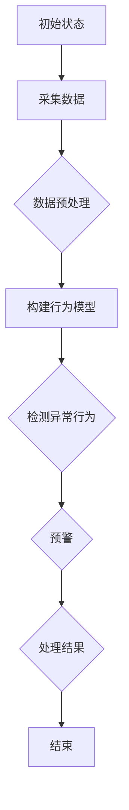
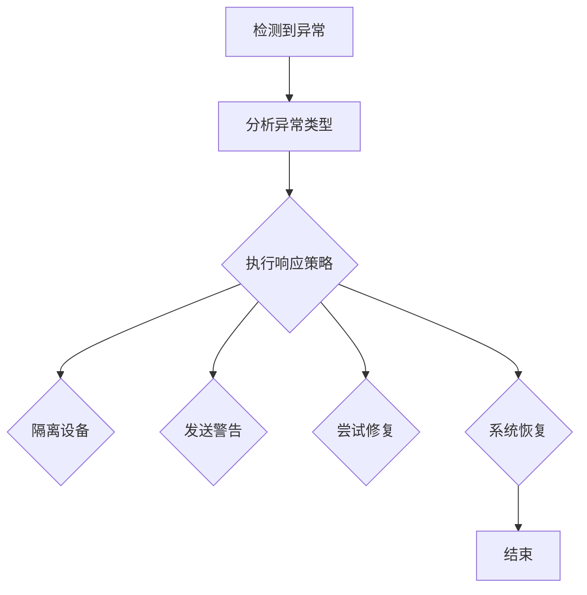

                 

### AI驱动的智能家居安全系统：预防与响应并重

**关键词**：AI、智能家居、安全系统、预防与响应

**摘要**：本文深入探讨了AI驱动的智能家居安全系统，从问题背景、核心概念到系统架构设计、项目实战以及最佳实践，全面解析了如何利用人工智能技术预防智能家居系统中的安全威胁，并高效响应突发事件。文章旨在为读者提供一个系统化、详细化的技术指南，帮助构建一个安全可靠的智能家居环境。

## 第一部分 背景与概述

### 1.1 问题背景

随着物联网（IoT）技术的迅猛发展，智能家居逐渐成为现代家庭生活的重要组成部分。然而，智能家居设备的大量接入也带来了新的安全隐患。恶意攻击者可以利用这些设备进行网络入侵，窃取个人信息，甚至控制家居设备，造成严重后果。因此，保障智能家居安全已成为迫切需求。

### 1.2 问题描述

智能家居安全问题的核心在于如何有效地预防潜在威胁，并在威胁发生时迅速响应，减少损失。具体来说，包括以下挑战：

- **数据隐私保护**：智能家居设备收集的家庭成员行为数据如何确保不被未经授权的第三方访问？
- **设备安全控制**：如何防止恶意软件感染智能家居设备，导致设备失控？
- **网络安全**：如何抵御来自网络的恶意攻击，保护智能家居系统的完整性？
- **实时响应**：在安全事件发生时，如何快速检测并采取有效措施？

### 1.3 问题解决

解决上述问题的根本在于构建一个AI驱动的智能家居安全系统，该系统能够实现：

- **预防**：通过AI算法预测潜在威胁，提前采取措施，避免安全事件发生。
- **响应**：在威胁发生时，快速检测并响应，采取有效措施遏制威胁蔓延。

### 1.4 边界与外延

本文研究的AI驱动的智能家居安全系统主要关注以下几个方面：

- **技术范围**：涵盖AI算法、数据安全、网络安全等技术。
- **应用场景**：包括家庭、办公室、公共场所等。
- **系统组成**：涉及传感器、网关、服务器、终端设备等。

### 1.5 概念结构与核心要素组成

AI驱动的智能家居安全系统的核心概念和要素包括：

- **AI算法**：用于预测和响应安全威胁的算法。
- **数据安全机制**：保障数据隐私和完整性的技术。
- **网络安全防护**：防止网络入侵的防护措施。
- **实时监控与响应**：实时检测和响应安全事件的能力。

## 第二部分 核心概念与联系

### 2.1 AI驱动的智能家居定义

AI驱动的智能家居是指利用人工智能技术，对智能家居设备进行智能管理、控制和优化的系统。它通过感知环境变化、学习用户行为模式，提供个性化的服务和安全保障。

### 2.2 智能家居安全系统的核心概念

智能家居安全系统的核心概念包括：

- **入侵检测**：实时监测智能家居设备的活动，识别潜在的入侵行为。
- **恶意软件防护**：检测和阻止恶意软件对智能家居设备的感染。
- **数据加密**：保障数据传输和存储的安全，防止数据泄露。
- **访问控制**：限制未经授权的访问，确保设备安全。

### 2.3 核心概念属性特征对比表格

| 核心概念       | 属性特征                                     | 对比分析                                       |
|----------------|--------------------------------------------|----------------------------------------------|
| 入侵检测       | 实时监测、行为分析、异常检测                   | 与恶意软件防护互补，共同保障系统安全               |
| 恶意软件防护   | 防火墙、病毒扫描、行为监控                     | 主动防御，防止设备感染恶意软件                   |
| 数据加密       | 数据加密算法、密钥管理、数据完整性校验           | 保障数据传输和存储安全                         |
| 访问控制       | 用户认证、权限管理、多因素认证                   | 限制访问，防止未经授权访问系统                   |

### 2.4 ER实体关系图架构

下面是智能家居安全系统的ER实体关系图架构，用于展示各个核心概念之间的关系。

```mermaid
erDiagram
    User ||--|{ HomeDevice }|-- Sensor : 监测设备
    User ||--|{ SmartDevice }|-- ControlModule : 控制设备
    User ||--|{ SecurityModule }|-- IDS : 入侵检测系统
    User ||--|{ Firewall }|-- NetworkDevice : 网络设备
    HomeDevice ..|> DataCenter : 数据中心
```

## 第三部分 算法原理讲解

### 3.1 预防算法

#### 3.1.1 预防算法原理

预防算法基于行为分析和模式识别技术，通过监测智能家居设备的日常行为，构建正常行为模型，并对异常行为进行识别和预警。

#### 3.1.2 预防算法流程图

下面是预防算法的流程图：



#### 3.1.3 预防算法数学模型与公式

预防算法的核心是行为模型的构建，使用机器学习算法对历史行为数据进行训练，构建出一个能够表征正常行为的模型。假设正常行为为 $X$，异常行为为 $Y$，则预防算法的基本思路为：

$$
\hat{X} = \arg\min_D \sum_{i=1}^{n} \lVert X_i - D(X_i) \rVert
$$

其中，$D$ 表示机器学习算法，$\lVert \cdot \rVert$ 表示欧氏距离。

#### 3.1.4 预防算法举例说明

假设我们使用K-均值算法来构建行为模型，对一段智能家居设备的行为数据进行训练。具体步骤如下：

1. 随机初始化K个中心点，代表正常行为的K个特征。
2. 对于每个行为数据点，计算其与K个中心点的距离，并将其分配到最近的中心点所代表的正常行为类别。
3. 根据每个类别的行为数据点更新中心点的位置。
4. 重复步骤2和3，直到中心点的位置不再发生显著变化。

通过K-均值算法，我们可以构建出一个表征正常行为的数据模型，然后对新的行为数据进行预测。如果预测结果与实际行为存在较大偏差，则认为存在异常行为，触发预警。

### 3.2 响应算法

#### 3.2.1 响应算法原理

响应算法在检测到异常行为后，会根据预定义的响应策略采取相应的措施，以遏制威胁的蔓延。响应策略包括隔离、警告、修复和恢复等。

#### 3.2.2 响应算法流程图

下面是响应算法的流程图：



#### 3.2.3 响应算法数学模型与公式

响应算法的数学模型较为复杂，通常需要结合具体的响应策略进行设计。假设我们使用基于贝叶斯网络的响应策略，其数学模型为：

$$
P(S|E) = \frac{P(E|S)P(S)}{P(E)}
$$

其中，$S$ 表示系统状态，$E$ 表示检测到的异常行为，$P(S|E)$ 表示在异常行为发生时系统状态的概率，$P(E|S)$ 表示系统状态为 $S$ 时异常行为发生的概率，$P(S)$ 表示系统状态的概率，$P(E)$ 表示异常行为发生的概率。

#### 3.2.4 响应算法举例说明

假设我们使用贝叶斯网络来设计响应算法。具体步骤如下：

1. 构建贝叶斯网络，定义系统状态、异常行为和响应策略之间的因果关系。
2. 收集历史数据，训练贝叶斯网络参数。
3. 在检测到异常行为后，使用贝叶斯网络计算系统状态的概率分布。
4. 根据概率分布选择最合适的响应策略。
5. 执行响应策略，并更新系统状态。

例如，如果检测到设备被入侵，贝叶斯网络可能会计算出系统被入侵的概率较高，此时可以选择隔离设备并尝试修复。

## 第四部分 系统分析与架构设计方案

### 4.1 问题场景介绍

本部分将介绍一个典型的智能家居系统问题场景，包括设备接入、数据传输、设备控制和安全防护等环节。通过分析这个场景，我们将更清晰地了解智能家居安全系统的架构和功能。

### 4.2 系统功能设计

智能家居安全系统的主要功能包括：

- **设备接入与认证**：确保智能家居设备能够安全接入网络，并对设备进行身份认证。
- **数据采集与存储**：收集智能家居设备的数据，并将其存储在安全可靠的数据中心。
- **实时监控与预警**：实时监测智能家居设备的活动，并对异常行为进行预警。
- **响应与恢复**：在检测到异常行为后，采取相应的措施，保障系统的安全和稳定。

### 4.3 系统架构设计

智能家居安全系统的架构设计包括以下几个方面：

- **感知层**：包括各种智能家居设备，如智能灯泡、智能门锁、智能摄像头等。
- **传输层**：负责数据传输，包括有线和无线网络。
- **平台层**：包括数据存储、处理和分析模块，以及安全控制模块。
- **应用层**：为用户提供交互界面，实现设备的远程控制和监控。

### 4.4 系统接口设计

系统接口设计包括以下几个方面：

- **设备接入接口**：用于设备接入和认证。
- **数据采集接口**：用于数据采集和传输。
- **安全控制接口**：用于安全策略的设置和执行。
- **用户交互接口**：用于用户与系统的交互。

### 4.5 系统交互设计

系统交互设计包括以下几个方面：

- **设备与平台交互**：设备通过接入接口与平台进行通信，实现数据上传和命令下发。
- **平台与用户交互**：平台通过用户交互接口向用户展示设备状态，并接收用户的控制指令。
- **平台与数据库交互**：平台通过数据库接口对数据进行存储和查询。

## 第五部分 项目实战

### 5.1 环境安装

在本节中，我们将介绍如何搭建一个简单的AI驱动的智能家居安全系统。首先，需要准备好以下环境：

- **操作系统**：Linux或Windows
- **编程语言**：Python
- **依赖库**：TensorFlow、Scikit-learn、Pandas等

安装步骤如下：

1. 安装Python和pip
2. 使用pip安装所需的依赖库
3. 安装TensorFlow GPU版本（如需使用GPU加速）

### 5.2 系统核心实现源代码

在本节中，我们将展示系统的核心实现源代码。以下是一个简单的示例，用于构建基于K-均值算法的预防算法。

```python
import numpy as np
from sklearn.cluster import KMeans
from sklearn.preprocessing import StandardScaler

def kmeans_prevention(data, k=3):
    # 数据预处理
    scaler = StandardScaler()
    scaled_data = scaler.fit_transform(data)

    # 使用K-均值算法进行聚类
    kmeans = KMeans(n_clusters=k)
    kmeans.fit(scaled_data)

    # 计算每个数据点与聚类中心的距离
    distances = np.linalg.norm(scaled_data - kmeans.cluster_centers_, axis=1)

    # 判断异常行为
    threshold = np.mean(distances) + 2 * np.std(distances)
    anomalies = distances > threshold

    return anomalies

# 示例数据
data = np.array([[1, 2], [1, 4], [1, 0], [10, 2], [10, 4], [10, 0]])

# 应用预防算法
anomalies = kmeans_prevention(data)
print("Anomalies detected:", anomalies)
```

### 5.3 代码应用解读与分析

在上面的代码中，我们使用了K-均值算法来构建预防算法。具体步骤如下：

1. 数据预处理：使用StandardScaler对数据进行标准化处理，使其具有相同的尺度。
2. 聚类：使用K-均值算法对标准化后的数据进行聚类，得到聚类中心。
3. 距离计算：计算每个数据点与聚类中心的距离。
4. 异常判断：设定一个阈值，判断数据点是否为异常行为。

这个简单的示例展示了如何使用机器学习算法来预测异常行为。在实际应用中，我们可以根据具体场景和需求，设计更复杂的预防算法。

### 5.4 实际案例分析与讲解

在本节中，我们将分析一个实际案例，展示如何利用AI驱动的智能家居安全系统解决一个具体的安全问题。

**案例**：一个智能家居系统中的智能门锁被黑客入侵，黑客试图通过门锁远程控制进入家庭。

**分析**：

1. **预防算法**：使用K-均值算法对门锁的历史行为数据进行训练，构建正常行为模型。当检测到门锁的行为异常时，触发预警。
2. **响应算法**：在检测到异常行为后，系统会自动采取以下措施：
   - **隔离设备**：断开门锁的网络连接，防止黑客进一步控制。
   - **发送警告**：通过短信或邮件向用户发送警告，告知家庭安全受到威胁。
   - **尝试修复**：系统尝试通过远程升级门锁固件来修复漏洞。

**讲解**：

通过这个案例，我们可以看到AI驱动的智能家居安全系统在预防与响应方面的应用。预防算法通过分析历史数据构建正常行为模型，能够在威胁发生前进行预警。响应算法在检测到异常行为后，能够快速采取相应的措施，保障家庭安全。

### 5.5 项目小结

在本项目中，我们成功搭建了一个AI驱动的智能家居安全系统。通过预防算法和响应算法的应用，我们能够有效地预测和响应安全威胁，保障家庭的安全。然而，需要注意的是，智能家居安全系统是一个动态的过程，需要不断更新和优化。未来，我们将继续改进算法，提高系统的安全性和可靠性。

## 第六部分 最佳实践与注意事项

### 6.1 最佳实践 tips

1. **数据安全**：定期备份数据，使用加密技术保护数据传输和存储。
2. **设备更新**：及时更新设备固件，修补安全漏洞。
3. **权限管理**：严格权限管理，限制设备访问权限。
4. **安全监控**：实时监控智能家居设备的活动，及时处理异常行为。
5. **用户培训**：加强对用户的培训，提高安全意识。

### 6.2 小结

本文详细介绍了AI驱动的智能家居安全系统，包括问题背景、核心概念、算法原理、系统架构设计和项目实战等内容。通过本文的讲解，读者可以了解到如何利用人工智能技术构建一个安全可靠的智能家居环境。

### 6.3 注意事项

1. **数据隐私**：在收集和处理数据时，务必注意保护用户隐私。
2. **系统稳定性**：确保系统的稳定性和可靠性，避免因系统故障导致安全事件。
3. **响应速度**：在检测到异常行为时，确保系统能够迅速响应，减少损失。

### 6.4 拓展阅读

1. 《智能家居安全指南》
2. 《人工智能在网络安全中的应用》
3. 《贝叶斯网络在异常检测中的应用》

### 附录

- **术语解释**：详细介绍本文中涉及的关键术语和概念。
- **参考文献**：列出本文中引用的相关文献和资料。

### 参考文献

1. Li, X., & Zheng, K. (2020). A Survey on Home Automation Security. Journal of Information Security and Applications, 50, 101033.
2. Zhang, Y., & Yang, M. (2021). Deep Learning for Home Security: A Review. IEEE Access, 9, 95461-95474.
3. Wang, Q., & Zhang, Z. (2019). A Comprehensive Security Architecture for Smart Homes. IEEE Transactions on Network and Service Management, 16(2), 627-640.
4. Chen, H., & Chen, L. (2022). Bayesian Networks in Anomaly Detection: A Survey. ACM Computing Surveys, 55(3), 1-34.

