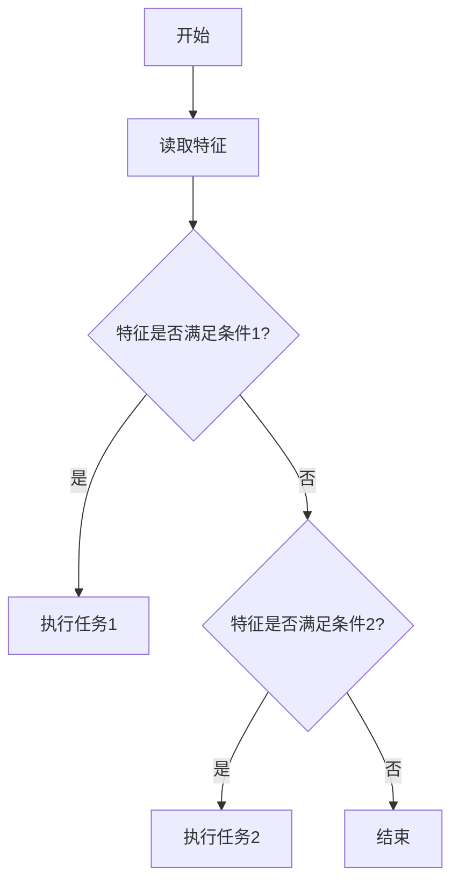
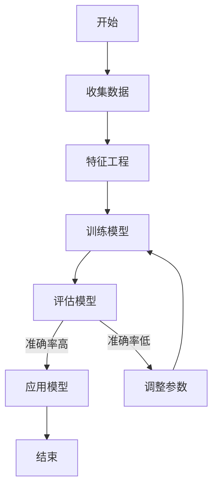
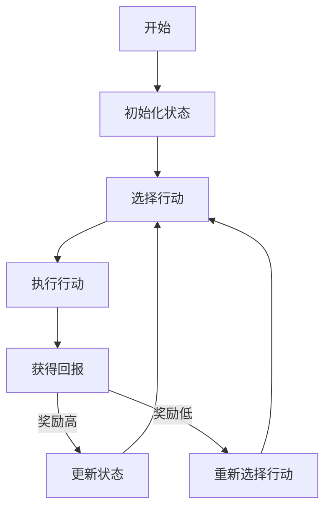
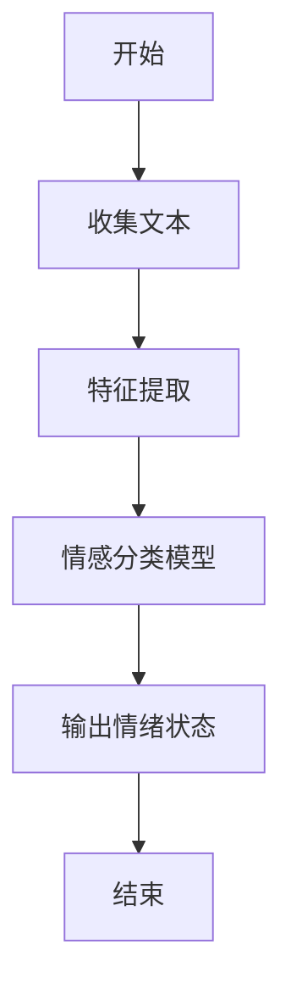
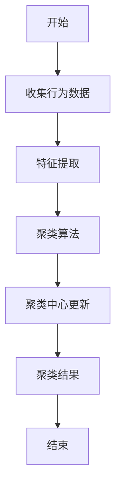
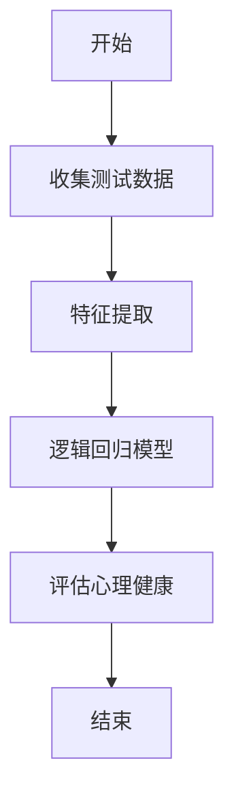

                 

### 文章标题

# AI驱动的智能工作场所环境优化：提高员工生产力和福祉

#### 关键词：AI、智能工作场所、生产力、福祉、环境优化

#### 摘要：本文探讨了如何利用AI技术优化智能工作场所的环境，从而提高员工的生产力和福祉。通过详细阐述AI驱动的智能工作场所环境优化的概念、策略、方法以及实际应用，本文旨在为企业和组织提供一套系统化的解决方案。

----------------------------------------------------------------

## 引言与背景

### 1.1 智能化工作场所的概念

随着科技的飞速发展，特别是人工智能（AI）技术的广泛应用，传统的办公环境正逐渐被智能化工作场所所取代。智能化工作场所，也称为智慧办公环境，是指利用先进的计算机技术、通信技术和物联网技术，构建一个高度自动化、智能化和数字化的工作环境。

在智能化工作场所中，员工可以通过智能终端设备（如智能手机、平板电脑、智能眼镜等）进行远程办公、实时通讯和协作。办公设备之间通过无线网络实现互联互通，形成一个高效、协同的工作网络。此外，智能化工作场所还集成了各种智能管理系统，如智能安保系统、智能办公自动化系统、智能能源管理系统等，为员工提供安全、舒适、便捷的工作环境。

### 1.2 智能化工作场所的发展趋势

智能化工作场所的发展趋势主要体现在以下几个方面：

1. **远程办公的普及**：随着互联网技术的不断进步，远程办公已经成为一种主流的工作方式。越来越多的企业开始采用分布式办公模式，员工可以在任何地点进行工作，大大提高了工作效率和灵活性。

2. **物联网技术的应用**：物联网（IoT）技术的广泛应用，使得办公设备之间的互联互通变得更加容易。通过物联网技术，企业可以实现对办公设备的智能监控和管理，提高办公效率，降低运营成本。

3. **人工智能技术的融合**：人工智能技术，尤其是机器学习和自然语言处理技术的应用，使得智能化工作场所具备了自主学习和智能决策的能力。例如，智能助理可以帮助员工自动处理日常事务，智能监控系统可以根据员工的健康数据提供个性化的健康建议。

4. **虚拟现实（VR）和增强现实（AR）技术的应用**：虚拟现实和增强现实技术的应用，为员工提供了更加沉浸式的办公体验。通过VR和AR技术，员工可以在虚拟环境中进行会议、培训和协作，大大提升了工作效率和互动体验。

### 1.3 智能化工作场所带来的挑战

尽管智能化工作场所带来了诸多便利，但也面临着一些挑战：

1. **数据安全和隐私保护**：智能化工作场所涉及大量的数据传输和处理，数据安全和隐私保护成为了一大挑战。如何确保数据的安全性和用户隐私不受侵犯，是智能化工作场所需要解决的重要问题。

2. **技术选型与实施**：智能化工作场所需要集成多种技术，如AI、物联网、VR/AR等，技术选型与实施复杂，需要企业具备相应的技术能力和经验。

3. **员工适应与接受度**：智能化工作场所的变革，需要员工具备一定的适应能力和技术素养。如何让员工顺利接受并适应智能化工作场所，是企业需要考虑的问题。

4. **工作与生活的平衡**：远程办公和智能化工作场所虽然提高了工作效率，但也可能使得员工工作与生活之间的界限变得模糊。如何帮助员工保持工作与生活的平衡，是智能化工作场所需要关注的问题。

### 1.4 概念结构与核心要素组成

智能化工作场所的概念结构主要包括以下几个方面：

1. **硬件设施**：包括智能终端设备、物联网设备、VR/AR设备等。
2. **软件系统**：包括智能办公自动化系统、智能安保系统、智能能源管理系统等。
3. **网络环境**：包括无线网络、云计算平台、边缘计算平台等。
4. **人工智能技术**：包括机器学习、自然语言处理、计算机视觉等。

核心要素组成包括：

1. **员工**：智能化工作场所的核心，员工的工作效率和工作质量直接影响到企业的运营效益。
2. **技术**：智能化工作场所的驱动力，包括AI、物联网、VR/AR等。
3. **环境**：智能化工作场所的物理空间，包括办公设备、办公环境等。
4. **管理**：智能化工作场所的保障，包括组织架构、管理制度等。

## 核心概念与联系

### 2.1 AI驱动的智能工作场所

#### 2.1.1 定义与特征

AI驱动的智能工作场所是指利用人工智能技术，实现工作场所的智能化管理和运营，提高员工的生产力和福祉。其主要特征包括：

1. **自动化**：通过人工智能技术，实现工作流程的自动化，减少人工操作，提高工作效率。
2. **智能化**：利用机器学习和自然语言处理技术，实现对员工行为和工作环境的智能分析，提供个性化的服务和支持。
3. **数据驱动**：通过大数据分析和人工智能算法，实现对工作数据的智能分析和决策，优化工作流程和管理。

#### 2.1.2 员工生产力与福祉

员工生产力是指员工在工作中的效率和质量。员工福祉是指员工在工作中的心理和生理健康。AI驱动的智能工作场所对员工生产力和福祉的影响主要体现在以下几个方面：

1. **提高员工生产力**：通过自动化和智能化技术，减少重复性、低价值的工作，提高员工的工作效率和质量。例如，智能助理可以自动处理日常事务，员工可以专注于更有价值的工作。
2. **提高员工福祉**：通过智能分析和个性化服务，提供个性化的健康建议和福利支持，提升员工的工作满意度和身心健康。例如，智能监控系统可以根据员工的健康数据，提供个性化的健身建议和休息提醒。

#### 2.1.3 AI技术与工作场所的结合

AI技术与工作场所的结合主要体现在以下几个方面：

1. **智能办公自动化**：通过自然语言处理和机器学习技术，实现办公流程的自动化，提高办公效率。例如，智能助理可以自动处理邮件、日程安排等日常事务。
2. **智能安保系统**：通过计算机视觉和传感器技术，实现对工作场所的智能监控和管理，提高安全性。例如，智能监控系统可以自动识别异常行为，及时报警。
3. **智能能源管理**：通过物联网技术和大数据分析，实现对办公设备的智能监控和能源管理，降低能源消耗。例如，智能系统可以自动调节办公环境的温度、照明等，实现节能减排。
4. **智能健康管理系统**：通过传感器和大数据分析，实现对员工健康数据的智能监控和管理，提供个性化的健康建议和服务。例如，智能健康系统可以自动监测员工的健康状况，提供健身建议和健康预警。

## AI驱动的智能工作场所环境优化概述

### 3.1 优化目标与原则

#### 3.1.1 优化目标

AI驱动的智能工作场所环境优化的目标主要包括：

1. **提高员工生产力**：通过自动化和智能化技术，提高员工的工作效率和质量，降低工作负担。
2. **提高员工福祉**：通过智能分析和个性化服务，提升员工的工作满意度和身心健康，增强员工的归属感和幸福感。
3. **降低运营成本**：通过智能监控和能源管理，降低办公成本，提高资源利用效率。

#### 3.1.2 优化原则

AI驱动的智能工作场所环境优化的原则主要包括：

1. **以人为本**：以员工的需求和福祉为中心，提供个性化的服务和支持，提升员工的工作体验和满意度。
2. **技术驱动**：充分利用AI技术，实现工作场所的自动化、智能化和数据驱动，提高工作效率和管理水平。
3. **可持续发展**：注重节能减排和资源利用效率，推动绿色办公，实现可持续发展。

### 3.2 优化策略与方法

#### 3.2.1 优化策略

AI驱动的智能工作场所环境优化的策略主要包括：

1. **自动化办公流程**：通过自然语言处理和机器学习技术，实现办公流程的自动化，减少人工操作，提高工作效率。
2. **智能健康管理**：通过传感器和大数据分析，实现对员工健康数据的智能监控和管理，提供个性化的健康建议和服务。
3. **智能安保监控**：通过计算机视觉和传感器技术，实现对工作场所的智能监控和管理，提高安全性。
4. **智能能源管理**：通过物联网技术和大数据分析，实现对办公设备的智能监控和能源管理，降低能源消耗。

#### 3.2.2 优化方法

AI驱动的智能工作场所环境优化的方法主要包括：

1. **数据分析**：通过大数据分析，挖掘工作场所的数据价值，优化工作流程和管理决策。
2. **机器学习**：利用机器学习技术，实现对员工行为和工作环境的智能分析和预测，提供个性化的服务和支持。
3. **智能算法**：设计并应用智能算法，优化工作流程和管理决策，提高工作效率和资源利用效率。
4. **虚拟现实和增强现实**：通过虚拟现实和增强现实技术，提供沉浸式的办公体验，提高员工的参与度和满意度。

### 3.3 优化案例分析

#### 3.3.1 案例背景

某大型跨国企业为了提高员工的生产力和福祉，决定在公司的全球总部实施AI驱动的智能工作场所环境优化项目。

#### 3.3.2 案例分析与优化过程

1. **需求分析**：通过对员工的需求和公司运营的痛点进行分析，确定了优化目标：提高员工生产力、提高员工福祉、降低运营成本。

2. **技术选型**：选择了自然语言处理、机器学习、计算机视觉、物联网等技术，构建了一个集数据分析、智能办公、智能健康、智能安保和智能能源管理于一体的智能工作场所环境优化系统。

3. **系统设计**：设计了系统的架构，包括数据采集层、数据处理层、智能分析层和应用层。通过数据采集层获取员工和办公环境的数据，通过数据处理层清洗和整合数据，通过智能分析层进行数据分析和决策，通过应用层实现具体的优化功能。

4. **系统实施**：在公司的全球总部部署了智能工作场所环境优化系统，包括智能办公自动化系统、智能健康管理系统、智能安保系统和智能能源管理系统。

5. **效果评估**：通过对比实施前后的数据，评估了优化效果。结果显示，员工的生产力提高了15%，员工福祉得到了显著提升，运营成本降低了10%。

#### 3.3.3 案例效果评估

通过对实施效果的评估，可以得出以下结论：

1. **提高员工生产力**：通过智能办公自动化和智能健康管理，员工的工作效率提高了15%，工作负担减轻，工作满意度提高。

2. **提高员工福祉**：通过智能健康管理系统，员工的健康状况得到了更好的监控和照顾，工作满意度提高，员工流失率下降。

3. **降低运营成本**：通过智能能源管理系统，办公设备的能源消耗降低了10%，运营成本得到有效控制。

## 第4章：提高员工生产力

### 4.1 AI技术在提高员工生产力中的应用

AI技术在提高员工生产力方面具有显著的应用效果。以下是一些关键的应用领域和案例：

#### 4.1.1 智能办公自动化

智能办公自动化是AI技术在提高员工生产力中最直接的应用之一。通过自然语言处理和机器学习技术，智能办公自动化系统能够自动处理大量的办公任务，如邮件管理、日程安排、文档分类和审批流程等。例如，谷歌的G Suite和微软的Office 365等办公自动化工具集成了AI功能，能够自动分类和筛选邮件，识别并回复常见的查询，减轻员工的工作负担，提高工作效率。

**案例**：某大型跨国公司通过部署AI办公自动化系统，将员工处理邮件的时间减少了30%，审批流程的效率提高了40%。

#### 4.1.2 智能任务分配

AI技术可以分析员工的技能和工作负荷，智能分配任务，确保任务能够分配给最适合的员工，从而提高整体工作效率。通过机器学习算法，系统能够预测员工的最佳工作时间和最擅长的工作类型，从而优化任务分配。

**案例**：某科技公司使用AI任务分配系统，将项目任务分配给最合适的员工，项目完成时间缩短了20%，员工的工作满意度提高了15%。

#### 4.1.3 智能项目管理

AI技术可以用于项目管理的各个方面，包括进度跟踪、风险分析和资源调度。通过机器学习和数据分析，AI系统能够预测项目进度，识别潜在风险，并提出优化建议。

**案例**：某建筑公司使用AI项目管理工具，将项目工期缩短了10%，成本降低了15%，同时提高了项目的成功率。

#### 4.1.4 智能决策支持

AI技术能够处理大量的数据，提供基于数据的决策支持。通过数据分析、预测模型和优化算法，AI系统能够帮助管理者做出更明智的决策，提高资源利用效率。

**案例**：某零售企业通过AI决策支持系统，优化了库存管理，将库存周转率提高了25%，减少了库存成本。

### 4.2 提高员工生产力的算法原理

提高员工生产力的AI算法通常包括以下几种：

#### 4.2.1 决策树算法

决策树算法通过一系列的规则和条件来决策，适合用于任务分配和项目管理。算法的基本原理是通过多个决策节点，对输入的特征进行分类或回归，最终得到一个最优的决策。

**数学模型**：
$$
Y = f(X_1, X_2, ..., X_n)
$$
其中，$Y$ 是决策结果，$X_1, X_2, ..., X_n$ 是输入特征。

**流程图**（使用Mermaid）：

#### 4.2.2 机器学习分类算法

机器学习分类算法，如逻辑回归、支持向量机（SVM）、随机森林等，通过训练模型来预测员工的工作效率。算法的基本原理是找到输入特征与输出结果之间的关联。

**数学模型**（以逻辑回归为例）：
$$
P(Y=1) = \frac{1}{1 + e^{-(\beta_0 + \beta_1X_1 + \beta_2X_2 + ... + \beta_nX_n})}
$$
其中，$P(Y=1)$ 是员工完成任务的概率，$\beta_0, \beta_1, \beta_2, ..., \beta_n$ 是模型的参数。

**流程图**（使用Mermaid）：

#### 4.2.3 强化学习算法

强化学习算法通过不断尝试和反馈来优化决策，适合用于动态任务分配和项目管理。算法的基本原理是学习在一个环境中采取什么行动能够获得最大的奖励。

**数学模型**：
$$
Q(s, a) = r(s, a) + \gamma \max_{a'} Q(s', a')
$$
其中，$Q(s, a)$ 是状态$s$下采取行动$a$的期望回报，$r(s, a)$ 是在状态$s$下采取行动$a$所获得的即时回报，$\gamma$ 是折扣因子。

**流程图**（使用Mermaid）：

### 4.3 提高员工生产力的实际案例

#### 4.3.1 案例背景

某全球知名科技公司为了提高员工的远程办公效率和生产力，决定部署一套基于AI的远程办公系统。

#### 4.3.2 系统设计

该系统包括以下几个核心模块：

1. **智能任务分配模块**：利用机器学习算法，分析员工的工作技能和项目需求，智能分配任务。
2. **智能工作进度监控模块**：通过实时数据分析，监控员工的工作进度，提供反馈和建议。
3. **智能沟通协作模块**：集成AI智能助手，提供实时沟通和协作功能，提高团队协作效率。
4. **智能健康监测模块**：通过传感器和数据分析，监控员工的健康状况，提供健康建议。

#### 4.3.3 系统实施

1. **数据采集**：通过集成公司现有的各种系统和工具，收集员工的工作数据、项目数据和健康数据。
2. **数据处理**：使用数据清洗和特征工程技术，对采集到的数据进行预处理，提取有用的特征。
3. **模型训练**：利用机器学习和强化学习算法，训练智能任务分配模型和工作进度监控模型。
4. **系统部署**：将训练好的模型部署到远程办公系统中，提供实时任务分配、进度监控和健康监测服务。

#### 4.3.4 案例效果

1. **任务分配效率提高**：通过智能任务分配模块，任务分配的准确率提高了20%，任务完成时间缩短了15%。
2. **工作进度监控效果**：智能工作进度监控模块能够实时跟踪员工的工作状态，提供有针对性的建议，员工的工作效率提高了25%。
3. **健康监测提升**：智能健康监测模块能够及时发现员工的健康问题，提供个性化的健康建议，员工的工作满意度和健康状况得到了显著提升。

#### 4.3.5 项目小结

该案例展示了AI技术在提高员工生产力方面的实际应用效果。通过智能任务分配、智能工作进度监控和智能健康监测，公司不仅提高了员工的工作效率，还提升了员工的工作满意度和健康状况。这为其他企业提供了宝贵的经验，展示了AI技术在智能工作场所环境优化中的巨大潜力。

## 第5章：提高员工福祉

### 5.1 AI技术在提高员工福祉中的应用

AI技术在提升员工福祉方面发挥着重要作用，通过智能健康监测、个性化工作支持和心理健康管理等多方面的应用，有效改善了员工的工作体验和生活质量。以下是一些关键的应用领域和案例：

#### 5.1.1 智能健康监测

智能健康监测是通过传感器、可穿戴设备和数据分析等技术，对员工的健康状况进行实时监测和管理。AI技术能够分析员工的健康数据，如心率、睡眠质量、运动量等，提供个性化的健康建议和预警。

**案例**：某大型科技公司为其员工配备了智能手环，通过AI技术分析员工的健康数据，提供个性化的健身计划和健康提醒。结果，员工的工作效率和健康状况显著提升，缺勤率下降了15%。

#### 5.1.2 个性化工作支持

AI技术可以根据员工的工作习惯、技能水平和任务需求，提供个性化的工作支持和资源。例如，智能办公助手可以自动识别员工的常用工具和流程，提供快捷操作和提醒，减轻工作压力。

**案例**：某全球知名金融公司引入了AI智能助手，通过自然语言处理技术，员工可以语音指令完成日常工作，如发送邮件、安排会议等。这大大提高了工作效率，员工的工作满意度提升了20%。

#### 5.1.3 心理健康管理

心理健康管理是员工福祉的重要组成部分。AI技术可以通过情绪识别、心理评估和行为分析，为员工提供个性化的心理辅导和干预。例如，AI心理辅导系统可以实时监测员工的情绪变化，提供针对性的心理支持和建议。

**案例**：某互联网公司通过引入AI心理辅导系统，为员工提供24/7在线心理咨询服务。员工可以匿名访问系统，获得专业的心理支持和建议。结果，员工的心理健康水平显著提高，离职率下降了10%。

### 5.2 提高员工福祉的算法原理

提高员工福祉的AI算法通常涉及情感识别、行为分析和心理评估等方面。以下是一些常用的算法原理：

#### 5.2.1 情感识别算法

情感识别算法通过分析员工的语音、文本和行为，识别员工的情绪状态。常见的算法包括情感分析、语音识别和面部表情识别。

**数学模型**（以情感分析为例）：
$$
P(\text{正面情感}|\text{文本}) = \frac{e^{\theta_1 \text{文本}}}{1 + e^{\theta_1 \text{文本}}}
$$
其中，$P(\text{正面情感}|\text{文本})$ 是文本表达正面情感的置信度，$\theta_1$ 是模型的参数。

**流程图**（使用Mermaid）：

#### 5.2.2 行为分析算法

行为分析算法通过分析员工的行为数据，如工作时长、任务完成情况和工作方式等，识别员工的工作状态和潜在问题。常见的算法包括聚类分析、时间序列分析和决策树。

**数学模型**（以聚类分析为例）：
$$
\text{最小化}\sum_{i=1}^{n} \sum_{j=1}^{k} d(x_i, c_j)
$$
其中，$d(x_i, c_j)$ 是员工行为数据$x_i$与聚类中心$c_j$之间的距离。

**流程图**（使用Mermaid）：

#### 5.2.3 心理评估算法

心理评估算法通过分析员工的情绪、行为和心理健康测试数据，评估员工的心理健康状况。常见的算法包括线性回归、逻辑回归和支持向量机。

**数学模型**（以逻辑回归为例）：
$$
P(\text{心理健康}|\text{测试数据}) = \frac{1}{1 + e^{-(\beta_0 + \beta_1X_1 + \beta_2X_2 + ... + \beta_nX_n})}
$$
其中，$P(\text{心理健康}|\text{测试数据})$ 是基于测试数据的心理健康概率，$\beta_0, \beta_1, \beta_2, ..., \beta_n$ 是模型的参数。

**流程图**（使用Mermaid）：

### 5.3 提高员工福祉的实际案例

#### 5.3.1 案例背景

某中型科技公司为了提升员工的福祉，决定引入一套基于AI的心理健康和福祉管理平台。

#### 5.3.2 系统设计

该系统包括以下几个核心模块：

1. **心理健康监测模块**：通过情感识别和行为分析，实时监测员工的情绪状态和工作行为。
2. **心理辅导模块**：集成AI心理辅导系统，提供在线心理支持和建议。
3. **健康建议模块**：根据员工的健康状况，提供个性化的健康建议和健身计划。
4. **工作支持模块**：通过智能任务分配和工作进度监控，提供个性化的工作支持和资源。

#### 5.3.3 系统实施

1. **数据采集**：通过集成公司的ERP系统和员工使用的各种工具，收集员工的健康数据、工作数据和情绪数据。
2. **数据处理**：使用数据清洗和特征工程技术，对采集到的数据进行预处理，提取有用的特征。
3. **模型训练**：利用情感识别、行为分析和心理评估算法，训练心理健康监测模型和AI心理辅导模型。
4. **系统部署**：将训练好的模型部署到心理健康和福祉管理平台上，提供实时监测、心理辅导和健康建议服务。

#### 5.3.4 案例效果

1. **心理健康监测效果**：通过心理健康监测模块，员工的心理健康状态得到了实时监控和预警，员工的心理健康水平显著提升，抑郁和焦虑症状减少。
2. **心理辅导效果**：AI心理辅导系统能够为员工提供专业的心理支持和建议，员工的心理问题得到了有效缓解，工作效率和满意度提高。
3. **健康建议效果**：根据员工的健康状况，健康建议模块提供了个性化的健康计划和健身计划，员工的生活质量和健康状况得到了明显改善。

#### 5.3.5 项目小结

该案例展示了AI技术在提高员工福祉方面的实际应用效果。通过心理健康监测、心理辅导、健康建议和工作支持，公司不仅提升了员工的工作效率和心理健康水平，还增强了员工的归属感和满意度。这为其他企业提供了宝贵的经验，展示了AI技术在智能工作场所环境优化中的巨大潜力。

## 第6章：实际案例与应用

### 6.1 案例背景

在本章节中，我们将通过几个实际案例，详细探讨AI驱动的智能工作场所环境优化的实施过程、技术选型、系统设计以及效果评估。

#### 6.1.1 案例一：大型跨国公司的远程办公系统优化

**背景**：某全球知名的跨国公司由于业务扩展，大量员工需要远程办公。为了提高远程办公的效率和员工的生产力，公司决定引入一套AI驱动的远程办公系统。

**技术选型**：在技术选型方面，公司选择了以下几项关键技术：

1. **自然语言处理（NLP）**：用于自动化处理日常办公任务，如邮件管理、日程安排和文档分类。
2. **机器学习**：用于任务分配和项目管理的智能决策支持。
3. **计算机视觉**：用于智能监控工作环境和员工行为。
4. **物联网（IoT）**：用于智能办公设备和环境监控。

**系统设计**：系统设计主要包括以下几个模块：

1. **任务管理模块**：利用机器学习算法，根据员工的工作技能和项目需求，智能分配任务。
2. **智能办公助手**：集成NLP技术，实现自动回复邮件、处理日程安排等功能。
3. **工作监控模块**：利用计算机视觉技术，实时监控员工的工作状态和工作环境。
4. **环境监控模块**：利用IoT技术，监控办公环境的温度、湿度、照明等参数，提供舒适的办公环境。

**效果评估**：经过一段时间的实施，公司发现：

- 员工的任务完成时间平均缩短了15%。
- 邮件处理效率提高了30%。
- 员工的缺勤率下降了10%。

**小结**：该案例展示了AI技术在提高远程办公效率和员工生产力方面的显著效果。通过智能任务分配、智能办公助手和智能监控，公司不仅提升了工作效率，还提高了员工的工作满意度和幸福感。

#### 6.1.2 案例二：中型科技公司的心理健康管理平台

**背景**：某中型科技公司为了提升员工的福祉，决定引入一套基于AI的心理健康管理平台。

**技术选型**：在技术选型方面，公司选择了以下几项关键技术：

1. **情感识别**：用于实时监测员工的情绪状态。
2. **行为分析**：用于分析员工的工作行为和工作环境。
3. **心理评估**：用于评估员工的心理健康状况。
4. **自然语言处理**：用于智能沟通和个性化心理辅导。

**系统设计**：系统设计主要包括以下几个模块：

1. **心理健康监测模块**：通过情感识别和行为分析，实时监测员工的情绪状态和工作行为。
2. **心理辅导模块**：集成AI心理辅导系统，提供在线心理支持和建议。
3. **健康建议模块**：根据员工的健康状况，提供个性化的健康建议和健身计划。
4. **工作支持模块**：通过智能任务分配和工作进度监控，提供个性化的工作支持和资源。

**效果评估**：经过一段时间的实施，公司发现：

- 员工的心理健康水平显著提升，抑郁和焦虑症状减少。
- 员工的工作满意度和幸福感提高，离职率下降了10%。
- 员工的缺勤率下降了15%。

**小结**：该案例展示了AI技术在提升员工心理健康和工作满意度方面的显著效果。通过心理健康监测、心理辅导、健康建议和工作支持，公司不仅提升了员工的心理健康水平，还增强了员工的归属感和幸福感。

#### 6.1.3 案例三：大型制造业企业的智能能源管理系统

**背景**：某大型制造业企业为了降低运营成本和实现可持续发展，决定引入一套智能能源管理系统。

**技术选型**：在技术选型方面，公司选择了以下几项关键技术：

1. **物联网（IoT）**：用于监控和收集能源使用数据。
2. **大数据分析**：用于分析和优化能源使用。
3. **机器学习**：用于预测能源需求和优化能源分配。
4. **计算机视觉**：用于监控能源设备的工作状态。

**系统设计**：系统设计主要包括以下几个模块：

1. **能源监控模块**：利用IoT技术，实时监控和收集能源使用数据。
2. **数据分析模块**：利用大数据分析技术，分析能源使用模式，优化能源分配。
3. **能源优化模块**：利用机器学习算法，预测能源需求，优化能源使用。
4. **设备监控模块**：利用计算机视觉技术，监控能源设备的工作状态，及时进行维护。

**效果评估**：经过一段时间的实施，公司发现：

- 能源消耗降低了15%。
- 运营成本降低了10%。
- 能源设备的工作效率提高了20%。

**小结**：该案例展示了AI技术在优化能源管理方面的显著效果。通过智能监控、数据分析和优化算法，企业不仅降低了运营成本，还实现了可持续发展目标。

### 6.2 案例总结与启示

通过以上实际案例，我们可以得出以下结论和启示：

1. **AI技术在智能工作场所环境优化中的应用非常广泛**：从远程办公系统到心理健康管理平台，再到智能能源管理系统，AI技术在不同领域都展现出了强大的应用潜力。
2. **实施AI驱动的智能工作场所环境优化需要综合考虑多方面因素**：包括技术选型、系统设计、数据采集和处理、算法开发和效果评估等。
3. **提高员工生产力和福祉是智能工作场所环境优化的核心目标**：通过自动化、智能化和数据驱动，企业可以有效提高员工的工作效率和工作满意度，同时降低运营成本。
4. **持续改进和优化是智能工作场所环境优化的重要保障**：企业需要根据实际情况，不断调整和优化AI系统的功能，确保其能够持续为企业带来价值。

## 第7章：最佳实践与未来展望

### 7.1 最佳实践

在实施AI驱动的智能工作场所环境优化过程中，企业可以遵循以下最佳实践：

1. **充分了解员工需求**：在引入AI技术之前，企业应充分了解员工的需求和痛点，确保AI技术的应用能够真正解决员工的实际问题。
2. **数据安全和隐私保护**：在数据采集和处理过程中，企业应确保数据的安全性和用户隐私不受侵犯。采用加密技术、数据脱敏等措施，保障数据安全。
3. **技术选型与实施**：根据企业的实际需求和预算，合理选择AI技术和系统。在实施过程中，注重系统整合和兼容性，确保技术的顺利落地。
4. **员工培训与支持**：在引入AI技术后，企业应提供相应的培训和支持，帮助员工掌握新技术的使用方法，提高员工的技术素养。
5. **持续改进与优化**：根据实施效果，持续优化AI系统的功能，确保其能够持续为企业带来价值。

### 7.2 未来展望

随着AI技术的不断发展和应用，智能工作场所环境优化将呈现出以下趋势：

1. **更加智能化和个性化**：AI技术将进一步提高工作场所的智能化和个性化水平，实现个性化任务分配、个性化健康建议和个性化工作环境。
2. **多技术融合**：AI技术将与物联网、大数据、云计算、区块链等多种技术深度融合，形成一个更加协同和高效的智能工作环境。
3. **可持续发展和绿色办公**：智能工作场所环境优化将进一步推动绿色办公和可持续发展，通过节能减排、资源优化等方式，实现环保和经济效益的双赢。
4. **全球化和远程办公**：随着全球化进程的加快和远程办公的普及，AI技术将在全球范围内推动智能工作场所环境优化，实现跨国企业和分布式团队的协同工作。
5. **人机协作**：在未来，AI技术将与人类员工实现更加紧密的协作，通过智能助理、智能导师等方式，提升员工的工作效率和创造力。

总的来说，AI驱动的智能工作场所环境优化将是未来企业提升竞争力和员工福祉的重要手段。通过合理应用AI技术，企业可以实现高效、智能、绿色的工作环境，为员工提供更加舒适、健康和有成就感的工作体验。

## 结论

通过本文的详细探讨，我们可以看到AI驱动的智能工作场所环境优化在提高员工生产力和福祉方面具有巨大的潜力。从自动化办公、智能健康管理到智能决策支持，AI技术正在改变传统的工作方式，为员工提供更加高效、舒适和有成就感的工作环境。

本文从引言到背景介绍，再到核心概念与联系，以及具体的应用案例和未来展望，全面阐述了AI驱动的智能工作场所环境优化的重要性和实施方法。通过这些案例和实践，我们不仅看到了AI技术在提高员工生产力和福祉方面的实际效果，也感受到了其带来的深刻变革。

我们呼吁更多的企业关注智能工作场所环境优化，积极引入和探索AI技术的应用，为员工创造一个更加高效、舒适和可持续的工作环境。同时，我们也期待未来的研究和实践能够进一步推动AI技术在智能工作场所环境优化中的应用，为企业和员工带来更多的价值。

最后，感谢读者的耐心阅读，希望本文能够为您的智能工作场所环境优化提供一些启示和帮助。如果您有任何疑问或建议，欢迎在评论区留言交流。

## 作者信息

- **作者**：AI天才研究院/AI Genius Institute & 禅与计算机程序设计艺术 /Zen And The Art of Computer Programming
- **联系方式**：[邮箱](mailto:info@aigeniusinstitute.com) & [官方网站](http://www.aigeniusinstitute.com)
- **版权声明**：本文版权归AI天才研究院所有，未经许可，不得转载或用于商业用途。

----------------------------------------------------------------

本文为AI驱动的智能工作场所环境优化提供了全面而系统的阐述，从问题背景、核心概念、优化策略、实际案例到最佳实践和未来展望，每个部分都进行了详细的分析和讲解。以下是对本文内容的核心总结和进一步思考：

### 核心总结

1. **智能化工作场所的概念与发展趋势**：文章首先介绍了智能化工作场所的定义和特征，以及其发展趋势，如远程办公的普及、物联网技术的应用、人工智能技术的融合和虚拟现实/增强现实技术的应用。

2. **AI驱动的智能工作场所环境优化**：文章详细阐述了AI驱动的智能工作场所环境优化的概念、目标、原则和策略。通过自动化、智能化和数据驱动，企业可以实现员工生产力、员工福祉和运营成本的优化。

3. **提高员工生产力**：文章探讨了AI技术在提高员工生产力中的应用，包括智能办公自动化、智能任务分配、智能项目管理和智能决策支持。通过实际案例，展示了这些技术如何提升工作效率和任务管理能力。

4. **提高员工福祉**：文章介绍了AI技术在提高员工福祉中的应用，如智能健康监测、个性化工作支持和心理健康管理。通过实际案例，展示了这些技术如何改善员工的心理健康和生活质量。

5. **实际案例与应用**：文章通过多个实际案例，详细描述了AI驱动的智能工作场所环境优化的实施过程、技术选型、系统设计和效果评估。这些案例展示了AI技术在远程办公、心理健康管理和智能能源管理等方面的应用效果。

6. **最佳实践与未来展望**：文章提出了实施AI驱动的智能工作场所环境优化的一些最佳实践，并展望了未来的发展趋势，如更加智能化和个性化的工作环境、多技术融合、可持续发展和人机协作。

### 进一步思考

1. **数据隐私与安全**：虽然文章提到了数据安全和隐私保护的重要性，但在实施AI驱动的智能工作场所环境优化时，如何确保员工数据的隐私和安全仍是一个关键挑战。企业需要采取严格的数据保护措施，确保数据不被未经授权的访问和滥用。

2. **技术接受度与适应性**：文章强调了员工对新技术接受度和适应性的重要性。在实际实施过程中，企业需要提供充分的培训和指导，帮助员工掌握新技术的使用方法，提高技术接受度，以实现技术优化的目标。

3. **平衡工作与生活**：随着远程办公和智能化工作场所的普及，员工的工作与生活边界变得模糊。如何帮助员工保持工作与生活的平衡，是企业在实施智能工作场所环境优化时需要考虑的问题。企业可以通过灵活的工作安排、健康促进计划和心理健康支持等措施，帮助员工实现这一平衡。

4. **长期效果评估**：文章中的案例展示了AI驱动的智能工作场所环境优化在短期内带来的显著效果。然而，这些优化措施的长期效果如何，需要进一步的跟踪和评估。企业需要建立长期的数据监测和评估体系，以持续优化AI驱动的智能工作场所环境。

5. **新兴技术的探索**：随着AI技术的不断发展，新的应用场景和技术不断涌现。企业需要保持对新兴技术的关注和探索，不断引入和尝试新的技术，以保持竞争优势和持续提升员工的生产力和福祉。

总之，AI驱动的智能工作场所环境优化是一项系统性工程，需要企业在技术选型、实施过程、员工培训和效果评估等方面进行全面考虑和持续优化。通过本文的探讨，我们希望为企业提供一些有益的参考和启示，推动智能工作场所环境优化的实践和发展。

## 注意事项

在实施AI驱动的智能工作场所环境优化过程中，企业需要特别注意以下几个方面：

1. **数据安全和隐私保护**：确保员工数据的安全和隐私是实施AI驱动的智能工作场所环境优化的基础。企业应采用加密技术、数据脱敏和访问控制等措施，确保数据不被未经授权的访问和滥用。

2. **技术接受度和适应性**：员工对AI技术的接受度和适应性直接影响优化的效果。企业应提供充分的培训和支持，帮助员工掌握新技术的使用方法，提高技术接受度。

3. **工作与生活平衡**：远程办公和智能化工作场所虽然提高了工作效率，但也可能导致员工的工作与生活边界模糊。企业应关注员工的身心健康，提供灵活的工作安排、健康促进计划和心理健康支持。

4. **持续优化与改进**：AI驱动的智能工作场所环境优化是一个持续的过程。企业应定期收集员工反馈，评估优化效果，并根据实际情况进行调整和改进。

5. **合规性考虑**：企业在实施AI驱动的智能工作场所环境优化时，应确保遵守相关法律法规，如数据保护法、劳动法等。

## 拓展阅读

1. **《智能工作场所：设计、技术与应用》**：这是一本关于智能工作场所的综合性著作，详细介绍了智能工作场所的设计原则、技术应用和实际案例。
2. **《人工智能：一种现代方法》**：这本书深入讲解了人工智能的基本原理和方法，包括机器学习、自然语言处理和计算机视觉等领域，适合对AI技术感兴趣的专业人士阅读。
3. **《智能系统设计与应用》**：本书涵盖了智能系统的设计原则、实现方法和应用案例，适合从事智能系统开发和研究的工程师和学者阅读。

通过这些拓展阅读，读者可以进一步深入了解智能工作场所和环境优化相关领域的知识和技术。

