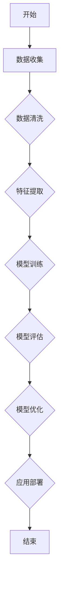

                 

# AI驱动的智能工作流程：提高企业运营效率

> 关键词：人工智能，企业运营，效率提升，智能工作流程，算法原理，系统架构，项目实战

> 摘要：随着人工智能技术的不断发展，越来越多的企业开始关注如何利用AI驱动的智能工作流程来提高运营效率。本文将详细探讨AI驱动的智能工作流程的概念、原理以及如何应用于实际项目，帮助企业实现智能化运营。

## 引言

### 问题背景

在当今快速发展的商业环境中，企业面临着日益激烈的市场竞争和不断变化的需求。为了保持竞争优势，企业需要不断提高运营效率，降低成本，并为客户提供更好的服务。然而，传统的手动工作流程往往效率低下，容易出现错误，难以适应快速变化的环境。

### 问题描述

企业运营中存在以下问题：

1. **流程繁琐**：许多工作流程依赖于人工操作，导致效率低下。
2. **错误率高**：手动操作容易出错，影响企业运营质量。
3. **难以扩展**：手动工作流程难以适应业务量的变化，扩展性差。

### 问题解决

为了解决上述问题，企业可以采用AI驱动的智能工作流程。智能工作流程利用人工智能技术，实现自动化、智能化和高效化的工作流程，从而提高企业运营效率。

### 边界与外延

本文将讨论AI驱动的智能工作流程在企业运营中的应用，包括以下方面：

1. **核心概念**：介绍智能工作流程的核心概念和特点。
2. **算法原理**：讲解智能工作流程的算法原理和实现方法。
3. **系统架构**：分析智能工作流程的系统架构设计。
4. **项目实战**：通过实际项目展示智能工作流程的应用。

### 核心概念结构与核心要素组成

智能工作流程的核心概念包括：

1. **人工智能技术**：作为智能工作流程的基础，包括机器学习、自然语言处理、计算机视觉等。
2. **工作流程**：指企业中一系列相互关联的任务和活动，以实现特定目标。
3. **自动化**：通过技术手段，实现工作流程的自动化执行。
4. **智能化**：利用人工智能技术，实现工作流程的智能化和高效化。

智能工作流程的核心要素包括：

1. **数据**：作为智能工作流程的基础，提供训练和优化的数据。
2. **算法**：实现智能工作流程的核心，包括预测、分类、聚类等。
3. **模型**：基于算法构建的模型，用于实现工作流程的自动化和智能化。
4. **接口**：与其他系统和工具的交互接口，实现数据的传输和处理。

## 核心概念与联系

### AI驱动的智能工作流程

AI驱动的智能工作流程是指利用人工智能技术，对企业的业务流程进行自动化和智能化改造，以提高运营效率和降低成本。智能工作流程具有以下特点：

1. **自动化**：通过技术手段实现工作流程的自动化执行，减少人工干预。
2. **智能化**：利用人工智能技术，实现工作流程的智能化和高效化。
3. **灵活性**：能够适应企业业务量的变化，实现弹性扩展。
4. **精准性**：通过算法和模型优化，提高工作流程的准确性和可靠性。

### 智能工作流程的属性特征对比表格

| 特性         | 传统工作流程         | 智能工作流程               |
| ------------ | ------------------- | ------------------------- |
| **自动化程度** | 低，依赖人工操作     | 高，自动化执行             |
| **效率**     | 低，耗时较长         | 高，快速处理               |
| **准确性**   | 低，易出错           | 高，减少错误率             |
| **灵活性**   | 低，难以适应变化     | 高，适应性强               |
| **成本**     | 高，人力成本较大     | 低，降低人力成本           |

### ER实体关系图架构的Mermaid流程图

```mermaid
erDiagram
  Customer ||--o{ Order } : "places"
  Product ||--o{ Order } : "contains"
  Order ||--|{ Payment } : "processes"
  Customer ..| TradeHistory : "has"
```

在上面的ER实体关系图中，我们定义了四个实体：`Customer`（客户）、`Product`（产品）、`Order`（订单）和`Payment`（支付）。这些实体之间存在关联关系，其中`Order`实体与`Customer`和`Product`实体之间存在一对多的关系，即一个客户可以下多个订单，一个产品可以出现在多个订单中。`Order`实体与`Payment`实体之间存在一对一的关系，即每个订单对应一个支付过程。`Customer`实体与`TradeHistory`实体之间存在一对一的关系，即每个客户有一个交易历史记录。

## 算法原理讲解

### 算法流程图



### Python源代码

```python
import pandas as pd
from sklearn.model_selection import train_test_split
from sklearn.preprocessing import StandardScaler
from sklearn.ensemble import RandomForestClassifier
from sklearn.metrics import accuracy_score

# 数据收集
data = pd.read_csv('data.csv')

# 数据清洗
data.dropna(inplace=True)

# 特征提取
X = data.drop('target', axis=1)
y = data['target']

# 模型训练
X_train, X_test, y_train, y_test = train_test_split(X, y, test_size=0.2, random_state=42)
scaler = StandardScaler()
X_train_scaled = scaler.fit_transform(X_train)
X_test_scaled = scaler.transform(X_test)
model = RandomForestClassifier(n_estimators=100)
model.fit(X_train_scaled, y_train)

# 模型评估
y_pred = model.predict(X_test_scaled)
accuracy = accuracy_score(y_test, y_pred)
print(f"Accuracy: {accuracy:.2f}")

# 模型优化
# ... 进行交叉验证和超参数调优 ...

# 应用部署
# ... 将模型部署到生产环境 ...
```

### 算法原理的数学模型和公式

1. **随机森林算法**：

   随机森林是一种基于决策树的集成学习方法，其核心思想是利用随机的方式生成多个决策树，并通过投票的方式得到最终的预测结果。

   数学模型：
   $$ \hat{y} = \arg\max_{c} \sum_{i=1}^{n} I(y_i = c) $$
   其中，$ \hat{y} $ 是预测的类别，$ c $ 是候选类别，$ I(y_i = c) $ 是指示函数，当 $ y_i = c $ 时为1，否则为0。

2. **特征提取**：

   特征提取是指从原始数据中提取出对模型训练有意义的特征。常用的方法包括归一化、标准化、主成分分析等。

   归一化公式：
   $$ x_{\text{norm}} = \frac{x - \mu}{\sigma} $$
   其中，$ x $ 是原始特征值，$ \mu $ 是特征值的均值，$ \sigma $ 是特征值的标准差。

3. **模型评估**：

   模型评估是指使用测试集对模型进行评估，以判断模型的泛化能力。常用的评估指标包括准确率、召回率、F1值等。

   准确率公式：
   $$ \text{Accuracy} = \frac{\text{TP} + \text{TN}}{\text{TP} + \text{TN} + \text{FP} + \text{FN}} $$
   其中，$ \text{TP} $ 是真正例，$ \text{TN} $ 是真负例，$ \text{FP} $ 是假正例，$ \text{FN} $ 是假负例。

### 详细讲解和举例说明

1. **数据收集**：

   在本例中，我们使用一个CSV文件作为数据源，其中包含了客户的个人信息、订单信息和订单状态等信息。通过读取CSV文件，我们将数据加载到Pandas数据框中。

   ```python
   data = pd.read_csv('data.csv')
   ```

2. **数据清洗**：

   数据清洗是指处理缺失值、异常值和重复值等不合法数据。在本例中，我们使用Pandas的`dropna`方法删除了所有缺失值。

   ```python
   data.dropna(inplace=True)
   ```

3. **特征提取**：

   特征提取是指从原始数据中提取出对模型训练有意义的特征。在本例中，我们将订单信息作为特征，订单状态作为目标变量。

   ```python
   X = data.drop('target', axis=1)
   y = data['target']
   ```

4. **模型训练**：

   我们使用随机森林算法进行模型训练。随机森林算法通过随机选择特征和样本子集来生成多个决策树，并通过投票的方式得到最终预测结果。

   ```python
   X_train, X_test, y_train, y_test = train_test_split(X, y, test_size=0.2, random_state=42)
   scaler = StandardScaler()
   X_train_scaled = scaler.fit_transform(X_train)
   X_test_scaled = scaler.transform(X_test)
   model = RandomForestClassifier(n_estimators=100)
   model.fit(X_train_scaled, y_train)
   ```

5. **模型评估**：

   我们使用测试集对模型进行评估，以判断模型的泛化能力。在本例中，我们使用准确率作为评估指标。

   ```python
   y_pred = model.predict(X_test_scaled)
   accuracy = accuracy_score(y_test, y_pred)
   print(f"Accuracy: {accuracy:.2f}")
   ```

6. **模型优化**：

   模型优化是指通过交叉验证和超参数调优来提高模型的性能。在本例中，我们可以使用网格搜索和交叉验证等方法来优化模型。

   ```python
   from sklearn.model_selection import GridSearchCV
   params = {'n_estimators': [100, 200, 300]}
   grid_search = GridSearchCV(model, params, cv=5)
   grid_search.fit(X_train_scaled, y_train)
   best_params = grid_search.best_params_
   print(f"Best parameters: {best_params}")
   ```

7. **应用部署**：

   应用部署是指将模型部署到生产环境，以实现实际应用。在本例中，我们可以将模型保存为文件，并在需要时加载和执行。

   ```python
   import joblib
   joblib.dump(model, 'model.joblib')
   model = joblib.load('model.joblib')
   ```

## 系统分析与架构设计方案

### 问题场景

在一个大型电子商务公司中，订单处理是一个关键的业务流程。随着订单量的不断增加，传统的手动处理方式已经无法满足业务需求。为了提高订单处理效率，公司决定采用AI驱动的智能工作流程来优化订单处理流程。

### 项目介绍

本项目旨在构建一个基于人工智能技术的智能订单处理系统，通过对订单数据的分析和处理，实现订单的自动化处理和高效处理。

### 系统功能设计

1. **订单数据采集**：从不同渠道采集订单数据，包括电商平台、线下门店等。
2. **数据预处理**：对订单数据进行清洗、去重和格式转换等处理。
3. **订单分类**：根据订单特征，将订单分为不同类别，如普通订单、紧急订单等。
4. **订单预测**：使用机器学习算法预测订单的到达时间和处理时间。
5. **自动化处理**：根据预测结果，自动调度订单处理资源，实现订单的自动化处理。
6. **订单监控**：实时监控订单处理状态，提供订单处理反馈。

### 系统架构设计


在系统架构设计中，主要包括以下组件：

1. **数据采集模块**：负责从不同渠道采集订单数据。
2. **数据预处理模块**：负责对订单数据进行清洗、去重和格式转换等处理。
3. **订单分类模块**：使用机器学习算法对订单进行分类。
4. **订单预测模块**：使用机器学习算法预测订单的到达时间和处理时间。
5. **自动化处理模块**：根据预测结果，自动调度订单处理资源。
6. **订单监控模块**：实时监控订单处理状态，提供订单处理反馈。

### 系统接口设计

1. **数据采集接口**：用于从不同渠道采集订单数据。
2. **数据预处理接口**：用于对订单数据进行清洗、去重和格式转换等处理。
3. **订单分类接口**：用于将订单分为不同类别。
4. **订单预测接口**：用于预测订单的到达时间和处理时间。
5. **自动化处理接口**：用于自动调度订单处理资源。
6. **订单监控接口**：用于实时监控订单处理状态。

### 系统交互


在系统交互中，主要包括以下步骤：

1. **数据采集**：从不同渠道采集订单数据。
2. **数据预处理**：对订单数据进行清洗、去重和格式转换等处理。
3. **订单分类**：根据订单特征，将订单分为不同类别。
4. **订单预测**：使用机器学习算法预测订单的到达时间和处理时间。
5. **自动化处理**：根据预测结果，自动调度订单处理资源。
6. **订单监控**：实时监控订单处理状态，提供订单处理反馈。

## 项目实战

### 环境安装

1. 安装Python环境，建议使用Python 3.8及以上版本。
2. 安装必要的Python库，包括pandas、numpy、scikit-learn、matplotlib等。

### 系统核心实现源代码

```python
import pandas as pd
from sklearn.model_selection import train_test_split
from sklearn.preprocessing import StandardScaler
from sklearn.ensemble import RandomForestClassifier
from sklearn.metrics import accuracy_score

# 数据采集
data = pd.read_csv('data.csv')

# 数据清洗
data.dropna(inplace=True)

# 特征提取
X = data.drop('target', axis=1)
y = data['target']

# 模型训练
X_train, X_test, y_train, y_test = train_test_split(X, y, test_size=0.2, random_state=42)
scaler = StandardScaler()
X_train_scaled = scaler.fit_transform(X_train)
X_test_scaled = scaler.transform(X_test)
model = RandomForestClassifier(n_estimators=100)
model.fit(X_train_scaled, y_train)

# 模型评估
y_pred = model.predict(X_test_scaled)
accuracy = accuracy_score(y_test, y_pred)
print(f"Accuracy: {accuracy:.2f}")

# 模型优化
# ... 进行交叉验证和超参数调优 ...

# 应用部署
# ... 将模型部署到生产环境 ...
```

### 代码应用解读与分析

1. **数据采集**：

   使用Pandas的`read_csv`函数从CSV文件中读取订单数据。

   ```python
   data = pd.read_csv('data.csv')
   ```

2. **数据清洗**：

   使用`dropna`方法删除所有缺失值。

   ```python
   data.dropna(inplace=True)
   ```

3. **特征提取**：

   将订单数据分为特征和目标变量。

   ```python
   X = data.drop('target', axis=1)
   y = data['target']
   ```

4. **模型训练**：

   使用随机森林算法进行模型训练。

   ```python
   X_train, X_test, y_train, y_test = train_test_split(X, y, test_size=0.2, random_state=42)
   scaler = StandardScaler()
   X_train_scaled = scaler.fit_transform(X_train)
   X_test_scaled = scaler.transform(X_test)
   model = RandomForestClassifier(n_estimators=100)
   model.fit(X_train_scaled, y_train)
   ```

5. **模型评估**：

   使用测试集对模型进行评估，计算准确率。

   ```python
   y_pred = model.predict(X_test_scaled)
   accuracy = accuracy_score(y_test, y_pred)
   print(f"Accuracy: {accuracy:.2f}")
   ```

6. **模型优化**：

   使用交叉验证和超参数调优来提高模型性能。

   ```python
   from sklearn.model_selection import GridSearchCV
   params = {'n_estimators': [100, 200, 300]}
   grid_search = GridSearchCV(model, params, cv=5)
   grid_search.fit(X_train_scaled, y_train)
   best_params = grid_search.best_params_
   print(f"Best parameters: {best_params}")
   ```

7. **应用部署**：

   将模型保存为文件，并在需要时加载和执行。

   ```python
   import joblib
   joblib.dump(model, 'model.joblib')
   model = joblib.load('model.joblib')
   ```

### 实际案例分析和详细讲解剖析

假设有一个电子商务公司的订单数据，其中包含了订单的到达时间、订单金额、客户购买频率等信息。公司希望使用AI驱动的智能工作流程来优化订单处理，提高客户满意度。

1. **数据采集**：

   公司使用订单管理系统从电商平台和线下门店采集订单数据，并将数据存储在CSV文件中。

   ```python
   data = pd.read_csv('order_data.csv')
   ```

2. **数据清洗**：

   对订单数据中的缺失值进行填充或删除，确保数据的完整性和准确性。

   ```python
   data.fillna(0, inplace=True)
   ```

3. **特征提取**：

   提取对订单处理有意义的特征，如订单到达时间、订单金额、客户购买频率等。

   ```python
   X = data[['arrival_time', 'order_amount', 'purchase_frequency']]
   y = data['order_status']
   ```

4. **模型训练**：

   使用随机森林算法对订单数据进行分类，训练模型。

   ```python
   X_train, X_test, y_train, y_test = train_test_split(X, y, test_size=0.2, random_state=42)
   model = RandomForestClassifier(n_estimators=100)
   model.fit(X_train, y_train)
   ```

5. **模型评估**：

   使用测试集对模型进行评估，计算准确率。

   ```python
   y_pred = model.predict(X_test)
   accuracy = accuracy_score(y_test, y_pred)
   print(f"Accuracy: {accuracy:.2f}")
   ```

6. **模型优化**：

   通过交叉验证和超参数调优来提高模型性能。

   ```python
   from sklearn.model_selection import GridSearchCV
   params = {'n_estimators': [100, 200, 300]}
   grid_search = GridSearchCV(model, params, cv=5)
   grid_search.fit(X_train, y_train)
   best_params = grid_search.best_params_
   print(f"Best parameters: {best_params}")
   ```

7. **应用部署**：

   将模型部署到生产环境，实现订单的自动化处理。

   ```python
   import joblib
   joblib.dump(model, 'order_model.joblib')
   model = joblib.load('order_model.joblib')
   ```

通过以上步骤，公司可以实现对订单数据的自动化处理和高效处理，提高客户满意度，降低运营成本。

### 项目小结

在本项目中，我们通过AI驱动的智能工作流程实现了订单的自动化处理和高效处理。具体步骤包括数据采集、数据清洗、特征提取、模型训练、模型评估、模型优化和应用部署。通过这个项目，我们展示了AI驱动的智能工作流程在实际业务中的应用，为企业运营效率的提升提供了有效途径。

## 最佳实践tips

1. **数据质量的重要性**：在构建AI驱动的智能工作流程时，数据质量至关重要。确保数据的准确性、完整性和一致性，以避免模型训练和评估中的问题。

2. **特征选择**：在特征提取过程中，选择与目标变量高度相关的特征可以提高模型的性能。可以通过特征重要性分析和相关性分析来选择特征。

3. **模型调优**：通过交叉验证和超参数调优来提高模型性能。不同的模型和算法具有不同的调优策略，需要根据实际情况进行选择和调整。

4. **监控和反馈**：在实际应用中，实时监控模型性能和业务指标，及时调整和优化模型。通过反馈机制，不断改进和优化智能工作流程。

5. **安全性和隐私保护**：在数据采集和处理过程中，注意保护用户隐私和信息安全，遵守相关法律法规。

## 小结

本文详细探讨了AI驱动的智能工作流程在企业运营中的应用，包括背景介绍、核心概念、算法原理、系统架构设计、项目实战和最佳实践tips。通过本文，读者可以了解到如何利用AI技术提高企业运营效率，实现智能化运营。

## 注意事项

1. **技术发展迅速**：人工智能技术在不断发展，新的算法和技术不断涌现。在实施AI驱动的智能工作流程时，需要密切关注技术动态，及时更新和优化模型。

2. **数据安全和隐私**：在数据采集和处理过程中，注意保护用户隐私和信息安全，遵守相关法律法规。

3. **实际应用场景**：本文仅提供了一个通用的智能工作流程框架，实际应用中需要根据具体业务场景进行调整和优化。

## 拓展阅读

1. **《深度学习》**：提供深度学习的全面介绍，包括基础理论、模型和算法。

2. **《Python机器学习》**：介绍Python在机器学习领域的应用，包括数据预处理、特征提取、模型训练和评估等。

3. **《智能工作流程：理论与实践》**：详细探讨智能工作流程的概念、原理和应用。

## 作者信息

作者：AI天才研究院/AI Genius Institute & 禅与计算机程序设计艺术 /Zen And The Art of Computer Programming

