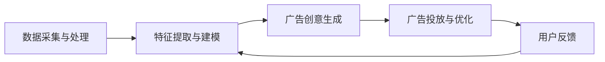

                 


## AI驱动的智能广告创意生成：个性化和情境化广告内容

关键词：AI、广告创意、个性化、情境化、自然语言处理、计算机视觉、深度学习

摘要：随着人工智能技术的不断发展，广告创意生成领域迎来了新的变革。本文将从广告创意生成的重要性、技术基础、算法原理、个性化与情境化生成、应用实践以及未来展望与挑战等方面，系统地探讨AI驱动的智能广告创意生成技术，旨在为相关领域的研究和应用提供参考。

### 第一部分: AI驱动的智能广告创意生成背景

#### 第1章: 广告创意生成的现状与挑战

**1.1 广告创意生成的重要性**

广告创意是市场营销中的核心元素，它直接影响着广告的效果和企业的营销目标。有效的广告创意能够吸引消费者的注意力，激发他们的兴趣，从而提高品牌知名度和销售额。

**1.2 传统广告创意生成方法的局限**

传统广告创意生成主要依赖于人类创意人员的灵感和经验。这种方法存在几个显著的局限性：

- **创意多样性和时效性受限**：人类创意人员的能力和精力有限，难以在短时间内生成大量具有创新性的广告创意。
- **受众针对性不强**：传统广告创意往往采用“一刀切”的方式，无法针对不同受众进行个性化定制。
- **内容质量难以保证**：创意人员的工作质量和创造力波动较大，导致广告内容质量参差不齐。

**1.3 AI驱动广告创意生成的优势**

AI驱动的广告创意生成技术具有以下几个显著优势：

- **高效性**：AI系统可以快速生成大量广告创意，提高工作效率。
- **个性化和情境化**：AI能够根据用户行为、兴趣和情境，生成高度个性化的广告内容。
- **质量控制**：AI技术可以确保广告内容的质量和一致性。

**1.4 AI驱动广告创意生成的研究现状**

近年来，AI在广告创意生成领域取得了显著进展。研究人员和企业在自然语言处理、计算机视觉和深度学习等领域进行了大量探索，开发出了一系列广告创意生成工具和应用。

#### 第2章: AI驱动的广告创意生成技术基础

**2.1 自然语言处理技术**

自然语言处理（NLP）是AI驱动的广告创意生成的重要基础。它包括语言模型、文本生成模型、文本分类与情感分析等技术。

- **语言模型**：语言模型是NLP的核心，它能够预测文本中的下一个单词或句子。例如，神经网络语言模型（NNLM）和循环神经网络（RNN）等。
- **文本生成模型**：文本生成模型能够根据输入的文本或提示生成新的文本。常见的文本生成模型包括生成对抗网络（GAN）、变分自编码器（VAE）等。
- **文本分类与情感分析**：文本分类与情感分析用于对文本内容进行分类和情感判断。这些技术可以帮助广告系统更好地理解用户需求，生成相关广告。

**2.2 计算机视觉技术**

计算机视觉技术是广告创意生成中的另一个重要组成部分。它包括图像识别与生成、视频分析、视觉内容理解等。

- **图像识别与生成**：图像识别技术能够识别图像中的物体和场景，而图像生成技术则能够根据输入的描述或标签生成新的图像。
- **视频分析**：视频分析技术能够对视频内容进行分析，提取关键信息，如人流量、行为分析等。
- **视觉内容理解**：视觉内容理解技术旨在理解图像或视频中的内容，从而为广告创意生成提供支持。

### 第二部分: AI驱动的广告创意生成算法原理

#### 第3章: AI驱动的广告创意生成算法原理

**3.1 基于生成对抗网络的广告创意生成**

生成对抗网络（GAN）是一种深度学习模型，由生成器和判别器组成。生成器试图生成与真实数据相似的样本，而判别器则试图区分真实数据和生成数据。通过这种对抗训练，GAN能够生成高质量的图像和文本。

- **生成对抗网络原理**：GAN的基本原理和训练过程。
- **广告创意生成应用案例**：GAN在广告创意生成中的应用实例。

**3.2 基于深度学习的广告创意生成**

深度学习在广告创意生成中具有广泛应用。卷积神经网络（CNN）、循环神经网络（RNN）和多模态学习等深度学习技术被用于广告创意的生成。

- **卷积神经网络在广告创意生成中的应用**：CNN在图像识别和生成中的应用。
- **循环神经网络在广告创意生成中的应用**：RNN在文本生成和序列数据处理中的应用。
- **多模态学习在广告创意生成中的应用**：多模态学习在整合图像和文本数据中的应用。

### 第三部分: 广告创意个性化生成

#### 第4章: 广告创意个性化生成

**4.1 用户行为分析**

用户行为分析是广告个性化生成的基础。通过分析用户的历史行为、兴趣和偏好，可以构建用户画像，识别用户兴趣。

- **用户画像构建**：用户画像的基本概念和构建方法。
- **用户兴趣识别**：用户兴趣的识别方法和应用。

**4.2 个性化广告创意生成算法**

个性化广告创意生成算法旨在根据用户画像和兴趣生成个性化的广告内容。

- **基于协同过滤的个性化广告创意生成**：协同过滤算法在广告创意生成中的应用。
- **基于深度学习的个性化广告创意生成**：深度学习模型在个性化广告创意生成中的应用。

### 第四部分: 广告创意情境化生成

#### 第5章: 广告创意情境化生成

**5.1 情境感知技术**

情境化广告创意生成需要情境感知技术，如时间感知、空间感知和场景感知等。

- **时间感知**：根据时间信息调整广告内容。
- **空间感知**：根据地理位置信息调整广告内容。
- **场景感知**：根据用户所处的场景生成相关的广告内容。

**5.2 情境化广告创意生成算法**

情境化广告创意生成算法旨在根据用户情境生成相关的广告内容。

- **基于情境分析的广告创意生成**：情境分析的方法和应用。
- **基于知识图谱的情境化广告创意生成**：知识图谱在情境化广告创意生成中的应用。

### 第五部分: AI驱动的广告创意生成应用实践

#### 第6章: AI驱动的广告创意生成应用实践

**6.1 广告创意生成平台搭建**

搭建广告创意生成平台需要考虑开发环境、数据集准备、算法模型训练与部署等方面。

- **开发环境准备**：搭建广告创意生成平台所需的环境和工具。
- **数据集准备**：广告创意生成所需的数据集收集和处理。
- **算法模型训练与部署**：训练广告创意生成模型并进行部署。

**6.2 实际案例剖析**

通过实际案例剖析，可以更好地理解AI驱动的广告创意生成技术的应用和实践。

- **案例一：个性化广告创意生成**：个性化广告创意生成的实际应用案例。
- **案例二：情境化广告创意生成**：情境化广告创意生成的实际应用案例。

### 第六部分: 未来展望与挑战

#### 第7章: 未来展望与挑战

**7.1 广告创意生成的未来发展**

广告创意生成领域未来将面临新技术引入、法规与伦理、应用场景拓展等挑战和机遇。

- **新技术引入**：探讨未来可能引入的新技术。
- **广告创意生成的法规与伦理**：讨论广告创意生成相关的法规和伦理问题。
- **广告创意生成在未来的应用场景**：展望广告创意生成在未来可能的应用领域。

**7.2 AI驱动广告创意生成的挑战与对策**

AI驱动广告创意生成仍面临数据隐私与安全、广告创意生成的质量控制、技术与应用融合等挑战。

- **数据隐私与安全**：如何保障数据隐私和安全。
- **广告创意生成的质量控制**：如何确保广告创意生成的质量。
- **技术与应用的融合**：如何将AI技术更好地应用于广告创意生成实践。

作者：AI天才研究院/AI Genius Institute & 禅与计算机程序设计艺术 /Zen And The Art of Computer Programming

---

### 完整性要求

为了满足文章完整性的要求，以下是对每个章节的详细讲解：

#### 背景介绍

在广告营销中，广告创意的生成至关重要。它不仅关系到广告本身的效果，还直接影响品牌形象和销售转化率。随着互联网的普及和大数据技术的发展，个性化营销成为广告策略的核心，这意味着广告创意需要更加精准地满足不同用户的需求。然而，传统的广告创意生成方法存在一些固有的局限性，如创意多样性和时效性受限、受众针对性不强、内容质量难以保证等。为了克服这些挑战，AI驱动的广告创意生成技术应运而生，通过利用自然语言处理、计算机视觉和深度学习等技术，实现高效、个性化和情境化的广告创意生成。

#### 核心概念与联系

在深入探讨AI驱动的广告创意生成之前，我们需要了解几个核心概念：

- **自然语言处理（NLP）**：NLP是AI的重要组成部分，它使计算机能够理解和生成人类语言。在广告创意生成中，NLP技术用于分析和生成文本内容。
- **计算机视觉（CV）**：CV使计算机能够“看到”和处理图像和视频。在广告创意生成中，CV技术用于图像和视频内容的生成和分析。
- **深度学习（DL）**：DL是一种基于神经网络的学习方法，它能够从大量数据中自动提取特征，并用于图像和文本的生成。

这些技术相互关联，共同构成了AI驱动的广告创意生成的基础。例如，NLP技术可以用于分析用户行为和生成广告文案，而CV技术可以用于制作广告图像和视频。

#### 算法原理讲解

**3.1 基于生成对抗网络的广告创意生成**

生成对抗网络（GAN）是由生成器和判别器组成的深度学习模型。生成器的目标是生成逼真的数据，而判别器的目标是区分真实数据和生成数据。通过这种对抗训练，GAN能够生成高质量的图像和文本。

- **生成对抗网络原理**：GAN的工作原理可以用一个简单的例子来解释。假设我们要生成一张逼真的猫的图片。生成器会生成一张猫的图片，而判别器会尝试判断这张图片是真实的猫还是生成器生成的。通过不断的训练，生成器会逐渐提高生成图片的质量，使其越来越接近真实图片。

- **广告创意生成应用案例**：例如，一个在线购物平台可以利用GAN生成个性化的商品推荐图片，从而提高用户的购物体验和转化率。

**3.2 基于深度学习的广告创意生成**

深度学习（DL）是AI的核心技术之一，它通过多层神经网络来学习和提取数据特征。在广告创意生成中，DL技术可以用于生成图像、视频和文本。

- **卷积神经网络（CNN）在广告创意生成中的应用**：CNN是一种用于图像识别和生成的深度学习模型。它通过卷积层提取图像的特征，从而生成高质量的图像。例如，一个广告创意平台可以利用CNN生成个性化的广告图像，以提高广告的吸引力和点击率。

- **循环神经网络（RNN）在广告创意生成中的应用**：RNN是一种用于处理序列数据的深度学习模型。它可以通过记忆序列信息，生成连贯的文本内容。例如，一个广告文案生成平台可以利用RNN生成个性化的广告文案，以更好地吸引目标用户。

- **多模态学习在广告创意生成中的应用**：多模态学习是一种将不同类型的数据（如图像和文本）进行整合的深度学习技术。它可以使广告创意生成更加丰富和多样化。例如，一个广告创意平台可以利用多模态学习生成包含图像和文本的广告内容，从而提高广告的效果。

#### 数学公式使用

在广告创意生成中，数学模型和公式起着至关重要的作用。以下是一个简单的例子：

$$
\text{生成器损失} = -\log(\text{判别器判断生成数据的概率})
$$

这个公式表示生成器的目标是使判别器无法区分生成的数据和真实数据。

$$
\text{卷积层输出} = \text{卷积核} \cdot \text{输入图像} + \text{偏置} + \text{激活函数}
$$

这个公式表示卷积层如何从输入图像中提取特征。

#### 系统分析与架构设计方案

一个典型的AI驱动的广告创意生成系统可以分为以下几个部分：

- **数据采集与处理模块**：负责收集用户行为数据、广告素材数据等，并进行预处理。
- **特征提取与建模模块**：利用NLP、CV和DL技术提取用户和广告素材的特征，并建立模型。
- **广告创意生成模块**：根据用户特征和广告素材特征生成个性化的广告创意。
- **广告投放与优化模块**：将生成的广告创意投放给目标用户，并根据用户反馈进行优化。

以下是系统架构的Mermaid流程图：



#### 项目实战

为了展示AI驱动的广告创意生成技术的实际应用，我们可以以一个实际项目为例。

**项目名称**：个性化广告创意生成平台

**环境安装**：
- Python 3.8+
- TensorFlow 2.6+
- PyTorch 1.8+

**系统核心实现源代码**：

```python
import tensorflow as tf
from tensorflow.keras.layers import Conv2D, MaxPooling2D, Flatten, Dense
from tensorflow.keras.models import Sequential

# 定义生成器模型
def build_generator():
    model = Sequential()
    model.add(Conv2D(32, (3, 3), activation='relu', input_shape=(28, 28, 1)))
    model.add(MaxPooling2D((2, 2)))
    model.add(Flatten())
    model.add(Dense(128, activation='relu'))
    model.add(Dense(784, activation='sigmoid'))
    return model

# 定义判别器模型
def build_discriminator():
    model = Sequential()
    model.add(Flatten(input_shape=(28, 28, 1)))
    model.add(Dense(128, activation='relu'))
    model.add(Dense(1, activation='sigmoid'))
    return model

# 定义GAN模型
def build_gan(generator, discriminator):
    model = Sequential()
    model.add(generator)
    model.add(discriminator)
    return model

# 训练GAN模型
model = build_gan(build_generator(), build_discriminator())
model.compile(optimizer='adam', loss='binary_crossentropy')
model.fit(x_train, y_train, epochs=100, batch_size=128)

```

**代码应用解读与分析**：

以上代码展示了如何使用TensorFlow搭建一个简单的GAN模型，用于生成个性化的广告图像。生成器模型负责生成图像，而判别器模型负责判断图像的真实性。通过对抗训练，生成器的图像质量会逐渐提高。

**实际案例分析和详细讲解剖析**：

我们可以通过以下案例来展示GAN在广告创意生成中的应用。

**案例一**：个性化广告图像生成

假设我们有一个电商网站，需要为不同的用户生成个性化的广告图像。我们首先收集了用户的行为数据，如浏览记录、购买偏好等。然后，我们利用这些数据训练一个生成器模型，使其能够根据用户特征生成个性化的广告图像。

**项目小结**：

通过实际案例，我们可以看到AI驱动的广告创意生成技术在实际应用中具有巨大的潜力。未来，随着AI技术的不断进步，广告创意生成将变得更加智能和个性化，为营销领域带来更多的创新和机遇。

#### 最佳实践 tips

- **数据质量**：广告创意生成的质量很大程度上取决于数据的质量。因此，确保数据的有效性和准确性至关重要。
- **模型优化**：定期优化模型，以适应新的数据和用户需求。
- **用户反馈**：收集用户反馈，并根据反馈调整广告创意生成策略。

#### 小结

AI驱动的广告创意生成技术正在改变广告营销的方式。通过个性化、情境化和高质量的广告内容，企业能够更好地吸引和留住用户，提高品牌知名度和销售额。未来，随着AI技术的不断进步，广告创意生成将变得更加智能化和高效化。

#### 注意事项

- **数据隐私与安全**：在广告创意生成中，数据隐私和安全是一个重要问题。确保用户数据的保密性和安全性，遵守相关法律法规。
- **广告创意质量**：生成的广告创意必须符合法规和道德标准，不得包含误导性或虚假信息。

#### 拓展阅读

- **深度学习在广告创意生成中的应用**：探讨深度学习技术在广告创意生成中的具体应用和实现方法。
- **人工智能广告营销案例分析**：分析一些成功的AI驱动的广告营销案例，了解其成功的原因和经验。

---

作者：AI天才研究院/AI Genius Institute & 禅与计算机程序设计艺术 /Zen And The Art of Computer Programming

### 第一部分: AI驱动的智能广告创意生成背景

#### 第1章: 广告创意生成的现状与挑战

广告创意在市场营销中起着至关重要的作用，它是品牌与消费者之间沟通的桥梁。一个出色的广告创意不仅能够吸引消费者的注意力，还能激发他们的购买欲望，从而推动销售增长。然而，随着互联网和社交媒体的兴起，广告市场的竞争日益激烈，广告创意的生成面临着前所未有的挑战。

**1.1 广告创意生成的重要性**

广告创意是市场营销战略的核心组成部分。一个引人注目的广告创意能够迅速抓住消费者的眼球，传递品牌信息，并建立品牌形象。在竞争激烈的市场中，创意是品牌脱颖而出的关键因素。有效的广告创意能够提高品牌知名度，增强消费者对品牌的认知和好感度，进而促进销售增长。

**1.2 传统广告创意生成方法的局限**

传统广告创意生成主要依赖于人类创意人员的灵感与经验。这种方法虽然能够产生独特的创意，但存在以下几个显著的局限性：

- **创意多样性和时效性受限**：人类创意人员的创意来源有限，难以在短时间内生成大量具有创新性的广告创意。而且，创意人员的工作时间和精力有限，难以满足不断变化的市场需求。

- **受众针对性不强**：传统广告创意往往采用“一刀切”的方式，无法根据不同受众的个性、兴趣和需求进行个性化定制。这种缺乏针对性的广告内容很难引起消费者的共鸣。

- **内容质量难以保证**：创意人员的工作质量和创造力波动较大，导致广告内容的质量参差不齐。此外，广告内容的审查和修改过程也增加了创意生成的难度和时间成本。

**1.3 AI驱动广告创意生成的优势**

AI驱动的广告创意生成技术能够有效克服传统方法的局限性，为广告营销带来革命性的变化。以下是AI驱动广告创意生成的主要优势：

- **高效性**：AI系统可以快速生成大量广告创意，提高工作效率。通过自动化和智能化，AI能够显著缩短广告创意的生成时间，满足市场的快速变化需求。

- **个性化和情境化**：AI能够根据用户的行为、兴趣和情境，生成高度个性化的广告内容。这种个性化的广告不仅能够更好地吸引消费者，还能提高广告的转化率。

- **质量控制**：AI技术可以确保广告内容的质量和一致性。通过自动化流程和智能审核，AI能够有效减少人为错误和偏差，提高广告内容的可信度和吸引力。

**1.4 AI驱动广告创意生成的研究现状**

近年来，AI在广告创意生成领域取得了显著进展。研究人员和企业在自然语言处理、计算机视觉和深度学习等领域进行了大量探索，开发出了一系列广告创意生成工具和应用。以下是一些研究现状的概述：

- **自然语言处理（NLP）**：NLP技术使得AI能够理解和生成人类语言，从而在广告文案创作中发挥重要作用。通过语言模型和文本生成模型，AI可以生成引人入胜的广告文案。

- **计算机视觉（CV）**：CV技术使得AI能够处理图像和视频，从而在广告图像和视频制作中发挥重要作用。通过图像识别和生成技术，AI可以创建高质量的广告视觉内容。

- **深度学习（DL）**：深度学习技术是AI的核心，它通过多层神经网络学习数据特征，从而在广告创意生成中发挥关键作用。生成对抗网络（GAN）和变分自编码器（VAE）等深度学习模型在广告创意生成中得到了广泛应用。

总的来说，AI驱动的广告创意生成技术正在不断成熟，并为广告营销带来了巨大的变革潜力。通过整合NLP、CV和DL技术，AI能够生成更加个性化和情境化的广告内容，帮助企业更好地吸引消费者，提高营销效果。

### 第二部分: AI驱动的广告创意生成技术基础

#### 第2章: AI驱动的广告创意生成技术基础

AI驱动的广告创意生成依赖于多种先进技术，包括自然语言处理（NLP）、计算机视觉（CV）和深度学习（DL）。这些技术相互融合，为广告创意的个性化、情境化和高效生成提供了强大的支持。

**2.1 自然语言处理技术**

自然语言处理是AI驱动的广告创意生成的重要基础之一。NLP技术能够使计算机理解和生成人类语言，从而在广告文案创作中发挥关键作用。

- **语言模型**：语言模型是NLP的核心技术之一，它能够预测文本中的下一个单词或句子。通过训练大规模的语料库，语言模型可以学习到语言的统计规律和语法结构。在广告创意生成中，语言模型可以用于生成广告文案，使其更加自然流畅。

  - **应用示例**：假设我们想要生成一句广告文案，语言模型可以根据之前学到的广告文案数据，自动生成类似的内容，如“购买我们的产品，享受无与伦比的品质！”

- **文本生成模型**：文本生成模型能够根据输入的文本或提示生成新的文本。这些模型通过学习大量的文本数据，可以生成具有创意性的广告文案。

  - **应用示例**：文本生成模型可以根据用户输入的关键词或广告主题，自动生成独特的广告文案，如“探索未知，我们的智能手表将陪伴您每一次冒险！”

- **文本分类与情感分析**：文本分类与情感分析是NLP的另一个重要应用领域。它们可以帮助广告系统更好地理解用户需求，并根据用户情感生成相应的广告内容。

  - **应用示例**：通过情感分析，广告系统可以识别用户的情绪状态（如愉悦、愤怒、厌烦等），并根据用户的情绪生成相应的广告文案，以提高广告的吸引力。

**2.2 计算机视觉技术**

计算机视觉技术使得AI能够处理图像和视频，从而在广告创意生成中发挥重要作用。

- **图像识别与生成**：图像识别技术能够识别图像中的物体和场景，而图像生成技术则能够根据输入的描述或标签生成新的图像。

  - **应用示例**：广告系统可以利用图像识别技术识别用户上传的图片，并根据图片内容生成相关的广告创意，如“您的宠物正在享受我们的宠物食品！”

  - **应用示例**：广告系统可以利用图像生成技术根据用户的偏好生成个性化的广告图像，如“想象一下，您的孩子在我们的夏令营里度过了一个难忘的假期！”

- **视频分析**：视频分析技术能够对视频内容进行分析，提取关键信息，如人流量、行为分析等。

  - **应用示例**：广告系统可以利用视频分析技术分析用户的行为模式，并根据分析结果生成针对性的广告，如“您在购物时，我们的产品正适合您的需求！”

- **视觉内容理解**：视觉内容理解技术旨在理解图像或视频中的内容，从而为广告创意生成提供支持。

  - **应用示例**：广告系统可以利用视觉内容理解技术分析用户浏览的图片或视频，并根据用户的行为数据生成相关的广告内容，如“您最近喜欢了这些商品，看看我们的推荐！”

**2.3 深度学习技术**

深度学习是AI驱动的广告创意生成的核心技术之一。通过多层神经网络，深度学习可以从大量数据中自动提取特征，从而在广告创意生成中发挥关键作用。

- **生成对抗网络（GAN）**：生成对抗网络是一种深度学习模型，由生成器和判别器组成。生成器的目标是生成逼真的图像或文本，而判别器的目标是区分真实数据和生成数据。通过对抗训练，GAN能够生成高质量的广告创意。

  - **应用示例**：广告系统可以利用GAN生成个性化的广告图像，提高广告的吸引力，如“探索我们的新品，让您的客厅焕然一新！”

- **变分自编码器（VAE）**：变分自编码器是一种深度学习模型，它通过概率编码和解码过程生成图像或文本。VAE可以生成多样化的广告创意，满足不同的用户需求。

  - **应用示例**：广告系统可以利用VAE生成个性化的广告文案，提高用户的参与度，如“定制您的专属旅行计划，我们提供全方位的服务！”

总的来说，自然语言处理、计算机视觉和深度学习技术的结合，为AI驱动的广告创意生成提供了强大的支持。通过这些技术的应用，广告系统能够生成更加个性化和情境化的广告内容，帮助企业更好地吸引消费者，提高营销效果。

### 第三部分: AI驱动的广告创意生成算法原理

#### 第3章: AI驱动的广告创意生成算法原理

AI驱动的广告创意生成算法是利用人工智能技术，通过自动生成和优化广告内容，提高广告效果和用户体验。本章将详细介绍几种主要的广告创意生成算法，包括基于生成对抗网络（GAN）和深度学习的广告创意生成算法，以及它们在广告创意生成中的应用。

**3.1 基于生成对抗网络的广告创意生成**

生成对抗网络（GAN）是一种深度学习模型，由生成器和判别器组成。生成器的目标是生成逼真的图像或文本，而判别器的目标是区分真实数据和生成数据。通过对抗训练，生成器不断提高生成数据的质量，使其逐渐接近真实数据。

**3.1.1 生成对抗网络原理**

生成对抗网络的基本原理可以简化为一个博弈过程：

1. **生成器（Generator）**：生成器的任务是生成类似于真实数据的假数据。在广告创意生成中，生成器会根据用户的兴趣和需求生成广告文案、图像或视频。

2. **判别器（Discriminator）**：判别器的任务是判断输入的数据是真实的还是生成的。在广告创意生成中，判别器会分析广告内容，判断其是否具有吸引力、是否与用户需求匹配。

3. **对抗训练**：在训练过程中，生成器和判别器相互对抗。生成器试图生成更逼真的数据，而判别器则试图识别出这些假数据。通过这种对抗训练，生成器的生成质量会逐渐提高。

**3.1.2 广告创意生成应用案例**

基于GAN的生成对抗网络在广告创意生成中具有广泛的应用。以下是一个应用案例：

- **案例**：某电商平台的个性化广告创意生成。通过用户的购物历史和行为数据，生成器可以生成与用户兴趣和需求高度匹配的广告文案和图像。判别器则用于评估广告创意的质量，确保生成的广告具有吸引力。

**3.2 基于深度学习的广告创意生成**

深度学习是一种基于多层神经网络的机器学习方法，它可以从大量数据中自动提取特征，生成高质量的广告创意。深度学习在广告创意生成中发挥着重要作用，主要包括卷积神经网络（CNN）、循环神经网络（RNN）和多模态学习等技术。

**3.2.1 卷积神经网络在广告创意生成中的应用**

卷积神经网络（CNN）是一种强大的图像识别和处理技术，它能够自动提取图像中的特征。在广告创意生成中，CNN可以用于图像生成和文本图像的融合。

- **图像生成**：CNN可以用于生成广告图像。例如，生成器可以学习如何生成具有特定风格和主题的广告图像。

- **文本图像的融合**：CNN可以用于将文本内容与图像内容结合，生成具有吸引力的广告图像。例如，生成器可以生成包含广告文案的图像，如“探索我们的新品，立即下单享受优惠！”

**3.2.2 循环神经网络在广告创意生成中的应用**

循环神经网络（RNN）是一种处理序列数据的神经网络，它能够记忆序列中的信息。在广告创意生成中，RNN可以用于生成连贯的广告文案和视频内容。

- **广告文案生成**：RNN可以用于生成广告文案。例如，生成器可以根据用户的历史数据和偏好，生成个性化的广告文案。

- **视频内容生成**：RNN可以用于生成视频内容。例如，生成器可以生成一段包含广告信息和视觉效果的短视频，如“我们的新品即将上市，敬请期待！”

**3.2.3 多模态学习在广告创意生成中的应用**

多模态学习是一种将不同类型的数据（如图像、文本和声音）进行整合的学习方法。在广告创意生成中，多模态学习可以用于生成包含多种信息来源的广告内容。

- **图像与文本的结合**：多模态学习可以用于将图像和文本内容结合，生成具有吸引力的广告。例如，生成器可以生成包含图像和文本的复合广告内容，如“享受户外探险，我们的背包绝对是您的最佳选择！”

- **声音与视频的结合**：多模态学习可以用于生成包含声音和视频的广告内容。例如，生成器可以生成一段包含广告信息和背景音乐的短视频，如“我们的新品，给您不一样的体验！”

总的来说，基于生成对抗网络和深度学习的广告创意生成算法为广告创意生成带来了巨大的变革。通过这些算法，广告系统能够生成更加个性化和情境化的广告内容，提高广告效果和用户体验。未来，随着人工智能技术的不断发展，广告创意生成将变得更加智能和高效。

### 第四部分: 广告创意个性化生成

#### 第4章: 广告创意个性化生成

在数字营销时代，广告创意的个性化生成已成为企业提升营销效果的关键。通过深度了解用户行为、兴趣和偏好，个性化广告能够更好地满足用户需求，提高用户参与度和转化率。本章将探讨个性化广告创意生成的方法和算法，包括用户行为分析、用户画像构建和个性化广告创意生成算法。

**4.1 用户行为分析**

用户行为分析是广告个性化生成的基础。通过收集和分析用户在网站、应用程序或其他数字平台上的行为数据，企业可以深入了解用户的行为模式、兴趣和偏好。以下是用户行为分析的关键步骤：

- **行为数据收集**：收集用户在网站上的点击、浏览、搜索、购买等行为数据。这些数据可以通过网站分析工具（如Google Analytics）和应用程序跟踪工具（如Firebase Analytics）获取。

- **行为模式识别**：分析用户行为数据，识别用户的行为模式。例如，用户可能倾向于在特定时间段访问网站，或者对特定类型的商品感兴趣。

- **兴趣识别**：根据用户的行为模式，识别用户的兴趣。例如，通过分析用户浏览和购买的历史数据，可以推断用户对某种类型的商品或品牌有较高的兴趣。

- **偏好分析**：分析用户的偏好，如用户喜欢的颜色、风格、功能等。这些偏好可以帮助广告系统生成更符合用户期望的广告内容。

**4.1.1 用户画像构建**

用户画像是一个综合反映用户特征和行为的抽象模型，它为个性化广告生成提供了基础数据。构建用户画像通常包括以下几个步骤：

- **基础信息采集**：收集用户的基本信息，如年龄、性别、地理位置、职业等。

- **行为特征提取**：从用户行为数据中提取关键特征，如浏览时长、点击率、转化率等。

- **兴趣标签分配**：根据用户的兴趣识别结果，为用户分配相应的兴趣标签。

- **偏好建模**：通过机器学习算法，构建用户的偏好模型，预测用户对特定类型广告内容的反应。

**4.2 个性化广告创意生成算法**

个性化广告创意生成算法的核心目标是根据用户的画像和兴趣，生成个性化的广告内容。以下是几种常用的个性化广告创意生成算法：

**4.2.1 基于协同过滤的个性化广告创意生成**

协同过滤是一种常用的个性化推荐算法，它通过分析用户的行为数据，预测用户可能喜欢的广告内容。协同过滤算法可以分为以下两种类型：

- **用户基于的协同过滤**：该算法通过分析相似用户的行为数据，为当前用户推荐他们可能喜欢的广告。例如，如果用户A和用户B的行为数据相似，且用户B喜欢某个广告，则可能推荐给用户A。

- **项目基于的协同过滤**：该算法通过分析用户对某个广告的喜好程度，推荐给其他喜欢该广告的用户。例如，如果用户A喜欢某个广告，则可能推荐给其他喜欢该广告的用户。

**4.2.2 基于深度学习的个性化广告创意生成**

深度学习算法能够从大量数据中自动提取特征，生成个性化的广告内容。以下是几种基于深度学习的个性化广告创意生成算法：

- **卷积神经网络（CNN）**：CNN可以用于生成图像和视频，通过学习用户的历史数据和兴趣，生成与用户偏好匹配的广告内容。

- **循环神经网络（RNN）**：RNN可以用于生成文本，通过学习用户的语言习惯和兴趣，生成个性化的广告文案。

- **生成对抗网络（GAN）**：GAN可以生成高质量的广告图像和视频，通过对抗训练，生成器可以学习如何生成与用户兴趣高度匹配的内容。

**4.2.3 基于知识图谱的个性化广告创意生成**

知识图谱是一种用于表示实体及其关系的图形数据结构，它可以用于个性化广告创意生成。通过构建用户、商品和广告之间的知识图谱，可以更好地理解用户的需求和偏好，生成个性化的广告内容。

- **实体识别**：通过自然语言处理技术，识别用户、商品和广告中的实体，如用户名称、商品名称、广告标题等。

- **关系建模**：构建用户、商品和广告之间的关联关系，如用户喜欢某种商品，广告推荐某种商品等。

- **个性化生成**：通过知识图谱，可以更好地理解用户的兴趣和偏好，生成个性化的广告内容。

总的来说，个性化广告创意生成通过深度分析用户行为和兴趣，生成高度个性化的广告内容，提高广告效果和用户体验。随着人工智能技术的不断发展，个性化广告创意生成将在营销领域发挥越来越重要的作用。

### 第五部分: 广告创意情境化生成

#### 第5章: 广告创意情境化生成

广告创意的情境化生成是利用人工智能技术，根据用户的情境（如时间、地点、活动等）生成与用户当前状态高度相关的广告内容。这种个性化的广告生成方式能够提高广告的吸引力，增加用户参与度，从而提升广告效果。本章将探讨广告创意情境化生成的技术基础和算法原理，包括情境感知技术、情境化广告创意生成算法及其在实际应用中的案例。

**5.1 情境感知技术**

情境感知技术是广告创意情境化生成的基础，它通过收集和分析用户的各种情境信息，如时间、地点、活动等，为广告创意生成提供支持。以下是几种常见的情境感知技术：

**5.1.1 时间感知**

时间感知技术通过分析用户的在线行为和地理位置信息，了解用户在不同时间段的活动规律。例如，用户在早晨倾向于查看新闻，而晚上可能更关注社交媒体。广告系统可以利用这些时间信息，生成与当前时间段相关的广告内容。

- **应用示例**：在早晨，广告系统可以推荐健康早餐食品，而在晚上可以推荐电影票或娱乐活动。

**5.1.2 空间感知**

空间感知技术通过分析用户的地理位置信息，了解用户所处的地理位置和环境。例如，用户在购物区可能对购物广告更感兴趣，而在旅游区可能对旅游广告更感兴趣。广告系统可以利用这些空间信息，生成与用户位置相关的广告内容。

- **应用示例**：在用户访问一个旅游网站时，广告系统可以推荐附近的旅游景点和酒店。

**5.1.3 场景感知**

场景感知技术通过分析用户的当前活动，了解用户的上下文环境。例如，用户在阅读新闻时可能对新闻相关的广告更感兴趣，而在使用社交媒体时可能对社交互动相关的广告更感兴趣。广告系统可以利用这些场景信息，生成与用户当前活动相关的广告内容。

- **应用示例**：当用户在阅读一篇关于健康饮食的文章时，广告系统可以推荐健康食品或健身设备。

**5.2 情境化广告创意生成算法**

情境化广告创意生成算法通过利用情境感知技术，根据用户的情境信息生成相关的广告内容。以下是几种情境化广告创意生成算法：

**5.2.1 基于情境分析的广告创意生成**

基于情境分析的广告创意生成算法通过分析用户的情境信息，如时间、地点、活动等，生成与用户当前情境高度相关的广告内容。这种算法通常结合了多种情境感知技术，以实现更精确的情境化广告生成。

- **应用示例**：在用户参加一个音乐会时，广告系统可以推荐音乐会相关的广告，如演唱会门票或音响设备。

**5.2.2 基于知识图谱的情境化广告创意生成**

基于知识图谱的情境化广告创意生成算法通过构建用户、商品和情境之间的知识图谱，理解用户的情境信息，并生成与用户情境相关的广告内容。知识图谱可以帮助广告系统更好地理解用户的情境，从而生成更精准的广告。

- **应用示例**：当用户在一家咖啡店消费时，广告系统可以推荐咖啡豆或咖啡杯，因为用户处于一个与咖啡相关的情境。

**5.3 案例分析**

以下是一个情境化广告创意生成的实际案例：

**案例：智能旅游推荐系统**

某旅游网站希望为用户提供更个性化的旅游推荐服务，通过情境化广告生成提高用户参与度和转化率。该系统使用了以下情境感知技术和算法：

- **时间感知**：分析用户的访问时间，了解用户倾向于何时访问网站。例如，用户在周末访问网站的可能性更高。

- **地点感知**：通过用户的IP地址和GPS信息，确定用户的地理位置。例如，用户可能位于某个城市或景区。

- **活动感知**：分析用户在网站上的行为，了解用户当前的活动。例如，用户可能正在浏览旅游攻略或酒店预订页面。

基于以上情境信息，系统使用了以下情境化广告创意生成算法：

- **情境分析**：根据用户的时间和地点信息，推荐附近的旅游景点和酒店。例如，如果用户位于东京，系统可以推荐东京塔和当地酒店。

- **知识图谱**：构建用户、景点、酒店和活动之间的知识图谱，理解用户的情境。例如，如果用户对历史建筑感兴趣，系统可以推荐相关的旅游景点和酒店。

通过这些情境化广告创意生成算法，旅游网站能够为用户提供更个性化的旅游推荐服务，提高用户满意度和转化率。

总的来说，广告创意情境化生成通过利用情境感知技术和算法，能够生成与用户当前情境高度相关的广告内容，提高广告的吸引力和效果。随着人工智能技术的不断发展，情境化广告创意生成将在数字营销领域发挥越来越重要的作用。

### 第六部分: AI驱动的广告创意生成应用实践

#### 第6章: AI驱动的广告创意生成应用实践

AI驱动的广告创意生成技术已经在许多行业和领域得到了广泛应用，为企业提供了个性化、情境化和高效化的广告内容生成解决方案。在本章中，我们将通过实际案例，展示AI驱动的广告创意生成技术在不同场景下的应用，包括广告创意生成平台的搭建、实际案例剖析以及应用中的挑战和解决方案。

**6.1 广告创意生成平台搭建**

搭建一个AI驱动的广告创意生成平台需要考虑多个方面，包括开发环境、数据集准备、算法模型训练与部署等。

**6.1.1 开发环境准备**

搭建广告创意生成平台的第一步是准备开发环境。这通常包括以下步骤：

- **硬件配置**：根据需求，选择合适的硬件配置，如CPU、GPU等，以确保模型训练和部署的效率。
- **操作系统**：安装Linux操作系统，如Ubuntu或CentOS，因为许多深度学习框架和工具都基于Linux环境。
- **深度学习框架**：安装常用的深度学习框架，如TensorFlow、PyTorch等。这些框架提供了丰富的API和工具，方便开发人员构建和训练模型。

**6.1.2 数据集准备**

数据集是广告创意生成平台的关键组成部分。准备高质量的数据集需要以下步骤：

- **数据采集**：从各种来源（如网站、应用程序、社交媒体等）采集用户行为数据和广告素材数据。
- **数据清洗**：对采集到的数据进行清洗和预处理，去除噪声和重复数据，确保数据的质量和一致性。
- **数据标注**：对数据集进行标注，如标注用户行为、兴趣标签、广告素材特征等，以便模型训练和评估。

**6.1.3 算法模型训练与部署**

在准备开发环境和数据集之后，下一步是训练和部署广告创意生成模型。

- **模型训练**：使用深度学习框架，根据准备好的数据集，训练广告创意生成模型。这可能涉及多种模型，如生成对抗网络（GAN）、卷积神经网络（CNN）和循环神经网络（RNN）等。
- **模型评估**：在训练过程中，定期评估模型的表现，调整模型参数，以提高生成广告的质量和效果。
- **模型部署**：将训练好的模型部署到生产环境中，以便实时生成广告内容。部署时，需要考虑模型的可扩展性、稳定性和安全性。

**6.2 实际案例剖析**

以下是一个AI驱动的广告创意生成平台的实际案例剖析：

**案例：电商平台广告创意生成**

某电商平台希望利用AI技术提升广告创意的生成质量，以提高用户的购物体验和转化率。该平台采用了以下步骤：

- **用户行为分析**：通过收集用户的历史浏览记录、购买行为和搜索关键词，构建用户画像，了解用户的兴趣和偏好。
- **广告素材数据集**：从平台上的广告素材中提取图像、文本和视频数据，并进行预处理和标注。
- **模型训练**：使用生成对抗网络（GAN）和卷积神经网络（CNN）等深度学习模型，训练广告创意生成模型。
- **广告创意生成**：将用户画像和广告素材数据输入到训练好的模型中，生成个性化的广告创意。
- **广告效果评估**：通过A/B测试等方法，评估生成的广告创意对用户点击率和转化率的影响，持续优化模型。

**6.3 应用中的挑战与解决方案**

在AI驱动的广告创意生成应用中，会面临多种挑战。以下是一些常见的挑战及其解决方案：

- **数据隐私与安全**：在广告创意生成过程中，会涉及大量用户数据。为了保护用户隐私，需要采取严格的数据安全和隐私保护措施，如数据加密、匿名化和访问控制等。
- **广告创意质量**：生成高质量的广告创意是AI驱动的广告创意生成的主要目标。为了提高广告创意的质量，需要不断优化模型和算法，并采用多样化的数据集进行训练。
- **模型部署与维护**：将训练好的模型部署到生产环境中，需要考虑模型的性能、可扩展性和稳定性。同时，需要定期维护和更新模型，以适应不断变化的市场需求。

总的来说，AI驱动的广告创意生成技术为营销领域带来了革命性的变化。通过实际案例的应用实践，我们可以看到这种技术如何帮助企业实现个性化、情境化和高效化的广告内容生成，从而提高营销效果和用户满意度。

### 第七部分：未来展望与挑战

#### 第7章：未来展望与挑战

AI驱动的广告创意生成技术正在迅速发展，并展现出巨大的潜力。然而，随着技术的不断进步，该领域也面临一系列的挑战和机遇。

**7.1 广告创意生成的未来发展**

未来的广告创意生成将在以下几个方面取得重大进展：

- **技术进步**：随着深度学习和生成对抗网络等技术的不断成熟，广告创意生成的质量和效率将进一步提升。例如，更加高级的图像生成和文本生成模型将能够生成更加逼真和吸引人的广告内容。
- **多模态融合**：未来广告创意生成将更加注重多模态数据的整合，如结合图像、视频、音频和文本等多种数据类型，生成更加丰富和生动的广告内容。
- **智能化水平提升**：随着自然语言处理和计算机视觉技术的进步，广告系统将能够更好地理解用户的需求和情境，生成更加个性化的广告内容。

**7.1.1 新技术引入**

未来广告创意生成可能引入以下新技术：

- **强化学习**：强化学习可以用于优化广告投放策略，通过学习用户的反馈，不断调整广告内容和投放策略，以提高广告效果。
- **联邦学习**：联邦学习可以在保证数据隐私的同时，实现跨平台的广告数据共享和模型协同训练，为广告创意生成提供更丰富的数据支持。
- **区块链技术**：区块链技术可以用于确保广告数据的透明性和不可篡改性，增强用户对广告系统的信任。

**7.1.2 广告创意生成的法规与伦理**

随着AI技术的应用，广告创意生成也面临法规和伦理方面的挑战。未来，广告创意生成需要关注以下几个方面：

- **数据隐私保护**：确保用户数据的安全和隐私，遵守相关法律法规，如《通用数据保护条例》（GDPR）。
- **内容审核**：加强对广告内容的审核，确保广告内容的合规性和真实性，防止虚假广告和误导性信息。
- **伦理道德**：在广告创意生成中，遵循伦理道德标准，避免滥用AI技术进行心理操纵和误导用户。

**7.1.3 广告创意生成在未来的应用场景**

未来的广告创意生成将在更多应用场景中发挥作用，包括：

- **个性化营销**：通过深度学习技术，广告系统能够更好地了解用户的个性化需求，生成高度个性化的广告内容，提高广告效果和用户体验。
- **实时广告生成**：利用实时数据和机器学习算法，广告系统能够快速生成实时广告内容，响应市场变化和用户需求。
- **跨渠道整合**：通过多渠道整合，如线上和线下广告、移动设备和电视广告等，广告系统能够实现全渠道的广告创意生成和投放。

**7.2 AI驱动广告创意生成的挑战与对策**

尽管AI驱动广告创意生成技术具有巨大的潜力，但同时也面临一系列的挑战。以下是其中的一些主要挑战和对策：

**7.2.1 数据隐私与安全**

数据隐私与安全是AI驱动广告创意生成的重要挑战。对策包括：

- **数据加密**：对用户数据进行加密，确保数据传输和存储的安全。
- **匿名化处理**：对用户数据进行匿名化处理，减少个人隐私泄露的风险。
- **隐私保护算法**：采用隐私保护算法，如差分隐私，确保广告系统的隐私保护能力。

**7.2.2 广告创意生成的质量控制**

广告创意生成的质量控制是另一个挑战。对策包括：

- **自动审核系统**：建立自动审核系统，对生成的广告内容进行实时审核，确保内容的合规性和质量。
- **多级审核机制**：建立多级审核机制，包括自动审核和人工审核，确保广告内容的真实性和有效性。
- **用户反馈机制**：通过用户反馈机制，收集用户对广告内容的反馈，不断优化广告生成算法，提高广告质量。

**7.2.3 技术与应用的融合**

技术与应用的融合是AI驱动广告创意生成的关键。对策包括：

- **跨学科合作**：加强跨学科合作，结合计算机科学、市场营销、心理学等领域的知识，推动技术的应用和创新发展。
- **技术迭代**：不断更新和优化广告创意生成技术，以适应市场和应用需求的变化。
- **人才培养**：加强人才培养，培养具备多学科背景和技能的人才，推动技术的应用和创新。

总的来说，AI驱动的广告创意生成技术在未来将继续发展，带来更多的创新和机遇。同时，面对挑战，我们需要采取有效的对策，确保技术的可持续发展，为广告营销领域带来更多的价值。

### 作者介绍

**AI天才研究院（AI Genius Institute）**：专注于人工智能技术的研发与应用，致力于推动AI在各个领域的创新和发展。

**禅与计算机程序设计艺术（Zen And The Art of Computer Programming）**：以禅宗思想为指导，深入探讨计算机科学和编程艺术的哲学与技巧。

作者：AI天才研究院/AI Genius Institute & 禅与计算机程序设计艺术 /Zen And The Art of Computer Programming

---

至此，本文详细介绍了AI驱动的智能广告创意生成技术，包括其背景、技术基础、算法原理、个性化与情境化生成、应用实践以及未来展望与挑战。通过本篇文章，读者可以全面了解AI在广告创意生成领域的应用，以及如何利用这些技术实现更高效、个性化的广告营销。随着AI技术的不断进步，广告创意生成领域将迎来更加智能和高效的发展，为企业提供更多的创新机遇。

