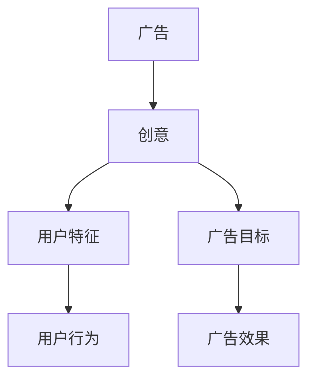
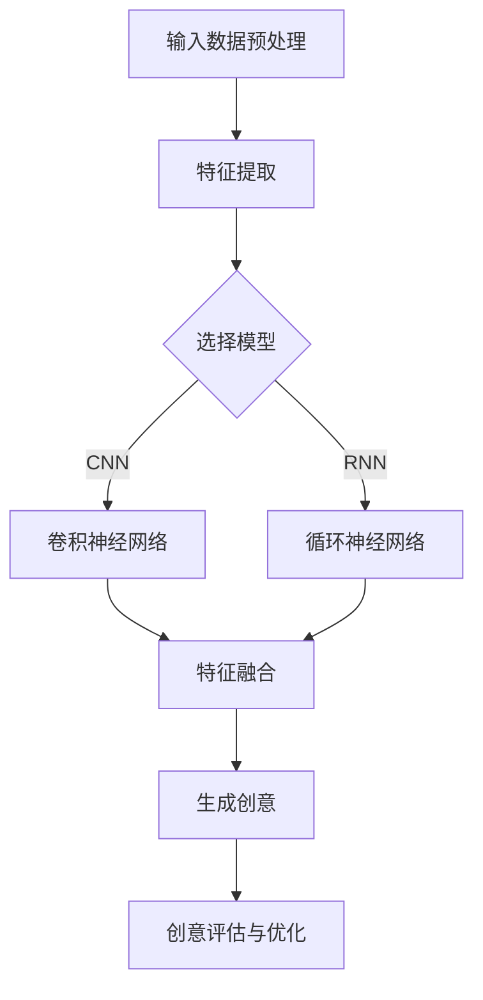
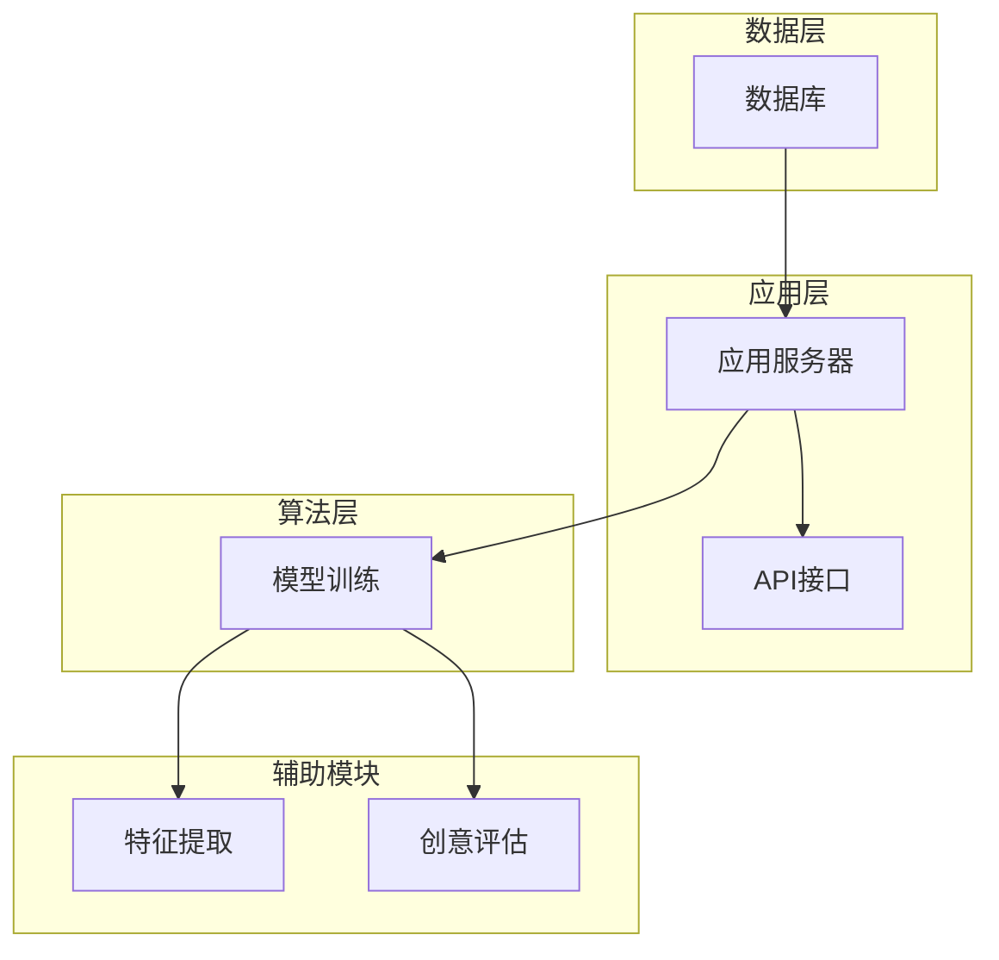

                 

### 《AI驱动的智能广告创意生成：提高广告创意效率和质量》

> 关键词：AI广告创意、深度学习、算法、生成模型、系统架构

> 摘要：本文深入探讨了AI驱动的智能广告创意生成技术，通过逻辑清晰、结构紧凑的分析，阐述了广告创意生成的原理、算法和系统架构设计。文章从背景介绍、核心概念、算法原理、数学模型、系统分析到项目实战，全面解析了AI如何提高广告创意的效率和质量。

----------------------------------------------------------------

### 第一部分：AI驱动的智能广告创意基础

#### 第1章：问题背景与核心概念

##### 1.1 人工智能在广告领域的应用现状

随着互联网和数字媒体的迅猛发展，广告行业面临着前所未有的挑战和机遇。传统广告逐渐被数字广告所取代，而人工智能（AI）技术的引入进一步改变了广告创意的生产方式。

- **广告行业的发展趋势**：数字化、个性化、实时性是当前广告行业的主要趋势。用户数据的积累和实时分析能力使得广告主能够更精准地定位目标受众，实现高效投放。
- **人工智能在广告中的关键角色**：AI在广告领域的主要作用包括用户行为分析、受众定位、广告投放优化和创意生成。通过数据挖掘和机器学习，AI能够为广告主提供更科学的决策支持。

##### 1.1.3 智能广告创意的核心概念

智能广告创意指的是利用人工智能技术自动生成或优化广告内容的过程。核心概念包括：

- **创意生成**：通过机器学习算法，将广告目标、用户特征和内容元素转化为具有吸引力的广告文案、图像或视频。
- **创意优化**：基于用户反馈和行为数据，动态调整广告创意，以提高广告的转化率和投放效果。
- **创意评估**：利用评价模型对广告创意进行评估，筛选出最有效的创意。

#### 第2章：智能广告创意的核心概念与联系

##### 2.1 AI在广告创意中的应用原理

AI在广告创意中的应用主要包括以下几种算法：

- **生成对抗网络（GAN）**：通过生成器和判别器的对抗训练，生成具有真实感的广告创意。
- **卷积神经网络（CNN）**：利用深度学习模型，对广告图像进行特征提取和风格迁移，生成具有特定风格的广告图像。
- **循环神经网络（RNN）与长短期记忆网络（LSTM）**：用于生成序列数据，如广告文案和时间序列广告。

##### 2.2 AI广告创意的ER实体关系图

ER实体关系图可以帮助我们理解广告创意生成过程中的关键实体及其关系。以下是智能广告创意的ER实体关系图：



- **广告（AD）**：广告主体，包含广告的各个要素。
- **创意（C）**：广告内容，受用户特征和广告目标影响。
- **用户特征（B）**：用户的基本信息、兴趣和行为数据。
- **广告目标（A）**：广告主的营销目标，如品牌推广、产品销售等。
- **用户行为（D）**：用户对广告的互动行为，如点击、分享、购买等。
- **广告效果（E）**：广告投放的最终效果，如转化率、投资回报率等。

#### 第3章：智能广告创意生成算法原理

##### 3.1 基于深度学习的创意生成算法

深度学习是AI的核心技术，广泛应用于广告创意生成。以下是两种常用的深度学习算法：

- **卷积神经网络（CNN）**：通过卷积层提取图像特征，生成图像创意。
- **循环神经网络（RNN）与长短期记忆网络（LSTM）**：用于处理序列数据，生成广告文案。

##### 3.2 智能广告创意生成的mermaid流程图



#### 第4章：智能广告创意生成的数学模型与详细讲解

##### 4.1 深度学习基础

深度学习模型的核心是神经网络，以下是深度学习的基本概念：

- **神经网络的基本结构**：由输入层、隐藏层和输出层组成，通过神经元之间的权重连接实现数据的传递和计算。
- **激活函数的选择**：如ReLU、Sigmoid、Tanh等，用于引入非线性变换，使模型具有分类或回归能力。
- **损失函数与优化算法**：损失函数用于衡量模型预测值与真实值之间的差异，优化算法用于调整模型权重，以最小化损失函数。

##### 4.2 创意生成算法数学模型

智能广告创意生成的数学模型主要包括以下几个部分：

- **输入向量**：用户特征和广告目标的编码向量。
- **预处理**：对输入数据进行标准化处理，使其具有相同的尺度。
- **神经网络模型**：通过多层神经网络，对输入数据进行特征提取和融合。
- **输出向量**：生成广告创意的编码向量。

以下是创意生成算法的数学模型：

$$
\begin{align*}
& \text{输入向量} \ x \ \text{经过预处理后得到特征向量} \ z \\
& \text{特征向量} \ z \ \text{输入到神经网络中，通过反向传播更新权重} \ W \\
& \text{输出创意向量} \ y \ \text{并进行评估与优化} \\
\end{align*}
$$

##### 4.3 创意生成算法的Python实现

以下是创意生成算法的Python伪代码：

```python
# 创意生成算法的Python伪代码
import tensorflow as tf

# 模型参数初始化
model = tf.keras.Sequential([
    tf.keras.layers.Dense(units=64, activation='relu', input_shape=(input_shape,)),
    tf.keras.layers.Dense(units=1, activation='sigmoid')
])

# 模型编译
model.compile(optimizer='adam', loss='binary_crossentropy', metrics=['accuracy'])

# 模型训练
model.fit(x_train, y_train, epochs=10, batch_size=32)

# 创意生成
generated_creative = model.predict(x_test)
```

#### 第5章：智能广告创意生成的系统分析与架构设计方案

##### 5.1 项目介绍

智能广告创意生成项目旨在利用AI技术提高广告创意的效率和质量。项目背景如下：

- **背景**：随着数字化广告的兴起，广告主对创意质量的需求不断提高，传统的手动创意生成方式已无法满足市场需求。
- **目标**：通过引入AI技术，实现广告创意的自动化生成和优化，提高创意质量和投放效果。

##### 5.2 系统功能设计

智能广告创意生成系统的主要功能包括：

- **广告创意生成**：根据用户特征和广告目标，自动生成广告创意。
- **创意评估与优化**：基于用户反馈和行为数据，评估广告创意的效果，并进行优化。

以下是系统功能模块划分：

- **数据层**：存储用户数据、广告数据和创意数据。
- **算法层**：实现广告创意生成算法和创意评估算法。
- **应用层**：提供API接口供广告主调用。

##### 5.3 系统架构设计

智能广告创意生成系统的整体架构设计如下：



- **数据库（DB）**：存储用户数据、广告数据和创意数据。
- **应用服务器（Server）**：处理用户请求，调用算法模块生成广告创意。
- **API接口（API）**：供广告主调用，实现广告创意的生成和评估。
- **算法层（Model）**：实现广告创意生成算法和创意评估算法。
- **特征提取（Feature）**：从用户数据和广告目标中提取特征。
- **创意评估（Eval）**：评估广告创意的效果，提供优化建议。

#### 第6章：项目实战

##### 6.1 环境安装

在开始项目实战之前，需要安装以下环境：

- Python 3.7+
- TensorFlow 2.x
- NumPy 1.19+
- Pandas 1.1+

安装命令如下：

```bash
pip install python==3.7.12
pip install tensorflow==2.5.0
pip install numpy==1.19.5
pip install pandas==1.1.5
```

##### 6.2 系统核心实现源代码

以下是系统核心实现的源代码：

```python
# 数据预处理
from tensorflow.keras.preprocessing.text import Tokenizer
from tensorflow.keras.preprocessing.sequence import pad_sequences

# 模型训练
from tensorflow.keras.models import Sequential
from tensorflow.keras.layers import Dense, LSTM, Embedding

# 创意生成
from tensorflow.keras.preprocessing.sequence import pad_sequences

# 初始化模型参数
vocab_size = 10000
embedding_dim = 16
max_length = 50
trunc_type = 'post'
padding_type = 'post'
oov_token = "<OOV>"

# 加载数据集
train_data = ...

# 数据预处理
tokenizer = Tokenizer(num_words=vocab_size, oov_token=oov_token)
tokenizer.fit_on_texts(train_data)

sequences = tokenizer.texts_to_sequences(train_data)
padded_sequences = pad_sequences(sequences, maxlen=max_length, padding=padding_type, truncating=trunc_type)

# 模型训练
model = Sequential([
    Embedding(vocab_size, embedding_dim, input_length=max_length),
    LSTM(128),
    Dense(1, activation='sigmoid')
])

model.compile(optimizer='adam', loss='binary_crossentropy', metrics=['accuracy'])

model.fit(padded_sequences, y_train, epochs=10, batch_size=32)

# 创意生成
generated_creative = model.predict(padded_sequences)
```

##### 6.3 代码应用解读与分析

以下是代码应用解读与分析：

- **数据预处理**：使用Tokenizer类对文本数据进行编码，将文本转化为序列数据。然后使用pad_sequences函数将序列数据填充为相同长度。
- **模型训练**：使用Sequential模型搭建LSTM神经网络，包含嵌入层、LSTM层和输出层。使用adam优化器和binary_crossentropy损失函数进行训练。
- **创意生成**：使用训练好的模型对预处理后的数据进行预测，生成广告创意。

##### 6.4 实际案例分析和详细讲解剖析

为了更好地理解智能广告创意生成系统的工作原理，我们来看一个实际案例。

**案例**：一家电商平台希望利用智能广告创意生成系统，为新品上市活动生成广告创意。

**步骤**：

1. **数据收集**：收集用户浏览历史、购物偏好等数据。
2. **数据处理**：对用户数据进行清洗、编码和填充，准备用于模型训练的数据集。
3. **模型训练**：使用训练数据集训练深度学习模型，使其能够根据用户特征生成有吸引力的广告创意。
4. **创意生成**：使用训练好的模型，根据用户特征生成广告创意。
5. **创意评估**：根据用户点击、购买等行为数据，评估广告创意的效果，进行优化。

**详细讲解**：

1. **数据收集**：电商平台收集了大量用户数据，包括用户ID、浏览历史、购物车信息等。
2. **数据处理**：使用Tokenizer类对用户数据进行编码，将文本转化为序列数据。然后使用pad_sequences函数将序列数据填充为相同长度。
3. **模型训练**：使用训练数据集训练深度学习模型，使其能够根据用户特征生成有吸引力的广告创意。模型训练过程中，通过反向传播算法不断调整模型参数，提高生成广告创意的质量。
4. **创意生成**：使用训练好的模型，根据用户特征生成广告创意。模型接收用户特征编码向量，通过嵌入层、LSTM层和输出层生成广告创意编码向量。
5. **创意评估**：电商平台收集用户点击、购买等行为数据，评估广告创意的效果。根据评估结果，对广告创意进行优化，以提高广告投放效果。

##### 6.5 项目小结

智能广告创意生成系统通过AI技术，实现了广告创意的自动化生成和优化，提高了广告创意的效率和质量。项目实战案例展示了系统的实际应用效果，为电商平台提供了有力的营销支持。在未来的发展中，智能广告创意生成系统有望进一步拓展应用领域，为更多行业提供创新解决方案。

#### 最佳实践 Tips

1. **数据质量**：数据是AI广告创意生成的基石，保证数据质量至关重要。在进行数据处理时，要确保数据的完整性、准确性和一致性。
2. **模型优化**：针对不同广告目标和用户群体，优化模型参数和结构，以提高创意生成效果。定期更新模型，适应市场变化。
3. **用户体验**：广告创意要注重用户体验，避免过度营销和骚扰。通过用户反馈和行为数据，不断优化创意内容，提高用户满意度。

#### 小结

本文从背景介绍、核心概念、算法原理、数学模型、系统分析到项目实战，全面阐述了AI驱动的智能广告创意生成技术。通过深度学习和神经网络技术，智能广告创意生成系统实现了广告创意的自动化生成和优化，提高了广告创意的效率和质量。未来，随着AI技术的不断发展，智能广告创意生成将在更多领域发挥重要作用。

#### 注意事项

1. **模型安全**：在广告创意生成过程中，要确保模型的安全性，防止数据泄露和滥用。
2. **法律法规**：在广告创意生成和投放过程中，遵守相关法律法规，避免违法行为。

#### 拓展阅读

1. **《深度学习与广告创意生成》**：详细介绍了深度学习在广告创意生成中的应用。
2. **《AI广告创意生成实战》**：通过实际案例，讲解了智能广告创意生成系统的实现和应用。

### 作者信息

作者：AI天才研究院/AI Genius Institute & 禅与计算机程序设计艺术 /Zen And The Art of Computer Programming

AI天才研究院致力于推动人工智能技术的发展和应用，为行业提供创新的解决方案。作者在计算机编程和人工智能领域具有丰富的研究和实战经验，著有《禅与计算机程序设计艺术》等畅销书，深受读者喜爱。本次技术博客旨在分享AI广告创意生成的最新研究成果和实践经验，为行业人士提供有价值的参考。

