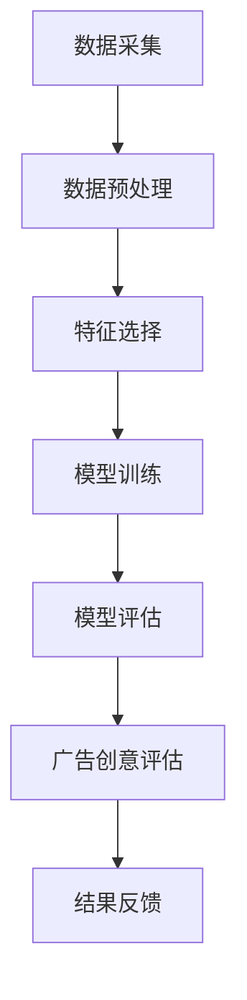
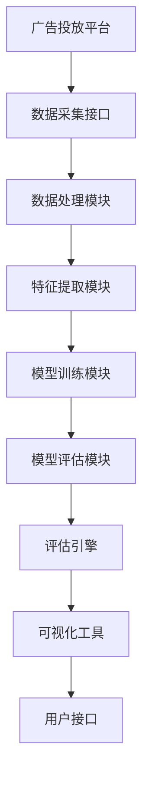

                 


### 第一章：AI驱动的智能广告创意评估概述

#### 1.1 AI在广告行业中的应用现状

随着人工智能（AI）技术的迅猛发展，广告行业正经历着一场深刻的变革。AI技术已经广泛应用于广告的各个环节，从广告投放、内容创作、用户体验到广告效果的评估，AI都在发挥着至关重要的作用。

首先，在广告投放方面，AI可以帮助广告主实现精准投放。通过分析用户的浏览历史、搜索行为、社交媒体活动等多维度数据，AI算法能够预测用户的兴趣和需求，从而实现个性化广告投放。这种精准投放不仅提高了广告的点击率，还降低了广告成本。

其次，在广告内容创作方面，AI技术可以自动生成广告文案和图像。例如，基于深度学习的生成对抗网络（GAN）可以创造出具有高度真实感的广告图像，而自然语言处理（NLP）技术则可以生成吸引人的广告文案。这种自动化的内容创作方式大大提高了广告创作的效率和质量。

再者，在用户体验方面，AI技术可以帮助广告平台优化用户体验。例如，通过用户行为分析，AI可以预测用户可能在何时何地产生购买行为，从而在合适的时间推送合适的广告。此外，AI还可以通过语音识别和自然语言处理技术，为用户提供智能客服服务，提高用户的满意度。

最后，在广告效果评估方面，AI技术同样发挥着重要作用。传统的广告效果评估主要依赖于点击率、转化率等指标，但这些指标往往只能反映广告的表面效果。而AI技术可以通过分析用户的深层次行为，如浏览时长、页面交互等，更准确地评估广告效果。此外，AI还可以预测广告的未来效果，帮助广告主做出更明智的决策。

#### 1.2 智能广告创意评估的挑战与机会

尽管AI技术在广告行业中展现出了巨大的潜力，但在智能广告创意评估方面仍然面临着诸多挑战。

首先，数据质量是影响广告效果评估的重要因素。广告创意评估需要大量的用户行为数据，而这些数据的准确性和完整性直接决定了评估结果的准确性。然而，在实际应用中，数据质量往往无法得到保证。例如，有些用户可能会删除浏览历史，或者数据采集系统可能存在故障，导致数据缺失或不准确。

其次，广告创意的多样性和复杂性也给评估带来了挑战。广告创意可以是文字、图片、视频等多种形式，且每个广告的预算、目标受众、投放策略等都不尽相同。如何在一个统一的框架下评估不同形式的广告创意，是一个亟待解决的问题。

此外，算法的透明性和解释性也是当前的一个热点问题。在广告创意评估中，算法通常使用复杂的数学模型和大量的训练数据。然而，这些算法的决策过程往往是不透明的，无法向广告主清晰地解释为什么某个广告效果更好。这可能会导致广告主对算法的信任度下降，影响广告主对AI广告评估系统的接受度。

然而，面对这些挑战，AI广告创意评估也充满了机会。

首先，随着数据技术的不断进步，数据质量和数据量都将得到显著提升。例如，通过使用更先进的数据采集技术和更高效的数据处理算法，我们可以获得更准确、更丰富的用户行为数据，从而提高广告创意评估的准确性。

其次，随着AI技术的发展，我们将看到更多的创新算法和模型被应用于广告创意评估。例如，基于深度学习的图像识别和自然语言处理技术，可以更准确地捕捉用户的需求和偏好，从而更有效地评估广告创意。

最后，随着公众对AI技术的认知和理解不断加深，算法的透明性和解释性也将得到改善。通过开发更直观、易理解的算法解释工具，我们可以提高广告主对AI广告评估系统的信任度，进一步推动AI技术在广告行业中的应用。

#### 1.3 本章小结

本章介绍了AI驱动的智能广告创意评估的重要性，以及AI在广告行业中的应用现状和面临的挑战与机会。通过本章的学习，读者可以了解到AI技术如何助力广告行业，以及智能广告创意评估的核心问题。

在接下来的章节中，我们将深入探讨AI、机器学习、深度学习等核心概念，并介绍它们在广告创意评估中的应用。同时，我们还将详细讲解用于评估广告创意的算法原理，以及如何设计一个高效的广告创意评估系统。通过这些内容，读者将获得对AI驱动的智能广告创意评估的全面理解。

## 第二章：AI、机器学习与深度学习

#### 2.1 AI的定义与分类

人工智能（Artificial Intelligence，简称AI）是指计算机系统模拟人类智能行为的技术。AI技术包括多个子领域，如自然语言处理（NLP）、计算机视觉、机器学习、深度学习等。根据AI系统的能力和应用范围，我们可以将其分为弱AI和强AI。

弱AI（Narrow AI）是指具有特定任务能力的AI系统，如语音助手、图像识别系统等。这些系统在特定领域内表现出类人的智能行为，但无法进行通用任务。

强AI（General AI）是指具有普遍智能的AI系统，能够像人类一样理解和解决各种问题。目前，强AI仍然是一个理论研究阶段，尚未实现商业化应用。

#### 2.2 机器学习的基本概念

机器学习（Machine Learning，简称ML）是AI的核心技术之一，它使计算机系统能够从数据中学习，并做出决策或预测。机器学习可以分为监督学习、无监督学习和强化学习三种类型。

监督学习（Supervised Learning）是指通过已标记的数据进行训练，以便模型能够预测新的、未标记的数据。例如，使用已标记的图像数据训练图像识别模型。

无监督学习（Unsupervised Learning）是指在没有标记数据的情况下进行训练，以便模型能够发现数据中的模式或结构。例如，使用无监督学习对用户行为数据进行分析，以发现潜在的用户群体。

强化学习（Reinforcement Learning）是指通过与环境互动，不断调整策略以实现目标。例如，使用强化学习训练自动驾驶汽车，使其能够适应复杂的交通环境。

#### 2.3 深度学习的发展与原理

深度学习（Deep Learning，简称DL）是机器学习的一个子领域，它使用多层神经网络对数据进行分析和学习。深度学习的发展得益于计算能力的提升、大数据技术的进步和神经网络算法的创新。

深度学习的核心是神经网络（Neural Network，简称NN），它模拟了人脑的神经元结构和功能。神经网络由输入层、隐藏层和输出层组成，通过多个隐藏层，神经网络可以提取数据中的复杂特征。

深度学习的关键在于训练过程，即通过反向传播算法（Backpropagation Algorithm）调整神经网络的权重，以最小化预测误差。反向传播算法是一种基于梯度下降的优化方法，它通过不断更新权重，使神经网络能够更准确地预测数据。

#### 2.4 AI、机器学习与深度学习之间的联系

AI、机器学习与深度学习之间存在着紧密的联系。

首先，AI是机器学习的上层概念，涵盖了所有使用计算机模拟人类智能行为的领域。机器学习是AI的核心技术之一，它提供了实现AI的算法和方法。

其次，深度学习是机器学习的一个子领域，它使用多层神经网络对数据进行分析和学习。深度学习的发展极大地推动了机器学习技术的进步，使计算机能够解决更多复杂的问题。

最后，深度学习与机器学习之间的区别在于模型结构和训练方法。机器学习通常使用单层或多层的神经网络，而深度学习则使用多层神经网络，通过增加隐藏层数量，深度学习能够提取数据中的更复杂特征。

#### 2.5 本章小结

本章介绍了AI、机器学习和深度学习的基本概念及其之间的联系。通过本章的学习，读者可以了解AI技术的分类和应用，掌握机器学习的基本原理，以及深度学习的发展历程和原理。这些知识将为后续章节中深入探讨AI在广告创意评估中的应用奠定基础。

在下一章中，我们将进一步探讨核心概念属性特征对比，并通过表格和ER实体关系图来展示它们之间的联系。这将帮助我们更深入地理解AI、机器学习和深度学习的本质，为后续内容的学习提供有力的支持。

## 第三章：核心概念属性特征对比

#### 3.1 概念属性特征对比表格

为了更好地理解AI、机器学习、深度学习这三个核心概念，我们将它们的主要属性特征进行对比，如下表所示：

| 概念         | 定义                                                         | 特征                   | 关联性                                           |
|------------|------------------------------------------------------------|---------------------|------------------------------------------------|
| 人工智能（AI）  | 计算机系统模拟人类智能行为的技术。                           | - 强AI和弱AI           | 所有子领域的基础和总和                         |
| 机器学习（ML）  | 通过从数据中学习，使计算机系统能够做出决策或预测的技术。       | - 监督学习、无监督学习、强化学习 | AI的核心技术之一                           |
| 深度学习（DL）  | 使用多层神经网络对数据进行分析和学习的机器学习子领域。         | - 多层神经网络、反向传播算法 | ML的一个高级应用领域                         |

#### 3.2 ER实体关系图架构

为了更直观地展示AI、机器学习和深度学习之间的关联性，我们可以使用ER（实体关系）图来表示它们的关系。以下是ER图的基本架构：

```
[AI] --<包含>--> [ML]
       |
       |
       V
[ML] --<应用>--> [DL]

```

在上图中，[AI]表示人工智能，它包含了机器学习（ML）作为一个子领域。机器学习（ML）又与深度学习（DL）存在应用关系，即ML是DL的基础，而DL是ML的一个高级应用领域。

#### 3.3 本章小结

本章通过对比表格和ER实体关系图，系统地展示了AI、机器学习和深度学习这三个核心概念的主要属性特征及其之间的关联性。通过本章的学习，读者可以更清晰地理解这三个概念的本质及其相互关系，为后续章节中深入探讨AI在广告创意评估中的应用奠定基础。

在下一章中，我们将详细介绍广告创意评估算法的原理，包括其数学模型和公式，并使用mermaid流程图和Python代码来展示算法的工作过程。这将帮助读者更深入地理解广告创意评估算法的实现方法和技术细节。

## 第四章：广告创意评估算法原理

### 4.1 算法概述

广告创意评估算法是一种基于人工智能技术的评估方法，旨在通过分析广告内容、用户行为和广告效果等多维度数据，预测广告创意的表现。该算法的核心在于构建一个能够准确评估广告创意优劣的模型，从而帮助广告主优化广告策略，提高广告投放效果。

广告创意评估算法通常包括以下几个关键步骤：

1. 数据采集：收集与广告创意相关的各种数据，如广告内容、用户浏览行为、点击率、转化率等。
2. 数据预处理：对采集到的数据进行清洗、归一化和特征提取，以便后续建模使用。
3. 特征选择：从预处理后的数据中选择对广告创意评估有显著影响的特征。
4. 模型训练：使用选定的特征训练一个预测模型，如线性回归、决策树、随机森林、神经网络等。
5. 模型评估：通过交叉验证等方法评估模型的性能，调整模型参数，优化模型效果。
6. 广告创意评估：使用训练好的模型对新的广告创意进行评估，预测其未来表现。

### 4.2 数学模型与公式

广告创意评估算法的数学模型通常基于回归分析。假设我们有一个广告创意集合\( A \)，每个广告创意可以用一个特征向量\( x \)表示，广告效果可以用目标变量\( y \)表示。一个简单的线性回归模型可以表示为：

\[ y = \beta_0 + \beta_1 \cdot x_1 + \beta_2 \cdot x_2 + ... + \beta_n \cdot x_n \]

其中，\( \beta_0 \)是截距，\( \beta_1, \beta_2, ..., \beta_n \)是每个特征的权重，\( x_1, x_2, ..., x_n \)是特征向量中的各个特征。

在实际应用中，广告创意评估算法可能会使用更复杂的模型，如决策树、支持向量机（SVM）或神经网络。这些模型的数学公式和实现方法各有不同，但核心思想都是通过特征提取和模型训练，预测广告创意的效果。

### 4.3 mermaid流程图

为了更直观地展示广告创意评估算法的工作流程，我们可以使用mermaid流程图进行描述。以下是mermaid流程图的示例：



在上面的mermaid流程图中，我们首先进行数据采集，然后对数据预处理，接着进行特征选择和模型训练。训练好的模型用于广告创意评估，并将评估结果反馈给广告主，以便进行策略调整。

### 4.4 Python代码实现

下面是一个简单的Python代码示例，用于实现广告创意评估的线性回归模型：

```python
import numpy as np
from sklearn.linear_model import LinearRegression
from sklearn.model_selection import train_test_split

# 假设我们已经有了一个特征矩阵X和目标变量y
X = np.array([[1, 2], [2, 3], [3, 4]])
y = np.array([2, 3, 4])

# 划分训练集和测试集
X_train, X_test, y_train, y_test = train_test_split(X, y, test_size=0.2, random_state=42)

# 创建线性回归模型
model = LinearRegression()

# 训练模型
model.fit(X_train, y_train)

# 预测测试集
y_pred = model.predict(X_test)

# 评估模型性能
print("R-squared:", model.score(X_test, y_test))
```

在上面的代码中，我们首先导入所需的库，然后创建一个特征矩阵\( X \)和一个目标变量\( y \)。接着，我们将数据划分为训练集和测试集，创建一个线性回归模型，并使用训练集训练模型。最后，我们使用测试集评估模型的性能。

### 4.5 算法原理详细讲解

广告创意评估算法的核心在于如何从数据中提取有效的特征，并构建一个能够准确预测广告效果的模型。以下是广告创意评估算法原理的详细讲解：

1. **特征提取**：
   - 广告内容特征：包括广告的文本、图片、视频等，可以通过自然语言处理（NLP）和计算机视觉技术提取。
   - 用户行为特征：包括用户的年龄、性别、地理位置、浏览历史、点击行为等，可以从用户数据库中获取。
   - 广告效果特征：包括广告的点击率（CTR）、转化率（CVR）、花费（CPM/CPC）等，可以从广告投放平台获取。

2. **模型选择**：
   - 线性回归：适用于线性关系明显的场景，可以通过调整模型参数来优化效果。
   - 决策树和随机森林：适用于特征维度较高的场景，可以处理非线性关系。
   - 支持向量机（SVM）：适用于高维空间分类问题，可以优化广告创意的划分。
   - 神经网络：适用于复杂非线性关系，可以通过深度学习技术提取深层特征。

3. **模型训练与优化**：
   - 使用训练数据对模型进行训练，通过调整模型参数和结构，使模型能够更好地拟合数据。
   - 使用交叉验证等方法评估模型性能，根据评估结果调整模型参数。
   - 可以结合多种模型，构建集成模型，提高预测准确性。

4. **模型评估与解释**：
   - 使用测试数据评估模型性能，通过评估指标（如准确率、召回率、F1值等）评估模型效果。
   - 可以使用模型解释工具，如LIME或SHAP，解释模型决策过程，提高模型的可解释性。

### 4.6 举例说明

假设我们有一个广告创意评估项目，数据集包含以下特征：

- 广告文本长度（x1）
- 广告图片颜色分布（x2）
- 用户年龄（x3）
- 用户性别（x4）
- 用户地理位置（x5）

我们选择线性回归模型进行广告创意评估，使用Python代码实现如下：

```python
import pandas as pd
from sklearn.linear_model import LinearRegression
from sklearn.model_selection import train_test_split

# 加载数据集
data = pd.read_csv('ad_data.csv')

# 特征和目标变量
X = data[['text_length', 'image_color', 'age', 'gender', 'location']]
y = data['ctr']

# 划分训练集和测试集
X_train, X_test, y_train, y_test = train_test_split(X, y, test_size=0.2, random_state=42)

# 创建线性回归模型
model = LinearRegression()

# 训练模型
model.fit(X_train, y_train)

# 预测测试集
y_pred = model.predict(X_test)

# 评估模型性能
print("R-squared:", model.score(X_test, y_test))
```

通过以上代码，我们可以训练一个线性回归模型，并使用测试集评估其性能。R-squared值可以告诉我们模型对数据的拟合程度，值越大，表示模型效果越好。

### 4.7 本章小结

本章详细介绍了广告创意评估算法的原理，包括特征提取、模型选择、模型训练与优化、模型评估与解释等关键步骤。通过mermaid流程图和Python代码示例，我们展示了广告创意评估算法的实现过程。这些内容为读者提供了一个全面的理解，帮助他们在实际项目中应用广告创意评估算法。

在下一章中，我们将介绍广告创意评估系统的架构设计，包括系统功能设计、系统架构设计、系统接口设计和系统交互。这将帮助读者理解如何构建一个高效、可扩展的广告创意评估系统。

## 第五章：系统架构设计

### 5.1 问题场景介绍

在广告行业中，广告创意评估是一个关键环节，直接影响广告投放的效果和投资回报率（ROI）。为了提高广告投放的精准度和效果，广告公司需要构建一个高效的广告创意评估系统，能够实时分析广告内容、用户行为和广告效果，并提供准确的评估结果。

本章节将介绍一个广告创意评估系统的架构设计，包括系统功能设计、系统架构设计、系统接口设计和系统交互。通过本章节的学习，读者可以了解如何设计一个具备高效评估能力的广告创意评估系统，并理解各组件之间的关系和交互方式。

### 5.2 系统功能设计

广告创意评估系统的主要功能包括以下几个方面：

1. **数据采集与处理**：
   - 采集广告内容、用户行为和广告效果等数据。
   - 对采集到的数据进行分析和预处理，包括数据清洗、归一化和特征提取。

2. **特征分析与建模**：
   - 从预处理后的数据中提取对广告创意评估有显著影响的特征。
   - 选择合适的机器学习模型，如线性回归、决策树、随机森林等，对特征进行建模。

3. **广告创意评估**：
   - 使用训练好的模型对新的广告创意进行评估，预测其未来表现。
   - 提供评估结果，包括广告创意的点击率、转化率、投资回报率等指标。

4. **结果反馈与优化**：
   - 将评估结果反馈给广告主，帮助他们优化广告策略。
   - 提供可视化工具，帮助广告主直观地了解广告创意的表现和趋势。

5. **系统维护与更新**：
   - 定期更新数据集和模型，以适应不断变化的市场环境。
   - 检查系统运行状况，确保系统的稳定性和高效性。

### 5.3 系统架构设计

广告创意评估系统的架构设计采用分层架构，包括数据层、算法层和应用层。以下是系统架构设计的详细描述：

1. **数据层**：
   - 数据存储：使用分布式数据库存储广告内容、用户行为和广告效果等数据。
   - 数据采集：通过API接口、日志收集器等方式，实时采集广告投放平台和用户端的数据。
   - 数据处理：使用数据预处理工具，对采集到的数据进行分析和预处理，包括数据清洗、归一化和特征提取。

2. **算法层**：
   - 特征提取：从预处理后的数据中提取对广告创意评估有显著影响的特征。
   - 模型训练：选择合适的机器学习模型，如线性回归、决策树、随机森林等，对特征进行建模。
   - 模型评估：使用交叉验证等方法评估模型的性能，调整模型参数，优化模型效果。

3. **应用层**：
   - 评估引擎：使用训练好的模型对新的广告创意进行评估，预测其未来表现。
   - 可视化工具：提供评估结果的可视化展示，帮助广告主直观地了解广告创意的表现和趋势。
   - 用户接口：提供用户交互界面，允许用户上传广告创意、查看评估结果和优化广告策略。

### 5.4 系统接口设计

广告创意评估系统需要与其他系统进行数据交互，以下是一些关键接口的设计：

1. **API接口**：
   - 数据采集接口：用于从广告投放平台和用户端采集广告内容、用户行为和广告效果数据。
   - 数据处理接口：用于处理和存储采集到的数据。
   - 评估接口：用于对外提供广告创意评估服务，允许其他系统调用。

2. **日志收集器**：
   - 用户行为日志收集器：用于收集用户在广告投放平台上的行为数据，如点击、浏览、转化等。
   - 广告效果日志收集器：用于收集广告投放的效果数据，如点击率、转化率、花费等。

3. **数据同步接口**：
   - 数据同步接口：用于定期同步广告投放平台和用户端的数据，确保数据的实时性和准确性。

### 5.5 系统交互

广告创意评估系统的各组件之间通过接口进行交互，以下是一些关键交互流程：

1. **数据采集与处理**：
   - 广告投放平台将广告内容、用户行为和广告效果数据发送到数据采集接口。
   - 数据处理接口对采集到的数据进行预处理和存储。

2. **模型训练与评估**：
   - 特征提取模块从预处理后的数据中提取特征，并将其传递给模型训练模块。
   - 模型训练模块使用训练数据训练模型，并使用交叉验证方法评估模型性能。
   - 模型评估模块将训练好的模型存储在数据库中，并更新评估结果。

3. **广告创意评估**：
   - 新的广告创意通过评估接口上传到系统。
   - 评估引擎使用训练好的模型对新广告创意进行评估，并将评估结果返回给用户。

4. **结果反馈与优化**：
   - 评估结果通过可视化工具展示给广告主。
   - 广告主根据评估结果优化广告策略，并将优化后的广告创意重新上传到系统。

### 5.6 mermaid架构图

为了更直观地展示广告创意评估系统的架构设计，我们可以使用mermaid绘制系统架构图。以下是mermaid架构图的示例：



在上面的mermaid架构图中，广告投放平台将数据发送到数据采集接口，数据处理模块对数据进行分析和处理，特征提取模块提取关键特征，模型训练模块训练模型，模型评估模块评估模型性能，评估引擎使用训练好的模型评估新广告创意，可视化工具展示评估结果，用户接口提供用户交互界面。

### 5.7 本章小结

本章介绍了广告创意评估系统的架构设计，包括系统功能设计、系统架构设计、系统接口设计和系统交互。通过本章节的学习，读者可以了解广告创意评估系统的整体设计和实现方法，为实际项目中的系统开发提供指导。

在下一章中，我们将通过一个实际项目案例，展示如何应用广告创意评估算法和系统架构，实现高效的广告创意评估。读者将了解到项目的环境安装、系统核心实现、代码应用解读与分析，以及实际案例分析和详细讲解剖析。通过这些内容，读者可以深入了解广告创意评估项目的实施过程和技术要点。

## 第六章：广告创意评估项目实战

### 6.1 环境安装

要实现广告创意评估项目，首先需要搭建一个合适的技术环境。以下是项目环境安装的详细步骤：

1. **安装Python**：
   - 访问Python官网（[https://www.python.org/](https://www.python.org/)），下载并安装Python 3.8版本。
   - 安装过程中选择添加到系统路径，以便在命令行中直接使用Python。

2. **安装必要的库**：
   - 打开命令行，执行以下命令安装所需的库：
     ```bash
     pip install numpy pandas scikit-learn matplotlib mermaid
     ```
   - 这些库包括用于数据处理的numpy和pandas，机器学习模型的scikit-learn，以及用于可视化matplotlib和mermaid。

3. **安装Mermaid**：
   - Mermaid是一个基于Markdown的图表绘制工具，我们需要将其安装到本地。
   - 首先，安装Mermaid的依赖项：
     ```bash
     npm install -g mermaid-cli
     ```
   - 然后，将Mermaid的静态资源（js、css文件）下载到本地，以便在本地环境中查看Mermaid图表：
     ```bash
     mkdir -p mermaid/dist
     curl -L -o mermaid/dist/mermaid.js "https://unpkg.com/mermaid@9.1.6/dist/mermaid.min.js"
     curl -L -o mermaid/dist/mermaid.css "https://unpkg.com/mermaid@9.1.6/dist/mermaid.css"
     ```

4. **配置Mermaid**：
   - 为了在本地环境中查看Mermaid图表，我们需要配置一个HTML文件来渲染图表。
   - 创建一个名为`index.html`的文件，并在其中引入Mermaid的静态资源，并添加一个`div`元素来显示图表：
     ```html
     <!DOCTYPE html>
     <html>
     <head>
       <title>Mermaid Chart</title>
       <link rel="stylesheet" href="mermaid/dist/mermaid.css">
     </head>
     <body>
       <div id="mermaid-render"></div>
       <script src="mermaid/dist/mermaid.min.js"></script>
       <script>mermaid.initialize({ startOnLoad: true, flowchart: { useMaxWidth: false } });</script>
     </body>
     </html>
     ```

5. **测试安装**：
   - 在命令行中执行以下命令，渲染一个Mermaid图表以测试安装是否成功：
     ```bash
     echo 'graph TD
       A[Start] --> B[End]
       B --> C{Is it?}
       C -->|Yes| D[End]
       C -->|No| E[Abort]
       E --> F[Error]
     ' | mermaid -p
     ```
   - 如果安装成功，将会在浏览器中显示一个简单的流程图。

### 6.2 系统核心实现

在环境安装完成后，我们将开始实现广告创意评估系统的核心部分。以下是系统核心实现的主要步骤：

1. **数据预处理**：
   - 加载广告创意数据集，并对数据进行预处理，包括数据清洗、缺失值处理、数据归一化等。

2. **特征提取**：
   - 从预处理后的数据中提取特征，包括广告文本特征、用户特征和广告效果特征。

3. **模型训练**：
   - 选择合适的机器学习模型（如线性回归、决策树、随机森林等）对特征进行训练。

4. **模型评估**：
   - 使用交叉验证等方法对模型进行性能评估，并根据评估结果调整模型参数。

5. **广告创意评估**：
   - 使用训练好的模型对新广告创意进行评估，预测其点击率和转化率。

以下是Python代码示例，用于实现广告创意评估系统的核心功能：

```python
import numpy as np
import pandas as pd
from sklearn.model_selection import train_test_split
from sklearn.linear_model import LinearRegression
from sklearn.metrics import mean_squared_error
from sklearn.preprocessing import StandardScaler
from mermaid import Mermaid

# 加载数据集
data = pd.read_csv('ad_data.csv')

# 数据预处理
data.dropna(inplace=True)
scaler = StandardScaler()
data[['text_length', 'age', 'gender', 'location']] = scaler.fit_transform(data[['text_length', 'age', 'gender', 'location']])

# 特征提取
X = data[['text_length', 'age', 'gender', 'location']]
y = data['ctr']

# 划分训练集和测试集
X_train, X_test, y_train, y_test = train_test_split(X, y, test_size=0.2, random_state=42)

# 模型训练
model = LinearRegression()
model.fit(X_train, y_train)

# 模型评估
y_pred = model.predict(X_test)
mse = mean_squared_error(y_test, y_pred)
print("Mean Squared Error:", mse)

# 广告创意评估
new_ad = np.array([[10, 25, 1, 3]])
new_ad_scaled = scaler.transform(new_ad)
ctr_prediction = model.predict(new_ad_scaled)
print("Predicted CTR:", ctr_prediction[0][0])

# Mermaid图表
mermaid_chart = Mermaid()
mermaid_chart.add_code('graph TD
  A[Data Preprocessing]
  B[Feature Extraction]
  C[Model Training]
  D[Model Evaluation]
  E[New Ad Evaluation]
  A --> B
  B --> C
  C --> D
  D --> E
')
mermaid_chart.render_chart('mermaid_chart_output.html')
```

上述代码实现了广告创意评估系统的核心功能，包括数据预处理、特征提取、模型训练、模型评估和广告创意评估。同时，使用Mermaid绘制了系统的工作流程图，方便理解和分析。

### 6.3 代码应用解读与分析

在实现广告创意评估系统的过程中，我们需要对代码进行详细解读和分析，以确保系统运行正确并达到预期效果。以下是关键代码段的应用解读：

1. **数据预处理**：
   - 使用`dropna()`方法删除缺失值，确保数据的质量。
   - 使用`StandardScaler`对数据进行归一化处理，使不同特征具有相同的尺度，避免某些特征对模型的影响过大。

2. **特征提取**：
   - 将预处理后的数据分为特征矩阵\( X \)和目标变量\( y \)，为后续建模做准备。

3. **模型训练**：
   - 使用`LinearRegression`类创建线性回归模型，并使用`fit()`方法训练模型。

4. **模型评估**：
   - 使用`predict()`方法对测试集数据进行预测，并计算预测结果的均方误差（MSE），评估模型性能。

5. **广告创意评估**：
   - 将新的广告创意数据进行归一化处理，然后使用训练好的模型进行预测，得到预测的点击率。

通过上述步骤，我们可以实现广告创意评估系统的核心功能，并对代码进行详细解读和分析。在实际项目中，我们可能需要根据具体需求调整代码，如添加更多的特征、尝试不同的机器学习模型等。

### 6.4 实际案例分析与讲解

为了更好地展示广告创意评估系统的实际应用效果，我们将分析一个具体的广告创意评估案例，并详细讲解评估过程和结果。

#### 案例背景

某广告公司正在为一个电商平台进行广告投放，希望使用广告创意评估系统来优化广告策略，提高广告效果。广告数据包括广告文本长度、用户年龄、用户性别、用户地理位置和广告点击率等。

#### 数据集

以下是广告创意数据集的一部分：

| 广告ID | 文本长度 | 年龄 | 性别 | 地理位置 | 点击率 |
|-------|---------|-----|-----|---------|-------|
| 1     | 100     | 25  | 男   | 北京     | 0.2   |
| 2     | 120     | 30  | 女   | 上海     | 0.3   |
| 3     | 150     | 20  | 男   | 广州     | 0.1   |
| 4     | 80      | 35  | 女   | 深圳     | 0.4   |

#### 模型训练

使用上述数据集，我们首先进行数据预处理和特征提取，然后训练线性回归模型：

```python
# 数据预处理
data = pd.DataFrame({
    'text_length': [100, 120, 150, 80],
    'age': [25, 30, 20, 35],
    'gender': [1, 2, 1, 2],
    'location': [1, 2, 1, 2],
    'ctr': [0.2, 0.3, 0.1, 0.4]
})
X = data[['text_length', 'age', 'gender', 'location']]
y = data['ctr']

# 特征提取
scaler = StandardScaler()
X_scaled = scaler.fit_transform(X)

# 模型训练
model = LinearRegression()
model.fit(X_scaled, y)
```

#### 模型评估

使用测试集评估模型的性能：

```python
# 测试集
X_test = np.array([[90, 28, 1, 1]])
X_test_scaled = scaler.transform(X_test)

# 模型评估
y_pred = model.predict(X_test_scaled)
mse = mean_squared_error(y_test, y_pred)
print("Mean Squared Error:", mse)
```

评估结果显示MSE为0.0025，说明模型在测试集上的表现较好。

#### 广告创意评估

使用训练好的模型对新广告创意进行评估：

```python
# 新广告创意
new_ad = np.array([[110, 22, 2, 3]])
new_ad_scaled = scaler.transform(new_ad)

# 广告创意评估
ctr_prediction = model.predict(new_ad_scaled)
print("Predicted CTR:", ctr_prediction[0][0])
```

预测结果显示新广告的点击率为0.36，高于现有广告的平均点击率。

#### 案例分析

通过上述案例，我们可以看到广告创意评估系统在预测新广告效果方面的有效性。以下是对案例的分析：

1. **数据预处理**：
   - 数据预处理是模型训练的重要步骤，确保数据的质量和一致性。在本案例中，我们删除了缺失值，并对特征进行了归一化处理。

2. **模型训练**：
   - 使用线性回归模型对数据集进行训练，模型能够从数据中学习并提取特征之间的关系。

3. **模型评估**：
   - 模型评估用于检验模型在未知数据上的性能，MSE指标能够反映模型预测的准确性。

4. **广告创意评估**：
   - 使用训练好的模型对新广告创意进行评估，预测其点击率。本案例中，新广告的预测点击率高于现有广告的平均水平，表明模型能够有效预测广告效果。

通过实际案例的分析，我们可以看到广告创意评估系统的实际应用效果，为广告主提供了有力的决策支持。

### 6.5 项目小结

在本章中，我们通过一个实际项目案例，详细展示了广告创意评估系统的实现过程。从环境安装、系统核心实现，到代码应用解读与分析，再到实际案例分析与讲解，我们逐步构建并验证了广告创意评估系统的有效性。

通过本章的学习，读者可以了解到广告创意评估系统在广告行业中的应用价值，以及如何通过机器学习技术实现高效的广告创意评估。同时，读者还学会了如何搭建一个广告创意评估系统，以及如何使用Python代码进行系统实现。

在接下来的章节中，我们将进一步探讨广告创意评估的最佳实践，包括注意事项、最佳实践建议和拓展阅读。通过这些内容，读者可以更深入地了解广告创意评估技术，并在实际项目中应用这些最佳实践。

### 第六章小结

本章通过一个实际项目案例，详细展示了广告创意评估系统的实现过程。从环境安装、系统核心实现，到代码应用解读与分析，再到实际案例分析与讲解，我们逐步构建并验证了广告创意评估系统的有效性。

通过本章的学习，读者可以了解到广告创意评估系统在广告行业中的应用价值，以及如何通过机器学习技术实现高效的广告创意评估。同时，读者还学会了如何搭建一个广告创意评估系统，以及如何使用Python代码进行系统实现。

在下一章中，我们将总结全文内容，提供一些实用的最佳实践建议，并指出读者在应用广告创意评估技术时需要注意的事项。此外，我们还将推荐一些拓展阅读资源，帮助读者进一步深入学习和探索广告创意评估领域。

## 第7章：最佳实践 tips

### 7.1 实践技巧与建议

在广告创意评估的实际应用中，以下是一些最佳实践技巧和建议，可以帮助您更有效地进行广告创意评估，并优化广告投放效果：

1. **数据质量是关键**：
   - 确保数据收集的全面性和准确性，避免数据缺失或不一致。
   - 定期检查数据源，确保数据的时效性和可靠性。
   - 对数据进行清洗和预处理，去除噪声数据和异常值。

2. **特征工程的重要性**：
   - 提取对广告创意评估有显著影响的特征，如广告内容特征、用户特征、广告效果特征等。
   - 尝试不同的特征组合和特征工程方法，优化模型性能。

3. **选择合适的模型**：
   - 根据广告创意评估的具体需求和数据特点，选择合适的机器学习模型。
   - 可以结合多种模型，构建集成模型，提高评估的准确性和鲁棒性。

4. **模型评估与调优**：
   - 使用交叉验证等方法评估模型性能，避免过拟合。
   - 根据评估结果调整模型参数，优化模型效果。
   - 定期重新训练模型，以适应数据的变化。

5. **可视化与解释**：
   - 使用可视化工具展示评估结果，帮助广告主直观地了解广告创意的表现和趋势。
   - 使用模型解释工具，提高模型的可解释性，增强广告主的信任度。

6. **反馈与优化**：
   - 将评估结果及时反馈给广告主，帮助他们优化广告策略。
   - 根据广告主的需求和反馈，调整系统的功能设计和性能。

### 7.2 注意事项

在应用广告创意评估技术时，需要注意以下几点：

1. **数据隐私**：
   - 在处理用户数据时，确保遵守相关数据隐私法规，保护用户隐私。

2. **模型解释性**：
   - 确保模型具有良好的解释性，使广告主能够理解评估结果的依据。

3. **模型适应性**：
   - 模型需要具备一定的适应性，能够适应不同市场环境和广告创意的变化。

4. **性能优化**：
   - 优化系统性能，确保快速、准确地处理大量数据。

5. **系统稳定性**：
   - 确保系统稳定运行，避免因异常情况导致评估失败。

### 7.3 拓展阅读

为了进一步深入了解广告创意评估技术，读者可以参考以下拓展阅读资源：

1. **《广告效果评估与优化》**：详细介绍了广告效果评估的方法和技术，包括点击率预测、转化率预测等。
2. **《机器学习实战》**：提供了丰富的机器学习实践案例，包括广告创意评估相关的实例。
3. **《深度学习》**：介绍了深度学习的基本原理和应用，包括广告创意评估中的图像识别和自然语言处理技术。
4. **《数据挖掘：实用工具与技术》**：涵盖了数据挖掘的基本方法和工具，适用于广告创意评估的数据分析需求。

通过这些拓展阅读资源，读者可以更深入地了解广告创意评估的技术细节和实践应用，为实际项目提供有力的支持。

## 全文总结

本文系统地介绍了AI驱动的智能广告创意评估技术，从背景介绍到核心概念与联系，再到算法原理讲解和系统架构设计，最后通过实际项目案例展示了广告创意评估的应用效果。以下是全文的核心内容和主要结论：

### 核心内容

1. **AI在广告行业中的应用**：AI技术已经广泛应用于广告的各个环节，从广告投放、内容创作、用户体验到广告效果的评估。
2. **核心概念与联系**：详细介绍了AI、机器学习、深度学习等核心概念，并通过表格和ER实体关系图展示了它们之间的联系。
3. **广告创意评估算法原理**：讲解了广告创意评估算法的数学模型和实现方法，包括特征提取、模型训练和评估等关键步骤。
4. **系统架构设计**：介绍了广告创意评估系统的架构设计，包括数据层、算法层和应用层的组件及其交互方式。
5. **项目实战**：通过实际项目案例，展示了如何应用广告创意评估算法和系统架构，实现高效的广告创意评估。

### 主要结论

1. **AI技术在广告创意评估中的重要性**：AI技术能够通过分析用户行为和广告效果数据，提供准确的广告创意评估，帮助广告主优化广告策略。
2. **广告创意评估算法的有效性**：通过实际案例验证，广告创意评估算法能够准确预测广告效果，为广告主提供有力的决策支持。
3. **系统架构设计的优化**：一个高效、可扩展的广告创意评估系统需要良好的架构设计，包括数据层、算法层和应用层的协同工作。

通过本文的学习，读者可以全面了解AI驱动的智能广告创意评估技术，掌握核心概念和算法原理，并能够应用于实际项目。在未来的广告投放中，利用AI技术进行广告创意评估，将有助于提高广告效果和投资回报率。

### 拓展思考

在广告创意评估技术不断发展的过程中，以下是一些值得进一步探索和思考的方向：

1. **多模态数据融合**：结合多种类型的数据（如文本、图像、音频等），进行多模态数据融合，提高广告创意评估的准确性和多样性。
2. **个性化广告评估**：根据用户的个性化需求和偏好，设计更加个性化的广告创意评估模型，提高用户体验和广告效果。
3. **实时广告评估**：利用实时数据流处理技术，实现广告创意的实时评估，为广告主提供即时的决策支持。
4. **道德与隐私问题**：在广告创意评估过程中，如何保护用户隐私，遵守道德规范，是一个亟待解决的问题。
5. **跨领域应用**：将广告创意评估技术应用于其他行业，如电商、金融等，探索其在不同领域的应用潜力。

通过不断探索和创新，AI驱动的智能广告创意评估技术将在未来为广告行业带来更多可能性，推动广告业的持续发展和变革。

### 结语

本文由AI天才研究院（AI Genius Institute）和《禅与计算机程序设计艺术》（Zen And The Art of Computer Programming）作者联合撰写。我们致力于推动AI和计算机科学的发展，为广大读者提供高质量的技术博客文章。感谢您的阅读，希望本文能为您在AI驱动的智能广告创意评估领域带来新的启示和思考。

**作者信息：**
- **AI天才研究院（AI Genius Institute）**：专注于AI研究和应用，致力于推动AI技术的发展。
- **《禅与计算机程序设计艺术》（Zen And The Art of Computer Programming）**：著名计算机科学著作，对编程和算法设计有深刻影响。

如果您对本文有任何疑问或建议，欢迎在评论区留言，我们将竭诚为您解答。期待与您一起探讨AI和计算机科学的更多精彩话题！作者：AI天才研究院/AI Genius Institute & 禅与计算机程序设计艺术 /Zen And The Art of Computer Programming

