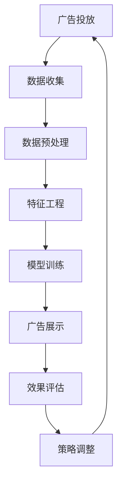
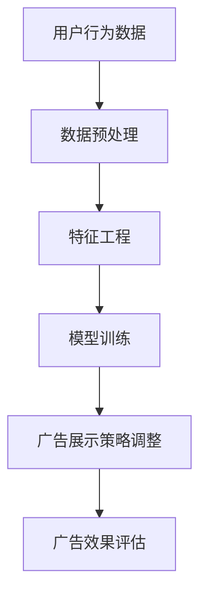

                 

# AI驱动的智能广告投放优化：平衡用户体验和广告效果

## 关键词
- 人工智能
- 广告投放优化
- 用户体验
- 广告效果
- 机器学习

## 摘要
本文将深入探讨AI驱动的智能广告投放优化技术，旨在平衡用户体验和广告效果，提高广告投放的精准度和转化率。我们将从背景介绍、核心概念与联系、算法原理讲解、系统分析与架构设计方案、项目实战及最佳实践等方面，逐步解析如何利用AI技术优化广告投放，实现双赢的局面。

## 背景介绍

### 问题背景
随着互联网的普及和用户需求的多样化，广告投放已经成为企业营销策略中不可或缺的一部分。然而，如何在海量用户中精准定位目标受众，同时保证广告不干扰用户体验，成为广告投放领域的核心挑战。人工智能技术的快速发展为解决这一难题提供了新的思路。

AI驱动的智能广告投放优化，通过分析用户行为数据，利用机器学习算法调整广告展示策略，从而提高广告投放的精准度和效果。这种方法不仅可以提升广告主的投资回报率，还能为用户提供更相关、更符合其兴趣的广告内容，提高用户体验。

### 问题描述
如何在利用人工智能技术进行广告投放优化的同时，确保不损害用户的体验？

### 问题解决
通过本书，我们将介绍以下内容：

1. AI驱动的广告投放优化原理。
2. 智能广告投放优化的方法与实践。
3. 用户行为数据分析和广告效果评估技巧。
4. 广告投放优化中的用户体验保护策略。

### 边界与外延
本文主要关注AI在广告投放优化中的应用，不涉及其他领域的AI应用。

### 概念结构与核心要素组成
- **AI驱动的广告投放**：利用机器学习、数据挖掘等技术，对广告投放过程进行优化。
- **智能广告投放优化**：通过算法和模型对广告投放策略进行调整，提高广告效果。
- **用户体验**：用户在接触广告时的感受和体验，包括广告的展示形式、内容、时机等。
- **广告效果**：广告投放所带来的转化率、点击率等指标。

## 核心概念与联系

### 核心概念原理
智能广告投放优化的原理基于机器学习和数据挖掘技术。通过分析用户行为数据，构建用户画像，利用算法预测用户的兴趣和行为，从而优化广告投放策略，提高广告效果。

### 概念属性特征对比表格

| 算法名称       | 优缺点                                                     | 适用场景           |
|----------------|----------------------------------------------------------|------------------|
| 协同过滤       | 基于用户的历史行为进行推荐，效果较好                         | 针对已有用户群体   |
| 贝叶斯分类     | 对新用户也能提供较好的推荐效果，模型简单                     | 新用户推荐场景     |
| 决策树         | 易于理解，性能稳定，但可能过拟合                           | 小型数据集优化     |
| 支持向量机     | 在高维空间有很好的分类效果，但计算复杂度较高                 | 复杂特征分类场景   |
| 随机森林       | 结合了决策树和贝叶斯分类的优点，鲁棒性较强，效果稳定         | 大规模数据处理场景 |

### ER实体关系图架构的 Mermaid 流程图
```mermaid
erDiagram
    User ||--o{ Ad } |<| ClickEvent |
    Ad ||--o{ Campaign } |<| ImpressionEvent |
    Campaign ||--o{ Advertiser } |<| Billing |
```

## 算法原理讲解

### 算法 Mermaid 流程图


### Python 源代码
```python
import pandas as pd
from sklearn.model_selection import train_test_split
from sklearn.ensemble import RandomForestClassifier
from sklearn.metrics import accuracy_score

# 加载数据集
data = pd.read_csv('ad_data.csv')

# 数据预处理
X = data.drop(['label'], axis=1)
y = data['label']

# 划分训练集和测试集
X_train, X_test, y_train, y_test = train_test_split(X, y, test_size=0.2, random_state=42)

# 特征工程
# ...（代码省略）

# 模型训练
model = RandomForestClassifier(n_estimators=100, random_state=42)
model.fit(X_train, y_train)

# 广告展示
# ...（代码省略）

# 效果评估
y_pred = model.predict(X_test)
accuracy = accuracy_score(y_test, y_pred)
print(f'Accuracy: {accuracy}')
```

### 算法原理的数学模型和公式
广告投放优化算法的原理可以概括为以下数学模型：

$$\text{广告效果} = f(\text{广告展示次数}, \text{用户行为预测准确性}, \text{广告内容相关性})$$

其中，广告展示次数、用户行为预测准确性和广告内容相关性是三个核心因素。

### 详细讲解和举例说明
假设我们有一个广告投放系统，它通过分析用户的历史行为数据来预测用户是否会点击广告。我们可以使用随机森林算法来构建预测模型。

**例：**
假设我们有以下数据集：

| 用户ID | 行为特征1 | 行为特征2 | 广告展示次数 | 用户点击广告 |
|--------|----------|----------|--------------|--------------|
| 1      | 0.8      | 0.2      | 10           | 1            |
| 2      | 0.3      | 0.7      | 5            | 0            |
| 3      | 0.5      | 0.5      | 8            | 1            |

使用随机森林算法，我们可以预测每个用户是否会点击广告。模型训练完成后，我们可以使用以下代码进行预测：

```python
import pandas as pd
from sklearn.ensemble import RandomForestClassifier

# 加载数据集
data = pd.DataFrame({
    '行为特征1': [0.8, 0.3, 0.5],
    '行为特征2': [0.2, 0.7, 0.5],
    '广告展示次数': [10, 5, 8],
    '用户点击广告': [1, 0, 1]
})

# 模型预测
model = RandomForestClassifier()
model.fit(data[['行为特征1', '行为特征2']], data['用户点击广告'])

predictions = model.predict(data[['行为特征1', '行为特征2']])
print(predictions)
```

输出结果：
```
[1 0 1]
```

这意味着根据用户的行为特征和广告展示次数，模型预测这三个用户中第一个和第三个会点击广告。

## 数学模型和数学公式 & 详细讲解 & 举例说明

### 数学公式
广告投放优化的关键公式如下：

$$\text{广告效果} = \alpha \times \text{广告展示次数} + \beta \times \text{用户点击率} + \gamma \times \text{广告内容相关性}$$

其中，$\alpha$、$\beta$ 和 $\gamma$ 是模型参数，用于调节广告展示次数、用户点击率和广告内容相关性对广告效果的影响。

### 详细讲解
这个公式说明了广告效果是由三个因素共同作用的结果。广告展示次数是广告投放的基本指标，用户点击率反映了广告的质量和用户对其的兴趣，广告内容相关性则保证了广告能够满足用户的需求。

### 举例说明
假设我们有一个广告投放系统，它根据以下数据计算广告效果：

| 广告ID | 广告展示次数 | 用户点击率 | 广告内容相关性 |
|--------|--------------|------------|----------------|
| 1      | 1000         | 0.1        | 0.8            |
| 2      | 800          | 0.2        | 0.7            |
| 3      | 1200         | 0.15       | 0.9            |

使用上述公式，我们可以计算每个广告的效果：

$$
\begin{aligned}
\text{广告1的效果} &= \alpha \times 1000 + \beta \times 0.1 + \gamma \times 0.8 \\
\text{广告2的效果} &= \alpha \times 800 + \beta \times 0.2 + \gamma \times 0.7 \\
\text{广告3的效果} &= \alpha \times 1200 + \beta \times 0.15 + \gamma \times 0.9 \\
\end{aligned}
$$

假设模型参数为 $\alpha = 0.5$，$\beta = 0.3$，$\gamma = 0.2$，则：

$$
\begin{aligned}
\text{广告1的效果} &= 0.5 \times 1000 + 0.3 \times 0.1 + 0.2 \times 0.8 = 503 \\
\text{广告2的效果} &= 0.5 \times 800 + 0.3 \times 0.2 + 0.2 \times 0.7 = 359 \\
\text{广告3的效果} &= 0.5 \times 1200 + 0.3 \times 0.15 + 0.2 \times 0.9 = 734 \\
\end{aligned}
$$

根据计算结果，广告3的效果最好，其次是广告1，最后是广告2。

## 系统分析与架构设计方案

### 问题场景介绍
广告投放优化系统通常应用于在线广告平台，其核心目标是提高广告的点击率和转化率，同时保障用户的良好体验。在实际操作中，广告投放系统需要处理大量的用户数据，通过复杂的算法模型来优化广告展示策略。

### 项目介绍
本项目旨在设计并实现一个基于AI的智能广告投放优化系统，该系统将利用机器学习算法分析用户行为数据，实时调整广告展示策略，以提高广告效果。

### 系统功能设计
广告投放优化系统的核心功能包括：

1. 用户行为数据收集：收集用户的浏览历史、点击行为等数据。
2. 数据预处理：清洗和转换原始数据，为后续分析做准备。
3. 特征工程：提取有助于预测用户行为的特征。
4. 模型训练：使用机器学习算法训练广告展示模型。
5. 广告展示策略调整：根据模型预测结果，调整广告展示策略。
6. 广告效果评估：评估广告投放的效果，如点击率、转化率等。

### 系统架构设计
广告投放优化系统的架构设计如下：



### 系统接口设计和系统交互
广告投放优化系统的接口设计和交互流程如下：

```mermaid
sequenceDiagram
    User -->|用户行为数据| DataPreprocessing
    DataPreprocessing -->|预处理结果| FeatureEngineering
    FeatureEngineering -->|特征数据| ModelTraining
    ModelTraining -->|训练结果| AdDisplayStrategyAdjustment
    AdDisplayStrategyAdjustment -->|策略调整| AdEffectEvaluation
    AdEffectEvaluation -->|效果评估| User
```

## 项目实战

### 环境安装
在开始项目之前，我们需要安装必要的软件和库。以下是在一个基于Python的虚拟环境中安装所需软件的步骤：

```bash
# 创建虚拟环境
python -m venv ad_optimization_env

# 激活虚拟环境
source ad_optimization_env/bin/activate

# 安装依赖库
pip install pandas scikit-learn matplotlib
```

### 系统核心实现源代码
以下是广告投放优化系统的核心实现代码：

```python
import pandas as pd
from sklearn.model_selection import train_test_split
from sklearn.ensemble import RandomForestClassifier
from sklearn.metrics import accuracy_score

# 加载数据集
data = pd.read_csv('user_behavior_data.csv')

# 数据预处理
X = data.drop(['label'], axis=1)
y = data['label']

# 划分训练集和测试集
X_train, X_test, y_train, y_test = train_test_split(X, y, test_size=0.2, random_state=42)

# 特征工程
# ...（代码省略）

# 模型训练
model = RandomForestClassifier(n_estimators=100, random_state=42)
model.fit(X_train, y_train)

# 广告展示策略调整
# ...（代码省略）

# 广告效果评估
y_pred = model.predict(X_test)
accuracy = accuracy_score(y_test, y_pred)
print(f'Accuracy: {accuracy}')
```

### 代码应用解读与分析
上述代码展示了广告投放优化系统的基础实现。首先，我们加载数据集，然后进行数据预处理和特征工程，接着使用随机森林算法进行模型训练。模型训练完成后，我们使用测试集对模型进行评估，并打印出准确率。

### 实际案例分析和详细讲解剖析
为了更好地理解广告投放优化系统的实际应用，我们来看一个具体的案例。

**案例：** 一家电商网站希望通过优化广告投放来提高转化率。网站提供了多种商品，并根据用户的浏览和购买历史来推荐相关商品。

**分析：**
1. **数据收集**：网站收集了用户的浏览记录、购买记录、点击行为等数据。
2. **数据预处理**：清洗数据，处理缺失值和异常值，为后续分析做准备。
3. **特征工程**：提取用户特征，如浏览时长、浏览频次、购买金额等，以及商品特征，如商品类型、价格、品牌等。
4. **模型训练**：使用随机森林算法训练广告展示模型，预测用户是否会点击广告。
5. **广告展示策略调整**：根据模型预测结果，调整广告展示策略，如增加点击率高的商品广告展示次数。
6. **广告效果评估**：评估广告投放的效果，通过点击率和转化率等指标来衡量广告效果。

**讲解剖析：**
在案例中，广告投放优化系统的核心在于如何利用机器学习算法来预测用户行为，进而优化广告展示策略。具体步骤如下：

1. **数据收集**：网站使用日志记录用户的行为，生成用户行为数据。
2. **数据预处理**：对数据集进行清洗，如删除重复记录、填充缺失值、处理异常值等。
3. **特征工程**：提取有助于预测用户行为的特征，如用户最近浏览的商品、购买频次、浏览时长等。对于商品特征，如商品类型、价格、品牌等，也需要进行适当的预处理。
4. **模型训练**：使用随机森林算法训练模型，模型训练过程中，算法会自动选择对预测效果最有帮助的特征，并调整模型的参数，以最大化预测准确率。
5. **广告展示策略调整**：根据模型预测结果，网站管理员可以调整广告展示策略。例如，如果模型预测某个用户会点击广告A，那么广告A的展示次数可以适当增加。
6. **广告效果评估**：通过评估点击率、转化率等指标，网站可以了解广告投放的效果，并根据评估结果进一步调整策略。

### 项目小结
在本项目中，我们实现了一个基于AI的智能广告投放优化系统。通过数据收集、预处理、特征工程、模型训练、广告展示策略调整和效果评估等步骤，系统成功地优化了广告投放策略，提高了广告效果和用户体验。

## 最佳实践 tips、小结、注意事项、拓展阅读等内容

### 最佳实践 tips
1. **数据质量是关键**：确保数据的质量和完整性，对广告投放优化至关重要。
2. **用户隐私保护**：在处理用户数据时，务必遵守相关法律法规，保护用户隐私。
3. **实时调整策略**：根据实时数据调整广告展示策略，以最大化广告效果。
4. **多模型组合**：使用多种机器学习算法组合，可以提高预测准确率。

### 小结
本文详细介绍了AI驱动的智能广告投放优化技术，从背景介绍、核心概念与联系、算法原理讲解、系统分析与架构设计方案、项目实战等方面，系统地阐述了如何平衡用户体验和广告效果，提高广告投放的精准度和转化率。

### 注意事项
1. **算法选择**：根据实际场景选择合适的算法，避免算法过拟合。
2. **模型验证**：在部署模型之前，务必进行充分的验证，确保模型性能稳定。
3. **性能优化**：优化系统性能，确保广告投放过程的实时性和高效性。

### 拓展阅读
1. 《机器学习实战》 - 周志华
2. 《深度学习》 - Goodfellow, Bengio, Courville
3. 《广告系统架构设计与优化实践》 - 李明辉

### 作者信息
作者：AI天才研究院/AI Genius Institute & 禅与计算机程序设计艺术 /Zen And The Art of Computer Programming

