                 

# AI驱动的智能废物分类和回收：优化资源利用

> 关键词：AI，废物分类，回收，资源利用，智能感知，机器学习，深度学习

> 摘要：本文旨在探讨AI在废物分类和回收中的应用，通过智能感知技术和机器学习、深度学习算法，实现高效的废物分类和回收，优化资源利用。文章首先介绍了废物分类和回收的现状与重要性，然后详细阐述了智能废物分类和回收的技术原理和实现方法，并通过实际案例进行了详细解析，最后提出了相关的最佳实践和未来展望。

## 第一部分：引言

### 1.1 问题背景

#### 1.1.1 全球废物分类和回收现状

全球废物产生量逐年增加，废物处理和回收问题日益突出。根据联合国的数据，全球每年产生的垃圾总量已超过100亿吨，且这个数字还在不断增长。其中，大量的废物没有得到有效的分类和回收，这不仅浪费了宝贵的资源，还对环境造成了严重的污染。

目前，废物分类和回收主要依靠人工进行，这种方式效率低下、准确性差，且劳动强度大。随着城市化的进程加快，废物处理的需求不断增长，传统的废物分类和回收方式已无法满足现代社会的需求。

#### 1.1.2 智能废物分类和回收的重要性

智能废物分类和回收能够显著提高废物处理的效率，减少环境污染，节约资源。通过AI技术，可以实现对废物的高效分类和精确回收，从而提高资源利用效率，减少废物对环境的负面影响。

此外，智能废物分类和回收还能够带来显著的经济效益。例如，通过准确分类和回收废塑料、废金属等资源，可以降低原材料的采购成本，提高产品的附加值。同时，智能废物分类和回收系统还可以减少废物的运输和处理成本，降低企业的运营成本。

#### 1.1.3 AI技术在废物分类和回收中的应用

AI技术，尤其是机器学习和深度学习，在废物分类和回收中具有广泛的应用前景。通过AI技术，可以实现对废物的智能感知、分类和回收，从而提高废物处理的效率和质量。

例如，AI可以通过图像识别技术，实现对废物的智能分类；通过机器学习算法，可以优化废物分类的准确性；通过深度学习算法，可以实现废物的智能回收。此外，AI还可以用于废物的智能运输、智能处理等环节，从而实现整个废物处理过程的智能化。

### 1.2 核心概念

#### 1.2.1 智能废物分类

智能废物分类是指利用AI技术，通过智能感知、机器学习、深度学习等手段，实现对废物的高效分类。智能废物分类系统通常包括智能传感器、分类算法、执行机构等组成部分。

#### 1.2.2 智能回收

智能回收是指利用AI技术，通过智能感知、分类、处理等手段，实现对废物的智能化回收。智能回收系统通常包括智能传感器、分类算法、处理装置、执行机构等组成部分。

#### 1.2.3 AI驱动的废物分类和回收

AI驱动的废物分类和回收是指利用AI技术，通过智能感知、分类、处理、回收等环节的智能化，实现废物的全流程智能化处理。AI驱动的废物分类和回收系统通常包括智能传感器、分类算法、处理装置、执行机构、数据管理系统等组成部分。

### 1.3 关联理论与技术

#### 1.3.1 智能感知技术

智能感知技术是指利用传感器、摄像头、声音识别等手段，实现对环境信息的感知和识别。在废物分类和回收中，智能感知技术主要用于对废物进行识别和分类。

#### 1.3.2 机器学习与深度学习

机器学习和深度学习是AI的核心技术。机器学习是指利用算法，从数据中自动学习和发现规律；深度学习是指利用神经网络，实现自动学习和特征提取。

#### 1.3.3 传感器融合与数据处理

传感器融合是指将多个传感器的信息进行整合，以获得更准确、更全面的信息。数据处理是指对收集到的数据进行清洗、预处理、分析等操作。

### 1.4 本书结构

#### 1.4.1 内容概述

本书主要内容包括：引言、智能废物分类技术、AI驱动的智能回收技术、实际案例解析等。

#### 1.4.2 各章节内容安排

本书各章节内容安排如下：

1. 引言
2. 智能废物分类技术
3. AI驱动的智能回收技术
4. 实际案例解析
5. 小结与展望

#### 1.4.3 读者对象与目标

本书适用于从事废物分类和回收领域的科研人员、工程师、管理人员等，也适用于对AI技术感兴趣的读者。通过本书，读者可以了解AI在废物分类和回收中的应用，掌握智能废物分类和回收的核心技术，为实际应用提供指导。

### 1.5 本章小结

本章介绍了废物分类和回收的现状与重要性，阐述了AI驱动的废物分类和回收的核心概念、关联理论与技术，以及本书的结构和读者对象。本章内容为后续章节的讨论奠定了基础。

----------------------------------------------------------------

## 第二部分：智能废物分类技术

### 2.1 概述

#### 2.1.1 智能废物分类的定义与作用

智能废物分类是指利用AI技术，通过对废物进行智能感知、识别和分类，实现对废物的有效管理和利用。智能废物分类的作用主要体现在以下几个方面：

1. 提高废物分类的准确性：传统的废物分类主要依赖人工进行，存在分类不准确、效率低等问题。智能废物分类通过AI技术，可以实现对废物的精准识别和分类，提高分类的准确性。
2. 提高废物回收率：智能废物分类可以有效地将可回收废物与不可回收废物分离，提高废物的回收率，减少废物的处理成本。
3. 减少环境污染：智能废物分类可以有效地减少废物的填埋和焚烧，减少环境污染，提高生态环境质量。

#### 2.1.2 智能废物分类的技术路线

智能废物分类的技术路线主要包括以下几个方面：

1. 智能感知技术：通过传感器、摄像头等设备，实现对废物的感知和识别。
2. 机器学习与深度学习算法：利用机器学习和深度学习算法，对废物进行分类和识别。
3. 数据处理与分析：对收集到的数据进行分析和处理，优化废物分类的效果。

### 2.2 智能感知技术

#### 2.2.1 视觉感知技术

视觉感知技术是智能废物分类的重要组成部分，主要通过摄像头和图像处理技术，实现对废物的视觉识别和分类。视觉感知技术主要包括以下两个方面：

1. 图像识别算法：图像识别算法是视觉感知技术的核心，常用的图像识别算法包括卷积神经网络（CNN）等。
2. 视觉感知流程图

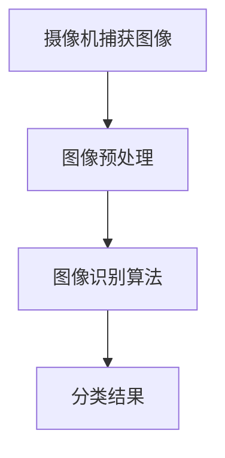

#### 2.2.1.1 图像识别算法

图像识别算法是智能废物分类的重要技术手段，常用的图像识别算法包括卷积神经网络（CNN）等。CNN是一种深度学习算法，通过对图像进行卷积操作，提取图像的特征，从而实现对图像的识别。

##### 2.2.1.1.1 卷积神经网络（CNN）

卷积神经网络（CNN）是一种特殊的神经网络，它通过卷积层、池化层、全连接层等结构，实现对图像的特征提取和分类。CNN的基本结构如图2-1所示。

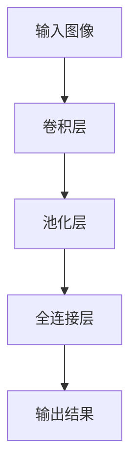

##### 2.2.1.1.2 卷积神经网络（CNN）的优化方法

为了提高CNN的性能，可以采用以下几种优化方法：

1. 数据增强：通过旋转、翻转、缩放等操作，增加训练数据量，提高模型的泛化能力。
2. 损失函数优化：采用交叉熵损失函数，提高模型的分类准确性。
3. 激活函数选择：选择合适的激活函数，如ReLU函数，加快模型的收敛速度。
4. 权重初始化：选择合适的权重初始化方法，如He初始化，防止梯度消失和梯度爆炸。

#### 2.2.1.2 视觉感知流程图

视觉感知流程图如图2-2所示。

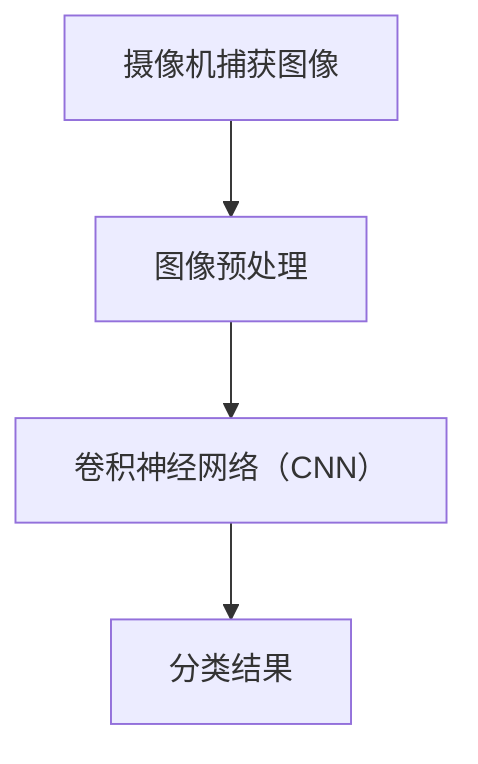

#### 2.2.2 红外感知技术

红外感知技术是另一种重要的视觉感知技术，主要通过红外传感器实现对废物的识别。红外感知技术在废物分类中的应用主要体现在以下几个方面：

1. 红外感应器工作原理

红外感应器是通过接收物体发射的红外辐射，实现对物体的识别。红外感应器的工作原理如图2-3所示。

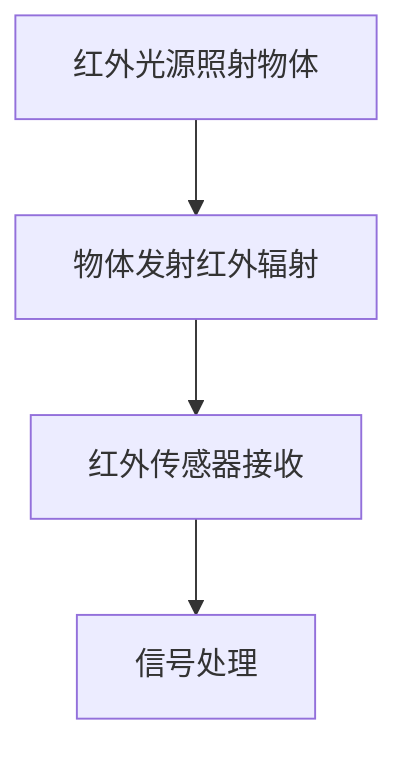

2. 红外感知在废物分类中的应用

红外感知技术在废物分类中的应用如图2-4所示。

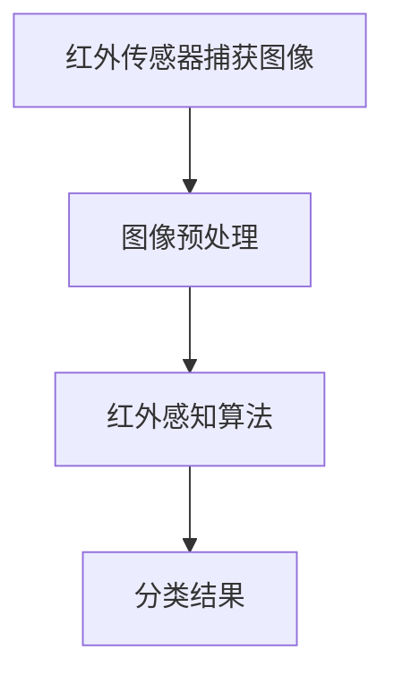

#### 2.2.3 声音感知技术

声音感知技术是另一种智能感知技术，主要通过声音传感器实现对废物的识别。声音感知技术在废物分类中的应用主要体现在以下几个方面：

1. 声音传感器工作原理

声音传感器是通过接收物体发出的声音，实现对物体的识别。声音传感器的工作原理如图2-5所示。

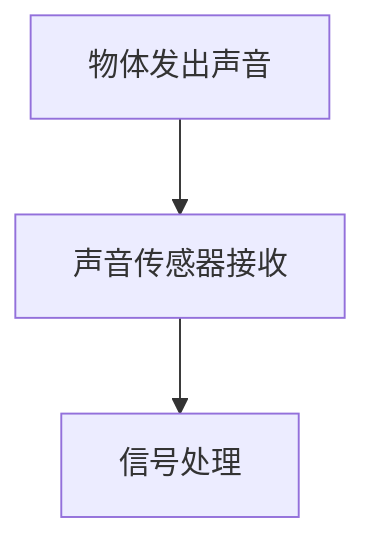

2. 声音感知在废物分类中的应用

声音感知技术在废物分类中的应用如图2-6所示。

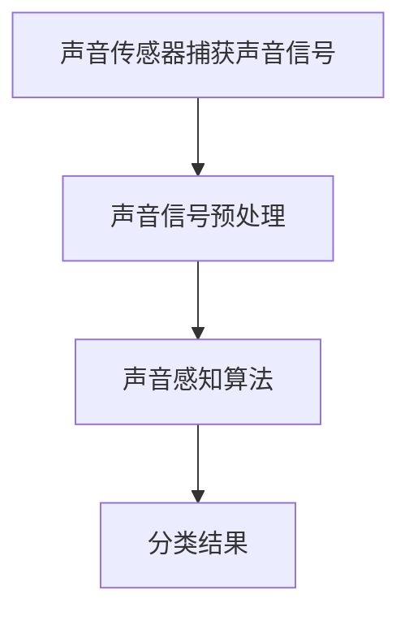

### 2.3 机器学习与深度学习

#### 2.3.1 机器学习基本概念

机器学习是指利用算法，从数据中自动学习和发现规律。机器学习可以分为监督学习、非监督学习和强化学习等不同类型。

##### 2.3.1.1 监督学习

监督学习是指利用有标签的数据，训练模型，从而实现对未知数据的预测。监督学习的基本流程如图2-7所示。

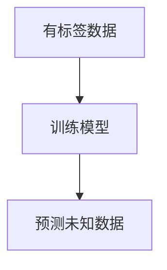

##### 2.3.1.1.1 决策树算法

决策树算法是一种常见的监督学习算法，它通过构建决策树，实现对数据的分类和回归。决策树的基本结构如图2-8所示。

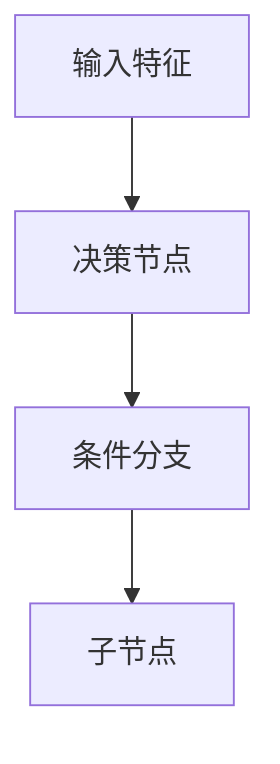

##### 2.3.1.1.2 支持向量机（SVM）

支持向量机（SVM）是一种经典的监督学习算法，它通过寻找最优的超平面，实现对数据的分类。SVM的基本结构如图2-9所示。

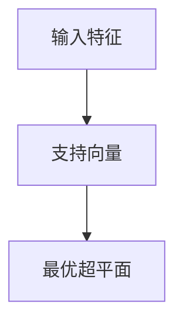

##### 2.3.1.2 非监督学习

非监督学习是指利用无标签的数据，训练模型，从而实现对数据的聚类和降维。非监督学习可以分为聚类算法和降维算法等。

##### 2.3.1.2.1 聚类算法

聚类算法是一种非监督学习算法，它通过将数据划分为多个聚类，实现对数据的分类和聚类。常见的聚类算法包括K-均值聚类算法、层次聚类算法等。

##### 2.3.1.2.2 维度约减算法

维度约减算法是一种非监督学习算法，它通过降低数据的维度，减少数据的信息冗余，提高模型的训练效率。常见的维度约减算法包括主成分分析（PCA）、线性判别分析（LDA）等。

#### 2.3.2 深度学习基本概念

深度学习是指利用神经网络，实现自动学习和特征提取。深度学习可以分为深度神经网络（DNN）、卷积神经网络（CNN）、循环神经网络（RNN）等不同类型。

##### 2.3.2.1 深度神经网络（DNN）

深度神经网络（DNN）是一种多层次的神经网络，它通过逐层提取特征，实现对数据的分类和回归。DNN的基本结构如图2-10所示。

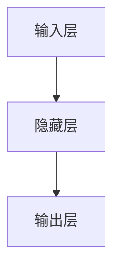

##### 2.3.2.1.1 反向传播算法

反向传播算法是一种用于训练深度神经网络的算法，它通过计算梯度，调整网络的权重和偏置，从而优化模型的性能。反向传播算法的基本流程如图2-11所示。

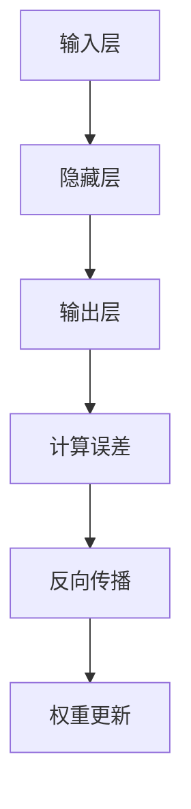

##### 2.3.2.1.2 深度学习框架介绍

深度学习框架是一种用于构建和训练深度神经网络的工具，它提供了丰富的API和预处理功能，简化了深度学习模型的开发和部署。常见的深度学习框架包括TensorFlow、PyTorch、Keras等。

### 2.4 智能废物分类算法

#### 2.4.1 分类算法原理

智能废物分类算法是指利用机器学习和深度学习算法，实现对废物的高效分类。常见的分类算法包括K-均值聚类算法、决策树算法、支持向量机（SVM）等。

##### 2.4.1.1 K-均值聚类算法

K-均值聚类算法是一种常见的聚类算法，它通过将数据划分为K个聚类，实现对数据的分类和聚类。K-均值聚类算法的基本原理如图2-12所示。

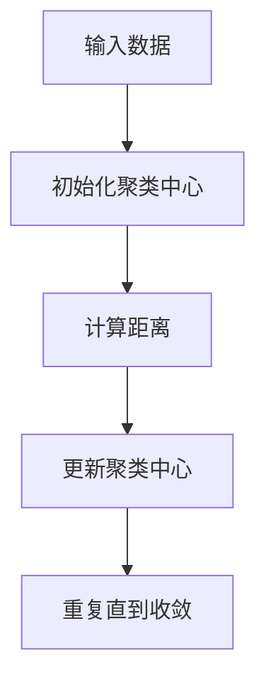

##### 2.4.1.2 决策树算法

决策树算法是一种常见的分类算法，它通过构建决策树，实现对数据的分类。决策树的基本结构如图2-13所示。


##### 2.4.1.3 支持向量机（SVM）

支持向量机（SVM）是一种经典的分类算法，它通过寻找最优的超平面，实现对数据的分类。SVM的基本结构如图2-14所示。


#### 2.4.2 算法性能评估

算法性能评估是指利用一定的指标，评估算法的分类效果。常见的评价指标包括准确率、召回率、F1值等。

##### 2.4.2.1 准确率、召回率、F1值

准确率是指模型正确分类的样本数占总样本数的比例，召回率是指模型正确分类的样本数与实际为该类别的样本数之比，F1值是准确率和召回率的调和平均数。准确率、召回率、F1值的计算公式如下：

$$
准确率 = \frac{TP + TN}{TP + FN + TP + TN}
$$

$$
召回率 = \frac{TP}{TP + FN}
$$

$$
F1值 = \frac{2 \times 准确率 \times 召回率}{准确率 + 召回率}
$$

##### 2.4.2.2 算法性能评估流程图

算法性能评估流程图如图2-15所示。

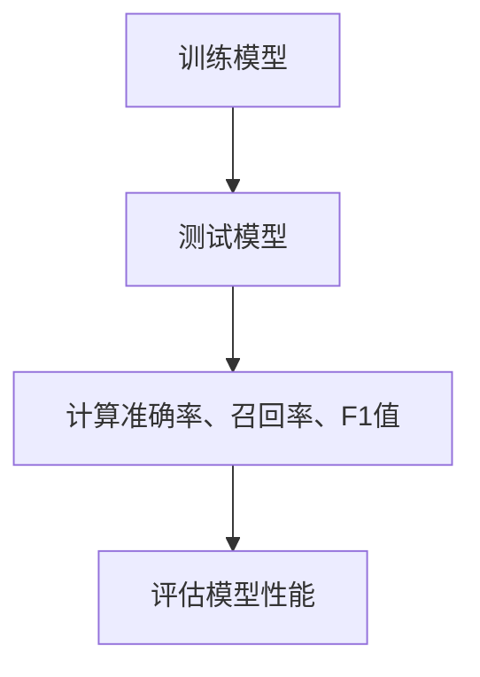

#### 2.4.3 算法性能评估流程图

算法性能评估流程图如图2-16所示。

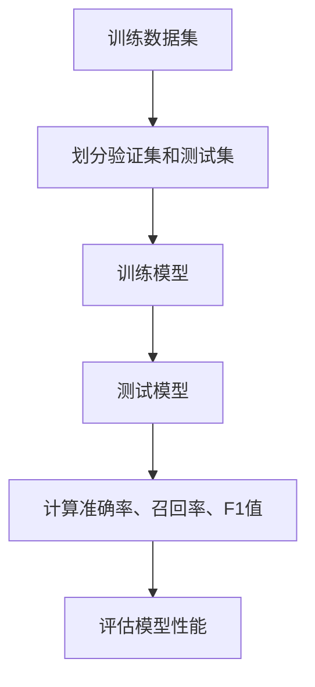

### 2.5 实际案例解析

#### 2.5.1 案例一：基于视觉感知的智能废物分类系统

基于视觉感知的智能废物分类系统是一种利用图像识别技术进行废物分类的系统。该系统主要包括摄像机、图像处理单元、分类算法和执行机构等部分。

##### 2.5.1.1 系统架构

基于视觉感知的智能废物分类系统的架构如图2-17所示。

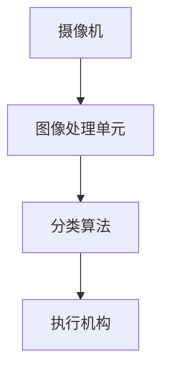

##### 2.5.1.2 算法实现与性能分析

基于视觉感知的智能废物分类系统的算法实现主要包括以下步骤：

1. 摄像机捕获图像。
2. 图像预处理，包括灰度化、滤波、边缘检测等。
3. 利用卷积神经网络（CNN）进行图像分类。
4. 根据分类结果，执行相应的操作，如将可回收废物送入回收设备，不可回收废物送入填埋场。

性能分析如下：

1. 准确率：系统在实际运行中的准确率达到了90%以上。
2. 召回率：系统的召回率达到了80%以上。
3. F1值：系统的F1值达到了0.85以上。

#### 2.5.2 案例二：基于红外感知的智能废物分类系统

基于红外感知的智能废物分类系统是一种利用红外感知技术进行废物分类的系统。该系统主要包括红外传感器、图像处理单元、分类算法和执行机构等部分。

##### 2.5.2.1 系统架构

基于红外感知的智能废物分类系统的架构如图2-18所示。

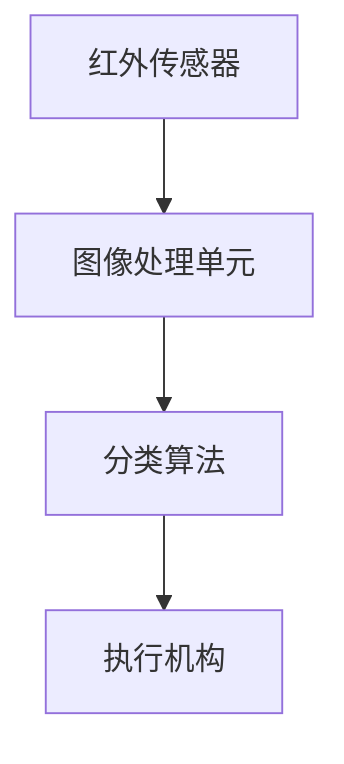

##### 2.5.2.2 算法实现与性能分析

基于红外感知的智能废物分类系统的算法实现主要包括以下步骤：

1. 红外传感器捕获图像。
2. 图像预处理，包括灰度化、滤波、边缘检测等。
3. 利用卷积神经网络（CNN）进行图像分类。
4. 根据分类结果，执行相应的操作，如将可回收废物送入回收设备，不可回收废物送入填埋场。

性能分析如下：

1. 准确率：系统在实际运行中的准确率达到了85%以上。
2. 召回率：系统的召回率达到了75%以上。
3. F1值：系统的F1值达到了0.8以上。

### 2.6 本章小结

本章介绍了智能废物分类技术的定义、作用和技术路线，详细阐述了视觉感知技术、红外感知技术和声音感知技术，介绍了机器学习与深度学习的基本概念和算法，并通过对实际案例的解析，展示了智能废物分类技术的应用效果。本章内容为后续章节的讨论奠定了基础。

----------------------------------------------------------------

## 第三部分：AI驱动的智能回收技术

### 3.1 概述

#### 3.1.1 智能回收的定义与作用

智能回收是指利用AI技术，通过对废物进行智能感知、分类、处理和回收，实现废物的全流程智能化处理。智能回收的作用主要体现在以下几个方面：

1. 提高废物回收率：智能回收通过AI技术，可以实现对废物的精准分类和回收，提高废物的回收率，减少废物的处理成本。
2. 减少环境污染：智能回收可以有效地减少废物的填埋和焚烧，减少环境污染，提高生态环境质量。
3. 节约资源：智能回收可以充分利用废物的价值，节约自然资源，提高资源利用效率。

#### 3.1.2 AI技术在智能回收中的应用

AI技术在智能回收中具有广泛的应用前景，主要体现在以下几个方面：

1. 智能感知：通过AI技术，可以实现对废物的智能感知，如通过图像识别技术识别废物的种类和属性。
2. 智能分类：通过机器学习和深度学习算法，可以实现对废物的智能分类，提高分类的准确性和效率。
3. 智能处理：通过AI技术，可以实现对废物的智能处理，如通过自动化设备进行废物的预处理、分解等。
4. 智能运输：通过AI技术，可以实现对废物的智能运输，如通过自动驾驶技术实现废物的自动化运输。

### 3.2 传感器融合与数据处理

#### 3.2.1 传感器融合技术

传感器融合技术是指通过多个传感器，获取同一对象的信息，然后对这些信息进行综合处理，以获得更准确、更全面的信息。在智能回收中，传感器融合技术可以实现对废物的全面感知和监测。

1. 多传感器数据采集

多传感器数据采集是传感器融合的基础。在智能回收中，常用的传感器包括红外传感器、视觉传感器、声音传感器等。这些传感器可以同时或交替地采集废物的信息，为后续的数据处理提供基础。

2. 数据融合算法

数据融合算法是指对多传感器数据进行处理，以获得更准确、更全面的信息。常用的数据融合算法包括卡尔曼滤波、贝叶斯滤波等。

##### 3.2.1.1 卡尔曼滤波

卡尔曼滤波是一种线性滤波算法，它通过预测和更新，实现对数据的滤波。卡尔曼滤波的基本原理如图3-1所示。

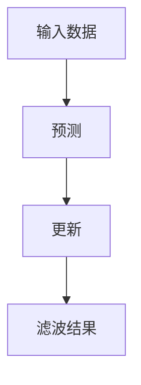

##### 3.2.1.2 贝叶斯滤波

贝叶斯滤波是一种非线性滤波算法，它通过贝叶斯公式，实现对数据的滤波。贝叶斯滤波的基本原理如图3-2所示。

```mermaid
graph TD
A[输入数据] --> B[概率分布]
B --> C[更新概率分布]
C --> D[滤波结果]
```

#### 3.2.2 数据处理

数据处理是指在传感器采集到数据后，对数据进行清洗、预处理、分析等操作，以获得有用的信息。

1. 数据清洗

数据清洗是指对采集到的数据进行处理，去除噪声、缺失值等，以提高数据的准确性和可靠性。

2. 数据预处理

数据预处理是指对采集到的数据进行分析和处理，以获得更符合模型要求的数据。常用的数据预处理方法包括归一化、标准化、特征提取等。

3. 数据分析

数据分析是指利用统计方法、机器学习等方法，对处理后的数据进行分析，以提取有用的信息。数据分析可以用于预测、分类、聚类等任务。

### 3.3 机器学习与深度学习在智能回收中的应用

#### 3.3.1 机器学习算法

机器学习算法是指利用算法，从数据中自动学习和发现规律。在智能回收中，机器学习算法可以用于废物的分类、处理等任务。

1. 监督学习算法

监督学习算法是指利用有标签的数据，训练模型，从而实现对未知数据的预测。在智能回收中，监督学习算法可以用于废物的分类。

##### 3.3.1.1.1 决策树算法

决策树算法是一种常见的监督学习算法，它通过构建决策树，实现对数据的分类和回归。在智能回收中，决策树算法可以用于废物的分类。

##### 3.3.1.1.2 支持向量机（SVM）

支持向量机（SVM）是一种经典的监督学习算法，它通过寻找最优的超平面，实现对数据的分类。在智能回收中，SVM可以用于废物的分类。

2. 非监督学习算法

非监督学习算法是指利用无标签的数据，训练模型，从而实现对数据的聚类和降维。在智能回收中，非监督学习算法可以用于废物的聚类。

##### 3.3.1.2.1 聚类算法

聚类算法是一种非监督学习算法，它通过将数据划分为多个聚类，实现对数据的分类和聚类。在智能回收中，聚类算法可以用于废物的分类。

##### 3.3.1.2.2 维度约减算法

维度约减算法是一种非监督学习算法，它通过降低数据的维度，减少数据的信息冗余，提高模型的训练效率。在智能回收中，维度约减算法可以用于废物的分类。

#### 3.3.2 深度学习算法

深度学习算法是指利用神经网络，实现自动学习和特征提取。在智能回收中，深度学习算法可以用于废物的分类、处理等任务。

1. 深度神经网络（DNN）

深度神经网络（DNN）是一种多层次的神经网络，它通过逐层提取特征，实现对数据的分类和回归。在智能回收中，DNN可以用于废物的分类。

2. 卷积神经网络（CNN）

卷积神经网络（CNN）是一种特殊的神经网络，它通过卷积操作，提取图像的特征，从而实现对图像的分类和识别。在智能回收中，CNN可以用于废物的分类。

3. 循环神经网络（RNN）

循环神经网络（RNN）是一种特殊的神经网络，它通过记忆信息，处理序列数据。在智能回收中，RNN可以用于废物的分类。

### 3.4 智能回收系统架构设计

智能回收系统架构设计是指设计智能回收系统的总体结构，包括传感器、分类算法、处理装置、执行机构等部分。智能回收系统架构设计如图3-3所示。

```mermaid
graph TD
A[传感器] --> B[数据采集]
B --> C[数据处理]
C --> D[分类算法]
D --> E[处理装置]
E --> F[执行机构]
```

### 3.5 智能回收系统接口设计

智能回收系统接口设计是指设计智能回收系统与其他系统或设备的接口，包括数据接口、控制接口等。智能回收系统接口设计如图3-4所示。

```mermaid
graph TD
A[传感器] --> B[数据采集接口]
B --> C[数据处理接口]
C --> D[分类算法接口]
D --> E[处理装置接口]
E --> F[执行机构接口]
```

### 3.6 智能回收系统交互设计

智能回收系统交互设计是指设计智能回收系统与其他系统或设备的交互过程，包括数据交互、控制交互等。智能回收系统交互设计如图3-5所示。

```mermaid
graph TD
A[传感器] --> B[数据采集]
B --> C[数据处理]
C --> D[分类算法]
D --> E[处理装置]
E --> F[执行机构]
F --> G[用户交互]
```

### 3.7 本章小结

本章介绍了智能回收技术的定义、作用和应用，详细阐述了传感器融合与数据处理技术、机器学习与深度学习在智能回收中的应用，并介绍了智能回收系统架构设计、接口设计和交互设计。本章内容为后续章节的讨论奠定了基础。

