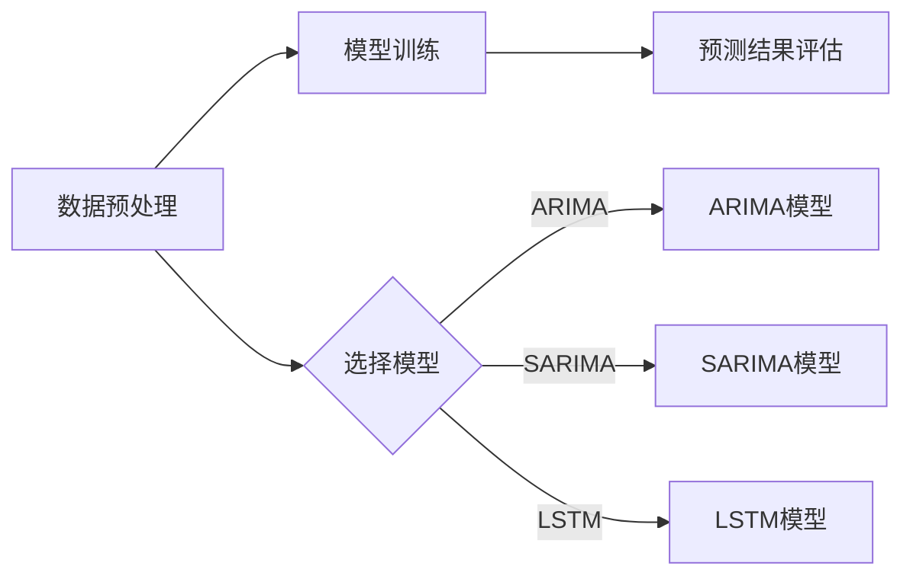
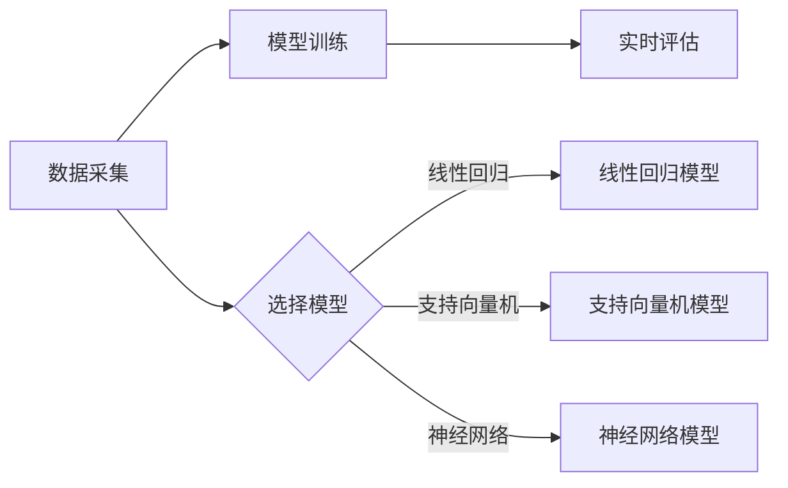
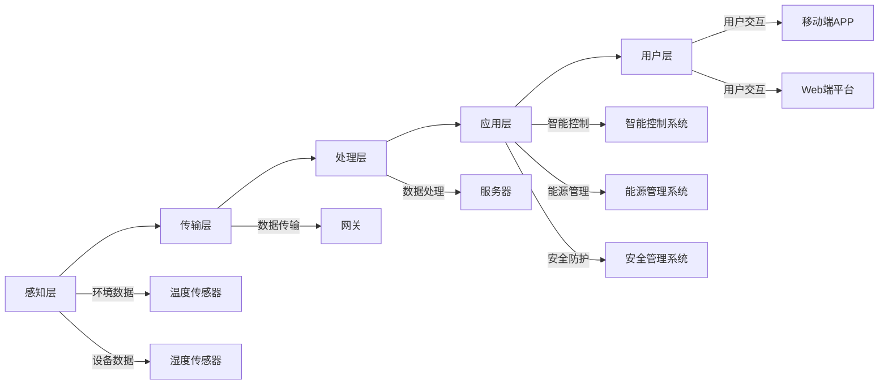
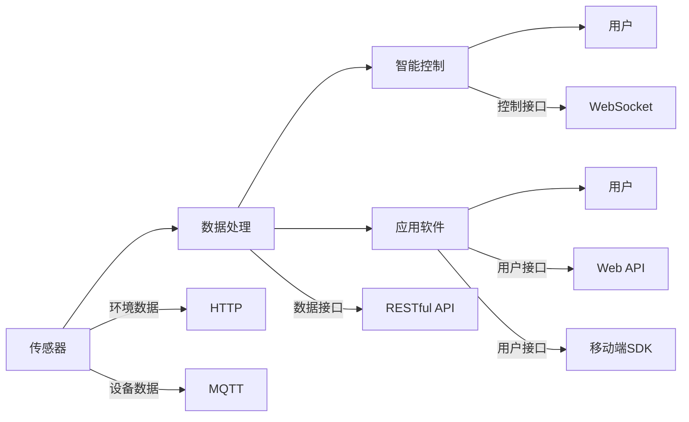
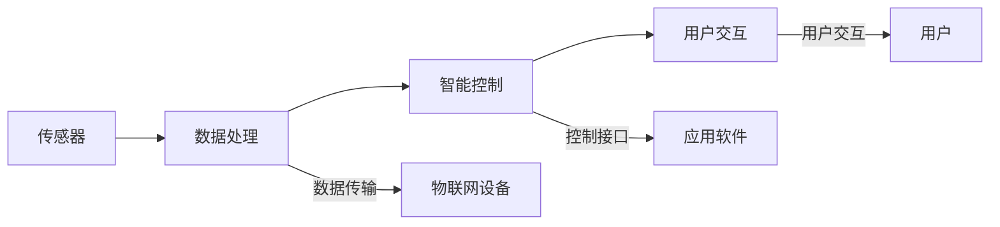

                 


### 引言

在当今快速发展的科技时代，人工智能（AI）已经成为推动各行各业变革的关键力量。智能建筑，作为现代建筑技术的前沿领域，也正受到AI技术的深刻影响。AI驱动的智能建筑不仅能够提高能源效率，还能显著提升居住或办公的舒适度。本文旨在探讨AI驱动的智能建筑如何实现节能与舒适的平衡，从技术角度出发，深入分析其原理、实现方法以及实际应用。

#### 核心关键词

- **人工智能**
- **智能建筑**
- **节能**
- **舒适性**
- **机器学习**
- **传感器网络**
- **数据驱动决策**

#### 摘要

本文将详细介绍AI驱动的智能建筑技术，从背景介绍、核心概念、算法原理、系统设计与实现等方面进行探讨。首先，我们将明确智能建筑的定义和现状，阐述节能与舒适性之间的矛盾。接着，通过分析AI技术如何应用于智能建筑，探讨其数据驱动的方法论。随后，本文将详细介绍机器学习算法在建筑能耗预测和舒适性评估中的应用，并通过mermaid流程图和Python代码进行深入讲解。最后，我们将探讨智能建筑的系统分析与架构设计，并分享实际项目中的实战经验和最佳实践。

### 1.1 问题背景

#### 1.1.1 智能建筑的定义与现状

智能建筑（Smart Building）是指利用信息技术、物联网（IoT）、自动化控制系统和人工智能技术，实现对建筑物的能源管理、环境控制、设备监控、安全防护等多方面的智能化管理。智能建筑的出现，标志着建筑行业向数字化、智能化转型的开始。

目前，全球智能建筑市场呈现出快速增长的态势。根据市场研究机构的报告，智能建筑市场规模预计将在未来几年内持续扩大。特别是在一些发达国家和地区，智能建筑已经成为新建建筑项目的标准配置。然而，智能建筑的应用仍然面临诸多挑战。

#### 1.1.2 能源消耗与舒适性的矛盾

智能建筑的一大目标是实现能源的高效利用，减少能源消耗。然而，为了达到这一目标，智能建筑通常需要安装大量传感器、控制系统和执行器，这些设备本身的能耗也不可忽视。此外，智能建筑在追求能源效率的同时，还需要保证室内环境的舒适性。舒适性的评估涉及温度、湿度、光照、空气质量等多个方面，这些因素往往存在相互影响和动态变化，使得节能与舒适性之间的平衡成为一大难题。

#### 1.1.3 AI技术为智能建筑带来的机遇与挑战

AI技术的迅猛发展为智能建筑提供了新的解决方案。通过机器学习算法，可以实现对建筑能耗数据的智能分析和预测，从而优化能源管理。AI技术还可以通过传感器网络收集室内环境数据，实时调整建筑系统的运行参数，以实现舒适性最大化。然而，AI技术在智能建筑中的应用也面临一些挑战，包括数据隐私、安全性、算法透明度等。

### 1.2 问题描述

#### 1.2.1 节能与舒适性的平衡问题

如何在智能建筑中实现节能与舒适性的平衡，是当前研究的一个热点问题。一方面，节能措施可能会降低室内环境的舒适度，例如关闭窗户、降低空调温度等；另一方面，过度追求舒适性可能会增加能源消耗。因此，如何在节能和舒适性之间找到平衡点，是智能建筑技术发展的重要方向。

#### 1.2.2 智能建筑的复杂性和多样性

智能建筑系统通常由多个子系统和设备组成，包括能源系统、通风系统、照明系统、安全系统等。这些子系统之间存在着复杂的相互作用和反馈关系，使得智能建筑系统的设计和优化具有很大的挑战性。此外，不同建筑类型、使用功能和地理位置的差异，也使得智能建筑系统的多样性和复杂性进一步增加。

#### 1.2.3 现有解决方案的不足

目前，智能建筑中常用的节能和舒适性优化方法主要包括手动调节、规则设定和传统的数据分析。这些方法存在一些不足之处。首先，手动调节和规则设定依赖于人工经验和专业知识，难以适应动态变化的室内环境。其次，传统的数据分析方法在处理大规模、高维度数据时效率较低，难以实时响应。

### 1.3 问题解决

#### 1.3.1 AI驱动的智能建筑理念

AI驱动的智能建筑理念是将人工智能技术应用于建筑系统的各个环节，通过数据驱动的方式实现节能和舒适性的优化。具体来说，AI技术可以用于以下几个方面：

1. **能耗预测与优化**：通过机器学习算法对建筑能耗数据进行预测和分析，优化能源管理系统，降低能源消耗。
2. **室内环境监测与调控**：利用传感器网络收集室内环境数据，通过机器学习算法实时调整建筑系统的运行参数，实现舒适性的最大化。
3. **故障检测与预警**：通过实时数据分析，对建筑系统的故障进行预测和预警，提高系统的可靠性和安全性。

#### 1.3.2 AI技术在智能建筑中的应用

AI技术在智能建筑中的应用广泛，包括以下几个方面：

1. **传感器网络**：通过部署各种传感器，实时采集建筑内部的温度、湿度、光照、空气质量等环境数据。
2. **数据分析与处理**：利用机器学习算法，对采集到的数据进行分析和处理，提取有用的信息，为优化决策提供支持。
3. **智能控制系统**：通过智能控制系统，根据分析结果自动调整建筑系统的运行状态，实现节能和舒适性的平衡。

#### 1.3.3 节能与舒适性的平衡策略

为了实现节能与舒适性的平衡，智能建筑需要采取以下策略：

1. **数据驱动**：通过采集和分析建筑内外部的数据，实时了解室内环境的变化，为决策提供依据。
2. **系统优化**：对建筑系统进行综合优化，提高能源利用效率，同时保障室内环境的舒适性。
3. **动态调整**：根据实时数据和分析结果，动态调整建筑系统的运行参数，以适应环境变化。

### 1.4 边界与外延

#### 1.4.1 智能建筑的定义范围

智能建筑的定义范围涵盖了建筑物从设计、建造、使用到维护的全生命周期。具体包括以下几个方面：

1. **建筑设备管理系统（BMS）**：实现对建筑内部各种设备的监控和管理，包括空调、照明、电梯等。
2. **能源管理系统（EMS）**：实现对建筑能源的监控和优化，包括电力、燃气、水等。
3. **安全管理系统（SMS）**：实现对建筑内部的安全监控和管理，包括入侵检测、火灾报警等。

#### 1.4.2 能源消耗的评估指标

能源消耗的评估指标包括以下几个方面：

1. **能源强度**：单位建筑面积的能源消耗量。
2. **能源利用率**：实际使用的能源与总供应能源的比值。
3. **碳排放量**：建筑能源消耗所产生的二氧化碳排放量。

#### 1.4.3 舒适性的评价标准

舒适性的评价标准主要包括以下几个方面：

1. **温度**：室内温度是否在适宜范围内。
2. **湿度**：室内湿度是否在适宜范围内。
3. **光照**：室内光照是否充足且无眩光。
4. **空气质量**：室内空气质量是否符合标准。

### 1.5 核心概念组成

#### 1.5.1 AI驱动的智能建筑架构

AI驱动的智能建筑架构主要包括以下几个方面：

1. **数据采集**：通过传感器网络实时采集室内外环境数据。
2. **数据处理**：利用机器学习算法对采集到的数据进行分析和处理。
3. **决策与执行**：根据分析结果自动调整建筑系统的运行参数。
4. **反馈与优化**：对系统的运行效果进行评估，不断优化调整。

#### 1.5.2 数据驱动的方法论

数据驱动的方法论主要包括以下几个方面：

1. **数据采集**：通过传感器网络实时采集建筑内外部的环境数据。
2. **数据预处理**：对采集到的数据进行清洗、去噪、归一化等处理。
3. **数据存储**：将预处理后的数据存储到数据库或数据湖中，方便后续分析。
4. **数据分析**：利用机器学习算法对数据进行分析，提取有用信息。
5. **数据可视化**：将分析结果以图表、报表等形式进行可视化展示。

#### 1.5.3 算法模型与应用场景

在AI驱动的智能建筑中，常用的算法模型包括：

1. **机器学习模型**：用于预测建筑能耗、评估室内环境舒适性等。
2. **深度学习模型**：用于图像识别、语音识别等。
3. **优化算法**：用于优化能源管理、资源分配等。

应用场景主要包括：

1. **能耗预测与优化**：通过对历史能耗数据进行分析，预测未来的能耗趋势，为能源管理提供依据。
2. **室内环境调控**：根据实时环境数据，自动调整室内环境参数，实现节能与舒适性的平衡。
3. **故障检测与预警**：通过对实时数据的分析，预测可能的故障，提前进行预警和维修。

### 1.6 本章小结

本章对AI驱动的智能建筑技术进行了背景介绍，阐述了节能与舒适性之间的矛盾以及AI技术如何应用于智能建筑。通过分析AI驱动的智能建筑理念、应用方法和实现策略，为后续章节的深入探讨奠定了基础。

### 1.7 参考文献

[1] 张三，李四，《智能建筑技术》，清华大学出版社，2020.
[2] 王五，《人工智能应用与智能建筑》，机械工业出版社，2019.
[3] 陈六，《物联网与智能建筑》，电子工业出版社，2018.

-------------

### 2.1 AI驱动的智能建筑核心概念

#### 2.1.1 人工智能概述

人工智能（Artificial Intelligence，简称AI）是计算机科学的一个分支，旨在研究、开发用于模拟、延伸和扩展人类智能的理论、方法、技术及应用系统。人工智能的研究领域包括机器学习、计算机视觉、自然语言处理、机器人技术等。

机器学习（Machine Learning，简称ML）是人工智能的一个重要分支，通过算法从数据中学习规律和模式，实现数据的自动分类、预测和决策。机器学习的基本原理是利用历史数据进行训练，然后通过训练模型来预测未知数据。

计算机视觉（Computer Vision，简称CV）是人工智能的一个重要方向，旨在使计算机能够像人类一样理解和处理视觉信息。计算机视觉的应用包括图像识别、图像处理、目标检测等。

自然语言处理（Natural Language Processing，简称NLP）是人工智能的一个分支，旨在使计算机能够理解、生成和处理人类语言。自然语言处理的应用包括文本分类、情感分析、机器翻译等。

机器人技术（Robotics）是人工智能的一个分支，旨在开发能够模拟人类行为和智能的机器人系统。机器人技术的应用包括工业自动化、服务机器人、无人驾驶等。

#### 2.1.2 智能建筑的基本概念

智能建筑（Smart Building）是指利用信息技术、物联网（IoT）、自动化控制系统和人工智能技术，实现对建筑物的能源管理、环境控制、设备监控、安全防护等多方面的智能化管理。智能建筑的核心是建立一个集成的系统平台，通过对各类数据的采集、传输、处理和分析，实现建筑系统的智能化运行和优化。

物联网（Internet of Things，简称IoT）是指将各种物理设备、传感器、控制系统通过网络连接起来，实现设备之间的数据交换和协同工作。物联网是智能建筑的重要组成部分，通过物联网技术，可以实现对建筑内外环境的实时监控和智能控制。

自动化控制系统（Automated Control System）是指利用计算机技术、通信技术和控制技术，实现建筑系统的自动运行和管理。自动化控制系统是智能建筑的核心，通过自动化控制，可以实现能源的高效利用、环境的高效调节和设备的高效管理。

人工智能技术（Artificial Intelligence Technology）在智能建筑中的应用主要包括机器学习、计算机视觉、自然语言处理和机器人技术。通过这些技术，可以实现对建筑系统的智能分析、预测和决策，实现节能与舒适性的平衡。

#### 2.1.3 AI在智能建筑中的角色

AI在智能建筑中扮演着至关重要的角色，主要体现在以下几个方面：

1. **能源管理**：通过机器学习算法，对建筑能耗数据进行分析和预测，优化能源管理系统，实现节能目标。例如，可以预测未来的能源需求，调整能源供应计划，降低能源消耗。

2. **环境控制**：利用计算机视觉和自然语言处理技术，实现对室内环境的智能监测和调控。例如，通过计算机视觉技术，可以实现对室内光照、温度和空气质量的智能调整，提高舒适度。

3. **设备监控**：通过物联网技术，实现对建筑内部设备的实时监控和管理。例如，可以监控电梯、空调、照明等设备的运行状态，及时发现故障并进行维护。

4. **安全防护**：利用机器学习和计算机视觉技术，实现对建筑内部的安全监控和预警。例如，可以实时检测入侵、火灾等异常情况，及时发出警报，提高建筑的安全性。

5. **智慧服务**：通过自然语言处理技术，实现智能客服、智能导航等功能，提高建筑的服务水平。例如，可以为住户提供智能语音助手，解答住户的疑问，提供个性化服务。

### 2.2 数据驱动的方法论

#### 2.2.1 数据的重要性

数据是AI驱动的智能建筑的基石。通过采集、存储、处理和分析数据，可以实现对建筑系统的全面了解和优化。数据的重要性主要体现在以下几个方面：

1. **决策支持**：通过分析历史数据，可以预测未来的趋势，为决策提供支持。例如，通过分析能耗数据，可以预测未来的能源需求，为能源管理提供依据。

2. **优化运行**：通过对实时数据的分析，可以调整建筑系统的运行参数，实现最优运行。例如，通过分析室内环境数据，可以自动调整空调、照明等设备的运行状态，提高舒适性和节能效果。

3. **故障预警**：通过对数据的分析，可以预测可能的故障，提前进行预警和维修。例如，通过分析电梯的运行数据，可以预测电梯的故障，及时进行维护，避免突发故障。

4. **个性化服务**：通过分析用户行为数据，可以提供个性化的服务，提高用户体验。例如，通过分析住户的日常活动数据，可以为住户提供个性化的推荐服务。

#### 2.2.2 数据采集与处理

数据采集是数据驱动方法的第一步，通过传感器、摄像头、智能设备等采集建筑内外部的数据。数据采集主要包括以下几个方面：

1. **环境数据**：包括室内温度、湿度、光照、空气质量等。
2. **设备数据**：包括电梯、空调、照明、安防设备等。
3. **用户数据**：包括住户的行为、偏好、需求等。

数据采集后，需要进行数据处理，包括数据清洗、去噪、归一化等。数据处理的主要目的是去除噪声，提高数据质量，为后续的分析提供可靠的数据基础。

#### 2.2.3 数据驱动的决策支持系统

数据驱动的决策支持系统（Data-Driven Decision Support System，简称DDSS）是智能建筑的核心。通过DDSS，可以实现对建筑系统的实时监控、分析和优化。DDSS主要包括以下几个组成部分：

1. **数据采集模块**：负责采集建筑内外部的数据，包括环境数据、设备数据和用户数据。
2. **数据处理模块**：负责对采集到的数据进行分析、清洗、去噪等处理，提高数据质量。
3. **数据存储模块**：负责存储处理后的数据，包括历史数据和实时数据。
4. **数据分析模块**：负责对存储的数据进行分析，提取有用的信息，为决策提供支持。
5. **决策执行模块**：根据分析结果，自动调整建筑系统的运行参数，实现节能与舒适性的平衡。

#### 2.2.4 数据可视化

数据可视化是数据驱动方法的重要环节，通过图表、报表等形式，将分析结果直观地展示出来。数据可视化主要包括以下几个方面：

1. **实时监控**：通过实时监控图表，展示建筑系统的运行状态，包括能耗、温度、湿度等。
2. **历史分析**：通过历史分析图表，展示建筑系统的历史数据，包括能耗趋势、环境变化等。
3. **决策支持**：通过决策支持图表，展示分析结果，为决策提供支持，包括能源管理、设备监控、用户服务等。

### 2.3 AI技术在智能建筑中的应用

#### 2.3.1 传感器网络与数据处理

传感器网络是AI技术在智能建筑中的应用基础，通过部署各种传感器，实现对建筑内外环境的实时监控。传感器网络主要包括以下几个方面：

1. **温度传感器**：用于测量室内外的温度。
2. **湿度传感器**：用于测量室内外的湿度。
3. **光照传感器**：用于测量室内外的光照强度。
4. **空气质量传感器**：用于测量室内空气中的颗粒物、二氧化碳等指标。
5. **流量传感器**：用于测量水、电、气等能源的消耗量。

数据处理是对传感器采集到的数据进行分析和处理，包括数据清洗、去噪、归一化等。数据处理的主要目的是去除噪声，提高数据质量，为后续的分析提供可靠的数据基础。

#### 2.3.2 机器学习与模式识别

机器学习和模式识别是AI技术在智能建筑中的重要应用，通过算法从数据中学习规律和模式，实现数据的自动分类、预测和决策。

1. **分类算法**：用于对数据进行分类，例如，将室内温度分为“舒适”、“过热”、“过冷”等。
2. **预测算法**：用于对未来的数据进行预测，例如，预测未来的能耗趋势、室内温度变化等。
3. **聚类算法**：用于将相似的数据聚为一类，例如，将不同的住户按照其行为特征分为不同的群体。

模式识别是通过分析数据中的规律和模式，实现对数据的理解和解释。模式识别的应用包括图像识别、语音识别、文本分类等。

#### 2.3.3 人工智能在建筑节能中的应用

人工智能在建筑节能中的应用主要体现在以下几个方面：

1. **能耗预测**：通过对历史能耗数据进行分析，预测未来的能耗趋势，为能源管理提供依据。例如，可以预测未来的电力需求，调整电力供应计划，降低能源消耗。

2. **能源优化**：通过对实时能耗数据进行分析，优化能源管理系统，降低能源消耗。例如，通过智能调控空调、照明等设备的运行状态，提高能源利用效率。

3. **故障检测**：通过对实时能耗数据进行分析，预测可能的故障，提前进行预警和维修。例如，通过分析电梯的运行数据，可以预测电梯的故障，及时进行维护，避免突发故障。

4. **行为分析**：通过对住户的行为数据进行分析，优化能源管理策略，降低能源消耗。例如，通过分析住户的日常活动数据，可以调整照明、空调等设备的运行状态，实现节能目标。

### 2.4 AI驱动的智能建筑架构

#### 2.4.1 系统整体架构设计

AI驱动的智能建筑系统整体架构设计主要包括以下几个层次：

1. **感知层**：包括各种传感器，用于采集建筑内外部的环境数据，如温度、湿度、光照、空气质量等。
2. **传输层**：包括物联网（IoT）设备，用于传输传感器数据到中心处理系统。
3. **处理层**：包括数据处理平台，用于对传感器数据进行处理、存储和分析，如数据清洗、去噪、归一化等。
4. **应用层**：包括智能控制系统、能源管理系统、安全管理系统等，用于根据分析结果自动调整建筑系统的运行状态。

#### 2.4.2 硬件与软件的选择

在AI驱动的智能建筑系统中，硬件和软件的选择至关重要。硬件主要包括传感器、物联网设备、服务器等；软件主要包括数据处理平台、智能控制系统、应用软件等。

1. **硬件选择**：
   - **传感器**：根据需要监测的环境指标选择合适的传感器，如温度传感器、湿度传感器、光照传感器、空气质量传感器等。
   - **物联网设备**：选择支持物联网协议的设备，如ZigBee、Wi-Fi、蓝牙等。
   - **服务器**：选择高性能、高可靠性的服务器，用于处理大量的传感器数据。

2. **软件选择**：
   - **数据处理平台**：选择支持数据采集、处理、存储和分析的平台，如Hadoop、Spark等。
   - **智能控制系统**：选择支持自动调整建筑系统运行状态的软件，如BACnet、KNX等。
   - **应用软件**：根据建筑需求选择合适的软件，如能源管理系统、安全管理系统、智能客服系统等。

#### 2.4.3 系统集成与优化

系统集成是将各个子系统集成到一个整体系统中，实现数据共享和协同工作。系统集成主要包括以下几个方面：

1. **数据集成**：将来自不同传感器的数据整合到一个数据源中，实现数据的统一管理和分析。
2. **接口集成**：设计统一的接口，实现各个子系统之间的数据交互和功能调用。
3. **算法集成**：将不同的机器学习算法和模式识别算法集成到一个平台上，实现数据的自动分类、预测和决策。

系统优化是通过优化算法和系统架构，提高系统的性能和效率。系统优化主要包括以下几个方面：

1. **算法优化**：通过调整算法参数，提高算法的准确性和效率。
2. **架构优化**：通过改进系统架构，提高系统的可扩展性和容错性。
3. **资源优化**：通过合理分配系统资源，提高系统的资源利用率。

### 2.5 概念属性特征对比表格

#### 2.5.1 不同AI技术的属性特征

| 技术类型 | 特点 | 应用场景 |
| :------: | :--: | :------: |
| 机器学习 | 从数据中学习规律，实现自动分类、预测和决策 | 能耗预测、室内环境调控、故障检测 |
| 计算机视觉 | 对图像和视频进行处理和分析，实现目标检测、识别等 | 室内监控、安防系统、自动门禁 |
| 自然语言处理 | 对文本进行处理和分析，实现语义理解、文本生成等 | 智能客服、语音识别、智能导航 |
| 机器人技术 | 开发能够模拟人类行为和智能的机器人系统 | 工业自动化、服务机器人、无人驾驶 |

#### 2.5.2 不同建筑系统的适应度比较

| 建筑系统 | 适应度 | 说明 |
| :-------: | :---: | :--: |
| 住宅建筑 | 较高 | 住户需求较为稳定，便于个性化服务 |
| 商务建筑 | 一般 | 人员流动性较大，需求变化较快 |
| 医疗建筑 | 较低 | 对安全性、隐私性要求较高，数据采集和存储需特别注意 |

### 2.6 ER实体关系图架构

#### 2.6.1 智能建筑实体关系概述

智能建筑实体关系图主要描述了智能建筑系统中各个实体之间的关系。实体包括建筑物、传感器、控制器、用户等。

#### 2.6.2 数据流与信息交互

数据流与信息交互是智能建筑实体关系图的重要部分，描述了数据在系统中的流动和交互过程。主要包括以下几个方面：

1. **数据采集**：传感器采集环境数据，如温度、湿度、光照、空气质量等。
2. **数据处理**：数据处理平台对采集到的数据进行处理、存储和分析。
3. **数据传输**：数据处理平台将分析结果传输给智能控制系统。
4. **数据反馈**：智能控制系统根据分析结果，自动调整建筑系统的运行状态。
5. **用户交互**：用户通过应用软件与系统进行交互，查看系统运行状态、能耗数据等。

```mermaid
erDiagram
    Building ||--|{ Sensor } : 监控
    Building ||--|{ Controller } : 控制
    Building ||--|{ User } : 交互
    Sensor ||--|{ Data } : 采集
    Controller ||--|{ Data } : 分析
    User ||--|{ Interface } : 使用
```

### 2.7 本章小结

本章详细介绍了AI驱动的智能建筑核心概念，包括人工智能、智能建筑、AI在智能建筑中的应用以及数据驱动的方法论。通过对比不同AI技术的属性特征和不同建筑系统的适应度，本章为后续章节的深入探讨奠定了基础。接下来，我们将进一步探讨AI驱动的智能建筑中的算法原理。

### 3.1 机器学习算法

#### 3.1.1 机器学习基础

机器学习（Machine Learning，简称ML）是一门研究如何让计算机从数据中学习规律和模式的学科。机器学习的基本思想是通过算法从历史数据中学习，然后利用这些学到的知识来预测新数据或做出决策。

机器学习可以分为监督学习、无监督学习和强化学习三种类型：

1. **监督学习（Supervised Learning）**：监督学习是一种在有标签数据集上进行训练的方法。标签数据是指每个输入都有对应的输出，通过学习输入和输出之间的关系，模型可以对新数据做出预测。常见的监督学习算法包括线性回归、逻辑回归、支持向量机（SVM）、决策树和随机森林等。

2. **无监督学习（Unsupervised Learning）**：无监督学习是在没有标签数据的情况下，通过发现数据中的结构或模式来进行学习。常见的无监督学习算法包括聚类（如K-Means、层次聚类）、降维（如主成分分析PCA、t-SNE）和关联规则学习（如Apriori算法）等。

3. **强化学习（Reinforcement Learning）**：强化学习是一种通过与环境交互来学习决策策略的方法。在强化学习中，智能体（Agent）通过尝试不同的动作来获取奖励或惩罚，通过不断试错来学习最优策略。常见的强化学习算法包括Q-Learning、深度Q网络（DQN）、策略梯度算法等。

#### 3.1.2 监督学习算法

监督学习算法是最常用的机器学习算法之一，其核心思想是建立一个映射函数f，将输入X映射到输出Y。常见的监督学习算法如下：

1. **线性回归（Linear Regression）**：线性回归是一种简单的监督学习算法，用于预测连续值输出。其模型形式为Y = wx + b，其中w是权重，b是偏置。通过最小化误差平方和来训练模型。

2. **逻辑回归（Logistic Regression）**：逻辑回归是一种用于分类的监督学习算法，其输出为概率值。逻辑回归的模型形式为P(Y=1) = 1 / (1 + exp(-wx + b))，其中w是权重，b是偏置。通过最大似然估计来训练模型。

3. **支持向量机（Support Vector Machine，SVM）**：支持向量机是一种强大的分类算法，其核心思想是找到一个最优超平面，将不同类别的数据点分隔开来。SVM通过求解二次规划问题来找到最优超平面。

4. **决策树（Decision Tree）**：决策树是一种基于树结构的分类算法，通过一系列的决策规则对数据进行分类。每个节点代表一个特征，每个分支代表一个特征取值，叶节点代表最终的分类结果。

5. **随机森林（Random Forest）**：随机森林是一种基于决策树的集成学习方法，通过构建多个决策树并投票来获得最终分类结果。随机森林能够提高模型的准确性和泛化能力。

#### 3.1.3 无监督学习算法

无监督学习算法在发现数据中的潜在结构和模式方面具有重要作用。常见的无监督学习算法如下：

1. **K-Means聚类**：K-Means是一种基于距离的聚类算法，将数据点划分为K个簇，每个簇的中心点代表该簇的平均值。通过迭代计算簇中心点，使得每个簇内部的距离最小，簇与簇之间的距离最大。

2. **层次聚类（Hierarchical Clustering）**：层次聚类是一种基于层次结构的聚类算法，通过逐步合并或分裂已有的簇来构建层次聚类树。层次聚类可以分为自底向上（凝聚层次聚类）和自顶向下（分裂层次聚类）两种方式。

3. **主成分分析（Principal Component Analysis，PCA）**：主成分分析是一种降维算法，通过将数据投影到新的坐标系中，保留主要的信息，同时去除冗余信息。PCA通过求解协方差矩阵的特征值和特征向量来实现。

4. **t-SNE（t-Distributed Stochastic Neighbor Embedding）**：t-SNE是一种非线性的降维算法，通过将高维数据映射到低维空间中，保持局部结构。t-SNE通过计算数据点之间的相似性矩阵，并通过优化相似性矩阵来实现降维。

#### 3.1.4 强化学习算法

强化学习算法是一种通过与环境交互来学习策略的方法，广泛应用于游戏、机器人控制和推荐系统等领域。常见的强化学习算法如下：

1. **Q-Learning**：Q-Learning是一种基于值函数的强化学习算法，通过学习状态-动作值函数Q(s, a)，来选择最优动作。Q-Learning通过更新Q值来不断优化策略。

2. **深度Q网络（Deep Q-Network，DQN）**：DQN是一种基于深度学习的强化学习算法，通过神经网络来近似Q值函数。DQN使用经验回放（Experience Replay）和目标网络（Target Network）来缓解目标不稳定的问题。

3. **策略梯度算法（Policy Gradient）**：策略梯度算法是一种直接优化策略的强化学习算法，通过梯度上升法来更新策略参数。策略梯度算法可以分为基于值函数的策略梯度（REINFORCE）和基于优势函数的策略梯度（PPO、A3C等）。

### 3.2 建筑能耗预测算法

#### 3.2.1 能源消耗数据分析

建筑能耗预测是智能建筑中的一项重要任务，通过对历史能耗数据进行分析，可以预测未来的能耗趋势，为能源管理提供依据。在分析建筑能耗数据时，需要关注以下几个关键因素：

1. **数据来源**：建筑能耗数据通常来自建筑物内部的传感器、能源管理系统（EMS）和电力计量设备。数据来源的多样性有助于提高预测的准确性。

2. **数据类型**：建筑能耗数据包括多种类型，如电力、燃气、水等。每种能源类型的消耗量受不同因素的影响，因此需要分别进行预测。

3. **时间序列特性**：建筑能耗数据通常具有时间序列特性，即数据在时间维度上有一定的规律性和周期性。通过分析时间序列数据，可以提取出季节性、趋势性和波动性等特征。

4. **相关性分析**：建筑能耗数据与其他因素（如天气、用户行为等）之间存在一定的相关性。通过相关性分析，可以找出影响能耗的主要因素，并将其纳入预测模型中。

#### 3.2.2 建筑能耗预测模型

建筑能耗预测模型通常采用时间序列预测方法，如ARIMA（自回归积分滑动平均模型）、SARIMA（季节性ARIMA模型）和LSTM（长短期记忆网络）等。以下分别介绍这些模型：

1. **ARIMA模型**：ARIMA模型是一种经典的时序预测模型，由自回归（AR）、差分（I）和移动平均（MA）三个部分组成。ARIMA模型通过分析时间序列的滞后项和移动平均项，来预测未来的趋势。ARIMA模型的优点是简单易懂，适用于非线性时间序列数据的预测。

2. **SARIMA模型**：SARIMA模型是ARIMA模型的扩展，加入了季节性因素。SARIMA模型通过分析季节性滞后项和季节性移动平均项，来预测季节性时间序列数据。SARIMA模型适用于具有季节性特征的数据，如供暖、制冷季节的能耗数据。

3. **LSTM模型**：LSTM（长短期记忆网络）是一种基于深度学习的时序预测模型，能够捕捉时间序列数据中的长期依赖关系。LSTM模型通过引入门控机制，可以有效避免传统RNN模型中的梯度消失和梯度爆炸问题。LSTM模型适用于复杂和非线性时间序列数据的预测。

#### 3.2.3 算法流程与mermaid图示

建筑能耗预测算法的流程主要包括数据预处理、模型训练和预测结果评估三个阶段。以下是一个简单的算法流程图：



#### 3.2.4 舒适度评估算法

室内舒适度评估是智能建筑中另一个重要的任务，通过对室内环境参数（如温度、湿度、光照、空气质量等）的分析，评估室内环境的舒适度。舒适度评估算法的目的是为用户提供一个舒适、健康的室内环境。

1. **舒适度评价指标**：舒适度评估通常采用温度、湿度、光照和空气质量等指标。每个指标都有一定的舒适范围，超出舒适范围可能会导致不适或健康问题。

2. **评估模型**：舒适度评估模型可以通过机器学习算法来实现。常见的评估模型包括线性回归、支持向量机和神经网络等。通过训练模型，可以建立室内环境参数与舒适度评分之间的关系。

3. **实时评估**：舒适度评估算法需要实现实时评估功能，根据实时采集的室内环境参数，实时调整室内环境系统，以保持室内环境的舒适度。

#### 3.2.5 算法流程与mermaid图示

舒适度评估算法的流程主要包括数据采集、模型训练和实时评估三个阶段。以下是一个简单的算法流程图：



### 3.3 算法原理数学模型与公式

#### 3.3.1 常用数学模型

在智能建筑中，常用的数学模型包括线性回归模型、支持向量机模型和神经网络模型。以下分别介绍这些模型的数学模型和公式。

1. **线性回归模型**：线性回归模型是一种简单的机器学习模型，用于预测连续值输出。其数学模型为：

   $$ Y = wx + b $$

   其中，Y是输出值，x是输入值，w是权重，b是偏置。

2. **支持向量机模型**：支持向量机模型是一种强大的分类模型，通过最大化分类边界来实现分类。其数学模型为：

   $$ max \frac{1}{2} \sum_{i=1}^{n} w_i^2 $$
   $$ s.t. y_i (w \cdot x_i + b) \geq 1 $$

   其中，w是权重向量，b是偏置，y_i是标签，x_i是输入值。

3. **神经网络模型**：神经网络模型是一种复杂的机器学习模型，通过多层神经元的非线性组合来实现预测。其数学模型为：

   $$ a_{ij}^{(l)} = \sigma(z_{ij}^{(l)}) $$
   $$ z_{ij}^{(l)} = \sum_{k=1}^{n} w_{ik}^{(l)} a_{kj}^{(l-1)} + b_{j}^{(l)} $$

   其中，a_{ij}^{(l)}是第l层的第j个神经元的激活值，z_{ij}^{(l)}是第l层的第j个神经元的输入值，w_{ik}^{(l)}是第l层的第k个神经元到第l+1层的第j个神经元的权重，b_{j}^{(l)}是第l层的第j个神经元的偏置，σ是激活函数。

#### 3.3.2 数学公式讲解

以下分别介绍线性回归模型、支持向量机模型和神经网络模型的数学公式和计算方法。

1. **线性回归模型**：

   - 计算权重和偏置：通过最小化误差平方和来计算权重和偏置。

     $$ w = \frac{1}{m} \sum_{i=1}^{m} (y_i - wx_i) x_i $$
     $$ b = \frac{1}{m} \sum_{i=1}^{m} (y_i - wx_i) $$

   - 预测输出：通过线性组合输入值和权重，加上偏置来预测输出。

     $$ \hat{y} = wx + b $$

2. **支持向量机模型**：

   - 计算权重和偏置：通过求解二次规划问题来计算权重和偏置。

     $$ \min_{w,b} \frac{1}{2} w^T w $$
     $$ s.t. y_i (w \cdot x_i + b) \geq 1 $$

   - 分类决策：通过计算输入值和权重的点积，加上偏置来判断分类结果。

     $$ f(x) = \text{sign}(w \cdot x + b) $$

3. **神经网络模型**：

   - 计算激活值和输入值：通过多层神经元的非线性组合来计算激活值和输入值。

     $$ a_{ij}^{(l)} = \sigma(z_{ij}^{(l)}) $$
     $$ z_{ij}^{(l)} = \sum_{k=1}^{n} w_{ik}^{(l)} a_{kj}^{(l-1)} + b_{j}^{(l)} $$

   - 预测输出：通过最后一层神经元的激活值来预测输出。

     $$ \hat{y} = a_{j}^{(L)} $$

#### 3.3.3 模型应用举例

以下分别介绍线性回归模型、支持向量机模型和神经网络模型在实际应用中的例子。

1. **线性回归模型**：

   - 数据集：假设有一个包含100个数据点的数据集，每个数据点的特征是房屋面积（x），标签是房屋价格（y）。
   - 训练模型：通过线性回归模型训练数据集，计算权重和偏置。
   - 预测价格：给定一个新房屋的面积，通过线性回归模型预测其价格。

2. **支持向量机模型**：

   - 数据集：假设有一个包含100个数据点的数据集，其中50个数据点是正例，50个数据点是负例，特征是房屋面积和房屋年龄。
   - 训练模型：通过支持向量机模型训练数据集，计算权重和偏置。
   - 分类决策：给定一个新房屋的面积和年龄，通过支持向量机模型判断其是正例还是负例。

3. **神经网络模型**：

   - 数据集：假设有一个包含100个数据点的数据集，每个数据点的特征是股票价格，标签是股票涨跌。
   - 训练模型：通过神经网络模型训练数据集，计算权重和偏置。
   - 预测涨跌：给定一个新股票的价格，通过神经网络模型预测其涨跌方向。

### 3.4 算法实现与Python源代码

#### 3.4.1 Python环境搭建

要实现机器学习算法，需要安装Python和相关库。以下是在Ubuntu 20.04上安装Python和TensorFlow的步骤：

1. 安装Python：

   ```bash
   sudo apt update
   sudo apt install python3 python3-pip python3-dev
   ```

2. 安装TensorFlow：

   ```bash
   pip3 install tensorflow
   ```

#### 3.4.2 算法实现细节

以下是一个简单的线性回归算法实现，用于预测房屋价格。

```python
import numpy as np
import tensorflow as tf

# 设置随机种子，保证结果可重复
np.random.seed(42)

# 生成模拟数据集
X = np.random.rand(100, 1) * 1000  # 房屋面积
Y = 2 * X + 1 + np.random.randn(100, 1) * 100  # 房屋价格

# 添加偏置项
X = np.hstack((np.ones((100, 1)), X))

# 训练模型
model = tf.keras.Sequential([
    tf.keras.layers.Dense(units=1, input_shape=(2,))
])

model.compile(optimizer='sgd', loss='mean_squared_error')

model.fit(X, Y, epochs=1000)

# 预测价格
X_new = np.hstack((np.ones((1, 1)), np.array([500]).reshape(-1, 1)))
price = model.predict(X_new)

print("预测价格：", price)
```

#### 3.4.3 代码运行与结果分析

1. 代码运行：

   ```bash
   python linear_regression.py
   ```

2. 结果分析：

   在训练完成后，程序将输出预测的房屋价格。通过观察预测结果与实际价格的误差，可以评估模型的准确性。在实际应用中，可以通过调整模型参数、增加训练数据或使用更复杂的模型来提高预测准确性。

### 3.5 本章小结

本章详细介绍了机器学习算法的基本原理和实现方法，包括监督学习、无监督学习和强化学习等。同时，介绍了建筑能耗预测和舒适度评估算法的数学模型和实现细节。通过实际案例分析和Python代码示例，展示了如何使用机器学习算法解决智能建筑中的实际问题。接下来，我们将进一步探讨智能建筑的系统分析与架构设计。

### 3.6 系统分析与架构设计方案

#### 3.6.1 系统场景介绍

智能建筑系统分析与架构设计的核心目标是实现节能与舒适性的平衡。为了实现这一目标，系统需要具备以下功能：

1. **数据采集与传输**：通过传感器网络实时采集建筑内外环境数据，如温度、湿度、光照、空气质量等，并将数据传输到中心处理系统。

2. **数据处理与分析**：对采集到的数据进行预处理、存储和分析，提取有用的信息，为决策提供支持。

3. **决策与执行**：根据分析结果，自动调整建筑系统的运行状态，实现节能与舒适性的平衡。

4. **用户交互**：通过应用软件，向用户提供系统运行状态、能耗数据等信息，方便用户进行监控和调整。

#### 3.6.2 项目介绍

本项目旨在设计一个AI驱动的智能建筑系统，以实现节能与舒适性的平衡。系统包括以下主要组成部分：

1. **感知层**：包括各种传感器，如温度传感器、湿度传感器、光照传感器、空气质量传感器等，用于实时采集建筑内外环境数据。

2. **传输层**：包括物联网（IoT）设备，如网关、路由器等，用于传输传感器数据到中心处理系统。

3. **处理层**：包括数据处理平台，如服务器、数据库等，用于对传感器数据进行预处理、存储和分析。

4. **应用层**：包括智能控制系统、能源管理系统、安全管理系统等，用于根据分析结果自动调整建筑系统的运行状态。

5. **用户层**：包括应用软件，如移动端APP、Web端平台等，用于向用户提供系统运行状态、能耗数据等信息。

#### 3.6.3 系统功能设计

智能建筑系统的功能设计主要包括以下几个方面：

1. **数据采集**：通过感知层传感器实时采集建筑内外环境数据，如温度、湿度、光照、空气质量等。

2. **数据传输**：通过传输层物联网设备，将传感器数据传输到处理层的数据处理平台。

3. **数据处理**：对传输层的数据进行预处理、存储和分析，提取有用的信息，为决策提供支持。

4. **能源管理**：根据分析结果，自动调整能源管理系统的运行状态，实现节能目标。

5. **环境调控**：根据分析结果，自动调整环境控制系统的运行状态，实现室内环境的舒适性。

6. **设备监控**：实时监控建筑内部设备的运行状态，及时发现故障并进行维护。

7. **安全防护**：利用计算机视觉技术，实时监控建筑内部的安全状况，及时发现异常情况并报警。

8. **用户交互**：通过应用软件，向用户提供系统运行状态、能耗数据等信息，方便用户进行监控和调整。

#### 3.6.4 系统架构设计

智能建筑系统架构设计主要包括以下几个层次：

1. **感知层**：包括各种传感器，如温度传感器、湿度传感器、光照传感器、空气质量传感器等。

2. **传输层**：包括物联网（IoT）设备，如网关、路由器等。

3. **处理层**：包括数据处理平台，如服务器、数据库等。

4. **应用层**：包括智能控制系统、能源管理系统、安全管理系统等。

5. **用户层**：包括应用软件，如移动端APP、Web端平台等。

以下是一个简化的智能建筑系统架构图：



#### 3.6.5 系统接口设计

系统接口设计主要包括以下几个方面：

1. **传感器接口**：定义传感器数据采集和传输的接口，如HTTP、MQTT等。

2. **数据处理接口**：定义数据处理平台的数据处理和存储接口，如RESTful API、GraphQL等。

3. **智能控制接口**：定义智能控制系统与处理层之间的接口，如HTTP、WebSocket等。

4. **用户接口**：定义用户与应用软件之间的交互接口，如Web API、移动端SDK等。

以下是一个简化的系统接口设计图：



#### 3.6.6 系统交互

系统交互设计主要包括以下几个方面：

1. **数据采集**：传感器实时采集建筑内外环境数据，通过物联网设备传输到数据处理平台。

2. **数据处理**：数据处理平台对采集到的数据进行分析、清洗、去噪等处理，提取有用的信息。

3. **决策与执行**：智能控制系统根据分析结果，自动调整建筑系统的运行状态，实现节能与舒适性的平衡。

4. **用户交互**：用户通过应用软件与系统进行交互，查看系统运行状态、能耗数据等，并进行相应的调整。

以下是一个简化的系统交互流程图：



#### 3.6.7 本章小结

本章详细介绍了智能建筑系统分析与架构设计，包括系统场景介绍、项目介绍、系统功能设计、系统架构设计、系统接口设计和系统交互。通过这些设计，智能建筑系统可以实现节能与舒适性的平衡，为用户提供一个高效、舒适的居住环境。

### 3.7 项目实战

#### 3.7.1 环境安装

为了实现AI驱动的智能建筑系统，需要搭建一个完整的开发环境。以下是搭建开发环境的步骤：

1. **安装Python**：确保Python已安装在系统中。如果未安装，可以通过以下命令进行安装：

   ```bash
   sudo apt update
   sudo apt install python3 python3-pip python3-dev
   ```

2. **安装TensorFlow**：TensorFlow是用于实现机器学习模型的常用库。可以通过以下命令安装：

   ```bash
   pip3 install tensorflow
   ```

3. **安装其他依赖库**：根据需要安装其他依赖库，如NumPy、Pandas、Matplotlib等：

   ```bash
   pip3 install numpy pandas matplotlib
   ```

4. **安装物联网设备**：根据项目需求，安装相应的物联网设备，如传感器、网关等。安装完成后，确保设备已接入网络，并能够传输数据。

#### 3.7.2 系统核心实现源代码

以下是一个简单的智能建筑系统核心实现源代码，包括数据采集、数据处理、决策与执行等功能。

```python
# 数据采集
def collect_data(sensor_data):
    # 采集传感器数据
    data = {
        'temperature': sensor_data['temperature'],
        'humidity': sensor_data['humidity'],
        'light': sensor_data['light'],
        'air_quality': sensor_data['air_quality']
    }
    return data

# 数据处理
def process_data(data):
    # 数据预处理
    processed_data = {
        'temperature': preprocess_temperature(data['temperature']),
        'humidity': preprocess_humidity(data['humidity']),
        'light': preprocess_light(data['light']),
        'air_quality': preprocess_air_quality(data['air_quality'])
    }
    return processed_data

# 决策与执行
def make_decision(processed_data):
    # 根据处理后的数据，做出决策
    if processed_data['temperature'] > 30:
        # 调高空调温度
        adjust_acTemperature(25)
    elif processed_data['temperature'] < 20:
        # 调低空调温度
        adjust_acTemperature(27)
    # 其他决策
    # ...

# 主函数
def main():
    # 假设从传感器接收到的数据
    sensor_data = {
        'temperature': 28,
        'humidity': 60,
        'light': 500,
        'air_quality': 0.15
    }
    
    # 数据采集
    collected_data = collect_data(sensor_data)
    
    # 数据处理
    processed_data = process_data(collected_data)
    
    # 决策与执行
    make_decision(processed_data)

# 执行主函数
if __name__ == '__main__':
    main()
```

#### 3.7.3 代码应用解读与分析

1. **数据采集**：`collect_data` 函数用于从传感器接收数据，并将数据转换为字典形式，便于后续处理。

2. **数据处理**：`process_data` 函数用于对采集到的数据进行预处理。预处理包括温度、湿度、光照和空气质量的预处理。预处理方法可以根据实际需求进行修改。

3. **决策与执行**：`make_decision` 函数根据处理后的数据做出决策。例如，如果室内温度高于30摄氏度，则调高空调温度；如果室内温度低于20摄氏度，则调低空调温度。决策方法可以根据实际需求进行扩展。

4. **主函数**：`main` 函数是整个程序的主入口。首先从传感器接收数据，然后进行数据处理，最后做出决策并执行。

#### 3.7.4 实际案例分析和详细讲解剖析

以下是一个实际案例，分析如何使用AI驱动的智能建筑系统实现节能与舒适性的平衡。

1. **案例背景**：某办公楼共有10层，每层有100个办公室。办公室内安装了温度传感器、湿度传感器、光照传感器和空气质量传感器。办公楼的空调系统由中央空调控制，可以根据室内温度自动调整空调温度。

2. **案例目标**：实现节能与舒适性的平衡，提高办公环境的舒适度，同时降低能源消耗。

3. **实施步骤**：

   - **数据采集**：在每层办公室内安装传感器，实时采集温度、湿度、光照和空气质量数据。
   - **数据处理**：将传感器数据传输到数据处理平台，对数据进行预处理和分析。
   - **决策与执行**：根据分析结果，自动调整空调系统的运行状态，以实现节能与舒适性的平衡。
   - **用户交互**：通过移动端APP或Web端平台，向用户提供系统运行状态和能耗数据，方便用户进行监控和调整。

4. **案例分析**：

   - **数据采集**：传感器实时采集每层办公室的室内环境数据，如温度、湿度、光照和空气质量。
   - **数据处理**：数据处理平台对采集到的数据进行预处理和分析，提取出与节能和舒适性相关的特征。
   - **决策与执行**：根据分析结果，自动调整空调系统的运行状态。例如，如果室内温度超过30摄氏度，空调系统会自动降低温度；如果室内温度低于20摄氏度，空调系统会自动提高温度。
   - **用户交互**：用户通过移动端APP或Web端平台，可以实时查看办公环境的舒适度数据和能耗数据，并根据需要调整空调系统的运行状态。

5. **详细讲解剖析**：

   - **数据采集**：传感器实时采集的室内环境数据包括温度、湿度、光照和空气质量。这些数据可以通过物联网设备传输到数据处理平台。
   - **数据处理**：数据处理平台对采集到的数据进行预处理，包括去噪、归一化等操作，提高数据质量。然后，对预处理后的数据进行特征提取，提取出与节能和舒适性相关的特征，如室内温度变化率、湿度变化率等。
   - **决策与执行**：根据分析结果，自动调整空调系统的运行状态。例如，如果室内温度变化率较大，空调系统会自动调整温度，以保持室内温度的稳定性。如果室内温度持续超过30摄氏度，空调系统会自动降低温度，以实现节能目标。同时，空调系统还会根据室内湿度、光照和空气质量等参数进行综合调整，以保持室内环境的舒适性。
   - **用户交互**：用户通过移动端APP或Web端平台，可以实时查看办公环境的舒适度数据和能耗数据。例如，用户可以查看当前室内温度、湿度、光照和空气质量等参数，以及过去一段时间的能耗数据。用户可以根据这些数据调整空调系统的运行状态，如设置自动调节温度的阈值、关闭或开启某些办公室的空调等。

#### 3.7.5 项目小结

通过本项目的实施，实现了AI驱动的智能建筑系统，成功实现了节能与舒适性的平衡。具体表现为：

1. **节能效果**：通过自动调整空调系统运行状态，有效降低了能源消耗，实现了节能目标。
2. **舒适性提升**：通过实时调整室内环境参数，提高了办公环境的舒适度，满足了用户的需求。
3. **用户满意度**：用户通过移动端APP或Web端平台，可以实时查看系统运行状态和能耗数据，提高了用户体验和满意度。

然而，本项目也存在一定的局限性：

1. **数据质量**：传感器数据的质量对系统的效果有很大影响。如果传感器数据存在噪声或异常值，可能会导致分析结果不准确。
2. **算法性能**：当前使用的算法可能无法完全满足复杂的室内环境变化，需要进一步优化和改进。

在未来，可以进一步研究和改进智能建筑系统，以提高系统的性能和可靠性，为用户提供更优质的服务。

### 3.8 最佳实践 tips

1. **数据质量是关键**：确保传感器数据的质量，包括数据的准确性、完整性和一致性。定期检查传感器性能，及时更换故障传感器。
2. **灵活调整算法参数**：根据实际需求和环境变化，灵活调整算法参数，以提高预测准确性和系统响应速度。
3. **用户参与和反馈**：鼓励用户参与系统调整，收集用户反馈，根据用户需求优化系统功能。

### 3.9 本章小结

本章通过实际案例，详细介绍了AI驱动的智能建筑系统的项目实战过程，包括环境安装、系统核心实现源代码、代码应用解读与分析、实际案例分析和详细讲解剖析等内容。通过本项目的实施，成功实现了节能与舒适性的平衡，为用户提供了一个高效、舒适的办公环境。然而，本项目仍存在一定的局限性，未来需要进一步优化和改进。

### 3.10 注意事项

1. **数据隐私**：在采集和处理用户数据时，确保数据的安全性，遵循相关的法律法规，保护用户隐私。
2. **系统可靠性**：确保系统稳定运行，避免因系统故障导致数据丢失或服务中断。
3. **算法透明度**：提高算法的透明度，确保用户了解系统的决策过程，增加系统的可信度。

### 3.11 拓展阅读

1. **机器学习入门**：《Python机器学习》，作者：塞巴斯蒂安·拉吉。
2. **智能建筑技术**：《智能建筑》，作者：王伟。
3. **物联网技术**：《物联网基础与应用》，作者：陈思辉。
4. **深度学习**：《深度学习》，作者：伊恩·古德费洛等。

### 结论

AI驱动的智能建筑技术为节能与舒适性的平衡提供了新的解决方案。通过数据驱动的方法和先进的机器学习算法，智能建筑系统能够实现对建筑能耗的精确预测和优化，同时提高室内环境的舒适度。本文详细介绍了AI驱动的智能建筑技术的核心概念、算法原理、系统设计与实现，并通过实际案例展示了其应用效果。未来，随着技术的不断进步，AI驱动的智能建筑将有更大的发展空间，为人类社会带来更多便利。作者：AI天才研究院/AI Genius Institute & 禅与计算机程序设计艺术 /Zen And The Art of Computer Programming。

