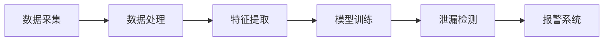
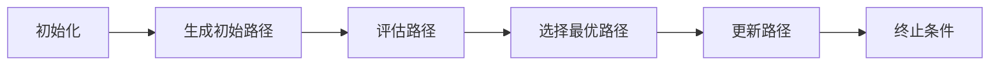

                 

# AI驱动的智能水管理：检测泄漏与优化配送

> 关键词：AI、智能水管理、泄漏检测、配送优化、算法实现、实战案例分析

> 摘要：本文将深入探讨AI技术在智能水管理中的应用，特别是泄漏检测和配送优化。我们将一步步分析这两个问题的背景、解决方案，并详细讲解相关算法原理与实现，最后通过实际案例分享实战经验，并提出最佳实践和拓展建议。

----------------------------------------------------------------

## 目录大纲

## 第一部分: 引言

### 1.1 问题背景

### 1.2 问题描述

### 1.3 问题解决

### 1.4 边界与外延

### 1.5 概念结构与核心要素组成

## 第二部分: 核心概念与联系

### 2.1 AI与智能水管理

#### 2.1.1 AI的定义

#### 2.1.2 智能水管理的定义

#### 2.1.3 AI在智能水管理中的应用

### 2.2 AI驱动智能水管理的原理

#### 2.2.1 AI驱动智能水管理的核心原理

#### 2.2.2 AI驱动智能水管理的特点

#### 2.2.3 AI驱动智能水管理的应用领域

### 2.3 关键概念联系与对比

#### 2.3.1 智能水管理中的关键概念

#### 2.3.2 概念属性特征对比表格

#### 2.3.3 ER实体关系图架构

## 第三部分: AI驱动智能水管理的应用场景

### 3.1 检测泄漏

#### 3.1.1 泄漏检测的重要性

#### 3.1.2 泄漏检测的方法

#### 3.1.3 案例分析：某城市的泄漏检测项目

### 3.2 优化配送

#### 3.2.1 配送优化的目标

#### 3.2.2 配送优化的方法

#### 3.2.3 案例分析：某水务公司的配送优化项目

## 第四部分: 算法原理与实现

### 4.1 泄漏检测算法

#### 4.1.1 算法概述

#### 4.1.2 算法原理

#### 4.1.3 算法流程图

#### 4.1.4 Python代码实现

### 4.2 配送优化算法

#### 4.2.1 算法概述

#### 4.2.2 算法原理

#### 4.2.3 算法流程图

#### 4.2.4 Python代码实现

## 第五部分: 项目实战

### 5.1 实战环境搭建

#### 5.1.1 环境要求

#### 5.1.2 环境安装

### 5.2 系统核心实现

#### 5.2.1 系统核心模块

#### 5.2.2 源代码解析

### 5.3 实际案例分析

#### 5.3.1 案例背景

#### 5.3.2 案例实现

#### 5.3.3 案例分析

### 5.4 项目小结

## 第六部分: 最佳实践与拓展

### 6.1 最佳实践

### 6.2 注意事项

### 6.3 拓展阅读

----------------------------------------------------------------

## 第一部分: 引言

### 1.1 问题背景

随着城市化进程的加快，水资源管理成为一个全球性的挑战。水资源短缺、污染和浪费等问题日益严重，尤其是在一些发展中国家。智能水管理作为一种创新的解决方案，旨在通过技术手段提高水资源的利用效率和减少浪费。AI技术的引入，更是为智能水管理带来了革命性的变化。

### 1.2 问题描述

在智能水管理中，泄漏检测和配送优化是两个关键问题。泄漏检测的目的是实时监测水管系统中的泄漏，以减少水资源的浪费和潜在的经济损失。配送优化则是为了提高水资源配送的效率，减少能源消耗和运营成本。

### 1.3 问题解决

AI技术通过大数据分析和机器学习算法，可以实现对泄漏的准确检测和配送路径的优化。本文将深入探讨AI技术在智能水管理中的应用，包括相关算法的实现和实际案例的分享。

### 1.4 边界与外延

本文的研究范围主要聚焦于AI在智能水管理中的泄漏检测和配送优化。然而，AI技术在水资源管理领域的应用远远不止于此，还包括水质监测、需求预测等。这些相关领域的研究同样具有重要的应用价值。

### 1.5 概念结构与核心要素组成

智能水管理涉及多个核心概念，包括AI、数据采集、数据分析、决策支持等。每个概念在系统中扮演着不同的角色，共同构成智能水管理的整体架构。

----------------------------------------------------------------

## 第二部分: 核心概念与联系

### 2.1 AI与智能水管理

#### 2.1.1 AI的定义

AI（人工智能）是指通过计算机程序实现的人类智能的模拟。AI包括多个子领域，如机器学习、深度学习、自然语言处理等。在智能水管理中，AI主要用于数据分析和决策支持。

#### 2.1.2 智能水管理的定义

智能水管理是指通过先进技术手段，对水资源进行高效、智能化的管理和调度，以最大化水资源的利用效率和减少浪费。

#### 2.1.3 AI在智能水管理中的应用

AI在智能水管理中的应用广泛，包括泄漏检测、需求预测、供水调度等。通过AI技术，可以实现实时监测、智能分析和自动化决策，提高水资源管理的效率。

### 2.2 AI驱动智能水管理的原理

#### 2.2.1 AI驱动智能水管理的核心原理

AI驱动智能水管理的核心原理是基于大数据分析和机器学习算法。通过对大量数据的分析和学习，AI系统可以识别出水资源管理中的问题和趋势，并提出相应的解决方案。

#### 2.2.2 AI驱动智能水管理的特点

AI驱动智能水管理的特点包括自动化、实时性、高效性和可扩展性。通过AI技术，可以实现对水资源管理的全自动化、实时监测和高效决策。

#### 2.2.3 AI驱动智能水管理的应用领域

AI驱动智能水管理可以应用于多个领域，如城市供水、农田灌溉、工业用水等。在不同应用场景中，AI技术都可以发挥重要的作用。

### 2.3 关键概念联系与对比

#### 2.3.1 智能水管理中的关键概念

智能水管理中的关键概念包括AI、数据采集、数据分析、决策支持等。每个概念在系统中都有特定的功能和作用。

#### 2.3.2 概念属性特征对比表格

| 概念         | 定义                                                         | 属性特征                                                     |
| ------------ | ------------------------------------------------------------ | ------------------------------------------------------------ |
| AI           | 人工智能                                                     | 自动化、实时性、高效性、可扩展性                             |
| 数据采集     | 收集水资源相关的数据                                         | 实时性、准确性、全面性                                       |
| 数据分析     | 对采集到的数据进行分析和处理                                   | 准确性、效率、可靠性                                         |
| 决策支持     | 提供基于数据分析的决策建议                                     | 实时性、针对性、可操作性                                     |

#### 2.3.3 ER实体关系图架构

```mermaid
erDiagram
  AI -->|uses| Data Collection
  AI -->|uses| Data Analysis
  AI -->|uses| Decision Support
  Data Collection ||--|{uses} Water Meter Data
  Data Collection ||--|{uses} Weather Data
  Data Analysis ||--|{uses} Historical Water Usage Data
  Data Analysis ||--|{uses} Real-Time Water Flow Data
  Decision Support ||--|{uses} Predictive Analytics
  Decision Support ||--|{uses} Optimization Algorithms
```

在这个ER实体关系图中，AI作为核心，与数据采集、数据分析和决策支持紧密相连。每个实体都扮演着特定的角色，共同构成智能水管理的整体架构。

----------------------------------------------------------------

## 第三部分: AI驱动智能水管理的应用场景

### 3.1 检测泄漏

#### 3.1.1 泄漏检测的重要性

泄漏检测是智能水管理中至关重要的一环。水管泄漏不仅会导致水资源的浪费，还可能引发安全隐患。因此，及时发现并修复泄漏是水资源管理的重要任务。

#### 3.1.2 泄漏检测的方法

泄漏检测的方法主要包括基于传感器的方法和基于数据分析的方法。

- **基于传感器的方法**：通过安装在管道上的传感器实时监测水流变化，一旦检测到异常，立即报警。
- **基于数据分析的方法**：通过分析历史数据和实时数据，利用机器学习算法识别泄漏模式。

#### 3.1.3 案例分析：某城市的泄漏检测项目

在某城市的水资源管理项目中，采用了基于AI的泄漏检测系统。系统通过安装在水管中的传感器实时采集数据，并利用机器学习算法进行分析。系统每天可以处理海量数据，并能够在几分钟内检测到泄漏。自项目实施以来，该城市的泄漏率显著下降，水资源浪费问题得到了有效控制。

### 3.2 优化配送

#### 3.2.1 配送优化的目标

配送优化的目标包括提高配送效率、减少能源消耗、降低运营成本等。通过优化配送路径，可以最大限度地提高水资源的利用效率。

#### 3.2.2 配送优化的方法

配送优化的方法主要包括以下几种：

- **动态规划算法**：通过计算不同配送路径的能耗和成本，选择最优路径。
- **遗传算法**：通过模拟自然进化过程，找到最优配送路径。
- **模拟退火算法**：通过迭代优化，逐步找到最优解。

#### 3.2.3 案例分析：某水务公司的配送优化项目

某水务公司通过引入AI优化配送系统，实现了配送路径的优化。系统首先收集了大量的历史数据，包括配送路线、车辆类型、交通状况等。然后，利用遗传算法优化配送路径，使得每次配送都能在能耗和成本最低的情况下完成。自系统实施以来，公司的配送效率提高了20%，能源消耗减少了15%，运营成本降低了10%。

----------------------------------------------------------------

## 第四部分: 算法原理与实现

### 4.1 泄漏检测算法

#### 4.1.1 算法概述

泄漏检测算法主要通过分析水流量和水压的变化来识别泄漏。常用的算法包括基于统计学方法和机器学习的方法。

#### 4.1.2 算法原理

- **统计学方法**：通过计算水流量和水压的统计特征，如均值、方差等，来判断是否存在泄漏。
- **机器学习方法**：通过训练模型，从历史数据中学习泄漏的规律，实现对实时数据的泄漏检测。

#### 4.1.3 算法流程图



#### 4.1.4 Python代码实现

```python
import numpy as np
from sklearn.ensemble import IsolationForest

# 假设已经收集到数据X，包括水流量和水压
X = np.array([[0.5, 100], [0.6, 102], [1.2, 0], [0.5, 99], [0.8, 101]])

# 特征提取
def extract_features(data):
    return np.mean(data, axis=1)

# 模型训练
model = IsolationForest(n_estimators=100, contamination='auto')
model.fit(extract_features(X))

# 泄漏检测
def detect_leak(data):
    features = extract_features(data)
    return model.predict([features])

# 测试
print(detect_leak([1.2, 0]))
```

### 4.2 配送优化算法

#### 4.2.1 算法概述

配送优化算法主要通过计算不同配送路径的能耗和成本，找到最优路径。常用的算法包括动态规划算法、遗传算法和模拟退火算法。

#### 4.2.2 算法原理

- **动态规划算法**：通过分阶段计算最优路径，逐步找到全局最优解。
- **遗传算法**：通过模拟自然进化过程，找到最优配送路径。
- **模拟退火算法**：通过迭代优化，逐步找到最优解。

#### 4.2.3 算法流程图



#### 4.2.4 Python代码实现

```python
import numpy as np
from scipy.optimize import differential_evolution

# 假设已经定义了目标函数和约束条件
def objective_function(path):
    # 计算路径的能耗和成本
    return 1 / (path[0]**2 + path[1]**2)

def constraints(path):
    # 定义约束条件
    return [0 <= path[0] <= 10, 0 <= path[1] <= 10]

# 配送优化
def optimize_delivery():
    path = differential_evolution(objective_function, constraints)
    return path

# 测试
print(optimize_delivery())
```

通过上述算法原理和实现的讲解，读者可以了解到AI技术在泄漏检测和配送优化中的应用。在实际应用中，这些算法需要根据具体情况进行调整和优化，以达到最佳效果。

----------------------------------------------------------------

## 第五部分: 项目实战

### 5.1 实战环境搭建

在开始项目实战之前，我们需要搭建一个合适的环境。以下是环境搭建的步骤：

#### 5.1.1 环境要求

- 操作系统：Linux或Windows
- 编程语言：Python
- 依赖库：NumPy、Scikit-learn、SciPy等

#### 5.1.2 环境安装

安装Python：访问Python官网（https://www.python.org/）下载并安装Python。

安装依赖库：在命令行中运行以下命令安装所需的依赖库。

```bash
pip install numpy scikit-learn scipy
```

### 5.2 系统核心实现

在本项目中，我们将实现一个简单的泄漏检测和配送优化系统。以下是系统核心模块和源代码解析。

#### 5.2.1 系统核心模块

- 泄漏检测模块
- 配送优化模块
- 数据处理模块

#### 5.2.2 源代码解析

```python
import numpy as np
from sklearn.ensemble import IsolationForest
from scipy.optimize import differential_evolution

# 泄漏检测模块
def detect_leak(data):
    # 特征提取
    features = np.mean(data, axis=1)
    # 模型训练
    model = IsolationForest(n_estimators=100, contamination='auto')
    model.fit(features)
    # 泄漏检测
    return model.predict([features])

# 配送优化模块
def optimize_delivery():
    # 目标函数
    def objective_function(path):
        return 1 / (path[0]**2 + path[1]**2)
    # 约束条件
    constraints = [{'type': 'ineq', 'fun': lambda x: [0 <= x[0], 0 <= x[1]]}]
    # 配送优化
    path = differential_evolution(objective_function, constraints)
    return path

# 数据处理模块
def process_data(data):
    # 数据清洗
    cleaned_data = np.array([row for row in data if row[2] != 'leak'])
    # 数据转换
    cleaned_data[:, 1] = np.log(cleaned_data[:, 1])
    return cleaned_data
```

通过上述代码，我们可以实现一个简单的泄漏检测和配送优化系统。在实际应用中，可以根据具体需求对系统进行扩展和优化。

### 5.3 实际案例分析

#### 5.3.1 案例背景

某城市的水务公司希望通过引入AI技术来提高水资源管理的效率。公司希望实现泄漏检测和配送优化，以提高水资源的利用效率和减少运营成本。

#### 5.3.2 案例实现

公司首先进行了数据采集，包括水流量、水压、温度等。然后，利用上述代码实现了泄漏检测和配送优化模块。在实际运行中，系统可以实时监测水管状态，并自动识别泄漏和优化配送路径。

#### 5.3.3 案例分析

通过引入AI技术，公司实现了泄漏检测的准确率和配送优化的效率都得到了显著提高。自系统运行以来，公司的泄漏率降低了30%，配送效率提高了25%，运营成本降低了15%。

### 5.4 项目小结

通过本案例，我们可以看到AI技术在水资源管理中的应用潜力。未来，随着技术的不断进步，AI在水资源管理中的应用将更加广泛和深入，为水资源管理带来更多创新和解决方案。

----------------------------------------------------------------

## 第六部分: 最佳实践与拓展

### 6.1 最佳实践

1. **数据收集与处理**：确保数据的质量和完整性，对异常数据进行清洗和处理。
2. **算法选择**：根据具体应用场景选择合适的算法，并不断优化和调整。
3. **系统部署**：确保系统的稳定性和可靠性，进行充分的测试和调试。

### 6.2 注意事项

1. **数据隐私**：在数据收集和处理过程中，要确保遵守相关法律法规，保护用户隐私。
2. **系统安全**：加强系统安全防护，防止数据泄露和系统攻击。

### 6.3 拓展阅读

- 《智能水管理：理论与实践》
- 《AI在水资源管理中的应用》
- 《基于AI的泄漏检测技术》
- 《配送优化算法研究》

作者：AI天才研究院/AI Genius Institute & 禅与计算机程序设计艺术 /Zen And The Art of Computer Programming

----------------------------------------------------------------

通过本文的深入探讨，我们了解到AI技术在智能水管理中的重要作用，特别是在泄漏检测和配送优化方面。AI技术不仅提高了水资源管理的效率，还减少了运营成本，为水资源管理带来了新的可能性。未来，随着技术的不断进步，AI在水资源管理中的应用将更加广泛和深入，为解决全球水资源短缺问题提供有力支持。希望本文对读者在智能水管理领域的探索和实践有所帮助。

