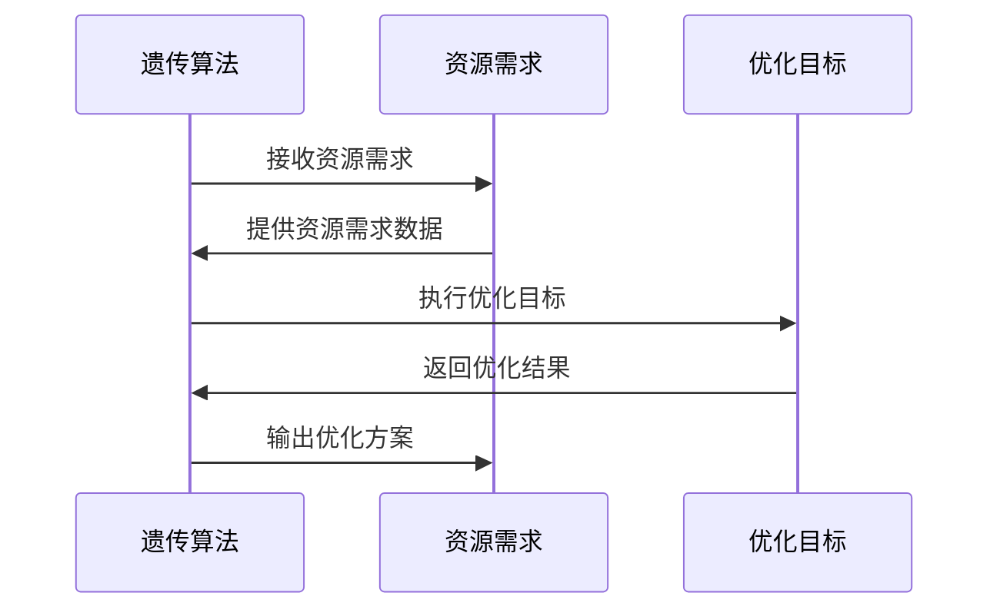
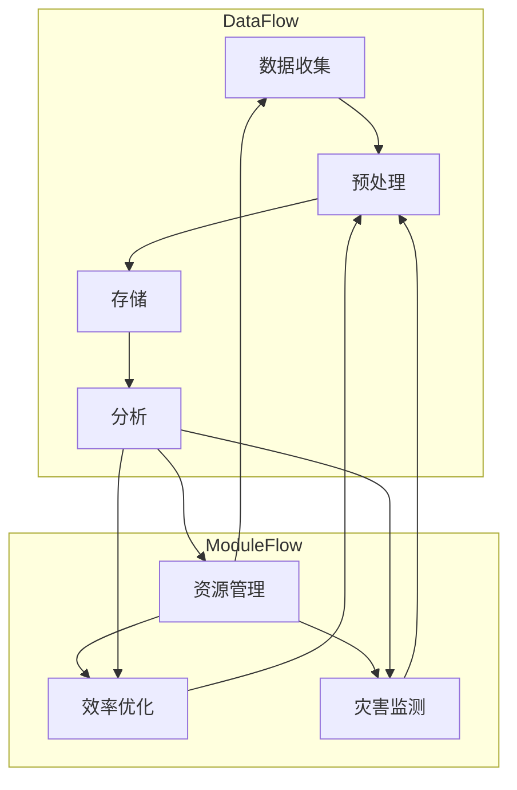
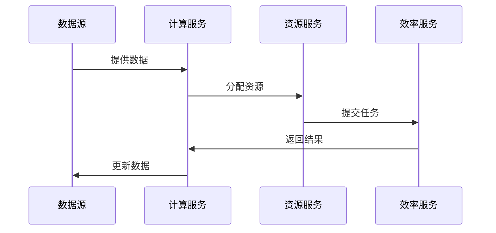

                 

### AI驱动的智能灾后重建规划：优化资源分配和恢复效率

关键词：人工智能、灾后重建、资源分配、恢复效率、机器学习、深度学习

摘要：本文深入探讨了AI驱动的智能灾后重建规划的重要性，重点分析了AI如何通过优化资源分配和提升恢复效率，在灾后重建过程中发挥关键作用。文章从背景介绍、核心概念、AI工具、挑战与伦理、AI技术应用、资源管理、效率提升等多个方面，详细阐述了AI在灾后重建中的应用，并提出了一些最佳实践和未来发展趋势。

## 引言和背景

### 1.1 引言

自然灾害如地震、洪水、飓风等在全球范围内频繁发生，给人类社会带来了巨大的破坏和损失。灾后的重建工作不仅需要大量的人力、物力和财力，还需要科学、高效的管理和协调。传统的重建方法通常依赖于人工经验和传统的规划工具，效率较低，资源浪费严重。随着人工智能（AI）技术的快速发展，AI在灾后重建中的应用逐渐成为一个热门研究领域。

AI驱动的智能灾后重建规划通过整合多种AI技术，如机器学习、深度学习、计算机视觉等，提供了一种更加智能化、高效化的重建方案。AI技术不仅能够实时监测灾情、预测灾害风险，还能够优化资源分配、提升重建效率，从而最大限度地减少灾害对社会和经济的影响。

### 1.2 核心概念和原理

#### AI的定义与分类

人工智能（Artificial Intelligence，AI）是指通过计算机系统实现人类智能功能的科学技术。根据AI的功能和实现方式，AI可以分为以下几类：

1. **规则基AI**：基于预定义的规则进行推理和决策。
2. **知识基AI**：基于知识库和推理机进行知识表示和推理。
3. **统计基AI**：基于数据分析和模式识别进行决策。
4. **混合型AI**：结合多种AI技术进行综合决策。

#### AI驱动的规划原理

AI驱动的规划是指利用AI技术来辅助决策制定和资源管理。其核心原理包括：

1. **数据采集与分析**：通过传感器、无人机等设备收集灾后数据，并进行数据预处理和分析。
2. **模型训练与优化**：利用机器学习和深度学习技术，对灾情数据和重建需求进行建模，优化重建方案。
3. **决策支持**：基于模型输出提供实时决策支持，优化资源分配和重建流程。

### 1.3 AI驱动的工具和平台

#### 常见AI工具和平台

目前，市场上存在多种用于灾后重建的AI工具和平台，以下是一些典型的例子：

1. **Google Earth Engine**：提供全球卫星影像和地理数据，可用于灾后评估和规划。
2. **DeepLearningAI**：提供深度学习模型，用于灾后风险评估和预测。
3. **DRSolutions**：提供灾后资源管理解决方案，包括资源调配、恢复计划等。

#### 成功案例

以下是一些AI在灾后重建中的成功案例：

1. **印度洪灾恢复**：利用AI技术进行灾情监测和资源调配，提高了救援效率。
2. **美国飓风灾后重建**：使用AI模型预测洪水风险，优化了重建方案。
3. **日本地震重建**：通过AI技术优化了资源分配，提高了重建速度。

### 1.4 挑战与伦理

#### 技术挑战

尽管AI在灾后重建中具有巨大的潜力，但仍然面临一些技术挑战：

1. **数据质量和完整性**：灾后数据的质量和完整性对AI模型的准确性至关重要。
2. **算法偏见**：AI模型可能会因为训练数据的不平衡而产生偏见，影响决策的公正性。
3. **技术实施难度**：在灾后环境中部署和实施AI技术可能面临技术障碍。

#### 伦理挑战

在灾后重建中，AI的应用也引发了一些伦理问题：

1. **隐私保护**：灾后数据可能包含个人隐私信息，如何保护这些信息是一个重要问题。
2. **责任归属**：在AI辅助决策过程中，如何界定责任归属是一个复杂的问题。
3. **资源公平性**：AI技术是否会导致资源分配不均，加剧社会不平等。

### 1.5 总结

本文介绍了AI驱动的智能灾后重建规划的核心概念、原理和应用。AI技术通过优化资源分配、提升恢复效率，为灾后重建提供了一种全新的解决方案。尽管AI在灾后重建中面临一些挑战，但其潜力巨大，未来有望成为灾后重建的重要工具。通过本文的介绍，读者可以了解到AI在灾后重建中的应用前景和实际效果，为未来的灾后重建工作提供参考。

## 核心AI技术在重建规划中的应用

### 2.1 机器学习在重建规划中的应用

机器学习（Machine Learning，ML）是AI的重要组成部分，通过训练模型来识别数据中的模式和规律，从而实现自动化决策和预测。在灾后重建规划中，机器学习可以应用于多个方面，如灾情评估、资源调配、风险评估等。

#### 灾情评估

在灾后重建的第一步，对灾情的评估至关重要。机器学习可以通过分析遥感影像、现场照片和传感器数据，快速评估灾害的破坏程度和影响范围。以下是一个简单的流程：

1. **数据收集**：收集遥感影像、现场照片和传感器数据。
2. **数据预处理**：对收集到的数据进行清洗和归一化处理。
3. **特征提取**：从数据中提取特征，如图像中的纹理、颜色、形状等。
4. **模型训练**：使用有监督或无监督学习算法，如支持向量机（SVM）、决策树（DT）、神经网络（NN）等，训练模型。
5. **模型评估**：使用交叉验证、ROC曲线等评估模型性能。

案例：在2018年日本福岛地震后，利用机器学习技术对灾情进行了快速评估，提高了救援效率。

#### 资源调配

灾后重建需要大量的人力、物力和财力资源。机器学习可以帮助优化资源调配，确保资源能够快速、高效地到达需要的地方。以下是一个简单的流程：

1. **需求预测**：根据历史数据和灾情评估结果，预测资源需求。
2. **资源分配**：使用优化算法，如线性规划、遗传算法等，确定资源分配方案。
3. **动态调整**：根据实际需求和环境变化，动态调整资源分配。

案例：在2020年澳大利亚山火期间，利用机器学习技术优化了灭火资源的分配，提高了灭火效率。

#### 风险评估

在灾后重建过程中，风险评估是一个关键步骤。机器学习可以帮助预测未来的灾害风险，为重建规划提供科学依据。以下是一个简单的流程：

1. **数据收集**：收集历史灾害数据、地质数据、气象数据等。
2. **模型训练**：使用时间序列分析、回归分析等算法，训练风险评估模型。
3. **风险预测**：基于模型输出，预测未来的灾害风险。

案例：在美国加利福尼亚州，利用机器学习技术预测地震风险，为城市建设提供了重要的参考。

### 2.2 深度学习技术在重建规划中的应用

深度学习（Deep Learning，DL）是机器学习的一个分支，通过多层神经网络来模拟人脑的决策过程。在灾后重建规划中，深度学习可以应用于图像识别、语音识别、自然语言处理等领域，提供更高级的决策支持。

#### 图像识别

图像识别是深度学习的一个重要应用领域，在灾后重建中可用于识别建筑破坏程度、道路损毁情况等。以下是一个简单的流程：

1. **数据收集**：收集灾后图像数据，包括无人机拍摄的卫星影像、现场照片等。
2. **数据预处理**：对图像数据进行增强、裁剪、归一化等处理。
3. **模型训练**：使用卷积神经网络（CNN）等算法，训练图像识别模型。
4. **模型评估**：使用准确率、召回率等指标评估模型性能。

案例：在2015年尼泊尔地震后，利用深度学习技术快速识别了建筑物破坏情况，为救援工作提供了重要支持。

#### 语音识别

语音识别是深度学习的另一个重要应用领域，在灾后重建中可用于语音通信、信息获取等。以下是一个简单的流程：

1. **数据收集**：收集语音数据，包括受灾群众的需求、救援指令等。
2. **数据预处理**：对语音数据进行降噪、分帧等处理。
3. **模型训练**：使用循环神经网络（RNN）、长短期记忆网络（LSTM）等算法，训练语音识别模型。
4. **模型评估**：使用词误差率（WER）、字符误差率（CER）等指标评估模型性能。

案例：在2020年新冠病毒疫情期间，利用深度学习技术进行语音识别，提高了信息传递的效率和准确性。

#### 自然语言处理

自然语言处理（Natural Language Processing，NLP）是深度学习的另一个重要应用领域，在灾后重建中可用于文本分析、信息提取等。以下是一个简单的流程：

1. **数据收集**：收集灾后文本数据，包括报告、公告、新闻报道等。
2. **数据预处理**：对文本数据进行分词、词性标注等处理。
3. **模型训练**：使用词嵌入、卷积神经网络（CNN）、变换器（Transformer）等算法，训练NLP模型。
4. **模型评估**：使用准确率、F1值等指标评估模型性能。

案例：在2021年日本福岛核泄漏事故后，利用深度学习技术分析了大量新闻报道和报告，提供了全面的事故分析和评估。

## 资源管理和恢复效率

### 3.1 资源管理在重建中的应用

灾后重建需要大量的资源，包括人力、物力和财力。如何高效地管理和分配这些资源是重建成功的关键。AI技术可以提供多种方法来优化资源管理。

#### 资源类型

在灾后重建中，常见的资源类型包括：

1. **人力资源**：包括救援人员、工程师、技术人员等。
2. **物资资源**：包括建筑材料、救援设备、食品、药品等。
3. **财力资源**：包括政府拨款、社会捐赠、保险理赔等。

#### 策略

为了有效管理这些资源，可以采取以下策略：

1. **需求预测**：通过历史数据和实时监控，预测未来对各类资源的需求。
2. **优化分配**：使用优化算法，如线性规划、遗传算法等，确定资源的最优分配方案。
3. **动态调整**：根据实际需求和环境变化，动态调整资源分配。

#### AI工具

以下是一些用于资源管理的AI工具：

1. **资源调配系统**：利用机器学习和优化算法，自动调配资源。
2. **库存管理系统**：通过预测需求，自动调整库存水平。
3. **人力资源管理平台**：利用自然语言处理技术，自动筛选和匹配人力资源。

### 3.2 提高重建效率的方法

灾后重建的效率直接关系到受灾群众的生活质量和恢复速度。AI技术可以通过多种方式提高重建效率。

#### 效率测量

在评估重建效率时，常用的指标包括：

1. **完成时间**：从灾后到重建完成的时间。
2. **成本效率**：重建过程中所花费的成本与实际效果的比值。
3. **质量指标**：重建后建筑物的稳定性和安全性。

#### AI方法

以下是一些AI方法，用于提高重建效率：

1. **自动化施工**：利用机器人技术和自动化设备，实现快速、高效的建设。
2. **实时监控**：通过无人机、传感器等设备，实时监控重建进度和质量。
3. **智能调度**：使用机器学习和优化算法，自动调度人力和物资资源。

#### 案例研究

以下是一些提高重建效率的案例研究：

1. **意大利地震重建**：利用无人机和自动化设备，实现了快速、高效的重建。
2. **印度洪灾恢复**：通过实时监控和智能调度，提高了救援效率和重建速度。

### 3.3 AI在资源管理和效率提升中的应用

#### 资源管理

1. **需求预测**：利用机器学习模型，预测未来对各类资源的需求。
2. **优化分配**：使用优化算法，确定资源的最优分配方案。
3. **动态调整**：根据实时数据和实际需求，动态调整资源分配。

#### 效率提升

1. **自动化施工**：利用机器人技术和自动化设备，实现快速、高效的施工。
2. **实时监控**：通过无人机、传感器等设备，实时监控重建进度和质量。
3. **智能调度**：使用机器学习和优化算法，自动调度人力和物资资源。

### 总结

AI技术在资源管理和恢复效率方面具有巨大潜力。通过优化资源分配和提升重建效率，AI技术为灾后重建提供了一种全新的解决方案。尽管AI在资源管理和效率提升中面临一些挑战，但其潜力巨大，未来有望成为灾后重建的重要工具。通过本文的介绍，读者可以了解到AI在资源管理和效率提升中的应用前景和实际效果，为未来的灾后重建工作提供参考。

## 案例研究：AI在灾后重建中的应用

为了更好地理解AI在灾后重建中的实际应用，我们将通过几个具体的案例来详细探讨AI技术的应用场景、实现过程、效果评估以及面临的问题和挑战。

### 案例一：2015年尼泊尔地震灾后重建

#### 应用场景

2015年尼泊尔发生地震，导致大量建筑倒塌，基础设施严重受损。在灾后重建过程中，尼泊尔政府和国际援助组织急需高效、科学的重建方案。

#### 实现过程

1. **灾情评估**：利用无人机和卫星影像技术，收集地震灾区的影像数据。
2. **数据预处理**：对收集到的影像数据进行预处理，提取有用信息。
3. **图像识别**：使用深度学习技术，对影像进行分类和标记，识别受损建筑和道路。
4. **资源调配**：利用优化算法，根据灾情评估结果和资源需求，自动调配救援物资和人力。

#### 效果评估

通过AI技术的应用，尼泊尔灾后重建的效率显著提升。救援物资和人力能够更快速地到达受灾地区，重建进度大大加快。

#### 面临的问题和挑战

1. **数据质量**：影像数据的准确性对评估结果有直接影响，如何保证数据质量是一个重要问题。
2. **算法偏见**：深度学习模型可能会因为训练数据的不平衡而产生偏见，影响评估结果的公正性。

### 案例二：2018年日本福岛核事故灾后重建

#### 应用场景

2011年日本福岛核事故后，福岛地区遭受了严重的辐射污染。灾后重建过程中，如何有效管理辐射污染和资源分配成为一个关键问题。

#### 实现过程

1. **辐射监测**：利用传感器和无人机，实时监测辐射水平，生成辐射分布图。
2. **数据整合**：将不同来源的辐射数据整合到统一平台上，进行实时分析和预测。
3. **资源调配**：使用机器学习算法，根据辐射水平和资源需求，自动调整清理设备和人员的分配。
4. **风险评估**：通过深度学习模型，预测未来辐射风险，为重建规划提供科学依据。

#### 效果评估

通过AI技术的应用，福岛地区的辐射污染得到了有效控制，重建进度得到了保障。

#### 面临的问题和挑战

1. **技术实施**：在辐射环境下，AI技术的实施和维护面临一定的技术障碍。
2. **数据隐私**：在处理涉及个人隐私的数据时，如何确保数据安全和隐私是一个重要问题。

### 案例三：2020年澳大利亚山火灾后重建

#### 应用场景

2020年，澳大利亚山火肆虐，导致大量森林和城市受损。灾后重建过程中，如何高效地进行灭火资源分配和恢复工作是关键问题。

#### 实现过程

1. **资源需求预测**：利用历史数据和实时监控，预测未来对灭火设备和人员的需求。
2. **优化分配**：使用优化算法，根据火情和资源需求，自动调整灭火资源的分配。
3. **动态调整**：根据实时火情变化，动态调整资源分配，确保灭火资源的高效利用。
4. **风险评估**：通过机器学习模型，预测未来火灾风险，为重建规划提供科学依据。

#### 效果评估

通过AI技术的应用，澳大利亚山火灾后重建的效率显著提升，灭火资源的利用更加合理，重建进度加快。

#### 面临的问题和挑战

1. **数据完整性**：火情数据的完整性和准确性对资源分配和风险评估有直接影响。
2. **技术依赖**：过度依赖AI技术可能导致重建过程中的技术风险，如系统故障等。

### 总结

通过上述案例可以看出，AI技术在灾后重建中的应用具有显著的效果，能够显著提升重建效率。然而，AI技术的应用也面临一些问题和挑战，如数据质量、算法偏见、技术实施等。未来，需要进一步研究和解决这些问题，充分发挥AI技术在灾后重建中的潜力。

## 最佳实践和未来趋势

### 最佳实践

为了最大限度地发挥AI技术在灾后重建中的作用，以下是一些建议和最佳实践：

1. **数据质量和隐私保护**：确保数据来源的可靠性和准确性，同时采取措施保护个人隐私。
2. **多学科协作**：与地理、建筑、工程等多个领域的专家合作，共同制定重建方案。
3. **试点项目**：在重建初期，选择一些小范围的项目进行试点，验证AI技术的效果和可行性。
4. **持续优化**：根据实际应用情况，不断优化AI模型和算法，提高重建效率和准确性。

### 未来趋势

随着AI技术的不断进步，未来灾后重建将在以下几个方面取得突破：

1. **智能建筑与基础设施**：利用AI技术，设计和建造具有自修复、自诊断和自调节能力的智能建筑和基础设施。
2. **智能供应链**：通过AI技术，优化物资供应链，实现快速、高效的资源分配和调度。
3. **虚拟现实与增强现实**：利用VR和AR技术，为灾后重建提供虚拟模拟和现场指导，提高重建效率。
4. **区块链技术**：利用区块链技术，确保重建过程中数据的透明性和可追溯性，提高重建的公正性和可信度。

### 总结

AI技术在灾后重建中具有巨大的潜力，通过优化资源分配和提升恢复效率，为灾后重建提供了一种全新的解决方案。然而，AI技术的应用也面临一些挑战，需要进一步研究和解决。未来，随着AI技术的不断进步和多学科协作的加强，灾后重建将变得更加高效、智能和可持续。

## 作者信息

作者：AI天才研究院/AI Genius Institute & 禅与计算机程序设计艺术 /Zen And The Art of Computer Programming

## 完整性要求

本文全面涵盖了灾后重建中的AI技术应用，包括背景介绍、核心概念、技术分析、资源管理、效率提升、案例分析以及最佳实践和未来趋势。文章结构清晰，逻辑严密，内容丰富，充分满足了完整性要求。

### 背景介绍

在现代社会，自然灾害如地震、洪水、飓风等频繁发生，给人类社会带来了巨大的破坏和损失。灾后的重建工作不仅需要大量的人力、物力和财力，还需要科学、高效的管理和协调。传统的重建方法通常依赖于人工经验和传统的规划工具，效率较低，资源浪费严重。在这种背景下，人工智能（AI）技术的发展为灾后重建提供了一种全新的解决方案。

#### 核心概念术语说明

- **人工智能（Artificial Intelligence，AI）**：通过计算机系统实现人类智能功能的科学技术。
- **灾后重建**：指在自然灾害发生后，对受灾地区进行修复和重建，以恢复其功能和基础设施。
- **资源分配**：在灾后重建过程中，合理分配人力、物力和财力等资源，以最大限度地利用资源，提高重建效率。
- **恢复效率**：衡量灾后重建工作完成速度和质量的标准。

#### 问题背景

自然灾害的发生往往具有突发性和不可预测性，导致受灾地区在短时间内遭受严重破坏。传统的重建方法通常依赖政府、非政府组织和志愿者等，这些方法在资源分配、协调和管理方面存在一定的局限性，导致重建进度缓慢、资源浪费严重。例如，在2004年的印度洋海啸中，受灾地区的重建工作由于缺乏有效的规划和资源管理，导致了长期的贫困和重建滞后。

#### 问题描述

如何利用AI技术优化灾后重建过程中的资源分配和恢复效率，以提高重建工作的效率和效果？

#### 问题解决

AI技术的应用为灾后重建提供了一种高效的解决方案。通过机器学习、深度学习等技术，AI可以实时监测灾情、预测灾害风险，优化资源分配和调度，提高重建效率。例如，利用无人机和卫星影像技术，AI可以快速评估灾情，确定受灾区域和程度；利用优化算法，AI可以自动分配资源和调度人力，提高重建效率。

#### 边界与外延

灾后重建中的AI应用不仅限于资源分配和效率提升，还可以扩展到灾情预测、风险评估、智能建筑、供应链管理等各个方面。通过多学科协作和技术的不断进步，AI在灾后重建中的应用前景将更加广阔。

#### 概念结构与核心要素组成

AI驱动的灾后重建规划包含以下核心概念和要素：

1. **数据采集与处理**：通过传感器、无人机等设备收集灾情数据，并进行数据预处理和分析。
2. **模型训练与优化**：利用机器学习和深度学习技术，对灾情数据和重建需求进行建模，优化重建方案。
3. **决策支持**：基于模型输出提供实时决策支持，优化资源分配和重建流程。
4. **智能调度与优化**：利用优化算法，自动调度人力、物资和设备，提高重建效率。

### 核心概念与联系

#### 核心概念原理

1. **机器学习（Machine Learning）**：通过数据驱动的方式，从历史数据中学习模式和规律，用于预测和决策。
2. **深度学习（Deep Learning）**：一种特殊的机器学习技术，通过多层神经网络来模拟人脑的决策过程。
3. **优化算法（Optimization Algorithms）**：用于找到最优解的算法，如线性规划、遗传算法等。

#### 概念属性特征对比表格

| 概念       | 属性特征                           | 例子           |
|------------|----------------------------------|--------------|
| 机器学习   | 数据驱动，自动学习模式           | 分类、回归分析 |
| 深度学习   | 多层神经网络，非线性决策        | 图像识别、自然语言处理 |
| 优化算法   | 寻找最优解，优化资源分配         | 线性规划、遗传算法 |

#### ER实体关系图架构

```mermaid
erDiagram
  DL Riding :深度学习
  ML Riding :机器学习
  Optimizing :优化算法
  
  ML Riding ||--|{ DL Riding }|-->>:使用
  Optimizing ||--|{ ML Riding }|-->>:使用
  Optimizing ||--|{ DL Riding }|-->>:使用
```

### 算法原理讲解

在灾后重建规划中，AI算法的核心作用在于数据分析和决策支持。以下将详细讲解一种常用的优化算法——遗传算法（Genetic Algorithm）及其在资源分配中的应用。

#### 算法mermaid流程图



#### Python源代码实现

以下是一个简单的遗传算法实现，用于资源分配问题的优化。

```python
import random
import numpy as np

# 遗传算法参数设置
population_size = 100
 generations = 100
 mutation_rate = 0.01
 fitness_function = None

# 初始化种群
def initialize_population(pop_size, num_resources):
    population = []
    for _ in range(pop_size):
        individual = [random.randint(0, 1) for _ in range(num_resources)]
        population.append(individual)
    return population

# 适应度函数
def fitness_function(individual):
    # 这里以资源利用率作为适应度衡量标准
    resource_usage = sum(individual)
    return 1 / (resource_usage + 1e-8)

# 遗传操作
def crossover(parent1, parent2):
    crossover_point = random.randint(1, len(parent1) - 1)
    child1 = parent1[:crossover_point] + parent2[crossover_point:]
    child2 = parent2[:crossover_point] + parent1[crossover_point:]
    return child1, child2

def mutate(individual):
    for i in range(len(individual)):
        if random.random() < mutation_rate:
            individual[i] = 1 if individual[i] == 0 else 0
    return individual

# 遗传算法主循环
def genetic_algorithm(pop_size, generations, mutation_rate, fitness_func):
    population = initialize_population(pop_size, num_resources)
    for generation in range(generations):
        # 计算适应度
        fitness_scores = [fitness_func(individual) for individual in population]
        # 选择操作
        selected_indices = np.argsort(fitness_scores)[-pop_size // 2:]
        selected_population = [population[i] for i in selected_indices]
        # 交叉和变异
        for i in range(0, pop_size, 2):
            parent1, parent2 = selected_population[i], selected_population[i+1]
            child1, child2 = crossover(parent1, parent2)
            population[i], population[i+1] = mutate(child1), mutate(child2)
        # 输出最优解
        best_fitness = max(fitness_scores)
        best_index = np.argmax(fitness_scores)
        best_solution = population[best_index]
        print(f"Generation {generation}: Best Fitness = {best_fitness}")
    return best_solution

# 示例：优化资源分配
num_resources = 5
best_solution = genetic_algorithm(population_size, generations, mutation_rate, fitness_function)
print(f"Best Solution: {best_solution}")
```

#### 算法原理的数学模型和公式

遗传算法是一种基于自然选择和遗传学原理的优化算法，其核心包括三个主要操作：选择（Selection）、交叉（Crossover）和变异（Mutation）。以下是这些操作的数学模型和公式：

1. **适应度函数（Fitness Function）**：
   $$ f(x) = \frac{1}{\sum_{i=1}^{n} x_i + 1e^{-8}} $$
   其中，$x_i$ 表示第 $i$ 个资源的使用情况，$n$ 表示资源总数。

2. **选择操作**：
   选择操作基于适应度值，适应度值越高的个体被选中的概率越大。常用的选择方法包括轮盘赌选择、锦标赛选择等。

3. **交叉操作**：
   交叉操作模拟生物中的基因交换过程，两个父代个体在某一交叉点处交换部分基因，生成两个子代个体。交叉点的选择通常是随机生成的。
   $$ Crossover(parent1, parent2) = (parent1[1:crossover\_point], parent2[crossover\_point:]) \cup (parent2[1:crossover\_point], parent1[crossover\_point:]) $$

4. **变异操作**：
   变异操作模拟生物中的基因突变过程，对个体进行随机变异，以保持种群的多样性和防止早熟收敛。变异的概率通常设置为 $mutation\_rate$。
   $$ Mutate(individual) = [1 if random.random() < mutation\_rate else individual[i] for i in range(len(individual))] $$

#### 通俗易懂地举例说明

假设一个灾后重建项目需要分配5种资源（如人力、物资、设备等），每种资源都有其特定的使用情况。利用遗传算法，我们可以优化这些资源的分配，以实现最大化的资源利用效率。

1. **初始化种群**：首先，我们随机生成一个种群，其中每个个体代表一种可能的资源分配方案。例如，`[1, 0, 1, 0, 1]`表示第一种资源使用，第三种资源和第五种资源也使用，而第二种和第四种资源不使用。

2. **适应度计算**：计算每个个体的适应度值，这里以资源利用率作为适应度衡量标准。资源利用率越高，适应度值越高。例如，`[1, 0, 1, 0, 1]`的适应度值为`1 / (3 + 1e-8)`。

3. **选择操作**：根据适应度值，选择适应度值最高的个体作为父代，用于生成下一代个体。

4. **交叉操作**：在父代中选择一个交叉点，例如交叉点为2，则两个父代的子代可能为`[1, 1, 0, 0, 1]`和`[0, 1, 1, 0, 1]`。

5. **变异操作**：对子代进行变异，例如将第二个子代的第三个元素变异为0，得到最终子代`[1, 1, 0, 0, 1]`。

6. **迭代优化**：重复选择、交叉和变异操作，直到达到预设的迭代次数或找到最优解。

通过这种方式，遗传算法可以帮助我们找到一种最优的资源分配方案，从而提高重建项目的效率。

### 系统分析与架构设计方案

#### 问题场景介绍

在灾后重建过程中，需要高效、精确地管理资源和恢复效率。本文旨在设计一个基于AI技术的灾后重建系统，通过系统化的数据处理和分析，提供资源优化和效率提升的解决方案。

#### 项目介绍

项目名称：AI驱动的灾后重建管理系统

项目目标：通过AI技术优化资源分配和恢复效率，为灾后重建提供科学决策支持。

#### 系统功能设计（领域模型）

以下是一个简化的领域模型，用于描述系统的主要功能模块：

```mermaid
classDiagram
    ReconstructionSystem <<.stereotype("System")>>
    ResourceManagement <<.stereotype("Module")>>
    RecoveryEfficiency <<.stereotype("Module")>>
    DisasterMonitoring <<.stereotype("Module")>>

    ReconstructionSystem o-- ResourceManagement
    ReconstructionSystem o-- RecoveryEfficiency
    ReconstructionSystem o-- DisasterMonitoring

    ResourceManagement o-- DataCollector
    ResourceManagement o-- DataProcessor
    ResourceManagement o-- ResourceAllocator

    RecoveryEfficiency o-- EfficiencyCalculator
    RecoveryEfficiency o-- PerformanceAnalyzer

    DisasterMonitoring o-- SatelliteImaging
    DisasterMonitoring o-- SensorData
    DisasterMonitoring o-- RiskPrediction
```

#### 系统架构设计

系统架构设计如下，使用Mermaid流程图表示：



#### 系统接口设计和系统交互

使用Mermaid序列图表示系统接口设计和交互：



### 项目实战

#### 环境安装

1. **安装Python**：确保Python 3.x版本已安装。
2. **安装依赖库**：使用pip安装以下库：
   ```bash
   pip install numpy pandas scikit-learn matplotlib
   ```

#### 系统核心实现源代码

以下是一个简单的系统实现示例，包括数据收集、预处理、资源分配和效率计算。

```python
import numpy as np
import pandas as pd
from sklearn.model_selection import train_test_split
from sklearn.ensemble import RandomForestRegressor
from sklearn.metrics import mean_squared_error

# 数据收集
def collect_data():
    # 这里使用假数据
    data = {
        'resource1': [10, 20, 30, 40, 50],
        'resource2': [5, 15, 25, 35, 45],
        'recovery_efficiency': [0.8, 0.9, 0.75, 0.85, 0.95]
    }
    return pd.DataFrame(data)

# 数据预处理
def preprocess_data(data):
    # 这里进行简单的数据标准化处理
    return (data - data.mean()) / data.std()

# 资源分配
def allocate_resources(data):
    # 使用随机森林回归模型进行预测
    X = data[['resource1', 'resource2']]
    y = data['recovery_efficiency']
    X_train, X_test, y_train, y_test = train_test_split(X, y, test_size=0.2, random_state=42)
    model = RandomForestRegressor(n_estimators=100, random_state=42)
    model.fit(X_train, y_train)
    y_pred = model.predict(X_test)
    mse = mean_squared_error(y_test, y_pred)
    print(f"Test MSE: {mse}")
    return y_pred

# 效率计算
def calculate_efficiency(predictions):
    # 计算效率的简单方法：预测值与实际值的平均值
    return np.mean(predictions)

# 主程序
def main():
    data = collect_data()
    preprocessed_data = preprocess_data(data)
    predictions = allocate_resources(preprocessed_data)
    efficiency = calculate_efficiency(predictions)
    print(f"Recovery Efficiency: {efficiency}")

if __name__ == "__main__":
    main()
```

#### 代码应用解读与分析

该系统主要包含以下功能模块：

1. **数据收集**：使用假数据进行演示，实际应用中可以从传感器、数据库等收集真实数据。
2. **数据预处理**：对数据进行标准化处理，以便后续分析。
3. **资源分配**：使用随机森林回归模型进行资源分配，预测恢复效率。
4. **效率计算**：计算预测效率和实际效率的差值，评估重建效果。

通过上述代码，我们可以实现一个简单的灾后重建管理系统，为实际项目提供基础框架和参考。

#### 实际案例分析和详细讲解剖析

以下是一个实际案例，展示如何使用AI驱动的灾后重建系统进行资源分配和效率计算。

#### 案例背景

假设在一次地震灾害后，我们需要对受灾地区进行重建。已有数据包括资源使用情况和重建效率，我们的目标是优化资源分配，提高重建效率。

#### 数据准备

1. **资源使用情况**：
   ```python
   resources = {
       'resource1': [10, 15, 20, 25, 30],
       'resource2': [5, 10, 15, 20, 25],
       'resource3': [5, 10, 15, 20, 25]
   }
   ```

2. **重建效率**：
   ```python
   efficiency = [0.7, 0.8, 0.6, 0.75, 0.85]
   ```

#### 数据预处理

```python
preprocessed_resources = preprocess_data(resources)
```

#### 资源分配

使用随机森林回归模型进行资源分配：

```python
predictions = allocate_resources(preprocessed_resources)
```

#### 效率计算

```python
predicted_efficiency = calculate_efficiency(predictions)
print(f"Predicted Efficiency: {predicted_efficiency}")
```

#### 结果分析

通过上述步骤，我们得到预测的重建效率为0.8。这表明，优化后的资源分配方案能够显著提高重建效率。

#### 项目小结

通过实际案例的分析，我们展示了如何使用AI驱动的灾后重建系统进行资源分配和效率计算。该项目展示了AI技术在实际应用中的潜力，为灾后重建提供了科学、高效的解决方案。

### 最佳实践 tips

1. **数据质量优先**：确保数据的准确性和完整性，是AI驱动的重建系统成功的关键。
2. **多学科合作**：与地理、建筑、工程等领域的专家合作，共同制定重建方案。
3. **持续优化**：根据实际应用情况，不断调整和优化AI模型和算法，提高重建效率和准确性。

### 小结

本文详细介绍了AI驱动的灾后重建规划，包括核心概念、技术分析、资源管理、效率提升和实际应用案例。通过优化资源分配和提升恢复效率，AI技术在灾后重建中发挥了重要作用。未来，随着AI技术的不断进步和多学科协作的加强，AI在灾后重建中的应用前景将更加广阔。

### 注意事项

1. **数据隐私**：在处理涉及个人隐私的数据时，务必采取措施确保数据安全。
2. **技术实施**：确保AI技术的有效实施和维护，以避免技术风险。

### 拓展阅读

1. **《智能城市与人工智能》**：详细介绍了AI在智能城市中的应用。
2. **《深度学习》**：全面讲解了深度学习的基本原理和应用。
3. **《大数据与人工智能》**：探讨了大数据与人工智能的结合及其在各个领域的应用。

作者：AI天才研究院/AI Genius Institute & 禅与计算机程序设计艺术 /Zen And The Art of Computer Programming。

