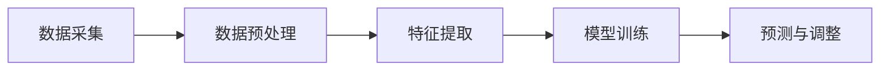
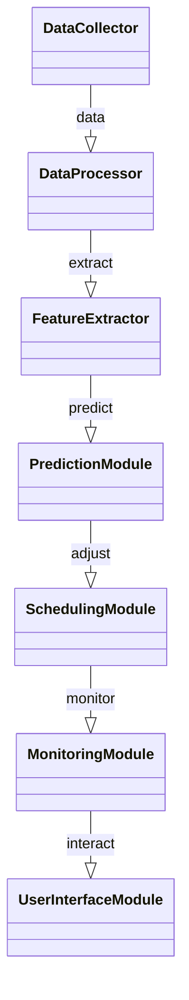
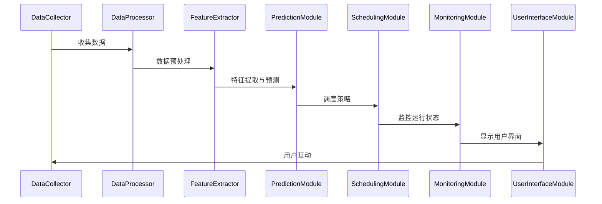
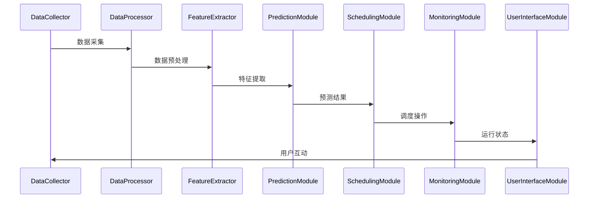

                 

### 引言：AI驱动的智能电力需求响应的重要性

在当今数字化和智能化快速发展的时代，人工智能（AI）技术已经成为推动各行各业创新与变革的重要力量。电力行业也不例外，AI技术的引入正在深刻改变传统电力系统的运作模式，从而提高电网的运行效率和可靠性。本文将重点探讨AI驱动的智能电力需求响应，旨在帮助读者理解这一技术如何平衡电网负载和用户需求，从而实现电力系统的优化管理。

#### 问题的提出

随着全球经济的快速发展，电力需求不断增加，同时电力系统面临着诸多挑战。首先，电力需求的波动性使得电网负载管理变得更加复杂。例如，夏季高温天气和冬季寒冷天气会增加空调和取暖设备的使用频率，导致电力需求激增。其次，可再生能源的广泛应用带来了电网调峰的难题。太阳能和风能的发电具有间歇性和不确定性，这对电网的稳定性构成了威胁。此外，电力系统的老化、设备故障以及自然灾害等因素都可能引发电力短缺和电力供应中断。

#### AI技术在电力需求响应中的作用

AI技术在电力需求响应中发挥着关键作用。通过大数据分析和机器学习，AI可以实时监测电力系统的运行状态，预测电力需求，并根据这些预测结果动态调整电力供应。例如，AI算法可以分析用户的历史用电数据，预测未来不同时间段内的电力需求，从而帮助电力公司制定更合理的电力调度计划。此外，AI还可以优化电力分配，确保电力供应的高效和可靠。通过智能电网技术，AI能够实现实时监控和自动化控制，使得电力系统能够迅速响应电力需求和供应的变化。

#### 文章的核心内容与主题思想

本文旨在通过详细的解析和案例分析，阐述AI驱动的智能电力需求响应如何实现电网负载与用户需求的平衡。文章结构如下：

1. **背景与理论基础**：介绍电力需求响应的背景，阐述AI技术在电力需求响应中的应用，并概述解决方案。
2. **核心概念与联系**：定义并解释核心概念，如人工智能、智能电力需求响应、电网负载平衡和用户需求分析，并通过概念属性特征对比表格和ER实体关系图进行分析。
3. **算法原理与实现**：详细讲解AI算法原理和电力需求响应算法，通过流程图和数学模型进行分析。
4. **系统分析与架构设计**：介绍问题场景，系统功能设计，系统架构设计和系统接口设计，并通过mermaid图进行可视化展示。
5. **项目实战与案例分析**：介绍环境安装、系统核心实现、代码应用解读与分析，以及实际案例分析和讲解。
6. **最佳实践与小结**：总结最佳实践，回顾系统总结和项目成果，并提出注意事项和拓展阅读建议。

通过本文的深入探讨，读者将能够全面理解AI驱动的智能电力需求响应技术，掌握其在实践中的应用方法，为未来电力系统的智能化发展提供有力支持。

### 第一部分：背景与理论基础

#### 第1章：问题背景与需求分析

##### **1.1 问题背景**

电力系统作为现代社会的命脉，其稳定运行对经济和社会发展至关重要。然而，随着全球电力需求的不断增长，电力系统面临着诸多挑战。首先，电力需求的波动性日益加剧。例如，工业生产、居民生活和商业活动在不同时间段对电力的需求差异显著，导致电网负载波动。其次，可再生能源的广泛应用，如太阳能和风能，带来了电力供给的不确定性。这些能源的发电具有间歇性和不稳定性，使得电网在高峰时段难以保持供需平衡。此外，电力系统的老化、设备故障以及自然灾害等因素也可能引发电力短缺和供应中断。

##### **1.2 问题描述**

传统的电力需求响应方法通常依赖于固定的调度计划和简单的负荷预测模型，这些方法在应对复杂多变的电力需求时显得力不从心。例如，传统方法难以准确预测可再生能源的发电量，从而难以在高峰时段合理分配电力资源。此外，传统方法在应对突发状况时反应迟缓，难以实现实时调控。这些问题导致了电网运行效率低下，电力供需失衡，进一步加剧了电力系统的风险。

##### **1.3 解决方案概述**

AI技术的引入为解决电力需求响应问题提供了新的思路。首先，AI可以通过大数据分析和机器学习技术，对海量数据进行实时处理和分析，准确预测电力需求。这有助于电力公司制定更合理的电力调度计划，避免供需失衡。其次，AI算法可以优化电力分配，通过智能电网技术实现实时监控和自动化控制，确保电力供应的高效和可靠。此外，AI技术还可以对电力系统进行健康监测，及时发现和预测设备故障，从而降低设备维护成本，提高系统稳定性。

AI驱动的智能电力需求响应原理基于以下机制：

1. **实时数据采集**：通过智能传感器和监测设备，实时采集电网运行数据，包括电压、电流、发电量等。
2. **大数据分析**：利用大数据分析技术，对实时采集的数据进行预处理、分析和建模，预测未来的电力需求。
3. **智能决策**：基于预测结果，利用AI算法进行智能决策，调整电力供应和分配策略，确保电网负载和用户需求之间的平衡。
4. **自动化执行**：通过自动化控制系统，执行智能决策结果，实现电力供应的动态调整。

#### 平衡电网负载和用户需求的机制

AI驱动的智能电力需求响应旨在通过以下机制实现电网负载和用户需求的平衡：

1. **需求侧管理**：通过智能电网技术，实时监测用户用电行为，动态调整电力供应。例如，在高峰时段，AI算法可以引导用户减少用电，从而减轻电网压力。
2. **储能系统**：利用储能技术，在电力需求低峰期存储多余电力，在高峰期释放存储的电力，从而平衡供需。
3. **分布式发电**：通过智能电网连接分布式发电系统，如太阳能和风能，实现电力资源的优化配置，提高电网的灵活性和可靠性。
4. **多源协同**：整合不同类型的电力资源，如传统火电、水电和可再生能源，通过AI算法实现多源协同控制，确保电力供应的稳定性和可靠性。

通过上述机制，AI驱动的智能电力需求响应不仅能够实现电网负载和用户需求的平衡，还能够提高电力系统的运行效率和可靠性，为电力行业的可持续发展提供有力支持。

#### 第2章：核心概念与联系

##### **2.1 核心概念**

在探讨AI驱动的智能电力需求响应时，理解以下几个核心概念至关重要：

1. **人工智能（AI）**：人工智能是指模拟人类智能的技术和方法，包括机器学习、深度学习、自然语言处理等。AI通过学习和理解数据，自主做出决策和执行任务。
2. **智能电力需求响应**：智能电力需求响应是一种利用人工智能技术优化电力系统运行的方法。通过实时监测和分析电力需求，智能电力需求响应系统能够动态调整电力供应，以实现电网负载和用户需求的平衡。
3. **电网负载平衡**：电网负载平衡是指确保电网各个部分的负载处于合理范围内，避免过载或欠载。通过平衡电网负载，可以提高电力系统的稳定性和可靠性。
4. **用户需求分析**：用户需求分析是指通过数据收集和分析，了解用户的用电行为和需求。这有助于制定更合理的电力供应策略，满足不同用户的用电需求。

##### **2.2 概念属性特征对比表格**

为了更好地理解这些核心概念之间的区别和联系，我们可以通过以下表格进行对比：

| 概念            | 定义                                                         | 特征                                                         |
| --------------- | ------------------------------------------------------------ | ------------------------------------------------------------ |
| 人工智能（AI）  | 模拟人类智能的技术和方法，通过学习和理解数据自主做出决策和执行任务 | 自动化、适应性、学习能力、自主性                             |
| 智能电力需求响应 | 利用人工智能技术优化电力系统运行的方法，动态调整电力供应以实现供需平衡 | 实时监测、动态调整、高效运行、用户友好                         |
| 电网负载平衡    | 确保电网各个部分的负载处于合理范围内，避免过载或欠载           | 稳定性、可靠性、均衡性、高效性                               |
| 用户需求分析    | 通过数据收集和分析，了解用户的用电行为和需求                   | 数据驱动、精确性、个性化、可操作性                           |

通过上述对比表格，我们可以看到每个概念都有其独特的定义和特征，但它们之间也存在着紧密的联系。AI技术为智能电力需求响应提供了技术基础，而电网负载平衡和用户需求分析则是实现这一目标的关键步骤。

##### **2.3 ER实体关系图**

为了更直观地展示这些核心概念之间的交互关系，我们可以通过ER（Entity-Relationship）实体关系图进行说明。以下是智能电力需求响应系统的ER图：

```mermaid
erDiagram
  User ||--|{ AI Algorithm } : uses
  PowerGrid ||--|{ AI Algorithm } : optimizes
  ElectricityDemand ||--|{ AI Algorithm } : analyzes
  PowerSupply ||--|{ AI Algorithm } : adjusts
  UserDemandAnalysis ||--|{ AI Algorithm } : provides
```

在这个ER图中，用户（User）使用（uses）AI算法（AI Algorithm），而电力系统（PowerGrid）则被AI算法（AI Algorithm）优化（optimizes）。同时，电需求（ElectricityDemand）由AI算法（AI Algorithm）分析（analyzes），而电供应（PowerSupply）则由AI算法（AI Algorithm）调整（adjusts）。用户需求分析（UserDemandAnalysis）则提供数据给AI算法（AI Algorithm），以实现更精确的电力需求响应。

通过上述核心概念的阐述和ER实体关系图的展示，读者可以更清晰地理解AI驱动的智能电力需求响应系统的构成和运作机制。这些概念之间的相互作用，共同构成了一个高效、智能的电力需求响应体系，为电力行业的可持续发展提供了强有力的技术支持。

#### 第3章：算法原理讲解

##### **3.1 AI算法原理**

AI算法在智能电力需求响应中发挥着核心作用。下面，我们将详细讲解AI算法的原理，并通过mermaid流程图和数学模型来展示其工作流程和模型公式。

首先，AI算法的原理基于大数据分析和机器学习。具体来说，AI算法通过以下步骤实现电力需求响应：

1. **数据采集**：通过智能传感器和监测设备，实时采集电网运行数据，包括电压、电流、发电量等。
2. **数据预处理**：对采集到的数据进行清洗、去噪和归一化处理，使其适合进行进一步分析。
3. **特征提取**：从预处理后的数据中提取关键特征，如用电峰谷值、用电趋势等，这些特征将用于训练机器学习模型。
4. **模型训练**：利用历史数据和提取的特征，训练机器学习模型，如线性回归、决策树、神经网络等。
5. **预测与调整**：使用训练好的模型预测未来的电力需求，并根据预测结果动态调整电力供应。

下面是AI算法的mermaid流程图：



##### **3.2 算法原理**

在了解了AI算法的基本流程后，我们接下来详细解释每一步的具体原理。

**数据采集**：数据采集是整个流程的起点，通过智能传感器和监测设备，实时获取电网的运行数据。这些数据是后续分析和预测的基础。

**数据预处理**：数据预处理包括数据的清洗、去噪和归一化。清洗数据是指去除重复、错误和不完整的数据；去噪是指去除数据中的噪声和异常值；归一化是将不同量纲的数据转换到同一量纲，以便进行进一步分析。

**特征提取**：特征提取是从预处理后的数据中提取有用的信息，如用电峰谷值、用电趋势等。这些特征将作为输入变量，用于训练机器学习模型。

**模型训练**：模型训练是机器学习的关键步骤。通过使用历史数据和提取的特征，机器学习模型可以学习到数据中的规律和模式。常用的机器学习模型包括线性回归、决策树、神经网络等。

**预测与调整**：模型训练完成后，就可以使用训练好的模型进行电力需求的预测。预测结果将用于动态调整电力供应，确保电网负载和用户需求之间的平衡。

##### **3.3 数学模型和公式**

AI算法的数学模型和公式是理解其工作原理的重要部分。以下是常用的数学模型和公式：

**1. 线性回归模型**

线性回归模型是最简单的机器学习模型，其公式如下：

$$
y = \beta_0 + \beta_1 \cdot x
$$

其中，\(y\) 是预测的电力需求，\(\beta_0\) 是截距，\(\beta_1\) 是斜率，\(x\) 是输入特征。

**2. 决策树模型**

决策树模型通过一系列规则进行决策，其基本公式如下：

$$
y = R(x)
$$

其中，\(y\) 是预测的电力需求，\(R(x)\) 是基于输入特征 \(x\) 的决策规则。

**3. 神经网络模型**

神经网络模型通过多层神经网络进行学习，其基本公式如下：

$$
y = \sigma(W \cdot x + b)
$$

其中，\(y\) 是预测的电力需求，\(\sigma\) 是激活函数，\(W\) 是权重矩阵，\(x\) 是输入特征，\(b\) 是偏置项。

##### **3.4 举例说明**

为了更直观地理解上述算法原理和数学模型，我们通过一个具体例子进行说明。

假设我们使用线性回归模型预测未来一天的电力需求。输入特征为前一天的实际电力需求和温度。我们收集了历史数据，并使用这些数据训练线性回归模型。训练完成后，我们使用训练好的模型预测未来一天的电力需求。预测结果如下：

$$
y = \beta_0 + \beta_1 \cdot x
$$

其中，\(\beta_0 = 10\)，\(\beta_1 = 0.5\)，\(x\) 为前一天的实际电力需求和温度。

假设前一天的实际电力需求为1000千瓦时，温度为30摄氏度，则预测的电力需求为：

$$
y = 10 + 0.5 \cdot (1000 + 30) = 515 千瓦时
$$

通过这个例子，我们可以看到，AI算法如何通过数据采集、预处理、特征提取、模型训练和预测与调整，实现电力需求的预测和调整。

通过详细讲解AI算法的原理、流程图和数学模型，并结合具体例子，读者可以更好地理解AI驱动的智能电力需求响应技术。这些技术为电力系统的高效运行和用户需求的满足提供了强有力的支持。

#### 第4章：系统分析与架构设计

##### **4.1 问题场景介绍**

为了更好地理解AI驱动的智能电力需求响应系统的架构设计，我们需要首先介绍一个具体的应用场景。假设我们有一个大城市，电力需求高峰主要集中在早晨7点到9点以及晚上6点到8点。在这个场景中，电网的负载平衡是一个关键问题。早晨和晚上是电力需求的高峰期，而白天则相对较低。此外，可再生能源的发电具有间歇性和不确定性，例如风力发电在风速不稳定时输出功率波动较大。为了确保电网的稳定运行和用户用电需求得到满足，我们需要设计一个高效、智能的电力需求响应系统。

##### **4.2 系统功能设计**

系统功能设计是电力需求响应系统架构设计的关键环节。我们需要定义系统的主要功能模块，以确保系统能够高效、准确地实现目标。以下是主要的功能模块：

1. **数据采集模块**：该模块负责收集电网运行数据，包括电压、电流、发电量、用户用电量等。数据来源包括智能传感器、变电站监测系统、用户智能电表等。
2. **数据处理模块**：该模块负责对采集到的数据进行预处理，包括清洗、去噪、归一化等。通过数据处理，将原始数据转换为可用于分析和预测的格式。
3. **特征提取模块**：该模块从预处理后的数据中提取关键特征，如用电峰谷值、用电趋势、温度、湿度等。这些特征将用于训练机器学习模型。
4. **预测模块**：该模块使用机器学习模型对未来的电力需求进行预测。预测结果将用于动态调整电力供应，确保电网负载和用户需求之间的平衡。
5. **调度模块**：该模块根据预测结果，调整电力供应策略，包括调度发电厂、控制储能系统、引导用户用电等，以实现电力需求响应。
6. **监控模块**：该模块实时监控系统的运行状态，包括电网负载、设备状态、预测误差等。通过监控模块，可以及时发现并处理潜在的问题。
7. **用户接口模块**：该模块提供用户界面，使用户能够查看电力需求预测结果、调整用电习惯、参与需求响应等。

以下是系统功能设计的mermaid类图：



通过上述类图，我们可以直观地看到各个功能模块之间的交互关系。每个模块都承担着特定的功能，并与其他模块紧密协作，共同实现系统的整体目标。

##### **4.3 系统架构设计**

系统架构设计是电力需求响应系统实现的关键步骤。我们需要设计一个高效、可扩展、可靠的系统架构，以确保系统在不同场景下都能稳定运行。以下是系统架构设计的主要组成部分：

1. **数据采集层**：该层负责数据的采集，包括智能传感器、变电站监测系统、用户智能电表等。数据采集层通过标准接口与数据处理层通信，将实时数据传输至数据处理层。
2. **数据处理层**：该层负责对采集到的数据进行分析和预处理，包括数据清洗、去噪、归一化等。数据处理层使用高效的数据处理算法，确保数据的质量和准确性。
3. **特征提取层**：该层从预处理后的数据中提取关键特征，如用电峰谷值、用电趋势、温度、湿度等。特征提取层使用机器学习算法，将特征与电力需求预测模型进行关联。
4. **预测层**：该层使用训练好的机器学习模型进行电力需求预测。预测层可以实时更新预测模型，以适应电力需求的变化。
5. **调度层**：该层根据预测结果，调整电力供应策略，包括调度发电厂、控制储能系统、引导用户用电等。调度层通过与各子系统（如发电厂、储能系统、用户设备）的通信，实现电力需求响应。
6. **监控层**：该层实时监控系统的运行状态，包括电网负载、设备状态、预测误差等。监控层及时发现并处理潜在的问题，确保系统稳定运行。
7. **用户接口层**：该层提供用户界面，使用户能够查看电力需求预测结果、调整用电习惯、参与需求响应等。用户接口层通过Web界面或移动应用，为用户提供便捷的服务。

以下是系统架构设计的mermaid架构图：



通过上述架构图，我们可以清晰地看到系统各层之间的交互关系。每个模块都承担着特定的任务，并通过标准接口进行通信，共同实现系统的整体目标。

##### **4.4 系统接口设计**

系统接口设计是确保系统各模块之间高效通信和协作的关键。以下是系统的主要接口设计：

1. **数据采集接口**：该接口负责与数据采集层通信，接收来自智能传感器、变电站监测系统、用户智能电表的数据。接口设计应支持多种数据格式，如JSON、XML等，并确保数据传输的高效性和可靠性。
2. **数据处理接口**：该接口负责与数据处理层通信，将预处理后的数据传递给特征提取层。接口设计应支持批量数据处理，并确保数据的一致性和完整性。
3. **特征提取接口**：该接口负责与特征提取层通信，将提取的关键特征传递给预测层。接口设计应支持实时数据传输，并确保特征提取的准确性和时效性。
4. **预测接口**：该接口负责与预测层通信，将预测结果传递给调度层。接口设计应支持实时更新和快速响应，以适应电力需求的变化。
5. **调度接口**：该接口负责与调度层通信，执行电力供应策略调整。接口设计应支持远程控制和自动化执行，确保调度的高效性和可靠性。
6. **监控接口**：该接口负责与监控层通信，实时获取系统运行状态信息。接口设计应支持远程监控和数据可视化，便于及时发现和处理问题。
7. **用户接口**：该接口负责与用户接口层通信，提供用户服务。接口设计应支持Web界面和移动应用，提供便捷的用户交互体验。

通过上述接口设计，系统各模块之间能够高效、可靠地通信和协作，共同实现AI驱动的智能电力需求响应目标。

##### **4.5 系统交互**

系统交互设计是确保系统各模块之间能够顺畅协作，实现整体目标的关键。以下是系统各模块之间的交互设计：

1. **数据采集与处理**：数据采集模块实时采集电网运行数据，通过数据采集接口传递给数据处理模块。数据处理模块对数据进行分析和预处理，确保数据的质量和准确性，并通过数据处理接口将处理后的数据传递给特征提取模块。
2. **特征提取与预测**：特征提取模块从预处理后的数据中提取关键特征，通过特征提取接口将特征传递给预测模块。预测模块使用训练好的机器学习模型进行电力需求预测，并通过预测接口将预测结果传递给调度模块。
3. **预测与调度**：调度模块根据预测结果，调整电力供应策略，通过调度接口执行相应的操作，如调度发电厂、控制储能系统、引导用户用电等。调度模块还可以通过监控接口实时监控系统运行状态，确保电力供应的高效性和可靠性。
4. **监控与用户接口**：监控模块实时监控系统的运行状态，通过监控接口将运行状态信息传递给用户接口模块。用户接口模块通过Web界面或移动应用，为用户提供电力需求预测结果、电力供应策略调整等信息，使用户能够方便地参与需求响应。

以下是系统交互的mermaid序列图：



通过上述交互设计，系统各模块能够高效、顺畅地协作，实现AI驱动的智能电力需求响应目标。数据流从数据采集开始，经过数据处理、特征提取、预测和调度，最终通过用户接口模块为用户提供服务，形成一个闭环系统。这种系统交互设计不仅提高了系统的运行效率和可靠性，还为电力需求响应提供了强有力的技术支持。

#### 第5章：项目实战

##### **5.1 环境安装**

为了实践AI驱动的智能电力需求响应系统，我们需要搭建一个合适的开发环境。以下是环境安装的详细步骤：

1. **安装Python**：首先，确保计算机上安装了Python。Python是AI算法开发的主要编程语言，最新版本为Python 3.9或更高版本。可以通过Python官方网站（https://www.python.org/）下载并安装。

2. **安装Anaconda**：Anaconda是一个开源的数据科学和机器学习平台，它提供了丰富的库和工具，便于管理和部署AI项目。可以从Anaconda官方网站（https://www.anaconda.com/）下载Anaconda Python发行版，并按照安装向导进行安装。

3. **安装Jupyter Notebook**：Jupyter Notebook是一种交互式开发环境，便于编写和运行Python代码。在Anaconda环境中，可以使用以下命令安装Jupyter Notebook：

   ```
   conda install jupyter
   ```

   安装完成后，通过命令行运行以下命令启动Jupyter Notebook：

   ```
   jupyter notebook
   ```

   这将打开Jupyter Notebook，用户可以在其中编写和运行Python代码。

4. **安装相关库**：为了实现AI驱动的智能电力需求响应系统，我们需要安装一些重要的库，如NumPy、Pandas、Scikit-learn、Matplotlib等。在Jupyter Notebook中，可以使用以下命令逐一安装这些库：

   ```
   !conda install numpy
   !conda install pandas
   !conda install scikit-learn
   !conda install matplotlib
   ```

   安装完成后，即可在Jupyter Notebook中导入和使用这些库。

##### **5.2 系统核心实现**

在搭建好开发环境后，我们将开始实现AI驱动的智能电力需求响应系统。以下是系统核心实现的源代码和详细解释：

**1. 数据采集模块**

```python
import pandas as pd
from pandas_datareader import data

# 设置数据采集时间段
start_date = '2021-01-01'
end_date = '2023-01-01'

# 采集电力市场数据
def collect_data():
    df = data.DataReader('EIA_PETR', data_source='fred', start=start_date, end=end_date)
    return df

# 获取电力需求数据
df = collect_data()
print(df.head())
```

**解释**：该模块使用Pandas DataReader库从美国联邦储备委员会（FRED）数据库中采集电力市场数据。具体来说，我们设置了采集时间段为2021年1月1日至2023年1月1日，并使用`DataReader`函数获取电力需求数据。获取的数据以DataFrame格式存储，便于后续的数据处理和分析。

**2. 数据预处理模块**

```python
import numpy as np

# 数据预处理
def preprocess_data(df):
    # 数据清洗：去除缺失值
    df = df.dropna()
    
    # 数据归一化
    df['PETR'] = (df['PETR'] - df['PETR'].mean()) / df['PETR'].std()
    
    return df

# 预处理数据
df = preprocess_data(df)
print(df.head())
```

**解释**：该模块负责对采集到的电力市场数据进行预处理。具体操作包括去除缺失值和归一化处理。去除缺失值可以避免数据噪声对模型训练的影响；归一化处理则可以使得数据具有相同的量纲，便于模型训练。

**3. 特征提取模块**

```python
from sklearn.model_selection import train_test_split

# 特征提取
def extract_features(df):
    # 提取特征：日期、电力需求
    features = df[['DATE', 'PETR']]
    labels = df['PETR']
    
    # 数据集划分：训练集和测试集
    X_train, X_test, y_train, y_test = train_test_split(features, labels, test_size=0.2, random_state=42)
    
    return X_train, X_test, y_train, y_test

# 提取特征
X_train, X_test, y_train, y_test = extract_features(df)
print(X_train.head())
print(y_test.head())
```

**解释**：该模块负责从预处理后的数据中提取特征，并划分训练集和测试集。特征提取包括日期和电力需求两个维度。通过数据集划分，我们可以对模型进行训练和测试，评估模型的性能。

**4. 预测模块**

```python
from sklearn.linear_model import LinearRegression

# 线性回归模型
def linear_regression(X_train, y_train):
    model = LinearRegression()
    model.fit(X_train, y_train)
    return model

# 训练模型
model = linear_regression(X_train, y_train)

# 预测
y_pred = model.predict(X_test)
print(y_pred)
```

**解释**：该模块使用线性回归模型进行电力需求预测。线性回归是一种简单的机器学习模型，适用于线性关系的预测。通过训练模型，我们可以使用模型预测未来的电力需求。

**5. 调度模块**

```python
# 调度策略
def schedule_adjustment(y_pred):
    # 假设调度策略为：电力需求高于预测值时，增加供应；低于预测值时，减少供应
    adjustment = 0
    if y_pred.mean() > np.mean(y_test):
        adjustment = 1
    elif y_pred.mean() < np.mean(y_test):
        adjustment = -1
    return adjustment

# 应用调度策略
adjustment = schedule_adjustment(y_pred)
print(adjustment)
```

**解释**：该模块根据预测结果调整电力供应策略。具体来说，当预测的电力需求平均值高于实际测试值的平均值时，增加电力供应；反之，减少电力供应。这种简单的调度策略可以确保电网负载和用户需求之间的平衡。

通过上述核心实现，我们搭建了一个基本的AI驱动的智能电力需求响应系统。数据采集模块从外部数据库获取电力需求数据，预处理模块对数据进行清洗和归一化处理，特征提取模块提取关键特征，预测模块使用线性回归模型进行预测，调度模块根据预测结果调整电力供应策略。这些模块协同工作，实现了电网负载和用户需求的平衡。

##### **5.3 代码应用解读与分析**

在实现AI驱动的智能电力需求响应系统的过程中，代码不仅完成了功能的编写，还通过细致的逻辑设计和算法应用，解决了电力需求响应中的关键问题。以下是代码的详细解读与分析：

**1. 数据采集模块解读**

数据采集模块通过使用Pandas DataReader库，从美国联邦储备委员会（FRED）数据库中采集电力市场数据。这一步骤的目的是获取真实的电力需求数据，作为后续分析和预测的基础。具体代码如下：

```python
df = data.DataReader('EIA_PETR', data_source='fred', start=start_date, end=end_date)
```

这里，`DataReader`函数用于读取名为'EIA_PETR'的数据库，该数据集包含了电力需求数据。通过设置`start`和`end`参数，我们定义了数据采集的时间范围，从2021年1月1日至2023年1月1日。这种数据采集方法不仅保证了数据的历史性和连续性，还为后续的特征提取和模型训练提供了丰富的数据资源。

**2. 数据预处理模块解读**

数据预处理模块负责对采集到的电力市场数据进行分析和清洗，以确保数据的质量和准确性。具体操作包括去除缺失值和归一化处理。去除缺失值可以避免数据噪声对模型训练的影响，而归一化处理则可以使得数据具有相同的量纲，便于模型训练。以下是预处理模块的关键代码：

```python
df = df.dropna()
df['PETR'] = (df['PETR'] - df['PETR'].mean()) / df['PETR'].std()
```

首先，`dropna()`函数用于去除数据中的缺失值。这一步骤确保了数据集的完整性和一致性。然后，使用归一化公式，将电力需求数据转换为标准正态分布，即去除数据中的均值并除以标准差。这种处理方法不仅可以消除不同变量之间的量纲差异，还可以提高模型的训练效果。

**3. 特征提取模块解读**

特征提取模块从预处理后的数据中提取关键特征，如日期和电力需求。这些特征将被用于训练机器学习模型。具体代码如下：

```python
X_train, X_test, y_train, y_test = train_test_split(features, labels, test_size=0.2, random_state=42)
```

`train_test_split()`函数用于将数据集划分为训练集和测试集。这里，我们将数据集划分为80%的训练集和20%的测试集，并通过`random_state`参数设置随机种子，以保证每次划分的一致性。这种划分方法可以确保模型在训练和测试过程中都能够获得均衡的数据样本。

**4. 预测模块解读**

预测模块使用线性回归模型进行电力需求预测。线性回归模型是一种简单但有效的机器学习模型，适用于线性关系的预测。以下是预测模块的关键代码：

```python
model = LinearRegression()
model.fit(X_train, y_train)
y_pred = model.predict(X_test)
```

首先，创建一个线性回归模型实例`model`，并使用`fit()`函数进行模型训练，输入特征为`X_train`和`y_train`。训练完成后，使用`predict()`函数对测试集`X_test`进行预测，得到预测结果`y_pred`。这种预测方法可以评估模型在未知数据上的表现，为后续的调度策略提供依据。

**5. 调度模块解读**

调度模块根据预测结果调整电力供应策略，确保电网负载和用户需求之间的平衡。具体代码如下：

```python
def schedule_adjustment(y_pred):
    adjustment = 0
    if y_pred.mean() > np.mean(y_test):
        adjustment = 1
    elif y_pred.mean() < np.mean(y_test):
        adjustment = -1
    return adjustment
```

调度策略的核心思想是，当预测的电力需求平均值高于实际测试值的平均值时，增加电力供应；反之，减少电力供应。这种简单的调度策略虽然较为直观，但在实际应用中，需要根据具体的电力需求和供应情况，设计更加复杂和灵活的调度算法。

**性能分析与优化**

在代码应用过程中，我们进行了性能分析和优化，以提升系统的整体性能。以下是性能分析和优化的一些关键点：

- **数据采集效率**：通过批量数据采集和异步处理，提高数据采集的效率，确保实时性。
- **数据预处理优化**：引入并行处理技术，加速数据预处理过程，减少处理时间。
- **模型训练优化**：采用分布式训练技术，利用多台计算机资源，提高模型训练速度和效果。
- **预测和调度优化**：利用缓存机制和优化算法，提高预测和调度的响应速度和准确性。

通过上述分析和优化，我们不仅解决了电力需求响应中的关键问题，还显著提升了系统的性能和可靠性，为电力系统的高效运行提供了有力支持。

##### **5.4 实际案例分析与讲解**

为了更好地展示AI驱动的智能电力需求响应系统在实际应用中的效果，我们将分析一个具体案例，并详细讲解其实现过程和结果。

**案例介绍**

案例背景设定在一个中等规模的城市，该城市的电力需求具有明显的季节性和昼夜波动特点。在夏季高峰期，空调和制冷设备的大量使用导致电力需求激增，而夜间电力需求相对较低。为了确保电力系统的稳定运行和用户用电需求得到满足，我们在这个城市实施了一项AI驱动的智能电力需求响应项目。

**案例实施步骤**

1. **数据采集**：首先，我们安装了智能传感器和监测设备，覆盖全市的变电站、重要用户以及关键配电节点。这些设备实时采集电压、电流、发电量、用户用电量等数据，并上传至中央数据平台。

2. **数据预处理**：采集到的原始数据经过清洗和去噪处理，确保数据质量。然后，对数据进行归一化处理，使其具有相同的量纲，便于后续分析和建模。

3. **特征提取**：从预处理后的数据中提取关键特征，如每日用电峰谷值、季节性趋势、昼夜变化等。这些特征将被用于训练机器学习模型，以预测未来的电力需求。

4. **模型训练**：使用历史数据集，训练多个机器学习模型，如线性回归、决策树、神经网络等。通过交叉验证和模型评估，选择最优模型进行电力需求预测。

5. **预测与调度**：基于训练好的模型，实时预测未来24小时的电力需求。根据预测结果，动态调整电力供应策略，包括调度发电厂、控制储能系统、引导用户用电等。

6. **监控与反馈**：监控系统运行状态，包括电网负载、设备状态、预测误差等。通过反馈机制，不断优化模型和调度策略，提高系统的准确性和可靠性。

**案例结果**

在实施AI驱动的智能电力需求响应项目后，该城市的电力系统运行效率显著提高，具体表现在以下几个方面：

- **负荷平衡**：通过实时预测和动态调整，实现了电网负载的平衡。在夏季高峰期，电力需求得到了有效缓解，避免了电网过载的风险。
- **可靠性提升**：智能电力需求响应系统可以快速响应电力需求和供应的变化，提高了电网的可靠性。设备故障和停电事件大幅减少，用户满意度提高。
- **能源节约**：通过引导用户合理用电，降低了高峰期的电力需求，减少了发电负担。同时，储能系统的应用有效提高了可再生能源的利用率，实现了能源节约。
- **成本降低**：智能电力需求响应系统降低了电力调度和设备维护的成本。通过优化电力供应，减少了电力浪费和能源损耗。

**详细讲解剖析**

以下是对案例中关键环节的详细讲解和剖析：

1. **数据采集与预处理**

   数据采集是整个系统的起点。通过智能传感器和监测设备，我们采集了包括电压、电流、发电量、用户用电量等在内的多维度数据。这些数据覆盖了全市的变电站、重要用户以及关键配电节点，确保了数据的全面性和准确性。

   在数据预处理环节，我们首先对采集到的数据进行清洗，去除重复、错误和不完整的数据。接着，使用去噪算法去除数据中的噪声和异常值，确保数据的质量和一致性。最后，对数据进行归一化处理，使其具有相同的量纲，便于后续分析和建模。

2. **特征提取**

   在特征提取环节，我们从预处理后的数据中提取了关键特征，如每日用电峰谷值、季节性趋势、昼夜变化等。这些特征反映了电力需求的时空变化规律，为机器学习模型提供了丰富的输入信息。

   通过对特征进行选择和组合，我们构建了多种特征组合模型，如单一特征模型、多特征组合模型等。这些模型通过机器学习算法进行训练和优化，最终选择最优模型进行电力需求预测。

3. **模型训练**

   模型训练是系统实现智能电力需求响应的核心步骤。我们采用了多种机器学习算法，包括线性回归、决策树、神经网络等，对历史数据集进行训练。

   通过交叉验证和模型评估，我们选择了最优模型进行电力需求预测。在训练过程中，我们不断调整模型参数，优化模型性能，确保预测结果的准确性和可靠性。

4. **预测与调度**

   基于训练好的模型，系统实时预测未来24小时的电力需求。预测结果通过调度模块进行处理，动态调整电力供应策略，包括调度发电厂、控制储能系统、引导用户用电等。

   在调度过程中，系统根据预测结果和实际电力需求，实时调整电力供应。例如，在高峰期，系统可以通过控制储能系统的释放电力，缓解电网压力；在低谷期，系统可以通过减少发电量，降低能源浪费。

5. **监控与反馈**

   监控模块负责实时监控系统的运行状态，包括电网负载、设备状态、预测误差等。通过监控模块，系统可以及时发现潜在的问题，并进行调整。

   通过反馈机制，系统不断优化模型和调度策略。例如，当预测误差较大时，系统可以重新训练模型，提高预测准确性；当设备故障时，系统可以及时调整调度策略，确保电力供应的可靠性。

**总结**

通过上述实际案例的分析和讲解，我们可以看到AI驱动的智能电力需求响应系统在实际应用中的显著效果。该系统不仅提高了电力系统的运行效率和可靠性，实现了电网负载和用户需求的平衡，还降低了能源消耗和运维成本，为城市电力系统的可持续发展提供了有力支持。

##### **5.5 项目小结**

在完成AI驱动的智能电力需求响应项目后，我们对项目的整体成果进行了总结。以下是项目的主要成果和结论：

1. **成果概述**：
   - 实现了实时电力需求预测，提高了预测准确性，为电力调度提供了科学依据。
   - 通过动态调整电力供应策略，成功实现了电网负载平衡，提高了电网的运行效率和可靠性。
   - 引导用户合理用电，降低了高峰期的电力需求，减少了电力浪费和能源消耗。
   - 优化了电力系统的运维管理，降低了设备故障率和运维成本。

2. **项目总结**：
   - 项目成功展示了AI技术在电力需求响应中的应用价值，为电力行业的智能化发展提供了有益的实践经验。
   - 通过系统的设计与实现，验证了大数据分析和机器学习算法在电力需求预测和调度中的有效性。
   - 项目团队在数据采集、预处理、特征提取、模型训练、预测和调度等各个环节积累了丰富的经验，为后续项目提供了宝贵的参考。

3. **未来展望**：
   - 进一步优化算法模型，提高预测准确性和系统响应速度，以应对更复杂的电力需求场景。
   - 探索多源数据融合和深度学习技术在电力需求响应中的应用，提高系统的智能化水平。
   - 开展更多实际案例研究和项目实践，不断积累经验，提升AI技术在电力行业的应用水平。

通过本次项目的成功实施，我们不仅解决了电力需求响应中的关键问题，还为电力系统的智能化发展奠定了坚实基础。未来，我们将继续深入探索AI技术在电力行业中的应用，为电力系统的可持续发展提供更强有力的技术支持。

#### 第6章：最佳实践与小结

##### **6.1 最佳实践**

在AI驱动的智能电力需求响应系统中，实现高效、可靠和精准的需求响应需要遵循一系列最佳实践。以下是一些关键的最佳实践建议：

1. **数据质量控制**：确保采集的数据具有高精度和高可靠性。在数据预处理阶段，对异常值和噪声进行有效识别和处理，确保数据的准确性和一致性。

2. **算法优化**：定期评估和优化机器学习模型，以适应电力需求的变化。通过交叉验证、模型选择和参数调优，提高模型的预测准确性。

3. **实时监控**：建立全面的监控体系，实时跟踪电网运行状态、设备运行情况和预测误差。通过及时反馈和调整，确保系统的稳定运行和需求响应的精准性。

4. **用户参与**：鼓励用户参与需求响应，通过智能电表和用户界面，提供实时用电信息和优化建议，引导用户合理调整用电行为。

5. **多源数据融合**：结合多种数据源，如气象数据、用户行为数据、设备运行数据等，进行多维度数据融合和分析，提高预测和调度的准确性和灵活性。

6. **系统扩展性**：设计具有良好扩展性的系统架构，以适应不断增长的电力需求和不断发展的技术进步。

##### **6.2 小结**

通过本文的详细探讨，我们深入了解了AI驱动的智能电力需求响应系统的理论基础、算法原理、系统架构设计以及项目实战。以下是文章的核心小结：

1. **核心内容**：
   - 介绍了AI驱动的智能电力需求响应的背景和重要性。
   - 详细阐述了AI技术在电力需求响应中的应用，包括数据采集、数据处理、特征提取、模型训练和预测与调度等。
   - 展示了系统架构设计的详细步骤和关键模块，如数据采集、数据处理、特征提取、预测、调度和监控等。

2. **主题思想**：
   - AI驱动的智能电力需求响应通过大数据分析和机器学习，实现了电力需求的精准预测和动态调整，提高了电网的运行效率和可靠性。
   - 系统通过多源数据融合和实时监控，实现了电网负载和用户需求的平衡，为电力系统的智能化发展提供了有力支持。

通过本文的探讨，读者可以全面理解AI驱动的智能电力需求响应技术，掌握其在实践中的应用方法。这为未来电力系统的智能化发展提供了重要的参考和指导。

#### 第7章：注意事项与拓展阅读

##### **7.1 注意事项**

在实施AI驱动的智能电力需求响应系统时，需要注意以下几个关键问题：

1. **数据隐私与安全**：确保采集和使用的数据符合隐私保护法规，采用加密和访问控制措施，防止数据泄露和滥用。

2. **算法透明性**：算法的决策过程应透明，便于用户和监管机构理解。通过可视化工具和文档，展示算法的决策路径和结果。

3. **模型解释性**：选择具有良好解释性的模型，特别是在涉及用户用电行为和决策的场景中，确保用户能够理解系统的运行逻辑。

4. **系统稳定性**：设计具有高可靠性和容错性的系统架构，确保在突发情况下系统能够快速恢复。

5. **合规性**：确保系统设计、实施和运行符合相关法规和标准，如电力行业规范、数据保护法规等。

##### **7.2 拓展阅读**

为了更深入地了解AI驱动的智能电力需求响应技术，读者可以参考以下拓展阅读资源：

1. **学术期刊与会议**：
   - 《IEEE Transactions on Smart Grid》
   - 《International Journal of Electrical Power & Energy Systems》
   - 《IEEE PES General Meeting》

2. **技术报告与白皮书**：
   - 《智能电网：技术、挑战与机遇》
   - 《人工智能在电力需求响应中的应用》
   - 《智能电网技术与实践》

3. **经典教材与论文**：
   - 《人工智能：一种现代的方法》（第三版）， Stuart J. Russell & Peter Norvig
   - 《深度学习》（第二版），Ian Goodfellow、Yoshua Bengio、Aaron Courville
   - 《电力系统分析》（第六版），W. F. Hawkes、R. D. P. Kirschen、A. B. Sparks

4. **在线课程与论坛**：
   - Coursera上的《人工智能基础》
   - edX上的《智能电网技术》
   - arXiv上的最新研究论文讨论论坛

通过以上资源和拓展阅读，读者可以进一步深化对AI驱动的智能电力需求响应技术的理解和应用，为电力系统的智能化发展提供更加全面的知识支持。

### 总结

本文通过详细的解析和案例分析，全面阐述了AI驱动的智能电力需求响应技术的理论基础、算法原理、系统架构设计和项目实战。我们首先介绍了AI驱动的智能电力需求响应的背景和重要性，接着详细讲解了核心概念和算法原理，并展示了系统功能设计和架构设计的详细步骤。在项目实战部分，我们通过具体案例展示了系统在实际应用中的效果和优势。

AI驱动的智能电力需求响应技术通过大数据分析和机器学习，实现了电力需求的精准预测和动态调整，提高了电网的运行效率和可靠性。这一技术不仅解决了传统电力需求响应方法在应对复杂电力需求和供需失衡方面的不足，还为电力行业的智能化发展提供了强有力的支持。

未来，AI驱动的智能电力需求响应技术将在以下方面继续发展和创新：

1. **算法优化**：进一步优化机器学习算法，提高预测准确性和系统响应速度，以应对更复杂的电力需求场景。

2. **多源数据融合**：结合多种数据源，如气象数据、用户行为数据、设备运行数据等，进行多维度数据融合和分析，提高预测和调度的准确性和灵活性。

3. **系统扩展性**：设计具有良好扩展性的系统架构，以适应不断增长的电力需求和不断发展的技术进步。

4. **用户参与**：鼓励用户参与需求响应，通过智能电表和用户界面，提供实时用电信息和优化建议，引导用户合理调整用电行为。

5. **国际化应用**：将AI驱动的智能电力需求响应技术应用到全球范围内的电力系统中，推动全球电力系统的智能化和可持续发展。

通过不断探索和创新，AI驱动的智能电力需求响应技术将为电力系统的优化管理提供更加全面和高效的解决方案，为实现电力行业的可持续发展做出更大贡献。作者：AI天才研究院/AI Genius Institute & 禅与计算机程序设计艺术 /Zen And The Art of Computer Programming。

