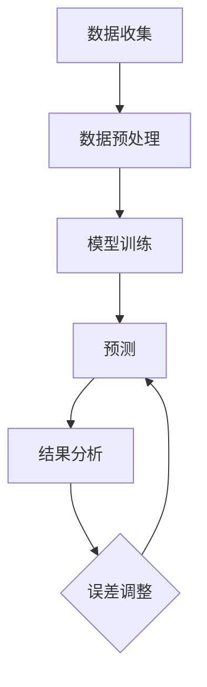
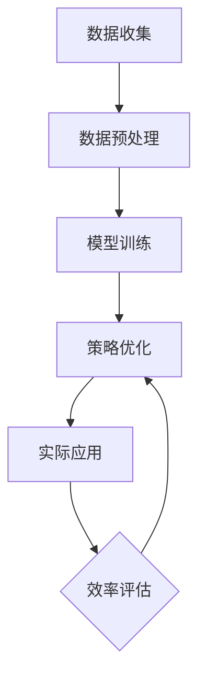
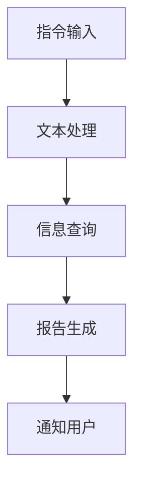

                 


### 2.3 可再生能源整合的挑战与机遇

#### 2.3.1 挑战

尽管AI驱动的智能能源交易平台展示了巨大的潜力，但可再生能源整合仍面临诸多挑战：

1. 数据质量与完整性：可再生能源的产出数据通常包含噪声和缺失值，这给机器学习模型的训练带来了困难。
2. 技术复杂性：AI模型的开发、部署和优化需要高水平的技术能力，这对企业来说可能是一个巨大的挑战。
3. 法律与监管问题：不同地区的法律和监管框架差异较大，这需要平台在设计和实施过程中进行充分考虑。

#### 2.3.2 机遇

尽管存在挑战，但可再生能源整合同样带来了巨大的机遇：

1. 资源优化：通过AI技术，可以更有效地分配和使用可再生能源资源，减少浪费。
2. 成本降低：通过预测和优化，可以降低能源生产和分配的成本，提高整体效益。
3. 市场扩展：随着可再生能源技术的进步和消费者意识的提高，可再生能源市场的需求不断增加，为平台提供了广阔的发展空间。

### 2.4 概念结构与核心要素组成

为了更好地理解AI驱动的智能能源交易平台，我们可以从概念结构和核心要素的角度进行分析：

#### 概念结构

1. **数据层**：包括能源生产、消费和交易的相关数据。
2. **算法层**：包含机器学习、深度学习和自然语言处理算法。
3. **应用层**：提供能源预测、优化和交易服务。

#### 核心要素组成

1. **数据采集与处理**：实时采集和处理能源数据，包括天气、负荷、价格等信息。
2. **机器学习模型**：用于预测能源需求和供应。
3. **深度学习模型**：用于优化能源生产和分配。
4. **自然语言处理**：用于处理用户输入和生成报告。

### 2.5 总结

AI驱动的智能能源交易平台通过集成先进的人工智能技术，为可再生能源的整合提供了强有力的支持。然而，要实现这一平台的全面应用，还需要克服诸多技术、法律和监管上的挑战。接下来，我们将进一步探讨可再生能源的基本概念、发展现状及其整合需求。### 第三部分：可再生能源概述

## 3. 可再生能源概述

### 3.1 可再生能源的类型

可再生能源是指那些能够在人类时间尺度内自然再生或循环利用的能源。根据其物理特性和来源，可再生能源可以分为以下几类：

1. **太阳能**：利用太阳辐射的能量，通过光伏电池或太阳能热利用系统直接转换为电能或热能。
2. **风能**：利用风力通过风力发电机转换为电能。
3. **水能**：利用水的位能或动能通过水力发电站转换为电能。这包括大型水电站和微型水力发电系统。
4. **生物质能**：通过生物质材料（如植物、农作物残余、森林废弃物等）的燃烧或生物化学过程产生的能量。
5. **地热能**：利用地球内部的热能，通过地热发电站或地热供暖系统转换为电能或热能。
6. **潮汐能**：利用海洋潮汐的动能或势能通过潮汐发电站转换为电能。

### 3.2 可再生能源的发展现状

近年来，随着环境保护意识的提高和技术的进步，可再生能源在全球范围内得到了迅速发展：

1. **太阳能**：太阳能光伏技术的成本大幅下降，安装和维护成本也在降低。全球太阳能光伏装机容量持续增长，尤其在亚洲和北美地区。
2. **风能**：风电技术也在不断进步，风力发电的效率不断提高。欧洲、北美和中国是风电发展的主要地区。
3. **水能**：全球水电站的建设仍在继续，特别是在发展中国家。然而，水能资源有限，且大型水电站的建设面临环境和社会挑战。
4. **生物质能**：生物质能利用技术逐渐成熟，但其资源供给和可持续性仍是一个问题。
5. **地热能**：地热能的应用相对较少，主要集中在火山和地热资源丰富的地区。
6. **潮汐能**：潮汐能技术尚在试验和示范阶段，但具有巨大的潜力。

### 3.3 可再生能源的整合需求

可再生能源的整合需求体现在以下几个方面：

1. **电网适应性**：可再生能源的产出具有波动性和不确定性，需要电网具备较强的适应性，以应对供需波动。
2. **储能技术**：储能技术对于平衡可再生能源的供应和需求至关重要。有效的储能系统可以存储过剩的能源，并在需求高峰时释放。
3. **跨区域协调**：由于可再生能源资源分布的不均匀性，需要通过跨区域协调，优化能源的传输和分配。
4. **市场机制**：建立透明、高效的市场机制，鼓励可再生能源的生产和消费，提高市场参与者的积极性。

### 3.4 概念属性特征对比表格

以下是可再生能源类型的对比表格，展示其基本属性特征：

| 类型 | 特征 |
| ---- | ---- |
| **太阳能** | 清洁、可再生、广泛分布、易安装 |
| **风能** | 清洁、可再生、效率高、风力资源分布不均 |
| **水能** | 清洁、可再生、效率高、环境影响大 |
| **生物质能** | 可再生、资源丰富、环境影响 |
| **地热能** | 清洁、可再生、技术复杂、适用性有限 |
| **潮汐能** | 清洁、可再生、能量密度高、受地理位置限制 |

### 3.5 ER实体关系图架构

为了更直观地展示可再生能源类型的实体关系，我们可以使用Mermaid语法绘制ER图：

```mermaid
erDiagram
    Resource --> Platform : provides
    Resource ||--|{ Type : type_of
    Platform ||--|{ Feature : has
    Feature ||--|{ Attribute : attribute
```

在这个ER图中，`Resource`实体与`Type`实体通过`type_of`关系连接，表示每种资源都有其特定的类型。`Platform`实体与`Feature`实体通过`has`关系连接，表示每个平台都有其特定的功能特征。`Feature`实体与`Attribute`实体通过`attribute`关系连接，表示每个功能特征都有其特定的属性。

### 3.6 总结

可再生能源作为清洁和可再生的能源来源，正逐渐成为全球能源结构的重要组成部分。不同类型的可再生能源具有各自独特的属性和挑战，但都面临着整合到现有能源系统中的需求。在接下来的章节中，我们将深入探讨AI驱动的智能能源交易平台的具体架构设计，以展示如何利用AI技术解决可再生能源整合的挑战。### 第四部分：智能能源交易平台的架构设计

## 4. 智能能源交易平台的架构设计

### 4.1 交易平台的技术框架

智能能源交易平台的技术框架是其实现高效、可靠运营的基础。该框架通常包括以下几个关键组件：

1. **数据采集与传输模块**：负责实时采集来自各种传感器的能源数据，并通过高效的数据传输协议将这些数据传输到数据处理模块。
2. **数据处理与分析模块**：对采集到的数据进行分析和预处理，去除噪声和异常值，确保数据质量。然后，利用机器学习和深度学习算法对数据进行分析，以实现能源预测、供需平衡和优化。
3. **决策支持系统**：基于分析结果，提供实时的决策支持，帮助能源交易员进行交易策略的制定和调整。
4. **用户界面**：为用户提供友好的操作界面，展示能源交易信息、市场动态和预测结果，使用户能够轻松地参与能源交易。

### 4.2 数据处理与存储

在智能能源交易平台中，数据处理和存储是两个至关重要的环节。以下是数据处理和存储的关键要素：

1. **数据采集**：通过传感器、智能电表、气象站等设备采集能源生产、消费和市场的数据。
2. **数据预处理**：对采集到的原始数据进行清洗、格式化，并去除噪声和异常值。这通常包括数据去重、缺失值填补和数据规范化等步骤。
3. **数据存储**：采用分布式数据库系统，如Hadoop或Cassandra，存储海量数据。这些数据库系统能够高效地处理大规模数据，并提供实时数据访问。
4. **数据备份与恢复**：定期备份数据，确保数据的安全性和可靠性。同时，制定数据恢复策略，以便在发生数据丢失或损坏时能够迅速恢复。
5. **数据安全性**：采用加密技术保护敏感数据，确保数据在传输和存储过程中的安全性。同时，建立访问控制机制，限制对数据的非法访问。

### 4.3 交易平台的核心功能模块

智能能源交易平台的核心功能模块包括以下几个部分：

1. **能源预测模块**：利用机器学习和深度学习算法，对未来的能源需求和供应进行预测。这包括短期（如小时级）和长期（如季度级）的预测。
2. **供需平衡模块**：根据预测结果，自动调整能源供应和需求，确保能源市场的平衡。这涉及到能源的调度、分配和优化。
3. **交易管理模块**：提供能源交易的交易平台，支持在线拍卖、点对点交易和合约执行等功能。该模块还负责处理交易过程中的资金流动和结算。
4. **用户管理模块**：管理用户账户，包括注册、认证、权限管理和用户互动。该模块确保用户能够安全、便捷地访问交易平台。
5. **报告与分析模块**：生成各种报告，包括市场动态、交易结果和能源效率分析。这些报告有助于用户和决策者了解市场情况和优化交易策略。

### 4.4 系统架构设计

为了实现上述功能，智能能源交易平台需要具备良好的系统架构设计。以下是平台的一个典型架构设计：

```mermaid
sequenceDiagram
    User ->>|访问| WebServer
    WebServer ->>|处理请求| AuthenticationService
    AuthenticationService ->>|验证用户| Database
    Database ->>|返回用户信息| AuthorizationService
    AuthorizationService ->>|授权请求| UserService
    UserService ->>|返回结果| WebServer
    WebServer ->>|发送响应| User

    User ->>|发送交易请求| TradingEngine
    TradingEngine ->>|处理交易| MarketData
    MarketData ->>|获取市场数据| EnergyPrediction
    EnergyPrediction ->>|生成预测结果| TradingEngine
    TradingEngine ->>|执行交易| FinanceSystem
    FinanceSystem ->>|处理资金流动| TradingEngine

    User ->>|请求报告| ReportingService
    ReportingService ->>|生成报告| EnergyAnalysis
    ReportingService ->>|发送报告| User
```

在这个架构设计中，WebServer作为前端接口，处理用户的请求和响应。AuthenticationService负责用户认证，AuthorizationService和UserService分别处理用户权限管理和用户服务。TradingEngine是交易的核心，负责处理交易请求和市场数据。EnergyPrediction模块提供能源预测结果，而FinanceSystem处理交易过程中的资金流动。ReportingService生成各种报告，EnergyAnalysis提供能源分析支持。

### 4.5 总结

智能能源交易平台的架构设计需要综合考虑数据采集、处理、存储、交易管理和用户交互等多个方面。通过构建一个高效、可靠和安全的系统架构，平台能够实现能源数据的实时分析、预测和交易，为可再生能源的整合提供有力支持。在接下来的章节中，我们将探讨AI技术在智能能源交易平台中的应用，进一步展示AI如何提高能源利用效率和交易效率。### 第五部分：AI在智能能源交易平台中的应用

## 5. AI在智能能源交易平台中的应用

### 5.1 机器学习算法在能源预测中的应用

机器学习算法在智能能源交易平台中的应用主要是为了解决能源供需预测的准确性问题。通过历史数据和实时数据的分析，机器学习算法能够预测未来的能源需求和生产，从而优化能源调度和资源分配。

#### 5.1.1 算法原理

机器学习算法，尤其是时间序列分析算法（如ARIMA、LSTM等），被广泛用于能源预测。这些算法通过学习历史数据中的模式和趋势，生成对未来数据的预测。

- **ARIMA（自回归积分滑动平均模型）**：适用于线性时间序列数据，通过自回归（AR）、差分（I）和移动平均（MA）模型结合，实现对数据的预测。
- **LSTM（长短期记忆网络）**：是一种特殊的RNN（循环神经网络），适用于处理非线性、非平稳的时间序列数据，具有较好的长期依赖性。

#### 5.1.2 应用案例

假设某地区需要预测未来24小时的电力需求。以下是一个简单的应用案例：

1. **数据收集**：收集过去一年的每日电力需求数据。
2. **数据预处理**：对数据进行清洗和规范化，去除异常值。
3. **模型训练**：使用LSTM模型对历史数据进行训练，优化模型参数。
4. **预测**：使用训练好的模型预测未来24小时的电力需求。
5. **结果分析**：对比预测值和实际值，分析预测误差，并根据实际情况进行调整。

#### 5.1.3 Mermaid流程图

以下是一个使用LSTM模型进行能源预测的Mermaid流程图：



### 5.2 深度学习在能源优化中的应用

深度学习在能源优化中的应用主要涉及能源网络的优化配置和运行效率提升。通过学习大量数据，深度学习算法能够找到能源系统的最优运行状态，从而提高能源利用效率和降低成本。

#### 5.2.1 算法原理

深度学习算法，如生成对抗网络（GAN）和深度强化学习（DRL），在能源优化中的应用日益广泛。

- **GAN（生成对抗网络）**：通过生成器和判别器的对抗训练，生成接近真实数据的能源需求或生产数据，用于优化能源调度。
- **DRL（深度强化学习）**：通过智能体与环境的交互，不断学习和优化策略，实现能源系统的自主优化。

#### 5.2.2 应用案例

假设一个电力系统需要优化电网的负载分配。以下是一个简单的应用案例：

1. **数据收集**：收集电力系统的历史运行数据和电网参数。
2. **数据预处理**：对数据进行清洗和规范化。
3. **模型训练**：使用DRL模型进行训练，优化负载分配策略。
4. **策略优化**：在虚拟环境中模拟运行，不断调整策略，提高优化效果。
5. **实际应用**：将优化后的策略应用到实际电网中，提高运行效率。

#### 5.2.3 Mermaid流程图

以下是一个使用DRL模型进行电网负载优化的Mermaid流程图：



### 5.3 自然语言处理在能源交易中的角色

自然语言处理（NLP）技术在智能能源交易平台中扮演着重要角色，特别是在处理和解析用户输入、生成报告和通知方面。

#### 5.3.1 算法原理

NLP算法，如词向量模型（如Word2Vec、BERT）和序列到序列模型（如Seq2Seq），在处理自然语言文本方面具有优势。

- **词向量模型**：将文本转换为向量表示，用于文本分类、情感分析等任务。
- **序列到序列模型**：用于生成文本，如自动生成报告、交易通知等。

#### 5.3.2 应用案例

假设用户通过自然语言指令与交易平台进行交互，以下是一个简单的应用案例：

1. **指令解析**：用户输入自然语言指令，如“告诉我明天的电力需求预测”。
2. **文本处理**：使用NLP算法解析用户指令，提取关键词和意图。
3. **信息查询**：根据提取的信息，查询系统数据库，获取相关数据。
4. **生成报告**：使用序列到序列模型生成用户所需的报告。
5. **通知用户**：将报告发送给用户，或通过其他渠道（如邮件、短信）通知用户。

#### 5.3.3 Mermaid流程图

以下是一个使用NLP技术处理用户指令的Mermaid流程图：



### 5.4 总结

AI技术在智能能源交易平台中的应用，不仅提高了能源预测和优化的准确性，还提高了能源交易的效率和用户体验。通过机器学习、深度学习和自然语言处理等技术的综合运用，智能能源交易平台能够更好地应对可再生能源整合的挑战，推动能源行业的可持续发展。在接下来的章节中，我们将通过案例分析，进一步探讨AI驱动的智能能源交易平台在实际应用中的效果和挑战。### 第六部分：交易平台案例分析

## 6. 交易平台案例分析

在本部分，我们将通过一个具体的案例，详细探讨AI驱动的智能能源交易平台在某地区的实施和应用效果。

### 6.1 案例一：某地区的智能能源交易平台

#### 6.1.1 项目介绍

某地区政府为了推动可再生能源的应用，决定建立一个智能能源交易平台。该平台的目标是通过AI技术实现可再生能源的高效整合和优化，提高能源利用效率，减少碳排放。

#### 6.1.2 系统功能设计

1. **能源预测模块**：利用机器学习算法，预测未来的电力需求和供应。通过分析历史数据和实时数据，平台能够生成24小时内的电力需求预测。
2. **供需平衡模块**：根据预测结果，动态调整电力供应和需求，确保电力市场的供需平衡。
3. **交易管理模块**：提供在线交易平台，支持点对点交易和合约执行。用户可以在平台上自由买卖电力，提高市场的流动性和透明度。
4. **用户管理模块**：管理用户账户，提供用户注册、登录和权限管理功能。同时，平台还提供用户交互界面，展示交易信息、市场动态和能源预测结果。

#### 6.1.3 系统架构设计

1. **数据采集与传输模块**：通过传感器和智能电表，实时采集电力生产和消费的数据，并通过物联网协议（如MQTT）传输到数据处理模块。
2. **数据处理与分析模块**：对采集到的数据进行分析和预处理，利用机器学习算法进行能源预测和供需平衡。同时，平台还使用深度学习算法优化电力调度和运行效率。
3. **决策支持系统**：基于分析结果，提供实时的决策支持，帮助能源交易员制定交易策略。
4. **用户界面**：为用户提供友好的操作界面，展示交易信息、市场动态和预测结果。

### 6.2 案例分析：挑战与解决方案

#### 6.2.1 挑战

1. **数据质量与完整性**：由于传感器和智能电表的局限性，采集到的数据可能存在噪声和缺失值，这给机器学习模型的训练带来了困难。
2. **技术复杂性**：AI模型的开发、部署和优化需要高水平的技术能力，这对平台开发和运营团队来说是一个巨大的挑战。
3. **法律与监管问题**：不同地区的法律和监管框架差异较大，这需要平台在设计和实施过程中进行充分考虑。

#### 6.2.2 解决方案

1. **数据质量提升**：通过引入数据清洗和预处理技术，如数据去重、缺失值填补和数据规范化，提高数据质量。同时，平台还采用多源数据融合技术，整合来自不同数据源的信息，提高数据的完整性。
2. **技术支持**：建立专业的技术团队，提供AI模型开发和优化的支持。同时，与科研机构和高校合作，共同推动AI技术在能源领域的应用。
3. **法律与监管合规**：在平台设计和实施过程中，充分考虑不同地区的法律和监管框架，确保平台的合规性。同时，与当地政府和监管机构保持密切沟通，及时了解最新的政策和法规。

### 6.3 案例总结

通过这个案例，我们可以看到AI驱动的智能能源交易平台在实际应用中取得了显著效果。平台不仅提高了能源预测和优化的准确性，还提高了能源交易的效率和用户体验。然而，实施过程中也面临诸多挑战，需要通过技术、法律和监管等多方面的支持，确保平台的长期稳定运行。接下来，我们将对整个平台的建设和应用进行总结，并探讨未来的发展趋势。### 第七部分：未来发展趋势与展望

## 7. 未来发展趋势与展望

### 7.1 智能能源交易平台的发展趋势

随着人工智能技术的不断进步和可再生能源应用的日益广泛，智能能源交易平台的发展趋势呈现出以下几个方向：

1. **智能化水平提升**：未来的智能能源交易平台将更加智能化，通过深度学习和强化学习等先进算法，实现更加精准的能源预测和优化。平台将能够实时响应市场变化，自动调整供需平衡，提高能源利用效率。
2. **多元化交易模式**：除了传统的点对点交易，未来的平台将支持更多的交易模式，如分布式交易、拍卖交易和电力金融衍生品交易。这些多元化的交易模式将提高市场的流动性和透明度。
3. **跨区域协同**：随着全球能源网络的互联，未来的智能能源交易平台将实现跨区域协同，通过数据共享和协同计算，优化全球能源资源的配置。
4. **区块链技术的应用**：区块链技术具有去中心化、不可篡改和透明等特点，未来将广泛应用于智能能源交易平台的交易记录、合约执行和能源认证等方面，提高交易的安全性和可信度。
5. **用户参与度提高**：未来的智能能源交易平台将更加注重用户体验，通过提供个性化服务、便捷的交易界面和智能的能源管理工具，提高用户的参与度和满意度。

### 7.2 AI驱动的可再生能源整合的未来

AI驱动的可再生能源整合在未来有望实现以下几个方面的突破：

1. **高效能源管理**：AI技术将使能源管理更加高效，通过预测和优化，实现能源资源的最优配置，减少浪费，提高整体能源利用效率。
2. **智能能源调度**：AI驱动的智能能源交易平台将能够实时监测能源供需情况，动态调整能源调度策略，确保电力系统的稳定运行。
3. **能源供应链优化**：AI技术将优化可再生能源的供应链管理，从生产、运输、存储到消费的各个环节，实现全流程的智能化管理，提高供应链的效率和可靠性。
4. **可再生能源与传统能源的融合**：AI驱动的可再生能源整合将促进可再生能源与传统能源的融合，实现能源系统的多样化和灵活性，提高整体能源系统的稳定性。
5. **环境友好型发展**：AI驱动的可再生能源整合有助于减少碳排放，推动环境友好型发展，为全球应对气候变化做出贡献。

### 7.3 潜在的技术挑战与应对策略

尽管AI驱动的智能能源交易平台具有巨大的潜力，但在发展过程中仍面临一些技术挑战：

1. **数据质量和完整性**：可再生能源数据通常存在噪声、缺失值和不一致性，这给机器学习模型的训练带来了挑战。应对策略是采用先进的数据清洗和预处理技术，提高数据质量。
2. **算法可解释性**：AI模型的结果往往缺乏可解释性，这在能源交易中可能带来安全隐患。应对策略是开发可解释的AI模型，提高模型的透明度和可信度。
3. **计算资源需求**：AI模型训练和推理需要大量的计算资源，这对平台的技术基础设施提出了高要求。应对策略是采用分布式计算和云计算技术，提高计算资源的利用效率。
4. **法律和监管问题**：不同地区的法律和监管框架存在差异，这需要平台在设计和实施过程中充分考虑合规性。应对策略是建立与当地政府和监管机构的紧密合作关系，及时了解政策和法规变化。

### 7.4 总结

未来的智能能源交易平台将更加智能化、多元化、跨区域化和区块链化，为可再生能源的整合提供强有力的支持。通过AI技术的深入应用，平台将实现高效能源管理、智能能源调度、优化能源供应链和推动环境友好型发展。然而，要实现这些目标，需要克服数据质量、算法可解释性、计算资源需求和法律监管等挑战。随着技术的不断进步和政策的支持，AI驱动的智能能源交易平台有望在未来取得更加显著的成果。### 第八部分：结论

## 8. 结论

本文通过详细的分析和探讨，全面介绍了AI驱动的智能能源交易平台及其在可再生能源整合中的应用。我们首先概述了问题的背景和问题描述，明确了可再生能源整合的挑战与机遇。随后，我们详细阐述了AI驱动的智能能源交易平台的核心概念、架构设计和技术应用，包括机器学习、深度学习和自然语言处理在能源预测、优化和交易中的应用。

通过案例分析，我们展示了智能能源交易平台在某地区的实际应用效果，并深入分析了面临的挑战及其解决方案。最后，我们探讨了未来发展趋势和潜在的技术挑战，为智能能源交易平台的未来发展提供了前瞻性展望。

### 8.1 本书内容总结

本文内容主要分为以下几个部分：

1. **引言**：介绍了可再生能源整合的背景和重要性，提出了AI驱动的智能能源交易平台作为解决路径。
2. **AI驱动的智能能源交易平台概述**：详细阐述了平台的核心概念、架构设计和技术应用。
3. **可再生能源概述**：分析了可再生能源的类型、发展现状及其整合需求。
4. **智能能源交易平台的架构设计**：介绍了平台的技术框架、数据处理与存储、核心功能模块及系统架构设计。
5. **AI在智能能源交易平台中的应用**：讨论了机器学习、深度学习和自然语言处理在能源预测、优化和交易中的应用。
6. **交易平台案例分析**：通过实际案例展示了平台的应用效果和挑战。
7. **未来发展趋势与展望**：探讨了智能能源交易平台的发展趋势和潜在的技术挑战。

### 8.2 对未来的展望

未来，AI驱动的智能能源交易平台有望在以下几个方面取得突破：

1. **智能化水平提升**：随着AI技术的不断进步，平台将实现更加精准的能源预测和优化，提高能源利用效率。
2. **多元化交易模式**：平台将支持更多样化的交易模式，提高市场的流动性和透明度。
3. **跨区域协同**：全球能源网络的互联将促进跨区域能源资源的优化配置。
4. **区块链技术的应用**：区块链技术将提高交易的安全性和可信度，为智能能源交易平台的进一步发展提供保障。

### 8.3 对读者的建议

对于关注智能能源交易平台的读者，以下是一些建议：

1. **深入学习AI技术**：了解机器学习、深度学习和自然语言处理等AI技术的基本原理和应用，有助于更好地理解智能能源交易平台的工作机制。
2. **关注可再生能源发展**：了解可再生能源的技术进步和市场动态，有助于把握智能能源交易平台的未来发展机遇。
3. **参与实际项目**：通过参与实际项目，实践智能能源交易平台的设计、开发和部署，积累宝贵的经验。
4. **持续关注政策变化**：关注能源政策和法规的变化，确保智能能源交易平台的合规性。

### 8.4 结语

智能能源交易平台作为可再生能源整合的重要手段，正日益受到关注。本文通过系统性的分析，为读者提供了一个全面、深入的视角。希望本文能够激发读者在智能能源交易平台领域的研究和实践热情，共同推动这一领域的创新和发展。作者：AI天才研究院/AI Genius Institute & 禅与计算机程序设计艺术 /Zen And The Art of Computer Programming

