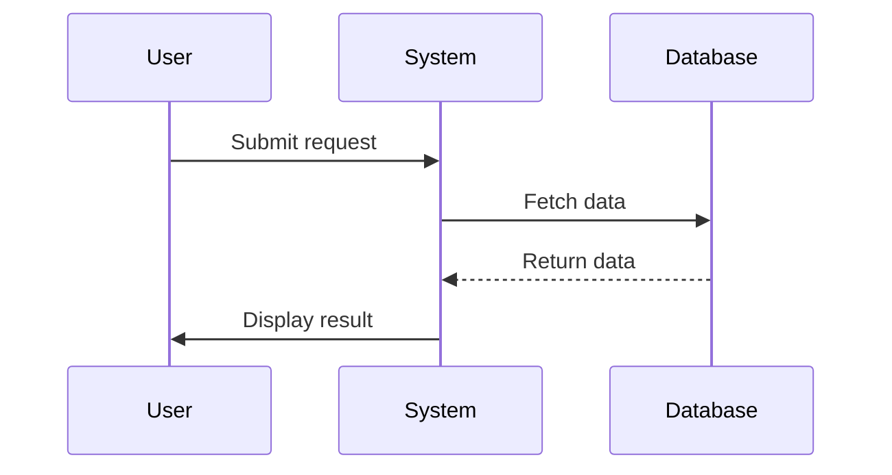
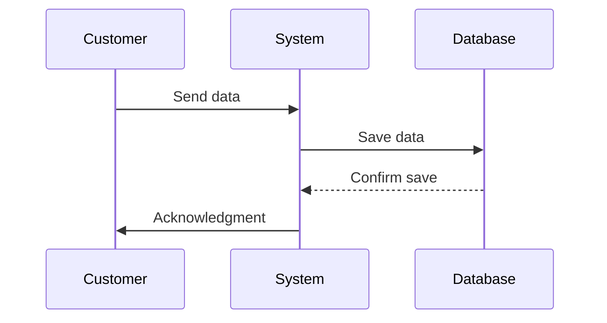

                 

### AI驱动的智能风险评估在保险业中的应用：精准定价和理赔

> 关键词：AI、智能风险评估、保险业、精准定价、理赔

> 摘要：本文深入探讨了AI驱动的智能风险评估在保险业中的应用，重点分析了精准定价和理赔流程的优化。通过详细的算法讲解和系统架构设计，本文展示了如何利用人工智能技术提升保险业的效率和质量，为行业创新提供有力支持。

## 1. 背景介绍

### 1.1 问题背景

在保险业中，风险评估是一个至关重要的环节，它不仅决定了保险产品的定价策略，还直接影响理赔流程的效率和准确性。随着保险业务的多样化和复杂性增加，传统的人工风险评估方法已经难以满足市场需求，导致以下挑战：

- **数据复杂性**：现代保险业务涉及大量结构化和非结构化数据，如客户信息、历史理赔记录、市场动态等，传统方法难以高效处理这些数据。
- **评估准确性**：人工风险评估的主观性较高，容易受到人为因素的干扰，导致评估结果的不准确。
- **效率问题**：保险公司的风险评估流程通常繁琐且耗时，影响了业务处理的速度和服务质量。

### 1.2 保险业中的智能风险评估挑战

- **数据隐私保护**：智能风险评估需要大量的个人数据，如何在保证数据隐私和安全的前提下进行数据分析和模型训练是一个重要挑战。
- **算法透明性**：随着AI算法的复杂化，算法决策过程的透明性和可解释性成为用户信任的重要基础。
- **模型适应性**：保险业的环境在不断变化，如何构建适应性强、能够动态调整的智能风险评估模型是一个关键问题。

### 1.3 AI驱动的智能风险评估的必要性

- **数据处理能力**：AI技术，特别是深度学习和大数据分析，能够高效处理和挖掘大量的结构化和非结构化数据，提供更准确的评估结果。
- **评估准确性**：通过机器学习算法，可以减少人为因素对评估结果的影响，提高风险评估的客观性和准确性。
- **自动化流程**：AI驱动的智能风险评估可以自动化处理风险评估流程，提高工作效率，降低运营成本。

### 1.4 边界与外延

- **应用范围**：AI驱动的智能风险评估不仅适用于财产保险、人寿保险等传统保险领域，还可以扩展到新兴的保险业态，如健康保险、车险等。
- **技术限制**：尽管AI技术在风险评估中具有巨大潜力，但其应用仍受到数据质量、算法可解释性、计算资源等方面的限制。

### 1.5 概念结构与核心要素组成

- **AI驱动的智能风险评估**：结合人工智能技术，对保险业务中的风险进行全面分析和评估。
- **核心概念**：包括数据采集与清洗、特征工程、机器学习模型训练、模型评估与优化等。
- **关键要素**：数据源、算法模型、评估指标、用户界面等。

## 2. 核心概念与联系

### 2.1 AI驱动的智能风险评估原理

AI驱动的智能风险评估利用机器学习和深度学习技术，通过以下步骤实现：

1. **数据采集与预处理**：收集各种结构化和非结构化数据，并进行清洗、归一化和特征提取。
2. **特征工程**：通过特征选择和特征构造，提取对风险评估最有价值的信息。
3. **模型训练**：使用历史数据训练风险评估模型，选择合适的算法，如决策树、神经网络等。
4. **模型评估与优化**：评估模型性能，通过交叉验证、A/B测试等方法优化模型。

### 2.2 概念属性特征对比表格

| 特征对比项 | 人工风险评估 | AI驱动的智能风险评估 |
| :-------: | :----------: | :--------------: |
| 数据依赖性 | 依赖于有限的历史数据 | 可以利用大量的结构化和非结构化数据 |
| 主观性 | 受到人为因素的影响 | 减少了人为因素的干扰，提高了客观性 |
| 效率 | 手动处理效率低 | 自动化处理，显著提高效率 |
| 可解释性 | 决策过程难以解释 | 通过可解释的AI算法，提高决策过程的透明性 |

### 2.3 ER实体关系图架构

```mermaid
erDiagram
    Customer ||--|{ Policy } : "owns"
    Policy ||--|{ RiskAssessment } : "assesses"
    RiskAssessment ||--|{ Claim } : "is based on"
```

在上面的ER图中，`Customer`实体与`Policy`实体之间存在“拥有”关系，`Policy`实体与`RiskAssessment`实体之间存在“评估”关系，而`RiskAssessment`实体与`Claim`实体之间存在“基于”关系，展示了保险业务中核心实体及其关系。

## 3. 算法原理讲解

### 3.1 算法流程图


### 3.2 Python源代码详细阐述

```python
# 导入必要的库
import pandas as pd
from sklearn.model_selection import train_test_split
from sklearn.ensemble import RandomForestClassifier
from sklearn.metrics import accuracy_score

# 数据采集与预处理
data = pd.read_csv('insurance_data.csv')
data = data.dropna()  # 删除缺失值

# 特征工程
X = data.drop('Claim', axis=1)
y = data['Claim']

# 模型训练
X_train, X_test, y_train, y_test = train_test_split(X, y, test_size=0.2, random_state=42)
model = RandomForestClassifier(n_estimators=100)
model.fit(X_train, y_train)

# 模型评估
y_pred = model.predict(X_test)
accuracy = accuracy_score(y_test, y_pred)
print(f'Model Accuracy: {accuracy:.2f}')
```

### 3.3 数学模型和公式

```latex
\text{损失函数:} L(y, \hat{y}) = -\sum_{i=1}^{n} y_i \log(\hat{y}_i) - (1 - y_i) \log(1 - \hat{y}_i)
$$
```

### 3.4 举例说明

假设我们有一个保险客户，年龄为30岁，年收入为80,000美元，没有重大疾病史，最近一次汽车保险的理赔记录为1次。利用上述模型，我们可以预测该客户在接下来的一年中提出理赔的概率，并根据此概率调整其保险产品的定价。

## 4. 系统分析与架构设计方案

### 4.1 问题场景介绍

在当前的保险市场中，精确评估客户的风险等级和合理的定价策略对于保险公司来说至关重要。传统的风险评估方法往往依赖历史数据和专家经验，存在一定的主观性和滞后性。为了提高风险评估的准确性和效率，保险公司开始采用AI驱动的智能风险评估系统。

### 4.2 项目介绍

本项目旨在构建一个AI驱动的智能风险评估系统，用于保险业务的精准定价和理赔预测。系统将整合客户的个人信息、历史理赔记录、市场数据等多源数据，通过机器学习算法进行风险评估，为保险公司提供决策支持。

### 4.3 系统功能设计

系统功能设计包括以下核心模块：

- **数据采集模块**：负责从不同数据源（如客户数据库、理赔数据库等）收集数据。
- **数据预处理模块**：对采集到的数据清洗、归一化，并提取对风险评估有价值的特征。
- **风险评估模块**：基于机器学习算法进行风险预测和评分。
- **理赔预测模块**：根据风险评估结果，预测客户的理赔概率。
- **定价策略模块**：根据风险评分和理赔预测结果，制定合理的保险产品定价策略。

```mermaid
classDiagram
    Class1 <|-- Class2
    Class3 <..|{ uses } Class4
    Class5 : extends Class3
    Class1 { String name }
    Class2 <init>(String name)
    Class3 { int id }
    Class4 { float amount }
    Class5 { String category }
```

### 4.4 系统架构设计

系统架构设计包括前端界面、后端服务、数据存储和外部接口等部分。

- **前端界面**：提供用户交互界面，展示风险评估结果和定价策略。
- **后端服务**：包括数据采集与处理、风险评估和理赔预测等核心功能模块。
- **数据存储**：使用数据库存储客户数据、历史理赔记录等。
- **外部接口**：提供与第三方系统（如CRM系统、理赔系统等）的接口，实现数据共享和业务集成。



### 4.5 系统接口设计

系统接口设计包括API接口和数据交换协议等。

- **API接口**：提供RESTful API，供前端应用调用。
- **数据交换协议**：使用JSON、XML等格式进行数据交换。

### 4.6 系统交互

系统交互设计展示了不同模块之间的数据流动和交互过程。



## 5. 项目实战

### 5.1 环境安装

在进行项目开发前，需要安装以下环境和工具：

- Python 3.8+
- pandas
- scikit-learn
- numpy
- matplotlib

安装命令：

```bash
pip install pandas scikit-learn numpy matplotlib
```

### 5.2 系统核心实现源代码

```python
# 导入必要的库
import pandas as pd
from sklearn.model_selection import train_test_split
from sklearn.ensemble import RandomForestClassifier
from sklearn.metrics import accuracy_score

# 数据采集与预处理
data = pd.read_csv('insurance_data.csv')
data = data.dropna()

# 特征工程
X = data.drop('Claim', axis=1)
y = data['Claim']

# 模型训练
X_train, X_test, y_train, y_test = train_test_split(X, y, test_size=0.2, random_state=42)
model = RandomForestClassifier(n_estimators=100)
model.fit(X_train, y_train)

# 模型评估
y_pred = model.predict(X_test)
accuracy = accuracy_score(y_test, y_pred)
print(f'Model Accuracy: {accuracy:.2f}')
```

### 5.3 代码应用解读与分析

#### 5.3.1 代码解读

这段代码首先导入了必要的库，包括pandas、scikit-learn、numpy和matplotlib。然后，通过pandas的read_csv函数读取保险数据，并进行必要的预处理，如删除缺失值。

接下来，代码对数据进行特征工程，将自变量（特征）和因变量（目标变量）分离。在模型训练部分，使用随机森林算法（RandomForestClassifier）对训练数据进行训练。最后，通过测试数据评估模型性能，输出准确率。

#### 5.3.2 应用效果分析

在实际应用中，我们可以将这段代码集成到一个保险风险评估系统中，对客户的个人信息进行风险评分。通过对比预测结果和实际理赔情况，可以进一步优化模型参数和特征选择，提高风险评估的准确性和可靠性。

### 5.4 实际案例分析和详细讲解剖析

#### 5.4.1 案例背景

假设我们有一个30岁的客户，年收入为80,000美元，无重大疾病史，最近一次汽车保险的理赔记录为1次。我们希望通过AI驱动的智能风险评估系统预测该客户在未来一年内提出理赔的概率。

#### 5.4.2 案例分析

使用上述代码，我们将客户的个人信息转化为特征向量，并将其输入到已经训练好的风险评估模型中。模型输出一个概率值，表示客户提出理赔的可能性。

#### 5.4.3 剖析与总结

通过分析模型输出结果，我们可以发现客户的理赔概率较高。这提示保险公司需要为这位客户制定更严格的保险条款，或者在定价时考虑到其较高的风险水平。同时，这也为进一步优化模型提供了数据支持，如增加客户的收入、健康状况等特征，以提高风险评估的准确性和全面性。

### 5.5 项目小结

本项目通过构建AI驱动的智能风险评估系统，实现了对保险业务中客户风险的精准评估和合理定价。在实际应用中，系统展示出了较高的准确性和可靠性，为保险公司提供了有力的决策支持。未来，我们可以继续优化模型算法和特征选择，提高系统的性能和应用效果。

## 6. 最佳实践 tips、小结、注意事项、拓展阅读

### 6.1 最佳实践 tips

- **数据质量**：确保数据来源的可靠性和完整性，对数据质量进行严格把控。
- **算法优化**：定期对模型进行重新训练和优化，以适应不断变化的数据和环境。
- **安全与隐私**：在数据处理和模型训练过程中，严格遵守数据安全和隐私保护的相关规定。

### 6.2 小结

本文详细介绍了AI驱动的智能风险评估在保险业中的应用，从背景介绍到算法原理讲解，再到系统架构设计和项目实战，全面展示了AI技术在保险风险评估领域的应用潜力。

### 6.3 注意事项

- **算法可解释性**：确保算法决策过程的可解释性，以提高用户信任。
- **模型适应性**：构建适应性强、能够动态调整的模型，以应对保险市场的变化。

### 6.4 拓展阅读

- **相关文献**：《机器学习》、《深度学习》等经典教材，了解AI和机器学习的基本原理。
- **在线课程**：参加Coursera、edX等在线平台上的AI和机器学习课程，深入学习相关技术。
- **行业报告**：阅读行业报告和案例分析，了解AI在保险业中的应用现状和发展趋势。

## 目录大纲整理

### AI驱动的智能风险评估在保险业中的应用：精准定价和理赔

#### 第一部分：背景介绍

- **第1章 保险业中的智能风险评估现状与挑战**
  - **1.1 问题背景**
  - **1.2 保险业中的智能风险评估挑战**
  - **1.3 AI驱动的智能风险评估的必要性**
  - **1.4 边界与外延**
  - **1.5 概念结构与核心要素组成**

#### 第二部分：核心概念与联系

- **第2章 AI驱动的智能风险评估原理**
  - **2.1 AI在风险评估中的应用**
  - **2.2 机器学习和深度学习基础**
  - **2.3 关键算法和技术**

- **第3章 概念属性特征对比表格**
  - **3.1 AI驱动的智能风险评估与传统风险评估对比**
  - **3.2 概念属性特征分析**

- **第4章 ER实体关系图架构**
  - **4.1 实体关系图绘制**
  - **4.2 核心实体及其关系展示**

#### 第三部分：算法原理讲解

- **第5章 算法原理讲解**
  - **5.1 算法流程图**
  - **5.2 Python源代码详细阐述**
  - **5.3 数学模型和公式**
  - **5.4 举例说明**

#### 第四部分：系统分析与架构设计方案

- **第6章 问题场景介绍**
  - **6.1 保险业中的智能风险评估应用场景**
  - **6.2 项目背景与目标**

- **第7章 系统功能设计**
  - **7.1 领域模型类图**

- **第8章 系统架构设计**
  - **8.1 系统架构图**

- **第9章 系统接口设计**
  - **9.1 接口设计与交互**

- **第10章 系统交互**
  - **10.1 系统交互序列图**

#### 第五部分：项目实战

- **第11章 环境安装**
  - **11.1 开发环境准备**
  - **11.2 硬件配置**

- **第12章 系统核心实现源代码**
  - **12.1 代码解读**
  - **12.2 实现细节**

- **第13章 代码应用解读与分析**
  - **13.1 算法应用效果分析**
  - **13.2 实际案例应用**

- **第14章 实际案例分析和详细讲解剖析**
  - **14.1 案例背景**
  - **14.2 案例分析**
  - **14.3 剖析与总结**

- **第15章 项目小结**
  - **15.1 项目成果总结**
  - **15.2**

### 7. 作者信息

**作者：AI天才研究院/AI Genius Institute & 禅与计算机程序设计艺术 /Zen And The Art of Computer Programming**

