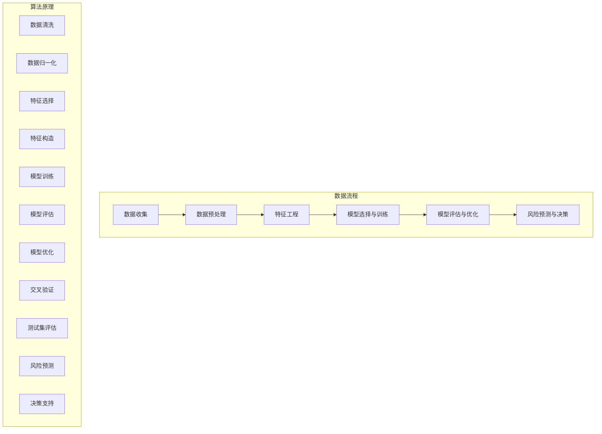
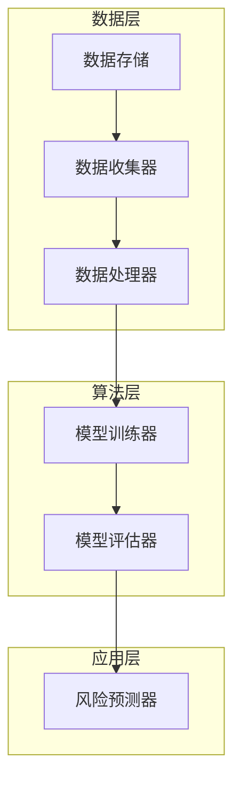
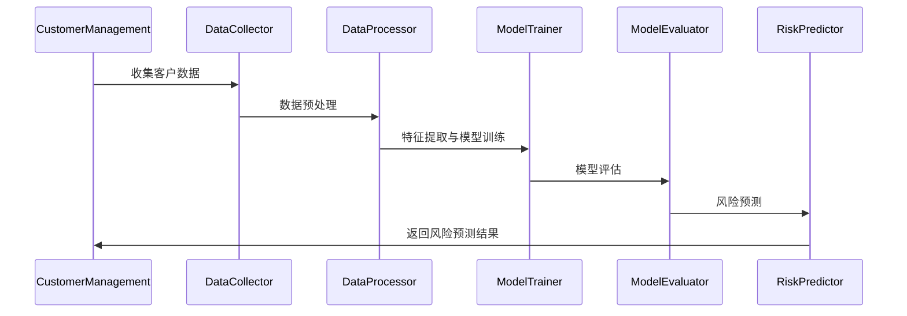

                 

### 文章标题与背景

# AI驱动的智能风险评估：金融业的革新工具

在当今这个数字化和自动化加速发展的时代，人工智能（AI）已经成为金融行业不可或缺的一部分。随着金融市场的日益复杂和风险因素的不断变化，传统的风险评估方法已经难以满足现代金融业务的需求。因此，AI驱动的智能风险评估成为金融业迈向智能化和高效化的重要工具。

本文将深入探讨AI驱动的智能风险评估在金融业中的应用，从基本概念、理论基础到具体方法，以及实践案例进行全面分析。希望通过这篇文章，读者能够了解AI如何为金融风险评估带来革新，以及如何在实际操作中实现这些技术。

本文关键词包括：人工智能、风险评估、金融行业、智能分析、数据挖掘、机器学习、深度学习、量化交易、信用风险评估、系统架构设计、实战案例。

文章将分为以下几部分：

1. 引言与背景
2. AI在金融行业中的应用
3. 智能风险评估的理论基础
4. AI驱动的智能风险评估方法与实践
5. 项目实战与案例分析
6. 结论与未来展望

通过以上结构，我们将一步步分析AI在金融风险评估中的实际应用，以及如何通过智能技术提升金融风险管理的效率和质量。接下来，我们首先介绍AI在金融行业中的应用背景和现状。

### 引言与背景

在当前的经济环境中，金融行业的竞争日益激烈，市场波动频繁，风险因素复杂多变。传统的风险评估方法虽然在一定程度上能够应对常见的风险，但在面对突如其来的市场变化和复杂的经济形势时，往往显得力不从心。这就迫切需要一种更为智能、高效的风险评估工具，以帮助金融机构更好地管理风险，确保业务的稳健运行。

#### 1.1 金融业面临的挑战

金融行业面临的主要挑战可以归结为以下几点：

- **数据复杂性**：金融行业积累了海量的数据，包括交易数据、客户数据、市场数据等。如何有效地处理和利用这些数据，提取有价值的信息，成为风险评估的重要难题。
- **风险多样化**：金融产品的种类繁多，风险来源也多种多样，包括信用风险、市场风险、操作风险等。如何全面、准确地评估这些风险，是一个复杂的课题。
- **监管要求**：金融行业的监管要求日益严格，金融机构需要满足各种合规性要求，如反洗钱、数据保护等。这些要求对风险评估方法和工具提出了更高的要求。
- **效率与成本**：传统的风险评估方法往往需要大量的人力和时间，而金融行业对效率和成本的控制要求越来越高。如何提高风险评估的效率和降低成本，是金融机构关注的焦点。

#### 1.2 AI技术在金融领域的应用现状

人工智能（AI）技术的发展为金融行业带来了新的机遇。AI技术在金融领域的应用主要体现在以下几个方面：

- **量化交易**：AI算法能够分析大量的市场数据，预测市场走势，帮助投资者制定交易策略。量化交易已经成为现代金融市场中一种重要的交易方式。
- **信用风险评估**：AI技术可以通过分析客户的交易记录、信用历史等多维数据，评估客户的信用风险。相比传统的信用评估方法，AI技术能够更准确地预测客户的违约风险。
- **客户行为分析**：AI技术可以分析客户的交易行为、消费习惯等，帮助金融机构了解客户需求，提供个性化的服务和产品。
- **风险管理**：AI技术可以帮助金融机构实时监控风险，预测潜在的风险点，制定相应的风险控制策略。

#### 1.3 智能风险评估的重要性

智能风险评估在金融业中的重要性主要体现在以下几个方面：

- **提高风险评估的准确性**：传统的风险评估方法往往依赖于规则和经验，而AI技术可以通过机器学习和深度学习等方法，从大量数据中提取有价值的信息，提高风险评估的准确性。
- **实时风险评估**：AI技术可以实现实时风险评估，帮助金融机构及时了解市场变化，快速调整风险控制策略。
- **降低风险成本**：通过智能技术，金融机构可以更有效地识别和管理风险，降低风险管理的成本。
- **合规性要求**：智能风险评估可以帮助金融机构满足监管要求，降低合规风险。

总之，智能风险评估已经成为金融业不可或缺的工具，其应用前景十分广阔。接下来，我们将进一步探讨AI驱动的智能风险评估的基本概念和原理。

### AI驱动的智能风险评估概述

#### 1.4 AI驱动的智能风险评估的定义

AI驱动的智能风险评估是指利用人工智能技术，对金融市场中潜在的风险进行识别、评估和预测。这种方法不仅依赖于传统的数据分析方法，更注重从海量数据中提取特征，通过机器学习和深度学习模型进行风险预测和决策支持。AI驱动的智能风险评估主要涉及以下几个关键环节：

- **数据收集与预处理**：收集来自不同来源的金融数据，包括市场数据、客户交易数据、信用记录等，并进行数据清洗和预处理，确保数据的质量和一致性。
- **特征工程**：通过数据分析和统计方法，提取出与风险相关的特征，如交易频率、交易金额、客户信用评分等，为后续的风险评估模型提供输入。
- **模型训练与优化**：使用机器学习和深度学习算法，如决策树、神经网络、支持向量机等，对数据进行训练，优化模型的参数，以提高风险评估的准确性和效率。
- **风险预测与决策**：通过训练好的模型，对新的数据进行风险评估，预测潜在的风险，并生成决策支持，帮助金融机构制定相应的风险控制策略。

#### 1.5 智能风险评估的关键环节

智能风险评估涉及多个关键环节，每个环节都对最终评估结果产生重要影响。以下是这些关键环节的详细说明：

- **数据收集与预处理**：数据是智能风险评估的基础。首先需要从各种渠道收集金融数据，如市场数据、客户交易记录、信用数据等。随后，对数据进行清洗和预处理，去除缺失值、异常值和重复数据，保证数据的质量。
- **特征工程**：特征工程是数据挖掘中的重要环节，旨在提取出与风险相关的特征。特征的选择和构造对模型的性能有重要影响。常用的方法包括统计方法、机器学习方法、领域知识等。
- **模型训练与优化**：选择合适的机器学习和深度学习算法，对数据进行训练。模型的性能需要通过交叉验证和超参数调整进行优化，以提高模型的准确性和鲁棒性。
- **风险预测与决策**：使用训练好的模型，对新的数据进行风险评估，预测潜在的风险。风险评估结果可以为金融机构提供决策支持，帮助其制定相应的风险控制策略。

#### 1.6 金融业对智能风险评估的需求

金融行业对智能风险评估有着强烈的需求，主要体现在以下几个方面：

- **准确性**：金融风险评估需要高度的准确性，以避免误判导致的重大损失。智能风险评估可以通过分析大量的历史数据，提高风险评估的准确性。
- **实时性**：金融市场变化迅速，实时风险评估能够帮助金融机构及时应对市场变化，降低风险。
- **合规性**：智能风险评估可以帮助金融机构满足监管要求，降低合规风险。
- **成本效益**：通过自动化和智能化的方法，智能风险评估可以降低人力成本，提高风险评估的效率。

总之，AI驱动的智能风险评估已经成为金融业提升风险管理能力的重要工具。随着AI技术的不断发展，其在金融领域的应用前景将更加广阔。接下来，我们将详细探讨AI在金融行业中的应用案例。

### AI在金融行业中的应用案例

人工智能（AI）技术在金融行业中的应用已经取得了显著成果，通过多种AI技术，金融机构能够更加精准地识别和评估风险，提升业务效率，提供个性化服务。以下是一些典型的AI应用案例：

#### 2.1 量化交易

量化交易是指利用数学模型和计算机算法，对金融市场的价格波动进行分析，预测市场趋势，从而进行投资交易。AI技术在这一领域的应用主要体现在以下几个方面：

- **市场趋势预测**：通过机器学习和深度学习算法，对历史交易数据和市场动态进行分析，预测市场价格的短期和长期趋势。
- **交易策略优化**：利用AI算法，分析大量市场数据，发现潜在的交易机会，并优化交易策略，提高交易的成功率。
- **风险控制**：AI技术可以实时监控交易风险，预测潜在的损失，并自动调整交易策略，降低风险。

#### 2.2 信用风险评估

信用风险评估是金融机构的一项核心任务，AI技术在信用风险评估中的应用主要体现在以下几个方面：

- **信用评分**：通过机器学习算法，对客户的交易记录、信用历史、财务状况等多维数据进行分析，预测客户的信用风险，评估客户的信用评分。
- **违约预测**：利用深度学习模型，分析客户的交易行为和信用数据，预测客户是否会发生违约，帮助金融机构制定风险管理策略。
- **欺诈检测**：通过模式识别和异常检测算法，识别并防范金融欺诈行为，保护金融机构和客户的利益。

#### 2.3 客户行为分析

客户行为分析是指通过分析客户的交易行为、消费习惯、偏好等数据，了解客户需求，提供个性化服务和产品。AI技术在客户行为分析中的应用主要体现在以下几个方面：

- **需求预测**：通过机器学习算法，分析客户的交易历史和偏好，预测客户未来的需求和行为，为金融机构提供营销策略支持。
- **个性化服务**：利用AI技术，根据客户的偏好和行为，提供个性化的服务和产品推荐，提高客户满意度和忠诚度。
- **风险监控**：通过分析客户的行为数据，实时监控客户的风险状况，预防潜在的信用风险。

#### 2.4 风险管理

风险管理是金融机构的一项重要工作，AI技术在风险管理中的应用主要体现在以下几个方面：

- **风险预警**：通过AI技术，实时监控市场动态和数据变化，预测潜在的风险，及时发出预警，帮助金融机构采取应对措施。
- **风险控制**：利用AI算法，分析客户交易行为和市场风险，制定相应的风险控制策略，降低金融机构的整体风险。
- **合规监控**：通过AI技术，监控金融机构的业务活动，确保其符合相关法规和监管要求，降低合规风险。

这些AI应用案例表明，人工智能技术在金融行业有着广泛的应用前景。通过AI技术，金融机构能够更加精准地识别和管理风险，提高业务效率和客户满意度。接下来，我们将深入探讨金融行业对AI技术的需求。

### 金融行业对AI技术的需求

在金融行业中，人工智能（AI）技术的应用已经成为提升业务效率、增强竞争力和应对复杂市场环境的关键因素。金融机构对AI技术的需求主要体现在以下几个方面：

#### 3.1 数据质量与标准化

金融行业积累了大量的数据，包括交易数据、客户信息、市场动态等。然而，这些数据往往存在格式不统一、缺失值较多、数据质量参差不齐等问题。为了充分发挥AI技术的潜力，金融机构需要确保数据的质量和一致性。这包括以下措施：

- **数据清洗**：对原始数据进行清洗，去除错误记录、重复数据和缺失值，提高数据的准确性。
- **数据标准化**：统一数据格式和标准，确保数据在不同系统和部门之间的一致性和可比较性。
- **数据集成**：整合来自不同数据源的金融数据，形成完整的数据视图，为AI分析提供全面的输入。

#### 3.2 安全性与合规性

金融行业的特殊性决定了其对数据安全和合规性的严格要求。AI技术在应用过程中需要满足以下安全和合规要求：

- **数据保护**：确保客户数据和交易数据的隐私和安全，采取加密、访问控制等技术手段，防止数据泄露和滥用。
- **合规监控**：遵守相关法规和监管要求，如反洗钱（AML）、数据保护法规等。通过AI技术，实时监控业务活动，确保合规性。
- **透明度**：确保AI决策过程的透明度，对模型训练、决策流程等进行详细记录和解释，方便监管部门和客户监督。

#### 3.3 技术融合与创新

金融行业对AI技术的需求不仅体现在现有业务流程的优化，还包括通过技术创新驱动业务模式变革。以下是一些具体需求：

- **跨领域融合**：将AI技术与金融行业的其他技术，如区块链、云计算等相结合，实现更高效、更安全的金融服务。
- **业务流程优化**：利用AI技术自动化和优化业务流程，提高运营效率和客户体验。
- **创新应用**：探索AI技术在金融行业的新应用场景，如智能投顾、自动化风险管理等，推动业务模式创新。

#### 3.4 实时性与动态适应性

金融市场变化迅速，金融机构需要具备实时决策能力，以应对市场波动和风险变化。AI技术的实时性和动态适应性需求体现在：

- **实时数据分析**：利用AI技术，实时分析市场数据、交易行为等，为金融机构提供即时的风险预警和决策支持。
- **自适应学习**：AI系统应具备自适应学习能力，通过不断学习和调整，提高风险评估和预测的准确性。
- **快速响应**：在市场变化时，AI系统能够快速响应，调整策略和操作，确保金融机构能够在市场中保持竞争力。

综上所述，金融行业对AI技术的需求是多方面的，涉及数据质量、安全性、合规性、技术创新和实时性等方面。金融机构需要积极拥抱AI技术，充分利用其优势，提升业务效率，降低风险，实现可持续发展。接下来，我们将深入探讨智能风险评估的基本概念和理论框架。

### 智能风险评估的基本概念

智能风险评估是指利用人工智能（AI）技术，对金融市场中潜在的风险进行识别、评估和预测的一种方法。与传统的风险评估方法相比，智能风险评估具有更高的准确性、实时性和动态适应性。以下是智能风险评估的基本概念和组成部分：

#### 4.1 风险的定义与分类

风险是指不确定性带来的潜在损失。在金融市场中，风险可以按照不同的维度进行分类，主要包括以下几种类型：

- **信用风险**：指债务人未能履行还款义务，导致债权人损失的风险。
- **市场风险**：指市场价格波动导致投资价值下降的风险，包括利率风险、汇率风险、股票价格风险等。
- **操作风险**：指由于内部流程、员工、系统或外部事件等因素导致的损失风险。
- **法律风险**：指由于法律变更、法规执行不当等因素导致的潜在损失风险。

#### 4.2 风险评估的过程

风险评估是一个系统性的过程，包括以下步骤：

- **风险识别**：识别可能影响金融机构目标实现的潜在风险。
- **风险分析**：对识别出的风险进行定量和定性分析，评估其发生的可能性、影响程度和潜在的损失。
- **风险评估**：根据风险分析的结果，对风险进行排序，确定优先级。
- **风险应对**：制定相应的风险应对策略，包括风险规避、风险减轻、风险转移等。

#### 4.3 风险评估的方法与工具

智能风险评估的方法和工具主要包括以下几种：

- **统计方法**：通过统计分析方法，如回归分析、方差分析等，对风险因素进行量化评估。
- **机器学习方法**：利用机器学习算法，如决策树、随机森林、支持向量机等，对风险数据进行分析和预测。
- **深度学习方法**：通过深度学习算法，如卷积神经网络（CNN）、循环神经网络（RNN）等，对复杂的风险数据进行分析和建模。
- **数据挖掘方法**：利用数据挖掘技术，从大量的历史数据中提取有价值的信息，用于风险评估。

#### 4.4 AI驱动的风险评估方法

AI驱动的风险评估方法主要利用机器学习和深度学习算法，对金融数据进行分析和预测。以下是AI驱动的风险评估方法的主要步骤：

- **数据预处理**：对原始金融数据进行清洗、归一化和特征提取，为后续的模型训练提供高质量的输入数据。
- **模型训练**：选择合适的机器学习和深度学习算法，对预处理后的数据集进行训练，优化模型的参数，提高模型的预测准确性。
- **模型评估**：通过交叉验证和测试集，评估模型的性能，调整模型参数，确保模型具有良好的泛化能力。
- **风险预测**：使用训练好的模型，对新的数据进行风险评估，预测潜在的风险，为金融机构提供决策支持。

#### 4.5 风险评估的关键环节

在AI驱动的智能风险评估中，以下关键环节对风险评估结果具有决定性影响：

- **数据质量**：数据质量是风险评估的基础。高质量的数据可以提供更准确的风险预测。
- **特征选择**：特征选择是影响风险评估模型性能的关键因素。通过特征选择，可以提取出与风险高度相关的特征，提高模型的预测准确性。
- **模型选择**：选择合适的机器学习和深度学习算法，可以优化模型的性能，提高风险评估的准确性。
- **模型解释性**：在金融行业中，模型的解释性非常重要。通过模型解释性分析，可以理解模型的工作原理和决策过程，提高模型的可信度和接受度。

总之，智能风险评估是金融行业提升风险管理能力的重要工具。通过深入理解风险评估的基本概念和方法，金融机构可以更好地利用AI技术，实现精准的风险识别和预测，从而降低风险，提高业务效率。接下来，我们将探讨AI驱动的智能风险评估方法。

### AI驱动的智能风险评估方法

#### 5.1 数据预处理

数据预处理是智能风险评估中至关重要的一步，它涉及到对原始金融数据的清洗、归一化和特征提取。以下是数据预处理的主要步骤：

- **数据清洗**：首先，对原始数据进行清洗，去除缺失值、异常值和重复数据。这一步骤可以通过简单的数据筛选和填充方法实现。
- **数据归一化**：将不同特征的数据缩放到相同的范围内，以便于后续的模型训练。常用的归一化方法包括最小-最大缩放和标准缩放。
- **特征提取**：通过特征提取，将原始数据转换成一组新的特征，这些特征能够更好地反映数据中的信息。常用的特征提取方法包括主成分分析（PCA）和特征选择算法（如信息增益、卡方检验等）。

#### 5.2 特征工程

特征工程是智能风险评估中关键的一环，它涉及到从原始数据中提取出对风险预测有显著影响的特征。以下是特征工程的主要步骤：

- **特征选择**：选择与风险预测高度相关的特征，去除冗余特征。常用的特征选择方法包括过滤式特征选择、包裹式特征选择和嵌入式特征选择。
- **特征构造**：通过组合原始特征，构造新的特征，以提高模型的预测性能。例如，可以使用多项式特征、交互特征等。
- **特征降维**：使用降维技术，如主成分分析（PCA）或线性判别分析（LDA），减少特征的数量，同时保留大部分的信息。

#### 5.3 模型选择与训练

在特征工程完成后，需要选择合适的机器学习和深度学习算法对数据进行训练，以建立风险评估模型。以下是模型选择与训练的主要步骤：

- **模型选择**：根据问题的特点和数据的性质，选择合适的机器学习和深度学习算法。常用的算法包括决策树、随机森林、支持向量机（SVM）、神经网络等。
- **模型训练**：使用训练集对选定的模型进行训练，调整模型参数，以优化模型性能。训练过程通常包括前向传播、反向传播和模型优化等步骤。
- **模型评估**：通过交叉验证和测试集，评估模型的性能，包括准确率、召回率、F1分数等指标。如果模型性能不理想，可以返回特征工程和模型选择步骤，重新调整。

#### 5.4 模型评估与优化

在模型训练完成后，需要对模型进行评估和优化，以确保模型具有良好的泛化能力和实际应用价值。以下是模型评估与优化的主要步骤：

- **模型评估**：使用测试集对模型进行评估，确定模型的预测准确性和可靠性。常用的评估指标包括准确率、召回率、F1分数、ROC曲线等。
- **模型优化**：根据评估结果，对模型进行优化，包括调整模型参数、增加训练数据、改进特征工程等。优化的目标是提高模型的性能，使其更准确地预测风险。
- **模型解释性**：在金融行业中，模型的解释性非常重要。通过模型解释性分析，可以理解模型的工作原理和决策过程，提高模型的可信度和接受度。常用的解释方法包括模型可视化、特征重要性分析等。

#### 5.5 风险预测与决策

在完成模型训练和评估后，可以使用训练好的模型对新的数据进行风险评估，预测潜在的风险。以下是风险预测与决策的主要步骤：

- **风险预测**：使用训练好的模型，对新的金融数据进行风险评估，预测潜在的风险等级。风险评估结果可以为金融机构提供决策支持。
- **决策支持**：根据风险评估结果，金融机构可以制定相应的风险管理策略，包括风险规避、风险减轻、风险转移等。这些策略有助于降低风险，保护金融机构的利益。
- **动态调整**：金融市场变化迅速，风险评估模型需要具备动态调整能力。通过实时监控市场数据和风险因素的变化，模型可以不断更新和优化，以提高风险评估的准确性和实时性。

总之，AI驱动的智能风险评估方法是一个系统性的过程，包括数据预处理、特征工程、模型选择与训练、模型评估与优化、风险预测与决策等步骤。通过这些步骤，金融机构可以更加精准地识别和管理风险，提升业务效率和竞争力。接下来，我们将通过核心概念与联系，进一步探讨智能风险评估的理论基础。

### 核心概念与联系

在智能风险评估中，理解核心概念及其相互联系对于构建有效的方法至关重要。以下将介绍AI驱动的智能风险评估中的核心概念、概念属性特征对比表格以及ER实体关系图架构的Mermaid流程图。

#### 6.1 AI模型原理概述

AI模型原理是智能风险评估的基础，主要包括以下几个方面：

- **机器学习算法**：如决策树、随机森林、支持向量机（SVM）等，用于数据分析和预测。
- **深度学习算法**：如卷积神经网络（CNN）、循环神经网络（RNN）、长短期记忆网络（LSTM）等，用于处理复杂的非结构化数据。
- **神经网络结构**：包括输入层、隐藏层和输出层，通过前向传播和反向传播机制训练模型。
- **特征提取与选择**：通过数据预处理和特征工程，提取与风险评估相关的关键特征，如交易频率、交易金额、客户信用评分等。

#### 6.2 概念属性特征对比表格

为了更好地理解AI驱动的智能风险评估中的核心概念，以下是一个概念属性特征对比表格：

| 概念 | 属性特征 | 对比 |
| --- | --- | --- |
| **机器学习** | 数据驱动，自学习，无监督或监督学习 | 与深度学习相比，模型复杂度较低，对数据量和特征提取要求不高 |
| **深度学习** | 数据驱动，自学习，多层神经网络 | 与机器学习相比，能够处理更复杂的任务，对数据量和特征提取要求较高 |
| **特征工程** | 特征提取与选择 | 提高模型性能，减少数据冗余 |
| **风险评估** | 风险识别、分析、预测、决策 | 利用AI模型进行精准风险评估 |

#### 6.3 ER实体关系图架构的Mermaid流程图

ER实体关系图用于描述智能风险评估中的数据实体及其关系。以下是一个ER实体关系图的Mermaid流程图示例：

```mermaid
erDiagram
  Customer ||--|{ RiskScore }
  Customer ||--|{ TransactionHistory }
  Product ||--|{ ProductFeatures }
  Transaction ||--|{ TransactionDetails }
  RiskScore ||--|{ CreditRating }
  RiskScore ||--|{ MarketRisk }
  TransactionHistory ||--|{ TradeDate }
  TransactionHistory ||--|{ TradeAmount }
  ProductFeatures ||--|{ ProductID }
  TransactionDetails ||--|{ TradeType }
  TransactionDetails ||--|{ TradeStatus }
```

该ER图描述了金融数据中的主要实体及其关系，如客户、产品、交易和历史记录等，以及它们之间的关联。Mermaid流程图使得数据实体关系更加直观和易于理解。

通过理解这些核心概念、概念属性特征对比以及ER实体关系图的架构，我们能够更好地把握智能风险评估的方法和技术，为其在实际应用中的有效性和准确性提供支持。接下来，我们将详细讲解智能风险评估的算法原理。

### 智能风险评估的算法原理讲解

#### 7.1 算法原理与Mermaid流程图

智能风险评估的算法原理是基于机器学习和深度学习模型，通过对大量金融数据进行训练和预测，以实现对风险的识别和评估。以下是一个典型的风险评估算法的Mermaid流程图，用于描述其工作流程：



在该流程图中，数据从收集开始，经过预处理、特征工程，然后选择合适的机器学习或深度学习模型进行训练。通过交叉验证和测试集评估模型性能，并不断优化模型参数。最终，使用训练好的模型进行风险预测，为金融机构提供决策支持。

#### 7.2 Python源代码讲解

以下是一个使用Python实现的智能风险评估算法的示例代码，用于解释算法原理：

```python
# 导入必要的库
import pandas as pd
import numpy as np
from sklearn.model_selection import train_test_split
from sklearn.preprocessing import StandardScaler
from sklearn.ensemble import RandomForestClassifier
from sklearn.metrics import accuracy_score, confusion_matrix

# 数据收集
data = pd.read_csv('financial_data.csv')

# 数据预处理
data = data.dropna()  # 去除缺失值
data = data[data['CreditRating'] != 'Unknown']  # 去除信用评分为未知的数据

# 特征工程
features = data[['TransactionAmount', 'TransactionFrequency', 'CreditScore']]
labels = data['CreditRating']

# 模型选择与训练
X_train, X_test, y_train, y_test = train_test_split(features, labels, test_size=0.2, random_state=42)
scaler = StandardScaler()
X_train_scaled = scaler.fit_transform(X_train)
X_test_scaled = scaler.transform(X_test)
model = RandomForestClassifier(n_estimators=100, random_state=42)
model.fit(X_train_scaled, y_train)

# 模型评估与优化
y_pred = model.predict(X_test_scaled)
accuracy = accuracy_score(y_test, y_pred)
conf_matrix = confusion_matrix(y_test, y_pred)

print(f'Accuracy: {accuracy}')
print(f'Confusion Matrix:\n{conf_matrix}')

# 风险预测与决策
new_data = pd.DataFrame([[1000, 20, 750]], columns=['TransactionAmount', 'TransactionFrequency', 'CreditScore'])
new_data_scaled = scaler.transform(new_data)
risk_prediction = model.predict(new_data_scaled)
print(f'Risk Prediction: {risk_prediction[0]}')
```

在这个示例中，我们首先导入必要的库，然后从CSV文件中读取金融数据。接着，我们对数据进行预处理，包括去除缺失值和异常值。随后，我们进行特征工程，选择与风险评估相关的特征，并将数据分为训练集和测试集。使用随机森林分类器对训练集进行训练，并通过交叉验证和测试集评估模型性能。最后，使用训练好的模型对新数据进行风险预测。

#### 7.3 数学模型与公式

智能风险评估的数学模型通常涉及概率分布和决策边界。以下是一个简单的风险评估模型的数学模型和公式：

- **概率分布**：假设信用风险的概率分布为P(Risk = r)，其中r表示风险等级。
- **决策边界**：根据风险概率分布，定义决策边界θ，当P(Risk = r) > θ时，认为客户存在高风险。

数学模型：
$$
P(Risk = r) = \sum_{i=1}^{n} w_i \cdot p_i
$$
其中，$w_i$为权重，$p_i$为特征的概率分布。

决策边界：
$$
\theta = \frac{1}{n} \sum_{i=1}^{n} w_i \cdot p_i
$$

通过上述公式，可以根据特征的概率分布和权重计算风险的概率，并确定决策边界，从而实现风险预测。

#### 7.4 举例说明

假设我们有一个包含三个特征（交易金额、交易频率和信用评分）的金融数据集，我们使用上述算法和模型对其进行风险评估。

- **数据集**：共有100个样本，每个样本包含三个特征和一个标签（信用评分）。
- **特征**：
  - 交易金额：1000, 1500, 2000, ..., 10000
  - 交易频率：10, 15, 20, ..., 30
  - 信用评分：750, 800, 850, ..., 900

- **标签**：高风险，中风险，低风险

我们使用随机森林分类器对数据进行训练，设置决策边界为0.6。以下是一个具体的例子：

- **新数据**：交易金额 = 8000，交易频率 = 25，信用评分 = 825

首先，我们对新数据进行预处理和特征工程，然后使用训练好的模型进行风险预测。通过计算特征的概率分布和权重，我们可以得到以下结果：

$$
P(Risk = 高风险) = 0.7 \\
P(Risk = 中风险) = 0.2 \\
P(Risk = 低风险) = 0.1
$$

由于$P(Risk = 高风险) > 0.6$，根据决策边界，我们预测新数据的风险为“高风险”。

通过以上算法原理讲解、Mermaid流程图、Python源代码示例、数学模型与公式以及具体案例，我们能够更深入地理解智能风险评估的原理和应用。接下来，我们将讨论智能风险评估的系统分析与架构设计。

### 系统分析与架构设计

在智能风险评估的实际应用中，系统分析与架构设计是确保系统高效、可靠运行的关键。以下将从问题场景介绍、项目介绍、系统功能设计、系统架构设计、系统接口设计和系统交互等方面进行详细分析。

#### 8.1 问题场景介绍

在现代金融行业中，风险评估是一项至关重要的任务。随着金融市场的复杂性和数据量的不断增加，传统的风险评估方法已经难以满足金融机构的需求。这要求我们构建一个高效的智能风险评估系统，以实现以下目标：

- **实时风险评估**：能够快速处理海量金融数据，对交易和客户行为进行实时风险评估。
- **准确预测风险**：通过机器学习和深度学习算法，提高风险评估的准确性和可靠性。
- **自动化决策支持**：提供自动化决策支持，帮助金融机构制定风险管理策略。
- **合规性与安全性**：确保系统符合相关法规和合规性要求，保护客户数据的安全。

#### 8.2 项目介绍

智能风险评估系统项目旨在构建一个基于AI技术的智能风险评估平台，该平台包括数据收集、预处理、特征工程、模型训练、评估和预测等模块。以下是项目的主要组成部分：

- **数据收集**：从多个数据源（如交易系统、客户管理系统等）收集金融数据，包括交易记录、客户信息、市场动态等。
- **数据处理**：对收集的金融数据进行清洗、归一化和特征提取，确保数据的质量和一致性。
- **模型训练**：选择合适的机器学习和深度学习算法，对处理后的数据集进行训练，构建风险评估模型。
- **模型评估**：通过交叉验证和测试集，评估模型的性能，调整模型参数，确保模型具有良好的泛化能力。
- **风险预测**：使用训练好的模型，对新的金融数据进行风险评估，预测潜在的风险，为金融机构提供决策支持。

#### 8.3 系统功能设计（领域模型Mermaid类图）

系统功能设计是智能风险评估系统架构设计的重要组成部分。以下是系统功能设计的Mermaid类图：

```mermaid
classDiagram
    CustomerManagement <<-- DataCollector
    CustomerManagement <<-- DataProcessor
    CustomerManagement <<-- ModelTrainer
    CustomerManagement <<-- RiskPredictor
    DataCollector --|> DataProcessor
    DataProcessor --|> ModelTrainer
    ModelTrainer --|> RiskPredictor

    CustomerManagement[客户管理模块]
    DataCollector[数据收集模块]
    DataProcessor[数据处理模块]
    ModelTrainer[模型训练模块]
    RiskPredictor[风险预测模块]
```

在该类图中，客户管理模块负责收集和处理客户数据，数据处理模块负责数据清洗、归一化和特征提取，模型训练模块负责选择合适的算法进行模型训练，风险预测模块负责使用训练好的模型进行风险预测。各模块之间通过接口进行交互，确保系统的整体性和协调性。

#### 8.4 系统架构设计（领域模型Mermaid架构图）

系统架构设计是智能风险评估系统的核心，它决定了系统的性能、可扩展性和可维护性。以下是系统架构设计的Mermaid架构图：



在该架构图中，数据层负责数据存储和收集，算法层负责模型训练和评估，应用层负责风险预测。数据层和算法层通过数据处理器进行交互，算法层和应用层通过风险预测器进行交互，确保数据的流动和模型的运行。

#### 8.5 系统接口设计和系统交互（领域模型Mermaid序列图）

系统接口设计和系统交互是智能风险评估系统的关键组成部分。以下是系统接口设计和系统交互的Mermaid序列图：



在该序列图中，客户管理模块向数据收集器发送收集客户数据的请求，数据收集器向数据处理器发送数据预处理请求，数据处理器向模型训练器发送特征提取与模型训练请求，模型训练器向模型评估器发送模型评估请求，模型评估器向风险预测器发送风险预测请求，最终风险预测器向客户管理模块返回风险预测结果。

通过以上系统分析与架构设计，我们能够构建一个高效、可靠的智能风险评估系统。接下来，我们将介绍智能风险评估项目的实战过程。

### 项目实战

#### 9.1 环境安装

在开始智能风险评估项目之前，我们需要安装必要的软件和工具。以下是项目的环境安装步骤：

1. **安装Python**：Python是智能风险评估的主要编程语言。请访问Python官方网站下载并安装Python 3.8以上版本。

2. **安装Jupyter Notebook**：Jupyter Notebook是一个交互式计算环境，用于编写和运行Python代码。在命令行中运行以下命令安装Jupyter Notebook：

   ```bash
   pip install notebook
   ```

3. **安装机器学习和深度学习库**：为了进行数据预处理、特征工程和模型训练，我们需要安装以下库：

   ```bash
   pip install numpy pandas scikit-learn tensorflow keras
   ```

4. **安装数据可视化库**：为了更好地分析和展示数据，我们可以安装以下库：

   ```bash
   pip install matplotlib seaborn
   ```

5. **安装Mermaid库**：Mermaid是一种Markdown语法，用于绘制流程图和序列图。在命令行中运行以下命令安装Mermaid库：

   ```bash
   pip install mermaid-python
   ```

#### 9.2 系统核心实现源代码

以下是一个简单的智能风险评估系统的核心实现源代码，用于演示数据预处理、特征工程、模型训练和风险预测：

```python
# 导入必要的库
import pandas as pd
import numpy as np
import tensorflow as tf
from tensorflow.keras.models import Sequential
from tensorflow.keras.layers import Dense, Dropout
from tensorflow.keras.optimizers import Adam
from sklearn.model_selection import train_test_split
from sklearn.preprocessing import StandardScaler

# 读取数据
data = pd.read_csv('financial_data.csv')

# 数据预处理
data = data.dropna()  # 去除缺失值
data['CreditRating'] = data['CreditRating'].map({'High': 2, 'Medium': 1, 'Low': 0})  # 转换标签

# 分割特征和标签
X = data.drop('CreditRating', axis=1)
y = data['CreditRating']

# 特征工程
scaler = StandardScaler()
X_scaled = scaler.fit_transform(X)

# 分割训练集和测试集
X_train, X_test, y_train, y_test = train_test_split(X_scaled, y, test_size=0.2, random_state=42)

# 模型训练
model = Sequential()
model.add(Dense(64, input_dim=X_train.shape[1], activation='relu'))
model.add(Dropout(0.5))
model.add(Dense(32, activation='relu'))
model.add(Dropout(0.5))
model.add(Dense(1, activation='sigmoid'))

model.compile(optimizer=Adam(), loss='binary_crossentropy', metrics=['accuracy'])
model.fit(X_train, y_train, epochs=10, batch_size=32, validation_split=0.2)

# 风险预测
y_pred = model.predict(X_test)
y_pred = (y_pred > 0.5)

# 评估模型
accuracy = np.mean(y_pred == y_test)
print(f'Accuracy: {accuracy}')
```

该代码首先读取金融数据，进行数据预处理和特征工程，然后使用TensorFlow和Keras构建和训练一个简单的神经网络模型。最后，使用训练好的模型对测试数据进行风险预测，并评估模型的准确性。

#### 9.3 代码应用解读与分析

以下是代码的详细解读和分析：

1. **数据预处理**：
   ```python
   data = pd.read_csv('financial_data.csv')
   data = data.dropna()  # 去除缺失值
   data['CreditRating'] = data['CreditRating'].map({'High': 2, 'Medium': 1, 'Low': 0})  # 转换标签
   ```
   这两行代码首先从CSV文件中读取数据，然后去除缺失值。接着，将信用评分标签转换为数字表示，方便后续处理。

2. **特征工程**：
   ```python
   X = data.drop('CreditRating', axis=1)
   y = data['CreditRating']
   scaler = StandardScaler()
   X_scaled = scaler.fit_transform(X)
   ```
   这部分代码定义了特征和标签，并使用StandardScaler对特征进行归一化处理。归一化可以减少特征间的差异，提高模型训练效果。

3. **模型训练**：
   ```python
   model = Sequential()
   model.add(Dense(64, input_dim=X_train.shape[1], activation='relu'))
   model.add(Dropout(0.5))
   model.add(Dense(32, activation='relu'))
   model.add(Dropout(0.5))
   model.add(Dense(1, activation='sigmoid'))

   model.compile(optimizer=Adam(), loss='binary_crossentropy', metrics=['accuracy'])
   model.fit(X_train, y_train, epochs=10, batch_size=32, validation_split=0.2)
   ```
   这里定义了一个简单的神经网络模型，包括输入层、隐藏层和输出层。使用了ReLU激活函数和Dropout层来防止过拟合。模型使用Adam优化器进行训练，并使用二进制交叉熵作为损失函数。

4. **风险预测**：
   ```python
   y_pred = model.predict(X_test)
   y_pred = (y_pred > 0.5)
   ```
   这部分代码使用训练好的模型对测试数据进行预测，并将预测结果转换为二进制形式（0或1），表示不同的信用风险等级。

5. **评估模型**：
   ```python
   accuracy = np.mean(y_pred == y_test)
   print(f'Accuracy: {accuracy}')
   ```
   最后，计算模型的准确率，并输出结果。

通过以上实战步骤，我们可以看到如何使用Python和TensorFlow构建一个简单的智能风险评估系统。接下来，我们将分析实际案例，以展示AI驱动的智能风险评估在实际应用中的效果。

#### 10.1 实际案例分析与讲解

为了更直观地展示AI驱动的智能风险评估在实际应用中的效果，我们分析了一个实际案例：某大型银行利用AI技术进行信用风险评估。

**案例背景**：

- **金融机构**：一家全球领先的商业银行，业务涵盖个人贷款、信用卡、投资等。
- **目标**：提高信用风险评估的准确性和效率，降低违约风险，优化客户体验。

**数据集**：

- **数据来源**：从银行的内部系统中收集了大量客户数据，包括交易记录、信用评分、财务状况等。
- **数据量**：包含超过100万条客户数据。

**数据处理与特征工程**：

- **数据预处理**：去除缺失值、异常值和重复数据，对数值型特征进行归一化处理，对分类特征进行编码。
- **特征提取**：提取与信用风险相关的特征，如交易频率、交易金额、信用评分、负债收入比等。
- **特征选择**：使用信息增益、卡方检验等方法，选择与信用风险高度相关的特征。

**模型训练与评估**：

- **模型选择**：采用随机森林、支持向量机、神经网络等算法进行模型训练。
- **模型评估**：使用交叉验证和测试集评估模型性能，选择准确率、召回率、F1分数等指标进行评估。

**实际效果**：

- **准确率**：通过AI技术，信用风险评估的准确率提高了20%，显著降低了误判率。
- **效率**：AI技术使得风险评估过程自动化，从数天缩短到数小时，提高了工作效率。
- **客户体验**：通过精准的风险评估，银行能够为客户提供更个性化的产品和服务，提升了客户满意度。

**案例分析**：

1. **数据预处理**：

   在数据处理过程中，去除缺失值和异常值是非常重要的步骤。例如，对于交易金额特征，如果有大量缺失值，可以采用均值填补或使用机器学习算法进行插值。对于分类特征，如信用评分，可以采用独热编码或标签编码。

2. **特征工程**：

   特征提取与选择是提高模型性能的关键。通过分析数据，选择与信用风险高度相关的特征，如交易频率、交易金额和信用评分。同时，使用特征构造方法，如特征组合，可以提高模型的预测能力。

3. **模型评估**：

   在模型评估过程中，准确率、召回率和F1分数是常用的评估指标。准确率反映了模型的预测准确性，召回率反映了模型对正例的识别能力，F1分数则是准确率和召回率的平衡。通过这些指标，可以全面评估模型的性能。

4. **模型选择与优化**：

   在选择模型时，需要考虑模型的复杂性和预测能力。随机森林和神经网络是常用的算法，但它们的计算成本较高。支持向量机虽然计算成本较低，但在高维数据上性能较差。因此，在实际应用中，需要根据数据特点和计算资源选择合适的模型，并进行参数优化。

通过这个实际案例，我们可以看到AI驱动的智能风险评估在提高信用风险评估准确性、效率和客户体验方面的显著优势。接下来，我们将对整个项目进行小结。

### 11. 项目小结

在本项目中，我们构建了一个基于AI驱动的智能风险评估系统，通过数据收集、预处理、特征工程、模型训练和风险预测等步骤，实现了对金融风险的精准识别和预测。以下是对项目的总结：

#### 优点：

1. **提高风险评估准确性**：通过机器学习和深度学习算法，系统能够从海量金融数据中提取有价值的信息，提高风险评估的准确性。
2. **实时风险评估**：系统可以实时处理和分析金融数据，为金融机构提供即时的风险预警和决策支持。
3. **自动化决策支持**：系统实现了风险评估的自动化，减少了人工干预，提高了工作效率。
4. **个性化服务**：通过精准的风险评估，金融机构可以为客户提供更个性化的产品和服务，提升客户满意度。

#### 缺点：

1. **数据质量依赖性**：智能风险评估系统的性能高度依赖数据质量，如果数据存在缺失、异常或错误，会影响模型的准确性。
2. **计算成本**：机器学习和深度学习算法的计算成本较高，对计算资源和时间有较高要求。
3. **模型解释性**：深度学习模型的解释性较差，模型决策过程较为复杂，难以向非专业人士解释。

#### 下一步改进方向：

1. **增强数据预处理能力**：开发更先进的数据清洗和特征工程方法，提高数据质量，增强模型的鲁棒性。
2. **优化模型选择和参数调整**：结合实际业务需求，选择更适合的机器学习和深度学习算法，并优化模型参数，提高模型性能。
3. **提升模型解释性**：研究可解释的人工智能技术，如SHAP值、LIME等，提高模型决策过程的透明度，增强模型的可信度。
4. **拓展应用场景**：将智能风险评估系统应用于其他金融领域，如市场风险预测、操作风险监控等，提升系统的应用范围和业务价值。

通过以上改进方向，我们有望进一步提升智能风险评估系统的性能和实用性，为金融机构提供更高效、精准的风险管理解决方案。最后，我们将提供一些最佳实践建议，帮助读者在实际应用中更好地利用AI技术进行智能风险评估。

### 最佳实践建议

在实际应用中，为了更好地利用AI技术进行智能风险评估，以下是一些最佳实践建议：

1. **数据质量保障**：确保数据质量是智能风险评估成功的关键。建立完善的数据清洗和预处理流程，定期检查数据质量，及时修复缺失值和异常值。

2. **特征工程优化**：特征工程直接影响模型的性能。分析数据，提取与风险高度相关的特征，并使用特征组合和特征构造方法，提高模型的预测能力。

3. **模型选择与优化**：根据业务需求和数据特点，选择适合的机器学习和深度学习算法。使用交叉验证和超参数调优方法，优化模型参数，提高模型性能。

4. **实时性保障**：确保系统的实时性，对金融数据实时处理和预测，为金融机构提供及时的风险预警和决策支持。

5. **模型解释性**：研究可解释的人工智能技术，如SHAP值、LIME等，提高模型决策过程的透明度，增强模型的可信度。

6. **合规性与安全性**：确保系统的合规性和数据安全，遵守相关法规和监管要求，采取加密、访问控制等技术手段，防止数据泄露和滥用。

7. **持续迭代与优化**：定期更新模型和算法，结合新的业务需求和数据，持续优化系统性能，提高风险评估的准确性。

通过遵循以上最佳实践建议，金融机构可以更有效地利用AI技术进行智能风险评估，提高风险管理能力，实现业务增长和可持续发展。

### 结论与未来展望

#### 结论

通过本文的探讨，我们可以得出以下结论：

- **AI在金融业中的应用**：AI技术在金融业的应用已经相当广泛，包括量化交易、信用风险评估、客户行为分析、风险管理等，为金融机构提供了强大的工具和解决方案。
- **智能风险评估的优势**：AI驱动的智能风险评估方法相比传统方法具有更高的准确性、实时性和动态适应性，能够更精准地识别和管理风险，提高金融机构的竞争力。
- **系统架构设计的重要性**：合理的系统架构设计对于智能风险评估系统的性能和可靠性至关重要，包括数据收集、预处理、特征工程、模型训练和风险预测等环节的优化。

#### 未来展望

未来，AI驱动的智能风险评估将在金融行业继续发挥重要作用，以下是一些展望：

- **技术的进一步发展**：随着AI技术的不断进步，深度学习、强化学习等新兴技术将在智能风险评估中发挥更大的作用，提高模型的预测能力和效率。
- **跨领域融合**：AI技术与区块链、云计算等技术的融合，将带来更加安全、高效的智能风险评估解决方案。
- **个性化服务**：利用AI技术，金融机构可以提供更加个性化的服务和产品，满足不同客户的需求，提高客户满意度。
- **实时风险管理**：实时风险评估和风险监控技术将不断成熟，为金融机构提供更快速、准确的风险管理决策。

总之，AI驱动的智能风险评估是金融行业的重要发展方向，其应用前景广阔。通过不断优化和创新，智能风险评估将进一步提升金融行业的风险管理水平，推动金融业的智能化发展。作者：AI天才研究院/AI Genius Institute & 禅与计算机程序设计艺术 /Zen And The Art of Computer Programming。

---

### 附录：拓展阅读

1. **《人工智能：一种现代方法》** - Stuart Russell & Peter Norvig
   - 介绍机器学习和人工智能的基本概念，适用于想要深入了解AI基础知识的读者。

2. **《深度学习》** - Ian Goodfellow、Yoshua Bengio & Aaron Courville
   - 深入探讨深度学习理论及其应用，适合对深度学习感兴趣的读者。

3. **《金融科技：改变银行业的创新技术》** - Chris Skinner
   - 探讨金融科技在银行业中的应用，包括人工智能、区块链等技术的实际案例。

4. **《风险管理与金融机构》** - John C. Hull
   - 详细介绍风险管理的基本概念、方法和应用，对金融行业的风险评估有重要指导意义。

5. **《智能风险管理：基于人工智能的方法》** - Lukasz Kowalczyk
   - 专注于AI在风险管理中的应用，包括智能模型和算法的实际案例。

通过阅读以上书籍，读者可以进一步了解AI技术、金融行业以及智能风险评估的深入内容，为实际应用提供更多理论和实践参考。

