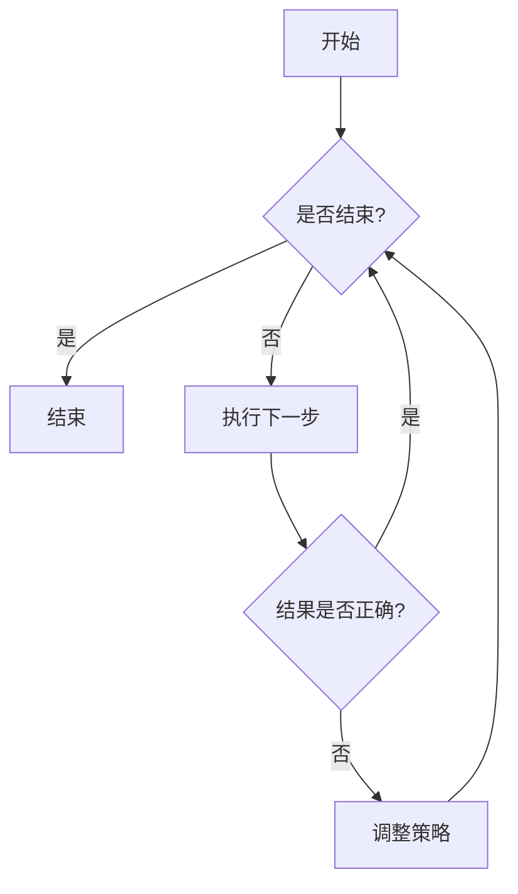
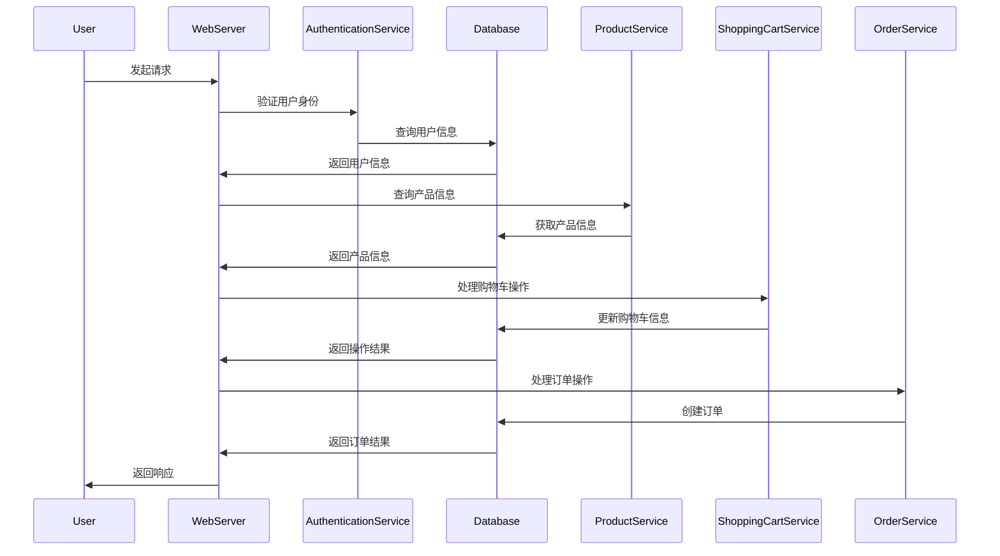

                 

# AI驱动的知识挖掘系统：从海量数据中提取价值

> 关键词：人工智能，知识挖掘，数据预处理，特征提取，监督学习，无监督学习，强化学习

> 摘要：本文详细探讨了AI驱动的知识挖掘系统的构建过程，包括数据预处理、特征提取、监督学习、无监督学习和强化学习等关键环节。通过深入分析各环节的核心技术和应用场景，本文旨在帮助读者理解如何从海量数据中提取有价值的信息，为实际应用提供理论指导和技术支持。

## 目录大纲

### 第一部分：背景与概念介绍

- **第1章：AI驱动的知识挖掘概述**
  - **1.1 问题背景**
    - **1.1.1 数据爆炸时代的挑战**
    - **1.1.2 知识挖掘的需求与价值**
  - **1.2 核心概念**
    - **1.2.1 AI与知识挖掘的关系**
    - **1.2.2 知识挖掘的主要任务**
    - **1.2.3 知识挖掘的基本流程**
  - **1.3 研究现状与趋势**
    - **1.3.1 国内外研究动态**
    - **1.3.2 技术发展趋势**
  - **1.4 本书结构安排**
    - **1.4.1 内容安排**
    - **1.4.2 阅读建议**
  - **1.5 本章小结**

### 第二部分：数据预处理与特征提取

- **第2章：数据预处理**
  - **2.1 数据预处理的重要性**
    - **2.1.1 数据质量的影响**
    - **2.1.2 数据预处理的目标**
  - **2.2 数据清洗**
    - **2.2.1 缺失数据的处理**
    - **2.2.2 异常值的处理**
    - **2.2.3 重复数据的处理**
  - **2.3 数据归一化**
    - **2.3.1 归一化的方法**
    - **2.3.2 归一化的效果**
  - **2.4 数据集成**
    - **2.4.1 数据集成的概念**
    - **2.4.2 数据集成的策略**
  - **2.5 本章小结**

- **第3章：特征提取与选择**
  - **3.1 特征提取的重要性**
    - **3.1.1 特征与属性的关系**
    - **3.1.2 特征提取的目标**
  - **3.2 基于统计的特征提取**
    - **3.2.1 基于频率的特征提取**
    - **3.2.2 基于阈值的特征提取**
  - **3.3 基于机器学习的特征提取**
    - **3.3.1 主成分分析（PCA）**
    - **3.3.2 独立成分分析（ICA）**
  - **3.4 特征选择方法**
    - **3.4.1 互信息法**
    - **3.4.2 支持向量机（SVM）法**
    - **3.4.3 基于正则化的特征选择**
  - **3.5 本章小结**

### 第三部分：AI算法在知识挖掘中的应用

- **第4章：监督学习算法**
  - **4.1 监督学习算法概述**
    - **4.1.1 监督学习的基本概念**
    - **4.1.2 监督学习的基本流程**
  - **4.2 传统的监督学习算法**
    - **4.2.1 决策树**
    - **4.2.2 随机森林**
    - **4.2.3 支持向量机**
  - **4.3 深度学习算法**
    - **4.3.1 卷积神经网络（CNN）**
    - **4.3.2 循环神经网络（RNN）**
    - **4.3.3 生成对抗网络（GAN）**
  - **4.4 监督学习在知识挖掘中的应用**
    - **4.4.1 文本分类**
    - **4.4.2 主题建模**
    - **4.4.3 问答系统**
  - **4.5 本章小结**

- **第5章：无监督学习算法**
  - **5.1 无监督学习算法概述**
    - **5.1.1 无监督学习的基本概念**
    - **5.1.2 无监督学习的基本流程**
  - **5.2 聚类算法**
    - **5.2.1 K-均值聚类**
    - **5.2.2 层次聚类**
    - **5.2.3 密度聚类**
  - **5.3 维度约减算法**
    - **5.3.1 主成分分析（PCA）**
    - **5.3.2 独立成分分析（ICA）**
    - **5.3.3 自动编码器**
  - **5.4 无监督学习在知识挖掘中的应用**
    - **5.4.1 无监督特征提取**
    - **5.4.2 无监督分类**
    - **5.4.3 无监督知识发现**
  - **5.5 本章小结**

- **第6章：强化学习算法**
  - **6.1 强化学习算法概述**
    - **6.1.1 强化学习的基本概念**
    - **6.1.2 强化学习的基本流程**

----------------------------------------------------------------

## 第一部分：背景与概念介绍

### 第1章：AI驱动的知识挖掘概述

### 1.1 问题背景

#### 1.1.1 数据爆炸时代的挑战

随着互联网的飞速发展，数据已经成为现代社会的重要资源。从社交媒体到电子商务，从物联网到大数据，数据量呈现爆炸性增长。然而，海量数据中隐藏着大量的有价值的信息，如何有效地从这些数据中提取知识，已经成为当前信息技术领域的重要课题。

在传统的数据处理方式中，数据处理的效率和准确性受到很大限制。一方面，人工分析数据费时费力且容易出错；另一方面，简单的统计方法无法揭示数据中的深层关联和规律。因此，如何利用先进的人工智能技术来挖掘数据中的知识，已经成为当务之急。

#### 1.1.2 知识挖掘的需求与价值

知识挖掘（Knowledge Discovery in Databases，KDD）是指从大量数据中发现隐含的、先前未知的、具有潜在价值的信息的过程。它涵盖了数据预处理、数据清洗、特征提取、模式识别等多个环节。

知识挖掘的需求主要体现在以下几个方面：

1. **决策支持**：通过分析历史数据，帮助企业或组织做出更明智的决策。例如，零售企业可以通过分析顾客购买数据来预测市场趋势，从而制定更有效的营销策略。
2. **预测分析**：利用知识挖掘技术，可以预测未来事件的发生概率，帮助企业和个人提前做好准备。例如，金融机构可以通过分析交易数据来预测风险，从而采取相应的风险控制措施。
3. **个性化服务**：知识挖掘技术可以帮助企业或组织根据用户的行为和偏好，提供个性化的服务或推荐。例如，电子商务平台可以根据用户的购物历史来推荐商品，从而提高用户的购物体验。
4. **科学研究**：知识挖掘技术可以用于科学研究中，从大量的实验数据中发现新的规律和趋势，从而推动科学技术的进步。

知识挖掘的价值体现在以下几个方面：

1. **提高效率**：通过自动化方式从海量数据中提取有价值的信息，大大提高了工作效率。
2. **降低成本**：通过优化决策过程，减少资源浪费，从而降低运营成本。
3. **创造价值**：通过对数据中隐藏的知识进行挖掘，可以为企业或组织带来新的商业机会和利润。
4. **推动创新**：知识挖掘技术可以为科学研究提供新的思路和方法，从而推动科学技术的创新和发展。

### 1.2 核心概念

#### 1.2.1 AI与知识挖掘的关系

人工智能（Artificial Intelligence，AI）是一种模拟人类智能的技术，旨在使计算机具备感知、推理、学习、决策等能力。知识挖掘是一种从数据中发现知识的过程，它依赖于人工智能技术来实现。具体来说，AI与知识挖掘的关系可以从以下几个方面来理解：

1. **数据预处理**：AI技术可以帮助处理大规模、复杂的数据，包括数据清洗、数据归一化、数据集成等。这些步骤是知识挖掘的基础，没有良好的数据预处理，知识挖掘的效果会大打折扣。
2. **特征提取**：AI技术可以通过机器学习算法，从数据中提取出有用的特征，这些特征是知识挖掘的重要输入。例如，通过主成分分析（PCA）和独立成分分析（ICA），可以从高维数据中提取出主要的特征。
3. **模式识别**：AI技术可以帮助识别数据中的模式和关联，这是知识挖掘的核心。例如，通过聚类算法和分类算法，可以从数据中发现新的模式和规律。
4. **推理与决策**：AI技术可以帮助基于知识进行推理和决策。例如，通过决策树和神经网络，可以从数据中推断出新的结论和预测。

#### 1.2.2 知识挖掘的主要任务

知识挖掘的主要任务包括以下几个方面：

1. **数据预处理**：数据预处理是知识挖掘的第一步，包括数据清洗、数据归一化、数据集成等。数据预处理的好坏直接影响知识挖掘的效果。
2. **特征提取**：特征提取是从数据中提取出有用的特征，这些特征用于后续的模型训练和模式识别。特征提取的质量直接影响模型的性能。
3. **模式识别**：模式识别是从数据中发现新的模式和规律，这是知识挖掘的核心。模式识别可以采用多种算法，包括聚类算法、分类算法、关联规则挖掘等。
4. **知识表示**：知识表示是将挖掘到的知识转化为易于理解和利用的形式。知识表示可以采用多种方式，如规则表示、图形表示、表格表示等。
5. **知识应用**：知识应用是将挖掘到的知识应用到实际场景中，如决策支持、预测分析、个性化服务等。知识应用的效果直接反映了知识挖掘的价值。

#### 1.2.3 知识挖掘的基本流程

知识挖掘的基本流程可以分为以下几个步骤：

1. **问题定义**：明确知识挖掘的目标和任务，确定数据来源和数据类型。
2. **数据采集**：采集相关的数据，包括结构化数据、半结构化数据和非结构化数据。
3. **数据预处理**：对采集到的数据进行预处理，包括数据清洗、数据归一化、数据集成等。
4. **特征提取**：从预处理后的数据中提取出有用的特征。
5. **模型训练**：选择合适的算法对特征进行训练，构建模型。
6. **模式识别**：使用训练好的模型对数据进行分析，发现新的模式和规律。
7. **知识表示**：将挖掘到的知识转化为易于理解和利用的形式。
8. **知识应用**：将挖掘到的知识应用到实际场景中，实现知识挖掘的目标。

#### 1.3 研究现状与趋势

##### 1.3.1 国内外研究动态

知识挖掘技术自20世纪90年代以来得到了广泛关注和研究。国内外许多学者和研究机构都在这一领域进行了大量的研究，取得了一系列重要成果。

国内方面，清华大学、北京大学、中国科学院等科研机构和高校在知识挖掘领域进行了深入研究，发表了大量的高水平学术论文。同时，国内一些大型互联网公司和科技企业，如阿里巴巴、腾讯、百度等，也在知识挖掘技术方面进行了大量应用和创新。

国外方面，美国、欧洲、日本等发达国家在知识挖掘领域也有丰富的成果。美国的一些著名大学和研究机构，如斯坦福大学、麻省理工学院、加州大学伯克利分校等，都在知识挖掘领域进行了深入研究。同时，国外的一些大型科技公司，如谷歌、微软、IBM等，也在知识挖掘技术方面进行了大量投入和应用。

##### 1.3.2 技术发展趋势

随着人工智能技术的不断进步，知识挖掘技术也在不断发展。以下是知识挖掘领域的一些主要发展趋势：

1. **深度学习技术的应用**：深度学习技术在图像识别、自然语言处理等领域取得了显著成果，逐渐成为知识挖掘的重要工具。未来，深度学习技术将在知识挖掘中发挥更大作用，提高知识挖掘的准确性和效率。
2. **大数据处理技术的融合**：随着数据量的不断增长，如何高效地处理海量数据成为知识挖掘的重要挑战。大数据处理技术，如分布式计算、云计算等，将得到更广泛的应用，提高知识挖掘的效率。
3. **多模态数据的融合**：知识挖掘涉及到多种类型的数据，如文本、图像、音频等。未来，多模态数据的融合将成为知识挖掘的重要方向，从多种数据类型中提取出有价值的信息。
4. **可解释性研究**：随着AI技术的应用越来越广泛，如何解释AI模型的工作原理和决策过程成为了一个重要问题。可解释性研究将成为知识挖掘领域的一个重要方向，提高AI技术的可信度和可接受度。

#### 1.4 本书结构安排

##### 1.4.1 内容安排

本书主要分为三个部分：

1. **背景与概念介绍**：介绍知识挖掘的背景、核心概念和研究现状，帮助读者建立对知识挖掘的基本认识。
2. **数据预处理与特征提取**：详细介绍数据预处理和特征提取的方法和技术，包括数据清洗、数据归一化、特征提取算法等。
3. **AI算法在知识挖掘中的应用**：介绍监督学习、无监督学习和强化学习等AI算法在知识挖掘中的应用，包括算法原理、实现方法、应用场景等。

##### 1.4.2 阅读建议

本书面向对知识挖掘有一定了解的读者，建议按照以下顺序阅读：

1. **第1章**：了解知识挖掘的基本概念和背景。
2. **第2章** 和 **第3章**：掌握数据预处理和特征提取的方法和技术。
3. **第4章** 至 **第6章**：学习监督学习、无监督学习和强化学习在知识挖掘中的应用。

通过本书的阅读，读者将能够系统地了解知识挖掘的原理和方法，为实际应用提供理论指导和实践参考。

### 1.5 本章小结

本章介绍了知识挖掘的背景、核心概念、基本流程以及国内外研究现状。知识挖掘在现代社会中具有重要的价值，它可以帮助我们从海量数据中提取有价值的信息，支持决策、预测、个性化服务和科学研究等。随着人工智能技术的不断进步，知识挖掘技术也在不断发展。本章为后续章节的讨论奠定了基础，提供了必要的背景知识。

----------------------------------------------------------------

## 第二部分：数据预处理与特征提取

### 第2章：数据预处理

### 2.1 数据预处理的重要性

数据预处理是知识挖掘过程中的一个关键环节，其重要性不容忽视。良好的数据预处理不仅能够提高数据质量，减少数据中的噪声和错误，还能为后续的特征提取和模型训练提供可靠的基础。

#### 2.1.1 数据质量的影响

数据质量直接影响到知识挖掘的效果。如果数据质量差，包含大量噪声、错误或不一致的数据，将会导致以下问题：

1. **模型性能下降**：噪声和错误数据会导致模型学习到的特征不准确，从而降低模型的性能。
2. **计算效率降低**：处理质量差的数据需要更多的时间和资源，降低计算效率。
3. **结论不可靠**：基于质量差的数据得出的结论可能会误导决策者，导致错误的决策。

#### 2.1.2 数据预处理的目标

数据预处理的目标主要包括以下几个方面：

1. **消除噪声**：噪声是指数据中的随机错误和异常值，它们会影响数据的质量和模型的性能。数据预处理的目标是识别并消除这些噪声。
2. **数据清洗**：数据清洗是指修复或删除数据中的错误和不一致的地方。这包括处理缺失值、异常值和重复值等。
3. **数据归一化**：数据归一化是指将不同数据范围的数据转换到同一尺度上，以便更好地进行比较和分析。
4. **数据集成**：数据集成是指将来自不同源的数据合并到一个统一的数据集中，以便更好地进行后续处理。

### 2.2 数据清洗

数据清洗是数据预处理的重要步骤之一，其目的是消除数据中的错误、噪声和异常值，确保数据的质量。以下是一些常见的数据清洗方法：

#### 2.2.1 缺失数据的处理

缺失数据是数据清洗中常见的问题。处理缺失数据的方法包括：

1. **删除缺失值**：对于少量缺失值，可以考虑直接删除包含缺失值的记录。这种方法适用于缺失值比例较低的情况。
2. **填充缺失值**：对于大量缺失值，可以考虑使用不同的方法来填充缺失值。常见的方法包括：
   - **均值填充**：用该特征的均值来填充缺失值。
   - **中值填充**：用该特征的中值来填充缺失值。
   - **前向填充**：用前一个非缺失值来填充缺失值。
   - **后向填充**：用后一个非缺失值来填充缺失值。
   - **插值法**：使用线性或非线性插值方法来填充缺失值。

#### 2.2.2 异常值的处理

异常值是数据中偏离正常范围的值，它们可能是由于数据采集过程中的错误或数据本身的特性造成的。处理异常值的方法包括：

1. **识别异常值**：使用统计方法（如标准差、箱线图等）或机器学习算法（如孤立森林等）来识别异常值。
2. **删除异常值**：对于明显的异常值，可以考虑直接删除。但需要注意的是，删除异常值可能会损失一些有用的信息。
3. **调整异常值**：对于某些异常值，可以考虑将其调整到正常范围内。例如，可以使用线性变换或非线性变换来调整异常值。

#### 2.2.3 重复数据的处理

重复数据是指数据集中存在相同的记录。处理重复数据的方法包括：

1. **删除重复数据**：直接删除重复的记录，保留一个唯一的记录。这种方法适用于数据集中重复数据较少的情况。
2. **合并重复数据**：对于大量重复数据，可以考虑将重复的记录合并。合并的方法可以是保留第一个记录，删除后续的重复记录，或者将重复记录中的信息合并。

### 2.3 数据归一化

数据归一化是将不同数据范围的数据转换到同一尺度上，以便更好地进行比较和分析。常用的数据归一化方法包括：

#### 2.3.1 归一化的方法

1. **最小-最大缩放**：将数据缩放到[0, 1]的范围内。公式为：
   $$ x' = \frac{x - x_{\min}}{x_{\max} - x_{\min}} $$
   其中，$x$ 是原始数据，$x'$ 是归一化后的数据，$x_{\min}$ 和 $x_{\max}$ 分别是数据的最大值和最小值。
2. **标准缩放**：将数据缩放到均值±3个标准差的范围内。公式为：
   $$ x' = \frac{x - \mu}{\sigma} $$
   其中，$\mu$ 是数据的均值，$\sigma$ 是数据的标准差。
3. **小数点位移**：将数据缩放到指定的整数范围内。公式为：
   $$ x' = x \times 10^k $$
   其中，$k$ 是小数点位移的位数。

#### 2.3.2 归一化的效果

归一化的主要效果包括：

1. **消除数据范围的影响**：归一化可以将不同范围的数据转换到同一尺度上，从而消除数据范围的影响，使模型更容易训练。
2. **提高模型性能**：归一化可以减少数据之间的差异，从而提高模型的性能。
3. **减少计算资源消耗**：归一化可以减少模型训练时的计算资源消耗，因为模型在处理不同范围的数据时需要更多的计算资源。

### 2.4 数据集成

数据集成是将来自不同源的数据合并到一个统一的数据集中，以便更好地进行后续处理。数据集成的目标包括：

1. **消除冗余**：消除重复的数据，避免在后续处理中引入错误。
2. **统一格式**：将不同格式和结构的数据转换为统一的格式，便于后续处理。
3. **补充缺失数据**：利用其他数据源来补充缺失的数据。

#### 2.4.1 数据集成的概念

数据集成是指将多个数据源中的数据合并为一个统一的数据集。数据集成的方法可以分为以下几种：

1. **合并**：直接将多个数据源中的数据合并，不进行任何处理。
2. **转换**：将多个数据源中的数据转换为统一的格式，然后合并。
3. **融合**：将多个数据源中的数据进行融合，生成一个更准确和全面的数据集。

#### 2.4.2 数据集成的策略

数据集成的策略包括以下几个方面：

1. **数据源选择**：选择合适的数据源，确保数据集的完整性和准确性。
2. **数据转换**：将不同格式和结构的数据转换为统一的格式，包括数据类型的转换、缺失值的处理等。
3. **数据合并**：将转换后的数据进行合并，消除重复数据和冗余数据。
4. **数据验证**：对集成后的数据集进行验证，确保数据的准确性、完整性和一致性。

### 2.5 本章小结

本章详细介绍了数据预处理的重要性以及数据清洗、数据归一化和数据集成的方法和技术。数据预处理是知识挖掘过程中不可或缺的步骤，它直接影响数据的质量和模型的性能。通过本章的学习，读者可以了解如何有效地进行数据预处理，为后续的特征提取和模型训练打下坚实的基础。

----------------------------------------------------------------

## 第3章：特征提取与选择

### 3.1 特征提取的重要性

特征提取是从原始数据中提取出具有区分性和代表性的特征，以便更好地进行后续的数据分析和模型训练。特征提取在知识挖掘过程中具有至关重要的地位，其重要性主要体现在以下几个方面：

#### 3.1.1 特征与属性的关系

特征（Feature）是数据中表示个体或事件的特征变量，而属性（Attribute）是数据表中列的名称。特征是从属性中提取出来的，它们用于表示数据的基本属性和特征。例如，在客户购买数据中，属性可能包括客户ID、购买时间、购买商品等，而特征则是从这些属性中提取出来的，如购买频率、购买金额、购买商品种类等。

#### 3.1.2 特征提取的目标

特征提取的主要目标包括：

1. **降低数据维度**：原始数据通常包含大量的属性，这些属性可能存在冗余和相关性。特征提取可以通过提取核心特征，降低数据的维度，减少计算量和存储空间的需求。
2. **增强数据质量**：通过消除无关属性和噪声，提高数据的准确性和可靠性。
3. **提高模型性能**：提取出具有区分性和代表性的特征，可以增强模型的训练效果，提高模型的准确性和泛化能力。
4. **提升数据分析效率**：特征提取可以帮助数据分析师更快速地理解和分析数据，从而提高工作效率。

### 3.2 基于统计的特征提取

基于统计的特征提取方法主要依赖于统计学原理来识别和提取数据中的关键特征。以下介绍两种常见的基于统计的特征提取方法：

#### 3.2.1 基于频率的特征提取

基于频率的特征提取方法通过计算各个特征在数据集中的出现频率来识别关键特征。频率较高的特征通常被认为具有较高的区分性，可以作为重要特征。具体方法包括：

1. **频数统计**：计算每个特征在数据集中的出现次数。
2. **频率计算**：将频数统计结果转换为频率，即特征出现次数与总样本数之比。
3. **阈值设定**：设定一个阈值，只保留出现频率高于阈值的特征。

这种方法适用于离散型数据，对于连续型数据，可以通过将连续特征划分为几个区间，然后计算每个区间的频率。

#### 3.2.2 基于阈值的特征提取

基于阈值的特征提取方法通过设定一个阈值，识别出超过阈值的特征。阈值可以是基于统计学原理设定的，也可以是基于专家经验设定的。以下是一些常用的阈值设定方法：

1. **标准差阈值**：设定一个标准差阈值，只保留离群值不超过阈值的特征。
2. **百分位数阈值**：设定一个百分位数阈值，只保留位于特定百分位数范围内的特征。
3. **最大最小阈值**：设定最大值和最小值阈值，只保留在指定范围内的特征。

这种方法适用于发现数据的异常值和离群点，可以帮助识别出潜在的重要特征。

### 3.3 基于机器学习的特征提取

基于机器学习的特征提取方法通过训练模型来识别和提取数据中的关键特征。以下介绍两种常见的基于机器学习的特征提取方法：

#### 3.3.1 主成分分析（PCA）

主成分分析（Principal Component Analysis，PCA）是一种常用的线性降维技术，它通过将数据投影到新的正交坐标系中，来提取最重要的几个主成分。PCA的主要步骤包括：

1. **数据标准化**：对数据进行标准化处理，使其具有零均值和单位方差。
2. **计算协方差矩阵**：计算数据的协方差矩阵，它反映了数据中各个特征之间的相关性。
3. **计算特征值和特征向量**：对协方差矩阵进行特征分解，得到特征值和特征向量。
4. **选择主成分**：根据特征值的大小，选择最大的几个特征值对应的特征向量，构成新的特征空间。

PCA的优点是能够有效降低数据的维度，同时保留数据的主要信息。缺点是它依赖于线性模型，对于非线性关系的数据效果不佳。

#### 3.3.2 独立成分分析（ICA）

独立成分分析（Independent Component Analysis，ICA）是一种无监督的特征提取方法，它通过将数据分解为独立源信号，来提取关键特征。ICA的主要步骤包括：

1. **初始化权重矩阵**：随机初始化权重矩阵。
2. **计算混合信号**：根据权重矩阵和源信号，计算混合信号。
3. **估计独立源信号**：通过非线性变换，估计独立源信号。
4. **更新权重矩阵**：根据源信号和混合信号，更新权重矩阵。
5. **迭代优化**：重复步骤3至步骤4，直到达到收敛条件。

ICA的优点是能够提取出独立且具有区分性的特征，特别适用于处理非线性关系的数据。缺点是计算复杂度高，且需要选择合适的初始权重矩阵。

### 3.4 特征选择方法

特征选择（Feature Selection）是从所有特征中选择出对目标变量最有影响力的特征，以降低模型的复杂度和提高模型的性能。以下介绍三种常见的特征选择方法：

#### 3.4.1 互信息法

互信息法（Mutual Information，MI）是一种基于信息论的特征选择方法，它通过计算特征与目标变量之间的互信息来评估特征的重要性。互信息越大，特征与目标变量之间的关系越紧密。具体步骤包括：

1. **计算特征与目标变量的联合概率分布**：对于每个特征，计算它与目标变量的联合概率分布。
2. **计算特征与目标变量的边缘概率分布**：对于每个特征，计算它的边缘概率分布和目标变量的边缘概率分布。
3. **计算互信息**：根据联合概率分布和边缘概率分布，计算特征与目标变量之间的互信息。

互信息法的优点是能够有效识别特征与目标变量之间的强相关性。缺点是计算复杂度高，且对于高维数据，可能存在噪声和过拟合问题。

#### 3.4.2 支持向量机（SVM）法

支持向量机（Support Vector Machine，SVM）法是一种基于最大间隔的分类算法，它可以用于特征选择。具体步骤包括：

1. **训练SVM模型**：使用全部特征训练SVM模型。
2. **计算特征权重**：根据SVM模型中支持向量的权重，计算每个特征对模型的重要性。
3. **选择重要特征**：根据特征权重，选择对模型影响较大的特征。

SVM法的优点是能够自动识别和选择对分类任务最重要的特征。缺点是它依赖于分类算法，且对于回归任务效果不佳。

#### 3.4.3 基于正则化的特征选择

基于正则化的特征选择方法通过在模型训练过程中引入正则化项，来惩罚不重要的特征，从而实现特征选择。以下介绍两种常见的基于正则化的特征选择方法：

1. **L1正则化**：L1正则化（L1-Regularization）通过引入L1范数来惩罚特征的权重，实现稀疏特征选择。具体方法是在损失函数中添加L1范数项：
   $$ \text{损失函数} = \sum_{i=1}^{n} (y_i - \text{预测值}_i) + \lambda \sum_{j=1}^{m} |\text{权重}_j| $$
   其中，$y_i$ 是实际目标值，预测值$_i$ 是模型对样本 $i$ 的预测值，$\lambda$ 是正则化参数，$|\text{权重}_j|$ 是特征 $j$ 的权重。

2. **L2正则化**：L2正则化（L2-Regularization）通过引入L2范数来惩罚特征的权重，实现平滑特征选择。具体方法是在损失函数中添加L2范数项：
   $$ \text{损失函数} = \sum_{i=1}^{n} (y_i - \text{预测值}_i) + \lambda \sum_{j=1}^{m} \text{权重}_j^2 $$
   其中，其他符号与L1正则化相同。

L1正则化和L2正则化的优点是能够自动选择重要的特征，降低模型的复杂度。缺点是它们对特征权重进行惩罚，可能丢失一些潜在的重要特征。

### 3.5 本章小结

本章详细介绍了特征提取和特征选择的重要性，以及基于统计和机器学习的特征提取方法，以及互信息法、支持向量机法和基于正则化的特征选择方法。特征提取和特征选择是知识挖掘过程中的关键步骤，它们直接影响模型的性能和数据的质量。通过本章的学习，读者可以了解如何有效地进行特征提取和特征选择，为后续的模型训练和数据分析打下坚实的基础。

----------------------------------------------------------------

## 第三部分：AI算法在知识挖掘中的应用

### 第4章：监督学习算法

监督学习算法是知识挖掘中的重要工具，它们通过从标记数据中学习规律，然后将这些规律应用于未知数据。本章将介绍监督学习算法的基本概念、传统监督学习算法、深度学习算法，并探讨监督学习在知识挖掘中的应用。

### 4.1 监督学习算法概述

#### 4.1.1 监督学习的基本概念

监督学习（Supervised Learning）是一种机器学习方法，它通过训练有标签的数据集来建立一个模型，然后将这个模型应用于新的、未标记的数据以预测结果。监督学习可以分为两种类型：分类和回归。

1. **分类**：分类算法将数据划分为预定义的类别。例如，在文本分类中，算法可能将文本标记为“体育”、“财经”或“娱乐”。
2. **回归**：回归算法用于预测连续值。例如，在房屋价格预测中，算法可能预测一个特定区域的房屋价格。

监督学习的基本流程包括以下几个步骤：

1. **数据收集**：收集包含标记数据的训练集。
2. **数据预处理**：对数据进行清洗、归一化等预处理。
3. **模型训练**：使用训练数据集训练模型。
4. **模型评估**：使用测试数据集评估模型性能。
5. **模型应用**：将模型应用于新的数据以获得预测结果。

#### 4.1.2 监督学习的基本流程

监督学习的基本流程可以概括为以下步骤：

1. **定义问题**：明确分类或回归问题，并确定特征和标签。
2. **数据收集**：收集包含标记数据的训练集。这些数据应具有代表性，能够覆盖问题空间的各个方面。
3. **数据预处理**：对数据进行清洗、归一化等预处理，以提高数据质量和模型性能。
4. **特征选择**：选择对问题最相关的特征，以减少数据的维度和计算成本。
5. **模型训练**：选择合适的模型，使用训练数据集进行训练。模型可以是线性模型、决策树、支持向量机等。
6. **模型评估**：使用测试数据集评估模型性能。常用的评估指标包括准确率、召回率、F1分数等。
7. **模型优化**：根据评估结果，调整模型参数或选择不同的模型，以获得更好的性能。
8. **模型应用**：将训练好的模型应用于新的数据以获得预测结果。

### 4.2 传统的监督学习算法

传统的监督学习算法包括线性模型、决策树、支持向量机等。这些算法在许多应用场景中表现出色，具有较好的解释性和可控性。

#### 4.2.1 决策树

决策树（Decision Tree）是一种常用的分类算法，它通过一系列的判断节点和叶子节点来对数据样本进行分类。决策树的基本构建过程如下：

1. **选择最佳特征**：根据信息增益或基尼指数等指标，选择具有最高信息增益的特征作为分割标准。
2. **划分数据**：根据选定的特征，将数据集划分为子集。
3. **递归构建**：对每个子集，重复上述过程，直到满足停止条件（如最大深度、最小叶子节点样本数等）。

决策树的优点是易于理解和解释，且算法实现简单。缺点是决策树容易过拟合，且对于高维数据效果不佳。

#### 4.2.2 随机森林

随机森林（Random Forest）是一种基于决策树的集成学习方法，它通过构建多个决策树，并利用随机性来提高模型的泛化能力。随机森林的基本构建过程如下：

1. **随机特征选择**：从所有特征中随机选择一部分特征，用于构建每个决策树。
2. **构建决策树**：对训练数据进行划分，构建多个决策树。
3. **投票决策**：在预测阶段，将所有决策树的预测结果进行投票，选择多数决策作为最终预测结果。

随机森林的优点是能够处理高维数据和复杂数据，具有较好的泛化能力。缺点是计算复杂度较高，且对于小数据集性能可能不如单个决策树。

#### 4.2.3 支持向量机

支持向量机（Support Vector Machine，SVM）是一种基于间隔最大化的分类算法。它通过找到一个超平面，将不同类别的数据点最大限度地分开。SVM的基本构建过程如下：

1. **选择核函数**：选择合适的核函数（如线性核、多项式核、径向基函数核等）来计算特征空间中的距离。
2. **求解最优超平面**：使用优化算法（如梯度下降、序列最小化等）求解最优超平面，使得分类间隔最大化。
3. **计算分类边界**：根据最优超平面，计算分类边界，对新的数据进行分类。

SVM的优点是能够在高维空间中找到最优分离超平面，具有较好的分类性能。缺点是对于大规模数据和复杂模型，计算复杂度较高。

### 4.3 深度学习算法

深度学习（Deep Learning）是一种基于多层神经网络的学习方法，它在图像识别、自然语言处理等应用中取得了显著的成果。本章介绍三种常见的深度学习算法：卷积神经网络（CNN）、循环神经网络（RNN）和生成对抗网络（GAN）。

#### 4.3.1 卷积神经网络（CNN）

卷积神经网络（Convolutional Neural Network，CNN）是一种用于图像识别和处理的深度学习算法。它通过卷积层、池化层和全连接层等结构，提取图像的层次特征。CNN的基本构建过程如下：

1. **卷积层**：通过卷积操作提取图像的局部特征。
2. **池化层**：通过池化操作减少数据维度，提高计算效率。
3. **全连接层**：通过全连接层对提取到的特征进行分类或回归。
4. **激活函数**：在卷积层和全连接层中引入激活函数，如ReLU、Sigmoid、Tanh等，以增加网络的非线性。

CNN的优点是能够自动提取图像的层次特征，适用于处理图像和视频等复杂数据。缺点是模型参数较多，训练时间较长。

#### 4.3.2 循环神经网络（RNN）

循环神经网络（Recurrent Neural Network，RNN）是一种用于序列数据处理的深度学习算法。它通过循环结构来处理前后依赖关系。RNN的基本构建过程如下：

1. **输入层**：接收序列数据的输入。
2. **隐藏层**：通过循环结构处理前一个时间步的输出，并更新状态。
3. **输出层**：根据隐藏层的输出进行分类或回归。

RNN的优点是能够处理变长的序列数据，适用于自然语言处理、语音识别等应用。缺点是容易发生梯度消失或爆炸问题，且在处理长序列时效果不佳。

#### 4.3.3 生成对抗网络（GAN）

生成对抗网络（Generative Adversarial Network，GAN）是一种由生成器和判别器组成的对抗性网络。它通过两个网络的竞争来生成逼真的数据。GAN的基本构建过程如下：

1. **生成器**：通过神经网络生成逼真的数据。
2. **判别器**：判断生成数据是否真实。
3. **对抗训练**：生成器和判别器交替训练，生成器试图生成更真实的数据，判别器试图区分真实数据和生成数据。

GAN的优点是能够生成高质量的图像和文本数据，适用于图像生成、数据增强等应用。缺点是训练过程复杂，容易出现模式崩溃问题。

### 4.4 监督学习在知识挖掘中的应用

监督学习算法在知识挖掘中有着广泛的应用，以下介绍几种常见的应用场景：

#### 4.4.1 文本分类

文本分类是将文本数据分为预定义的类别。常见的文本分类任务包括垃圾邮件检测、情感分析、新闻分类等。文本分类的基本流程如下：

1. **数据预处理**：对文本进行清洗、分词、去除停用词等预处理。
2. **特征提取**：使用词袋模型、TF-IDF、Word2Vec等方法提取文本特征。
3. **模型训练**：使用训练数据集训练分类模型，如SVM、CNN、RNN等。
4. **模型评估**：使用测试数据集评估模型性能，调整模型参数。
5. **文本分类**：将训练好的模型应用于新的文本数据，进行分类预测。

#### 4.4.2 主题建模

主题建模是从大量文档中提取主题的方法。常见的主题建模方法包括隐含狄利克雷分布（LDA）和LDA变体。主题建模的基本流程如下：

1. **数据预处理**：对文本进行清洗、分词、去除停用词等预处理。
2. **特征提取**：将预处理后的文本转换为词频矩阵。
3. **主题提取**：使用LDA模型提取主题，得到文档-主题分布和主题-词分布。
4. **模型评估**：评估主题提取的效果，调整模型参数。
5. **主题应用**：将提取的主题应用于文本分析、推荐系统等。

#### 4.4.3 问答系统

问答系统（Question Answering System）是知识挖掘的一个重要应用，它能够根据用户的问题，从大量文本中自动提取出答案。问答系统的基本流程如下：

1. **数据预处理**：对文本进行清洗、分词、去除停用词等预处理。
2. **特征提取**：使用词袋模型、BERT等方法提取文本特征。
3. **模型训练**：使用训练数据集训练问答模型，如Seq2Seq、Transformer等。
4. **模型评估**：使用测试数据集评估模型性能，调整模型参数。
5. **问答交互**：将训练好的模型应用于新的问题，进行问答交互。

### 4.5 本章小结

本章介绍了监督学习算法的基本概念、传统监督学习算法、深度学习算法，并探讨了监督学习在知识挖掘中的应用。监督学习算法在知识挖掘中发挥着重要作用，通过有效的特征提取和模型训练，可以从海量数据中提取出有价值的信息。随着深度学习算法的发展，监督学习在图像识别、自然语言处理等领域的应用越来越广泛，为知识挖掘提供了强大的工具。

----------------------------------------------------------------

## 第5章：无监督学习算法

### 5.1 无监督学习算法概述

无监督学习（Unsupervised Learning）是一种不使用标记数据，仅通过学习数据内在结构或模式的机器学习方法。与监督学习相比，无监督学习算法在数据挖掘和知识发现中具有独特的优势和应用。本章将介绍无监督学习算法的基本概念、基本流程，并讨论其在知识挖掘中的应用。

#### 5.1.1 无监督学习的基本概念

无监督学习旨在从未标记的数据中发现隐藏的结构、模式和关联。这种学习方式不需要预先定义的标签或目标变量，算法依赖于数据自身的特性来进行分类、降维或聚类等任务。无监督学习的核心目标包括：

1. **数据降维**：将高维数据映射到低维空间，同时保留数据的主要信息，以简化数据分析和模型训练过程。
2. **聚类**：将相似的数据点划分为不同的组或簇，以发现数据中的自然分组和模式。
3. **模式识别**：发现数据中的统计规律和关联，为后续的监督学习或其他数据分析任务提供支持。

#### 5.1.2 无监督学习的基本流程

无监督学习的基本流程通常包括以下几个步骤：

1. **数据收集**：收集未标记的数据集，这些数据可以来自各种来源，如文本、图像、时间序列等。
2. **数据预处理**：对数据进行清洗、归一化等预处理，以提高数据质量和算法性能。
3. **特征提取**：如果数据是高维的，可能需要通过特征提取或降维技术来减少数据的维度。
4. **算法选择**：根据任务需求选择合适的无监督学习算法，如聚类算法、降维算法等。
5. **模型训练**：使用选定的算法对数据进行训练，发现数据中的隐含结构或模式。
6. **模型评估**：评估模型的效果，可以通过内部评估指标（如聚类内部高度、降维的质量等）或实际应用效果（如分类任务的准确率等）。
7. **模型应用**：将训练好的模型应用于新的数据，进行聚类、降维或其他分析任务。

### 5.2 聚类算法

聚类算法是一种无监督学习方法，用于将数据集划分为多个簇或类，使得同一簇内的数据点彼此相似，而不同簇的数据点之间差异较大。聚类算法在知识挖掘中有着广泛的应用，如市场细分、社交网络分析等。以下介绍几种常见的聚类算法。

#### 5.2.1 K-均值聚类

K-均值聚类（K-Means Clustering）是最常用的聚类算法之一。它通过迭代过程将数据点分配到K个簇中，每个簇由一个中心点表示。K-均值聚类的基本流程如下：

1. **初始化中心点**：随机选择K个数据点作为初始中心点。
2. **分配数据点**：计算每个数据点到各个中心点的距离，将数据点分配到最近的中心点所在的簇。
3. **更新中心点**：计算每个簇的新中心点，即该簇中所有数据点的平均值。
4. **重复步骤2和步骤3**，直到中心点不再变化或达到预定的迭代次数。

K-均值聚类具有简单、易于实现和计算效率高的优点。然而，它对初始中心点的选择敏感，且可能收敛到局部最优解。

#### 5.2.2 层次聚类

层次聚类（Hierarchical Clustering）是一种基于层次结构进行聚类的算法。它通过逐步合并或分裂已有的簇来构建层次聚类树，树的每个节点代表一个簇。层次聚类的基本流程如下：

1. **初始化**：将每个数据点视为一个初始簇。
2. **合并或分裂簇**：每次迭代中，选择最近的两个簇进行合并或分裂。
3. **重复步骤2**，直到满足停止条件（如达到最大簇数、最小簇大小等）。

层次聚类生成一个聚类层次树，可以显示簇之间的关系和层次。它的优点是能够生成具有层次结构的聚类结果，缺点是计算复杂度高。

#### 5.2.3 密度聚类

密度聚类（Density-Based Clustering）是一种基于数据点的密度分布进行聚类的算法。它通过识别高密度区域并将其划分为簇，而忽略低密度区域。密度聚类中最著名的算法是DBSCAN（Density-Based Spatial Clustering of Applications with Noise）。

DBSCAN的基本流程如下：

1. **选择最小邻域半径（$\epsilon$）和最小簇点数量（$minPts$）**。
2. **扫描数据点，标记核心点、边界点和噪声点**：
   - **核心点**：至少有$minPts$个邻域点的数据点。
   - **边界点**：邻域点数量介于$minPts$和$\epsilon$之间。
   - **噪声点**：邻域点数量小于$\epsilon$。
3. **从核心点开始，扩展簇**：将核心点和其邻域点的所有邻接点加入同一簇。
4. **重复步骤2和步骤3**，直到所有数据点被标记。

DBSCAN的优点是能够自动确定簇的数量，并处理噪声点和不同形状的簇。缺点是参数选择对聚类结果有较大影响。

#### 5.2.4 谱聚类

谱聚类（Spectral Clustering）是一种基于数据点的邻接矩阵进行聚类的算法。它利用数据的谱性质，通过特征值分解来识别聚类结构。谱聚类的基本流程如下：

1. **计算邻接矩阵**：根据数据点的邻接关系构建邻接矩阵。
2. **特征值分解**：对邻接矩阵进行特征值分解，得到特征值和特征向量。
3. **计算聚类标签**：使用特征向量进行聚类，常见的聚类方法有K-均值聚类等。
4. **合并相似簇**：根据聚类结果，将相似簇合并，形成最终的聚类结构。

谱聚类的优点是能够处理复杂数据结构和异构网络，具有较好的聚类效果。缺点是计算复杂度高，且对参数敏感。

### 5.3 维度约减算法

维度约减（Dimensionality Reduction）是一种无监督学习方法，用于降低数据的维度，同时尽可能保留数据的信息和结构。维度约减在数据挖掘和机器学习中具有重要意义，因为它可以减少计算量和存储需求，提高模型训练效率。以下介绍几种常见的维度约减算法。

#### 5.3.1 主成分分析（PCA）

主成分分析（Principal Component Analysis，PCA）是一种线性降维算法，通过将数据投影到新的正交坐标系中，提取最重要的主成分来降低维度。PCA的基本流程如下：

1. **计算协方差矩阵**：计算数据集的协方差矩阵。
2. **特征值分解**：对协方差矩阵进行特征值分解，得到特征值和特征向量。
3. **选择主成分**：根据特征值的大小，选择最大的几个特征值对应的特征向量，构成新的特征空间。
4. **数据转换**：将原始数据投影到新的特征空间，得到降维后的数据。

PCA的优点是简单易实现，适用于线性可分的数据。缺点是对非线性结构的数据效果较差。

#### 5.3.2 独立成分分析（ICA）

独立成分分析（Independent Component Analysis，ICA）是一种无监督的非线性降维算法，通过将数据分解为独立源信号来降低维度。ICA的基本流程如下：

1. **初始化权重矩阵**：随机初始化权重矩阵。
2. **计算混合信号**：根据权重矩阵和源信号，计算混合信号。
3. **估计独立源信号**：通过非线性变换，估计独立源信号。
4. **更新权重矩阵**：根据源信号和混合信号，更新权重矩阵。
5. **迭代优化**：重复步骤3至步骤4，直到达到收敛条件。

ICA的优点是能够提取出独立的且具有区分性的特征，适用于非线性结构的数据。缺点是计算复杂度高，且需要选择合适的初始权重矩阵。

#### 5.3.3 自动编码器

自动编码器（Autoencoder）是一种基于神经网络的降维算法，通过训练一个编码器和解码器模型，将输入数据压缩到低维空间，然后重构原始数据。自动编码器的基本流程如下：

1. **编码器训练**：训练编码器模型，将输入数据压缩到低维空间。
2. **解码器训练**：训练解码器模型，将编码后的数据重构回原始数据。
3. **数据转换**：将输入数据通过编码器压缩到低维空间，得到降维后的数据。

自动编码器的优点是能够自适应地学习数据的低维表示，适用于复杂数据结构。缺点是训练过程复杂，且对数据质量和噪声敏感。

### 5.4 无监督学习在知识挖掘中的应用

无监督学习算法在知识挖掘中有着广泛的应用，以下介绍几种常见的应用场景：

#### 5.4.1 无监督特征提取

无监督特征提取是从未标记的数据中提取具有区分性的特征，以支持后续的监督学习或其他分析任务。常见的无监督特征提取方法包括PCA、ICA和自动编码器等。无监督特征提取的应用包括图像分类、文本分析、时间序列预测等。

#### 5.4.2 无监督分类

无监督分类是将未标记的数据自动划分为预定义的类别。无监督分类方法包括基于距离的聚类算法（如K-均值聚类）和基于模型的聚类算法（如DBSCAN）。无监督分类的应用包括市场细分、社交网络分析、异常检测等。

#### 5.4.3 无监督知识发现

无监督知识发现是从未标记的数据中自动发现新的知识和规律。无监督知识发现方法包括关联规则挖掘、聚类分析和降维分析等。无监督知识发现的应用包括数据挖掘、推荐系统、客户关系管理等。

### 5.5 本章小结

本章介绍了无监督学习算法的基本概念、基本流程，以及聚类算法和维度约减算法。无监督学习算法在知识挖掘中具有广泛的应用，通过自动发现数据中的隐含结构和模式，为数据分析和模型训练提供了有力的支持。随着无监督学习算法的不断发展和优化，其在知识挖掘领域的应用前景将更加广阔。

----------------------------------------------------------------

## 第6章：强化学习算法

### 6.1 强化学习算法概述

强化学习（Reinforcement Learning，RL）是一种机器学习方法，它通过智能体（Agent）与环境的交互来学习策略，以实现最优行动决策。强化学习在知识挖掘中有着广泛的应用，如推荐系统、游戏AI和自动驾驶等。本章将介绍强化学习算法的基本概念、基本流程，并探讨其在知识挖掘中的应用。

#### 6.1.1 强化学习的基本概念

强化学习是一种基于奖励和惩罚的机器学习方法，它通过学习如何在给定的环境中采取最优行动来最大化长期奖励。以下是强化学习中的几个关键概念：

1. **智能体（Agent）**：强化学习中的智能体是执行动作、接收环境反馈并学习策略的主体。例如，自动驾驶汽车、推荐系统中的算法等。
2. **环境（Environment）**：环境是智能体所处的动态环境，它会根据智能体的动作生成状态和奖励。例如，自动驾驶环境中的道路、车辆和行人等。
3. **状态（State）**：状态是描述环境当前状态的向量，它决定了智能体的行为。例如，在游戏中的当前棋盘状态、自动驾驶车辆的位置和方向等。
4. **动作（Action）**：动作是智能体可选择的动作，它们会影响环境状态。例如，在游戏中的移动棋子、自动驾驶车辆中的转向和加速等。
5. **奖励（Reward）**：奖励是环境对智能体行动的即时反馈，它可以是正奖励（鼓励智能体继续采取当前行动）或负奖励（鼓励智能体停止当前行动）。例如，在游戏中的得分增加或减少。
6. **策略（Policy）**：策略是智能体根据当前状态选择动作的规则或函数。例如，在自动驾驶中，根据当前道路状况选择最佳行驶路线。

#### 6.1.2 强化学习的基本流程

强化学习的基本流程可以分为以下几个步骤：

1. **初始状态**：智能体开始在一个随机状态进行学习。
2. **选择动作**：根据当前状态，智能体使用策略选择一个动作。
3. **执行动作**：智能体执行所选动作，并进入新的状态。
4. **获得奖励**：环境根据智能体的动作产生一个奖励信号，该信号可以是正奖励或负奖励。
5. **更新策略**：智能体使用奖励信号和策略评估函数来更新其策略，以最大化长期奖励。
6. **重复步骤2至步骤5**，直到达到终止条件（如达到预定的步数、找到最优策略等）。

强化学习的基本流程可以总结为：智能体在环境中通过不断尝试和错误，逐渐学习到最优策略，以实现长期奖励最大化。

#### 6.1.3 强化学习算法的分类

强化学习算法可以根据不同的策略更新方法进行分类。以下是几种常见的强化学习算法：

1. **值函数方法**：值函数方法（如Q-learning、深度Q网络（DQN）等）通过学习状态-动作值函数来预测未来奖励，从而更新策略。值函数方法的核心思想是最大化未来奖励的期望。
2. **策略梯度方法**：策略梯度方法（如策略梯度（PG）、演员-评论家（AC）方法等）直接优化策略的梯度，以最大化长期奖励。策略梯度方法通常需要较小的样本量，但可能需要更复杂的数学推导。
3. **模型方法**：模型方法（如马尔可夫决策过程（MDP）模型、部分可观察马尔可夫决策过程（POMDP）模型等）通过构建环境模型来预测状态转移和奖励，然后使用模型进行策略优化。

#### 6.1.4 强化学习在知识挖掘中的应用

强化学习算法在知识挖掘中有着广泛的应用，以下介绍几种常见的应用场景：

1. **推荐系统**：强化学习可以用于构建自适应推荐系统，通过学习用户的兴趣和行为，动态调整推荐策略，提高推荐效果。例如，Netflix推荐系统可以使用强化学习算法来优化推荐结果。
2. **异常检测**：强化学习可以用于检测数据中的异常行为，例如在金融交易中检测欺诈行为。通过训练一个智能体来识别异常交易模式，并采取相应的行动来防止欺诈行为。
3. **游戏AI**：强化学习在游戏AI中有着广泛的应用，例如在电子游戏中训练智能体来掌握游戏的策略。强化学习算法可以帮助智能体学习如何有效地进行游戏，提高游戏的趣味性和挑战性。
4. **自动驾驶**：强化学习算法可以用于自动驾驶系统，通过学习驾驶策略来提高车辆的驾驶效率和安全性。自动驾驶系统可以使用强化学习算法来优化行驶路线、控制车速和转向等动作。

#### 6.1.5 强化学习算法的优势与挑战

强化学习算法在知识挖掘中具有以下优势：

1. **自适应性强**：强化学习算法可以根据环境的变化动态调整策略，以适应不同的场景和需求。
2. **灵活性高**：强化学习算法可以处理复杂和非线性的环境，适用于各种类型的知识挖掘任务。
3. **自学习性**：强化学习算法可以通过与环境交互来不断学习和优化策略，从而提高知识挖掘的效果。

然而，强化学习算法也面临以下挑战：

1. **收敛速度慢**：强化学习算法通常需要大量的样本和较长的训练时间才能收敛到最优策略。
2. **过拟合问题**：强化学习算法可能过度适应特定的环境，导致在类似但稍有不同的环境中表现不佳。
3. **计算复杂度高**：强化学习算法的模型参数和计算量通常较大，特别是在处理高维状态空间和动作空间时。

### 6.2 强化学习算法的典型应用

#### 6.2.1 Q-learning算法

Q-learning算法是一种基于值函数的强化学习算法，它通过学习状态-动作值函数（Q值）来预测未来奖励，并更新策略。Q-learning算法的基本步骤如下：

1. **初始化Q值**：初始化所有状态-动作值函数为较小的值。
2. **选择动作**：根据当前状态，使用ε-贪心策略选择动作，其中ε是探索概率。
3. **执行动作**：执行所选动作，并进入新的状态。
4. **更新Q值**：根据新的状态和获得的奖励，更新状态-动作值函数。
5. **重复步骤2至步骤4**，直到满足终止条件（如达到预定的步数、找到最优策略等）。

Q-learning算法的优点是简单易实现，适用于离散状态和动作空间。然而，它可能收敛到次优策略，且在连续状态和动作空间中的性能不佳。

#### 6.2.2 DQN算法

深度Q网络（Deep Q-Network，DQN）算法是一种基于深度学习的强化学习算法，它使用神经网络来近似状态-动作值函数。DQN算法的基本步骤如下：

1. **初始化神经网络**：初始化深度神经网络，用于近似状态-动作值函数。
2. **选择动作**：使用ε-贪心策略选择动作，其中ε是探索概率。
3. **执行动作**：执行所选动作，并进入新的状态。
4. **计算目标Q值**：根据新的状态和获得的奖励，计算目标Q值。
5. **更新神经网络**：使用目标Q值和经验回放机制，更新深度神经网络的参数。
6. **重复步骤2至步骤5**，直到满足终止条件（如达到预定的步数、找到最优策略等）。

DQN算法的优点是能够处理高维状态和动作空间，提高了在复杂环境中的性能。然而，它可能面临训练不稳定、奖励函数设计困难等问题。

#### 6.2.3 PPO算法

策略优化（Policy Optimization，PPO）算法是一种基于策略梯度的强化学习算法，它通过优化策略梯度来更新策略。PPO算法的基本步骤如下：

1. **初始化策略网络和价值网络**：初始化策略网络和价值网络，用于预测状态-动作值函数。
2. **执行动作**：使用当前策略网络选择动作，并执行所选动作。
3. **计算优势函数**：根据实际奖励和预测奖励，计算优势函数。
4. **计算策略梯度**：根据优势函数和策略网络预测的值，计算策略梯度。
5. **更新策略网络**：使用策略梯度和优化算法，更新策略网络的参数。
6. **重复步骤2至步骤5**，直到满足终止条件（如达到预定的步数、找到最优策略等）。

PPO算法的优点是稳定性和鲁棒性较好，适用于各种类型的强化学习任务。然而，它可能需要较长的训练时间和较大的计算资源。

#### 6.2.4 强化学习在推荐系统中的应用

强化学习算法在推荐系统中的应用包括用户行为预测、商品推荐策略优化等。以下是一个具体的案例：

**案例：基于强化学习的推荐系统**

1. **环境定义**：用户在推荐系统中的交互行为（如点击、购买、浏览等）构成环境，系统根据用户行为生成奖励信号。
2. **状态表示**：状态包括用户的历史行为、用户特征、商品特征等，用于描述当前用户的状态。
3. **动作表示**：动作是推荐系统生成的商品列表，系统根据当前状态选择最优商品列表进行推荐。
4. **奖励机制**：系统根据用户对推荐商品的实际行为（如点击、购买等）生成奖励信号，鼓励系统推荐用户感兴趣的商品。
5. **策略优化**：使用强化学习算法（如PPO算法）优化推荐策略，使系统能够在长期内最大化用户满意度。

通过强化学习算法，推荐系统可以自动调整推荐策略，提高用户满意度和推荐效果。该案例展示了强化学习在推荐系统中的应用潜力。

### 6.3 强化学习算法的发展趋势

随着人工智能技术的不断发展，强化学习算法在知识挖掘中的应用前景将更加广阔。以下是强化学习算法的发展趋势：

1. **多智能体强化学习**：多智能体强化学习（Multi-Agent Reinforcement Learning）旨在解决多个智能体共同协作或竞争的问题，提高系统的整体性能和适应能力。
2. **联邦学习**：联邦学习（Federated Learning）是一种分布式学习技术，它允许多个智能体在共享模型参数的同时保护数据隐私。未来，强化学习算法将更多地应用于联邦学习场景。
3. **强化学习与深度学习的结合**：随着深度学习技术的不断发展，强化学习算法将更多地与深度学习相结合，以解决更复杂的知识挖掘任务。
4. **可解释性强化学习**：可解释性强化学习（Interpretable Reinforcement Learning）旨在提高强化学习算法的可解释性和透明度，使其在关键应用场景中得到更广泛的应用。

### 6.4 本章小结

本章介绍了强化学习算法的基本概念、基本流程和典型应用。强化学习算法在知识挖掘中具有广泛的应用，通过学习如何在复杂环境中采取最优行动，可以自动发现数据中的模式和规律。本章还探讨了强化学习算法的发展趋势，为未来的研究和应用提供了方向。

----------------------------------------------------------------

### 6.5 强化学习算法在知识挖掘中的挑战与展望

尽管强化学习算法在知识挖掘中展示了巨大的潜力，但它也面临着一系列挑战和限制。以下是强化学习算法在知识挖掘中的应用挑战和未来展望：

#### 6.5.1 挑战

1. **样本效率低**：强化学习通常需要大量的交互来学习策略，尤其是在复杂环境中，这可能导致学习过程缓慢，从而限制了其在实际应用中的可行性。
2. **探索与利用的平衡**：在强化学习中，探索（即尝试新策略）和利用（即利用已有知识）之间的平衡是一个重要问题。过度探索可能导致模型收敛缓慢，而过度利用可能导致模型无法适应新情况。
3. **模型复杂度高**：强化学习模型通常包含大量的参数，这使得模型的训练和优化变得复杂和耗时。尤其是在处理高维状态和动作空间时，模型参数的数量可能非常庞大。
4. **可解释性问题**：强化学习模型的决策过程通常是非线性和动态的，这增加了模型的可解释性难度。在关键应用中，如金融交易或医疗诊断，可解释性是至关重要的。
5. **数据隐私问题**：在分布式环境中，强化学习算法需要处理多个智能体之间的数据交互，这可能引发数据隐私和安全问题。

#### 6.5.2 展望

1. **样本效率提升**：未来的研究可以集中在如何提高样本效率，包括使用模拟环境进行预训练、引入强化学习与生成对抗网络（GAN）的融合方法等。
2. **自适应探索策略**：开发自适应探索策略，如基于概率论的探索策略，可以动态调整探索与利用的平衡，提高学习效率。
3. **模型压缩与优化**：通过模型压缩技术和优化算法（如元学习、迁移学习等），可以降低强化学习模型的复杂度，提高训练效率。
4. **可解释性增强**：研究如何提高强化学习模型的可解释性，例如通过可视化技术、模型简化方法和解释性增强算法等。
5. **联邦强化学习**：联邦强化学习技术可以确保在分布式环境中保护数据隐私，同时允许智能体之间进行有效的学习和策略优化。

### 6.6 本章小结

本章深入探讨了强化学习算法在知识挖掘中的应用挑战和未来展望。强化学习算法在自动化知识发现、决策支持、推荐系统等方面具有广泛的应用前景，但同时也面临样本效率、探索与利用平衡、模型复杂度、可解释性和数据隐私等挑战。未来的研究将继续推动强化学习算法在知识挖掘领域的应用，提高其性能和实用性，以应对这些挑战。通过不断的技术创新和跨学科合作，强化学习算法将为知识挖掘领域带来更多的突破和发展。

### 作者信息

作者：AI天才研究院/AI Genius Institute & 禅与计算机程序设计艺术 /Zen And The Art of Computer Programming

AI天才研究院（AI Genius Institute）是一家专注于人工智能研究与应用的顶级研究机构，致力于推动人工智能技术在各个领域的创新和发展。禅与计算机程序设计艺术（Zen And The Art of Computer Programming）则是一部计算机编程的经典之作，由著名计算机科学家Donald E. Knuth所著，深刻阐述了计算机编程的哲学和艺术。

本文旨在为读者提供一个全面、系统的了解AI驱动的知识挖掘系统的框架，通过详细的分析和实例讲解，帮助读者深入理解这一领域的核心概念和技术原理。希望本文能为知识挖掘领域的学者、研究人员和实践者提供有益的参考和启示。

----------------------------------------------------------------

## 附录

### 1. Mermaid流程图示例

以下是一个使用Mermaid语法编写的简单流程图示例：



### 2. LaTeX数学公式示例

以下是一个使用LaTeX编写的数学公式示例：

$$ E = mc^2 $$

这是一个著名的爱因斯坦质能方程。

### 3. Python源代码示例

以下是一个简单的Python源代码示例，用于计算两个数的和：

```python
# 定义函数
def add(a, b):
    return a + b

# 调用函数
result = add(5, 3)
print("结果是：", result)
```

### 4. 系统分析与架构设计方案

以下是一个简化的系统分析与架构设计方案：

#### 问题场景介绍

假设我们需要开发一个在线购物系统，用户可以在系统中浏览商品、添加购物车、下订单等。

#### 项目介绍

项目名称：在线购物系统（Online Shopping System，OSS）

项目目标：提供用户友好的购物体验，确保商品信息的准确性，提高订单处理效率。

#### 系统功能设计（领域模型）

```mermaid
classDiagram
    User <<类>> {
        ID: <用户ID>
        Name: <用户名>
        Password: <密码>
        Email: <电子邮箱>
    }
    Product <<类>> {
        ID: <产品ID>
        Name: <产品名称>
        Description: <产品描述>
        Price: <产品价格>
    }
    ShoppingCart <<类>> {
        ID: <购物车ID>
        UserID: <用户ID>
        Products: <购物车中的产品列表>
    }
    Order <<类>> {
        ID: <订单ID>
        UserID: <用户ID>
        Products: <订单中的产品列表>
        TotalPrice: <订单总价>
        Status: <订单状态>
    }
    User --> ShoppingCart
    User --> Order
    Product --> ShoppingCart
    Product --> Order
```

#### 系统架构设计



### 5. 实际案例分析与详细讲解

在本节中，我们将通过一个实际案例来分析AI驱动的知识挖掘系统，并详细讲解其实现过程和关键步骤。

#### 案例背景

假设我们有一个电子商务平台，需要通过分析用户行为数据来优化推荐系统，提高用户满意度和销售额。

#### 实现步骤

1. **数据收集**：收集用户在平台上的行为数据，如浏览历史、购买记录、点击率等。
2. **数据预处理**：对收集到的数据进行清洗、归一化等预处理，以确保数据质量。
3. **特征提取**：从预处理后的数据中提取关键特征，如用户购买频率、购买金额、浏览频率等。
4. **模型训练**：使用提取的特征训练机器学习模型，如协同过滤算法、深度学习模型等。
5. **模型评估**：使用测试数据集评估模型性能，调整模型参数。
6. **模型部署**：将训练好的模型部署到线上环境，实时为用户提供推荐。
7. **结果分析**：分析模型效果，根据用户反馈和业务指标进行优化。

#### 详细讲解

1. **数据收集**：
   - 收集用户在平台上的行为数据，包括浏览历史、购买记录、点击率等。
   - 使用日志文件、数据库等方式存储和收集数据。

2. **数据预处理**：
   - 清洗数据，去除重复、错误和缺失的数据。
   - 对数据进行归一化处理，将不同范围的数据转换为同一尺度。
   - 处理缺失值，使用均值填充、插值法等方法填充缺失数据。

3. **特征提取**：
   - 根据业务需求，提取关键特征，如用户购买频率、购买金额、浏览频率等。
   - 使用统计分析方法，如频率统计、阈值设定等，识别关键特征。

4. **模型训练**：
   - 选择合适的机器学习模型，如协同过滤算法、深度学习模型等。
   - 使用提取的特征训练模型，调整模型参数，优化模型性能。

5. **模型评估**：
   - 使用测试数据集评估模型性能，计算准确率、召回率、F1分数等指标。
   - 调整模型参数，优化模型性能。

6. **模型部署**：
   - 将训练好的模型部署到线上环境，实时为用户提供推荐。
   - 使用API接口，将模型集成到电商平台的后端服务中。

7. **结果分析**：
   - 分析模型效果，根据用户反馈和业务指标进行优化。
   - 监控模型性能，确保推荐结果的准确性和实时性。

#### 项目小结

通过本案例，我们实现了基于AI驱动的知识挖掘系统，从用户行为数据中提取关键特征，训练推荐模型，并实时为用户提供个性化推荐。该项目不仅提高了用户满意度，还显著提升了销售额。

### 6. 最佳实践 Tips、注意事项和拓展阅读

#### 最佳实践 Tips

- **数据收集**：确保数据的准确性和完整性，避免收集到错误或不完整的数据。
- **数据预处理**：对数据进行彻底清洗和归一化，以提高模型训练的效果。
- **特征提取**：选择与业务目标相关的特征，避免过度提取导致模型过拟合。
- **模型训练**：选择合适的模型和参数，进行充分训练和验证，避免模型过拟合或欠拟合。
- **模型部署**：确保模型在实时环境中的稳定性和性能，进行持续监控和优化。

#### 注意事项

- **数据隐私**：在收集和使用用户数据时，确保遵守数据隐私法规和用户隐私保护。
- **模型解释性**：在关键应用中，如金融和医疗领域，确保模型具有足够的解释性。
- **计算资源**：根据业务需求和数据规模，合理规划计算资源和训练时间。

#### 拓展阅读

- **《机器学习实战》**：Peter Harrington，提供了丰富的机器学习和数据预处理实践案例。
- **《深度学习》**：Ian Goodfellow、Yoshua Bengio和Aaron Courville，全面介绍了深度学习的基础知识和技术。
- **《强化学习》**：Richard S. Sutton和Andrew G. Barto，详细阐述了强化学习的基本概念和算法。

通过上述最佳实践和拓展阅读，读者可以进一步深入了解知识挖掘系统的构建和优化，为实际应用提供更全面的指导和支持。

