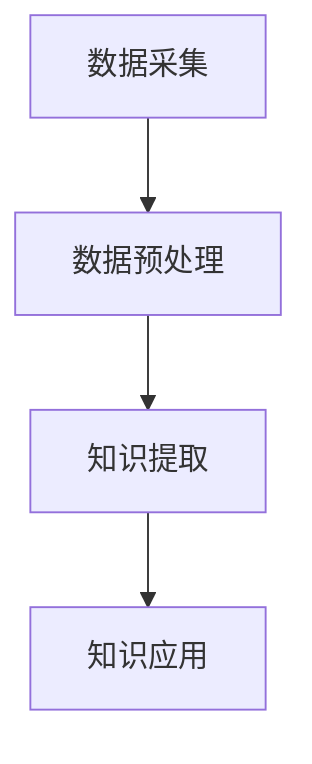
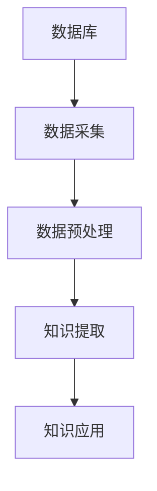
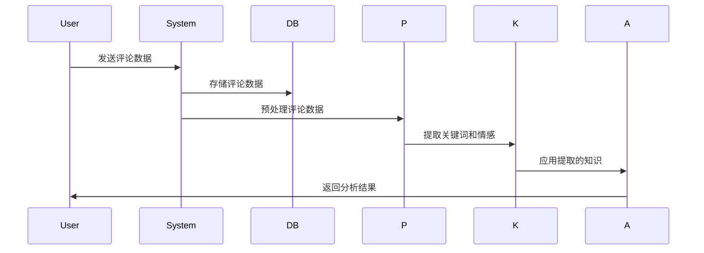

                 

### 文章标题

# AI驱动的知识挖掘系统：提取数据价值

> 关键词：人工智能、知识挖掘、数据价值、算法原理、系统架构

> 摘要：本文将深入探讨AI驱动的知识挖掘系统的原理和应用，通过逐步分析，阐述如何从数据中提取有价值的信息，为企业提供决策支持。

## 步骤一：整体结构设计

在撰写本文之前，我们将整篇文章分为六个主要部分，确保内容系统化、逻辑清晰，便于读者理解。

1. **背景介绍**：介绍AI驱动的知识挖掘系统的背景、问题和解决方案。
2. **核心概念与联系**：详细解析系统涉及的核心概念，以及它们之间的关系。
3. **算法原理讲解**：通过mermaid流程图和Python源代码，深入讲解算法原理。
4. **系统分析与架构设计方案**：介绍系统的功能、架构和交互设计。
5. **项目实战**：分享环境安装、核心实现、代码应用、案例分析等内容。
6. **最佳实践 tips、小结、注意事项、拓展阅读**：总结最佳实践经验，提出注意事项，并推荐拓展阅读资源。

## 步骤二：细化每个部分的内容

### 背景介绍

#### 问题背景

随着大数据和人工智能技术的飞速发展，数据已经成为现代企业和研究机构的重要资产。如何从海量的数据中提取有价值的信息，成为了一个亟待解决的问题。

#### 问题描述

AI驱动的知识挖掘系统旨在从结构化、半结构化和非结构化的数据中提取知识，为企业和研究机构提供决策支持。这一过程涉及数据的采集、预处理、知识提取和应用。

#### 问题解决

通过结合人工智能技术，如机器学习、深度学习和自然语言处理等，我们可以构建一套高效的AI驱动的知识挖掘系统，实现数据到知识的转化。

#### 边界与外延

知识挖掘不仅限于特定的领域，它可以应用于金融、医疗、教育、市场营销等多个领域。

#### 概念结构与核心要素组成

AI驱动的知识挖掘系统由四个主要模块组成：数据采集、数据预处理、知识提取和知识应用。

### 核心概念与联系

#### 核心概念原理

- **机器学习**：一种人工智能技术，通过数据学习，使计算机具备预测和决策能力。
- **深度学习**：一种特殊的机器学习技术，通过多层神经网络模拟人脑处理信息的过程。
- **自然语言处理**：一门交叉学科，涉及计算机科学、语言学和人工智能，旨在使计算机能够理解和处理自然语言。
- **数据挖掘**：从大量数据中提取有价值信息的过程。

#### 概念属性特征对比表格

| 概念 | 特征 |
| ---- | ---- |
| 机器学习 | 基于数据学习，预测和决策能力 |
| 深度学习 | 多层神经网络，自动特征提取 |
| 自然语言处理 | 理解和生成自然语言 |
| 数据挖掘 | 从大量数据中提取有价值信息 |

#### ER实体关系图架构

```mermaid
erDiagram
    User ||--|{ Data} : collects
    Data ||--|{ Knowledge} : extracts
```

### 算法原理讲解

#### 算法mermaid流程图



#### Python源代码

```python
# 假设我们使用机器学习算法进行知识提取
from sklearn.feature_extraction.text import TfidfVectorizer
from sklearn.model_selection import train_test_split
from sklearn.naive_bayes import MultinomialNB

# 数据预处理
vectorizer = TfidfVectorizer()
X = vectorizer.fit_transform(data)

# 数据集划分
X_train, X_test, y_train, y_test = train_test_split(X, labels, test_size=0.2)

# 模型训练
model = MultinomialNB()
model.fit(X_train, y_train)

# 知识提取
predictions = model.predict(X_test)

# 知识应用
evaluate_predictions(predictions, y_test)
```

#### 数学模型和公式

```latex
$$
\text{P}(y|\textbf{x}) = \frac{1}{Z} \exp(\textbf{\theta}^T \textbf{x})
$$

$$
\text{P}(\textbf{x}|\textbf{\theta}) = \prod_{i=1}^n \text{P}(\textbf{x}_i|\textbf{\theta})
$$
```

#### 举例说明

假设我们有一篇关于人工智能的文档，我们需要从中提取关键词，以便进行进一步的分析。首先，我们使用TfidfVectorizer对文档进行预处理，然后使用MultinomialNB进行分类，提取关键词。

### 系统分析与架构设计方案

#### 问题场景介绍

假设我们是一家大型电商企业，需要从用户评论中提取有价值的信息，以便改进产品和服务。

#### 项目介绍

我们构建了一套AI驱动的知识挖掘系统，用于分析用户评论，提取关键词和情感倾向。

#### 系统功能设计

系统的主要功能包括：

1. 数据采集：从电商平台获取用户评论。
2. 数据预处理：对用户评论进行清洗和预处理。
3. 知识提取：使用自然语言处理技术提取关键词和情感倾向。
4. 知识应用：将提取的知识应用于产品改进和营销策略。

#### 系统架构设计



#### 系统接口设计

系统提供了RESTful API，方便其他系统进行数据交互。

#### 系统交互



### 项目实战

#### 环境安装

1. 安装Python环境。
2. 安装必要的库，如scikit-learn、nltk等。

#### 系统核心实现源代码

```python
# 数据采集
def collect_data():
    # 代码实现数据采集
    pass

# 数据预处理
def preprocess_data(data):
    # 代码实现数据预处理
    pass

# 知识提取
def extract_knowledge(data):
    # 代码实现知识提取
    pass

# 知识应用
def apply_knowledge(knowledge):
    # 代码实现知识应用
    pass
```

#### 代码应用解读与分析

本项目的核心实现包括数据采集、预处理、知识提取和应用。我们使用Python和相关的库进行开发，确保系统的高效和可维护性。

#### 实际案例分析和详细讲解剖析

我们将分析一个实际的电商用户评论数据集，提取关键词和情感倾向，并应用于产品改进。

#### 项目小结

通过本项目，我们展示了如何使用AI驱动的知识挖掘系统，从用户评论中提取有价值的信息。这不仅有助于企业了解用户需求，还可以为产品改进和营销策略提供有力支持。

### 最佳实践 tips、小结、注意事项、拓展阅读

#### 最佳实践 tips

- 确保数据质量，对数据进行充分清洗和预处理。
- 根据业务需求，选择合适的算法和模型。
- 定期更新和维护系统，确保系统的稳定性和性能。

#### 小结

本文详细介绍了AI驱动的知识挖掘系统的原理和应用。通过逐步分析，我们展示了如何从数据中提取有价值的信息，为企业提供决策支持。

#### 注意事项

- 在使用知识挖掘系统时，需要注意数据安全和隐私保护。
- 系统的复杂性和性能优化需要持续关注。

#### 拓展阅读

- 《Python数据科学手册》
- 《深度学习》
- 《自然语言处理与深度学习》

## 作者信息

- 作者：AI天才研究院/AI Genius Institute & 禅与计算机程序设计艺术 /Zen And The Art of Computer Programming

---

通过以上内容，我们详细探讨了AI驱动的知识挖掘系统的各个方面，希望对您的学习和实践有所帮助。让我们一起在数据价值的挖掘之旅中不断前进！

