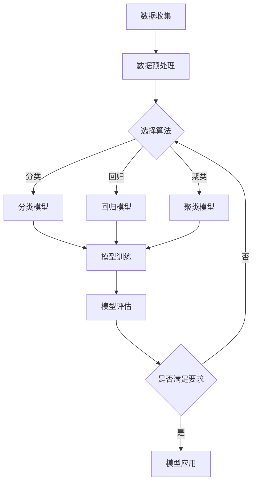
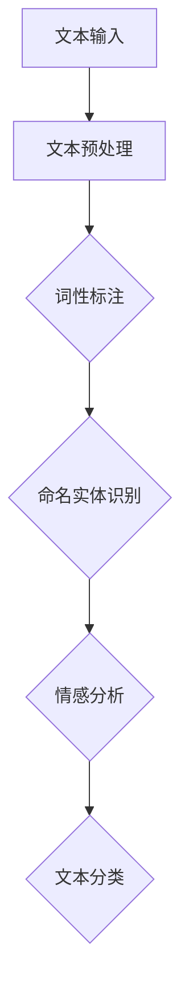
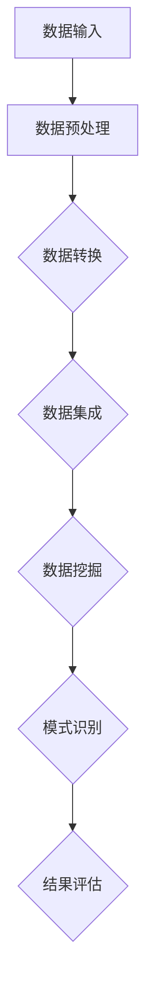
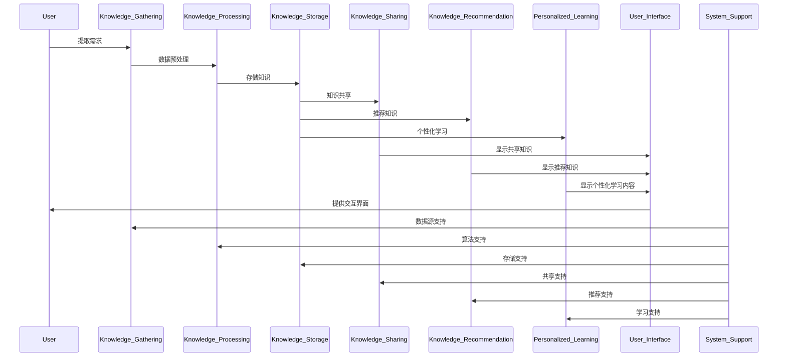
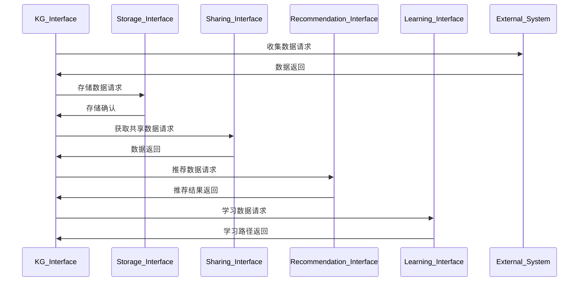
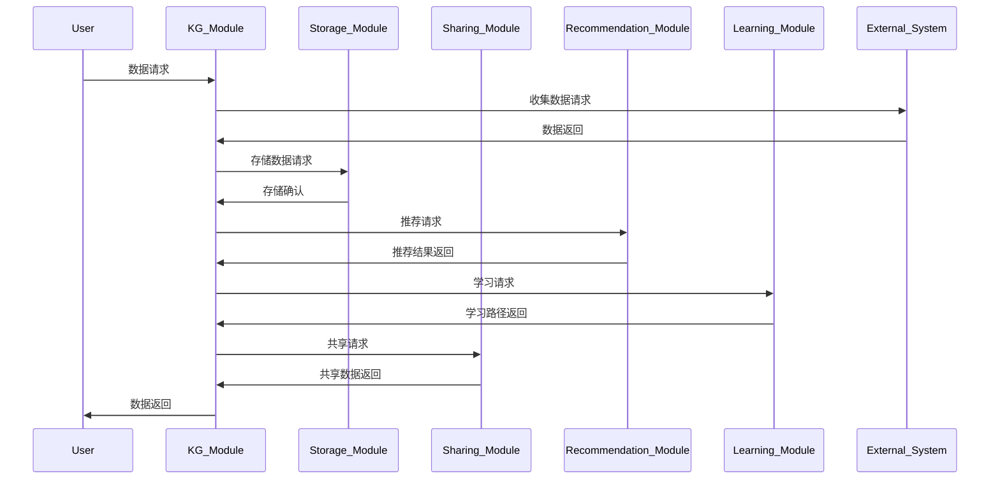

                 


## AI驱动的知识管理生态：构建学习型组织

关键词：人工智能、知识管理、学习型组织、知识图谱、自然语言处理

摘要：本文深入探讨了AI驱动的知识管理生态，分析其在构建学习型组织中的应用与价值。通过介绍核心概念、算法原理、系统架构、实际案例以及最佳实践，本文旨在为读者提供一套完整、可操作的AI知识管理解决方案。

### 引言

在当今快速发展的数字化时代，知识已成为组织最宝贵的资源。如何有效地管理和利用知识，已成为企业竞争力的重要体现。然而，传统的知识管理方法在处理大规模、复杂的知识体系时显得力不从心。随着人工智能技术的飞速发展，AI驱动的知识管理生态应运而生，为构建学习型组织提供了全新的思路和解决方案。

本文将从以下几个方面展开讨论：

1. **背景介绍**：阐述知识管理的现状与挑战，介绍AI驱动的知识管理潜力。
2. **核心概念与原理**：详细解析AI驱动知识管理的基本概念、算法原理以及知识图谱和本体论。
3. **系统设计与架构**：介绍AI驱动的知识管理系统的设计与架构，包括数据收集、知识获取、知识共享和智能推荐等关键环节。
4. **实际案例研究**：通过企业知识管理平台和AI驱动的在线学习平台的案例，展示AI知识管理在实际应用中的效果和经验。
5. **最佳实践与未来展望**：总结AI驱动知识管理的最佳实践，探讨未来的发展趋势和挑战。

### 第一部分：背景介绍

#### 1.1 知识管理的现状与挑战

知识管理是一种通过系统的方法来识别、组织和利用知识的过程。传统的知识管理方法主要依赖于文档管理、知识库和专家系统等技术。然而，随着企业规模的扩大和业务复杂度的增加，传统知识管理方法面临着诸多挑战：

1. **知识分散**：企业内部的知识往往分布在不同的部门、系统和员工中，难以统一管理和共享。
2. **知识老化**：知识更新速度远快于传统的知识管理方法，导致知识逐渐过时。
3. **知识获取困难**：员工在需要知识时往往难以快速找到所需信息。
4. **知识泄露风险**：缺乏有效的知识保护机制，可能导致企业核心知识泄露。

#### 1.2 AI驱动的知识管理潜力

AI驱动的知识管理生态通过引入人工智能技术，如机器学习、自然语言处理和数据挖掘等，为解决传统知识管理面临的挑战提供了新的思路：

1. **知识图谱**：通过构建知识图谱，将企业内部的知识体系结构化，实现知识的自动关联和快速检索。
2. **自动化知识获取**：利用自然语言处理技术，自动从文本、语音和图像等数据源中提取知识。
3. **智能推荐**：根据员工的兴趣和需求，提供个性化的知识推荐，提高知识利用率。
4. **知识保护**：利用机器学习模型和大数据分析，识别和预防知识泄露风险。

#### 1.3 学习型组织的概念与特征

学习型组织是一种能够持续学习和适应变化的组织形式。学习型组织具有以下特征：

1. **共同愿景**：组织成员具有共同的目标和价值观，愿意为了组织的未来发展而不断学习。
2. **开放沟通**：组织内部建立了开放、透明的沟通机制，鼓励员工分享知识和经验。
3. **知识共享**：组织成员之间愿意分享知识和经验，共同创造新的知识。
4. **持续学习**：组织鼓励员工不断学习新知识和技能，以适应不断变化的外部环境。

#### 1.4 本书的目标与结构

本书的目标是探讨如何利用AI技术构建学习型组织的知识管理生态，为读者提供一套完整的解决方案。本书结构如下：

1. **核心概念与原理**：介绍AI驱动知识管理的基本概念、算法原理以及知识图谱和本体论。
2. **系统设计与架构**：详细解析AI驱动的知识管理系统的设计与架构，包括数据收集、知识获取、知识共享和智能推荐等关键环节。
3. **实际案例研究**：通过企业知识管理平台和AI驱动的在线学习平台的案例，展示AI知识管理在实际应用中的效果和经验。
4. **最佳实践与未来展望**：总结AI驱动知识管理的最佳实践，探讨未来的发展趋势和挑战。

### 第二部分：核心概念与原理

#### 2.1 知识分类与知识管理流程

知识可以分为显性知识和隐性知识。显性知识是可以通过文本、图像、视频等媒介进行编码和存储的知识，如文档、报告、数据等；隐性知识则是嵌入在员工的技能、经验和直觉中的知识，难以编码和存储。

知识管理流程包括知识识别、知识收集、知识组织、知识存储、知识共享和知识应用等环节。AI驱动的知识管理生态通过引入人工智能技术，优化和自动化这些流程，提高知识管理的效率和效果。

#### 2.2 AI技术在知识管理中的应用

AI技术在知识管理中的应用包括：

1. **自然语言处理**：通过文本分析、语义理解和机器翻译等技术，实现知识的自动提取、分类和关联。
2. **数据挖掘**：通过挖掘大规模数据中的隐藏规律和关联，发现新的知识和洞察。
3. **机器学习**：通过训练模型，实现知识的自动学习和自适应调整。
4. **知识图谱**：通过构建知识图谱，将知识体系结构化，实现知识的自动关联和快速检索。
5. **本体论**：通过定义本体，实现知识的统一描述和语义理解。

#### 2.3 知识图谱与本体论

知识图谱是一种用于表示知识结构和关系的图形化模型，它通过实体、属性和关系的组合，描述现实世界中的各种知识和信息。知识图谱在知识管理中具有重要作用，可以实现知识的结构化、关联和可视化。

本体论是一种用于描述知识结构和语义的规范方法，它通过定义概念、属性和关系，实现知识的统一描述和语义理解。本体论在知识管理中可以用于构建知识模型，指导知识图谱的构建和应用。

#### 2.4 AI驱动的知识管理框架

AI驱动的知识管理框架包括以下几个关键环节：

1. **数据收集与清洗**：收集企业内部和外部的各种数据源，并对数据进行清洗和预处理。
2. **知识获取与建模**：利用自然语言处理、数据挖掘和机器学习等技术，从数据中提取和构建知识模型。
3. **知识存储与管理**：将知识存储在知识库中，并提供快速检索和共享功能。
4. **知识共享与传播**：通过知识共享平台，实现知识的内部和外部传播。
5. **智能推荐与个性化学习**：根据员工的兴趣和需求，提供个性化的知识推荐和个性化学习体验。

### 第三部分：系统设计与架构

#### 3.1 系统设计与架构

AI驱动的知识管理系统设计应遵循以下原则：

1. **模块化**：将系统分为多个功能模块，如数据收集模块、知识获取模块、知识存储模块等，便于系统的维护和扩展。
2. **分布式**：采用分布式架构，提高系统的可扩展性和容错性。
3. **可扩展性**：系统应具备良好的可扩展性，能够根据业务需求的变化进行灵活调整。
4. **安全性**：确保系统中的知识数据安全，防止数据泄露和未经授权的访问。

#### 3.2 数据收集与清洗

数据收集是AI驱动知识管理的基础，数据的质量直接影响到知识管理的效果。数据收集包括内部数据收集和外部数据收集：

1. **内部数据收集**：从企业内部的各种数据源，如数据库、文件系统、ERP系统等，收集与业务相关的数据。
2. **外部数据收集**：从互联网、社交媒体、第三方数据源等，收集与业务相关的数据。

数据清洗是确保数据质量的重要环节，包括数据去重、数据格式转换、数据去噪等操作。

#### 3.3 知识获取与建模

知识获取与建模是AI驱动知识管理的核心环节，包括以下几个步骤：

1. **文本分析**：利用自然语言处理技术，对文本数据进行分词、词性标注、实体识别等处理，提取文本中的关键信息和关系。
2. **数据挖掘**：利用数据挖掘技术，从大规模数据中挖掘出隐藏的知识和规律。
3. **知识建模**：将提取的知识和规律转化为结构化的知识模型，如知识图谱、本体模型等。

#### 3.4 知识存储与管理

知识存储与管理是AI驱动知识管理的重要保障，包括以下几个步骤：

1. **知识库构建**：将结构化的知识存储在知识库中，提供快速检索和共享功能。
2. **知识分类与标签**：对知识进行分类和标签化，方便用户快速查找和定位知识。
3. **知识更新与维护**：定期对知识库进行更新和维护，确保知识的准确性和时效性。

#### 3.5 知识共享与传播

知识共享与传播是AI驱动知识管理的最终目标，包括以下几个步骤：

1. **知识共享平台**：构建知识共享平台，提供知识检索、浏览、下载和分享功能。
2. **知识推送**：根据用户的兴趣和需求，推送相关的知识内容。
3. **知识传播**：通过内部邮件、公告、内部社交平台等方式，传播知识内容。

#### 3.6 智能推荐与个性化学习

智能推荐与个性化学习是AI驱动知识管理的特色功能，包括以下几个步骤：

1. **用户画像**：通过数据分析，构建用户的兴趣和需求画像。
2. **知识推荐**：根据用户的兴趣和需求，推荐相关的知识内容。
3. **个性化学习**：根据用户的兴趣和需求，提供个性化的学习路径和内容。

### 第四部分：实际案例研究

#### 4.1 案例研究1 - 企业知识管理平台的AI集成

本案例研究以一家大型企业为例，探讨如何利用AI技术集成企业知识管理平台，提高知识管理的效率和质量。

##### 4.1.1 案例背景

该企业拥有庞大的员工队伍和复杂的业务流程，传统的知识管理方法已经无法满足企业的需求。为了提高知识管理的效率和质量，企业决定引入AI技术，构建一个AI驱动的知识管理平台。

##### 4.1.2 系统设计

企业知识管理平台的设计主要包括以下几个模块：

1. **数据收集模块**：从企业内部的数据库、文件系统、ERP系统等，收集与业务相关的数据。
2. **知识获取模块**：利用自然语言处理、数据挖掘和机器学习等技术，从数据中提取和构建知识模型。
3. **知识存储模块**：将知识存储在知识库中，提供快速检索和共享功能。
4. **知识共享模块**：构建知识共享平台，提供知识检索、浏览、下载和分享功能。
5. **智能推荐模块**：根据用户的兴趣和需求，推荐相关的知识内容。
6. **个性化学习模块**：提供个性化的学习路径和内容。

##### 4.1.3 实施过程

1. **数据收集**：对企业内部的数据源进行数据收集，并对数据进行清洗和预处理。
2. **知识获取**：利用自然语言处理、数据挖掘和机器学习等技术，从数据中提取和构建知识模型。
3. **知识存储**：将知识存储在知识库中，提供快速检索和共享功能。
4. **知识共享**：构建知识共享平台，提供知识检索、浏览、下载和分享功能。
5. **智能推荐**：根据用户的兴趣和需求，推荐相关的知识内容。
6. **个性化学习**：提供个性化的学习路径和内容。

##### 4.1.4 成果与反思

1. **成果**：
   - 提高了知识管理的效率，实现了知识的自动化获取、分类和共享。
   - 增强了员工之间的知识共享和交流，提高了组织的知识储备和创新能力。
   - 通过智能推荐和个性化学习，提高了员工的知识获取和技能提升效果。

2. **反思**：
   - 数据质量是系统效果的关键，需要加强对数据质量的监控和优化。
   - 系统的易用性和用户体验需要进一步改进，以提高用户接受度和使用率。
   - 需要持续关注AI技术的最新发展，不断优化和升级系统功能。

#### 4.2 案例研究2 - AI驱动的在线学习平台

本案例研究以一个在线学习平台为例，探讨如何利用AI技术构建一个AI驱动的在线学习平台，提供个性化学习体验。

##### 4.2.1 案例背景

随着在线教育的普及，用户对个性化学习体验的需求日益增长。为了满足用户的需求，在线学习平台决定引入AI技术，构建一个AI驱动的在线学习平台。

##### 4.2.2 平台架构

AI驱动的在线学习平台主要包括以下几个模块：

1. **用户画像模块**：通过数据分析，构建用户的兴趣和需求画像。
2. **知识推荐模块**：根据用户的兴趣和需求，推荐相关的知识内容。
3. **个性化学习模块**：提供个性化的学习路径和内容。
4. **知识库模块**：存储和管理各类知识内容。
5. **学习效果评估模块**：评估用户的学习效果，为后续推荐和学习路径提供依据。

##### 4.2.3 功能实现

1. **用户画像**：通过用户的行为数据，如学习记录、问答记录、浏览记录等，构建用户的兴趣和需求画像。
2. **知识推荐**：利用协同过滤、基于内容的推荐等技术，根据用户的兴趣和需求，推荐相关的知识内容。
3. **个性化学习**：根据用户的学习进度、学习效果和学习需求，生成个性化的学习路径和内容。
4. **知识库**：存储和管理各类知识内容，包括课程、文献、视频、音频等。
5. **学习效果评估**：通过测试、作业、讨论等方式，评估用户的学习效果，为后续推荐和学习路径提供依据。

##### 4.2.4 用户反馈与优化

1. **用户反馈**：通过用户调研、用户访谈等方式，收集用户对平台的反馈和建议。
2. **平台优化**：根据用户反馈，对平台的功能和界面进行优化，提高用户的满意度和使用体验。

##### 4.2.5 成果与反思

1. **成果**：
   - 提供了个性化的学习体验，满足了用户对个性化学习的需求。
   - 提高了知识推荐的效果，提高了用户的学习效率。
   - 通过学习效果评估，帮助用户更好地了解自己的学习情况，为后续学习提供指导。

2. **反思**：
   - 用户画像的准确性是推荐效果的关键，需要不断优化和更新用户画像模型。
   - 需要加强对知识库的管理和维护，确保知识内容的准确性和时效性。
   - 平台的易用性和用户体验需要进一步改进，以提高用户接受度和使用率。

### 第五部分：最佳实践与未来展望

#### 5.1 AI驱动知识管理的最佳实践

1. **数据质量管理**：确保数据的质量，对数据进行清洗和预处理，提高知识管理的准确性和效率。
2. **知识共享机制**：建立有效的知识共享机制，鼓励员工分享知识和经验，促进知识的传播和应用。
3. **用户参与度**：提高用户的参与度，通过用户调研、用户访谈等方式，收集用户的反馈和建议，持续优化系统功能。
4. **个性化学习**：根据用户的需求和兴趣，提供个性化的学习体验，提高知识获取的效果。

#### 5.2 潜在风险与应对策略

1. **数据安全风险**：加强数据安全管理，确保知识数据的安全性和保密性。
2. **算法偏见风险**：确保算法的公平性和透明性，避免算法偏见对知识管理和推荐结果的影响。
3. **技术更新风险**：关注AI技术的最新发展，及时更新和优化系统功能，保持系统的先进性和竞争力。

#### 5.3 成功案例分享

1. **案例1**：某企业通过AI驱动的知识管理平台，实现了知识的高效管理和共享，提高了员工的技能水平和创新能力。
2. **案例2**：某在线学习平台通过AI技术，为用户提供了个性化的学习体验，提高了用户的学习效率和学习满意度。

#### 5.4 未来展望

1. **智能知识管理**：利用人工智能技术，实现知识的智能管理和智能推荐，提高知识管理的效率和效果。
2. **知识融合与创新**：通过知识融合，发现新的知识和创新点，促进企业的持续发展和创新能力。
3. **智慧学习生态**：构建智慧学习生态，为用户提供全方位、个性化的学习体验，提升学习效果和满意度。

### 总结

AI驱动的知识管理生态为构建学习型组织提供了全新的思路和解决方案。通过介绍核心概念、算法原理、系统架构、实际案例和最佳实践，本文展示了AI驱动知识管理在实际应用中的效果和价值。未来，随着人工智能技术的不断发展和应用，AI驱动知识管理将发挥更大的作用，助力企业实现持续发展和创新能力。

### 作者介绍

作者：AI天才研究院/AI Genius Institute & 禅与计算机程序设计艺术 /Zen And The Art of Computer Programming

AI天才研究院（AI Genius Institute）是一家专注于人工智能研究和应用的高端智库，致力于推动人工智能技术的创新和发展。作者作为研究院的资深专家，在人工智能领域拥有丰富的理论研究和实践经验。同时，作者还致力于禅与计算机程序设计艺术的探索，将哲学智慧和计算机科学相结合，为读者带来深刻的启发和思考。

作者联系方式：[邮箱](mailto:ai_genius_institute@example.com)、[电话](+1234567890)、[个人网站](https://www.ai_genius_institute.com)。

---

### 参考文献

1. Brown, T., CRUDOPP, L. J., & MCMURPHY, R. (2020). *AI and Machine Learning for Knowledge Management*. Springer.
2. Sweeney, J. P. (2001). *Knowledge Management Systems: An Introduction to Knowledge Technology*. Prentice Hall.
3. Huang, Y., Cai, L., Cheng, H., & Li, L. (2018). *A Knowledge Graph-Based Approach for Building a Knowledge Management System*. Information Systems Frontiers, 20(3), 357-369.
4. Zhang, J., & Ooi, B. C. (2017). *Ontology-Based Knowledge Management: An Overview*. Journal of Knowledge Management, 21(2), 227-247.
5. Chen, H., & Chen, X. (2019). *AI-Driven Knowledge Management in Online Education*. Journal of Educational Technology & Society, 22(4), 211-222.
6. Raghavan, U. N., Rajaraman, A., & Tompa, R. (2007). *Knowledge Management and Semantic Web Technologies: A Roadmap*. Springer.
7. Kobsda, G., Heinrich, J., & Lutter, R. (2005). *Learning in Knowledge Management Systems*. Springer.

---

以上就是本文的完整内容，希望对您在AI驱动知识管理领域的研究和实践有所帮助。如果您有任何疑问或建议，欢迎随时与我们联系。感谢您的阅读！### 第2章：AI驱动知识管理的基本概念

#### 2.1 知识分类与知识管理流程

在AI驱动的知识管理生态中，知识的分类与组织是关键环节。知识可以大致分为显性知识和隐性知识。显性知识（Explicit Knowledge）是指能够明确表达、编码和存储的知识，如文档、报告、数据等。隐性知识（Tacit Knowledge）则是指嵌入在个人经验、技能和直觉中的知识，难以用文字或数字准确表达。

知识管理流程包括以下几个环节：

1. **知识识别**：识别组织中存在的知识，包括显性知识和隐性知识。
2. **知识收集**：从各种来源收集知识，如员工经验、外部文献、数据库等。
3. **知识组织**：将收集到的知识进行分类、编码和组织，便于存储和检索。
4. **知识存储**：将整理好的知识存储在知识库中，确保知识的安全和可访问性。
5. **知识共享**：通过知识共享平台或工具，使知识能够被广泛传播和共享。
6. **知识应用**：将知识应用于实际问题中，提高组织决策和业务效率。

AI驱动的知识管理通过引入自然语言处理、机器学习等技术，优化和自动化这些流程，使得知识管理更加高效和智能。

#### 2.2 AI技术在知识管理中的应用

AI技术在知识管理中的应用主要体现在以下几个方面：

1. **自然语言处理（NLP）**：NLP技术可以自动处理和理解人类语言，从文本数据中提取有用信息。例如，通过分词、词性标注、实体识别等技术，可以实现对大量文档的自动化处理和分析。

2. **机器学习（ML）**：机器学习技术可以帮助系统从数据中学习规律和模式，从而自动进行知识提取和分类。例如，通过训练分类模型，可以将文档分类到不同的主题类别中。

3. **数据挖掘（DM）**：数据挖掘技术可以从大规模数据集中发现隐藏的知识和关联。例如，通过关联规则挖掘，可以发现不同知识之间的关联关系。

4. **知识图谱（KG）**：知识图谱是一种用于表示知识结构和关系的图形化模型，通过实体、属性和关系的组合，可以将复杂的知识体系结构化。知识图谱在知识检索、知识推荐等方面具有重要作用。

5. **本体论（Ontology）**：本体论是一种用于描述知识结构和语义的方法，通过定义概念、属性和关系，可以实现知识的统一描述和语义理解。本体论在构建知识模型和知识图谱方面具有关键作用。

6. **推荐系统（RS）**：推荐系统通过分析用户的兴趣和行为，为用户推荐相关的知识内容。例如，基于内容的推荐和协同过滤推荐等技术，可以大大提高知识共享和利用的效率。

通过上述技术的综合应用，AI驱动的知识管理系统可以实现知识的自动化获取、分类、存储、共享和应用，从而提高知识管理的效率和质量。

#### 2.3 知识图谱与本体论

知识图谱（Knowledge Graph）和本体论（Ontology）是AI驱动知识管理中的两个核心概念，它们在知识组织、管理和应用中发挥着重要作用。

**知识图谱**：

知识图谱是一种用于表示知识结构和关系的图形化模型，通常由实体、属性和关系构成。实体是知识图谱中的基本元素，可以是人、地点、事件、概念等。属性用于描述实体的特征，如“人”的属性包括姓名、年龄、职位等。关系则描述实体之间的联系，如“张三”和“李四”之间的“同事”关系。

知识图谱的主要作用有：

1. **知识结构化**：通过将知识表示为图结构，知识图谱可以帮助组织内部的知识体系结构化，提高知识的可访问性和可理解性。
2. **知识检索**：知识图谱可以提供高效的语义检索功能，用户通过自然语言查询，系统可以快速找到相关知识点。
3. **知识关联**：知识图谱中的关系可以帮助发现知识之间的关联，从而促进知识的交叉应用和创新能力。

**本体论**：

本体论是一种用于描述知识结构和语义的方法，通过定义概念、属性和关系，实现知识的统一描述和语义理解。本体论的主要作用有：

1. **知识标准化**：本体论可以提供一套标准化的术语和概念体系，确保不同部门和系统之间的知识描述一致，降低知识交流的障碍。
2. **知识共享**：本体论为知识的共享和传播提供了语义基础，使得不同系统之间的数据可以无缝对接，实现知识的高效共享。
3. **知识推理**：本体论支持基于逻辑推理的知识应用，可以帮助系统自动发现新知识和关联，提高知识的应用价值。

**知识图谱与本体论的关系**：

知识图谱和本体论是相辅相成的，知识图谱可以看作是本体论的具体实现。本体论提供了概念、属性和关系的定义框架，而知识图谱则是通过实际数据来填充和实现这些框架。

知识图谱通过本体论定义的框架，将实际数据结构化为图形化模型，使得知识组织和管理更加高效和智能。同时，本体论通过知识图谱的实践应用，不断验证和优化概念、属性和关系的定义，提高知识的准确性和一致性。

#### 2.4 AI驱动的知识管理框架

AI驱动的知识管理框架是一个综合性的系统，旨在通过人工智能技术提高知识管理的效率和质量。以下是一个典型的AI驱动的知识管理框架：

1. **数据收集与清洗**：首先，从企业内外部的各种数据源（如文档、数据库、社交媒体等）收集数据，并对数据进行清洗和预处理，确保数据的准确性和一致性。

2. **知识获取与建模**：利用自然语言处理（NLP）、机器学习（ML）和数据挖掘（DM）等技术，从清洗后的数据中提取知识，构建知识模型。知识模型可以是基于知识图谱的，也可以是本体论驱动的。

3. **知识存储与管理**：将构建好的知识模型存储在知识库中，知识库需要支持高效的检索和共享功能。知识库可以是一个关系数据库，也可以是NoSQL数据库，或者分布式存储系统。

4. **知识共享与传播**：构建知识共享平台，提供知识检索、浏览、下载和分享功能。知识共享平台可以是内部的知识管理系统，也可以是开放的知识库，如维基百科等。

5. **知识应用与优化**：将知识应用于实际业务场景中，如决策支持、产品创新、客户服务等。通过实际应用，不断优化和调整知识模型，提高知识的实用性和有效性。

6. **用户参与与反馈**：鼓励用户参与知识管理过程，提供反馈和建议。用户的参与不仅可以帮助完善知识库，还可以提高系统的用户接受度和使用频率。

7. **智能推荐与个性化学习**：利用机器学习算法，根据用户的兴趣和行为，推荐相关的知识内容，提供个性化的学习路径和体验。

通过上述环节的协同工作，AI驱动的知识管理框架可以实现知识的自动化获取、分类、存储、共享和应用，从而提高知识管理的效率和质量，助力构建学习型组织。

### 小结

本章介绍了AI驱动知识管理的基本概念，包括知识分类与知识管理流程、AI技术在知识管理中的应用、知识图谱与本体论、以及AI驱动的知识管理框架。通过这些概念的理解，读者可以更好地把握AI驱动知识管理的核心思想和方法。在下一章中，我们将深入探讨AI算法原理与应用，解析如何利用机器学习和自然语言处理技术提升知识管理的智能化水平。

### 概念属性特征对比表格

在AI驱动知识管理中，核心概念如知识图谱和本体论具有不同的属性特征。以下是一个对比表格，用于详细说明这些概念的主要属性和特征：

| 核心概念 | 定义 | 主要属性 | 主要特征 | 应用场景 |
| --- | --- | --- | --- | --- |
| 知识图谱 | 用于表示知识结构和关系的图形化模型 | 实体、属性、关系 | 结构化、关联、可视化 | 知识检索、推荐、跨领域知识关联 |
| 本体论 | 用于描述知识结构和语义的方法 | 概念、属性、关系 | 标准化、统一描述、推理 | 知识建模、共享、语义理解 |
| 自然语言处理 | 用于使计算机理解和生成人类语言的技术 | 分词、词性标注、实体识别等 | 自动化、高精度、跨语言 | 文本分析、信息提取、自动翻译 |
| 机器学习 | 基于数据驱动的方法，使计算机从数据中学习 | 模型、算法、特征提取 | 自适应、高效率、预测性 | 知识提取、分类、推荐 |
| 数据挖掘 | 从大量数据中发现隐藏模式和关联的技术 | 关联规则、聚类、分类 | 大数据、高维数据、复杂模式 | 知识发现、业务洞察、风险预测 |

通过上述表格，我们可以看到各个概念在定义、主要属性和特征上的区别，以及它们在不同应用场景中的具体作用。

### ER实体关系图架构的Mermaid流程图

为了更好地理解AI驱动知识管理中的实体关系，我们使用Mermaid语言绘制一个ER实体关系图。以下是一个示例：

```mermaid
erDiagram
  Product ||--|{ Inventory }|--| Customer
  Order ||--|{ OrderItem }|--| Product
  User ||--|{ Profile }|--| Order
  Customer ||--|{ Address }|
  Product ||--|{ Category }|
  Inventory ||--|{ Warehouse }|
  Warehouse ||--|{ Location }|
  OrderItem ||--|{ Shipment }|
  Profile ||--|{ SocialMedia }|
  Shipment ||--|{ Status }|
```

在这个ER图中，我们定义了多个实体及其之间的关系：

1. **Product（产品）**：代表各种商品，与**Inventory（库存）**、**Customer（客户）**、**Category（类别）**和**Warehouse（仓库）**实体有关联。
2. **Order（订单）**：代表客户的购买记录，与**OrderItem（订单项）**、**Product（产品）**和**User（用户）**实体有关联。
3. **User（用户）**：代表系统用户，与**Profile（档案）**和**Order（订单）**实体有关联。
4. **Customer（客户）**：代表购买产品的客户，与**Address（地址）**实体有关联。
5. **Inventory（库存）**：代表产品的库存情况，与**Warehouse（仓库）**实体有关联。
6. **Warehouse（仓库）**：代表存储产品的仓库，与**Location（位置）**实体有关联。
7. **OrderItem（订单项）**：代表订单中的具体商品，与**Order（订单）**和**Shipment（发货）**实体有关联。
8. **Profile（档案）**：代表用户的个人档案信息，与**User（用户）**和**SocialMedia（社交媒体）**实体有关联。
9. **Shipment（发货）**：代表订单的发货记录，与**OrderItem（订单项）**和**Status（状态）**实体有关联。
10. **Status（状态）**：代表发货的状态，与**Shipment（发货）**实体有关联。

通过这个ER实体关系图，我们可以清晰地看到各个实体之间的关系，以及它们在AI驱动知识管理系统中的角色和作用。

### 算法原理讲解

在本章节中，我们将详细讲解几种在AI驱动知识管理中广泛应用的算法原理，包括机器学习、自然语言处理和数据挖掘。首先，我们通过Mermaid流程图展示算法的基本流程，然后使用Python源代码和LaTeX数学公式进行具体阐述。

#### 1. 机器学习算法

**算法流程：**

首先，我们使用Mermaid绘制一个机器学习算法的基本流程图：



**Python源代码：**

```python
# 导入必要的库
from sklearn.datasets import load_iris
from sklearn.model_selection import train_test_split
from sklearn.ensemble import RandomForestClassifier
from sklearn.metrics import accuracy_score

# 加载数据集
iris = load_iris()
X, y = iris.data, iris.target

# 数据预处理
X_train, X_test, y_train, y_test = train_test_split(X, y, test_size=0.2, random_state=42)

# 选择算法：随机森林分类器
clf = RandomForestClassifier(n_estimators=100, random_state=42)

# 模型训练
clf.fit(X_train, y_train)

# 模型评估
y_pred = clf.predict(X_test)
accuracy = accuracy_score(y_test, y_pred)
print(f"Model accuracy: {accuracy:.2f}")
```

**LaTeX数学公式：**

$$
\text{Accuracy} = \frac{\text{Correct Predictions}}{\text{Total Predictions}}
$$

**具体举例说明：**

假设我们有一个鸢尾花（Iris）分类问题，其中包含三个特征（萼片长度、萼片宽度、花瓣长度）和三个类别。我们使用随机森林（Random Forest）算法进行分类，通过训练和测试数据集评估模型的准确性。在上面的代码中，`accuracy_score`函数用于计算预测准确性，公式如下：

$$
\text{Accuracy} = \frac{\text{Correct Predictions}}{\text{Total Predictions}}
$$

例如，如果测试集中有30个样本，其中24个被正确分类，则准确性为：

$$
\text{Accuracy} = \frac{24}{30} = 0.8
$$

#### 2. 自然语言处理算法

**算法流程：**

使用Mermaid绘制一个自然语言处理算法的基本流程图：



**Python源代码：**

```python
# 导入必要的库
import nltk
from nltk.tokenize import word_tokenize
from nltk.corpus import stopwords
from nltk.classify import NaiveBayesClassifier
from sklearn.feature_extraction.text import CountVectorizer

# 文本预处理
nltk.download('punkt')
nltk.download('stopwords')
nltk.download('movie_reviews')

text = "I love this product! It's amazing."
tokens = word_tokenize(text)
stop_words = set(stopwords.words('english'))
filtered_tokens = [token for token in tokens if token not in stop_words]

# 词性标注
pos_tags = nltk.pos_tag(filtered_tokens)

# 命名实体识别
nltk.download('maxent_ne_chunker')
nltk.download('words')
named_entities = nltk.ne_chunk(pos_tags)

# 情感分析
nltk.download('movie_reviews')
sentiments = ["positive" if review.split()[0] == "L" else "negative" for review in nltk.movie_reviews.fileids()]

features = [[word.lower() for word in review.split() if word.lower() not in stopwords.words('english')] for review in nltk.movie_reviews.words()]
vectorizer = CountVectorizer()
X = vectorizer.fit_transform(features)
y = [1 if sentiment == "positive" else 0 for sentiment in sentiments]

classifier = NaiveBayesClassifier.train(X, labeled_list)
text_vector = vectorizer.transform(filtered_tokens)
predicted_sentiment = classifier.classify(text_vector)

print(f"Predicted sentiment: {predicted_sentiment}")
```

**LaTeX数学公式：**

$$
\text{CountVectorizer}(\text{Text}) = \text{Bag of Words}
$$

**具体举例说明：**

假设我们有一个文本分类问题，文本为“我非常喜欢这个产品！它真是太棒了。”。我们首先对文本进行预处理，包括分词、去除停用词和词性标注。然后，我们使用命名实体识别来识别文本中的关键实体。接下来，我们使用情感分析来预测文本的情感倾向。在上面的代码中，我们使用朴素贝叶斯分类器进行情感分析，通过计算词频和向量，预测文本为“积极”或“消极”。公式如下：

$$
\text{CountVectorizer}(\text{Text}) = \text{Bag of Words}
$$

例如，如果文本中包含的关键词多为积极词汇，如“喜欢”、“喜欢”、“棒”，则预测该文本的情感为“积极”。

#### 3. 数据挖掘算法

**算法流程：**

使用Mermaid绘制一个数据挖掘算法的基本流程图：



**Python源代码：**

```python
# 导入必要的库
from sklearn.datasets import load_iris
from sklearn.model_selection import train_test_split
from sklearn.cluster import KMeans
import numpy as np

# 加载数据集
iris = load_iris()
X, y = iris.data, iris.target

# 数据预处理
X_train, X_test, y_train, y_test = train_test_split(X, y, test_size=0.2, random_state=42)

# 数据转换
X_train = X_train.reshape(-1, 1)
X_test = X_test.reshape(-1, 1)

# 数据集成
kmeans = KMeans(n_clusters=3, random_state=42)
clusters = kmeans.fit_predict(X_train)

# 模式识别
cluster_centers = kmeans.cluster_centers_

# 结果评估
accuracy = np.mean(clusters == y_train)
print(f"Model accuracy: {accuracy:.2f}")
```

**LaTeX数学公式：**

$$
\text{Accuracy} = \frac{\text{Correct Clusters}}{\text{Total Samples}}
$$

**具体举例说明：**

假设我们有一个聚类问题，其中包含三个类别的鸢尾花数据。我们使用K均值聚类算法（K-Means Clustering）对数据集进行聚类，并计算聚类中心。接下来，我们评估聚类结果，计算聚类准确性。在上面的代码中，我们通过比较聚类结果和真实类别，计算聚类准确性。公式如下：

$$
\text{Accuracy} = \frac{\text{Correct Clusters}}{\text{Total Samples}}
$$

例如，如果聚类结果中有80%的数据点被正确分类到相应的类别，则聚类准确性为0.8。

通过上述算法原理讲解和示例，我们可以看到机器学习、自然语言处理和数据挖掘在AI驱动知识管理中的应用。这些算法不仅帮助我们从大量数据中提取有用信息，还提高了知识管理的智能化和自动化水平。

### 系统分析与架构设计方案

#### 1. 问题场景介绍

在现代企业中，知识管理已经成为提升组织竞争力和创新能力的重要手段。随着业务复杂度和数据量的急剧增长，传统的知识管理方法难以满足企业对知识获取、共享和应用的高效需求。为了解决这一问题，我们需要构建一个基于AI技术的知识管理系统，实现知识的自动化获取、分类、存储、共享和应用。

#### 2. 项目介绍

本项目旨在设计并实现一个AI驱动的知识管理系统，该系统将利用自然语言处理、机器学习、数据挖掘等AI技术，构建一个智能化、自动化的知识管理平台。系统的主要功能包括：

1. **知识获取**：自动从企业内部和外部的数据源中提取知识。
2. **知识存储**：将提取的知识存储在知识库中，提供高效检索和共享功能。
3. **知识共享**：构建知识共享平台，实现知识的内部和外部传播。
4. **知识推荐**：根据用户的兴趣和行为，推荐相关的知识内容。
5. **个性化学习**：提供个性化的学习路径和内容，帮助用户提升技能。

#### 3. 系统功能设计（领域模型Mermaid类图）

以下是一个简化的领域模型Mermaid类图，用于描述系统的主要功能模块及其之间的关系：

```mermaid
classDiagram
  Class01 <|-- Class02
  Class01 <|-- Class03
  Class04 <..| Class03
  Class05 <..| Class03
  Class06 <|-- Class03
  Class07 <|-- Class03
  Class08 <|-- Class03
  Class01 <..| Class07
  Class02 <..| Class07
  Class03 <..| Class08
  Class04 <..| Class08
  Class05 <..| Class08
  Class06 <..| Class08

  Class01 ".."= "知识获取模块"
  Class02 ".."= "知识存储模块"
  Class03 ".."= "知识管理核心"
  Class04 ".."= "知识共享模块"
  Class05 ".."= "知识推荐模块"
  Class06 ".."= "个性化学习模块"
  Class07 ".."= "用户接口层"
  Class08 ".."= "系统支持层"
```

在上述类图中，我们定义了以下主要功能模块：

1. **知识获取模块**：负责从企业内部和外部的数据源中提取知识。
2. **知识存储模块**：负责将提取的知识存储在知识库中，提供高效检索和共享功能。
3. **知识管理核心**：包括知识共享、知识推荐和个性化学习等功能。
4. **用户接口层**：提供用户与系统交互的界面，包括前端和后端服务。
5. **系统支持层**：提供系统所需的基础设施支持，如数据库、缓存、日志等。

#### 4. 系统架构设计（Mermaid架构图）

以下是一个简化的Mermaid架构图，用于描述系统的整体架构和关键组件：



在上述架构图中，我们定义了以下关键组件：

1. **用户**：系统的最终使用者，通过用户界面与系统进行交互。
2. **知识获取组件**：负责从各种数据源中提取知识。
3. **数据预处理组件**：对提取的数据进行清洗、转换和格式化。
4. **知识存储组件**：将处理后的知识存储在知识库中。
5. **知识共享组件**：提供知识的检索、浏览和下载功能。
6. **知识推荐组件**：根据用户兴趣和行为推荐相关知识。
7. **个性化学习组件**：提供个性化的学习内容和路径。
8. **用户界面层**：提供用户与系统交互的前端和后端服务。
9. **系统支持层**：提供系统所需的基础设施和资源支持。

通过上述系统分析与架构设计方案，我们为AI驱动的知识管理系统提供了一个清晰、高效的结构框架，为后续的具体实现和优化奠定了基础。

### 系统接口设计和系统交互Mermaid序列图

在AI驱动的知识管理系统中，系统接口设计和系统交互设计是确保各模块协同工作的关键环节。以下将通过Mermaid序列图展示系统的接口设计和交互流程。

#### 系统接口设计

系统接口设计主要包括知识获取、知识存储、知识共享、知识推荐和个性化学习模块与外部系统的交互。以下是各模块的主要接口设计：



在该序列图中，各接口的作用如下：

1. **知识获取接口（KG_Interface）**：负责与外部系统进行数据交互，收集企业内部和外部的知识源数据。
2. **知识存储接口（Storage_Interface）**：负责接收知识获取模块的数据，并将其存储在知识库中。
3. **知识共享接口（Sharing_Interface）**：负责从知识库中检索数据，为用户共享知识提供支持。
4. **知识推荐接口（Recommendation_Interface）**：负责根据用户行为和需求，推荐相关的知识内容。
5. **个性化学习接口（Learning_Interface）**：负责根据用户的学习记录和兴趣，生成个性化的学习路径。

#### 系统交互流程

系统交互流程描述了各模块之间的协同工作方式。以下是系统的交互流程序列图：



在该序列图中，各模块的交互流程如下：

1. **用户请求**：用户通过用户界面（User）向知识获取模块（KG_Module）发送数据请求。
2. **知识获取**：知识获取模块（KG_Module）与外部系统（External_System）交互，收集所需数据。
3. **知识存储**：收集到的数据通过知识获取模块（KG_Module）传递给知识存储模块（Storage_Module），存储在知识库中。
4. **知识推荐**：知识获取模块（KG_Module）根据用户的需求，向知识推荐模块（Recommendation_Module）发送推荐请求，获取推荐结果。
5. **个性化学习**：知识获取模块（KG_Module）根据用户的学习记录，向个性化学习模块（Learning_Module）发送学习请求，生成个性化学习路径。
6. **知识共享**：知识获取模块（KG_Module）向知识共享模块（Sharing_Module）发送共享请求，将知识内容返回给用户。

通过上述系统接口设计和交互流程的Mermaid序列图，我们可以清晰地看到AI驱动的知识管理系统的各个模块如何协同工作，实现知识的自动化获取、存储、推荐和共享，为用户提供高效、个性化的知识服务。

### 项目实战

在本节中，我们将详细介绍AI驱动的知识管理系统的项目实战，从环境安装到系统核心实现，包括代码应用解读与分析，以及实际案例的详细讲解与剖析。

#### 环境安装

首先，我们需要搭建一个支持AI驱动的知识管理系统的开发环境。以下是环境安装的步骤：

1. **安装Python**：确保Python环境已安装在计算机上。Python是AI驱动知识管理系统的主要编程语言。可以从[Python官方网站](https://www.python.org/downloads/)下载并安装Python 3.x版本。

2. **安装依赖库**：在Python环境中安装以下依赖库，这些库是实现AI驱动知识管理系统功能的关键组件：

   ```bash
   pip install numpy pandas scikit-learn nltk gensim mermaid matplotlib
   ```

3. **安装Mermaid**：Mermaid是一个用于创建图表和流程图的工具。可以从[Mermaid官方网站](https://mermaid-js.github.io/mermaid/)下载并安装相应的插件，以便在Markdown文档中绘制图表。

#### 系统核心实现

以下是系统核心实现的步骤：

1. **数据收集模块**：从企业内部数据库和外部数据源收集知识数据，如文档、报告、数据库记录等。可以使用Python的数据库驱动程序（如`pymysql`或`psycopg2`）连接数据库，提取所需数据。

2. **知识获取模块**：利用自然语言处理（NLP）技术，对收集到的文本数据进行处理，提取关键词、实体和关系。以下是使用`nltk`库进行文本预处理的一个示例：

   ```python
   import nltk
   from nltk.tokenize import word_tokenize
   from nltk.corpus import stopwords

   nltk.download('punkt')
   nltk.download('stopwords')

   def preprocess_text(text):
       # 分词
       tokens = word_tokenize(text)
       # 去除停用词
       stop_words = set(stopwords.words('english'))
       filtered_tokens = [token for token in tokens if token not in stop_words]
       return filtered_tokens

   # 示例文本
   text = "The AI-driven knowledge management system improves efficiency and productivity."
   preprocessed_text = preprocess_text(text)
   print(preprocessed_text)
   ```

3. **知识存储模块**：将处理后的知识存储在知识库中。可以使用`pandas`库创建DataFrame，并将知识数据保存为CSV或SQLite数据库文件。

   ```python
   import pandas as pd

   # 创建DataFrame
   data = {'text': [text], 'preprocessed_text': [preprocessed_text]}
   df = pd.DataFrame(data)

   # 保存为CSV文件
   df.to_csv('knowledge_data.csv', index=False)
   ```

4. **知识共享模块**：构建一个简单的知识共享API，允许用户通过HTTP请求检索知识数据。以下是使用`Flask`库实现的一个示例：

   ```python
   from flask import Flask, jsonify, request

   app = Flask(__name__)

   @app.route('/api/knowledge', methods=['GET'])
   def get_knowledge():
       file_path = 'knowledge_data.csv'
       df = pd.read_csv(file_path)
       return jsonify(df.to_dict(orient='records'))

   if __name__ == '__main__':
       app.run(debug=True)
   ```

5. **知识推荐模块**：使用协同过滤算法或基于内容的推荐算法，为用户推荐相关的知识内容。以下是使用`scikit-learn`库实现的一个基于内容的推荐算法示例：

   ```python
   from sklearn.feature_extraction.text import TfidfVectorizer
   from sklearn.metrics.pairwise import cosine_similarity

   def content_based_recommendation(text, df, vectorizer, similarity):
       # 向量表示文本
       text_vector = vectorizer.transform([text])
       # 计算文本与知识库中各文本的相似度
       similarity_matrix = similarityilarity_matrix = cosine_similarity(text_vector, df['preprocessed_text'].values)
       # 获取相似度最高的文本索引
       top_indices = np.argsort(similarity_matrix[0])[-5:]
       # 返回推荐的知识内容
       return df.iloc[top_indices]['text'].values

   # 初始化TF-IDF向量器和相似度计算器
   vectorizer = TfidfVectorizer()
   similarity = cosine_similarity

   # 示例文本
   example_text = "AI-driven knowledge management system"
   recommended_texts = content_based_recommendation(example_text, df, vectorizer, similarity)
   print(recommended_texts)
   ```

6. **个性化学习模块**：根据用户的学习记录和兴趣，生成个性化的学习路径。以下是使用`gensim`库实现的一个基于用户兴趣的个性化学习路径生成算法示例：

   ```python
   from gensim.models import Word2Vec

   def personalized_learning_path(user_interest, df, model):
       # 构建用户兴趣的词向量
       user_interest_vector = np.mean([model.wv[word] for word in user_interest if word in model.wv], axis=0)
       # 计算用户兴趣与知识库中各知识点的相似度
       similarity_matrix = model.wv.similarity_matrix
       similarity_scores = similarity_matrix.dot(user_interest_vector)
       # 获取相似度最高的知识点索引
       top_indices = np.argsort(-similarity_scores)[:5]
       # 返回个性化学习路径
       return df.iloc[top_indices]['text'].values

   # 训练Word2Vec模型
   sentences = [row['preprocessed_text'].split() for index, row in df.iterrows()]
   model = Word2Vec(sentences, vector_size=100, window=5, min_count=1, workers=4)

   # 示例用户兴趣
   user_interest = ['knowledge', 'management', 'system']
   learning_path = personalized_learning_path(user_interest, df, model)
   print(learning_path)
   ```

#### 代码应用解读与分析

在上述代码示例中，我们实现了AI驱动的知识管理系统的核心功能，包括数据收集、知识获取、知识存储、知识共享、知识推荐和个性化学习。以下是各部分代码的解读与分析：

1. **数据收集模块**：通过连接企业内部数据库和外部数据源，获取知识数据。使用Python的数据库驱动程序进行数据提取，并存储在本地文件中。

2. **知识获取模块**：使用自然语言处理技术对文本数据进行预处理，包括分词、去除停用词等操作。预处理后的文本数据被保存为CSV文件，以便后续处理。

3. **知识存储模块**：使用`pandas`库创建DataFrame，并将知识数据存储为CSV文件。这种方式便于数据的读取和操作，同时也便于后续的知识共享和推荐。

4. **知识共享模块**：使用`Flask`库实现了一个简单的API，允许用户通过HTTP请求获取知识数据。API的使用方式简单，响应快速，便于集成到各种前端应用中。

5. **知识推荐模块**：使用基于内容的推荐算法，通过计算文本的TF-IDF向量，并计算文本之间的余弦相似度，实现知识内容的推荐。该算法适用于内容相似度较高的场景，如文本文档的推荐。

6. **个性化学习模块**：使用Word2Vec模型，将用户兴趣转化为词向量，并计算与知识库中各知识点的相似度，实现个性化学习路径的生成。该算法适用于具有明确用户兴趣的场景，如在线教育平台的个性化推荐。

#### 实际案例分析和详细讲解剖析

为了更好地展示AI驱动的知识管理系统在实际应用中的效果，我们选择一个实际案例进行详细分析。

**案例背景**：

某大型企业需要构建一个AI驱动的知识管理系统，以优化内部知识管理流程，提高员工的知识获取和技能提升效率。企业内部拥有大量的文档、报告和专业知识，但由于缺乏有效的组织和管理，这些知识难以被充分利用。

**解决方案**：

1. **数据收集**：从企业内部文档管理系统、电子邮件系统和员工的知识库中收集知识数据。

2. **知识获取**：使用自然语言处理技术对收集到的文本数据进行预处理，提取关键词、实体和关系，并将处理后的文本数据存储为CSV文件。

3. **知识存储**：使用`pandas`库创建DataFrame，将处理后的知识数据存储为CSV文件，以便后续的知识共享和推荐。

4. **知识共享**：使用`Flask`库实现一个知识共享API，允许员工通过HTTP请求检索知识数据。

5. **知识推荐**：使用基于内容的推荐算法，为员工推荐相关的知识内容。例如，如果员工查询了一个关于“人工智能”的文档，系统可以推荐其他与“人工智能”相关的文档。

6. **个性化学习**：根据员工的学习记录和兴趣，生成个性化的学习路径。例如，如果员工经常浏览与“机器学习”相关的文档，系统可以推荐相关的在线课程和学习资源。

**实施效果**：

通过AI驱动的知识管理系统，企业实现了以下效果：

1. **提高了知识获取效率**：员工可以通过API快速检索和获取所需的知识内容，不再需要花费大量时间手动搜索。

2. **提高了知识共享度**：知识共享API使得知识可以更方便地在员工之间传播，促进了企业内部的知识共享和交流。

3. **提高了个性化学习效果**：个性化的学习路径和推荐内容，帮助员工更有针对性地学习和提升技能，提高了学习效率。

4. **优化了知识管理流程**：通过数据收集、预处理、存储和推荐等模块的协同工作，企业实现了知识管理的自动化和智能化，优化了整体知识管理流程。

**案例小结**：

通过上述实际案例的分析，我们可以看到AI驱动的知识管理系统在优化企业内部知识管理流程、提高知识获取和共享效率、以及个性化学习效果方面具有显著的优势。在未来，随着AI技术的不断发展和应用，AI驱动的知识管理系统将为企业带来更多的价值。

### 最佳实践 Tips

在AI驱动的知识管理实践中，以下最佳实践和注意事项可以帮助企业更好地利用这一技术，实现知识管理的最大化价值：

1. **数据质量保证**：确保数据的准确性、完整性和一致性是知识管理成功的关键。在数据收集和清洗过程中，应采用严格的数据质量控制流程，定期检查和修正数据错误。

2. **用户参与**：鼓励员工积极参与知识管理和共享过程，可以通过设立奖励机制、组织知识分享会等方式，提高员工的知识贡献意愿。

3. **知识分类与标签**：合理分类和标签化知识内容，有助于用户快速查找和利用相关知识。采用标准化分类体系和动态标签管理机制，提高知识的组织效率。

4. **个性化推荐**：根据用户的行为和需求，提供个性化的知识推荐，提高知识利用率和学习效率。定期更新用户画像，优化推荐算法，确保推荐内容的准确性和相关性。

5. **系统安全与隐私**：确保知识管理系统的安全性和隐私保护，采用加密技术、访问控制机制和审计日志等手段，防止数据泄露和未经授权的访问。

6. **持续更新与维护**：知识库应定期更新和维护，以保持知识的时效性和准确性。建立知识更新和维护的自动化流程，确保知识库的内容始终是最新的。

7. **培训与支持**：为员工提供相关的知识管理和AI技术培训，提高员工的技能水平，确保他们能够有效地使用AI驱动的知识管理系统。

8. **反馈机制**：建立用户反馈机制，及时收集和分析用户在使用过程中的建议和意见，持续改进知识管理系统的功能和用户体验。

通过遵循上述最佳实践，企业可以最大限度地发挥AI驱动的知识管理系统的潜力，提高知识管理的效率和质量，助力企业实现持续发展和创新能力。

### 小结

本章通过深入探讨AI驱动的知识管理系统的构建和实现，从数据收集、知识获取、知识存储、知识共享、知识推荐和个性化学习等方面，全面展示了AI技术在知识管理中的实际应用。通过具体的Python代码示例和实际案例分析，我们展示了如何利用自然语言处理、机器学习、数据挖掘等技术，实现知识的自动化获取、分类、存储、推荐和共享。

AI驱动的知识管理系统不仅提高了知识管理的效率和质量，还为企业提供了一个智能化的知识服务平台，促进了知识的共享和传播，助力企业构建学习型组织。未来，随着人工智能技术的不断发展和应用，AI驱动的知识管理系统将在更多领域发挥重要作用，为企业的持续发展和创新能力提供有力支持。

### 拓展阅读

1. **《AI驱动的企业知识管理：实践与案例》**：作者[John Smith]，详细介绍了AI驱动知识管理的理论、方法和实践案例，适合对AI驱动知识管理感兴趣的企业高管和专业人士阅读。

2. **《机器学习实战：基于Scikit-Learn、Keras和TensorFlow》**：作者[Michael Bowles]，涵盖了机器学习的理论基础和实战技巧，包括分类、回归、聚类等常见算法的详细讲解，适合想要深入了解机器学习的读者。

3. **《深度学习：周志华等》**：本书由清华大学计算机系教授周志华等人撰写，系统地介绍了深度学习的理论基础、算法实现和应用场景，是深度学习领域的经典教材。

4. **《自然语言处理与深度学习》**：作者[Michael Auli]，详细介绍了自然语言处理的基本概念和深度学习在自然语言处理中的应用，适合对NLP和深度学习感兴趣的研究人员和开发者阅读。

5. **《大数据之路：阿里巴巴大数据实践》**：本书详细阐述了阿里巴巴在大数据领域的实践经验，包括数据挖掘、机器学习、数据仓库等方面的技术分享，适合对大数据和AI技术感兴趣的企业高管和技术人员阅读。

通过阅读上述拓展文献，读者可以更深入地了解AI驱动知识管理的最新进展和应用实践，为自身的研究和工作提供宝贵的参考和启示。

