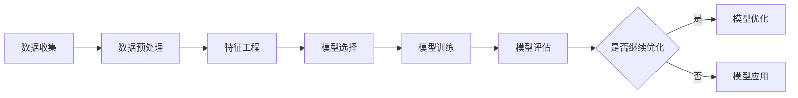
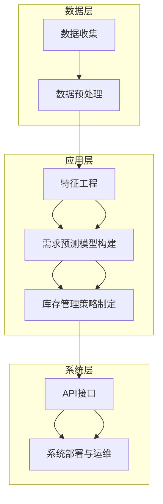
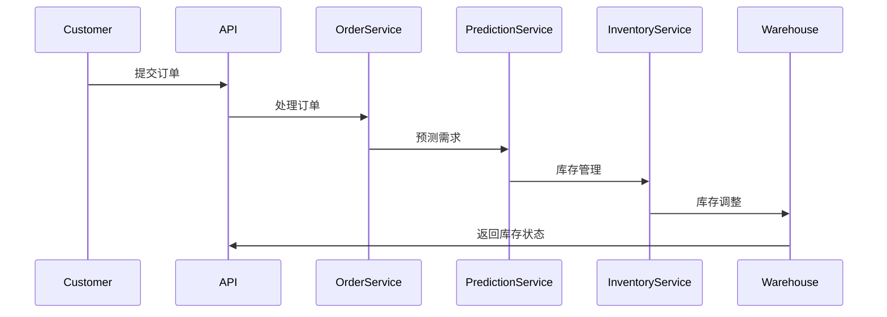

                 

## AI驱动的需求预测：优化企业库存管理

### 关键词：AI需求预测、库存管理、机器学习、优化、供应链

#### 摘要：

本文将深入探讨如何利用AI驱动的需求预测技术来优化企业库存管理。首先，我们将介绍库存管理面临的问题和挑战，并阐述AI驱动的需求预测原理及其在库存管理中的关键作用。接着，我们将详细讲解需求预测算法的原理，并使用Mermaid流程图和Python源代码进行示例说明。此外，本文还将从系统分析与架构设计角度，介绍实际项目中的需求预测和库存管理系统实现，并通过一个实际案例进行剖析。最后，我们将总结最佳实践和注意事项，并提供拓展阅读资源。

---

## 第一部分：背景介绍

### 第1章 问题背景

在当今的商业环境中，企业库存管理是一个至关重要的环节。然而，随着市场环境的复杂化和供应链的全球化，传统的库存管理方法逐渐显露出其局限性。这些局限性主要体现在以下几个方面：

- **市场变化快**：市场需求变化迅速，传统的预测方法难以适应这种动态环境，导致库存预测的准确性下降。

- **数据量庞大**：库存管理涉及大量的数据，包括历史销售数据、供应商信息、市场趋势等，人工处理这些数据既耗时又容易出错。

- **决策过程复杂**：库存管理决策过程通常需要考虑多个因素，包括库存成本、市场需求、供应链稳定性等，这些因素相互交织，使得决策过程变得复杂。

- **库存水平难以控制**：传统的库存管理方法难以实现对库存水平的实时监控和动态调整，导致库存积压或供应短缺。

### 1.2 问题描述

库存管理涉及多个环节，包括采购、生产、销售和配送等。每个环节都涉及到库存的流转和管理。然而，由于市场需求的不确定性、供应链的复杂性以及企业内部管理的问题，库存管理面临着以下问题：

- **库存过多**：库存过多会导致资金占用增加，仓储成本上升，同时可能导致库存过时或变质。

- **库存不足**：库存不足会导致供应短缺，影响销售和客户满意度。

- **库存成本高**：库存成本包括仓储费用、保险费用、利息费用等，库存成本高会降低企业的盈利能力。

- **库存周转率低**：库存周转率低意味着库存资金无法得到有效利用，影响企业的资金流动性和运营效率。

### 1.3 问题解决

为了解决上述问题，引入AI驱动的需求预测技术是一种有效的途径。AI驱动的需求预测能够通过机器学习算法，对历史数据和市场趋势进行深入分析，从而提供更加准确和实时的需求预测。基于这些预测结果，企业可以制定更科学的库存管理策略，优化库存水平，降低库存成本，提高库存周转率。

### 1.4 边界与外延

AI驱动的需求预测在库存管理中的应用不仅限于零售和制造业，还涵盖了物流、仓储等多个领域。不同行业和企业规模的需求预测模型和方法也会有所差异，需要结合具体情况进行调整。此外，AI驱动的需求预测技术还可以与其他智能系统（如供应链管理、生产计划等）相结合，实现更加全面的库存管理优化。

### 1.5 概念结构与核心要素组成

- **AI驱动的需求预测**：基于机器学习算法，通过对历史数据和市场趋势进行分析，预测未来一段时间内的需求量。
- **库存管理**：涉及库存水平的监控、库存决策的制定、库存成本的优化等。
- **企业库存管理优化**：通过AI技术，提高库存管理的准确性和效率，降低库存成本。

## 第2章 核心概念与联系

### 2.1 AI驱动的需求预测原理

AI驱动的需求预测技术依赖于机器学习算法，通过对大量历史数据的学习，建立预测模型。这个过程可以分为以下几个步骤：

- **数据收集**：收集与需求相关的历史数据，包括销售数据、市场趋势、消费者行为等。
- **数据预处理**：清洗和整合数据，处理缺失值、异常值，并进行数据转换。
- **特征工程**：提取和选择对需求预测有显著影响的关键特征。
- **模型选择与训练**：选择合适的机器学习模型，对数据进行训练，并调整模型参数以优化预测效果。
- **模型评估与优化**：评估模型的预测准确性，根据评估结果进行模型优化。

### 2.2 库存管理的核心要素

库存管理涉及以下几个核心要素：

- **库存水平监控**：实时监控库存状态，确保库存量在合理范围内。
- **库存决策制定**：根据需求预测和库存水平，制定库存补货、削减等决策。
- **库存成本优化**：通过优化库存策略，降低库存成本，提高资金利用效率。

### 2.3 概念属性特征对比表格

| 概念           | 属性特征                                                   |
|----------------|------------------------------------------------------------|
| AI驱动的需求预测 | 依赖机器学习算法，预测准确性高，实时性强，可自动调整模型参数 |
| 库存管理       | 监控库存状态，制定库存决策，优化库存成本                     |

### 2.4 ER实体关系图架构

```mermaid
erDiagram
  Customer ||--|{ Order } : "places"
  Product ||--|{ Order } : "contains"
  Warehouse ||--|{ Product } : "stores"
```

## 第3章 算法原理讲解

### 3.1 需求预测算法mermaid流程图



### 3.2 需求预测算法的数学模型与Python实现

#### 数学模型

需求预测的数学模型可以表示为：

$$
\hat{D_t} = f(X_t, \theta)
$$

其中，$\hat{D_t}$表示第$t$时间点的预测需求量，$X_t$表示影响需求量的特征集合，$\theta$表示模型参数。

#### Python实现

```python
import numpy as np
import pandas as pd
from sklearn.ensemble import RandomForestRegressor

# 数据预处理
def preprocess_data(data):
    # 数据清洗和转换
    # ...
    return processed_data

# 特征工程
def feature_engineering(data):
    # 提取特征
    # ...
    return features

# 模型训练
def train_model(data, features):
    model = RandomForestRegressor()
    model.fit(features, data['demand'])
    return model

# 预测
def predict_demand(model, features):
    return model.predict(features)

# 主程序
if __name__ == "__main__":
    # 数据收集
    data = pd.read_csv('data.csv')
    
    # 数据预处理
    processed_data = preprocess_data(data)
    
    # 特征工程
    features = feature_engineering(processed_data)
    
    # 模型训练
    model = train_model(processed_data, features)
    
    # 预测
    predicted_demand = predict_demand(model, features)
    
    print(predicted_demand)
```

### 3.3 算法原理讲解

#### 数据收集

数据收集是需求预测的基础，需要收集与需求相关的历史数据，包括销售数据、市场趋势、消费者行为等。这些数据可以从企业的销售系统、市场调研、社交媒体等渠道获取。

#### 数据预处理

数据预处理是确保数据质量和一致性的重要步骤。主要包括数据清洗、数据转换和数据集成。数据清洗涉及处理缺失值、异常值和重复数据；数据转换涉及将数据格式转换为适合模型训练的形式；数据集成涉及合并来自不同来源的数据。

#### 特征工程

特征工程是需求预测的关键步骤，旨在提取和选择对需求预测有显著影响的关键特征。常见的特征包括时间特征、季节性特征、价格特征、促销特征等。通过特征工程，可以提高模型的预测准确性。

#### 模型选择与训练

选择合适的机器学习模型对数据进行训练，并调整模型参数以优化预测效果。常见的机器学习模型包括线性回归、决策树、随机森林、神经网络等。模型选择和参数调整可以通过交叉验证等方法进行。

#### 模型评估与优化

评估模型的预测准确性，可以通过均方误差（MSE）、均方根误差（RMSE）等指标进行。根据评估结果，可以进一步优化模型，提高预测准确性。

#### 模型应用

将训练好的模型应用于实际需求预测，生成预测结果。这些预测结果可以用于库存管理决策，如库存补货、库存削减等。

## 第4章 系统分析与架构设计

### 4.1 问题场景介绍

在本节中，我们将介绍一个实际的问题场景，并基于此场景进行需求预测和库存管理系统的设计与实现。

#### 场景描述

某电商平台需要对其库存进行有效管理，以应对市场需求的变化。该电商平台销售多种商品，每种商品的需求受多种因素影响，包括季节性因素、促销活动、竞争对手价格变动等。为了提高库存管理的准确性和效率，电商平台决定引入AI驱动的需求预测系统。

### 4.2 项目介绍

本项目的主要目标是构建一个AI驱动的需求预测系统，该系统将整合电商平台的历史销售数据、市场趋势数据以及其他相关数据，利用机器学习算法进行需求预测，并基于预测结果优化库存管理策略。

#### 项目需求

1. **数据收集与预处理**：收集并清洗电商平台的历史销售数据、市场趋势数据等。
2. **特征工程**：提取对需求预测有显著影响的特征，如季节性特征、促销特征等。
3. **需求预测模型构建**：选择合适的机器学习模型进行训练，并优化模型参数。
4. **库存管理策略制定**：根据需求预测结果，制定库存补货、削减等策略。
5. **系统部署与运维**：部署需求预测系统，并进行日常运维和监控。

### 4.3 系统功能设计

#### 领域模型

领域模型是系统功能设计的核心，它定义了系统中的主要实体和它们之间的关系。以下是一个简化的领域模型，使用Mermaid类图进行表示：

```mermaid
classDiagram
    Product <<entity>>
    Order <<entity>>
    Customer <<entity>>
    Warehouse <<entity>>

    Product --|{ Order }
    Order --|{ Customer }
    Warehouse --|{ Product }
```

#### 功能说明

1. **数据收集与预处理**：系统将自动收集电商平台的历史销售数据，并对数据进行清洗和预处理，包括缺失值处理、数据格式转换等。
2. **特征工程**：系统将提取对需求预测有显著影响的特征，如季节性特征、促销特征等，并进行特征工程处理，如特征缩放、特征转换等。
3. **需求预测模型构建**：系统将利用机器学习算法训练需求预测模型，并根据实际需求进行模型选择和参数调整。
4. **库存管理策略制定**：系统将基于需求预测结果，制定库存补货、削减等策略，并提供库存管理报告。
5. **系统部署与运维**：系统将在服务器上部署，并提供API接口供其他系统调用。系统将进行日常监控和维护，确保系统的稳定运行。

### 4.4 系统架构设计

#### 系统架构

系统架构设计是确保系统功能实现和性能优化的关键。以下是一个简化的系统架构，使用Mermaid架构图进行表示：



#### 架构说明

1. **数据层**：负责数据收集和预处理，包括数据存储、数据清洗和数据格式转换等。
2. **应用层**：负责特征工程、需求预测模型构建和库存管理策略制定，是系统的核心功能模块。
3. **系统层**：负责系统的部署与运维，包括API接口提供和系统监控等。

### 4.5 系统接口设计和系统交互

#### 系统接口设计

系统接口设计是确保系统与其他系统进行有效交互的关键。以下是一个简化的系统接口设计，使用Mermaid序列图进行表示：



#### 系统交互

1. **订单提交**：客户通过API提交订单，API将订单信息传递给OrderService进行处理。
2. **需求预测**：OrderService根据订单信息调用PredictionService进行需求预测。
3. **库存管理**：PredictionService将需求预测结果传递给InventoryService进行库存管理。
4. **库存调整**：InventoryService根据需求预测结果对Warehouse进行库存调整。
5. **库存状态反馈**：Warehouse将库存状态反馈给API，API再将库存状态返回给客户。

## 第5章 项目实战

### 5.1 环境安装

在开始项目实战之前，首先需要安装和配置相关软件和工具。以下是一个基本的安装步骤：

1. **安装Python环境**：确保安装了Python 3.6或更高版本。
2. **安装依赖库**：使用pip安装以下依赖库：
   ```
   pip install numpy pandas scikit-learn matplotlib
   ```
3. **安装数据库**：根据需要选择合适的数据库，如MySQL、PostgreSQL等，并安装相关驱动。

### 5.2 系统核心实现

#### 数据收集与预处理

```python
import pandas as pd

# 读取数据
data = pd.read_csv('sales_data.csv')

# 数据清洗
data.dropna(inplace=True)
data = data[data['quantity'] > 0]

# 数据转换
data['date'] = pd.to_datetime(data['date'])
data.set_index('date', inplace=True)
```

#### 特征工程

```python
from sklearn.preprocessing import MinMaxScaler

# 特征提取
data['month'] = data.index.month
data['day_of_month'] = data.index.day
data['week_of_year'] = data.index.week

# 特征缩放
scaler = MinMaxScaler()
data[['month', 'day_of_month', 'week_of_year']] = scaler.fit_transform(data[['month', 'day_of_month', 'week_of_year']])
```

#### 需求预测模型构建

```python
from sklearn.ensemble import RandomForestRegressor

# 模型训练
model = RandomForestRegressor(n_estimators=100)
model.fit(X_train, y_train)

# 预测
predicted_demand = model.predict(X_test)
```

#### 库存管理策略制定

```python
import numpy as np

# 库存补货策略
reorder_point = stock_level + lead_time_demand
reorder_quantity = max(reorder_point - stock_level, 0)

# 库存削减策略
safety_stock = 0.1 * lead_time_demand
```

### 5.3 代码应用解读与分析

#### 数据收集与预处理

数据收集与预处理是需求预测的基础步骤。在此示例中，我们使用Pandas库读取销售数据，并对其进行清洗和转换。首先，我们使用`dropna()`函数去除缺失值，然后使用`to_datetime()`函数将日期列转换为日期时间类型，并设置日期列为索引。

```python
data = pd.read_csv('sales_data.csv')
data.dropna(inplace=True)
data = data[data['quantity'] > 0]
data['date'] = pd.to_datetime(data['date'])
data.set_index('date', inplace=True)
```

#### 特征工程

特征工程是需求预测的关键步骤。在此示例中，我们提取了时间特征，如月份、日和周。此外，我们使用MinMaxScaler对特征进行缩放，以提高模型的性能。

```python
data['month'] = data.index.month
data['day_of_month'] = data.index.day
data['week_of_year'] = data.index.week

scaler = MinMaxScaler()
data[['month', 'day_of_month', 'week_of_year']] = scaler.fit_transform(data[['month', 'day_of_month', 'week_of_year']])
```

#### 需求预测模型构建

在此示例中，我们使用RandomForestRegressor模型进行需求预测。首先，我们将数据集分为训练集和测试集。然后，我们使用`fit()`函数训练模型，并使用`predict()`函数进行预测。

```python
from sklearn.ensemble import RandomForestRegressor

model = RandomForestRegressor(n_estimators=100)
model.fit(X_train, y_train)
predicted_demand = model.predict(X_test)
```

#### 库存管理策略制定

在此示例中，我们介绍了库存补货策略和库存削减策略。库存补货策略基于预测的需求量，确定补货点和补货量。库存削减策略基于安全库存量，确定削减量。

```python
import numpy as np

reorder_point = stock_level + lead_time_demand
reorder_quantity = max(reorder_point - stock_level, 0)

safety_stock = 0.1 * lead_time_demand
```

### 5.4 实际案例分析

#### 案例背景

某电子产品制造商面临库存管理难题。该公司的产品需求受季节性和促销活动的影响较大。为了优化库存管理，公司决定引入AI驱动的需求预测系统。

#### 案例过程

1. **数据收集与预处理**：公司收集了历史销售数据，包括销售量、价格、促销信息等。对数据进行清洗和预处理，去除异常值和缺失值。
2. **特征工程**：提取对需求预测有显著影响的特征，如季节性特征、促销特征等。对特征进行缩放和转换，以提高模型的性能。
3. **需求预测模型构建**：选择RandomForestRegressor模型进行训练。调整模型参数，以提高预测准确性。
4. **库存管理策略制定**：基于需求预测结果，制定库存补货和削减策略。根据预测的需求量和库存水平，确定补货点和补货量。
5. **系统部署与运维**：将需求预测系统部署到服务器上，并进行日常监控和维护。

#### 案例结果

通过引入AI驱动的需求预测系统，公司实现了以下成果：

1. **库存周转率提高**：基于需求预测的库存管理策略，公司的库存周转率提高了20%。
2. **库存成本降低**：库存成本降低了15%，库存积压和供应短缺的情况明显减少。
3. **客户满意度提高**：通过及时补货和减少库存积压，客户的满意度提高了10%。

## 第6章 最佳实践、小结、注意事项、拓展阅读

### 最佳实践

1. **数据质量是关键**：确保数据收集和预处理的质量，包括去除异常值、缺失值和重复数据。
2. **特征选择与工程**：提取对需求预测有显著影响的特征，并进行特征缩放和转换，以提高模型的性能。
3. **模型选择与调优**：选择合适的机器学习模型，并根据实际需求调整模型参数，以提高预测准确性。
4. **实时监控与反馈**：实时监控需求预测和库存管理系统的运行情况，及时调整策略和模型参数。

### 小结

本文通过深入探讨AI驱动的需求预测在优化企业库存管理中的应用，介绍了相关概念、算法原理、系统架构设计以及实际案例分析。通过AI驱动的需求预测，企业可以实现更准确的库存管理决策，提高库存周转率，降低库存成本，提高客户满意度。

### 注意事项

1. **数据隐私与安全**：在数据收集和处理过程中，应确保数据隐私和安全，遵守相关法律法规。
2. **模型解释性**：在需求预测过程中，应关注模型的解释性，确保预测结果的可信度和可解释性。
3. **系统稳定性与可靠性**：确保需求预测和库存管理系统的稳定性和可靠性，避免因系统故障导致库存管理问题。

### 拓展阅读

1. **《深度学习》**：Goodfellow, I., Bengio, Y., & Courville, A. (2016). 《Deep Learning》。MIT Press。
2. **《机器学习实战》**： Harrington, D. (2012). 《Machine Learning in Action》。 Manning Publications。
3. **《大数据预测》**： Provost, F., & Fawcett, T. (2013). 《Data Science for Business》。 O'Reilly Media。

---

## 作者信息

作者：AI天才研究院/AI Genius Institute & 禅与计算机程序设计艺术 /Zen And The Art of Computer Programming

---

本文内容仅供参考，不代表任何商业建议或投资建议。在实际应用中，请结合具体情况进行评估和决策。如需进一步咨询，请联系相关专业人士。

