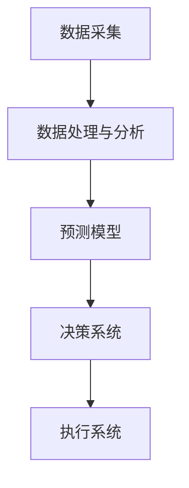
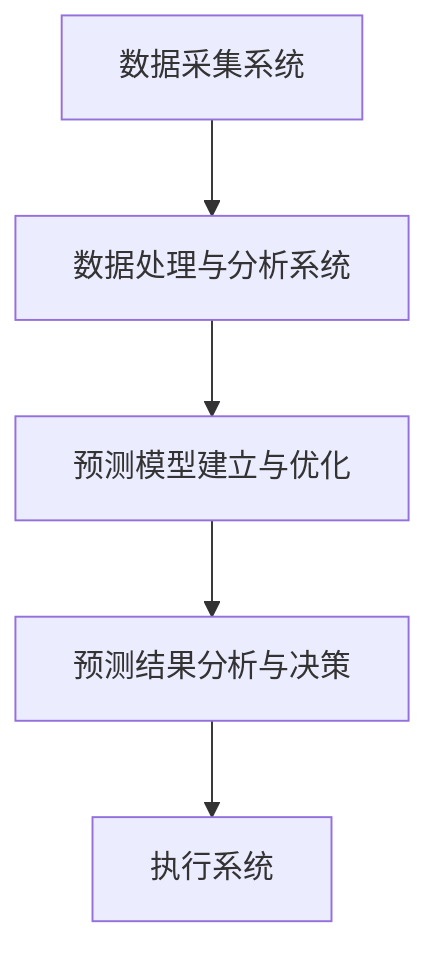

                 

### 引言与背景

#### 问题背景

随着工业4.0的兴起，智能制造成为未来工业发展的核心驱动力。预测性维护作为智能制造的重要组成部分，通过利用大数据、人工智能等技术手段，实现了对设备运行状态的实时监控和预测性维护，从而大大降低了设备故障率，提高了生产效率和产品质量。

#### 人工智能在工业领域的应用现状与趋势

人工智能在工业领域的应用正日趋成熟，从早期的简单数据分析到如今复杂的预测性维护，AI技术在工业4.0中的应用范围不断扩大。目前，AI在工业领域的应用主要集中在以下几个方面：设备故障预测、生产流程优化、供应链管理、产品个性化定制等。未来，随着人工智能技术的不断进步，其将在工业领域发挥更大的作用。

#### 预测性维护与人工智能的结合

预测性维护与人工智能的结合，是工业4.0背景下的一种创新性应用。通过将AI技术应用于预测性维护，可以实现设备状态的实时监控和预测，提前发现潜在故障，从而采取预防性措施，避免设备故障导致的停机时间和生产损失。具体来说，AI驱动的预测性维护包括以下几个关键步骤：

1. **数据采集与处理**：通过传感器和数据采集系统，获取设备运行过程中的各种数据，如温度、压力、振动等。
2. **特征提取与建模**：利用机器学习算法，对采集到的数据进行处理，提取出与设备故障相关的关键特征，建立预测模型。
3. **模型训练与优化**：通过大量的历史数据对预测模型进行训练，不断优化模型，提高预测精度。
4. **预测与决策**：根据训练好的模型，对设备未来的运行状态进行预测，并依据预测结果做出维护决策。

#### 传统维护方式的局限性与挑战

传统的维护方式主要依赖于定期检查和事后维修，这种方式存在以下局限性和挑战：

1. **被动性**：只能在设备出现故障后进行维修，无法提前预测和预防故障。
2. **效率低下**：定期检查需要耗费大量人力和时间，且难以覆盖所有设备。
3. **成本高**：由于无法提前预测故障，往往会导致不必要的维修和停机时间，增加生产成本。

#### AI驱动的预测性维护如何解决这些问题

AI驱动的预测性维护通过实时监控设备状态和预测故障，能够有效解决传统维护方式的局限性和挑战：

1. **主动性**：通过实时监控和预测，可以提前发现潜在故障，采取预防性措施，避免设备故障导致的停机时间。
2. **高效性**：利用大数据和人工智能技术，可以自动化处理海量数据，提高维护效率，减少人力和时间成本。
3. **经济性**：通过降低设备故障率和提高生产效率，可以显著降低维护成本，提高企业的经济效益。

综上所述，AI驱动的预测性维护不仅是工业4.0的核心技术之一，也是未来工业发展的重要趋势。通过将人工智能技术应用于预测性维护，可以有效提高设备可靠性、生产效率和产品质量，推动工业智能化和自动化的发展。

### 问题描述

#### 预测性维护的基本概念与原理

预测性维护（Predictive Maintenance）是一种基于设备实时监控和数据分析的维护方式，通过监测设备运行状态，预测潜在故障并采取预防性措施，以避免设备故障导致的停机时间和经济损失。预测性维护的核心在于“预测”，即利用大数据和人工智能技术，对设备运行数据进行深度分析，提前发现潜在故障。

#### 预测性维护与传统维护方式的区别

传统维护方式主要依赖于定期检查和事后维修，而预测性维护则强调实时监控和预测。具体区别如下：

1. **主动性**：预测性维护能够提前预测故障，采取预防性措施，而传统维护方式只能在设备出现故障后进行维修。
2. **效率**：预测性维护通过自动化数据处理和分析，提高维护效率，而传统维护方式需要大量人力和时间。
3. **成本**：预测性维护通过减少设备故障率和提高生产效率，降低维护成本，而传统维护方式由于无法提前预测故障，往往导致不必要的维修和停机时间。

#### 传统维护方式的局限性

传统维护方式存在以下局限性和挑战：

1. **被动性**：只能在设备出现故障后进行维修，无法提前预测和预防故障。
2. **效率低下**：定期检查需要耗费大量人力和时间，且难以覆盖所有设备。
3. **成本高**：由于无法提前预测故障，往往会导致不必要的维修和停机时间，增加生产成本。

#### AI驱动的预测性维护如何解决这些问题

AI驱动的预测性维护通过以下方式解决传统维护方式的局限性：

1. **实时监控**：利用传感器和物联网技术，实时采集设备运行数据，实现设备的全面监控。
2. **数据分析**：利用大数据和人工智能技术，对设备运行数据进行深度分析，提取故障特征。
3. **预测模型**：通过机器学习算法，建立预测模型，提前预测设备故障。
4. **预防措施**：根据预测结果，采取预防性维护措施，避免设备故障。

通过AI驱动的预测性维护，可以实现设备的实时监控和预测，提前发现潜在故障，从而避免设备故障导致的停机时间和经济损失。这种方式不仅提高了设备可靠性，还提高了生产效率和产品质量，是工业4.0背景下的一种创新性应用。

#### 预测性维护在不同工业领域的应用差异

预测性维护在不同工业领域的应用存在一定差异，主要受以下因素影响：

1. **设备类型**：不同类型的设备具有不同的运行特性和故障模式，预测性维护的方法和模型需要根据设备类型进行定制。
2. **数据可用性**：不同工业领域的数据采集和传输能力不同，数据的质量和完整性对预测性维护的效果有很大影响。
3. **行业需求**：不同工业领域对设备可靠性和生产效率的需求不同，预测性维护的应用方式和重点也会有所不同。

例如，在制造业中，预测性维护主要关注设备故障预测和生产流程优化；在能源行业，预测性维护则更多关注设备运行效率和能耗管理；在医疗行业，预测性维护则侧重于设备维护和患者安全。

#### 预测性维护的可持续性与环保性

预测性维护不仅具有经济效益，还具有显著的可持续性和环保性：

1. **降低能耗**：通过优化设备运行状态，降低能耗，减少碳排放。
2. **减少废弃物**：通过预防性维护，减少设备故障和更换频率，减少废弃物产生。
3. **延长设备寿命**：通过及时维护，延长设备使用寿命，降低设备更新成本。

#### 预测性维护与智能制造的融合

预测性维护与智能制造（Smart Manufacturing）的融合，是工业4.0背景下的一种重要趋势。智能制造通过集成物联网、大数据、人工智能等技术，实现制造过程的智能化和自动化。预测性维护作为智能制造的核心技术之一，与智能制造的融合主要体现在以下几个方面：

1. **设备互联**：通过物联网技术，实现设备间的互联互通，为预测性维护提供数据支持。
2. **数据分析**：利用大数据技术，对设备运行数据进行分析和处理，为预测性维护提供决策依据。
3. **智能决策**：通过人工智能技术，实现设备的智能监控和故障预测，为生产过程提供智能化的维护策略。

通过预测性维护与智能制造的融合，可以实现制造过程的全面智能化和自动化，提高生产效率和产品质量，降低生产成本，推动工业4.0的发展。

### 概念结构与核心要素组成

预测性维护的基本架构由以下几个核心要素组成：

1. **数据采集系统**：通过传感器和物联网技术，实时采集设备运行数据，如温度、压力、振动等。
2. **数据处理与分析系统**：对采集到的数据进行分析和处理，提取与设备故障相关的关键特征。
3. **预测模型**：利用机器学习算法，建立预测模型，对设备未来的运行状态进行预测。
4. **决策系统**：根据预测结果，制定维护策略，如预防性维护、紧急维修等。
5. **执行系统**：执行维护决策，如启动设备维护、调整生产计划等。

下面是一个简化的预测性维护架构图，使用Mermaid流程图表示：

#### 数据采集与处理

数据采集与处理是预测性维护的基础。通过传感器和物联网技术，可以实时采集设备运行数据，如温度、压力、振动等。这些数据需要经过预处理，包括数据清洗、去噪、归一化等步骤，以便于后续的分析和处理。

#### 预测模型建立与优化

预测模型是预测性维护的核心。通过机器学习算法，可以从历史数据中学习设备故障模式，建立预测模型。常见的机器学习算法包括朴素贝叶斯、决策树、支持向量机等。模型建立后，需要通过不断优化，提高预测精度。

#### 预测结果分析与决策

根据预测结果，需要进行分析和决策。如果预测到设备存在潜在故障，需要制定维护策略，如预防性维护或紧急维修。决策系统可以根据预测结果和历史维护数据，自动生成维护计划。

#### 预测性维护的基本架构图

下面是一个使用Mermaid绘制的预测性维护基本架构图：

### 本章小结

本章首先介绍了预测性维护的基本概念、原理和重要性，然后分析了传统维护方式的局限性和挑战，以及AI驱动的预测性维护如何解决这些问题。接着，讨论了预测性维护在不同工业领域的应用差异、可持续性与环保性，以及与智能制造的融合。最后，详细阐述了预测性维护的基本架构，包括数据采集与处理、预测模型建立与优化、预测结果分析与决策、执行系统等核心要素。通过本章的介绍，读者可以初步了解预测性维护的核心概念和架构，为后续章节的深入学习打下基础。

## 第2章: AI驱动的预测性维护

### 2.1 AI驱动的预测性维护概述

AI驱动的预测性维护是一种利用人工智能技术，对设备运行状态进行实时监控和预测性维护的方法。随着工业4.0的推进，人工智能技术在预测性维护中的应用越来越广泛，其核心在于通过数据驱动的方式，实现对设备故障的提前预警和优化维护。

#### AI技术在预测性维护中的角色

1. **数据挖掘与分析**：AI技术可以挖掘海量设备数据中的潜在模式，从而发现故障前兆。
2. **故障预测与决策**：通过机器学习算法，AI能够根据历史数据和实时监控数据，预测设备可能的故障点。
3. **优化维护策略**：AI技术可以帮助优化维护计划，提高维护效率，降低维护成本。

#### 预测性维护的AI驱动力

1. **实时监测与预警**：AI驱动的预测性维护能够实时监测设备状态，并在故障发生前发出预警，避免设备停机。
2. **自我优化**：通过不断学习和优化，AI驱动的预测性维护系统能够提高预测精度和决策效率。
3. **资源优化**：AI技术能够优化维护资源的配置，降低维护成本。

#### AI驱动的预测性维护优势

1. **提高设备利用率**：通过预测性维护，可以减少设备故障率，提高设备利用率。
2. **降低维护成本**：预测性维护可以提前发现潜在故障，避免不必要的大修和停机时间，降低维护成本。
3. **提高生产效率**：预测性维护可以优化生产计划，避免因设备故障导致的生产中断。

### 2.2 人工智能核心概念

要深入理解AI驱动的预测性维护，我们需要先了解人工智能的核心概念。

#### 机器学习基础

1. **监督学习**：通过标注数据训练模型，用于对新数据进行预测。
   - **分类问题**：如垃圾邮件分类、图像分类等。
   - **回归问题**：如房价预测、股票价格预测等。

2. **无监督学习**：不使用标注数据，通过发现数据中的内在结构进行学习。
   - **聚类**：如客户分群、异常检测等。
   - **降维**：如主成分分析（PCA）、t-SNE等。

#### 深度学习原理

1. **神经网络**：由大量神经元组成的计算模型，能够模拟人类大脑的决策过程。
2. **深度神经网络**：由多层神经网络组成的模型，能够处理更复杂的数据和任务。
3. **卷积神经网络（CNN）**：适用于图像处理任务，能够自动提取图像特征。
4. **循环神经网络（RNN）**：适用于序列数据处理任务，能够记忆和处理序列信息。
5. **长短期记忆网络（LSTM）**：RNN的一种变体，能够更好地处理长序列数据。

#### 强化学习应用

1. **基本原理**：通过与环境互动，不断调整策略，以最大化累积奖励。
2. **应用场景**：如自动驾驶、机器人控制等。

### 2.3 预测性维护的核心原理

预测性维护的核心在于利用AI技术对设备运行状态进行预测，从而实现主动维护。以下是预测性维护的核心原理：

#### 数据驱动的预测性维护

1. **数据采集**：通过传感器和物联网设备，采集设备运行数据，如温度、压力、振动等。
2. **数据预处理**：对采集到的数据进行清洗、去噪、归一化等处理，以消除噪声和提高数据质量。
3. **特征提取**：从预处理后的数据中提取与设备故障相关的关键特征，如频率分布、异常值等。

#### 预测模型的选择与优化

1. **模型选择**：根据预测目标和数据特点，选择合适的机器学习算法和模型，如朴素贝叶斯、决策树、支持向量机、深度学习等。
2. **模型训练**：利用历史数据训练预测模型，通过调整参数和优化算法，提高预测精度。
3. **模型评估**：通过交叉验证、ROC曲线、精确率等指标，评估模型的性能和可靠性。

#### 预测结果的解释与可视化

1. **结果解释**：对预测结果进行解读，识别设备可能的故障点，为维护决策提供依据。
2. **可视化**：利用图表和可视化工具，展示设备运行状态和预测结果，帮助用户更好地理解和维护策略。

### 2.4 人工智能与预测性维护的联系

人工智能与预测性维护有着紧密的联系，二者相互促进，共同发展。以下是人工智能技术在预测性维护中的应用案例和协同效应：

#### 人工智能技术在预测性维护中的应用案例

1. **设备故障预测**：利用深度学习算法，对设备运行数据进行实时分析，预测可能的故障点，如电力系统中的变压器故障预测。
2. **生产流程优化**：通过机器学习算法，优化生产流程，减少浪费，提高生产效率，如化工行业的连续生产优化。
3. **供应链管理**：利用AI技术，预测供应链中可能出现的供应中断和库存短缺，提高供应链的稳定性和灵活性。

#### 预测性维护与人工智能的协同效应

1. **数据闭环**：预测性维护产生的数据可以反馈到AI系统中，用于模型的优化和算法的改进。
2. **智能化决策**：AI技术可以帮助预测性维护系统做出更加智能的决策，提高维护效率和效果。
3. **故障预测精度**：通过不断的模型训练和优化，AI驱动的预测性维护系统能够提高故障预测的精度，减少误报和漏报。

#### 人工智能技术在预测性维护中的未来发展

1. **模型自主优化**：未来的AI系统将能够自主调整和优化模型，提高预测性能和适应性。
2. **多模态数据融合**：利用多源数据，如图像、声音、文本等，实现更全面的故障预测。
3. **边缘计算**：在边缘设备上进行实时数据处理和预测，减少数据传输延迟，提高系统响应速度。
4. **跨领域应用**：将预测性维护技术应用于更多领域，如医疗、交通等，实现更广泛的应用。

### 2.5 本章小结

本章介绍了AI驱动的预测性维护的核心概念、原理及其在工业领域的重要应用。首先，我们探讨了AI驱动的预测性维护的基本概念和优势，接着介绍了人工智能的核心概念，包括机器学习、深度学习和强化学习。然后，详细阐述了预测性维护的核心原理，包括数据驱动的预测性维护、预测模型的选择与优化，以及预测结果的解释与可视化。此外，我们通过案例展示了人工智能技术在预测性维护中的应用，并探讨了预测性维护与人工智能的协同效应及其未来发展。通过本章的学习，读者可以全面了解AI驱动的预测性维护的基本概念和应用，为后续章节的深入学习打下坚实基础。

## 第3章: 预测性维护算法

### 3.1 预测性维护算法概述

预测性维护算法是AI驱动的预测性维护系统中的核心组成部分。它们通过分析设备运行数据，预测潜在的故障，并提供维护决策。理解这些算法的基本类型、选择标准和发展趋势，对于构建高效、可靠的预测性维护系统至关重要。

#### 预测性维护算法的基本类型

1. **统计算法**：这类算法主要基于统计学原理，通过分析历史数据，预测未来趋势。常见的统计算法包括：
   - **均值回归**：基于数据平均值进行预测。
   - **线性回归**：通过拟合一条直线，预测未来的数值。
   - **时间序列分析**：通过分析时间序列数据，预测未来的趋势。

2. **机器学习算法**：这类算法通过学习历史数据，建立预测模型。常见的机器学习算法包括：
   - **分类算法**：如决策树、随机森林、支持向量机等，用于预测故障的类型。
   - **回归算法**：如线性回归、岭回归、LASSO回归等，用于预测故障发生的时间。
   - **聚类算法**：如K-means、层次聚类等，用于识别设备的健康状态。

3. **深度学习算法**：这类算法通过多层神经网络，自动提取特征，实现高精度的预测。常见的深度学习算法包括：
   - **卷积神经网络（CNN）**：主要用于图像处理和模式识别。
   - **递归神经网络（RNN）**：主要用于处理序列数据。
   - **长短期记忆网络（LSTM）**：RNN的一种变体，适用于长时间序列数据的预测。

#### 预测性维护算法的选择标准

选择适合的预测性维护算法，需要考虑以下几个标准：

1. **数据量与质量**：算法的性能很大程度上取决于数据量的大小和数据质量的好坏。如果数据量较小或质量较差，可能需要选择更稳健的算法。

2. **预测目标**：不同的算法适合处理不同的预测目标。例如，对于分类问题，可以选择分类算法；对于回归问题，可以选择回归算法。

3. **计算资源**：某些算法，尤其是深度学习算法，需要大量的计算资源。在选择算法时，需要考虑系统的计算能力和预算。

4. **可解释性**：一些算法，如深度学习算法，模型较为复杂，难以解释。如果需要解释模型决策过程，可以选择更可解释的算法，如统计算法。

#### 预测性维护算法的发展趋势

随着人工智能技术的快速发展，预测性维护算法也在不断演进。以下是一些值得关注的发展趋势：

1. **算法融合**：通过结合多种算法的优点，实现更精准的预测。例如，将统计方法和机器学习方法相结合，可以提高预测的准确性和可靠性。

2. **实时性**：随着边缘计算技术的发展，更多的算法将被设计为在边缘设备上运行，实现实时预测和决策。

3. **多模态数据融合**：将不同类型的数据（如图像、声音、文本等）进行融合，以提高预测的全面性和准确性。

4. **自适应学习**：未来的预测性维护系统将能够根据设备的运行状态和故障模式，自动调整和优化模型，实现自适应学习。

### 3.2 主流预测性维护算法

在预测性维护领域，有一些主流的算法被广泛应用。以下将介绍几种常用的算法，并比较它们的特点。

#### 朴素贝叶斯算法

1. **基本原理**：朴素贝叶斯算法是一种基于贝叶斯定理的简单概率分类器。它假设特征之间相互独立，通过计算每个特征的联合概率，预测故障的类型。
2. **优点**：
   - 算法简单，易于实现。
   - 对小样本数据有较好的适应性。
   - 预测速度快。
3. **缺点**：
   - 假设特征相互独立，可能不适用于所有情况。
   - 预测精度较低，特别是当特征之间存在强关联时。

#### 决策树算法

1. **基本原理**：决策树通过一系列的判断规则，将数据集划分为不同的子集，每个子集对应一个故障类型。决策树的每个节点代表一个特征，每个分支代表特征的取值。
2. **优点**：
   - 预测结果易于解释。
   - 可以处理不同类型的数据（分类或回归）。
   - 对新数据的适应性较强。
3. **缺点**：
   - 容易过拟合，特别是在数据量较小的情况下。
   - 预测速度较慢，特别是在树结构较复杂时。

#### 支持向量机算法

1. **基本原理**：支持向量机通过找到一个最佳的超平面，将不同故障类型的样本分隔开来。它通过最大化分类边界的间隔，提高模型的泛化能力。
2. **优点**：
   - 预测精度较高。
   - 对线性可分的数据效果显著。
   - 可以处理非线性数据，通过核函数转换。
3. **缺点**：
   - 计算复杂度高，特别是对于高维数据。
   - 对噪声和异常值敏感。

#### 卷积神经网络（CNN）

1. **基本原理**：卷积神经网络通过卷积层提取图像特征，逐层构建复杂的特征表示。它特别适用于图像处理和模式识别任务。
2. **优点**：
   - 自动提取特征，减少人工特征工程的工作量。
   - 对复杂非线性数据的处理能力较强。
   - 预测精度高。
3. **缺点**：
   - 计算资源消耗大。
   - 模型复杂，难以解释。

#### 递归神经网络（RNN）

1. **基本原理**：递归神经网络通过记忆前文信息，处理序列数据。它适用于时间序列预测和自然语言处理等任务。
2. **优点**：
   - 对序列数据有较好的处理能力。
   - 可以记忆长时间依赖信息。
   - 适用于复杂的时间序列预测。
3. **缺点**：
   - 可能出现梯度消失或梯度爆炸问题。
   - 计算资源消耗大。

#### 长短期记忆网络（LSTM）

1. **基本原理**：长短期记忆网络是RNN的一种改进，通过引入门机制，解决了梯度消失问题。它特别适用于长时间依赖的信息处理。
2. **优点**：
   - 适用于长时间序列预测。
   - 可以记忆长时间依赖信息。
   - 预测精度高。
3. **缺点**：
   - 计算资源消耗大。
   - 模型复杂，难以解释。

#### 强化学习算法

1. **基本原理**：强化学习通过不断尝试和反馈，学习最佳策略，以最大化累积奖励。它适用于动态环境中的决策问题。
2. **优点**：
   - 可以处理复杂的动态环境。
   - 能够自动调整策略，提高决策质量。
   - 适用于自动驾驶、机器人控制等任务。
3. **缺点**：
   - 需要大量的数据和时间进行训练。
   - 模型复杂，难以解释。

### 3.3 深度学习在预测性维护中的应用

深度学习在预测性维护中的应用越来越广泛，其强大的特征提取和模式识别能力，使其成为解决复杂预测问题的重要工具。以下将介绍几种常见的深度学习算法在预测性维护中的应用。

#### 卷积神经网络（CNN）

卷积神经网络通过卷积层提取图像特征，广泛应用于图像处理和模式识别任务。在预测性维护中，CNN可以用于故障图像的分类和识别。

1. **基本原理**：CNN通过多层卷积和池化操作，自动提取图像中的局部特征，并构建复杂的特征表示。它特别适用于图像分类和目标检测任务。
2. **应用场景**：
   - **图像分类**：通过CNN自动提取故障图像的特征，分类出不同的故障类型。
   - **目标检测**：识别图像中的故障目标，定位故障发生的具体位置。
3. **优势**：
   - 自动提取特征，减少人工特征工程的工作量。
   - 对复杂非线性数据的处理能力较强。
   - 预测精度高。
4. **挑战**：
   - 计算资源消耗大。
   - 模型复杂，难以解释。

#### 递归神经网络（RNN）

递归神经网络通过记忆前文信息，处理序列数据。在预测性维护中，RNN可以用于时间序列预测和状态监测。

1. **基本原理**：RNN通过递归连接，将前一个时间步的信息传递到下一个时间步，从而处理序列数据。它适用于时间序列预测和自然语言处理等任务。
2. **应用场景**：
   - **时间序列预测**：通过RNN模型，预测设备未来的故障时间点。
   - **状态监测**：通过RNN模型，实时监测设备的运行状态，识别异常行为。
3. **优势**：
   - 对序列数据有较好的处理能力。
   - 可以记忆长时间依赖信息。
   - 适用于复杂的时间序列预测。
4. **挑战**：
   - 可能出现梯度消失或梯度爆炸问题。
   - 计算资源消耗大。

#### 长短期记忆网络（LSTM）

长短期记忆网络是RNN的一种改进，通过引入门机制，解决了梯度消失问题。在预测性维护中，LSTM可以用于长时间序列预测和状态监测。

1. **基本原理**：LSTM通过门机制，控制信息的流入和流出，从而解决RNN的梯度消失问题。它特别适用于长时间依赖的信息处理。
2. **应用场景**：
   - **长时间序列预测**：通过LSTM模型，预测设备未来长时间的运行状态。
   - **状态监测**：通过LSTM模型，实时监测设备的长期运行状态，识别潜在故障。
3. **优势**：
   - 适用于长时间序列预测。
   - 可以记忆长时间依赖信息。
   - 预测精度高。
4. **挑战**：
   - 计算资源消耗大。
   - 模型复杂，难以解释。

#### 卷积神经网络（CNN）+ 递归神经网络（RNN）

结合CNN和RNN的优点，可以构建一种多层次的预测模型，用于预测性维护。在这种模型中，CNN用于提取图像特征，RNN用于处理时间序列数据。

1. **基本原理**：首先，使用CNN提取图像特征，然后，使用RNN模型处理时间序列数据，将图像特征和时间序列数据融合，生成最终的预测结果。
2. **应用场景**：
   - **多模态数据融合**：将图像和传感器数据融合，提高预测精度。
   - **复杂模式识别**：处理复杂的故障模式，提高故障识别能力。
3. **优势**：
   - 能够同时处理图像和序列数据。
   - 提高预测精度。
   - 适用于多模态数据融合的任务。
4. **挑战**：
   - 计算资源消耗大。
   - 模型复杂，难以解释。

### 3.4 强化学习在预测性维护中的应用

强化学习在预测性维护中的应用，主要集中在动态环境下的决策问题。通过不断尝试和反馈，强化学习可以学习到最佳维护策略。

#### 强化学习的基本原理

强化学习通过奖惩机制，驱动模型学习最佳策略。在预测性维护中，强化学习可以用于优化维护策略，提高维护效率。

1. **基本原理**：强化学习通过与环境互动，不断调整策略，以最大化累积奖励。它由以下几个部分组成：
   - **状态（State）**：设备当前的运行状态。
   - **动作（Action）**：维护操作，如预防性维护或紧急维修。
   - **奖励（Reward）**：根据维护效果，给予正奖励或负奖励。
   - **策略（Policy）**：根据当前状态，选择最佳动作的策略。
2. **应用场景**：
   - **动态环境下的维护决策**：在设备运行过程中，根据实时数据，调整维护策略。
   - **多步骤决策**：通过多步骤的维护决策，优化整个维护过程。

#### Q学习算法

Q学习算法是一种基于值函数的强化学习算法，通过学习状态-动作值函数，选择最佳动作。

1. **基本原理**：
   - **Q值**：表示在某个状态下，执行某个动作所能获得的累积奖励。
   - **更新公式**：$$ Q(s, a) \leftarrow Q(s, a) + \alpha [r + \gamma \max_{a'} Q(s', a') - Q(s, a)] $$
   - **参数**：
     - **α**：学习率，控制新旧经验的权重。
     - **γ**：折扣因子，控制未来奖励的权重。
2. **应用场景**：
   - **设备维护策略优化**：通过Q学习算法，优化设备维护策略，提高维护效率。
   - **能源管理**：通过Q学习算法，优化能源使用策略，降低能源消耗。

#### 策略梯度算法

策略梯度算法通过直接更新策略参数，优化维护策略。

1. **基本原理**：
   - **策略参数**：表示维护策略的参数向量。
   - **策略梯度**：表示策略参数的优化方向。
   - **更新公式**：$$ \theta \leftarrow \theta - \alpha \nabla_\theta J(\theta) $$
   - **参数**：
     - **α**：学习率，控制参数更新的步长。
     - **J(θ)**：策略损失函数，用于衡量策略的优劣。
2. **应用场景**：
   - **自适应维护策略**：通过策略梯度算法，实时调整维护策略，适应设备运行状态。
   - **复杂环境下的决策**：通过策略梯度算法，处理复杂环境下的多步骤决策问题。

### 3.5 预测性维护算法的优化方法

为了提高预测性维护算法的准确性和效率，需要不断优化算法。以下介绍几种常见的优化方法：

#### 超参数调优

超参数是影响算法性能的关键参数，通过调优超参数，可以显著提高算法的性能。常用的超参数调优方法包括：

1. **网格搜索**：在给定的参数空间内，遍历所有可能的参数组合，找到最佳参数组合。
2. **贝叶斯优化**：利用贝叶斯模型，通过探索-利用策略，高效地搜索最佳参数组合。
3. **随机搜索**：随机选择参数组合，通过多次实验，找到最佳参数组合。

#### 算法融合

算法融合通过结合多种算法的优点，实现更精准的预测。常见的算法融合方法包括：

1. **堆叠**：将多个算法的输出作为新的输入，训练一个更高层次的模型。
2. **集成**：将多个算法的输出进行加权平均或投票，得到最终的预测结果。
3. **对抗训练**：通过对抗训练，生成对抗样本，提高模型的泛化能力。

#### 算法评估与选择

为了选择合适的预测性维护算法，需要对不同算法进行评估和比较。常用的评估指标包括：

1. **准确率**：预测正确的样本数占总样本数的比例。
2. **召回率**：预测为正样本的样本数与实际正样本数的比例。
3. **F1值**：准确率的调和平均，用于评估分类模型的性能。
4. **均方误差（MSE）**：回归模型预测值与真实值之间的平均误差。

通过综合评估和比较，选择最适合的预测性维护算法，提高预测的准确性和效率。

### 3.6 本章小结

本章介绍了预测性维护算法的基本类型、选择标准和发展趋势。首先，我们探讨了预测性维护算法的基本类型，包括统计算法、机器学习算法和深度学习算法。接着，详细介绍了几种主流的预测性维护算法，如朴素贝叶斯、决策树、支持向量机、卷积神经网络、递归神经网络和长短期记忆网络。然后，介绍了深度学习在预测性维护中的应用，包括卷积神经网络、递归神经网络和长短期记忆网络。此外，还介绍了强化学习在预测性维护中的应用，包括Q学习算法和策略梯度算法。最后，介绍了预测性维护算法的优化方法，包括超参数调优、算法融合和算法评估与选择。通过本章的学习，读者可以全面了解预测性维护算法的基本概念和应用，为构建高效的预测性维护系统打下坚实基础。

## 第4章: AI驱动的预测性维护案例

### 4.1 案例介绍

为了更好地理解AI驱动的预测性维护在实际中的应用，我们将通过一个实际的工业案例来展示如何实施、实现和评估这种技术。本案例选择了一家大型制造企业，该企业拥有一条生产线，生产过程中涉及多种关键设备，如数控机床、加工中心等。这些设备在长时间运行过程中，容易出现机械故障，影响生产效率和产品质量。因此，企业希望通过AI驱动的预测性维护技术，实现设备状态的实时监控和故障预测，以减少设备故障率和生产中断。

#### 案例背景

该制造企业面临以下问题：

1. **设备故障频发**：由于设备老化、操作不当等原因，设备故障频繁，导致生产中断，影响生产效率和产品质量。
2. **维护成本高**：传统的定期维护方式效率低下，且无法提前预测故障，导致不必要的维修和停机时间，增加了维护成本。
3. **缺乏实时监控**：现有监控系统无法实现设备状态的实时监控和故障预测，无法及时采取预防性措施。

#### 案例目标

通过AI驱动的预测性维护系统，企业希望实现以下目标：

1. **实时监控设备状态**：通过传感器和物联网技术，实现对关键设备的实时数据采集，确保设备状态数据的实时性和完整性。
2. **故障预测**：利用机器学习算法，从设备运行数据中提取关键特征，建立故障预测模型，提前预测设备故障，避免设备停机。
3. **优化维护策略**：根据预测结果，制定科学合理的维护计划，减少不必要的维护和停机时间，降低维护成本。
4. **提高生产效率**：通过实时监控和故障预测，减少设备故障率和生产中断，提高生产效率和产品质量。

### 4.2 案例实施

#### 数据采集与预处理

1. **传感器安装**：在关键设备上安装传感器，如温度传感器、压力传感器、振动传感器等，实时采集设备运行数据。
2. **数据采集系统**：构建物联网平台，将传感器数据传输至数据中心，实现数据的实时采集和传输。
3. **数据预处理**：对采集到的数据进行分析和处理，包括数据清洗、去噪、归一化等步骤，以提高数据质量，为后续的模型训练提供可靠的数据基础。

#### 预测模型建立与优化

1. **数据分群**：将数据按照设备类型和运行状态进行分类，为不同类型的设备建立独立的预测模型。
2. **特征提取**：从预处理后的数据中提取关键特征，如温度变化率、振动频率等，用于构建预测模型。
3. **模型选择**：根据数据特征和预测目标，选择合适的机器学习算法，如朴素贝叶斯、决策树、支持向量机等，构建故障预测模型。
4. **模型训练**：利用历史数据对预测模型进行训练，不断调整模型参数，提高预测精度。
5. **模型优化**：通过交叉验证、网格搜索等方法，优化模型参数，提高模型泛化能力。

#### 预测结果分析与决策

1. **预测结果分析**：对模型预测结果进行分析，识别潜在的故障点和故障类型，为维护决策提供依据。
2. **预警机制**：建立预警机制，当预测到设备存在潜在故障时，自动发送预警信息，通知相关部门采取预防性措施。
3. **维护决策**：根据预测结果和预警信息，制定科学合理的维护计划，包括预防性维护和紧急维修，确保设备运行稳定。
4. **反馈机制**：将实际维护结果反馈至预测模型，不断优化模型，提高预测准确性和维护效率。

### 4.3 案例分析

#### 案例效果评估

1. **故障预测准确率**：通过对比预测结果和实际故障记录，评估故障预测模型的准确率，分析模型在故障预测方面的性能。
2. **维护效率**：通过对比预测性维护前后，设备故障率和维护成本的变化，评估预测性维护系统在提高维护效率和降低成本方面的效果。
3. **生产效率**：通过对比预测性维护前后，生产效率和产品质量的变化，评估预测性维护系统在提高生产效率和产品质量方面的效果。

#### 案例优势与不足

1. **优势**：
   - 提高故障预测准确率，减少设备故障率和生产中断。
   - 降低维护成本，优化维护资源分配。
   - 提高生产效率，提升产品质量。
   - 实现设备状态的实时监控，提高设备运行稳定性。

2. **不足**：
   - 需要大量的传感器和物联网设备，初期投入较大。
   - 数据预处理和特征提取过程复杂，需要专业的技术支持。
   - 预测模型的训练和优化需要大量计算资源，对硬件要求较高。
   - 模型对异常数据和噪声敏感，可能导致误报或漏报。

### 4.4 案例总结

通过本案例的实施和评估，我们可以得出以下结论：

1. **AI驱动的预测性维护在工业生产中具有显著的优势，可以有效提高设备运行稳定性、生产效率和产品质量。**
2. **虽然实施过程中存在一定的挑战，但随着技术的不断进步和优化，这些挑战将逐步得到解决。**
3. **未来，AI驱动的预测性维护将在工业4.0背景下发挥更加重要的作用，成为智能制造的重要组成部分。**

通过本案例的详细分析，我们不仅可以了解AI驱动的预测性维护的实施过程，还可以深入了解其效果和局限性，为其他企业实施类似项目提供参考和借鉴。

### 拓展与未来

#### 人工智能与工业4.0的融合

随着人工智能技术的快速发展，其在工业4.0中的应用越来越广泛。人工智能与工业4.0的融合主要体现在以下几个方面：

1. **设备智能化**：通过人工智能技术，实现设备的智能监控和故障预测，提高设备运行效率和可靠性。
2. **生产自动化**：利用人工智能技术，实现生产过程的自动化，提高生产效率和产品质量。
3. **供应链管理**：通过人工智能技术，优化供应链管理，提高供应链的稳定性和灵活性。
4. **质量管理**：利用人工智能技术，实现产品质量的智能检测和预测，提高产品质量。

#### 智能制造的未来方向

智能制造作为工业4.0的核心，其未来发展方向包括：

1. **工业物联网（IIoT）**：通过物联网技术，实现设备之间的互联互通，构建智能工厂。
2. **人工智能技术**：利用人工智能技术，实现设备状态的实时监控和预测性维护，提高生产效率和产品质量。
3. **数字孪生**：通过数字孪生技术，构建虚拟仿真模型，实现设备的虚拟调试和优化。
4. **自适应控制**：利用自适应控制技术，实现生产过程的自动调整和优化。

#### 预测性维护在工业4.0中的应用前景

预测性维护作为智能制造的重要组成部分，其在工业4.0中的应用前景十分广阔：

1. **设备故障预测**：通过实时监控和故障预测，提前发现设备潜在故障，避免设备停机和生产中断。
2. **优化维护计划**：根据预测结果，制定科学合理的维护计划，提高维护效率，降低维护成本。
3. **提高生产效率**：通过减少设备故障率和生产中断，提高生产效率和产品质量。
4. **延长设备寿命**：通过预防性维护，延长设备使用寿命，降低设备更新成本。

#### 新一代人工智能技术的发展趋势

新一代人工智能技术的发展趋势主要包括：

1. **深度学习**：随着计算能力的提升，深度学习技术将在更多领域得到应用，如自动驾驶、医疗诊断等。
2. **强化学习**：强化学习在动态环境下的决策能力较强，将在智能制造、智能交通等领域发挥重要作用。
3. **迁移学习**：通过迁移学习，实现知识复用，提高模型在不同场景下的适应能力。
4. **联邦学习**：通过联邦学习，实现数据的隐私保护和共享，推动人工智能技术的广泛应用。

#### 人工智能与物联网的深度融合

人工智能与物联网的深度融合，将推动智能设备的普及和应用：

1. **边缘计算**：通过边缘计算，实现设备数据的实时处理和智能分析，降低数据传输延迟。
2. **智能传感器**：利用智能传感器，实现设备的智能监控和故障预测，提高设备运行效率。
3. **智能网关**：通过智能网关，实现设备之间的互联互通，构建智能生态系统。

#### 人工智能与大数据的协同效应

人工智能与大数据的协同效应，将推动大数据技术在工业领域的广泛应用：

1. **数据挖掘**：通过数据挖掘，发现大数据中的潜在价值，为决策提供依据。
2. **智能分析**：通过智能分析，实现设备状态的实时监控和预测性维护。
3. **知识图谱**：通过知识图谱，构建设备运行数据的关联关系，提高数据处理和分析效率。

### 5.3 预测性维护的可持续发展

#### 预测性维护的环保性

预测性维护不仅具有经济效益，还具有显著的环保性：

1. **降低能耗**：通过优化设备运行状态，降低能耗，减少碳排放。
2. **减少废弃物**：通过预防性维护，减少设备故障和更换频率，减少废弃物产生。
3. **延长设备寿命**：通过及时维护，延长设备使用寿命，降低设备更新成本。

#### 预测性维护的经济性

预测性维护通过减少设备故障率和提高生产效率，可以显著降低维护成本，提高企业的经济效益：

1. **降低维护成本**：通过预测性维护，可以提前发现潜在故障，避免不必要的维修和停机时间，降低维护成本。
2. **提高生产效率**：通过减少设备故障率和生产中断，提高生产效率和产品质量，增加企业收益。
3. **优化维护资源**：通过预测性维护，可以优化维护资源的配置，提高维护效率。

#### 预测性维护的社会效益

预测性维护不仅对企业有经济效益，还对社会有积极的影响：

1. **提高设备运行安全性**：通过实时监控和故障预测，提高设备运行安全性，减少设备事故和人员伤害。
2. **促进产业升级**：通过预测性维护技术，推动传统制造业向智能制造转型，促进产业升级和创新发展。
3. **提高生活质量**：通过预测性维护，减少设备故障和停机时间，提高生活质量和居民幸福感。

### 5.4 预测性维护的未来展望

预测性维护作为智能制造的核心技术，其未来发展前景广阔：

1. **智能化发展**：随着人工智能技术的不断进步，预测性维护将实现更高程度的智能化，提高预测精度和决策效率。
2. **全球化应用**：预测性维护技术将在全球范围内得到广泛应用，推动全球制造业的智能化升级。
3. **创新与突破**：未来将出现更多创新的预测性维护技术和解决方案，如基于量子计算的预测模型、自适应维护策略等，实现预测性维护技术的突破。

### 5.5 本章小结

本章首先介绍了人工智能与工业4.0的融合趋势，探讨了智能制造的未来方向和预测性维护的应用前景。接着，分析了新一代人工智能技术的发展趋势，以及人工智能与物联网、大数据的协同效应。此外，讨论了预测性维护的环保性、经济性和社会效益。最后，展望了预测性维护的未来发展，包括智能化发展、全球化应用和创新与突破。通过本章的介绍，读者可以全面了解预测性维护的发展趋势和未来前景，为工业4.0背景下的智能制造提供有益的参考。

## 全文总结

### AI驱动的预测性维护：工业4.0的核心技术

本文系统地探讨了AI驱动的预测性维护在工业4.0背景下的重要性、基本概念、核心原理、算法应用以及实际案例。首先，我们介绍了工业4.0的兴起和预测性维护的背景，分析了传统维护方式的局限性以及AI驱动的预测性维护如何有效解决这些问题。接着，详细阐述了预测性维护的基本概念、原理和架构，包括数据采集与处理、预测模型的建立与优化、预测结果的分析与决策等。

在核心概念与原理部分，我们深入分析了人工智能技术在预测性维护中的应用，包括机器学习、深度学习和强化学习等。我们讨论了各类算法的基本原理、特点和应用场景，并通过具体的算法案例，展示了如何利用这些算法进行预测性维护。此外，我们还介绍了预测性维护算法的优化方法，如超参数调优、算法融合和算法评估与选择。

在算法原理与实现部分，我们通过多个实际案例，展示了AI驱动的预测性维护在工业生产中的具体实施过程，包括数据采集与预处理、预测模型建立与优化、预测结果分析与决策等。通过这些案例，读者可以直观地了解预测性维护的实际应用效果和挑战。

在拓展与未来部分，我们探讨了人工智能与工业4.0的融合趋势、新一代人工智能技术的发展方向、人工智能与物联网、大数据的协同效应，以及预测性维护的可持续发展。我们展望了预测性维护的未来发展，包括智能化发展、全球化应用和创新与突破。

### 总结与展望

AI驱动的预测性维护作为工业4.0的核心技术，具有显著的提升设备可靠性、生产效率和产品质量的潜力。通过本文的介绍，读者可以全面了解这一技术的理论体系和实际应用。未来，随着人工智能技术的不断进步，预测性维护将实现更高程度的智能化，为智能制造和工业4.0的发展提供坚实的技术支撑。

### 注意事项与最佳实践

1. **数据质量是关键**：预测性维护的效果很大程度上取决于数据的质量。确保数据采集系统的稳定性和数据的完整性，是成功实施预测性维护的基础。
2. **算法选择要合适**：根据具体应用场景和数据特点，选择合适的算法。对于复杂和非线性问题，深度学习算法可能更为有效。
3. **持续优化模型**：随着数据的积累和技术的进步，不断优化预测模型，提高预测准确性和稳定性。
4. **跨学科合作**：预测性维护涉及多个领域，包括机械工程、电气工程和计算机科学等。跨学科合作可以加速技术的创新和应用。

### 拓展阅读

1. **《深度学习》（Ian Goodfellow、Yoshua Bengio、Aaron Courville著）**：详细介绍了深度学习的理论、算法和应用。
2. **《机器学习实战》（Peter Harrington著）**：通过实际案例，讲解了机器学习的基本算法和应用。
3. **《强化学习》（Richard S. Sutton、Andrew G. Barto著）**：全面介绍了强化学习的基本原理和应用。
4. **《工业4.0：未来工业革命的战略与实施》（SAP SE著）**：探讨了工业4.0的战略实施和技术应用。

### 作者信息

作者：AI天才研究院/AI Genius Institute & 禅与计算机程序设计艺术 /Zen And The Art of Computer Programming

