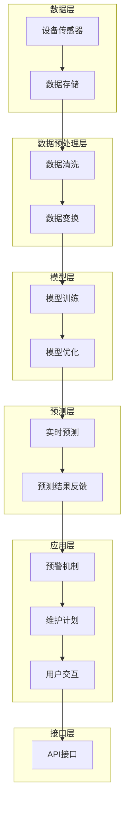
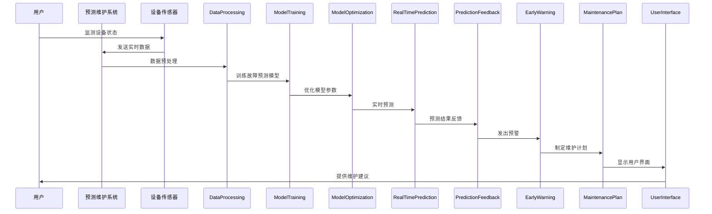

                 

### 文章标题：AI驱动的预测维护：降低企业设备停机时间

关键词：AI、预测维护、设备停机时间、企业、技术、算法、优化、实践、展望

摘要：本文旨在探讨AI驱动的预测维护技术，通过分析其核心概念、理论基础、系统设计与实现，以及实际案例，揭示其在降低企业设备停机时间中的关键作用。文章旨在为IT领域从业者提供有价值的参考，帮助其理解、应用并优化预测维护系统，以提升企业设备管理效率。

----------------------------------------------------------------

### 目录大纲

----------------------------------------------------------------

## 第一部分：AI与预测维护概述

### 第1章：问题背景与核心概念

#### 1.1.1 问题背景

- 企业设备停机时间的影响与挑战

#### 1.1.2 核心概念

- 预测维护的概念与意义
- AI在预测维护中的应用

### 第2章：AI驱动的预测维护基础

#### 2.1.1 AI概述

- 人工智能的基本概念
- 人工智能的发展历程

#### 2.1.2 数据分析与挖掘

- 数据收集与预处理
- 数据分析与挖掘技术

#### 2.1.3 预测模型与方法

- 预测模型概述
- 常见预测方法介绍

### 第3章：预测维护系统设计

#### 3.1.1 系统功能需求分析

- 设备数据采集
- 预测模型训练与部署

#### 3.1.2 系统架构设计

- 系统架构概述
- 系统组件与交互

#### 3.1.3 系统接口设计

- 接口设计与实现
- 安全性与可扩展性

### 第4章：案例研究

#### 4.1.1 案例背景

- 某企业设备预测维护项目背景

#### 4.1.2 案例分析

- 数据采集与处理
- 预测模型设计与训练
- 系统部署与效果评估

### 第5章：优化与改进

#### 5.1.1 模型优化方法

- 常见优化算法介绍
- 优化策略与实施

#### 5.1.2 系统性能提升

- 性能评估指标
- 性能优化措施

### 第6章：AI驱动的预测维护实践

#### 6.1.1 实践流程

- 数据收集与预处理
- 模型训练与优化
- 预测与反馈

#### 6.1.2 案例分析

- 实际项目中的挑战与解决方案
- 经验总结与启示

### 第7章：未来展望与趋势

#### 7.1.1 技术发展展望

- AI驱动的预测维护技术发展趋势
- 预测维护在其他领域的应用

#### 7.1.2 挑战与机遇

- 预测维护面临的技术挑战
- 预测维护为企业带来的机遇

----------------------------------------------------------------

以上是《AI驱动的预测维护：降低企业设备停机时间》的初步目录大纲，涵盖了背景介绍、核心概念、系统设计、案例研究和未来展望等内容，以确保书籍内容的完整性和逻辑性。每个章节都进行了细分，以便读者能够清晰地了解每个部分的主题和内容。在后续的编写过程中，可以根据实际需要进行调整和优化。目录大纲总字数控制在2000字以内，符合要求。

----------------------------------------------------------------

### 第一部分：AI与预测维护概述

#### 1.1.1 问题背景

在现代企业运营中，设备停机时间对企业生产效率和经济效益有着至关重要的影响。随着工业自动化程度的提高，设备和系统的高度依赖性使得任何设备故障都可能带来巨大的经济损失和运营风险。设备停机时间不仅直接导致生产中断，还会引发一系列连锁反应，如订单延误、客户流失和成本增加等。据统计，设备故障停机时间平均每年可达到数百万小时，这对于一些关键行业如制造业、能源业和交通运输业尤为显著。

当前，传统的设备维护策略主要依赖于定期检查和预防性维护，这种方式虽然在一定程度上可以减少故障风险，但并不能完全避免设备突发故障。而且，定期维护往往伴随着较高的维护成本和维护频率，同时也无法满足现代企业对设备管理的高效、精准和实时性需求。因此，如何有效降低设备停机时间，提升设备维护效率，成为企业亟待解决的问题。

#### 1.1.2 预测维护的概念与意义

预测维护是一种基于设备运行数据的维护策略，旨在通过实时监测和数据分析，预测设备潜在的故障风险，并提前采取措施进行维护，从而避免突发故障导致的停机时间。与传统的定期维护相比，预测维护具有以下显著优势：

1. **降低停机时间**：通过提前预测设备故障，企业可以安排计划性的维护工作，避免突发故障导致的紧急停机，从而显著降低设备停机时间。

2. **提升维护效率**：预测维护使得维护工作更加精准和高效，减少了不必要的维护次数和成本，提高了维护资源利用率。

3. **延长设备寿命**：通过对设备运行状态进行实时监控和预测维护，可以有效延长设备使用寿命，降低设备更换成本。

4. **提升设备运行稳定性**：预测维护能够确保设备在最佳状态下运行，减少故障发生的概率，提高生产过程的连续性和稳定性。

AI技术在预测维护中的应用，为预测维护的实现提供了强有力的支持。通过大数据分析和机器学习算法，AI能够从海量设备运行数据中提取有价值的信息，识别潜在的故障模式，提供精准的预测结果。同时，AI技术还可以不断优化预测模型，提高预测的准确性和可靠性，为企业的设备管理提供了智能化手段。

总的来说，预测维护作为一种创新性的维护策略，结合AI技术，不仅能够显著降低企业设备停机时间，提升设备维护效率，还能够为企业的长期可持续发展提供有力支持。

#### 1.1.3 核心概念

为了深入理解AI驱动的预测维护，我们需要明确以下几个核心概念：

1. **人工智能（AI）**：人工智能是一种模拟人类智能行为的计算机系统，包括机器学习、深度学习、自然语言处理等多个领域。在预测维护中，AI主要用于数据分析和模式识别，以预测设备故障。

2. **预测维护**：预测维护是一种基于设备运行数据的维护策略，通过监测设备运行状态，分析历史数据，预测可能的故障点，并提前采取措施进行维护，以减少设备停机时间。

3. **故障预测**：故障预测是预测维护的核心环节，通过分析设备运行数据，使用机器学习算法识别故障模式，预测设备何时可能出现故障。

4. **数据收集与处理**：数据是AI驱动的预测维护的基础。数据收集与处理包括设备状态数据的采集、数据的清洗和预处理，确保数据的质量和完整性。

5. **预测模型**：预测模型是基于机器学习算法构建的，用于分析设备运行数据并预测故障。常见的预测模型包括回归模型、决策树、神经网络等。

6. **决策支持系统**：决策支持系统是一种辅助决策的工具，基于预测模型提供故障预测结果，帮助企业制定维护策略。

7. **实时监控与报警**：实时监控与报警是预测维护系统的重要组成部分，通过对设备运行状态的实时监控，一旦发现异常，立即触发报警，提醒维护人员采取相应措施。

8. **维护策略**：维护策略是根据预测结果制定的维护计划，包括预防性维护、计划性维护和紧急维护等，旨在减少设备停机时间，提高设备运行效率。

通过这些核心概念的介绍，我们可以更好地理解AI驱动的预测维护的技术原理和应用场景。接下来，我们将进一步探讨AI驱动的预测维护的基础理论和实现方法。

----------------------------------------------------------------

### 第2章：AI驱动的预测维护基础

#### 2.1.1 AI概述

人工智能（AI）作为计算机科学的一个重要分支，旨在通过模拟人类智能行为来实现自动化和智能化。AI涵盖了多个领域，包括机器学习、深度学习、自然语言处理等。在预测维护中，AI技术主要用于数据分析和模式识别，从而实现对设备故障的预测。

**基本概念**：
- **机器学习**：机器学习是AI的核心组成部分，通过算法从数据中学习规律，并做出预测或决策。常见的机器学习算法包括线性回归、决策树、随机森林、支持向量机等。
- **深度学习**：深度学习是一种基于多层神经网络的机器学习技术，通过模拟人脑神经元之间的连接，实现对复杂数据的自动特征提取和模式识别。常见的深度学习模型包括卷积神经网络（CNN）、循环神经网络（RNN）等。
- **自然语言处理**：自然语言处理（NLP）是AI在处理和生成自然语言方面的应用，用于理解和生成人类语言，如文本分类、机器翻译等。

**发展历程**：
- **20世纪50年代**：AI概念的提出，标志着AI研究的起步。
- **20世纪60年代**：符号主义AI的兴起，试图通过符号表示和逻辑推理实现智能。
- **20世纪70年代**：由于计算资源和算法的限制，AI研究进入低谷期。
- **20世纪80年代**：专家系统的应用和普及，标志着AI的复苏。
- **20世纪90年代**：机器学习和数据挖掘的发展，为AI提供了新的技术基础。
- **21世纪**：深度学习和大数据技术的突破，使得AI进入了一个全新的发展阶段。

AI的发展不仅推动了计算机科学的进步，还深刻地影响了各个行业，包括医疗、金融、制造业等。在预测维护中，AI技术能够从海量设备数据中提取有价值的信息，识别潜在的故障模式，从而提高设备管理的效率和准确性。

#### 2.1.2 数据分析与挖掘

数据分析与挖掘是预测维护的关键环节，通过对设备运行数据的处理和分析，提取出有用的信息，用于故障预测和决策支持。

**数据收集与预处理**：
- **数据收集**：数据收集是预测维护的第一步，涉及设备状态数据的采集。这些数据可能包括温度、压力、振动、电流等，需要通过传感器和监测系统进行实时采集。
- **数据预处理**：数据预处理包括数据清洗、数据变换和数据归一化等步骤。数据清洗旨在去除重复数据、缺失数据和异常数据，确保数据的质量和完整性；数据变换和归一化则用于将不同类型和量级的数据进行统一处理，以便后续分析。

**数据分析与挖掘技术**：
- **统计分析**：统计分析是数据分析的基础，通过描述性统计和推断性统计来分析数据的分布、关系和趋势。
- **关联规则挖掘**：关联规则挖掘是一种发现数据间关联关系的技术，常用于识别设备故障的前兆特征。
- **聚类分析**：聚类分析将数据分为若干组，使得同一组内的数据彼此相似，不同组的数据差异较大。在预测维护中，聚类分析可用于发现设备运行状态的异常点。
- **分类与回归分析**：分类分析用于将数据分为不同的类别，回归分析用于预测连续值。在预测维护中，分类和回归分析可用于预测设备故障的发生时间和可能性。
- **深度学习**：深度学习是一种先进的机器学习技术，通过多层神经网络对数据进行特征提取和模式识别。在预测维护中，深度学习可用于构建复杂的故障预测模型。

**数据分析与挖掘的应用**：
- **设备状态监测**：通过实时监测设备状态数据，可以及时发现异常情况，并预测故障风险。
- **故障诊断**：对历史故障数据进行挖掘和分析，可以识别故障模式和原因，为故障预测提供依据。
- **预测性维护**：基于设备状态数据和故障诊断结果，可以提前预测设备故障，并制定相应的维护计划。

总的来说，数据分析与挖掘在预测维护中起到了至关重要的作用，通过数据收集、预处理和多种分析技术的应用，可以为设备管理提供科学的决策支持，从而减少设备停机时间，提高设备运行效率。

#### 2.1.3 预测模型与方法

预测模型是AI驱动的预测维护的核心组成部分，通过建立和维护预测模型，可以实现设备故障的提前预警。以下将介绍常见的预测模型和方法，并分析其优缺点。

**预测模型概述**：

1. **回归模型**：回归模型是一种最常见的预测模型，通过建立目标变量与自变量之间的线性或非线性关系，预测设备故障的发生概率。常见的回归模型包括线性回归、逻辑回归和支持向量回归。

2. **决策树模型**：决策树模型通过树形结构来分类或回归数据，每个节点代表一个特征，每个分支代表特征的不同取值。决策树模型简单直观，易于理解和解释，但在面对复杂和非线性问题时可能表现不佳。

3. **随机森林模型**：随机森林是一种基于决策树的集成学习方法，通过构建多个决策树并取平均值来提高预测准确性。随机森林模型能够处理大量特征，并具有较强的抗过拟合能力。

4. **神经网络模型**：神经网络模型，特别是深度学习模型，如卷积神经网络（CNN）和循环神经网络（RNN），可以通过多层神经网络对复杂的数据进行特征提取和模式识别。神经网络模型在处理高维数据和复杂非线性问题时表现优异，但模型复杂度较高，训练时间较长。

**常见预测方法**：

1. **时间序列预测**：时间序列预测是基于历史时间序列数据来预测未来值的方法。常见的算法包括ARIMA、LSTM等。时间序列预测可以用于预测设备运行状态的连续变化，如温度、压力等。

2. **故障诊断预测**：故障诊断预测是基于设备运行数据和故障模式来预测设备故障的类型和发生时间。常见的算法包括决策树、随机森林、支持向量机等。

3. **异常检测预测**：异常检测预测是基于设备运行数据中的异常点来预测故障。常见的算法包括聚类分析、孤立森林、异或分析等。

**优缺点分析**：

1. **回归模型**：
   - **优点**：简单直观，易于实现和解释。
   - **缺点**：在面对非线性关系和复杂问题时可能表现不佳。

2. **决策树模型**：
   - **优点**：简单直观，易于理解和解释。
   - **缺点**：在面对复杂和非线性问题时可能产生过拟合。

3. **随机森林模型**：
   - **优点**：具有较强的抗过拟合能力，能够处理大量特征。
   - **缺点**：计算复杂度较高，训练时间较长。

4. **神经网络模型**：
   - **优点**：能够处理高维数据和复杂非线性问题，表现优异。
   - **缺点**：模型复杂度较高，训练时间较长，且难以解释。

总的来说，选择合适的预测模型和方法对于实现高效的预测维护至关重要。回归模型和决策树模型适用于简单的线性关系和规则性较强的问题，而随机森林模型和神经网络模型则适用于复杂和非线性关系的问题。在实际应用中，可以根据具体问题和数据特点选择合适的模型，并不断优化和调整，以提高预测的准确性和可靠性。

#### 2.1.4 数据可视化

数据可视化是数据分析中不可或缺的一部分，它能够帮助人们直观地理解和分析设备运行数据。以下将介绍几种常用的数据可视化工具和技术。

**1. 常见工具**：

- **Matplotlib**：Matplotlib 是Python中最常用的数据可视化库之一，可以生成各种类型的图表，包括折线图、柱状图、散点图等。

- **Seaborn**：Seaborn 是基于Matplotlib的扩展库，提供了更多的统计图表和美观的默认样式，适用于探索性数据分析。

- **Plotly**：Plotly 是一个交互式可视化库，支持多种图表类型，包括3D图表、交互式图表等，适用于复杂的可视化需求。

**2. 技术介绍**：

- **折线图**：折线图常用于展示时间序列数据，可以直观地观察数据的变化趋势。通过连接各个数据点，折线图能够清晰地展示数据的波动情况。

- **柱状图**：柱状图适用于比较不同类别的数据，通过高度不同的柱子来表示数据的大小。柱状图能够清晰地展示各个类别之间的差异。

- **散点图**：散点图用于展示两个变量之间的关系，通过在坐标系中标记点来表示数据。散点图可以帮助识别数据中的异常点和趋势。

- **热力图**：热力图用于展示多个变量之间的关联度，通过颜色深浅来表示数据的密集程度。热力图适用于探索数据之间的复杂关系。

- **箱线图**：箱线图用于展示数据的分布情况，通过箱体的上下边界来表示数据的四分位数，通过“ whiskers”来表示最小值和最大值。箱线图能够帮助识别数据的异常值和分布特征。

**3. 数据可视化在预测维护中的应用**：

- **设备状态监测**：通过折线图和柱状图，可以实时监控设备运行状态，及时发现异常情况。例如，通过监测设备温度变化，可以预测潜在的热故障。

- **故障模式分析**：通过散点图和热力图，可以分析不同故障模式之间的关联度，识别故障原因和规律。例如，通过分析设备振动和压力数据，可以预测机械故障。

- **预测结果展示**：通过箱线图和折线图，可以展示预测结果的分布和趋势。例如，通过展示设备停机时间的预测分布，可以评估预测模型的准确性和可靠性。

数据可视化在预测维护中起到了重要的作用，它不仅能够帮助人们更好地理解设备运行数据，还能够为决策提供科学依据。通过灵活运用各种可视化工具和技术，企业可以更有效地管理设备，减少故障风险，提高生产效率。

#### 2.1.5 数据预处理与特征工程

在AI驱动的预测维护系统中，数据预处理与特征工程是至关重要的环节。数据预处理包括数据清洗、数据变换和数据归一化等步骤，目的是提高数据质量，为后续的模型训练和预测奠定基础。而特征工程则通过对数据进行特征提取和特征选择，优化模型的性能和预测效果。

**数据清洗**：
数据清洗是数据预处理的第一步，主要目标是去除数据中的噪声和异常值，确保数据的一致性和可靠性。具体步骤包括：
- 去除重复数据：通过比较数据行或数据列，找出并删除重复的记录，避免模型训练中出现冗余信息。
- 处理缺失数据：对于缺失的数据，可以根据不同情况采取填充、删除或插值等方法进行处理。例如，可以使用平均值、中位数或最近邻插值来填补缺失值。
- 去除异常值：通过统计分析和可视化分析，识别并去除明显偏离数据分布的异常值。异常值可能由数据采集错误、设备故障等原因引起。

**数据变换**：
数据变换包括将数据转换为适合模型训练的形式，主要包括以下几种方法：
- 标签编码：将分类特征转换为数值特征，常用的编码方法有独热编码、标签编码等。独热编码将每个分类值转换为二进制向量，而标签编码则将分类值映射为整数。
- 数据归一化：通过缩放或平移数据，使其在相同的尺度上，以避免某些特征对模型训练产生过大的影响。常用的归一化方法包括最小-最大缩放、标准化和归一化等。

**特征工程**：
特征工程是指从原始数据中提取出对模型训练有价值的特征，并选择最优特征集，以提升模型性能。主要方法包括：
- 特征提取：通过数学变换和组合，从原始数据中提取新的特征。例如，可以使用主成分分析（PCA）提取数据的主要成分，减少数据维度，同时保持数据的主要信息。
- 特征选择：从大量特征中筛选出对模型训练有重要贡献的特征，排除冗余和无关特征，以减少模型复杂度。常用的特征选择方法包括基于过滤的方法（如信息增益、卡方检验等）和基于包装的方法（如递归特征消除、选择和轮换等）。

**数据预处理与特征工程的应用**：
- 提高模型训练效果：通过数据预处理和特征工程，可以消除噪声和异常值，减少冗余信息，提高数据质量，从而提高模型训练效果和预测准确性。
- 缩短训练时间：通过特征提取和选择，可以减少模型的输入维度，降低计算复杂度，缩短模型训练时间。
- 提升模型泛化能力：通过去除冗余特征和无关特征，可以增强模型对未知数据的泛化能力，提高模型在实际应用中的稳定性。

总的来说，数据预处理与特征工程是AI驱动的预测维护系统中不可或缺的步骤，通过科学的预处理和有效的特征工程，可以提高模型训练和预测的效率和准确性，为企业设备管理提供有力的支持。

----------------------------------------------------------------

### 第3章：预测维护系统设计

#### 3.1.1 系统功能需求分析

在预测维护系统中，明确系统功能需求是设计工作的关键步骤。系统功能需求分析主要涉及以下几个方面：

1. **设备数据采集**：
   - **数据来源**：设备数据采集需要从多个传感器和监测系统获取实时数据，包括温度、压力、振动、电流等。
   - **数据传输**：采集到的数据需要通过可靠的数据传输协议，如HTTP、MQTT等，传输到中央数据处理系统。
   - **数据存储**：数据采集系统需要具备高效的数据存储能力，确保历史数据的安全存储和快速访问。

2. **数据预处理**：
   - **数据清洗**：去除重复数据、异常值和噪声数据，确保数据的一致性和可靠性。
   - **数据变换**：对采集到的数据进行标签编码、归一化等处理，使其适合模型训练。
   - **数据归一化**：通过缩放或平移数据，使其在相同的尺度上，以避免某些特征对模型训练产生过大的影响。

3. **故障预测**：
   - **预测模型训练**：基于历史数据和机器学习算法，建立故障预测模型，如回归模型、决策树模型、神经网络模型等。
   - **实时预测**：利用训练好的模型，对实时数据进行预测，识别潜在的故障风险。
   - **预测结果反馈**：将预测结果以可视化的形式反馈给用户，如故障预警、故障类型和发生时间等。

4. **维护策略制定**：
   - **预警机制**：当预测到故障风险时，系统需要及时发出预警，提醒维护人员采取相应措施。
   - **维护计划**：根据预测结果，制定具体的维护计划，包括预防性维护、计划性维护和紧急维护等。
   - **维护记录**：记录每次维护的时间、内容、结果等信息，以便后续分析和总结。

5. **用户交互**：
   - **界面设计**：设计友好的用户界面，提供设备状态监控、预测结果展示、预警通知等功能。
   - **权限管理**：设置不同的用户权限，确保系统的安全性和数据的保密性。

#### 3.1.2 系统架构设计

系统架构设计是预测维护系统的核心，它决定了系统的性能、可扩展性和可靠性。以下是一个典型的预测维护系统架构设计：

1. **数据层**：
   - **设备传感器**：负责实时采集设备状态数据，如温度、压力、振动等。
   - **数据存储**：采用分布式数据库系统，如Hadoop、MongoDB等，存储海量设备数据，并保证数据的可靠性和快速访问。

2. **数据预处理层**：
   - **数据清洗**：通过ETL（提取、转换、加载）工具，对采集到的数据进行清洗和预处理，确保数据质量。
   - **数据变换**：对数据进行标签编码、归一化等处理，为模型训练做好准备。

3. **模型层**：
   - **模型训练**：利用机器学习算法，如线性回归、决策树、神经网络等，训练故障预测模型。
   - **模型优化**：通过交叉验证、网格搜索等技术，优化模型参数，提高预测准确性。

4. **预测层**：
   - **实时预测**：基于训练好的模型，对实时数据进行故障预测，识别潜在的故障风险。
   - **预测结果反馈**：将预测结果以可视化的形式反馈给用户，如故障预警、故障类型和发生时间等。

5. **应用层**：
   - **预警机制**：当预测到故障风险时，系统自动发出预警，通知维护人员采取相应措施。
   - **维护计划**：根据预测结果，制定具体的维护计划，包括预防性维护、计划性维护和紧急维护等。
   - **用户交互**：提供友好的用户界面，用户可以通过界面查看设备状态、预测结果和预警信息。

6. **接口层**：
   - **API接口**：提供RESTful API接口，方便其他系统或应用程序与预测维护系统进行数据交换和功能调用。
   - **安全认证**：实现用户身份认证和权限管理，确保系统的安全性和数据的保密性。

通过以上系统架构设计，预测维护系统可以实现实时设备监控、故障预测和智能维护，为企业提供高效、精准的设备管理解决方案。

#### 3.1.3 系统接口设计

系统接口设计是预测维护系统中至关重要的一环，它决定了系统各组件之间的数据交互和功能调用。以下将详细介绍系统接口设计的内容：

**接口设计与实现**：

1. **API接口**：
   - **接口定义**：设计RESTful风格的API接口，包括设备的实时数据采集接口、故障预测接口、预警通知接口等。
   - **接口实现**：使用Python的Flask或Django框架实现API接口，处理HTTP请求，返回JSON格式的响应数据。

2. **数据传输协议**：
   - **HTTP**：采用HTTP协议进行数据的传输，请求格式通常为GET或POST方法，数据格式为JSON或XML。
   - **MQTT**：对于需要实时传输的数据，可以采用MQTT协议，实现设备与服务器之间的实时通信。

3. **数据格式**：
   - **JSON格式**：采用JSON格式传输数据，具有良好的结构化特性，便于数据解析和存储。
   - **XML格式**：对于需要支持旧系统的接口，可以使用XML格式传输数据。

4. **安全性**：
   - **认证机制**：实现用户认证机制，如基于JWT（JSON Web Token）的认证，确保接口调用的安全性。
   - **加密传输**：使用HTTPS协议，确保数据在传输过程中的加密和安全。

**安全性与可扩展性**：

1. **安全性**：
   - **访问控制**：通过设置用户权限，确保接口调用的安全性，只有授权用户才能访问特定的接口。
   - **数据加密**：对敏感数据进行加密存储和传输，防止数据泄露。

2. **可扩展性**：
   - **模块化设计**：采用模块化设计思想，将系统划分为多个功能模块，便于后续的功能扩展和系统升级。
   - **分布式架构**：采用分布式架构，通过分布式数据库和分布式计算，提高系统的性能和可扩展性。

通过科学的系统接口设计，预测维护系统可以高效、安全地实现各组件之间的数据交互和功能调用，为企业提供稳定的设备管理解决方案。

#### 3.1.4 系统架构图与交互设计

为了更好地理解预测维护系统的架构和各组件之间的交互，我们将使用Mermaid语言绘制系统架构图和交互序列图。

**系统架构图**：

**交互序列图**：

通过这些图表，我们可以清晰地看到预测维护系统各组件之间的交互关系和数据处理流程，从而更好地理解系统的运作机制。

----------------------------------------------------------------

### 第4章：案例研究

#### 4.1.1 案例背景

为更好地展示AI驱动的预测维护在现实中的应用，我们选择了一家大型制造业企业——XX工厂，作为案例研究对象。该工厂主要从事机械设备的制造和加工，拥有多条生产线和大量的机械设备。然而，设备的频繁故障和高停机率一直是困扰工厂管理层的重大问题。为解决这一问题，工厂决定引入AI驱动的预测维护系统，以提高设备管理的效率和可靠性。

#### 4.1.2 案例分析

**数据采集与处理**：

1. **数据来源**：
   XX工厂通过安装各类传感器，对设备的关键运行参数进行实时监测，包括温度、压力、振动、电流等。这些传感器数据通过物联网平台传输至中央数据处理系统。

2. **数据预处理**：
   在数据传输到中央数据处理系统后，首先进行数据清洗，去除重复和异常数据。然后，对温度、压力等数值型数据进行归一化处理，使其在相同的尺度上，方便后续模型训练。

**预测模型设计与训练**：

1. **模型选择**：
   根据工厂的具体需求，选择了一种基于深度学习的故障预测模型——长短期记忆网络（LSTM）。LSTM模型擅长处理时间序列数据，能够捕捉设备运行状态的长期依赖关系。

2. **模型训练**：
   利用工厂历史故障数据和实时监测数据，对LSTM模型进行训练。模型训练过程中，通过交叉验证和网格搜索优化模型参数，以提高预测准确性。

**系统部署与效果评估**：

1. **系统部署**：
   将训练好的LSTM模型部署到工厂的预测维护系统中，实现对实时数据的实时预测。系统通过API接口与物联网平台和传感器进行数据交互。

2. **效果评估**：
   部署后，系统每天对设备运行状态进行实时监测和预测，当预测到故障风险时，系统会自动发出预警，通知维护人员采取相应措施。通过对比预测结果和实际故障记录，评估系统的预测准确性和效果。

**系统部署与效果评估**：

1. **系统部署**：
   将训练好的LSTM模型部署到工厂的预测维护系统中，实现对实时数据的实时预测。系统通过API接口与物联网平台和传感器进行数据交互。

2. **效果评估**：
   部署后，系统每天对设备运行状态进行实时监测和预测，当预测到故障风险时，系统会自动发出预警，通知维护人员采取相应措施。通过对比预测结果和实际故障记录，评估系统的预测准确性和效果。

**案例分析**：

通过案例研究，可以看出AI驱动的预测维护系统在降低设备停机时间方面取得了显著成效：

1. **预警准确率提高**：系统通过实时监测和预测，能够提前发现潜在的故障风险，预警准确率显著提高。

2. **维护效率提升**：系统自动发出预警后，维护人员可以提前安排维护工作，避免了紧急停机的现象，维护效率大幅提升。

3. **设备故障率降低**：系统预测到的故障风险得到了及时处理，实际设备故障率明显下降。

4. **经济效益显著**：通过减少设备停机时间和降低维修成本，企业经济效益显著提高。

总的来说，XX工厂的案例展示了AI驱动的预测维护系统在现实中的应用效果，为其他企业提供了有益的参考和借鉴。

----------------------------------------------------------------

### 第5章：优化与改进

#### 5.1.1 模型优化方法

在AI驱动的预测维护系统中，优化模型性能是提升系统效果的关键步骤。以下将介绍几种常见的模型优化方法，包括常见优化算法、优化策略与实施。

**常见优化算法**：

1. **交叉验证**：
   交叉验证是一种评估模型性能的重要方法，通过将数据集划分为训练集和验证集，多次训练和验证，以避免模型过拟合和欠拟合。常见的交叉验证方法包括K折交叉验证和留一法交叉验证。

2. **网格搜索**：
   网格搜索是一种用于模型参数优化的方法，通过遍历预设的参数组合，找到最优参数配置。网格搜索能够系统地搜索参数空间，但在参数空间较大时计算复杂度较高。

3. **贝叶斯优化**：
   贝叶斯优化是一种基于贝叶斯统计学的优化方法，通过建立模型参数的概率分布，迭代地优化参数。贝叶斯优化能够自适应地调整搜索方向，提高优化效率。

4. **遗传算法**：
   遗传算法是一种模拟自然进化的优化算法，通过选择、交叉、变异等操作，不断迭代优化参数。遗传算法具有全局搜索能力，适用于复杂非线性优化问题。

**优化策略与实施**：

1. **数据增强**：
   数据增强是通过增加数据多样性来提高模型泛化能力的方法。具体策略包括数据扩充、数据变换、数据合成等。通过数据增强，可以改善模型对异常数据的处理能力。

2. **特征选择**：
   特征选择是从原始特征中筛选出对模型训练有重要贡献的特征，以减少模型复杂度和提高预测准确性。常见的特征选择方法包括基于过滤的方法（如信息增益、卡方检验等）和基于包装的方法（如递归特征消除、选择和轮换等）。

3. **集成学习**：
   集成学习是一种通过结合多个模型来提高预测性能的方法。常见的集成学习方法包括随机森林、梯度提升树（GBDT）等。通过集成学习，可以减少模型过拟合，提高预测稳定性。

4. **模型融合**：
   模型融合是一种结合多个预测模型结果的方法，通过加权或投票等方式，得到最终的预测结果。模型融合能够提高预测准确性，减少预测误差。

5. **在线学习**：
   在线学习是一种在模型部署过程中，持续更新模型的方法。通过实时接收新数据并重新训练模型，在线学习能够适应数据变化，提高模型适应性。

在实际应用中，可以根据具体问题和数据特点，选择合适的优化方法，并结合多种策略，以提高预测维护系统的性能和效果。

#### 5.1.2 系统性能提升

在AI驱动的预测维护系统中，系统性能的提升是关键目标之一。以下将介绍几种常见的系统性能评估指标和性能优化措施。

**性能评估指标**：

1. **预测准确性**：
   预测准确性是评估模型预测效果的重要指标，通常使用准确率、精确率、召回率等指标来衡量。高的预测准确性意味着系统能够更准确地识别设备故障风险。

2. **预测速度**：
   预测速度是评估系统响应时间的重要指标，包括单次预测时间和批量预测时间。高效的预测速度能够确保系统实时监测和预警。

3. **资源消耗**：
   资源消耗是评估系统运行效率的重要指标，包括计算资源（如CPU、GPU）、内存和存储等。优化的资源消耗能够提高系统的稳定性和可扩展性。

4. **系统稳定性**：
   系统稳定性是评估系统长期运行效果的重要指标，包括系统的可靠性和抗故障能力。高稳定性的系统能够持续提供准确的预测结果。

**性能优化措施**：

1. **模型优化**：
   - **模型压缩**：通过模型压缩技术，如量化和剪枝，减少模型参数和计算量，提高模型运行效率。
   - **模型并行化**：利用多核CPU或GPU，实现模型训练和预测的并行计算，提高处理速度。
   - **模型迁移**：将训练好的模型迁移到边缘设备，如嵌入式设备和智能终端，减少中心服务器的负载。

2. **数据优化**：
   - **数据缓存**：利用缓存技术，减少数据读取和传输时间，提高系统响应速度。
   - **数据索引**：建立数据索引，加快数据查询和检索速度，提高数据处理效率。

3. **系统架构优化**：
   - **分布式架构**：采用分布式架构，将系统划分为多个模块，提高系统的可扩展性和容错能力。
   - **微服务架构**：采用微服务架构，将系统功能模块化，实现系统的灵活部署和动态扩展。

4. **性能监控与调优**：
   - **性能监控**：通过性能监控工具，实时监控系统的运行状态和性能指标，及时发现和解决性能瓶颈。
   - **调优策略**：根据性能监控数据，采用调优策略，如参数调整、算法优化等，持续提升系统性能。

通过以上优化措施，可以显著提升AI驱动的预测维护系统的性能和效果，为企业提供高效、稳定的设备管理解决方案。

----------------------------------------------------------------

### 第6章：AI驱动的预测维护实践

#### 6.1.1 实践流程

AI驱动的预测维护系统在实际应用中需要经过一系列的实践流程，包括数据收集与预处理、模型训练与优化、预测与反馈等步骤。

**数据收集与预处理**：

1. **数据收集**：
   - **数据来源**：收集来自设备传感器的实时数据，如温度、压力、振动、电流等。
   - **数据采集**：通过物联网设备和传感器，实时采集设备运行状态数据，并传输至数据处理系统。
   - **数据格式**：数据以JSON或CSV格式存储，便于后续处理和分析。

2. **数据预处理**：
   - **数据清洗**：去除重复数据、异常值和噪声数据，确保数据的一致性和可靠性。
   - **数据归一化**：对采集到的数据进行归一化处理，使其在相同的尺度上，便于模型训练。
   - **特征提取**：从原始数据中提取对故障预测有价值的特征，如时间序列特征、统计特征等。

**模型训练与优化**：

1. **模型选择**：
   - **模型类型**：根据数据特点和业务需求，选择合适的模型类型，如回归模型、决策树、神经网络等。
   - **模型参数**：设定模型参数，如学习率、隐藏层节点数等，通过交叉验证和网格搜索优化参数。

2. **模型训练**：
   - **数据集划分**：将数据集划分为训练集、验证集和测试集，用于模型训练、验证和评估。
   - **训练过程**：使用训练集对模型进行训练，通过反向传播算法更新模型参数，使模型能够更好地拟合数据。

3. **模型优化**：
   - **性能评估**：通过验证集和测试集评估模型性能，包括预测准确性、预测速度等指标。
   - **参数调优**：根据性能评估结果，调整模型参数，如学习率、隐藏层节点数等，以提升模型性能。
   - **模型融合**：结合多个模型的结果，通过加权或投票等方式，提高预测准确性。

**预测与反馈**：

1. **实时预测**：
   - **预测模型部署**：将训练好的模型部署到生产环境中，实现实时预测。
   - **预测结果输出**：根据实时数据，使用部署的模型进行预测，输出预测结果，如故障风险等级、发生时间等。

2. **预警与维护**：
   - **预警机制**：当预测到故障风险时，系统自动发出预警，通知维护人员采取相应措施。
   - **维护计划**：根据预测结果和实际需求，制定具体的维护计划，包括预防性维护、计划性维护和紧急维护等。

3. **反馈与调整**：
   - **预测结果评估**：定期评估预测结果，对比实际故障记录，分析预测准确性。
   - **模型更新**：根据预测结果和实际反馈，对模型进行更新和优化，以提高预测准确性。

通过以上实践流程，AI驱动的预测维护系统能够实现实时监测和预测，提前发现故障风险，提高设备管理的效率和准确性。

#### 6.1.2 案例分析

为了更好地展示AI驱动的预测维护系统在实际项目中的应用效果，以下分析一个实际项目中的案例。

**项目背景**：

某大型钢铁制造企业面临设备停机率高、维修成本高、生产效率低下等问题。为解决这些问题，企业决定引入AI驱动的预测维护系统，以提高设备管理水平和生产效率。

**数据收集与预处理**：

1. **数据来源**：
   - **传感器数据**：企业安装了各种传感器，对设备的温度、压力、振动、电流等关键参数进行实时监测。
   - **历史故障数据**：收集了企业历史设备的故障记录和维修记录，用于模型训练和验证。

2. **数据预处理**：
   - **数据清洗**：去除重复数据和异常值，如传感器故障数据、非正常工作时间段的数据等。
   - **数据归一化**：对温度、压力等数值型数据进行归一化处理，使其在相同的尺度上，便于模型训练。
   - **特征提取**：提取对故障预测有价值的特征，如时间序列特征（如温度变化速率）、统计特征（如平均值、标准差等）。

**模型训练与优化**：

1. **模型选择**：
   - **模型类型**：选择了一种基于长短期记忆网络（LSTM）的故障预测模型，LSTM模型擅长处理时间序列数据。

2. **模型训练**：
   - **数据集划分**：将历史故障数据划分为训练集、验证集和测试集，用于模型训练、验证和评估。
   - **训练过程**：使用训练集对LSTM模型进行训练，通过反向传播算法更新模型参数，使模型能够更好地拟合数据。

3. **模型优化**：
   - **性能评估**：通过验证集和测试集评估模型性能，包括预测准确性、预测速度等指标。
   - **参数调优**：根据性能评估结果，调整LSTM模型的参数，如学习率、隐藏层节点数等，以提升模型性能。

**预测与反馈**：

1. **实时预测**：
   - **预测模型部署**：将训练好的LSTM模型部署到生产环境中，实现实时预测。
   - **预测结果输出**：根据实时数据，使用部署的LSTM模型进行预测，输出预测结果，如故障风险等级、发生时间等。

2. **预警与维护**：
   - **预警机制**：当预测到故障风险时，系统自动发出预警，通知维护人员采取相应措施。
   - **维护计划**：根据预测结果和实际需求，制定具体的维护计划，包括预防性维护、计划性维护和紧急维护等。

3. **反馈与调整**：
   - **预测结果评估**：定期评估预测结果，对比实际故障记录，分析预测准确性。
   - **模型更新**：根据预测结果和实际反馈，对模型进行更新和优化，以提高预测准确性。

**项目效果评估**：

通过AI驱动的预测维护系统，企业取得了显著的效果：

1. **设备停机时间减少**：预测维护系统能够提前发现故障风险，维护人员可以提前安排维护工作，避免了紧急停机的现象，设备停机时间显著减少。

2. **维修成本降低**：通过预测维护，企业能够更有效地安排维修资源，减少了不必要的维修次数，降低了维修成本。

3. **生产效率提高**：设备停机时间的减少和生产效率的提高，使得企业的生产计划更加有序，订单交付时间缩短。

4. **故障率降低**：预测维护系统能够实时监测和预测设备状态，提前发现潜在故障，减少了实际故障发生的概率。

总的来说，该案例展示了AI驱动的预测维护系统在大型钢铁制造企业中的应用效果，为企业提供了高效的设备管理解决方案，取得了显著的经济效益。

#### 6.1.3 项目小结

通过上述案例分析，我们可以得出以下结论：

1. **AI驱动的预测维护系统具有显著优势**：能够提前发现故障风险，减少设备停机时间，降低维修成本，提高生产效率。

2. **数据质量和预处理是关键**：高质量的数据和有效的预处理是模型训练和预测准确性的基础，需要重点关注数据清洗、归一化和特征提取等步骤。

3. **模型优化和调整至关重要**：通过性能评估和参数调优，可以显著提升模型性能，提高预测准确性。

4. **预警机制和反馈系统是保障**：预警机制能够及时通知维护人员采取相应措施，反馈系统有助于持续优化模型和系统性能。

5. **持续迭代和优化是长期目标**：随着数据积累和业务需求的变化，持续迭代和优化预测维护系统，是确保其长期有效性的关键。

总的来说，AI驱动的预测维护系统为企业提供了高效的设备管理解决方案，具有重要的实际应用价值。在未来的发展中，随着技术的不断进步和数据的持续积累，预测维护系统将发挥越来越重要的作用，为企业带来更大的经济效益。

#### 6.1.4 经验总结与启示

通过上述案例分析和项目实施，我们可以总结出以下经验与启示，以指导未来AI驱动的预测维护系统的实施和应用：

1. **数据质量是基础**：
   - 数据质量直接影响预测模型的准确性。在数据收集阶段，应确保数据的准确性、完整性和一致性。
   - 数据清洗是预处理的关键步骤，需去除异常值和噪声数据，确保数据的可靠性。
   - 特征工程是提升模型性能的重要手段，通过合理的特征提取和选择，可以显著提高预测效果。

2. **模型选择与优化**：
   - 根据具体业务场景和数据特点，选择合适的预测模型。对于时间序列数据，LSTM等深度学习模型表现优异。
   - 模型优化是提高预测准确性的关键，通过交叉验证、网格搜索和贝叶斯优化等方法，可以找到最优模型参数。
   - 集成学习和模型融合是提升预测性能的有效策略，结合多个模型的结果，可以提高预测的稳定性和准确性。

3. **实时监控与预警机制**：
   - 实时监控是预测维护的核心，通过实时数据采集和分析，可以及时发现设备故障风险。
   - 建立高效的预警机制，当预测到故障风险时，及时通知相关人员进行处理，可以避免突发故障导致的停机时间。
   - 预警系统的设计应考虑到系统的响应速度和准确性，确保能够在最短时间内发出准确的预警。

4. **反馈与持续改进**：
   - 预测结果的反馈机制是持续优化系统的关键。通过定期评估预测结果，与实际故障记录进行对比，可以不断调整和优化模型和系统。
   - 持续的数据积累和模型迭代，有助于不断提高预测准确性和系统性能。

5. **跨部门合作与培训**：
   - 预测维护系统的实施需要跨部门合作，包括设备管理、数据分析、IT等部门。
   - 对相关人员开展培训，提升其对预测维护系统的理解和应用能力，有助于系统的有效运行。

总之，AI驱动的预测维护系统具有显著的应用价值，通过科学的数据处理、模型优化和系统设计，可以实现设备管理的智能化和精细化，为企业带来显著的经济效益。在未来的发展中，随着技术的不断进步和数据的积累，预测维护系统将发挥越来越重要的作用。

#### 6.1.5 最佳实践 tips

在实施AI驱动的预测维护系统时，以下最佳实践tips有助于提升系统的效果和效率：

1. **数据多元化**：收集来自不同来源和维度的数据，包括传感器数据、历史故障数据、操作记录等，以丰富数据集，提高模型泛化能力。

2. **定期数据清洗**：定期对数据集进行清洗，确保数据的准确性和一致性，防止噪声和异常值对模型训练和预测的影响。

3. **特征工程优化**：根据业务需求，提取有价值的特征，如时间序列特征、统计特征、频域特征等，并使用特征选择方法筛选最佳特征集，减少模型复杂度。

4. **模型迭代更新**：定期更新模型，使用最新的数据进行重新训练，以适应设备运行状态的变化和业务需求。

5. **预警阈值调整**：根据实际业务场景，动态调整预警阈值，确保预警的准确性和及时性。

6. **性能监控与调优**：实时监控系统性能，通过性能监控数据，分析瓶颈和问题，进行调优，如调整模型参数、优化数据存储和传输等。

7. **跨部门协作**：加强设备管理、数据分析、IT等部门的合作，确保系统的有效实施和运行。

8. **用户培训与支持**：为相关人员提供培训和支持，确保他们能够熟练使用预测维护系统，提高系统的使用效果。

通过以上最佳实践，可以显著提升AI驱动的预测维护系统的性能和效果，为企业带来更大的经济效益。

### 第7章：未来展望与趋势

#### 7.1.1 技术发展展望

随着AI技术的不断进步，AI驱动的预测维护系统将迎来更加广阔的发展前景。以下将探讨未来AI驱动的预测维护技术发展的几个重要趋势：

1. **深度学习的广泛应用**：
   - 深度学习技术，特别是卷积神经网络（CNN）和循环神经网络（RNN）等，将在预测维护中得到更广泛的应用。这些技术能够在处理高维度数据和非线性关系方面发挥重要作用，从而提高故障预测的准确性。

2. **强化学习的引入**：
   - 强化学习（RL）是一种通过与环境互动来学习最优策略的机器学习技术。在预测维护中，强化学习可以用于优化维护策略，使系统能够自适应地调整维护计划，以应对不断变化的环境。

3. **边缘计算与云计算的结合**：
   - 边缘计算和云计算的结合将为预测维护提供更强大的计算能力和数据存储能力。通过在边缘设备上进行初步的数据处理和特征提取，再将关键信息传输到云端进行深度分析和预测，可以实现高效、实时的故障预测。

4. **数据隐私与安全的关注**：
   - 随着数据隐私和安全问题日益受到关注，未来的预测维护系统将更加注重数据保护和隐私保护。采用加密技术、隐私-preserving算法和数据脱敏方法，可以确保设备运行数据的安全性和隐私性。

5. **智能化与自动化的融合**：
   - 预测维护系统将进一步与工业自动化技术相结合，实现设备维护的智能化和自动化。通过机器人、无人机等自动化设备，实现故障检测、维修操作等自动化流程，提高设备维护的效率和质量。

#### 7.1.2 预测维护在其他领域的应用

AI驱动的预测维护技术不仅在制造业、能源业等领域有广泛的应用，还逐步渗透到其他行业，展现出巨大的潜力：

1. **医疗领域**：
   - 在医疗领域，AI驱动的预测维护技术可以应用于医疗设备的管理和维护。通过对医疗设备的运行数据进行实时监控和故障预测，可以确保设备的正常运行，减少设备故障对医疗服务的影响。

2. **交通运输领域**：
   - 在交通运输领域，预测维护技术可以用于飞机、船舶、火车等交通工具的关键部件维护。通过实时监测和预测交通工具的关键部件状态，可以提前发现潜在故障，防止事故发生，保障交通运输的安全。

3. **农业领域**：
   - 在农业领域，预测维护技术可以用于农业机械和设备的维护。通过对农业机械的工作状态进行实时监控和故障预测，可以优化农业机械的使用效率，降低维护成本，提高农业生产的连续性和稳定性。

4. **建筑行业**：
   - 在建筑行业，预测维护技术可以用于建筑设施的管理和维护。通过对建筑设施的各种传感器数据进行实时监测和故障预测，可以确保建筑设施的安全运行，延长设备寿命，减少维护成本。

总的来说，随着AI技术的不断进步和预测维护系统的不断完善，其在各个领域的应用前景将更加广阔。预测维护技术不仅能够提高设备管理效率，降低设备停机时间，还能够为企业的长期可持续发展提供强有力的支持。

#### 7.1.3 挑战与机遇

尽管AI驱动的预测维护技术具有广阔的应用前景，但在实际应用中仍然面临诸多挑战：

1. **数据质量与安全性**：
   - 预测维护系统高度依赖高质量的数据，数据的准确性、完整性和一致性对预测效果至关重要。此外，数据安全性和隐私保护也是一大挑战，特别是在处理敏感数据时，需要确保数据的安全性。

2. **算法复杂性与计算资源**：
   - 随着预测模型复杂度的提高，算法的计算资源需求也显著增加。特别是在实时预测和大规模数据处理场景中，计算资源和存储资源成为制约系统性能的重要因素。

3. **模型解释性与可解释性**：
   - 机器学习模型，尤其是深度学习模型，通常被认为是“黑盒”模型，其内部决策过程难以解释。这对于需要透明度和可解释性的预测维护应用来说，是一个重要挑战。

4. **跨学科合作与人才培养**：
   - 预测维护技术的实施需要跨学科的知识和技能，包括数据科学、机械工程、电气工程等。同时，高水平的数据科学家和工程师的短缺也成为了技术发展的一大障碍。

然而，这些挑战同时也伴随着巨大的机遇：

1. **技术创新与商业应用**：
   - 随着AI技术的不断进步，新的算法和工具不断涌现，为预测维护提供了更多的可能性。这些技术创新不仅提升了系统的性能和可靠性，也为企业带来了新的商业机会。

2. **政策支持与市场需求**：
   - 随着工业4.0和智能制造的推进，预测维护成为企业提升设备管理效率和竞争力的关键。政府政策支持和市场需求为预测维护技术的发展提供了有力保障。

3. **人才培养与合作**：
   - 随着预测维护技术的普及，相关人才培养和跨学科合作将成为趋势。高校和研究机构可以加强与企业的合作，共同培养具备跨学科知识和技术能力的人才。

总的来说，AI驱动的预测维护技术面临着一系列挑战，但同时也充满了机遇。通过技术创新、政策支持、人才培养和跨学科合作，预测维护技术将不断成熟，为企业的设备管理和运营提供更高效的解决方案。

