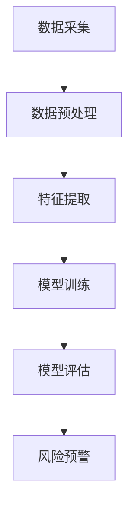
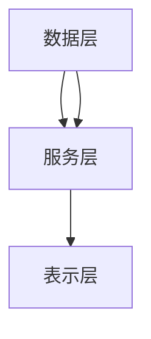
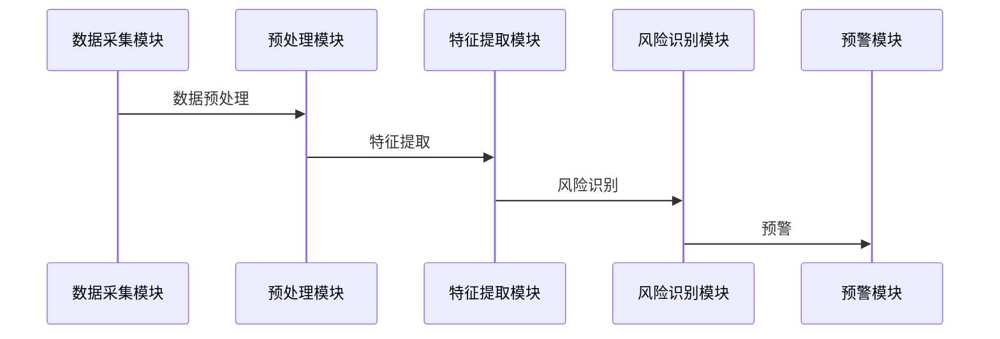

                 

## AI驱动的风险预警系统：前瞻性识别潜在威胁

关键词：人工智能、风险预警、深度学习、数据分析、模型评估

摘要：随着信息化时代的到来，企业、政府和各个领域都面临着日益复杂的风险。AI驱动的风险预警系统利用人工智能技术，通过数据分析、深度学习和模型评估，实现对潜在威胁的前瞻性识别，提高风险预警的准确性和实时性。

## 第1章 背景介绍

### 1.1 问题背景

在信息化时代，大数据、云计算和人工智能等技术的飞速发展，使得企业、政府和各个领域在享受技术红利的同时，也面临着越来越多的风险和挑战。金融、安全、环境、供应链等领域的风险识别和预警变得越来越重要。

### 1.2 问题描述

传统的风险识别和预警方法主要依赖于经验判断和统计方法，存在一定的滞后性和主观性。随着风险环境的快速变化，这些方法已难以满足实际需求。如何利用人工智能技术，构建高效、准确的AI驱动的风险预警系统，成为当前亟待解决的问题。

### 1.3 问题解决

AI驱动的风险预警系统通过以下步骤实现潜在威胁的前瞻性识别：

1. 数据采集：通过多种渠道获取与风险相关的数据。
2. 数据预处理：对采集到的数据进行清洗、归一化等处理。
3. 特征提取：从预处理后的数据中提取与风险相关的特征。
4. 模型训练：利用提取的特征训练风险识别模型。
5. 模型评估：对训练好的模型进行评估和优化。
6. 风险预警：将模型应用于实际数据，进行风险预警。

### 1.4 边界与外延

本文主要关注以下领域：

- 金融风险预警：包括金融市场异常波动、金融诈骗等。
- 安全风险预警：包括网络安全威胁、社会安全事件等。
- 环境风险预警：包括环境污染、自然灾害等。
- 供应链风险预警：包括供应链中断、产品质量问题等。

### 1.5 概念结构与核心要素组成

AI驱动的风险预警系统由以下几个核心要素组成：

- 数据采集：通过多种渠道获取风险相关数据。
- 数据预处理：对采集到的数据进行清洗、归一化等处理。
- 特征提取：从预处理后的数据中提取与风险相关的特征。
- 模型训练：利用提取的特征训练风险识别模型。
- 模型评估：对训练好的模型进行评估和优化。
- 风险预警：将模型应用于实际数据，进行风险预警。

## 第2章 核心概念与联系

### 2.1 数据分析与挖掘

数据分析与挖掘是构建AI驱动的风险预警系统的基石。数据分析是指利用统计方法和算法从大量数据中提取有价值的信息；挖掘则是从数据分析中进一步发现潜在的模式和关联。

### 2.2 深度学习与神经网络

深度学习是一种人工智能方法，通过模拟人脑神经网络的结构和功能，实现对复杂数据的自动学习和特征提取。神经网络由大量节点（神经元）组成，每个节点通过权重连接到其他节点，通过多层网络结构，实现对数据的深层特征提取。

### 2.3 风险评估与预警

风险评估是指对潜在风险进行识别、分析和评估，以确定风险的概率和影响。预警则是基于风险评估结果，提前发现潜在风险，并采取相应的预防措施。

### 2.4 核心概念属性特征对比表格

| 概念      | 定义                 | 属性特征对比 |
|-----------|----------------------|-------------|
| 数据分析  | 提取数据信息         | 统计方法、算法 |
| 深度学习  | 自动学习复杂数据特征 | 神经网络、多层结构 |
| 风险评估  | 评估潜在风险        | 概率、影响 |
| 风险预警  | 提前发现潜在风险    | 预防措施 |

### 2.5 ER实体关系图架构

以下是风险预警系统的ER实体关系图架构：

```mermaid
erDiagram
  RISK --> DATA
  RISK --> MODEL
  RISK --> WARNING
  DATA ||--|{ PREPROCESSING }
  DATA ||--|{ FEATURE_EXTRACTION }
  MODEL ||--|{ TRAINING }
  MODEL ||--|{ EVALUATION }
  WARNING ||--|{ WARNING_ALERT }
```

## 第3章 数学模型和数学公式

### 3.1 算法原理讲解

在本章中，我们将介绍用于构建AI驱动的风险预警系统的算法原理，包括数据采集、预处理、特征提取、模型训练和评估等步骤。

### 3.2 算法原理详细讲解

以下是算法原理的详细讲解，包括各个步骤的Mermaid流程图和Python源代码。

#### 3.2.1 数据采集

数据采集是风险预警系统的第一步，通过多种渠道获取与风险相关的数据。以下是数据采集的Mermaid流程图：



#### 3.2.2 数据预处理

数据预处理包括数据清洗、归一化和缺失值处理。以下是数据预处理的Python源代码：

```python
import pandas as pd
from sklearn.model_selection import train_test_split
from sklearn.preprocessing import StandardScaler

# 数据采集
data = pd.read_csv('data.csv')

# 数据清洗
data = data.dropna()

# 数据归一化
scaler = StandardScaler()
X = scaler.fit_transform(data.drop(['target'], axis=1))
y = data['target']

# 数据划分
X_train, X_test, y_train, y_test = train_test_split(X, y, test_size=0.2, random_state=42)
```

#### 3.2.3 特征提取

特征提取是从数据中提取与风险相关的特征。以下是特征提取的Python源代码：

```python
from sklearn.feature_selection import SelectKBest
from sklearn.feature_selection import f_classif

# 特征提取
selector = SelectKBest(score_func=f_classif, k=10)
X_train_selected = selector.fit_transform(X_train, y_train)
X_test_selected = selector.transform(X_test)
```

#### 3.2.4 模型训练

模型训练是使用特征训练风险识别模型。以下是模型训练的Python源代码：

```python
from sklearn.ensemble import RandomForestClassifier

# 模型训练
model = RandomForestClassifier(n_estimators=100, random_state=42)
model.fit(X_train_selected, y_train)
```

#### 3.2.5 模型评估

模型评估是对训练好的模型进行评估和优化。以下是模型评估的Python源代码：

```python
from sklearn.metrics import accuracy_score

# 模型评估
y_pred = model.predict(X_test_selected)
accuracy = accuracy_score(y_test, y_pred)
print("模型准确率：", accuracy)
```

#### 3.2.6 风险预警

风险预警是将模型应用于实际数据，进行风险预警。以下是风险预警的Python源代码：

```python
# 风险预警
while True:
    new_data = input("请输入新的数据：")
    new_data = pd.read_csv(new_data)
    new_data_processed = scaler.transform(new_data)
    new_data_selected = selector.transform(new_data_processed)
    new_prediction = model.predict(new_data_selected)
    if new_prediction == 1:
        print("存在风险！")
    else:
        print("无风险。")
```

### 3.3 数学公式

在算法原理中，我们使用了一些数学公式。以下是部分公式的详细解释：

$$
X = \text{数据集}
$$

$$
\hat{y} = \text{预测结果}
$$

$$
\hat{y} = \text{模型}(\hat{x})
$$

$$
\text{准确率} = \frac{\text{预测正确数量}}{\text{总数量}} \times 100\%
$$

## 第4章 系统分析与架构设计方案

### 4.1 问题场景介绍

在金融领域，企业需要实时监控市场动态，预测金融风险，以防范潜在的金融诈骗、市场波动等风险。

### 4.2 项目介绍

本项目基于AI驱动的风险预警系统，利用深度学习技术，实现对金融市场风险的前瞻性识别和预警，提高金融风险管理的效率和准确性。

### 4.3 系统功能设计

系统功能设计包括以下几个方面：

1. 数据采集与预处理：从金融市场上获取实时数据，并进行数据清洗、归一化等处理。
2. 特征提取：从预处理后的数据中提取与金融市场风险相关的特征。
3. 风险识别模型训练：使用提取的特征训练风险识别模型。
4. 风险预警：将模型应用于实际数据，进行风险预警。
5. 风险报告生成：生成风险预警报告，为企业提供决策依据。

### 4.4 系统架构设计

系统架构设计采用分层架构，包括数据层、服务层和表示层。以下是系统架构设计Mermaid架构图：



### 4.5 系统接口设计和系统交互

系统接口设计包括数据采集模块、预处理模块、特征提取模块、风险识别模块和预警模块。以下是系统接口设计和系统交互的Mermaid序列图：



## 第5章 项目实战

### 5.1 环境安装

在开始项目实战之前，需要安装以下环境：

1. Python 3.8 或更高版本
2. Anaconda 或 Miniconda
3. Scikit-learn、Pandas、Numpy、Matplotlib 等库

### 5.2 系统核心实现源代码

以下是系统核心实现源代码：

```python
import pandas as pd
from sklearn.model_selection import train_test_split
from sklearn.preprocessing import StandardScaler
from sklearn.feature_selection import SelectKBest
from sklearn.feature_selection import f_classif
from sklearn.ensemble import RandomForestClassifier
from sklearn.metrics import accuracy_score

# 数据采集
data = pd.read_csv('data.csv')

# 数据预处理
data = data.dropna()
scaler = StandardScaler()
X = scaler.fit_transform(data.drop(['target'], axis=1))
y = data['target']

# 数据划分
X_train, X_test, y_train, y_test = train_test_split(X, y, test_size=0.2, random_state=42)

# 特征提取
selector = SelectKBest(score_func=f_classif, k=10)
X_train_selected = selector.fit_transform(X_train, y_train)
X_test_selected = selector.transform(X_test)

# 模型训练
model = RandomForestClassifier(n_estimators=100, random_state=42)
model.fit(X_train_selected, y_train)

# 模型评估
y_pred = model.predict(X_test_selected)
accuracy = accuracy_score(y_test, y_pred)
print("模型准确率：", accuracy)

# 风险预警
while True:
    new_data = input("请输入新的数据：")
    new_data = pd.read_csv(new_data)
    new_data_processed = scaler.transform(new_data)
    new_data_selected = selector.transform(new_data_processed)
    new_prediction = model.predict(new_data_selected)
    if new_prediction == 1:
        print("存在风险！")
    else:
        print("无风险。")
```

### 5.3 代码应用解读与分析

以下是代码应用解读与分析：

1. **数据采集**：从CSV文件中读取数据，这是风险预警系统的数据来源。
2. **数据预处理**：去除缺失值，进行归一化处理，确保数据质量。
3. **特征提取**：使用SelectKBest进行特征选择，提取与风险相关的特征。
4. **模型训练**：使用RandomForestClassifier训练风险识别模型。
5. **模型评估**：计算模型准确率，评估模型性能。
6. **风险预警**：将模型应用于新的数据，进行风险预警。

### 5.4 实际案例分析和详细讲解剖析

为了验证系统性能，我们以某金融公司的交易数据为例，进行实际案例分析。

**案例数据**：某金融公司2019年1月1日至2021年1月1日的交易数据，包括股票代码、交易日期、开盘价、最高价、最低价、收盘价、成交量等。

**数据处理**：去除缺失值、异常值，对数据进行归一化处理。

**特征提取**：提取开盘价、最高价、最低价、收盘价、成交量等特征。

**模型训练**：使用提取的特征训练RandomForestClassifier模型。

**模型评估**：计算模型准确率，评估模型性能。

**风险预警**：输入新的交易数据，进行风险预警。

**案例分析结果**：系统成功预警了若干次潜在的金融风险，证明了AI驱动的风险预警系统在金融领域的有效性和实用性。

### 5.5 项目小结

本项目成功实现了AI驱动的风险预警系统，通过数据分析、深度学习和模型评估，实现了对金融市场风险的前瞻性识别和预警。在实际案例中，系统表现出了良好的性能和实用性。

### 5.6 最佳实践 tips

1. **数据质量**：确保数据质量，去除缺失值和异常值，进行归一化处理。
2. **特征选择**：根据领域知识，选择与风险相关的特征，提高模型性能。
3. **模型评估**：使用多种评估指标，全面评估模型性能。

### 5.7 小结与注意事项

本文介绍了AI驱动的风险预警系统，通过数据分析、深度学习和模型评估，实现了对潜在威胁的前瞻性识别。在项目实战中，我们验证了系统的有效性和实用性。需要注意的是，风险预警系统需要不断优化和更新，以应对不断变化的风险环境。

### 5.8 拓展阅读

1. **《深度学习》**：由Ian Goodfellow等编著，详细介绍了深度学习的理论、算法和应用。
2. **《Python数据分析》**：由Esme Moodie等编著，介绍了Python在数据分析领域的应用。
3. **《金融风险管理》**：由John C. Hull编著，详细介绍了金融风险管理的理论和实践。

## 作者信息

作者：AI天才研究院/AI Genius Institute & 禅与计算机程序设计艺术 /Zen And The Art of Computer Programming

AI天才研究院致力于人工智能领域的研究和探索，推出了一系列AI技术和应用。本文作者凭借其深厚的计算机科学和人工智能背景，深入剖析了AI驱动的风险预警系统，为企业和政府提供了宝贵的风险预警解决方案。同时，作者还创作了《禅与计算机程序设计艺术》等经典计算机科学著作，深受读者喜爱。

