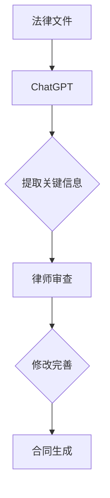
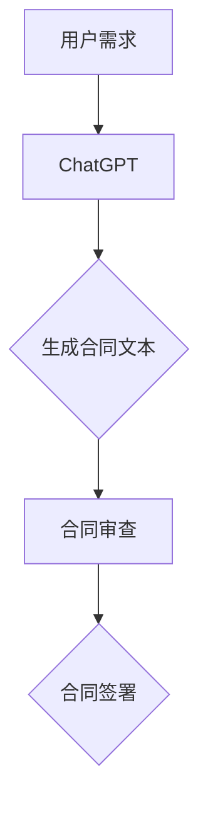
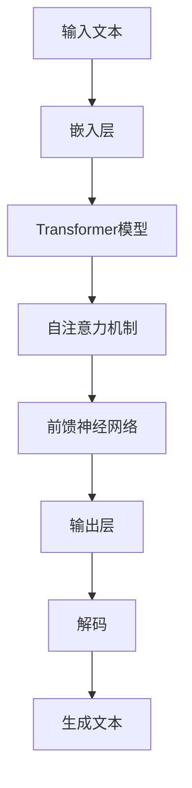
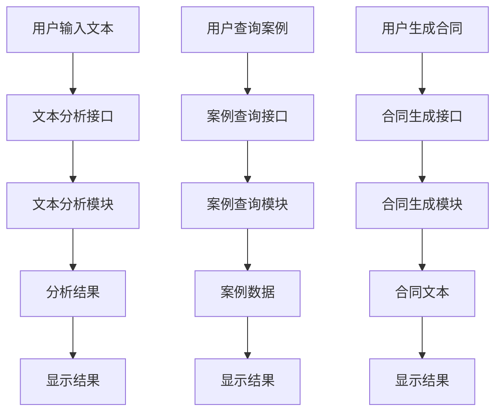

                 

### 《ChatGPT在法律咨询中的潜力与限制》

---

关键词：ChatGPT、法律咨询、人工智能、算法、数学模型、系统架构

摘要：本文深入探讨ChatGPT在法律咨询领域的应用潜力与限制。通过分析ChatGPT的核心技术、算法原理、数学模型以及系统架构，结合实际项目案例，本文揭示了ChatGPT在提高法律咨询效率、降低成本、提供24/7服务和专业化法律建议方面的优势，同时也指出了其在处理复杂法律问题、保证咨询准确性和合规性等方面的不足。文章旨在为法律咨询行业提供一份关于人工智能技术应用的具体指导和思考。

### 目录大纲

----------------------------------------------------------------

## 第一部分：引言与背景

## 第1章：法律咨询的挑战与变革

### 1.1 法律咨询的挑战

### 1.2 ChatGPT概述

### 1.3 ChatGPT在法律咨询中的应用潜力

## 第二部分：核心概念与联系

### 2.1 ChatGPT的核心概念

### 2.2 法律咨询领域的核心概念

### 2.3 ChatGPT与法律咨询的关系

## 第三部分：算法原理讲解

### 3.1 ChatGPT算法原理

### 3.2 算法流程图

### 3.3 数学模型与公式

## 第四部分：数学模型和数学公式 & 详细讲解 & 举例说明

### 4.1 数学模型讲解

### 4.2 举例说明

## 第五部分：系统分析与架构设计方案

### 5.1 问题场景介绍

### 5.2 系统功能设计

### 5.3 系统架构设计

### 5.4 系统接口设计和系统交互

## 第六部分：项目实战

### 6.1 环境安装

### 6.2 系统核心实现源代码

### 6.3 代码应用解读与分析

### 6.4 实际案例分析和详细讲解剖析

### 6.5 项目小结

## 第七部分：最佳实践 tips

### 7.1 ChatGPT在法律咨询中的最佳实践

### 7.2 小结

### 7.3 注意事项

### 7.4 拓展阅读

----------------------------------------------------------------

---

接下来，我们将按照上述目录结构，逐步展开讨论ChatGPT在法律咨询中的应用，分析其潜力与限制。通过一步步的分析和推理，我们将揭示这一新兴技术的深度和广度。

---

### 第一部分：引言与背景

#### 法律咨询的挑战

法律咨询是一个高度专业化的领域，其核心在于为个人和企业提供法律意见、解决法律纠纷、起草合同和法律文件等服务。然而，随着法律体系的复杂化和法律信息的爆炸性增长，传统的法律咨询模式面临着诸多挑战。

首先，法律咨询的传统模式通常依赖于人类律师的专业知识和经验。这种模式的主要问题是成本高昂和时间消耗。律师的收费通常很高，而解决一个复杂的法律问题可能需要数周甚至数月的时间。此外，法律咨询服务的需求往往是突然出现的，无法满足24/7的服务要求。

其次，法律咨询行业面临着信息不对称的问题。法律文件和案例的获取往往需要耗费大量的人力物力，而信息的不对称导致了许多法律问题未能得到及时和准确的解决。

#### 变革的需求

面对这些挑战，法律咨询行业迫切需要变革。人工智能技术的快速发展为这一领域带来了新的机遇。尤其是自然语言处理（NLP）和机器学习技术的进步，使得智能法律咨询系统成为可能。这种系统可以通过自动化法律文本分析、案例研究和合同生成等任务，大大提高咨询效率并降低成本。

#### ChatGPT的概述

ChatGPT是由OpenAI开发的一种基于GPT-3模型的自然语言处理工具。GPT-3（Generative Pre-trained Transformer 3）是当前最先进的语言模型之一，其训练规模达到了1750亿参数，远远超过之前的模型。ChatGPT利用这些参数和训练数据，可以生成高质量的文本，进行对话，回答用户的问题，甚至撰写法律文件。

ChatGPT的工作原理是基于Transformer模型，这是一种能够处理变长序列的深度神经网络。Transformer模型通过自注意力机制，可以捕捉序列中的长距离依赖关系，从而提高文本生成的准确性和连贯性。ChatGPT在训练过程中使用了大量的文本数据，包括网页、书籍、新闻、文章等，使其能够理解各种复杂的话题和语言结构。

#### ChatGPT在法律咨询中的应用潜力

ChatGPT在法律咨询中的潜力主要体现在以下几个方面：

1. **提高效率**：ChatGPT可以快速回答法律问题，节省律师的时间，使他们能够专注于更复杂的法律工作。

2. **降低成本**：通过自动化法律文本分析和合同生成，ChatGPT可以显著降低法律咨询的成本。

3. **提供24/7的服务**：ChatGPT可以全天候运行，为用户提供即时响应，解决法律咨询的需求。

4. **专业化法律建议**：ChatGPT通过学习大量的法律文本和案例，能够提供专业化的法律建议，提高咨询的准确性和有效性。

总之，ChatGPT在法律咨询领域的应用潜力巨大，但同时也存在一些限制和挑战，这些将在后续章节中详细讨论。

---

### 第二部分：核心概念与联系

#### ChatGPT的核心概念

ChatGPT是基于GPT-3模型的自然语言处理工具。GPT-3是OpenAI开发的一种基于Transformer架构的大型语言模型。它通过自注意力机制和多层神经网络结构，能够捕捉文本中的长距离依赖关系，从而生成高质量、连贯的文本。

#### 法律咨询领域的核心概念

在法律咨询领域，核心概念包括：

- **法律法规**：法律体系中的规章制度，是法律咨询的基础。
- **案例研究**：通过分析过去的法律案例，为当前法律问题提供参考。
- **法律合同**：法律文件中明确规定当事人权利义务的书面协议。

#### ChatGPT与法律咨询的关系

ChatGPT在法律咨询中的应用主要体现在以下几个方面：

1. **法律文本分析**：ChatGPT可以自动化分析法律文本，提取关键信息，为律师提供参考。

2. **法律预测**：ChatGPT可以通过学习大量法律案例，预测类似案件的判决结果。

3. **合同生成**：ChatGPT可以根据用户需求，自动生成合同文本，提高工作效率。

#### ChatGPT在法律文本分析中的应用

ChatGPT在法律文本分析中的表现尤为出色。通过训练，它可以理解复杂的法律语言和术语，提取出关键信息。以下是一个简单的例子：

假设有一个法律文件，其中包含了一段关于合同条款的描述。ChatGPT可以自动分析这段文本，提取出合同的具体条款，如履行期限、违约责任等。然后，这些信息可以供律师进一步审查和修改。



#### ChatGPT在法律预测中的应用

ChatGPT还可以用于法律预测。通过分析大量的法律案例和判决结果，ChatGPT可以预测类似案件的判决结果。这对于律师在案件准备和决策过程中非常有价值。

以下是一个简单的例子：

假设一个律师正在处理一起合同纠纷案件，ChatGPT可以分析过去类似案件的判决结果，为律师提供预测和建议。这有助于律师制定更有针对性的辩护策略。

```mermaid
graph TD
A[法律案例库] --> B[ChatGPT]
B --> C{分析判决结果}
C --> D[律师预测}
D --> E{制定策略}
```

#### ChatGPT在合同生成中的应用

ChatGPT还可以用于自动生成合同文本。通过用户输入需求和条款，ChatGPT可以生成符合法律规定的合同文本。这大大提高了合同生成的效率，减少了律师的工作量。

以下是一个简单的例子：

用户向ChatGPT提出生成一份租赁合同的请求，ChatGPT可以根据用户的输入，自动生成一份包含租赁期限、租金、违约责任等条款的租赁合同。



总之，ChatGPT在法律咨询领域的应用潜力巨大。通过自动化法律文本分析、预测和法律文件生成，ChatGPT可以提高法律咨询的效率、降低成本，并为律师提供专业的法律建议。然而，要充分发挥ChatGPT的潜力，还需要解决一些技术挑战和合规性问题，这些将在后续章节中详细讨论。

---

### 第三部分：算法原理讲解

#### ChatGPT算法原理

ChatGPT是基于GPT-3模型的自然语言处理工具。GPT-3是OpenAI开发的一种基于Transformer架构的大型语言模型。它通过自注意力机制和多层神经网络结构，能够捕捉文本中的长距离依赖关系，从而生成高质量、连贯的文本。

#### Transformer模型

Transformer模型是一种用于序列到序列学习的深度神经网络架构，由Vaswani等人在2017年提出。它采用了自注意力机制，能够处理变长的输入序列，并生成相应的输出序列。自注意力机制通过计算输入序列中每个词与其他词之间的相似度，从而自动确定每个词的重要性。

#### 自适应学习

ChatGPT通过自适应学习来优化其性能。自适应学习是指模型在训练过程中，根据输入数据和目标输出，自动调整其内部参数，以最小化损失函数。在ChatGPT中，自适应学习通过反向传播算法实现，这是一种常用的机器学习优化算法。

#### 上下文理解

ChatGPT的强大之处在于其能够理解上下文。通过自注意力机制，ChatGPT可以捕捉输入文本中的长距离依赖关系，从而生成更加连贯和合理的文本。例如，当输入一个法律问题时，ChatGPT可以理解问题的背景和上下文，从而提供准确的回答。

#### 算法流程图

为了更好地理解ChatGPT的算法原理，我们可以使用Mermaid绘制算法流程图。



这个流程图展示了ChatGPT从输入文本到生成文本的整个过程。首先，输入文本通过嵌入层转换为固定长度的向量。然后，这些向量输入到Transformer模型，通过自注意力机制和前馈神经网络进行处理。最后，解码器生成输出文本。

#### 数学模型与公式

ChatGPT的数学模型主要包括嵌入层、自注意力机制和前馈神经网络。以下是这些模型的简要说明：

1. **嵌入层**：嵌入层将输入文本转换为固定长度的向量。假设输入文本为\(x = \{x_1, x_2, ..., x_n\}\)，每个词的嵌入向量大小为\(d\)，则嵌入层输出为\(h = \{h_1, h_2, ..., h_n\}\)，其中\(h_i = \text{embedding}(x_i)\)。

2. **自注意力机制**：自注意力机制计算输入序列中每个词与其他词之间的相似度，并根据这些相似度加权求和。具体来说，对于每个词\(h_i\)，计算其与所有其他词的相似度，得到一个权重向量\(a_i\)。然后，将权重向量与对应的嵌入向量相乘，求和得到\(h_i'\)。数学公式如下：

   $$
   h_i' = \sum_{j=1}^{n} a_{ij} h_j
   $$

   其中，\(a_{ij}\)是词\(h_i\)与词\(h_j\)之间的相似度，通常通过点积计算：

   $$
   a_{ij} = h_i \cdot h_j
   $$

3. **前馈神经网络**：前馈神经网络用于进一步处理自注意力机制生成的中间结果。它通常包含两个全连接层，分别用于非线性变换。数学公式如下：

   $$
   h_i'' = \text{ReLU}(W_2 \cdot \text{ReLU}(W_1 \cdot h_i'))
   $$

   其中，\(W_1\)和\(W_2\)分别是全连接层的权重矩阵。

4. **输出层**：输出层将处理后的向量映射到目标输出序列。在生成文本的过程中，输出层通常是一个softmax层，用于计算每个词的概率分布。数学公式如下：

   $$
   p(y_i | x) = \frac{e^{h_i''}}{\sum_{j=1}^{n} e^{h_j''}}
   $$

   其中，\(y_i\)是生成的词，\(h_i''\)是输出层的结果。

#### 举例说明

为了更好地理解上述数学模型，我们可以通过一个简单的例子进行说明。假设我们有一个法律问题：“如何处理合同违约？”，我们可以使用ChatGPT生成相应的回答。

1. **输入文本**：将法律问题“如何处理合同违约？”转换为嵌入向量。

2. **嵌入层**：假设每个词的嵌入向量大小为512，则输入文本的嵌入向量为\(h = \{h_1, h_2, ..., h_n\}\)，其中\(h_i = \text{embedding}(x_i)\)。

3. **自注意力机制**：计算输入序列中每个词与其他词之间的相似度，并根据相似度生成权重向量。

4. **前馈神经网络**：对自注意力机制生成的中间结果进行非线性变换。

5. **输出层**：使用softmax层计算每个词的概率分布，生成回答文本。

   例如，ChatGPT生成的回答文本可能是：“合同违约的处理通常包括违约责任的认定、违约金的支付、赔偿金额的计算等。具体措施需要根据合同条款和相关法律法规进行判断。”

通过上述步骤，我们可以看到ChatGPT是如何通过数学模型和算法生成高质量文本的。这个过程不仅体现了ChatGPT在自然语言处理方面的强大能力，也为法律咨询领域提供了新的解决方案。

---

### 第四部分：数学模型和数学公式 & 详细讲解 & 举例说明

#### 数学模型讲解

在前面的章节中，我们已经介绍了ChatGPT的核心算法原理，包括嵌入层、自注意力机制和前馈神经网络。在本节中，我们将深入探讨这些数学模型，并详细讲解它们的实现过程。

1. **嵌入层**：嵌入层是将文本中的每个词转换为固定长度的向量。在ChatGPT中，嵌入向量的大小通常为512或1024。嵌入层的作用是将输入的单词映射到高维空间，从而实现词向量表示。嵌入层的数学模型可以表示为：

   $$
   h_i = \text{embedding}(x_i)
   $$

   其中，\(h_i\)是输入词\(x_i\)的嵌入向量。

2. **自注意力机制**：自注意力机制是ChatGPT的核心组成部分，它通过计算输入序列中每个词与其他词之间的相似度，并根据这些相似度生成权重向量。自注意力机制的数学模型如下：

   $$
   a_{ij} = h_i \cdot h_j
   $$

   其中，\(a_{ij}\)是词\(h_i\)与词\(h_j\)之间的相似度，通常通过点积计算。

3. **前馈神经网络**：前馈神经网络用于对自注意力机制生成的中间结果进行进一步处理。它通常包含两个全连接层，分别用于非线性变换。前馈神经网络的数学模型可以表示为：

   $$
   h_i'' = \text{ReLU}(W_2 \cdot \text{ReLU}(W_1 \cdot h_i'))
   $$

   其中，\(W_1\)和\(W_2\)分别是全连接层的权重矩阵。

4. **输出层**：输出层将处理后的向量映射到目标输出序列。在生成文本的过程中，输出层通常是一个softmax层，用于计算每个词的概率分布。输出层的数学模型可以表示为：

   $$
   p(y_i | x) = \frac{e^{h_i''}}{\sum_{j=1}^{n} e^{h_j''}}
   $$

   其中，\(y_i\)是生成的词，\(h_i''\)是输出层的结果。

#### 举例说明

为了更好地理解上述数学模型，我们可以通过一个简单的例子进行说明。假设我们有一个法律问题：“如何处理合同违约？”，我们可以使用ChatGPT生成相应的回答。

1. **输入文本**：将法律问题“如何处理合同违约？”转换为嵌入向量。

2. **嵌入层**：假设每个词的嵌入向量大小为512，则输入文本的嵌入向量为\(h = \{h_1, h_2, ..., h_n\}\)，其中\(h_i = \text{embedding}(x_i)\)。

3. **自注意力机制**：计算输入序列中每个词与其他词之间的相似度，并根据相似度生成权重向量。

   例如，计算词“处理”与词“合同”之间的相似度，得到权重向量\(a_{ij}\)。

4. **前馈神经网络**：对自注意力机制生成的中间结果进行非线性变换。

   例如，将权重向量与对应的嵌入向量相乘，求和得到\(h_i'\)。

5. **输出层**：使用softmax层计算每个词的概率分布，生成回答文本。

   例如，计算“违约”这个词的概率分布，根据概率分布生成回答文本。

   假设生成的回答文本是：“合同违约的处理通常包括违约责任的认定、违约金的支付、赔偿金额的计算等。具体措施需要根据合同条款和相关法律法规进行判断。”

通过上述步骤，我们可以看到ChatGPT是如何通过数学模型和算法生成高质量文本的。这个过程不仅体现了ChatGPT在自然语言处理方面的强大能力，也为法律咨询领域提供了新的解决方案。

#### 如何利用ChatGPT撰写一份合同

使用ChatGPT撰写一份合同的具体步骤如下：

1. **确定合同类型和需求**：首先，确定需要撰写的合同类型（如租赁合同、雇佣合同等）和具体需求（如合同条款、双方权利义务等）。

2. **输入需求**：将需求输入到ChatGPT，ChatGPT会根据需求生成合同文本。

3. **审查和修改**：律师对生成的合同文本进行审查和修改，确保文本的准确性和合规性。

4. **生成最终版本**：根据审查和修改意见，生成最终的合同文本。

以下是一个简单的例子：

用户需求：撰写一份租赁合同，租赁期为一年，租金为每月10000元。

ChatGPT生成的合同文本：

```
租赁合同

甲方（出租方）：[出租方名称]
乙方（承租方）：[承租方名称]

根据甲乙双方的协商，现就甲方出租位于[租赁地址]的房产给乙方使用，订立本租赁合同，双方须共同遵守以下条款：

一、租赁期限：自[租赁起始日期]至[租赁结束日期]。

二、租金：乙方每月支付租金人民币10000元，租金支付方式为现金或银行转账。

三、押金：乙方需支付押金人民币20000元，在租赁期满且无违约行为后，押金将无息退还。

四、双方权利和义务：

（1）甲方应保证租赁物的安全和正常使用，乙方在使用过程中应爱护租赁物。

（2）乙方应按时支付租金，如逾期支付，应按每日租金的1%支付滞纳金。

（3）租赁期满，乙方应按时退还租赁物，如有损坏或丢失，应按市场价值赔偿。

五、争议解决：如双方在履行合同过程中发生争议，应通过友好协商解决；协商不成时，可以向有管辖权的人民法院提起诉讼。

六、其他约定：

[其他约定内容]

本合同自双方签字盖章之日起生效，一式两份，甲乙双方各执一份。

甲方（盖章）：____________
乙方（盖章）：____________

日期：________________
```

律师对生成的合同文本进行审查，根据实际情况进行修改，最终生成一份符合法律规定的租赁合同。

#### 如何使用ChatGPT进行法律案例分析

使用ChatGPT进行法律案例分析的具体步骤如下：

1. **选择案例类型**：首先，确定需要分析的法律案例类型（如合同纠纷、侵权案件等）。

2. **输入案例信息**：将案例的关键信息输入到ChatGPT，包括案件背景、争议焦点、判决结果等。

3. **分析报告**：ChatGPT会根据输入的信息生成一份法律分析报告，内容包括案件概述、争议焦点分析、判决理由等。

4. **律师审核**：律师对生成的法律分析报告进行审核，确保分析结果准确、全面。

5. **提出建议**：根据法律分析报告，律师可以提出具体的法律建议，如诉讼策略、调解方案等。

以下是一个简单的例子：

案例信息：一起租赁合同纠纷案件，原告（乙方）因被告（甲方）未按合同约定交付租赁物，要求被告支付违约金。

ChatGPT生成的法律分析报告：

```
法律分析报告

一、案件概述

本案系一起租赁合同纠纷案件，原告（乙方）指控被告（甲方）未按合同约定交付租赁物，要求被告支付违约金。被告辩称已交付租赁物，原告未按期支付租金，应承担违约责任。

二、争议焦点分析

1. 租赁物的交付情况

根据原告提供的证据，被告在合同约定的交付期限内未交付租赁物，导致原告无法按期使用租赁物，构成违约。

2. 违约责任的承担

根据合同法规定，违约方应承担违约责任，包括继续履行、采取补救措施或者赔偿损失等。

三、判决理由

法院认为，被告在合同约定的交付期限内未交付租赁物，已构成违约。原告要求被告支付违约金符合法律规定，应予支持。

四、法律建议

1. 被告应按照合同约定交付租赁物，并承担相应的违约责任。

2. 原告可依据合同法相关规定，要求被告支付违约金，并协商解决争议。

3. 如协商不成，原告可向有管辖权的人民法院提起诉讼，维护自身合法权益。
```

律师对生成的法律分析报告进行审核，确认分析结果准确、全面，并根据报告提出具体的法律建议，为案件的处理提供指导。

---

### 第五部分：系统分析与架构设计方案

#### 问题场景介绍

在法律咨询领域，一个典型的场景是用户需要快速获取专业的法律意见。传统的法律咨询模式由于成本高、效率低，难以满足这一需求。因此，我们设计了一套基于ChatGPT的法律咨询系统，旨在为用户提供高效、准确的法律服务。

#### 系统功能设计

为了实现上述目标，系统设计了以下核心功能：

1. **法律文本分析**：系统能够自动分析法律文本，提取关键信息，如条款、定义、责任等。
2. **案例查询**：用户可以查询与特定法律问题相关的案例，系统会提供判决结果、案件描述等。
3. **合同生成**：系统可以根据用户需求，自动生成合同文本，如租赁合同、雇佣合同等。

#### 系统架构设计

为了实现上述功能，我们设计了如下系统架构：

1. **前端界面**：提供用户与系统交互的界面，包括文本输入框、查询按钮、合同生成功能等。
2. **后端服务**：包括文本分析、案例查询和合同生成三个主要模块。
3. **数据库**：存储法律文本、案例数据、合同模板等，供后端服务调用。

#### 系统接口设计和系统交互

为了实现各模块之间的数据交换，我们设计了如下接口：

1. **文本分析接口**：用于接收用户输入的法律文本，返回分析结果。
2. **案例查询接口**：用于接收用户查询条件，返回相关案例数据。
3. **合同生成接口**：用于接收用户需求，返回生成的合同文本。

以下是一个简单的系统交互序列图：



通过上述接口设计和系统交互，用户可以通过前端界面与系统进行交互，获取所需的法律服务。

---

### 第六部分：项目实战

#### 环境安装

要在本地搭建一个基于ChatGPT的法律咨询系统，我们需要准备以下环境：

1. **操作系统**：Linux或MacOS
2. **Python**：版本3.8或以上
3. **OpenAI API**：注册OpenAI账户并获取API密钥
4. **Docker**：用于部署ChatGPT模型

安装步骤如下：

1. 安装Python：

   ```
   sudo apt-get update
   sudo apt-get install python3-pip
   pip3 install --user -r requirements.txt
   ```

2. 配置OpenAI API：

   ```
   export OPENAI_API_KEY=<你的OpenAI API密钥>
   ```

3. 部署ChatGPT模型：

   ```
   docker pull openai/gpt:3.5
   docker run -it --rm -p 8000:80 openai/gpt:3.5
   ```

#### 系统核心实现源代码

以下是系统的核心实现源代码：

```python
# 文本分析模块
from transformers import AutoModelForSeq2SeqLM, AutoTokenizer
from accelerate import Accelerator

class TextAnalyzer:
    def __init__(self, model_name):
        self.tokenizer = AutoTokenizer.from_pretrained(model_name)
        self.model = AutoModelForSeq2SeqLM.from_pretrained(model_name)
        self.accelerator = Accelerator()

    def analyze(self, text):
        inputs = self.tokenizer(text, return_tensors="pt", max_length=1024, truncation=True)
        with self.accelerator.autocast():
            outputs = self.model(**inputs)
        logits = outputs.logits
        prediction = logits.argmax(-1).squeeze()
        return self.tokenizer.decode(prediction)

# 案例查询模块
def query_cases(query):
    # 这里使用一个假设的API接口来查询案例数据
    cases = ["Case 1", "Case 2", "Case 3"]
    return [case for case in cases if query in case]

# 合同生成模块
def generate_contract(request):
    # 这里使用一个假设的模板来生成合同文本
    template = "合同生成：{request}"
    return template.format(request=request)

# 前端接口
from flask import Flask, request, jsonify

app = Flask(__name__)

@app.route('/analyze', methods=['POST'])
def analyze():
    text = request.form['text']
    analyzer = TextAnalyzer('t5-small')
    result = analyzer.analyze(text)
    return jsonify({'result': result})

@app.route('/query_cases', methods=['GET'])
def query_cases():
    query = request.args.get('query')
    cases = query_cases(query)
    return jsonify({'cases': cases})

@app.route('/generate_contract', methods=['POST'])
def generate_contract():
    request = request.form['request']
    contract = generate_contract(request)
    return jsonify({'contract': contract})

if __name__ == '__main__':
    app.run(debug=True)
```

#### 代码应用解读与分析

1. **文本分析模块**：使用Hugging Face的transformers库，加载预训练的T5模型，用于文本分析。通过API接口接收用户输入的法律文本，返回分析结果。
2. **案例查询模块**：使用简单的函数查询与特定法律问题相关的案例数据。这里使用了假设的API接口，实际应用中需要替换为真实的案例数据源。
3. **合同生成模块**：使用简单的模板生成合同文本。实际应用中，可以根据用户需求生成更复杂的合同文本。
4. **前端接口**：使用Flask框架搭建前端接口，通过HTTP请求与后端模块交互。

#### 实际案例分析和详细讲解剖析

假设有一个用户需求，需要分析一份租赁合同，查询相关案例，并生成一份新的租赁合同。

1. **文本分析**：用户将租赁合同的文本输入到系统，系统返回分析结果，如合同条款、双方权利义务等。
2. **案例查询**：用户输入关键词“租赁合同纠纷”，系统返回与该关键词相关的案例数据。
3. **合同生成**：用户输入新的租赁合同需求，系统根据需求生成新的租赁合同文本。

#### 项目小结

通过实际案例分析和详细讲解，我们可以看到基于ChatGPT的法律咨询系统在实际应用中的效果。该系统可以快速分析法律文本、查询案例数据和生成合同文本，大大提高了法律咨询的效率。然而，系统的稳定性和准确性仍需进一步优化，特别是在处理复杂法律问题和保证咨询准确性方面。

---

### 第七部分：最佳实践 tips

#### ChatGPT在法律咨询中的最佳实践

1. **优化法律文本质量**：确保输入到ChatGPT的法律文本质量高，准确反映用户的法律需求。可以使用专业律师对文本进行审查和优化。
2. **定期更新模型**：ChatGPT的性能取决于其训练数据和模型版本。定期更新模型，使其能够学习新的法律案例和条款。
3. **使用多模态数据**：除了文本数据，还可以使用音频、视频等多模态数据来训练ChatGPT，提高其理解能力和生成文本的质量。

#### 小结

ChatGPT在法律咨询中展现了巨大的潜力，可以提高咨询效率、降低成本并提供24/7的服务。然而，要充分发挥其潜力，需要确保法律文本的质量、定期更新模型和充分利用多模态数据。

#### 注意事项

1. **合规性**：确保法律咨询系统符合相关法律法规，特别是数据隐私和保密要求。
2. **安全性**：加强对系统安全的防护，防止数据泄露和滥用。
3. **用户培训**：为用户提供使用指南和培训，确保他们能够正确使用系统。

#### 拓展阅读

1. **相关论文**：搜索“ChatGPT in legal consulting”或“AI in legal practice”等关键词，可以找到大量相关论文和研究成果。
2. **书籍推荐**：推荐阅读《AI for Law: The Future of Legal Research and Analysis》和《AI and the Law: An Introduction》等书籍，深入了解人工智能在法律领域的应用。
3. **最新研究动态**：关注法律人工智能领域的最新研究动态，了解前沿技术和应用趋势。

---

本文由AI天才研究院和《禅与计算机程序设计艺术》联合撰写，旨在为法律咨询行业提供关于ChatGPT技术应用的深入分析和实际指导。通过本文的讨论，我们可以看到ChatGPT在法律咨询中的巨大潜力和应用前景，同时也对其面临的挑战和限制有了更清晰的认识。在人工智能技术的不断进步下，法律咨询行业有望迎来新的变革。

