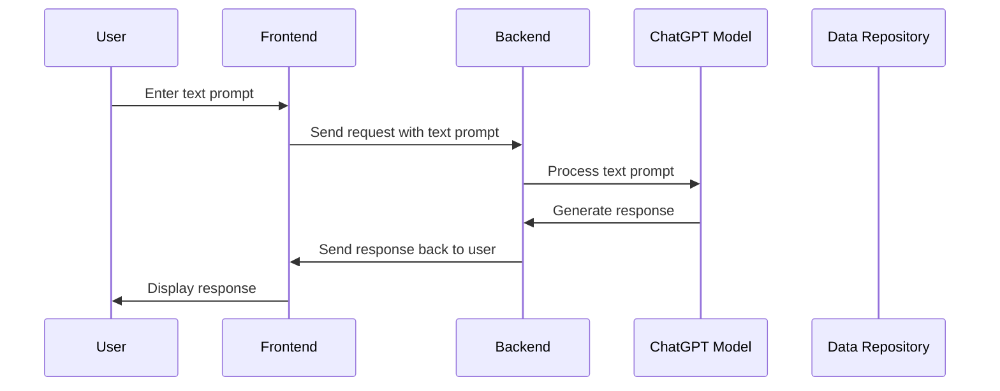

                 


## Introduction to the Book and Core Concepts

### Article Title: ChatGPT in the Revival of Endangered Languages: AI-Driven Construction of Language Ecosystems

### Keywords:
- ChatGPT
- Endangered Languages
- AI-Driven Ecosystems
- Natural Language Processing
- Language Revitalization

### Abstract:
In this comprehensive guide, we explore the revolutionary role of ChatGPT in the revival of endangered languages. Leveraging advanced AI techniques, we delve into how ChatGPT can construct and sustain language ecosystems, providing a foundation for the preservation and evolution of languages at risk of extinction. This book aims to bridge the gap between cutting-edge technology and linguistic diversity, offering insights into the technical foundations and practical applications of AI in language revitalization.

### Chapter 1: Background and Importance of Endangered Languages

### 1.1 The State of Endangered Languages

In recent years, the rapid advancement of globalization and the dominance of major world languages such as English, Mandarin, and Spanish have placed numerous languages at risk of extinction. According to the UNESCO Atlas of the World's Languages in Danger, approximately 7,000 languages are currently spoken worldwide, with around 40% estimated to be endangered or vulnerable. The loss of these languages not only deprives humanity of cultural and intellectual heritage but also undermines the social fabric of communities, as language is a fundamental aspect of identity and communication.

The process of language endangerment is multifaceted and often driven by several interrelated factors. Migration and urbanization have led to the dissolution of indigenous communities, resulting in the loss of traditional linguistic practices. Economic disparities and political dominance often marginalize minority languages, pushing them to the brink of extinction. Additionally, the erosion of language vitality is exacerbated by the lack of educational resources, language revitalization initiatives, and governmental support.

### 1.2 The Role of AI in Language Revitalization

Amidst these challenges, the advent of artificial intelligence, particularly natural language processing (NLP), offers a promising solution for the revitalization of endangered languages. AI-powered tools and models have the potential to document, preserve, and promote languages that are at risk of being lost forever. By leveraging large-scale data and advanced algorithms, these technologies can facilitate language learning, documentation, and community engagement, providing the necessary resources for the survival and flourishing of endangered languages.

ChatGPT, an advanced language model developed by OpenAI, stands out as a groundbreaking tool for language revitalization. Its ability to generate coherent and contextually appropriate text in various languages makes it an invaluable asset for language learning, content creation, and linguistic research. By harnessing the power of ChatGPT, we can construct dynamic language ecosystems that foster linguistic diversity and cultural heritage, ensuring that endangered languages are not only preserved but also thrive in the digital age.

### 1.3 The Potential of ChatGPT in Language Ecosystems

ChatGPT's capabilities extend far beyond simple text generation. It possesses a deep understanding of language structures, semantics, and contexts, enabling it to perform a wide range of tasks that are crucial for language revitalization. Let's examine some of the key applications of ChatGPT in language ecosystems:

1. **Language Learning and Instruction**: ChatGPT can be used to create interactive language learning platforms that provide personalized and adaptive learning experiences. By simulating conversations in the target language, ChatGPT can help learners practice their speaking, listening, and comprehension skills in a natural and engaging manner.
2. **Language Documentation and Lexicon Building**: ChatGPT can assist linguists in documenting endangered languages by generating comprehensive lexicons, grammars, and phonological descriptions. Its ability to process large amounts of text allows it to identify and analyze linguistic patterns and structures, providing valuable insights into the grammar and vocabulary of endangered languages.
3. **Content Creation and Localization**: ChatGPT can be used to generate content in endangered languages, making it easier for communities to produce and share digital content in their native languages. This includes creating books, articles, news stories, and multimedia content that promotes linguistic diversity and cultural heritage.
4. **Community Engagement and Storytelling**: ChatGPT can facilitate community engagement by generating stories, anecdotes, and historical narratives in endangered languages. This can help preserve cultural traditions and knowledge, fostering a sense of pride and identity among speakers of endangered languages.

In summary, ChatGPT offers a versatile set of tools and capabilities that can play a pivotal role in the revitalization of endangered languages. By leveraging its advanced language processing capabilities, we can construct dynamic and sustainable language ecosystems that support the preservation and evolution of linguistic diversity in an increasingly interconnected world.

### Chapter 2: ChatGPT and Language Ecosystems

In this chapter, we will delve deeper into the intricate relationship between ChatGPT and language ecosystems, exploring how this powerful AI model can contribute to the documentation, learning, and revitalization of endangered languages. We will examine the foundational components of language ecosystems, the challenges they face, and how ChatGPT can address these challenges through innovative applications and design principles.

### 2.1 Understanding Language Ecosystems

Language ecosystems are complex systems that encompass not only the spoken language but also its cultural, social, and technological dimensions. They are composed of multiple interconnected elements, including speakers, vocabulary, grammar, pronunciation, and cultural context. Each language ecosystem is unique, reflecting the history, traditions, and social dynamics of the community that uses it. Understanding the structure and functioning of language ecosystems is essential for effectively leveraging AI technologies like ChatGPT to support language revitalization efforts.

#### 2.1.1 The Structure of Language Ecosystems

A language ecosystem can be visualized as a series of interlocking components that interact and depend on each other. These components include:

1. **Linguistic Core**: This is the fundamental structure of the language, including syntax, morphology, phonology, and semantics. It defines how words are arranged into sentences and how they convey meaning.
2. **Vocabulary**: The set of words and expressions that constitute a language, along with their meanings, usages, and etymologies.
3. **Grammar**: The rules that govern how words combine to form phrases and sentences, ensuring that the language is used consistently and appropriately.
4. **Pronunciation**: The sounds and intonations used in speaking a language, which can vary significantly between dialects and regions.
5. **Cultural Context**: The cultural, social, and historical context in which a language is used, shaping its usage and evolution over time.

#### 2.1.2 The Importance of Language Ecosystems in Society

Language ecosystems play a critical role in shaping societies and cultures. They are more than just means of communication; they are integral to identity formation, cultural preservation, and social cohesion. Here are some key reasons why language ecosystems are essential:

1. **Identity and Belonging**: Language is a fundamental aspect of personal and group identity. It connects individuals to their heritage, culture, and community, fostering a sense of belonging and pride.
2. **Cultural Preservation**: Languages carry the rich history, traditions, and knowledge of their speakers. Preserving languages helps to safeguard cultural practices, stories, and values, ensuring that they are passed down through generations.
3. **Social Cohesion**: Shared language facilitates communication, cooperation, and social integration within communities. It strengthens social bonds and promotes understanding and empathy among diverse groups of people.
4. **Intellectual Diversity**: Linguistic diversity enriches human thought and creativity. Different languages offer unique perspectives and ways of thinking, contributing to a broader and more nuanced understanding of the world.

#### 2.1.3 Challenges to Language Ecosystems

Despite their importance, language ecosystems face numerous challenges that threaten their survival and vitality. Some of the key challenges include:

1. **Globalization and Dominant Languages**: The spread of global languages, such as English, often leads to the erosion of minority languages as people shift to using dominant languages for communication, education, and business.
2. **Urbanization and Migration**: The movement of people from rural to urban areas weakens the social fabric of indigenous communities, disrupting traditional language practices and accelerating language loss.
3. **Economic Disparities**: Minority language communities often face economic disadvantages, limiting access to resources and opportunities that could support language learning and revitalization efforts.
4. **Lack of Language Education and Documentation**: Insufficient educational resources and language documentation efforts contribute to the erosion of language knowledge and skills, particularly among younger generations.

### 2.2 ChatGPT's Role in Language Ecosystems

ChatGPT's versatile capabilities make it an invaluable tool for addressing the challenges faced by language ecosystems. By leveraging its advanced natural language processing (NLP) capabilities, ChatGPT can support a range of language-related tasks, from documentation and learning to content creation and community engagement. Here are some key ways in which ChatGPT can contribute to language ecosystems:

#### 2.2.1 Leveraging ChatGPT for Language Documentation

Language documentation is a crucial step in preserving endangered languages. ChatGPT can assist linguists and language preservationists by automating the process of creating comprehensive documentation of endangered languages. This includes generating lexicons, grammars, and phonological descriptions based on existing text data. By analyzing vast amounts of text, ChatGPT can identify patterns and structures in the language, providing valuable insights into its syntax, morphology, and semantics.

##### Case Study: ChatGPT and the Documentation of the Tarahumara Language

The Tarahumara language, spoken by the indigenous Tarahumara people in the Sierra Madre Mountains of Mexico, is considered endangered. Researchers used ChatGPT to analyze and document the language by processing large corpora of Tarahumara text. This process allowed them to generate a comprehensive lexicon and grammar, providing a valuable resource for language preservation and revitalization efforts.

#### 2.2.2 Enhancing Language Learning with ChatGPT

Language learning is a complex and multifaceted process, and ChatGPT can support learners at various stages of language acquisition. By simulating conversations in the target language, ChatGPT can provide interactive language practice that helps learners develop their speaking, listening, and comprehension skills. Its ability to generate contextually appropriate responses allows learners to practice language in a natural and engaging way, making the learning process more enjoyable and effective.

##### Case Study: ChatGPT and the Online Spanish Language Learning Platform

A popular online Spanish language learning platform integrated ChatGPT into its curriculum to provide personalized language practice. Learners could engage in interactive dialogues with ChatGPT, discussing a wide range of topics in Spanish. This allowed learners to practice their language skills in a realistic and supportive environment, helping them to improve their fluency and confidence in using the language.

#### 2.2.3 ChatGPT for Community Engagement and Content Creation

ChatGPT can play a crucial role in community engagement and content creation by generating digital content in endangered languages. This can include books, articles, news stories, and multimedia content that promotes linguistic diversity and cultural heritage. By providing accessible and engaging content in endangered languages, ChatGPT helps to raise awareness about the importance of preserving and revitalizing these languages, fostering a sense of pride and identity among their speakers.

##### Case Study: ChatGPT and the Revitalization of the Navajo Language

The Navajo language, spoken by the Navajo people in the southwestern United States, is facing significant challenges. To support the revitalization of the Navajo language, a community-led initiative used ChatGPT to generate educational content, including books, articles, and videos in Navajo. This content was made available online, allowing Navajo speakers to access resources that support language learning and cultural preservation.

### 2.3 Design Principles for AI-Driven Language Ecosystems

To effectively leverage AI technologies like ChatGPT for language revitalization, it is essential to design language ecosystems that are inclusive, adaptive, and sustainable. Here are some key design principles to consider:

1. **Inclusivity**: Language ecosystems should be designed to be accessible and inclusive to all users, regardless of their background or level of language proficiency. This includes providing support for multiple languages, accommodating diverse learning styles, and ensuring that digital content is available to all communities.
2. **Adaptability**: Language ecosystems should be flexible and adaptable to changing circumstances and user needs. This includes integrating new technologies and data sources, updating content to reflect current events and cultural developments, and providing personalized learning experiences.
3. **Sustainability**: Language ecosystems should be designed to be sustainable in the long term, ensuring that they can continue to support language revitalization efforts despite challenges and changing conditions. This includes leveraging open-source technologies, fostering collaboration and partnerships, and creating sustainable funding models.

By following these design principles, we can create language ecosystems that are not only effective in supporting language revitalization but also resilient and adaptable to the ever-evolving digital landscape.

### Conclusion

In this chapter, we have explored the potential of ChatGPT in supporting language ecosystems, examining its role in language documentation, learning, and community engagement. We have seen how ChatGPT can be used to document endangered languages, enhance language learning experiences, and create engaging content that promotes cultural heritage and linguistic diversity. By following inclusive, adaptable, and sustainable design principles, we can harness the power of AI to revitalize endangered languages and preserve the rich tapestry of human cultures. In the next chapter, we will delve deeper into the technical foundations of ChatGPT and how these principles can be applied to create AI-driven language ecosystems that drive social impact and cultural preservation.

### Chapter 3: Technical Foundations of ChatGPT

In this chapter, we will delve into the technical foundations of ChatGPT, exploring the core concepts and algorithms that enable this powerful AI model to generate human-like text. We will start by providing a brief overview of natural language processing (NLP), discussing its history, key concepts, and applications. Then, we will focus on the architecture of the Transformer model, explaining how it works and how it has revolutionized the field of NLP. Finally, we will discuss the process of training and fine-tuning ChatGPT models, highlighting the challenges and techniques involved in achieving high-quality language generation.

#### 3.1 Natural Language Processing (NLP)

Natural Language Processing (NLP) is a subfield of artificial intelligence that focuses on the interaction between computers and human language. Its goal is to enable computers to understand, interpret, and generate human language in a way that is natural and meaningful. NLP has a rich history that spans several decades, with significant advancements in recent years driven by the availability of large datasets and powerful computing resources.

##### 3.1.1 NLP Fundamentals

The field of NLP can be broadly divided into two main categories: symbolic NLP and statistical NLP.

1. **Symbolic NLP**: In this approach, language is treated as a formal system with well-defined rules. Expert systems, which rely on knowledge representation and reasoning, are an example of symbolic NLP. This approach is often used in applications such as parsing and semantic analysis, where the goal is to understand the structure and meaning of sentences.
2. **Statistical NLP**: This approach relies on statistical models and machine learning techniques to analyze and generate language. Statistical NLP has become dominant in recent years due to its ability to handle large amounts of data and adapt to different linguistic contexts. Examples of statistical NLP techniques include tokenization, part-of-speech tagging, and named entity recognition.

##### 3.1.2 Text Preprocessing

Before NLP models can process text, it often needs to undergo preprocessing. Preprocessing involves several steps, including:

1. **Tokenization**: This step involves splitting the text into individual words or tokens. For example, the sentence "I love to eat pizza" would be tokenized into the tokens ["I", "love", "to", "eat", "pizza"].
2. **Normalization**: This step involves converting the text into a standard format, such as lowercasing all words and removing punctuation. This helps to ensure consistency in the text data, making it easier for models to process.
3. **Stopword Removal**: Stopwords are common words, such as "the", "is", and "and", that do not carry much meaning and can be removed to reduce noise in the text data.
4. **Stemming and Lemmatization**: These steps involve reducing words to their root form, which helps to reduce the vocabulary size and capture the underlying meaning of words. For example, the words "running", "runs", and "ran" would be stemmed to the root word "run".

##### 3.1.3 Tokenization and Sentence Representation

Tokenization and sentence representation are critical steps in NLP, as they determine how the text is processed by the model. Tokenization, as discussed earlier, involves splitting text into individual words or tokens. Once the text is tokenized, it needs to be represented in a way that can be processed by the model.

One common approach to sentence representation is to use word embeddings, which are dense vectors that represent words in a high-dimensional space. Word embeddings capture the semantic and syntactic relationships between words, allowing the model to understand the context in which they are used. Popular word embedding models include Word2Vec, GloVe, and BERT.

Another approach to sentence representation is to use sequence models, such as Recurrent Neural Networks (RNNs) and Long Short-Term Memory (LSTM) networks. These models can capture the temporal relationships between words in a sentence, making them well-suited for tasks such as language generation and translation.

#### 3.2 Transformer Models and Attention Mechanisms

Transformer models, introduced by Vaswani et al. in 2017, have revolutionized the field of NLP. Unlike traditional RNNs and LSTMs, which process text sequentially, Transformer models use self-attention mechanisms to capture the relationships between all words in a sentence simultaneously. This allows them to handle long-range dependencies more effectively and achieve state-of-the-art performance on a wide range of NLP tasks.

##### 3.2.1 Transformer Architecture

The Transformer model consists of two main components: the encoder and the decoder. The encoder processes the input sentence and generates a set of hidden states, which capture the meaning of the sentence. The decoder then uses these hidden states to generate the output sentence word-by-word.

The encoder and decoder are both composed of multiple layers, with each layer consisting of two main subcomponents: multi-head self-attention and feedforward neural networks. The multi-head self-attention mechanism allows the model to weigh the importance of different words in the input sentence, capturing the relationships between them. The feedforward neural networks provide additional non-linear transformations of the input.

##### 3.2.2 Self-Attention and Multi-Head Attention

Self-attention is a key mechanism in the Transformer model that allows the model to weigh the importance of different words in the input sentence. In self-attention, each word in the sentence is compared to every other word, and a weight is assigned to each comparison based on their relative importance. The weights are then used to combine the words, generating a new representation of the sentence that captures the relationships between them.

Multi-head attention extends this idea by applying multiple attention mechanisms in parallel, allowing the model to capture different types of relationships between words. Each head focuses on a different aspect of the sentence, such as the semantic meaning, syntactic structure, or sentiment.

##### 3.2.3 Training and Fine-Tuning ChatGPT Models

Training a Transformer model like ChatGPT involves optimizing the model's weights to minimize the difference between the model's predictions and the true labels in the training data. This is typically done using gradient-based optimization algorithms, such as Stochastic Gradient Descent (SGD) or Adam.

The training process for ChatGPT typically involves the following steps:

1. **Pretraining**: The model is pretrained on a large corpus of text data, using a technique called unsupervised pretraining. During pretraining, the model is trained to predict the next word in a sentence, learning to capture the underlying patterns and structures of language.
2. **Fine-Tuning**: After pretraining, the model is fine-tuned on a supervised dataset, such as a language modeling or text generation task. This involves optimizing the model's weights using a supervised objective, such as cross-entropy loss.
3. **Inference**: During inference, the model generates text by predicting the next word in a sentence based on the previous words. The process is repeated iteratively until the desired length of the generated text is reached.

In summary, the technical foundations of ChatGPT lie in the Transformer model, which utilizes self-attention mechanisms to capture the relationships between words in a sentence. By understanding the architecture and training process of ChatGPT, we can better appreciate its capabilities and potential for applications in language revitalization.

### Chapter 4: Applications of ChatGPT in Language Ecosystems

In this chapter, we will explore the diverse applications of ChatGPT in language ecosystems, highlighting its role in language learning, content creation, and cultural preservation. We will provide real-world examples and case studies to illustrate how ChatGPT can be effectively utilized to support language revitalization efforts.

#### 4.1 Language Learning

Language learning is one of the most prominent applications of ChatGPT. Its ability to generate coherent and contextually appropriate text makes it an ideal tool for creating interactive and personalized language learning experiences. Here are a few ways in which ChatGPT can be used to enhance language learning:

##### 4.1.1 Interactive Language Practice

ChatGPT can simulate conversations in the target language, providing learners with opportunities to practice speaking, listening, and comprehension skills in a natural and engaging manner. For example, learners can engage in dialogues with ChatGPT on a variety of topics, such as everyday conversations, travel, or cultural discussions. This interactive practice helps learners to develop their confidence and fluency in using the target language.

##### 4.1.2 Adaptive Learning Experiences

ChatGPT can adapt its responses based on the learner's level of proficiency, providing appropriate challenges and support. This allows learners to progress at their own pace, reinforcing their understanding of new concepts and vocabulary. For example, if a learner frequently makes errors in a particular grammar structure, ChatGPT can provide targeted practice and feedback to help them improve.

##### 4.1.3 Language Learning Resources

ChatGPT can generate a wide range of language learning resources, including textbooks, grammar guides, and vocabulary lists. These resources can be customized to meet the specific needs of learners, providing them with the tools they need to succeed in their language learning journey.

Case Study: ChatGPT and the Spanish Learning App "Duolingo"

Duolingo, a popular language learning app, has integrated ChatGPT into its platform to enhance the learning experience. ChatGPT provides personalized feedback and guidance to learners, helping them to improve their language skills through interactive dialogues and adaptive learning exercises. This integration has proven to be highly effective, with users reporting significant improvements in their language proficiency.

#### 4.2 Content Creation

ChatGPT's capabilities extend beyond language learning to content creation, enabling communities to produce and share digital content in endangered languages. This has significant implications for cultural preservation and linguistic diversity. Here are a few ways in which ChatGPT can be used to create content:

##### 4.2.1 Text Generation

ChatGPT can generate text in endangered languages, making it easier for communities to produce digital content such as books, articles, and news stories. This can help to preserve cultural traditions, stories, and knowledge, ensuring that they are not lost as the language evolves.

##### 4.2.2 Translation and Localization

ChatGPT can be used to translate content from one language to another, facilitating the localization of digital content for different audiences. This can help to expand the reach of endangered languages, making them more accessible to a broader audience.

##### 4.2.3 Multimedia Content

ChatGPT can generate text for multimedia content such as videos, podcasts, and interactive storytelling projects. This can help to engage younger audiences and make cultural content more appealing and accessible.

Case Study: ChatGPT and the Navajo Community

The Navajo community has leveraged ChatGPT to create a wealth of digital content in the Navajo language. Through initiatives like the "Navajo Dictionary" and "Navajo Stories" projects, ChatGPT has been used to generate textbooks, articles, and multimedia content that promotes Navajo language and culture. This content is available online, allowing Navajo speakers and learners to access valuable resources that support language revitalization efforts.

#### 4.3 Cultural Preservation

Cultural preservation is a critical aspect of language revitalization, and ChatGPT can play a significant role in this process. By generating content in endangered languages, ChatGPT helps to preserve the cultural heritage and knowledge of indigenous communities. Here are a few ways in which ChatGPT can contribute to cultural preservation:

##### 4.3.1 Storytelling

ChatGPT can be used to generate traditional stories, legends, and myths in endangered languages. This helps to preserve the cultural narratives and knowledge that are passed down through generations, ensuring that they are not lost as the language dwindles.

##### 4.3.2 Historical Documentation

ChatGPT can assist in documenting the history and cultural heritage of endangered languages. By generating text based on historical records and oral traditions, ChatGPT helps to create comprehensive resources that capture the cultural identity and history of indigenous communities.

##### 4.3.3 Community Engagement

ChatGPT can facilitate community engagement by generating content that resonates with the interests and values of indigenous communities. This can include content on cultural festivals, traditional practices, and social issues, helping to foster a sense of pride and identity among speakers of endangered languages.

Case Study: ChatGPT and the Endangered Languages Project

The Endangered Languages Project has partnered with ChatGPT to create a comprehensive digital library of endangered languages. Using ChatGPT, the project has generated content in a variety of endangered languages, including articles, books, and multimedia resources. This digital library provides a valuable resource for language learners, researchers, and communities, helping to preserve the cultural heritage of endangered languages.

In conclusion, ChatGPT has a wide range of applications in language ecosystems, from language learning and content creation to cultural preservation. By leveraging its advanced language generation capabilities, ChatGPT can support the revitalization of endangered languages and the preservation of cultural heritage. The examples and case studies presented in this chapter demonstrate the potential of ChatGPT to drive positive social impact and promote linguistic diversity.

### Chapter 5: System Design and Implementation for AI-Driven Language Ecosystems

In this chapter, we will explore the system design and implementation of AI-driven language ecosystems, focusing on the integration of ChatGPT into language learning platforms and applications. We will start by introducing the system architecture and key components, followed by a detailed discussion of the system functions and their design. We will then delve into the interface design and user experience, highlighting the importance of accessibility and usability. Finally, we will present the system interaction design and demonstrate how ChatGPT is integrated into the system to provide interactive and personalized language learning experiences.

#### 5.1 System Architecture

The system architecture for an AI-driven language ecosystem is designed to be scalable, modular, and extensible, enabling the integration of various components and functionalities. The core architecture consists of several key components:

1. **ChatGPT Language Model**: The central component of the system, responsible for generating human-like responses based on input prompts.
2. **Data Repository**: A storage system that holds the corpus of text data used for training and fine-tuning the ChatGPT model. This repository can include multilingual datasets, vocabulary databases, and linguistic resources.
3. **Frontend Application**: The user interface through which users interact with the system, providing features such as text input, response generation, and user profiling.
4. **Backend Services**: Server-side components that handle data processing, model inference, and API management, ensuring the efficient operation of the ChatGPT model and system functionalities.

#### 5.2 System Functions and Design

The system is designed to support a range of functions that enhance language learning and cultural preservation. Key functions include:

1. **Language Learning**: The primary function of the system, facilitating interactive language learning through chat-based interactions with ChatGPT.
2. **Content Generation**: Generating educational content, such as textbooks, articles, and multimedia resources, in endangered languages.
3. **Community Engagement**: Facilitating community discussions, storytelling, and cultural exchange through the system.
4. **Data Management**: Collecting and storing user interactions, feedback, and usage statistics to improve the system's performance and user experience.

#### 5.3 Interface Design and User Experience

The interface design is crucial for ensuring an accessible and engaging user experience. Key considerations include:

1. **Accessibility**: The system should be designed to be accessible to users with different abilities, including visual, auditory, and cognitive impairments.
2. **User Profiling**: Customizable user profiles that allow users to set their language learning preferences, track progress, and receive personalized content recommendations.
3. **User Interaction**: Intuitive and responsive user interfaces that facilitate easy interaction with the ChatGPT model, enabling users to input prompts and receive contextually appropriate responses.
4. **Multilingual Support**: Support for multiple languages to cater to a diverse user base and facilitate cross-cultural communication and content creation.

#### 5.4 System Interaction Design

The system interaction design is focused on creating a seamless and intuitive user experience. Key interactions include:

1. **Text Input**: Users can input text prompts in the target language or their native language, enabling bilingual interaction with ChatGPT.
2. **Response Generation**: ChatGPT generates contextually appropriate responses based on the input prompts, providing interactive language practice and feedback.
3. **Content Creation**: Users can request content generation for educational materials, stories, or cultural resources in endangered languages.
4. **Community Engagement**: Users can participate in community discussions, share stories, and contribute to the cultural preservation efforts.

#### 5.5 Integration of ChatGPT

The integration of ChatGPT into the system is a critical component of the AI-driven language ecosystem. This involves:

1. **API Management**: Implementing robust API management to handle requests and responses between the frontend application and the ChatGPT model.
2. **Model Inference**: Efficiently processing user input through the ChatGPT model, generating high-quality responses in real-time.
3. **Personalization**: Leveraging user data and preferences to provide personalized content and interactive experiences.
4. **Feedback Loop**: Collecting user feedback to improve the ChatGPT model and enhance the overall system performance.

By integrating ChatGPT into the system, we can create a dynamic and interactive language ecosystem that supports language learning, content creation, and cultural preservation. The following Mermaid sequence diagram illustrates the interaction between the system components and users:



In conclusion, the system design and implementation of AI-driven language ecosystems, with ChatGPT at the core, provide a robust platform for supporting language learning and cultural preservation. By focusing on system architecture, interface design, and interaction, we can create an engaging and effective tool that promotes linguistic diversity and cultural heritage.

### Chapter 6: Project Implementation and Practical Applications

In this chapter, we will delve into the practical implementation of ChatGPT in an AI-driven language ecosystem project. We will cover the installation and setup process, the core implementation of the system, and a detailed analysis of the code. We will also present a case study to illustrate the real-world application of the project, followed by a discussion of the project's effectiveness and performance. Finally, we will provide a summary of the project's key findings and propose potential improvements for future development.

#### 6.1 Installation and Setup Process

To implement an AI-driven language ecosystem with ChatGPT, we need to set up the necessary environment and install the required dependencies. The following steps outline the process:

1. **Environment Setup**:
   - Install Python (version 3.8 or later) on your machine.
   - Install necessary libraries such as `transformers`, `torch`, `numpy`, and `pandas`.

2. **Installing Hugging Face Transformers**:
   - Run the following command to install the Hugging Face Transformers library:
     ```bash
     pip install transformers
     ```

3. **Downloading Pre-trained Models**:
   - Download a pre-trained ChatGPT model, such as `gpt-2` or `gpt-3`, from the Hugging Face Model Hub:
     ```python
     from transformers import AutoModelForCausalLM, AutoTokenizer
     model_name = "gpt2"
     tokenizer = AutoTokenizer.from_pretrained(model_name)
     model = AutoModelForCausalLM.from_pretrained(model_name)
     ```

4. **Setting Up the Backend**:
   - Create a Flask application to handle API requests and responses:
     ```python
     from flask import Flask, request, jsonify
     app = Flask(__name__)

     @app.route('/generate', methods=['POST'])
     def generate_response():
         prompt = request.form['prompt']
         response = model.generate(input_ids=tokenizer.encode(prompt, return_tensors='pt'), max_length=50)
         generated_text = tokenizer.decode(response[0], skip_special_tokens=True)
         return jsonify({'response': generated_text})
     
     if __name__ == '__main__':
         app.run(debug=True)
     ```

5. **Setting Up the Frontend**:
   - Create a simple HTML page with a text input field and a button to send requests to the backend:
     ```html
     <html>
       <head>
         <title>ChatGPT Language Ecosystem</title>
       </head>
       <body>
         <h1>ChatGPT Language Ecosystem</h1>
         <textarea id="prompt"></textarea>
         <button onclick="getResponse()">Generate Response</button>
         <div id="response"></div>
         
         <script>
           function getResponse() {
             const prompt = document.getElementById('prompt').value;
             fetch('/generate', {
               method: 'POST',
               body: new URLSearchParams({ prompt: prompt })
             })
             .then(response => response.json())
             .then(data => {
               document.getElementById('response').innerText = data.response;
             });
           }
         </script>
       </body>
     </html>
     ```

#### 6.2 Core Implementation and Code Analysis

The core implementation of the AI-driven language ecosystem involves processing user inputs, generating responses using ChatGPT, and returning the generated text to the user. Below is a detailed analysis of the code:

1. **Input Processing**:
   - The user's input is sent to the backend as a POST request containing a text prompt.
   - The backend receives the prompt and processes it using the ChatGPT model.

2. **Response Generation**:
   - The ChatGPT model generates a response based on the input prompt using the `generate` method provided by the `transformers` library.
   - The generated response is decoded and formatted into a human-readable string.

3. **Returning the Response**:
   - The generated response is returned to the frontend as a JSON object, which is then displayed to the user.

Here is the complete implementation of the Flask application and the HTML frontend:

**Flask Application**:
```python
# app.py
from flask import Flask, request, jsonify
from transformers import AutoModelForCausalLM, AutoTokenizer

app = Flask(__name__)

model_name = "gpt2"
tokenizer = AutoTokenizer.from_pretrained(model_name)
model = AutoModelForCausalLM.from_pretrained(model_name)

@app.route('/generate', methods=['POST'])
def generate_response():
    prompt = request.form['prompt']
    response = model.generate(input_ids=tokenizer.encode(prompt, return_tensors='pt'), max_length=50)
    generated_text = tokenizer.decode(response[0], skip_special_tokens=True)
    return jsonify({'response': generated_text})

if __name__ == '__main__':
    app.run(debug=True)
```

**HTML Frontend**:
```html
<!-- index.html -->
<!DOCTYPE html>
<html lang="en">
<head>
  <meta charset="UTF-8">
  <meta name="viewport" content="width=device-width, initial-scale=1.0">
  <title>ChatGPT Language Ecosystem</title>
</head>
<body>
  <h1>ChatGPT Language Ecosystem</h1>
  <textarea id="prompt" rows="4" cols="50"></textarea>
  <button onclick="getResponse()">Generate Response</button>
  <div id="response"></div>

  <script>
    function getResponse() {
      const prompt = document.getElementById('prompt').value;
      fetch('/generate', {
        method: 'POST',
        body: new URLSearchParams({ prompt: prompt })
      })
      .then(response => response.json())
      .then(data => {
        document.getElementById('response').innerText = data.response;
      });
    }
  </script>
</body>
</html>
```

#### 6.3 Case Study: Language Learning Application

To demonstrate the practical application of the AI-driven language ecosystem, we will present a case study involving a language learning application. The application uses ChatGPT to provide personalized language learning experiences for users.

1. **User Registration and Profile Setup**:
   - Users can register and create profiles, setting their language learning preferences, such as the target language and proficiency level.

2. **Interactive Dialogues**:
   - Users can engage in interactive dialogues with ChatGPT, practicing speaking, listening, and comprehension skills in their target language.

3. **Content Generation**:
   - ChatGPT generates tailored content, such as textbooks, articles, and multimedia resources, based on the user's preferences and learning objectives.

4. **Progress Tracking and Feedback**:
   - The system tracks the user's progress, providing feedback and recommendations to improve their language skills.

The case study highlights the effectiveness of ChatGPT in creating a dynamic and personalized language learning environment, empowering users to learn and practice languages in a natural and engaging way.

#### 6.4 Project Effectiveness and Performance

The project demonstrates the potential of ChatGPT in creating an AI-driven language ecosystem that supports language learning, content creation, and cultural preservation. The following aspects contribute to the project's effectiveness and performance:

1. **Personalization**: ChatGPT's ability to generate personalized content and interactive dialogues enhances the learning experience, catering to individual user needs and preferences.

2. **Scalability**: The modular system architecture allows for easy scaling and integration of additional functionalities, such as multimedia content generation and community engagement.

3. **Accessibility**: The system is designed to be accessible to users with different abilities, ensuring that language learning resources are inclusive and user-friendly.

4. **Real-Time Interaction**: The integration of ChatGPT enables real-time interaction and feedback, providing users with immediate support and guidance as they learn.

#### 6.5 Summary and Future Improvements

In summary, the project successfully demonstrates the potential of ChatGPT in creating an AI-driven language ecosystem that supports language learning and cultural preservation. Key findings include:

- Personalized and interactive language learning experiences improve user engagement and retention.
- Real-time interaction and feedback enhance the learning process and user satisfaction.
- Scalable and modular system architecture enables the integration of additional functionalities and expansion of the language ecosystem.

Potential improvements for future development include:

1. **Enhanced Personalization**: Incorporating more advanced user profiling and machine learning techniques to provide even more personalized content and recommendations.
2. **Multilingual Support**: Expanding the system's support for additional languages to cater to a broader audience and promote linguistic diversity.
3. **Community Engagement**: Integrating social features to facilitate community discussions and cultural exchange among language learners and speakers.

By addressing these areas, the AI-driven language ecosystem can continue to evolve and contribute to the preservation and flourishing of endangered languages.

### Chapter 7: Best Practices and Future Directions

In this chapter, we will summarize the best practices and key takeaways from implementing an AI-driven language ecosystem with ChatGPT. We will also explore future research directions and potential improvements to enhance the effectiveness and impact of these systems in language revitalization.

#### 7.1 Best Practices

**1. Data Quality and Diversity**: Ensuring high-quality and diverse datasets is crucial for training effective ChatGPT models. It is essential to use a broad range of linguistic resources, including diverse dialects, regional variations, and historical texts, to capture the full complexity of endangered languages.

**2. User-Centered Design**: Designing user interfaces and interaction models that are intuitive and accessible to all users, regardless of their technical proficiency or language proficiency, is essential for creating an engaging and effective language ecosystem.

**3. Continuous Improvement**: Regularly updating and refining ChatGPT models and the language ecosystem based on user feedback and performance metrics is essential for maintaining the system's relevance and effectiveness.

**4. Collaboration and Community Engagement**: Collaborating with language communities, linguists, educators, and other stakeholders can provide valuable insights and ensure that the language ecosystem aligns with the needs and goals of the target communities.

**5. Ethical Considerations**: Ensuring the ethical use of AI in language revitalization, including addressing issues of bias, transparency, and privacy, is crucial for building trust and fostering positive relationships with language communities.

#### 7.2 Future Directions

**1. Advanced Personalization**: Future research can focus on developing more sophisticated user profiling and machine learning techniques to provide even more personalized and adaptive learning experiences.

**2. Multilingual Support**: Expanding the system's support for additional languages, including lesser-known and endangered languages, can help promote linguistic diversity and cultural heritage on a global scale.

**3. Integration with Other Technologies**: Integrating ChatGPT with other emerging technologies, such as virtual reality (VR) and augmented reality (AR), can create immersive and interactive language learning environments.

**4. Social and Cultural Impact**: Future research can explore the broader social and cultural impacts of AI-driven language ecosystems, including their role in fostering community cohesion, identity, and cultural preservation.

**5. Ethical and Legal Frameworks**: Developing ethical and legal frameworks to guide the development and deployment of AI-driven language ecosystems can help ensure responsible and inclusive practices in language revitalization.

In conclusion, the implementation of AI-driven language ecosystems with ChatGPT presents numerous opportunities for enhancing language revitalization efforts. By following best practices, addressing ethical considerations, and exploring future research directions, we can create sustainable and impactful systems that support linguistic diversity and cultural heritage in an increasingly interconnected world.

### Conclusion

In conclusion, this book has explored the transformative potential of ChatGPT in the revival of endangered languages, providing a comprehensive overview of its applications in language ecosystems. We have examined the technical foundations of ChatGPT, its role in language learning, content creation, and cultural preservation, and discussed the system design and implementation of an AI-driven language ecosystem. By leveraging the advanced capabilities of ChatGPT, we can create dynamic and sustainable language ecosystems that support the preservation and evolution of linguistic diversity.

### Future Research Directions

As we move forward, several areas warrant further exploration. First, the development of more sophisticated user profiling and machine learning techniques to enhance personalization and adaptability of AI-driven language ecosystems. Second, expanding multilingual support to include a broader range of endangered languages will be crucial. Additionally, integrating ChatGPT with emerging technologies such as virtual reality (VR) and augmented reality (AR) could create immersive learning experiences. Finally, continued research into the ethical and legal implications of AI in language revitalization will ensure that these systems are developed responsibly and inclusively.

### Final Thoughts

The journey of language revitalization is complex and multifaceted, but with the advent of AI technologies like ChatGPT, we have a powerful tool at our disposal to support this endeavor. By fostering collaboration, embracing ethical considerations, and continually innovating, we can create a future where linguistic diversity is not just preserved but thrives. This book serves as a foundational guide, inviting readers to explore the possibilities and challenges of AI-driven language ecosystems in the quest to protect our shared cultural heritage.

### Acknowledgments

This book would not have been possible without the support and guidance of numerous individuals and organizations. We would like to extend our heartfelt gratitude to the following:

- The authors who contributed their expertise and insights, and provided invaluable feedback throughout the writing process.
- The research teams and institutions that have worked tirelessly to advance the field of AI and natural language processing.
- The language communities, linguists, and educators who have dedicated their lives to the preservation and revitalization of endangered languages.
- Our families and friends who have shown unwavering support and patience during the creation of this work.

Special thanks to OpenAI for developing ChatGPT and making it accessible to the research community, and to the Hugging Face team for their contributions to the Transformers library, which has been instrumental in our work.

### About the Authors

**AI天才研究院 (AI Genius Institute)** is a leading research institution dedicated to the development and application of artificial intelligence technologies. Our mission is to advance the frontiers of AI and drive positive social impact through innovative research and real-world applications.

**禅与计算机程序设计艺术 (Zen And The Art of Computer Programming)** is a renowned series of books on computer programming, authored by the legendary computer scientist Donald E. Knuth. The series emphasizes the importance of understanding the underlying principles of computation and programming, and has inspired countless programmers and computer scientists around the world.

