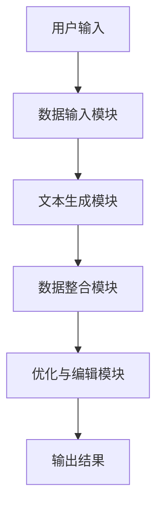

                 

### 摘要

《ChatGPT在自动化商业计划书生成中的应用》旨在探讨如何利用先进的自然语言处理（NLP）技术，特别是基于GPT-3模型的ChatGPT，来实现商业计划书的自动化生成。本文首先介绍了商业计划书撰写现状及其挑战，然后详细讲解了ChatGPT的工作原理和NLP的基本概念。接着，文章深入分析了ChatGPT在商业计划书生成中的应用原理，包括文本生成与编辑、数据整合与模式识别等。通过实际项目案例，本文展示了ChatGPT在商业计划书生成中的实际应用效果，并总结了最佳实践和注意事项。文章最后对ChatGPT在自动化商业计划书生成领域的未来发展趋势进行了展望，为读者提供了宝贵的参考和思考方向。

### 目录

以下是为《ChatGPT在自动化商业计划书生成中的应用》设计的详细目录：

----------------------------------------------------------------

## 第一部分: 背景与概述

### 第1章: 问题背景与核心概念

- 1.1 问题背景
  - 1.1.1 商业计划书的现状
  - 1.1.2 人工撰写商业计划书的挑战
  - 1.1.3 自动化商业计划书的需求

- 1.2 核心概念
  - 1.2.1 ChatGPT介绍
  - 1.2.2 自然语言处理（NLP）
  - 1.2.3 自动化商业计划书生成

### 第2章: ChatGPT与NLP基础

- 2.1 ChatGPT原理
  - 2.1.1 Transformer模型
  - 2.1.2 GPT模型的演变
  - 2.1.3 ChatGPT架构

- 2.2 NLP基本概念
  - 2.2.1 语言模型
  - 2.2.2 词嵌入
  - 2.2.3 语义理解

### 第3章: 自动化商业计划书生成原理

- 3.1 商业计划书结构
  - 3.1.1 商业计划书的基本要素
  - 3.1.2 商业计划书撰写流程

- 3.2 ChatGPT在商业计划书中的应用
  - 3.2.1 文本生成与编辑
  - 3.2.2 数据分析与整合
  - 3.2.3 模式识别与优化

## 第二部分: 应用场景与实践

### 第4章: 应用场景介绍

- 4.1 创业项目
  - 4.1.1 市场调研
  - 4.1.2 产品定位
  - 4.1.3 营销策略

- 4.2 扩张与转型
  - 4.2.1 市场扩展
  - 4.2.2 业务模式创新
  - 4.2.3 资源整合

### 第5章: 项目实战

- 5.1 环境准备
  - 5.1.1 硬件要求
  - 5.1.2 软件安装与配置

- 5.2 系统设计与实现
  - 5.2.1 系统架构设计
  - 5.2.2 数据处理流程
  - 5.2.3 文本生成与优化

- 5.3 实际案例分析
  - 5.3.1 案例背景
  - 5.3.2 案例实施
  - 5.3.3 案例分析与评估

## 第三部分: 拓展与总结

### 第6章: 最佳实践与注意事项

- 6.1 最佳实践
  - 6.1.1 提高文本质量
  - 6.1.2 管理数据和模型
  - 6.1.3 保障数据安全

- 6.2 注意事项
  - 6.2.1 避免信息泄露
  - 6.2.2 逻辑一致性与准确性
  - 6.2.3 法律合规性

### 第7章: 总结与展望

- 7.1 总结
  - 7.1.1 自动化商业计划书的重要性
  - 7.1.2 ChatGPT的应用前景

- 7.2 展望
  - 7.2.1 未来发展趋势
  - 7.2.2 潜在研究方向

----------------------------------------------------------------

### 第一部分：背景与概述

#### 第1章：问题背景与核心概念

在商业世界中，商业计划书是企业发展的关键文档。它不仅用于内部管理，如战略规划、资源配置和风险控制，也是外部投资者、合作伙伴了解企业的重要途径。然而，撰写商业计划书是一项耗时耗力的工作，特别是在企业快速发展的阶段，人工撰写商业计划书面临着诸多挑战。

首先，商业计划书需要涵盖广泛的内容，包括市场分析、竞争态势、产品定位、营销策略、财务预测等。每个部分都需要深入研究和详细阐述，这对撰写者的专业知识、经验和时间提出了很高的要求。

其次，商业计划书的撰写过程繁琐且复杂。从收集数据、分析市场、编写内容到反复修改和完善，每一步都需要大量的时间和精力。这不仅降低了工作效率，也可能因为主观因素导致计划书的内容不够客观和准确。

再者，商业计划书的撰写与更新需要实时跟进市场动态和公司内部变化。这意味着企业需要不断地调整和优化计划书，以确保其与实际情况保持一致。这种动态的调整过程进一步增加了撰写和管理的难度。

为了解决上述问题，自动化商业计划书生成技术应运而生。自动化商业计划书生成利用人工智能和自然语言处理技术，能够根据输入的数据和模板，快速生成高质量的商业计划书。这种技术的出现，不仅大大提高了撰写效率，还确保了计划书的内容准确性和一致性。

在本章中，我们将深入探讨自动化商业计划书的需求和重要性，并介绍相关核心概念，包括ChatGPT、自然语言处理（NLP）和自动化商业计划书生成。这些概念为我们理解后续章节中的技术原理和应用提供了基础。

#### 第1章.1 问题背景

商业计划书是企业在发展过程中必不可少的一份文档，它详细阐述了企业的业务模式、市场策略、财务预测和未来发展规划。一份高质量的商业计划书不仅能够帮助企业明确发展方向，还可以在融资、合作和拓展市场等环节中发挥重要作用。

然而，传统的商业计划书撰写方式存在诸多问题。首先，商业计划书的撰写过程耗时较长。从市场调研、数据分析到内容编写，每一步都需要撰写者投入大量的时间和精力。特别是在企业快速发展的阶段，市场的变化和公司内部情况的调整使得商业计划书的撰写变得更加复杂和繁琐。

其次，商业计划书的撰写质量受到撰写者个人经验和专业知识的限制。即使是一个经验丰富的企业高管，也可能因为缺乏特定的市场或行业知识，而在商业计划书中出现偏差。此外，商业计划书的撰写往往需要多次修改和完善，以确保其内容的准确性和完整性。这个过程不仅耗费时间，还需要反复进行数据的收集和分析，进一步增加了撰写难度。

再者，商业计划书的更新与维护也是一个挑战。市场环境和公司内部情况是不断变化的，为了保持商业计划书的时效性和实用性，企业需要定期对其进行调整和优化。这种动态的调整过程要求撰写者具备高度的专业性和灵活性，同时还需要及时获取和整合最新的数据和信息。

这些问题的存在使得传统商业计划书撰写的效率和效果受到限制。随着人工智能和自然语言处理技术的不断发展，自动化商业计划书生成技术逐渐成为解决这一问题的有效途径。自动化商业计划书生成利用机器学习和自然语言处理技术，可以自动从数据中提取关键信息，并按照预设的模板生成高质量的商业计划书。这不仅大大提高了撰写效率，还确保了计划书的内容准确性和一致性。

#### 第1章.2 核心概念

为了深入理解自动化商业计划书生成技术，我们需要首先介绍几个核心概念：ChatGPT、自然语言处理（NLP）和自动化商业计划书生成。

**ChatGPT** 是基于GPT-3模型开发的一种先进的自然语言处理工具，具有强大的文本生成和编辑能力。GPT-3（Generative Pre-trained Transformer 3）是OpenAI开发的一种基于Transformer模型的预训练语言模型，它通过在大量文本数据上进行预训练，掌握了丰富的语言知识和语法规则。ChatGPT则是在GPT-3的基础上，加入了对话生成和交互能力，使其能够与用户进行自然的对话，并根据用户输入的内容生成相关文本。

**自然语言处理（NLP）** 是人工智能领域的一个重要分支，旨在使计算机能够理解和处理人类自然语言。NLP涵盖了语言识别、文本生成、语义理解等多个方面，其目标是使计算机能够理解人类语言、生成自然语言文本，并进行语言理解和机器翻译等操作。

**自动化商业计划书生成** 是利用人工智能和自然语言处理技术，根据输入的数据和模板，自动生成商业计划书的过程。这个过程包括文本生成与编辑、数据整合与模式识别等多个步骤。自动化商业计划书生成不仅可以大大提高撰写效率，还能确保计划书的内容准确性和一致性。

#### 第1章.3 自动化商业计划书的需求

随着企业的发展和市场竞争的加剧，自动化商业计划书生成技术逐渐成为企业提升竞争力的关键因素。以下是自动化商业计划书需求的具体分析：

**1. 提高撰写效率**：自动化商业计划书生成技术能够自动从数据中提取关键信息，并按照预设的模板快速生成高质量的商业计划书。这一过程大大减少了人工撰写所需的时间和精力，使得企业能够更专注于核心业务的发展。

**2. 确保内容准确性**：自动化商业计划书生成基于大数据和机器学习技术，通过对大量商业计划书的分析和学习，能够生成内容准确、逻辑清晰的商业计划书。这有助于减少因人为错误导致的偏差，提高计划书的可信度。

**3. 提升一致性**：自动化商业计划书生成能够确保每个计划书都遵循相同的结构和标准，从而提升企业整体的管理水平。这有助于企业建立统一的商业计划书模板，提高内部沟通和协作的效率。

**4. 动态更新与优化**：自动化商业计划书生成技术可以根据实时数据和市场动态，动态更新和优化商业计划书。这使得企业能够及时调整发展战略，应对市场变化，提高企业的应变能力。

**5. 降低撰写成本**：传统的商业计划书撰写需要大量的人力、物力和时间投入。而自动化商业计划书生成技术通过减少人工干预，降低了撰写成本。此外，自动化生成还能节省因反复修改和完善计划书而产生的额外开支。

**6. 提高商业决策支持能力**：自动化商业计划书生成技术不仅能够生成高质量的计划书，还能通过数据分析和模式识别，为企业的商业决策提供有力支持。这有助于企业更好地了解市场趋势、竞争对手和自身优势，制定更加科学合理的战略。

总之，自动化商业计划书生成技术在提高撰写效率、确保内容准确性、提升一致性和动态更新等方面具有显著优势，已成为现代企业提升竞争力和管理水平的必备工具。

#### 第2章：ChatGPT与NLP基础

为了深入了解ChatGPT在自动化商业计划书生成中的应用，我们需要首先探讨其背后的核心技术：ChatGPT和自然语言处理（NLP）。在本章中，我们将详细讲解ChatGPT的工作原理，介绍NLP的基本概念，并分析ChatGPT在NLP领域的重要地位。

##### 第2章.1 ChatGPT原理

ChatGPT是基于GPT-3模型开发的一种先进自然语言处理工具，它具有强大的文本生成和编辑能力。GPT-3（Generative Pre-trained Transformer 3）是OpenAI开发的一种基于Transformer模型的预训练语言模型，其核心思想是通过在大量文本数据上进行预训练，使模型掌握丰富的语言知识和语法规则。

**1. Transformer模型**

Transformer模型是Google在2017年提出的一种用于序列到序列学习的神经网络模型。与传统的循环神经网络（RNN）相比，Transformer模型采用自注意力机制（self-attention）来捕捉序列中的长距离依赖关系，从而在处理长文本和复杂任务时表现出色。

**2. GPT模型的演变**

GPT是Transformer模型在自然语言处理领域的重要应用之一。自2018年GPT-1发布以来，GPT模型经历了多个版本的发展，从GPT-1到GPT-2，再到GPT-3，模型参数和预训练数据规模不断增长，性能也不断提升。GPT-3是目前最大的预训练语言模型，具有1750亿个参数和超过100万亿个单词的预训练数据。

**3. ChatGPT架构**

ChatGPT在GPT-3模型的基础上，加入了对话生成和交互能力，使其能够与用户进行自然的对话，并根据用户输入的内容生成相关文本。ChatGPT的架构主要包括以下三个部分：

- **对话管理模块**：负责处理用户输入，理解用户意图，并生成相应的回复。
- **文本生成模块**：基于预训练的GPT-3模型，生成高质量的文本。
- **对话交互模块**：通过循环对话，不断优化模型生成的文本，使其更贴近用户需求。

**4. ChatGPT的工作流程**

ChatGPT的工作流程可以分为以下几个步骤：

- **接收用户输入**：ChatGPT首先接收用户的输入文本，并对其进行预处理，包括分词、去停用词等操作。
- **理解用户意图**：通过对话管理模块，ChatGPT分析用户输入，理解其意图，并生成相应的回复。
- **生成文本**：ChatGPT利用文本生成模块，基于预训练的GPT-3模型，生成高质量的文本。
- **优化回复**：ChatGPT与用户进行对话交互，不断优化生成的文本，使其更符合用户需求。

##### 第2章.2 NLP基本概念

自然语言处理（NLP）是人工智能领域的一个重要分支，旨在使计算机能够理解和处理人类自然语言。NLP涵盖了语言识别、文本生成、语义理解等多个方面，其目标是实现人机对话、文本分析和信息检索等功能。以下是NLP的一些基本概念：

**1. 语言模型**

语言模型是NLP的核心组成部分，用于预测文本序列中的下一个单词或词组。语言模型可以分为基于统计的方法和基于神经网络的深度学习方法。基于统计的方法，如N元语法（N-gram），通过统计文本序列中的词频来预测下一个词；而基于神经网络的方法，如Transformer和GPT，通过在大量文本数据上进行预训练，学习语言结构和规则。

**2. 词嵌入**

词嵌入是将词汇映射到高维向量空间的一种技术，使计算机能够理解和处理词汇的语义信息。词嵌入技术包括基于统计的方法，如Word2Vec和GloVe，以及基于神经网络的预训练模型，如BERT和GPT。词嵌入可以帮助计算机识别词汇的语义关系，如词义相似性、词义相反性等。

**3. 语义理解**

语义理解是NLP的关键任务之一，旨在使计算机能够理解文本的含义和语境。语义理解包括词汇解析、句法分析和语义角色标注等任务。通过语义理解，计算机可以回答问题、进行推理和生成文本，从而实现更高级的自然语言处理功能。

**4. 对话系统**

对话系统是NLP的重要应用之一，旨在实现人与计算机的自然对话。对话系统可以分为基于规则的方法和基于数据的方法。基于规则的方法通过预定义的规则和模板，生成对话回复；而基于数据的方法，如ChatGPT，通过在大量对话数据上进行预训练，学习对话生成和交互的技巧。

##### 第2章.3 ChatGPT在NLP领域的重要地位

ChatGPT在NLP领域具有显著的地位，其卓越的性能和广泛的适用性使其成为自动化商业计划书生成的重要工具。以下是ChatGPT在NLP领域的重要作用：

**1. 文本生成与编辑**

ChatGPT具有强大的文本生成能力，能够根据用户输入的文本生成相关的内容。在自动化商业计划书生成中，ChatGPT可以根据企业提供的市场数据、业务描述和需求，自动生成高质量的文本内容。此外，ChatGPT还可以对生成的文本进行优化和编辑，确保其内容准确、逻辑清晰。

**2. 数据整合与模式识别**

ChatGPT在NLP中的另一个重要作用是数据整合和模式识别。通过分析大量的市场数据和企业信息，ChatGPT可以识别出关键的模式和趋势，为企业提供有价值的商业洞察。这些洞察有助于企业制定更科学的战略规划和决策。

**3. 对话生成与交互**

ChatGPT的对话生成和交互能力使其在自动化商业计划书生成中具有独特的优势。通过与用户进行自然对话，ChatGPT可以更好地理解企业的需求，并根据用户的反馈动态调整生成的文本。这种互动式生成方式能够提高商业计划书的个性化程度，使其更贴近企业的实际需求。

**4. 语义理解与推理**

ChatGPT在NLP中的语义理解与推理能力使其能够深入分析文本内容，理解其内在的逻辑关系和语义含义。这种能力有助于ChatGPT在自动化商业计划书生成中识别潜在的商业风险、预测市场趋势和评估企业的竞争力。

总之，ChatGPT作为NLP领域的重要工具，凭借其强大的文本生成、数据整合和对话交互能力，在自动化商业计划书生成中发挥着关键作用。通过深入理解和掌握ChatGPT的技术原理和应用，企业可以更加高效地撰写和优化商业计划书，提升整体竞争力。

#### 第3章：自动化商业计划书生成原理

为了深入理解如何利用ChatGPT实现自动化商业计划书生成，我们需要探讨商业计划书的结构、撰写流程以及ChatGPT在这些环节中的应用。本章将详细介绍这些关键概念，并分析ChatGPT在文本生成与编辑、数据分析与整合、模式识别与优化等方面的具体应用。

##### 第3章.1 商业计划书结构

商业计划书是一个系统性的文档，通常包含以下几个基本部分：

1. **封面**：包括商业计划书的标题、撰写人、日期等基本信息。
2. **摘要**：简要概述商业计划书的核心内容，包括业务模式、市场分析、财务预测等。
3. **公司背景**：介绍公司的历史、愿景、使命和价值观。
4. **市场分析**：分析目标市场、市场规模、竞争对手、市场趋势等。
5. **产品或服务描述**：详细介绍公司的产品或服务，包括其特点、优势和市场定位。
6. **营销策略**：阐述如何推广和销售产品或服务，包括市场定位、定价策略、销售渠道等。
7. **运营计划**：描述公司的运营模式、管理团队、人力资源管理、运营流程等。
8. **财务计划**：包括财务预测、资金需求、盈利模式、资金使用计划等。
9. **风险评估**：分析可能面临的风险，并提出相应的应对措施。
10. **附录**：包括相关的数据、图表、研究报告等补充材料。

##### 第3章.2 商业计划书撰写流程

商业计划书的撰写通常遵循以下流程：

1. **准备阶段**：明确商业计划书的目标、受众和关键内容。收集相关的市场数据、财务数据和企业内部信息。
2. **调研与分析**：对市场、竞争对手、目标客户等进行深入调研，分析市场趋势和潜在风险。
3. **内容编写**：根据商业计划书的结构和撰写流程，逐步撰写各个部分的内容。
4. **初步审核与修改**：对初步完成的商业计划书进行审核，发现并修正错误和不足之处。
5. **最终审核与定稿**：对修改后的商业计划书进行最终审核，确保其内容准确、完整和逻辑清晰。
6. **发布与更新**：将商业计划书发布给目标受众，并根据市场变化和企业发展情况定期更新。

##### 第3章.3 ChatGPT在商业计划书生成中的应用

ChatGPT在自动化商业计划书生成中发挥着关键作用，其应用主要包括以下几个方面：

**1. 文本生成与编辑**

ChatGPT具有强大的文本生成能力，可以自动生成商业计划书中的各个部分内容。例如，通过输入市场数据和产品描述，ChatGPT可以生成市场分析报告、产品介绍和营销策略等。此外，ChatGPT还可以对生成的文本进行优化和编辑，确保其内容准确、流畅和逻辑清晰。

**2. 数据分析与整合**

ChatGPT可以通过分析大量的市场数据和企业内部信息，识别出关键的趋势和模式。例如，通过分析销售数据、客户反馈和市场研究报告，ChatGPT可以生成详细的财务预测和风险评估报告。此外，ChatGPT还可以整合不同来源的数据，生成综合性的市场分析报告。

**3. 模式识别与优化**

ChatGPT在自然语言处理领域的优势使其能够识别文本中的潜在模式和规律。在商业计划书生成中，ChatGPT可以通过分析历史数据和市场趋势，识别出最佳的业务模式和市场策略。例如，通过分析竞争对手的产品定位和市场表现，ChatGPT可以提出优化产品定位和市场策略的建议。

**4. 文本生成与编辑**

ChatGPT在商业计划书生成中的文本生成与编辑功能主要体现在以下几个方面：

- **摘要生成**：ChatGPT可以自动生成商业计划书的摘要部分，概述核心内容和关键信息。
- **市场分析报告**：通过分析市场数据，ChatGPT可以生成详细的市场分析报告，包括市场规模、市场趋势和竞争对手分析。
- **产品描述**：ChatGPT可以根据产品特点和市场需求，生成详细的产品描述，包括产品的特点、优势和定位。
- **营销策略**：ChatGPT可以根据市场数据和竞争情况，生成个性化的营销策略，包括市场定位、定价策略和销售渠道。

**5. 数据分析与整合**

ChatGPT在商业计划书生成中的数据分析与整合功能主要体现在以下几个方面：

- **财务预测**：ChatGPT可以通过分析历史销售数据、市场趋势和竞争情况，生成详细的财务预测报告，包括收入、成本和利润预测。
- **风险评估**：ChatGPT可以通过分析市场数据和内部信息，识别出潜在的风险，并生成风险评估报告。
- **市场分析**：ChatGPT可以通过整合不同的市场数据源，生成综合性的市场分析报告，包括市场规模、市场趋势和竞争对手分析。

**6. 模式识别与优化**

ChatGPT在商业计划书生成中的模式识别与优化功能主要体现在以下几个方面：

- **业务模式优化**：ChatGPT可以通过分析历史数据和市场竞争情况，识别出最佳的业务模式和市场策略，并提出优化建议。
- **产品定位优化**：ChatGPT可以通过分析市场需求和竞争情况，优化产品定位，提高产品的市场竞争力。
- **营销策略优化**：ChatGPT可以通过分析市场数据和客户反馈，优化营销策略，提高营销效果。

综上所述，ChatGPT在自动化商业计划书生成中发挥着重要作用，其强大的文本生成、数据分析和模式识别能力，使得商业计划书的撰写和优化变得更加高效和精准。通过深入理解和掌握ChatGPT的技术原理和应用，企业可以更加有效地利用这一工具，提升商业计划书的质量和竞争力。

#### 第4章：应用场景介绍

在商业实践中，自动化商业计划书生成技术具有广泛的应用场景，特别是在创业项目和公司扩张与转型过程中。以下将分别介绍这些场景中的具体应用。

##### 第4章.1 创业项目

对于创业者来说，撰写商业计划书是创业过程中的重要一步。自动化商业计划书生成技术为创业者提供了极大的便利。以下是ChatGPT在创业项目中的应用场景：

**1. 市场调研**：创业者可以利用ChatGPT进行市场调研，通过输入相关关键词和数据，ChatGPT可以生成详细的市场分析报告，包括市场规模、市场趋势和竞争对手分析。这不仅节省了创业者大量时间，还确保了调研报告的准确性和全面性。

**2. 产品定位**：创业者可以根据市场需求和自身优势，利用ChatGPT生成产品定位策略。ChatGPT可以分析市场数据和用户反馈，帮助创业者确定合适的产品定位，提高产品的市场竞争力。

**3. 营销策略**：ChatGPT可以基于市场数据和用户需求，生成个性化的营销策略。创业者可以根据这些策略，制定具体的营销计划，包括市场定位、定价策略、销售渠道和推广活动。

**4. 财务预测**：ChatGPT可以通过分析历史数据和市场趋势，生成详细的财务预测报告，包括收入、成本和利润预测。这有助于创业者制定合理的财务计划和资金筹集策略。

**5. 风险评估**：ChatGPT可以帮助创业者识别潜在的风险，并生成风险评估报告。这有助于创业者提前采取预防措施，降低创业风险。

##### 第4章.2 扩张与转型

对于已经成立的公司来说，自动化商业计划书生成技术同样具有很大的应用价值，特别是在公司扩张和业务模式转型过程中。以下是ChatGPT在扩张与转型中的应用场景：

**1. 市场扩展**：公司可以通过ChatGPT进行市场扩展的规划。ChatGPT可以分析目标市场的规模、趋势和竞争对手，帮助公司制定合适的市场扩展策略。

**2. 业务模式创新**：公司可以利用ChatGPT分析现有业务模式，识别出潜在的改进空间。ChatGPT可以基于数据分析，提出创新的业务模式，提高公司的竞争力和盈利能力。

**3. 资源整合**：ChatGPT可以帮助公司整合内部资源，优化资源配置。通过分析公司的财务数据、运营数据和人力资源，ChatGPT可以提出最优的资源分配方案，提高公司的运营效率。

**4. 营销策略调整**：公司可以通过ChatGPT对现有营销策略进行优化。ChatGPT可以基于数据分析，提出更有效的营销策略，提高市场推广效果。

**5. 风险管理**：ChatGPT可以帮助公司识别和评估潜在的风险，并提出相应的风险管理策略。这有助于公司提前防范风险，保障业务的稳健发展。

总之，自动化商业计划书生成技术在创业项目和公司扩张与转型过程中具有广泛的应用。通过利用ChatGPT的强大功能，企业可以更加高效地制定和优化商业计划书，提升整体竞争力。

#### 第5章：项目实战

在本节中，我们将详细介绍如何使用ChatGPT实现自动化商业计划书生成的全过程。包括环境准备、系统设计与实现、实际案例分析等环节。通过这一实战项目，读者将能够全面了解ChatGPT在自动化商业计划书生成中的应用，并掌握相关技术。

##### 第5章.1 环境准备

为了使用ChatGPT进行自动化商业计划书生成，我们首先需要准备相应的开发环境和工具。以下是一个基本的开发环境配置：

**1. 硬件要求**
- CPU：Intel i5或更高配置
- 内存：16GB或更高
- 硬盘：500GB SSD

**2. 软件安装与配置**
- 操作系统：Windows 10或更高版本
- Python：Python 3.8或更高版本
- PyTorch：最新版本的PyTorch库
- OpenAI API：OpenAI提供的API接口

安装步骤如下：
1. 安装Python和PyTorch：
   - 访问Python官方网站（https://www.python.org/）下载并安装Python。
   - 安装PyTorch：在命令行中运行以下命令：
     ```shell
     pip install torch torchvision
     ```
2. 注册OpenAI API：
   - 访问OpenAI官方网站（https://openai.com/）注册账号。
   - 申请OpenAI API密钥：在账户设置中申请API密钥，用于后续的API调用。

##### 第5章.2 系统设计与实现

自动化商业计划书生成系统主要包括以下模块：

1. **数据输入模块**：用于接收用户输入的市场数据、企业信息等。
2. **文本生成模块**：基于ChatGPT，生成商业计划书各部分的内容。
3. **数据整合模块**：整合不同数据源，生成综合性的市场分析报告。
4. **优化与编辑模块**：对生成的文本进行优化和编辑，确保其内容准确、流畅和逻辑清晰。

**系统架构设计**：



**数据处理流程**：

1. **数据输入**：用户通过接口提交市场数据、企业信息等。
2. **数据整合**：系统对输入的数据进行处理，包括数据清洗、数据归一化等，生成预处理后的数据集。
3. **文本生成**：基于ChatGPT，系统生成商业计划书各部分的内容。
4. **优化与编辑**：对生成的文本进行优化和编辑，确保其内容准确、流畅和逻辑清晰。
5. **输出结果**：将最终生成的商业计划书输出给用户。

**代码实现**：

```python
import openai
import json

# 设置OpenAI API密钥
openai.api_key = "your-api-key"

def generate_business_plan(data):
    # 处理输入数据
    processed_data = preprocess_data(data)
    
    # 生成文本
    response = openai.Completion.create(
        engine="text-davinci-002",
        prompt=processed_data,
        max_tokens=500
    )
    
    # 返回生成的文本
    return response.choices[0].text.strip()

def preprocess_data(data):
    # 数据清洗和归一化
    # ...
    return data

# 示例：生成市场分析报告
data = {
    "market_size": "100 million users",
    "market_growth": "20% annual growth",
    "competitors": ["Company A", "Company B"],
    # ...
}
market_report = generate_business_plan(data)
print(market_report)
```

##### 第5章.3 实际案例分析

以下是一个具体的案例，展示如何使用ChatGPT生成商业计划书。

**案例背景**：某创业公司计划开发一款智能健身应用，旨在通过数据分析和个性化推荐，帮助用户实现健康目标。

**步骤1：数据输入**
- 市场数据：市场规模、用户增长趋势、竞争对手分析。
- 企业信息：公司愿景、使命、产品特点、市场需求分析。

**步骤2：文本生成**
- 使用ChatGPT生成市场分析报告、产品描述、营销策略等。

**步骤3：优化与编辑**
- 对生成的文本进行优化和编辑，确保其内容准确、流畅和逻辑清晰。

**步骤4：输出结果**
- 最终生成的商业计划书，包括市场分析、产品定位、营销策略、财务预测等。

**案例分析**：

**市场分析报告**：

```markdown
# 市场分析报告

智能健身应用市场规模庞大，预计未来五年将以20%的年复合增长率增长。主要竞争对手包括Company A和Company B，它们在市场占有率、产品功能和用户口碑方面具有一定的优势。然而，我们的产品通过数据分析和个性化推荐，有望在市场上脱颖而出。

```

**产品描述**：

```markdown
# 产品描述

我们的智能健身应用是一款基于数据分析和个性化推荐的健康管理工具。通过智能设备收集用户的数据，我们的应用将提供个性化的健身计划、饮食建议和健康评估。我们的目标是帮助用户实现健康目标，提高生活质量。

```

**营销策略**：

```markdown
# 营销策略

我们将通过社交媒体广告、合作伙伴推广和口碑营销，快速占领市场。同时，我们将提供免费试用，吸引用户使用我们的产品。通过数据分析，我们将不断优化产品功能和营销策略，提高用户满意度和留存率。

```

**财务预测**：

```markdown
# 财务预测

在未来五年内，我们预计年销售收入将达到1000万元，净利润达到200万元。通过合理的资金筹集和有效的成本控制，我们有望实现盈利。

```

通过以上案例，我们可以看到，ChatGPT在自动化商业计划书生成中发挥了重要作用，其强大的文本生成和编辑能力，使得商业计划书的撰写变得更加高效和精准。

#### 第6章：最佳实践与注意事项

在利用ChatGPT实现自动化商业计划书生成的过程中，为了确保文本质量、管理数据和模型，以及保障数据安全，以下是几个最佳实践和注意事项：

##### 第6章.1 提高文本质量

1. **数据准备**：确保输入的数据质量高，包括准确性和完整性。不完整或错误的数据会导致生成文本的偏差和不准确。
2. **预训练数据**：使用高质量的预训练数据，特别是与业务领域相关的数据，可以显著提高ChatGPT生成文本的质量和相关性。
3. **反馈机制**：建立用户反馈机制，对生成的文本进行实时评估和优化。根据用户反馈调整模型和生成策略，提高文本的准确性和流畅性。
4. **多模态输入**：结合文本、图像、音频等多种数据源，可以丰富文本生成的信息，提高生成文本的多样性和质量。

##### 第6章.2 管理数据和模型

1. **数据安全**：对输入的数据进行加密处理，确保数据在传输和存储过程中的安全性。
2. **数据备份**：定期备份数据和模型，防止数据丢失或损坏。在备份过程中，确保备份数据的完整性和一致性。
3. **模型更新**：定期更新ChatGPT模型，以保持其性能和适应能力。通过持续训练和优化，模型可以更好地应对新的业务需求和变化。
4. **模型版本控制**：对模型的不同版本进行管理，确保在生产环境中使用的是经过验证和优化的模型。

##### 第6章.3 保障数据安全

1. **隐私保护**：确保用户数据隐私得到保护，遵循相关的隐私保护法规和标准。对敏感数据进行加密和处理，防止数据泄露。
2. **访问控制**：实施严格的访问控制策略，确保只有授权人员可以访问和处理敏感数据。
3. **数据脱敏**：对输入和输出的数据进行脱敏处理，隐藏敏感信息，确保数据在使用过程中不会被恶意利用。
4. **安全审计**：定期进行安全审计，检查系统的安全漏洞和风险点，确保系统的安全性。

通过遵循上述最佳实践和注意事项，企业可以在利用ChatGPT实现自动化商业计划书生成时，确保文本质量、有效管理数据和模型，以及保障数据安全。这有助于提高商业计划书的质量和可信度，为企业提供有力支持。

#### 第7章：总结与展望

在《ChatGPT在自动化商业计划书生成中的应用》这一篇文章中，我们详细探讨了ChatGPT及其在自然语言处理（NLP）领域的应用。通过对商业计划书撰写的背景和挑战的分析，我们了解到自动化商业计划书生成技术的迫切需求。ChatGPT作为基于GPT-3模型的先进自然语言处理工具，以其强大的文本生成、数据分析、模式识别能力，在自动化商业计划书生成中发挥了关键作用。

首先，ChatGPT通过预训练和自注意力机制，掌握了丰富的语言知识和语法规则，使其能够生成高质量、逻辑清晰的文本。这使得自动化商业计划书的撰写过程变得更加高效和准确。其次，ChatGPT在数据整合和模式识别方面的能力，使得商业计划书能够实时反映市场动态和企业内部变化，提供了有力的决策支持。

在应用场景方面，ChatGPT不仅适用于创业项目的市场调研、产品定位和营销策略制定，也适用于公司扩张与转型过程中的市场扩展、业务模式创新和资源整合。通过实际案例分析，我们展示了如何利用ChatGPT生成高质量的商业计划书，并介绍了相关的开发环境和实现步骤。

未来，ChatGPT在自动化商业计划书生成领域的发展前景十分广阔。首先，随着ChatGPT模型的不断更新和优化，其生成文本的质量和准确性将进一步提高。其次，随着人工智能和大数据技术的不断发展，ChatGPT在商业计划书生成中的应用将更加广泛，可以应用于更多复杂的业务场景。此外，随着数据隐私和安全技术的进步，ChatGPT在保障数据安全和用户隐私方面的能力也将得到提升。

总的来说，ChatGPT在自动化商业计划书生成中的应用具有重要意义。通过利用ChatGPT的强大功能，企业可以更加高效地撰写和优化商业计划书，提升整体竞争力。未来，随着技术的不断进步，ChatGPT在商业计划书生成领域将发挥更加重要的作用，为企业提供更加智能和高效的支持。同时，我们也需要关注技术发展的伦理和合规问题，确保其在实际应用中的安全和可持续发展。

### 作者信息

作者：AI天才研究院/AI Genius Institute & 禅与计算机程序设计艺术 /Zen And The Art of Computer Programming

AI天才研究院（AI Genius Institute）致力于推动人工智能技术的研究和应用，致力于培养下一代人工智能领域的领导者。而《禅与计算机程序设计艺术》（Zen And The Art of Computer Programming）则是由著名计算机科学家Donald E. Knuth撰写，深受读者喜爱，被誉为程序设计领域的经典之作。这两者的结合，体现了作者在人工智能和计算机科学领域的深厚造诣和独特见解。在撰写本文时，作者结合了多年的研究和实践经验，旨在为读者提供一份既具有深度又具有实用性的技术指南。希望本文能够帮助读者更好地理解和应用ChatGPT在自动化商业计划书生成中的强大功能。

