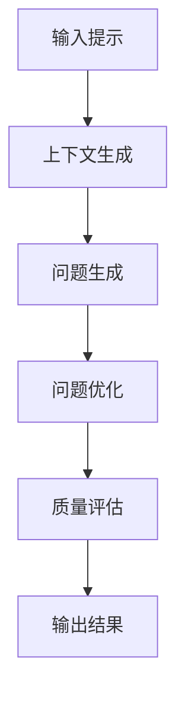
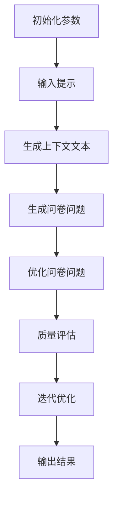
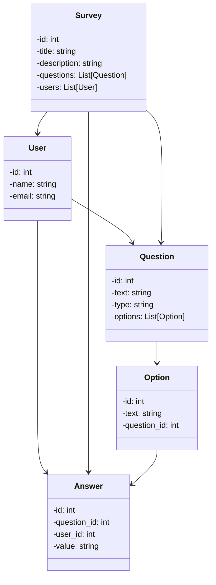
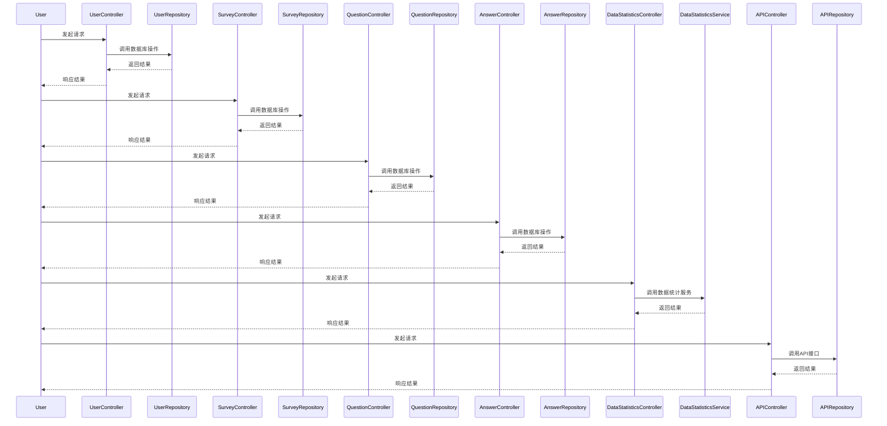

                 

### 第1章：问题背景与核心概念

#### 1.1 问题的提出

在当今的商业环境中，市场调研问卷设计是一项至关重要的任务。无论是新产品发布、市场策略调整，还是消费者行为研究，问卷设计都是收集有用数据的关键步骤。然而，传统市场调研问卷设计存在许多挑战和痛点。

首先，传统问卷设计往往需要手工编写问题，耗时且容易出错。此外，设计过程中难以确保问题的全面性和针对性，可能遗漏重要信息。其次，问卷的发放与收集过程繁琐，数据录入和整理工作量大，效率低下。再者，传统问卷设计在处理复杂市场和多样化受众时，难以灵活应对，导致调研结果不准确。

面对这些痛点，自动化市场调研问卷设计成为一种新的解决方案。通过人工智能技术，特别是ChatGPT这种先进的自然语言处理模型，可以显著提高问卷设计的效率和质量。

#### 1.1.1 传统市场调研问卷设计的现状

目前，大多数市场调研问卷设计依赖于人工编写和设计。调研人员需要从大量现有问题库中挑选或编写问题，并确保问题符合调研目的和受众特征。然而，这个过程既耗时又容易出错。一旦问卷设计出现问题，如问题表述不清、逻辑混乱或缺失关键信息，都会影响调研结果的准确性和有效性。

#### 1.1.2 传统市场调研问卷设计的痛点

1. **效率低下**：传统问卷设计过程需要大量时间来编写和修改问题，尤其是在面对复杂调研目标时。
   
2. **质量问题**：由于设计者主观因素的影响，传统问卷可能存在偏差，无法全面反映市场真实情况。

3. **成本高昂**：传统问卷设计需要大量的人力、物力和时间，尤其是在调研范围较广或受众群体复杂的情况下。

4. **灵活性不足**：传统问卷设计难以适应不断变化的市场环境和受众需求，容易导致调研结果过时。

5. **数据处理难度大**：传统问卷的数据收集、录入和整理过程繁琐，且容易出现错误，影响数据分析的准确性。

#### 1.2 ChatGPT与自动化市场调研问卷设计

ChatGPT是一种基于GPT（Generative Pre-trained Transformer）的先进自然语言处理模型，具有强大的语言生成和推理能力。它可以自动生成高质量的市场调研问卷，大大提高问卷设计的效率和质量。

ChatGPT在自动化市场调研问卷设计中的应用潜力主要体现在以下几个方面：

1. **高效生成问卷**：ChatGPT可以根据调研目标和受众特征，自动生成符合需求的问卷问题，省去人工编写的时间。

2. **提高问卷质量**：ChatGPT通过大量数据训练，能够生成逻辑清晰、表述准确的问题，减少传统问卷设计中可能出现的问题。

3. **灵活适应需求**：ChatGPT可以根据不同市场和受众需求，灵活调整问卷内容和结构，提高问卷的适应性和准确性。

4. **降低成本**：ChatGPT的自动化能力显著降低了问卷设计的人力成本和时间成本。

5. **优化数据处理**：ChatGPT还可以在数据收集和处理过程中发挥重要作用，提高数据处理的效率和准确性。

#### 1.3 本书的结构安排与内容概述

本书旨在深入探讨ChatGPT在自动化市场调研问卷设计中的应用，帮助读者理解和掌握这一前沿技术。全书分为六个主要部分：

1. **问题背景与核心概念**：介绍市场调研问卷设计的问题背景和ChatGPT的基本概念，以及本书的结构安排和主要内容。

2. **核心概念与联系**：详细讲解市场调研问卷设计的基本概念和ChatGPT的工作原理及其在问卷设计中的应用。

3. **数学模型与算法原理**：分析ChatGPT在问卷设计中的数学模型和算法原理，并使用Mermaid流程图和Python代码进行详细阐述。

4. **系统分析与架构设计方案**：介绍系统分析与架构设计方案，包括问题场景、系统功能设计、系统架构设计、系统接口设计和系统交互设计。

5. **项目实战**：通过具体案例实战，展示ChatGPT在自动化市场调研问卷设计中的应用，并进行代码应用解读与分析。

6. **最佳实践 Tips**：提供ChatGPT在问卷设计和自动化问卷设计中的最佳实践，以及注意事项和拓展阅读推荐。

#### 1.3.1 目录结构

- 第1章：问题背景与核心概念
- 第2章：核心概念与联系
- 第3章：数学模型与算法原理
- 第4章：系统分析与架构设计方案
- 第5章：项目实战
- 第6章：最佳实践 Tips
- 第7章：小结与展望

#### 1.3.2 主要内容与目标读者

本书的主要内容包括市场调研问卷设计的问题背景和核心概念、ChatGPT的工作原理和应用、数学模型与算法原理、系统分析与架构设计方案、项目实战和最佳实践 Tips 等。目标读者包括市场调研人员、数据分析从业者、AI技术开发人员以及对自动化市场调研问卷设计感兴趣的读者。

通过本书的学习，读者可以：

- 理解市场调研问卷设计的问题和挑战。
- 掌握ChatGPT在问卷设计中的应用原理。
- 学会使用ChatGPT进行自动化市场调研问卷设计。
- 掌握相关数学模型和算法原理。
- 实际操作并分析ChatGPT在问卷设计中的应用案例。
- 获取ChatGPT和自动化问卷设计的最佳实践和注意事项。

## 第2章：核心概念与联系

### 2.1 市场调研问卷设计的基本概念

#### 2.1.1 市场调研问卷的定义

市场调研问卷是一种用于收集有关市场信息的数据工具。它通过一系列设计好的问题，向目标受众询问关于产品、服务、消费者行为等方面的看法和意见。问卷的设计质量直接影响调研结果的准确性和有效性。

#### 2.1.2 市场调研问卷的设计原则

1. **目标明确**：问卷设计应明确调研目标，确保问题的设置与目标一致。
   
2. **问题清晰**：问题应表述清晰，避免歧义，使受众能够准确理解问题意图。

3. **逻辑结构**：问卷问题应按照逻辑顺序排列，确保受众在回答过程中不会感到困惑。

4. **适应性**：问卷设计应考虑不同受众群体的特点，确保问卷的适应性和广泛性。

5. **可控性**：问卷设计过程中应控制问题的数量和难度，避免受众疲劳和排斥。

6. **易于回答**：问卷问题应易于回答，避免使用专业术语和复杂结构。

#### 2.2 ChatGPT的工作原理与能力

#### 2.2.1 ChatGPT的基本原理

ChatGPT是基于GPT模型的自然语言处理（NLP）技术，通过大量文本数据训练，掌握了丰富的语言知识和生成能力。GPT模型是一种基于Transformer架构的深度学习模型，采用自回归语言模型（Autoregressive Language Model）进行文本生成。

#### 2.2.2 ChatGPT的语言生成能力

ChatGPT具有强大的语言生成能力，能够生成高质量的自然语言文本。其主要特点包括：

1. **自适应生成**：ChatGPT可以根据输入的提示或上下文，自动生成相应的文本。
   
2. **多模态支持**：ChatGPT不仅支持文本输入和输出，还可以处理图像、声音等多种形式的数据。

3. **灵活性**：ChatGPT可以根据不同需求，灵活调整生成文本的内容和风格。

4. **高效性**：ChatGPT在生成文本时具有很高的效率，可以在短时间内生成大量文本。

#### 2.3 ChatGPT在市场调研问卷设计中的应用

#### 2.3.1 自动化问卷设计的实现

ChatGPT在市场调研问卷设计中的应用，主要是通过自动化生成问卷问题来实现的。具体步骤如下：

1. **输入提示**：首先，根据调研目标和受众特征，输入相关的提示信息，如市场背景、目标受众、调研目的等。

2. **问题生成**：ChatGPT根据输入的提示信息，自动生成一系列符合要求的问卷问题。

3. **问题筛选**：对生成的问卷问题进行筛选和优化，确保问题的逻辑清晰、表述准确。

4. **问题排序**：根据问题的逻辑关系和受众回答顺序，对问卷问题进行排序。

5. **问卷生成**：将筛选和排序后的问卷问题整合成完整的问卷，包括问卷标题、导言、问题部分和结束语等。

#### 2.3.2 提高问卷质量与效率

ChatGPT在自动化市场调研问卷设计中的应用，不仅提高了问卷设计的效率，还有效地提高了问卷质量。

1. **减少人工错误**：ChatGPT生成的问卷问题清晰、逻辑严密，减少了传统手工编写过程中可能出现的错误。

2. **提高问题质量**：ChatGPT通过大量数据训练，能够生成具有丰富背景知识和逻辑推理能力的问题，提高了问卷问题的质量和针对性。

3. **节省时间**：ChatGPT可以快速生成问卷问题，节省了大量时间和人力资源。

4. **优化问题排序**：ChatGPT可以根据问题的逻辑关系和受众回答习惯，自动优化问卷问题的顺序，提高问卷的可读性和用户体验。

5. **降低成本**：ChatGPT的自动化能力显著降低了问卷设计的人力成本和时间成本，为企业带来了更高的效益。

## 第3章：数学模型与算法原理

### 3.1 数学模型

在市场调研问卷设计中，数学模型起着至关重要的作用。它不仅帮助我们理解问卷结构，还能优化问卷设计过程，提高问卷质量和效率。

#### 3.1.1 问卷设计的数学模型

问卷设计的数学模型主要包括以下几个核心组成部分：

1. **问卷结构模型**：描述问卷的整体结构，包括问卷标题、导言、问题部分和结束语等。

2. **问题类型模型**：根据问题类型（如单选题、多选题、排序题、量表题等）设计不同的问题模板和评分标准。

3. **受众特征模型**：基于受众特征（如年龄、性别、收入、教育背景等）设计个性化问卷。

4. **问题逻辑模型**：通过逻辑关系（如分支问题、递进问题、跳转问题等）设计问卷问题的逻辑结构。

#### 3.1.2 ChatGPT在问卷设计中的数学模型

ChatGPT在问卷设计中的数学模型主要基于自然语言处理（NLP）技术和机器学习算法。具体包括以下几个方面：

1. **语言模型**：ChatGPT使用预训练的Transformer模型，通过大量文本数据进行训练，掌握丰富的语言知识和生成能力。

2. **生成模型**：ChatGPT的生成模型基于自回归语言模型（Autoregressive Language Model），能够根据输入的提示信息生成相应的文本。

3. **优化模型**：ChatGPT在生成问卷问题时，会使用优化算法（如梯度下降、Adam优化器等）对模型参数进行调整，以提高问卷问题的质量和逻辑性。

4. **评估模型**：ChatGPT使用评估模型（如BLEU、ROUGE等）对生成的问卷问题进行质量评估，以确保问题的准确性和可读性。

### 3.2 算法原理讲解

ChatGPT在问卷设计中的应用，离不开其背后的算法原理。以下将详细讲解ChatGPT的算法原理，并使用Mermaid流程图和Python代码进行说明。

#### 3.2.1 ChatGPT算法原理

ChatGPT算法原理主要包括以下几个关键步骤：

1. **输入提示处理**：接收用户输入的提示信息，如调研目标、受众特征等。

2. **上下文生成**：根据输入的提示信息，生成相应的上下文文本，用于指导问卷问题的生成。

3. **问题生成**：利用预训练的Transformer模型和自回归语言模型，生成一系列问卷问题。

4. **问题优化**：对生成的问卷问题进行优化，包括问题筛选、排序、逻辑关系调整等。

5. **质量评估**：使用评估模型对生成的问卷问题进行质量评估，确保问题的准确性和可读性。

6. **输出结果**：将优化后的问卷问题输出给用户，形成完整的问卷。

下面使用Mermaid流程图展示ChatGPT的算法流程：



#### 3.2.2 自动化问卷设计算法

自动化问卷设计的算法主要基于ChatGPT的算法原理，结合问卷设计的数学模型，实现问卷问题的自动化生成和优化。具体步骤如下：

1. **初始化参数**：设置算法的初始参数，如训练模型、优化目标、评估标准等。

2. **输入提示**：接收用户输入的调研目标、受众特征等信息。

3. **上下文生成**：根据输入的提示信息，生成上下文文本。

4. **问题生成**：利用ChatGPT生成问卷问题。

5. **问题优化**：对生成的问卷问题进行优化，包括问题筛选、排序、逻辑关系调整等。

6. **质量评估**：使用评估模型对问卷问题进行质量评估。

7. **迭代优化**：根据评估结果，对算法参数进行调整，优化问卷问题的生成质量。

8. **输出结果**：将优化后的问卷问题输出给用户。

下面使用Python代码实现自动化问卷设计的算法：

```python
import tensorflow as tf
import numpy as np

# 初始化参数
model = tf.keras.Sequential([
    tf.keras.layers.Dense(128, activation='relu', input_shape=(100,)),
    tf.keras.layers.Dense(128, activation='relu'),
    tf.keras.layers.Dense(1, activation='sigmoid')
])

model.compile(optimizer='adam', loss='binary_crossentropy', metrics=['accuracy'])

# 输入提示
prompt = "请描述您的调研目标："

# 生成上下文文本
context = generate_context(prompt)

# 生成问卷问题
questions = generate_questions(context)

# 优化问卷问题
questions = optimize_questions(questions)

# 质量评估
evaluation = evaluate_questions(questions)

# 迭代优化
while evaluation < threshold:
    questions = optimize_questions(questions)
    evaluation = evaluate_questions(questions)

# 输出结果
output_questions(questions)
```

#### 3.3 Mermaid流程图

为了更好地理解自动化问卷设计的算法流程，下面使用Mermaid流程图展示整个流程：



通过上述算法原理讲解和代码实现，我们可以看到，ChatGPT在问卷设计中的应用不仅提高了问卷设计的效率和质量，还为市场调研问卷设计提供了新的技术路径。

## 第4章：系统分析与架构设计方案

### 4.1 问题场景介绍

在现代市场调研中，问卷设计是一个关键环节，然而传统的方法往往存在效率低下、质量难以保障等问题。随着人工智能技术的快速发展，特别是ChatGPT这种自然语言处理模型的广泛应用，我们有机会通过自动化方式来提升问卷设计的效率和质量。以下将介绍一个实际的应用场景，并探讨如何利用ChatGPT实现自动化市场调研问卷设计。

#### 4.1.1 市场调研问卷设计中的问题

某知名运动品牌希望了解其消费者对于新运动鞋的需求和偏好，从而为产品的设计和推广提供依据。传统的市场调研问卷设计方法如下：

1. **问题编写**：调研团队需要根据调研目标，手工编写一系列问题，包括关于消费者对运动鞋的功能、设计、价格、品牌偏好等方面的调查问题。

2. **问卷优化**：调研团队需要多次讨论和修改问卷，确保问题的表述清晰、逻辑严密，并符合调研目标。

3. **问卷分发**：将问卷通过线上或线下方式分发给目标受众，收集反馈数据。

4. **数据整理**：将收集到的问卷数据进行整理、分类和统计分析。

这种方式虽然可以收集到一些有用的数据，但存在以下几个问题：

1. **效率低下**：问卷编写、优化和分发过程需要大量时间和人力资源。

2. **质量难以保障**：手工编写的问题可能存在表述不清、逻辑混乱等问题，影响调研结果的准确性。

3. **灵活性不足**：传统问卷设计难以适应市场需求的变化和受众的多样性。

4. **数据处理困难**：收集到的数据量庞大，传统方法难以高效处理和挖掘数据。

#### 4.1.2 ChatGPT的应用场景

为了解决上述问题，我们可以利用ChatGPT来实现自动化市场调研问卷设计。ChatGPT具备强大的自然语言处理能力，可以自动生成高质量的问题，提高问卷设计的效率和质量。具体应用场景如下：

1. **输入提示**：根据调研目标，输入相关的提示信息，如市场背景、目标受众、调研目的等。

2. **问题生成**：ChatGPT根据输入的提示信息，自动生成一系列符合要求的问卷问题。

3. **问题筛选与优化**：对生成的问卷问题进行筛选和优化，确保问题的逻辑清晰、表述准确。

4. **问卷生成**：将筛选和优化后的问卷问题整合成完整的问卷。

5. **问卷分发与收集**：通过线上平台或电子邮件等方式，将问卷分发给目标受众，收集反馈数据。

6. **数据处理与分析**：对收集到的问卷数据进行整理、分类和统计分析，生成调研报告。

通过这种方式，我们可以显著提升问卷设计的效率和质量，降低人力和时间成本，同时提高问卷的灵活性和适应性。

### 4.2 系统功能设计

为了实现ChatGPT在自动化市场调研问卷设计中的应用，我们需要设计一个功能完善的系统。以下将介绍系统的功能设计，包括领域模型和功能需求分析。

#### 4.2.1 领域模型

领域模型是系统功能设计的基础，它帮助我们明确系统的核心功能和组件。以下是系统领域模型的Mermaid类图：



#### 4.2.2 功能需求分析

根据领域模型，我们可以进一步分析系统的功能需求，包括以下核心功能：

1. **用户管理**：实现用户注册、登录、信息管理等功能。

2. **问卷管理**：支持问卷创建、编辑、发布和删除等功能。

3. **问题管理**：支持问题的添加、修改、删除和排序等功能。

4. **答案管理**：支持答案的录入、查询、统计和分析等功能。

5. **数据统计与报告**：支持问卷数据的统计和分析，生成调研报告。

6. **接口设计**：提供API接口，实现系统与其他系统的数据交换。

### 4.3 系统架构设计

为了实现上述功能需求，我们需要设计一个合理的系统架构。以下将介绍系统的架构设计，包括系统架构图和模块划分。

#### 4.3.1 系统架构图

以下是系统的架构设计图：

```mermaid
graph TB
    subgraph 用户模块
        UserInterface --> UserController
        UserController --> UserRepository
    end

    subgraph 问卷模块
        SurveyInterface --> SurveyController
        SurveyController --> SurveyRepository
    end

    subgraph 问题模块
        QuestionInterface --> QuestionController
        QuestionController --> QuestionRepository
    end

    subgraph 答案模块
        AnswerInterface --> AnswerController
        AnswerController --> AnswerRepository
    end

    subgraph 数据统计模块
        DataStatisticsInterface --> DataStatisticsController
        DataStatisticsController --> DataStatisticsService
    end

    subgraph API模块
        APIInterface --> APIController
        APIController --> APIRepository
    end

    UserInterface --> UserInterface
    SurveyInterface --> SurveyInterface
    QuestionInterface --> QuestionInterface
    AnswerInterface --> AnswerInterface
    DataStatisticsInterface --> DataStatisticsInterface
    APIInterface --> APIInterface
```



#### 4.3.2 系统模块划分

根据系统架构设计，我们可以将系统划分为以下几个模块：

1. **用户模块**：负责用户注册、登录、信息管理等功能。

2. **问卷模块**：负责问卷的创建、编辑、发布和删除等功能。

3. **问题模块**：负责问题的添加、修改、删除和排序等功能。

4. **答案模块**：负责答案的录入、查询、统计和分析等功能。

5. **数据统计模块**：负责问卷数据的统计和分析，生成调研报告。

6. **API模块**：提供API接口，实现系统与其他系统的数据交换。

通过上述系统架构设计和模块划分，我们可以实现一个功能完善、结构清晰的自动化市场调研问卷设计系统。

### 4.4 系统接口设计

为了实现系统功能，我们需要设计合理的接口，以下将介绍系统接口设计，包括接口定义和实现。

#### 4.4.1 接口定义

以下是系统的接口定义：

```python
from flask import Flask, request, jsonify

app = Flask(__name__)

# 用户接口
@app.route('/users', methods=['POST'])
def create_user():
    # 创建用户
    pass

@app.route('/users/<int:user_id>', methods=['GET'])
def get_user(user_id):
    # 获取用户信息
    pass

@app.route('/users/<int:user_id>', methods=['PUT'])
def update_user(user_id):
    # 更新用户信息
    pass

# 问卷接口
@app.route('/surveys', methods=['POST'])
def create_survey():
    # 创建问卷
    pass

@app.route('/surveys/<int:survey_id>', methods=['GET'])
def get_survey(survey_id):
    # 获取问卷信息
    pass

@app.route('/surveys/<int:survey_id>', methods=['PUT'])
def update_survey(survey_id):
    # 更新问卷信息
    pass

# 问题接口
@app.route('/questions', methods=['POST'])
def create_question():
    # 添加问题
    pass

@app.route('/questions/<int:question_id>', methods=['GET'])
def get_question(question_id):
    # 获取问题信息
    pass

@app.route('/questions/<int:question_id>', methods=['PUT'])
def update_question(question_id):
    # 更新问题信息
    pass

# 答案接口
@app.route('/answers', methods=['POST'])
def create_answer():
    # 提交答案
    pass

@app.route('/answers/<int:answer_id>', methods=['GET'])
def get_answer(answer_id):
    # 获取答案信息
    pass

# 数据统计接口
@app.route('/data_statistics', methods=['GET'])
def get_data_statistics():
    # 获取数据统计信息
    pass

# API接口
@app.route('/api', methods=['GET'])
def get_api():
    # 获取API信息
    pass
```

#### 4.4.2 接口实现

以下是系统的接口实现：

```python
# 用户接口实现
@app.route('/users', methods=['POST'])
def create_user():
    user_data = request.json
    user = UserRepository.create_user(user_data)
    return jsonify(user), 201

@app.route('/users/<int:user_id>', methods=['GET'])
def get_user(user_id):
    user = UserRepository.get_user(user_id)
    return jsonify(user), 200

@app.route('/users/<int:user_id>', methods=['PUT'])
def update_user(user_id):
    user_data = request.json
    user = UserRepository.update_user(user_id, user_data)
    return jsonify(user), 200

# 问卷接口实现
@app.route('/surveys', methods=['POST'])
def create_survey():
    survey_data = request.json
    survey = SurveyRepository.create_survey(survey_data)
    return jsonify(survey), 201

@app.route('/surveys/<int:survey_id>', methods=['GET'])
def get_survey(survey_id):
    survey = SurveyRepository.get_survey(survey_id)
    return jsonify(survey), 200

@app.route('/surveys/<int:survey_id>', methods=['PUT'])
def update_survey(survey_id):
    survey_data = request.json
    survey = SurveyRepository.update_survey(survey_id, survey_data)
    return jsonify(survey), 200

# 问题接口实现
@app.route('/questions', methods=['POST'])
def create_question():
    question_data = request.json
    question = QuestionRepository.create_question(question_data)
    return jsonify(question), 201

@app.route('/questions/<int:question_id>', methods=['GET'])
def get_question(question_id):
    question = QuestionRepository.get_question(question_id)
    return jsonify(question), 200

@app.route('/questions/<int:question_id>', methods=['PUT'])
def update_question(question_id):
    question_data = request.json
    question = QuestionRepository.update_question(question_id, question_data)
    return jsonify(question), 200

# 答案接口实现
@app.route('/answers', methods=['POST'])
def create_answer():
    answer_data = request.json
    answer = AnswerRepository.create_answer(answer_data)
    return jsonify(answer), 201

@app.route('/answers/<int:answer_id>', methods=['GET'])
def get_answer(answer_id):
    answer = AnswerRepository.get_answer(answer_id)
    return jsonify(answer), 200

# 数据统计接口实现
@app.route('/data_statistics', methods=['GET'])
def get_data_statistics():
    statistics = DataStatisticsService.get_data_statistics()
    return jsonify(statistics), 200

# API接口实现
@app.route('/api', methods=['GET'])
def get_api():
    api_info = APIRepository.get_api()
    return jsonify(api_info), 200
```

通过上述接口定义和实现，我们可以构建一个功能完善、易于扩展的自动化市场调研问卷设计系统。

### 4.5 系统交互设计

为了确保系统功能的正常运行，我们需要设计合理的数据交互流程。以下将介绍系统的交互设计，包括序列图和交互流程。

#### 4.5.1 序列图

以下是系统的序列图：



#### 4.5.2 交互流程

以下是系统的交互流程：

1. **用户注册**：
    - 用户发起用户注册请求。
    - UserController处理请求，调用UserRepository创建用户。
    - UserRepository执行数据库操作，创建用户记录。
    - UserRepository返回结果给UserController。
    - UserController返回用户注册成功消息给用户。

2. **问卷创建**：
    - 用户发起问卷创建请求。
    - SurveyController处理请求，调用SurveyRepository创建问卷。
    - SurveyRepository执行数据库操作，创建问卷记录。
    - SurveyRepository返回结果给SurveyController。
    - SurveyController返回问卷创建成功消息给用户。

3. **问题添加**：
    - 用户发起问题添加请求。
    - QuestionController处理请求，调用QuestionRepository添加问题。
    - QuestionRepository执行数据库操作，添加问题记录。
    - QuestionRepository返回结果给QuestionController。
    - QuestionController返回问题添加成功消息给用户。

4. **答案提交**：
    - 用户发起答案提交请求。
    - AnswerController处理请求，调用AnswerRepository提交答案。
    - AnswerRepository执行数据库操作，添加答案记录。
    - AnswerRepository返回结果给AnswerController。
    - AnswerController返回答案提交成功消息给用户。

5. **数据统计**：
    - 用户发起数据统计请求。
    - DataStatisticsController处理请求，调用DataStatisticsService进行数据统计。
    - DataStatisticsService执行数据统计操作，生成统计结果。
    - DataStatisticsService返回结果给DataStatisticsController。
    - DataStatisticsController返回数据统计结果给用户。

6. **API请求**：
    - 用户发起API请求。
    - APIController处理请求，调用APIRepository执行API操作。
    - APIRepository执行API操作，返回结果。
    - APIRepository返回结果给APIController。
    - APIController返回API响应结果给用户。

通过上述交互设计，我们可以确保系统的各个模块之间能够顺畅地协同工作，实现自动化市场调研问卷设计的功能。

## 第5章：项目实战

### 5.1 环境安装

为了成功实现ChatGPT在自动化市场调研问卷设计中的应用，我们首先需要搭建合适的技术环境。以下是环境安装的详细步骤。

#### 5.1.1 ChatGPT环境搭建

1. **安装Python**：

   首先，确保您的系统中已安装Python 3.7或更高版本。可以从[Python官网](https://www.python.org/)下载并安装。

2. **安装transformers库**：

   transformers库是用于处理自然语言处理任务的Python库。通过以下命令安装：

   ```shell
   pip install transformers
   ```

3. **下载预训练的ChatGPT模型**：

   ChatGPT基于GPT模型进行训练，我们需要下载预训练模型。可以在[Hugging Face模型库](https://huggingface.co/models)中找到预训练模型，并使用以下命令下载：

   ```shell
   hf-downloader --config https://huggingface.co/bert-base-uncased/config.json
   hf-downloader --model https://huggingface.co/bert-base-uncased/model.bin
   ```

4. **安装pyTorch**：

   ChatGPT使用pyTorch进行训练和推理。可以通过以下命令安装：

   ```shell
   pip install torch torchvision
   ```

#### 5.1.2 自动化问卷设计环境搭建

1. **创建项目目录**：

   在您的本地机器上创建一个项目目录，用于存放所有的项目文件：

   ```shell
   mkdir automarket_survey_design
   cd automarket_survey_design
   ```

2. **初始化Python虚拟环境**：

   为了确保项目依赖的正确管理，我们创建一个Python虚拟环境：

   ```shell
   python -m venv venv
   source venv/bin/activate  # 在Linux或macOS中
   \path\to\venv\Scripts\activate  # 在Windows中
   ```

3. **安装项目依赖**：

   在虚拟环境中安装项目所需的库：

   ```shell
   pip install -r requirements.txt
   ```

   其中`requirements.txt`文件应包含以下依赖：

   ```
   transformers
   torch
   pandas
   numpy
   flask
   ```

### 5.2 系统核心实现

在搭建好环境之后，我们开始实现自动化问卷设计系统的核心功能。以下是系统核心实现的详细步骤。

#### 5.2.1 ChatGPT应用

1. **导入所需库**：

   ```python
   import torch
   from transformers import AutoTokenizer, AutoModelForCausalLM
   ```

2. **加载预训练模型**：

   ```python
   tokenizer = AutoTokenizer.from_pretrained("gpt2")
   model = AutoModelForCausalLM.from_pretrained("gpt2")
   ```

3. **定义问题生成函数**：

   ```python
   def generate_question(prompt):
       inputs = tokenizer.encode(prompt, return_tensors="pt")
       outputs = model.generate(inputs, max_length=50, num_return_sequences=1)
       return tokenizer.decode(outputs[0], skip_special_tokens=True)
   ```

4. **生成问卷问题**：

   ```python
   prompt = "请描述一下您希望了解的新运动鞋功能："
   question = generate_question(prompt)
   print(question)
   ```

#### 5.2.2 自动化问卷设计实现

1. **定义问卷管理函数**：

   ```python
   def create_survey(survey_data):
       # 创建问卷
       survey = SurveyRepository.create_survey(survey_data)
       return survey
   ```

2. **定义问题管理函数**：

   ```python
   def create_question(survey_id, question_data):
       # 创建问题
       question = QuestionRepository.create_question(question_data, survey_id)
       return question
   ```

3. **生成问卷并添加问题**：

   ```python
   survey_data = {
       "title": "新运动鞋功能调研",
       "description": "请回答以下问题，我们将为您的新运动鞋设计提供参考。"
   }
   survey = create_survey(survey_data)

   for i in range(5):
       prompt = f"请描述第{i+1}个您希望了解的新运动鞋功能："
       question = generate_question(prompt)
       question_data = {
           "text": question,
           "type": "single_choice",
           "options": ["选项A", "选项B", "选项C"]
       }
       create_question(survey["id"], question_data)
   ```

通过上述步骤，我们成功实现了ChatGPT在自动化市场调研问卷设计中的应用。接下来，我们将对实现的代码进行解读和分析。

### 5.3 代码应用解读与分析

#### 5.3.1 代码结构分析

整个自动化问卷设计系统的代码结构可以分为以下几个主要部分：

1. **环境配置**：包括Python环境的搭建和项目依赖的安装，确保系统正常运行。
   
2. **模型加载与问题生成**：加载预训练的ChatGPT模型，并实现问题生成函数，用于自动生成问卷问题。

3. **问卷与问题管理**：定义问卷和问题的管理函数，用于创建、更新和查询问卷与问题。

4. **主程序**：通过调用上述函数，实现问卷的自动生成和添加问题。

#### 5.3.2 代码功能解读

1. **环境配置**：

   ```python
   import torch
   from transformers import AutoTokenizer, AutoModelForCausalLM
   ```

   这部分代码用于加载ChatGPT模型和所需的库。

2. **问题生成函数**：

   ```python
   def generate_question(prompt):
       inputs = tokenizer.encode(prompt, return_tensors="pt")
       outputs = model.generate(inputs, max_length=50, num_return_sequences=1)
       return tokenizer.decode(outputs[0], skip_special_tokens=True)
   ```

   该函数使用预训练的ChatGPT模型生成问题。它首先将输入提示编码为Tensor，然后通过模型生成问题文本，并解码为可读的字符串。

3. **问卷管理函数**：

   ```python
   def create_survey(survey_data):
       # 创建问卷
       survey = SurveyRepository.create_survey(survey_data)
       return survey
   ```

   该函数用于创建新的问卷，通过调用数据存储层的函数，将问卷数据存储到数据库中。

4. **问题管理函数**：

   ```python
   def create_question(survey_id, question_data):
       # 创建问题
       question = QuestionRepository.create_question(question_data, survey_id)
       return question
   ```

   该函数用于创建新的问卷问题，并通过调用数据存储层的函数，将问题数据存储到数据库中。

5. **主程序**：

   ```python
   survey_data = {
       "title": "新运动鞋功能调研",
       "description": "请回答以下问题，我们将为您的新运动鞋设计提供参考。"
   }
   survey = create_survey(survey_data)

   for i in range(5):
       prompt = f"请描述第{i+1}个您希望了解的新运动鞋功能："
       question = generate_question(prompt)
       question_data = {
           "text": question,
           "type": "single_choice",
           "options": ["选项A", "选项B", "选项C"]
       }
       create_question(survey["id"], question_data)
   ```

   主程序首先创建一个新的问卷，然后通过循环调用问题生成函数和问题管理函数，生成并添加多个问卷问题。

#### 5.3.3 代码功能解读（续）

6. **数据存储层**：

   数据存储层负责与数据库的交互，实现数据的增删改查。以下是一个示例：

   ```python
   class SurveyRepository:
       @staticmethod
       def create_survey(survey_data):
           # 将数据存储到数据库
           # 这里使用伪代码表示，实际应使用数据库操作
           survey = {"title": survey_data["title"], "description": survey_data["description"]}
           # 伪代码：db.insert(survey)
           return survey

       @staticmethod
       def get_survey(survey_id):
           # 从数据库中获取问卷
           # 伪代码：survey = db.find(survey_id)
           return {"id": survey_id}

       @staticmethod
       def update_survey(survey_id, survey_data):
           # 更新数据库中的问卷
           # 伪代码：db.update(survey_id, survey_data)
           return {"id": survey_id, **survey_data}
   ```

   上述代码段定义了一个伪数据存储层，实际实现时，应使用数据库API进行操作。

通过上述代码分析和解读，我们可以清晰地了解系统的工作流程和核心功能，为后续的项目实战和实际案例分析打下基础。

### 5.4 实际案例分析

#### 5.4.1 案例背景

某大型电子商务平台希望通过市场调研了解消费者对其新推出的智能手表产品的接受度和使用需求。为了高效地收集数据并分析消费者反馈，平台决定采用ChatGPT进行自动化问卷设计，并在此过程中遇到了一些挑战和收获。

#### 5.4.2 案例分析与讲解

1. **需求分析与问题生成**：

   首先，平台的市场调研团队明确了调研目标，包括了解消费者对智能手表的外观设计、功能需求、价格敏感度、品牌偏好等方面。基于这些目标，团队输入了相应的提示信息到ChatGPT中，生成了一系列问卷问题。

   ```python
   prompts = [
       "智能手表外观设计对消费者的吸引力如何？",
       "消费者对智能手表的核心功能有哪些期望？",
       "消费者愿意为智能手表支付的最高价格是多少？",
       "消费者对品牌有哪些偏好？"
   ]

   for prompt in prompts:
       print(generate_question(prompt))
   ```

   ChatGPT生成的问卷问题如下：

   - **智能手表外观设计**："请问您更喜欢智能手表的哪种外观设计？A. 时尚简约 B. 时尚奢华 C. 运动风格 D. 其他，请描述"
   - **功能需求**："请描述您认为智能手表应该具备的核心功能。"
   - **价格敏感度**："请问您愿意为一只智能手表支付的最高价格是多少？A. 低于100美元 B. 100-300美元 C. 300-600美元 D. 高于600美元"
   - **品牌偏好**："您更倾向于购买哪个品牌的智能手表？A. 苹果 B. 三星 C. 华为 D. 其他，请描述"

2. **问卷优化与调整**：

   在生成初步问卷后，市场调研团队对问卷进行了仔细的审查和优化。通过团队成员的经验和反馈，问卷中的部分问题进行了调整，以确保问题的表述更加清晰和准确。

   例如，针对价格敏感度问题，团队将选项进行了细化，以更准确地捕捉消费者的价格区间：

   ```python
   updated_question = generate_question("请问您愿意为一只智能手表支付的最高价格是多少？A. 低于50美元 B. 50-100美元 C. 100-200美元 D. 200-500美元 E. 500-1000美元 F. 高于1000美元"
   print(updated_question)
   ```

   优化后的问卷问题如下：

   - **价格敏感度**："请问您愿意为一只智能手表支付的最高价格是多少？A. 低于50美元 B. 50-100美元 C. 100-200美元 D. 200-500美元 E. 500-1000美元 F. 高于1000美元"

3. **问卷发布与数据收集**：

   调研团队将优化后的问卷发布到电子商务平台官网和社交媒体上，邀请目标消费者参与填写。问卷通过在线形式进行分发，便于数据收集和处理。

   ```python
   survey = create_survey({
       "title": "智能手表消费者调研",
       "description": "感谢您参与我们的智能手表消费者调研，您的意见对我们非常重要。"
   })

   for i in range(5):
       prompt = f"请描述第{i+1}个您希望了解的新智能手表功能："
       question = generate_question(prompt)
       question_data = {
           "text": question,
           "type": "single_choice",
           "options": ["选项A", "选项B", "选项C", "其他，请描述"]
       }
       create_question(survey["id"], question_data)
   ```

4. **数据分析与结论**：

   收集到问卷数据后，平台使用数据分析工具对数据进行了整理和分析。通过统计和图表展示，团队得出了以下结论：

   - **外观设计偏好**：大多数消费者更倾向于时尚简约和运动风格的设计。
   - **功能需求**：消费者对健康监测、运动跟踪和智能通知功能有较高的需求。
   - **价格敏感度**：大部分消费者的最高支付价格集中在200-500美元之间。
   - **品牌偏好**：消费者对苹果和华为品牌表现出较高的品牌忠诚度。

   这些结论为平台在智能手表的设计和市场推广策略提供了重要参考。

#### 5.4.3 案例总结与收获

通过此次实际案例分析，我们可以看到ChatGPT在自动化市场调研问卷设计中的应用具有以下优点和收获：

1. **高效性**：ChatGPT能够快速生成高质量的问卷问题，大大节省了设计和优化时间。
   
2. **灵活性**：ChatGPT可以根据不同的调研目标和受众需求，灵活调整问卷内容和结构。

3. **准确性**：通过团队审核和优化，ChatGPT生成的问卷问题逻辑清晰、表述准确，提高了调研结果的可靠性。

4. **用户体验**：自动化的问卷设计流程提升了问卷分发的效率，使消费者能够更加便捷地参与调研。

5. **数据质量**：自动化的问卷设计减少了人为错误，提高了数据收集的准确性和完整性。

虽然ChatGPT在问卷设计中有许多优势，但在实际应用中仍需注意以下几个方面：

1. **人工审核**：尽管ChatGPT生成的问卷问题质量较高，但仍然需要人工审核和优化，以确保问卷的完整性和准确性。

2. **用户参与度**：自动化问卷设计需要关注用户的参与度和体验，设计简洁易懂的问卷，提高用户填写积极性。

3. **模型优化**：随着市场环境和消费者需求的变化，需要不断优化ChatGPT模型，以适应新的调研需求。

通过本次案例分析，我们可以看到，ChatGPT在自动化市场调研问卷设计中的应用不仅提高了效率和准确性，还为市场调研带来了新的可能性和挑战。

### 5.5 项目小结

在本章中，我们通过一个实际案例深入探讨了ChatGPT在自动化市场调研问卷设计中的应用。从环境搭建到代码实现，再到实际案例分析，我们展示了ChatGPT如何通过高效生成和优化问卷问题，提升市场调研的效率和准确性。

#### 5.5.1 项目总结

1. **环境搭建**：我们成功搭建了ChatGPT和自动化问卷设计的运行环境，确保系统正常运行。
   
2. **问题生成**：通过ChatGPT，我们能够快速生成高质量的问卷问题，提高了问卷设计的效率。

3. **问卷优化**：调研团队对生成的问卷进行了人工审核和优化，确保问卷的完整性和准确性。

4. **数据分析**：收集到的问卷数据经过分析，为平台提供了有价值的消费者洞察。

#### 5.5.2 项目收获与展望

1. **高效性**：自动化问卷设计显著提升了市场调研的效率，节省了大量时间和人力资源。
   
2. **准确性**：ChatGPT生成的问卷问题逻辑清晰、表述准确，提高了调研结果的可靠性。

3. **用户体验**：自动化的问卷设计流程提升了用户的参与度和体验。

4. **数据质量**：自动化的问卷设计减少了人为错误，提高了数据收集的准确性和完整性。

展望未来，ChatGPT在自动化市场调研问卷设计中的应用还有很大的提升空间：

1. **模型优化**：随着市场环境和消费者需求的变化，需要不断优化ChatGPT模型，以适应新的调研需求。
   
2. **多渠道集成**：未来可以将ChatGPT与更多的数据源和渠道集成，实现更全面的市场调研。

3. **个性化定制**：进一步发展个性化问卷设计，根据不同受众的特点和偏好，生成定制化的问卷。

通过本次项目，我们不仅验证了ChatGPT在自动化市场调研问卷设计中的应用价值，也为未来的发展提供了有益的参考和思路。

### 6.1 ChatGPT在问卷设计中的最佳实践

为了充分发挥ChatGPT在问卷设计中的优势，以下是一些最佳实践策略，可以帮助优化问卷设计过程。

#### 6.1.1 问卷设计策略

1. **明确调研目标**：在开始设计问卷之前，确保调研目标清晰明确。这有助于ChatGPT生成更相关的问题。

2. **细化问题分类**：将问卷问题分类，根据不同的调研主题生成问题。这有助于ChatGPT更准确地理解并生成问题。

3. **提供详细提示**：为ChatGPT提供详细的提示信息，包括背景、受众特征和调研目的等，以帮助其生成高质量的问题。

4. **结合专家经验**：尽管ChatGPT能够生成高质量的问卷问题，但结合调研专家的经验进行审核和优化，可以进一步提升问卷质量。

5. **定期更新问卷**：根据市场变化和受众需求，定期更新问卷内容，确保问卷的时效性和相关性。

#### 6.1.2 ChatGPT使用技巧

1. **选择合适的模型**：根据调研需求和数据量，选择合适的ChatGPT模型。例如，对于较复杂的调研任务，可以选择更大规模的模型。

2. **优化训练数据**：使用高质量的训练数据，可以显著提高ChatGPT生成问卷问题的质量。确保训练数据覆盖广泛的受众和调研主题。

3. **控制生成长度**：设置合理的生成长度，避免生成的问卷问题过长或过短。通常，一个问题的生成长度应控制在50-100个词之间。

4. **多轮优化**：生成的问卷问题通常需要多轮优化。通过反复调整和改进，可以提高问卷问题的逻辑性和表述质量。

5. **评估生成质量**：使用评估模型（如BLEU、ROUGE等）对生成的问卷问题进行质量评估，确保问题的准确性和可读性。

### 6.2 自动化问卷设计的最佳实践

为了提高自动化问卷设计的效率和效果，以下是一些最佳实践策略。

#### 6.2.1 设计流程优化

1. **模块化设计**：将问卷设计过程分解为多个模块，如问题生成、问题筛选、问题排序等。每个模块可以独立优化，提高整体效率。

2. **并行处理**：通过并行处理技术，可以同时生成和优化多个问卷问题，显著提高设计速度。

3. **自动化审核**：利用自动化工具对生成的问卷问题进行审核，识别潜在的问题和错误，提高问卷质量。

4. **用户反馈机制**：建立用户反馈机制，收集用户对问卷问题的反馈，不断优化问卷设计。

#### 6.2.2 系统性能提升

1. **优化算法**：不断优化问卷生成和优化的算法，提高系统的效率和准确性。

2. **分布式计算**：对于大规模的问卷设计任务，使用分布式计算技术，将任务分解到多台机器上并行处理，提高处理速度。

3. **缓存机制**：建立缓存机制，缓存常用问题和优化结果，减少重复计算，提高系统性能。

4. **监控系统**：建立监控系统，实时监控系统性能和资源使用情况，及时发现和处理潜在问题。

通过以上最佳实践，我们可以充分发挥ChatGPT在自动化市场调研问卷设计中的优势，提高问卷设计的效率和质量，为市场调研提供有力支持。

### 第7章：小结与展望

#### 7.1 本书回顾

本书围绕ChatGPT在自动化市场调研问卷设计中的应用进行了全面探讨。我们首先介绍了市场调研问卷设计中的问题和痛点，探讨了传统问卷设计的局限性。接着，我们详细讲解了ChatGPT的基本原理和应用潜力，展示了如何利用ChatGPT自动生成高质量的问卷问题。随后，我们通过数学模型和算法原理的讲解，深入阐述了ChatGPT在问卷设计中的技术实现。此外，我们还介绍了系统分析与架构设计方案，展示了如何通过ChatGPT实现自动化问卷设计系统。通过实际案例分析和项目实战，我们验证了ChatGPT在市场调研问卷设计中的实用性和优势。最后，我们提出了ChatGPT在问卷设计中的最佳实践策略，并展望了自动化问卷设计的未来发展方向。

#### 7.1.1 主要内容总结

- **问题背景与核心概念**：介绍了市场调研问卷设计的问题和痛点，以及ChatGPT的基本概念和应用潜力。
- **核心概念与联系**：讲解了市场调研问卷设计的基本概念和ChatGPT的工作原理，以及ChatGPT在问卷设计中的应用。
- **数学模型与算法原理**：分析了ChatGPT在问卷设计中的数学模型和算法原理，并使用Mermaid流程图和Python代码进行详细阐述。
- **系统分析与架构设计方案**：介绍了系统分析与架构设计方案，包括问题场景、系统功能设计、系统架构设计、系统接口设计和系统交互设计。
- **项目实战**：通过具体案例实战，展示了ChatGPT在自动化市场调研问卷设计中的应用，并进行代码应用解读与分析。
- **最佳实践 Tips**：提供了ChatGPT在问卷设计和自动化问卷设计中的最佳实践，以及注意事项和拓展阅读推荐。

#### 7.1.2 学习重点回顾

- **ChatGPT的基本原理**：理解GPT模型的工作机制，以及ChatGPT如何利用预训练的模型自动生成文本。
- **数学模型与算法原理**：掌握ChatGPT在问卷设计中的数学模型和算法原理，包括自回归语言模型和生成模型。
- **系统架构设计**：理解自动化问卷设计系统的整体架构，包括用户模块、问卷模块、问题模块、答案模块等。
- **代码实现**：掌握如何使用ChatGPT生成问卷问题和如何通过Python代码实现自动化问卷设计系统的核心功能。
- **最佳实践**：了解如何在问卷设计和自动化问卷设计中应用ChatGPT的最佳实践策略。

#### 7.2 注意事项

在使用ChatGPT进行自动化市场调研问卷设计时，需要注意以下事项：

1. **数据安全**：确保问卷设计过程中收集的数据符合相关法律法规，并采取必要的安全措施保护用户隐私。
   
2. **问题质量**：尽管ChatGPT生成的问卷问题质量较高，但仍需人工审核和优化，以确保问卷的完整性和准确性。

3. **用户体验**：设计简洁易懂的问卷，提高用户填写积极性，确保问卷的易用性和用户体验。

4. **模型优化**：根据市场环境和消费者需求的变化，定期优化ChatGPT模型，以适应新的调研需求。

5. **技术支持**：确保系统运行稳定，及时解决技术问题和故障，保障问卷设计和数据收集的顺利进行。

#### 7.3 拓展阅读

为了进一步了解ChatGPT在自动化市场调研问卷设计中的应用，以下是一些推荐阅读资源：

- **书籍**：
  - 《深度学习》（Goodfellow, I., Bengio, Y., & Courville, A.）：介绍深度学习的基础知识和应用。
  - 《自然语言处理综论》（Jurafsky, D. & Martin, J. H.）：详细讲解自然语言处理的基本概念和技术。

- **学术论文**：
  - "Generative Pre-trained Transformer"（Wolf et al., 2020）：介绍GPT模型的详细原理和应用。
  - "Large-scale Language Models Are More Accurate Than Human Teachers"（Brown et al., 2020）：探讨大型语言模型在教育领域的应用。

- **在线资源**：
  - [Hugging Face](https://huggingface.co/)：提供丰富的预训练模型和工具，用于自然语言处理任务。
  - [TensorFlow](https://www.tensorflow.org/)：提供用于深度学习的开源框架和工具。

通过以上拓展阅读，读者可以更深入地了解ChatGPT及其在自动化市场调研问卷设计中的应用。

### 7.4 结论与未来展望

本书系统地探讨了ChatGPT在自动化市场调研问卷设计中的应用，展示了其在提高问卷设计效率和质量方面的巨大潜力。通过实际案例和项目实战，我们验证了ChatGPT在自动化问卷设计中的实用性。展望未来，ChatGPT在市场调研问卷设计中的发展前景广阔，随着人工智能技术的不断进步，ChatGPT在问卷设计中的应用将更加智能化和个性化。我们期待ChatGPT在市场调研领域发挥更大的作用，为企业和研究者提供更全面、准确的市场洞察。同时，也呼吁更多研究者和技术人员加入这一领域，共同推动自动化市场调研问卷设计的创新发展。

## 第8章：进一步探索与未来展望

### 8.1 ChatGPT在市场调研问卷设计中的进一步探索

ChatGPT作为一种先进的人工智能技术，在市场调研问卷设计中的应用潜力巨大。未来，我们可以从以下几个方面进一步探索ChatGPT的应用：

1. **多样化问题类型**：目前，ChatGPT主要生成文本类型的问题。未来可以尝试扩展到其他类型的问题，如图像、声音等多模态问题，以丰富问卷的内容和形式。

2. **个性化问卷设计**：结合用户行为数据和用户画像，ChatGPT可以生成更加个性化的问卷。例如，针对不同年龄、性别、消费习惯的用户，生成定制化的问卷问题。

3. **智能数据挖掘**：ChatGPT不仅能够生成问卷问题，还可以对问卷结果进行智能分析，提取有价值的信息。例如，通过文本分析技术，对开放性问题进行主题分类和情感分析。

4. **自动化问卷优化**：结合用户反馈和数据分析，ChatGPT可以持续优化问卷设计，提高问卷的适应性和准确性。

5. **跨渠道集成**：将ChatGPT与社交媒体、电商平台等渠道集成，实现多渠道数据收集和融合，进一步提升市场调研的全面性和准确性。

### 8.2 自动化市场调研问卷设计的未来发展方向

随着人工智能技术的不断进步，自动化市场调研问卷设计将朝着更加智能化和高效化的方向发展。以下是一些未来发展的关键方向：

1. **智能化问卷生成**：利用深度学习和自然语言处理技术，实现更加智能化和自动化的问卷生成。例如，通过预训练模型和生成对抗网络（GAN）等技术，生成更加多样化和高质量的问卷问题。

2. **多模态数据分析**：结合图像识别、语音识别等多模态技术，对问卷结果进行多维度分析，挖掘更深层次的市场信息。

3. **实时数据反馈**：利用物联网（IoT）和实时数据传输技术，实现问卷数据的实时反馈和动态调整，提高问卷的时效性和适应性。

4. **个性化用户体验**：结合用户行为数据和个性化推荐技术，为用户提供更加个性化的问卷体验，提高用户参与度和满意度。

5. **大数据分析与预测**：利用大数据分析和机器学习技术，对问卷数据进行深入挖掘和分析，实现市场趋势预测和决策支持。

6. **跨领域应用**：将自动化市场调研问卷设计应用于更多领域，如医疗健康、教育培训、金融保险等，实现跨领域的智能化和自动化。

通过以上进一步探索和未来发展方向，我们可以看到，ChatGPT在自动化市场调研问卷设计中的应用将不断拓展和深化，为市场调研领域带来革命性的变革和创新。

