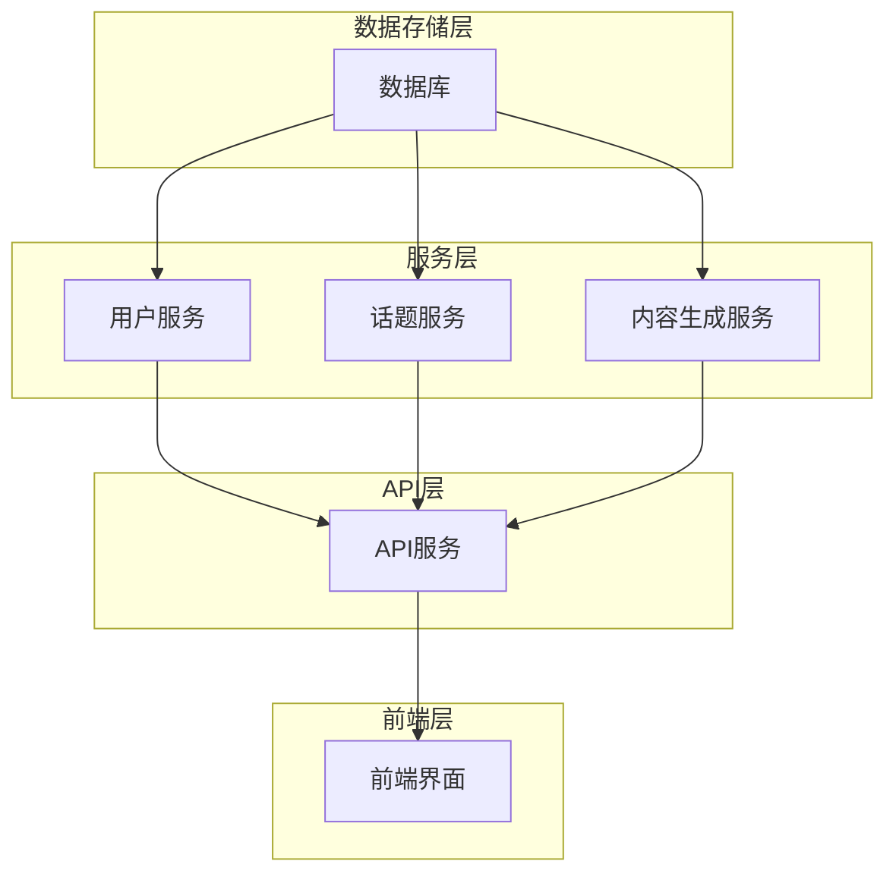
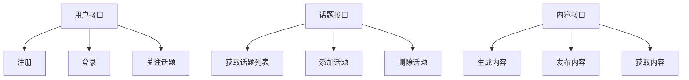
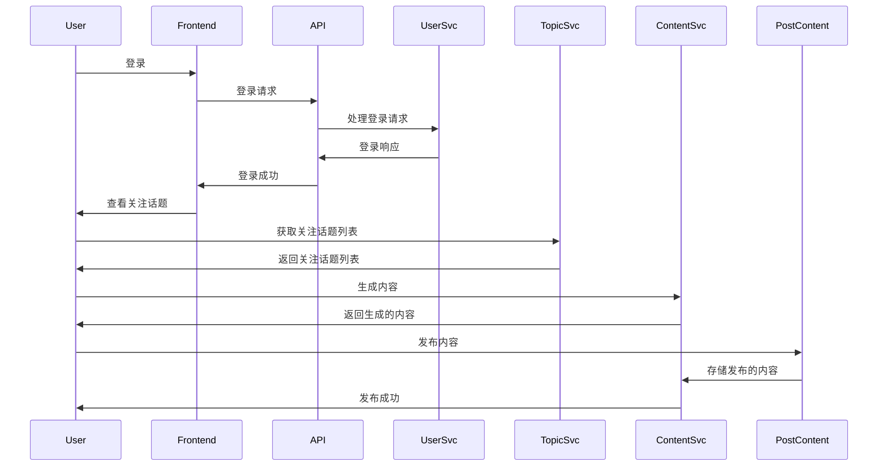

                 


### ChatGPT在自动化社交媒体内容生成中的应用

#### 关键词：ChatGPT、自动化社交媒体、内容生成、人工智能

> 摘要：随着社交媒体的兴起，内容生成成为了一个重要的领域。ChatGPT作为一种先进的自然语言处理技术，其在自动化社交媒体内容生成中的应用日益广泛。本文将深入探讨ChatGPT的基本原理、在社交媒体内容生成中的具体应用，以及相关的系统架构设计。通过逐步分析，本文旨在为读者提供一个清晰、系统的理解，以及实际操作的建议。

## 第1章：引言

### 1.1 问题背景

在当今数字时代，社交媒体已经成为人们交流和获取信息的重要平台。从个人用户到企业品牌，内容生成成为了社交媒体运营的核心。然而，随着社交媒体平台的爆炸性增长，内容生成的数量和质量都提出了更高的要求。传统的手动内容生成方式既耗时又低效，难以满足市场需求。

### 1.2 问题描述

如何自动化社交媒体内容生成，成为一个亟待解决的问题。传统的自动化工具往往只能生成简单的重复性内容，而无法理解复杂的人类语言和情感。因此，需要一种能够理解和生成自然语言内容的技术，这就引出了ChatGPT的概念。

### 1.3 问题解决

ChatGPT（Generative Pre-trained Transformer）是由OpenAI开发的一种基于Transformer架构的预训练语言模型。它通过大量的文本数据进行预训练，可以生成连贯、有逻辑、情感丰富的自然语言文本。因此，ChatGPT成为了解决自动化社交媒体内容生成问题的理想选择。

### 1.4 边界与外延

ChatGPT的应用不仅局限于社交媒体内容生成，还可以用于智能客服、虚拟助手、文案撰写等多个领域。本文将主要关注ChatGPT在社交媒体内容生成中的应用，包括其基本原理、算法、数学模型以及系统架构设计。

### 1.5 概念结构与核心要素组成

为了更好地理解ChatGPT在社交媒体内容生成中的应用，本文将分为以下几个部分：

1. **核心概念与联系**：介绍ChatGPT的基本概念和特点，以及与社交媒体内容生成的联系。
2. **ChatGPT在社交媒体内容生成中的应用**：详细探讨ChatGPT在社交媒体内容生成中的实际应用。
3. **算法原理与数学模型**：讲解ChatGPT的算法原理和相关的数学模型。
4. **系统分析与架构设计**：分析ChatGPT在社交媒体内容生成系统中的架构设计。
5. **项目实战**：介绍如何使用ChatGPT进行自动化社交媒体内容生成的实际操作。
6. **最佳实践与小结**：总结最佳实践，并对未来发展趋势进行展望。

## 第2章：核心概念与联系

### 2.1 ChatGPT概述

#### 2.1.1 ChatGPT的定义

ChatGPT是由OpenAI开发的一种基于Transformer架构的预训练语言模型。它通过大量的文本数据进行预训练，可以生成连贯、有逻辑、情感丰富的自然语言文本。

#### 2.1.2 ChatGPT的特点

- **预训练**：ChatGPT通过在大规模语料库上进行预训练，可以自动学习语言的语法、语义和上下文信息。
- **自适应**：ChatGPT可以根据输入的上下文自适应地生成文本，使其生成的文本更符合实际需求。
- **多模态**：ChatGPT不仅可以处理文本，还可以处理图像、音频等多模态信息。

#### 2.1.3 ChatGPT与其他AI技术的对比

相较于传统的自然语言处理技术，ChatGPT具有更高的生成质量和更广泛的适用性。例如，相较于传统的基于规则的聊天机器人，ChatGPT可以生成更自然的对话内容。

### 2.2 社交媒体内容生成

#### 2.2.1 社交媒体概述

社交媒体是指人们通过互联网平台进行交流和互动的媒体形式，如微博、Facebook、Twitter等。社交媒体已经成为人们获取信息、社交互动和表达自我的重要途径。

#### 2.2.2 社交媒体内容生成的挑战

社交媒体内容生成面临的主要挑战包括：

- **多样性**：用户期望社交媒体内容具有多样性，以满足不同的兴趣和需求。
- **个性化**：用户希望社交媒体内容能够根据其个人喜好和习惯进行个性化推荐。
- **时效性**：社交媒体内容需要及时更新，以保持用户的关注和参与度。

#### 2.2.3 社交媒体内容生成的重要性

社交媒体内容生成对于社交媒体平台和企业具有重要意义，可以提高用户的参与度和忠诚度，同时为企业带来更多的商业机会。

### 2.3 自动化社交媒体内容生成的应用

#### 2.3.1 自动化社交媒体内容生成概述

自动化社交媒体内容生成是指使用人工智能技术，如ChatGPT，自动生成社交媒体内容，以减轻人工负担和提高效率。

#### 2.3.2 自动化社交媒体内容生成的优势

- **提高效率**：自动化社交媒体内容生成可以显著提高内容生成速度，减轻人工负担。
- **保持一致性**：自动化生成的内容可以保持一致的风格和格式，提高品牌形象。
- **降低成本**：自动化生成可以降低内容生成和维护的成本。

#### 2.3.3 自动化社交媒体内容生成的应用场景

自动化社交媒体内容生成可以应用于多种场景，如：

- **品牌宣传**：自动生成广告、推广文案等。
- **客户服务**：自动生成回复客户咨询、评论等。
- **内容更新**：自动生成文章、博客、推文等。

## 第3章：ChatGPT在社交媒体内容生成中的应用

### 3.1 ChatGPT在内容生成中的应用

ChatGPT在社交媒体内容生成中的应用主要体现在以下几个方面：

- **文本生成**：ChatGPT可以生成各种类型的文本，如文章、博客、广告、对话等。
- **文本编辑**：ChatGPT可以对已有文本进行修改、优化，以提高其质量和可读性。
- **文本理解**：ChatGPT可以理解文本的语义和上下文，为用户提供更精准的内容推荐。

### 3.2 ChatGPT在社交媒体内容生成中的优势

- **高质量**：ChatGPT生成的文本具有高质量的语法和语义，能够满足用户的阅读需求。
- **多样性**：ChatGPT可以生成多种类型的文本，满足社交媒体内容的多样性需求。
- **灵活性**：ChatGPT可以根据不同的上下文和需求，灵活地生成文本。

### 3.3 ChatGPT在社交媒体内容生成中的挑战

- **准确性**：虽然ChatGPT生成的文本质量较高，但仍然存在一定的错误和误解。
- **可解释性**：ChatGPT生成的文本往往缺乏可解释性，难以理解其生成过程。
- **伦理问题**：使用ChatGPT生成社交媒体内容可能会引发伦理问题，如虚假信息传播、隐私泄露等。

## 第4章：ChatGPT与社交媒体内容生成的算法原理

### 4.1 ChatGPT算法原理

#### 4.1.1 语言模型的基本概念

语言模型是一种用于预测下一个单词或字符的概率分布的模型。在自然语言处理中，语言模型用于文本生成、文本分类、机器翻译等任务。

#### 4.1.2 GPT模型的训练过程

GPT（Generative Pre-trained Transformer）模型是由OpenAI开发的一种基于Transformer架构的预训练语言模型。其训练过程主要包括以下步骤：

1. **数据收集**：收集大量文本数据，如书籍、新闻、社交媒体帖子等。
2. **预处理**：对文本数据进行清洗、分词、去停用词等处理。
3. **训练**：使用Transformer模型对预处理后的文本数据进行训练，使其学习到语言的规律和模式。
4. **优化**：通过微调（fine-tuning）和强化学习（reinforcement learning）等技术，优化模型性能。

#### 4.1.3 ChatGPT的交互流程

ChatGPT的交互流程主要包括以下几个步骤：

1. **接收输入**：接收用户输入的文本或指令。
2. **文本预处理**：对输入文本进行预处理，如分词、词性标注等。
3. **生成文本**：使用GPT模型生成响应文本。
4. **输出结果**：将生成的文本输出给用户。

### 4.2 社交媒体内容生成的算法

#### 4.2.1 社交媒体内容生成的算法概述

社交媒体内容生成的算法主要包括文本生成和图像生成两种。文本生成算法用于生成文章、博客、对话等文本内容；图像生成算法用于生成图片、海报等图像内容。

#### 4.2.2 文本生成算法概述

文本生成算法主要包括以下几种：

- **基于规则的方法**：使用预先定义的规则和模板生成文本。
- **基于统计的方法**：使用统计模型，如隐马尔可夫模型（HMM）、条件概率模型等生成文本。
- **基于神经的方法**：使用神经网络，如循环神经网络（RNN）、长短期记忆网络（LSTM）等生成文本。

#### 4.2.3 图像生成算法概述

图像生成算法主要包括以下几种：

- **基于生成对抗网络（GAN）的方法**：使用生成器和判别器生成图像。
- **基于变分自编码器（VAE）的方法**：使用变分自编码器生成图像。
- **基于深度卷积神经网络（CNN）的方法**：使用卷积神经网络生成图像。

## 第5章：数学模型与数学公式

### 5.1 数学模型

#### 5.1.1 语言模型中的数学模型

语言模型中的数学模型主要包括概率模型和神经网络模型。概率模型如隐马尔可夫模型（HMM）、条件概率模型等，神经网络模型如循环神经网络（RNN）、长短期记忆网络（LSTM）等。

#### 5.1.2 社交媒体内容生成的数学模型

社交媒体内容生成的数学模型主要包括文本生成模型和图像生成模型。文本生成模型如序列生成模型、生成对抗网络（GAN）等；图像生成模型如生成对抗网络（GAN）、变分自编码器（VAE）等。

### 5.2 数学公式

#### 5.2.1 语言模型中的数学公式

语言模型中的数学公式主要包括概率模型和神经网络模型的公式。概率模型的公式如条件概率公式：

$$
P(w_t | w_{<t}) = \frac{P(w_t, w_{<t})}{P(w_{<t})}
$$

神经网络模型的公式如循环神经网络（RNN）的激活函数：

$$
h_t = \sigma(W_h h_{t-1} + W_x x_t + b_h)
$$

#### 5.2.2 社交媒体内容生成的数学公式

社交媒体内容生成的数学公式主要包括文本生成模型和图像生成模型的公式。文本生成模型的公式如序列生成模型的前向传播：

$$
p(w_t | w_{<t}) = \text{softmax}(W h_t)
$$

图像生成模型的公式如生成对抗网络（GAN）的生成器和判别器的损失函数：

$$
L_G = -\mathbb{E}_{x, z}[\log(D(G(z))]
$$

$$
L_D = -\mathbb{E}_{x}[\log(D(x))] - \mathbb{E}_{z}[\log(1 - D(G(z))]
$$

## 第6章：系统分析与架构设计

### 6.1 问题场景介绍

假设我们面临的是一个社交媒体平台，该平台需要自动生成用户关注话题的推文、博客等内容。这些内容需要具备高质量、多样性和个性化特点，以满足不同用户的需求。

### 6.2 系统功能设计

#### 6.2.1 领域模型

为了实现自动生成内容的功能，我们需要设计一个领域模型。领域模型主要包括以下几个核心类：

- **User（用户）**：表示社交媒体平台的用户，包括用户基本信息、关注列表等。
- **Topic（话题）**：表示用户关注的话题，包括话题名称、标签等。
- **Post（推文）**：表示用户生成或自动生成的推文，包括推文内容、发布时间等。

领域模型的关系图如下所示：

```mermaid
classDiagram
User o--|{关注}|* Topic
User o--|{发布}|* Post
Topic o--|{包含}|* Post
Post o--|{属于}|* User
```

### 6.3 系统架构设计

为了实现系统功能，我们需要设计一个分布式架构。系统架构主要包括以下几个核心组件：

- **数据存储层**：用于存储用户、话题和推文等数据，可以使用关系型数据库（如MySQL）或NoSQL数据库（如MongoDB）。
- **服务层**：用于处理业务逻辑，包括用户管理、话题管理、内容生成等。
- **API层**：用于提供对外接口，包括用户注册、登录、内容生成等。
- **前端层**：用于展示用户界面，包括用户关注列表、自动生成内容列表等。

系统架构图如下所示：



### 6.4 系统接口设计

系统接口主要包括以下几个核心接口：

- **用户接口**：包括用户注册、登录、关注话题等。
- **话题接口**：包括获取话题列表、添加话题、删除话题等。
- **内容接口**：包括生成内容、发布内容、获取内容等。

接口设计如下所示：



### 6.5 系统交互

系统交互主要包括用户操作和系统响应两个部分。以下是一个简化的系统交互序列图：



## 第7章：项目实战

### 7.1 环境安装

为了实现ChatGPT在自动化社交媒体内容生成中的应用，我们需要安装以下软件和工具：

- Python 3.8及以上版本
- transformers库
- torch库
- Flask库

安装命令如下：

```bash
pip install python==3.8
pip install transformers
pip install torch
pip install flask
```

### 7.2 系统核心实现源代码

以下是ChatGPT在自动化社交媒体内容生成中的应用的核心实现源代码：

```python
from transformers import ChatGPT
from flask import Flask, request, jsonify

app = Flask(__name__)

# 加载预训练模型
model = ChatGPT.from_pretrained("openai/chatgpt")

@app.route("/generate_content", methods=["POST"])
def generate_content():
    data = request.get_json()
    topic = data["topic"]
    content = model.generate_text(topic)
    return jsonify({"content": content})

if __name__ == "__main__":
    app.run(debug=True)
```

### 7.3 代码应用解读与分析

以下是代码的应用解读和分析：

1. **加载预训练模型**：使用transformers库加载预训练的ChatGPT模型。
2. **定义Flask应用**：使用Flask创建一个Web应用，用于接收和响应HTTP请求。
3. **定义生成内容接口**：定义一个生成内容的接口，接收JSON格式的请求，包括话题信息，然后使用ChatGPT模型生成文本内容。
4. **返回生成内容**：将生成的文本内容作为JSON响应返回给客户端。

### 7.4 实际案例分析和详细讲解剖析

以下是一个实际案例的分析和讲解：

假设用户向系统提交一个话题：“人工智能在未来的发展前景”。

1. **用户请求**：用户向系统发送一个包含话题的JSON请求：

```json
{
  "topic": "人工智能在未来的发展前景"
}
```

2. **系统响应**：系统接收到请求后，使用ChatGPT模型生成文本内容。生成的文本内容可能如下：

```
人工智能在未来的发展前景是广阔的。随着技术的不断进步，人工智能将在各行各业得到更广泛的应用。例如，在医疗领域，人工智能可以帮助医生更准确地诊断疾病；在教育领域，人工智能可以为学生提供个性化的学习体验。此外，人工智能还可以提高生产效率，降低成本，推动经济发展。然而，人工智能的发展也带来了一些挑战，如隐私问题、伦理问题等。因此，我们需要在发展人工智能的同时，确保其安全、可控和可持续。
```

3. **用户反馈**：用户接收到生成的文本内容后，可以进一步编辑、发布或分享。

### 7.5 项目小结

通过以上实战案例，我们可以看到ChatGPT在自动化社交媒体内容生成中的应用非常有效。在实际项目中，我们可以根据需求调整话题、生成策略和文本内容。同时，我们还需要关注模型的质量和生成文本的准确性，以提供更好的用户体验。

## 第8章：最佳实践与小结

### 8.1 最佳实践

1. **确保模型质量**：在部署ChatGPT模型时，需要确保模型质量，可以通过增加训练数据、优化模型结构等方式提高模型性能。
2. **调整生成策略**：根据不同场景和需求，调整生成策略，如控制生成文本的长度、风格等。
3. **关注生成文本的准确性**：在生成文本时，需要关注文本的准确性，可以通过预训练、微调等方式提高文本质量。
4. **遵守法律法规和伦理规范**：在使用ChatGPT进行内容生成时，需要遵守相关法律法规和伦理规范，避免生成不当内容。

### 8.2 小结

本文通过逐步分析，详细介绍了ChatGPT在自动化社交媒体内容生成中的应用。从核心概念、算法原理到系统架构设计，再到实际项目实战，本文为读者提供了一个全面、系统的理解。通过本文的介绍，读者可以了解到ChatGPT在社交媒体内容生成中的巨大潜力和应用前景。

### 8.3 注意事项

1. **模型训练数据**：在训练ChatGPT模型时，需要使用高质量、多样化的训练数据。
2. **模型部署**：在部署ChatGPT模型时，需要考虑模型的大小、运行效率等因素。
3. **用户反馈**：在生成文本时，需要考虑用户的反馈，不断优化模型和生成策略。

### 8.4 拓展阅读

1. **《深度学习》**：Goodfellow, I., Bengio, Y., & Courville, A. (2016). Deep Learning. MIT Press.
2. **《自然语言处理综论》**：Jurafsky, D., & Martin, J. H. (2008). Speech and Language Processing. Prentice Hall.
3. **《ChatGPT官方文档》**：OpenAI. (2021). ChatGPT Documentation. https://openai.com/docs/chatgpt/

作者：AI天才研究院/AI Genius Institute & 禅与计算机程序设计艺术 /Zen And The Art of Computer Programming

---

### 附录

本文涉及到的核心术语解释：

1. **ChatGPT**：一种基于Transformer架构的预训练语言模型，用于生成自然语言文本。
2. **社交媒体内容生成**：使用人工智能技术自动生成社交媒体平台上的文本、图像等内容。
3. **语言模型**：一种用于预测下一个单词或字符的概率分布的模型。
4. **生成对抗网络（GAN）**：一种由生成器和判别器组成的神经网络模型，用于生成高质量的图像。
5. **变分自编码器（VAE）**：一种用于生成图像的神经网络模型，通过概率分布进行编码和解码。
6. **领域模型**：用于表示系统中的实体和关系的概念模型。
7. **序列生成模型**：一种用于生成文本的神经网络模型，通过序列到序列（seq2seq）的方式进行文本生成。

以上是本文的完整内容，希望能够为读者提供一个清晰、系统的理解，以及对ChatGPT在自动化社交媒体内容生成中的应用有所帮助。在未来的研究和实践中，我们将继续深入探讨相关技术，为读者带来更多的干货。

