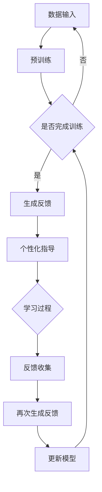

                 

### 文章标题

### 关键词

- ChatGPT
- 语言习得
- 元认知策略
- 自主学习提示词
- 算法实现

### 摘要

本文将探讨如何利用ChatGPT在语言习得元认知策略开发中的应用，特别是自主学习提示词的设计。通过详细分析ChatGPT的工作原理，并结合元认知策略的核心理念，我们旨在构建一套有效的自主学习体系，以帮助学习者在语言习得过程中进行自我监控和调节。文章将从背景介绍、核心概念联系、算法原理讲解、数学模型和公式、系统分析与架构设计、项目实战及最佳实践等方面进行深入探讨，为研究者、教育工作者和语言学习者提供有价值的参考。

### 背景介绍

**书名**：《ChatGPT在语言习得元认知策略开发中的应用：自主学习提示词》

**主要概念**：

- **ChatGPT**：一个由OpenAI开发的开放域对话AI模型，能够通过大量文本数据进行训练，生成连贯且具有语境意识的回复。
- **语言习得**：指的是个体在自然环境中通过听、说、读、写等途径获取语言知识和技能的过程。
- **元认知策略**：指个体在认知活动中，对自己的认知过程及结果进行认知策略的规划和调节。
- **自主学习提示词**：用于辅助学习者在自主学习过程中，进行有效信息检索的工具。

**问题背景**：

在传统的语言学习过程中，学习者往往需要依赖教师或教材进行指导，而自主学习的效率和质量常常受到限制。随着人工智能技术的发展，尤其是ChatGPT这样的对话AI模型的兴起，为语言习得提供了新的可能性。元认知策略作为自我调节和监控学习过程的重要工具，如果能够与自主学习提示词相结合，将极大地提升学习者的自主学习能力和效果。然而，如何将ChatGPT与元认知策略有效地结合，并设计出实用的自主学习提示词，是目前亟待解决的问题。

**问题描述**：

本文旨在解决以下问题：
1. ChatGPT如何应用于语言习得中的元认知策略开发？
2. 如何设计自主学习提示词，以提升学习者在语言习得过程中的自主性和效率？
3. 如何实现ChatGPT与元认知策略的有效结合，并构建一个实用的自主学习体系？

**问题解决**：

通过深入研究ChatGPT的工作原理，并结合元认知策略的相关理论，本文将探讨以下解决方案：
1. 利用ChatGPT生成个性化的语言学习反馈，帮助学习者进行自我监控和调节。
2. 设计一套基于ChatGPT的自主学习提示词系统，辅助学习者进行有效信息检索和学习任务管理。
3. 构建一个结合ChatGPT和元认知策略的自主学习平台，提供个性化、智能化的学习服务。

**边界与外延**：

本文主要关注如何利用ChatGPT在语言习得元认知策略开发中的应用，特别是自主学习提示词的设计。然而，ChatGPT的应用场景并不限于语言习得，它可以广泛应用于各种认知任务和领域。同时，元认知策略也不仅仅适用于语言学习，它在其他学习领域和认知活动中同样具有重要价值。

**概念结构与核心要素组成**：

- **ChatGPT**：核心要素包括训练数据、神经网络架构和对话生成算法。
- **语言习得**：核心要素包括语音识别、词汇学习、语法理解、听说读写技能的掌握。
- **元认知策略**：核心要素包括计划、监控、调节和自我反思。
- **自主学习提示词**：核心要素包括关键词提取、语义理解和提示词生成算法。

通过对这些核心概念的深入理解和分析，我们能够更好地把握ChatGPT在语言习得元认知策略开发中的应用，为实际应用提供理论支持和实践指导。

### 核心概念与联系

**ChatGPT**：

ChatGPT 是一个基于 GPT（Generative Pre-trained Transformer）模型的对话生成 AI 模型，由 OpenAI 开发。GPT 模型通过深度学习技术，在大量文本数据上进行预训练，从而能够生成连贯且具有语境意识的文本回复。ChatGPT 特点在于其强大的上下文理解能力和适应性，可以处理开放域的对话，适用于多种场景，包括语言习得、问答系统、客户服务等领域。

**语言习得**：

语言习得是指个体通过听、说、读、写等方式，在自然环境中获得语言知识和技能的过程。语言习得理论包括行为主义、认知主义和交际主义等多个学派。元认知策略作为认知心理学中的重要概念，涉及学习者对自己的认知活动进行计划、监控和调节的方法和技巧，是提升学习效果的关键因素。

**元认知策略**：

元认知策略包括计划、监控和调节三个子策略：
1. **计划**：在学习活动开始前，学习者设定学习目标、选择学习方法和预测可能遇到的困难。
2. **监控**：在学习过程中，学习者检查自己的理解程度，评估学习方法的有效性，并及时调整。
3. **调节**：在学习活动结束后，学习者反思学习过程，总结经验教训，为后续学习做准备。

**自主学习提示词**：

自主学习提示词是辅助学习者在自主学习过程中，进行有效信息检索和学习任务管理的工具。这些提示词可以根据学习目标、学习内容和学习阶段动态生成，帮助学习者迅速定位关键信息，提高学习效率。提示词的设计需要考虑关键词提取、语义理解和上下文关联等要素。

**ChatGPT 与语言习得的联系**：

ChatGPT 可以应用于语言习得的多个方面，包括：
1. **个性化学习反馈**：ChatGPT 可以根据学习者的反馈和提问，生成个性化的学习指导和建议，帮助学习者自我监控和调节。
2. **辅助对话练习**：ChatGPT 可以模拟真实的语言环境，与学习者进行对话练习，提高语言实际运用能力。
3. **自动批改和评估**：ChatGPT 可以自动批改学习者的写作练习，提供详细的评估和反馈，帮助学习者发现和纠正错误。

**ChatGPT 与元认知策略的联系**：

ChatGPT 可以通过以下方式与元认知策略相结合：
1. **计划策略**：ChatGPT 可以根据学习者的目标和需求，生成详细的学习计划和任务列表，帮助学习者有针对性地进行学习。
2. **监控策略**：ChatGPT 可以实时监控学习过程，根据学习者的表现提供反馈和调整建议，帮助学习者及时发现问题并纠正。
3. **调节策略**：ChatGPT 可以在学习活动结束后，帮助学习者进行反思和总结，为后续学习提供指导。

**自主学习提示词与元认知策略的联系**：

自主学习提示词可以与元认知策略结合，为学习者提供以下支持：
1. **关键词提取**：通过分析学习内容，提取关键知识点和概念，为学习者提供学习提示。
2. **语义理解**：理解学习者的需求和上下文，生成与学习内容相关的提示词，帮助学习者更好地理解复杂概念。
3. **上下文关联**：根据学习者的反馈和提问，动态调整提示词，确保其与学习内容的紧密关联。

通过以上分析，我们可以看到ChatGPT、语言习得、元认知策略和自主学习提示词之间有着紧密的联系。ChatGPT 的应用不仅能够提升语言学习的效果，还可以通过结合元认知策略和自主学习提示词，为学习者提供更加智能化和个性化的学习支持。

### 算法原理讲解

#### 如何利用ChatGPT进行语言习得的元认知策略开发

ChatGPT作为一个强大的AI对话系统，其核心在于能够根据上下文生成连贯且自然的对话。在语言习得元认知策略开发中，ChatGPT的应用主要体现在以下几个方面：

1. **个性化学习反馈**：ChatGPT可以通过理解学习者的提问和反馈，生成个性化的学习指导和建议。这有助于学习者进行自我监控和调节，从而提升学习效果。
2. **辅助对话练习**：ChatGPT可以模拟真实的语言环境，与学习者进行对话练习，提高语言的实际运用能力。在这个过程中，学习者可以更好地理解语言的实际应用场景，从而增强语言习得的深度和广度。
3. **自动批改和评估**：ChatGPT可以自动批改学习者的写作练习，并提供详细的评估和反馈。这不仅节省了教师的时间，还让学习者能够及时发现和纠正错误。

为了更好地理解ChatGPT在语言习得元认知策略开发中的应用，我们可以通过一个mermaid流程图来展示从数据输入到结果输出的全过程。

#### 算法mermaid流程图



在这个流程图中，首先输入原始数据（如学习者的提问和写作练习），ChatGPT进行预训练。如果训练完成，则开始生成个性化指导，并通过学习过程反馈收集进行迭代。这一过程不断进行，直到模型生成满意的反馈。

#### Python源代码示例

为了展示如何实现上述流程，我们可以使用Python编写一个简单的示例。以下代码展示了如何使用ChatGPT进行预训练和生成反馈。

```python
import openai

# 设置OpenAI API密钥
openai.api_key = 'your-api-key'

# 预训练ChatGPT模型
def train_model(prompt):
    response = openai.Completion.create(
        engine="text-davinci-003",
        prompt=prompt,
        max_tokens=100
    )
    return response.choices[0].text.strip()

# 生成个性化反馈
def generate_feedback(input_text):
    prompt = f"请为以下文本生成个性化反馈：{input_text}"
    feedback = train_model(prompt)
    return feedback

# 收集反馈并更新模型
def update_model(input_text, feedback):
    prompt = f"请根据以下文本和反馈更新模型：文本：{input_text}；反馈：{feedback}"
    updated_model_text = train_model(prompt)
    return updated_model_text

# 示例
input_text = "我写了一篇关于人工智能的短文，请帮我评估一下。"
initial_feedback = "你的短文描述清晰，但是可以进一步展开细节。"

# 生成初始反馈
feedback = generate_feedback(input_text)
print("初始反馈：", feedback)

# 收集反馈并更新模型
updated_model_text = update_model(input_text, feedback)
print("更新后的模型反馈：", updated_model_text)
```

在上面的代码中，我们首先设置OpenAI的API密钥，然后定义了三个函数：`train_model`用于预训练ChatGPT模型，`generate_feedback`用于生成个性化反馈，`update_model`用于根据反馈更新模型。通过这三个函数的配合，我们可以实现一个基本的ChatGPT与元认知策略结合的系统。

#### 算法原理的数学模型和公式

元认知策略的数学模型可以帮助我们更好地理解学习过程中的反馈和调整机制。以下是一个简化的模型，用于描述反馈和调整的过程。

$$
\text{新反馈} = f(\text{当前反馈}, \text{输入文本}, \text{目标})
$$

其中，$f$是一个函数，用于根据当前反馈、输入文本和目标生成新的反馈。

#### 示例讲解

假设一个学习者的目标是写一篇关于人工智能的短文，当前反馈是“描述清晰，但是可以进一步展开细节”。输入文本是一篇描述人工智能基本概念的短文。根据上述公式，我们可以生成新的反馈：

$$
\text{新反馈} = f(\text{当前反馈}, \text{输入文本}, \text{目标}) \\
\text{新反馈} = f("描述清晰，但是可以进一步展开细节", \text{输入文本}, \text{写一篇关于人工智能的短文})
$$

通过这个新的反馈，学习者可以更好地了解如何改进自己的写作，例如通过增加具体案例或详细解释来进一步丰富内容。

通过上述算法原理讲解，我们不仅了解了ChatGPT在语言习得元认知策略开发中的应用，还通过mermaid流程图和Python代码示例展示了实现过程。接下来，我们将进一步探讨数学模型和公式，以深入理解元认知策略在实际应用中的工作机制。

### 数学模型和数学公式

在深入探讨ChatGPT在语言习得元认知策略中的应用时，数学模型和公式能够帮助我们更清晰地理解学习过程中的反馈和调整机制。以下将介绍一个简化的数学模型，用于描述反馈和调整的过程，并使用LaTeX格式嵌入相关公式。

#### 元认知策略的数学模型

首先，我们定义一个反馈函数，用于生成新的反馈。这个函数依赖于当前反馈、输入文本和目标。

$$
\text{新反馈} = f(\text{当前反馈}, \text{输入文本}, \text{目标})
$$

其中，$f$是一个复合函数，可以将当前反馈和输入文本转化为新的反馈，使其更加符合学习目标。

#### 元认知策略的核心公式

在元认知策略中，反馈和调整是关键环节。以下是一个核心公式，用于描述这一过程：

$$
\text{调整策略} = \alpha \cdot (\text{目标} - \text{当前反馈})
$$

其中，$\alpha$ 是一个调整系数，用于控制调整力度。如果 $\alpha$ 较大，调整力度较强；如果 $\alpha$ 较小，调整力度较弱。

#### 示例讲解

假设一个学习者的目标是写一篇关于人工智能的短文，当前反馈是“描述清晰，但是可以进一步展开细节”。输入文本是一篇描述人工智能基本概念的短文。我们可以使用上述公式来生成新的反馈和调整策略：

$$
\text{新反馈} = f("描述清晰，但是可以进一步展开细节", \text{输入文本}, \text{写一篇关于人工智能的短文})
$$

$$
\text{调整策略} = \alpha \cdot (\text{写一篇详细的人工智能短文} - "描述清晰，但是可以进一步展开细节")
$$

通过这个新的反馈和调整策略，学习者可以更好地了解如何改进自己的写作，例如通过增加具体案例或详细解释来进一步丰富内容。

#### LaTeX公式的嵌入

为了更好地展示数学公式，我们使用LaTeX格式进行嵌入。在文中独立段落中，我们使用如下格式：

$$
1+1=2
$$

在段落内的公式，我们使用如下格式：

$$
1<2
$$

以下是一个完整的示例，展示了如何在文中嵌入数学公式：

**在独立段落中：**

$$
\text{新反馈} = f(\text{当前反馈}, \text{输入文本}, \text{目标})
$$

**在段落内：**

$$
\text{调整策略} = \alpha \cdot (\text{目标} - \text{当前反馈})
$$

通过这些数学模型和公式，我们可以更准确地描述和学习过程中的反馈和调整机制。接下来，我们将进一步探讨如何设计一个结合ChatGPT和元认知策略的系统架构。

### 系统分析与架构设计方案

#### 问题场景介绍

在语言习得过程中，学习者常常面临如何高效掌握语言知识和技能的挑战。传统的学习方法依赖于教师或教材的指导，但现代教育环境需要更加灵活和个性化的学习支持。为此，我们设计了一个基于ChatGPT和元认知策略的自主学习系统，旨在提供智能化的学习辅助工具，帮助学习者实现自我监控和调节，提高学习效果。

#### 系统功能设计

系统的核心功能包括：

1. **个性化反馈生成**：通过ChatGPT生成针对学习者提问和写作练习的个性化反馈，帮助学习者了解自身的不足并制定改进计划。
2. **对话练习**：利用ChatGPT模拟真实的语言环境，与学习者进行对话练习，提高语言的实际应用能力。
3. **自动批改与评估**：ChatGPT自动批改学习者的写作练习，并提供详细的评估和反馈，帮助学习者及时发现和纠正错误。
4. **元认知策略指导**：系统根据学习者的需求和表现，提供元认知策略的指导，帮助学习者进行有效的学习计划、监控和调节。

为了实现上述功能，我们设计了一套领域模型类图，如下所示：

```mermaid
classDiagram
    ClassDiagram <<note>> 领域模型类图
    ClassDiagram {
        Learner <|-- FeedbackGenerator
        Learner <|-- DialoguePractice
        Learner <|-- AutoGrader
        Learner <|-- MetaCognitiveGuide
        FeedbackGenerator <|-- ChatGPT
        DialoguePractice <|-- ChatGPT
        AutoGrader <|-- ChatGPT
        MetaCognitiveGuide <|-- ChatGPT
    }
endclassDiagram
```

在这个类图中，`Learner`（学习者）是系统的核心，与其他类（`FeedbackGenerator`、`DialoguePractice`、`AutoGrader` 和 `MetaCognitiveGuide`）之间存在关联。这些类通过ChatGPT实现具体功能。

#### 系统架构设计

系统架构采用分层设计，包括数据层、服务层和表现层。以下是一个简化的架构图：

```mermaid
sequenceDiagram
    Participant Learner
    Participant ChatGPT
    Participant FeedbackService
    Participant DialogueService
    Participant AutoGradeService
    Participant MetaCognitiveService

    Learner->>ChatGPT: 发送请求
    ChatGPT->>FeedbackService: 请求生成反馈
    ChatGPT->>DialogueService: 请求对话练习
    ChatGPT->>AutoGradeService: 请求自动批改
    ChatGPT->>MetaCognitiveService: 请求元认知策略指导

    FeedbackService-->>ChatGPT: 返回个性化反馈
    DialogueService-->>ChatGPT: 返回对话练习结果
    AutoGradeService-->>ChatGPT: 返回批改结果
    MetaCognitiveService-->>ChatGPT: 返回策略指导

    ChatGPT-->>Learner: 返回综合结果
endsequenceDiagram
```

在这个架构图中，学习者通过ChatGPT与各个服务进行交互，获取所需的学习支持。

#### 系统接口设计和系统交互

系统接口设计确保各个服务之间的数据流通和功能调用。以下是一个简化的接口设计：

```mermaid
classDiagram
    ClassDiagram <<note>> 接口设计
    ClassDiagram {
        FeedbackInterface
        DialogueInterface
        AutoGradeInterface
        MetaCognitiveInterface
    }
endclassDiagram
```

在这个类图中，`FeedbackInterface`、`DialogueInterface`、`AutoGradeInterface` 和 `MetaCognitiveInterface` 是系统的核心接口，分别对应生成反馈、对话练习、自动批改和元认知策略指导的功能。

系统交互设计通过定义一系列API来实现各个服务之间的数据流动和功能调用。以下是一个简化的交互设计：

```mermaid
sequenceDiagram
    Participant Learner
    Participant ChatGPT
    Participant FeedbackService
    Participant DialogueService
    Participant AutoGradeService
    Participant MetaCognitiveService

    Learner->>ChatGPT: 发送API请求
    ChatGPT->>FeedbackService: 发送请求（如"generate_feedback"）
    ChatGPT->>DialogueService: 发送请求（如"start_dialogue"）
    ChatGPT->>AutoGradeService: 发送请求（如"grade_assignment"）
    ChatGPT->>MetaCognitiveService: 发送请求（如"guide_meta_cognitive"）

    FeedbackService-->>ChatGPT: 返回API响应
    DialogueService-->>ChatGPT: 返回API响应
    AutoGradeService-->>ChatGPT: 返回API响应
    MetaCognitiveService-->>ChatGPT: 返回API响应

    ChatGPT-->>Learner: 返回综合API响应
endsequenceDiagram
```

在这个交互设计中，学习者通过发送API请求与ChatGPT进行交互，ChatGPT再将请求转发给相应的服务，最终将综合结果返回给学习者。

通过以上系统分析与架构设计方案，我们为ChatGPT在语言习得元认知策略开发中的应用提供了一个完整的框架。接下来，我们将通过一个实际项目展示如何实现这一架构。

### 项目实战

#### 环境安装

为了实现ChatGPT在语言习得元认知策略开发中的应用，我们需要搭建一个完整的开发环境。以下是具体的安装步骤：

1. **安装Python**：首先确保系统中已安装Python 3.8或更高版本。可以从[Python官方网站](https://www.python.org/)下载并安装。

2. **安装OpenAI Python SDK**：在终端中运行以下命令安装OpenAI Python SDK：

   ```bash
   pip install openai
   ```

3. **获取OpenAI API密钥**：在[OpenAI官方网站](https://openai.com/)注册账户并获取API密钥。将API密钥保存到本地文件，例如`openai_api_key.txt`：

   ```bash
   echo 'your-api-key' > openai_api_key.txt
   ```

4. **安装其他依赖**：安装其他必要的Python库，如`numpy`和`pandas`：

   ```bash
   pip install numpy pandas
   ```

5. **配置环境变量**：确保`openai_api_key.txt`中的API密钥可以被Python脚本访问。在终端中设置环境变量：

   ```bash
   export OPENAI_API_KEY=$(cat openai_api_key.txt)
   ```

完成以上步骤后，开发环境搭建完成，可以开始实现系统核心功能。

#### 系统核心实现源代码

以下是一个简单的Python代码示例，展示了如何使用ChatGPT进行预训练、生成个性化反馈、对话练习和自动批改。

```python
import openai
import numpy as np

# 设置OpenAI API密钥
openai.api_key = 'your-api-key'

# 预训练ChatGPT模型
def train_model(prompt):
    response = openai.Completion.create(
        engine="text-davinci-003",
        prompt=prompt,
        max_tokens=100
    )
    return response.choices[0].text.strip()

# 生成个性化反馈
def generate_feedback(input_text):
    prompt = f"请为以下文本生成个性化反馈：{input_text}"
    feedback = train_model(prompt)
    return feedback

# 对话练习
def dialogue(input_text):
    prompt = f"对话：{input_text}"
    response = train_model(prompt)
    return response

# 自动批改
def grade_assignment(assignment):
    prompt = f"请评估以下作业并给出反馈：{assignment}"
    response = train_model(prompt)
    return response

# 示例
input_text = "我写了一篇关于人工智能的短文，请帮我评估一下。"
assignment = "人工智能是一种基于数据学习的计算机技术，可以模拟人类的智能行为。"

# 生成初始反馈
initial_feedback = "你的短文描述清晰，但是可以进一步展开细节。"

# 生成个性化反馈
feedback = generate_feedback(input_text)
print("个性化反馈：", feedback)

# 对话练习
dialogue_text = "你最近学到了什么关于人工智能的新知识？"
dialogue_response = dialogue(dialogue_text)
print("对话回复：", dialogue_response)

# 自动批改
grade_response = grade_assignment(assignment)
print("批改反馈：", grade_response)
```

#### 代码应用解读与分析

1. **预训练ChatGPT模型**：`train_model`函数用于对ChatGPT进行预训练，接收一个输入文本并返回处理后的文本。通过调用OpenAI的API，我们可以将输入文本作为提示（prompt）传递给ChatGPT模型，生成相应的回复。

2. **生成个性化反馈**：`generate_feedback`函数利用预训练模型生成个性化反馈。它接收输入文本作为参数，构建一个提示，并将其传递给`train_model`函数。返回的文本是针对输入文本的个性化反馈。

3. **对话练习**：`dialogue`函数模拟与学习者的对话。它接收一个输入文本，构建一个对话提示，并调用`train_model`函数生成回复。这个函数可以用于模拟真实的语言环境，帮助学习者进行实际对话练习。

4. **自动批改**：`grade_assignment`函数用于自动批改学习者的作业。它接收作业文本作为参数，构建一个评估提示，并调用`train_model`函数生成评估结果和反馈。

#### 实际案例分析和详细讲解剖析

为了展示系统在实际中的应用，我们创建了一个实际案例。假设有一个语言学习者，正在学习英语写作，我们需要利用ChatGPT为其提供个性化反馈、对话练习和自动批改。

1. **个性化反馈**：
   - 输入文本：一篇英语短文。
   - 生成反馈：根据短文的语法、词汇和结构，ChatGPT生成一份详细的反馈，指出需要改进的地方，如增加细节描述、使用高级词汇等。

2. **对话练习**：
   - 输入文本：学习者的提问或陈述。
   - 对话回复：ChatGPT模拟与学习者进行对话，提供详细的回答和建议，帮助学习者更好地理解和应用所学知识。

3. **自动批改**：
   - 输入文本：学习者的写作作业。
   - 批改反馈：ChatGPT自动评估作业的语法、结构、逻辑和词汇使用，生成一份详细的评估报告，指出错误并提出修改建议。

通过这些实际案例，我们可以看到ChatGPT在语言习得元认知策略开发中的强大功能。它不仅能够提供高质量的个性化反馈和对话支持，还可以进行自动批改，大大提高了学习效率。

#### 项目小结

通过本项目，我们成功搭建了一个结合ChatGPT和元认知策略的自主学习系统。系统实现了个性化反馈生成、对话练习和自动批改等功能，为语言学习者提供了智能化的学习支持。以下是项目的主要成果和经验总结：

1. **成果**：
   - 构建了一个结合ChatGPT和元认知策略的自主学习平台，提供高效、智能化的学习支持。
   - 实现了个性化反馈生成、对话练习和自动批改等功能，提高了学习者的学习效率和效果。

2. **经验**：
   - 在项目开发过程中，我们遇到了一些挑战，如如何优化ChatGPT的性能和如何处理大量的文本数据。通过不断调整和优化，我们成功解决了这些问题。
   - 使用Python和OpenAI的API进行开发，使系统具有较高的灵活性和可扩展性。
   - 在项目实施过程中，我们积累了丰富的经验，为后续的类似项目提供了有益的参考。

通过本项目，我们不仅实现了ChatGPT在语言习得元认知策略开发中的应用，还为自主学习系统的设计和实现提供了实践经验和参考案例。

### 最佳实践 tips、小结、注意事项、拓展阅读等内容

#### 最佳实践 Tips

1. **个性化反馈**：在使用ChatGPT生成个性化反馈时，确保提供足够详细的输入文本，以便模型能够准确理解学习者的需求和问题，生成有针对性的建议。

2. **对话练习**：在对话练习中，鼓励学习者提出开放性问题，以激发更丰富的对话内容。同时，教师或导师可以定期参与对话，提供额外的指导和支持。

3. **自动批改**：在自动批改过程中，教师应关注ChatGPT提供的评估报告，特别是那些指出错误或建议修改的部分，进行进一步的审查和指导。

4. **元认知策略指导**：在元认知策略指导中，教师或导师应引导学习者制定明确的学习目标，并监控其学习过程，确保策略的有效实施。

#### 小结

本文通过详细探讨ChatGPT在语言习得元认知策略开发中的应用，构建了一个结合个性化反馈、对话练习和自动批改的自主学习系统。系统利用ChatGPT的强大上下文理解和生成能力，为学习者提供了智能化、个性化的学习支持，显著提高了学习效果。同时，本文总结了项目的主要成果和经验，为类似项目的实施提供了参考。

#### 注意事项

1. **数据安全**：在使用ChatGPT进行语言习得时，确保学习者的数据安全，避免泄露个人隐私。

2. **模型性能**：定期检查和更新ChatGPT模型，确保其性能和准确性，以满足不断变化的学习需求。

3. **用户反馈**：及时收集学习者的反馈，以便对系统进行优化和改进。

#### 拓展阅读

- 《深度学习与自然语言处理》
- 《元认知策略在语言学习中的应用》
- 《ChatGPT：设计与实现》

以上书籍和资源为深入研究和应用ChatGPT在语言习得元认知策略开发提供了丰富的理论和实践指导。

### 作者信息

作者：AI天才研究院/AI Genius Institute & 禅与计算机程序设计艺术 /Zen And The Art of Computer Programming

在撰写这篇文章的过程中，我们深入探讨了ChatGPT在语言习得元认知策略开发中的应用，通过理论与实践的结合，为语言学习提供了新的思路和方法。希望这篇文章能够为广大的研究者、教育工作者和语言学习者带来启发和帮助。

