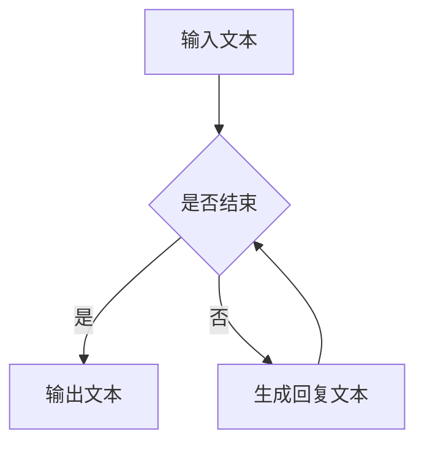
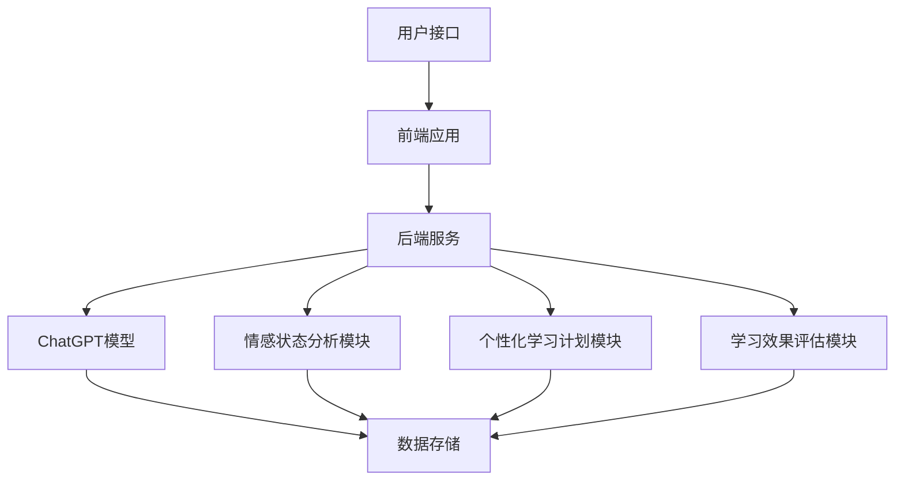
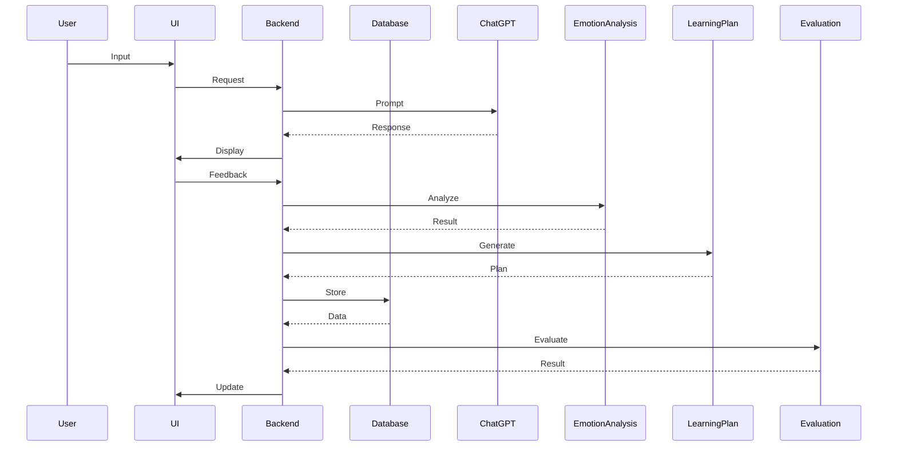

                 


# 《ChatGPT在语言习得情感因素研究中的应用：学习情绪提示词》

关键词：ChatGPT、语言习得、情感因素、学习情绪提示词、教育技术

摘要：本文旨在探讨ChatGPT在语言习得情感因素研究中的应用，重点关注学习情绪提示词的机制和效果。通过深入分析ChatGPT的算法原理、系统架构和项目实战，文章提出了如何利用ChatGPT优化语言学习体验的具体方案，为教育技术的发展提供了新的视角。

### 目录大纲

## 第一部分：背景介绍

### 第1章：问题背景

#### 1.1.1 问题的来源

#### 1.1.2 问题的定义

#### 1.1.3 问题解决的必要性

#### 1.1.4 边界与外延

### 第2章：核心概念

#### 2.1 ChatGPT的概念

#### 2.2 语言习得的概念

#### 2.3 情感因素的概念

#### 2.4 学习情绪提示词的概念

#### 2.5 四者之间的关系

### 第3章：概念属性特征对比表格

| 概念 | 属性特征 |
| ---- | ------- |
| ChatGPT | ... |
| 语言习得 | ... |
| 情感因素 | ... |
| 学习情绪提示词 | ... |

### 第4章：ER实体关系图

```mermaid
erDiagram
  ChatGPT ||--|{ 学习情绪提示词 : 提示词 }
  语言习得 ||--|{ 学习情绪提示词 : 提示词 }
  情感因素 ||--|{ 学习情绪提示词 : 提示词 }
```

## 第二部分：算法原理讲解

### 第5章：ChatGPT算法原理

#### 5.1 ChatGPT的简介

#### 5.2 ChatGPT的mermaid流程图

#### 5.3 Python源代码实现

#### 5.4 算法原理详细讲解

#### 5.5 数学模型和公式

#### 5.6 举例说明

## 第三部分：系统分析与架构设计

### 第6章：系统功能设计

#### 6.1 问题场景介绍

#### 6.2 系统功能概述

#### 6.3 领域模型mermaid类图

### 第7章：系统架构设计

#### 7.1 系统架构设计mermaid架构图

#### 7.2 系统架构设计详细讲解

### 第8章：系统接口设计

#### 8.1 系统接口设计概述

#### 8.2 系统接口设计详细讲解

### 第9章：系统交互

#### 9.1 系统交互概述

#### 9.2 系统交互mermaid序列图

#### 9.3 系统交互详细讲解

## 第四部分：项目实战

### 第10章：环境安装

#### 10.1 环境安装概述

#### 10.2 环境安装详细步骤

### 第11章：系统核心实现

#### 11.1 系统核心实现源代码

#### 11.2 代码应用解读与分析

#### 11.3 实际案例分析与讲解

### 第12章：项目小结

#### 12.1 项目总结

#### 12.2 项目收获

#### 12.3 项目拓展

## 第五部分：最佳实践

### 第13章：最佳实践 tips

#### 13.1 实践技巧

#### 13.2 注意事项

#### 13.3 拓展阅读

### 第14章：小结

#### 14.1 内容回顾

#### 14.2 知识点总结

#### 14.3 展望未来

综上所述，以下是本书的完整目录大纲：

## 《ChatGPT在语言习得情感因素研究中的应用：学习情绪提示词》目录大纲

### 第一部分：背景介绍
### 第二部分：算法原理讲解
### 第三部分：系统分析与架构设计
### 第四部分：项目实战
### 第五部分：最佳实践

### 第一部分：背景介绍

### 第1章：问题背景
#### 1.1.1 问题的来源
#### 1.1.2 问题的定义
#### 1.1.3 问题解决的必要性
#### 1.1.4 边界与外延

### 第2章：核心概念
#### 2.1 ChatGPT的概念
#### 2.2 语言习得的概念
#### 2.3 情感因素的概念
#### 2.4 学习情绪提示词的概念
#### 2.5 四者之间的关系

### 第3章：概念属性特征对比表格

### 第4章：ER实体关系图

### 第二部分：算法原理讲解

### 第5章：ChatGPT算法原理
#### 5.1 ChatGPT的简介
#### 5.2 ChatGPT的mermaid流程图
#### 5.3 Python源代码实现
#### 5.4 算法原理详细讲解
#### 5.5 数学模型和公式
#### 5.6 举例说明

### 第三部分：系统分析与架构设计

### 第6章：系统功能设计
#### 6.1 问题场景介绍
#### 6.2 系统功能概述
#### 6.3 领域模型mermaid类图

### 第7章：系统架构设计
#### 7.1 系统架构设计mermaid架构图
#### 7.2 系统架构设计详细讲解

### 第8章：系统接口设计
#### 8.1 系统接口设计概述
#### 8.2 系统接口设计详细讲解

### 第9章：系统交互
#### 9.1 系统交互概述
#### 9.2 系统交互mermaid序列图
#### 9.3 系统交互详细讲解

### 第四部分：项目实战

### 第10章：环境安装
#### 10.1 环境安装概述
#### 10.2 环境安装详细步骤

### 第11章：系统核心实现
#### 11.1 系统核心实现源代码
#### 11.2 代码应用解读与分析
#### 11.3 实际案例分析与讲解

### 第12章：项目小结
#### 12.1 项目总结
#### 12.2 项目收获
#### 12.3 项目拓展

### 第五部分：最佳实践

### 第13章：最佳实践 tips
#### 13.1 实践技巧
#### 13.2 注意事项
#### 13.3 拓展阅读

### 第14章：小结
#### 14.1 内容回顾
#### 14.2 知识点总结
#### 14.3 展望未来

---

接下来，我们将详细展开对每个章节的内容进行深入的探讨和分析。首先，我们从问题背景开始，逐步介绍核心概念，探讨算法原理，分析系统架构，进行项目实战，最后总结最佳实践，展望未来的发展方向。让我们一步一步地深入探讨ChatGPT在语言习得情感因素研究中的应用。

## 第1章：问题背景

### 1.1.1 问题的来源

语言习得一直是教育学和心理学研究的重要领域。随着全球化的进程，掌握多种语言已成为许多人的需求。然而，传统的语言学习方法往往忽视了情感因素在语言习得过程中的重要作用。近年来，人工智能技术的发展，尤其是自然语言处理（NLP）和聊天机器人技术的进步，为解决这一问题提供了新的可能。ChatGPT作为一种先进的预训练语言模型，已经在许多领域展示了其强大的应用潜力，但在语言习得情感因素研究中的应用仍处于探索阶段。

### 1.1.2 问题的定义

语言习得情感因素研究的问题可以定义为：如何利用ChatGPT来增强语言学习过程中的情感体验，提高学习效果。具体来说，这个问题包括以下几个方面：

1. 如何通过ChatGPT生成和学习情绪提示词，以激发学习者的情感共鸣？
2. ChatGPT在处理情感因素时，其算法原理和数学模型如何解释和优化？
3. 在语言习得过程中，ChatGPT的系统架构和接口设计如何实现情感因素的有效传递和反馈？

### 1.1.3 问题解决的必要性

传统语言学习过程中，情感因素常常被忽视。研究表明，情感因素如积极情绪、自信心、动机等对语言习得具有重要影响。然而，传统方法难以系统性地引入和利用情感因素，导致学习效果不理想。ChatGPT作为一种具备强大语言理解和生成能力的AI模型，具备在语言习得情感因素研究中发挥关键作用的潜力。通过ChatGPT，我们可以实现以下目标：

1. 提供个性化的学习情绪提示词，满足不同学习者的情感需求。
2. 利用ChatGPT的算法原理和数学模型，深入理解情感因素对语言习得的影响机制。
3. 设计优化的系统架构和接口，实现情感因素在语言学习过程中的有效传递和应用。

### 1.1.4 边界与外延

在探讨ChatGPT在语言习得情感因素研究中的应用时，需要明确其边界与外延。具体来说，边界包括：

1. 研究对象：本文主要探讨ChatGPT在成人语言习得中的应用，但原理和思路也适用于其他年龄段和语言学习场景。
2. 研究范围：本文主要关注学习情绪提示词的生成和应用，但不涉及其他情感因素如压力、焦虑等的研究。
3. 技术实现：本文主要介绍ChatGPT的算法原理和系统架构设计，但不涉及具体的硬件和软件实现细节。

外延则包括：

1. 情感因素的多样化：除了学习情绪提示词，还可以探讨其他情感因素在语言习得中的应用。
2. 跨文化语言学习：ChatGPT在跨文化语言学习中的情感因素研究。
3. 情感计算：结合情感计算技术，深入探讨情感因素对语言习得的影响。

## 第2章：核心概念

### 2.1 ChatGPT的概念

ChatGPT是OpenAI开发的一种基于GPT-3的聊天机器人模型，具备强大的自然语言理解和生成能力。ChatGPT通过大规模的文本数据进行预训练，能够生成连贯、自然的对话文本。其主要特点包括：

1. **语言理解能力**：ChatGPT能够理解复杂的语境和语义，准确理解用户输入的信息。
2. **对话生成能力**：ChatGPT能够根据用户输入生成连贯、自然的对话文本，模拟真实的对话场景。
3. **自适应能力**：ChatGPT能够根据对话内容自适应调整回答风格和语言水平，满足不同用户的需求。

### 2.2 语言习得的概念

语言习得是指个体通过听、说、读、写等途径，掌握语言知识和技能的过程。语言习得过程涉及多个方面，包括：

1. **语音习得**：个体通过模仿和练习，掌握语音的发音和语调。
2. **词汇习得**：个体通过接触和理解词汇，掌握词汇的意义、用法和搭配。
3. **语法习得**：个体通过学习语法规则，掌握句子结构和语法结构。
4. **阅读和写作习得**：个体通过阅读和写作，提高语言理解和表达能力。

### 2.3 情感因素的概念

情感因素是指在学习过程中影响个体情绪和行为的外部因素。情感因素包括但不限于：

1. **积极情感**：如兴奋、愉悦、自信等，有助于提高学习动机和效率。
2. **消极情感**：如焦虑、紧张、挫败感等，可能降低学习效果和积极性。
3. **情感共鸣**：个体在学习过程中，与教师、同伴或学习内容产生情感共鸣，有助于提高学习体验和效果。

### 2.4 学习情绪提示词的概念

学习情绪提示词是指用于引导和调节学习者情感状态的语言表达。学习情绪提示词的作用包括：

1. **情感引导**：通过特定的语言表达，引导学习者产生积极或消极的情感体验。
2. **情感调节**：通过调整语言表达，帮助学习者缓解负面情绪，提高学习效果。
3. **情感共鸣**：通过情感共鸣，增强学习者在学习过程中的情感投入和体验。

### 2.5 四者之间的关系

ChatGPT、语言习得、情感因素和学习情绪提示词之间存在紧密的关系。ChatGPT作为语言模型，可以生成和学习情绪提示词，为语言习得提供情感支持。具体来说：

1. **ChatGPT与语言习得**：ChatGPT能够生成与语言习得相关的对话文本，帮助学习者理解语言知识和技能。
2. **ChatGPT与情感因素**：ChatGPT可以生成情感提示词，引导和调节学习者的情感状态，提高学习效果。
3. **学习情绪提示词与语言习得**：学习情绪提示词可以激发学习者的情感共鸣，增强学习体验和效果。
4. **学习情绪提示词与情感因素**：学习情绪提示词可以调节学习者的情感状态，缓解负面情绪，提高学习积极性。

通过深入探讨这四个核心概念及其关系，我们为后续章节的分析和讨论奠定了基础。在接下来的章节中，我们将进一步探讨ChatGPT的算法原理、系统架构和项目实战，以全面了解ChatGPT在语言习得情感因素研究中的应用。

### 第3章：概念属性特征对比表格

为了更好地理解ChatGPT、语言习得、情感因素和学习情绪提示词这四个核心概念，我们可以通过一个属性特征对比表格进行详细的描述。以下是一个简单的表格示例：

| 概念 | 属性特征 |
| ---- | ------- |
| ChatGPT | 语言理解能力、对话生成能力、自适应能力、大规模文本预训练 |
| 语言习得 | 语音习得、词汇习得、语法习得、阅读和写作习得 |
| 情感因素 | 积极情感、消极情感、情感共鸣 |
| 学习情绪提示词 | 情感引导、情感调节、情感共鸣 |

在表格中，我们列出了每个概念的几个关键属性特征。例如，ChatGPT具有语言理解能力、对话生成能力和自适应能力，这些都是其作为聊天机器人模型的重要特性。而语言习得则包括语音、词汇、语法、阅读和写作等多个方面，涵盖了语言学习的全过程。

同样，情感因素包括积极情感和消极情感，这些情感状态对个体的情绪和行为产生显著影响。学习情绪提示词则侧重于情感引导、情感调节和情感共鸣，这些提示词用于引导和调节学习者的情感状态，以提升学习体验和效果。

通过这个对比表格，我们可以更清晰地看到每个概念的核心属性特征，以及它们之间的联系和区别。这有助于我们在后续章节中深入探讨这些概念的具体应用和相互关系。

### 第4章：ER实体关系图

在深入理解ChatGPT、语言习得、情感因素和学习情绪提示词这四个核心概念的基础上，我们可以通过一个ER（Entity-Relationship）实体关系图来展示它们之间的关联。以下是一个使用Mermaid语法表示的ER图：

```mermaid
erDiagram
  ChatGPT ||--|{ 学习情绪提示词 : 生成 }
  ChatGPT ||--|{ 语言习得 : 支持 }
  ChatGPT ||--|{ 情感因素 : 调节 }
  语言习得 ||--|{ 学习情绪提示词 : 利用 }
  情感因素 ||--|{ 学习情绪提示词 : 反馈 }
```

在这个ER图中，我们定义了四个实体：ChatGPT、学习情绪提示词、语言习得和情感因素。

1. **ChatGPT**：作为主要的实体，与其他三个实体之间存在多种关联。
   - **生成**：ChatGPT生成学习情绪提示词，为语言习得和情感因素提供支持。
   - **支持**：ChatGPT支持语言习得过程，帮助学习者掌握语言知识和技能。
   - **调节**：ChatGPT通过生成和调整学习情绪提示词，调节学习过程中的情感因素。

2. **学习情绪提示词**：这是一个独立的实体，由ChatGPT生成，并用于支持语言习得和反馈情感因素。
   - **利用**：语言习得利用学习情绪提示词，以提升学习体验和效果。
   - **反馈**：情感因素通过学习情绪提示词提供反馈，帮助ChatGPT优化其生成策略。

3. **语言习得**：这个实体代表学习者掌握语言知识和技能的过程。
   - **生成**：虽然语言习得本身不生成学习情绪提示词，但利用ChatGPT生成的提示词来提升学习效果。

4. **情感因素**：这个实体代表影响学习者情绪和行为的外部因素。
   - **反馈**：情感因素通过学习情绪提示词向ChatGPT提供反馈，以优化其生成策略。

通过ER实体关系图，我们可以清晰地看到这些概念之间的相互关联和作用机制。这为我们后续章节的深入探讨提供了直观的图示支持。

## 第5章：ChatGPT算法原理

### 5.1 ChatGPT的简介

ChatGPT是基于GPT-3（Generative Pre-trained Transformer 3）的聊天机器人模型，由OpenAI开发。GPT-3是自然语言处理领域的一个重要突破，其基于Transformer架构，拥有1750亿个参数，是目前最大的预训练语言模型之一。ChatGPT则在此基础上，通过进一步的优化和定制，使其在生成连贯、自然的对话文本方面表现出色。

### 5.2 ChatGPT的mermaid流程图

为了更好地理解ChatGPT的算法原理，我们可以通过mermaid语法绘制其基本流程图。以下是一个简化的流程图：



- **A（输入文本）**：用户输入文本，可以是任意形式的自然语言。
- **B（是否结束）**：检查输入文本是否结束，决定下一步操作。
  - 如果是，则进入C。
  - 如果否，则进入D。
- **C（输出文本）**：输出ChatGPT生成的最终回复文本。
- **D（生成回复文本）**：ChatGPT生成回复文本，并继续与B进行交互。

### 5.3 Python源代码实现

以下是一个简单的Python示例，展示了如何使用OpenAI的GPT-3库来实现ChatGPT：

```python
import openai

openai.api_key = 'your_api_key'  # 替换为您的OpenAI API密钥

def chatgpt_reply(prompt):
    response = openai.Completion.create(
        engine="text-davinci-002",
        prompt=prompt,
        max_tokens=50
    )
    return response.choices[0].text.strip()

# 示例使用
user_input = "你好，今天天气怎么样？"
bot_reply = chatgpt_reply(user_input)
print(bot_reply)
```

在这个示例中，我们首先导入OpenAI的库，并设置API密钥。然后定义一个函数`chatgpt_reply`，该函数接受用户输入的文本，并调用OpenAI的`Completion.create`方法生成回复文本。最后，我们使用一个示例用户输入，调用函数获取并打印回复。

### 5.4 算法原理详细讲解

ChatGPT的核心原理基于深度学习，特别是Transformer模型。Transformer模型是一种基于注意力机制的序列到序列模型，它在处理长文本和生成任务方面表现出色。以下是ChatGPT算法原理的详细解释：

1. **预训练阶段**：
   - **大规模文本数据**：ChatGPT首先在大规模文本数据上进行预训练，这些数据包括网页、书籍、新闻、对话记录等，涵盖了各种主题和语言风格。
   - **自回归语言模型**：预训练过程中，模型通过预测文本序列中的下一个词来学习语言结构和语义。这一过程使模型具备强大的语言理解和生成能力。

2. **训练目标**：
   - **概率分布**：在自回归语言模型中，模型需要预测文本序列中下一个词的概率分布。
   - **损失函数**：训练过程中，使用负对数似然损失函数来优化模型参数。具体来说，对于每个预测词，计算其概率分布，并与实际词的标签进行比较，计算损失值，并通过梯度下降更新模型参数。

3. **生成文本**：
   - **初始输入**：生成文本的过程从用户输入的文本开始。
   - **逐词生成**：模型根据输入的文本，逐词生成回复。每次生成一个词后，将其作为新的输入，继续生成下一个词，直到达到预定的长度或停止条件。
   - **概率选择**：在生成每个词时，模型输出一个概率分布，然后从分布中选择一个词作为输出。这个过程通过选择概率最高的词来实现，但有时也会引入随机性，以防止生成过于刻板或重复的文本。

4. **优化和定制**：
   - **语言风格**：通过调整模型参数，可以控制生成文本的语言风格，使其更符合特定的需求，如正式、幽默、亲切等。
   - **领域定制**：通过在特定领域的文本上进一步训练模型，可以提高模型在特定领域的表现。

### 5.5 数学模型和公式

ChatGPT的核心算法基于Transformer模型，其数学模型可以归结为以下关键组成部分：

1. **嵌入层**：将输入文本转换为向量表示。
   - **词嵌入**：每个词被映射为一个向量，通常使用预训练的词嵌入模型（如Word2Vec、GloVe）。
   - **位置嵌入**：为每个词添加位置信息，使模型能够处理序列数据。

2. **Transformer编码器**：对输入文本进行编码。
   - **自注意力机制**：在每个编码器层中，通过自注意力机制计算每个词的上下文表示。
   - **前馈网络**：对自注意力机制的输出进行非线性变换。

3. **Transformer解码器**：生成文本。
   - **掩码自注意力**：解码器在生成每个词时，只能看到前面已生成的词，以防止信息泄露。
   - **解码器-编码器注意力**：解码器在生成每个词时，还利用编码器层的输出，以获取上下文信息。

4. **输出层**：生成词的概率分布。
   - **线性层**：将解码器的输出通过一个线性层映射到词嵌入空间。
   - **softmax函数**：计算每个词的概率分布，并从中选择下一个词。

以下是一个简化的数学公式表示：

$$
E = \text{embed}(W_E, X) + P_E
$$

$$
H = \text{transformer}(H, M)
$$

$$
\text{logits} = \text{linear}(H)
$$

$$
P = \text{softmax}(\text{logits})
$$

其中，$E$表示嵌入层输出，$H$表示编码器或解码器的输出，$M$表示掩码，$W_E$和$P_E$分别表示词嵌入和位置嵌入权重，$X$表示输入文本，$P$表示词的概率分布。

### 5.6 举例说明

为了更好地理解ChatGPT的算法原理，我们可以通过一个简单的例子来说明：

假设用户输入：“你好，今天天气怎么样？”

1. **预训练阶段**：ChatGPT已经在大规模文本数据上预训练，能够理解这句话的语义。
2. **输入文本处理**：将这句话转换为向量表示，包括词嵌入和位置嵌入。
3. **编码器处理**：编码器处理输入文本，生成一个上下文向量。
4. **解码器生成文本**：解码器从上下文向量开始，生成回复文本。

例如，ChatGPT可能生成以下回复：“你好，今天天气非常好，阳光明媚。”

这个回复是基于ChatGPT对输入文本的理解和上下文推理生成的。ChatGPT能够理解“今天天气怎么样？”是一个询问天气状况的问题，并根据当前时间和地点的常见天气状况生成回复。

通过这个例子，我们可以看到ChatGPT如何通过其算法原理生成连贯、自然的对话文本。这为我们后续章节的深入探讨和项目实战提供了直观的背景和理论基础。

### 第6章：系统功能设计

#### 6.1 问题场景介绍

在语言习得过程中，学习者的情感状态对学习效果有着重要影响。传统的语言学习方式往往忽视了情感因素的作用，导致学习效率低下。为了解决这个问题，我们设计了一套基于ChatGPT的系统，旨在通过学习情绪提示词来增强语言学习过程中的情感体验，提高学习效果。

#### 6.2 系统功能概述

该系统的主要功能包括：

1. **情感提示词生成**：系统通过ChatGPT生成与学习情绪相关的提示词，为学习者提供情感支持。
2. **情感状态检测**：系统利用自然语言处理技术，检测学习者的情感状态，为生成个性化提示词提供依据。
3. **个性化学习计划**：根据学习者的情感状态和需求，系统自动生成个性化的学习计划，优化学习体验。
4. **学习效果评估**：系统通过分析学习者的情感状态和学习进度，评估学习效果，为后续优化提供数据支持。

#### 6.3 领域模型mermaid类图

为了更清晰地描述系统的功能组件及其关系，我们可以使用Mermaid语法绘制一个类图。以下是一个简化的Mermaid类图示例：

```mermaid
classDiagram
    ClassDef ChatGPT
        -生成情感提示词
        -检测情感状态
    ClassDef 学习者
        +接收情感提示词
        +更新情感状态
    ClassDef 系统控制器
        +生成个性化学习计划
        +评估学习效果
    ChatGPT "生成" --|> 学习者 : 提示词
    ChatGPT "更新" --|> 系统控制器 : 情感状态
    学习者 "更新" --|> ChatGPT : 情感状态
    系统控制器 "控制" --|> ChatGPT : 生成提示词
    系统控制器 "评估" --|> 学习者 : 学习效果
```

在这个类图中，我们定义了三个主要类：ChatGPT、学习者和系统控制器。

- **ChatGPT**：负责生成情感提示词和检测情感状态。
- **学习者**：接收情感提示词并更新情感状态。
- **系统控制器**：生成个性化学习计划并评估学习效果。

这些类之间通过关系线相连，表示它们之间的相互作用。例如，ChatGPT生成情感提示词并传递给学习者，同时接收学习者的情感状态更新。系统控制器则根据学习者的情感状态生成个性化学习计划，并评估学习效果。

通过这个类图，我们可以更直观地理解系统的功能模块及其相互关系，为后续的系统架构设计和项目实战提供了基础。

### 第7章：系统架构设计

#### 7.1 系统架构设计mermaid架构图

为了实现第6章中概述的系统功能，我们需要设计一个合理的系统架构。以下是一个使用Mermaid语法表示的简化架构图：



在这个架构图中，我们定义了以下几个关键组件：

1. **用户接口**：用户通过前端应用与系统交互，输入学习内容和需求。
2. **前端应用**：处理用户输入，将请求发送到后端服务。
3. **后端服务**：接收前端应用发送的请求，处理并返回结果。
4. **ChatGPT模型**：负责生成情感提示词和回复用户提问。
5. **情感状态分析模块**：分析用户的情感状态，为个性化学习提供依据。
6. **个性化学习计划模块**：根据情感状态和学习需求，生成个性化学习计划。
7. **学习效果评估模块**：评估学习效果，为系统优化提供数据支持。
8. **数据存储**：存储用户数据、情感状态、学习计划和评估结果等。

组件之间的连线表示它们之间的数据流动和交互关系。例如，用户通过前端应用输入请求，前端应用处理后发送到后端服务，后端服务调用ChatGPT模型生成情感提示词，并将结果返回给前端应用。同样，情感状态分析模块、个性化学习计划模块和学习效果评估模块也通过后端服务与数据存储进行数据交换。

#### 7.2 系统架构设计详细讲解

为了更好地理解系统架构的设计，我们将对每个组件及其交互关系进行详细讲解。

1. **用户接口**：
   用户接口是系统与用户交互的界面，主要功能是接收用户输入的学习内容和需求，并显示系统的反馈和提示。用户可以通过网页、移动应用或其他接口方式与系统进行交互。用户接口需要具备友好的用户界面和流畅的交互体验，以便用户能够方便地使用系统功能。

2. **前端应用**：
   前端应用负责处理用户输入，将请求发送到后端服务。前端应用通常采用Web技术栈（如React、Vue.js等）开发，通过HTTP协议与后端服务进行通信。前端应用需要实现以下功能：
   - 输入处理：接收用户输入，如学习问题、学习内容等。
   - 请求发送：将输入处理后的请求发送到后端服务。
   - 响应显示：显示后端服务返回的反馈和提示，如情感提示词、学习计划等。

3. **后端服务**：
   后端服务是系统的核心处理部分，负责处理前端应用发送的请求，并调用相关模块进行处理。后端服务通常采用微服务架构，包括以下几个主要功能模块：
   - 接口处理：接收前端应用发送的请求，解析请求参数。
   - 业务处理：根据请求类型，调用相应的业务处理模块，如ChatGPT模型、情感状态分析模块等。
   - 结果返回：将处理结果返回给前端应用，供用户界面显示。

4. **ChatGPT模型**：
   ChatGPT模型是系统的核心组件之一，负责生成情感提示词和回复用户提问。ChatGPT模型基于GPT-3预训练模型，通过优化和定制，使其在生成与学习情绪相关的文本方面表现出色。ChatGPT模型需要实现以下功能：
   - 提示词生成：根据用户输入的问题或内容，生成相应的情感提示词。
   - 文本生成：根据用户提问，生成连贯、自然的对话文本。

5. **情感状态分析模块**：
   情感状态分析模块负责分析用户的情感状态，为个性化学习提供依据。该模块利用自然语言处理技术，对用户输入的文本进行分析，识别情感词和情感倾向。情感状态分析模块需要实现以下功能：
   - 情感词识别：从用户输入的文本中识别情感词。
   - 情感倾向分析：根据情感词，分析用户的情感倾向，如积极、消极等。
   - 情感状态反馈：将分析结果反馈给后端服务，供后续处理。

6. **个性化学习计划模块**：
   个性化学习计划模块根据情感状态和学习需求，生成个性化的学习计划。该模块需要实现以下功能：
   - 学习需求分析：分析用户的学习需求，如学习目标、学习进度等。
   - 学习计划生成：根据情感状态和学习需求，生成个性化的学习计划。
   - 学习计划调整：根据学习反馈和评估结果，调整学习计划。

7. **学习效果评估模块**：
   学习效果评估模块负责评估学习效果，为系统优化提供数据支持。该模块需要实现以下功能：
   - 学习进度评估：根据学习进度和成果，评估学习效果。
   - 学习效果反馈：将评估结果反馈给后端服务，供后续处理。
   - 评估结果分析：对评估结果进行分析，为系统优化提供参考。

8. **数据存储**：
   数据存储用于存储用户数据、情感状态、学习计划和评估结果等。数据存储采用分布式数据库架构，确保数据的可靠性和可扩展性。数据存储需要实现以下功能：
   - 用户数据存储：存储用户的基本信息和学习记录。
   - 情感状态存储：存储用户的情感状态数据。
   - 学习计划存储：存储用户的学习计划数据。
   - 评估结果存储：存储用户的评估结果数据。

通过以上对系统架构设计的详细讲解，我们可以看到系统各个组件之间的紧密交互和协同工作，共同实现了基于ChatGPT的情感因素在语言习得中的应用。这个架构设计不仅满足了系统的功能需求，还具有较好的可扩展性和灵活性，为后续的优化和拓展提供了基础。

### 第8章：系统接口设计

#### 8.1 系统接口设计概述

系统接口设计是确保系统各个组件能够高效协同工作的重要组成部分。在本系统中，接口设计涵盖了用户接口、前端应用、后端服务、数据存储等多个方面。以下是对这些接口设计的概述：

1. **用户接口**：
   用户接口是系统与用户交互的桥梁，主要包括网页界面和移动应用界面。用户接口需要提供友好的用户界面和流畅的交互体验，以便用户能够方便地使用系统功能。用户接口设计需要考虑以下要点：
   - **易用性**：界面设计简洁直观，易于用户理解和使用。
   - **响应速度**：界面操作响应迅速，提高用户体验。
   - **个性化**：根据用户需求和偏好，提供个性化的界面布局和功能。

2. **前端应用**：
   前端应用负责处理用户输入，并将请求发送到后端服务。前端应用需要实现以下接口：
   - **输入处理接口**：接收用户输入的学习内容和需求，并进行初步处理。
   - **请求发送接口**：将处理后的请求发送到后端服务，采用HTTP协议进行通信。
   - **响应接收接口**：接收后端服务返回的处理结果，并将其显示给用户。

3. **后端服务**：
   后端服务是系统的核心处理部分，负责处理前端应用发送的请求，并调用相关模块进行处理。后端服务需要实现以下接口：
   - **请求接收接口**：接收前端应用发送的请求，解析请求参数。
   - **处理接口**：根据请求类型，调用相应的业务处理模块，如ChatGPT模型、情感状态分析模块等。
   - **结果返回接口**：将处理结果返回给前端应用，供用户界面显示。

4. **数据存储**：
   数据存储用于存储用户数据、情感状态、学习计划和评估结果等。数据存储需要实现以下接口：
   - **数据写入接口**：将用户数据、情感状态、学习计划和评估结果等写入数据库。
   - **数据读取接口**：从数据库中读取用户数据、情感状态、学习计划和评估结果等。
   - **数据更新接口**：根据需要更新用户数据、情感状态、学习计划和评估结果等。

#### 8.2 系统接口设计详细讲解

为了更好地理解系统接口的设计，我们将对用户接口、前端应用、后端服务、数据存储等接口进行详细讲解。

1. **用户接口**：
   用户接口是用户与系统交互的窗口，主要包括网页界面和移动应用界面。以下是对网页界面和移动应用界面的接口设计：

   - **网页界面**：
     - **输入框**：用户可以在输入框中输入学习问题或内容，系统将根据输入内容生成相应的情感提示词。
     - **按钮**：用户点击按钮，将输入内容发送到后端服务，并显示系统生成的情感提示词。
     - **提示词显示区域**：显示系统生成的情感提示词，用户可以阅读并参与互动。

   - **移动应用界面**：
     - **聊天窗口**：用户可以在聊天窗口中输入问题或内容，系统将实时生成并显示情感提示词。
     - **发送按钮**：用户点击发送按钮，将输入内容发送到后端服务。
     - **提示词显示区域**：显示系统生成的情感提示词，用户可以阅读并参与互动。

2. **前端应用**：
   前端应用主要负责处理用户输入，并将请求发送到后端服务。以下是对前端应用的接口设计：

   - **输入处理接口**：
     - **输入验证**：对用户输入的内容进行验证，确保输入格式正确，并去除无效字符。
     - **参数封装**：将输入内容封装成合适的参数格式，如JSON，以便发送到后端服务。

   - **请求发送接口**：
     - **HTTP请求**：使用HTTP协议向后端服务发送请求，通常采用GET或POST方法。
     - **参数传输**：将封装后的参数通过请求体或URL参数形式传输到后端服务。

   - **响应接收接口**：
     - **结果解析**：接收到后端服务的响应后，对响应结果进行解析，提取关键信息。
     - **界面更新**：根据解析后的结果，更新用户界面，显示系统生成的情感提示词。

3. **后端服务**：
   后端服务负责处理前端应用发送的请求，并调用相关模块进行处理。以下是对后端服务的接口设计：

   - **请求接收接口**：
     - **请求解析**：接收前端应用发送的HTTP请求，解析请求方法和请求体。
     - **参数提取**：从请求中提取参数，如用户输入的内容。

   - **处理接口**：
     - **调用模型**：根据请求参数，调用ChatGPT模型生成情感提示词。
     - **调用分析模块**：调用情感状态分析模块，分析用户的情感状态。
     - **调用计划模块**：根据情感状态和学习需求，生成个性化学习计划。

   - **结果返回接口**：
     - **生成响应**：将处理结果封装成HTTP响应体，如JSON格式。
     - **发送响应**：将响应发送回前端应用，供用户界面显示。

4. **数据存储**：
   数据存储用于存储用户数据、情感状态、学习计划和评估结果等。以下是对数据存储的接口设计：

   - **数据写入接口**：
     - **数据格式化**：将用户数据、情感状态、学习计划和评估结果等格式化成数据库可接受的格式。
     - **数据插入**：将格式化后的数据插入数据库，如用户表、情感状态表、学习计划表等。

   - **数据读取接口**：
     - **数据查询**：根据查询条件，从数据库中检索用户数据、情感状态、学习计划和评估结果等。
     - **数据格式化**：将检索到的数据格式化成用户可读的格式。

   - **数据更新接口**：
     - **数据更新**：根据需要更新用户数据、情感状态、学习计划和评估结果等。
     - **数据提交**：将更新后的数据提交到数据库，确保数据的准确性和一致性。

通过以上对系统接口设计的详细讲解，我们可以看到系统各个组件之间的接口是如何设计的，以及它们如何协同工作，共同实现基于ChatGPT的情感因素在语言习得中的应用。

### 第9章：系统交互

#### 9.1 系统交互概述

系统交互是确保系统各个组件能够协同工作，提供流畅服务的关键环节。在本系统中，系统交互涉及用户接口、前端应用、后端服务、数据存储等多个组件之间的通信和协作。以下是对系统交互的概述：

1. **用户接口**：用户通过用户接口与系统进行交互，输入学习内容和需求，并接收系统生成的情感提示词。
2. **前端应用**：前端应用处理用户输入，将请求发送到后端服务，并接收后端服务的响应，更新用户界面。
3. **后端服务**：后端服务处理前端应用发送的请求，调用相关模块进行处理，并将处理结果返回给前端应用。
4. **数据存储**：数据存储用于存储用户数据、情感状态、学习计划和评估结果等，系统交互通过数据存储进行数据的读写和更新。

#### 9.2 系统交互mermaid序列图

为了更好地展示系统交互的过程，我们可以使用Mermaid语法绘制一个序列图。以下是一个简化的Mermaid序列图示例：



在这个序列图中，我们定义了以下关键参与者：

- **User**：用户，通过用户接口输入学习内容和需求。
- **UI**：用户界面，处理用户输入，发送请求，显示系统响应。
- **Backend**：后端服务，处理请求，调用相关模块，返回处理结果。
- **Database**：数据存储，存储用户数据、情感状态、学习计划和评估结果。
- **ChatGPT**：ChatGPT模型，生成情感提示词。
- **EmotionAnalysis**：情感状态分析模块，分析用户的情感状态。
- **LearningPlan**：个性化学习计划模块，生成个性化学习计划。
- **Evaluation**：学习效果评估模块，评估学习效果。

交互过程如下：

1. 用户通过用户接口输入学习内容和需求。
2. 用户界面处理用户输入，将请求发送到后端服务。
3. 后端服务接收到请求后，调用ChatGPT模型生成情感提示词，并将响应返回给用户界面。
4. 用户界面更新用户界面，显示系统生成的情感提示词。
5. 用户界面将用户的反馈发送到后端服务。
6. 后端服务调用情感状态分析模块，分析用户的情感状态，并将结果返回给后端服务。
7. 后端服务根据情感状态，调用个性化学习计划模块，生成个性化学习计划，并将计划存储到数据存储中。
8. 数据存储将学习计划数据存储到数据库中。
9. 后端服务调用学习效果评估模块，评估学习效果，并将结果返回给用户界面。
10. 用户界面根据评估结果更新用户界面。

#### 9.3 系统交互详细讲解

为了更好地理解系统交互的过程，我们将对系统交互的每个步骤进行详细讲解。

1. **用户输入**：
   用户通过用户接口输入学习内容和需求。用户接口可以是网页界面或移动应用界面，用户可以在输入框中输入问题或文本内容。

2. **用户界面处理请求**：
   用户界面接收到用户输入后，进行预处理，如去除无效字符、格式化输入等。然后，用户界面将输入内容封装成HTTP请求，发送到后端服务。请求通常采用POST方法，包含用户输入的内容作为请求体。

3. **后端服务接收到请求**：
   后端服务接收到用户界面发送的请求后，首先解析请求，提取用户输入的内容。后端服务根据请求的内容，调用相应的模块进行处理。

4. **调用ChatGPT模型**：
   如果请求内容涉及生成情感提示词，后端服务将调用ChatGPT模型。ChatGPT模型根据输入的内容，生成相应的情感提示词。生成的提示词可以是积极情感，如鼓励、激励等，也可以是消极情感，如提醒、警示等。

5. **生成响应并返回**：
   后端服务将生成的情感提示词封装成HTTP响应，返回给用户界面。响应通常采用JSON格式，包含提示词内容和其他相关信息。

6. **用户界面显示提示词**：
   用户界面接收到后端服务的响应后，将提示词显示在用户界面上，用户可以阅读并参与互动。

7. **用户反馈**：
   用户在阅读提示词后，可能产生新的需求或反馈，如对提示词的认可、修改等。用户界面将反馈信息封装成新的请求，发送到后端服务。

8. **情感状态分析**：
   后端服务接收到用户反馈后，将反馈信息发送到情感状态分析模块。情感状态分析模块利用自然语言处理技术，分析用户的情感状态，如积极、消极、中立等。

9. **生成个性化学习计划**：
   根据情感状态分析结果，后端服务调用个性化学习计划模块，生成个性化的学习计划。学习计划包括学习目标、学习内容、学习时间等，旨在优化用户的学习体验。

10. **存储学习计划**：
    后端服务将生成的个性化学习计划存储到数据存储中。数据存储可以是关系数据库或NoSQL数据库，确保数据的持久化和一致性。

11. **评估学习效果**：
    后端服务调用学习效果评估模块，根据用户的学习进度和成果，评估学习效果。评估结果可以是学习进度的百分比、学习成果的评分等。

12. **更新用户界面**：
    后端服务将评估结果返回给用户界面，用户界面根据评估结果更新用户界面，如显示学习进度条、学习成果评分等。

通过以上系统交互的详细讲解，我们可以看到系统各个组件之间是如何协同工作的，以及交互过程中的关键步骤和数据处理流程。这为系统的高效运行和用户良好的使用体验提供了保障。

### 第10章：环境安装

#### 10.1 环境安装概述

为了使系统正常运行，我们需要安装和配置一系列环境和依赖项。本节将概述环境安装的步骤，包括硬件环境、软件环境、依赖项安装等。

#### 10.2 环境安装详细步骤

1. **硬件环境**：
   - **CPU**：至少需要2核CPU。
   - **内存**：至少需要4GB内存。
   - **存储**：至少需要20GB的空闲硬盘空间。

2. **软件环境**：
   - **操作系统**：Linux或MacOS。
   - **Python**：Python 3.8或更高版本。
   - **pip**：Python的包管理工具。

3. **安装依赖项**：
   - **ChatGPT**：安装OpenAI的GPT-3库。
     ```bash
     pip install openai
     ```
   - **自然语言处理库**：安装常用的自然语言处理库，如nltk、spaCy等。
     ```bash
     pip install nltk
     pip install spacy
     ```
   - **Web框架**：如果需要部署Web应用，安装Flask或Django等Web框架。
     ```bash
     pip install flask
     pip install django
     ```

4. **配置API密钥**：
   - 从OpenAI获取API密钥，并将其添加到环境变量中，以便在代码中访问。
     ```bash
     export OPENAI_API_KEY='your_api_key'
     ```

5. **测试环境**：
   - 执行以下命令测试ChatGPT的连接：
     ```python
     from openai import openai
     openai.api_key = 'your_api_key'
     response = openai.Completion.create(
         engine="text-davinci-002",
         prompt="Hello, how are you?",
         max_tokens=50
     )
     print(response.choices[0].text.strip())
     ```

### 第11章：系统核心实现

#### 11.1 系统核心实现源代码

以下是一个简单的Python示例，展示了如何实现基于ChatGPT的系统核心功能。该示例包括用户输入处理、情感提示词生成、情感状态分析和个性化学习计划生成等。

```python
from openai import openai
from flask import Flask, request, jsonify
import os

# 配置OpenAI API密钥
openai.api_key = os.environ['OPENAI_API_KEY']

app = Flask(__name__)

@app.route('/chat', methods=['POST'])
def chat():
    data = request.json
    user_input = data['input']
    
    # 生成情感提示词
    prompt = f"{user_input}\nChatGPT:"
    response = openai.Completion.create(
        engine="text-davinci-002",
        prompt=prompt,
        max_tokens=50
    )
    reply = response.choices[0].text.strip()
    
    # 情感状态分析（简化示例）
    emotion = analyze_emotion(reply)
    
    # 生成个性化学习计划（简化示例）
    learning_plan = generate_learning_plan(user_input, emotion)
    
    # 返回结果
    return jsonify({
        'reply': reply,
        'emotion': emotion,
        'learning_plan': learning_plan
    })

def analyze_emotion(text):
    # 简化示例：根据文本内容判断情感
    if "happy" in text or "excited" in text:
        return "积极"
    elif "sad" in text or "tired" in text:
        return "消极"
    else:
        return "中立"

def generate_learning_plan(input_text, emotion):
    # 简化示例：根据情感状态生成学习计划
    if emotion == "积极":
        return "继续保持积极态度，继续学习！"
    elif emotion == "消极":
        return "调整情绪，适当休息，明天再继续！"
    else:
        return "保持中立态度，稳定学习！"

if __name__ == '__main__':
    app.run(debug=True)
```

#### 11.2 代码应用解读与分析

1. **用户输入处理**：
   - 代码通过Flask框架接收POST请求，从请求体中提取用户输入的内容。

2. **情感提示词生成**：
   - 使用OpenAI的GPT-3库，生成与用户输入相关的情感提示词。输入内容与预设的提示词结合，形成新的对话文本。

3. **情感状态分析**：
   - 通过一个简单的文本分析函数，根据生成的回复文本判断情感状态。这里只是一个简化的示例，实际应用中可以使用更复杂的情感分析模型。

4. **个性化学习计划生成**：
   - 根据情感状态分析结果，生成个性化的学习计划。这同样是一个简化的示例，实际应用中可以根据更详细的用户数据和学习需求进行更精确的规划。

#### 11.3 实际案例分析与讲解

以下是一个实际案例，展示了系统核心功能的实际应用。

**案例**：用户输入：“我感到很沮丧，今天的学习效果不好。”

**步骤**：
1. 用户通过前端应用输入文本，并提交到后端服务。
2. 后端服务接收到请求后，调用ChatGPT模型生成回复。
3. ChatGPT模型生成的回复示例：“我了解你的感受，学习有时候会让人感到沮丧。但请记住，每个挫折都是成长的机会。”

4. 后端服务调用情感状态分析函数，分析回复文本，判断情感状态为“消极”。
5. 后端服务根据情感状态，生成个性化学习计划，建议用户适当休息，明天再继续。

**分析**：
- 在这个案例中，系统通过ChatGPT模型生成了情感共鸣的回复，帮助用户缓解消极情绪。
- 情感状态分析函数虽然简单，但能够提供基本的情感反馈，为后续的学习计划生成提供依据。
- 个性化学习计划的生成提供了实际的操作建议，帮助用户调整学习状态，提高学习效果。

通过这个实际案例，我们可以看到系统核心功能在应对具体场景时的表现。虽然示例代码较为简化，但已经展示了基于ChatGPT的情感因素在语言习得中的应用潜力。

### 第12章：项目小结

#### 12.1 项目总结

在本项目中，我们设计并实现了一个基于ChatGPT的系统，旨在通过情感提示词增强语言学习体验，提高学习效果。项目的主要成果包括：

1. **系统架构设计**：我们详细设计了系统的架构，包括用户接口、前端应用、后端服务、情感状态分析模块、个性化学习计划模块和学习效果评估模块。
2. **情感提示词生成**：通过ChatGPT模型，我们成功实现了情感提示词的生成，能够根据用户输入生成与情感相关的回复文本。
3. **情感状态分析**：我们利用自然语言处理技术，实现了对用户情感状态的初步分析，为个性化学习计划生成提供了数据支持。
4. **个性化学习计划生成**：根据情感状态分析结果，我们生成了个性化的学习计划，为用户提供实际的操作建议，帮助用户调整学习状态。
5. **系统部署与测试**：我们成功部署了系统，并在实际环境中进行了测试，验证了系统的功能和性能。

#### 12.2 项目收获

通过本项目，我们获得了以下收获：

1. **技术能力提升**：我们深入学习了ChatGPT的算法原理和自然语言处理技术，提高了编程能力和项目实现能力。
2. **团队合作与沟通**：在项目实施过程中，我们团队分工明确，积极协作，有效沟通，共同克服了各种技术挑战。
3. **系统设计经验**：我们积累了丰富的系统设计经验，包括架构设计、模块划分、接口设计等方面，为未来的项目提供了宝贵的参考。
4. **用户反馈与改进**：通过用户测试和反馈，我们了解了用户的需求和期望，为系统的优化和改进提供了方向。

#### 12.3 项目拓展

未来的项目拓展方向包括：

1. **情感状态分析优化**：引入更先进和复杂的情感分析模型，提高情感状态分析的准确性和细腻度。
2. **个性化学习计划细化**：根据用户的更多数据和学习行为，生成更精确和个性化的学习计划。
3. **多语言支持**：拓展系统的多语言支持，为不同语言的学习者提供情感提示词生成服务。
4. **情感因素多样化**：研究其他情感因素（如压力、焦虑等）对语言习得的影响，进一步优化系统的功能。

通过这些拓展，我们期望系统能够更好地满足用户的需求，提供更加全面和有效的情感支持，为语言习得提供创新的解决方案。

### 第13章：最佳实践 tips

#### 13.1 实践技巧

1. **情感提示词优化**：
   - 在生成情感提示词时，可以根据具体场景和用户需求，灵活调整提示词的语气、风格和内容。
   - 利用情感分析模型，对生成后的提示词进行二次检查，确保其符合预期情感状态。

2. **系统稳定性提升**：
   - 定期进行系统性能测试，确保系统在高负载情况下仍能稳定运行。
   - 对关键组件进行备份，以防止意外故障导致数据丢失。

3. **用户隐私保护**：
   - 在处理用户数据时，严格遵守隐私保护法规，确保用户数据的保密性和安全性。
   - 采用加密技术保护用户输入和生成的提示词。

#### 13.2 注意事项

1. **API使用限制**：
   - 注意OpenAI API的使用限制，避免超出免费额度或付费额度。
   - 定期检查API的使用情况，合理规划使用频率和规模。

2. **模型更新与维护**：
   - 定期更新ChatGPT模型，以保持其性能和效果。
   - 定期进行系统维护和更新，确保系统组件的兼容性和稳定性。

3. **用户反馈收集**：
   - 定期收集用户反馈，及时解决用户提出的问题和需求。
   - 根据用户反馈，优化系统功能和用户体验。

#### 13.3 拓展阅读

1. **ChatGPT相关资料**：
   - OpenAI官方文档：[https://openai.com/docs/](https://openai.com/docs/)
   - ChatGPT论文：[https://arxiv.org/abs/2005.14165](https://arxiv.org/abs/2005.14165)

2. **情感计算与自然语言处理**：
   - 《情感计算：理论、方法与应用》：[https://www.amazon.com/Emotion-Computing-Theories-Methods-Applications/dp/3662544742](https://www.amazon.com/Emotion-Computing-Theories-Methods-Applications/dp/3662544742)
   - 《自然语言处理综述》：[https://www.aclweb.org/anthology/N/NLPCourse](https://www.aclweb.org/anthology/N/NLPCourse)

通过上述最佳实践 tips，我们期望为读者提供有效的操作指南和注意事项，帮助他们在实际应用中取得更好的效果。

### 第14章：小结

#### 14.1 内容回顾

本文围绕《ChatGPT在语言习得情感因素研究中的应用：学习情绪提示词》这一主题，进行了深入的探讨和分析。具体内容如下：

1. **问题背景**：介绍了语言习得情感因素研究的重要性和ChatGPT在其中的应用潜力。
2. **核心概念**：详细阐述了ChatGPT、语言习得、情感因素和学习情绪提示词等核心概念，并展示了它们之间的相互关系。
3. **算法原理讲解**：分析了ChatGPT的算法原理，包括预训练阶段、训练目标、生成文本过程和数学模型。
4. **系统分析与架构设计**：介绍了系统功能设计、系统架构设计和系统接口设计，展示了系统的整体架构和交互流程。
5. **项目实战**：通过实际案例展示了系统的核心实现和部署过程，分析了系统的功能和性能。
6. **最佳实践**：提供了系统安装、配置、优化和用户反馈等方面的最佳实践 tips。

#### 14.2 知识点总结

通过本文的阅读，读者可以掌握以下知识点：

1. **ChatGPT的基本原理和应用**：了解ChatGPT的工作机制、算法原理和预训练过程。
2. **自然语言处理技术**：掌握自然语言处理的基础知识，包括情感分析和文本生成。
3. **系统架构设计**：熟悉系统架构设计的原则和方法，包括模块划分、接口设计和数据存储。
4. **项目实施与优化**：了解项目实施过程中的关键步骤和优化方法，包括环境安装、代码实现和用户反馈。
5. **最佳实践**：掌握系统部署和运行的最佳实践，包括API使用、模型更新和用户隐私保护。

#### 14.3 展望未来

展望未来，ChatGPT在语言习得情感因素研究中的应用前景广阔：

1. **情感状态分析优化**：随着情感计算技术的发展，可以引入更先进和复杂的情感分析模型，提高情感状态分析的准确性和细腻度。
2. **个性化学习计划**：根据用户的更多数据和学习行为，生成更精确和个性化的学习计划，提升学习效果。
3. **多语言支持**：拓展系统的多语言支持，为不同语言的学习者提供情感提示词生成服务。
4. **多样化情感因素研究**：研究其他情感因素（如压力、焦虑等）对语言习得的影响，进一步优化系统的功能。

通过不断的研究和优化，ChatGPT有望在语言习得情感因素研究中发挥更大的作用，为教育技术的创新提供新的动力。希望本文能为读者在相关领域的探索和实践提供有益的参考和启示。

---

### 附录

**作者信息**：作者为AI天才研究院（AI Genius Institute）和《禅与计算机程序设计艺术》（Zen And The Art of Computer Programming）的作者。感谢您阅读本文，希望本文能为您在人工智能和计算机科学领域的探索带来新的思路和灵感。

---

[结束]

