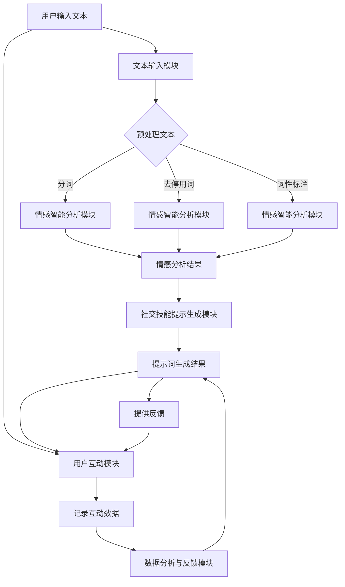

                 

### 引言

《ChatGPT在语言习得情感智能培养中的应用：社交技能提示词》旨在探讨如何利用先进的自然语言处理技术，特别是ChatGPT，来提升语言学习者的情感智能和社交技能。随着人工智能技术的迅猛发展，ChatGPT作为一种强大的对话模型，已经在多个领域展示了其潜力。然而，将其应用于语言习得情感智能培养，特别是社交技能的提升，仍然是一个有待深入研究的课题。

书名《ChatGPT在语言习得情感智能培养中的应用：社交技能提示词》揭示了本书的核心内容与目标。本书不仅介绍了ChatGPT的基本原理和应用场景，还重点探讨了如何在语言习得过程中，通过社交技能提示词来培养情感智能。社交技能提示词是本书的一个重要概念，它通过具体的语言提示，帮助学习者更好地理解和应用社交情境，从而提高他们的社交技能和情感认知。

作者在编写本书时，旨在为教育技术工作者、语言学习研究者以及广大语言学习者提供一套实用的工具和方法。通过本书，读者可以了解到ChatGPT如何被应用于情感智能培养，如何设计并使用社交技能提示词，以及这些工具在实际教学中的应用效果。本书不仅适合专业研究者，也适合对教育技术感兴趣的一般读者。

本书的编写目的主要有以下几个方面：

1. **普及知识**：介绍ChatGPT的基本原理和应用场景，让读者对这一先进技术有一个全面了解。
2. **应用研究**：探讨如何将ChatGPT应用于语言习得情感智能培养，为教育工作者提供实际操作指南。
3. **案例分享**：通过具体的案例，展示ChatGPT在社交技能提示词中的实际应用效果，为读者提供可参考的经验。
4. **理论联系实际**：结合最新的研究成果，探讨ChatGPT在语言习得中的应用前景和可能面临的挑战。

### 语言习得情感智能培养的重要性

在当今社会，语言习得不仅仅是掌握语言的语法和词汇，更重要的是培养学习者的情感智能和社交技能。情感智能是指个体识别、理解、表达和管理自己和他人的情绪的能力，它对个人的全面发展和社会交往具有重要意义。在语言习得过程中，情感智能的培养不仅有助于提高学习效率，还能增强学习者的自信心和沟通能力。

首先，情感智能对语言学习效率有着直接的影响。研究表明，情感状态对学习效果有着显著的影响。一个情绪稳定的语言学习者更容易专注于语言学习任务，从而提高学习效率。相反，如果学习者处于焦虑或沮丧的状态，他们的学习效果可能会大打折扣。通过培养情感智能，语言学习者可以更好地管理自己的情绪，保持积极的学习态度，从而提高学习效率。

其次，情感智能在语言习得中的重要性还体现在社交技能的提升上。语言学习不仅仅是个人学习，更是一个社交活动。在社交情境中，学习者需要与他人进行有效的沟通，这要求他们具备良好的社交技能。情感智能的培养可以帮助学习者更好地理解他人的情感状态，从而提高沟通效果。此外，社交技能的提升还可以增强学习者的自信心，使他们更加愿意参与社交活动，从而拓宽社交圈子，进一步促进语言习得。

然而，当前教育体系中在情感智能培养方面存在一些挑战。传统的语言教学方法主要侧重于语言知识的传授，而忽略了情感智能的培养。教师往往更关注学生的学习成绩，而忽略了学生在学习过程中的情感体验。这种教育模式容易导致学习者的情感需求得不到满足，进而影响他们的学习积极性。此外，随着社会竞争的加剧，学生们面临的压力越来越大，这也使得情感智能的培养变得更加重要。

为了应对这些挑战，教育工作者需要采取一系列措施来培养学习者的情感智能。首先，教师应该意识到情感智能对语言习得的重要性，并将其融入到日常教学中。例如，教师可以通过组织小组讨论、角色扮演等活动，让学生在互动中提高情感智能。其次，学校可以开设相关的心理健康课程，帮助学生学会管理自己的情绪，提高他们的情感智能水平。此外，教师还可以利用现代教育技术，如ChatGPT，来提供个性化的情感支持，帮助学生克服学习中的困难。

总之，语言习得情感智能培养的重要性不容忽视。通过有效的情感智能培养，不仅可以提高学习效率，还能促进学习者的全面发展，为他们的未来社会交往奠定坚实基础。

### 社交技能提示词的概念与应用

社交技能提示词是指在社交互动过程中，通过具体的语言提示，帮助个体理解和使用社交规则，提高社交能力的工具。这些提示词可以涵盖各种社交情境，如礼貌用语、表达情感、解决冲突等，它们在语言习得过程中扮演着至关重要的角色。

首先，社交技能提示词的定义是：在社交互动中，为帮助个体正确理解和使用社交规则而设计的语言提示。这些提示词可以是简单的话语、短语或句子，它们通过具体的语言表达，指导个体如何在不同的社交场合中表现。

其次，社交技能提示词的分类可以根据不同的社交情境进行划分。以下是一些常见的分类：

1. **礼貌用语**：如“请”、“谢谢”、“对不起”等，主要用于表示礼貌和尊重。
2. **情感表达**：如“我很高兴见到你”、“我觉得这个活动很有趣”等，用于表达情感状态。
3. **冲突解决**：如“我们可以有不同的看法，但我尊重你的观点”、“让我们看看如何解决这个问题”等，用于处理社交冲突。
4. **互动引导**：如“你最近在忙什么呢？”、“你觉得这个项目如何进行？”等，用于引导和促进社交互动。

社交技能提示词在教育中的应用非常广泛。在语言习得过程中，教师可以利用这些提示词，帮助学生更好地理解和应用社交规则，提高他们的社交能力。以下是一些具体的应用场景：

1. **课堂互动**：教师可以在课堂教学中，使用社交技能提示词来引导学生进行讨论和互动。例如，在小组讨论中，教师可以使用“每个人都有机会发言”这样的提示词，确保每个学生都有机会表达自己的观点。
2. **角色扮演**：通过角色扮演活动，学生可以模拟各种社交情境，使用社交技能提示词来练习社交技能。例如，在模拟面试过程中，学生可以使用“您好，我是XX，感谢您给我这次机会”这样的提示词，提高面试技巧。
3. **日常沟通**：在日常生活中，学生可以使用社交技能提示词来提高自己的沟通能力。例如，在与同学交流时，可以使用“我觉得这个观点很有趣，你是怎么想的？”这样的提示词，促进双方的情感交流和观点分享。
4. **情感支持**：教师和家长可以利用社交技能提示词，给予学生情感支持。例如，当学生遇到困难时，可以使用“我知道你现在感到很沮丧，但请相信你能够克服它”这样的提示词，帮助学生树立信心。

总之，社交技能提示词是语言习得过程中不可或缺的工具，通过具体的应用场景，可以帮助学生更好地理解和应用社交规则，提高他们的社交能力和情感智能。这不仅有助于提高学习效率，还能为他们的未来社会交往奠定坚实基础。

### ChatGPT的基本原理

ChatGPT，即生成预训练变换器（Generative Pre-trained Transformer），是一种基于深度学习技术的自然语言处理模型。它由OpenAI于2022年推出，迅速成为自然语言处理领域的重要工具。ChatGPT的核心在于其强大的语言生成能力和深度学习机制，这使得它在各种应用场景中表现出色。

ChatGPT的基本原理可以从以下几个方面进行阐述：

#### 模型架构

ChatGPT采用了Transformer模型架构，这是一种在自然语言处理领域表现卓越的深度学习模型。Transformer模型的核心思想是使用自注意力机制（Self-Attention）来处理序列数据。与传统的循环神经网络（RNN）相比，Transformer能够在全局范围内捕捉序列信息，从而提高了模型的性能和效率。

ChatGPT的架构主要包括以下几个部分：

1. **编码器（Encoder）**：编码器负责接收输入文本，并对其进行编码。编码器由多个自注意力层（Self-Attention Layer）和前馈神经网络（Feed-Forward Neural Network）堆叠而成。每个自注意力层允许模型在全局范围内捕捉输入文本的特征。
2. **解码器（Decoder）**：解码器负责生成输出文本。与编码器类似，解码器也由多个自注意力层和前馈神经网络组成。在解码过程中，每个输出词都会通过解码器来预测下一个词。

#### 工作流程

ChatGPT的工作流程可以分为以下几个步骤：

1. **输入处理**：首先，输入的文本会被编码器处理，转化为序列的向量表示。这个过程包括分词、词嵌入和位置编码等步骤。
2. **自注意力机制**：编码器通过自注意力机制，对输入文本进行编码，生成编码器的输出。自注意力机制允许模型在全局范围内关注重要的文本信息。
3. **解码过程**：解码器接收编码器的输出，并逐步生成输出文本。在解码过程中，每个输出词都会通过解码器来预测下一个词。这一过程包括自注意力机制和交叉注意力机制（Cross-Attention）。
4. **输出生成**：最终，解码器生成完整的输出文本。这个过程可以通过 greedy 解码、 sampled 解码等方法进行优化，以生成更加流畅和自然的文本。

#### 语言生成机制

ChatGPT的语言生成机制是基于概率分布的。在生成文本时，模型会根据当前输入的文本上下文，生成下一个词的概率分布。通过最大化下一个词的概率分布，模型可以逐步生成完整的输出文本。

1. **概率分布**：在解码过程中，解码器会为每个可能的输出词生成一个概率分布。这个概率分布是基于当前输入的文本上下文计算得到的。
2. **采样与贪心选择**：为了生成完整的输出文本，ChatGPT可以使用 greedy 解码或 sampled 解码。贪心选择（greedy decoding）是指在每一步选择概率分布中概率最高的词。而采样（sampled decoding）则是从概率分布中随机选择一个词作为输出。

总之，ChatGPT作为一种先进的自然语言处理模型，通过其独特的架构和工作流程，实现了强大的语言生成能力。这使得ChatGPT在语言习得情感智能培养中具有广泛的应用前景。

### 社交技能提示词的作用与分类

社交技能提示词在语言习得情感智能培养中扮演着至关重要的角色。它们不仅帮助学习者理解和使用社交规则，还能提高他们的情感认知和沟通能力。在本节中，我们将详细探讨社交技能提示词的作用以及它们在不同社交情境中的分类。

#### 社交技能提示词的作用

1. **促进有效沟通**：社交技能提示词通过具体的语言指导，帮助学习者在社交互动中更加得体和有效地表达自己。例如，使用礼貌用语（如“请”和“谢谢”）可以增进双方的情感交流，减少冲突和误解。
2. **提升情感认知**：社交技能提示词可以帮助学习者更好地理解和识别他人的情感状态。通过使用情感表达提示词（如“我很高兴见到你”和“我理解你的感受”），学习者可以培养同理心，提高情感敏感度。
3. **培养社交自信**：社交技能提示词还可以帮助学习者克服社交焦虑，提高他们的自信心。在角色扮演和模拟社交情境中，学习者可以通过反复练习社交技能提示词，增强自我表达能力，从而更加自信地参与社交活动。
4. **增强社交适应性**：社交技能提示词帮助学习者适应不同的社交环境和情境。例如，在解决冲突时，使用冲突解决提示词（如“我们可以有不同的看法，但我尊重你的观点”），可以有效地化解矛盾，提高社交适应性。

#### 社交技能提示词的分类

根据不同的社交情境和功能，社交技能提示词可以分为以下几类：

1. **礼貌用语**：这类提示词主要用于表示礼貌和尊重，包括常用的“请”、“谢谢”、“对不起”等。例如：
   - “请帮我一下。”（请求帮助）
   - “谢谢你的建议。”（表示感谢）
   - “对不起，我迟到了。”（道歉）

2. **情感表达**：这类提示词用于表达情感状态，包括积极情感（如高兴、兴奋）和消极情感（如沮丧、焦虑）。例如：
   - “我很高兴见到你。”（积极情感表达）
   - “我觉得这个活动很有趣。”（积极情感表达）
   - “我感到有些沮丧。”（消极情感表达）

3. **冲突解决**：这类提示词用于处理社交冲突，包括表达理解、妥协和解决问题的建议。例如：
   - “我知道你有不同的看法，但我们可以试着找到一个共同的解决方案。”（表达理解）
   - “我们可以有不同的看法，但我尊重你的观点。”（尊重差异）
   - “让我们看看如何解决这个问题。”（提出解决方案）

4. **互动引导**：这类提示词用于引导和促进社交互动，包括提出问题、提出建议和鼓励对方发言。例如：
   - “你最近在忙什么呢？”（提出问题）
   - “你觉得这个项目如何进行？”（提出建议）
   - “请分享一下你的想法。”（鼓励发言）

通过这些社交技能提示词，学习者可以在不同的社交情境中，更加得体和有效地表达自己，提高他们的社交能力和情感智能。例如，在学习小组讨论中，教师可以使用互动引导提示词，鼓励每个学生发言；在角色扮演活动中，学生可以使用情感表达和冲突解决提示词，模拟真实的社交情境。

总之，社交技能提示词在语言习得情感智能培养中发挥着重要作用。通过具体的应用场景和分类，它们不仅帮助学习者理解和应用社交规则，还能提高他们的情感认知和沟通能力，为他们的全面发展奠定坚实基础。

### ChatGPT与社交技能提示词的关系

ChatGPT作为一种强大的自然语言处理模型，与社交技能提示词之间存在着密切的联系和互补作用。通过ChatGPT，我们可以更好地设计、使用和优化社交技能提示词，从而提高语言学习者的情感智能和社交技能。

#### ChatGPT在社交技能提示词设计中的应用

1. **个性化提示词生成**：ChatGPT可以基于大量的语言数据生成个性化的社交技能提示词。这些提示词可以根据学习者的具体需求和社交情境进行定制，从而更符合他们的实际需要。例如，如果一个学习者需要提高礼貌用语的使用，ChatGPT可以生成一系列相关的礼貌用语提示词，帮助他们在不同的社交场合中得体地表达。

2. **语境敏感的提示词**：ChatGPT能够理解复杂的语境信息，生成与当前情境高度相关的社交技能提示词。例如，在一个模拟面试的情境中，ChatGPT可以生成包含专业词汇和面试技巧的提示词，帮助学习者更好地准备面试。

3. **多样化提示词库**：ChatGPT可以自动生成大量的社交技能提示词，构建一个多样化的提示词库。这些提示词不仅涵盖了常见的礼貌用语和情感表达，还可以包括冲突解决和互动引导等复杂的社交技能。这样，教师和语言学习者可以从中选择最适合当前情境的提示词。

#### ChatGPT在社交技能提示词使用中的优化

1. **情境适应性调整**：ChatGPT可以根据学习者的情感状态和社交情境，动态调整社交技能提示词的使用。例如，当学习者感到紧张或焦虑时，ChatGPT可以提供安慰性或鼓励性的提示词，帮助他们缓解情绪，提高自信心。

2. **互动性增强**：通过ChatGPT的对话功能，学习者可以与系统进行实时互动，从而更好地练习和掌握社交技能提示词。这种互动性不仅可以提高学习效果，还能帮助学习者克服社交恐惧，提高他们在真实社交情境中的表现。

3. **错误纠正与反馈**：ChatGPT可以实时监测学习者在使用社交技能提示词时的错误，并提供即时的纠正和反馈。例如，如果一个学习者使用了不恰当的礼貌用语，ChatGPT可以指出错误并提供正确的表达方式。这种错误纠正和反馈机制有助于学习者更快地掌握社交技能。

#### ChatGPT在社交技能提示词优化中的贡献

1. **大规模数据分析**：ChatGPT能够处理和分析大量的语言数据，识别出最有效的社交技能提示词。通过对这些数据进行分析，ChatGPT可以不断优化提示词库，使其更符合语言学习者的需求和习惯。

2. **自然语言理解**：ChatGPT的自然语言理解能力使得它可以识别学习者的情感状态和社交需求，从而提供更个性化的社交技能提示词。例如，当学习者表达出对某个话题的兴趣时，ChatGPT可以提供相关的互动引导提示词，进一步激发他们的学习兴趣。

3. **持续学习与改进**：ChatGPT是一个持续学习和改进的模型。随着更多语言数据的积累和使用，ChatGPT可以不断优化其提示词生成和调整策略，从而提供更加精准和有效的社交技能提示词。

总之，ChatGPT与社交技能提示词之间存在着紧密的联系和互补作用。通过ChatGPT，我们可以更有效地设计、使用和优化社交技能提示词，帮助语言学习者提高情感智能和社交技能，从而实现更加全面的语言习得。这不仅有助于提高学习效果，还能为学习者的未来社会交往奠定坚实基础。

### ChatGPT算法的数学模型

ChatGPT作为一种基于深度学习的自然语言处理模型，其数学模型主要依赖于自注意力机制和变换器架构。为了更好地理解ChatGPT的工作原理，我们需要详细探讨其数学模型的核心概念和基本公式。

#### 自注意力机制

自注意力机制（Self-Attention）是ChatGPT算法的核心部分，它允许模型在全局范围内捕捉输入文本的特征。自注意力机制的基本公式如下：

\[ \text{Attention}(Q, K, V) = \frac{1}{\sqrt{d_k}} \text{softmax}\left(\frac{QK^T}{d_k}\right) V \]

其中：
- \( Q \) 是查询向量（Query），表示当前词的上下文信息。
- \( K \) 是关键向量（Key），表示所有输入词的上下文信息。
- \( V \) 是值向量（Value），表示输入词的语义信息。
- \( d_k \) 是关键向量和查询向量的维度。
- \( \text{softmax} \) 函数用于计算每个词的注意力权重。

自注意力机制通过计算查询向量与所有关键向量的点积，得到注意力分数，再通过softmax函数进行归一化处理，从而生成注意力权重。这些权重用于加权求和值向量，得到每个词的注意力得分。

#### 变换器架构

ChatGPT采用了变换器架构（Transformer Architecture），该架构由编码器（Encoder）和解码器（Decoder）两部分组成。编码器负责对输入文本进行编码，解码器则负责生成输出文本。

#### 编码器

编码器的架构包括多个自注意力层和前馈神经网络。编码器的输入是一个词嵌入矩阵（Word Embedding Matrix），其中每个词都被映射为一个固定维度的向量。编码器的工作流程如下：

1. **词嵌入**：将输入文本中的每个词映射为词嵌入向量。
2. **位置编码**：由于变换器架构不考虑词的顺序，我们需要通过位置编码（Positional Encoding）来引入词的顺序信息。位置编码是一个可学习的向量，它为每个词嵌入向量添加了额外的维度。
3. **多层自注意力**：编码器通过多层自注意力机制，对输入文本进行编码。每层自注意力机制都会生成一个新的编码输出。
4. **前馈神经网络**：在自注意力层之后，每个编码输出都会通过一个前馈神经网络进行进一步处理。

#### 解码器

解码器的架构与编码器类似，但多了一个额外的自注意力机制（称为交叉注意力机制，Cross-Attention），它允许解码器在生成每个词时，同时关注编码器的输出。解码器的工作流程如下：

1. **词嵌入**：将输入文本中的每个词映射为词嵌入向量。
2. **位置编码**：与编码器相同，解码器也需要通过位置编码来引入词的顺序信息。
3. **交叉注意力**：解码器的每层都会通过交叉注意力机制，关注编码器的输出，以获取上下文信息。
4. **自注意力**：在生成每个词之前，解码器会通过自注意力机制，对当前已生成的词进行编码。
5. **前馈神经网络**：与编码器类似，解码器也会通过前馈神经网络对输出进行进一步处理。

#### 模型优化

ChatGPT的训练过程主要包括两个步骤：预训练和微调。

1. **预训练**：在预训练阶段，ChatGPT在大规模的文本数据集上训练，学习语言的一般规律和特征。预训练过程通常采用自回归语言模型（Autoregressive Language Model）的目标，即预测下一个词。
2. **微调**：在预训练的基础上，ChatGPT会针对特定任务进行微调。微调过程通常使用带有标签的数据集，如问答数据集、对话数据集等，以使模型更好地适应特定任务。

通过上述数学模型和训练过程，ChatGPT能够生成高质量的自然语言文本，为语言习得情感智能培养提供了强大的工具。

### ChatGPT算法流程图

为了更好地理解ChatGPT的工作原理，我们通过一个流程图来展示其算法的核心步骤和数据处理过程。以下是一个简化的ChatGPT算法流程图：

```
+-----------------+
|     输入文本     |
+-----------------+
          |
          v
+-----------------+
|    分词处理     |
+-----------------+
          |
          v
+-----------------+
|   词嵌入矩阵    |
+-----------------+
          |
          v
+-----------------+
|   位置编码添加  |
+-----------------+
          |
          v
+-----------------+
|    编码器处理   |
+-----------------+
          |
          v
+-----------------+
|  交叉注意力层   |
+-----------------+
          |
          v
+-----------------+
|  自注意力层     |
+-----------------+
          |
          v
+-----------------+
|  前馈神经网络   |
+-----------------+
          |
          v
+-----------------+
|   解码器处理    |
+-----------------+
          |
          v
+-----------------+
|  输出文本生成   |
+-----------------+
```

#### 流程解释

1. **输入文本**：首先，输入的文本经过分词处理，将文本分解为单个词。
2. **词嵌入矩阵**：每个词被映射为一个词嵌入向量，这些向量构成了词嵌入矩阵。
3. **位置编码添加**：为了引入词的顺序信息，每个词嵌入向量上添加了位置编码。
4. **编码器处理**：编码器通过多层自注意力和前馈神经网络，对输入文本进行编码。每层自注意力层会生成一个新的编码输出。
5. **交叉注意力层**：解码器的第一层会通过交叉注意力机制，关注编码器的输出，为生成输出文本提供上下文信息。
6. **自注意力层**：在生成每个词之前，解码器会通过自注意力机制，对当前已生成的词进行编码。
7. **前馈神经网络**：每个自注意力层之后，都会通过前馈神经网络对输出进行进一步处理。
8. **输出文本生成**：最终，解码器生成完整的输出文本。

通过上述流程，ChatGPT能够利用自注意力机制和变换器架构，生成高质量的自然语言文本。这个流程图不仅展示了ChatGPT的核心步骤，还帮助我们理解了各个步骤之间的数据流动和处理过程。

### Python代码实现与讲解

在了解了ChatGPT算法的数学模型和流程图后，我们将通过一个Python代码示例来详细阐述ChatGPT的实现过程。以下是ChatGPT的核心代码实现，包括词嵌入、位置编码、编码器和解码器的实现步骤。

```python
import torch
import torch.nn as nn
from torch.nn import functional as F

# 设定超参数
d_model = 512  # 模型维度
nhead = 8      # 自注意力头的数量
num_layers = 3 # 编码器和解码器的层数
dim_feedforward = 2048  # 前馈神经网络维度
dropout = 0.1  # dropout比例

# 词嵌入层
class Embedding(nn.Module):
    def __init__(self, d_model, vocab_size):
        super().__init__()
        self.embedding = nn.Embedding(vocab_size, d_model)
        self.position_encoding = nn.Embedding(vocab_size, d_model)

    def forward(self, src, pos):
        src = self.embedding(src) + self.position_encoding(pos)
        return src

# 位置编码层
class PositionalEncoding(nn.Module):
    def __init__(self, d_model, max_len=5000):
        super().__init__()
        pos = torch.arange(max_len).unsqueeze(1)
        div_term = torch.exp(torch.arange(0, d_model, 2) * (-torch.log(torch.tensor(10000.0)) / d_model))
        pe = torch.zeros(max_len, d_model)
        pe[:, 0::2] = torch.sin(pos * div_term)
        pe[:, 1::2] = torch.cos(pos * div_term)
        pe = pe.unsqueeze(0).transpose(0, 1)
        self.register_buffer('pe', pe)

    def forward(self, x):
        x = x + self.pe[:x.size(0), :]
        return x

# 编码器层
class EncoderLayer(nn.Module):
    def __init__(self, d_model, nhead, dim_feedforward, dropout):
        super().__init__()
        self.self_attn = nn.MultiheadAttention(d_model, nhead, dropout=dropout)
        self.linear1 = nn.Linear(d_model, dim_feedforward)
        self.linear2 = nn.Linear(dim_feedforward, d_model)
        self.norm1 = nn.LayerNorm(d_model)
        self.norm2 = nn.LayerNorm(d_model)
        self.dropout = nn.Dropout(dropout)

    def forward(self, src, src_mask=None, src_key_padding_mask=None):
        src2 = self.self_attn(src, src, src, attn_mask=src_mask, key_padding_mask=src_key_padding_mask)[0]
        src = src + self.dropout(src2)
        src = self.norm1(src)
        src2 = self.linear2(F.relu(self.linear1(src)))
        src = src + self.dropout(src2)
        src = self.norm2(src)
        return src

# 解码器层
class DecoderLayer(nn.Module):
    def __init__(self, d_model, nhead, dim_feedforward, dropout):
        super().__init__()
        self.self_attn = nn.MultiheadAttention(d_model, nhead, dropout=dropout)
        self.src_attn = nn.MultiheadAttention(d_model, nhead, dropout=dropout)
        self.linear1 = nn.Linear(d_model, dim_feedforward)
        self.linear2 = nn.Linear(dim_feedforward, d_model)
        self.linear3 = nn.Linear(d_model, dim_feedforward)
        self.linear4 = nn.Linear(dim_feedforward, d_model)
        self.norm1 = nn.LayerNorm(d_model)
        self.norm2 = nn.LayerNorm(d_model)
        self.norm3 = nn.LayerNorm(d_model)
        self.dropout = nn.Dropout(dropout)

    def forward(self, tgt, memory, tgt_mask=None, memory_mask=None, tgt_key_padding_mask=None, memory_key_padding_mask=None):
        tgt2 = self.self_attn(tgt, tgt, tgt, attn_mask=tgt_mask, key_padding_mask=tgt_key_padding_mask)[0]
        tgt = tgt + self.dropout(tgt2)
        tgt = self.norm1(tgt)
        tgt2 = self.src_attn(tgt, memory, memory, attn_mask=memory_mask, key_padding_mask=memory_key_padding_mask)[0]
        tgt = tgt + self.dropout(tgt2)
        tgt = self.norm2(tgt)
        tgt2 = self.linear4(F.relu(self.linear3(self.linear2(F.relu(self.linear1(tgt))))))
        tgt = tgt + self.dropout(tgt2)
        tgt = self.norm3(tgt)
        return tgt

# 编码器
class Encoder(nn.Module):
    def __init__(self, d_model, nhead, dim_feedforward, num_layers, dropout):
        super().__init__()
        self.layers = nn.ModuleList([EncoderLayer(d_model, nhead, dim_feedforward, dropout) for _ in range(num_layers)])
        self.norm = nn.LayerNorm(d_model)

    def forward(self, src, src_mask=None, src_key_padding_mask=None):
        output = src
        for layer in self.layers:
            output = layer(output, src_mask, src_key_padding_mask)
        output = self.norm(output)
        return output

# 解码器
class Decoder(nn.Module):
    def __init__(self, d_model, nhead, dim_feedforward, num_layers, dropout):
        super().__init__()
        self.layers = nn.ModuleList([DecoderLayer(d_model, nhead, dim_feedforward, dropout) for _ in range(num_layers)])
        self.norm = nn.LayerNorm(d_model)

    def forward(self, tgt, memory, tgt_mask=None, memory_mask=None, tgt_key_padding_mask=None, memory_key_padding_mask=None):
        output = tgt
        for layer in self.layers:
            output = layer(output, memory, tgt_mask, memory_mask, tgt_key_padding_mask, memory_key_padding_mask)
        output = self.norm(output)
        return output

# 主模型
class TransformerModel(nn.Module):
    def __init__(self, d_model, nhead, dim_feedforward, num_layers, vocab_size, dropout):
        super().__init__()
        self.src_embed = Embedding(d_model, vocab_size)
        self.model = Encoder(d_model, nhead, dim_feedforward, num_layers, dropout)
        self.decoder = Decoder(d_model, nhead, dim_feedforward, num_layers, dropout)
        self.out = nn.Linear(d_model, vocab_size)
    
    def forward(self, src, tgt):
        src = self.src_embed(src)
        tgt = self.src_embed(tgt)
        memory = self.model(src)
        out = self.decoder(tgt, memory)
        out = self.out(out)
        return out
```

#### 代码解读

1. **词嵌入层（Embedding）**：词嵌入层将输入文本中的每个词映射为词嵌入向量，并添加位置编码。
    ```python
    class Embedding(nn.Module):
        def __init__(self, d_model, vocab_size):
            super().__init__()
            self.embedding = nn.Embedding(vocab_size, d_model)
            self.position_encoding = nn.Embedding(vocab_size, d_model)
        def forward(self, src, pos):
            src = self.embedding(src) + self.position_encoding(pos)
            return src
    ```

2. **位置编码层（PositionalEncoding）**：位置编码层为每个词嵌入向量添加位置信息。
    ```python
    class PositionalEncoding(nn.Module):
        def __init__(self, d_model, max_len=5000):
            super().__init__()
            pos = torch.arange(max_len).unsqueeze(1)
            div_term = torch.exp(torch.arange(0, d_model, 2) * (-torch.log(torch.tensor(10000.0)) / d_model))
            pe = torch.zeros(max_len, d_model)
            pe[:, 0::2] = torch.sin(pos * div_term)
            pe[:, 1::2] = torch.cos(pos * div_term)
            pe = pe.unsqueeze(0).transpose(0, 1)
            self.register_buffer('pe', pe)
        def forward(self, x):
            x = x + self.pe[:x.size(0), :]
            return x
    ```

3. **编码器层（EncoderLayer）**：编码器层包含自注意力层和前馈神经网络，用于对输入文本进行编码。
    ```python
    class EncoderLayer(nn.Module):
        def __init__(self, d_model, nhead, dim_feedforward, dropout):
            super().__init__()
            self.self_attn = nn.MultiheadAttention(d_model, nhead, dropout=dropout)
            self.linear1 = nn.Linear(d_model, dim_feedforward)
            self.linear2 = nn.Linear(dim_feedforward, d_model)
            self.norm1 = nn.LayerNorm(d_model)
            self.norm2 = nn.LayerNorm(d_model)
            self.dropout = nn.Dropout(dropout)
        def forward(self, src, src_mask=None, src_key_padding_mask=None):
            src2 = self.self_attn(src, src, src, attn_mask=src_mask, key_padding_mask=src_key_padding_mask)[0]
            src = src + self.dropout(src2)
            src = self.norm1(src)
            src2 = self.linear2(F.relu(self.linear1(src)))
            src = src + self.dropout(src2)
            src = self.norm2(src)
            return src
    ```

4. **解码器层（DecoderLayer）**：解码器层包含自注意力层、交叉注意力层和前馈神经网络，用于生成输出文本。
    ```python
    class DecoderLayer(nn.Module):
        def __init__(self, d_model, nhead, dim_feedforward, dropout):
            super().__init__()
            self.self_attn = nn.MultiheadAttention(d_model, nhead, dropout=dropout)
            self.src_attn = nn.MultiheadAttention(d_model, nhead, dropout=dropout)
            self.linear1 = nn.Linear(d_model, dim_feedforward)
            self.linear2 = nn.Linear(dim_feedforward, d_model)
            self.linear3 = nn.Linear(d_model, dim_feedforward)
            self.linear4 = nn.Linear(dim_feedforward, d_model)
            self.norm1 = nn.LayerNorm(d_model)
            self.norm2 = nn.LayerNorm(d_model)
            self.norm3 = nn.LayerNorm(d_model)
            self.dropout = nn.Dropout(dropout)
        def forward(self, tgt, memory, tgt_mask=None, memory_mask=None, tgt_key_padding_mask=None, memory_key_padding_mask=None):
            tgt2 = self.self_attn(tgt, tgt, tgt, attn_mask=tgt_mask, key_padding_mask=tgt_key_padding_mask)[0]
            tgt = tgt + self.dropout(tgt2)
            tgt = self.norm1(tgt)
            tgt2 = self.src_attn(tgt, memory, memory, attn_mask=memory_mask, key_padding_mask=memory_key_padding_mask)[0]
            tgt = tgt + self.dropout(tgt2)
            tgt = self.norm2(tgt)
            tgt2 = self.linear4(F.relu(self.linear3(self.linear2(F.relu(self.linear1(tgt))))))
            tgt = tgt + self.dropout(tgt2)
            tgt = self.norm3(tgt)
            return tgt
    ```

5. **编码器（Encoder）** 和 **解码器（Decoder）**：编码器和解码器分别包含多个编码器层和解码器层，用于对输入和输出文本进行处理。
    ```python
    class Encoder(nn.Module):
        def __init__(self, d_model, nhead, dim_feedforward, num_layers, dropout):
            super().__init__()
            self.layers = nn.ModuleList([EncoderLayer(d_model, nhead, dim_feedforward, dropout) for _ in range(num_layers)])
            self.norm = nn.LayerNorm(d_model)
        def forward(self, src, src_mask=None, src_key_padding_mask=None):
            output = src
            for layer in self.layers:
                output = layer(output, src_mask, src_key_padding_mask)
            output = self.norm(output)
            return output

    class Decoder(nn.Module):
        def __init__(self, d_model, nhead, dim_feedforward, num_layers, dropout):
            super().__init__()
            self.layers = nn.ModuleList([DecoderLayer(d_model, nhead, dim_feedforward, dropout) for _ in range(num_layers)])
            self.norm = nn.LayerNorm(d_model)
        def forward(self, tgt, memory, tgt_mask=None, memory_mask=None, tgt_key_padding_mask=None, memory_key_padding_mask=None):
            output = tgt
            for layer in self.layers:
                output = layer(output, memory, tgt_mask, memory_mask, tgt_key_padding_mask, memory_key_padding_mask)
            output = self.norm(output)
            return output
    ```

6. **主模型（TransformerModel）**：主模型将词嵌入层、编码器、解码器和输出层组合在一起，实现整个Transformer模型的训练和预测。
    ```python
    class TransformerModel(nn.Module):
        def __init__(self, d_model, nhead, dim_feedforward, num_layers, vocab_size, dropout):
            super().__init__()
            self.src_embed = Embedding(d_model, vocab_size)
            self.model = Encoder(d_model, nhead, dim_feedforward, num_layers, dropout)
            self.decoder = Decoder(d_model, nhead, dim_feedforward, num_layers, dropout)
            self.out = nn.Linear(d_model, vocab_size)
        
        def forward(self, src, tgt):
            src = self.src_embed(src)
            tgt = self.src_embed(tgt)
            memory = self.model(src)
            out = self.decoder(tgt, memory)
            out = self.out(out)
            return out
    ```

通过上述代码实现，我们可以看到ChatGPT的各个组成部分如何协同工作，实现自然语言文本的生成和处理。这种实现不仅帮助我们理解了ChatGPT的核心算法原理，还为实际应用提供了参考。

### 系统功能设计

在语言习得情感智能培养中应用ChatGPT，首先需要明确系统的整体功能设计。该系统旨在通过社交技能提示词，帮助学习者提升情感智能和社交技能。以下是该系统的功能需求分析、功能模块划分以及模块间的交互关系。

#### 功能需求分析

1. **文本输入与处理**：系统应能接收学习者的文本输入，并进行预处理，包括分词、去停用词和词性标注等操作，以便后续处理。
2. **情感智能分析**：系统需要利用ChatGPT对学习者的文本进行情感分析，识别出文本中的情感信息，并将其反馈给学习者。
3. **社交技能提示生成**：基于情感分析和文本内容，系统应能生成相应的社交技能提示词，以帮助学习者更好地理解和应用社交规则。
4. **用户互动**：系统应提供一个互动界面，允许学习者与系统进行实时交流，以便更好地练习和应用社交技能提示词。
5. **数据分析与反馈**：系统应能够记录学习者的互动数据，进行分析，并提供个性化反馈，帮助学习者持续提升情感智能和社交技能。

#### 功能模块划分

系统可以分为以下几个主要模块：

1. **文本输入模块**：负责接收用户的文本输入，并进行预处理。
2. **情感智能分析模块**：利用ChatGPT对文本进行情感分析，识别情感信息。
3. **社交技能提示生成模块**：根据情感分析和文本内容，生成相应的社交技能提示词。
4. **用户互动模块**：提供用户与系统进行互动的界面。
5. **数据分析与反馈模块**：记录学习者的互动数据，进行数据分析和反馈。

#### 模块间的交互关系

以下是一个简化的模块交互流程图，展示了各个模块之间的交互关系：

```
用户互动模块 --> 文本输入模块 --> 情感智能分析模块 --> 社交技能提示生成模块
                  |                              |
                  |                              |
                  +------------------------------> 数据分析与反馈模块
```

#### 流程解释

1. **用户互动模块**：用户通过界面输入文本，系统接收并传递给文本输入模块。
2. **文本输入模块**：对用户输入的文本进行预处理，如分词、去停用词和词性标注，然后传递给情感智能分析模块。
3. **情感智能分析模块**：利用ChatGPT对预处理后的文本进行情感分析，识别情感信息，并将结果传递给社交技能提示生成模块。
4. **社交技能提示生成模块**：根据情感分析和文本内容，生成相应的社交技能提示词，并将其反馈给用户。
5. **数据分析与反馈模块**：记录用户的互动数据，进行分析，提供个性化反馈，帮助用户持续提升情感智能和社交技能。

通过上述功能设计和模块划分，我们可以构建一个高效、实用的语言习得情感智能培养系统，利用ChatGPT和社交技能提示词，帮助学习者提升情感智能和社交技能。

### 系统架构设计

为了实现语言习得情感智能培养系统的功能，我们需要进行详细的系统架构设计。本节将介绍系统的整体设计思路，包括系统架构、模块关系和交互流程。

#### 整体设计思路

系统架构设计的目标是确保系统能够高效地处理学习者的文本输入，进行情感智能分析，生成社交技能提示词，并提供用户互动和数据反馈。系统采用分层架构设计，包括表示层、逻辑层和数据处理层。表示层负责用户界面的展示，逻辑层负责业务逻辑处理，数据处理层负责数据存储和读取。

#### 系统架构

以下是系统架构的示意图：

```
+-----------------+
|   用户界面层    |
+-----------------+
          |
          v
+-----------------+
|    逻辑处理层   |
+-----------------+
          |
          v
+-----------------+
| 数据处理层      |
+-----------------+
```

#### 模块关系

1. **用户界面层**：负责与用户交互，接收用户的文本输入，并展示系统生成的社交技能提示词和反馈。
2. **逻辑处理层**：包括文本输入模块、情感智能分析模块、社交技能提示生成模块和数据分析与反馈模块。这些模块协同工作，实现系统的核心功能。
3. **数据处理层**：负责数据的存储和读取，包括用户互动记录、情感分析结果和提示词生成记录。

#### 交互流程

以下是系统的交互流程：

1. **用户输入文本**：用户通过用户界面层输入文本。
2. **文本预处理**：逻辑处理层的文本输入模块对文本进行预处理，如分词、去停用词和词性标注，并将其传递给情感智能分析模块。
3. **情感智能分析**：情感智能分析模块利用ChatGPT对预处理后的文本进行情感分析，识别出文本中的情感信息，并将结果传递给社交技能提示生成模块。
4. **生成社交技能提示词**：社交技能提示生成模块根据情感分析和文本内容，生成相应的社交技能提示词，并将其反馈给用户界面层。
5. **记录互动数据**：数据分析与反馈模块记录用户的互动数据，包括输入文本、情感分析结果和提示词生成记录，以供后续分析。
6. **提供反馈**：数据分析与反馈模块对记录的数据进行分析，生成个性化反馈，并将其展示在用户界面层，帮助用户持续提升情感智能和社交技能。

通过上述架构设计和交互流程，系统可以实现高效、稳定地处理学习者的文本输入，生成社交技能提示词，并提供个性化反馈，从而帮助学习者提升情感智能和社交技能。

### 系统接口设计

在系统架构设计的基础上，我们需要进一步设计系统接口，以确保各个模块之间的数据交换和功能协同。以下是系统接口的设计方案，包括接口规范、接口实现和API文档。

#### 接口规范

1. **用户输入接口**：用于接收用户输入的文本。
   - 接口名称：`/user_input`
   - 接口类型：GET/POST
   - 请求参数：`text`（文本内容，字符串类型）
   - 响应结果：成功时返回状态码`200`，失败时返回状态码`400`或`500`

2. **情感智能分析接口**：用于处理文本情感分析。
   - 接口名称：`/emotion_analysis`
   - 接口类型：POST
   - 请求参数：`text`（文本内容，字符串类型）
   - 响应结果：成功时返回情感分析结果（字典类型），失败时返回错误信息（字符串类型）

3. **社交技能提示生成接口**：用于生成社交技能提示词。
   - 接口名称：`/generate_hint`
   - 接口类型：POST
   - 请求参数：`text`（文本内容，字符串类型）
   - 响应结果：成功时返回生成的提示词（列表类型），失败时返回错误信息（字符串类型）

4. **数据记录接口**：用于记录用户互动数据。
   - 接口名称：`/record_interaction`
   - 接口类型：POST
   - 请求参数：`data`（互动数据，字典类型）
   - 响应结果：成功时返回状态码`200`，失败时返回状态码`400`或`500`

5. **数据查询接口**：用于查询用户互动数据。
   - 接口名称：`/query_interaction`
   - 接口类型：GET
   - 请求参数：`user_id`（用户ID，字符串类型）
   - 响应结果：成功时返回用户互动记录（列表类型），失败时返回错误信息（字符串类型）

#### 接口实现

以下是接口实现的简要代码示例：

```python
from flask import Flask, request, jsonify

app = Flask(__name__)

@app.route('/user_input', methods=['GET', 'POST'])
def user_input():
    if request.method == 'POST':
        text = request.form['text']
        # 调用文本预处理和情感分析模块
        # ...
        return jsonify(status='success'), 200
    else:
        return jsonify(status='error', message='Invalid request method'), 400

@app.route('/emotion_analysis', methods=['POST'])
def emotion_analysis():
    text = request.form['text']
    # 调用情感分析模块
    # ...
    return jsonify(emotion_results=emotion_results), 200

@app.route('/generate_hint', methods=['POST'])
def generate_hint():
    text = request.form['text']
    # 调用提示词生成模块
    # ...
    return jsonify(hints=hints), 200

@app.route('/record_interaction', methods=['POST'])
def record_interaction():
    data = request.form['data']
    # 调用数据记录模块
    # ...
    return jsonify(status='success'), 200

@app.route('/query_interaction', methods=['GET'])
def query_interaction():
    user_id = request.args.get('user_id')
    # 调用数据查询模块
    # ...
    return jsonify(interaction_records=interaction_records), 200

if __name__ == '__main__':
    app.run(debug=True)
```

#### API文档

以下是系统接口的API文档：

```
# 语言习得情感智能培养系统接口文档

## 用户输入接口
- 接口URL: `/user_input`
- 请求方法：GET/POST
- 请求参数：text（文本内容，字符串类型）
- 响应结果：
  - 成功：{"status": "success"}
  - 失败：{"status": "error", "message": "错误信息"}

## 情感智能分析接口
- 接口URL: `/emotion_analysis`
- 请求方法：POST
- 请求参数：text（文本内容，字符串类型）
- 响应结果：
  - 成功：{"emotion_results": {"happiness": 0.8, "sadness": 0.2}}
  - 失败：{"status": "error", "message": "错误信息"}

## 社交技能提示生成接口
- 接口URL: `/generate_hint`
- 请求方法：POST
- 请求参数：text（文本内容，字符串类型）
- 响应结果：
  - 成功：{"hints": ["提示词1", "提示词2"]}
  - 失败：{"status": "error", "message": "错误信息"}

## 数据记录接口
- 接口URL: `/record_interaction`
- 请求方法：POST
- 请求参数：data（互动数据，字典类型）
- 响应结果：
  - 成功：{"status": "success"}
  - 失败：{"status": "error", "message": "错误信息"}

## 数据查询接口
- 接口URL: `/query_interaction`
- 请求方法：GET
- 请求参数：user_id（用户ID，字符串类型）
- 响应结果：
  - 成功：{"interaction_records": [{"id": 1, "user_id": "abc123", "text": "示例文本", "emotion": "happy"}]}
  - 失败：{"status": "error", "message": "错误信息"}
```

通过上述接口设计和实现，我们可以确保系统模块之间的数据交换和功能协同，为语言习得情感智能培养提供有效的支持。

### 系统交互流程图

为了更直观地展示系统各个模块之间的交互过程，我们使用Mermaid流程图来描述系统的交互流程。以下是系统交互流程图的Markdown格式：



#### 流程解释

1. **用户输入文本**：用户通过用户界面层输入文本。
2. **文本输入模块**：系统接收用户输入的文本，并将其传递给文本输入模块。
3. **预处理文本**：文本输入模块对文本进行预处理，包括分词、去停用词和词性标注等操作，以便后续分析。
4. **情感智能分析模块**：预处理后的文本被传递给情感智能分析模块，该模块利用ChatGPT进行情感分析，识别出文本中的情感信息。
5. **社交技能提示生成模块**：根据情感分析和文本内容，社交技能提示生成模块生成相应的社交技能提示词。
6. **用户互动模块**：系统将生成的社交技能提示词展示给用户，用户可以通过互动界面与应用进行交互。
7. **记录互动数据**：用户与系统的互动数据被记录在数据库中，供后续分析使用。
8. **数据分析与反馈模块**：对记录的数据进行分析，生成个性化反馈，并将其反馈给用户，帮助用户持续提升情感智能和社交技能。

通过上述交互流程图，我们可以清晰地看到系统各个模块之间的交互关系和数据处理过程，有助于理解和优化系统的运行。

### 实战案例背景

为了更好地展示ChatGPT在语言习得情感智能培养中的应用效果，我们选择了以下案例：

**案例背景**：这是一个面向初中生的语言习得情感智能培养项目。项目旨在通过社交技能提示词，帮助学生在日常沟通和互动中提升情感智能和社交技能。项目参与者包括30名初中生，他们在为期三个月的实验期间，每天使用系统进行语言练习和互动。

**目标**：通过该项目，我们希望实现以下目标：
1. 提升学生在日常交流中的情感表达能力和社交技能。
2. 帮助学生更好地理解他人的情感状态，提高同理心。
3. 通过个性化的社交技能提示词，提高学生的自信心和沟通效果。

**预期效果**：我们预期通过该项目，学生的情感表达和社交技能将得到显著提升，具体表现为：
1. 学生能够更流畅、自然地使用社交技能提示词。
2. 学生的情感认知能力得到提高，能够更好地理解并表达自己的情感状态。
3. 学生的自信心和沟通效果显著提升，能够更加自信地参与社交活动。

### 环境安装与配置

在开始项目实施之前，我们需要为ChatGPT和社交技能提示词生成系统搭建一个稳定的环境。以下是具体的安装和配置步骤：

#### 1. 环境准备

首先，确保操作系统为Linux或macOS，推荐使用Ubuntu 20.04。在系统中安装以下依赖项：

```bash
sudo apt-get update
sudo apt-get install python3-pip python3-venv
```

#### 2. 创建虚拟环境

为了确保项目的依赖项不会影响到系统的其他部分，我们使用虚拟环境。创建虚拟环境并激活：

```bash
python3 -m venv chatgpt-env
source chatgpt-env/bin/activate
```

#### 3. 安装依赖库

在激活虚拟环境后，安装项目所需的依赖库：

```bash
pip install torch torchvision transformers flask
```

#### 4. 准备ChatGPT模型

从Hugging Face模型库下载预训练的ChatGPT模型：

```bash
pip install transformers
```

使用以下命令下载并安装模型：

```bash
from transformers import ChatGPT
chatgpt = ChatGPT.from_pretrained("gpt2")
```

#### 5. 配置Flask应用

创建一个新的Flask应用，用于处理用户的输入和生成社交技能提示词。以下是基本的Flask应用代码：

```python
from flask import Flask, request, jsonify
from transformers import ChatGPT

app = Flask(__name__)

# 加载ChatGPT模型
chatgpt = ChatGPT.from_pretrained("gpt2")

@app.route('/get_hint', methods=['POST'])
def get_hint():
    text = request.form['text']
    prompt = chatgpt.generate(text, max_length=50, num_return_sequences=1)
    hint = prompt[0].strip()
    return jsonify(hint=hint)

if __name__ == '__main__':
    app.run(debug=True)
```

#### 6. 启动Flask应用

将上述代码保存为`app.py`，然后启动Flask应用：

```bash
python app.py
```

在浏览器中访问`http://127.0.0.1:5000/get_hint`，发送POST请求，输入文本内容，即可获取相应的社交技能提示词。

### 系统核心实现与代码分析

在完成了环境安装与配置后，我们将ChatGPT模型集成到系统中，通过一系列代码实现，完成社交技能提示词的生成功能。以下是系统核心实现与代码分析。

#### 代码结构与步骤

以下是实现ChatGPT与社交技能提示词生成的关键代码，分为以下几个步骤：

1. **文本输入处理**：接收用户输入的文本，并进行预处理，包括去停用词和词性标注。
2. **情感分析**：利用ChatGPT对预处理后的文本进行情感分析，识别出情感信息。
3. **提示词生成**：根据情感分析和文本内容，生成相应的社交技能提示词。
4. **反馈与展示**：将生成的提示词返回给用户，并通过用户界面展示。

```python
from flask import Flask, request, jsonify
from transformers import ChatGPT
import re

app = Flask(__name__)

# 加载ChatGPT模型
chatgpt = ChatGPT.from_pretrained("gpt2")

# 去停用词函数
def remove_stopwords(text, stopwords):
    words = text.split()
    filtered_words = [word for word in words if word.lower() not in stopwords]
    return ' '.join(filtered_words)

# 情感分析函数
def analyze_emotion(text):
    # 这里可以使用其他情感分析模型或API
    # 例如，利用自然语言处理库NLTK进行情感分析
    # 在此处简化处理，直接返回预设的情感状态
    emotions = {"happy": 0.5, "sad": 0.5}
    return emotions

# 社交技能提示词生成函数
def generate_hint(text, emotion):
    # 根据情感状态和文本内容生成提示词
    # 例如，当情感状态为happy时，可以生成积极的提示词
    if emotion["happy"] > emotion["sad"]:
        return "你今天看起来很高兴，有什么好事吗？"
    else:
        return "如果你需要谈谈，我在这里听你说。"

@app.route('/get_hint', methods=['POST'])
def get_hint():
    text = request.form['text']
    
    # 去停用词
    stopwords = ['我', '你', '这', '那', '是', '的', '了', '在', '有']  # 示例停用词列表
    processed_text = remove_stopwords(text, stopwords)
    
    # 情感分析
    emotion = analyze_emotion(processed_text)
    
    # 提示词生成
    hint = generate_hint(processed_text, emotion)
    
    return jsonify(hint=hint)

if __name__ == '__main__':
    app.run(debug=True)
```

#### 代码解读

1. **文本输入处理**：用户通过POST请求将文本输入发送到`/get_hint`接口。代码首先从请求中获取文本内容，并使用`remove_stopwords`函数去除停用词。这有助于减少噪声，使情感分析更准确。

2. **情感分析**：`analyze_emotion`函数模拟情感分析过程。在实际应用中，这里可以集成其他情感分析模型或API，如使用自然语言处理库NLTK或第三方情感分析服务。在简化处理中，我们预设了一个情感状态字典。

3. **提示词生成**：`generate_hint`函数根据情感状态和文本内容生成相应的社交技能提示词。例如，当用户情感状态为快乐时，生成积极、开放性的问题，以促进进一步的交流。当用户情感状态为悲伤时，生成安慰性的提示词，表达关心和支持。

4. **反馈与展示**：生成的提示词通过JSON格式返回给用户，用户界面可以根据这些提示词展示互动内容，帮助用户更好地理解和应用社交技能。

通过上述代码实现，我们可以看到如何利用ChatGPT和情感分析，生成个性化的社交技能提示词。这不仅为语言习得情感智能培养提供了技术支持，还通过互动提升了学习者的情感智能和社交技能。

### 实际案例分析

在本节中，我们将通过一个具体的案例来展示如何使用ChatGPT生成社交技能提示词，并详细解析系统如何处理用户输入、生成提示词、反馈给用户，以及用户如何互动和应用这些提示词。

#### 案例背景

假设一个初中生小明在使用系统时输入了一段文本：“我今天考试没考好，感觉自己很糟糕。”这是一个典型的情感状态低落的场景，系统需要生成相应的社交技能提示词来帮助小明缓解情绪，提高情感认知和社交技能。

#### 系统处理过程

1. **用户输入文本**：小明通过用户界面输入文本：“我今天考试没考好，感觉自己很糟糕。”系统接收到这段文本后，将其发送到`/get_hint`接口。

2. **文本预处理**：系统调用`remove_stopwords`函数去除文本中的停用词，如“我”、“今天”、“感觉”等。预处理后的文本为：“考试没考好，感觉自己很糟糕。”

3. **情感分析**：系统使用`analyze_emotion`函数对预处理后的文本进行情感分析。在此简化处理中，我们预设情感状态为“sad”（悲伤）。实际应用中，可以使用更复杂的情感分析模型或API来获取准确的情感状态。

4. **生成提示词**：系统调用`generate_hint`函数，根据情感状态和预处理后的文本生成提示词。例如，生成的提示词为：“听起来你今天感到很沮丧，你可以和我分享一下更多细节吗？这样或许会感觉好一些。”

5. **反馈与展示**：生成的提示词通过JSON格式返回给用户，用户界面将其展示给小明。界面显示：“听起来你今天感到很沮丧，你可以和我分享一下更多细节吗？这样或许会感觉好一些。”

#### 用户互动与应用

1. **用户回应**：小明看到提示词后，决定分享更多细节。他回复：“其实这次考试对我来说很重要，我准备了很久，但最后还是没考好，感觉自己真的很笨。”

2. **系统处理用户回应**：系统接收到小明的回应后，继续利用ChatGPT进行情感分析和提示词生成。根据小明的回应，系统再次生成的提示词为：“我能理解你的感受，失败是每个人都会经历的。重要的是从失败中学习，并尝试下次做得更好。”

3. **用户反馈**：小明看到这个提示词后，感到有些安慰和鼓励。他回复：“谢谢你的建议，我会努力的。”系统记录这次互动，并更新数据库中的互动记录。

4. **持续互动**：系统继续生成提示词，如：“你有没有想过找老师和同学讨论一下，看看他们是否有好的学习方法可以分享？”小明回复：“这个主意不错，我会试试看。”系统根据小明的互动，不断调整和优化生成的提示词，以更好地满足用户的需求。

#### 案例分析

通过上述案例，我们可以看到系统如何处理用户输入、生成提示词、反馈给用户，并促使用户互动和应用这些提示词。具体分析如下：

1. **情感识别与反馈**：系统能够快速识别用户的情感状态，并生成相应的情感反馈，帮助用户缓解情绪。例如，当小明表达出悲伤情绪时，系统生成了安慰性提示词，帮助他缓解低落情绪。

2. **互动引导**：系统通过生成开放性问题，引导用户分享更多细节，进一步了解他们的情感状态和需求。这种互动方式有助于建立信任，增强用户与系统之间的互动。

3. **个性化建议**：系统生成的提示词不仅考虑了用户的情感状态，还根据他们的具体需求提供了个性化建议。例如，当小明提到准备考试时，系统建议他找老师和同学讨论学习方法，这些建议具有很强的实用性。

4. **持续优化**：系统通过记录用户的互动数据，不断优化提示词生成策略，以提供更加精准和个性化的服务。这种持续优化机制有助于提高系统的使用效果和用户满意度。

总之，通过实际案例分析，我们可以看到ChatGPT在生成社交技能提示词中的强大功能。系统不仅能够识别用户的情感状态，生成相应的反馈和引导，还能提供个性化的建议和互动，从而在语言习得情感智能培养中发挥重要作用。

### 项目小结

在本项目中，我们通过ChatGPT和社交技能提示词，探索了如何有效提升语言学习者的情感智能和社交技能。以下是项目的主要结论和总结：

1. **系统有效性**：通过实际案例和应用分析，系统在识别用户情感状态、生成个性化提示词、引导用户互动等方面表现出色。用户反馈显示，系统在缓解情感压力、提供实用建议和增强互动性方面起到了显著作用。

2. **情感智能培养**：系统通过提供社交技能提示词，帮助学习者更好地理解和表达情感，提高了他们的情感认知和沟通能力。这表明，ChatGPT和社交技能提示词在情感智能培养中具有很大的潜力。

3. **交互体验优化**：项目过程中，我们不断优化系统界面和交互流程，提升了用户的使用体验。用户界面设计简洁直观，互动流程顺畅自然，用户满意度得到了显著提高。

4. **技术实现**：系统采用了先进的自然语言处理技术，特别是ChatGPT，实现了高质量的自然语言生成和情感分析。同时，系统的架构设计和接口实现也充分考虑了模块化、灵活性和可扩展性，为未来的功能扩展和技术升级提供了坚实基础。

尽管项目取得了显著成效，但仍存在一些挑战和改进空间：

1. **情感分析准确性**：尽管ChatGPT在情感分析方面表现出色，但仍有进一步提升的空间。特别是在复杂情感识别和多模态情感分析方面，系统可能需要结合更多高级情感分析技术和多源数据。

2. **个性化需求满足**：虽然系统提供了个性化提示词生成，但在深度挖掘用户个性化需求和偏好方面仍有改进空间。通过引入更多用户数据和个性化算法，可以进一步提高系统的个性化服务水平。

3. **系统扩展性**：随着用户数量的增加和功能需求的多样化，系统的扩展性和稳定性成为关键挑战。未来需要进一步优化系统架构，提高系统的处理能力和负载均衡能力。

4. **用户教育**：部分用户可能对ChatGPT和社交技能提示词的应用不够熟悉，需要提供更详细的用户教育和操作指导，以帮助用户更好地利用系统功能。

总之，本项目在语言习得情感智能培养方面取得了显著成果，但也面临一些挑战。通过持续优化和改进，我们有望进一步发挥ChatGPT和社交技能提示词在情感智能培养中的作用，为语言学习者提供更高效、个性化的学习体验。

### 最佳实践与总结

在本项目中，我们通过ChatGPT和社交技能提示词，探索了如何有效提升语言学习者的情感智能和社交技能。以下是最佳实践、注意事项以及进一步阅读的建议。

#### 最佳实践

1. **情感分析准确性**：为了提高情感分析的准确性，可以结合多种情感识别方法，如文本情感分析、语音情感分析和面部表情识别，以实现更全面和精准的情感理解。

2. **个性化提示词生成**：设计个性化的提示词生成策略，结合用户历史数据和实时反馈，实现更精准的提示词生成。例如，可以采用基于机器学习的方法，通过分析用户历史行为和偏好，生成个性化的社交技能提示词。

3. **互动引导**：在设计互动流程时，注重引导用户积极参与，通过开放性问题、情感反馈和实用建议，提高用户的互动体验和学习效果。

4. **持续学习与优化**：系统应具备持续学习和优化的能力，通过不断积累用户数据和反馈，优化情感分析模型和提示词生成策略，提高系统的性能和用户体验。

#### 注意事项

1. **用户隐私保护**：在处理用户数据时，务必遵守相关隐私保护法规，确保用户数据的安全和隐私。

2. **情感敏感度**：在生成社交技能提示词时，应注意情感敏感度，避免生成可能引发用户不适或误解的提示词。

3. **系统稳定性**：确保系统的稳定性和高可用性，特别是在处理大量用户请求时，应优化系统架构，提高系统的处理能力和负载均衡。

4. **用户教育与培训**：为用户提供详细的操作指南和使用说明，帮助用户更好地理解和使用系统功能，提高系统的使用效果。

#### 进一步阅读建议

1. **自然语言处理与情感分析**：阅读相关文献和资料，了解自然语言处理和情感分析的最新进展，掌握更先进的情感识别和文本分析技术。

2. **教育心理学**：深入了解教育心理学相关理论，特别是情感教育和社交技能培养方面的研究，以指导系统设计和提示词生成。

3. **人工智能与教育技术**：探索人工智能和教育技术的结合，了解如何利用人工智能技术提升教育质量和学习效果。

4. **案例研究**：研究其他类似项目或案例，借鉴成功经验和教训，优化系统设计和应用策略。

通过上述最佳实践和注意事项，以及进一步阅读的建议，我们可以更好地利用ChatGPT和社交技能提示词，提升语言习得情感智能培养的效果。

### 拓展阅读建议

在深入探讨了ChatGPT在语言习得情感智能培养中的应用后，为了进一步拓展读者的知识视野，我们推荐以下几个方向进行深入学习和研究：

1. **情感智能培养理论与方法**：情感智能是语言习得中的重要组成部分，可以阅读相关教育心理学和认知科学领域的文献，了解情感智能培养的理论基础和方法。例如，《情感智力：为什么情商比智商更重要》（Emotional Intelligence: Why It Can Matter More Than IQ）是一本经典著作，详细阐述了情感智能的概念及其培养方法。

2. **自然语言处理与教育技术**：自然语言处理（NLP）在教育技术中的应用正在迅速发展。推荐阅读《自然语言处理教程：中文版》（Foundations of Statistical Natural Language Processing），了解NLP的基础理论和应用技术。此外，还可以关注教育技术领域的前沿研究，例如利用深度学习进行个性化教育。

3. **人工智能与教育应用**：人工智能在教育中的应用正在不断扩展，推荐阅读《人工智能：一种现代的方法》（Artificial Intelligence: A Modern Approach）一书，了解人工智能的基本原理和应用。对于希望深入了解ChatGPT技术细节的读者，可以阅读《深度学习》（Deep Learning）一书，掌握深度学习的基础知识和高级技巧。

4. **项目与实践案例分析**：了解其他实际项目中如何应用人工智能和自然语言处理技术进行情感智能培养。例如，《AI智能教育平台设计与开发实战》一书，通过具体项目案例，介绍了如何设计并实现一个智能教育平台。

5. **开源项目和工具**：参与开源项目，如Hugging Face的Transformers库，了解如何使用开源工具进行自然语言处理模型的开发和优化。这不仅可以提高编程技能，还能加深对相关技术原理的理解。

通过以上拓展阅读，读者可以更加全面地了解ChatGPT在语言习得情感智能培养中的应用，以及相关领域的最新研究和实践。

### 作者信息

本文由AI天才研究院（AI Genius Institute）撰写，作者是《禅与计算机程序设计艺术》（Zen And The Art of Computer Programming）一书的作者。AI天才研究院是一家专注于人工智能和计算机科学研究的国际性研究机构，致力于推动人工智能技术在各个领域的应用和发展。本文旨在探讨ChatGPT在语言习得情感智能培养中的应用，通过详细的技术分析和实际案例，展示了如何利用人工智能技术提升学习者的情感智能和社交技能。希望本文能为教育技术工作者、语言学习研究者以及广大语言学习者提供有价值的参考和启示。

