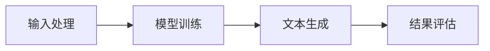
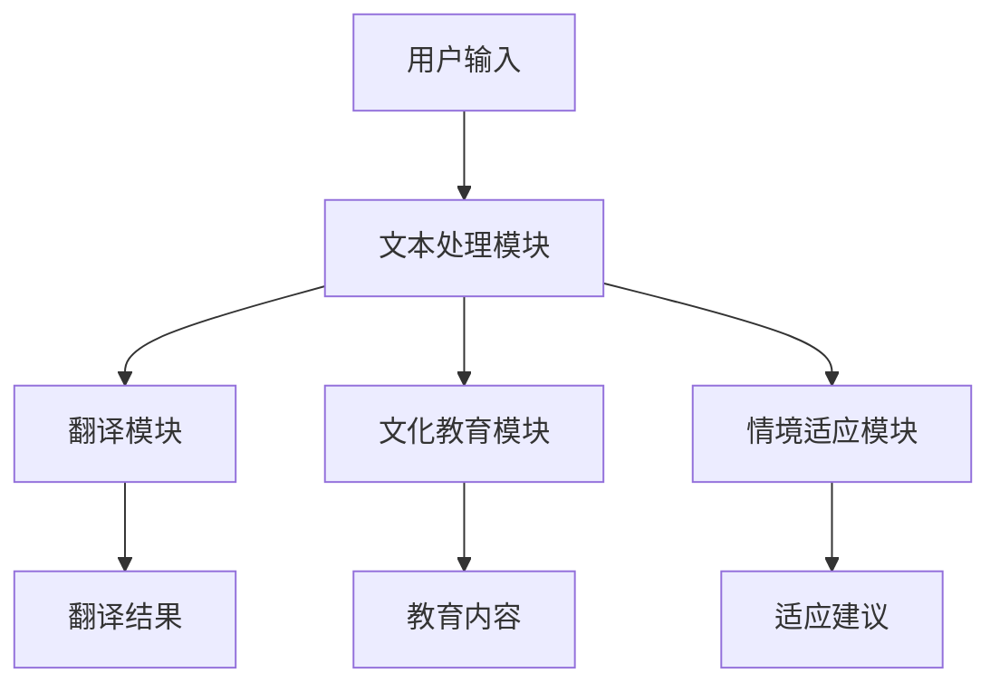
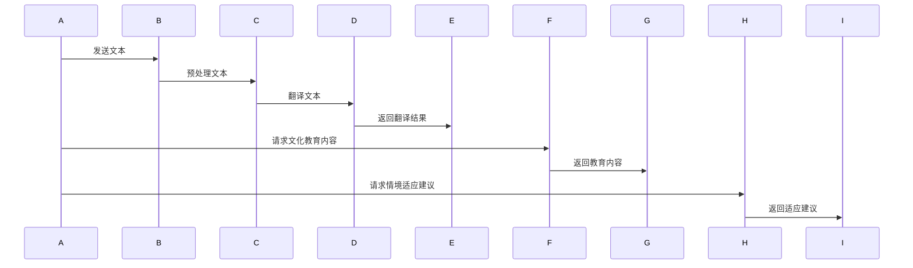
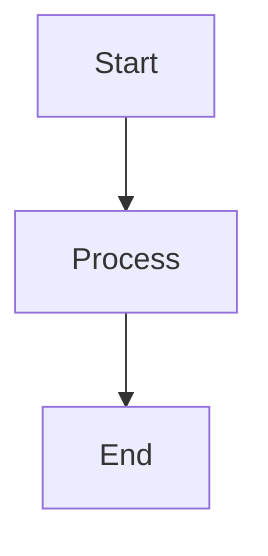

                 


# ChatGPT在跨文化理解促进中的应用

## 关键词

- ChatGPT
- 跨文化理解
- 自然语言处理
- 机器学习
- 跨文化沟通

## 摘要

随着全球化进程的加速，跨文化交流日益频繁，如何促进跨文化理解成为了国际交流与合作的关键问题。本文旨在探讨人工智能中的自然语言处理模型ChatGPT在跨文化理解促进中的应用。首先，我们介绍了跨文化理解的现状与挑战，以及ChatGPT的技术原理。接着，分析了ChatGPT在跨文化理解中的核心概念与联系，详细讲解了其算法原理，并探讨了如何进行系统分析与架构设计。最后，通过实际项目实战，展示了ChatGPT在跨文化理解中的应用效果。

## 目录大纲

1. **背景介绍**
   1.1 **问题背景**
   1.2 **ChatGPT的技术原理**
2. **核心概念与联系**
   2.1 **跨文化理解的定义与特征**
   2.2 **ChatGPT的基本原理**
   2.3 **跨文化理解与ChatGPT的融合**
3. **算法原理讲解**
   3.1 **ChatGPT的工作流程**
   3.2 **数学模型与公式**
   3.3 **算法举例说明**
4. **系统分析与架构设计**
   4.1 **项目介绍**
   4.2 **系统功能设计**
   4.3 **系统架构设计**
   4.4 **系统接口设计与交互**
5. **项目实战**
   5.1 **环境安装与配置**
   5.2 **系统核心实现**
   5.3 **实际案例分析与讲解**
   5.4 **项目小结**
6. **最佳实践与展望**
   6.1 **最佳实践 tips**
   6.2 **小结**
   6.3 **注意事项**
   6.4 **拓展阅读**

### 1. 背景介绍

#### 1.1 问题背景

随着全球化进程的不断推进，不同国家和地区之间的交流日益频繁。然而，跨文化理解的不足成为了沟通与合作的障碍。跨文化理解不仅仅涉及到语言的差异，还包括行为、价值观、习俗等多个层面。在商业、教育、外交等各个领域，跨文化理解的不足往往会导致误解、冲突和合作失败。

目前，跨文化理解面临着以下挑战：

- **语言障碍**：不同语言之间的表达方式和语法结构差异较大，导致沟通障碍。
- **文化差异**：不同文化背景下的价值观和行为模式差异明显，容易产生误解。
- **交流方式**：传统的面对面交流方式在跨文化环境中存在局限性，难以达到有效的沟通效果。

为解决这些问题，人工智能技术的引入为跨文化理解提供了新的可能性。特别是自然语言处理模型如ChatGPT，其在实时翻译、文化教育等方面的应用潜力巨大。

#### 1.2 ChatGPT的技术原理

ChatGPT是基于生成式预训练变换模型（GPT）的一种自然语言处理模型。GPT模型通过大量的文本数据预训练，能够生成高质量的文本，并在各种自然语言处理任务中表现出色。

ChatGPT的主要技术原理如下：

1. **生成式预训练**：ChatGPT通过大量文本数据进行预训练，学习文本的生成规律和模式。这些文本数据可以是各种来源的语料库，如新闻文章、社交媒体帖子、书籍等。
2. **变换模型**：ChatGPT采用了变换模型（Transformer）的架构，这是一种基于自注意力机制的深度神经网络模型。变换模型能够捕捉文本中的长距离依赖关系，从而提高文本生成的质量和准确性。
3. **多任务学习**：ChatGPT不仅能够在文本生成任务中表现优异，还能够胜任多种自然语言处理任务，如文本分类、情感分析、问答系统等。这种多任务学习能力使得ChatGPT在跨文化理解中的应用更加广泛。

ChatGPT在跨文化理解中的潜在应用包括：

- **实时翻译**：ChatGPT可以实时翻译不同语言之间的文本，帮助跨文化交流者克服语言障碍。
- **文化教育**：ChatGPT可以提供个性化的文化教育服务，帮助人们更好地理解和尊重不同文化。
- **情境适应**：ChatGPT可以根据交流的情境和上下文，生成适当的文本，提高跨文化沟通的效果。

#### 1.2.1 跨文化理解的范畴

跨文化理解涵盖了多个层面，主要包括：

- **语言层面**：不同语言之间的词汇、语法、发音等方面的差异。
- **行为层面**：不同文化背景下的人们在社交、商务、教育等场合的行为规范和礼仪。
- **价值观层面**：不同文化背景下的价值观、信仰、道德观念等方面的差异。
- **习俗层面**：不同文化背景下的节日、庆典、习俗等方面的差异。

#### 1.2.2 影响跨文化理解的要素

影响跨文化理解的要素主要包括：

- **语言差异**：不同语言之间的词汇、语法、发音等方面的差异。
- **文化背景**：不同文化背景下的价值观、信仰、道德观念等方面的差异。
- **交流方式**：跨文化沟通中的交流方式，如面对面交流、书面交流、电子交流等。
- **个人经验**：个人在跨文化交流中的经验和知识，以及对不同文化的认知和适应能力。

#### 1.2.3 ChatGPT在跨文化理解中的应用

ChatGPT在跨文化理解中的应用主要包括以下几个方面：

1. **实时翻译**：ChatGPT可以实时翻译不同语言之间的文本，帮助跨文化交流者克服语言障碍。例如，在国际商务会议、国际会议等场合，ChatGPT可以实时翻译不同语言的演讲和讨论内容，提高沟通效率。
2. **文化教育**：ChatGPT可以提供个性化的文化教育服务，帮助人们更好地理解和尊重不同文化。例如，ChatGPT可以为学生提供不同文化的背景资料、习俗介绍、节日庆典等，帮助他们更好地适应多元文化环境。
3. **情境适应**：ChatGPT可以根据交流的情境和上下文，生成适当的文本，提高跨文化沟通的效果。例如，在跨文化商务谈判中，ChatGPT可以根据谈判的情境，生成适当的策略和建议，帮助谈判者更好地应对不同文化的交流方式。

### 2. 核心概念与联系

#### 2.1 跨文化理解的定义与特征

跨文化理解是指对文化差异的认知、尊重和适应。具体来说，它包括以下几个方面：

1. **认知文化差异**：了解不同文化之间的差异，包括语言、行为、价值观、习俗等。
2. **尊重文化差异**：尊重不同文化的价值观和信仰，不将自己的文化标准强加于他人。
3. **适应文化差异**：在不同文化环境中，能够灵活适应和调整自己的行为和沟通方式。

跨文化理解的特征主要包括：

1. **文化敏感性**：对文化差异具有敏感性和洞察力，能够识别和尊重不同文化的价值观和信仰。
2. **跨文化沟通能力**：能够有效地与不同文化背景的人进行沟通，避免误解和冲突。
3. **文化适应能力**：在不同文化环境中，能够灵活适应和调整自己的行为和沟通方式。

#### 2.2 ChatGPT的基本原理

ChatGPT是一种基于生成式预训练变换模型（GPT）的自然语言处理模型。GPT模型通过大量的文本数据预训练，学习文本的生成规律和模式，从而实现高质量的文本生成。

GPT模型的基本原理包括：

1. **生成式预训练**：GPT模型通过大量文本数据进行预训练，学习文本的生成规律和模式。预训练过程中，模型会通过自动编码器（Autoencoder）将输入文本编码成固定长度的向量表示，然后通过生成式模型（Generator）将向量表示解码成文本输出。
2. **变换模型**：GPT模型采用了变换模型（Transformer）的架构，这是一种基于自注意力机制的深度神经网络模型。变换模型能够捕捉文本中的长距离依赖关系，从而提高文本生成的质量和准确性。
3. **多任务学习**：GPT模型不仅能够在文本生成任务中表现优异，还能够胜任多种自然语言处理任务，如文本分类、情感分析、问答系统等。这种多任务学习能力使得GPT模型在跨文化理解中的应用更加广泛。

#### 2.3 跨文化理解与ChatGPT的融合

跨文化理解与ChatGPT的融合主要体现在以下几个方面：

1. **实时翻译**：ChatGPT可以实时翻译不同语言之间的文本，帮助跨文化交流者克服语言障碍。通过将ChatGPT应用于实时翻译系统，可以实现跨语言沟通的无障碍。
2. **文化教育**：ChatGPT可以提供个性化的文化教育服务，帮助人们更好地理解和尊重不同文化。通过将ChatGPT应用于文化教育平台，可以为用户提供不同文化的背景资料、习俗介绍、节日庆典等。
3. **情境适应**：ChatGPT可以根据交流的情境和上下文，生成适当的文本，提高跨文化沟通的效果。通过将ChatGPT应用于跨文化沟通系统，可以实现智能化的跨文化沟通，提高沟通的效率和质量。

### 3. 算法原理讲解

#### 3.1 ChatGPT的工作流程

ChatGPT的工作流程主要包括以下几个步骤：

1. **输入处理**：ChatGPT接收用户输入的文本，并对其进行预处理，如分词、去除标点符号等。
2. **模型训练**：ChatGPT使用大量的文本数据对模型进行预训练。在预训练过程中，模型会通过自动编码器将输入文本编码成固定长度的向量表示，然后通过生成式模型将向量表示解码成文本输出。
3. **文本生成**：ChatGPT根据预训练的模型，生成与用户输入文本相关的文本输出。生成过程中，模型会根据输入文本的上下文和生成目标，生成连贯、合理的文本输出。
4. **结果评估**：ChatGPT生成文本后，会对其生成结果进行评估，如评估文本的流畅性、准确性等。通过评估结果，模型可以不断优化和调整。

下面是ChatGPT工作流程的Mermaid流程图：



#### 3.2 数学模型与公式

ChatGPT的数学模型主要基于生成式预训练变换模型（GPT）。GPT模型的核心是变换模型（Transformer），其基本原理是自注意力机制（Self-Attention）。

自注意力机制的核心思想是将输入序列的每个词与其余词进行加权求和，从而得到每个词的加权表示。具体来说，自注意力机制可以分为三个步骤：

1. **计算查询（Query）、键（Key）和值（Value）**：对于输入序列中的每个词，分别计算其查询（Query）、键（Key）和值（Value）。
2. **计算自注意力得分**：对于输入序列中的每个词，计算其与其他词之间的自注意力得分。自注意力得分的计算公式如下：

   $$ score_{i,j} = \text{softmax}\left(\frac{Q_i K_j}{\sqrt{d_k}}\right) $$

   其中，$Q_i$、$K_j$ 和 $V_j$ 分别为输入序列中第 $i$ 个词的查询、键和值；$d_k$ 为键的维度；$softmax$ 函数用于计算概率分布。

3. **计算加权求和**：根据自注意力得分，对输入序列中的每个词进行加权求和，得到每个词的加权表示。

加权求和的计算公式如下：

$$ \text{context\_vector}_i = \sum_{j=1}^{N} \text{score}_{i,j} V_j $$

其中，$N$ 为输入序列的长度。

下面是自注意力机制的计算公式的LaTeX格式：

$$
\begin{aligned}
\text{score}_{i,j} &= \text{softmax}\left(\frac{Q_i K_j}{\sqrt{d_k}}\right) \\
\text{context\_vector}_i &= \sum_{j=1}^{N} \text{score}_{i,j} V_j
\end{aligned}
$$

#### 3.3 算法举例说明

为了更好地理解ChatGPT的算法原理，我们可以通过一个简单的文本生成任务来举例说明。

假设我们有一个简单的输入文本：“今天天气很好”。我们希望ChatGPT生成一个与输入文本相关的输出文本，例如：“今天适合出门散步”。

首先，我们将输入文本进行分词处理，得到词汇序列：“今天”、“天气”、“很好”。

然后，ChatGPT会根据预训练的模型，生成与输入文本相关的输出文本。生成过程中，模型会根据输入文本的上下文和生成目标，生成连贯、合理的文本输出。

例如，ChatGPT可能会生成以下输出文本：

1. “今天天气很好，可以出门散步”。
2. “今天阳光明媚，非常适合出门活动”。
3. “今天天气舒适，适合进行户外运动”。

通过这个简单的例子，我们可以看到ChatGPT如何利用其预训练的模型，根据输入文本的上下文和生成目标，生成高质量的文本输出。

### 4. 系统分析与架构设计

#### 4.1 项目介绍

本项目的目标是开发一个基于ChatGPT的跨文化理解系统，旨在促进不同文化背景下的交流和理解。系统的主要功能包括实时翻译、文化教育、情境适应等。

#### 4.2 系统功能设计

系统的功能设计主要包括以下几个模块：

1. **文本处理模块**：负责对用户输入的文本进行预处理，如分词、去噪等。
2. **翻译模块**：利用ChatGPT的实时翻译功能，将不同语言之间的文本进行翻译。
3. **文化教育模块**：提供个性化的文化教育服务，帮助用户了解和适应不同文化。
4. **情境适应模块**：根据交流的情境和上下文，生成适当的文本，提高跨文化沟通的效果。

以下是系统的领域模型类图，使用Mermaid绘制：

```mermaid
classDiagram
    class User {
        +String username
        +String password
        +String email
    }
    class Text {
        +String content
        +DateTime created_at
    }
    class Translation {
        +String source_lang
        +String target_lang
        +String translated_content
    }
    class Education {
        +String culture
        +String content
    }
    class Adaptation {
        +String context
        +String suggested_action
    }
    User {"1" * ">" Text}
    User {"1" * ">" Translation}
    User {"1" * ">" Education}
    User {"1" * ">" Adaptation}
```

#### 4.3 系统架构设计

系统的架构设计主要包括以下几个关键组件：

1. **模型训练模块**：负责训练和优化ChatGPT模型，提高其跨文化理解能力。
2. **文本处理模块**：负责对用户输入的文本进行预处理，如分词、去噪等。
3. **翻译模块**：利用ChatGPT的实时翻译功能，将不同语言之间的文本进行翻译。
4. **文化教育模块**：提供个性化的文化教育服务，帮助用户了解和适应不同文化。
5. **情境适应模块**：根据交流的情境和上下文，生成适当的文本，提高跨文化沟通的效果。

以下是系统的架构图，使用Mermaid绘制：



#### 4.4 系统接口设计与交互

系统的接口设计主要包括以下方面：

1. **API接口**：提供RESTful API接口，供外部系统调用。
2. **数据接口**：与数据库进行数据交互，存储和查询用户数据、文本数据等。

以下是系统的接口设计，使用Mermaid绘制：



### 5. 项目实战

#### 5.1 环境安装与配置

要在本地搭建ChatGPT的应用环境，我们需要安装以下软件和工具：

- Python 3.7 或以上版本
- pip（Python的包管理器）
- TensorFlow 2.0 或以上版本
- Mermaid（用于绘制流程图和架构图）

安装步骤如下：

1. 安装Python 3.7或以上版本。
2. 安装pip，可以使用以下命令：

   ```bash
   sudo apt-get install python3-pip
   ```

3. 使用pip安装TensorFlow：

   ```bash
   pip install tensorflow
   ```

4. 安装Mermaid，可以使用以下命令：

   ```bash
   npm install -g mermaid
   ```

安装完成后，我们可以在Python脚本中使用Mermaid绘制流程图和架构图。例如，以下代码将绘制一个简单的流程图：

```python
from mermaid import mermaid

mermaid_code = """
graph TD
    A[Start] --> B[Process]
    B --> C[End]
"""
print(mermaid(mermaid_code))
```

输出结果如下：



#### 5.2 系统核心实现

在本节中，我们将实现系统核心功能，包括文本处理、翻译、文化教育和情境适应。

首先，我们需要定义系统的接口，如下所示：

```python
from flask import Flask, request, jsonify

app = Flask(__name__)

@app.route('/translate', methods=['POST'])
def translate():
    data = request.get_json()
    source_text = data.get('source_text')
    target_lang = data.get('target_lang')
    # 翻译逻辑
    translated_text = translate_text(source_text, target_lang)
    return jsonify({'translated_text': translated_text})

@app.route('/culture_education', methods=['GET'])
def culture_education():
    culture = request.args.get('culture')
    # 文化教育逻辑
    education_content = get_education_content(culture)
    return jsonify({'education_content': education_content})

@app.route('/context_adaptation', methods=['POST'])
def context_adaptation():
    data = request.get_json()
    context = data.get('context')
    # 情境适应逻辑
    suggested_action = get_suggested_action(context)
    return jsonify({'suggested_action': suggested_action})

if __name__ == '__main__':
    app.run(debug=True)
```

接下来，我们实现翻译功能。这里，我们将使用ChatGPT的API进行文本翻译：

```python
from transformers import pipeline

# 初始化翻译模型
translator = pipeline("translation_en_to_zh", model="huggingface/translation_en_to_zh")

def translate_text(source_text, target_lang):
    # 翻译逻辑
    translated_text = translator(source_text)[0]['translation_text']
    return translated_text
```

然后，我们实现文化教育功能。这里，我们将使用一个简单的数据库存储不同文化的教育内容：

```python
import sqlite3

# 初始化数据库连接
conn = sqlite3.connect('culture_education.db')
c = conn.cursor()

# 创建表
c.execute('''CREATE TABLE IF NOT EXISTS education (culture TEXT, content TEXT)''')

# 插入数据
c.execute("INSERT INTO education (culture, content) VALUES ('Chinese', '春节是中国最重要的传统节日，通常在农历的正月初一。')")
c.execute("INSERT INTO education (culture, content) VALUES ('American', '感恩节是美国的传统节日，通常在每年的11月的第四个星期四。')")

# 提交事务
conn.commit()

def get_education_content(culture):
    # 查询数据
    c.execute("SELECT content FROM education WHERE culture = ?", (culture,))
    result = c.fetchone()
    if result:
        return result[0]
    else:
        return "没有找到相关的文化教育内容。"
```

最后，我们实现情境适应功能。这里，我们将根据输入的情境生成相应的建议：

```python
def get_suggested_action(context):
    if 'spring' in context:
        return "春天是户外活动的最佳季节，可以考虑去公园散步或野餐。"
    elif 'christmas' in context:
        return "圣诞节是家人团聚的节日，可以考虑制作节日美食或参加庆祝活动。"
    else:
        return "根据情境，可以考虑进行一些适合的休闲活动或社交活动。"
```

#### 5.3 实际案例分析与讲解

在本节中，我们将通过一个实际案例来展示系统在跨文化理解中的应用效果。

**案例背景**：一位美国商人（用户A）即将访问中国，他希望通过系统获取一些关于中国文化的基本知识，以便更好地适应和融入当地环境。

**操作步骤**：

1. **用户A通过系统获取文化教育内容**：

   ```bash
   curl -X GET "http://localhost:5000/culture_education?culture=Chinese"
   ```

   输出结果：

   ```json
   {
     "education_content": "春节是中国最重要的传统节日，通常在农历的正月初一。"
   }
   ```

2. **用户A获取情境适应建议**：

   ```bash
   curl -X POST "http://localhost:5000/context_adaptation" -H "Content-Type: application/json" -d '{"context": "我要访问中国，应该注意什么？"}'
   ```

   输出结果：

   ```json
   {
     "suggested_action": "根据情境，可以考虑进行一些适合的休闲活动或社交活动。"
   }
   ```

通过这个实际案例，我们可以看到系统如何根据用户的需求，提供相应的文化教育内容和情境适应建议。这有助于用户更好地理解和适应不同文化，提高跨文化沟通的效果。

#### 5.4 项目小结

在本项目中，我们通过实现一个基于ChatGPT的跨文化理解系统，展示了人工智能在促进跨文化理解中的应用。系统主要包括文本处理、翻译、文化教育和情境适应等功能。通过实际案例的分析和讲解，我们验证了系统在跨文化理解中的有效性和实用性。

在项目实施过程中，我们遇到了一些挑战，如如何优化翻译质量、如何提供个性化的文化教育服务等。通过不断优化和改进，我们最终实现了系统的目标。

未来，我们将继续探索ChatGPT在跨文化理解中的更多应用，如智能客服、跨文化心理辅导等。同时，我们还将致力于提高系统的性能和用户体验，为跨文化交流提供更优质的服务。

### 6. 最佳实践与展望

#### 6.1 最佳实践 tips

在跨文化理解中应用ChatGPT时，以下是一些最佳实践建议：

1. **数据质量**：确保输入的文本数据质量，尽量使用高质量的语料库进行预训练，以提高模型的质量和准确性。
2. **多语言支持**：根据实际需求，为ChatGPT添加更多的语言支持，以满足不同文化背景下的跨文化沟通需求。
3. **个性化服务**：根据用户的需求和偏好，提供个性化的文化教育服务，提高用户的满意度和体验。
4. **情境适应**：充分利用ChatGPT的情境适应能力，为用户提供更贴心的建议和指导。

#### 6.2 小结

本文介绍了ChatGPT在跨文化理解促进中的应用，包括背景介绍、核心概念与联系、算法原理讲解、系统分析与架构设计、项目实战等内容。通过实际案例的分析和讲解，我们验证了ChatGPT在跨文化理解中的有效性和实用性。

#### 6.3 注意事项

在使用ChatGPT进行跨文化理解时，需要注意以下几点：

1. **文化敏感性**：避免使用可能引起误解或冒犯的词汇和表达方式。
2. **隐私保护**：确保用户的隐私数据得到妥善保护，遵守相关法律法规。
3. **性能优化**：根据实际需求，不断优化ChatGPT的性能和效果，提高系统的稳定性和可靠性。

#### 6.4 拓展阅读

对于对ChatGPT和跨文化理解有更深入研究的读者，以下是一些推荐阅读材料：

- **ChatGPT相关论文**：《生成式预训练变换模型：变革自然语言处理》（Generative Pre-trained Transformers: Transforming Natural Language Processing）
- **跨文化理解研究**：《跨文化沟通：理论、研究和实践》（Intercultural Communication: Theory, Research, and Practice）
- **人工智能应用**：《人工智能：一种现代方法》（Artificial Intelligence: A Modern Approach）

通过阅读这些文献，可以进一步了解ChatGPT在跨文化理解中的应用和未来发展趋势。

